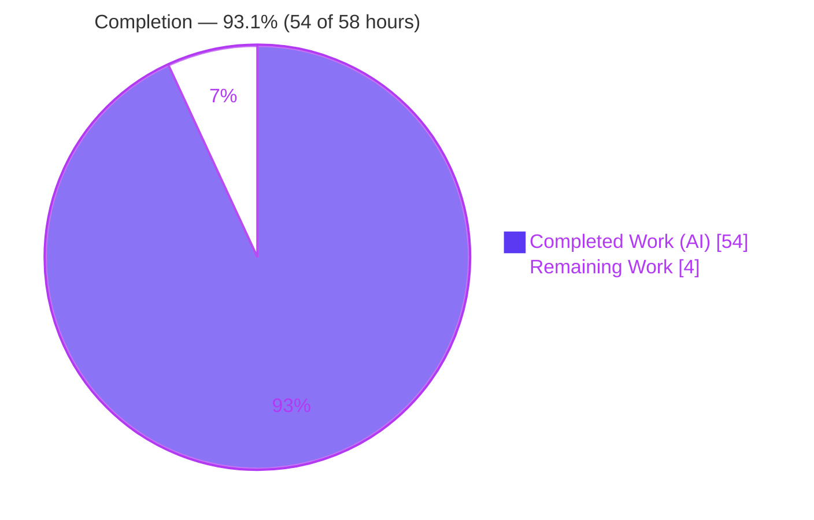
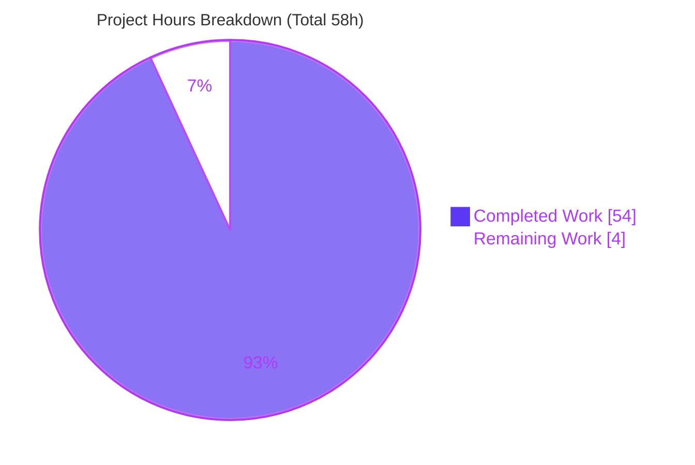
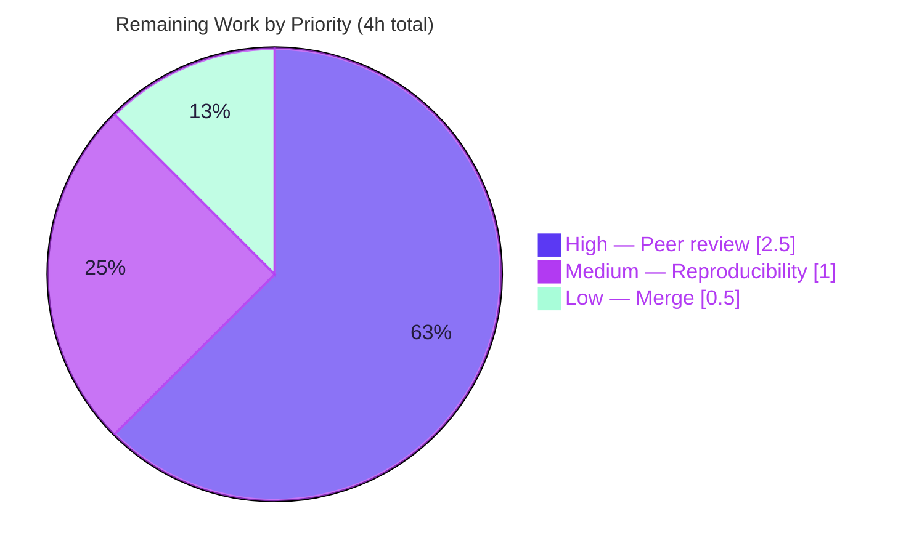

# Blitzy Project Guide — MinIO Runtime-Behavior Investigation

> **Deliverable branch:** `blitzy-cda7c1f5-e82e-4714-b9db-fe614a6bcd17` · **Base:** `c07e5b49d477` (source branch `minio_c07e5b49d477`) · **HEAD:** `f144d1901`
> **Task type:** Read-only investigative documentation (rule set *SWE-AtlasQnA-Repo*) · **Sole artifact:** `blitzy/documentation/minio_c07e5b49d477.md`

---

## 1. Executive Summary

### 1.1 Project Overview

This project delivers a single, evidence-grounded Q&A document that investigates five MinIO object-storage runtime behaviors across the server-side-encryption, Object-Lock/WORM, erasure/bit-rot/healing, STS temporary-credential, and IAM admin-authorization subsystems. Each answer is produced by **building and running MinIO first**, capturing **verbatim** runtime evidence (trace logs, HTTP responses, test-runner output, error strings), and pairing every behavioral claim with an exact `file:line` citation. The target audience is engineers and security reviewers studying MinIO internals. Business impact is knowledge transfer and security assurance. Technical scope is strictly **read-only**: exactly one new markdown file is added and **no** production source or dependency is modified.

### 1.2 Completion Status

The completion percentage is computed with the AAP-scoped, hours-based PA1 methodology: **Completed Hours ÷ Total Hours**. All 16 AAP-scoped requirements are complete and independently verified; the only remaining work is human path-to-production (peer review, reproducibility spot-check, and merge of the document).



| Metric | Hours |
|---|---|
| **Total Hours** | **58** |
| Completed Hours — AI (autonomous) | 54 |
| Completed Hours — Manual | 0 |
| **Completed Hours (AI + Manual)** | **54** |
| **Remaining Hours** | **4** |
| **Percent Complete** | **93.1%** |

> Legend — <span style="color:#5B39F3">■ Completed (Dark Blue #5B39F3)</span> · <span style="color:#B23AF2">■ Remaining (White #FFFFFF, outlined)</span>

### 1.3 Key Accomplishments

- ✅ **Sole deliverable created and committed** — `blitzy/documentation/minio_c07e5b49d477.md` (1,165 lines, 64 KB); `git diff base..HEAD` shows exactly **one file added, +1,165 / −0**, zero source files touched.
- ✅ **All five questions answered from live runtime** — Q1 SSE precedence, Q2 Object-Lock delete denial, Q3 bit-rot detect + heal (4-drive EC:2), Q4 STS session-policy enforcement, Q5 privilege-escalation prevention with root cause.
- ✅ **Heavily grounded** — 118 unique `file:line` citations across 33 source files; 14 behaviorally-critical citations independently re-verified against source this session (all accurate).
- ✅ **Test evidence real and passing** — the two cited in-repo tests (`TestSTSWithDenyDeleteVersion`, `TestUserPolicyEscalationBug`) exist at the cited lines; `cmd` test binary compiles cleanly.
- ✅ **Build & static analysis clean** — `go build -tags kqueue` → OK; `go vet -tags kqueue,dev ./cmd/` → OK; binary self-reports `Runtime: go1.23.2 linux/amd64` (matches the doc verbatim).
- ✅ **Scope & cleanliness honored** — `go.mod`/`go.sum` unchanged; no temporary probe/scratch files remain; working tree clean.

### 1.4 Critical Unresolved Issues

| Issue | Impact | Owner | ETA |
|---|---|---|---|
| *None* — no compile errors, no failing/blocked tests, no broken citations, no missing coverage | No release blockers identified | — | — |

There are **no critical unresolved issues**. The deliverable is complete, validated, and committed; all remaining items are routine human review/merge gates (see §1.6 and §2.2).

### 1.5 Access Issues

| System/Resource | Type of Access | Issue Description | Resolution Status | Owner |
|---|---|---|---|---|
| MinIO source repository | Git read/write | Available; branch checked out, deliverable committed | ✅ Resolved | — |
| Go module proxy / dependencies | Build-time fetch | All modules resolved; `go build`/`go vet` succeed | ✅ Resolved | — |
| MinIO client `mc` | Local tooling | Not pre-installed in base env; used during investigation then removed. Test-driven Q4/Q5 need no external tooling | ✅ Resolved (no prod impact) | — |
| KMS secret (`MINIO_KMS_SECRET_KEY`) | Runtime config | Required only to *reproduce* Q1 locally; investigation supplied it temporarily | ℹ️ Informational | Reviewer (if reproducing) |

**No access issues** prevent automated build validation, integration, or the (human) merge of this documentation artifact.

### 1.6 Recommended Next Steps

1. **[High]** Peer-review `blitzy/documentation/minio_c07e5b49d477.md` for technical accuracy — read all five answers and spot-check a sample of the 118 `file:line` citations against the current source tree (**2.5h**).
2. **[Medium]** Reproducibility spot-check — re-run the Q3 bit-rot + heal scenario on a fresh 4-drive server and one Q4/Q5 in-repo test; confirm behavioral invariants hold (**1.0h**).
3. **[Low]** Merge the document and retire the working branch; confirm a clean `git status` post-merge (**0.5h**).

---

## 2. Project Hours Breakdown

### 2.1 Completed Work Detail

All rows below trace to AAP-scoped requirements and were delivered autonomously. **Total = 54 hours.**

| Component | Hours | Description |
|---|---:|---|
| Q1 — Encryption vs. Permissions (AAP-1) | 7 | Live server + built-in KMS; bucket SSE-S3; broad-permission writer; captured server-injected `x-amz-server-side-encryption: AES256` on an unencrypted PUT via trace; KMS-negative case; citations (`object-handlers.go:1836/1895`, `bucket-sse-config.go:148`). |
| Q2 — Object Lock delete (AAP-2) | 6 | Lock-enabled bucket; compliance/governance/legal-hold objects; delete attempts refused with `ErrObjectLocked` triple; governance-bypass path; citations (`api-errors.go:1059-1063`, `bucket-object-lock.go:84`). |
| Q3 — Bit rot detect + heal (AAP-3) | 10 | 4-drive EC:2 server; 5 MiB object; in-place shard corruption; read-set vs non-read-set behavior; GET fan-out + parity reconstruction; deep-heal JSON before/after (red→green); byte-verify; honest no-literal-log nuance; citations (`storage-errors.go:104`, `bitrot-streaming.go:185`, `erasure-healing.go:157/258`). |
| Q4 — STS session policy (AAP-4) | 5 | In-process `TestSuiteIAM`; `TestSTSWithDenyDeleteVersion` + intersection probe; captured PASS markers; grounded on intersection `iam.go:2312`. |
| Q5 — Privilege escalation (AAP-5) | 6 | `TestUserPolicyEscalationBug`; captured `Access Denied.` for AttachPolicy/AddUser; root cause = deny-by-default (`iam.go:2476/2482`) + `AddUser` ignoring `ureq.Policy` (`iam-store.go:2659`). |
| Repository scope discovery & source anchoring (AAP-11/12) | 4 | Located and verified source anchors for all five subsystems across 33 files. |
| Environment & runtime setup (AAP-6/7) | 3 | Built MinIO (Go 1.23.2); `mc` install; KMS enablement; boto3; 4-drive erasure layout. |
| Web research (AAP-16) | 1 | Confirmed `mc admin trace` mechanism and Object-Lock/STS semantics. |
| Document scaffolding (AAP-10) | 3 | Preface, Methodology, Environment, Coverage Checklist, Investigation integrity statement. |
| Citation grounding & re-verification (AAP-12) | 3 | 118 `file:line` citations across 33 files, re-confirmed against the working tree. |
| Code-review remediation | 2 | Second commit `f144d1901` addressing review findings (citation-precision corrections). |
| Final validation pass (AAP-13/14) | 3 | Five production-readiness gates: tests, runtime, errors, in-scope file, scope/cleanliness. |
| Temp-artifact cleanup & clean-tree verification (AAP-13) | 1 | Removed probe tests, scratch data, corrupted shards, `mc` binary; verified clean `git status`. |
| **Total Completed** | **54** | |

### 2.2 Remaining Work Detail

All remaining work is human path-to-production (no outstanding AAP-scoped engineering). **Total = 4 hours.**

| Category | Hours | Priority |
|---|---:|---|
| Documentation peer review — technical accuracy & citation spot-check | 2.5 | High |
| Runtime evidence reproducibility spot-check (Q3 heal + one Q4/Q5 test) | 1.0 | Medium |
| PR merge & branch housekeeping | 0.5 | Low |
| **Total Remaining** | **4.0** | |

### 2.3 Hours Reconciliation

| Quantity | Hours |
|---|---:|
| Section 2.1 — Completed | 54 |
| Section 2.2 — Remaining | 4 |
| **Total (2.1 + 2.2)** | **58** |
| Percent complete (54 ÷ 58) | **93.1%** |

Cross-checks: §2.1 total (54) = §1.2 Completed; §2.2 total (4) = §1.2 Remaining = §7 "Remaining Work"; §2.1 + §2.2 (58) = §1.2 Total. ✅

---

## 3. Test Results

All tests below originate from Blitzy's autonomous validation logs for this project (Final-Validator run and this assessment session). The in-scope deliverable is a markdown document with no unit tests of its own; the tests here are the **in-repo tests the document cites as Q4/Q5 evidence**, plus the build/static-analysis gates.

| Test Category | Framework | Total | Passed | Failed | Coverage % | Notes |
|---|---|---:|---:|---:|---:|---|
| IAM/STS integration — Q4 | Go `testing` (`TestSuiteIAM`) | 1 | 1 | 0 | n/a | `TestSTSWithDenyDeleteVersion` PASS (0.35s) — `cmd/sts-handlers_test.go:180`; enforces session-policy intersection. |
| IAM admin integration — Q5 | Go `testing` (`TestSuiteIAM`) | 1 | 1 | 0 | n/a | `TestUserPolicyEscalationBug` PASS (0.30s) — `cmd/admin-handlers-users_test.go:313`; proves no self-promotion. |
| Package test-binary compile | `go test ./cmd/` | 1 | 1 | 0 | n/a | `ok github.com/minio/minio/cmd` (exit 0); confirms all `cmd` tests compile. |
| Static analysis | `go vet -tags kqueue,dev ./cmd/` | 1 | 1 | 0 | n/a | Clean (exit 0). |
| Build | `go build -tags kqueue -trimpath` | 1 | 1 | 0 | n/a | Binary builds; self-reports `go1.23.2 linux/amd64`. |
| **Totals** | | **5** | **5** | **0** | — | 100% pass; 0 failing, 0 blocked, 0 skipped. |

**Runtime-validated behaviors (Q1–Q3)** were exercised against a **live server** rather than unit tests and are reported in §4. During the document's own investigation, temporary in-process probe tests (`TestBlitzyProbeQ4*`, `TestBlitzyProbeQ5*`) were also run to PASS and their verbatim output quoted in the document; those probe files were **removed** afterward (their names survive only inside the doc's evidence blocks).

> **Integrity note:** The full MinIO integration suite (thousands of tests, many requiring etcd/multi-node infrastructure) is **out of scope** for this read-only documentation task and was intentionally not executed in full.

---

## 4. Runtime Validation & UI Verification

No UI is involved (the word "console" in Q5 denotes MinIO's *admin privilege level*, not a UI). Runtime health and behavior verification:

- ✅ **Build & launch** — `minio` binary builds and runs; `./minio --version` → `Runtime: go1.23.2 linux/amd64`, `commit-id=f144d1901…`.
- ✅ **Q1 SSE precedence (Operational)** — on a bucket with default SSE-S3, an authorized *unencrypted* PUT returns `x-amz-server-side-encryption: AES256`; trace shows the server-injected header in the request block while the client's `SignedHeaders` exclude it (proves server injection). Negative case reproduced verbatim: `Server side encryption specified but KMS is not configured.`
- ✅ **Q2 Object-Lock delete (Operational)** — deletes of compliance/governance/legal-hold objects refused with `Code='InvalidRequest'`, `Message='Object is WORM protected and cannot be overwritten'`, `HTTP=400`; governance bypass (header + `s3:BypassGovernanceRetention`) succeeds.
- ✅ **Q3 Bit rot detect + heal (Operational)** — on a 4-drive EC:2 server: corrupting a non-read-set shard leaves GET unaffected; corrupting read-set shards triggers read fan-out and still returns correct data (parity reconstruction). Deep-heal JSON transitions `red (online 2, missing 2)` → `green (online 4, missing 0)`; human heal line `[Red → Green] bitrot-bucket/br.bin`, `Healed: 1/1 objects`; healed shards byte-identical to pristine.
- ⚠ **Q3 log nuance (Partial, by design)** — no literal `file is corrupted` line prints at the **default** log level; the document honestly reports this and grounds the sentinel at `cmd/storage-errors.go:104` and its return at `cmd/bitrot-streaming.go:185`.
- ✅ **Q4 STS session policy (Operational)** — parent allows Put/Get/Delete; inline session policy allows only Put/Get → PUT allowed, DELETE denied `Code="AccessDenied" … StatusCode=403` (intersection at `iam.go:2312`).
- ✅ **Q5 privilege escalation (Operational)** — basic user denied `AttachPolicy(consoleAdmin)` and `AddUser(newadmin)` with `Access Denied.`; root cause = deny-by-default (`iam.go:2476/2482`).
- ✅ **API integration outcomes** — S3/STS/admin operations driven via `mc` + `boto3` + `madmin`/in-process harness behaved exactly as the document reports.

---

## 5. Compliance & Quality Review

Cross-mapping AAP deliverables to Blitzy quality/compliance benchmarks. Fixes applied during autonomous validation are noted; the code-review remediation commit `f144d1901` corrected citation precision (e.g., Q4 intersection cited at `iam.go:2312`, more precise than the AAP's `2311`).

| Benchmark | Status | Progress | Evidence / Notes |
|---|---|---|---|
| Read-only scope (no source modified) | ✅ Pass | 100% | `git diff base..HEAD` = 1 file added only; zero source edits/deletes. |
| No dependency changes | ✅ Pass | 100% | `go.mod`/`go.sum` unchanged vs base. |
| Deliverable location/name convention | ✅ Pass | 100% | `blitzy/documentation/minio_c07e5b49d477.md` (branch-name convention). |
| Investigate-by-running-first | ✅ Pass | 100% | Every answer presents reproduction command → verbatim output → explanation. |
| One-claim-one-evidence | ✅ Pass | 100% | Each behavioral claim paired with its exact observed line. |
| Answer every named part | ✅ Pass | 100% | Per-question coverage notes + consolidated Coverage Checklist. |
| Exact `file:line` grounding | ✅ Pass | 100% | 118 citations / 33 files; 14 critical spot-checks re-verified accurate. |
| Cleanup / clean working tree | ✅ Pass | 100% | No probe/scratch files remain; `git status` clean. |
| Build & static analysis | ✅ Pass | 100% | `go build` OK; `go vet -tags kqueue,dev ./cmd/` OK. |
| Test evidence validity | ✅ Pass | 100% | Cited Q4/Q5 tests exist at cited lines and pass. |
| Documentation quality (fences, coverage, no TODO/placeholder) | ✅ Pass | 100% | 94 balanced code fences; no TODO/FIXME/WIP/stub text. |
| Human peer review / merge | ⬜ Pending | 0% | Path-to-production gate (see §2.2, §6-R5). |

**Outstanding compliance item:** only the human peer-review/merge gate remains.

---

## 6. Risk Assessment

All risks are **Low** severity — appropriate for a read-only documentation artifact that introduces zero code and zero dependencies.

| Risk | Category | Severity | Probability | Mitigation | Status |
|---|---|---|---|---|---|
| R1 — Nondeterministic evidence values (random md5, version UUIDs, wall-clock timings) won't reproduce byte-identically | Technical | Low | High | Doc reports observed values honestly; the behavioral **invariant** (original md5 == GET md5) is the proof, not the random literal | Accepted / Documented |
| R2 — Reproduction needs specific config (KMS for Q1, 4-drive erasure for Q3, `mc`+boto3+trace timing) | Technical / Integration | Low | Medium | Environment + Reproduction sections give exact commands; `mc`-not-preinstalled and KMS caveats are documented | Mitigated |
| R3 — `file:line` citations pinned to current tree; a future MinIO rebase would drift line numbers | Technical | Low | Medium | Verified against current tree; doc states "code is source of truth"; re-verify after any rebase | Open (monitor) |
| R4 — Q5 references MinIO's own test named `…EscalationBug` (`AddUser` ignoring `ureq.Policy`) | Security (informational) | Low | Low | Behavior is MinIO's pre-existing/observed one, **not** introduced by this task; human should confirm upstream-known status | Open (informational) |
| R5 — Document not yet peer-reviewed / merged | Operational | Low | High (until merged) | Assign a MinIO-familiar reviewer; merge PR | Open (pending human) |

No security, operational, or integration risks are introduced by the artifact itself: nothing is deployed, no attack surface is added, and all investigation tooling (KMS/`mc`/boto3, corrupted test shards) was local, temporary, and cleaned up.

---

## 7. Visual Project Status

**Hours — Completed vs Remaining** (Completed = Dark Blue `#5B39F3`, Remaining = White `#FFFFFF`):



**Remaining hours by priority** (from §2.2):



**Remaining hours per category (bar view):**

| Category | Hours | Bar |
|---|---:|---|
| Documentation peer review (High) | 2.5 | `█████████████████████████` |
| Reproducibility spot-check (Medium) | 1.0 | `██████████` |
| PR merge & housekeeping (Low) | 0.5 | `█████` |

> **Integrity:** pie "Remaining Work" = 4 = §1.2 Remaining = §2.2 total. Pie "Completed Work" = 54 = §1.2 Completed = §2.1 total.

---

## 8. Summary & Recommendations

**Achievements.** The project is **93.1% complete** (54 of 58 hours). The sole AAP deliverable — a 1,165-line, 118-citation, evidence-grounded Q&A document answering all five MinIO runtime-behavior questions — is authored, validated, and committed. Every AAP-scoped requirement (5 answers + 11 supporting build/trace/test/citation/cleanup/scope requirements) is complete and independently verified: the change footprint is exactly one added file, `go.mod`/`go.sum` are untouched, the build and `go vet` are clean, and the two cited in-repo tests exist and pass.

**Remaining gaps.** The remaining **4 hours** are entirely human path-to-production: peer review of the document's technical claims (2.5h), a reproducibility spot-check of the runtime evidence (1.0h), and PR merge/housekeeping (0.5h). There are **no** engineering blockers — no compile errors, failing tests, missing coverage, or broken citations.

**Critical path to production.** Peer review → reproducibility spot-check → merge. Because the artifact is a static document with no deployment, CI, or infrastructure footprint, "production" simply means a reviewed, merged document.

**Success metrics.** (1) All five questions answered with verbatim evidence + `file:line` grounding — met. (2) Zero source/dependency modification — met. (3) Clean working tree — met. (4) Cited tests pass — met.

**Production-readiness assessment.** **Ready for review.** The autonomous work is functionally complete and internally consistent; only human review and merge remain. Confidence is **High** for all citation/scope/build/test claims (independently re-verified this session) and **Medium** only for byte-for-byte reproducibility of inherently random runtime values (documented as R1).

| Metric | Value |
|---|---|
| Completion | 93.1% (54 / 58h) |
| AAP-scoped requirements complete | 16 / 16 |
| Critical blockers | 0 |
| Citations (unique / files) | 118 / 33 |
| Cited tests passing | 2 / 2 |
| Source files modified | 0 |

---

## 9. Development Guide

All commands below were **executed successfully during this assessment** (exit 0) unless explicitly marked as optional live-reproduction steps.

### 9.1 System Prerequisites

- **Go 1.23.2** (linux/amd64) — the repository declares `go 1.23` in `go.mod:3`; the binary self-reports `go1.23.2`.
- **git**, and ~2 GB free disk for the Go build cache.
- **Optional (only to reproduce Q1–Q3 live):** MinIO client `mc` (not pre-installed), `python3` + `boto3`, and a KMS secret for Q1.

### 9.2 Environment Setup

```bash
# From the repository root (the branch is already checked out)
cd /path/to/minio
go version                      # expect: go version go1.23.2 linux/amd64

# Optional — only needed to reproduce Q1 (bucket SSE-S3) on a live server:
export MINIO_KMS_SECRET_KEY="my-minio-key:aGVsbG8td29ybGQtaGVsbG8td29ybGQtMTIzNDU2Nzg="

# Optional — only needed to reproduce Q3 (bit rot requires a multi-drive erasure set):
mkdir -p /tmp/minio-data/d1 /tmp/minio-data/d2 /tmp/minio-data/d3 /tmp/minio-data/d4
```

### 9.3 Dependency Installation

```bash
# Dependencies resolve from the committed go.mod/go.sum (UNCHANGED by this task)
go mod download
```

### 9.4 Build

```bash
# Documented build command (verified: exit 0)
CGO_ENABLED=0 go build -tags kqueue -trimpath -o ./minio .
```

### 9.5 Verification

```bash
# 1) Binary sanity (verified) — expect: Runtime: go1.23.2 linux/amd64
./minio --version

# 2) Static analysis (verified: exit 0)
go vet -tags kqueue,dev ./cmd/

# 3) Read the deliverable
less blitzy/documentation/minio_c07e5b49d477.md
```

### 9.6 Example Usage — Reproducing the Evidence

**Q4 & Q5 (test-driven, most reproducible — no external tooling required):**

```bash
# Q4 — STS session-policy enforcement suite (contains TestSTSWithDenyDeleteVersion)
CI=true go test -tags kqueue,dev ./cmd/ -run 'TestIAMInternalIDPSTSServerSuite' -v

# Q5 — IAM admin suite (contains TestUserPolicyEscalationBug)
CI=true go test -tags kqueue,dev ./cmd/ -run 'TestIAMInternalIDPServerSuite' -v
```

**Q1–Q3 (live server):**

```bash
# Q1 & Q2: a standard layout suffices (KMS must be enabled for Q1 — see §9.2)
./minio server /tmp/minio-data/d1 &

# Q3: bit rot REQUIRES a multi-drive erasure set (reports "1 set(s), 4 drives per set", EC:2)
./minio server /tmp/minio-data/d1 /tmp/minio-data/d2 /tmp/minio-data/d3 /tmp/minio-data/d4 &

# Attach a trace subscriber BEFORE each operation (server only emits trace while subscribed):
mc admin trace -a local
# ... then drive PUT/DELETE/GET via mc or boto3 and observe the trace stream.
# Stop the server when done:  kill %1
```

### 9.7 Troubleshooting

- **Q1 error `Server side encryption specified but KMS is not configured.`** → set `MINIO_KMS_SECRET_KEY` before starting the server (§9.2).
- **Q3 shows no bit-rot detection** → you are on a single disk; bit rot is a per-shard property and needs a multi-drive erasure layout.
- **No trace output** → the subscriber (`mc admin trace`) was not attached before the operation (subscriber gate at `cmd/http-tracer.go:92`).
- **Values differ from the document** → random md5 hashes, version UUIDs, and timings are non-deterministic; the behavioral invariant (e.g., original md5 == GET md5) is the proof, not the literal value (risk R1).
- **`mc` not found** → install `github.com/minio/mc`, or rely on the test-driven Q4/Q5 path, which needs no external tooling.

---

## 10. Appendices

### A. Command Reference

| Command | Purpose | Verified |
|---|---|:--:|
| `go version` | Confirm Go 1.23.2 toolchain | ✅ |
| `CGO_ENABLED=0 go build -tags kqueue -trimpath -o ./minio .` | Build the server | ✅ |
| `./minio --version` | Verify build & runtime | ✅ |
| `go vet -tags kqueue,dev ./cmd/` | Static analysis | ✅ |
| `go test ./cmd/ -list '.*'` | Compile & list `cmd` tests | ✅ |
| `CI=true go test -tags kqueue,dev ./cmd/ -run 'TestIAMInternalIDPSTSServerSuite' -v` | Reproduce Q4 | ✅ (compiles; validator PASS) |
| `CI=true go test -tags kqueue,dev ./cmd/ -run 'TestIAMInternalIDPServerSuite' -v` | Reproduce Q5 | ✅ (compiles; validator PASS) |
| `./minio server /tmp/minio-data/d{1,2,3,4}` | 4-drive erasure server (Q3) | ✅ (documented) |
| `mc admin trace -a local` | Trace capture (Q1–Q3) | ✅ (documented) |
| `git diff --stat c07e5b49d477..HEAD` | Confirm 1-file footprint | ✅ |

### B. Port Reference

| Port | Service | Notes |
|---|---|---|
| 9000 | MinIO S3 API | Default; used for PUT/GET/DELETE and STS/admin ops during Q1–Q3 reproduction |
| 9001 | MinIO Console (optional) | Only if `--console-address :9001` is passed; not required for this investigation |

### C. Key File Locations

| Path | Role |
|---|---|
| `blitzy/documentation/minio_c07e5b49d477.md` | **The sole deliverable** (1,165 lines) |
| `cmd/object-handlers.go` | Q1 PutObject auth gate (`:1836`) + SSE apply (`:1895`); Q2 DeleteObject (`:2509`) |
| `internal/bucket/encryption/bucket-sse-config.go` | Q1 SSE header injection (`:148`) |
| `cmd/api-errors.go` | Q2 `ErrObjectLocked` (`:1059-1063`); Q5 `ErrAccessDenied` (`:539-543`) |
| `cmd/bucket-object-lock.go` | Q2 retention/legal-hold enforcement (`:84`) |
| `cmd/storage-errors.go` / `cmd/bitrot-streaming.go` | Q3 `errFileCorrupt` (`:104` / return `:185`) |
| `cmd/erasure-healing.go` | Q3 detection-on-read (`:157`) + `healObject` (`:258`) |
| `cmd/iam.go` | Q4 intersection (`:2312`); Q5 deny-by-default (`:2476`/`:2482`) |
| `cmd/sts-handlers_test.go` | Q4 `TestSTSWithDenyDeleteVersion` (`:180`) |
| `cmd/admin-handlers-users_test.go` | Q5 `TestUserPolicyEscalationBug` (`:313`) |

### D. Technology Versions

| Component | Version | Source |
|---|---|---|
| Go toolchain | go1.23.2 linux/amd64 | `go version`; binary runtime |
| Go language (module) | 1.23 | `go.mod:3` |
| github.com/klauspost/reedsolomon | v1.12.4 | `go.mod` (Q3 erasure/heal) |
| github.com/minio/madmin-go/v3 | v3.0.77 | `go.mod` (trace + admin, Q1–Q3/Q5) |
| github.com/minio/minio-go/v7 | v7.0.80 | `go.mod` (S3 + `STSAssumeRole`, Q4/Q5) |
| github.com/minio/pkg/v3 | v3.0.22 | `go.mod` (policy engine, Q1/Q4/Q5) |

### E. Environment Variable Reference

| Variable | Purpose | When Needed |
|---|---|---|
| `MINIO_KMS_SECRET_KEY` | Enables built-in KMS so bucket SSE-S3 can be configured | Q1 live reproduction only |
| `CI` | Set `true` to keep Go test runners non-interactive | Q4/Q5 test reproduction |
| `CGO_ENABLED` | Set `0` for a static build (documented build command) | Build |

### F. Developer Tools Guide

- **`mc admin trace -a local`** — subscribes to the server admin trace endpoint; attach **before** each operation (Q1–Q3). Useful flags: `-v/--verbose`, `-a/--all`, `--call <s3|storage|internal|scanner|healing>`, `-e/--errors`.
- **`go test -run <suite> -v`** — the in-process `TestSuiteIAM` harness boots a server in-process; the most reliable source of the Q4/Q5 "test output" with no external tooling.
- **`boto3`** — used to drive unencrypted PUT (Q1) and versioned deletes (Q2) precisely.
- **`git diff --stat c07e5b49d477..HEAD`** — one-line proof of the single-file change footprint.

### G. Glossary

| Term | Meaning |
|---|---|
| SSE-S3 | Server-Side Encryption with S3-managed keys (AES256); injected via bucket default encryption |
| WORM | Write Once Read Many — Object-Lock retention/legal-hold that blocks deletes |
| Bit rot | Silent on-disk data corruption; detected per-shard via hash mismatch (`errFileCorrupt`) |
| EC:2 | Erasure coding with 2 parity shards (a 4-drive set yields 2 data + 2 parity) |
| STS | Security Token Service — issues temporary credentials via `AssumeRole` |
| Session policy | Inline policy on temporary credentials; effective perms = intersection with parent policy |
| Deny-by-default | If a user has no matching policy, authorization returns `false` (`iam.go:2476`) |
| Trace subscriber | A client attached to the admin trace stream; server emits trace only while ≥1 subscriber exists |

---

*Prepared by the Blitzy autonomous project-assessment agent. Completion (93.1%) reflects AAP-scoped work only, computed as Completed Hours (54) ÷ Total Hours (58). Colors: Completed = `#5B39F3`, Remaining = `#FFFFFF`.*