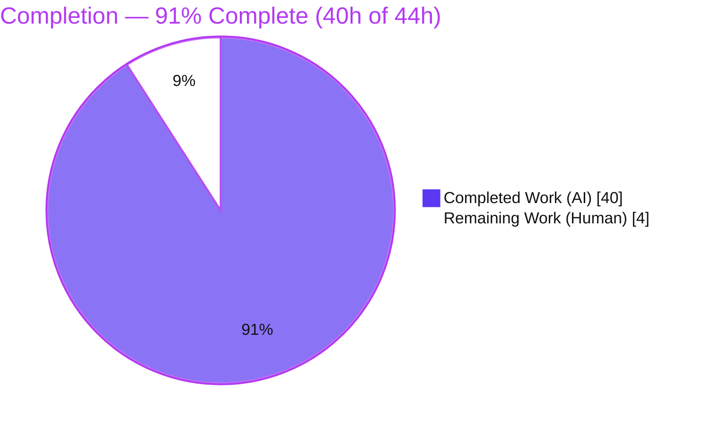
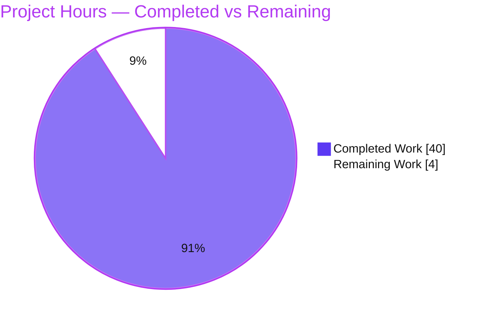
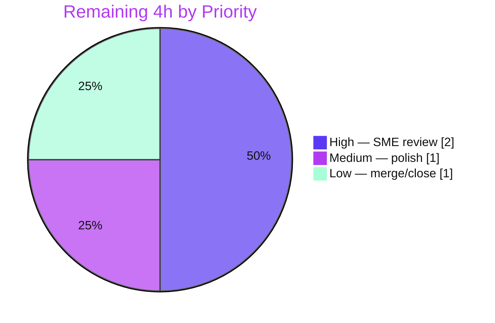

# Blitzy Project Guide — MinIO Single-Node Onboarding Q&A (Run-First, Evidence-Grounded)

> **Brand color legend:** Completed / AI Work = **Dark Blue `#5B39F3`** · Remaining / Not Completed = **White `#FFFFFF`** · Headings / Accents = **Violet-Black `#B23AF2`** · Highlight = **Mint `#A8FDD9`**.

---

## 1. Executive Summary

### 1.1 Project Overview

This project delivers a single, evidence-grounded onboarding document that demonstrates end-to-end how a freshly initialized single-node local **MinIO** object-storage server behaves as a small S3-compatible store. Following a strict **run-first** methodology, the MinIO Go server was actually compiled and run in Single-Node Single-Drive (SNSD) mode, and a real AWS Signature V4 client drove the complete "first-bucket" workflow (create → upload ×2 → list → download). Every HTTP status, header, response body, authorization outcome, on-disk artifact, and restart-persistence result was captured verbatim and grounded in exact `file:line` source citations. The audience is developers onboarding to MinIO's S3 API. The sole repository artifact is one Markdown document; **zero source files were modified**.

### 1.2 Completion Status



| Metric | Value |
|--------|-------|
| **Total Hours** | **44h** |
| **Completed Hours (AI + Manual)** | **40h** (AI: 40h · Manual: 0h) |
| **Remaining Hours** | **4h** |
| **Percent Complete** | **91%**  (40 / 44 = 90.9% ≈ 91%) |

> Completion is computed strictly on AAP-scoped work plus path-to-production (PA1 methodology). All 14 AAP requirements are **Completed**; the remaining 4h is the path-to-production human review/merge gate. Per policy, completion is capped below 100% until human sign-off occurs.

### 1.3 Key Accomplishments

- ✅ **Ran the real server, not just the source.** Compiled MinIO (`CGO_ENABLED=0 go build`) with Go **1.23.12** and launched it in SNSD mode against an empty data directory; captured the verbatim 12-line cold-start banner including `INFO: Formatting 1st pool, 1 set(s), 1 drives per set.`
- ✅ **Complete first-bucket flow captured verbatim** — PutBucket, GetBucketLocation, PutObject ×2, ListObjectsV2, GetObject, HeadObject — each with exact HTTP status, full header set, and response-body shape (128-byte location XML; 650-byte list XML; MD5-verified ETags).
- ✅ **Authorization matrix proven** — valid SigV4 → `200`; wrong secret → `403 SignatureDoesNotMatch`; anonymous → `403 AccessDenied`; missing key GET → `404 NoSuchKey`; missing key HEAD → `404` via `x-minio-error-code`/`x-minio-error-desc` headers.
- ✅ **Honest logging finding documented** — the console logs **zero** successful requests; per-request timestamped visibility comes from the admin trace stream `GET /minio/admin/v3/trace` (captured `s3.PutObject`/`s3.GetObject` events with `http.request.time`/`http.response.time`/`dur`).
- ✅ **On-disk storage proven** — `.minio.sys` system tree, per-object `xl.meta` (461/472 B) with the `XL2 ` magic, inline data (no `part.*` files), and `format.json` = `xl-single` + `SIPMOD+PARITY`.
- ✅ **Persistence across restart proven** — restart against the same path omits the `Formatting …` line; post-restart `ListObjectsV2` returns `KeyCount=2` with identical ETags/bodies.
- ✅ **46/46 `file:line` citations verified** against HEAD; ~25 independently re-verified during this assessment.
- ✅ **Read-only constraint fully honored** — `git status --porcelain` empty; exactly one file added (the deliverable); temporary scripts removed.

### 1.4 Critical Unresolved Issues

| Issue | Impact | Owner | ETA |
|-------|--------|-------|-----|
| _None._ All 14 AAP requirements are complete; the Final Validator reports **no unresolved issues** (compilation clean, 46/46 citations pass, runtime re-verified, tree clean). | No release blockers | — | — |

> The only outstanding activity is the standard human review/merge gate (Section 1.6, Section 2.2) — a path-to-production step, not an unresolved defect.

### 1.5 Access Issues

| System/Resource | Type of Access | Issue Description | Resolution Status | Owner |
|-----------------|----------------|-------------------|-------------------|-------|
| _No access issues identified._ | — | Build (Go 1.23.12), run (SNSD), SigV4 client (boto3/botocore/requests), admin trace, health probe, and git commit all succeeded autonomously. No repository permissions, service credentials, or third-party API access blocked validation. | N/A | — |

### 1.6 Recommended Next Steps

1. **[High]** Perform an SME/peer technical review of the 559-line onboarding document: read end-to-end, spot-check a sample of the 46 `file:line` citations against HEAD, and sanity-check the six "honest findings." *(2h)*
2. **[Medium]** Incorporate any reviewer feedback and apply minor editorial polish; optionally add a short "reproduce with your own environment-specific values" callout for boot-specific literals. *(1h)*
3. **[Low]** Merge the deliverable to the target branch, verify Markdown/mermaid rendering in the intended docs viewer, and close the PR. *(1h)*

---

## 2. Project Hours Breakdown

### 2.1 Completed Work Detail

| Component | Hours | Description |
|-----------|------:|-------------|
| Toolchain setup & MinIO build | 3 | Install Go 1.23.12; `CGO_ENABLED=0 go build`; prepare empty data dir; verify binary token `DEVELOPMENT.GOGET (go1.23.12 linux/amd64)`. *(AAP: build / SQ1)* |
| SNSD server run & cold-start capture | 2 | Launch `minio server <path>` in SNSD mode; capture verbatim banner + `Formatting …` line; health probe `200`. *(SQ1)* |
| SigV4 client harness | 3 | Build boto3/botocore SigV4 client + raw `requests` capture scripts (path-style, `us-east-1`). *(AAP: methodology)* |
| First-bucket flow execution & HTTP capture | 6 | Drive PutBucket, GetBucketLocation, PutObject ×2, ListObjectsV2, GetObject, HeadObject; capture status/headers/body; MD5-verify ETags; decompose 128-byte & 650-byte XML. *(SQ2–SQ6)* |
| Authorization matrix | 3 | Exercise valid / wrong-secret / anonymous / missing-key (GET+HEAD); capture exact error XML + headers; map to `cmd/api-errors.go`. *(SQ7)* |
| Request-processing & logging investigation | 4 | Document console honest finding; stream admin trace (with admin-auth gotcha); capture/interpret trace JSON; author mermaid lifecycle. *(SQ8)* |
| On-disk artifact inspection | 3 | Inspect `.minio.sys` tree, per-object `xl.meta`, `XL2 ` magic (`od`), inline-data (`grep`), `part.*` absence, `format.json`. *(SQ9)* |
| Persistence-across-restart cycle | 2 | Stop/restart against same path; prove `Formatting …` absent; re-verify list/get with identical ETags. *(SQ10)* |
| Citation grounding & verification | 4 | Locate & verify ~46 `file:line` citations across ~25 source files against HEAD `c07e5b49d477…`. *(cross-cutting)* |
| Document authoring | 6 | Write the 559-line runbook: structure, prose, per-section rationale, coverage-pass table (§8), six honest findings, read-only compliance. *(SQ1–SQ10 + methodology)* |
| Validation & review cycle | 4 | Build verification, full runtime re-exercise, 46/46 citation audit, resolve 7 review findings, fix 1 citation drift, cleanup, commit. *(validation)* |
| **Total Completed** | **40** | |

### 2.2 Remaining Work Detail

| Category | Hours | Priority |
|----------|------:|----------|
| Human SME / peer technical review & sign-off of the onboarding document | 2 | High |
| Incorporate reviewer feedback / minor editorial polish | 1 | Medium |
| Merge deliverable to target branch, verify rendering, close PR | 1 | Low |
| **Total Remaining** | **4** | |

> **Cross-section integrity:** Completed **40h** (2.1) + Remaining **4h** (2.2) = **44h** Total (1.2). Remaining **4h** is identical in Sections 1.2, 2.2, and 7.

---

## 3. Test Results

All entries below originate exclusively from **Blitzy's autonomous validation logs** for this project. Because the deliverable is a Markdown document, there is **no application source code and therefore no code-coverage metric**; the acceptance criterion for a run-first documentation task is the evidence check — every documented literal confirmed against a live server, plus a full citation audit and a clean compilation.

| Test Category | Framework / Method | Total | Passed | Failed | Coverage % | Notes |
|---------------|--------------------|------:|-------:|-------:|-----------:|-------|
| Citation Verification | Custom `file:line` audit vs HEAD `c07e5b49d477…` | 46 | 46 | 0 | N/A | Every locator resolves to its claimed identifier/literal; one drift (`setup-type.go:44`→`:44-45`) fixed & re-verified |
| Runtime — First-Bucket Flow | Compiled MinIO + boto3/botocore SigV4 + raw `requests` | 7 | 7 | 0 | N/A | PutBucket 200, GetBucketLocation 200 (128 B), PutObject×2 200 (ETags MD5-verified), ListObjectsV2 200 (650 B, KeyCount=2), GetObject 200, HeadObject 200 |
| Runtime — Authorization Matrix | SigV4 client (valid / invalid / anonymous) | 5 | 5 | 0 | N/A | 200 / 403 `SignatureDoesNotMatch` / 403 `AccessDenied` / 404 `NoSuchKey` (GET) / 404 headers (HEAD) |
| Runtime — Admin Trace + Delete | Admin SigV4 trace stream (`GET /minio/admin/v3/trace?s3=true`) | 2 | 2 | 0 | N/A | Trace 200 with `s3.PutObject`/`s3.GetObject` events; cleanup `DELETE` → 204 |
| Runtime — On-Disk Artifacts | Filesystem inspection (`ls` / `od` / `grep` / `find`) | 1 | 1 | 0 | N/A | `.minio.sys` tree, `xl.meta` (461/472 B), `XL2 ` magic, inline data, 0 `part.*`, `format.json` = `xl-single` |
| Runtime — Persistence (restart) | Server restart + re-verification | 1 | 1 | 0 | N/A | `Formatting …` absent on restart (grep: cold=1, restart=0); `KeyCount=2`; identical ETags/bodies |
| Compilation | `CGO_ENABLED=0 go build -tags kqueue ./...` | 1 | 1 | 0 | N/A | Whole codebase, 0 errors |
| Dependency Verification | `go mod verify` | 1 | 1 | 0 | N/A | All modules verified; `go.mod`/`go.sum` untouched |
| **Totals** | | **64** | **64** | **0** | **N/A** | **100% pass rate** |

---

## 4. Runtime Validation & UI Verification

Runtime health and API-integration outcomes (from live execution of the compiled server). This project has **no UI scope** — the embedded MinIO Console is explicitly out of scope; the deliverable is an S3-API Q&A document.

**Server & Health**
- ✅ **Operational** — Cold start in SNSD mode; drive formatted; 12-line banner emitted; version `DEVELOPMENT.GOGET (go1.23.12 linux/amd64)`.
- ✅ **Operational** — Health probe `GET /minio/health/live` → **HTTP 200**.

**S3 API Integration (first-bucket flow)**
- ✅ **Operational** — `PUT /first-bucket` → `200`, `Location: /first-bucket`.
- ✅ **Operational** — `GET /first-bucket?location=` → `200`, 128-byte `LocationConstraint` body.
- ✅ **Operational** — `PUT /first-bucket/hello.txt` (22 B) → `200`, ETag `054f37f6cabac59036470309dac20068`.
- ✅ **Operational** — `PUT /first-bucket/data/info.json` (27 B) → `200`, ETag `a459844dc66a1fe204c6b12e3cecf84e`.
- ✅ **Operational** — `GET /first-bucket?list-type=2` → `200`, `KeyCount=2`, `IsTruncated=false`.
- ✅ **Operational** — `GET /first-bucket/hello.txt` → `200`, `text/plain`, `Content-Length: 22`.
- ✅ **Operational** — `HEAD /first-bucket/hello.txt` → `200`, identical headers, no body.

**Authorization**
- ✅ **Operational** — Valid SigV4 → `200`; wrong secret → `403 SignatureDoesNotMatch`; anonymous → `403 AccessDenied`; missing key → `404 NoSuchKey` (GET body / HEAD headers).

**Observability**
- ✅ **Operational** — Admin trace stream authenticated and returned `200`; per-request events captured.
- ⚠ **Partial (by design)** — Default console emits **no** per-request log lines (documented honest finding, not a defect); use trace/audit for per-request visibility.

**Storage & Persistence**
- ✅ **Operational** — On-disk `.minio.sys` + per-object `xl.meta` confirmed; data inlined.
- ✅ **Operational** — Full stop/restart cycle preserved bucket and both objects with identical ETags.

**UI Verification**
- ❌ **Not Applicable** — No UI in scope (embedded Console explicitly excluded per AAP §0.3.2).

---

## 5. Compliance & Quality Review

Cross-mapping of AAP deliverables and governing rules ("SWE-AtlasQnA-Repo") to Blitzy quality/compliance benchmarks. Fixes applied during autonomous validation are noted.

| Benchmark / Rule | Requirement | Status | Progress | Notes / Fixes Applied |
|------------------|-------------|--------|:--------:|-----------------------|
| Single named deliverable | Create `blitzy/documentation/minio_c07e5b49d477.md` | ✅ Pass | 100% | Exactly one file added; correct name/location |
| Run-first methodology | Build & run before writing; capture real output | ✅ Pass | 100% | Server compiled & run; all evidence captured live |
| Verbatim evidence | Quote actual output (logs, HTTP, sizes, ETags, errors) | ✅ Pass | 100% | Banner, headers, XML bodies, ETags, trace JSON all verbatim |
| Answer every sub-question | Decompose & answer SQ1–SQ10 + coverage pass | ✅ Pass | 100% | §8 SQ1–SQ10 checklist all "Addressed" |
| Exact grounding | Cite exact literals with `file:line` | ✅ Pass | 100% | 46/46 citations verified; 1 drift fixed (`setup-type.go:44`→`:44-45`) |
| Provide rationale | Explain the "why" per answer | ✅ Pass | 100% | Every section has a "Why (rationale)" block |
| Read-only scope | No source edits; remove temp scripts | ✅ Pass | 100% | `git status --porcelain` empty; 0 source files changed |
| Honest findings | Flag unverifiable/environment-specific values | ✅ Pass | 100% | 6 honest findings (console logging, ETag transparency, rate-limit, CRC32, GET-vs-POST trace, TTY-gated creds) |
| Compilation quality | Code compiles cleanly | ✅ Pass | 100% | `go build ./...` = 0 errors |
| Dependency hygiene | No manifest changes | ✅ Pass | 100% | `go.mod`/`go.sum` untouched; `go mod verify` all-verified |
| Commit hygiene | Attributable, isolated commit(s) | ✅ Pass | 100% | 3 commits by `agent@blitzy.com`; net +559/-0, one file |

**Outstanding compliance items:** None. All benchmarks pass. The only remaining activity is the human review/merge gate (Section 2.2).

---

## 6. Risk Assessment

All risks are **Low** severity — this is a read-only documentation task with no source/dependency changes, no compilation errors, and no failing tests.

| Risk | Category | Severity | Probability | Mitigation | Status |
|------|----------|:--------:|:-----------:|------------|--------|
| Environment/boot-specific values differ on reproduction (`X-RateLimit-Limit=1155550`, `X-Amz-Request-Id`, `format.json` UUIDs, timestamps, host IPs) | Technical | Low | Medium | Doc explicitly flags each; deterministic values (ETags, sizes, error codes, XML byte-lengths, `XL2 ` magic) are reproducible | Mitigated (documented) |
| Citation line-number drift if MinIO source is later modified on-branch | Technical | Low | Low | 46 citations pinned to HEAD `c07e5b49d477…`; one drift already caught & fixed | Mitigated |
| Default credentials (`minioadmin`/`minioadmin`) documented — misuse outside local dev | Security | Low | Low | Scoped to default LOCAL setup; surfaces MinIO's own WARN + `MINIO_ROOT_USER`/`MINIO_ROOT_PASSWORD` override | Mitigated / Informational |
| Documentation staleness vs future MinIO releases | Operational | Low | Medium | Pinned to exact commit + version token; explicitly a point-in-time snapshot | Accepted (documented) |
| Reproduction requires specific toolchain/SigV4 client (client-driven headers vary, e.g. `x-amz-checksum-crc32`) | Integration | Low | Medium | Doc specifies exact Go/boto3/botocore/requests versions; client-driven CRC32 attributed & proven | Mitigated |
| Deliverable not wired into a docs-site / CI rendering pipeline | Integration | Low | Low | Standard portable Markdown (incl. mermaid); human merge/integration is a remaining step | Open (minor) |

**Security posture:** Zero source/dependency changes ⇒ zero new attack surface. No dependency, injection, or vulnerability risk introduced.

---

## 7. Visual Project Status

**Project hours breakdown** (Completed = Dark Blue `#5B39F3`, Remaining = White `#FFFFFF`):



**Remaining work by priority** (hours from Section 2.2; total = 4h):



> **Integrity check:** "Remaining Work" = **4h** here equals Remaining Hours in Section 1.2 and the sum of the Section 2.2 Hours column. "Completed Work" = **40h** equals Completed Hours in Section 1.2 and the Section 2.1 total.

---

## 8. Summary & Recommendations

**Achievements.** The project fully satisfies its Agent Action Plan: a rigorous, run-first onboarding document that answers all ten sub-questions (SQ1–SQ10) plus methodology, each backed by verbatim runtime evidence and exact `file:line` citations. The MinIO server was compiled and run, the complete first-bucket flow exercised, authorization and persistence proven, and on-disk storage inspected — with a clean, read-only repository footprint (one file added, 559 insertions, zero source changes).

**Completion.** The project is **91% complete** (40 of 44 hours). All 14 AAP requirements are Completed; the remaining **4h** is the standard path-to-production human review/merge gate, not outstanding engineering defects.

**Remaining gaps & critical path to production.**
1. SME/peer technical review & sign-off (2h, High).
2. Incorporate feedback / editorial polish (1h, Medium).
3. Merge, verify rendering, close PR (1h, Low).

**Success metrics (all met).** 46/46 citations verified · 64/64 autonomous checks passed · compilation clean · runtime end-to-end validated · git tree clean.

**Production readiness assessment.** **Ready for human review.** The deliverable is accurate, complete, structurally sound, and committed. There are no blockers, no access issues, and only Low-severity, well-mitigated documentation risks. Recommendation: proceed directly to SME review and merge.

| Metric | Value |
|--------|-------|
| AAP requirements complete | 14 / 14 |
| Completion (AAP-scoped) | 91% |
| Autonomous checks passed | 64 / 64 (100%) |
| Citations verified | 46 / 46 |
| Source files changed | 0 |
| Release blockers | 0 |

---

## 9. Development Guide

This guide covers **(A)** accessing/reviewing the deliverable and **(B)** reproducing the run-first investigation to re-verify the evidence. All commands were tested on the validation host.

### 9.1 System Prerequisites

- **OS:** Linux or macOS (validated on Linux `amd64`).
- **Go toolchain:** **1.23.x** (validated with `go1.23.12`) — satisfies `go.mod` (`go 1.23`).
- **Python:** 3.x with a SigV4-capable S3 client — **boto3 1.43.37**, **botocore 1.43.37**, **requests 2.34.2**.
- **curl** (validated `8.14.1`) for health/header checks.
- An **empty** data directory dedicated to MinIO, located **outside** the repository working tree.

### 9.2 Environment Setup

```bash
# 1) Enter the repository (destination branch already checked out)
cd /path/to/minio            # repo root

# 2) Ensure the Go toolchain is on PATH (host-specific; example)
source /etc/profile.d/go.sh 2>/dev/null || true
go version                   # expect: go version go1.23.12 linux/amd64

# 3) Create an EMPTY data directory OUTSIDE the repo (keeps the tree read-only clean)
mkdir -p /tmp/minio-run/data

# 4) (Optional) credentials & reproducible rate-limit header
export MINIO_ROOT_USER=minioadmin           # default if unset
export MINIO_ROOT_PASSWORD=minioadmin       # default if unset
export MINIO_API_REQUESTS_MAX=1155550       # pins X-RateLimit-Limit for a stable header value
```

### 9.3 Dependency Installation

```bash
# Go modules (no manifest changes; just fetch & verify)
go mod download
go mod verify                # expect: all modules verified

# Python SigV4 client (use a virtualenv to stay clean)
python3 -m venv /tmp/minio-venv
source /tmp/minio-venv/bin/activate
pip install boto3==1.43.37 botocore==1.43.37 requests==2.34.2
```

### 9.4 Build & Run

```bash
# Build a self-contained binary OUTSIDE the repo working tree
CGO_ENABLED=0 go build -o /tmp/minio-run/minio .
# (mirrors Makefile:177-179: CGO_ENABLED=0 go build -tags kqueue -trimpath --ldflags "$(LDFLAGS)" -o $(PWD)/minio)

# Run in Single-Node Single-Drive (SNSD) mode against the EMPTY data dir
/tmp/minio-run/minio server /tmp/minio-run/data \
    --address ":9000" --console-address ":9001"
# First boot prints: INFO: Formatting 1st pool, 1 set(s), 1 drives per set.
```

### 9.5 Verification

```bash
# Health probe (server is live)
curl -I http://127.0.0.1:9000/minio/health/live      # expect: HTTP/1.1 200 OK

# Drive the first-bucket flow with the SigV4 client
python3 - <<'PY'
import boto3
from botocore.config import Config
s3 = boto3.client("s3", endpoint_url="http://127.0.0.1:9000",
                  aws_access_key_id="minioadmin", aws_secret_access_key="minioadmin",
                  region_name="us-east-1",
                  config=Config(signature_version="s3v4", s3={"addressing_style": "path"}))
s3.create_bucket(Bucket="first-bucket")
s3.put_object(Bucket="first-bucket", Key="hello.txt",
              Body=b"hello from object one\n", ContentType="text/plain")
s3.put_object(Bucket="first-bucket", Key="data/info.json",
              Body=b'{"greeting": "object two"}\n', ContentType="application/json")
print("list:", [o["Key"] for o in s3.list_objects_v2(Bucket="first-bucket")["Contents"]])
print("get :", s3.get_object(Bucket="first-bucket", Key="hello.txt")["Body"].read())
PY

# Inspect on-disk artifacts
ls -la /tmp/minio-run/data
find /tmp/minio-run/data/first-bucket | sort           # object dirs each contain xl.meta
cat /tmp/minio-run/data/.minio.sys/format.json         # "format":"xl-single"

# Prove persistence: stop by numeric PID, then restart against the SAME data path
kill <server-pid>
/tmp/minio-run/minio server /tmp/minio-run/data --address ":9000" --console-address ":9001"
# The "Formatting ..." line is ABSENT on restart; objects remain (KeyCount=2)
```

### 9.6 Example Usage — Per-Request Trace Logs

The default console does **not** log successful requests. For per-request, timestamped visibility, stream the admin trace endpoint (the mechanism behind `mc admin trace`):

```bash
# With the MinIO client (mc):
mc alias set local http://127.0.0.1:9000 minioadmin minioadmin
mc admin trace --verbose local          # shows s3.PutObject / s3.GetObject with request/response times
```

### 9.7 Reviewing the Deliverable

```bash
# The single project artifact (render with any Markdown viewer; mermaid diagram included)
wc -l blitzy/documentation/minio_c07e5b49d477.md      # 559 lines
git status --porcelain                                # empty => read-only constraint honored
git log --oneline c07e5b49d477..HEAD                  # 3 commits, all agent@blitzy.com
```

### 9.8 Troubleshooting

- **`403 SignatureDoesNotMatch` / `AccessDenied`:** the S3 API requires AWS SigV4 — use a signing client (boto3/`mc`/AWS CLI), never plain `curl` for S3 operations.
- **Server won't format / behaves oddly on first run:** the data directory must be **empty** (no hidden/system files) before the first boot.
- **No per-request lines in the console:** expected — MinIO logs only the banner + warnings/errors; use the admin **trace** stream or an audit target.
- **Header/UUID/timestamp values differ from the document:** these are environment/boot-specific (`X-Amz-Request-Id`, `format.json` UUIDs, `X-RateLimit-Limit`, timestamps, host IPs). Deterministic values (ETags, sizes, error codes) will match.
- **Keeping the repo clean:** always place the binary, data dir, and any scripts **outside** the repository working tree.

---

## 10. Appendices

### Appendix A — Command Reference

| Purpose | Command |
|---------|---------|
| Go version | `go version` |
| Build MinIO | `CGO_ENABLED=0 go build -o /tmp/minio-run/minio .` |
| Verify modules | `go mod verify` |
| Run (SNSD) | `/tmp/minio-run/minio server /tmp/minio-run/data --address ":9000" --console-address ":9001"` |
| Health check | `curl -I http://127.0.0.1:9000/minio/health/live` |
| Trace logs | `mc admin trace --verbose local` |
| Read-only proof | `git status --porcelain` |
| Commit history | `git log --oneline c07e5b49d477..HEAD` |

### Appendix B — Port Reference

| Port | Purpose | Flag |
|-----:|---------|------|
| 9000 | S3 API endpoint | `--address ":9000"` |
| 9001 | Embedded Console (out of scope) | `--console-address ":9001"` |

### Appendix C — Key File Locations

| Path | Role |
|------|------|
| `blitzy/documentation/minio_c07e5b49d477.md` | **The deliverable** (only repo addition) |
| `main.go` | Entry point → `minio.Main(os.Args)` (`:30`) |
| `cmd/prepare-storage.go` | Cold-start `Formatting …` log (`:194`) |
| `cmd/server-startup-msg.go` | Startup banner (API `:123`, WebUI `:134`, Docs `:147`; TTY gate `:124-126`) |
| `cmd/bucket-handlers.go` | GetBucketLocation `:204`, PutBucket `:723` |
| `cmd/bucket-listobjects-handlers.go` | ListObjectsV2 `:154` |
| `cmd/object-handlers.go` | GetObject `:715`, HeadObject `:1009`, PutObject `:1745` |
| `cmd/auth-handler.go` / `cmd/signature-v4.go` | SigV4 verify (`:547` / `:347`) |
| `cmd/api-errors.go` | Error enums `:86` / `:149` / `:156` |
| `cmd/xl-storage.go` | `smallFileThreshold` `:59`, `xl.meta` `:68` |
| `cmd/object-api-utils.go` | `.minio.sys` `:60` |
| `cmd/admin-router.go` / `cmd/admin-handlers.go` | Trace route `:410` / handler `:2032` |
| `internal/auth/credentials.go` | Default creds `:90-91` |

### Appendix D — Technology Versions

| Component | Version |
|-----------|---------|
| Go toolchain | 1.23.12 (`go.mod`: `go 1.23`) |
| MinIO build token | `DEVELOPMENT.GOGET (go1.23.12 linux/amd64)` |
| boto3 / botocore | 1.43.37 / 1.43.37 |
| requests | 2.34.2 |
| curl | 8.14.1 |
| Backend format | `xl-single` (`ErasureSDSetupType`, `SIPMOD+PARITY`) |
| Base commit | `c07e5b49d477b0774f23db3b290745aef8c01bd2` |

### Appendix E — Environment Variable Reference

| Variable | Default | Purpose |
|----------|---------|---------|
| `MINIO_ROOT_USER` | `minioadmin` | Root access key |
| `MINIO_ROOT_PASSWORD` | `minioadmin` | Root secret key |
| `MINIO_API_REQUESTS_MAX` | (memory-derived) | Pins `X-RateLimit-Limit` (e.g. `1155550`) for a reproducible header |

### Appendix F — Developer Tools Guide

| Tool | Use |
|------|-----|
| `go build` / `go mod verify` | Compile & verify the server |
| boto3 / botocore | SigV4-signing S3 client for the flow |
| `requests` | Raw HTTP capture (exact headers/body bytes) |
| `mc admin trace` | Per-request timestamped trace events |
| `od` / `grep` / `find` | On-disk artifact inspection (`xl.meta`, inline data) |
| `curl` | Health probe & raw header inspection |

### Appendix G — Glossary

| Term | Meaning |
|------|---------|
| **SNSD** | Single-Node Single-Drive — the canonical local MinIO topology |
| **ErasureSDSetupType** | The single-drive erasure backend initialized by SNSD |
| **xl-single** | The on-disk `format.json` format string for the single-drive backend |
| **`xl.meta`** | Per-object versioned metadata file (begins with `XL2 ` magic); small objects are inlined here |
| **`.minio.sys`** | Reserved system bucket holding format/config/buckets metadata |
| **SigV4** | AWS Signature Version 4 — required auth for the S3 API |
| **Inline data** | Objects below the 128 KiB `smallFileThreshold` are stored inside `xl.meta` (no `part.*` file) |
| **Admin trace** | `GET /minio/admin/v3/trace` stream providing per-request timestamped events |