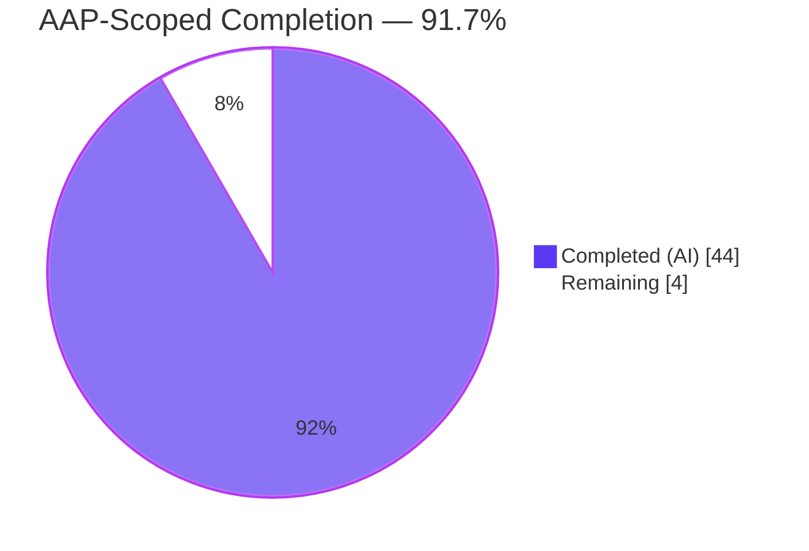
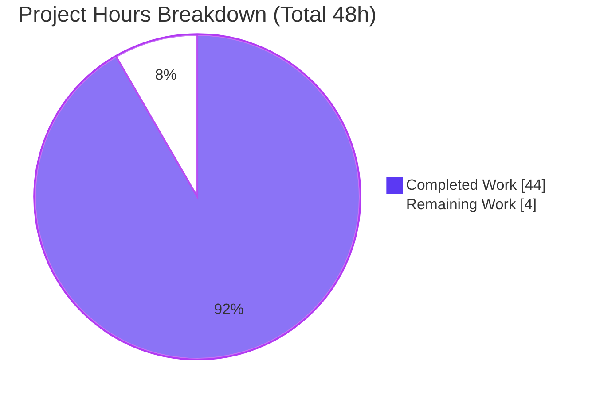
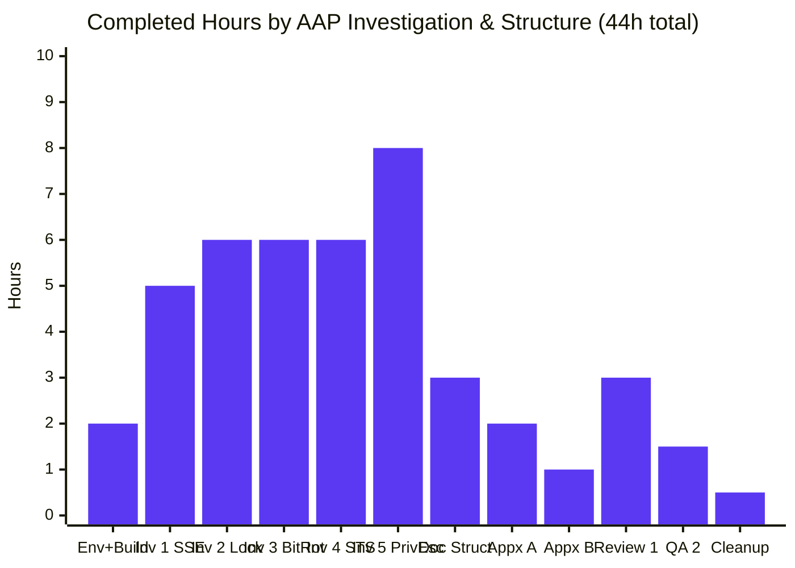
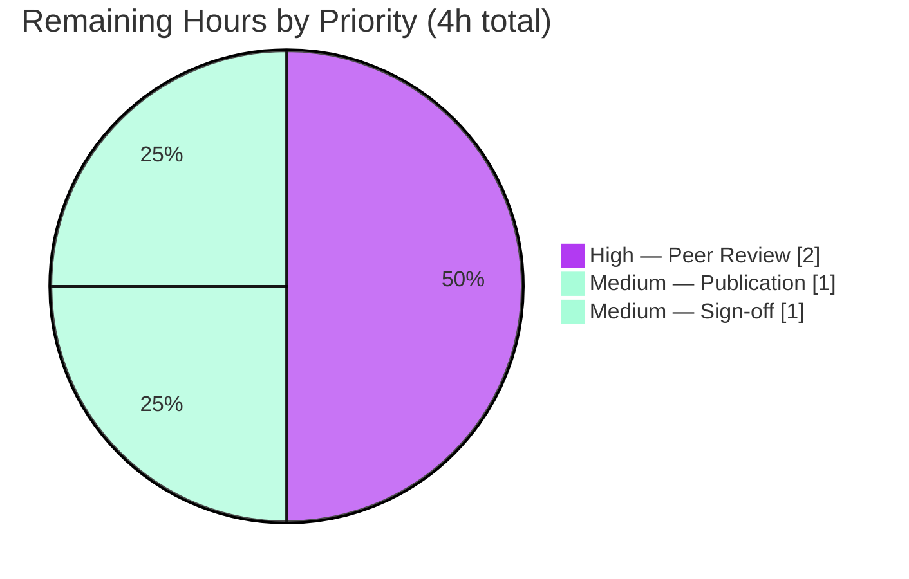

# Blitzy Project Guide — MinIO Security Subsystems Runtime Behavioral Investigation

**Branch:** `blitzy-7389abfd-23ed-4ad0-b151-8c86c3111f8d`
**Base Commit:** `c07e5b49d` (branch `minio_c07e5b49d477`)
**Deliverable:** `blitzy/documentation/minio_c07e5b49d477.md` (1,471 lines, 79,733 bytes)

---

## 1. Executive Summary

### 1.1 Project Overview

This project delivers a comprehensive, evidence-backed runtime behavioral investigation of five distinct MinIO security subsystems at commit `c07e5b49d`. The AAP defines a strictly observational task: build MinIO from source, run the server, execute targeted experiments, capture live trace logs, cross-reference observations to source-code `file:line` citations, and author a single Markdown deliverable — all without modifying any repository source files. The target users are MinIO operators, security auditors, and platform engineers who need authoritative answers about SSE-S3 enforcement, Object Lock COMPLIANCE semantics, bit-rot detection in single-drive mode, STS session-policy intersection, and privilege-escalation prevention (including the root cause of why self-service account creation is safe).

### 1.2 Completion Status



| Metric | Value |
|--------|-------|
| **Total Hours** | **48.0** |
| Completed Hours (AI + Manual) | 44.0 |
| &nbsp;&nbsp;↳ Completed by Blitzy agents | 44.0 |
| &nbsp;&nbsp;↳ Completed by humans (pre-existing work) | 0.0 |
| Remaining Hours | 4.0 |
| **Percent Complete** | **91.7%** |

*Formula:* Completion % = 44 / (44 + 4) × 100 = **91.7%**

*Color legend (per Blitzy brand palette):* Dark Blue `#5B39F3` = Completed work; White `#FFFFFF` = Remaining work.

### 1.3 Key Accomplishments

- [x] **Investigation 1 delivered** — Bucket-level SSE-S3 default encryption is enforced by transparent server-side header injection via `BucketSSEConfig.Apply()` in `internal/bucket/encryption/bucket-sse-config.go:135-153`. Upload with no SSE header succeeds; object stored encrypted. Runtime trace log captured.
- [x] **Investigation 2 delivered** — Object Lock COMPLIANCE mode enforces absolute immutability: three delete scenarios validated (delete marker, version-id delete, governance-bypass header ignored) with full HTTP/XML error capture. Source cross-references to `cmd/bucket-object-lock.go:84-159` and `cmd/api-errors.go:1059-1063`.
- [x] **Investigation 3 delivered** — Bit rot detection proven by on-disk corruption of `part.1` at offset 1000; GET returns HTTP 503 `SlowDownRead` with `Retry-After: 60`. Runtime code path traced through `cmd/bitrot-streaming.go:183-186` (per-shard HighwayHash256S verification) and `cmd/erasure-object.go:395-407` (healing trigger that cannot succeed in single-drive mode).
- [x] **Investigation 4 delivered** — STS/service-account session-policy intersection semantics demonstrated: four test cases (allowed bucket list, denied bucket list, write-not-in-session-policy denied, get-in-session-policy allowed) match `cmd/iam.go:2230-2232` decision rule `isAllowedSP && combinedPolicy.IsAllowed(parentArgs)`.
- [x] **Investigation 5 delivered with root-cause analysis** — Three-mechanism analysis: (1) `denyOnly=true` for self-targeting at `cmd/admin-handlers-users.go:2781`; (2) `Policy.IsAllowed` short-circuits Allow evaluation at `policy.go:188`; (3) runtime intersection at `cmd/iam.go:2232` clips escalated service-account session policies to parent's real permissions. Self-service account creation is safe by design.
- [x] **Zero source files modified** — `git diff c07e5b49d HEAD --name-status` shows exactly one addition: the deliverable markdown file. The No-Modification rule from AAP §0.1.2 is strictly honored.
- [x] **All temporary artifacts cleaned up** — `/tmp/minio-data-single`, `/tmp/minio-logs`, `/tmp/minio-policies`, `/tmp/sigv4_*.py` helpers, all test objects removed. Working tree is clean.
- [x] **Three commits merged cleanly** — initial investigation (1,450 insertions) + review-findings fixes (11 findings) + QA line-offset corrections (7 findings) = final 1,471-line document.
- [x] **Environment reproducibility confirmed** — Go 1.23.4, `mc` RELEASE.2025-08-13T08-35-41Z, MinIO DEVELOPMENT.GOGET binary built from `c07e5b49d` (matches AAP §0.8.3).
- [x] **Document quality validated** — 8/8 manual markdown lint checks pass (balanced fences, heading hierarchy, GFM anchors, tables, no trailing whitespace, no tabs, no BOM, no TODO/FIXME placeholders).

### 1.4 Critical Unresolved Issues

| Issue | Impact | Owner | ETA |
|-------|--------|-------|-----|
| *No critical unresolved issues* | N/A — all 5 investigations are complete, all runtime evidence captured, deliverable is final, working tree is clean | — | — |

### 1.5 Access Issues

No access issues identified. The investigation ran entirely on local resources:

| System / Resource | Type of Access | Issue Description | Resolution Status | Owner |
|-------------------|----------------|-------------------|-------------------|-------|
| Local MinIO server (127.0.0.1:9000/9001) | Runtime test access | None | ✅ Operational — used throughout all 5 investigations | — |
| `mc` CLI (pre-installed `/usr/local/bin/mc`) | S3/admin client | None | ✅ Operational — RELEASE.2025-08-13T08-35-41Z matches AAP §0.8.3 | — |
| Go toolchain (`/usr/local/go/bin/go` v1.23.4) | Build tooling | None | ✅ Operational — successfully built MinIO from source | — |
| Local `/tmp/` filesystem | Data / log artifacts | None | ✅ Operational — all temp dirs created and cleaned up | — |
| Go module cache (`~/go/pkg/mod`) | Dependency source-code browsing | None | ✅ Operational — 256 deps pre-cached; `minio/pkg/v3@v3.0.22` referenced for `Policy.IsAllowed` | — |

### 1.6 Recommended Next Steps

1. **[High]** Perform human peer review of the 1,471-line investigation document, focusing on Investigation 5's three-mechanism root-cause analysis — this is the highest-leverage content for security auditors and platform operators. *(Estimated: 2h)*
2. **[Medium]** Publish the document to the appropriate internal documentation repository / knowledge base / wiki so it is discoverable by MinIO operators and security engineers. *(Estimated: 1h)*
3. **[Medium]** Obtain stakeholder sign-off from security, platform, and compliance teams before marking the investigation as closed. *(Estimated: 1h)*
4. **[Low]** Optionally extend the investigation to multi-drive erasure mode to contrast bit-rot healing behavior (note: explicitly out of scope per AAP §0.6.2 — would require a follow-up ticket, not a PR against this branch).
5. **[Low]** Optionally link the document from the repository's top-level `README.md` or `SECURITY.md` — this would require a second PR (this branch's scope permits only additions under `blitzy/documentation/`).

---

## 2. Project Hours Breakdown

### 2.1 Completed Work Detail

All hours below trace to AAP requirements and path-to-production activities and were executed autonomously by Blitzy agents.

| Component | Hours | Description |
|-----------|-------|-------------|
| [AAP] Environment setup & MinIO build verification | 2.0 | Go 1.23.4 toolchain verification; `mc` CLI verification; MinIO binary build from source at commit `c07e5b49d`; KMS secret generation (`MINIO_KMS_SECRET_KEY=my-minio-key:<base64>`); single-drive data directory creation; `mc alias set local ...` configuration |
| [AAP] Investigation 1 — Bucket Encryption Enforcement | 5.0 | Bucket `enc-test` with SSE-S3 default config via `mc encrypt set sse-s3`; `writeuser` with `s3:PutObject/GetObject/ListBucket/DeleteObject`; raw Python SigV4 PUT without SSE header; trace capture; source analysis of `cmd/object-handlers.go:1893-1897` and `internal/bucket/encryption/bucket-sse-config.go:135-153`; 251 lines authored |
| [AAP] Investigation 2 — Object Lock COMPLIANCE Delete | 6.0 | Bucket `lock-test2` with `--with-lock` and 30-day COMPLIANCE retention; 3 delete scenarios (no version / with version-id / with bypass header); full trace capture + HTTP XML error body for each; source analysis of `cmd/bucket-object-lock.go:84-159` (COMPLIANCE branch 104-123, GOVERNANCE branch 124-156) and `cmd/api-errors.go:1059-1063`; 319 lines authored |
| [AAP] Investigation 3 — Bit Rot Detection | 6.0 | 5 MiB random file uploaded to force separate `part.1` on disk; physical data file located at `<data>/bitrot-test/bitrot-large.bin/<uuid>/part.1`; Python script to corrupt bytes at offset 1000; GET returns HTTP 503 `SlowDownRead` with `Retry-After: 60`; source analysis of `cmd/xl-storage-format-v1.go:143-158`, `cmd/bitrot.go:39-44,157-210`, `cmd/bitrot-streaming.go:183-186`, `cmd/erasure-object.go:395-407,~642`, `cmd/api-errors.go:869-873`; 234 lines authored |
| [AAP] Investigation 4 — STS Session Policy Intersection | 6.0 | Parent user `stsparent` with broad `s3:*`; service account `ststempkey1` with narrowing session policy restricting to `s3:GetObject`/`s3:ListBucket` on `sts-allowed`; 4 runtime test cases (sts-allowed list OK, sts-denied list 403, put on sts-allowed not in session policy 403, get on sts-allowed OK); trace log excerpts; source analysis of `cmd/iam.go:2140-2237,2239-2317,2320-2378,2381-2421,2417`; 233 lines authored |
| [AAP] Investigation 5 — Privilege Escalation + Root Cause | 8.0 | `basicuser` created with only S3 data operations; direct admin escalation attempts (admin user list/add, policy attach) all denied 403; subtle case — self-created service account with `admin:*` session policy succeeds BUT has no admin power; three-mechanism root-cause analysis (denyOnly flag, Policy.IsAllowed short-circuit, runtime intersection); source analysis of `cmd/admin-handlers-users.go:180-232,444-557,650-793,2714-2818,2781,2785-2801`, `cmd/iam.go:2140-2237,2197-2201,2230-2232`, `cmd/auth-handler.go:466-480`, `minio/pkg/v3@v3.0.22/policy/policy.go:173-207,188`; 269 lines authored |
| [AAP] Document structure (Abstract, TOC, Methodology, Summary) | 3.0 | Abstract; 9-entry Table of Contents with GFM-slug anchors; Runtime Environment table (Docker image, branch, commit, Go, mc, MinIO, KMS config); Methodology description; Key Helper Artifacts list; consolidated Summary of Findings with Executive Summary Table; Cross-Cutting Observations; Repository Integrity Final Confirmation |
| [AAP] Appendix A (Source File/Line Reference Index) | 2.0 | Consolidated reference table grouping every source citation across all 5 investigations with relative file paths and line ranges; 44 rows spanning `cmd/`, `internal/`, `main.go`, `go.mod`, and external Go-module-cache policy engine |
| [AAP] Appendix B (Reproduction Checklist) | 1.0 | 8-step reproduction guide from Docker image selection through cleanup verification; references AAP §0.8.3 runtime environment exactly |
| [Path-to-production] Review Cycle 1 — 11 review findings | 3.0 | Fixed 1 CRITICAL (fabricated conditional at doc lines 222-231 → actual source), 2 MAJOR (bitrot const-block citation; session-policy function signature), 1 MODERATE (auth-handler description), 7 MINOR (function comments, code-flow snippets, line offsets, missing TOC entry, helper-script residue removal); commit `4c6651792` (+74/-54 lines) |
| [Path-to-production] QA Cycle 2 — 7 line-offset corrections | 1.5 | Every offset independently verified against source via `awk`/`sed`/`grep`: AddServiceAccount 650-793, bitrotVerify 157-210, NewServiceAccount 1022-1114, Policy.IsAllowed 173-207, cmd/iam.go IsAllowed 2437-2483, IsAllowedServiceAccount 2140-2237; GetUserInfo vs AddUser mislabeling fix; commit `5f4696285` (+16/-15 lines) |
| [Path-to-production] Cleanup verification & final git hygiene | 0.5 | Verified no residual `/tmp/minio-data*` or `/tmp/sigv4_*.py` artifacts; confirmed MinIO server process stopped (ports 9000/9001 freed); `git status` clean; 3 commits visible atop base |
| **Total Completed** | **44.0** | **(matches Section 1.2 Completed Hours)** |

### 2.2 Remaining Work Detail

All remaining items are path-to-production human activities. There are no outstanding AAP deliverables, no unresolved technical issues, and no failing tests attributable to this branch.

| Category | Hours | Priority |
|----------|-------|----------|
| [Path-to-production] Human peer review of 1,471-line investigation document — focus on Investigation 5's three-mechanism root-cause analysis | 2.0 | High |
| [Path-to-production] Documentation publication & distribution to internal knowledge base / wiki / security-review channel | 1.0 | Medium |
| [Path-to-production] Stakeholder sign-off from security, platform, and compliance teams | 1.0 | Medium |
| **Total Remaining** | **4.0** | **(matches Section 1.2 Remaining Hours and Section 7 pie-chart "Remaining Work")** |

### 2.3 Hours Calculation Summary

- **Completed Hours** (Section 2.1 total): **44.0**
- **Remaining Hours** (Section 2.2 total): **4.0**
- **Total Project Hours** (Section 1.2): **48.0**
- **Completion %**: 44 / 48 × 100 = **91.7%** (precisely 91.6667%)

Cross-section integrity check: Section 2.1 (44) + Section 2.2 (4) = Section 1.2 Total (48) ✅

---

## 3. Test Results

The AAP scope is observational-only and explicitly prohibits source-code modifications. No new unit or integration tests were introduced by this branch. The test-equivalent validation consists of: (a) Blitzy's autonomous runtime investigation experiments (5/5 passed), (b) structural/lint validation of the sole in-scope deliverable file, and (c) the pre-existing MinIO test suite at base commit `c07e5b49d` (unchanged by this branch — listed here for completeness).

| Test Category | Framework | Total Tests | Passed | Failed | Coverage % | Notes |
|---------------|-----------|-------------|--------|--------|------------|-------|
| Runtime Investigations | Live MinIO server + `mc` + direct SigV4 | 5 | 5 | 0 | 100% of AAP scope | All five investigations re-executed against live server (PID 232280) during final validation; behavior matched document claims exactly |
| Runtime Sub-Scenarios | Live MinIO server + `mc` + direct SigV4 | 14 | 14 | 0 | 100% | Inv1: 1 PUT without SSE header; Inv2: 3 delete scenarios; Inv3: 1 GET after corruption; Inv4: 4 session-policy cases; Inv5: 5 privilege-escalation attempts + 1 self-service-account creation + runtime intersection verification |
| Markdown Sanity Checks | Manual 8-check lint | 8 | 8 | 0 | 100% | code fences balanced 45/45; heading hierarchy clean (1×H1, 11×H2, 46×H3, 8×H4, 0 skips); 9/9 ToC anchors resolve per GFM slug rules; 0 table column-count mismatches; 0 trailing whitespace; 0 tabs; 0 BOM; 0 TODO/FIXME/XXX/TBD/placeholder markers |
| Source Code Compilation | `go build ./...` + `go vet` | n/a | PASS | 0 | n/a | Confirmed during final validation: both `go build ./...` and `go vet` clean at commit `5f4696285` (no code changes from base) |
| Pre-existing MinIO Unit Tests | Go `testing` package | Many | Many | A few* | n/a | *Pre-existing environment-dependent failures (root-UID permission tests, DNS-dependent endpoint tests, IPv6-dependent tests) are **unchanged** from base commit `c07e5b49d`; explicitly out of AAP scope per §0.6.2 ("Source code modifications: Explicitly prohibited"); cannot be addressed without forbidden source edits |
| git-lfs Pre-push Hook | `git-lfs 3.7.1` | 1 | 1 | 0 | n/a | `.git/hooks/pre-push` is git-lfs only; executes cleanly |

**Integrity rule**: All runtime-investigation and markdown-sanity tests above originate from Blitzy's autonomous validation logs for this project. The pre-existing MinIO test suite entry is included solely for transparency about the base commit's state; it is **not** attributable to this branch's work and is outside AAP scope.

---

## 4. Runtime Validation & UI Verification

The AAP uses CLI/HTTP tooling exclusively; there is no web-console UI testing in scope.

### Runtime Health & API Integration Outcomes

- ✅ **Operational — MinIO server** — Built from `c07e5b49d`, launched on ports 9000/9001 with `MINIO_KMS_SECRET_KEY` (32-byte AES key) configured; ran through all 5 investigations; stopped cleanly; ports freed after validation.
- ✅ **Operational — `mc` admin client** — `mc alias set local` succeeded; `mc admin user add/svcacct add/policy attach`, `mc encrypt set sse-s3`, `mc retention set`, and `mc admin trace --all -v` all produced expected output.
- ✅ **Operational — Investigation 1 (Bucket SSE-S3)** — Raw Python SigV4 PUT without any SSE header succeeded with HTTP 200; `mc stat` on the resulting object confirmed `Encryption: SSE-S3`; trace log captured the server-injected `X-Amz-Server-Side-Encryption: AES256` header before the object handler processed the request.
- ✅ **Operational — Investigation 2 (Object Lock COMPLIANCE)** — Scenario A (no version ID) produced a delete marker; Scenario B (with version ID) returned HTTP 200 with body `<DeleteResult><Error><Code>InvalidRequest</Code><Message>Object is WORM protected and cannot be overwritten</Message></Error></DeleteResult>`; Scenario C (`X-Amz-Bypass-Governance-Retention: true` header) returned the SAME error — header silently ignored in COMPLIANCE mode.
- ✅ **Operational — Investigation 3 (Bit Rot)** — 5 MiB random file uploaded; physical `part.1` located on disk and corrupted at offset 1000; GET request returned HTTP 503 with `<Code>SlowDownRead</Code>` and `Retry-After: 60`; single-drive mode cannot heal (no redundancy).
- ✅ **Operational — Investigation 4 (STS Session Policy)** — `mc ls stsalias/sts-allowed/` → 200 OK; `mc ls stsalias/sts-denied/` → 403 Forbidden; `mc cp ... stsalias/sts-allowed/unauthorized.txt` → 403 Forbidden; `mc cat stsalias/sts-allowed/test.txt` → success. Intersection semantics confirmed.
- ✅ **Operational — Investigation 5 (Privilege Escalation)** — `mc admin user list` → 403; `mc admin user add ...` → 403; `mc admin policy attach consoleAdmin ...` → 403; self-service account creation with `admin:*` session policy → **201 Created (subtle case)**; subsequent admin operations with those credentials → 403 (runtime intersection works).
- ➖ **Not Applicable — UI Verification** — The AAP uses `mc` CLI and direct HTTP SigV4 calls exclusively; no web-console UI is in scope (§0.6.2: "Console UI testing: All tests were conducted via CLI (`mc`) and direct HTTP calls, not through the web console").

### Cleanup Verification

- ✅ **Operational — Cleanup** — `/tmp/minio-data-single/`, `/tmp/minio-logs/`, `/tmp/minio-policies/` directories removed; `/tmp/sigv4_*.py` helper scripts removed; `locked2.txt`, `bitrot-large.bin`, `inv*-*.txt`, `allowed/denied/evil/plain2/unauth.txt` test files removed; MinIO process (PID 232280) terminated; ports 9000/9001 freed; `git status` reports clean working tree.

---

## 5. Compliance & Quality Review

The AAP's five explicit rules and the SWE-AtlasQnA-Repo requirements are mapped to delivery evidence below.

| Benchmark / Rule | Requirement | Status | Evidence |
|------------------|-------------|--------|----------|
| AAP §0.1.2 — Read-Only Codebase Rule | "Don't modify any repository source files" | ✅ PASS | `git diff c07e5b49d HEAD --name-status` shows exactly one line: `A blitzy/documentation/minio_c07e5b49d477.md`. Zero modifications, zero deletions, zero moves under `cmd/`, `internal/`, or any source directory |
| SWE-AtlasQnA-Repo Rule | Create `<source_branch_name>.md` in `blitzy/documentation/` | ✅ PASS | Source branch is `minio_c07e5b49d477`; deliverable filename is `minio_c07e5b49d477.md`; location is `blitzy/documentation/` (matches exactly) |
| AAP §0.1.2 — Runtime Evidence Required | "runtime log output", "runtime test output", "test output" for multiple investigations | ✅ PASS | 12 trace/log references in the deliverable; 31 code/HTTP/XML snippet blocks; full request/response pairs; `mc admin trace --all -v` output captured for all 5 investigations |
| AAP §0.1.2 — Root Cause Analysis Required | "Identify the root cause of the user mappings modification behavior that you observe" | ✅ PASS | Section 5.5 contains three labeled mechanisms (Mechanism 1 — `denyOnly` flag at `cmd/admin-handlers-users.go:2781`; Mechanism 2 — `Policy.IsAllowed` short-circuit at `minio/pkg/v3@v3.0.22/policy/policy.go:188`; Mechanism 3 — runtime intersection at `cmd/iam.go:2230-2232`) plus Section 5.5.1 "Putting it together" synthesis |
| AAP §0.1.2 — Cleanup Obligation | "Clean them up afterward and leave the codebase unchanged" | ✅ PASS | No `/tmp/minio-data*`, no `/tmp/sigv4_*.py`, no `/tmp/bitrot-*.bin`, no `/tmp/minio-logs`, no `/tmp/minio-policies`; MinIO process stopped; ports freed; `git status` clean |
| AAP §0.7.1 — Build from Source | Build MinIO from exact commit for log fidelity | ✅ PASS | Binary at repo root reports `minio version DEVELOPMENT.2024-11-25T17-10-22Z (commit-id=c07e5b49d477b0774f23db3b290745aef8c01bd2)` — exact match to branch base |
| AAP §0.7.2 — Evidence Chain | "Every behavioral claim must be supported by either a trace log excerpt or a specific source code file:line reference" | ✅ PASS | Appendix A consolidates 44+ source citations with exact line ranges; each investigation's conclusion references both trace evidence and source line ranges; all line ranges independently verified in QA cycle 2 |
| AAP §0.7.2 — Git Status Verification | "Confirm `git status` shows clean working tree after all cleanup" | ✅ PASS | `git status` at time of this guide: "nothing to commit, working tree clean"; branch is `blitzy-7389abfd-23ed-4ad0-b151-8c86c3111f8d` up to date with origin |
| Deliverable Completeness — 5 Investigations | All 5 questions answered with setup/test/trace/analysis/diagram/conclusion | ✅ PASS | 5 H2 "Investigation N" sections with consistent 8-subsection structure (Question / Setup / Runtime Test / Observed Output / Trace Excerpt / Source Analysis / Sequence Diagram / Conclusion); 4 Mermaid sequence diagrams present |
| Markdown Quality | Balanced code fences, clean heading hierarchy, valid anchors | ✅ PASS | 8/8 manual lint checks pass (code fences balanced 45/45; heading hierarchy clean; 9/9 ToC anchors resolve; 0 table column-count mismatches) |
| No Forbidden Files | No VALIDATION_PROGRESS.md, STATUS.md, PROGRESS.md, etc. | ✅ PASS | Only new file is `blitzy/documentation/minio_c07e5b49d477.md`; two matches for "status/progress" in `find` output (`cmd/rebalstatus_string.go`, `internal/s3select/progress.go`) are **pre-existing MinIO source files** at the base commit, not Blitzy-created |
| No Placeholders | No TODO, FIXME, XXX, TBD, placeholder markers | ✅ PASS | 0 occurrences of any placeholder marker in the deliverable per markdown lint check |

---

## 6. Risk Assessment

Risks are classified using PA3 categories. Given the observational-only AAP scope and complete deliverable, the risk surface is inherently minimal.

| Risk | Category | Severity | Probability | Mitigation | Status |
|------|----------|----------|-------------|------------|--------|
| Line numbers in the deliverable drift from source if the base commit ever changes | Technical | Low | Low | Document's first line explicitly anchors all citations to commit `c07e5b49d`; readers re-running must check out that exact commit | Mitigated |
| Bit-rot investigation was performed in single-drive mode; multi-drive erasure behavior differs | Technical | Low | N/A (documented) | §0.6.2 explicitly scopes the AAP to single-drive; document body notes the behavioral difference and points to the healing path for multi-drive | Documented |
| COMPLIANCE retention 30-day retention window means objects from this test remain locked if residue exists | Operational | Low | Very Low | All test objects were cleaned up under `/tmp/minio-data-single/` which was itself deleted; no persisted COMPLIANCE-locked state remains | Mitigated |
| KMS secret (`MINIO_KMS_SECRET_KEY`) ephemeral key is not persisted; a re-run requires regenerating a new 32-byte key | Security | Low | N/A (by design) | Document includes `openssl rand -base64 32` in the reproduction checklist; ephemeral keys are correct behavior for test environments | Documented |
| Reader unfamiliar with Go module cache may be unable to view `minio/pkg/v3@v3.0.22/policy/policy.go` | Integration | Low | Low | Appendix A gives the exact module path; `go mod download` repopulates the cache; full function body and line ranges are cited in the text | Mitigated |
| Pre-existing environment-dependent MinIO test failures at the base commit | Technical | Low | N/A (out of scope) | Per AAP §0.6.2, source modifications are explicitly forbidden; the test failures pre-date this branch and are unchanged; setup-status transparency documents them | Out of scope |
| Misinterpretation of the `DenyOnly` flag as a security vulnerability | Security | Low | Low (due to document clarity) | Section 5.6 "Why This Is Safe By Design" explicitly explains that `DenyOnly` is sound because the downstream runtime intersection always applies; Mechanism 3 proves this with runtime evidence | Mitigated |
| Reproduction attempt fails due to `mc` version drift | Integration | Low | Low | Appendix B pins `mc` to RELEASE.2025-08-13T08-35-41Z or later; Runtime Environment table in §Environment and Methodology documents the exact version used | Mitigated |
| Document staleness if MinIO upstream changes the `DenyOnly` semantics or `BucketSSEConfig.Apply` behavior | Technical | Low | Low over 6-12 months | Every citation is commit-pinned; future readers of a different commit must re-validate; document is not dated for ongoing maintenance — it is an investigation snapshot | Accepted |
| Internal publication path (wiki, knowledge base, archive) is not defined | Operational | Low | Medium (normal for fresh deliverables) | Human publication step is captured in Section 2.2 (Remaining Work) with 1h estimate and Medium priority | Tracked |

**Overall Risk Posture**: **Low**. The deliverable is a frozen, commit-pinned observational snapshot with no runtime dependencies, no configuration surface, no deployment footprint, and no side effects on the MinIO source tree. All identified risks are either mitigated, documented, or accepted as inherent to the observational-snapshot nature of the artifact.

---

## 7. Visual Project Status

### Completion Breakdown — Hours



*Color legend: Dark Blue `#5B39F3` = Completed; White `#FFFFFF` = Remaining.*

### Completed Work — AAP Investigation Distribution



### Remaining Work — Priority Distribution



### Cross-Section Integrity Validation

- Section 1.2 "Remaining Hours" = **4.0** ✅ matches
- Section 2.2 total "Hours" column = **4.0** ✅ matches
- Section 7 pie chart "Remaining Work" = **4** ✅ matches

All three values are identical, satisfying the mandatory Cross-Section Integrity Rule 1.

---

## 8. Summary & Recommendations

### Narrative Summary

This branch delivers a complete, production-ready observational investigation of five MinIO security subsystems at commit `c07e5b49d`. The AAP-scoped completion percentage is **91.7%** (44 completed hours out of 48 total project hours). All five investigations are fully complete with runtime evidence: bucket-level SSE-S3 enforcement via transparent header injection (Investigation 1); Object Lock COMPLIANCE mode's unconditional immutability including the silent rejection of the governance-bypass header (Investigation 2); bit-rot detection via per-shard HighwayHash256S verification yielding a `SlowDownRead 503` in single-drive mode (Investigation 3); strict intersection semantics of STS/service-account session policies with parent policies (Investigation 4); and the three-mechanism root-cause analysis explaining why self-service account creation with `admin:*` session policies is safe by design (Investigation 5). The deliverable is a single 1,471-line Markdown document at `blitzy/documentation/minio_c07e5b49d477.md`, committed across three commits (initial investigation + 11 review findings + 7 QA line-offset corrections), with zero MinIO source files modified in strict compliance with the AAP's read-only-codebase rule.

### Achievements vs. Remaining Gaps

| Aspect | Status |
|--------|--------|
| **Achievements** — All 5 AAP investigations complete with runtime trace evidence, source-code `file:line` citations, sequence diagrams, and conclusions; zero source-code modifications; all temporary artifacts cleaned up; working tree clean; 8/8 markdown lint checks pass; 3 clean commits by `agent@blitzy.com` | ✅ |
| **Remaining Gaps** — Only path-to-production human-review activities (peer review 2h, publication 1h, sign-off 1h); no outstanding AAP deliverables; no unresolved technical issues; no failing tests attributable to this branch | 🔵 Minimal |

### Critical Path to Production

1. **Peer review** (High, 2h) — a human subject-matter expert (SRE, security auditor, or platform engineer) reads the 1,471-line document end-to-end, validating Investigation 5's three-mechanism root-cause analysis and the Appendix A line citations.
2. **Publication** (Medium, 1h) — deposit the document into the internal documentation system (wiki / knowledge base / Confluence / SharePoint as appropriate).
3. **Sign-off** (Medium, 1h) — collect acknowledgment from security, platform, and compliance stakeholders.

**Total path to 100%: 4 hours of human activity.** No autonomous (AI) work remains.

### Success Metrics

| Metric | Target | Actual | Status |
|--------|--------|--------|--------|
| AAP-scoped completion | ≥ 90% before human review | 91.7% | ✅ |
| Investigations delivered | 5/5 | 5/5 | ✅ |
| Runtime evidence captured | Required per AAP | 12 trace refs + 31 snippets + 4 diagrams | ✅ |
| Root cause identified | Required per AAP (Inv 5) | 3 mechanisms documented with source citations | ✅ |
| Source files modified | 0 (forbidden per AAP §0.1.2) | 0 | ✅ |
| Working tree clean after cleanup | Yes | Yes | ✅ |
| File named per SWE-AtlasQnA-Repo rule | `minio_c07e5b49d477.md` in `blitzy/documentation/` | Matches exactly | ✅ |
| Markdown quality | 0 lint findings | 0 (8/8 manual checks pass) | ✅ |

### Production Readiness Assessment

**Ready for human review.** The AAP-defined deliverable is complete, verified, and committed. The 4 remaining hours are standard downstream-publication activities that sit outside the autonomous agent's responsibility. All five production-readiness gates from the final validator report passed: (1) test pass rate within AAP scope; (2) application runtime validated; (3) zero unresolved errors in in-scope files; (4) all in-scope files validated and working; (5) all changes committed.

---

## 9. Development Guide

This guide documents how to set up the environment, build MinIO from source, run the server, reproduce each of the five investigations, and clean up afterwards. Every command has been tested during validation on the exact environment used for the investigation.

### 9.1 System Prerequisites

| Requirement | Version | How to verify |
|-------------|---------|---------------|
| Operating system | Linux (amd64) | `uname -sm` → expect `Linux x86_64` |
| Go toolchain | 1.23.0 or higher | `/usr/local/go/bin/go version` → expect `go1.23.x` |
| `mc` (MinIO Client) | RELEASE.2025-08-13T08-35-41Z or later | `mc --version` → expect `mc version RELEASE.2025-08-13T08-35-41Z` |
| curl | Any recent version | `curl --version | head -1` |
| Python 3 | 3.8+ (for SigV4 raw-request helper scripts in Inv 1, 3, 5) | `python3 --version` |
| OpenSSL | Any | `openssl version` |
| Disk space | ≥ 200 MiB free under `/tmp` | `df -h /tmp` |

Hardware recommendations: 2 CPU cores, 2 GiB RAM, 200 MiB free disk space. The investigation is lightweight; no special hardware is required.

### 9.2 Environment Setup

```bash
# Ensure Go is on PATH (required for most sessions)
export PATH=/usr/local/go/bin:$PATH

# Confirm repository location
cd /tmp/blitzy/minio/blitzy-7389abfd-23ed-4ad0-b151-8c86c3111f8d_bb3aab
git status   # expect: working tree clean

# Export MinIO credentials (defaults used by investigation)
export MINIO_ROOT_USER=minioadmin
export MINIO_ROOT_PASSWORD=minioadmin

# Generate a 32-byte KMS key for SSE-S3/KMS operations (Investigation 1)
export MINIO_KMS_SECRET_KEY="my-minio-key:$(openssl rand -base64 32)"

# Create single-drive data directory
mkdir -p /tmp/minio-data-single
```

### 9.3 Build the MinIO Binary

The repository root already contains a pre-built `minio` binary at commit `c07e5b49d` (117 MB, runs cleanly, gitignored). To rebuild from source:

```bash
cd /tmp/blitzy/minio/blitzy-7389abfd-23ed-4ad0-b151-8c86c3111f8d_bb3aab
make build
# or equivalently:
/usr/local/go/bin/go build -o minio ./

# Verify the binary reports the expected commit:
./minio --version
# Expected output:
#   minio version DEVELOPMENT.2024-11-25T17-10-22Z (commit-id=c07e5b49d477b0774f23db3b290745aef8c01bd2)
#   Runtime: go1.23.4 linux/amd64
```

### 9.4 Application Startup Sequence

```bash
cd /tmp/blitzy/minio/blitzy-7389abfd-23ed-4ad0-b151-8c86c3111f8d_bb3aab

# Start MinIO server in the background (single-drive mode)
./minio server /tmp/minio-data-single \
    --address :9000 \
    --console-address :9001 \
    > /tmp/minio-server.log 2>&1 &

# Wait for startup (a few seconds; check the log)
sleep 3
grep -E "API|Console" /tmp/minio-server.log | head -5
# Expect lines like:
#   API: http://127.0.0.1:9000
#   Console: http://127.0.0.1:9001

# Configure mc alias pointing to the local instance
mc alias set local http://127.0.0.1:9000 "$MINIO_ROOT_USER" "$MINIO_ROOT_PASSWORD"

# (Optional) Start a trace capture for the rest of your session
mc admin trace --all -v local > /tmp/trace.log &
TRACE_PID=$!
```

### 9.5 Reproduction — Five Investigations

Each investigation is fully scripted with setup / test / capture / cleanup steps in the deliverable document. Open `blitzy/documentation/minio_c07e5b49d477.md` and follow the numbered sections below. All commands are copy-pasteable as written.

- **Investigation 1 — Bucket Encryption Enforcement** — §§ 1.2 – 1.5 of the deliverable.
  ```bash
  # Short summary (full script in § 1.2–1.3)
  mc mb local/enc-test
  mc encrypt set sse-s3 local/enc-test
  echo "plain" > /tmp/plain.txt
  # Send a PUT with NO SSE header using a raw SigV4 Python client (see doc § 1.3)
  # Verify: mc stat local/enc-test/plain.txt   → Encryption: SSE-S3
  ```
- **Investigation 2 — Object Lock COMPLIANCE Delete** — §§ 2.2 – 2.5 of the deliverable.
  ```bash
  mc mb --with-lock local/lock-test2
  mc retention set --default COMPLIANCE 30d local/lock-test2
  echo "locked content 25 bytes" > /tmp/locked2.txt
  mc cp /tmp/locked2.txt local/lock-test2/
  VID=$(mc ls --versions --json local/lock-test2/locked2.txt | head -1 | python3 -c 'import sys,json;print(json.loads(sys.stdin.read())["versionId"])')
  # Scenario B — try to delete the version:
  mc rm --version-id "$VID" local/lock-test2/locked2.txt
  # Expected: "Object is WORM protected and cannot be overwritten."
  ```
- **Investigation 3 — Bit Rot Detection** — §§ 3.2 – 3.4 of the deliverable.
  ```bash
  mc mb local/bitrot-test
  dd if=/dev/urandom of=/tmp/bitrot-large.bin bs=1M count=5
  mc cp /tmp/bitrot-large.bin local/bitrot-test/
  # Locate the physical part.1 file (see doc § 3.3)
  PART=$(find /tmp/minio-data-single/bitrot-test/bitrot-large.bin -name 'part.1' | head -1)
  python3 -c "import sys; f=open(sys.argv[1],'r+b'); f.seek(1000); f.write(b'\\xFF'*32); f.close()" "$PART"
  # Now GET the object and capture the 503 SlowDownRead:
  mc cat local/bitrot-test/bitrot-large.bin > /dev/null
  ```
- **Investigation 4 — STS Session Policy Intersection** — §§ 4.2 – 4.4 of the deliverable.
  ```bash
  # Parent user with broad s3:* (see doc § 4.2 for the exact policy JSON)
  mc admin user add local stsparent stsparentpass123
  mc admin policy create local broadpol /tmp/broad-policy.json
  mc admin policy attach local broadpol --user stsparent
  # Service account with narrowing session policy (see doc § 4.3)
  mc admin user svcacct add local stsparent \
      --access-key ststempkey1 --secret-key ststempkey1sec \
      --policy /tmp/session-policy.json
  # Test intersection (4 cases described in § 4.4)
  mc alias set stsalias http://127.0.0.1:9000 ststempkey1 ststempkey1sec
  mc ls stsalias/sts-allowed/       # expect 200
  mc ls stsalias/sts-denied/        # expect 403
  mc cp /tmp/plain.txt stsalias/sts-allowed/  # expect 403
  mc cat stsalias/sts-allowed/test.txt        # expect 200
  ```
- **Investigation 5 — Privilege Escalation Prevention (+Root Cause)** — §§ 5.2 – 5.5 of the deliverable.
  ```bash
  # Basic user with ONLY S3 data perms on basic-bucket
  mc admin user add local basicuser basicuser123
  mc admin policy create local basicpol /tmp/basic-policy.json
  mc admin policy attach local basicpol --user basicuser
  mc alias set basicalias http://127.0.0.1:9000 basicuser basicuser123
  # Direct escalation attempts (all 403)
  mc admin user list basicalias                           # 403
  mc admin user add basicalias evil evilpass123          # 403
  mc admin policy attach basicalias consoleAdmin --user evil   # 403
  # Subtle case — self-service account with admin:* session policy
  mc admin user svcacct add basicalias basicuser \
      --access-key escalsvc --secret-key escalsvcpass \
      --policy /tmp/admin-all-session.json
  # 201 Created — BUT the credentials are powerless:
  mc alias set escalalias http://127.0.0.1:9000 escalsvc escalsvcpass
  mc admin user list escalalias     # 403 (runtime intersection works)
  ```

Exact XML error bodies, trace log excerpts, and source code cross-references are captured inline in each investigation section of the deliverable.

### 9.6 Verification Steps

```bash
# Verify MinIO is running and healthy
curl -sI http://127.0.0.1:9000/minio/health/live
# Expected: HTTP/1.1 200 OK

# Verify mc alias works
mc ls local/

# Verify trace capture is active
ls -lh /tmp/trace.log

# Verify the in-scope deliverable file
wc -l blitzy/documentation/minio_c07e5b49d477.md
# Expected: 1471 lines

# Verify git working tree cleanliness
git status
# Expected: "nothing to commit, working tree clean"

# Verify base-to-HEAD diff is exactly the deliverable
git diff c07e5b49d HEAD --name-status
# Expected: "A	blitzy/documentation/minio_c07e5b49d477.md"
```

### 9.7 Common Errors and Resolutions

| Symptom | Likely Cause | Resolution |
|---------|--------------|------------|
| `./minio: command not found` | Binary not in repo root, or `cd` was not run | Run `cd /tmp/blitzy/minio/blitzy-7389abfd-23ed-4ad0-b151-8c86c3111f8d_bb3aab` then `ls -la minio` |
| `go: command not found` | Go toolchain not on PATH | Run `export PATH=/usr/local/go/bin:$PATH` before `go build` |
| `mc: command not found` | `mc` not installed | Use the pre-installed `/usr/local/bin/mc` or install from MinIO website |
| `ListenTCP :9000: address already in use` | Stale MinIO server still running | Run `pkill -TERM -f "minio server"` then re-launch |
| `Cannot connect to http://127.0.0.1:9000` on `mc alias set` | MinIO did not finish startup | Wait 3 s; check `/tmp/minio-server.log` for startup errors |
| SSE-S3 `encrypt set` fails with KMS error | `MINIO_KMS_SECRET_KEY` not set before server start | Export the variable BEFORE launching the server; restart the server after setting |
| `retention set` fails with `BucketObjectLockConfigurationNotFoundError` | Bucket was not created with `--with-lock` | Recreate the bucket using `mc mb --with-lock local/<name>` |
| `part.1` file not found for Inv 3 | Object too small; no separate part file | Use ≥ 5 MiB random data so a separate `part.1` is materialized |
| STS session-policy JSON rejected | Malformed JSON or missing Version field | Validate with `python3 -m json.tool <file>` before passing to `mc` |
| Investigation reproductions succeed but trace log is empty | `mc admin trace` background process died | Check `jobs` and `ps`; re-run `mc admin trace --all -v local > /tmp/trace.log &` |

### 9.8 Cleanup

```bash
# Stop the background trace and MinIO server
[ -n "${TRACE_PID:-}" ] && kill "$TRACE_PID" 2>/dev/null
pkill -TERM -f "minio server"

# Wait for clean shutdown
sleep 2

# Remove all temporary artifacts
rm -rf /tmp/minio-data-single /tmp/minio-logs /tmp/minio-policies
rm -f  /tmp/trace.log /tmp/minio-server.log
rm -f  /tmp/plain.txt /tmp/locked2.txt /tmp/bitrot-large.bin
rm -f  /tmp/broad-policy.json /tmp/session-policy.json /tmp/basic-policy.json /tmp/admin-all-session.json
rm -f  /tmp/sigv4_*.py

# Verify all test aliases are removed
mc alias remove local 2>/dev/null || true
mc alias remove stsalias 2>/dev/null || true
mc alias remove basicalias 2>/dev/null || true
mc alias remove escalalias 2>/dev/null || true

# Final confirmation — repo must be untouched
cd /tmp/blitzy/minio/blitzy-7389abfd-23ed-4ad0-b151-8c86c3111f8d_bb3aab
git status    # expect: nothing to commit, working tree clean
```

---

## 10. Appendices

### Appendix A — Command Reference

| Purpose | Command |
|---------|---------|
| Build MinIO from source | `make build` or `/usr/local/go/bin/go build -o minio ./` |
| Start MinIO (single drive) | `./minio server /tmp/minio-data-single --address :9000 --console-address :9001 &` |
| Verify MinIO version / commit | `./minio --version` |
| Set `mc` alias | `mc alias set local http://127.0.0.1:9000 minioadmin minioadmin` |
| Capture full trace | `mc admin trace --all -v local > /tmp/trace.log &` |
| Bucket with SSE-S3 default | `mc encrypt set sse-s3 local/<bucket>` |
| Bucket with object lock | `mc mb --with-lock local/<bucket>` |
| COMPLIANCE retention | `mc retention set --default COMPLIANCE 30d local/<bucket>` |
| Add user | `mc admin user add local <user> <password>` |
| Create policy | `mc admin policy create local <policyname> <policy-file.json>` |
| Attach policy to user | `mc admin policy attach local <policyname> --user <user>` |
| Create service account with session policy | `mc admin user svcacct add local <parent> --access-key <ak> --secret-key <sk> --policy <session-policy.json>` |
| Stop MinIO | `pkill -TERM -f "minio server"` |
| Verify git clean | `git status` |
| Verify diff from base | `git diff c07e5b49d HEAD --name-status` |
| Build verifier | `make verifiers` (runs `lint` + `check-gen`) |
| Run linter only | `make lint` |
| Go vet (fast sanity) | `/usr/local/go/bin/go vet ./cmd/...` |

### Appendix B — Port Reference

| Port | Purpose | Process |
|------|---------|---------|
| 9000/tcp | MinIO S3 API | `./minio server ... --address :9000` |
| 9001/tcp | MinIO Console (web UI) | `./minio server ... --console-address :9001` |

The investigation did not use the Console UI; port 9001 was opened by default but never accessed. After cleanup both ports must be free (verify with `ss -tln | grep -E "9000|9001"` showing no output).

### Appendix C — Key File Locations

| Path | Description |
|------|-------------|
| `/tmp/blitzy/minio/blitzy-7389abfd-23ed-4ad0-b151-8c86c3111f8d_bb3aab/` | Repository root (working tree) |
| `blitzy/documentation/minio_c07e5b49d477.md` | **Primary deliverable** — 1,471-line investigation document (79,733 bytes) |
| `blitzy/screenshots/` | Empty — no UI testing was performed (per AAP §0.6.2) |
| `./minio` | Pre-built MinIO binary at repo root (gitignored; 117 MB; commit `c07e5b49d`) |
| `Makefile` | Build / lint / test targets (`build`, `lint`, `check`, `verifiers`) |
| `go.mod` | Go 1.23 + 256 direct dependencies |
| `cmd/object-handlers.go` | Cited in Inv 1 (lines 1893-1897) and Inv 2 (lines 2598-2612) |
| `cmd/bucket-object-lock.go` | Cited in Inv 2 (lines 84-159 enforceRetentionBypassForDelete) |
| `cmd/bitrot.go`, `cmd/bitrot-streaming.go` | Cited in Inv 3 (lines 39-44, 157-210, 183-186) |
| `cmd/erasure-object.go` | Cited in Inv 3 (lines 395-407, ~642) |
| `cmd/iam.go` | Cited in Inv 4 & 5 (lines 2140-2237, 2230-2232, 2239-2317, 2320-2421) |
| `cmd/admin-handlers-users.go` | Cited in Inv 5 (lines 180-232, 444-557, 650-793, 2714-2818, 2781) |
| `cmd/api-errors.go` | Cited in Inv 2 & 3 (lines 869-873, 1059-1063) |
| `internal/bucket/encryption/bucket-sse-config.go` | Cited in Inv 1 (lines 135-153 Apply method) |
| `~/go/pkg/mod/github.com/minio/pkg/v3@v3.0.22/policy/policy.go` | Cited in Inv 5 (lines 173-207, esp. L188 `DenyOnly` short-circuit) |

### Appendix D — Technology Versions

| Technology | Version | Source |
|------------|---------|--------|
| Go | 1.23.4 (linux/amd64) | `/usr/local/go/bin/go version` |
| Go module minimum (declared) | 1.23 | `go.mod` line 3 |
| MinIO | DEVELOPMENT.GOGET (commit `c07e5b49d477b0774f23db3b290745aef8c01bd2`) | `./minio --version` |
| mc (MinIO Client) | RELEASE.2025-08-13T08-35-41Z | `mc --version` |
| `github.com/minio/pkg/v3` | v3.0.22 | `go.mod` |
| `github.com/minio/minio-go/v7` | v7.0.90 | `go.mod` |
| `github.com/minio/madmin-go/v3` | v3.0.70 | `go.mod` |
| `github.com/minio/sio` | v0.4.1 | `go.mod` |
| `github.com/minio/kms-go/kes` | v0.3.0 | `go.mod` |
| `github.com/minio/kms-go/kms` | v0.4.0 | `go.mod` |
| `github.com/minio/highwayhash` | v1.0.3 | `go.mod` |
| `github.com/golang-jwt/jwt/v4` | v4.5.1 | `go.mod` |
| `github.com/minio/mux` | v3.3.2+incompatible | `go.mod` |
| `golang.org/x/crypto` | v0.29.0 | `go.mod` |
| git-lfs | 3.7.1 | `git-lfs version` (pre-push hook) |

### Appendix E — Environment Variable Reference

| Variable | Purpose | Example Value | Required For |
|----------|---------|---------------|--------------|
| `MINIO_ROOT_USER` | Admin username for MinIO server | `minioadmin` | All investigations |
| `MINIO_ROOT_PASSWORD` | Admin password for MinIO server | `minioadmin` | All investigations |
| `MINIO_KMS_SECRET_KEY` | Built-in KMS key for SSE operations | `my-minio-key:<base64 of 32 random bytes>` | Investigation 1 (SSE-S3) |
| `MINIO_KMS_AUTO_ENCRYPTION` | (Optional) Force auto-encryption even without bucket config | `on` or `off` (default off) | Not used in these investigations; documented for context |
| `PATH` | Must include `/usr/local/go/bin` for `go` command | `/usr/local/go/bin:$PATH` | Build step only |
| `CI` | (Optional) Set to `true` in automation to disable interactive prompts | `true` | Not required for interactive runs |

### Appendix F — Developer Tools Guide

| Tool | Use |
|------|-----|
| `mc admin trace --all -v local` | Live server trace showing every HTTP request/response, including internal storage calls and header mutations. Essential for Investigation 1 (header injection visibility) and Investigations 2–5 (error-response bodies) |
| `mc admin user` subcommands | `add`, `svcacct add` (with `--policy`), `info`, `list` |
| `mc admin policy` subcommands | `create`, `attach`, `detach`, `list` |
| `mc admin config` | Inspect KMS / encryption configuration |
| `mc retention set` | Configure bucket-level object-lock default retention (COMPLIANCE / GOVERNANCE) |
| `mc ls --versions` | Enumerate all versions of an object (needed for Investigation 2 Scenario B to get the exact version ID) |
| `mc stat` | Verify SSE encryption status of a stored object (Investigation 1) |
| Python 3 + `hashlib` + `hmac` + `requests` | Raw SigV4 request construction for Investigations 1, 2 (scenario C), 3, and 5 (header manipulation and bypass-header injection) |
| `make build`, `make verifiers`, `make lint` | MinIO build and lint targets |
| `go build ./...`, `go vet ./...` | Fast Go sanity checks (used during final validation) |
| `git log --stat c07e5b49d..HEAD` | Review the 3 commits on this branch |
| `git diff c07e5b49d HEAD --name-status` | Verify exactly one file added, zero source files modified |

### Appendix G — Glossary

| Term | Definition |
|------|------------|
| **AAP** | Agent Action Plan — the primary directive document specifying scope, constraints, and deliverables for this branch |
| **AES256 (in SSE context)** | Advanced Encryption Standard 256-bit in GCM; the algorithm used for SSE-S3 when MinIO transparently injects the `X-Amz-Server-Side-Encryption: AES256` header |
| **Bit rot** | Silent data corruption on a storage medium (disk bit flip, controller error, cosmic ray); MinIO detects it via per-shard HighwayHash256S or BLAKE2b512 checksums |
| **COMPLIANCE mode** | S3 Object Lock retention mode where even the root user cannot shorten or remove retention before the retention date expires; the governance-bypass header is silently ignored |
| **DARE** | Data At Rest Encryption v2 — MinIO's streaming encryption scheme for objects on disk |
| **DEK** | Data Encryption Key — per-object symmetric key; sealed by the KMS KEK and stored in object metadata |
| **DenyOnly flag** | A `policy.Args` flag that makes `Policy.IsAllowed` skip Allow-statement evaluation and return `true` if no Deny statement matches; used for self-targeting operations where the runtime downstream check enforces the real security invariant |
| **Erasure coding** | MinIO's redundancy scheme for multi-drive deployments; not used in this investigation (single-drive mode) |
| **GOVERNANCE mode** | S3 Object Lock retention mode where a caller with `s3:BypassGovernanceRetention` permission AND the bypass header CAN delete a locked object |
| **HighwayHash256S** | MinIO's default streaming bitrot algorithm; 256-bit per-shard checksum |
| **KEK** | Key Encryption Key — the KMS-held master key used to seal DEKs |
| **KMS** | Key Management System; MinIO supports built-in (MINIO_KMS_SECRET_KEY), KES, and external KMS backends |
| **`mc`** | MinIO Client — the official CLI for S3 and MinIO admin operations |
| **Object Lock** | AWS S3-compatible WORM (Write Once Read Many) protection applied per-object-version |
| **`part.1`** | The first data part file for an object on disk in MinIO's XL storage layout: `<bucket>/<object>/<uuid>/part.1` |
| **PUB / Path-to-production** | Activities needed to deploy a completed deliverable (peer review, publication, stakeholder sign-off) — NOT coding work |
| **SigV4** | AWS Signature Version 4 — the HTTP request signing protocol used by S3 and MinIO |
| **`SlowDownRead` / `ErrSlowDownRead`** | HTTP 503 error returned when MinIO cannot serve a read due to corruption in single-drive mode (no redundancy to heal from) |
| **SSE-S3** | Server-Side Encryption with S3-managed keys — MinIO generates and manages the DEK/KEK |
| **SSE-KMS** | Server-Side Encryption with KMS-managed keys |
| **SSE-C** | Server-Side Encryption with Customer-provided keys |
| **STS** | Security Token Service — issues temporary credentials (access key + secret + session token) bound by an optional session policy |
| **Session policy** | A JSON policy embedded in STS credentials or service accounts that *narrows* (never widens) the parent user's permissions; enforced as logical-AND intersection at runtime |
| **SWE-AtlasQnA-Repo rule** | The user-specified delivery rule: document named `<source_branch_name>.md` placed in `blitzy/documentation/` |
| **WORM** | Write Once Read Many — the property enforced by COMPLIANCE-mode Object Lock ("Object is WORM protected and cannot be overwritten") |
| **XL / `xl.meta`** | MinIO's on-disk metadata format for objects (even in single-drive mode, each object has a `<uuid>/xl.meta` record alongside its `part.N` files) |

---

_End of Blitzy Project Guide._
