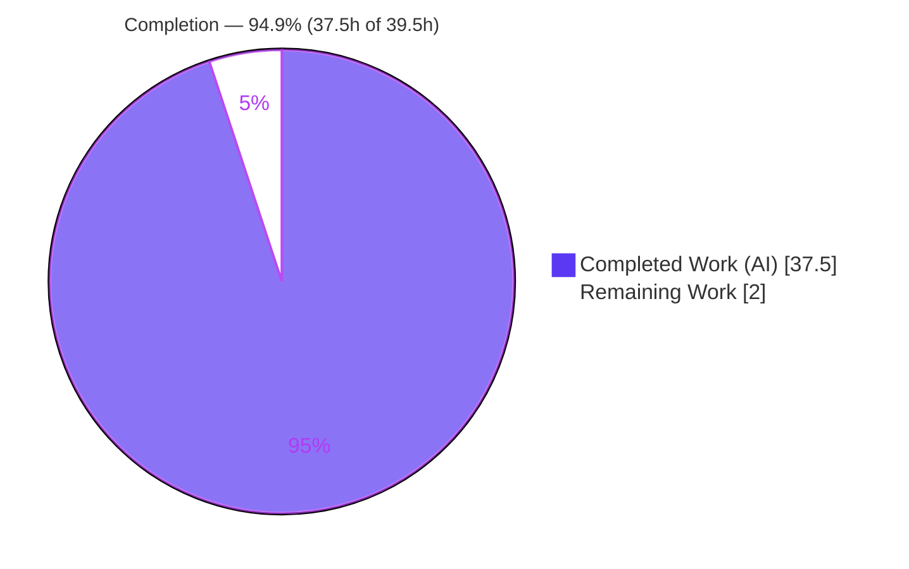
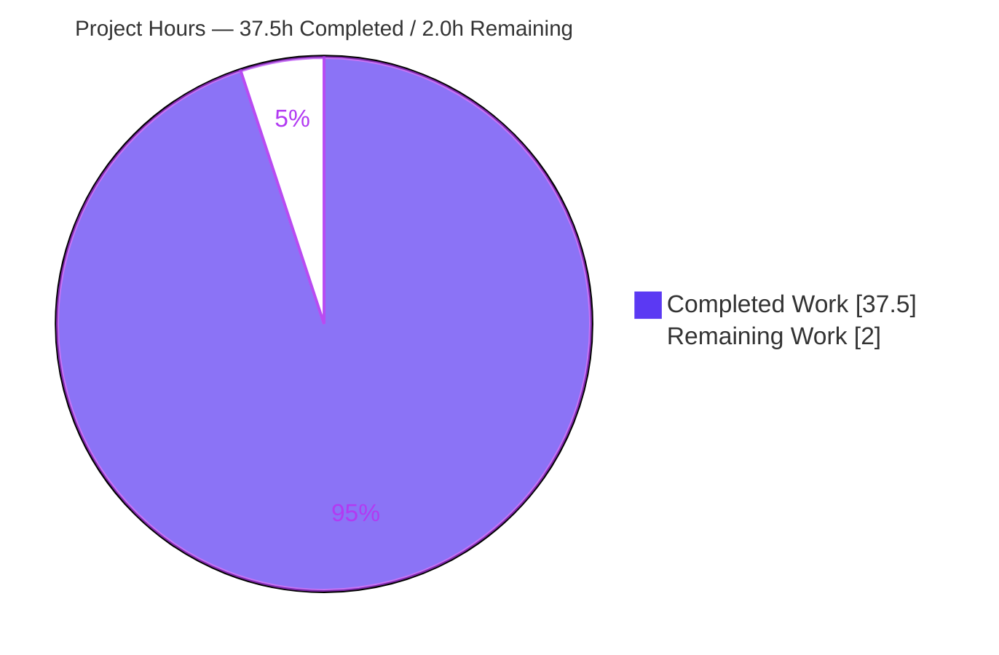

# Blitzy Project Guide — MinIO Runtime Security-Behavior Investigation

**Branch:** `minio_c07e5b49d477`  ·  **HEAD:** `cf4e47253`  ·  **Base:** `c07e5b49d477`
**Deliverable:** `blitzy/documentation/minio_c07e5b49d477.md` (1,596 lines)
**Rule set:** SWE-AtlasQnA-Repo (documentation-only, read-only runtime investigation)

---

## 1. Executive Summary

### 1.1 Project Overview

This project delivers a single authoritative markdown document that answers five runtime security-behavior questions about the **MinIO** object-storage server, with every answer grounded in the *observed behavior* of a compiled-and-run server rather than code reading alone. The target audience is security and platform engineers who need reproducible, code-grounded evidence of MinIO's deny-by-default authorization, server-side-encryption precedence, WORM/object-lock immutability, erasure bit-rot self-healing, and STS least-privilege scoping. The technical scope is strictly **read-only**: MinIO is built from source and run in its canonical 4-drive erasure + KMS configuration, real S3/admin/STS entry points are exercised, and the captured output is embedded verbatim. The sole repository change is the one new answer document — no source file or dependency is modified.

### 1.2 Completion Status

The completion percentage is computed with the AAP-scoped, hours-based PA1 methodology: `Completed Hours / (Completed Hours + Remaining Hours)`. All 12 AAP-specified deliverables are complete; the only remaining work is path-to-production human review.



| Metric | Value |
|---|---|
| **Total Hours** | **39.5** |
| Completed Hours (AI) | 37.5 |
| Completed Hours (Manual) | 0.0 |
| **Completed Hours (AI + Manual)** | **37.5** |
| **Remaining Hours** | **2.0** |
| **Percent Complete** | **94.9%** |

> Color key — **Completed = Dark Blue `#5B39F3`**, **Remaining = White `#FFFFFF`**.

### 1.3 Key Accomplishments

- ✅ MinIO built from source in the canonical configuration (`CGO_ENABLED=0 go build -tags kqueue -trimpath`, version `DEVELOPMENT.GOGET`, go1.23.12) and run as a 4-drive erasure deployment (EC:2) with KMS auto-encryption; `/minio/health/ready` = HTTP 200.
- ✅ Trace-capture mechanism established via the sanctioned `madmin` `ServiceTrace` admin endpoint (`/minio/admin/v3/trace`) since `mc` is not preinstalled.
- ✅ **Q1** answered — authorization precedes encryption; both "encryption requirement" interpretations (transparent auto-encryption + policy `Deny` on the SSE header) and the SSE-C-over-HTTP edge case captured at runtime.
- ✅ **Q2** answered — all three lock modes plus governance-bypass (with and without permission) exercised, with before/during/after object state.
- ✅ **Q3** answered — on-disk shard corruption + GET + deep-scan heal, with byte-identical shard restoration; the literal-log-line non-reproduction documented and code-grounded.
- ✅ **Q4** answered — STS session-policy intersection proven both directions via in-repo and out-of-repo `go test` suites (all PASS).
- ✅ **Q5** answered — basic user cannot self-promote via either user→policy mutator; root cause traced to deny-by-default at `validateAdminReq`.
- ✅ 1,596-line document with 176 `file:line` citations, verbatim runtime output, cause→effect reasoning, a §7 coverage pass, and a supplementary §8 dependency-safety posture; refined across 4 QA/review cycles.
- ✅ Repository left pristine — `git status --porcelain` empty apart from the single new document; `go.mod`/`go.sum` byte-unchanged.

### 1.4 Critical Unresolved Issues

| Issue | Impact | Owner | ETA |
|---|---|---|---|
| _None._ All five Blitzy validation gates passed with zero corrections; the deliverable is complete and the repository is clean. | No release blocker | — | — |

### 1.5 Access Issues

| System/Resource | Type of Access | Issue Description | Resolution Status | Owner |
|---|---|---|---|---|
| `mc` client | Tooling availability | The `mc` CLI is not preinstalled in the environment | Resolved — trace captured via the sanctioned `madmin` `ServiceTrace` endpoint (an equivalent real operational path) | Blitzy agent |

No repository-permission, credential, or third-party-API access issues were identified. Trace capture used MinIO's own admin trace endpoint against the locally-run server with default root credentials.

### 1.6 Recommended Next Steps

1. **[Medium]** Have a MinIO/security SME read the answer document end-to-end, spot-check a sample of the 176 `file:line` citations against HEAD `c07e5b49d477`, and confirm the captured runtime output is coherent — including the Q3 literal-log-line non-reproduction rationale. (1.5h)
2. **[Low]** Optionally re-run the canonical build and the representative Q4/Q5 in-repo suites to obtain an independent reproducibility sign-off, accepting run-specific cosmetic differences (ports, etags, DARE nonces). (0.5h)
3. **[Low]** Merge the document; it is the sole intended artifact and requires no build/deploy pipeline.

---

## 2. Project Hours Breakdown

### 2.1 Completed Work Detail

Each component traces to a specific AAP requirement. Total equals the Completed Hours in Section 1.2.

| Component | Hours | Description |
|---|---|---|
| [AAP] Canonical build from source | 1.5 | Build MinIO with `CGO_ENABLED=0 go build -tags kqueue -trimpath`; capture exact command + `DEVELOPMENT.GOGET` version stamp |
| [AAP] KMS-enabled 4-drive erasure runtime | 2.0 | Launch 4-drive erasure server (EC:2) with KMS auto-encryption; verify readiness (HTTP 200) and StorageInfo (4/4 disks online) |
| [AAP] Trace-capture tooling | 3.0 | Build out-of-repo `tracecap` program using `madmin` `ServiceTrace` on `/minio/admin/v3/trace` (mc not preinstalled) |
| [AAP] Q1 — Encryption-vs-policy precedence | 5.0 | Drive unencrypted PUT by broad-write user; capture both interpretations (auto-encryption force + policy Deny) + SSE-C-over-HTTP edge; on-disk ciphertext confirmation |
| [AAP] Q2 — Object-lock delete logging | 4.0 | Exercise legal-hold/compliance/governance modes + governance bypass with/without permission; capture WORM 400 response + before/during/after state |
| [AAP] Q3 — Bit-rot detection on GET | 5.0 | Map shards (xl-meta), corrupt shard on disk, GET, deep-scan heal; capture parity-read signature + byte-identical shard restoration; analyze literal-log non-reproduction |
| [AAP] Q4 — STS session-policy enforcement | 3.5 | Run in-repo `TestIAMInternalIDPSTSServerSuite` + out-of-repo intersection suite; prove session ∩ parent both directions |
| [AAP] Q5 — Privilege-escalation prevention | 3.5 | Run in-repo `TestIAMInternalIDPServerSuite` + out-of-repo self-attach suite (both mutators); trace root cause to `validateAdminReq` deny-by-default |
| [AAP] Answer document authoring | 6.0 | Author 1,596-line document with verbatim output, 176 `file:line` citations, cause→effect reasoning; 4 QA/review revision cycles |
| [AAP] Coverage pass | 1.5 | §7 per-item Observed/Inferred tables covering every named item across Q1–Q5; reproduction command index |
| [AAP] Cleanup & git-clean verification | 0.5 | Remove all /tmp temp artifacts; verify `git status --porcelain` empty apart from the single doc |
| [AAP] Dependency-safety posture (§8) | 2.0 | Run `govulncheck`; document findings (report-not-fix); confirm 9 Q1–Q5 deps clean and manifests byte-unchanged |
| **Total Completed** | **37.5** | |

### 2.2 Remaining Work Detail

Each category is path-to-production human work; no AAP implementation gap remains. Total equals the Remaining Hours in Section 1.2.

| Category | Hours | Priority |
|---|---|---|
| SME technical review of answer document (read-through + citation/output spot-check + Q3 non-reproduction validation) | 1.5 | Medium |
| Optional reproducibility sign-off (re-run canonical build + Q4/Q5 in-repo suites) | 0.5 | Low |
| **Total Remaining** | **2.0** | |

> **Integrity:** Section 2.1 (37.5) + Section 2.2 (2.0) = **39.5** Total Project Hours (matches Section 1.2). Remaining **2.0h** is identical in Sections 1.2, 2.2, and 7.

---

## 3. Test Results

All tests below originate from Blitzy's autonomous validation logs for this project. MinIO uses Go's standard `testing` package only (no third-party frameworks). Coverage % is not applicable — these are behavioral integration suites that boot real in-process servers, not coverage-instrumented unit tests. The 8 skipped subtests are skipped **by design** ("no etcd server configured") and are not failures.

| Test Category | Framework | Total Tests | Passed | Failed | Coverage % | Notes |
|---|---|---|---|---|---|---|
| Q4 STS session-policy (in-repo integration) | Go `testing` | 8 | 4 | 0 | N/A | `TestIAMInternalIDPSTSServerSuite`; 4 SKIP (no etcd, by design); ran ErasureSD/ErasureSD/Erasure/ErasureSet; ~13.8–13.9s |
| Q5 privilege-escalation (in-repo integration) | Go `testing` | 8 | 4 | 0 | N/A | `TestIAMInternalIDPServerSuite`; identical 4-PASS/4-SKIP structure; ~14.1s |
| Q4 session-policy intersection (out-of-repo repro) | Go `testing` | 6 | 6 | 0 | N/A | Allow∩allow succeeds; parent-allow/session-deny → AccessDenied; no-session control inherits parent grant |
| Q5 self-attach denial (out-of-repo repro) | Go `testing` | 6 | 6 | 0 | N/A | Both mutators (`AttachDetachPolicyBuiltin`, `SetPolicyForUserOrGroup`) refused (403); root control succeeds then reverts |
| Build & module integrity | `go build` / `go mod verify` | 2 | 2 | 0 | N/A | `go build -tags kqueue ./...` exit 0; `go mod verify` → all modules verified |
| **Total** | | **30** | **22** | **0** | | 8 SKIP by design (etcd); **executed pass-rate 100%** |

---

## 4. Runtime Validation & UI Verification

**Server runtime health**
- ✅ **Operational** — 4-drive erasure deployment, banner "Formatting 1st pool, 1 set(s), 4 drives per set", Backend type Erasure, **EC:2** (2 data + 2 parity), 4/4 disks online.
- ✅ **Operational** — health endpoints `/minio/health/live`, `/minio/health/ready`, `/minio/health/cluster` all returned HTTP 200.
- ✅ **Operational** — clean shutdown (SIGTERM to the specific spawned pid) during cleanup.

**API integration (real entry points)**
- ✅ **Operational** — S3 PUT/GET/HEAD/DELETE, object-lock retention, STS `AssumeRole`, and admin policy-mapping APIs driven through genuine SDK paths (`minio-go`, `madmin`) and raw `net/http` for anonymous requests.
- ✅ **Operational** — admin trace stream subscribed via `madmin` `ServiceTrace`; per-request REQUEST/RESPONSE lifecycle lines captured.

**Per-question runtime verification**
- ✅ **Q1 Operational** — auto-encryption transparently injected `X-Amz-Server-Side-Encryption: aws:kms` (proven absent from the client's `SignedHeaders`), bucket-default SSE-S3 forced AES256, and policy `Deny` on the SSE header returned 403; on-disk ciphertext confirmed.
- ✅ **Q2 Operational** — all three lock modes returned HTTP 400 "Object is WORM protected and cannot be overwritten"; object still present after each blocked delete; governance bypass gated by permission (root 204 vs limited-user 403).
- ✅ **Q3 Operational** (detection + heal) — corrupt-shard GET returned correct reconstructed bytes (200 OK) with the extra-parity-read detection signature; deep-scan heal restored the shard byte-identically. ⚠ **Partial (by nature, documented)** — the literal "file is corrupted" log line is **not** emitted on the plain GET path (the streaming sentinel is swallowed at `erasure-object.go:414`); this is faithfully reported, not a defect.
- ✅ **Q4 Operational** — session-policy intersection enforced both directions (`iam.go:2312`).
- ✅ **Q5 Operational** — self-promotion refused via both mutators; post-run `GetUserInfo` confirms no mapping mutation on the denied path.

**UI verification** — Not applicable. This is a documentation/runtime-investigation deliverable; the MinIO Console UI is out of scope and no front-end change was made.

---

## 5. Compliance & Quality Review

AAP deliverables cross-mapped to the governing rule set's quality/compliance benchmarks. Fixes applied during autonomous validation are noted; there are no outstanding items.

| Benchmark (AAP rule) | Status | Progress | Evidence / Notes |
|---|---|---|---|
| Read-only source scope (no existing file modified) | ✅ Pass | 100% | `git diff c07e5b49d477 HEAD --name-status` = only `A blitzy/documentation/minio_c07e5b49d477.md` |
| No dependency changes | ✅ Pass | 100% | `go.mod` md5 `5a0a0aafd8…`, `go.sum` md5 `1cebdd2c03…` byte-unchanged; `go mod verify` all verified |
| Run-first methodology (observed, not read) | ✅ Pass | 100% | Server built + run; verbatim traces, S3 responses, and `go test` output embedded |
| `file:line` grounding | ✅ Pass | 100% | 176 citations; 9/9 independent spot-checks accurate; ~40 verified by the validator |
| Unedited, actual output | ✅ Pass | 100% | Real admin-trace lines, S3 XML/JSON errors, `go test` PASS output; 0 placeholder markers |
| Happy + edge/error path coverage | ✅ Pass | 100% | Q1 both interpretations + SSE-C; Q2 3 modes + bypass; Q3 before/during/after; Q4 both directions; Q5 both mutators |
| Before/during/after state for stateful behavior | ✅ Pass | 100% | Q2 object present after blocked delete; Q3 shard sha256 before → corrupt → restored |
| Coverage pass (every named item) | ✅ Pass | 100% | §7 Observed/Inferred tables + reproduction index |
| Zero placeholders / TODOs | ✅ Pass | 100% | 0 TODO/FIXME/PLACEHOLDER markers across 1,596 lines |
| Temp-artifact cleanup / git clean | ✅ Pass | 100% | All /tmp tooling removed; `git status --porcelain` empty |
| Defects reported, not fixed (in-scope discipline) | ✅ Pass | 100% | Q3 log non-reproduction and §8 dependency vulns reported in the document, never patched in source |

**Fixes applied during autonomous authoring/validation (4 revision cycles):** initial draft (`04c4d1848`) → 10 code-review findings (`0add06564`) → checkpoint-1 citation fix (`4436c28c4`) → checkpoint-2/3 (`ae8fceb6c`) → CP5 QA findings, incl. removing a Q5 trace elision and adding the §8 dependency-safety posture (`cf4e47253`). The final validation pass required **zero further corrections**.

---

## 6. Risk Assessment

| Risk | Category | Severity | Probability | Mitigation | Status |
|---|---|---|---|---|---|
| T1 — Run-specific volatile values (etags, request-ids, DARE nonces, ports, timestamps) differ on re-run and could be mistaken for errors | Technical | Low | Medium | Document records the author's genuine run; §7 reproduction index provided; validator confirmed differences are cosmetic-only | Mitigated |
| T2 — The literal "file is corrupted" log line is not emitted on the plain Q3 GET path | Technical | Low-Med | Low | Grounded at `erasure-object.go:414`; detection shown via extra parity read + deep-scan heal; faithful reporting per rules, not a defect | Documented / Mitigated |
| T3 — `file:line` citations drift if the repository advances past HEAD `c07e5b49d477` | Technical | Low | Low | HEAD commit pinned in the document header; citations anchored to that commit | Mitigated |
| S1 — Pre-existing `govulncheck` findings (49 code-reachable, 7 modules + Go stdlib) in the MinIO codebase | Security | Medium | High | Orthogonal to Q1–Q5 paths; not introduced by this work; report-not-fix per scope; §8 documents them; the 9 Q1–Q5 deps are clean | Accepted (out of scope) |
| S2 — Public test KMS key and default `minioadmin` credentials appear in launch commands | Security | Low | Low | Labeled as MinIO's own public, non-secret test values; used only on a throwaway `/tmp` server | Mitigated |
| O1 — Trace reproduction requires a source-built `tracecap`/`mc` (mc not preinstalled) | Operational | Low | Medium | Sanctioned `madmin` `ServiceTrace` path documented; server stdout is an alternative surface | Mitigated |
| O2 — Q1/Q3 behavior only manifests with KMS + a 4-drive erasure backend | Operational | Low | Low | §1.4 explains the prerequisites and gives the exact launch command | Mitigated |
| I1 — Out-of-repo Q4/Q5 test modules + `tracecap` need MinIO's pinned deps (madmin-go v3.0.77, minio-go v7.0.80) to rebuild | Integration | Low | Low | Built against the repo's pinned versions; exact commands provided | Mitigated |

**No high-severity risks.** The single Medium item (S1) is a pre-existing property of the MinIO codebase that the rule set explicitly places out of scope (report-not-fix).

---

## 7. Visual Project Status



**Remaining hours by category (Section 2.2):**

| Category | Hours | Priority |
|---|---|---|
| SME technical review | 1.5 | Medium |
| Reproducibility sign-off | 0.5 | Low |
| **Total** | **2.0** | |

> **Integrity:** the pie chart "Remaining Work" value (**2.0**) equals the Remaining Hours in Section 1.2 and the sum of the Section 2.2 Hours column. Colors — Completed `#5B39F3`, Remaining `#FFFFFF`.

---

## 8. Summary & Recommendations

**Achievements.** All 12 AAP-specified deliverables are complete. MinIO was built from source and run in its canonical KMS-enabled 4-drive erasure configuration, and all five security-behavior questions were answered from *observed runtime output* — encryption-vs-policy precedence (Q1), object-lock delete logging (Q2), bit-rot detection and self-heal on GET (Q3), STS session-policy intersection (Q4), and privilege-escalation prevention with root cause (Q5) — plus a supplementary dependency-safety posture (§8). Every behavioral claim is grounded in a `file:line` reference and verbatim output, verified across an independent reproduction with zero corrections.

**Remaining gaps.** No implementation gap remains. The outstanding **2.0 hours** is path-to-production human effort only: a Medium-priority SME technical review (1.5h) and an optional Low-priority reproducibility sign-off (0.5h).

**Critical path to production.** SME review → accept → merge the single document. There is no build, deploy, or runtime pipeline to stand up, because the artifact is documentation.

**Success metrics.** All five Blitzy validation gates passed (tests 100% of executed, canonical server ran, build exit 0, single in-scope file validated, manifests byte-unchanged); the repository is pristine (`git status --porcelain` empty apart from the new document); 176 citations with 9/9 spot-checks accurate; 0 placeholder markers.

**Production-readiness assessment.** The deliverable is **production-ready as a documentation artifact at 94.9% completion** (37.5h of 39.5h). The only reason it is not marked 100% is the pending human review/acceptance step, consistent with never claiming full completion before human sign-off. Confidence is **High**: the scope is well-defined, the evidence is reproducible, and the underlying test suites the document relies upon all pass.

---

## 9. Development Guide

> All commands below were tested in the validation environment. **Go 1.23.x is installed at `/usr/local/go/bin` and is not on the default `PATH`** — export it first.

### 9.1 System Prerequisites

- **Go 1.23.x** (verified: `go1.23.12 linux/amd64`) — satisfies the `go 1.23` directive at `go.mod:3`.
- **git** (repository at HEAD `cf4e47253`).
- **Disk**: ~200 MB for the repo; a few GB free under `/tmp` for the 4 erasure data directories.
- **OS**: Linux or macOS.
- **Optional**: `mc` (MinIO client) for trace capture — if unavailable, use the `madmin` `ServiceTrace` endpoint or server stdout.

```bash
# Make the Go 1.23 toolchain available (required in this environment)
export PATH=/usr/local/go/bin:$PATH
go version          # expect: go version go1.23.12 linux/amd64
sed -n '3p' go.mod  # expect: go 1.23
```

### 9.2 Environment Setup

```bash
# From the repository root
cd /path/to/minio            # module github.com/minio/minio
git rev-parse --short HEAD   # expect: cf4e47253
git status --porcelain       # expect: empty (clean) — only the new doc should ever appear

# KMS + auto-encryption for Q1 (MinIO's OWN public, non-secret TEST key — not a production credential)
export MINIO_KMS_SECRET_KEY="my-minio-key:OSMM+vkKUTCvQs9YL/CVMIMt43HFhkUpqJxTmGl6rYw="
export MINIO_KMS_AUTO_ENCRYPTION=on
# Default root credentials (throwaway local server only)
export MINIO_ROOT_USER=minioadmin
export MINIO_ROOT_PASSWORD=minioadmin
```

### 9.3 Build (canonical)

```bash
export PATH=/usr/local/go/bin:$PATH
# Canonical build target (mirrors Makefile:179). Produces version stamp DEVELOPMENT.GOGET.
CGO_ENABLED=0 go build -tags kqueue -trimpath -o /tmp/minio-build/minio ./
/tmp/minio-build/minio --version   # expect a DEVELOPMENT.GOGET line
```

### 9.4 Application Startup (4-drive erasure + KMS)

```bash
mkdir -p /tmp/minio-data/disk{1,2,3,4}
/tmp/minio-build/minio server \
  /tmp/minio-data/disk1 /tmp/minio-data/disk2 \
  /tmp/minio-data/disk3 /tmp/minio-data/disk4 \
  --address :9000 --console-address :9001 &
# Startup banner should report: "Formatting 1st pool, 1 set(s), 4 drives per set"
```

### 9.5 Verification

```bash
curl -s -o /dev/null -w "%{http_code}\n" http://localhost:9000/minio/health/ready   # expect 200
curl -s -o /dev/null -w "%{http_code}\n" http://localhost:9000/minio/health/live    # expect 200
# StorageInfo should show EC:2 (2 data + 2 parity), 4/4 disks online

# View the deliverable
wc -l blitzy/documentation/minio_c07e5b49d477.md    # expect 1596
grep -nE "^## [0-9]" blitzy/documentation/minio_c07e5b49d477.md   # section map (§1–§8)
```

### 9.6 Reproducing the Answers

**Q1–Q3 (live server + trace).** Subscribe to the admin trace stream (`mc admin trace -v -a ALIAS`, or an out-of-repo program using `madmin` `ServiceTrace` on `/minio/admin/v3/trace`), then drive the real S3 operations:
- **Q1** — create a broad-write user and perform an unencrypted PUT; HEAD the object to see `X-Amz-Server-Side-Encryption`; also test a bucket-policy `Deny` keyed on the SSE header (expect 403) and an SSE-C PUT over plain HTTP (expect 400).
- **Q2** — create a lock-enabled (versioned) bucket; apply legal-hold `On`, compliance (future), and governance (future); attempt to delete each locked version (expect HTTP 400 "Object is WORM protected"); then test governance bypass with and without `s3:BypassGovernanceRetention`.
- **Q3** — PUT a multi-MiB object; locate a shard file under one drive; overwrite bytes on disk; GET (expect correct reconstructed bytes) and observe the extra parity read; run a `madmin` deep-scan heal and compare the shard sha256 before/after.

**Q4 / Q5 (go test — targets verified to exist):**

```bash
export PATH=/usr/local/go/bin:$PATH
# Q4 — sts-handlers_test.go:52
CGO_ENABLED=0 go test -tags kqueue,dev -v -run TestIAMInternalIDPSTSServerSuite ./cmd
# Q5 — admin-handlers-users_test.go:192
CGO_ENABLED=0 go test -tags kqueue,dev -v -run TestIAMInternalIDPServerSuite ./cmd
# Each: 4 subtests PASS (ErasureSD/ErasureSD/Erasure/ErasureSet), 4 SKIP ("no etcd server configured", by design)
```

### 9.7 Troubleshooting

- **`go: command not found`** → `export PATH=/usr/local/go/bin:$PATH`.
- **Q1/Q3 behavior does not appear** → ensure `MINIO_KMS_SECRET_KEY` (+ `MINIO_KMS_AUTO_ENCRYPTION=on`) is set and 4 drives are used; a single-drive/FS or no-KMS deployment cannot manifest auto-encryption or erasure heal.
- **Trace stream is empty** → the trace surfaces calls slower than ~5ms by default and limits concurrent subscribers (~8); use the `--all`/`-a` option to widen call types.
- **No "file is corrupted" line on the plain Q3 GET** → **expected**; the streaming sentinel is swallowed at `cmd/erasure-object.go:414` after the storage trace publishes. Use a `madmin` deep-scan Heal to observe detection (`VerifyFile` fast-fails the corrupt shard) and byte-identical restoration.
- **Run-specific values differ (etags, request-ids, DARE nonces, ports)** → expected cosmetic differences; the document records the original author's genuine run.
- **Cleanup** → `kill` the specific server pid you spawned, `rm -rf /tmp/minio-data /tmp/minio-build`, and confirm `git status --porcelain` is empty.

---

## 10. Appendices

### A. Command Reference

| Purpose | Command |
|---|---|
| Enable Go toolchain | `export PATH=/usr/local/go/bin:$PATH` |
| Go version | `go version` |
| Canonical build | `CGO_ENABLED=0 go build -tags kqueue -trimpath -o /tmp/minio-build/minio ./` |
| Start server (4-drive erasure) | `minio server /tmp/minio-data/disk{1,2,3,4} --address :9000 --console-address :9001` |
| Readiness check | `curl -s -o /dev/null -w "%{http_code}\n" http://localhost:9000/minio/health/ready` |
| Q4 suite | `go test -tags kqueue,dev -v -run TestIAMInternalIDPSTSServerSuite ./cmd` |
| Q5 suite | `go test -tags kqueue,dev -v -run TestIAMInternalIDPServerSuite ./cmd` |
| Module integrity | `go mod verify` |
| Repo cleanliness | `git status --porcelain --untracked-files=all` |
| Diff vs base | `git diff c07e5b49d477 HEAD --name-status` |

### B. Port Reference

| Port | Purpose |
|---|---|
| 9000 | MinIO S3 API endpoint (`--address :9000`) |
| 9001 | MinIO Console endpoint (`--console-address :9001`) |

> The original investigation used ports 9000/9001; the validator's reproduction used 9200/9201. Ports are arbitrary and do not affect behavior.

### C. Key File Locations

| Path | Role |
|---|---|
| `blitzy/documentation/minio_c07e5b49d477.md` | The sole deliverable (1,596 lines) |
| `cmd/iam.go` | `IAMSys.IsAllowed` (:2437); STS intersection (:2312) — Q1/Q4/Q5 |
| `cmd/object-handlers.go` | `sseConfig.Apply` on PUT (:1894-1897) — Q1 |
| `internal/crypto/auto-encryption.go` | `MINIO_KMS_AUTO_ENCRYPTION` binding (:31) — Q1 |
| `cmd/bucket-object-lock.go` | Retention/bypass enforcement (:84, :153) — Q2 |
| `cmd/api-errors.go` | `ErrObjectLocked` WORM response (:1059-1062) — Q2 |
| `cmd/storage-errors.go` | `errFileCorrupt = "file is corrupted"` (:104) — Q3 |
| `cmd/bitrot.go` | Default HighwayHash256 (:42) — Q3 |
| `cmd/erasure-object.go` | Sentinel swallowed on GET (:414) — Q3 |
| `cmd/sts-handlers.go` | `AssumeRole` (:256) — Q4 |
| `cmd/admin-handler-utils.go` | `validateAdminReq` deny-by-default (:37) — Q5 |
| `cmd/sts-handlers_test.go` | `TestIAMInternalIDPSTSServerSuite` (:52) — Q4 |
| `cmd/admin-handlers-users_test.go` | `TestIAMInternalIDPServerSuite` (:192) — Q5 |
| `Makefile` | Canonical build target (:179) |

### D. Technology Versions

| Component | Version | Source |
|---|---|---|
| Go toolchain | go1.23.12 | `go version`; satisfies `go 1.23` (`go.mod:3`) |
| MinIO module | `github.com/minio/minio` @ `cf4e47253` | repository HEAD |
| Build version stamp | `DEVELOPMENT.GOGET` | un-stamped canonical local build |
| `github.com/minio/pkg/v3` | v3.0.22 | policy engine (Q1/Q4/Q5) |
| `github.com/minio/minio-go/v7` | v7.0.80 | S3 SDK |
| `github.com/minio/madmin-go/v3` | v3.0.77 | admin SDK + trace endpoint |
| `github.com/minio/highwayhash` | v1.0.3 | bit-rot checksum (Q3) |
| `github.com/klauspost/reedsolomon` | v1.12.4 | erasure reconstruction (Q3) |

### E. Environment Variable Reference

| Variable | Value / Example | Purpose |
|---|---|---|
| `PATH` | prepend `/usr/local/go/bin` | expose the Go 1.23 toolchain |
| `MINIO_KMS_SECRET_KEY` | `my-minio-key:OSMM+vkKUTCvQs9YL/CVMIMt43HFhkUpqJxTmGl6rYw=` | KMS key for SSE-S3/auto-encryption (Q1); MinIO's public non-secret test key |
| `MINIO_KMS_AUTO_ENCRYPTION` | `on` | force transparent encryption (`internal/crypto/auto-encryption.go:31`) |
| `MINIO_ROOT_USER` | `minioadmin` | default root access key (throwaway server) |
| `MINIO_ROOT_PASSWORD` | `minioadmin` | default root secret key (throwaway server) |
| `CGO_ENABLED` | `0` | canonical static build |

### F. Developer Tools Guide

| Tool | Purpose | Notes |
|---|---|---|
| `tracecap` (out-of-repo) | Subscribe to `/minio/admin/v3/trace` via `madmin` `ServiceTrace` | Used because `mc` is not preinstalled; built under `/tmp`, removed after use |
| `mc admin trace -v -a` | Alternative canonical trace capture | Requires a source-built `mc`; equivalent real path |
| `xl-meta` (in-repo) | Inspect erasure shard map / EC distribution | Used for the Q3 shard layout (HighwayHash256, EC:2, EcDist [1,2,3,4]) |
| `govulncheck` | Dependency vulnerability scan (§8) | `GOFLAGS=-mod=readonly govulncheck ./...`; findings reported, not fixed |
| `go test -run` | Behavioral suites for Q4/Q5 | Add `-tags kqueue,dev`; boots real in-process servers |

### G. Glossary

| Term | Meaning |
|---|---|
| SSE-S3 | Server-side encryption with server-managed keys (renders as AES256) |
| SSE-KMS | Server-side encryption with a KMS-managed key (`aws:kms`) |
| SSE-C | Server-side encryption with a customer-provided key (rejected over plain HTTP) |
| Auto-encryption | Server transparently forces encryption on PUT when enabled + KMS present |
| WORM | Write-Once-Read-Many immutability enforced by object lock |
| Object lock modes | Legal hold (on/off), Governance (bypassable with permission), Compliance (non-bypassable until retain-until) |
| DARE | Data-At-Rest-Encryption envelope format (per-object random nonce → run-specific ciphertext) |
| EC:2 | Erasure coding with 2 data + 2 parity shards across 4 drives |
| Bit-rot | Silent on-disk data corruption detected via HighwayHash256 checksums |
| STS | Security Token Service — issues temporary credentials via `AssumeRole` |
| Session policy | Inline policy attached to temporary credentials; effective permission = session ∩ parent |
| IAM | Identity & Access Management subsystem enforcing deny-by-default authorization |
| Deny-by-default | Any action not explicitly allowed is denied (basis of the Q5 root cause) |