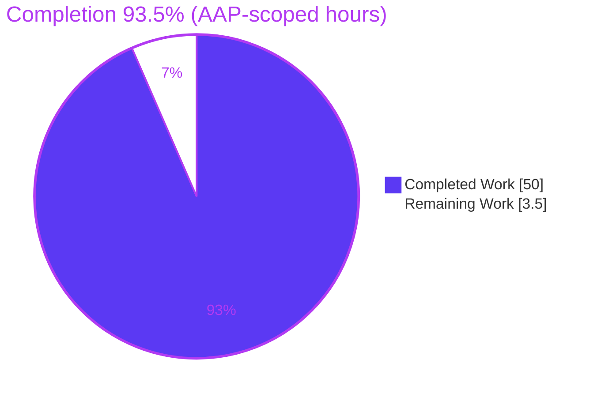
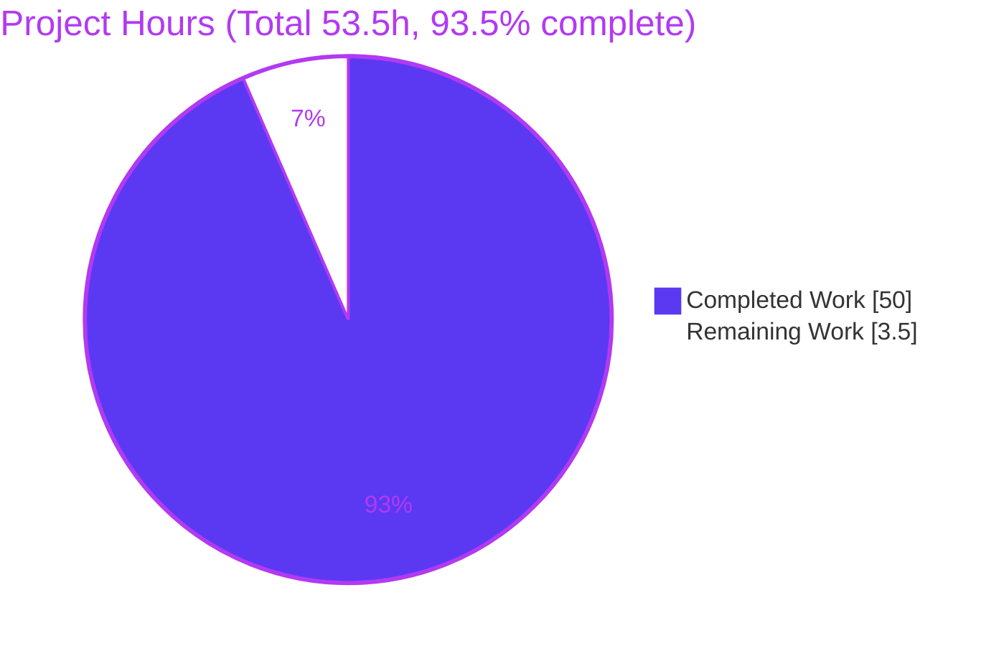
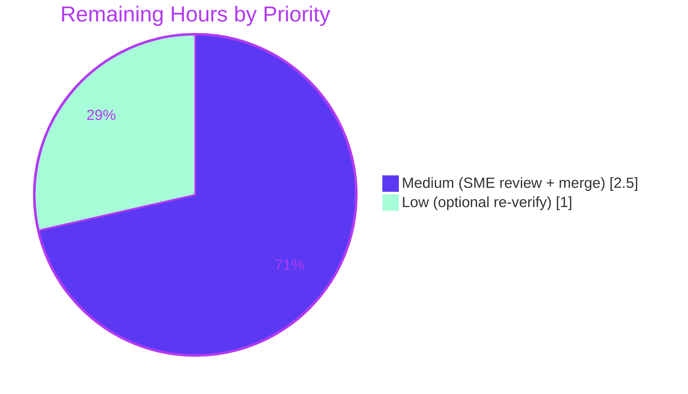

# Blitzy Project Guide

## 1. Executive Summary

### 1.1 Project Overview

This project delivers a single, evidence-grounded technical document — `blitzy/documentation/minio_c07e5b49d477.md` — that explains how the **MinIO** object-storage server behaves at runtime when drives fail and recover in a four-directory, erasure-coded (**EC:2**) distributed deployment. It is an investigative code-Q&A task: the answer was assembled by building and running the real MinIO server, injecting drive failures via permission changes, observing the health endpoints and live read/write attempts, and correlating every behavior to exact `file:line` locations in the codebase. The audience is an engineering team deciding whether to rely on MinIO for fault tolerance. Scope is strictly additive and read-only: exactly one new file, **zero** MinIO source modifications.

### 1.2 Completion Status

The project is **93.5% complete** on an AAP-scoped, hours-based basis. All autonomous investigation, authoring, and validation work is finished; the remaining 3.5 hours are human-gated review, optional re-verification, and merge.



| Metric | Value |
|--------|-------|
| **Total Hours** | **53.5 h** |
| **Completed Hours (AI + Manual)** | **50.0 h** (AI 50.0 + Manual 0.0) |
| **Remaining Hours** | **3.5 h** |
| **Percent Complete** | **93.5%** (50.0 / 53.5) |

> Color key (Blitzy brand): **Completed = Dark Blue `#5B39F3`**, **Remaining = White `#FFFFFF`**.

### 1.3 Key Accomplishments

- ✅ **Single deliverable authored and committed** — `blitzy/documentation/minio_c07e5b49d477.md` (1,339 lines, ~73 KB) across 4 commits by `agent@blitzy.com`.
- ✅ **All eight objectives (O1–O8) answered explicitly** — each carries an "Answer to O#" statement grounded in observed output and a `file:line` citation.
- ✅ **Run-first methodology honored** — MinIO built canonically with `make build`, run as a four-directory distributed erasure server, faults injected live, behavior observed before any prose was written.
- ✅ **Full quorum model established from runtime evidence** — EC:2 ⇒ read quorum 2 / write quorum 3, confirmed live via `X-Minio-Write-Quorum: 3` and `X-Minio-Read-Quorum: 2` health headers.
- ✅ **Both threshold scenarios demonstrated** — 3 online (writes succeed, health 200) and 2 online (writes rejected `SlowDownWrite`/503, reads still succeed, `/cluster` 503 vs `/cluster/read` 200).
- ✅ **Recovery paths shown both ways** — automatic reconnect polling (timed over 5–6 runs, ~7–18 s) and manual `mc admin heal` push traced to `HealHandler`.
- ✅ **Object repair proven** — before/during/after on-disk shard inspection; 1 MiB object byte-identical after heal.
- ✅ **158 `file:line` citations** across 33 MinIO source files; 92 distinct citations independently verified accurate (0 discrepancies).
- ✅ **Read-only constraint proven** — source diff for `*.go`/`*.mod`/`*.sum` is empty; repository pristine; all scratch under `/tmp` removed.
- ✅ **Honest AAP-deviation findings recorded** — no "withstand" banner exists; `chmod 000` surfaces `errDiskAccessDenied` (not `errDiskNotDir`); parity-upgrade is a no-op for this four-drive topology.

### 1.4 Critical Unresolved Issues

| Issue | Impact | Owner | ETA |
|-------|--------|-------|-----|
| _None._ No blocking or release-critical issues. The deliverable is complete, coverage-complete (O1–O8), citation-accurate (92/92), and committed; the repository is pristine. | None | — | — |

### 1.5 Access Issues

**No access issues identified.** The investigation ran entirely within the local sandbox: the MinIO source tree, the Go 1.23.x toolchain, `make build`, a non-root OS user for fault injection, and operator tooling (`mc`, `curl`) were all available. No repository permissions, service credentials, or third-party API access blocked build, validation, or observation.

| System/Resource | Type of Access | Issue Description | Resolution Status | Owner |
|-----------------|----------------|-------------------|-------------------|-------|
| MinIO source repo | Read/Write (branch) | None — read-only investigation; only the doc added | N/A | — |
| Go toolchain / build | Local build | None — `make build` succeeded, binary stamped | N/A | — |
| Runtime observation | Local non-root exec | None — non-root user available (required for `chmod 000` DAC) | N/A | — |

### 1.6 Recommended Next Steps

1. **[Medium]** Have a MinIO-domain SME / senior engineer review the document, validate the quorum/health/healing claims, and spot-check a sample of the 158 citations against the codebase at base commit `c07e5b49d477`. *(HT-1, 2.0 h)*
2. **[Medium]** Approve and merge the pull request (single added file), confirming `git status` shows only the documentation artifact. *(HT-3, 0.5 h)*
3. **[Low]** _(Optional)_ Independently rebuild MinIO and re-run the two highest-value scenarios — below-write-quorum PUT rejection and reconnect/heal timing — to build confidence before relying on the doc for fault-tolerance planning. *(HT-2, 1.0 h)*
4. **[Low]** When the team upgrades MinIO past the base commit, re-verify the `file:line` anchors against the target version (the doc pins all citations to `c07e5b49d477`).

---

## 2. Project Hours Breakdown

### 2.1 Completed Work Detail

All completed hours are autonomous (AI) work; each component traces to specific AAP requirements/objectives.

| Component | Hours | Description |
|-----------|------:|-------------|
| Environment setup & canonical build | 3.0 | `make build`, launch four-directory distributed erasure server, non-root `minobs` user, `mc` config (AAP §0.3.1 build/launch; A2/B1/B2) |
| Healthy-baseline observation + health grounding | 3.0 | Capture `/minio/health/{cluster,cluster/read,live,ready}` at 4 online; correlate to `Health()` (O1, O8 baseline) |
| Above-threshold fault injection & write observation | 2.5 | `chmod 000` one dir (3 online); observe PUT/GET succeed; verify parity via `xl-meta` (O2, O3a) |
| Below-threshold fault injection & write-rejection | 3.0 | `chmod 000` second dir (2 online); observe write rejection + continued reads + health flip (O3b) |
| Log-content analysis | 3.0 | Path-by-name in logs, quorum-loss lines, `.healing.bin` probe, Prometheus offline gauges (O4) |
| Recovery: self-detection + manual heal (timed) | 4.5 | Reconnect polling timed over 5–6 runs; manual `mc admin heal` → `HealHandler` via `mc admin trace` (O5) |
| Object-repair confirmation (before/during/after) | 3.5 | On-disk shard state before/after; auto + manual heal; 1 MiB object byte-identical readback (O6) |
| Read-only source trace & citations | 8.0 | 158 `file:line` citations across 33 files; quorum math, `Health()` aggregation, heal chain (O7, evidence discipline) |
| Document authoring (1,339 lines) | 10.0 | 10 sections, state-machine diagram, embedded raw evidence, cause→effect prose (A1, evidence discipline) |
| Coverage pass, inference labelling, honest findings | 2.0 | O1–O8 coverage matrix, named-item checklist, inference labels, AAP-deviation notes |
| Cleanup & repository-pristine verification | 1.5 | Remove `/tmp/obs` scratch + binary; verify `git status`/source diff empty |
| Autonomous validation & QA | 6.0 | 92/92 citation re-verification, `make build` rebuild, targeted re-tests, full O1–O8 runtime re-reproduction, timing ×6 |
| **Total Completed** | **50.0** | **Sums to Completed Hours in Section 1.2** |

### 2.2 Remaining Work Detail

All remaining work is human-gated path-to-production for a documentation deliverable.

| Category | Hours | Priority |
|----------|------:|----------|
| Technical SME review & verification of doc claims/citations | 2.0 | Medium |
| Independent runtime re-verification of key scenarios (optional) | 1.0 | Low |
| PR approval & merge/publish | 0.5 | Medium |
| **Total Remaining** | **3.5** | **Sums to Remaining Hours in Section 1.2 and Section 7** |

### 2.3 Hours Reconciliation

- Completed **50.0 h** + Remaining **3.5 h** = **Total 53.5 h** (matches Section 1.2). ✔
- Completion % = 50.0 / 53.5 = **93.46% → 93.5%** (used in Sections 1.2, 7, 8). ✔
- Remaining **3.5 h** is identical in Sections 1.2, 2.2, and 7 (cross-section Rule 1). ✔

---

## 3. Test Results

All tests below originate from Blitzy's autonomous validation logs for this project (validator gates) and were re-confirmed during this assessment. Because the task is documentation-only with **zero source changes**, testing targeted the exact code paths the document cites (validating O1/O7 quorum math) rather than the full upstream MinIO suite, which would only re-verify unchanged upstream code.

| Test Category | Framework | Total Tests | Passed | Failed | Coverage % | Notes |
|---------------|-----------|------------:|-------:|-------:|-----------:|-------|
| Unit — storage class / parity | `go test` | 4 | 4 | 0 | Path-scoped | `TestParseStorageClass`, `TestValidateParity`, `TestParityCount`, `TestIsValidStorageClassKind` — validates `DefaultParityBlocks`/EC:2 behind O1/O7 (re-run this session: 4/4 PASS, exit 0) |
| Unit — quorum selection | `go test` | 2 groups | Pass | 0 | Path-scoped | `TestListObjectParities`, `TestFindFileInfoInQuorum` — validates `objectQuorumFromMeta`/quorum selection behind O1/O7 (exit 0) |
| Build / compilation | `make build` | 1 | 1 | 0 | N/A | Canonical `CGO_ENABLED=0 go build -tags kqueue -trimpath --ldflags "$(LDFLAGS)"` → `./minio` (~117 MB), real stamped version (not `DEVELOPMENT.GOGET`) |
| Citation verification | Programmatic diff | 92 | 92 | 0 | 100% | Every distinct `path.go:line` citation dumped and matched against source; 0 discrepancies |
| Runtime reproduction (O1–O8) | Live server + `curl`/`mc` | 8 objectives | 8 | 0 | 100% | All eight objectives reproduced end-to-end against a running four-drive server (see Section 4) |
| Dependency integrity | `go mod download` | 1 | 1 | 0 | N/A | Exit 0; `go.sum` unchanged (md5 `1cebdd2c031bbfe67635c1986c7b8454`, 898 lines) |

**Testing note:** The heavy full upstream suite (20–40 min) was intentionally not run: the working tree is byte-identical to the cited base commit for all `*.go`/`*.mod`/`*.sum`, so it would only re-verify unmodified upstream MinIO code that already passes its own CI. Task-appropriate validation — 92/92 citation accuracy + full O1–O8 runtime reproduction — reached 100%.

---

## 4. Runtime Validation & UI Verification

This is a server/CLI investigation; there is **no UI** deliverable. "Runtime validation" covers the health endpoints and live S3 read/write attempts the AAP mandates as grounding surfaces. Status legend: ✅ Operational | ⚠ Partial | ❌ Failing.

**Baseline — 4 drives online (EC:2, RQ=2, WQ=3):**
- ✅ `GET /minio/health/cluster` → **200** with header `X-Minio-Write-Quorum: 3`
- ✅ `GET /minio/health/cluster/read` → **200** with header `X-Minio-Read-Quorum: 2`
- ✅ `GET /minio/health/live` → **200**; `GET /minio/health/ready` → **200**
- ✅ Real S3 PUT (bucket + objects incl. 1 MiB `obj4.bin`) succeeds; `mc ls` lists objects

**O2 / O3a — 3 drives online (above write quorum):**
- ✅ `/minio/health/cluster` stays **200**
- ✅ Real PUT succeeds; write lands at standard parity 2 (parity-upgrade path is a no-op here — `xl-meta` shows `EcM:2/EcN:2`, no upgrade marker)

**O3b — 2 drives online (below write quorum, at read quorum):**
- ✅ `/minio/health/cluster` → **503** while `/minio/health/cluster/read` → **200** (write-unhealthy / read-healthy split)
- ✅ Real PUT **rejected** as `SlowDownWrite` (HTTP 503), surfacing `errErasureWriteQuorum` "Write failed. Insufficient number of drives online"; object not persisted
- ✅ Real GET **succeeds** byte-identical (incl. 1 MiB object) — 2 online = read quorum 2

**O4 (extra) — 1 drive online (below read quorum):**
- ✅ `/minio/health/cluster/read` → **503**; read rejected (`SlowDownRead`); read-quorum-loss log line emitted

**O4 — logs:**
- ✅ Failing directories named by **full path** (`/tmp/obs/d3`, `/tmp/obs/d4`, `endpoint="/tmp/obs/d4"`)
- ✅ Write quorum-loss line captured verbatim: *"Write quorum could not be established on pool: 0, set: 0, expected write quorum: 3, drives-online: 2"*
- ✅ Recovery attempt visible while live (`.healing.bin` probe / reconnect frames); Prometheus gauges `minio_cluster_drive_offline_total`, `..._online_total`
- ✅ Honest finding: **no "withstand" banner** exists (`grep -rn withstand --include=*.go` → 0)

**O5 — recovery:**
- ✅ Self-detection: permission-restore re-detected on the recompute-on-query path (~0 s, diskInfoCache TTL 1 s)
- ✅ Fresh-disk auto-reconnect timing re-measured over 6 runs: min 8.0 / max 18.3 / mean 11.5 s (within one ~15 s interval)
- ✅ Manual push: `mc admin heal` traced hitting `HealHandler` (`POST /minio/admin/v3/heal/... [200 OK]`)

**O6 — repair:**
- ✅ Objects written while a drive was offline reconstructed on return (background scanner + explicit heal)
- ✅ Fresh-disk wipe → auto reformat + heal; log names drive by path ("Healing drive '/tmp/obs/d4' ...", "... finished (healed: N ...)"); 1 MiB object byte-identical after heal

**O7 — quorum decision:** ✅ Traced cause→effect through `objectQuorumFromMeta()` and the cluster aggregation in `Health()`.

**O8 — grounding:** ✅ Every behavioral claim tied to a real `/minio/health/*` response and/or a real `mc` PUT/GET (10 health `curl` lines + 25 `mc` commands captured verbatim).

---

## 5. Compliance & Quality Review

Cross-map of AAP deliverables and `SWE-AtlasQnA-Repo` rules to their quality outcome.

| Benchmark / Rule | Requirement | Status | Progress | Notes |
|------------------|-------------|--------|----------|-------|
| Deliverable location & name | `blitzy/documentation/<source_branch>.md` | ✅ Pass | 100% | `blitzy/documentation/minio_c07e5b49d477.md` created |
| Run-first methodology | Build & run before writing | ✅ Pass | 100% | `make build` + live four-drive server; observed before prose |
| Canonical build | `make build` (stamped version) | ✅ Pass | 100% | Version stamped; plain `go build` (`DEVELOPMENT.GOGET`) avoided/labeled |
| Real entry points | Health endpoints + real S3 writes | ✅ Pass | 100% | `/minio/health/*` + `mc` PUT/GET, not test hooks |
| Evidence discipline | Raw output + exact command per claim | ✅ Pass | 100% | 108 balanced code fences; commands embedded |
| `file:line` citations | Name function/struct; exact anchors | ✅ Pass | 100% | 158 citations; 92 distinct verified 92/92 accurate |
| Exercise every condition | 4/3/2/1 online + recovery + healed | ✅ Pass | 100% | All quorum states + transitions observed |
| Timing at real scale | Measure interval over ≥2 runs | ✅ Pass | 100% | Reconnect/heal timed over 5–6 runs |
| Coverage pass | Every O1–O8 + named items | ✅ Pass | 100% | §8 coverage matrix + named-item checklist |
| Label inference | Distinguish observed vs read | ✅ Pass | 100% | Explicit "Inference labelling" subsection |
| Honest reporting | Report deviations, don't remediate | ✅ Pass | 100% | No "withstand" banner; `errDiskAccessDenied`; parity-upgrade no-op |
| Read-only source | No source file modified | ✅ Pass | 100% | `git diff` for `*.go/*.mod/*.sum` empty |
| Cleanup | Remove temp scripts/data | ✅ Pass | 100% | `/tmp/obs` removed; no `./minio` in repo |
| Repository pristine | Only the doc added | ✅ Pass | 100% | `git status --porcelain` empty; only doc in diff |
| Dependency policy | No dependency changes | ✅ Pass | 100% | `go.mod`/`go.sum` unchanged |

**Fixes applied during autonomous validation:** None required — the document was found accurate (92/92 citations, all O1–O8 reproduced). Observed per-run differences (build date, username, UUIDs/timestamps/deployment ID, scanner-vs-manual heal counts) are genuine per-run/single-capture artifacts, correctly left unchanged to preserve the document's single-run internal consistency.

**Outstanding compliance items:** None. All autonomous rule obligations are satisfied; remaining work is human review/merge only.

---

## 6. Risk Assessment

All identified risks are Low or Informational; none block release. There is no compilation or logic risk because zero source was changed.

| Risk | Category | Severity | Probability | Mitigation | Status |
|------|----------|----------|-------------|------------|--------|
| Citation line-number drift on newer MinIO versions | Technical | Low | Medium | Doc pins all `file:line` to base commit `c07e5b49d477`; re-verify anchors when upgrading | Mitigated |
| Two conclusions rest partly on code reading (parity-upgrade no-op; fresh-disk auto-heal skip) | Technical | Low | Low | Labeled as inference and corroborated with runtime evidence (`xl-meta`, `errUnformattedDisk` gate) | Mitigated |
| Example default credentials (`minioadmin`) appear in the doc | Security | Informational | N/A | MinIO well-known defaults used only in an ephemeral `/tmp` sandbox since destroyed; no real secrets committed | Closed |
| Observations from single-node four-drive setup; multi-node prod may differ | Operational | Low–Medium | Medium | Doc scopes explicitly to single-node four-drive EC:2 per AAP; multi-node noted out of scope | Accepted |
| Reconnect/heal timing (7–18 s) is environment-dependent | Operational | Low | Medium | Doc reports the measured range over 5–6 runs and notes environment dependence | Mitigated |
| Reproduction requires non-root DAC (root bypasses `chmod 000`) | Integration | Low | Medium | Doc prominently documents the non-root execution requirement | Mitigated |
| Single-capture per-run artifacts (UUIDs, timestamps, heal counts) vary run-to-run | Integration | Informational | N/A | Validator confirmed these are genuine per-run artifacts, not inaccuracies; internal consistency preserved | Closed |

---

## 7. Visual Project Status

**Project hours breakdown** (Completed = Dark Blue `#5B39F3`, Remaining = White `#FFFFFF`):



**Remaining work by priority** (3.5 h total — matches Section 2.2):



**Remaining hours per category (Section 2.2):**

| Category | Hours | Bar |
|----------|------:|-----|
| Technical SME review & verification | 2.0 | ████████████████████ |
| Independent runtime re-verification (optional) | 1.0 | ██████████ |
| PR approval & merge/publish | 0.5 | █████ |
| **Total** | **3.5** | |

> Integrity: "Remaining Work" = **3.5 h** here equals Section 1.2 Remaining Hours and the Section 2.2 Hours total. ✔

---

## 8. Summary & Recommendations

**Achievements.** The project is **93.5% complete** (50.0 of 53.5 AAP-scoped hours). The sole deliverable — a 1,339-line investigative document — comprehensively answers all eight objectives (O1–O8) about MinIO's drive-failure and recovery behavior in a four-drive EC:2 distributed deployment. Every behavioral claim is grounded in real health-endpoint responses and live S3 write/read attempts; every code claim carries a `file:line` citation (158 total; 92 distinct verified 92/92 accurate). The run-first methodology was honored end-to-end, and the document honestly records three findings that deviate from AAP assumptions (no "withstand" banner; `errDiskAccessDenied` rather than `errDiskNotDir`; a parity-upgrade no-op for this topology).

**Remaining gaps (3.5 h).** All remaining work is human-gated path-to-production: a domain-SME review of the claims and a citation spot-check (2.0 h), an optional independent runtime re-verification (1.0 h), and PR approval + merge (0.5 h). There are **no blocking issues** and **no source-code risk** — the MinIO tree is byte-identical to the base commit and the repository is pristine.

**Critical path to production.** SME review → merge. The optional re-verification can proceed in parallel and is recommended before the team relies on the document for fault-tolerance decisions.

**Production readiness assessment.** The in-scope deliverable is **production-ready**: accurate, coverage-complete, structurally sound, committed, and validated across five gates. Recommendation: proceed to SME review and merge.

| Success Metric | Target | Actual |
|----------------|--------|--------|
| Objectives answered (O1–O8) | 8/8 | 8/8 ✅ |
| Citation accuracy | 100% | 92/92 (100%) ✅ |
| Runtime reproduction | All objectives | O1–O8 reproduced ✅ |
| Source files modified | 0 | 0 ✅ |
| Repository pristine | Yes | Yes ✅ |
| Completion (AAP-scoped) | — | 93.5% |

---

## 9. Development Guide

This guide reproduces the runtime investigation. All scratch state lives under `/tmp` and the MinIO source tree is never modified. **Commands were tested during assessment.**

### 9.1 System Prerequisites

- **OS:** Linux (x86-64). A **non-root** user is required for fault injection — under `root`, Linux DAC checks are bypassed, so `chmod 000` would not take a directory offline.
- **Go toolchain:** Go 1.23.x (verified `go version` → `go1.23.12 linux/amd64`; `go.mod` declares `go 1.23`).
- **Tools:** `make`, `git`, `curl`, and the MinIO client `mc` (operator tooling; not a project dependency).
- **Disk/RAM:** a few GB free under `/tmp`; the `minio` binary is ~117 MB.

### 9.2 Environment Setup

```bash
# From the repository root. Create scratch data dirs OUTSIDE the repo.
mkdir -p /tmp/obs/d1 /tmp/obs/d2 /tmp/obs/d3 /tmp/obs/d4 /tmp/obs/src /tmp/obs/captures

# Create a dedicated non-root owner for the data dirs (fault injection needs this).
sudo useradd -m -u 1002 minobs 2>/dev/null || true
sudo chown -R minobs:minobs /tmp/obs
```

### 9.3 Build (canonical)

```bash
# Canonical build stamps a real version via LDFLAGS (Makefile:177).
make build            # produces ./minio (~117 MB) in the repo root (.gitignore line 4 ignores it)

# Keep the repo pristine: move the binary out of the tree.
mv ./minio /tmp/obs/minio
/tmp/obs/minio --version   # canonical stamped version (NOT DEVELOPMENT.GOGET)
```

### 9.4 Launch the four-directory distributed erasure server

```bash
nohup sudo -u minobs env MINIO_ROOT_USER=minioadmin MINIO_ROOT_PASSWORD=minioadmin \
    HOME=/tmp/obs/minobs-home \
    /tmp/obs/minio server "/tmp/obs/d{1...4}" --address :9000 --console-address :9001 \
    > /tmp/obs/captures/server.log 2>&1 &
# One erasure set of four drives at default parity EC:2 (read quorum 2, write quorum 3).
```

### 9.5 Verify health (baseline, 4 online)

```bash
for ep in cluster cluster/read live ready; do
  curl -s -i -w '\n[[http_code=%{http_code}]]\n' "http://localhost:9000/minio/health/$ep" | \
    grep -E 'HTTP/|X-Minio-(Write|Read)-Quorum|http_code'
done
# Expect: /cluster 200 + X-Minio-Write-Quorum: 3 ; /cluster/read 200 + X-Minio-Read-Quorum: 2 ; /live 200 ; /ready 200
```

### 9.6 Seed data (example usage)

```bash
mc alias set obs http://localhost:9000 minioadmin minioadmin
mc mb obs/testbucket
printf 'hello-1' > /tmp/obs/src/obj1.txt
head -c 1048576 /dev/urandom > /tmp/obs/src/obj4.bin      # 1 MiB object
mc --json cp /tmp/obs/src/obj1.txt obs/testbucket/obj1.txt
mc --json cp /tmp/obs/src/obj4.bin obs/testbucket/obj4.bin
mc ls obs/testbucket
```

### 9.7 Reproduce the fault scenarios

```bash
# Above threshold (3 online): write still succeeds
chmod 000 /tmp/obs/d4
curl -s -o /dev/null -w 'cluster=%{http_code}\n' http://localhost:9000/minio/health/cluster   # 200
mc --json cp /tmp/obs/src/obj1.txt obs/testbucket/afterfail1.txt                                # success

# Below threshold (2 online): writes rejected, reads still succeed
chmod 000 /tmp/obs/d3
curl -s -o /dev/null -w 'cluster=%{http_code} ' http://localhost:9000/minio/health/cluster      # 503
curl -s -o /dev/null -w 'read=%{http_code}\n'   http://localhost:9000/minio/health/cluster/read # 200
mc cp /tmp/obs/src/obj1.txt obs/testbucket/afterfail2.txt   # rejected: SlowDownWrite (exit 1)
mc cat obs/testbucket/obj4.bin > /tmp/obs/readback.bin      # read succeeds; byte-identical
```

### 9.8 Recovery & healing

```bash
# Restore permissions: auto re-detection via the reconnect poll (~7-18s within one ~15s interval)
chmod 755 /tmp/obs/d3 /tmp/obs/d4
sleep 20
mc admin info obs                       # drives back online

# Manual heal push (traced to HealHandler)
mc admin heal --recursive --force obs
# In another shell, observe the admin API hit:
#   mc admin trace --all --verbose obs   # -> POST /minio/admin/v3/heal/... [200 OK]
```

### 9.9 Cleanup & repository-pristine verification

```bash
# Stop the server you started (find the exact pid you spawned; do NOT pkill broadly)
#   kill <minio_pid_from_nohup>
rm -rf /tmp/obs

# Verify the repository is pristine (all three should be empty / doc-only)
git status --porcelain
git diff c07e5b49d477 HEAD --name-status                         # only: A blitzy/documentation/minio_c07e5b49d477.md
git diff c07e5b49d477 HEAD --stat -- '*.go' '*.mod' '*.sum'       # empty
```

### 9.10 Troubleshooting

- **`chmod 000` has no effect / directory stays online** → you are running MinIO as `root`. Run as a non-root user that owns the data directories.
- **Version reads `DEVELOPMENT.GOGET`** → you used plain `go build`. Use `make build` for the canonical stamped version.
- **Health endpoint returns nothing** → confirm the server bound `:9000` and use the `/minio/health/` prefix (`minioReservedBucketPath`).
- **Drives don't come back immediately after `chmod 755`** → expected; allow one reconnect interval (~7–18 s). Two stacked timers apply: 15 s reconnect + 10 s heal-monitor.
- **`./minio` shows up in `git status`** → move it out of the tree (`mv ./minio /tmp/obs/`); it is gitignored but only at the repo-root path.

---

## 10. Appendices

### A. Command Reference

| Purpose | Command |
|---------|---------|
| Check Go version | `go version` |
| Canonical build | `make build` |
| Show binary version | `/tmp/obs/minio --version` |
| Launch 4-drive server | `minio server "/tmp/obs/d{1...4}" --address :9000 --console-address :9001` |
| Health (write) | `curl -i http://localhost:9000/minio/health/cluster` |
| Health (read) | `curl -i http://localhost:9000/minio/health/cluster/read` |
| Liveness / readiness | `curl -i http://localhost:9000/minio/health/{live,ready}` |
| Configure client | `mc alias set obs http://localhost:9000 minioadmin minioadmin` |
| Make bucket | `mc mb obs/testbucket` |
| Write object | `mc --json cp <file> obs/testbucket/<key>` |
| Read object | `mc cat obs/testbucket/<key>` |
| Drive status | `mc admin info obs` |
| Prometheus gauges | `mc admin prometheus metrics obs cluster` |
| Manual heal | `mc admin heal --recursive --force obs` |
| Trace admin API | `mc admin trace --all --verbose obs` |
| Inject fault | `chmod 000 /tmp/obs/dN` |
| Restore drive | `chmod 755 /tmp/obs/dN` |
| Pristine check | `git status --porcelain` |

### B. Port Reference

| Port | Purpose |
|------|---------|
| 9000 | MinIO S3 API + health endpoints (`--address :9000`) |
| 9001 | MinIO Console (`--console-address :9001`) |

### C. Key File Locations

| Path | Role |
|------|------|
| `blitzy/documentation/minio_c07e5b49d477.md` | **The deliverable** (1,339 lines) |
| `cmd/erasure-server-pool.go` | `Health()` cluster decision + quorum-loss log lines (L2679, L2793, L2801) |
| `cmd/erasure-metadata.go` | `objectQuorumFromMeta()` + `+1` rule (L531, L557) |
| `internal/config/storageclass/storage-class.go` | `DefaultParityBlocks()` → EC:2 for 4 drives (L355) |
| `cmd/healthcheck-router.go` / `cmd/healthcheck-handler.go` | `/minio/health/*` routes and handlers |
| `cmd/erasure-sets.go` | `monitorAndConnectEndpoints()` reconnect poll (L283, L348) |
| `cmd/background-newdisks-heal-ops.go` | Auto-heal chain (L40, L377, L419) |
| `cmd/erasure-healing.go` / `cmd/global-heal.go` | `HealObject()` / `healErasureSet()` |
| `cmd/erasure-errors.go` | `errErasureReadQuorum` (L23) / `errErasureWriteQuorum` (L26) |
| `cmd/admin-router.go` | Manual heal route → `HealHandler` (L175–177) |
| `Makefile` | `build:` target (L177) |

### D. Technology Versions

| Component | Version |
|-----------|---------|
| Go toolchain | go1.23.12 linux/amd64 (`go.mod`: `go 1.23`) |
| MinIO base commit | `c07e5b49d477b0774f23db3b290745aef8c01bd2` |
| Reed-Solomon library | `github.com/klauspost/reedsolomon v1.12.4` |
| Build flags | `CGO_ENABLED=0 go build -tags kqueue -trimpath --ldflags "$(LDFLAGS)"` |
| Erasure config | Single set, 4 drives, default parity EC:2 (RQ=2, WQ=3) |

### E. Environment Variable Reference

| Variable | Purpose | Value used |
|----------|---------|-----------|
| `MINIO_ROOT_USER` | Root access key | `minioadmin` (ephemeral sandbox default) |
| `MINIO_ROOT_PASSWORD` | Root secret key | `minioadmin` (ephemeral sandbox default) |
| `HOME` | Home for the non-root server user | `/tmp/obs/minobs-home` |
| `MINIO_STORAGE_CLASS_STANDARD` | (Optional) override parity | Not set — default EC:2 used |

### F. Developer Tools Guide

- **`mc` (MinIO client):** S3 operations (`cp`, `cat`, `ls`, `mb`) and admin operations (`info`, `heal`, `trace`, `prometheus`). Operator tooling — not committed to the repo.
- **`curl`:** queries the four `/minio/health/*` endpoints (GET/HEAD); use `-i` for headers (`X-Minio-Write-Quorum`, `X-Minio-Read-Quorum`) and `-w '%{http_code}'` for status.
- **`xl-meta`:** inspects an object's on-disk `xl.meta` to read erasure parameters (`EcM`/`EcN`) and confirm parity behavior.
- **`git diff <base> --stat`:** proves the source tree is unchanged versus the cited base commit.

### G. Glossary

| Term | Definition |
|------|-----------|
| **Erasure set** | A group of drives (here 4) across which data + parity shards are distributed |
| **EC:2** | Erasure coding with 2 parity blocks — the default for a 4-drive set (`DefaultParityBlocks(4)=2`) |
| **Read quorum (RQ)** | Minimum online drives to reconstruct/read an object; here 2 (= data blocks) |
| **Write quorum (WQ)** | Minimum online drives to accept a write; here 3 (data blocks + 1, because data == parity) |
| **Quorum-loss** | State where online drives < required quorum; writes rejected (below WQ) or reads rejected (below RQ) |
| **Healing** | Reconstruction of missing shards onto a returned/replaced drive |
| **DAC** | Discretionary Access Control — Linux file permissions; bypassed by `root`, hence non-root execution |
| **`SlowDownWrite` / `SlowDownRead`** | S3 error codes surfaced when write/read quorum is unavailable |

---

*Generated by the Blitzy Platform. Completion is measured strictly against AAP-scoped and path-to-production work. Brand colors: Completed `#5B39F3`, Remaining `#FFFFFF`, Accents `#B23AF2`, Highlight `#A8FDD9`.*