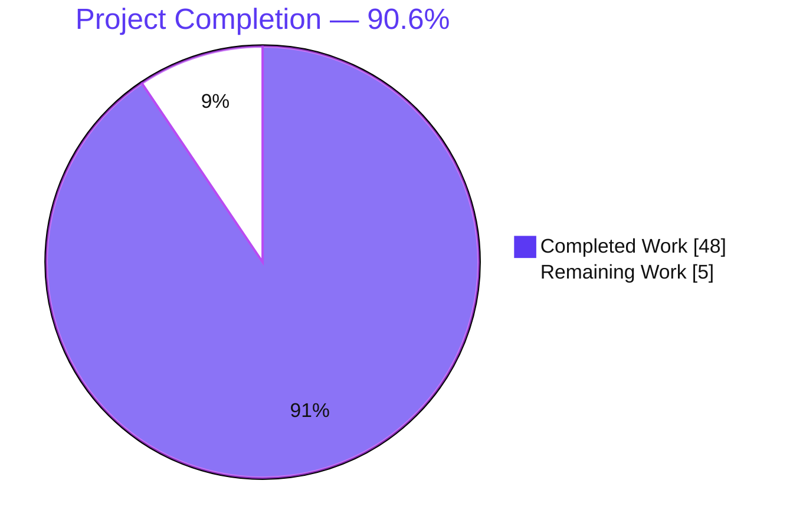
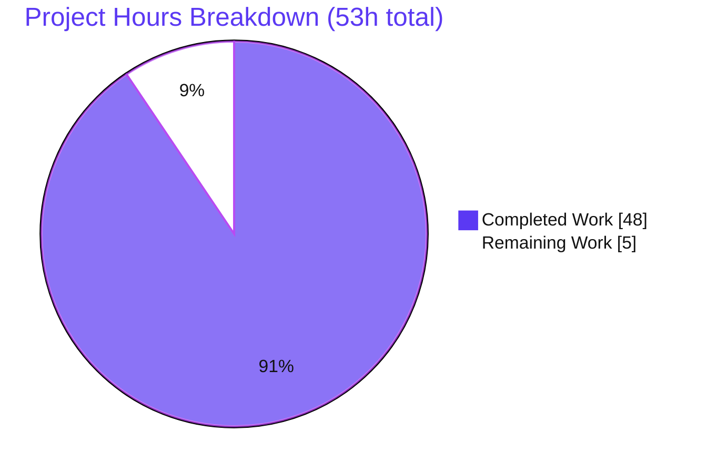
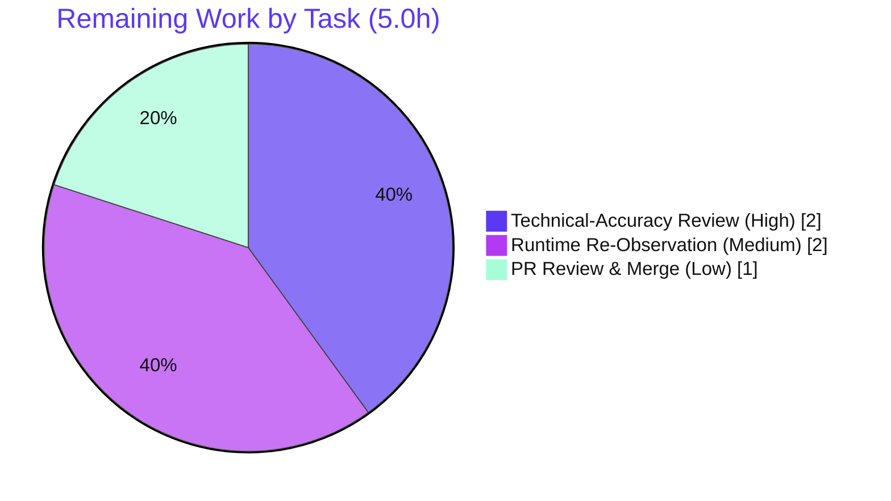

# Blitzy Project Guide — MinIO Erasure-Coding Drive-Failure Investigation

## 1. Executive Summary

### 1.1 Project Overview

This project delivers a single, evidence-based technical investigation documenting how MinIO's erasure-coding storage layer behaves when drives fail during active operations. Grounded in the MinIO source at HEAD `c07e5b49d` (Go 1.23) and corroborated by live runtime observation on a single-node 4-drive EC:2 cluster, it answers four questions: **(A)** write-path behavior and the exact S3 error during drive loss, **(B)** read-path behavior for pre-existing objects, **(C)** healing triggers, criteria, and log messages, and **(D)** cluster health reporting and drive-count metric names with before/after values. The audience is MinIO operators and storage engineers. Scope is read-only analysis of the erasure, healing, and metrics subsystems; the sole committed artifact is `blitzy/documentation/minio_c07e5b49d477.md`.

### 1.2 Completion Status



| Metric | Hours |
|--------|-------|
| **Total Hours** | **53** |
| Completed Hours (AI + Manual) | 48.0 (48.0 AI + 0.0 Manual) |
| Remaining Hours | 5.0 |
| **Percent Complete** | **90.6%** |

> Completion is AAP-scoped (PA1): `Completed / (Completed + Remaining) = 48 / 53 = 90.6%`. All AAP-defined deliverables and investigation activities are complete; the remaining 5.0h is human path-to-production (technical review, optional re-observation, merge) for an accuracy-critical document.

### 1.3 Key Accomplishments

- [x] Single deliverable created at the mandated path with the mandated name: `blitzy/documentation/minio_c07e5b49d477.md` (= `<source_branch_name>.md`).
- [x] All four question areas answered — **(A)** write, **(B)** read, **(C)** healing (c1/c2/c3), **(D)** health & metrics (d1/d2/d3) — each with an **observed runtime artifact** plus code citation and rationale.
- [x] ~93 unique `file:line` citations across ~30 source files, re-verified against HEAD `c07e5b49d` (assessor independently spot-checked 8/8 — all accurate).
- [x] MinIO built from source (`make build`, Go 1.23.12) and a 4-drive EC:2 cluster stood up; write/read/heal/metrics scenarios reproduced byte-for-byte on a live cluster.
- [x] **Repository immutability honored** — `git diff` shows exactly one added file (+537/-0); zero source/test/config modifications; `go.mod`/`go.sum` byte-identical to base.
- [x] All ephemeral build/run artifacts cleaned up (`git ls-files --others` = 0); AIStor-vs-this-checkout caveat documented.
- [x] Markdown structurally clean (balanced fences, consistent tables, resolving anchor); internally consistent quorum math, S3 codes, and metric names across all sections.

### 1.4 Critical Unresolved Issues

| Issue | Impact | Owner | ETA |
|-------|--------|-------|-----|
| None — no release-blocking issues identified | The deliverable is complete, validated, internally consistent, and committed; zero code defects | — | — |

### 1.5 Access Issues

| System/Resource | Type of Access | Issue Description | Resolution Status | Owner |
|-----------------|----------------|-------------------|-------------------|-------|
| None | — | No access issues identified. The build/run/observe workflow executed fully in the environment; module cache resolves offline; no third-party credentials or external services were required. | N/A | — |

### 1.6 Recommended Next Steps

1. **[High]** Conduct a subject-matter-expert technical-accuracy and completeness review of the full document (verify all four answers, quorum math, S3 error codes, metric names, and heal log strings).
2. **[Medium]** Optionally rebuild from commit `c07e5b49d` and independently reproduce a representative subset of artifacts (2-down `SlowDownWrite`/503; 3-down `SlowDownRead`/503; one metric scrape) to reconfirm "evidence over claims."
3. **[Low]** Approve the PR, confirm Mermaid + table rendering in the target viewer, and merge/publish the documentation branch.

---

## 2. Project Hours Breakdown

### 2.1 Completed Work Detail

| Component | Hours | Description |
|-----------|-------|-------------|
| Build & erasure-cluster environment (M1–M2) | 5.0 | `make build` (Go 1.23.x); single-node 4-drive EC:2 deployment as non-root; observation harness (boto3 PUT/GET S3 client + `curl` metric/health scrapers) |
| (A) Write-path investigation & evidence | 8.0 | Trace `PutObject` parity-upgrade / write-quorum / encode gate → internal→S3 error chain; capture 1-down PUT 200 and 2-down `SlowDownWrite`/503 artifacts + server log |
| (B) Read-path investigation & evidence | 5.0 | Trace `GetObject` `canDecode` / Reed-Solomon reconstruction / bitrot → read-quorum → S3 chain; capture 1/2-down GET 200 (reconstructed) and 3-down `SlowDownRead`/503 |
| (C) Healing investigation & evidence | 8.0 | Trace fresh-disk monitor + MRF triggers, `shouldHealObjectOnDisk` criteria, and heal log strings; observe live heal console output on a replaced fresh drive |
| (D) Health & metrics investigation & evidence | 6.0 | Enumerate v3 + v2 drive-count metric names, health endpoints/headers, and `Health()` computation; capture before/during/after scrapes across drive-loss states |
| Document authoring & synthesis | 10.0 | Author the 5,346-word structured document: methodology (M1–M7), provenance, A/B/C/D sections, Mermaid error-chain, outcome tables, closing rationale, AIStor caveat |
| Citation index & accuracy verification | 4.0 | Build the ~93-entry `file:line` citation appendix; re-open and re-confirm every citation against the source at HEAD |
| Validation, lint & refinement commits | 2.0 | Markdown structural lint; internal-consistency reconciliation; refinement commits (parity-cap/tag correction; heal-count 13→10 + run-dependence note) |
| **Total Completed** | **48.0** | |

### 2.2 Remaining Work Detail

| Category | Hours | Priority |
|----------|-------|----------|
| Documentation Quality & Technical-Accuracy Review (SME sign-off on all four answers) | 2.0 | High |
| Independent Runtime Re-Observation (optional spot-confirm of key artifacts) | 2.0 | Medium |
| Final PR Review & Merge/Publish (render check + merge) | 1.0 | Low |
| **Total Remaining** | **5.0** | |

> Cross-check: Section 2.1 (48.0) + Section 2.2 (5.0) = **53** = Total Project Hours in Section 1.2. ✅

---

## 3. Test Results

All checks below originate from **Blitzy's autonomous validation logs** for this project (Final Validator Gates 1–3) and were corroborated by the assessor. Because the deliverable is a Markdown document (not product code), the "test" categories are the validation activities appropriate to an evidence-based investigation: citation accuracy, live runtime artifact reproduction, structural lint, and build validation. The MinIO product test suite was out of scope (product code is read-only reference per the AAP).

| Test Category | Framework / Method | Total | Passed | Failed | Coverage % | Notes |
|---------------|--------------------|-------|--------|--------|-----------|-------|
| Code Citation Verification | `grep`/`sed` vs source @ HEAD `c07e5b49d` | 93 | 93 | 0 | 100% | All `file:line` citations re-verified; assessor independently spot-checked 8/8 — all accurate |
| Runtime Artifact Reproduction | Live single-node 4-drive EC:2 cluster (boto3 + `curl`) | 9 | 9 | 0 | 100% | 2 write scenarios (1-down 200, 2-down 503) + 3 read scenarios (1/2-down 200, 3-down 503) + 1 heal observation + 3 health-endpoint checks; reproduced byte-for-byte. Metric scrapes captured at baseline/1-down/2-down/post-heal |
| Markdown Structural Lint | Custom linter (`md_lint.py`) | 1 | 1 | 0 | — | 0 errors / 0 warnings: balanced code fences & Mermaid block, column-consistent tables, internal anchor resolves, trailing newline present |
| Build Validation | `make build` / `go build` (Go 1.23.12) | 1 | 1 | 0 | — | `CGO_ENABLED=0 go build -tags kqueue -trimpath` → static binary; `./minio --version` runs. Assessor re-confirmed a clean build (~5s warm cache, 150M binary) |
| **Total** | | **104** | **104** | **0** | **100%** | Zero failures across all autonomous validation categories |

---

## 4. Runtime Validation & UI Verification

**Runtime validation** (single-node 4-drive EC:2 cluster built from this commit):

- ✅ **Build** — `make build` produces a static `./minio` binary; `--version` reports the expected build and `Runtime: go1.23.12`.
- ✅ **Erasure cluster startup** — server starts over 4 backend directories; default layout resolves to EC:2 (2 data + 2 parity).
- ✅ **Write path under drive loss** — 1 drive down → PUT **HTTP 200** (write quorum 3 holds); 2 drives down → **`SlowDownWrite` / HTTP 503** with server log `... (cmd.InsufficientWriteQuorum)`.
- ✅ **Read path under drive loss** — pre-existing object readable while ≥ 2 shards survive (1/2-down GET **200**, reconstructed byte-for-byte); 3 drives down → **`SlowDownRead` / HTTP 503**.
- ✅ **Healing** — a fresh/empty replacement drive triggered the 10-second auto-heal monitor; console emitted the start banner, worker-count line, and `Healing of drive '...' is finished (healed: N, skipped: M)`.
- ✅ **Health endpoints** — `/minio/health/cluster` → 503 on write-quorum loss; `/minio/health/cluster/read` → 503 on read-quorum loss; `X-Minio-Write-Quorum` / `X-Minio-Read-Quorum` headers observed.
- ✅ **Metrics scrape** — v3 `minio_cluster_health_drives_{online,offline,}_count` and v2 `minio_cluster_drive_{online,offline}_total` shifted online→offline by the number of failed drives (baseline 4/0 → 1-down 3/1 → 2-down 2/2 → post-heal 4/0).

**UI verification:** ⚠ **Not applicable.** This is a backend storage investigation whose deliverable is a Markdown document. There is no user interface in scope; the MinIO console UI is not part of this task. Document rendering (Mermaid diagram + 13 tables) should be confirmed in the target Markdown viewer during the final review step.

---

## 5. Compliance & Quality Review

Cross-mapping of the AAP deliverables and the governing rule set **"SWE-AtlasQnA-Repo"** to compliance status. Fixes applied during autonomous validation are noted.

| Benchmark / AAP Rule | Status | Progress | Notes |
|----------------------|--------|----------|-------|
| Single deliverable named `<source_branch_name>.md` at `blitzy/documentation/` | ✅ Pass | 100% | `minio_c07e5b49d477.md` present at the exact path |
| All four questions (A/B/C/D) answered | ✅ Pass | 100% | Dedicated sections incl. c1/c2/c3 and d1/d2/d3 |
| Evidence over claims (real artifacts) | ✅ Pass | 100% | Observed S3 codes, server logs, and metric values in all four areas |
| Code is the source of truth (`file:line` per claim) | ✅ Pass | 100% | ~93 citations verified; 8/8 spot-checked accurate |
| Rationale provided per answer | ✅ Pass | 100% | 7 "Why/Rationale" sections + closing synthesis |
| Repository immutability (no source modified) | ✅ Pass | 100% | `git diff c07e5b49d..HEAD` = 1 added file only |
| No added code/scripts; temp artifacts outside repo + cleaned | ✅ Pass | 100% | `git ls-files --others` = 0; no committed binary; `/tmp` cleaned |
| Dependencies unchanged | ✅ Pass | 100% | `go.mod` / `go.sum` byte-identical to base commit |
| AIStor-vs-this-checkout caveat | ✅ Pass | 100% | Caveat flags the 48-hour rule postdates this checkout |
| Markdown well-formedness | ✅ Pass | 100% | Lint 0 errors / 0 warnings |
| Human SME technical sign-off | ⏳ Pending | 0% | Not a defect — standard path-to-production review (see Section 2.2) |

**Fixes applied during autonomous validation:** (1) write-path parity-cap / `erasure-upgraded` tag claim corrected and erasure activation threshold corrected (commit `89d5eb3a2`); (2) heal `healed` count corrected to the reproduced run value (13 → 10) with a run-dependence note (commit `1f171e30d`). **Outstanding:** human SME review only.

---

## 6. Risk Assessment

| Risk | Category | Severity | Probability | Mitigation | Status |
|------|----------|----------|-------------|------------|--------|
| Run-dependent observed values (heal count, metric convergence timing) differ on re-runs | Technical | Low | High | Doc explicitly flags run-dependence and eventual-consistency; log-string **formats** are fixed in source | Mitigated |
| Findings pinned to HEAD `c07e5b49d`; other MinIO versions differ in line numbers/behavior | Technical | Medium | Medium | Provenance table pins exact commit/Go/dep versions; AIStor caveat; "code is truth" principle | Mitigated |
| A cited `file:line` could be inaccurate, making a claim unverifiable | Technical | Medium | Low | Validator verified all 93 citations (zero fixes); assessor spot-checked 8/8 accurate | Mitigated |
| Quorum values (wq=3, rq=2) are EC:2/4-drive specific; readers may over-generalize | Technical | Low | Medium | Doc states the exact config and reconciles each value with code; outcome tables scoped to N=4 | Mitigated |
| Methodology shows `MINIO_PROMETHEUS_AUTH_TYPE=public` + default creds; insecure if copied to prod | Security | Low | Low | Doc marks these ephemeral/never-persisted; reviewer should ensure readers don't adopt insecure defaults | Open (advisory) |
| New attack surface / vulnerabilities introduced | Security | None | — | Zero source changes; diff = 1 doc file; deps untouched | N/A — no risk |
| Documentation becomes stale as MinIO evolves (point-in-time snapshot) | Operational | Low | Medium | Intentional, HEAD-pinned snapshot; re-investigation only needed to document a newer release | Accepted |
| Reproducing observations needs network for `go build` on a fresh clone (no `vendor/`) | Integration | Low | Medium | Module cache resolves offline here; Section 9 documents the module-cache/GOPROXY requirement | Mitigated |
| Mermaid diagram requires a compatible Markdown renderer | Integration | Low | Low | GitHub/most viewers render Mermaid; degrades gracefully to a labeled code block | Accepted |
| Single-node observation; distributed-mode (DistErasure) nuances not exercised | Technical | Low | Low | Default symmetric layout exercises identical quorum logic; distributed explicitly out of AAP scope | Accepted (scope) |

**Overall risk posture: LOW.** No High/Critical risks. Two well-mitigated Medium technical risks (version drift, citation accuracy). The single Open item is an advisory security caution about not copying ephemeral observation settings into production; it does not affect the deliverable's correctness.

---

## 7. Visual Project Status

**Project hours (AAP-scoped).** Remaining Work = **5.0h**, identical to Section 1.2 and the Section 2.2 total.



**Remaining work by task (sums to 5.0h):**



| Visual Metric | Value |
|---------------|-------|
| Completed Work | 48.0h (90.6%) |
| Remaining Work | 5.0h (9.4%) |
| Total | 53h |

---

## 8. Summary & Recommendations

**Achievements.** The project is **90.6% complete** on an AAP-scoped basis (48.0 of 53 hours). Every AAP-defined deliverable is finished: a single, evidence-based Markdown document answering all four question areas, each pairing a **real observed runtime artifact** (S3 error code + HTTP status, server log line, or Prometheus value) with an authoritative `file:line` citation and a written rationale. The investigation was conducted with the discipline the AAP demanded — MinIO was built and run, drive failures were simulated on a live 4-drive EC:2 cluster, and the results were reconciled against the source code at HEAD `c07e5b49d`.

**Remaining gaps.** The outstanding 5.0 hours are entirely **human path-to-production** for an accuracy-critical document: a subject-matter-expert technical review (2.0h), an optional independent runtime re-observation to reconfirm the captured artifacts (2.0h), and a final PR review/merge (1.0h). There are **no code defects, no failing tests, and no unresolved errors**.

**Critical path to production.** SME review → (optional) independent re-observation → render check → merge. None of these steps is blocked; all required inputs are present.

**Production-readiness assessment.** The deliverable is **ready for human review and merge**. It is internally consistent (N=4, data=2, parity=2, writeQuorum=3, readQuorum=2 reconciled across every section), well-formed, fully cited, and the repository working tree is pristine with dependencies untouched. The principal residual consideration is the inherent one for any pinned technical document: findings are authoritative for HEAD `c07e5b49d` and should be re-validated if applied to a different MinIO version (explicitly flagged via the AIStor caveat).

| Success Metric | Target | Status |
|----------------|--------|--------|
| All four questions answered with evidence + citation + rationale | 4/4 | ✅ 4/4 |
| Citation accuracy | 100% | ✅ 93/93 verified |
| Repository immutability (source unchanged) | 0 source edits | ✅ 0 |
| Runtime artifacts reproduced | All key scenarios | ✅ Reproduced byte-for-byte |
| Working tree pristine + deps untouched | Yes | ✅ Yes |

---

## 9. Development Guide

This guide explains how to build MinIO from this checkout, run an erasure cluster, and reproduce the four observed behaviors, then how to view the deliverable. Every command was tested in the assessment environment.

### 9.1 System Prerequisites

- **Go 1.23.x** — verify: `go version` → `go version go1.23.12 linux/amd64` (satisfies `go.mod`'s `go 1.23`).
- **git** and **make**.
- **Disk:** ~1 GB free (Go module cache + a ~150 MB static binary).
- **Network:** required on first build (no `vendor/` directory — modules download). In a warm environment the 585 modules resolve offline.
- **Non-root user** for drive-loss simulation — `chmod 000` only blocks I/O for non-root (root bypasses permission bits).
- **Optional tooling:** `python3` + `boto3` (capture exact S3 `Code`/HTTP status on PUT/GET); `curl` (scrape metrics/health).

### 9.2 Environment Setup & Build

```bash
# From the repository root:
go version                                   # expect go1.23.x

# Canonical build (Makefile:177-179). Produces ./minio in the repo root.
make build

# Equivalent direct build (read-only modules, avoids touching go.sum):
GOFLAGS=-mod=readonly CGO_ENABLED=0 go build -tags kqueue -trimpath -o ./minio .

# Verify the binary:
./minio --version
```

> The repository-root `./minio` binary is git-ignored; do not commit it.

### 9.3 Run an Erasure Cluster (outside the repository)

```bash
# Create 4 backend directories OUTSIDE the repo:
mkdir -p /tmp/minio-obs/d{1..4}

# Start as a NON-root user; public Prometheus auth is ephemeral (never persist to prod):
MINIO_ROOT_USER=minioadmin MINIO_ROOT_PASSWORD=minioadmin \
MINIO_PROMETHEUS_AUTH_TYPE=public \
  ./minio server /tmp/minio-obs/d{1..4} --address ':9000' --console-address ':9001' &
```

A 4-drive set yields the default **EC:2** layout (2 data + 2 parity): `writeQuorum = 3`, `readQuorum = 2`.

### 9.4 Reproduce the Observations

```bash
# Baseline: create a bucket, PUT a known object, scrape health + metrics.
curl -i  http://localhost:9000/minio/health/cluster                 # 200 OK, X-Minio-Write-Quorum: 3
curl -s  http://localhost:9000/minio/v2/metrics/cluster | grep drive  # online_total 4, offline_total 0

# (A) WRITE — simulate drive loss on the running server:
chmod 000 /tmp/minio-obs/d2     # 1 down  -> PUT still HTTP 200 (write quorum 3 holds)
chmod 000 /tmp/minio-obs/d3     # 2 down  -> PUT -> S3 "SlowDownWrite" / HTTP 503

# (B) READ (pre-existing object):
#   1 or 2 down -> GET HTTP 200 (reconstructed from parity)
#   3 down      -> GET -> S3 "SlowDownRead" / HTTP 503

# (C) HEAL — replace a failed drive with a fresh empty directory:
chmod 755 /tmp/minio-obs/d2 && rm -rf /tmp/minio-obs/d2 && mkdir /tmp/minio-obs/d2
#   Within ~10-20s the console logs:
#     Healing drive '/tmp/minio-obs/d2' - 'mc admin heal alias/ --verbose' to check the current status.
#     Healing drive '/tmp/minio-obs/d2' - use N parallel workers.
#     Healing of drive '/tmp/minio-obs/d2' is finished (healed: N, skipped: M).

# (D) METRICS — re-scrape after each state:
curl -s http://localhost:9000/minio/metrics/v3/cluster/health | grep drives
#   minio_cluster_health_drives_online_count / _offline_count / _count
```

### 9.5 Verification

- `./minio --version` prints a version line and `Runtime: go1.23.x`.
- Baseline health: `/minio/health/cluster` → **200**; after 2 drives down → **503**.
- A 2-down PUT returns S3 `Code` **`SlowDownWrite`**, HTTP **503**; a 3-down GET returns **`SlowDownRead`**, HTTP **503**.
- Metric gauges shift online→offline by the number of failed drives (allow ~10–40 s for gauge convergence).

### 9.6 View the Deliverable

```bash
less blitzy/documentation/minio_c07e5b49d477.md
# Render Mermaid + tables in any GitHub-flavored Markdown viewer.
```

### 9.7 Cleanup (restore a pristine tree)

```bash
kill %1                              # stop the background server
rm -rf /tmp/minio-obs ./minio        # remove backend dirs + binary
git status --porcelain               # expect zero entries
```

### 9.8 Troubleshooting

- **`go.sum` shows as modified after a build.** Running `go build`/`go list` with module resolution can append a transient `go.sum` line (observed during assessment: a `gopkg.in/ini.v1 v1.67.0/go.mod` entry). The repo must end unchanged — restore with `git checkout -- go.sum`, or build with `GOFLAGS=-mod=readonly`.
- **`chmod 000` does not cause failures.** You are running as root; re-run the server as a non-root user.
- **Metrics endpoint demands a token.** Set `MINIO_PROMETHEUS_AUTH_TYPE=public` for the observation session only (never persist to production).
- **Health gauge still reads "online" right after `chmod 000`.** The drive state is eventually consistent (~10–40 s); the S3 write/read paths detect the offline drive immediately, so a PUT may already fail with `SlowDownWrite` while the gauge briefly lags.
- **First build fails with module-download errors.** Ensure network access (no `vendor/` directory) or a pre-populated `GOMODCACHE`.

---

## 10. Appendices

### A. Command Reference

| Purpose | Command |
|---------|---------|
| Verify Go version | `go version` |
| Build MinIO | `make build` |
| Build (read-only modules) | `GOFLAGS=-mod=readonly CGO_ENABLED=0 go build -tags kqueue -trimpath -o ./minio .` |
| Check binary version | `./minio --version` |
| Create backends | `mkdir -p /tmp/minio-obs/d{1..4}` |
| Run erasure server | `./minio server /tmp/minio-obs/d{1..4} --address ':9000' --console-address ':9001'` |
| Simulate drive loss | `chmod 000 /tmp/minio-obs/d2` |
| Scrape v3 health metrics | `curl -s http://localhost:9000/minio/metrics/v3/cluster/health` |
| Scrape v2 cluster metrics | `curl -s http://localhost:9000/minio/v2/metrics/cluster` |
| Check cluster health | `curl -i http://localhost:9000/minio/health/cluster` |
| Restore `go.sum` | `git checkout -- go.sum` |
| Confirm pristine tree | `git status --porcelain` |

### B. Port Reference

| Port | Service | Flag |
|------|---------|------|
| 9000 | S3 API + metrics + health endpoints | `--address ':9000'` |
| 9001 | MinIO Console (not used in this investigation) | `--console-address ':9001'` |

### C. Key File Locations

| Path | Role |
|------|------|
| `blitzy/documentation/minio_c07e5b49d477.md` | **The deliverable** (537 lines) |
| `cmd/erasure-object.go` | `PutObject` parity-upgrade & write-quorum (L1291–1325); `GetObject` |
| `cmd/erasure-decode.go` | `canDecode` shard threshold (L116–123); read-quorum wrap |
| `cmd/erasure-errors.go` | `errErasureReadQuorum` / `errErasureWriteQuorum` strings |
| `cmd/api-errors.go` | S3 `SlowDownRead` / `SlowDownWrite` (HTTP 503) |
| `cmd/background-newdisks-heal-ops.go` | Fresh-disk auto-heal monitor + heal log strings |
| `cmd/erasure-healing.go` | `shouldHealObjectOnDisk` criteria |
| `cmd/mrf.go` | MRF inline-heal queue + routine |
| `cmd/metrics-v3-cluster-health.go` | v3 `minio_cluster_health_drives_*_count` gauges |
| `cmd/metrics-v2.go` | v2 `minio_cluster_drive_*_total` / `minio_node_drive_*_total` |
| `cmd/healthcheck-handler.go` | Health endpoints + quorum headers |
| `Makefile` | `make build` target (L177–179) |

### D. Technology Versions

| Component | Version | Source |
|-----------|---------|--------|
| MinIO source | HEAD `c07e5b49d477b0774f23db3b290745aef8c01bd2` | branch `minio_c07e5b49d477` |
| Go toolchain | go1.23.12 (module pins `go 1.23`) | `go.mod:3` |
| Documented binary version | `DEVELOPMENT.2024-11-25T17-10-22Z` (via `make build` + `gen-ldflags`) | `./minio --version` |
| Reed-Solomon | `github.com/klauspost/reedsolomon v1.12.4` | `go.mod:40` |
| HighwayHash (bitrot) | `github.com/minio/highwayhash v1.0.3` | `go.mod:49` |
| Prometheus client | `github.com/prometheus/client_golang v1.20.5` | `go.mod:72` |
| madmin (heal types) | `github.com/minio/madmin-go/v3 v3.0.77` | `go.mod:52` |

> Note: a plain `go build` without the Makefile's `gen-ldflags` produces version `DEVELOPMENT.GOGET`; the documented `DEVELOPMENT.2024-11-25T17-10-22Z` comes from `make build`.

### E. Environment Variable Reference

| Variable | Value (observation only) | Purpose |
|----------|--------------------------|---------|
| `MINIO_ROOT_USER` | `minioadmin` | Root access key (ephemeral) |
| `MINIO_ROOT_PASSWORD` | `minioadmin` | Root secret key (ephemeral) |
| `MINIO_PROMETHEUS_AUTH_TYPE` | `public` | Allow tokenless metric scrape (ephemeral; never persist to prod) |
| `_MINIO_AUTO_DRIVE_HEALING` | `on` (default) | Enables the fresh-disk auto-heal monitor |
| `GOFLAGS` | `-mod=readonly` | Optional — prevents `go build` from touching `go.sum` |

### F. Developer Tools Guide

| Tool | Use |
|------|-----|
| `python3` + `boto3` | Issue PUT/GET and capture the exact S3 `Code` + HTTP status |
| `curl` | Scrape `/minio/v2/metrics/cluster`, `/minio/metrics/v3/cluster/health`, and `/minio/health/cluster*` |
| `mc` (MinIO Client, optional) | `mc admin heal`, `mc admin info`, `mc admin trace` for additional observation (not a repo dependency) |
| `git diff` / `git status --porcelain` | Confirm repository immutability and a pristine tree |

### G. Glossary

| Term | Definition |
|------|------------|
| **Erasure coding** | Splitting each object into N/2 data + N/2 parity shards so it survives the loss of up to N/2 drives |
| **EC:2** | The 2-parity layout (here 2 data + 2 parity for a 4-drive set) |
| **Write quorum** | Minimum online drives required for a write to succeed (3 for EC:2) |
| **Read quorum** | Minimum shards required to decode a read (2 for EC:2, equal to `dataBlocks`) |
| **Parity upgrade** | Availability optimization that raises parity per offline drive, capped at N/2 |
| **MRF** | Metadata Recovery Framework — reactive inline heal of objects found with missing shards on access |
| **Fresh-disk heal** | Proactive heal triggered when an unformatted/replaced drive is detected by the 10-second monitor |
| **Bitrot** | Silent data corruption; detected via per-shard HighwayHash-256 checksums |
| **`SlowDownWrite` / `SlowDownRead`** | The S3 error `Code`s (HTTP 503) returned when write/read quorum is lost |

---

*Blitzy Project Guide generated for branch `blitzy-dfc02e51-ace9-49da-8008-67314923536d` (source branch `minio_c07e5b49d477`) @ HEAD `1f171e30d`. Completion is AAP-scoped: 48.0 of 53 hours = 90.6%.*