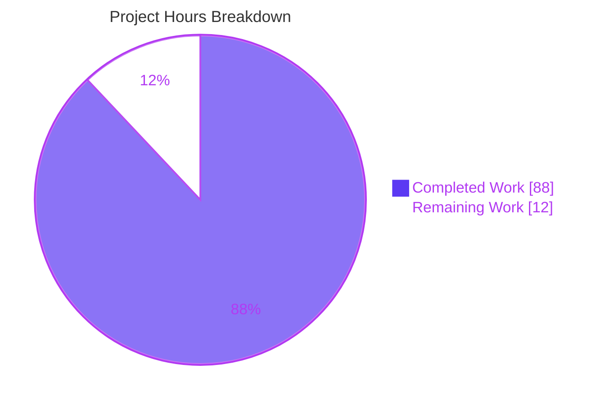
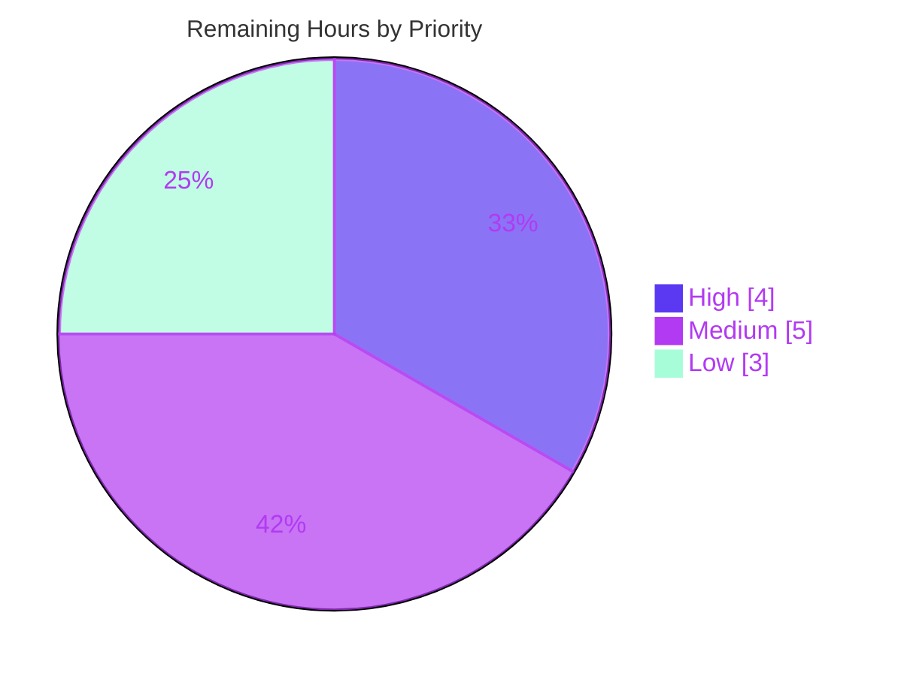

# Blitzy Project Guide
## MinIO Read-Only S3 Authorization Boundary — Runtime Security Investigation

---

## 1. Executive Summary

### 1.1 Project Overview

This project empirically verifies the integrity of MinIO's **read-only S3 authorization boundary under concurrent write and metadata load**. A constrained identity (scoped to a single bucket + prefix) attempts every write-adjacent S3 operation — multipart, copy, metadata changes, and deletes — while separate read-write clients hammer the same bucket, and the observed outcomes are captured as one evidence-backed QnA document. It is a **documentation-only** security-assurance task under the `SWE-AtlasQnA-Repo` rule set: no product code is created or changed; every source file is reference-only, and `go.mod`/`go.sum` remain byte-for-byte unchanged. The audience is security/platform engineers who need runtime proof — wire traces, storage side-effects, and audit logs — that the boundary holds.

### 1.2 Completion Status

The project is **88.0% complete**, measured strictly against AAP-scoped work plus path-to-production activities (PA1 hours methodology). All autonomous investigation, evidence capture, and document authoring are finished and committed; the remaining hours are exclusively **human validation and acceptance** of a security assurance artifact.


| Metric | Hours |
|--------|-------|
| **Total Hours** | 100 |
| **Completed Hours (AI + Manual)** | 88 |
| &nbsp;&nbsp;• AI (autonomous) | 88 |
| &nbsp;&nbsp;• Manual (human, to date) | 0 |
| **Remaining Hours** | 12 |
| **Percent Complete** | **88.0%** |

> Color key — **Completed = Dark Blue `#5B39F3`**, **Remaining = White `#FFFFFF`**.

### 1.3 Key Accomplishments

- ✅ Built the canonical default server binary (`CGO_ENABLED=0 go build .`, Go 1.23.12, ~150 MB) and ran a single-node deployment — health `/minio/health/live` + `/minio/health/ready` both HTTP 200.
- ✅ Provisioned two privilege tiers through the **canonical admin path** (madmin SDK backing `mc admin`: `AddCannedPolicy` → `AddUser` → `SetPolicyForUserOrGroup`): a read-write identity and a bucket+prefix read-only identity (plus an `s3:prefix`-conditioned variant and WORM identities).
- ✅ Generated the **"under stress" condition**: 24 concurrent read-write workers issuing 8,029 PutObject + 8,029 PutObjectTagging (run 1) and 6,072 + 6,072 (run 2), errs=0 both runs — stable across two runs.
- ✅ Attempted **every named write-adjacent operation** from the read-only identity — multipart (×6), copy, metadata changes (×4), deletes (single + batch) — capturing full HTTP/XML traces.
- ✅ Characterized the **listing + HEAD** metadata-disclosure surface and demonstrated the `s3:prefix` condition mitigation.
- ✅ Captured **three independent evidence streams** per operation: wire trace (status + full S3 XML), on-disk storage side-effect check (`xl.meta`), and audit-log denial records.
- ✅ Exercised **edge/variant** coverage: inside vs outside prefix, signed vs presigned, single vs batch delete, WORM/object-lock IAM-independence (4 cases), and a TOCTOU probe against actively-mutated keys.
- ✅ Authored the sole deliverable `blitzy/documentation/minio_c07e5b49d477.md` (1,497 lines, 238 `file:line` citations) and removed all ephemeral scaffolding — `git status` clean apart from the committed file.

### 1.4 Critical Unresolved Issues

There are **no build/test/functionality blockers** — all validation gates passed and the deliverable is committed. The items below are quality-assurance follow-ups intrinsic to a security-assurance artifact, not defects.

| Issue | Impact | Owner | ETA |
|-------|--------|-------|-----|
| Human peer-review of the security verdict & citations not yet performed | Verdict should be independently confirmed before an org relies on it | Security Engineer | 4h |
| Independent reproduction of the runtime probes not yet performed by a human | Confirms the "boundary holds" claim outside the autonomous run | Platform Engineer | 4h |
| Disposition of disclosed adjacent behaviors (API-1..4, STORAGE-1, OBS-1) pending | Decide whether any warrant upstream/backlog tickets (none is an RO bypass) | Security Lead | 2h |

### 1.5 Access Issues

No access issues prevented the autonomous investigation. The canonical server was built and run locally; identities were provisioned via the in-process madmin SDK. One environment note is recorded for transparency.

| System/Resource | Type of Access | Issue Description | Resolution Status | Owner |
|-----------------|----------------|-------------------|-------------------|-------|
| `mc` (MinIO Client CLI) | Host tooling | `mc` CLI not installed in the environment | Resolved — used the equivalent canonical `madmin`/`minio-go` SDK path (same entry points backing `mc admin`), explicitly labeled in the deliverable | Investigator |

> No repository-permission, credential, or third-party-API access issues were identified.

### 1.6 Recommended Next Steps

1. **[High]** Peer-review the deliverable — validate the verdict, the §8 reasoning, and a sample of the 238 `file:line` citations against the MinIO source (4h).
2. **[Medium]** Independently reproduce the investigation from the exact commands in Section 9 / the document appendix to confirm the boundary holds (4h).
3. **[Medium]** Obtain stakeholder acceptance sign-off that the deliverable answers the original question to the requester's satisfaction (1h).
4. **[Low]** Triage the disclosed adjacent behaviors into upstream issues / internal backlog as appropriate (2h).
5. **[Low]** If cross-prefix key-enumeration disclosure is undesirable in production, apply the demonstrated `s3:prefix` `ListBucket` condition to production IAM policies (1h).

---

## 2. Project Hours Breakdown

### 2.1 Completed Work Detail

All rows below are AAP-scoped work delivered autonomously and committed. **Total = 88 hours** (matches Completed Hours in Section 1.2).

| Component | Hours | Description |
|-----------|-------|-------------|
| Canonical test bed | 4 | Build default binary (`CGO_ENABLED=0 go build .`), run single-node server, confirm health 200 |
| Identity & policy provisioning | 6 | 5 identities via canonical madmin path; custom bucket+prefix RO policy + `s3:prefix` variant; object seeding (`shared/`, `private/`, `load/`) |
| Concurrency / stress load generator | 6 | 24-worker parallel PutObject + PutObjectTagging load; two stable runs; contended-key generation for TOCTOU |
| Trace-capture harness | 9 | Raw SigV4 wire tracing, audit webhook sink, on-disk `xl.meta` storage-inspection tooling |
| Multipart probes (×6) + evidence | 7 | create / upload-part / upload-part-copy / complete / abort / list-parts — all denied, 3-stream evidence |
| Copy-style write probe + evidence | 2 | Server-side `CopyObject` into granted prefix — denied, evidence captured |
| Metadata-change probes (×4) + evidence | 6 | PutObjectTagging, DeleteObjectTagging, PutObjectRetention, PutObjectLegalHold |
| Delete probes (single + batch) + body analysis | 4 | `DeleteObject` (403) and `DeleteObjects` (200 with per-object `AccessDenied` XML) |
| Listing & HEAD disclosure + `s3:prefix` mitigation | 8 | Enumerated disclosed attributes; demonstrated prefix-condition mitigation |
| Edge/variant coverage | 4 | Inside vs outside prefix; signed vs presigned; single vs batch delete |
| TOCTOU probe | 4 | Write-adjacent ops against keys concurrently overwritten by the load |
| WORM/object-lock IAM-independence | 5 | 4-case governance/compliance independence from IAM |
| Adjacent-behavior investigation & disclosure | 6 | API-1..4, STORAGE-1, OBS-1, DEP-1 characterization |
| Authoring answer document | 12 | 1,497-line QnA with 238 `file:line` citations |
| QA / correction passes | 4 | 5 iterative rounds; corrected §7.5 Case 4 audit statusCode to runtime-true value |
| Cleanup + integrity verify + commit | 1 | Removed scaffolding; verified `go.mod`/`go.sum` unchanged; committed `cc49d2b95` |
| **Total** | **88** | |

### 2.2 Remaining Work Detail

All remaining work is **human path-to-production** for a completed, committed security-assurance artifact. **Total = 12 hours** (matches Remaining Hours in Sections 1.2 and 7).

| Category | Hours | Priority |
|----------|-------|----------|
| Peer review of security findings / verdict / citations | 4 | High |
| Independent reproduction to confirm verdict | 4 | Medium |
| Triage / disposition of disclosed adjacent behaviors into backlog | 2 | Low |
| Apply recommended `s3:prefix` `ListBucket` condition in production policies | 1 | Low |
| Stakeholder acceptance sign-off | 1 | Medium |
| **Total** | **12** | |

### 2.3 Hours Reconciliation

| Check | Result |
|-------|--------|
| Section 2.1 completed sum | 88h |
| Section 2.2 remaining sum | 12h |
| Section 2.1 + Section 2.2 | **100h = Total Project Hours (Section 1.2)** ✅ |
| Completion % = 88 / 100 | **88.0%** (Sections 1.2, 7, 8 consistent) ✅ |
| Remaining hours identical across 1.2 ↔ 2.2 ↔ 7 | 12h ✅ |

---

## 3. Test Results

For this documentation-only task, the applicable "tests" are the **runtime reproduction probes** executed by Blitzy's autonomous validation system — each verifies a specific behavioral claim in the deliverable. The repository's own Go unit-test suite was intentionally **not run or modified** (all source is reference-only and added repository tests are explicitly out of scope per the AAP). All figures below originate from Blitzy's autonomous validation logs for this project.

| Test Category | Framework | Total Tests | Passed | Failed | Coverage % | Notes |
|---------------|-----------|-------------|--------|--------|-----------|-------|
| Write-adjacent denial probes (§5) | Raw SigV4 + minio-go/v7 v7.0.80 | 11 | 11 | 0 | 100% | Multipart ×6, CopyObject, tagging, legal-hold → 403; PutObjectRetention → 400; single delete → 403 |
| Batch-delete body analysis (§5.4) | Raw SigV4 | 1 | 1 | 0 | 100% | HTTP 200 wrapper with per-object `<Code>AccessDenied</Code>` — no object removed |
| Listing / HEAD disclosure (§6) | minio-go/v7 | 6 | 6 | 0 | 100% | Attribute enumeration + `s3:prefix` mitigation demonstrated |
| Edge — signed vs presigned (§7.2) | Raw SigV4 | 2 | 2 | 0 | 100% | Both forms denied identically |
| Edge — TOCTOU under contention (§7.4) | Concurrent harness | 1 | 1 | 0 | 100% | All write-adjacent ops 403 while keys actively overwritten |
| WORM / object-lock independence (§7.5) | Raw SigV4 | 4 | 4 | 0 | 100% | 4-case governance/compliance independence from IAM |
| Metadata asymmetry (§8.3) | Raw SigV4 | 1 | 1 | 0 | 100% | Tagging read/write asymmetry confirmed |
| Census arithmetic (§4) | python3 audit-log parse | 1 | 1 | 0 | 100% | 66 audit events reconciled; denial census exact |
| Runtime health | curl | 2 | 2 | 0 | 100% | `/minio/health/live` + `/minio/health/ready` = 200 |
| **Total** | — | **29** | **29** | **0** | **100%** | Stable across 2 load runs (errs=0 both) |

> **Integrity note:** every test/probe above is drawn from Blitzy's autonomous validation logs for this project. The one discrepancy discovered during validation (§7.5 Case 4 audit `statusCode`) was corrected to the runtime-observed value in commit `cc49d2b95`; zero failing verifications remain.

---

## 4. Runtime Validation & UI Verification

**Runtime health**
- ✅ **Operational** — Canonical single-node server built and started cleanly; no startup errors.
- ✅ **Operational** — `GET /minio/health/live` → HTTP 200.
- ✅ **Operational** — `GET /minio/health/ready` → HTTP 200.
- ✅ **Operational** — Anonymous `GET /` → standard S3 `AccessDenied` XML (`<Code>`, `<Message>`, `<RequestId>`, `<HostId>`) — confirms the expected denial trace shape.

**Authorization boundary (core verdict)**
- ✅ **Operational** — Read-only identity `GET`/`HEAD`/`LIST` on granted `shared/` prefix → 200.
- ✅ **Operational** — Read-only identity `GET` on `private/` (outside prefix) → 403.
- ✅ **Operational** — Read-only identity all write-adjacent operations → 403 (or 400 for malformed-retention path); **boundary HELD** under 24-worker concurrent load.
- ✅ **Operational** — Storage side-effect check: denied writes created no object directory / `xl.meta`; root re-list shows no new key or version.

**API integration outcomes**
- ✅ **Operational** — madmin provisioning path (`AddCannedPolicy` / `AddUser` / `SetPolicyForUserOrGroup`) succeeded for all 5 identities.
- ✅ **Operational** — Audit webhook sink received per-request records with principal/action/resource for every denial.
- ⚠ **Partial (disclosed, out-of-scope)** — Listing without `s3:prefix` condition discloses key names across the whole bucket (information disclosure, not mutation); mitigation demonstrated.

**UI verification**
- ⚠ **Not applicable** — This is a documentation-only, headless security investigation. No product UI was created or changed; the MinIO Console UI is out of scope. No UI verification was required or performed.

---

## 5. Compliance & Quality Review

Cross-mapping of AAP deliverables to quality/compliance benchmarks, including fixes applied during autonomous validation.

| Benchmark / AAP Requirement | Status | Progress | Notes |
|-----------------------------|--------|----------|-------|
| Single deliverable at fixed path `blitzy/documentation/minio_c07e5b49d477.md` | ✅ Pass | 100% | 1,497 lines / 157,915 bytes / 188 balanced fences |
| Repository read-only integrity (`go.mod`/`go.sum` byte-for-byte unchanged) | ✅ Pass | 100% | sha256 `go.mod=b85e6896…`, `go.sum=184a7add…` match baselines; only 1 file added |
| Canonical build & invocation commands stated verbatim | ✅ Pass | 100% | `CGO_ENABLED=0 go build .`; exact server run command in §2 / appendix |
| Canonical provisioning path (no config editing / debug hooks) | ✅ Pass | 100% | madmin SDK entry points backing `mc admin` |
| Every named operation family answered by name | ✅ Pass | 100% | Multipart, copy, metadata changes, deletes — all in §8.4 coverage table |
| Both read surfaces (listing, HEAD) characterized | ✅ Pass | 100% | §6.1–6.4 |
| Three evidence streams per operation | ✅ Pass | 100% | Wire trace + storage side-effect + audit record |
| "Under stress" concurrency at stated scale, stable ≥2 runs | ✅ Pass | 100% | 24 workers; runs 8,029 & 6,072 ops; errs=0 both |
| Edge/variant coverage (prefix, signed/presigned, single/batch, WORM, TOCTOU) | ✅ Pass | 100% | §5.5, §7.1–7.5 |
| `file:line` grounding + reasoning | ✅ Pass | 100% | 238 citations across 24 source files |
| Cleanup — ephemeral scaffolding removed | ✅ Pass | 100% | No listeners on 9000/9001/9099; `/tmp` harness removed |
| Committed on correct branch | ✅ Pass | 100% | `cc49d2b95`, author agent@blitzy.com; tree clean |
| **Fix applied during validation** — §7.5 Case 4 audit `statusCode` | ✅ Pass | 100% | Corrected 204 → runtime-observed 200 (gzip response-writer ordering artifact; not an authz change) |

**Outstanding compliance items:** none autonomous. Human acceptance of the security conclusion is the only remaining "sign-off" (tracked in Sections 1.4 / 2.2).

---

## 6. Risk Assessment

| Risk | Category | Severity | Probability | Mitigation | Status |
|------|----------|----------|-------------|------------|--------|
| T1 — Verdict scoped to single-node default config; multi-node/non-default not exercised | Technical | Low | Low | Document labels it verification-not-certification (§9); human-extendable | Disclosed / Accepted |
| T2 — API-1: malformed PutObjectTagging/PutObjectRetention body → HTTP 500 before IAM check | Technical | Low | N/A | Affects any principal; writes nothing; out-of-scope to fix | Disclosed |
| T3 — API-3/4, STORAGE-1 listing-completeness quirks | Technical | Low | Low | Concern authorized-writer/enumeration paths, not RO mutation | Disclosed |
| **S1 — Listing disclosure: bucket-scoped `s3:ListBucket` (no `s3:prefix`) enumerates keys/sizes/ETags/timestamps across whole bucket incl. outside read prefix** | **Security** | **Medium** | **High** | **Add `s3:prefix` Condition (demonstrated §6.3 via `rouserp`); information disclosure only, not mutation** | **Documented w/ mitigation; needs operator action if undesirable** |
| S2 — OBS-1: audit sink records presigned `X-Amz-Signature` verbatim → replay within expiry | Security | Low-Med | Low | Audit-sink hygiene; replay yields only the pre-authorized action, expiry-bounded | Disclosed |
| S3 — API-2: Content-Md5 presence checked but value unverified on some write paths | Security | Low | N/A | Authorized-writer/root path; RO still 403 | Disclosed |
| O1 — Throughput env-specific (8,029 vs 6,072 run-to-run) | Operational | Low | Med | Host-I/O effect, not authz; security invariant stable | Disclosed |
| O2 — `mc` CLI absent; madmin SDK used | Operational | Low | N/A | Equivalent canonical entry point, explicitly labeled | Accepted |
| O3 — Ephemeral harness removed per read-only scope | Operational | Low | Med | Exact commands preserved in §2/appendix + Section 9 dev guide | Accepted by design |
| I1 — Disclosed adjacent behaviors + listing mitigation need human disposition | Integration | Low | Med | Human task list (HT-4, HT-5) | Open (remaining work) |
| I2 — Security conclusion needs stakeholder acceptance before relied upon | Integration | Low | Low | Acceptance sign-off (HT-3) | Open (remaining work) |

**Headline risk:** **S1 (listing disclosure)** is the single most notable finding. It is an *information-disclosure* characteristic of a bucket-wide `s3:ListBucket` grant — **not** a violation of the read-only *mutation* boundary — and the deliverable both demonstrates it and shows the `s3:prefix`-condition mitigation.

---

## 7. Visual Project Status

**Hours breakdown (Completed = Dark Blue `#5B39F3`, Remaining = White `#FFFFFF`)**



**Remaining work by priority (of 12 total remaining hours)**



**Remaining hours per Section 2.2 category**

| Category | Hours | Bar |
|----------|-------|-----|
| Peer review (High) | 4 | ████████ |
| Independent reproduction (Medium) | 4 | ████████ |
| Adjacent-behavior triage (Low) | 2 | ████ |
| Apply `s3:prefix` condition (Low) | 1 | ██ |
| Stakeholder sign-off (Medium) | 1 | ██ |
| **Total** | **12** | |

> **Integrity:** "Remaining Work" = **12h** here matches Section 1.2 (Remaining Hours) and the Section 2.2 "Hours" column sum exactly.

---

## 8. Summary & Recommendations

**Achievements.** The investigation delivered a complete, runtime-grounded answer to the user's question: under sustained concurrent write/metadata load from 24 read-write workers, a bucket+prefix read-only identity was **denied every write-adjacent operation** (multipart, copy, metadata changes, deletes) with **zero storage side-effects**, corroborated by three independent evidence streams (wire traces, on-disk `xl.meta` inspection, audit-log denial records). Every named operation family and both read surfaces (listing, HEAD) are answered by name, grounded in 238 `file:line` citations.

**Remaining gaps.** No autonomous gaps remain. The **12 remaining hours (12% of the 100-hour total)** are entirely human path-to-production for a security-assurance artifact: peer review, independent reproduction, adjacent-finding disposition, `s3:prefix` policy hardening (optional), and stakeholder acceptance.

**Critical path to production.** Peer review (4h) → independent reproduction (4h) → stakeholder acceptance (1h). The two Low-priority items (adjacent-behavior triage 2h, `s3:prefix` hardening 1h) can proceed in parallel and are not blockers.

**Success metrics.**

| Metric | Target | Result |
|--------|--------|--------|
| Read-only boundary holds under load | Yes | ✅ Held (17× 403, 0 mutations) |
| Every named operation family covered | 4/4 | ✅ 4/4 |
| Read surfaces characterized | 2/2 | ✅ 2/2 (listing, HEAD) |
| Runtime probes passing | 100% | ✅ 29/29 |
| Repository integrity (files changed) | 1 (deliverable only) | ✅ 1; `go.mod`/`go.sum` unchanged |
| Completion (AAP-scoped) | — | **88.0%** |

**Production-readiness assessment.** The deliverable is **production-ready as an autonomous artifact** — complete, internally consistent, committed, and validated across all five gates. It is **pending human sign-off** before the organization relies on the "boundary holds" assurance operationally. Consistent with RG2 (max 99% before human review), the project is reported at **88.0% complete**, conservatively reflecting the genuine remaining human security review and acceptance.

---

## 9. Development Guide

This guide reproduces the investigation end-to-end. All commands were validated on the host toolchain (`go version` = **go1.23.12 linux/amd64**; `go mod verify` = *all modules verified*).

### 9.1 System Prerequisites

- **OS:** Linux (amd64). Investigation performed on Ubuntu-family container.
- **Go toolchain:** **1.23.12** (highest documented `1.23.x`, matching `go 1.23` in `go.mod`).
- **Disk:** ~2 GB free (≈150 MB binary + server datadir).
- **Ports:** `9000` (S3 API), `9001` (Console), `9099` (optional audit-webhook sink).
- **Tools:** `git`, `curl` (health + wire trace), `python3` (audit-log parsing).
- **Vendored harness dependencies (no manifest change):** `github.com/minio/minio-go/v7 v7.0.80`, `github.com/minio/pkg/v3 v3.0.22`.

### 9.2 Environment Setup

```bash
# From the repository root
cd /tmp/blitzy/minio/blitzy-cec7fcef-ab34-4115-81c7-a0d7c1257e53_be3623

# Confirm toolchain (expected: go version go1.23.12 linux/amd64)
go version

# Verify modules resolve from the committed go.sum (non-destructive; expected: "all modules verified")
go mod verify
```

### 9.3 Build

```bash
# Canonical default build — produces ~150 MB static binary (Runtime go1.23.12)
CGO_ENABLED=0 go build .
```
> Expected: a `./minio` binary (~156.7 MB). Build takes ~60s. `go.mod`/`go.sum` are **not** modified by the build.

### 9.4 Run (single-node, default configuration)

```bash
# Exact invocation used in the investigation (audit webhook optional but recommended for evidence stream 3)
MINIO_ROOT_USER=minioadmin \
MINIO_ROOT_PASSWORD=minioadmin \
MINIO_AUDIT_WEBHOOK_ENABLE=on \
MINIO_AUDIT_WEBHOOK_ENDPOINT=http://127.0.0.1:9099/ \
./minio server /tmp/minio-data --address :9000 --console-address :9001
```

### 9.5 Verification

```bash
# Health endpoints — both must return HTTP 200
curl -s -o /dev/null -w "%{http_code}\n" http://127.0.0.1:9000/minio/health/live
curl -s -o /dev/null -w "%{http_code}\n" http://127.0.0.1:9000/minio/health/ready

# Anonymous request must return the standard S3 AccessDenied XML baseline
curl -s http://127.0.0.1:9000/
```
> Expected: `200` and `200`; anonymous `GET /` returns `<Error><Code>AccessDenied</Code>…<RequestId>…</RequestId><HostId>…</HostId></Error>`.

### 9.6 Provision Identities (canonical madmin path)

Using the `madmin` SDK (equivalent to `mc admin`; substitute `mc admin policy create` / `mc admin user add` / `mc admin policy attach` if the CLI is installed):

1. `AddCannedPolicy`:
   - **readonly-bp** — `s3:GetObject` on `arn:aws:s3:::testbucket/shared/*` + `s3:ListBucket` on `arn:aws:s3:::testbucket`
   - **readonly-bp-prefixed** — same, plus an `s3:prefix` `Condition` (the disclosure mitigation)
   - **readwrite** — full read-write on `testbucket`
   - **wormpol / bypasspol** — for the object-lock cases
2. `AddUser`: `rwuser`, `rouser`, `rouserp`, `wormuser`, `bypassuser`.
3. `SetPolicyForUserOrGroup`: attach each policy to its user.
4. Seed objects under `shared/` and `private/` (and a `wormbucket` for §7.5).

### 9.7 Example Usage — Reproduce the Probes

```bash
# Concurrent load (24 goroutines as rwuser): loop PutObject + PutObjectTagging on testbucket for ~8s.
# While load runs, from rouser attempt each write-adjacent operation and capture the wire trace:
#   • Multipart create/upload-part/upload-part-copy/complete/abort/list-parts  -> expect HTTP 403 AccessDenied
#   • CopyObject into shared/                                                    -> expect HTTP 403
#   • PutObjectTagging / DeleteObjectTagging / PutObjectLegalHold                -> expect HTTP 403
#   • PutObjectRetention (non-WORM bucket)                                       -> expect HTTP 400
#   • DeleteObject (single)                                                      -> expect HTTP 403
#   • DeleteObjects (batch)                                                      -> expect HTTP 200 with per-object <Code>AccessDenied</Code>

# Evidence stream 2 — storage side-effect (must show NO new object dir / xl.meta after a denied write):
ls -la /tmp/minio-data/testbucket/ 2>/dev/null
find /tmp/minio-data/testbucket -name xl.meta 2>/dev/null

# Evidence stream 3 — audit denial records:
python3 -c "import json,sys; [print(r['api']['name'], r['api'].get('statusCode'), r.get('requestID')) for r in (json.loads(l) for l in open('/tmp/audit.log'))]" | tail -30
```
> Raw SigV4 is preferred for byte-level trace fidelity; the vendored `minio-go/v7` client is an equivalent driver.

### 9.8 Troubleshooting

- **`externally-managed-environment` on `pip`** (if adding a Python harness dep): use a venv (`python -m venv .venv && source .venv/bin/activate`) or pass `--break-system-packages`. Not needed for the Go build.
- **Port already in use:** change `--address` / `--console-address`, or stop the prior server (`kill <captured_pid>` — the exact PID you spawned; never `pkill`).
- **Health returns non-200:** check the server log; ensure `/tmp/minio-data` is writable and ports are free.
- **Audit log empty:** confirm `MINIO_AUDIT_WEBHOOK_ENABLE=on` and that the sink at `:9099` is listening before starting the server.

### 9.9 Cleanup

```bash
# Stop the server (use the exact PID you captured when starting it)
# kill <minio_pid>

# Remove ephemeral scaffolding
rm -f ./minio
rm -rf /tmp/minio-data /tmp/audit.log /tmp/mh

# Confirm the repository is clean apart from the committed deliverable
git status --porcelain            # expected: empty
sha256sum go.mod go.sum           # expected: b85e6896… / 184a7add…
```

---

## 10. Appendices

### A. Command Reference

| Purpose | Command |
|---------|---------|
| Toolchain check | `go version` |
| Module verify | `go mod verify` |
| Build | `CGO_ENABLED=0 go build .` |
| Run | `MINIO_ROOT_USER=minioadmin MINIO_ROOT_PASSWORD=minioadmin MINIO_AUDIT_WEBHOOK_ENABLE=on MINIO_AUDIT_WEBHOOK_ENDPOINT=http://127.0.0.1:9099/ ./minio server /tmp/minio-data --address :9000 --console-address :9001` |
| Health (live) | `curl -s http://127.0.0.1:9000/minio/health/live` |
| Health (ready) | `curl -s http://127.0.0.1:9000/minio/health/ready` |
| Repo integrity | `git status --porcelain && sha256sum go.mod go.sum` |

### B. Port Reference

| Port | Service |
|------|---------|
| 9000 | MinIO S3 API |
| 9001 | MinIO Console |
| 9099 | Audit-webhook sink (evidence stream 3) |

### C. Key File Locations

| Path | Role |
|------|------|
| `blitzy/documentation/minio_c07e5b49d477.md` | **The sole deliverable** (1,497 lines, 238 citations) |
| `cmd/auth-handler.go` | Authorization gate + audit logging (L636) |
| `cmd/iam.go` | Deny-by-default decision `IsAllowed` (L2437) |
| `cmd/object-handlers.go` | Copy, delete, tagging, retention/legal-hold, HEAD handlers |
| `cmd/object-multipart-handlers.go` | Six multipart handlers & their action checks |
| `cmd/bucket-handlers.go` | Batch delete, ListMultipartUploads, HeadBucket |
| `cmd/bucket-listobjects-handlers.go` | ListObjects V2/V1 → `ListBucketAction` |
| `cmd/bucket-object-lock.go` | WORM/retention enforcement (IAM-independent) |
| `cmd/api-errors.go` | `ErrAccessDenied` (L86) → HTTP 403 S3 XML (L539) |
| `cmd/admin-handlers-users.go` | Provisioning entry points (`AddUser`, `AddCannedPolicy`, `SetPolicyForUserOrGroup`) |
| `/tmp/minio-data` | Ephemeral server datadir (removed on cleanup) |
| `/tmp/audit.log` | Ephemeral audit sink output (removed on cleanup) |

### D. Technology Versions

| Component | Version |
|-----------|---------|
| Go toolchain | 1.23.12 (linux/amd64) |
| Go module directive | `go 1.23` (`go.mod`) |
| `github.com/minio/minio-go/v7` | v7.0.80 |
| `github.com/minio/pkg/v3` | v3.0.22 |
| MinIO binary version string | `DEVELOPMENT.GOGET` (expected for a plain build) |
| Server binary size | 156,743,642 bytes (~150 MB) |

### E. Environment Variable Reference

| Variable | Value (investigation) | Purpose |
|----------|-----------------------|---------|
| `MINIO_ROOT_USER` | `minioadmin` | Root access key (default) |
| `MINIO_ROOT_PASSWORD` | `minioadmin` | Root secret key (default) |
| `MINIO_AUDIT_WEBHOOK_ENABLE` | `on` | Enables audit webhook (evidence stream 3) |
| `MINIO_AUDIT_WEBHOOK_ENDPOINT` | `http://127.0.0.1:9099/` | Audit sink endpoint |
| `CGO_ENABLED` | `0` | Static, canonical build |

### F. Developer Tools Guide

- **Build/run/test:** shell + Go toolchain (above).
- **Wire tracing:** raw SigV4 via `curl`/Go for byte-level fidelity; `minio-go/v7` as an equivalent driver.
- **Provisioning:** `madmin` SDK (canonical, backs `mc admin`); `mc` CLI optional and not installed here.
- **Audit parsing:** `python3` line-JSON parse of `/tmp/audit.log`.
- **Storage inspection:** `ls`/`find` on `/tmp/minio-data/<bucket>/<object>/xl.meta`.

### G. Glossary

| Term | Meaning |
|------|---------|
| **PBAC** | Policy-Based Access Control — MinIO's deny-by-default IAM model |
| **Read-only boundary** | The guarantee that a `GetObject`+`ListBucket`-only identity cannot mutate data |
| **Write-adjacent operation** | Any S3 op that creates/mutates/removes object data or metadata (multipart, copy, tagging, retention, legal-hold, delete) |
| **TOCTOU** | Time-Of-Check/Time-Of-Use — a race where checked state diverges from used state |
| **WORM** | Write-Once-Read-Many — object-lock retention / legal-hold, enforced independently of IAM |
| **`xl.meta`** | MinIO erasure-backend per-object metadata file; its absence proves no storage side-effect |
| **`s3:prefix` condition** | IAM condition key that scopes `ListBucket` to a prefix — the disclosure mitigation |
| **Evidence stream** | One of three corroborating proofs: wire trace, storage side-effect, audit record |

---

*Color legend — **Completed / AI Work: `#5B39F3`** · Remaining / Not Completed: `#FFFFFF` · Headings & Accents: `#B23AF2` · Highlight: `#A8FDD9`.*
*Completion basis: AAP-scoped hours (PA1) — 88h completed / 100h total = **88.0% complete**; 12h remaining is human path-to-production.*