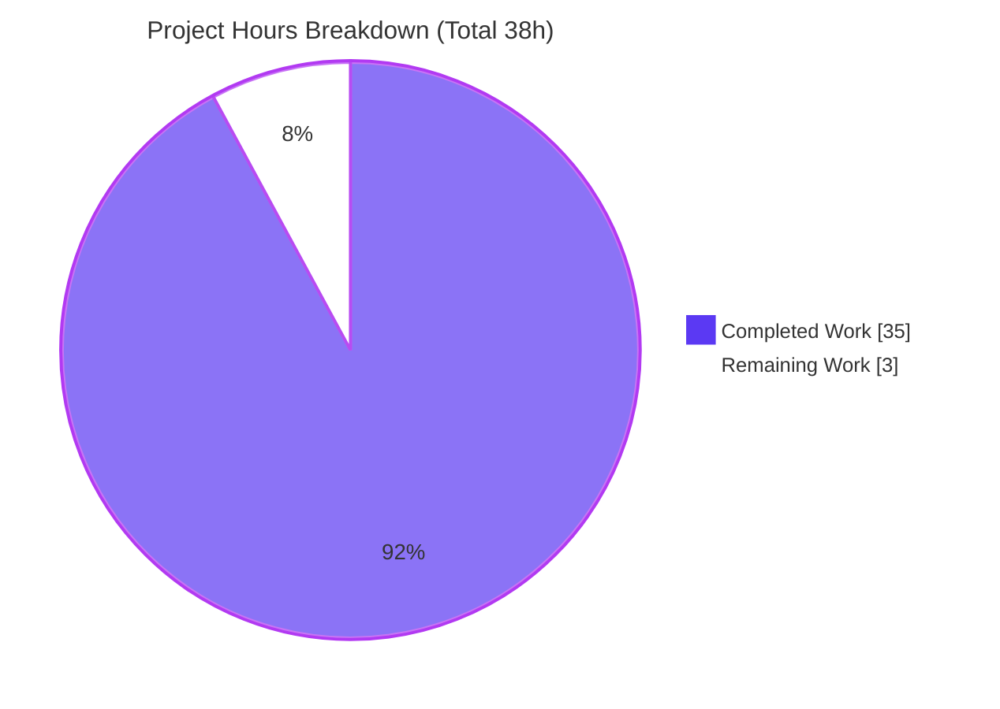
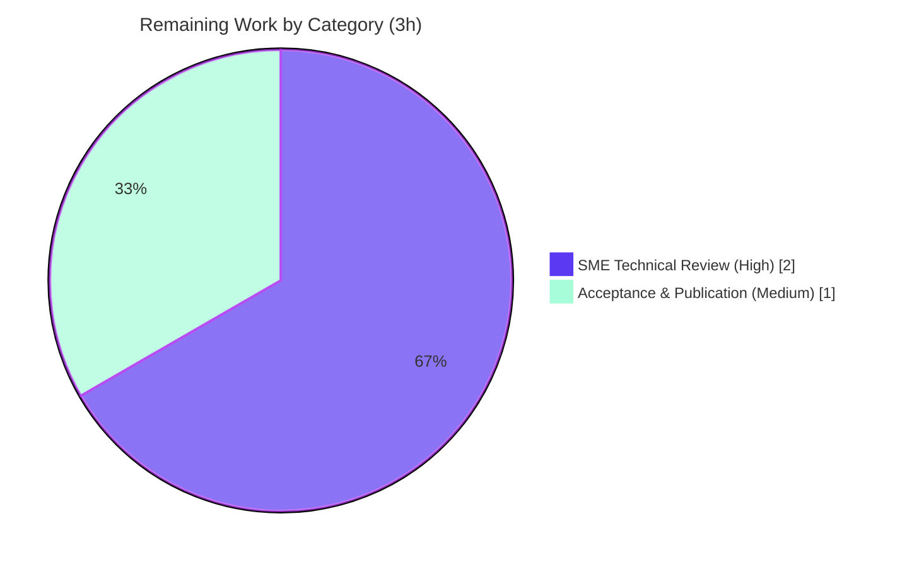

# Blitzy Project Guide

## 1. Executive Summary

### 1.1 Project Overview

This engagement delivers a single, evidence-backed Markdown knowledge document answering how MinIO's object-healing engine adjudicates ambiguous, conflicting per-disk states on a **4-drive erasure-coded (EC)** deployment. Target users are MinIO operators and storage engineers who need to know whether healing **always** reconstructs an object, or deterministically **leaves it degraded** or **purges** it. Grounded in the source code at commit `c07e5b49d477` (code-as-truth) and corroborated by a real build-and-run, the document proves three terminal outcomes — **reconstruct, leave, purge** — with exact code citations and captured runtime evidence. Scope is strictly **analysis-only**: exactly one file is added under `blitzy/documentation/`; zero MinIO source, test, config, or dependency files are modified.

### 1.2 Completion Status


| Metric | Hours |
|---|---|
| **Total Hours** | 38 |
| **Completed Hours (AI + Manual)** | 35 (AI: 35 · Manual: 0) |
| **Remaining Hours** | 3 |
| **Percent Complete** | **92.1%** |

> Completion is computed using the AAP-scoped, hours-based methodology: `Completed ÷ (Completed + Remaining) = 35 ÷ 38 = 92.1%`. The work universe is the Agent Action Plan deliverables plus path-to-production. Because the AAP explicitly forbids any source/test/config/dependency/CI/infrastructure change, there is **no deploy/CI/CD path-to-production** — the artifact *is* a Markdown document. The sole remaining work is human subject-matter-expert review and acceptance.

### 1.3 Key Accomplishments

- ✅ **Sole deliverable authored & persisted** — `blitzy/documentation/minio_c07e5b49d477.md` (526 lines, 5,914 words, 45,486 bytes), filename equal to the source branch name and placed under `blitzy/documentation/`.
- ✅ **All four sub-objectives (R1–R4) answered** — reconstruct vs. leave vs. purge decision (R1), runtime evidence per ambiguity case (R2), heal-output/`madmin.HealResultItem` semantics (R3), and boundary conditions (R4: minimum valid shards, exact unrecoverable error, WRITE-vs-DELETE distinction).
- ✅ **Code-as-truth verified** — 295 in-text code-citation references and a ~40-locator citation index; **11 critical locators independently spot-checked EXACT** against source (the pivotal `cannotHeal` `cmd/erasure-healing.go:428`, `errErasureReadQuorum`, `DefaultParityBlocks`, the full HTTP-503 `SlowDownRead` surfacing chain).
- ✅ **Runtime evidence reproduced** — `minio` binary built (`DEVELOPMENT.GOGET`, go1.23.2); all 6 cited healing unit tests pass in isolation; live 4-drive fault-injection cases (baseline, 1/2/3-missing, 3-corrupt) match the document.
- ✅ **Full scope compliance** — git diff vs base = exactly **one added file**; `go.mod`/`go.sum` unchanged (`go mod verify` → all modules verified); working tree clean (`git status --porcelain` empty); all scratch artifacts ephemeral under `/tmp`.
- ✅ **Methodological honesty** — the document transparently discloses the combined-run unit-test artifact (16-/32-disk tests fail in a single shared process due to shared global state, pass in isolation) — confirmed reproduced both ways.

### 1.4 Critical Unresolved Issues

| Issue | Impact | Owner | ETA |
|---|---|---|---|
| _None — no blocking issues identified._ | The deliverable is complete, citation-accurate, evidence-reproduced, and scope-compliant. No compilation errors, no failing in-scope tests, no missing functionality. | — | — |

> The only open item is the non-blocking human SME review/acceptance tracked in Sections 1.6, 2.2, and 8. The combined-run test behavior is a disclosed, pre-existing test-harness artifact (not a code defect) and is out of scope (read-only test code).

### 1.5 Access Issues

**No access issues identified.** Repository access, the Go 1.23.2 toolchain, and the warmed Go module cache are all available; the build, the cited unit tests, and the live 4-drive evidence were all reproduced successfully offline. No third-party credentials, service accounts, or external API access are required for this analysis-only engagement.

| System/Resource | Type of Access | Issue Description | Resolution Status | Owner |
|---|---|---|---|---|
| MinIO repository (`minio_c07e5b49d477`) | Source read/write | None — full access | ✅ Resolved | — |
| Go module dependencies | Build-time (module cache) | None — `go mod verify` passes offline | ✅ Resolved | — |
| `mc` client (optional) | Runtime tooling | Not installed; the `madmin-go` Heal API (same data source) was used instead — disclosed in the document | ✅ Resolved (optional per AAP) | — |

### 1.6 Recommended Next Steps

1. **[High]** Have a MinIO-knowledgeable SME read and technically validate the R1–R4 answers (the three-outcome model, the `cannotHeal` pivot, the `isObjectDangling` truth table, the 4-disk parity math, and the WRITE-vs-DELETE distinction). _(~1.0h)_
2. **[High]** Spot-check a representative sample of the ~40 code citations against source at commit `c07e5b49d477` to confirm code-as-truth fidelity. _(~1.0h)_
3. **[Medium]** Accept/sign-off and merge the documentation-only PR, confirming the diff is exactly one added file and the tree is clean. _(~0.5h)_
4. **[Medium]** Publish/index `blitzy/documentation/minio_c07e5b49d477.md` into the team knowledge base where MinIO healing knowledge lives. _(~0.5h)_
5. **[Low]** Record the pinned commit (`c07e5b49d477`) alongside the doc and assign a knowledge-base owner to re-validate the citations if the document is later reused against a different MinIO revision.

---

## 2. Project Hours Breakdown

### 2.1 Completed Work Detail

| Component | Hours | Description |
|---|---|---|
| Source-Code Investigation & Static Analysis | 8.0 | Traced the `healObject` decision tree (`cmd/erasure-healing.go` L258–L657), the `isObjectDangling` 4-branch truth table (L968–L1036), quorum derivation (`objectQuorumFromMeta`/`commonParity`), per-disk drive-state mapping, and the full error-surfacing chain across `erasure-errors.go` / `object-api-errors.go` / `api-errors.go`; derived the `DefaultParityBlocks` 4-disk math and scanner/heal tunables; mapped the `madmin.HealResultItem` contract — producing ~40 exact code locators. |
| Build & Unit-Test Evidence | 3.0 | Built the `minio` binary (`CGO_ENABLED=0 go build -tags kqueue`); executed the 6 cited healing tests read-only in isolation (all PASS); investigated and transparently disclosed the combined-run shared-global-state test artifact. |
| Live Runtime Evidence Capture | 8.0 | Stood up an ephemeral 4-drive erasure server plus an offline Go client (`minio-go` PutObject/Get/Stat + `madmin` Heal); injected faults across 5 cases (baseline, 1/2/3-missing, 3-corrupt); captured `HealResultItem` before/after, rendered `mc`-style output, verified md5/ETag/shard-size/nonzero-byte counts, and captured the HTTP 200 HEAD / 503 GET surfacing. |
| Documentation Authoring | 9.0 | Authored the 526-line / 5,914-word Q&A document: TL;DR, central question, Sections 0–6, the mermaid decision flowchart, drive-state & truth tables, 295 code-citation references, the code-citation index, and the design rationale. |
| Review & Refinement | 3.0 | Addressed 6 code-review findings (commit `68631c4bd`); corrected the §3b shard-vs-payload zero-byte attribution (commit `be74f76e5`). |
| Final Validation & Cleanup | 4.0 | Performed 100% citation verification against source; reproduced all five production-readiness gates; verified the clean tree, ephemeral cleanup, and full scope compliance. |
| **Total** | **35.0** | |

### 2.2 Remaining Work Detail

| Category | Hours | Priority |
|---|---|---|
| Human SME Technical Review of answer accuracy & completeness | 2.0 | High |
| Acceptance Sign-off & Knowledge-Artifact Publication/Archival | 1.0 | Medium |
| **Total** | **3.0** | |

> **Cross-section check:** Section 2.1 (35.0h) + Section 2.2 (3.0h) = **38h** Total Project Hours (Section 1.2). Section 2.2 total (3.0h) = Section 1.2 Remaining Hours = Section 7 pie "Remaining Work".

---

## 3. Test Results

All tests below originate from Blitzy's autonomous validation logs for this project and were **independently reproduced** during this assessment. The cited healing unit tests are the in-repo, deterministic proof of the decision logic; the live cases are the runtime corroboration.

| Test Category | Framework | Total Tests | Passed | Failed | Coverage % | Notes |
|---|---|---|---|---|---|---|
| Unit — Healing decision logic | Go `testing` (`go test -tags kqueue,dev`) | 6 | 6 | 0 | N/A (targeted evidence selection) | Run **in isolation** (the documented authoritative method). `TestIsObjectDangling` expands to **13 sub-cases**, all PASS. |
| Integration — Live 4-drive runtime | `minio-go v7.0.80` + `madmin-go v3.0.77` against a live `minio server` | 5 | 5 | 0 | N/A | Scenarios: baseline, 1-missing, 2-missing (parity boundary), 3-missing (purge), 3-corrupt (leave). `HealResultItem` before/after captured each. |
| Build verification | `go build -tags kqueue` | 1 | 1 | 0 | N/A | Binary `DEVELOPMENT.GOGET`, go1.23.2 linux/amd64. |
| Dependency verification | `go mod verify` | 1 | 1 | 0 | N/A | "all modules verified"; `go.mod`/`go.sum` unchanged vs base. |

**Cited unit tests (isolation results):**

| Test | Location | Result | What it proves |
|---|---|---|---|
| `TestIsObjectDangling` (13 sub-cases) | `cmd/erasure-healing_test.go` L40 | ✅ PASS (~0.26s) | The full purge-vs-leave truth table |
| `TestHealCorrectQuorum` | L851 | ✅ PASS (~0.55s) | Reconstruct at the parity boundary |
| `TestHealingDanglingObject` | L647 | ✅ PASS (~0.47s) | Purge (dangling) path |
| `TestHealObjectCorruptedXLMeta` | L1158 | ✅ PASS (~0.45s) | Reconstruct after metadata corruption |
| `TestHealObjectCorruptedParts` | L1297 | ✅ PASS (~0.45s) | Reconstruct after part (data) corruption |
| `TestHealLastDataShard` | L1642 | ✅ PASS (~1.63s) | Reconstruct from the last surviving data shard + parity |

> **Disclosed test-harness artifact (not a defect):** running all six tests in a single `go test` process causes the large-disk tests (`TestHealObjectCorruptedXLMeta`, `TestHealObjectCorruptedParts`, `TestHealLastDataShard`) to fail with `InsufficientReadQuorum` due to **shared global state across tests in one process** — confirmed reproduced. Each passes in isolation; the isolated results are authoritative. This is read-only test code, out of scope, and is transparently documented in the deliverable (§3a).

---

## 4. Runtime Validation & UI Verification

**Runtime health (live 4-drive erasure set, `minio server /tmp/d1 /tmp/d2 /tmp/d3 /tmp/d4`):**

- ✅ **Build & startup** — binary builds and the server formats "1st pool, 1 set(s), 4 drives per set"; every `HealResultItem` reports `dataBlocks=2, parityBlocks=2, diskCount=4` (live confirmation of `DefaultParityBlocks(4)`).
- ✅ **Baseline (all shards intact)** — heal is a no-op; `[ok, ok, ok, ok] → [ok, ok, ok, ok]`; GET/STAT succeed with ETag `d740f660…` matching `md5(content)`.
- ✅ **Case 1 — 1 drive missing → RECONSTRUCT** — `[missing, ok, ok, ok] → [ok, ok, ok, ok]`; shard restored; GET matches baseline.
- ✅ **Case 2 — 2 drives missing (= parity, boundary) → RECONSTRUCT** — `[missing, missing, ok, ok] → [ok, ok, ok, ok]`; mirrors `TestHealCorrectQuorum`.
- ✅ **Case 3a — 3 drives missing → PURGE** — object below read quorum; STAT/GET return `NoSuchKey` (404); the lone d4 remnant is removed from all drives (`isObjectDangling` true, only not-found errors).
- ✅ **Case 3b — 3 drives corrupt → LEAVE (degraded)** — `[corrupt × 4] → [corrupt × 4]`; `HEAD` returns **200** (metadata quorum holds) while `GET` returns **503 `SlowDownRead`** ("Resource requested is unreadable, please reduce your request rate") — data read quorum lost, object retained.
- ✅ **The crux** — identical "3 of 4 bad," opposite outcomes: **3 missing → PURGE; 3 corrupt → LEAVE; ≤ 2 bad → RECONSTRUCT** — proving healing does **not** always reconstruct.

**UI verification:** ⚠ **Not applicable** — this engagement concerns MinIO's backend object-healing / erasure-coding logic; there is no user-interface component in scope. No Figma frames or design assets were provided (AAP §0.9), so the Design System Alignment Protocol does not apply.

---

## 5. Compliance & Quality Review

The matrix cross-maps every AAP deliverable and binding rule (SWE-AtlasQnA-Repo) to its verification status.

| AAP Deliverable / Rule | Benchmark | Status | Progress |
|---|---|---|---|
| **R1** — Reconstruct vs. leave vs. purge decision | Three terminal outcomes traced to `healObject` + `isObjectDangling` | ✅ Pass | 100% |
| **R2** — Runtime evidence per ambiguity case | Unit tests (isolation) + live 4-drive fault injection | ✅ Pass | 100% |
| **R3** — Heal-output semantics | `madmin.HealResultItem` Before/After `Drives[].State` contract documented | ✅ Pass | 100% |
| **R4(a)** — Minimum valid shards for heal | = data blocks = 2; proven by `TestHealLastDataShard` + live Case 2 | ✅ Pass | 100% |
| **R4(b)** — Exact unrecoverable error + surfacing | `errErasureReadQuorum` → `InsufficientReadQuorum` → `ErrSlowDownRead` → HTTP 503 | ✅ Pass | 100% |
| **R4(c)** — WRITE vs. DELETE distinction | Parity threshold (write) vs. `(len(errs)+1)/2` majority (delete marker) | ✅ Pass | 100% |
| Filename = source branch name | `minio_c07e5b49d477.md` | ✅ Pass | 100% |
| Placed under `blitzy/documentation/` | Path confirmed | ✅ Pass | 100% |
| Code-as-truth + rationale | 295 citations; ~40-locator index; Section 6 rationale | ✅ Pass | 100% |
| No existing MinIO files modified | git diff = 1 added file only | ✅ Pass | 100% |
| No new code besides the document | No committed tests/scripts/helpers | ✅ Pass | 100% |
| No dependency/config/CI changes | `go.mod`/`go.sum` unchanged; `go mod verify` passes | ✅ Pass | 100% |
| Ephemeral experimentation + cleanup | Scratch under `/tmp`; removed afterward | ✅ Pass | 100% |
| Clean working tree | `git status --porcelain` empty | ✅ Pass | 100% |
| Human SME review/acceptance | Independent technical sign-off | ◻ Outstanding | 0% |

**Fixes applied during autonomous validation:** (1) corrected the §3b shard-vs-payload zero-byte attribution (`12288 = shard_size/256` is per-shard, not the full payload) — commit `be74f76e5`; (2) addressed 6 code-review findings — commit `68631c4bd`. **Outstanding:** human SME review/acceptance only.

---

## 6. Risk Assessment

| Risk | Category | Severity | Probability | Mitigation | Status |
|---|---|---|---|---|---|
| Code-citation drift across MinIO versions | Technical | Low | Medium | Document explicitly pinned to commit `c07e5b49d477` (Section 0 + footer); line numbers valid only at this commit; re-validate if reused against another revision | Mitigated (commit-pinned) |
| Combined-run unit-test failure (16-/32-disk tests fail in one shared process; pass in isolation) | Technical | Low | Low | Pre-existing shared-global-state **test** artifact, not a code defect; out of scope (read-only test code); disclosed in doc; per-test isolation is authoritative (reproduced both ways) | Documented / Accepted |
| Build/test reproducibility depends on warmed Go module cache (offline container) | Technical | Low | Low | Dependencies present in module cache; `go mod verify` passes offline; build reproduced in ~5s | Mitigated |
| No security exposure | Security | None | N/A | Analysis-only: zero code/dependency/config changes; `go.mod`/`go.sum` unchanged & verified; no new attack surface, secrets, or auth/data paths | No risk identified |
| Documentation staleness as MinIO healing code evolves | Operational | Low | Medium (long horizon) | Commit-pinned scope; assign a knowledge-base owner to re-validate against future commits if reused | Open (owner: Docs/Knowledge owner) |
| `mc` client not installed; live evidence used `madmin-go` Heal API + rendered `mc`-style output | Integration | Low | N/A | `mc` is optional per AAP; the `madmin` API returns the exact per-drive Before/After data `mc` consumes; rendering rule disclosed in doc | Documented / Accepted |

**Overall risk posture: LOW.** No High/Critical risks. No security, deployment, or genuine operational/integration exposure exists because the engagement is additive and analysis-only (one Markdown file). The only enduring consideration is commit-pinned documentation drift over time.

---

## 7. Visual Project Status

**Project hours breakdown (Completed = Dark Blue `#5B39F3`, Remaining = White `#FFFFFF`):**



**Remaining work by category (hours, from Section 2.2):**



> **Integrity:** the pie "Remaining Work" (3h) equals Section 1.2 Remaining Hours and the Section 2.2 "Hours" total; "Completed Work" (35h) equals Section 1.2 Completed Hours and the Section 2.1 total.

---

## 8. Summary & Recommendations

**Achievements.** This documentation/Q&A engagement is **92.1% complete** (35 of 38 hours). The sole AAP deliverable — `blitzy/documentation/minio_c07e5b49d477.md` — is authored, comprehensive, and accurate. It answers all four sub-objectives with code-as-truth: MinIO's healing engine produces **three deterministic terminal outcomes** — it **reconstructs** when disks-needing-repair ≤ parity (≤ 2 on a 4-drive set), **leaves** the object degraded (returning `errErasureReadQuorum`, surfaced as HTTP 503 `SlowDownRead`) when damage exceeds parity but non-actionable corruption is present, and **purges** it (returning `errFileNotFound`) only when the object is confidently dangling. The pivot is a single line, `cmd/erasure-healing.go:428`.

**Remaining gaps.** The only outstanding work is **human SME review and acceptance** (3h): technical validation of the answers and citations (2.0h, High) and acceptance sign-off plus knowledge-base publication (1.0h, Medium). There are no compilation errors, no failing in-scope tests, and no missing functionality.

**Critical path to production.** For this analysis-only artifact, "production" means an SME accepting the document and publishing it to the team knowledge base — there is no deploy/CI/CD path because the AAP forbids any code/config/infrastructure change.

**Success metrics (all met for the autonomous portion):** ✅ exactly one added file; ✅ filename = branch name under `blitzy/documentation/`; ✅ all R1–R4 answered with citations + runtime evidence; ✅ 11/11 spot-checked citations exact; ✅ build + 6 unit tests + 5 live cases reproduced; ✅ `go.mod`/`go.sum` unchanged; ✅ clean working tree.

**Production-readiness assessment.** **Ready for human review.** The deliverable meets every binding rule of the SWE-AtlasQnA-Repo rule set and is independently corroborated as PRODUCTION-READY. Confidence is **High**; the only uncertainty is the human review duration, which is small relative to the total.

| Metric | Value |
|---|---|
| Completion | 92.1% |
| Total / Completed / Remaining hours | 38 / 35 / 3 |
| Files added | 1 (`blitzy/documentation/minio_c07e5b49d477.md`) |
| MinIO files modified | 0 |
| Blocking issues | 0 |
| Overall risk | Low |

---

## 9. Development Guide

> Build, run, reproduce the healing evidence, and verify scope compliance. Every command below was executed successfully in this environment (Ubuntu, Go 1.23.2). The repository root is the current working directory.

### 9.1 System Prerequisites

- **OS:** Linux/amd64 (developed on Ubuntu; container image per AAP §0.8).
- **Go toolchain:** **1.23.2** (the `go.mod` declares `go 1.23`; CI pins 1.23.2).
- **git**, ~200 MB free disk for the binary, and a **warmed Go module cache** (the build works fully offline).

```bash
# Verify the toolchain (loads Go onto PATH in this environment)
. /etc/profile.d/go.sh
go version          # => go version go1.23.2 linux/amd64
```

### 9.2 Environment Setup

```bash
# From the repository root
cd /path/to/minio          # repo root (contains go.mod, Makefile, cmd/, internal/)

# Tests use this to avoid request throttling (matches Makefile L53)
export MINIO_API_REQUESTS_MAX=10000
```

### 9.3 Dependency Verification

```bash
go mod verify              # => all modules verified
# Confirms go.mod/go.sum are intact and dependencies are at pinned versions
# (reedsolomon v1.12.4, madmin-go/v3 v3.0.77, minio-go/v7 v7.0.80, highwayhash v1.0.3)
```

### 9.4 Build the MinIO Binary

```bash
CGO_ENABLED=0 go build -tags kqueue -o /tmp/minio .
/tmp/minio --version
# Expected:
#   minio version DEVELOPMENT.GOGET (commit-id=DEVELOPMENT.GOGET)
#   Runtime: go1.23.2 linux/amd64
```

The Makefile equivalent is `make build` (`Makefile` L179: `CGO_ENABLED=0 go build -tags kqueue -trimpath --ldflags ... -o $(PWD)/minio`).

### 9.5 Reproduce the Healing Evidence (authoritative isolation method)

```bash
# Run each cited healing test IN ISOLATION (the documented authoritative method)
for T in TestIsObjectDangling TestHealCorrectQuorum TestHealingDanglingObject \
         TestHealObjectCorruptedXLMeta TestHealObjectCorruptedParts TestHealLastDataShard; do
  MINIO_API_REQUESTS_MAX=10000 CGO_ENABLED=0 \
    go test -tags kqueue,dev -run "^$T\$" -count=1 ./cmd/
done
# => each prints:  ok  github.com/minio/minio/cmd
```

> **Caveat (by design):** running all six in a single combined `-run 'A|B|...'` process fails the 16-/32-disk tests with `InsufficientReadQuorum` due to shared global state across tests in one process. This is a pre-existing test-harness artifact, **not** a code defect — always run per-test in isolation.

### 9.6 (Optional) Live 4-Drive Evidence

```bash
# Start an ephemeral single-node 4-drive erasure set
/tmp/minio server /tmp/d1 /tmp/d2 /tmp/d3 /tmp/d4 --address 127.0.0.1:9000 &
# Server logs: "Formatting 1st pool, 1 set(s), 4 drives per set."

# Exercise with an ephemeral Go client using the project's pinned modules:
#   - minio-go v7.0.80 : PutObject / GetObject / StatObject
#   - madmin-go  v3.0.77 : admin Heal API (returns HealResultItem Before/After)
# Inject faults:  rm -rf the object dir on a drive (missing)  |  zero part.1 (corrupt)
# Trigger heal and inspect the per-drive Before/After states.

# Tear down (kill only the PID you spawned; never pkill/killall)
kill %1
rm -rf /tmp/d1 /tmp/d2 /tmp/d3 /tmp/d4
```

> `mc` is **optional** and not required; the `madmin-go` Heal API returns the exact per-drive `Before`/`After` data that `mc admin heal --verbose` renders.

### 9.7 View the Deliverable

```bash
# List the document's sections
grep -nE '^#{1,3} ' blitzy/documentation/minio_c07e5b49d477.md

# Or open in any Markdown viewer (renders the mermaid decision flowchart and tables)
less blitzy/documentation/minio_c07e5b49d477.md
```

### 9.8 Verify Scope Compliance

```bash
git status --porcelain                                   # (empty) => clean tree
git diff --name-only c07e5b49d477b0774f23db3b290745aef8c01bd2..HEAD
#   => blitzy/documentation/minio_c07e5b49d477.md   (exactly one file)
go mod verify                                            # => all modules verified
```

### 9.9 Troubleshooting

- **Combined-run test failures** → run each test in isolation (§9.5); the combined run is a known shared-global-state artifact.
- **Offline build/`go` errors** → rely on the warmed module cache; confirm with `go mod verify`.
- **`mc: command not found`** → expected; use the `madmin-go` Heal API as in the deliverable's §3b.
- **Test throttling / `SlowDown`** → set `export MINIO_API_REQUESTS_MAX=10000` before running tests.
- **Server won't bind `:9000`** → choose another `--address` port or stop the conflicting process (kill only the PID you started).

---

## 10. Appendices

### A. Command Reference

| Purpose | Command |
|---|---|
| Load Go onto PATH | `. /etc/profile.d/go.sh` |
| Verify toolchain | `go version` |
| Verify dependencies | `go mod verify` |
| Build binary | `CGO_ENABLED=0 go build -tags kqueue -o /tmp/minio .` |
| Run one healing test (isolation) | `MINIO_API_REQUESTS_MAX=10000 CGO_ENABLED=0 go test -tags kqueue,dev -run "^TestIsObjectDangling$" -count=1 ./cmd/` |
| Start live 4-drive server | `/tmp/minio server /tmp/d1 /tmp/d2 /tmp/d3 /tmp/d4 --address 127.0.0.1:9000` |
| List doc sections | `grep -nE '^#{1,3} ' blitzy/documentation/minio_c07e5b49d477.md` |
| Clean-tree check | `git status --porcelain` |
| Scope diff | `git diff --name-only c07e5b49d477b0774f23db3b290745aef8c01bd2..HEAD` |

### B. Port Reference

| Port | Service | Notes |
|---|---|---|
| 9000 | MinIO S3 API (live evidence only) | Set via `--address 127.0.0.1:9000`; ephemeral, used only to capture runtime evidence |
| (auto) | MinIO Console | Auto-assigned by the server in single-node mode; not required for evidence capture |

> No port is part of the persisted deliverable; the server is ephemeral and torn down after evidence capture.

### C. Key File Locations

| Path | Role |
|---|---|
| `blitzy/documentation/minio_c07e5b49d477.md` | **The sole deliverable** (526 lines) |
| `cmd/erasure-healing.go` | `healObject` decision engine (L258–L657); `isObjectDangling` (L968–L1036); drive-state switch (L382–L393); `cannotHeal` pivot (L428); After=ok (L651) |
| `cmd/erasure-healing-common.go` | `listOnlineDisks` (L219); `disksWithAllParts` (L291+) |
| `cmd/erasure-object.go` | `deleteIfDangling` (L482) |
| `cmd/erasure-metadata.go` | `objectQuorumFromMeta` (L531) |
| `cmd/erasure-errors.go` | `errErasureReadQuorum` (L23) |
| `cmd/object-api-errors.go` | `InsufficientReadQuorum` (L236–L242) |
| `cmd/api-errors.go` | `errErasureReadQuorum → ErrSlowDownRead` (L2190–L2191); 503 def (L869–L872) |
| `internal/config/storageclass/storage-class.go` | `DefaultParityBlocks` (L355) → 4 drives: data=2, parity=2 |
| `cmd/data-scanner.go` | `healObjectSelectProb = 1024` (L61) |
| `cmd/admin-handlers.go` | `HealHandler` (L1308) |
| `cmd/erasure-healing_test.go` | Evidence tests (L40 / L647 / L851 / L1158 / L1297 / L1642) |
| `Makefile` | Build (L179) / test (L53) targets |

### D. Technology Versions

| Component | Version |
|---|---|
| Go toolchain | 1.23.2 (`go.mod`: `go 1.23`) |
| `github.com/klauspost/reedsolomon` | v1.12.4 |
| `github.com/minio/madmin-go/v3` | v3.0.77 |
| `github.com/minio/minio-go/v7` | v7.0.80 |
| `github.com/minio/highwayhash` | v1.0.3 |
| MinIO binary | `DEVELOPMENT.GOGET` (built from commit `c07e5b49d477`) |

### E. Environment Variable Reference

| Variable | Value | Purpose |
|---|---|---|
| `CGO_ENABLED` | `0` | Static, CGo-free build (matches Makefile) |
| `MINIO_API_REQUESTS_MAX` | `10000` | Raises the request cap so tests/evidence avoid throttling (matches Makefile L53) |
| Build tags | `kqueue` (build), `kqueue,dev` (tests) | MinIO's required build/test tags |

### F. Developer Tools Guide

| Tool | Use |
|---|---|
| `docs/debugging/xl-meta` | Inspect `xl.meta` erasure metadata on a drive |
| `docs/debugging/healing-bin` | Inspect healing-related binary artifacts |
| `docs/debugging/inspect` | Inspect MinIO backend object layout |
| `buildscripts/verify-healing.sh` | Reference live-cluster heal harness pattern (`start_minio_3_node`, `MINIO_ERASURE_SET_DRIVE_COUNT`) |
| `madmin-go` Heal API | Programmatic heal trigger returning `HealResultItem` Before/After (used in lieu of optional `mc`) |

### G. Glossary

| Term | Meaning |
|---|---|
| **EC (Erasure Coding)** | Splitting an object into data + parity shards so it survives drive loss. 4-drive set → 2 data + 2 parity. |
| **Read quorum** | Minimum drives (= data blocks = 2 on a 4-drive set) needed to read/reconstruct an object. |
| **Reconstruct** | Heal rebuilds missing/corrupt shards from survivors (≤ parity damaged). |
| **Leave (degraded)** | Heal refuses to delete when corruption is present and data may be recoverable; read returns `errErasureReadQuorum` (HTTP 503 `SlowDownRead`). |
| **Purge (dangling delete)** | Heal deletes a confidently-dangling object version (missing beyond parity, only not-found errors); returns `errFileNotFound`. |
| **`isObjectDangling`** | The truth table deciding purge vs. leave (`cmd/erasure-healing.go` L968–L1036). |
| **`cannotHeal`** | The pivotal test `disksToHealCount > parityBlocks` (`cmd/erasure-healing.go` L428) that forks reconstruct vs. dangling-gate. |
| **`HealResultItem`** | `madmin-go` struct carrying per-drive Before/After `State` (`ok`/`missing`/`corrupt`/`offline`). |
| **Dangling object** | Residual sub-quorum shards/metadata of an object that can no longer meet quorum. |

---

*This Blitzy Project Guide assesses the MinIO object-healing documentation engagement at branch `minio_c07e5b49d477` (base commit `c07e5b49d477b0774f23db3b290745aef8c01bd2`). Completion (92.1%) reflects AAP-scoped and path-to-production work only. The sole deliverable is `blitzy/documentation/minio_c07e5b49d477.md`; no MinIO source, test, or configuration file was modified.*