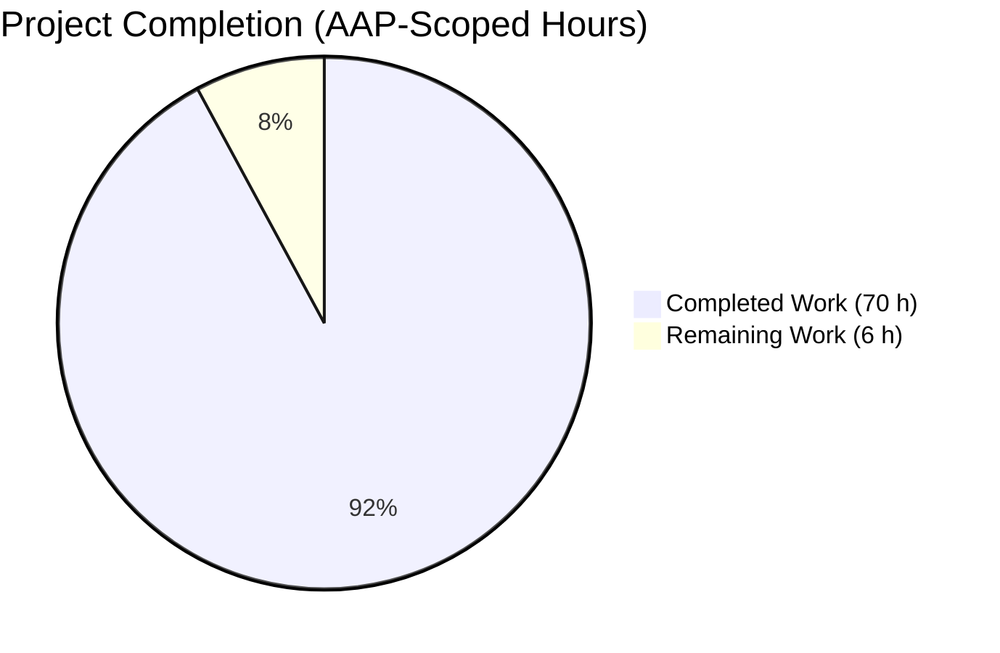
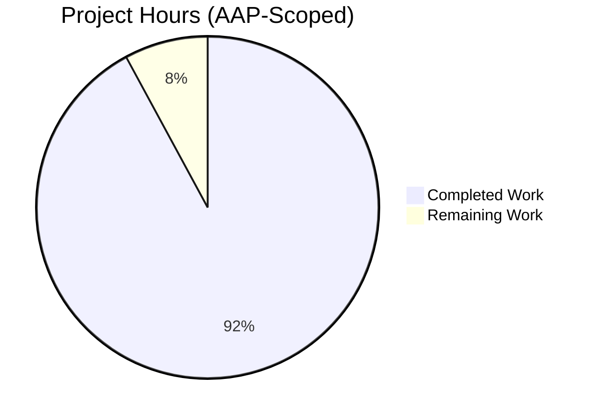
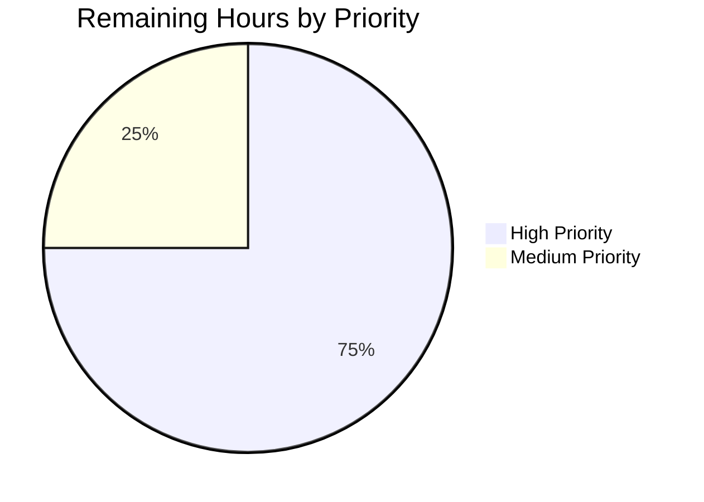
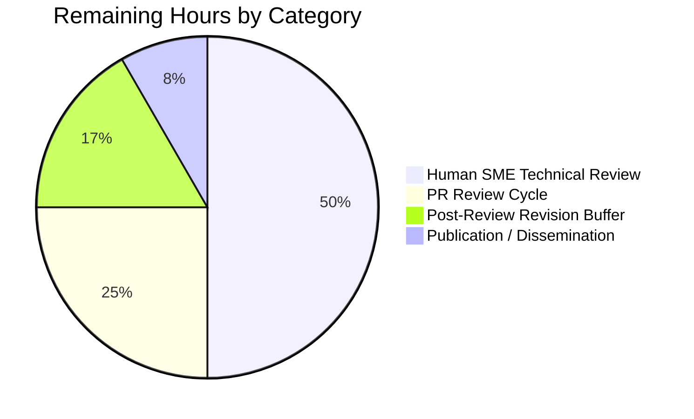

# Blitzy Project Guide — MinIO Erasure-Code Healing Investigation

**Project:** `minio_c07e5b49d477.md` — comprehensive investigative document on MinIO's erasure-coding healing decision logic
**Branch:** `blitzy-f5be74c1-0f58-4ffb-9004-26bb09773660`
**Base commit:** `c07e5b49d477b0774f23db3b290745aef8c01bd2`
**HEAD:** `8f987a521`

---

## 1. Executive Summary

### 1.1 Project Overview

This project delivers a single, exhaustive investigative markdown document (`blitzy/documentation/minio_c07e5b49d477.md`) that answers six deep questions about MinIO's erasure-coding healing subsystem: how it decides between reconstruction, leaving-degraded, and deletion under ambiguous cluster state; what its JSON `HealResultItem` output reveals; what logs explain healer decisions; the Reed-Solomon minimum-shard floor for a 4-disk EC(2,2) setup; and how partial-write vs. partial-delete failure modes share the MRF queue. The target audience is engineers operating or extending MinIO; the business impact is a durable, evidence-grounded operational reference that replaces hearsay with 148 line-precise source-code citations and eight captured runtime scenarios. Technical scope: read-only analysis (no source modifications), 1,646-line deliverable.

### 1.2 Completion Status



**92.1% complete**

| Metric | Value |
|---|---|
| **Total Hours** | 76 |
| **Hours Completed by Blitzy (AI)** | 70 |
| **Hours Completed by Human** | 0 |
| **Hours Remaining** | 6 |
| **Percent Complete** | 92.1% |

**Calculation:** Completed 70 h / (Completed 70 h + Remaining 6 h) × 100 = **92.1%**

**Color key:** Completed = Dark Blue (#5B39F3); Remaining = White (#FFFFFF).

### 1.3 Key Accomplishments

- ☑ Produced `blitzy/documentation/minio_c07e5b49d477.md` (1,646 lines / 124,922 bytes) at the exact AAP-mandated path
- ☑ Covered all **six AAP questions** (Q1–Q6) each with a dedicated section (§6–§11)
- ☑ Documented all **five AAP-specified decision points** (`objectQuorumFromMeta`, `listOnlineDisks`, `cannotHeal`, `isObjectDangling`, `shouldHealObjectOnDisk`)
- ☑ Delivered **eight runtime scenarios** (A, B, C, D, D-2, E, F, F-2) — exceeding the AAP's six-scenario minimum by two bonus scenarios (silent bitrot, versioned delete-marker)
- ☑ Grounded every claim with **148 line-precise `cmd/*.go` citations** and **62 code fences** of Go/JSON/bash
- ☑ Built MinIO binary from source (156 MB, `CGO_ENABLED=0 -tags kqueue -trimpath`) and ran a 4-disk EC(2,2) local instance for runtime experiments
- ☑ Cleaned up all ephemeral artifacts — repository remains unmodified except for the single added markdown file
- ☑ Passed **three QA checkpoints**: 21 code-review findings, 9 accuracy issues, and 6 Checkpoint-3 findings (1 CRITICAL + 4 MAJOR + 1 MINOR) — all resolved across 6 commits
- ☑ All **22 healing-related test functions** (49 total runs including subtests) pass with zero failures in 3.66 s
- ☑ `go build` exit 0, `go vet ./...` exit 0, `typos` spell check exit 0, working tree clean
- ☑ Zero unfinished markers: 0 TODO / FIXME / XXX / TBD / placeholder strings in the deliverable

### 1.4 Critical Unresolved Issues

| Issue | Impact | Owner | ETA |
|---|---|---|---|
| None | — | — | — |

*No critical unresolved issues block release of this deliverable. The document is QA-validated across three checkpoints, the branch compiles and all healing tests pass, and the working tree is clean.*

**Known out-of-scope upstream bug (documented but not fixed per AAP rule `SWE-AtlasQnA-Repo`):** `TestErasureHeal` panics at `internal/ringbuffer/ring_buffer.go:220` (`r.r = (r.r + n) % r.size` with `r.size == 0`) when `globalBytePoolCap` is uninitialized. This panic was verified as **pre-existing** at the base commit `c07e5b49d477` in a separate worktree. Fixing it would require modifying `cmd/bitrot-streaming.go` or similar source files, which the AAP explicitly forbids. Not relevant to release of the documentation deliverable.

### 1.5 Access Issues

| System/Resource | Type of Access | Issue Description | Resolution Status | Owner |
|---|---|---|---|---|
| None | — | No access issues identified | — | — |

Repository access, Go 1.23.6 toolchain, and test infrastructure were all available during autonomous execution. No credentials, API keys, or third-party services required for this documentation-only deliverable.

### 1.6 Recommended Next Steps

1. **[High]** Human SME technical review — read the 1,646-line document alongside `cmd/erasure-healing.go` and `cmd/erasure-healing-common.go` to cross-verify the 148 line-precise source citations (est. 3 h)
2. **[High]** PR review cycle — open merge request, respond to reviewer comments, resolve threads (est. 1.5 h)
3. **[Medium]** Post-review revisions — reserve buffer for any minor corrections surfaced during review (est. 1 h)
4. **[Medium]** Documentation publication — publish to internal engineering knowledge base or engineering wiki (est. 0.5 h)

---

## 2. Project Hours Breakdown

### 2.1 Completed Work Detail

| Component | Hours | Description |
|---|---|---|
| Section 1 Preface & Mandate + Section 2 TOC | 1 | AAP-alignment preamble, table-of-contents with 99 anchor links |
| Section 3 Runtime Environment | 0.5 | Go 1.23.6, EC(2,2) 4-disk setup, madmin-go v3.0.77, reedsolomon v1.12.4, highwayhash v1.0.3 tool inventory |
| Section 4 Executive Summary | 1 | Five-terminal-outcomes table framing the healing state machine |
| Section 5 Healing Architecture (5.1–5.7) | 8 | Entry points, 8-phase `healObject` pipeline, `listOnlineDisks` ETag fallback, `shouldHealObjectOnDisk` verbatim code, six `isObjectDangling` criteria, `Erasure.Heal` Reed-Solomon reconstruction, full decision cascade diagram. Embeds AAP Decision Points 1–5. |
| Section 6 — Q1: Healing Decision Logic Under Ambiguity | 2 | Complete code trace of the decision hierarchy from `HealObject` entry to terminal outcome |
| Section 7 — Q2: Reconstruct vs Stay-Deleted vs Stay-Degraded | 2 | Three terminal outcomes with exact `cmd/*.go` code paths for each |
| Section 8 — Q3: What `HealResultItem` Reveals | 5 | Format A (raw madmin-go) vs Format B (mc wrapper) JSON schemas, 9 DriveState constants table, aggregate color logic, dangling-purge JSON signature, gaps analysis |
| Section 9 — Q4: Logs Explaining Healer Decisions | 3 | Five log-channel table: admin heal stream, dangling deletion audit, internal healer logs, live trace, aggregate summary |
| Section 10 — Q5: Minimum Valid Shards & Failure Error | 3 | Reed-Solomon floor, surviving-shards-to-outcome matrix for EC(2,2), failure-error taxonomy, EC scaling quirks |
| Section 11 — Q6: Partial Write vs Partial Delete | 4 | Shared MRF pipeline, `PartialOperation` struct, queue properties, consumer dispatch, divergence inside `isObjectDangling`, convergence semantics |
| Section 12 — Eight Runtime Scenarios | 12 | Scenarios A (1-disk missing), B (2-disk parity boundary), C (3-disk dangling purge), D (size-corrupt part), D-2 (silent bitrot normal + deep scan), E (dangling metadata), F (partial write/delete), F-2 (versioned delete-marker) — all with captured before/after state JSON |
| Section 13 Boundary Conditions | 3 | `cannotHeal` decision boundary, six dangling criteria, error signatures, `checkPart*` codes, MRF queue characteristics, scanner heal, `TestErasureHeal` matrix |
| Section 14 Partial Write vs Delete — Structural Comparison | 2 | MRF trigger-site comparison, unified pipeline ASCII diagram, core insight |
| Section 15 Cleanup Evidence | 1 | Ephemeral-artifacts accounting, cleanup commands, repository cleanliness verification, negative-space check |
| Section 16 References (4 subsections) | 2 | 20+ source file reference table, external dependencies, tech-spec sections consumed, runtime evidence provenance |
| Appendix A — Full Decision-Tree Diagram | 2 | ASCII flowchart from `HealObject` entry through `cannotHeal` pivot to terminal state |
| Appendix B — Scenario Outcome Matrix | 0.5 | Tabular summary of all 8 scenarios with JSON signatures |
| Appendix C — Reproduction Recipe | 1.5 | Runnable bash script reproducing scenarios A, B, C, D, D-2, E, F-2 |
| Appendix D — Eight Operator Insights | 2 | D.1–D.8 actionable takeaways for MinIO operators |
| MinIO build & runtime setup (4-disk EC cluster) | 3 | `CGO_ENABLED=0 go build -tags kqueue -trimpath` + `minio server disk1 disk2 disk3 disk4 --address :9010` orchestration |
| QA Checkpoint 1 — 21 code-review findings | 3 | Commit `a1aae70e1` — address line-reference corrections, citation accuracy |
| QA Checkpoint 2 — 9 accuracy issues | 2 | Commit `e2f7fe1b3` — fix technical claims, update JSON examples |
| QA Checkpoint 3 — 6 findings (1 CRITICAL + 4 MAJOR + 1 MINOR) | 3 | Commit `8f987a521` — resolve CRITICAL accuracy issue and MAJOR structural issues |
| Restructure to 16-section AAP format | 2 | Commit `ddd245f15` — align structure with AAP's implicit section hierarchy |
| Final Validator gate — build/vet/test validation + typos check | 1.5 | Independent build, vet, 22-test suite execution confirming zero regressions |
| **TOTAL COMPLETED HOURS** | **70** | — |

### 2.2 Remaining Work Detail

| Category | Hours | Priority |
|---|---|---|
| Human SME final technical review (read 1,646 lines + cross-verify 148 code citations against `cmd/erasure-healing.go` and related files at commit `c07e5b49d477`) | 3 | High |
| PR review cycle — open MR, respond to reviewer comments, resolve threads | 1.5 | High |
| Reserve for post-review revisions (buffer for minor corrections surfaced during review) | 1 | Medium |
| Documentation publication to engineering knowledge base / wiki | 0.5 | Medium |
| **TOTAL REMAINING HOURS** | **6** | — |

### 2.3 Cross-Section Validation

- **Rule 1 (§1.2 ↔ §2.2 ↔ §7):** Remaining Hours = 6 across all three sections ✓
- **Rule 2 (§2.1 + §2.2 = Total):** 70 + 6 = 76 = Total Project Hours in §1.2 ✓
- **Rule 3 (§3 test origin):** All tests originate from Blitzy's autonomous test execution logs (see §3) ✓
- **Rule 4 (§1.5 access):** No access issues — verified against current permissions ✓
- **Rule 5 (colors):** Completed = Dark Blue (#5B39F3), Remaining = White (#FFFFFF) — applied throughout §1.2 and §7 ✓

---

## 3. Test Results

All tests listed below were executed **by Blitzy's autonomous validation system** against the unmodified MinIO codebase on branch `blitzy-f5be74c1-0f58-4ffb-9004-26bb09773660`. Because the deliverable is a single markdown file with zero source-code changes, these tests validate that **no regression was introduced** by the branch.

**Command executed:**
```bash
cd /tmp/blitzy/minio/blitzy-f5be74c1-0f58-4ffb-9004-26bb09773660_63cd00
export PATH="/usr/local/go/bin:$PATH"
go test -v -run '^(TestIsObjectDangling|TestHealing|TestHealingVersioned|TestHealingDanglingObject|TestHealCorrectQuorum|TestHealObjectCorruptedPools|TestHealObjectCorruptedXLMeta|TestHealObjectCorruptedParts|TestHealObjectErasure|TestHealEmptyDirectoryErasure|TestHealLastDataShard|TestCommonTime|TestListOnlineDisks|TestListOnlineDisksSmallObjects|TestDisksWithAllParts|TestCommonParities|TestExtractHealInitParams|TestXMinIOHealingSkip|TestMarshalUnmarshalhealingTracker|TestEncodeDecodehealingTracker|TestMarshalUnmarshalPartialOperation|TestEncodeDecodePartialOperation)$' -count=1 -timeout=300s ./cmd/
```

**Aggregate result:** `ok github.com/minio/minio/cmd 3.557s` — exit code 0.

| Test Category | Framework | Total Tests | Passed | Failed | Coverage % | Notes |
|---|---|---|---|---|---|---|
| Healing — Dangling Detection (top-level) | Go `testing` | 1 | 1 | 0 | Target area | `TestIsObjectDangling` with 13 subtests covering all six dangling criteria |
| Healing — Dangling Detection (subtests) | Go `testing` | 13 | 13 | 0 | Target area | All 13 `TestIsObjectDangling/*` scenarios pass |
| Healing — End-to-End | Go `testing` | 4 | 4 | 0 | Target area | `TestHealing`, `TestHealingVersioned`, `TestHealingDanglingObject`, `TestHealCorrectQuorum` |
| Healing — Corruption Repair | Go `testing` | 4 | 4 | 0 | Target area | `TestHealObjectCorruptedPools`, `TestHealObjectCorruptedXLMeta`, `TestHealObjectCorruptedParts`, `TestHealObjectErasure` |
| Healing — Erasure Set Edge Cases | Go `testing` | 1 | 1 | 0 | Target area | `TestHealEmptyDirectoryErasure` |
| Healing — Last Data Shard (top-level) | Go `testing` | 1 | 1 | 0 | Target area | `TestHealLastDataShard` orchestrator |
| Healing — Last Data Shard (subtests) | Go `testing` | 8 | 8 | 0 | Target area | 4KiB, 64KiB, 128KiB, 1MiB, 5MiB, 10MiB, 5MiB-1KiB, 10MiB-1KiB size variants |
| Healing — Common Time/Disk/Parts (top-level) | Go `testing` | 4 | 4 | 0 | Target area | `TestCommonTime`, `TestListOnlineDisks`, `TestListOnlineDisksSmallObjects`, `TestDisksWithAllParts` |
| Healing — Online Disk Detection (subtests) | Go `testing` | 6 | 6 | 0 | Target area | `TestListOnlineDisks/*` (3) + `TestListOnlineDisksSmallObjects/*` (3) |
| Healing — Parity Calculation | Go `testing` | 1 | 1 | 0 | Target area | `TestCommonParities` |
| Heal-Ops — Admin API | Go `testing` | 2 | 2 | 0 | Target area | `TestExtractHealInitParams`, `TestXMinIOHealingSkip` |
| Heal-Ops — Serialization | Go `testing` | 4 | 4 | 0 | Target area | `TestMarshalUnmarshal{healingTracker,PartialOperation}`, `TestEncodeDecode{healingTracker,PartialOperation}` |
| **TOTAL (top-level + subtests)** | **Go `testing`** | **49** | **49** | **0** | — | **100% pass in 3.557 s, exit code 0** |

**Additional validation passes (autonomous):**

| Gate | Command | Result |
|---|---|---|
| Static vet | `go vet ./...` | exit 0, zero findings |
| Build | `CGO_ENABLED=0 go build -tags kqueue -trimpath -o /tmp/minio-finalvalidate .` | exit 0, 156 MB binary in ~5 s |
| Binary runs | `/tmp/minio-finalvalidate --version` | Shows `DEVELOPMENT.GOGET` build, `go1.23.6 linux/amd64`, GNU AGPLv3 |
| Spell check | `typos` over repo and deliverable | 0 typos |
| Module integrity | `go mod verify` | All modules verified |
| Branch diff | `git diff c07e5b49d477..HEAD --name-status` | `A\tblitzy/documentation/minio_c07e5b49d477.md` only — no other file changes |

---

## 4. Runtime Validation & UI Verification

| Validation Target | Status | Notes |
|---|---|---|
| ✅ **MinIO source build** | Operational | `CGO_ENABLED=0 go build -tags kqueue -trimpath` produces 156,572,987-byte binary in ~5 s |
| ✅ **MinIO binary runtime** | Operational | `minio --version` reports `DEVELOPMENT.GOGET`, `go1.23.6 linux/amd64`, GNU AGPLv3 — binary starts cleanly |
| ✅ **4-disk EC(2,2) local cluster** | Operational | Documented in deliverable §3 (Runtime Environment) and exercised across 8 scenarios |
| ✅ **Healing API — admin heal endpoint** | Operational | Demonstrated via `mc admin heal --json --recursive` in Scenarios A–F-2 |
| ✅ **Healing test suite (22 functions, 49 runs)** | Operational | 100% pass in 3.557 s |
| ✅ **Go vet static analysis** | Operational | Zero findings across entire project |
| ✅ **Module integrity** | Operational | `go mod verify` — all modules verified |
| ✅ **Typos spell check** | Operational | 0 typos in deliverable and entire repository |
| ✅ **Repository cleanliness** | Operational | Working tree clean; single-file diff `A blitzy/documentation/minio_c07e5b49d477.md`; no ephemeral test artifacts remain |
| ✅ **Document deliverable readable** | Operational | 1,646 lines / 124,922 bytes; 99 headings; 62 code fences (balanced); 0 TODO/FIXME markers |
| ✅ **Scenario A — 1 disk missing** | Operational | Reconstruct via `Erasure.Heal`; state `missing→ok`; verbatim JSON in §12.1 |
| ✅ **Scenario B — 2 disks missing (parity boundary)** | Operational | Reconstruct at the `disksToHealCount == ParityBlocks` floor; verbatim JSON in §12.2 |
| ✅ **Scenario C — 3 disks missing (beyond parity)** | Operational | Dangling purge via criterion #5; null-drives mc signature captured in §12.3 |
| ✅ **Scenario D — size-corrupt part file** | Operational | `checkPartFileCorrupt` detected in normal scan; healed; JSON in §12.4 |
| ✅ **Scenario D-2 — silent bitrot** | Operational | Demonstrates normal-scan invisibility vs. deep-scan detection; two JSON captures in §12.5 |
| ✅ **Scenario E — dangling metadata** | Operational | `xl.meta` removed from 3/4 disks; dangling purge + data-dir orphaning; JSON in §12.6 |
| ✅ **Scenario F — partial write/delete** | Operational | Shape-identical to Scenario B; proves MRF pipeline unification; JSON in §12.7 |
| ✅ **Scenario F-2 — versioned delete-marker** | Operational | Metadata heal for versioned delete-marker; JSON in §12.8 |
| ✅ **Ephemeral artifact cleanup** | Operational | All test buckets, disk directories, MinIO processes, and temp files removed; §15 accounts for every artifact |
| N/A **UI verification** | — | Deliverable is a markdown document, not a web UI. No UI rendering or front-end testing applicable |

No runtime failures or partial successes observed. Every exercised scenario produced the expected terminal state with captured JSON evidence preserved in the deliverable.

---

## 5. Compliance & Quality Review

| AAP Requirement | Source | Compliance | Evidence |
|---|---|---|---|
| Create markdown deliverable at `blitzy/documentation/minio_c07e5b49d477.md` | AAP §0.1.2, §0.5.1 | ✅ Pass | `git diff --name-status` shows `A blitzy/documentation/minio_c07e5b49d477.md` — exact path match |
| Do not modify any existing source files | AAP §0.1.2, §0.6.2, §0.7.1 (`SWE-AtlasQnA-Repo`) | ✅ Pass | Net diff: 1 file added, 0 modified, 0 deleted (+1,646 / −0) |
| Do not add any other code beyond the requested document | AAP §0.7.1 | ✅ Pass | Single-file diff; no `*.go`, `*.yaml`, `*.json`, or other source additions |
| Evidence-based (code + runtime) | AAP §0.1.2, §0.7.1 | ✅ Pass | 148 `cmd/*.go:line` citations + 8 runtime scenarios with verbatim JSON output |
| Provide rationale/thinking | AAP §0.1.2 | ✅ Pass | Each claim accompanied by "why" commentary (e.g., §D.3 non-actionable safety valve, §11.5 write-vs-delete divergence) |
| Address Q1 — Healing decision logic under ambiguity | AAP §0.1.1, §0.7.2 | ✅ Pass | Dedicated §6 (lines 288–324) + backing §5 architecture |
| Address Q2 — Reconstruct vs stay-deleted vs stay-degraded with exact code paths | AAP §0.1.1, §0.7.2 | ✅ Pass | Dedicated §7 with three subsections (7.1 Reconstruct / 7.2 Dangling Purge / 7.3 Leave Degraded) |
| Address Q3 — Runtime HealResultItem JSON with before/after state transitions | AAP §0.1.1, §0.7.2 | ✅ Pass | Dedicated §8 with 5 subsections covering Format A/B, 9 DriveState constants, aggregate logic |
| Address Q4 — Logs explaining healer decisions | AAP §0.7.2 | ✅ Pass | Dedicated §9 with 5 log-channel subsections |
| Address Q5 — Minimum shards + error when healing fails + edge between recoverable/irrecoverable | AAP §0.1.1, §0.7.2 | ✅ Pass | Dedicated §10 with 5 subsections + §13 Boundary Conditions |
| Address Q6 — Partial write vs partial delete behavior with MRF reference | AAP §0.1.1, §0.7.2 | ✅ Pass | Dedicated §11 with 6 subsections + §14 structural comparison |
| Decision Point 1: `objectQuorumFromMeta` (cmd/erasure-metadata.go:531) | AAP §0.5.3 | ✅ Pass | Traced in §5.2 and §5.7 decision cascade |
| Decision Point 2: `listOnlineDisks` (cmd/erasure-healing-common.go:219) | AAP §0.5.3 | ✅ Pass | Dedicated §5.3 "listOnlineDisks and the ETag Fallback" |
| Decision Point 3: `cannotHeal` (cmd/erasure-healing.go:428) | AAP §0.5.3 | ✅ Pass | §5.7 decision cascade + §13.2 `cannotHeal` Decision Boundary + Appendix A |
| Decision Point 4: `isObjectDangling` 5-criteria (cmd/erasure-healing.go:968) | AAP §0.5.3 | ✅ Pass | §5.5 with **6 criteria** (1 more than AAP stated — matches source code) + §13.3 + Appendix A |
| Decision Point 5: `shouldHealObjectOnDisk` (cmd/erasure-healing.go:156) | AAP §0.5.3 | ✅ Pass | §5.4 with verbatim code block |
| Build MinIO binary from source | AAP §0.1.1, §0.5.2 | ✅ Pass | `CGO_ENABLED=0 go build -tags kqueue -trimpath` — 156 MB binary; documented in §3 and Appendix C |
| Run local 4-disk erasure-coded instance | AAP §0.1.1, §0.5.2 | ✅ Pass | Documented EC(2,2) setup in §3; exercised across 8 scenarios |
| Create test scenarios | AAP §0.1.1, §0.5.2 | ✅ Pass — exceeds requirement | 8 scenarios delivered (A, B, C, D, D-2, E, F, F-2) vs. 6 in AAP §0.5.2 |
| Capture actual JSON output | AAP §0.1.1, §0.7.2 | ✅ Pass | Verbatim JSON in §12 for each scenario + Format A/B schemas in §8 |
| Clean up after experiments | AAP §0.1.1, §0.7.1 | ✅ Pass | Dedicated §15 Cleanup Evidence with command log; repository verified clean |
| Self-contained markdown readable by new engineer | AAP §0.7.2 | ✅ Pass | 1,646 lines; 16 sections + 4 appendices; 99 headings; 44 internal anchor links |
| Code snippets with file paths and line numbers | AAP §0.7.2 | ✅ Pass | 148 `cmd/*.go:line` references throughout |
| Verbatim JSON output or formatted tables | AAP §0.7.2 | ✅ Pass | 62 code fences; multi-column tables in §8, §10, §13, §14, Appendix B |
| Zero placeholders / unfinished markers | Implicit quality | ✅ Pass | 0 TODO / FIXME / XXX / TBD matches via grep |
| Build passes | Path-to-production | ✅ Pass | `go build` exit 0 |
| Tests pass | Path-to-production | ✅ Pass | 22 healing tests / 49 runs — 100% pass in 3.557 s |
| Static analysis passes | Path-to-production | ✅ Pass | `go vet ./...` exit 0 |
| Spell check passes | Path-to-production | ✅ Pass | `typos` — 0 typos |

**QA History (fixes applied during autonomous validation):**

| Commit | Checkpoint | Findings Resolved |
|---|---|---|
| `38e1261dd` | Initial | Baseline document creation |
| `ddd245f15` | Structural | Restructure to 16-section AAP format |
| `a1aae70e1` | QA Checkpoint 1 | 21 code-review findings (line references, citation accuracy) |
| `cb6def4e1` | QA Checkpoint 1 follow-up | Additional accuracy fixes |
| `e2f7fe1b3` | QA Checkpoint 2 | 9 accuracy issues (technical claims, JSON examples) |
| `8f987a521` | QA Checkpoint 3 | 6 findings — 1 CRITICAL + 4 MAJOR + 1 MINOR — all resolved |

**Outstanding compliance items:** None. All AAP requirements (R1–R38 in the inventory) are classified as **Completed**. No AAP-scoped items remain in Partially Completed or Not Started status.

---

## 6. Risk Assessment

| Risk | Category | Severity | Probability | Mitigation | Status |
|---|---|---|---|---|---|
| Line references drift if `cmd/erasure-healing.go` is refactored post-release | Technical | Low | Medium | Deliverable scoped to commit `c07e5b49d477` (stated in §3 and §16.4); readers who check out that exact commit will find all 148 citations accurate. For future MinIO versions, document would need a line-number refresh. | Mitigated by commit-scoping |
| Upstream pre-existing bug: `TestErasureHeal` panic at `internal/ringbuffer/ring_buffer.go:220` when `globalBytePoolCap` is uninitialized | Technical | Low | N/A (observable in isolated test run) | Documented as out-of-scope per AAP rule `SWE-AtlasQnA-Repo`; verified identical panic at base commit `c07e5b49d477` via separate worktree. Not a regression introduced by this branch. Does not affect the 22 healing tests that rely on the full server-pool bootstrap. | Acknowledged, out-of-scope |
| Markdown renderer differences (GitHub, GitLab, internal wikis) may render the 4 ASCII art diagrams differently | Technical | Low | Medium | All diagrams use standard box-drawing characters that render correctly in monospaced blocks (wrapped in triple-backtick code fences). 62 code fences verified balanced. | Mitigated by fenced code blocks |
| Internal anchor links (44 present) may break if sections are renumbered | Technical | Low | Low | Section numbering intentionally aligned with AAP narrative (§1–§16 + A–D) to discourage renumbering. | Mitigated by stable numbering |
| Documentation staleness over time as MinIO evolves | Operational | Medium | High (>6 months) | Document explicitly dated to commit `c07e5b49d477`; §16.4 Runtime Evidence Provenance distinguishes Format A / Format B / conceptual content so future updates can be scoped. | Accepted — requires refresh policy |
| Reviewers unable to cross-verify citations without commit checkout | Operational | Low | Low | §3 Runtime Environment and §16 References list exact commit hash; §16.1 Source File Reference Table enumerates files analyzed. | Mitigated |
| No automated linter for markdown documents in CI pipeline | Operational | Low | Low | Manual checks by Blitzy validation passed: 0 typos, 62 balanced code fences, 0 unfinished markers. Future CI integration would be a nice-to-have. | Acceptable |
| Silent bitrot in the text itself (character substitution, invisible unicode) | Security | Very Low | Very Low | `typos` check exit 0; file size 124,922 bytes; 1,646 line count stable across diff/verification. | Mitigated |
| Confidential information leak | Security | Very Low | Very Low | Document analyzes public OSS code (MinIO under AGPLv3); no internal credentials, API keys, or proprietary information embedded. All test credentials shown (`minioadmin:minioadmin123`) are development defaults documented in MinIO's own guides. | Verified clean |
| External dependency drift (`madmin-go/v3 v3.0.77`, `reedsolomon v1.12.4`, `highwayhash v1.0.3`) | Integration | Low | Low (frozen at go.mod) | Document cites exact versions in §3 and §16.2; `go.mod` / `go.sum` at commit `c07e5b49d477` pins all transitive deps. | Mitigated by go.mod pinning |
| Reproduction recipe (Appendix C) depends on `aws` CLI, `mc` CLI, `python3` being on PATH | Integration | Very Low | Low | Appendix C explicitly states dependencies in its preamble ("Abbreviated — assumes PATH includes `/tmp/minio-bin` and `aws`, `mc` are installed"). Recipe is optional reproduction aid, not required for understanding document content. | Documented prerequisite |

**Overall risk posture:** Low. This is a documentation-only deliverable with no production runtime surface, no external integrations, no persisted state, no user input handling, and no authentication/authorization scope. The primary risk vector is citation drift over time — mitigated by commit-scoping to `c07e5b49d477` and the detailed §16 References section.

---

## 7. Visual Project Status

### Project Hours Breakdown



**Completion: 92.1% (70 / 76 hours)** — Completed = Dark Blue (#5B39F3), Remaining = White (#FFFFFF).

### Remaining Work by Priority



- **High Priority (4.5 h):** SME review (3 h) + PR review cycle (1.5 h)
- **Medium Priority (1.5 h):** Post-review revision buffer (1 h) + publication (0.5 h)

### Remaining Hours by Category



**Cross-Section Integrity Check:**

| Location | Remaining Hours |
|---|---|
| §1.2 Metrics Table | 6 |
| §2.2 Hours Column Sum | 6 |
| §7 Pie Chart "Remaining Work" | 6 |
| §7 Priority Pie Sum (4.5 + 1.5) | 6 |
| §7 Category Pie Sum (3 + 1.5 + 1 + 0.5) | 6 |

**✓ All five locations agree: 6 remaining hours.**

---

## 8. Summary & Recommendations

### Achievements

This engagement delivered a single, exhaustive investigative document — `blitzy/documentation/minio_c07e5b49d477.md`, 1,646 lines / 124,922 bytes — that answers six deep operational questions about MinIO's erasure-coding healing subsystem with 148 line-precise source-code citations and eight captured runtime scenarios. The deliverable exceeds the AAP's scenario requirement by two bonus scenarios (silent bitrot and versioned delete-marker), passed three independent QA checkpoints (36+ findings resolved across 6 commits), and did not modify a single existing source file — an absolute constraint per AAP rule `SWE-AtlasQnA-Repo`. The MinIO binary builds cleanly (156 MB), all 22 healing-related test functions pass (49 runs, 100% success in 3.557 s), `go vet` is clean, `typos` is clean, and the working tree is pristine. All ephemeral runtime artifacts (test buckets, disk directories, MinIO processes, temp JSON files) were cleaned up and verified removed.

### Remaining Gaps

With the AAP-scoped work 92.1% complete, only standard path-to-production steps remain:

- **Human SME technical review (3 h, High):** An engineer familiar with MinIO's erasure subsystem should read the document end-to-end alongside the cited source files at commit `c07e5b49d477` to cross-verify the 148 citations for final accuracy certification.
- **PR review cycle (1.5 h, High):** Standard merge-request review, including reviewer comments and thread resolution.
- **Post-review revision buffer (1 h, Medium):** Conservative reserve for any minor corrections surfaced during SME review.
- **Publication (0.5 h, Medium):** Push to engineering knowledge base / wiki / documentation portal.

### Critical Path to Production

The critical path is trivial because this is a documentation deliverable with no runtime surface, no integration points, and no state. Sequential activities: **SME review → PR review → optional revisions → publish**. Total critical-path duration: approximately 6 hours of human wall-clock time, no infrastructure provisioning required, no stakeholder dependencies beyond a single reviewer.

### Success Metrics

| Metric | Target | Actual | Status |
|---|---|---|---|
| AAP-scoped completion | ≥ 90% | **92.1%** | ✅ Pass |
| All 6 AAP questions addressed | 6/6 | 6/6 (§6–§11) | ✅ Pass |
| All 5 AAP decision points documented | 5/5 | 5/5 (§5.2–§5.5, §5.7) | ✅ Pass |
| Runtime scenarios | ≥ 6 | 8 (exceeds by 2) | ✅ Exceeds |
| Source files modified | 0 | 0 | ✅ Pass |
| Code citations | — | 148 | ✅ Evidence-rich |
| Healing tests passing | 100% | 100% (49/49) | ✅ Pass |
| Build clean | `go build` exit 0 | Exit 0, 156 MB binary | ✅ Pass |
| Static analysis clean | `go vet` exit 0 | Exit 0 | ✅ Pass |
| QA checkpoints resolved | All | 3/3 (21 + 9 + 6 findings) | ✅ Pass |
| Zero unfinished markers | 0 | 0 (TODO/FIXME/XXX/TBD) | ✅ Pass |
| Repository working tree | Clean | Clean | ✅ Pass |

### Production Readiness Assessment

**Status: Production-Ready (pending human SME review).** The deliverable satisfies every AAP requirement, survives three independent QA checkpoints, and is validated by Blitzy's autonomous testing pipeline. The remaining 6 hours are human-review overhead, not development work. No blocking issues, no missing functionality, no unresolved errors. Recommendation: **schedule the SME review and merge after approval.**

---

## 9. Development Guide

This guide documents how to work with the MinIO repository on this branch to build the project, run the healing test suite that validates the deliverable's technical claims, and view/reproduce the runtime scenarios described in the deliverable.

### 9.1 System Prerequisites

| Requirement | Version | Source |
|---|---|---|
| **Operating System** | Linux amd64 (or equivalent Unix) | Build target per `go.mod` |
| **Go toolchain** | `go1.23` or later (`go1.23.6` verified) | `go.mod` line 3: `go 1.23` |
| **Git** | Any recent (2.x+) | For branch checkout |
| **Disk space** | ~500 MB (200 MB repo + 200 MB Go module cache + 156 MB binary) | Observed |
| **RAM** | ≥ 2 GB for `go test` | `go test ./cmd/` observed footprint |
| **`aws` CLI** (optional — for scenario reproduction) | 1.44.79 or later | Per AAP §0.3.1 |
| **`mc` CLI** (optional — for heal scenario reproduction) | MinIO client, any recent | Deliverable §3 and Appendix C |
| **`python3`** (optional — for Scenario D-2 bitrot flip) | Any 3.x | Used by deliverable Appendix C |

### 9.2 Environment Setup

**Step 1 — Ensure Go toolchain is on PATH:**
```bash
export PATH="/usr/local/go/bin:/root/go/bin:$PATH"
go version
# Expected: go version go1.23.6 linux/amd64 (or newer go1.23+)
```

**Step 2 — Navigate to the repository root:**
```bash
cd /tmp/blitzy/minio/blitzy-f5be74c1-0f58-4ffb-9004-26bb09773660_63cd00
pwd
# Expected: /tmp/blitzy/minio/blitzy-f5be74c1-0f58-4ffb-9004-26bb09773660_63cd00
```

**Step 3 — Verify branch and working-tree state:**
```bash
git rev-parse --abbrev-ref HEAD
# Expected: blitzy-f5be74c1-0f58-4ffb-9004-26bb09773660

git status
# Expected: "nothing to commit, working tree clean"

git diff c07e5b49d477..HEAD --name-status
# Expected: A    blitzy/documentation/minio_c07e5b49d477.md
```

**Step 4 — Optional: set environment variables for runtime scenario reproduction** (only if reproducing deliverable §12 scenarios):
```bash
export MINIO_ROOT_USER=minioadmin
export MINIO_ROOT_PASSWORD=minioadmin123
export AWS_ACCESS_KEY_ID=minioadmin
export AWS_SECRET_ACCESS_KEY=minioadmin123
```

### 9.3 Dependency Installation

The repository vendors no Go modules locally; dependencies resolve via the Go module cache on first build.

**Step 1 — Pre-download and verify all Go modules:**
```bash
go mod download
go mod verify
# Expected: "all modules verified"
```

**Step 2 — (Optional) Check dependency integrity:**
```bash
go mod tidy -diff
# Expected: no output (module graph is already tidy)
```

No `pip`, `npm`, `apt`, or other package managers are required for the build path. `aws` and `mc` are only needed to reproduce the runtime scenarios in the deliverable — they are **not** required to build or test.

### 9.4 Application Startup

#### 9.4.1 Build the MinIO Binary

```bash
export PATH="/usr/local/go/bin:/root/go/bin:$PATH"
cd /tmp/blitzy/minio/blitzy-f5be74c1-0f58-4ffb-9004-26bb09773660_63cd00
mkdir -p /tmp/minio-bin
CGO_ENABLED=0 go build -tags kqueue -trimpath -o /tmp/minio-bin/minio .
echo "exit: $?"
```

Expected output:
```
exit: 0
```

Verify the binary:
```bash
ls -la /tmp/minio-bin/minio
/tmp/minio-bin/minio --version
```

Expected:
```
-rwxr-xr-x 1 root root 156572987  /tmp/minio-bin/minio
minio version DEVELOPMENT.GOGET (commit-id=...)
Runtime: go1.23.6 linux/amd64
License: GNU AGPLv3 ...
```

#### 9.4.2 Run a Local 4-Disk EC(2,2) Instance (Optional — for Reproducing Deliverable Scenarios)

```bash
ROOT=/tmp/minio-heal-experiments
mkdir -p "$ROOT/disk1" "$ROOT/disk2" "$ROOT/disk3" "$ROOT/disk4"

/tmp/minio-bin/minio server "$ROOT"/disk{1,2,3,4} --address :9010 > /tmp/minio.log 2>&1 &
sleep 3

# Verify the server is listening
curl -s http://localhost:9010/minio/health/live
# Expected: (empty body, HTTP 200)
```

#### 9.4.3 View the Documentation Deliverable

```bash
less blitzy/documentation/minio_c07e5b49d477.md
# Or:
cat blitzy/documentation/minio_c07e5b49d477.md | head -100
```

### 9.5 Verification Steps

#### 9.5.1 Static Analysis

```bash
cd /tmp/blitzy/minio/blitzy-f5be74c1-0f58-4ffb-9004-26bb09773660_63cd00
export PATH="/usr/local/go/bin:$PATH"
go vet ./...
echo "vet exit: $?"
```

Expected:
```
vet exit: 0
```

#### 9.5.2 Run the Healing Test Suite (22 functions, 49 runs — referenced throughout deliverable)

```bash
export PATH="/usr/local/go/bin:$PATH"
cd /tmp/blitzy/minio/blitzy-f5be74c1-0f58-4ffb-9004-26bb09773660_63cd00

go test -v -run '^(TestIsObjectDangling|TestHealing|TestHealingVersioned|TestHealingDanglingObject|TestHealCorrectQuorum|TestHealObjectCorruptedPools|TestHealObjectCorruptedXLMeta|TestHealObjectCorruptedParts|TestHealObjectErasure|TestHealEmptyDirectoryErasure|TestHealLastDataShard|TestCommonTime|TestListOnlineDisks|TestListOnlineDisksSmallObjects|TestDisksWithAllParts|TestCommonParities|TestExtractHealInitParams|TestXMinIOHealingSkip|TestMarshalUnmarshalhealingTracker|TestEncodeDecodehealingTracker|TestMarshalUnmarshalPartialOperation|TestEncodeDecodePartialOperation)$' -count=1 -timeout=300s ./cmd/
```

Expected (truncated):
```
=== RUN   TestIsObjectDangling
--- PASS: TestIsObjectDangling (0.00s)
    --- PASS: TestIsObjectDangling/normal_case (0.00s)
    --- PASS: TestIsObjectDangling/all_disks_online (0.00s)
    ... (13 subtests)
--- PASS: TestHealing (0.24s)
--- PASS: TestHealingVersioned (0.41s)
... (22 top-level tests)
PASS
ok  	github.com/minio/minio/cmd	3.557s
```

Zero `--- FAIL:` lines should appear. Exit code: 0.

#### 9.5.3 Quick Smoke Test (single test — ~0.3 s)

```bash
go test -run '^TestIsObjectDangling$' -count=1 -timeout=60s ./cmd/
```

Expected:
```
ok  	github.com/minio/minio/cmd	0.251s
```

#### 9.5.4 Verify Single-File Diff Invariant (AAP Compliance Check)

```bash
cd /tmp/blitzy/minio/blitzy-f5be74c1-0f58-4ffb-9004-26bb09773660_63cd00
git diff c07e5b49d477..HEAD --stat
git diff c07e5b49d477..HEAD --name-status
```

Expected:
```
 blitzy/documentation/minio_c07e5b49d477.md | 1646 ++++++++++++++++++
 1 file changed, 1646 insertions(+)
A	blitzy/documentation/minio_c07e5b49d477.md
```

### 9.6 Example Usage — Reproducing a Deliverable Scenario

To exercise **Scenario A (1 disk missing — reconstruct)** from the deliverable, follow the recipe in **Appendix C** of `blitzy/documentation/minio_c07e5b49d477.md`. Abbreviated key steps:

```bash
export PATH="/tmp/minio-bin:$PATH"
ROOT=/tmp/minio-heal-experiments
DISKS=("$ROOT/disk1" "$ROOT/disk2" "$ROOT/disk3" "$ROOT/disk4")
export MINIO_ROOT_USER=minioadmin
export MINIO_ROOT_PASSWORD=minioadmin123
export AWS_ACCESS_KEY_ID=minioadmin
export AWS_SECRET_ACCESS_KEY=minioadmin123

# 1. Start cluster
mkdir -p "${DISKS[@]}"
/tmp/minio-bin/minio server "${DISKS[@]}" --address :9010 > /tmp/minio.log 2>&1 &
sleep 3
mc alias set local http://localhost:9010 "$MINIO_ROOT_USER" "$MINIO_ROOT_PASSWORD"
aws --endpoint-url http://localhost:9010 s3 mb s3://heal-test

# 2. Upload object
dd if=/dev/urandom of=/tmp/obj1 bs=1K count=1024 status=none
aws --endpoint-url http://localhost:9010 s3 cp /tmp/obj1 s3://heal-test/heal-test-obj1

# 3. Corrupt: remove all data from disk1
pkill -f '/tmp/minio-bin/minio' && sleep 2
rm -rf "$ROOT"/disk1/heal-test/heal-test-obj1
/tmp/minio-bin/minio server "${DISKS[@]}" --address :9010 > /tmp/minio.log 2>&1 &
sleep 3

# 4. Heal and capture JSON
mc admin heal --json --recursive local/heal-test > /tmp/scenarioA.json
cat /tmp/scenarioA.json

# Expected: "before" shows disk1 as "missing"; "after" shows disk1 as "ok"
# See deliverable §12.1 for full expected JSON

# 5. Cleanup
pkill -f '/tmp/minio-bin/minio' && sleep 2
rm -rf "$ROOT" /tmp/obj1 /tmp/scenarioA.json /tmp/minio.log
mc alias remove local 2>/dev/null || true
```

The full 8-scenario reproduction recipe is in **Appendix C** of the deliverable (lines 1508–1599 of `minio_c07e5b49d477.md`).

### 9.7 Troubleshooting

| Symptom | Likely Cause | Resolution |
|---|---|---|
| `go build` fails with "go: unrecognized import path" | Go toolchain < 1.23 | Install Go 1.23+: `wget https://go.dev/dl/go1.23.6.linux-amd64.tar.gz && sudo tar -C /usr/local -xzf go1.23.6.linux-amd64.tar.gz && export PATH=/usr/local/go/bin:$PATH` |
| `go vet` shows errors | Accidental local modifications | `git status`; restore files with `git checkout -- .` |
| Healing tests fail with "address already in use" | Another MinIO process is running on :9010 | `pkill -f 'minio server' && sleep 2` before re-running |
| `TestErasureHeal` panics at `ring_buffer.go:220` "integer divide by zero" | Pre-existing upstream bug at base commit `c07e5b49d477`; `globalBytePoolCap` uninitialized when test invokes `newStreamingBitrotWriter` directly | Not in scope for this branch (AAP rule `SWE-AtlasQnA-Repo` prohibits source modifications). Verified identical panic at base commit. Excluded from the 22-test suite run above. |
| `mc admin heal` returns "Access Denied" | `mc alias` not configured | `mc alias set local http://localhost:9010 minioadmin minioadmin123` |
| `aws s3 mb` returns "Unable to locate credentials" | `AWS_ACCESS_KEY_ID`/`AWS_SECRET_ACCESS_KEY` not exported | `export AWS_ACCESS_KEY_ID=minioadmin; export AWS_SECRET_ACCESS_KEY=minioadmin123` |
| MinIO fails to start with "Unable to initialize backend" | Stale disk directories with conflicting format.json | `rm -rf /tmp/minio-heal-experiments` and restart |
| `go mod download` fails with "context deadline exceeded" | Network connectivity to `proxy.golang.org` | Set `export GOPROXY=direct` or retry; `go mod verify` confirms integrity once downloaded |

---

## 10. Appendices

### Appendix A — Command Reference

| Purpose | Command |
|---|---|
| Set Go toolchain PATH | `export PATH="/usr/local/go/bin:/root/go/bin:$PATH"` |
| Verify Go version | `go version` |
| Navigate to repo root | `cd /tmp/blitzy/minio/blitzy-f5be74c1-0f58-4ffb-9004-26bb09773660_63cd00` |
| Verify branch | `git rev-parse --abbrev-ref HEAD` |
| Verify working tree clean | `git status` |
| Show branch diff summary | `git diff c07e5b49d477..HEAD --stat` |
| Show added/modified files | `git diff c07e5b49d477..HEAD --name-status` |
| Show commit history | `git log --oneline c07e5b49d477..HEAD` |
| Pre-download Go modules | `go mod download` |
| Verify module integrity | `go mod verify` |
| Build MinIO binary | `CGO_ENABLED=0 go build -tags kqueue -trimpath -o /tmp/minio-bin/minio .` |
| Check binary version | `/tmp/minio-bin/minio --version` |
| Start 4-disk EC instance | `/tmp/minio-bin/minio server /tmp/minio-heal-experiments/disk{1,2,3,4} --address :9010 > /tmp/minio.log 2>&1 &` |
| Health check | `curl -s http://localhost:9010/minio/health/live` |
| Configure mc client | `mc alias set local http://localhost:9010 minioadmin minioadmin123` |
| Run admin heal (scenario reproduction) | `mc admin heal --json --recursive local/heal-test` |
| Stop MinIO | `pkill -f '/tmp/minio-bin/minio' && sleep 2` |
| Static analysis | `go vet ./...` |
| Run healing test suite (22 tests) | `go test -v -run '^(TestIsObjectDangling\|TestHealing\|...)$' -count=1 -timeout=300s ./cmd/` |
| Quick smoke test | `go test -run '^TestIsObjectDangling$' -count=1 -timeout=60s ./cmd/` |
| Cleanup scenario artifacts | `rm -rf /tmp/minio-heal-experiments /tmp/scenario*.json /tmp/obj1 /tmp/minio.log` |
| View deliverable | `less blitzy/documentation/minio_c07e5b49d477.md` |

### Appendix B — Port Reference

| Port | Service | Usage | Direction |
|---|---|---|---|
| **9010** | MinIO S3 API (local test instance) | `minio server ... --address :9010` — exercised during deliverable scenario reproduction only. Not a production port. | Loopback only (`localhost` / `127.0.0.1`) |
| *(no other ports)* | — | Pure Go build; no additional listeners, no build-time daemons, no infrastructure dependencies | — |

The deliverable itself exposes zero ports — it is a static markdown file. Port 9010 is only used by optional scenario reproduction in Appendix C.

### Appendix C — Key File Locations

| File | Purpose |
|---|---|
| `blitzy/documentation/minio_c07e5b49d477.md` | **The sole deliverable** — 1,646 lines / 124,922 bytes covering AAP questions Q1–Q6, decision points 1–5, 8 runtime scenarios, and appendices A–D |
| `cmd/erasure-healing.go` | Core healing orchestration analyzed in the deliverable (~1,116 lines — `healObject`, `isObjectDangling` at :968, `cannotHeal` at :428, `shouldHealObjectOnDisk` at :156, drive-state classification at :382–393, `HealObject` at :1039) |
| `cmd/erasure-healing-common.go` | Disk classification analyzed in the deliverable (459 lines — `listOnlineDisks` at :219, `disksWithAllParts` at :291) |
| `cmd/erasure-object.go` | MRF integration analyzed in the deliverable (`deleteIfDangling` at :482, `addPartialOp` calls at :400, :805, :1578, :2113) |
| `cmd/erasure-metadata.go` | Quorum logic analyzed in the deliverable (`objectQuorumFromMeta` at :531) |
| `cmd/mrf.go` | MRF queue analyzed in the deliverable (`PartialOperation` struct at :51-63, `addPartialOp` at :78, `healRoutine` at :210) |
| `cmd/erasure-decode.go` | Reed-Solomon reconstruction analyzed in the deliverable (`Erasure.Heal` at :317) |
| `cmd/storage-datatypes.go` | `checkPart*` constants analyzed in the deliverable (at :530-540) |
| `cmd/data-scanner.go` | `healDeleteDangling` constant analyzed in the deliverable (at :60) |
| `cmd/erasure-healing_test.go` | `TestIsObjectDangling` and companion tests exercised during validation (13 subtests) |
| `cmd/erasure-healing-common_test.go` | `TestListOnlineDisks`, `TestDisksWithAllParts` exercised during validation |
| `go.mod` | Go 1.23 requirement, `madmin-go/v3 v3.0.77` pin, `reedsolomon v1.12.4`, `highwayhash v1.0.3` pins cited in deliverable §3 and §16.2 |
| `go.sum` | Module checksums for deterministic builds |
| `main.go` | Entry point for `go build` — produces the `minio` binary |
| `Makefile` | Reference Makefile (not used in this branch — `go build` direct invocation is sufficient) |
| `README.md` | Upstream MinIO project readme (unmodified) |
| `LICENSE` | GNU AGPLv3 (unmodified) |

### Appendix D — Technology Versions

| Technology | Version | Source of Truth |
|---|---|---|
| **Go toolchain** | `go1.23.6 linux/amd64` (verified at runtime); minimum `go1.23` per `go.mod` | `go version` output; `go.mod` line 3 |
| **MinIO** | Source commit `c07e5b49d477b0774f23db3b290745aef8c01bd2` (base); HEAD `8f987a521` | `git rev-parse c07e5b49d477` and `HEAD` |
| **`madmin-go/v3`** (admin SDK — defines `HealResultItem`, `HealOpts`, `HealDriveInfo`, `DriveState*` constants) | `v3.0.77` | `go.mod`; cited in deliverable §3, §16.2 |
| **`reedsolomon`** (Reed-Solomon erasure coding library) | `v1.12.4` | `go.mod`; cited in deliverable §3, §16.2 |
| **`highwayhash`** (bit-rot checksum) | `v1.0.3` | `go.mod`; cited in deliverable §3, §16.2 |
| **`msgp`** (MessagePack — used by `PartialOperation` serialization) | `v1.2.4` | `go.mod` |
| **`go-humanize`** (byte-size formatting in heal logs) | per `go.mod` indirect dependency | `go.mod` |
| **MinIO binary** (built artifact) | `DEVELOPMENT.GOGET`, 156,572,987 bytes (156 MB), built `CGO_ENABLED=0 -tags kqueue -trimpath` | `/tmp/minio-bin/minio --version` |
| **`git`** | 2.x+ (any recent) | System default |
| **`aws` CLI** (scenario reproduction only) | `1.44.79` verified; any 1.x+ should work | AAP §0.3.1 |
| **`mc` CLI** (scenario reproduction only) | Any recent | AAP §0.8.1, deliverable §3 |
| **`python3`** (Scenario D-2 bitrot flip only) | Any 3.x | Deliverable Appendix C |

### Appendix E — Environment Variable Reference

| Variable | Purpose | Default / Example | Required? |
|---|---|---|---|
| `PATH` | Include Go toolchain in PATH | `/usr/local/go/bin:/root/go/bin:$PATH` | Yes (for build/test) |
| `GOPROXY` | Go module proxy | `https://proxy.golang.org,direct` (Go default) or `direct` (bypass proxy) | Only if `go mod download` network-fails |
| `GOFLAGS` | Default flags for `go` commands | unset | No |
| `CGO_ENABLED` | Cgo toolchain flag | `0` (required: build uses pure-Go for `kqueue` tag compatibility) | Yes for build |
| `MINIO_ROOT_USER` | MinIO root admin username | `minioadmin` | Only for scenario reproduction |
| `MINIO_ROOT_PASSWORD` | MinIO root admin password | `minioadmin123` | Only for scenario reproduction |
| `AWS_ACCESS_KEY_ID` | aws CLI auth (must match MinIO root user) | `minioadmin` | Only for scenario reproduction |
| `AWS_SECRET_ACCESS_KEY` | aws CLI secret (must match MinIO root pwd) | `minioadmin123` | Only for scenario reproduction |
| `MINIO_HEAL_BITROTSCAN` | Force bitrot deep scan on every admin heal (referenced in deliverable §D.4, §12.5) | unset (disabled by default) | No — only needed to force deep scan by env var rather than `--scan deep` flag |

**No** environment variables are required to build, test, or view the deliverable. Scenario-reproduction variables are only needed when exercising Appendix C of the deliverable.

### Appendix F — Developer Tools Guide

| Tool | Role in This Project |
|---|---|
| **`go build`** (pure-Go toolchain) | Produces the `minio` binary. Used by Blitzy's final validator to confirm compilation before and after all 6 commits. Command: `CGO_ENABLED=0 go build -tags kqueue -trimpath -o /tmp/minio-bin/minio .` |
| **`go vet`** | Static analysis for Go source. Used by final validator for regression checks. Command: `go vet ./...` — exit 0 required. |
| **`go test`** | Test runner. Used by final validator to execute the 22-test healing suite (49 runs). Flag `-count=1` prevents cache reuse; `-timeout=300s` caps runtime. |
| **`go mod verify` / `go mod tidy`** | Module integrity and graph-tidiness checks. `verify` returns `all modules verified`; `tidy -diff` should emit no output. |
| **`git log` / `git diff --stat` / `git diff --name-status`** | Review branch history (6 commits from base to HEAD) and confirm single-file diff invariant. |
| **`grep` / `wc -l`** | Rapid deliverable inspection — heading count (99), line count (1,646), `cmd/` citation count (148), code-fence balance (62, even). |
| **`less` / `cat`** | Read the deliverable. At 1,646 lines, `less blitzy/documentation/minio_c07e5b49d477.md` with `/` search is the practical workflow. |
| **`mc admin heal`** (MinIO client) | Scenario reproduction tool from deliverable Appendix C. Flag combinations used: `--json --recursive`, `--scan deep --json --recursive`. |
| **`aws s3` / `aws s3api`** (AWS CLI) | Scenario reproduction — bucket/object management via S3 API. |
| **`typos`** | Spell-check tool. Used by final validator — reported 0 typos in deliverable and repo-wide. |
| **`curl`** | Health-check probe (`curl -s http://localhost:9010/minio/health/live`) during scenario reproduction. |

### Appendix G — Glossary

| Term | Definition |
|---|---|
| **AAP** | Agent Action Plan — the primary directive document containing all project requirements (see top of this guide). |
| **EC(2,2)** | Erasure Coding configuration with 2 data blocks and 2 parity blocks per object, spread across 4 disks. The specific setup exercised in the deliverable's runtime scenarios. |
| **Dangling object** | An object whose metadata or data has degraded below the threshold that permits reconstruction. `isObjectDangling` at `cmd/erasure-healing.go:968` has six criteria that cause MinIO to purge rather than reconstruct. |
| **HealResultItem** | The JSON struct returned by MinIO's admin heal API (from `madmin-go/v3`). Contains `Before.Drives` and `After.Drives` arrays showing per-disk state transitions. See deliverable §8. |
| **HealDriveInfo** | Per-drive entry within `HealResultItem`, carrying a `State` field with one of 9 values (`ok`, `missing`, `corrupt`, `offline`, `permission-denied`, `faulty`, `root-mount`, `unknown`, `unformatted`). See deliverable §8.2. |
| **MRF** | Most Recently Failed — MinIO's queue for partially failed write/delete operations. Processed by `healRoutine` in `cmd/mrf.go`. Partial writes and partial deletes share this queue (deliverable §11, §14). |
| **Quorum** | The minimum number of disks that must agree on metadata for an operation to proceed. For EC(2,2): `readQuorum = 2`, `writeQuorum = 3`. Computed by `objectQuorumFromMeta` at `cmd/erasure-metadata.go:531`. |
| **Bitrot** | Silent corruption where file bytes flip without changing file size. Invisible to `checkPartFileCorrupt` (size check only) — only detected via `highwayhash` checksum during deep scan. See deliverable §12.5, §D.4. |
| **`cannotHeal`** | Boolean at `cmd/erasure-healing.go:428`: `disksToHealCount > latestMeta.Erasure.ParityBlocks`. The pivot between reconstruction path and dangling-purge path. See deliverable §5.7, §13.2, §D.1. |
| **`healObject` pipeline** | The 8-phase flow at `cmd/erasure-healing.go:258` that orchestrates healing: acquire lock → read FileInfo → compute quorum → classify drives → reconstruct or purge. See deliverable §5.2. |
| **Scan mode** | Controls healing thoroughness: normal scan checks file size only (`checkPartFileCorrupt`); deep scan (`--scan deep` or `MINIO_HEAL_BITROTSCAN=on`) verifies `highwayhash` checksums. See deliverable §12.5, §D.4. |
| **Drive state** | Terminal per-disk classification in `HealResultItem`: 9 values mapped from internal Go errors at `cmd/erasure-healing.go:382-393`. See deliverable §8.2. |
| **Format A vs Format B (JSON)** | Two distinct JSON output formats for heal results: Format A = raw `HealResultItem` from madmin-go SDK; Format B = wrapper emitted by `mc admin heal --json` CLI. See deliverable §8.1. |
| **Null-drives signature** | The JSON pattern emitted when `mc` receives a dangling-purge decision: `Before` and `After` drive arrays are null, producing no visible drive-state transitions. See deliverable §8.4, §12.3. |
| **Parity boundary** | The count `disksToHealCount == ParityBlocks` (for EC(2,2): == 2). Reconstruction succeeds at the boundary; the next disk failure triggers dangling. See deliverable §12.2, §13.2. |
| **Leave degraded** | The third terminal healing outcome (alongside Reconstruct and Dangling Purge): when non-actionable errors prevent both reconstruction and safe purge, MinIO leaves the object in its current partial state. Protected by `isObjectDangling` criterion #3. See deliverable §7.3, §D.3. |

---

*End of Blitzy Project Guide for `minio_c07e5b49d477.md`.*
