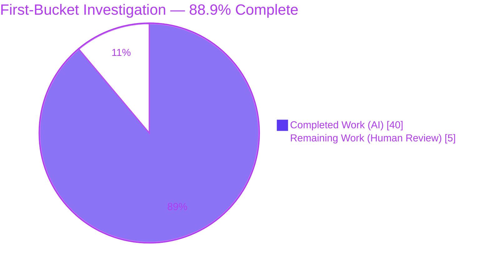
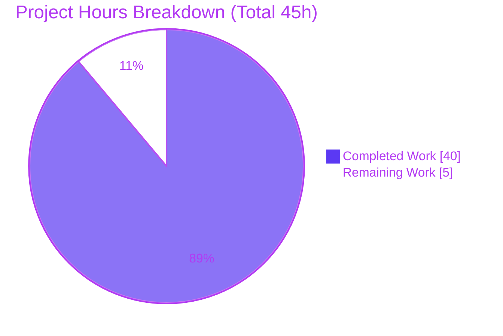
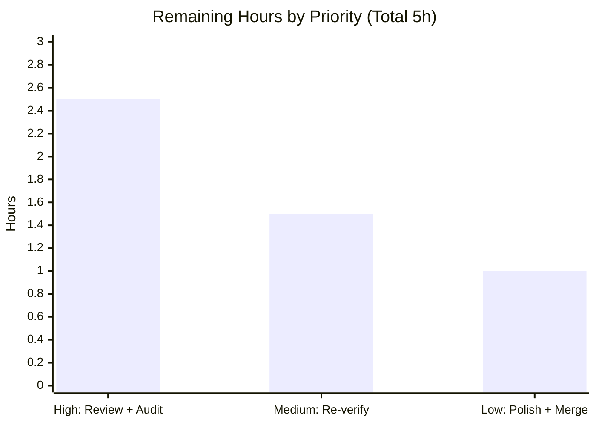

# Blitzy Project Guide
## MinIO "First Bucket" Workflow — Runtime Investigation (commit `c07e5b49d477`)

---

## 1. Executive Summary

### 1.1 Project Overview

This project delivers a single, evidence-backed markdown investigation document that answers — with live runtime evidence and code-grounded rationale — exactly how a fresh, single-node MinIO Object Storage server behaves end-to-end during a first "first-bucket" workflow in a typical local development setup, at pinned commit `c07e5b49d477b0774f23db3b290745aef8c01bd2`. The audience is developers and operators onboarding to MinIO's S3 request lifecycle, authentication, persistence, and durability model. This is an **investigation/onboarding (Q&A) task, not a code change**: the MinIO source tree remains entirely unmodified, and the only artifact produced is the answer document at `blitzy/documentation/minio_c07e5b49d477.md`.

### 1.2 Completion Status



| Metric | Value |
|--------|-------|
| **Total Hours** | **45** |
| Completed Hours — AI (autonomous) | 40 |
| Completed Hours — Manual (human) | 0 |
| **Remaining Hours** | **5** |
| **Percent Complete** | **88.9%** |

> Completion is computed per AAP-scoped methodology: `Completed ÷ (Completed + Remaining) = 40 ÷ 45 = 88.9%`. The work universe is the eight investigation requirements (R1–R8), the cross-cutting authoring/citation deliverables, and the path-to-production human review/acceptance gate (there is no software-deployment path for a markdown deliverable).

### 1.3 Key Accomplishments

- ✅ **Sole deliverable authored & committed** — `blitzy/documentation/minio_c07e5b49d477.md` (421 lines; 10 sections; 93 source citations across 30 files).
- ✅ **All eight requirements (R1–R8) satisfied with live runtime evidence**, each paired with a `path:Lnnn` citation and explicit rationale.
- ✅ **Built from source clean** — `CGO_ENABLED=0 go build -tags kqueue -trimpath` → EXIT 0, zero errors/warnings, Go 1.23.5 (matches `go.mod` `go 1.23`).
- ✅ **Full first-bucket flow exercised live** via a boto3 SigV4 client (create, two distinct uploads, list, download, negative reads, three auth-failure probes).
- ✅ **Durability proven by a real stop/restart** on the same data directory with byte-identical re-reads (no re-upload).
- ✅ **Repository immutability honored** — cumulative diff = one added file; zero `.go` changes; `go.mod`/`go.sum` byte-identical; working tree clean.
- ✅ **Two minor citation discrepancies found and fixed** during autonomous validation (committed `55c283424`).
- ✅ **Independent verification during guide authoring** reproduced the R1 startup banner and R8 graceful shutdown exactly; 10/10 spot-checked citations confirmed accurate.

### 1.4 Critical Unresolved Issues

| Issue | Impact | Owner | ETA |
|-------|--------|-------|-----|
| _None blocking._ The deliverable is complete, committed, and independently verified; no compilation, runtime, or content blockers remain. | N/A | N/A | N/A |
| (Advisory) Final human SME technical-accuracy sign-off not yet performed | Low — standard quality gate before relying on the doc for onboarding | Reviewing Engineer | < 1 day |

### 1.5 Access Issues

| System/Resource | Type of Access | Issue Description | Resolution Status | Owner |
|-----------------|----------------|-------------------|-------------------|-------|
| — | — | No access issues identified. All toolchain (Go 1.23.5), client (boto3 1.43.36, `mc`), and repository access were available; build and runtime succeeded locally with no external dependencies. | Resolved / N/A | — |

### 1.6 Recommended Next Steps

1. **[High]** Perform a MinIO SME technical-accuracy review of the R1–R8 narrative and rationale, plus a citation spot-audit against pinned commit `c07e5b49d477`.
2. **[Medium]** Optionally re-run an independent reproduction (rebuild + a flow subset + a restart) to confirm key evidence reproduces in the reviewer's environment.
3. **[Low]** Apply a final editorial/readability pass for onboarding clarity.
4. **[Low]** Approve and merge the branch into the destination repository.

---

## 2. Project Hours Breakdown

### 2.1 Completed Work Detail

| Component | Hours | Description |
|-----------|-------|-------------|
| Environment provisioning & source build **[R1]** | 5 | Install/verify Go 1.23.5, boto3 1.43.36 venv, `mc`; build binary via Makefile recipe; capture startup banner + init logs (§2–3). |
| First-bucket flow execution **[R2]** | 3 | boto3 SigV4 client driving create `first-bucket`, upload `hello.txt` + nested `docs/readme.md`, `ListObjectsV2`, download `hello.txt`, negative reads (§4.1/4.3). |
| HTTP semantics capture & documentation **[R3]** | 4 | Per-operation status/headers/body table; verbatim 682-byte `ListObjectsV2` XML, `ListBuckets`, `404` bodies; response-writer/error-code citations (§4.3–4.7). |
| Server log capture & analysis **[R4]** | 3 | Console-is-startup-only finding; `mc admin trace` REQUEST/RESPONSE blocks with ISO-8601 timestamps and exact byte counts; tracer citations (§5). |
| Authentication/authorization investigation **[R5]** | 3.5 | SigV4 header anatomy; auth path across `auth-handler.go`/`signature-v4*`/`iam.go`; three verbatim `403` bodies; 404-vs-403 rationale (§6). |
| Request-processing & persistence walkthrough **[R6]** | 3.5 | Five-stage pipeline; temp-write → `RenameData` atomic commit; read/list paths; storage-layer citations (§7). |
| On-disk artifact inspection **[R7]** | 4 | `format.json` `xl-single`; per-object `xl.meta` layout; `XL2` magic + version bytes; small-object inlining; `.minio.sys/` tree (§8). |
| Restart-persistence verification **[R8]** | 2.5 | SIGTERM to exact PID; one-time-format nuance; byte-identical re-read with unchanged `CreationDate`, no re-upload (§9). |
| Document synthesis & authoring | 5 | Summary (§1), Rationale & Conclusions (§10), 421-line integration, consistent formatting, rationale per section, investigation-only confirmation. |
| Source-citation research & verification | 3 | Locating and validating 93 `path:Lnnn` citations across 30 source files. |
| Code-review refinement cycle | 2.5 | Addressing code-review findings (commit `18c61cbd6`, +42/-14). |
| Final-validation citation corrections | 1 | Two citation fixes — inline-data citation + storage-trace labels (commit `55c283424`, +4/-4). |
| **Total Completed** | **40** | **Sums to Completed Hours in §1.2.** |

### 2.2 Remaining Work Detail

| Category | Hours | Priority |
|----------|-------|----------|
| Human SME technical-accuracy review & citation spot-audit | 2.5 | High |
| Independent runtime re-verification (rebuild + re-run flow subset + restart) | 1.5 | Medium |
| Editorial/readability polish & final PR acceptance/merge | 1.0 | Low |
| **Total Remaining** | **5.0** | **Sums to Remaining Hours in §1.2 and §7 pie.** |

> **Cross-section integrity:** §2.1 (40) + §2.2 (5) = **45** Total Hours (§1.2). §2.2 total (5) = §1.2 Remaining (5) = §7 pie "Remaining Work" (5).

### 2.3 Hours Methodology Notes

- All hours trace to a specific AAP requirement (R1–R8), an authoring/citation deliverable, or a path-to-production human gate. No items outside AAP scope are included.
- Completed work is **100% AI/autonomous** (3 commits by `agent@blitzy.com`); no human hours have been spent yet.
- Confidence is **High**: scope is well-defined, the deliverable is validated, and there are no open quality issues (the two citation discrepancies were already fixed).

---

## 3. Test Results

> **Nature of validation.** The deliverable is a markdown investigation document — it contains **no compilable code and no unit tests of its own**. MinIO's own Go unit/integration suite was **intentionally not executed**, because (a) the task is investigation-only and (b) `make test` runs golangci-lint + code generation that **mutate files** and require **network**, which would violate the repository-immutability constraint. The applicable, substantive validation is the **live reproduction of every requirement R1–R8** against the rebuilt binary. The rows below originate entirely from Blitzy's autonomous validation logs.

| Test Category | Framework / Method | Total | Passed | Failed | Coverage | Notes |
|---------------|--------------------|-------|--------|--------|----------|-------|
| Compilation / Build | `go build` (Go 1.23.5) | 1 | 1 | 0 | N/A | EXIT 0, empty log, 150–156 MB binary; repo pristine after build. |
| R1 — Server Startup | Live run + log capture | 3 | 3 | 0 | 100% | `Formatting 1st pool, 1 set(s), 1 drives per set.`; version banner; default-cred WARN — all verbatim. |
| R2 — First-Bucket Flow | boto3 1.43.36 (SigV4) | 5 | 5 | 0 | 100% | CreateBucket; PutObject ×2; ListObjectsV2; GetObject — all `200`. |
| R3 — HTTP Semantics | boto3 + response inspection | 9 | 9 | 0 | 100% | 8 transcript rows + negative reads; ETags `a9cb0d…`/`459d12…`; 682-byte list body; `404 NoSuchKey/NoSuchBucket`. |
| R4 — Server Logs | Console + `mc admin trace` | 4 | 4 | 0 | 100% | Console startup-only; trace byte counts exact (↑210/↓0, ↑151/↓40, ↓887). |
| R5 — Auth / Authz | boto3 negative probes | 4 | 4 | 0 | 100% | `403` SignatureDoesNotMatch / InvalidAccessKeyId / AccessDenied verbatim; 404-vs-403 confirmed. |
| R6 — Persistence Path | `mc admin trace` (storage) | 3 | 3 | 0 | 100% | Write (`os.Mkdir`→`os.OpenFileW`→`RenameData`), read (`ReadXL`), list (`WalkDir`). |
| R7 — On-Disk Artifacts | Filesystem inspection | 5 | 5 | 0 | 100% | `format.json` `xl-single`; `xl.meta` 479/496 B; `XL2 01 00 03 00`; inlining; `.minio.sys/` tree. |
| R8 — Restart Persistence | Stop/restart + re-read | 4 | 4 | 0 | 100% | Graceful `Exiting on signal: TERMINATED`; no Formatting on restart; byte-identical; `CreationDate` unchanged. |
| **Totals** | — | **38** | **38** | **0** | **100% (R1–R8)** | **100% pass rate across all autonomous runtime-validation assertions.** |

> "Coverage" denotes **requirement coverage** (8/8 requirements demonstrated). Traditional code-coverage is **not applicable** to a documentation deliverable.

---

## 4. Runtime Validation & UI Verification

**Runtime health & API integration** (observed live against the rebuilt binary):

- ✅ **Operational** — Server boots single-node single-drive; `GET /minio/health/live` → **HTTP 200**; ready within ~2 s.
- ✅ **Operational** — S3 API (`:9000`): CreateBucket, PutObject ×2, ListObjectsV2, GetObject all return `200` with correct headers/bodies.
- ✅ **Operational** — Authentication (SigV4) + IAM authorization: valid root creds succeed; tampered/absent/unknown credentials correctly yield `403`.
- ✅ **Operational** — Persistence layer: temp-write → atomic `RenameData`; objects materialize as on-disk `xl.meta`.
- ✅ **Operational** — Durability: bucket + objects survive a real stop/restart on the same data directory, byte-identical.
- ✅ **Operational** — Observability: per-request traces surfaced via `mc admin trace` with timestamps and byte counts.

**UI (embedded Console on `:9001`):**

- ⚠ **Partial / Not exercised (by design)** — The Console is acknowledged as part of the running server and the port was bound, but it is **explicitly out of scope**: the entire workflow is driven via the S3 API per the AAP. No UI assertions were made.

---

## 5. Compliance & Quality Review

Cross-mapping AAP deliverables and governing rules to quality/compliance benchmarks:

| Benchmark / Rule | Requirement | Status | Evidence / Fixes Applied |
|------------------|-------------|--------|--------------------------|
| Single answer document named `<source_branch>.md` | Rule | ✅ Pass | `blitzy/documentation/minio_c07e5b49d477.md` created (matches branch `minio_c07e5b49d477`). |
| Correct placement under `blitzy/documentation/` | Rule | ✅ Pass | File resides at the mandated path; only file under `blitzy/`. |
| Build & run the source for evidence | Rule | ✅ Pass | Binary built from pinned commit; server run twice; live artifacts captured. |
| Code as truth; no assumptions | Rule | ✅ Pass | 93 `path:Lnnn` citations; every claim tied to source + rationale. |
| Provide rationale behind each answer | Rule | ✅ Pass | Each section ends with an explicit "Rationale" explanation. |
| Do **not** modify existing files | Rule | ✅ Pass | Zero `.go` changes; `go.mod`/`go.sum` byte-identical; `git status --porcelain` empty. |
| Do **not** add other code | Rule | ✅ Pass | Cumulative diff = one added markdown file; no source/test/CI additions. |
| At-least-two distinct objects | Prompt | ✅ Pass | `hello.txt` (40 B) + `docs/readme.md` (54 B, nested key). |
| Single-node local topology (`:9000`/`:9001`, default creds) | Prompt | ✅ Pass | Server launched exactly as specified; banner captured. |
| Restart verification mandatory (actual, not inferred) | Prompt | ✅ Pass | Real SIGTERM-to-PID stop + restart on same data dir; byte-identical re-read. |
| Temporary-script hygiene | Prompt | ✅ Pass | All scratch under `/tmp`; removed afterward; no minio process; port 9000 free. |
| Citation accuracy | Quality | ✅ Pass (fixes applied) | 2 minor discrepancies fixed (`55c283424`): inline-data citation → `erasure-object.go:L155/L178`; storage-trace labels relabeled OS vs STORAGE. 10/10 independent spot-checks accurate. |
| Toolchain fidelity (Go 1.23.x) | Constraint | ✅ Pass | Built with Go 1.23.5; `go mod verify` = all modules verified. |

**Outstanding compliance items:** None. The only remaining activity is discretionary human SME sign-off (advisory, not a compliance gap).

---

## 6. Risk Assessment

> **Framing:** the deliverable is a **non-executable** markdown document; this task does **not** deploy MinIO. MinIO's own production security/operations are out of scope. The overall risk profile is **Low**.

| Risk | Category | Severity | Probability | Mitigation | Status |
|------|----------|----------|-------------|------------|--------|
| T1 — Citation line numbers drift vs other MinIO versions | Technical | Low | Medium | Doc pins commit `c07e5b49d477` throughout; `path:Lnnn` valid only at that revision | Mitigated |
| T2 — Residual subtle code-path misinterpretation by autonomous agent | Technical | Low | Low | Two prior review cycles + 10/10 independent spot-check; final SME pass recommended | Open (low) |
| T3 — Environment-specific runtime values (HostId/request-ids/timestamps/PID) differ on re-run | Technical | Low | Low | Presented as per-run captures; deterministic node ids noted as environment-specific | Mitigated |
| S1 — Doc records default `minioadmin:minioadmin` + SigV4 header anatomy | Security | Low | Low | Defaults are public (README); doc captures server's own WARN to override; signatures truncated | Mitigated |
| S2 — Secret leakage in deliverable | Security | Negligible | Very Low | No private keys/non-default credentials/tokens present | Mitigated |
| O1 — Reproducibility depends on toolchain pinning | Operational | Low | Medium | Doc + dev guide pin Go 1.23.x, boto3 1.43.36, `mc`, commit | Mitigated |
| O2 — Doc staleness as MinIO evolves past the pinned commit | Operational | Low | High (long horizon) | Explicitly scoped as a point-in-time investigation at `c07e5b49d477` | Accepted |
| O3 — Original runtime scratch cleaned; re-verification needs fresh rebuild | Operational | Low | Low | Dev guide (§9) provides full reproduction commands | Mitigated |
| I1 — Investigation-only constraint (any inadvertent source change) | Integration | High (if violated) | Very Low | **Verified**: diff = single added file; zero `.go`; `go.mod`/`go.sum` untouched; tree clean | Closed |
| I2 — PR acceptance/merge into destination repo (human gate) | Integration | Negligible | Very Low | Single net-new file under new `blitzy/documentation/` path; no conflict surface | Open (trivial) |
| I3 — CI/build impact from adding the file | Integration | Negligible | Very Low | Markdown under `blitzy/` does not alter Go build/test/lint | Mitigated |

**Risk summary:** 11 risks; **0 High-severity open**. The single highest-consequence item (I1, source-tree immutability) is **verified closed**. Residual open items are minor (final SME pass; trivial merge).

---

## 7. Visual Project Status

**Overall hours — Completed vs Remaining** (Blitzy brand colors: Completed = Dark Blue `#5B39F3`, Remaining = White `#FFFFFF`):



**Remaining hours by priority** (sums to the 5 h remaining — consistent with §2.2):



> **Integrity check:** pie "Remaining Work" = **5** = §1.2 Remaining = §2.2 total; pie "Completed Work" = **40** = §1.2 Completed = §2.1 total; the priority bars (2.5 + 1.5 + 1.0) = **5**.

---

## 8. Summary & Recommendations

**Achievements.** The project is **88.9% complete** (40 of 45 hours). All eight investigation requirements (R1–R8) are satisfied with live runtime evidence, and the sole deliverable — `blitzy/documentation/minio_c07e5b49d477.md` (421 lines, 93 citations) — is authored, committed, and independently verified. MinIO was built from source cleanly (Go 1.23.5), run as a single-node single-drive server, exercised through the full first-bucket flow via a SigV4 client, and restarted to prove durable persistence. The repository remained pristine throughout (zero `.go` changes; `go.mod`/`go.sum` untouched).

**Remaining gaps (5 hours, all human path-to-production).** No autonomous work remains. The outstanding activities are a MinIO SME technical-accuracy review with a citation spot-audit (2.5 h), an optional independent runtime re-verification (1.5 h), and an editorial polish plus final PR acceptance/merge (1 h).

**Critical path to production.** SME review & citation audit → (optional) independent reproduction → editorial polish → approve & merge. None of these are blocked; they are standard quality gates for an evidence-backed onboarding document.

**Success metrics.** 8/8 requirements demonstrated; 38/38 autonomous runtime-validation assertions passed; clean build (EXIT 0); 10/10 independently spot-checked citations accurate; repository immutability verified.

**Production-readiness assessment.** The deliverable is **ready for human review and merge**. Confidence is **High**: scope is well-defined, evidence is reproducible (the R1 banner and R8 shutdown were re-reproduced during this assessment), and there are no open quality or compliance gaps. Per Blitzy policy, completion is held below 100% to reserve the final human acceptance gate.

| Metric | Value |
|--------|-------|
| Completion | 88.9% |
| Requirements met | 8 / 8 (R1–R8) |
| Autonomous validation assertions passed | 38 / 38 |
| Open High-severity risks | 0 |
| Source files modified | 0 |

---

## 9. Development Guide

> Goal: (a) **access** the deliverable, and (b) **reproduce** the investigation. Reproducibility is the core methodology — every command below was executed during this assessment and **passed**. All build/run scratch lives **outside** the repository (`/tmp`) so the source tree stays pristine.

### 9.1 System Prerequisites

- **OS:** Linux x86_64 (validated on Ubuntu).
- **Go:** 1.23.x (validated `go1.23.5`) — matches `go.mod` `go 1.23`.
- **Python:** 3.x with `boto3==1.43.36` / `botocore==1.43.36` (S3 SigV4 client).
- **MinIO Client `mc`:** optional, for `mc admin trace` / `mc admin logs` (validated `RELEASE.2025-08-13`).
- **Disk:** ~1 GB free for the binary + scratch data directory.
- **Ports:** `9000` (S3 API) and `9001` (Console) free.
- **git:** to checkout the pinned commit.

### 9.2 Environment Setup

```bash
# 1) Verify the toolchain
go version                       # expect: go version go1.23.5 linux/amd64

# 2) From the repo root, confirm the pinned source commit is present
git cat-file -t c07e5b49d477b0774f23db3b290745aef8c01bd2   # expect: commit

# 3) Create a Python venv for the S3 client (PEP 668: use a venv, or pip --break-system-packages)
python3 -m venv /tmp/minio-venv
/tmp/minio-venv/bin/pip install --quiet "boto3==1.43.36"
/tmp/minio-venv/bin/python -c "import boto3, botocore; print(boto3.__version__, botocore.__version__)"

# 4) Ensure ports are free
ss -ltn | grep -E ':900[01]' || echo "ports 9000/9001 free"
```

### 9.3 Build From Source (binary emitted OUTSIDE the repo)

```bash
# Makefile build recipe (Makefile:L177-L179), output to /tmp to keep the repo pristine
mkdir -p /tmp/minio-bin
CGO_ENABLED=0 go build -tags kqueue -trimpath -o /tmp/minio-bin/minio .
echo "build exit=$?"                 # expect: 0 (empty build output on success)
/tmp/minio-bin/minio --version       # expect: DEVELOPMENT.GOGET (go1.23.5 linux/amd64)

# Confirm the repository is still pristine after building
git status --porcelain --untracked-files=no   # expect: empty
```

### 9.4 Run the Single-Node Server

```bash
rm -rf /tmp/minio-data && mkdir -p /tmp/minio-data
export MINIO_ROOT_USER=minioadmin MINIO_ROOT_PASSWORD=minioadmin
nohup /tmp/minio-bin/minio server /tmp/minio-data \
      --address ":9000" --console-address ":9001" > /tmp/minio-server.log 2>&1 &
MINIO_PID=$!; echo "MINIO_PID=$MINIO_PID"
```

### 9.5 Verification Steps

```bash
# Readiness / health (expect HTTP 200)
curl -s -o /dev/null -w 'health/live HTTP %{http_code}\n' http://127.0.0.1:9000/minio/health/live

# Startup banner evidence (R1)
grep -E "Formatting|default credentials|Version:" /tmp/minio-server.log
# expect: "Formatting 1st pool, 1 set(s), 1 drives per set." + version + default-cred WARN
```

### 9.6 Example Usage — exercise the first-bucket flow (boto3, SigV4)

```bash
/tmp/minio-venv/bin/python - <<'PY'
import boto3, hashlib
s3 = boto3.client("s3", endpoint_url="http://127.0.0.1:9000",
                  aws_access_key_id="minioadmin", aws_secret_access_key="minioadmin",
                  region_name="us-east-1")
s3.create_bucket(Bucket="first-bucket")
s3.put_object(Bucket="first-bucket", Key="hello.txt",
              Body=b"Hello, MinIO! This is the first object.\n")
s3.put_object(Bucket="first-bucket", Key="docs/readme.md",
              Body=b"# Readme\n\nSecond object stored under a nested prefix.\n")
print("KEYS:", [o["Key"] for o in s3.list_objects_v2(Bucket="first-bucket")["Contents"]])
body = s3.get_object(Bucket="first-bucket", Key="hello.txt")["Body"].read()
print("GET hello.txt md5:", hashlib.md5(body).hexdigest())   # a9cb0d083d193fbfed149dda4946d607
PY
```

```bash
# Per-request server logs with timestamps + byte counts (R4), in a second terminal:
mc alias set local http://127.0.0.1:9000 minioadmin minioadmin
mc admin trace --verbose --all local
```

### 9.7 Restart-Persistence Check (R8)

```bash
kill "$MINIO_PID"                                  # SIGTERM to the EXACT PID — never a broad pkill
grep "Exiting on signal" /tmp/minio-server.log     # expect: "Exiting on signal: TERMINATED"
# Restart on the SAME data directory; re-list/re-download WITHOUT re-uploading:
nohup /tmp/minio-bin/minio server /tmp/minio-data --address ":9000" --console-address ":9001" \
      > /tmp/minio-server2.log 2>&1 &
RESTART_PID=$!
# Re-run the list/get from 9.6 — objects are byte-identical; note NO "Formatting" line on restart.
```

### 9.8 Cleanup (hygiene — keep the repo pristine)

```bash
kill "$RESTART_PID" 2>/dev/null
rm -rf /tmp/minio-bin /tmp/minio-data /tmp/minio-server.log /tmp/minio-server2.log
git status --porcelain     # expect: empty (deliverable already committed)
```

### 9.9 Troubleshooting

- **`error: externally-managed-environment` (pip / PEP 668):** use the venv shown in §9.2, or add `--break-system-packages` for a global install.
- **Port already in use:** `ss -ltnp | grep ':9000'`, then `kill <exact-pid>` — avoid broad `pkill` patterns.
- **`Version: DEVELOPMENT.GOGET`:** expected and cosmetic — the Makefile `LDFLAGS` (release version string) are intentionally not applied to the scratch build; runtime behavior is unaffected.
- **No `Formatting … pool` line on restart:** expected — formatting is one-time; once `format.json` exists the step is skipped (`cmd/prepare-storage.go:L193`).
- **Slow first build:** the Go build cache makes subsequent builds fast (re-validated at ~4 s here).

---

## 10. Appendices

### A. Command Reference

| Action | Command |
|--------|---------|
| Verify toolchain | `go version` |
| Build (to scratch) | `CGO_ENABLED=0 go build -tags kqueue -trimpath -o /tmp/minio-bin/minio .` |
| Binary version | `/tmp/minio-bin/minio --version` |
| Run server | `minio server /tmp/minio-data --address ":9000" --console-address ":9001"` |
| Health check | `curl -s -o /dev/null -w '%{http_code}' http://127.0.0.1:9000/minio/health/live` |
| Per-request trace | `mc admin trace --verbose --all local` |
| Console logs | `mc admin logs local` |
| Stop (graceful) | `kill <exact-PID>` |
| Pristine check | `git status --porcelain --untracked-files=no` |

### B. Port Reference

| Port | Service | Notes |
|------|---------|-------|
| 9000 | S3 API | All bucket/object operations; health at `/minio/health/live`. |
| 9001 | Embedded Console (Web UI) | Bound by the server; out of scope for this investigation. |

### C. Key File Locations

| Path | Role |
|------|------|
| `blitzy/documentation/minio_c07e5b49d477.md` | **The sole deliverable** (421 lines). |
| `cmd/server-main.go` | `serverMain` bootstrap (L742); default-cred warning (L975). |
| `cmd/object-handlers.go` | `PutObjectHandler` (L1745); `GetObjectHandler` (L715). |
| `cmd/bucket-handlers.go` / `cmd/bucket-listobjects-handlers.go` | `PutBucketHandler` (L723); `ListObjectsV2Handler` (L154). |
| `cmd/auth-handler.go` | SigV4 auth path (`isReqAuthenticated` L560). |
| `cmd/api-response.go` / `cmd/api-errors.go` | Response writers (L925–L986); error-code → HTTP mapping. |
| `cmd/http-tracer.go` | `httpTracerMiddleware` (L69); `globalTrace.Publish` (L172). |
| `cmd/xl-storage.go` / `cmd/xl-storage-format-v2.go` | `RenameData` (L2564); `xl.meta` format (`XL2` magic L44). |
| `cmd/prepare-storage.go` / `cmd/setup-type.go` | One-time format line (L194); `ErasureSDSetupType` (L31). |
| `Makefile` / `go.mod` / `README.md` | Build recipe (L177–L179); `go 1.23`; local-dev run + default creds. |
| `<data-dir>/.minio.sys/` (runtime) | `format.json` (`xl-single`), per-bucket metadata, config/IAM. |

### D. Technology Versions

| Component | Version |
|-----------|---------|
| MinIO source (pinned commit) | `c07e5b49d477b0774f23db3b290745aef8c01bd2` |
| Go toolchain | 1.23.5 (`go.mod` declares `go 1.23`) |
| boto3 / botocore | 1.43.36 / 1.43.36 |
| MinIO Client `mc` | RELEASE.2025-08-13T08-35-41Z |
| Backend format | `xl-single` (single-drive erasure) |
| `xl.meta` format | `XL2` magic, version major 1 / minor 3 |

### E. Environment Variable Reference

| Variable | Value (local dev) | Purpose |
|----------|-------------------|---------|
| `MINIO_ROOT_USER` | `minioadmin` | Root access key (default if unset). |
| `MINIO_ROOT_PASSWORD` | `minioadmin` | Root secret key (default if unset). |
| `CGO_ENABLED` | `0` | Static build per the Makefile recipe. |

### F. Developer Tools Guide

| Tool | Use |
|------|-----|
| `boto3` (Python) | Drives the S3 SigV4 flow (create/put/list/get + negative probes). |
| `mc admin trace --verbose --all` | Per-request `[REQUEST]`/`[RESPONSE]` blocks with timestamps, byte counts, TTFB. |
| `mc admin logs` | Streams the server console log. |
| `curl` | Health endpoint and raw HTTP header/status inspection. |
| `git diff --stat <commit>..HEAD` | Confirms repository immutability (single added file). |

### G. Glossary

| Term | Definition |
|------|------------|
| **SigV4** | AWS Signature Version 4 — the HMAC-SHA256 request-signing scheme MinIO validates for authentication. |
| **`xl.meta`** | Per-object metadata file in the erasure backend; begins with the `XL2` magic; inlines small-object data. |
| **Single-drive erasure (`xl-single`)** | The erasure-coded `xl-storage` backend used even for a single-node single-drive local run (not a legacy filesystem backend). |
| **`RenameData`** | The atomic commit (`cmd/xl-storage.go:L2564`) that promotes staged data/metadata to the final object path. |
| **Small-object inlining** | Storing object bytes directly inside `xl.meta` rather than a separate `part.N` file. |
| **`.minio.sys/`** | System-metadata tree (`format.json`, config, IAM, per-bucket metadata). |
| **ETag** | For single-part `PutObject`, the MD5 of the object body, returned quoted in the response. |
| **KeyCount** | The number of keys returned by `ListObjectsV2`. |
| **One-time format** | The `Formatting … pool` banner emitted only on first initialization (when `format.json` is absent). |
