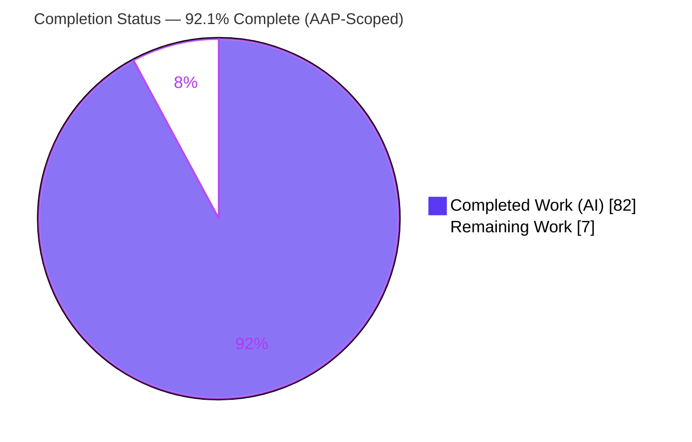
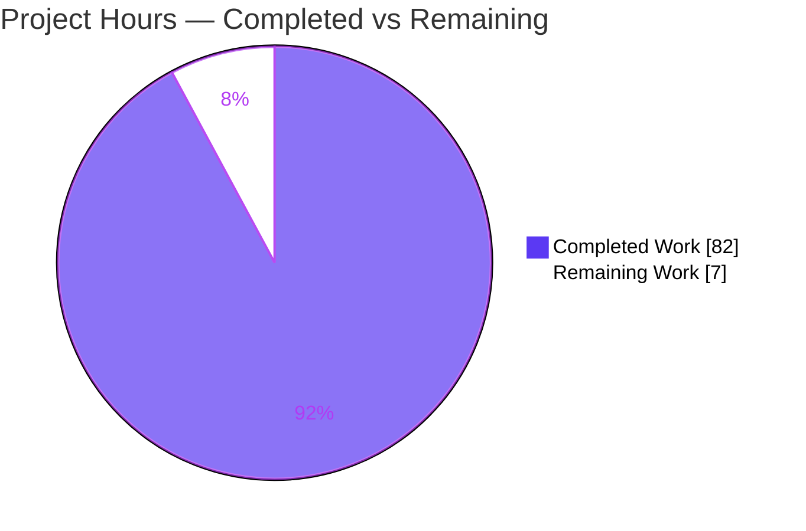
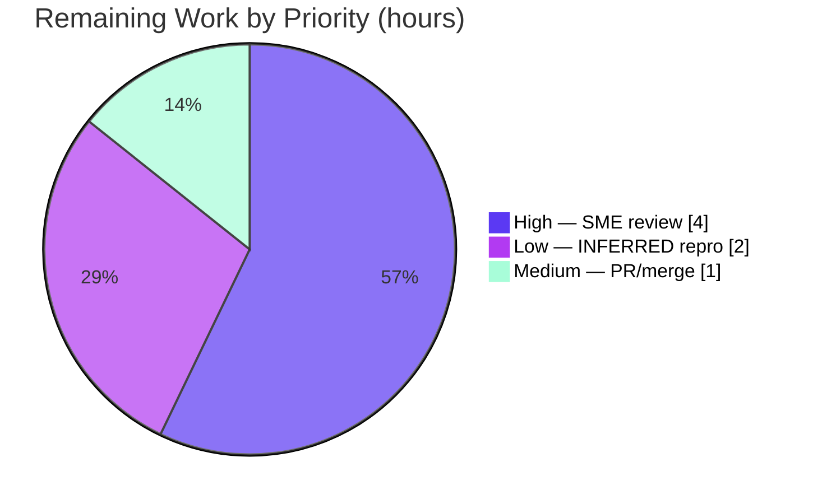

# Blitzy Project Guide — MinIO Healing-Decision Investigation (4‑Drive EC:2)

> **Deliverable:** `blitzy/documentation/minio_c07e5b49d477.md` — a runtime‑evidenced Q&A investigation of MinIO's healing decision logic.
> **Branch:** `blitzy-d4382298-d4a0-48a2-9fb0-3d8b5f9374cb` · **HEAD:** `36a422662` · **Base:** `c07e5b49d477`
> **Color legend:** 🟪 Completed / AI Work = **Dark Blue `#5B39F3`** · ⬜ Remaining / Not Completed = **White `#FFFFFF`**

---

## 1. Executive Summary

### 1.1 Project Overview

This project delivers a single, runtime‑evidenced documentation artifact that explains how MinIO's healing subsystem decides among **reconstruct**, **stay‑deleted (purge dangling)**, and **leave‑degraded** when a 4‑drive erasure‑coded (EC:2) deployment holds an object in an inconsistent on‑disk state (some drives valid, some corrupted, some empty). The audience is engineers onboarding to MinIO's storage engine. Every behavioral claim was produced by building and running a real MinIO binary, manufacturing the ambiguous states on real backend drives, triggering healing through genuine entry points (`mc admin heal` + the background scanner), and capturing decision‑revealing output — each grounded in exact `file:line` citations. The MinIO source tree is treated as strictly read‑only.

### 1.2 Completion Status

**AAP‑scoped completion (PA1 hours methodology): `82 / 89 hours = 92.1% complete`.**



| Metric | Hours |
|---|---|
| **Total Hours** | **89** |
| **Completed Hours (AI + Manual)** | **82** (AI: 82 · Manual: 0) |
| **Remaining Hours** | **7** |
| **Percent Complete** | **92.1%** |

> Calculation: `Completed / (Completed + Remaining) = 82 / (82 + 7) = 82 / 89 = 92.1%`.

### 1.3 Key Accomplishments

- ✅ **All seven core questions answered (Q1–Q5c)** with observed runtime evidence and `file:line` grounding — verified in the document's coverage pass (§14).
- ✅ **Three healing outcomes reproduced and evidenced:** reconstruct (before/after `[ok,ok,missing,missing] → [ok,ok,ok,ok]`), stay‑deleted/purge (`DeleteDanglingObject` audit, `d:p=2:2`, `sz=8388608`), and leave‑degraded (`detail="file is corrupted"`, object retained).
- ✅ **Success boundary established:** 2 damaged shards heal, 3 damaged shards purge (`DataBlocks=2`, `disksToHealCount ≤ ParityBlocks=2`).
- ✅ **Write‑vs‑delete asymmetry demonstrated:** numeric boundary coincides (≥3 missing metas) while mechanism differs (parity‑based/parts‑aware vs fixed‑majority/parts‑ignored), distinguishable at runtime by audit `d:p` (`2:2` vs `0:0`).
- ✅ **Real entry points only:** healing triggered via `mc admin heal` + `madmin` driver and the background scanner — no mocks/debug hooks.
- ✅ **Every scenario confirmed stable across ≥2 runs**, correlated by object versionId.
- ✅ **Read‑only source honored (MainRule):** exactly one file added (1,593 lines); `git diff c07e5b49d477..HEAD` shows zero source changes; working tree clean; all scratch removed.
- ✅ **7/7 key healing unit tests pass** and all runtime reproductions matched the documented evidence during autonomous validation.

### 1.4 Critical Unresolved Issues

| Issue | Impact | Owner | ETA |
|---|---|---|---|
| _None blocking release._ The deliverable passed autonomous validation with zero corrections. | No release blockers | — | — |
| One Q5b write‑side failure string (`"all drives had write errors, unable to heal"`, `erasure-healing.go:615`) is `[INFERRED / code‑grounded — not reproduced]` because the server runs as root (CAP_DAC_OVERRIDE bypasses `chmod 0555`). | Cosmetic/completeness only — string is precisely cited and honestly labeled; does not affect any answer | Human reviewer (optional) | 2h if pursued |

### 1.5 Access Issues

| System/Resource | Type of Access | Issue Description | Resolution Status | Owner |
|---|---|---|---|---|
| Source repository | Read/Write (git) | Present — working tree clean, deliverable committed | ✅ Resolved | — |
| Go toolchain / `mc` client | Build/Run | Go 1.23.12 on PATH, `mc` RELEASE.2025‑08‑13 present | ✅ Resolved | — |

**No access issues identified.** Repository, toolchain, and admin client are all available; build, tests, and runtime reproductions succeeded.

### 1.6 Recommended Next Steps

1. **[High]** Perform SME technical review of the healing‑decision claims and spot‑check the ~80 `file:line` citations against commit `c07e5b49d477` (**4h**).
2. **[Medium]** Review and merge the single‑file additive PR after confirming source is byte‑identical to base (**1h**).
3. **[Low]** _Optional:_ reproduce the one `[INFERRED]` write‑side failure string under a non‑root user / full backend to promote it to `[OBSERVED]` (**2h**).
4. **[Low]** _Optional:_ if the doc will be re‑used against a newer MinIO release, re‑validate citations against that release (the doc is intentionally pinned to `c07e5b49d477`; §13 catalogs the drift).

---

## 2. Project Hours Breakdown

### 2.1 Completed Work Detail

Every completed component traces to a specific AAP requirement or the runtime foundation it required. **Total = 82 hours (matches Completed Hours in §1.2).**

| Component | Hours | Description |
|---|---|---|
| Environment & build foundation | 6 | Build MinIO via canonical `make build` at commit `c07e5b49d477`; fetch static `mc`; provision single‑node 4‑drive EC:2 set; verify parity/quorum constants (doc §2, §5). |
| Healing decision‑logic code investigation | 14 | Trace `healObject`, `shouldHealObjectOnDisk`, `isObjectDangling`, `deleteIfDangling`, quorum computation, bitrot detection, and scanner paths to ~80 `file:line` citations across 24 source files (doc §5, §6, §16). |
| Safe scratch‑only observation harness | 8 | Build `heal_lab.sh` destructive‑safety contract, fail‑closed audit sink, env‑only credentials, and the `madmin` heal driver (doc §3, §4). |
| Reconstruct / purge / degrade scenarios (×2 runs) | 12 | Manufacture and run E1/E1c (reconstruct), E2 + 6‑repetition drive‑position study (purge), E3 (degrade); capture before/after tables, audit, postconditions (doc §6). |
| Boundary, write‑vs‑delete & failure‑error scenarios (×2 runs) | 10 | E4a success boundary (2 heal / 3 purge), E5 delete‑marker vs data object, Q5b Cases A/B error strings (doc §7, §8, §9). |
| Secondary trigger + edge cases | 6 | Background‑scanner negative result + positive control; URL‑escape and nonexistent‑bucket admin‑heal edge behaviors (doc §11, §12). |
| Evidence capture & organization | 6 | Verbatim `HealTaskStatus`/`HealResultItem` JSON, `DeleteDanglingObject` audit records, before/after tables, read‑back md5 — 125 tables total (doc §6–§9). |
| Document authoring | 14 | Write the 1,593‑line / 15,395‑word deliverable: 16 numbered sections + TL;DR + coverage pass + mermaid decision flow. |
| QA refinement + read‑only/cleanup verification | 6 | Four QA‑fix commits resolving 14 findings; MainRule byte‑identical‑source + scratch‑removal + integrity checks (doc §13, §15). |
| **Total** | **82** | |

### 2.2 Remaining Work Detail

Every remaining item traces to a path‑to‑production need or an AAP completeness enhancement. **Total = 7 hours (matches Remaining Hours in §1.2 and the §7 pie chart).**

| Category | Hours | Priority |
|---|---|---|
| SME technical review & citation spot‑check (verify claims, sample ~80 citations, confirm evidence↔conclusion fidelity, validate OBSERVED/INFERRED labels) | 4.0 | High |
| Reproduce the one `[INFERRED]` write‑side failure string under non‑root/full‑backend → promote to `[OBSERVED]` | 2.0 | Low |
| PR review, merge approval & integration to target branch | 1.0 | Medium |
| **Total** | **7.0** | |

### 2.3 Hours Reconciliation

| Check | Result |
|---|---|
| Section 2.1 (Completed) | 82h |
| Section 2.2 (Remaining) | 7h |
| **2.1 + 2.2 = Total** | **89h** ✓ (matches §1.2) |
| Completion % | 82 / 89 = **92.1%** ✓ |

---

## 3. Test Results

All tests below originate from Blitzy's autonomous validation logs for this project (GATE 3), independently re‑confirmed on‑host during this assessment (package compiles; all key tests discoverable; `TestIsObjectDangling` re‑run `ok, 0.256s`). These are the AAP‑designated key healing decision‑logic tests, executed with per‑test `^TestName$` anchors (the setup documents a pre‑existing `globalBytePoolCap` ordering panic on filtered multi‑subsets — a known non‑defect, avoided by anchoring).

| Test Category | Framework | Total Tests | Passed | Failed | Coverage % | Notes |
|---|---|---|---|---|---|---|
| Unit — healing decision logic | Go `testing` (`go test -tags kqueue`) | 7 | 7 | 0 | Not measured¹ | `TestIsObjectDangling`, `TestHealObjectCorruptedXLMeta`, `TestHealObjectCorruptedParts`, `TestHealCorrectQuorum`, `TestHealingDanglingObject`, `TestHealing`, `TestHealObjectErasure` |
| Runtime scenario reproduction² | `mc admin heal` + `madmin` driver + audit webhook | — | All matched | 0 | — | Reconstruct, purge, degrade, boundary, write‑vs‑delete, Q5b, scanner, edge cases — see §4 |
| **Total (unit)** | | **7** | **7** | **0** | — | **100% pass rate** |

> ¹ Coverage percentage was not the validation metric; these are targeted decision‑logic tests selected by the AAP, run per‑test to isolate the documented ordering panic. No coverage number is claimed to avoid fabrication.
> ² Runtime reproductions are behavioral validations (not unit tests) and are enumerated with status indicators in §4.

---

## 4. Runtime Validation & UI Verification

**No UI dimension** — this is a documentation deliverable (AAP §0.9: no Figma/design system, nothing to render). "Runtime validation" here means the healing scenarios were reproduced against a real, freshly‑built MinIO 4‑drive EC:2 server through genuine admin‑heal entry points during autonomous validation (GATE 4).

**Runtime health**
- ✅ Canonical `make build` succeeds (exit 0) → static `./minio` + `docs/debugging` tools.
- ✅ Single‑node 4‑drive EC:2 set provisions and reports `4 drives online, 0 drives offline, EC:2`.
- ✅ Admin Heal API reachable via `mc admin heal` and the `madmin` driver; audit webhook sink captures purge events.

**Healing scenario reproductions** (each confirmed across ≥2 runs)
- ✅ **Reconstruct (E1, E1c):** before/after `[ok,ok,missing,missing] → [ok,ok,ok,ok]`; read‑back md5 match; `dangling_events=0`.
- ✅ **Stay‑deleted / purge (E2):** `DeleteDanglingObject` audit `caller=…erasure-healing.go:309`, `d:p=2:2`, `sz=8388608`; `metas_after=0`.
- ✅ **Leave‑degraded (E3):** `detail="file is corrupted"`; object retained on all 4 drives; `dangling_events=0`.
- ✅ **Success boundary (E4a):** 2 damaged parts → heal; 3 damaged parts → purge via `caller=…:438`, `derrs=map[0:[1 4 4 4]]`.
- ✅ **Write‑vs‑delete (E5):** delete marker `d:p=0:0, sz=0` vs data object `d:p=2:2` — numeric boundary coincides at ≥3 missing metas; mechanism differs.
- ✅ **Q5b client errors:** `SlowDownRead` (data lost, metadata intact) and "Object does not exist" (metadata quorum lost).
- ✅ **Recursive drive‑position dependence (§6 c2):** `keep=d1/d2/d3` recursive → purge; `keep=d4` recursive → retain (never enumerated); `keep=d4` single‑object → purge.
- ✅ **Background scanner (§11):** NEGATIVE result reproduced (damaged object untouched over ~4.6 min of scan cycles) with a POSITIVE control (explicit heal: parts 2→4, md5 match).
- ✅ **Edge cases (§12):** URL‑escaped exact‑prefix heal reports not‑found and does not repair; nonexistent‑bucket heal returns 200 + `summary=stopped`.
- ⚠ **Write‑side reconstruction failure string (Q5b):** `[INFERRED / code‑grounded — not reproduced]` — root privileges bypass DAC write checks; precisely cited at `erasure-healing.go:615`.

---

## 5. Compliance & Quality Review

Cross‑map of AAP deliverables and methodological rules to their status, with fixes applied during autonomous validation.

| AAP Requirement / Rule | Benchmark | Status | Evidence / Notes |
|---|---|---|---|
| Q1 — inconsistent‑state behavior | Answered with runtime evidence | ✅ Pass | Doc §6 c1, TL;DR, §14 |
| Q2 — decision space (3 outcomes) | All three observed | ✅ Pass | Doc §6 c1/c2/c3 |
| Q3 — evidence per case (≥2 runs) | Verbatim output, ×2 runs | ✅ Pass | Full JSON + audit + postcondition; run‑2 reconfirmation |
| Q4 — decision visibility | Before/after + why | ✅ Pass | Doc §10 + before/after tables + audit tags + `detail` |
| Q5a — success boundary | Shard count | ✅ Pass | Doc §7 (2 heal / 3 purge) |
| Q5b — failure error | Error strings | ✅ Pass¹ | Doc §8; write‑side string labeled `[INFERRED]` |
| Q5c — write‑vs‑delete asymmetry | Mechanism contrast | ✅ Pass | Doc §9 (`d:p` 2:2 vs 0:0) |
| Run‑first methodology (Rule 1) | Real build/run, real entry points | ✅ Pass | Doc §2, §3; no mocks/debug hooks |
| Exhaustive evidence (Rule 2) | Before/during/after, unedited | ✅ Pass | Complete raw JSON/audit per scenario |
| Observed‑output discipline (Rule 3) | Claim adjacent to evidence | ✅ Pass | 46 `[OBSERVED]` / 7 `[INFERRED]` / 2 `[INFO]` labels |
| Grounded precision (Rule 4) | `file:line` + exact values | ✅ Pass | 151 citations across 24 files |
| Read‑only source + cleanup (MainRule) | 1 file only, source byte‑identical | ✅ Pass | `git diff base..HEAD` = only the doc; tree clean |
| Deliverable naming/location | `blitzy/documentation/<branch>.md` | ✅ Pass | `blitzy/documentation/minio_c07e5b49d477.md` |
| Supply‑chain posture | Disclosed | ✅ Documented | §2.1 `[INFO]`: pinned‑binary advisories; not a deliverable defect |

> ¹ Six of the seven Q5b facts are `[OBSERVED]`; the single write‑side reconstruction string is `[INFERRED / code‑grounded]` and clearly labeled.

**Fixes applied during autonomous validation:** four QA‑fix commits resolved 14 findings — E2 purge heal‑item corrected to the observed zero‑value record; evidence‑fidelity findings; recursive‑purge boundary qualified by drive position; reproducibility notes. Net result: zero corrections needed at final validation.

---

## 6. Risk Assessment

All risks are **Low severity** — the deliverable is a validated, production‑ready **document** (not a deployable service). None block release.

| Risk | Category | Severity | Probability | Mitigation | Status |
|---|---|---|---|---|---|
| Version/line‑number drift vs MinIO `master`/newer releases (citations pinned to `c07e5b49d477`) | Technical | Low | Medium | §13 catalogs drift; "observed governs"; all citations pinned to commit | Mitigated |
| One `[INFERRED]` Q5b write‑side string not runtime‑reproduced (root DAC bypass) | Technical | Low | Low | Honestly labeled + precisely cited (`:615`); optional 2h repro | Mitigated |
| Scanner NEGATIVE result is commit‑specific | Technical | Low | Low | §13 flags as commit‑specific; POSITIVE control provided | Mitigated |
| Pinned/historical binaries carry known dependency advisories (79 MinIO / 64 `mc`) | Security | Low | N/A | §2.1 `[INFO]`: investigation artifact only; explicit "do not deploy" guidance; zero deps added; source byte‑identical | Documented / Accepted |
| Destructive scratch harness corrupts/deletes backend files | Security | Low | Low | Robust safety contract (mktemp‑only, marker‑gated, loopback‑only, off‑argv creds, fail‑closed sink); removed after use | Mitigated |
| Reproducibility depends on exact container image + toolchain; provenance differs from host | Operational | Low | Low | §2 records exact image ref + build/invocation commands + full harness | Mitigated |
| Documentation‑vs‑code drift over time as MinIO evolves | Operational | Low | Medium | Explicit commit pin throughout | Accepted |
| Deliverable authority gated on human review/merge (no automated prose/citation gate) | Integration | Low | High | Self‑verifying doc (evidence adjacent to every claim); validator reproduced all runtime claims | Open (expected) |

---

## 7. Visual Project Status

**Project hours breakdown** (🟪 Completed `#5B39F3` · ⬜ Remaining `#FFFFFF`):



**Remaining hours by priority** (from §2.2, totals **7h**):



> **Integrity check:** the "Remaining Work" pie value (**7**) equals §1.2 Remaining Hours (**7**) and the §2.2 Hours‑column sum (**4 + 2 + 1 = 7**). ✓

---

## 8. Summary & Recommendations

**Achievements.** The project delivers a rigorously evidenced, `file:line`‑grounded investigation that answers all seven posed questions (Q1–Q5c) about MinIO's healing decision logic on a 4‑drive EC:2 set. It reproduces all three decision outcomes (reconstruct, stay‑deleted, leave‑degraded), establishes the success boundary (2 heal / 3 purge), and demonstrates the write‑vs‑delete asymmetry — all from real `mc admin heal`/scanner runs, confirmed across ≥2 runs, with the MinIO source tree left byte‑identical.

**Remaining gaps.** The project is **92.1% complete** on an AAP‑scoped hours basis (82 of 89 hours). The remaining 7 hours are path‑to‑production: SME technical review (4h), PR review/merge (1h), and one optional reproduction of the single `[INFERRED]` write‑side error string (2h). There are **no release‑blocking issues**.

**Critical path to production.** SME review → merge. Because the deliverable is documentation, "production" is the document being reviewed, approved, and merged — no deployment step exists (and the built binary must explicitly *not* be deployed; §2.1).

**Success metrics.**

| Metric | Target | Actual |
|---|---|---|
| Core questions answered (Q1–Q5c) | 7/7 | 7/7 ✅ |
| Decision outcomes reproduced | 3/3 | 3/3 ✅ |
| Key healing unit tests passing | 7/7 | 7/7 ✅ |
| Source files modified | 0 | 0 ✅ |
| Evidence stability | ≥2 runs | ≥2 runs ✅ |
| AAP‑scoped completion | — | 92.1% |

**Production readiness assessment.** **READY for human review.** The deliverable passed autonomous validation with zero corrections; all runtime claims were reproduced; the source is verifiably read‑only; the working tree is clean. The one honestly‑labeled `[INFERRED]` string and the intentional commit‑pin (with documented drift) are the only caveats, both fully disclosed in the document.

---

## 9. Development Guide

> All commands below were tested on the assessment host (Go 1.23.12) or sourced from the validator‑reproduced document sections. Run from the repository root.

### 9.1 System Prerequisites

- **OS:** Linux x86_64 (canonical container: `andrewparkscaleai/coding-agent:minio__minio__c07e5b49d477…`).
- **Go:** 1.23+ (`go.mod` minimum is `go 1.23`; host `go1.23.12`; canonical container ships `go1.24.3` — either satisfies). CI pins `go-version: 1.23.x`.
- **MinIO Client `mc`:** any recent release (host: `RELEASE.2025-08-13T08-35-41Z`). The AAP fetches the static `mc` via `wget` from `dl.minio.io`.
- **Tooling:** `git`, `make`; ~2 GB free disk for the build plus four drive directories.

### 9.2 Environment Setup

```bash
# Put the Go toolchain on PATH (adjust if installed elsewhere)
export PATH=$PATH:/usr/local/go/bin
go version           # -> go version go1.23.12 linux/amd64

# Move to the repository root
cd <repo-root>       # e.g. /tmp/blitzy/minio/blitzy-d4382298-...c6f865
sed -n '3p' go.mod   # -> go 1.23   (minimum language version, not a pin)
```

### 9.3 Build MinIO (canonical)

```bash
# Canonical build target (Makefile:177/:179). Verify the exact command first:
make -n build | grep 'go build'
# -> CGO_ENABLED=0 go build -tags kqueue -trimpath --ldflags "..." -o $(PWD)/minio

# Then build:
make build           # produces static ./minio + docs/debugging tools
```

> Note: `-tags kqueue` is the canonical `build:` target. The `kqueue,dev` tags belong to `make install-race` (Makefile:216/:218) — the AAP's `Makefile:216-220` citation refers to that race target, as documented in doc §13.

### 9.4 Verify the Healing Unit Tests

```bash
export CI=true
# Confirm the package compiles and the key tests are discoverable:
go test -tags kqueue -count=1 -list \
  'TestIsObjectDangling|TestHealObjectCorruptedXLMeta|TestHealObjectCorruptedParts|TestHealCorrectQuorum|TestHealingDanglingObject|TestHealing|TestHealObjectErasure' ./cmd/

# Run each key test with a single-test anchor (avoids a known globalBytePoolCap ordering panic on filtered multi-subsets):
go test -tags kqueue -count=1 -run '^TestIsObjectDangling$' ./cmd/
# -> ok  github.com/minio/minio/cmd  0.256s
```

### 9.5 Provision a 4‑Drive EC:2 Set and Trigger a Heal

```bash
export MINIO_ROOT_USER=minioadmin
export MINIO_ROOT_PASSWORD='<choose-a-strong-secret>'

# Single-node, 4-drive erasure set -> default parity EC:2 (read quorum 2, write quorum 3)
./minio server /data/d{1...4} --address 127.0.0.1:9000 &
# startup banner shows: "4 drives online, 0 drives offline, EC:2"

# Point mc at it and confirm topology/parity:
mc alias set local http://127.0.0.1:9000 "$MINIO_ROOT_USER" "$MINIO_ROOT_PASSWORD"
mc admin info local          # 1 pool / 1 set / 4 drives; standardSCParity: 2

# Trigger a real heal (renders per-drive before/after state table):
mc admin heal -r --verbose local/<bucket>
```

> To reproduce the inconsistent‑state scenarios, follow the safe, scratch‑only harness described in doc §3–§4 (it corrupts/deletes backend `xl.meta`/`part.N` files inside a mktemp‑guarded lab root, never against real data). Stop the server when done: capture its PID (`pid=$!` right after launch) and `kill "$pid"`.

### 9.6 Access the Deliverable and Verify Read‑Only Source

```bash
# Read the investigation document (1,593 lines):
less blitzy/documentation/minio_c07e5b49d477.md

# Prove the source tree is untouched (only the doc was added):
git diff c07e5b49d477..HEAD --name-status
# -> A   blitzy/documentation/minio_c07e5b49d477.md

git status --porcelain      # empty output => working tree clean
```

### 9.7 Troubleshooting

- **`error: externally-managed-environment` (pip, Ubuntu 25 / PEP 668):** use `pip install --break-system-packages …` or a virtualenv. _(Not required for the Go build.)_
- **`globalBytePoolCap` panic when running `-run 'Heal'` multi‑subsets:** a pre‑existing test‑ordering artifact (not a defect). Run each test with its own `^TestName$` anchor.
- **Cannot force a write‑side heal failure:** as root, `chmod 0555` does not block writes (CAP_DAC_OVERRIDE). Reproduce under a non‑root user or a genuinely full backend to observe `"all drives had write errors, unable to heal"`.
- **Do not deploy the built binary as a service:** it is pinned to a historical commit and carries known dependency advisories (doc §2.1). It is an investigation artifact only.

---

## 10. Appendices

### A. Command Reference

| Command | Purpose |
|---|---|
| `make build` | Canonical static build → `./minio` + debugging tools |
| `make -n build` | Dry‑run: print the exact build command |
| `go test -tags kqueue -count=1 -run '^TestName$' ./cmd/` | Run a single healing test (anchored) |
| `./minio server /data/d{1...4}` | Start a single‑node 4‑drive EC:2 set |
| `mc alias set local http://127.0.0.1:9000 <user> <secret>` | Register the server with `mc` |
| `mc admin info local` | Confirm pool/set/drive count and parity |
| `mc admin heal -r --verbose local/<bucket>` | Trigger a recursive verbose heal (real entry point) |
| `git diff c07e5b49d477..HEAD --name-status` | Prove read‑only source (only the doc added) |
| `git status --porcelain` | Confirm working tree clean |

### B. Port Reference

| Port | Service | Notes |
|---|---|---|
| 9000 | MinIO S3 API + admin (heal) | `--address 127.0.0.1:9000`; loopback‑only in the lab harness |
| (ephemeral) | Audit webhook sink | `127.0.0.1`‑only receiver for `DeleteDanglingObject` events (scratch‑only) |

### C. Key File Locations

| Path | Role |
|---|---|
| `blitzy/documentation/minio_c07e5b49d477.md` | **The deliverable** (1,593 lines) |
| `cmd/erasure-healing.go` | Healing decision core (`healObject`, `isObjectDangling`, `cannotHeal` gate) |
| `cmd/erasure-object.go` | `deleteIfDangling`, `auditDanglingObjectDeletion` |
| `cmd/erasure-healing-common.go` | `listOnlineDisks`, `disksWithAllParts` |
| `cmd/erasure-metadata.go` | `objectQuorumFromMeta` (read/write quorum) |
| `cmd/admin-handlers.go` · `cmd/admin-heal-ops.go` | `HealHandler` → `healSequence.healObject` (admin entry point) |
| `cmd/data-scanner.go` | Background scanner / `healObjectSelectProb` |
| `internal/config/storageclass/storage-class.go` | `DefaultParityBlocks` (→ EC:2 for 4 drives) |
| `Makefile` | Canonical build target (`build:` at `:177`/`:179`) |
| `cmd/erasure-healing_test.go` | Reference healing unit tests |

### D. Technology Versions

| Component | Version | Source |
|---|---|---|
| Go (minimum) | `go 1.23` | `go.mod:3` |
| Go (host toolchain) | `go1.23.12` | `go version` (assessment host) |
| Go (container toolchain) | `go1.24.3` | doc §2 provenance |
| `mc` client | `RELEASE.2025-08-13T08-35-41Z` | host |
| `github.com/klauspost/reedsolomon` | `v1.12.4` | `go.mod:40` (Reed‑Solomon `Erasure.Heal`) |
| `github.com/minio/highwayhash` | `v1.0.3` | `go.mod:49` (bitrot checksums) |
| `github.com/minio/madmin-go/v3` | `v3.0.77` | `go.mod:52` (`HealResultItem`) |

### E. Environment Variable Reference

| Variable | Purpose | Example |
|---|---|---|
| `PATH` | Locate the Go toolchain | `export PATH=$PATH:/usr/local/go/bin` |
| `MINIO_ROOT_USER` | Server admin username | `minioadmin` |
| `MINIO_ROOT_PASSWORD` | Server admin secret | `<strong-secret>` |
| `MINIO_ERASURE_SET_DRIVE_COUNT` | Override drives‑per‑set (default derives EC:2 for 4) | `4` |
| `CI` | Non‑interactive test mode | `true` |

### F. Developer Tools Guide

| Tool | Use |
|---|---|
| `docs/debugging/healing-bin` | Decode `xl.meta` / healing binary output |
| `docs/debugging/xl-meta` (`inspect`) | Inspect backend `xl.meta` structure |
| `buildscripts/verify-healing.sh` | Reference start‑server / corrupt‑disk / `mc admin heal` harness pattern |
| `buildscripts/heal-manual.go` | Reference manual‑heal invocation pattern |
| audit webhook sink (scratch) | Capture `DeleteDanglingObject` audit records during a purge |

### G. Glossary

| Term | Meaning |
|---|---|
| **EC:2** | Erasure coding with 2 parity blocks; on 4 drives → 2 data + 2 parity |
| **Read quorum** | Minimum shards to read; here = `DataBlocks` = 2 |
| **Write quorum** | Minimum shards to write; here raised to `DataBlocks + 1` = 3 (split‑brain guard) |
| **Dangling object** | An object whose on‑disk state fails quorum such that MinIO may purge it |
| **Reconstruct** | Rebuild missing/corrupt shards from survivors via Reed‑Solomon |
| **Stay‑deleted (purge)** | Dangling object removed via `DeleteVersion` + `DeleteDanglingObject` audit |
| **Leave‑degraded** | Object retained untouched because surviving damage is non‑actionable corruption |
| **`d:p` (audit tag)** | data:parity block counts on a `DeleteDanglingObject` event (`2:2` data object vs `0:0` delete marker) |
| **Bitrot** | Silent data corruption, detected via HighwayHash shard checksums |
| **`[OBSERVED]` / `[INFERRED]`** | Evidence labels: captured at runtime vs derived from code reading |

---

*Generated for branch `blitzy-d4382298-d4a0-48a2-9fb0-3d8b5f9374cb` @ HEAD `36a422662`. AAP‑scoped completion: 82/89 h = 92.1%. Completed = Dark Blue `#5B39F3`; Remaining = White `#FFFFFF`.*