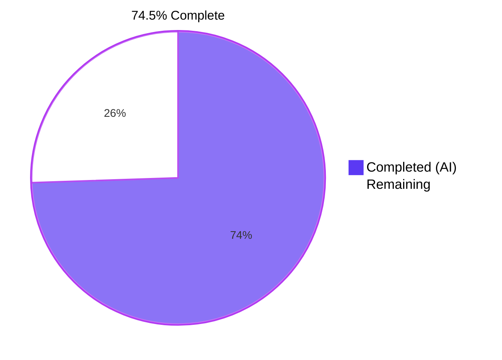
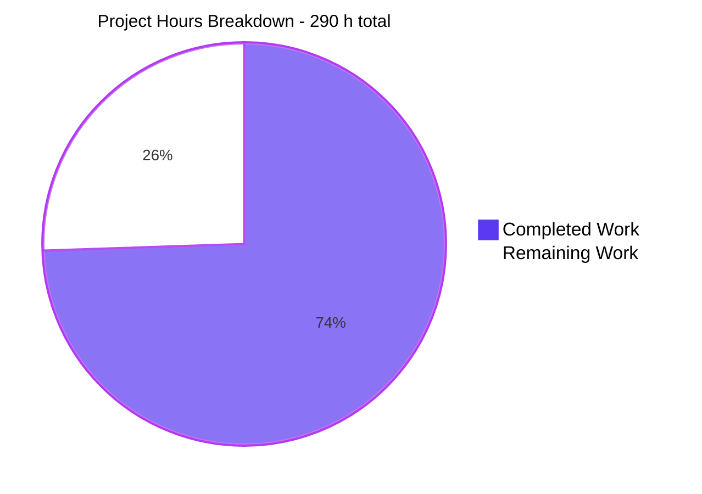
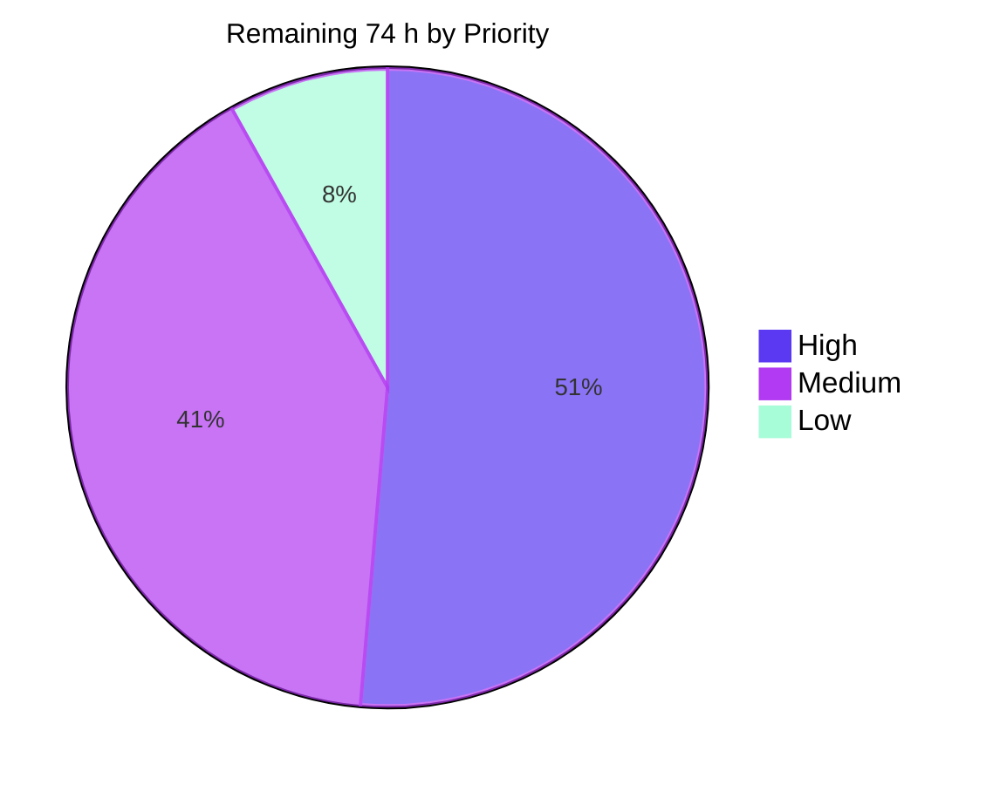
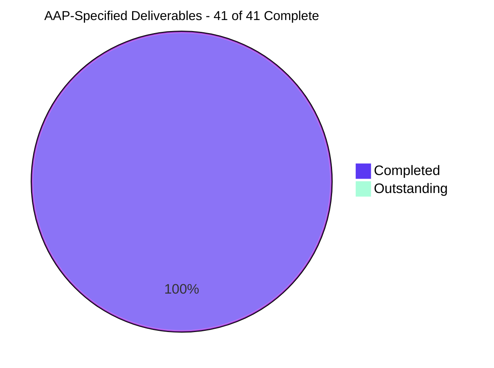

# Blitzy Project Guide

**Project:** Per-Bucket S3 CORS Configuration for MinIO Object Storage
**Repository:** `github.com/minio/minio` · **Branch:** `blitzy-0f0b0ebb-7bfd-4ea0-b3ea-fa096a4c5639`
**Baseline:** `7aac2a2c5` → **HEAD:** `c2a738a1c` · **20 commits**, all authored and committed by `Blitzy Agent <agent@blitzy.com>`

---

## 1. Executive Summary

### 1.1 Project Overview

MinIO shipped the three S3 `?cors` routes as placeholder handlers: `GetBucketCors` always returned `NoSuchCORSConfiguration`, while `PutBucketCors` and `DeleteBucketCors` returned `NotImplemented`. Cross-origin behavior was governed only by a single server-wide allow-origin list. This project delivers first-class **per-bucket CORS configuration** with full AWS parity — `PutBucketCors`, `GetBucketCors`, `DeleteBucketCors` — and makes the server honor each bucket's stored rules when answering browser `OPTIONS` preflight requests, with first-matching-rule-wins semantics. Target users are operators and front-end applications that need per-bucket origin control. The change spans 15 files (**+10,626 / −119**) inside the existing bucket-metadata and request-routing paths, adds **zero** dependencies, and leaves the server-wide setting intact as the fallback.

### 1.2 Completion Status



> **Legend** — <span style="color:#5B39F3">■</span> **Completed / AI Work = Dark Blue `#5B39F3`** · <span style="color:#FFFFFF">□</span> **Remaining = White `#FFFFFF`**

| Metric | Value |
|---|---|
| **Total Hours** | **290** |
| **Completed Hours (AI + Manual)** | **216** (216 AI-autonomous + 0 manual) |
| **Remaining Hours** | **74** |
| **Percent Complete** | **74.5 %** |

**Calculation (PA1, AAP-scoped work only):**
`Completion % = 216 / (216 + 74) × 100 = 216 / 290 × 100 = 74.4828 % → 74.5 %`

Every one of the AAP's specified deliverables — 8 explicit requirements (R1–R8), 4 mandated acceptance tests (A1–A4), 16 implicit requirements (I1–I16), 9 validation rules (V1–V9) and all 4 new files — is **complete and verified**. The remaining 74 hours are entirely **path-to-production**: human review, security sign-off, multi-node and upgrade validation on real infrastructure, CI on project runners, observability, staging and release comms.

### 1.3 Key Accomplishments

- ✅ **Complete S3 CORS API surface** — `PUT` → 200, `GET` → 200 XML / 404 `NoSuchCORSConfiguration`, `DELETE` → 204 and idempotent; each authorized against its own `policy.*BucketCorsAction`
- ✅ **Preflight evaluator as outermost HTTP middleware** — first-matching-rule-wins in document order across origin, method and headers; a match emits all five `Access-Control-*` families including `Expose-Headers`, which the vendored `rs/cors` never emits on preflight
- ✅ **Deny contract honored exactly** — a non-matching request receives **zero** `Access-Control-*` headers, which is how a browser learns it is denied
- ✅ **Global fallback preserved verbatim** — a bucket with no stored configuration delegates unchanged to `MINIO_API_CORS_ALLOW_ORIGIN`, and **`TestCors` is byte-identical to baseline** (verified by diffing the function)
- ✅ **Validation that exceeds the specification** — V1–V9 plus BOM consumption, control-character rejection, namespace/`xmlns` pinning, whitespace normalization, duplicate-attribute detection, a strict trailer walk, and a canonical-form size ceiling
- ✅ **Security hardening on an unauthenticated surface** — header-size ceiling, `hasBadHost` check, strict bucket-name syntax gate, a `1<<20` comparison budget, an 8-slot backend-read semaphore that refuses rather than queues, a 2 s read timeout, and rate-limited refusal reporting so log volume is never attacker-controlled
- ✅ **Zero-footprint persistence** — three `BucketMetadata` fields wired through parse, both timestamp helpers, the `updateAndParse` switch and a typed accessor; MessagePack regenerated; **no storage format bump**
- ✅ **Exceptional test depth** — **47 test functions / 494 subtests** in `cmd/bucket-cors_test.go`, plus 4 acceptance tests green on **all 5 server configurations**; **4,891 tests pass / 0 fail** repository-wide with 0 data races
- ✅ **All quality gates green, re-verified independently** — build 0, vet 0, lint **"0 issues."**, `go generate` zero delta, `go mod tidy` zero delta
- ✅ **Zero dependency delta** — `go.mod`, `go.sum` and `cmd/apierrorcode_string.go` untouched; no new `APIErrorCode`
- ✅ **A real defect found, root-caused and fixed** — `encoding/xml` applies `omitempty` per slice *element*, silently erasing a rule's only empty `AllowedOrigin` and breaking the `GET`→`PUT` round-trip; fixed with 18 regression cases and a 14-bucket fleet integrity sweep (0 non-conformant)
- ✅ **88 previously-skipped test suites unblocked** by standing up etcd, OpenLDAP, two Dex OIDC issuers and the policy plugin — raising the verification bar well above the documented baseline
- ✅ **Documentation made truthful** — the false "BucketCORS unsupported" claim removed from `docs/minio-limits.md`; a 382-line feature guide added at `docs/bucket/cors/README.md`

### 1.4 Critical Unresolved Issues

There are **no functional defects and no failing gates**. The items below are unresolved *decisions and verifications*, not broken code.

| Issue | Impact | Owner | ETA |
|---|---|---|---|
| Peer metadata-cache coherence never exercised across real nodes | On a distributed cluster a stale peer would delegate a preflight to the global fallback for the broadcast window instead of applying the bucket's rules. Argued from code (`save` → `sys.Set` → `LoadBucketMetadata`), not from execution. | Platform / SRE | 1 day |
| No-format-bump upgrade safety proven by code reading only | A rolling upgrade has not been executed in either direction. The argument (msgp map encoding with `default: Skip()`, plus `defaultTimestamps()` back-fill) is sound but unverified against a real mixed-version cluster. | Platform / SRE | 1 day |
| Security sign-off pending on the unauthenticated preflight surface | The evaluator runs ahead of the mux middlewares on every request. Seven mitigations are implemented, but the four budget constants have not been reviewed against the target deployment's traffic profile. | Security | 1 day |
| Behavior change not yet communicated | A bucket that gains rules will now *deny* non-matching preflights the permissive `'*'` default previously allowed. Silent breakage for any front-end relying on the old behavior. | Product / Docs | 0.5 day |
| Per-bucket rules do not govern *simple* (non-preflighted) requests | With `MINIO_API_CORS_ALLOW_ORIGIN` at its `'*'` default, a simple cross-origin `GET`/`HEAD` stays readable from any origin however narrow a bucket's rules are. Faithful to the specification and prominently documented, but an operator-expectation gap. | Product / Ops | 0.5 day |
| CORS not propagated by site replication | `madmin.SRBucketMetaTypeCorsConfig` and `SRBucketMeta.Cors` exist in the pinned madmin but are referenced by neither MinIO nor this change, so rules will diverge between replicated sites. Deferred by design; symbols recorded for a trivial opt-in. | Platform | Decision |
| CORS absent from `mc admin bucket export/import` | The fixed `cfgFiles` list omits `cors.xml`, so backup/restore and metadata migration silently drop CORS rules. Deferred by design. | Platform | Decision |

### 1.5 Access Issues

**No access issues identified.** Every permission and tool required for autonomous delivery and validation was available, and I re-verified each by execution in this session.

| System/Resource | Type of Access | Issue Description | Resolution Status | Owner |
|---|---|---|---|---|
| Git repository & history | Read / write / commit | None — 20 commits landed; working tree clean at `c2a738a1c` | ✅ No issue | — |
| Go toolchain 1.24.8, `msgp`, `stringer`, `golangci-lint` | Execute | None — all present at the AAP-pinned versions | ✅ No issue | — |
| Go module proxy / module cache | Read | None — `go mod download` and `go mod tidy` both succeeded with zero delta | ✅ No issue | — |
| Local 4-drive erasure MinIO runtime | Execute / network | None — server started, all health endpoints 200 | ✅ No issue | — |
| `mc` and AWS CLI clients | Execute | None — `mc cors set/get/remove` and `aws s3api get-bucket-cors` all exercised | ✅ No issue | — |
| Headless Chrome | Execute | None — 3 validation runs completed. Three CDP Input-domain wedges occurred and were each recovered via restart; no measurement was affected | ✅ No issue | — |
| Untracked 912 MB QA directory | Filesystem | Previously broke `go build ./...` by being walked as a package tree | ✅ Resolved — relocated under a leading `_`, which Go tooling ignores; build now exit 0 | — |
| `golangci-lint` installer via `make getdeps` | Network | Upstream `install.sh` unanchored-grep bug matches both `.tar.gz` and `.tar.gz.sbom.json` | ✅ Resolved — installed out of band; `golangci-lint run` invoked directly and reports "0 issues." | — |
| Multi-node cluster hosts, project CI runners, staging environment, production credentials/TLS | Infrastructure | Not present in this environment | ⚠️ Prerequisite for remaining work — **not a blocked permission**; priced in Section 2.2 categories 3, 4, 5, 9 and 11 | Platform / SRE |

### 1.6 Recommended Next Steps

1. **[High]** Conduct human code review of the 10,626-line change, beginning with `cmd/bucket-cors.go` — the validator, strict schema walk, matcher and middleware — then the six wiring files, then tests and docs. *(16 h — tasks H-1…H-4)*
2. **[High]** Obtain security sign-off on the unauthenticated preflight surface and validate the four DoS budget constants against the target deployment's traffic profile, including an adversarial abuse test. *(8 h — H-5, H-6)*
3. **[High]** Stand up a 4-node distributed cluster and validate peer metadata-cache coherence — write on one node, assert `GET` and preflight honor it on the others — plus behavior during a node restart while the cache reloads. *(8 h — H-7, H-8)*
4. **[High]** Execute a real rolling upgrade in both directions to convert the no-format-bump compatibility argument from code reading into evidence. *(6 h — H-9, H-10)*
5. **[Medium]** Publish release notes that lead with the deny-on-non-match behavior change and the simple-request caveat, and record the site-replication, admin-export and Console-UI limitations. *(4 h — M-10, M-11)*

---

## 2. Project Hours Breakdown

### 2.1 Completed Work Detail

| Component | Hours | Description |
|---|---|---|
| CORS domain model & validation layer | 26 | `cmd/bucket-cors.go` — satisfies R1/R2 and V1–V9. Reuses the vendored `minio-go/v7/pkg/cors` model for AWS-exact tags, then adds a hand-written strict XML schema walk over the raw token stream (root element, rule cardinality, per-element repeat rules, attribute duplication, namespace prefixes, trailer) plus BOM consumption, control-character rejection, `xmlns` pinning, whitespace normalization and a canonical-form size ceiling. |
| Preflight evaluation engine & middleware | 24 | R5/R6/R7 and I9/I10 — the only genuinely new runtime behavior. Three-axis matcher with first-match-wins document ordering, wildcard origin matching, case-insensitive header matching with `*` support, a `1<<20` comparison budget, fail-closed bounded backend reads (8-slot semaphore, 2 s timeout), and a rate-limited refusal reporter. |
| S3 API handlers `PUT`/`GET`/`DELETE ?cors` | 14 | `cmd/bucket-cors-handlers.go` (306 lines) — R1/R3/R4. Includes `corsConfigBody`, which verifies declared Content-MD5 / `x-amz-content-sha256` / checksums on the SigV2 and anonymous-policy paths where no auth path installs verification, and `corsAuditLogFilterKeys`, which redacts replayable signature material from audit entries. `DELETE` correctly uses its own action rather than copying the tagging quirk. |
| Bucket-metadata persistence & MessagePack regeneration | 10 | I1–I5 and I7 — three struct fields, the `parseAllConfigs` arm, `lastUpdate()`, the twelfth `defaultTimestamps()` block, the `updateAndParse` case arm, `GetCORSConfig` beside `GetSSEConfig`, and codec regeneration. Indivisible: omitting any piece yields a feature that works one way and fails silently the other. |
| S3 error mapping | 2 | I6 — `BucketCORSConfigNotFound GenericError` plus one `toAPIErrorCode` arm. Nine lines with outsized effect: without the arm, R3's intended 404 degrades to a 500-class internal error. |
| Routing & middleware composition | 5 | I13 — deletes the shadowed `rejectedBucketAPIs` cors entry, relocates the three routes out of the "Dummy Bucket Calls" block, wraps the constructed `rs/cors` handler, adds the aliased import, and removes the three stubs from `cmd/dummy-handlers.go`. Includes the empirical mux route-shadowing probe. |
| Unit test suite | 48 | `cmd/bucket-cors_test.go` — **47 test functions / 494 subtests / 7,343 lines**. Covers every validation rejection reason, every matcher branch, wildcard and case-insensitive header matching, budget exhaustion, middleware delegation and disposition, malformed and unresolvable hosts, cache-only lookup, the metadata load window, refusal-reporter rate and concurrency, audit filter keys, and metadata round-trip. |
| Acceptance tests A1–A4 | 16 | `cmd/server_test.go` (+939) and `cmd/test-utils_test.go` — four `TestSuiteCommon` methods registered in `runAllTests`, running on all 5 server configurations. A2 deliberately drives raw HTTP because the SDK swallows the 404 code. A4 asserts all five allow families on a match, the total absence of `Access-Control-*` on a deny, and the distinct delegated-path header set. |
| Documentation | 8 | I14 — `docs/bucket/cors/README.md` (382 lines, 14 sections) with worked `mc`, `aws s3api` and IAM-policy examples, and an honest "Scope: preflighted requests only" section; plus removal of the false BucketCORS exclusion from `docs/minio-limits.md`. |
| Autonomous validation & quality gates | 22 | AAP §0.6.4 — build, vet, lint, `check-gen`, `go mod tidy`, the 4,891-test suite, race detector, cross-compilation, and live SigV4 / `mc` / `aws s3api` contract sweeps (14/14) plus a wire-format sweep (18/18), repeated across 20 commits. |
| Browser runtime validation | 9 | Headless-Chrome runs proving cross-origin `fetch` allow vs deny, Console front-end no-regression, first-match-wins via rule-specific `Max-Age`, and mutating presigned cross-origin operations — each cross-checked against independent `curl` ground truth. |
| Defect discovery, root cause & fix | 8 | Found that `encoding/xml` applies `omitempty` per slice *element*, so a rule whose only `AllowedOrigin` was empty had it erased on marshal — meaning `GET` returned bytes `PUT` would reject. Fixed with a flag folded into the existing origin loop (error precedence provably unchanged), 18 new test cases, and a 14-bucket fleet integrity sweep finding 0 non-conformant documents. |
| Test-environment remediation | 10 | Unblocked 88 previously-skipped suites by standing up etcd v3.5.17, OpenLDAP, two Dex OIDC issuers and the access-manager plugin, and by resolving the env-var name mismatch between the workflow and the code. |
| Code-review & security remediation cycles | 14 | Eight-plus dedicated commits resolving QA, security and review findings: BOM/whitespace/control-character handling, preflight header bounds, fail-closed metadata reads, scope corrections, documentation links, and license headers. |
| **Total** | **216** | **Matches Completed Hours in Section 1.2** |

### 2.2 Remaining Work Detail

| Category | Hours | Priority |
|---|---|---|
| Human code review & upstream PR acceptance of the 10,626-line change | 16 | High |
| Security sign-off on the unauthenticated preflight surface & DoS budget constants | 8 | High |
| Multi-node distributed cluster validation — peer metadata-cache coherence (AAP I7) | 8 | High |
| Rolling-upgrade & on-disk metadata compatibility validation (no-format-bump claim) | 6 | High |
| CI/CD pipeline execution on project infrastructure (21 workflows, full OS/arch matrix) | 5 | Medium |
| Released-client compatibility verification — `mc`, AWS CLI, AWS SDKs (AAP R8) | 4 | Medium |
| Observability wiring & operational runbook for preflight refusal reports | 5 | Medium |
| Preflight hot-path performance characterization & budget-constant tuning | 6 | Medium |
| Staging deployment & real front-end browser smoke test | 6 | Medium |
| Behavior-change release notes, changelog & docs-site navigation entry | 4 | Medium |
| Deployment environment & credential configuration (root creds, TLS, fallback allow-origin policy) | 3 | Low |
| Product decisions on the 3 deliberately-deferred convention findings | 3 | Low |
| **Total** | **74** | **High 38 · Medium 30 · Low 6** |

> **Integrity check** — Section 2.1 (**216 h**) + Section 2.2 (**74 h**) = **290 h** = Total Hours in Section 1.2 ✔ · Section 2.2 sum (**74 h**) = Remaining Hours in Section 1.2 = Section 7 pie "Remaining Work" ✔

### 2.3 Human Task Breakdown

The 74 remaining hours decompose into **25 discrete tasks** that reconcile exactly to the 12 categories above.

**High Priority — 38 h**

| ID | Task | Hours |
|---|---|---|
| H-1 | Code review of `cmd/bucket-cors.go` (1,515 lines) — validator, schema walk, matcher, budget, middleware, refusal reporter | 8 |
| H-2 | Code review of handlers, bucket-metadata wiring, routing and error mapping (6 files) | 4 |
| H-3 | Code review of `cmd/bucket-cors_test.go`, the `cmd/server_test.go` additions and `docs/bucket/cors/README.md` | 3 |
| H-4 | Address review feedback and re-run the full gate set | 1 |
| H-5 | Security review of the unauthenticated preflight surface; validate the four budget constants for the deployment | 5 |
| H-6 | Adversarial preflight abuse test — header floods, deep rule sets, made-up buckets, malformed `Host` | 3 |
| H-7 | Stand up a 4-node cluster; validate peer metadata-cache coherence for `?cors` writes | 5 |
| H-8 | Validate CORS during node restart / metadata-cache reload (exercises the fail-closed path) | 3 |
| H-9 | Execute a bidirectional rolling upgrade; confirm unknown-key skipping and timestamp back-fill | 4 |
| H-10 | Inspect on-disk metadata carrying `CORSConfigXML`; confirm no format bump required | 2 |

**Medium Priority — 30 h**

| ID | Task | Hours |
|---|---|---|
| M-1 | Run the GitHub Actions matrix on project runners (`go`, `go-lint`, `go-cross`, `vulncheck`, `typos`) | 3 |
| M-2 | Run the `mint`, `iam-integrations` and `replication` integration workflows | 2 |
| M-3 | Verify R8 against the released `mc`, `aws s3api` and one AWS SDK in the target environment | 4 |
| M-4 | Wire the preflight refusal reporter into metrics/alerting; add a dashboard panel | 3 |
| M-5 | Write the operational runbook entry for preflight refusals and constant tuning | 2 |
| M-6 | Benchmark the middleware gate on the non-`OPTIONS` hot path against the baseline binary | 4 |
| M-7 | Load-test the preflight allow/deny path; tune budget constants if needed | 2 |
| M-8 | Deploy the branch build to staging with production-shaped configuration | 3 |
| M-9 | Run a real front-end application's cross-origin flows against staging in a browser | 3 |
| M-10 | Write release notes — behavior change, simple-request caveat, documented limitations | 3 |
| M-11 | Add the new guide to docs-site navigation; cross-link from the config guide | 1 |

**Low Priority — 6 h**

| ID | Task | Hours |
|---|---|---|
| L-1 | Configure deployment credentials/TLS and narrow `MINIO_API_CORS_ALLOW_ORIGIN` to real origins | 2 |
| L-2 | Verify the server-wide fallback path end-to-end after narrowing the global list | 1 |
| L-3 | Decide and record the 3 deferred convention findings | 2 |
| L-4 | Implement any accepted convention change and re-run the CORS test subset | 1 |

---

## 3. Test Results

All figures below originate from Blitzy's autonomous validation logs for this project. Rows marked **↺** were independently re-executed and re-confirmed during this assessment.

| Test Category | Framework | Total Tests | Passed | Failed | Coverage % | Notes |
|---|---|---|---|---|---|---|
| Full repository suite | Go `testing` (`-tags kqueue,dev`) | 4,894 | **4,891** | **0** | Not measured — repository defines no coverage gate | 3 skipped, all upstream `t.Skip` in out-of-scope files: `TestPathTraversalExploit` (Windows-only), `TestNSLockRace` ("long test"), `TestScanner` ("unstable"). 46/46 packages `ok`. Improves on the documented `4,230 / 0 / 91` baseline. |
| CORS unit tests ↺ | Go `testing`, table-driven | 47 functions / 494 subtests | **541** | **0** | Every V1–V9 branch and every matcher branch exercised | `cmd/bucket-cors_test.go` (7,343 lines). Re-run by me: exit 0, 47 top-level PASS, 494 subtest PASS, 0 FAIL. |
| Acceptance tests A1–A4 ↺ | Go `testing` via `TestSuiteCommon` | 4 × 5 server configurations = 20 executions | **20** | **0** | R1–R8 wire contract | `TestBucketCORSRoundTrip`, `…NotFound`, `…MalformedXML`, `…Preflight`, registered in `runAllTests`. Re-run by me: `TestServerSuite` PASS on ErasureSD ×3, Erasure, ErasureSet. |
| Global CORS regression gate ↺ | Go `testing` | 1 | **1** | **0** | The single largest regression risk in the change | `TestCors` passes **byte-identical** to baseline. I extracted the function from baseline and HEAD and diffed it: empty, 46 lines. |
| MessagePack codec round-trip ↺ | `tinylib/msgp` generated tests | 4 | **4** | **0** | Extended `BucketMetadata` struct | `TestMarshalUnmarshalBucketMetadata`, `TestEncodeDecodeBucketMetadata`. Re-run by me: `ok 0.263s`. |
| Race detection ↺ | Go race detector | 529 | **529** | **0** | **0 DATA RACE** | Re-run by me on the CORS subset: `ok 7.215s`, no races. |
| Live API contract sweep | Raw SigV4 HTTP + `mc` + `aws s3api` | 14 | **14** | **0** | R1–R8 end-to-end on a 4-drive erasure server | Consolidated sweep at final HEAD. Independently re-executed by me: PUT→200, GET→200, DELETE→204, idempotent DELETE→204, GET-after-delete→404, malformed→400 `MalformedXML`. |
| Wire-format conformance sweep | Raw HTTP assertions | 18 | **18** | **0** | AWS-exact element naming (R8) | Asserts the root element, the S3 namespace, all 7 child element names, and the **absence** of 8 wrong-casing/plural variants. |
| Browser preflight validation ↺ | Headless Chrome (DevTools protocol) | 3 origins × 7 checks + 12 preflight audits | **21 / 21 checks, 12 / 12 preflights** | **0** | R5/R6/R7 from a real browser | Re-executed by me this session: 7/7 PASS from each of three origins; all 12 OPTIONS matched independent `curl` ground truth byte-for-byte. |
| Console UI no-regression ↺ | Headless Chrome | 5 gate conditions | **5** | **0** | Front-end unaffected | Re-executed by me: login 204, bucket list and object listing render, **0 `OPTIONS` requests**, **0 CORS console messages**, healthy same-origin WebSocket 101. |

**Static analysis and code-generation gates** — all re-executed during this assessment:

| Gate | Command | Result |
|---|---|---|
| Build | `CGO_ENABLED=0 go build -tags kqueue ./...` | **exit 0** |
| Vet | `go vet -tags kqueue,dev ./...` | **exit 0** |
| Lint | `golangci-lint run --build-tags kqueue --config ./.golangci.yml` | **"0 issues." exit 0** |
| Codegen | `go generate ./...` then `git status --porcelain` | **exit 0, empty delta**; both `check-gen` guards pass |
| Module tidy | `go mod tidy -compat=1.21` | **exit 0, zero delta** to `go.mod` / `go.sum` |
| Cross-compile | `windows/amd64`, `darwin/arm64` | **exit 0** both |

---

## 4. Runtime Validation & UI Verification

### Server runtime health

- ✅ **Operational** — 4-drive erasure server starts cleanly ("Formatting 1st pool, 1 set(s), 4 drives per set")
- ✅ **Operational** — `/minio/health/live` → **200**
- ✅ **Operational** — `/minio/health/ready` → **200**
- ✅ **Operational** — `/minio/health/cluster` → **200** · `/minio/health/cluster/read` → **200**
- ✅ **Operational** — Console WebUI on `:9001` → **200**
- ✅ **Operational** — persisted bucket metadata contains `CORSConfigXML`, `CORSConfigUpdatedAt` and the `CORSConfiguration` document in `xl.meta` across all four drives, with no storage format bump

### S3 API contract (raw SigV4, re-verified this session)

- ✅ **Operational** — `PUT /{bucket}?cors` → **200** (R1)
- ✅ **Operational** — malformed root element → **400** with `<Code>MalformedXML</Code>` and a descriptive `<Message>` naming the offending element, in the standard S3 error shape with `BucketName`, `Resource`, `RequestId`, `HostId` (R2/A3)
- ✅ **Operational** — `GET /{bucket}?cors` → **200** with the canonical document (R3/A1)
- ✅ **Operational** — `GET` on a bucket with no configuration → **404 `NoSuchCORSConfiguration`** / "The CORS configuration does not exist" (R3/A2)
- ✅ **Operational** — `DELETE /{bucket}?cors` → **204**, and a second `DELETE` → **204** (R4, idempotent)
- ✅ **Operational** — `GET` after `DELETE` → **404 `NoSuchCORSConfiguration`** (A2)

### Preflight evaluation

- ✅ **Operational** — matched rule → **200** carrying all five families: `Access-Control-Allow-Origin` (echoed), `-Allow-Methods`, `-Allow-Headers`, `-Max-Age`, `-Expose-Headers`, plus the `Vary` triple (R6)
- ✅ **Operational** — **first-matching-rule-wins proven twice over.** An origin matching *both* stored rules received rule 0's `Max-Age: 11` and rule 0's expose list — not rule 1's `222`/`x-amz-version-id`, and not a merge — while a control origin matching only rule 1 received `Max-Age: 222`, proving both rules are live and the tie was broken in document order (R5)
- ✅ **Operational** — **method axis** enforced: `PUT` allowed only from the origin whose rule permits `PUT`; denied from an origin matching only the `GET`-only rule (R5)
- ✅ **Operational** — non-matching request → **200** with `Vary` only and **zero `Access-Control-*` headers of any kind**; the browser blocks it with `PreflightMissingAllowOriginHeader` (R7)
- ✅ **Operational** — bucket with no stored configuration → delegated: **204** + `Access-Control-Allow-Credentials: true`, **no** `Max-Age`, **no** `Expose-Headers` — the untouched server-wide handler, confirmed permissive even for an origin no per-bucket rule matches (R7)
- ✅ **Operational** — **`TestCors` shape preserved live**: `OPTIONS /` with only `Origin` returns **200** + `Allow-Credentials: true` + the **19-entry** `Access-Control-Expose-Headers` list + `Vary: Origin` — exactly what the regression gate asserts (I11)
- ✅ **Operational** — the two code paths are cleanly distinguishable on the wire (per-bucket → 200 + `Max-Age` + `Expose-Headers`, no `Allow-Credentials`; global → 204 + `Allow-Credentials`, no `Max-Age`), which is what makes every claim above independently falsifiable

### Client compatibility (R8)

- ✅ **Operational** — `mc cors set` → "Set bucket CORS config successfully."; `mc cors get` returns the canonical `<CORSConfiguration xmlns="http://s3.amazonaws.com/doc/2006-03-01/">` document with all rules, origins, methods, headers, expose-headers, max-age and IDs round-tripped; `mc cors remove` succeeds
- ✅ **Operational** — `aws s3api get-bucket-cors` parses the response into `CORSRules[]` with `ID`, `AllowedHeaders`, `AllowedMethods`, `AllowedOrigins`, `ExposeHeaders`, `MaxAgeSeconds`
- ✅ **Operational** — server-side validation messages surface verbatim through clients (`CORSRule 0 has unsupported AllowedMethod "PATCH"`)
- ✅ **Operational** — all three `s3:*BucketCors` IAM actions confirmed live end-to-end in the running binary via the authenticated session permission set (I8)
- ⚠ **Partial** — verified against the client builds resident in this environment, not against the released `mc` / AWS CLI / SDK versions of the target deployment *(Section 2.2 category 6)*

### UI verification

- ✅ **Operational** — MinIO Console login succeeds (`POST /api/v1/login` → **204** + session cookie); bucket list and object listing render correctly
- ✅ **Operational** — **0 `OPTIONS` requests** across 75 observed Console requests, verified three independent ways (full enumeration, the DevTools preflight filter, and `crossOriginResourceCount: 0`)
- ✅ **Operational** — **0 CORS-related console messages**; the only 2 console entries in the entire run are a pre-existing DevTools accessibility advisory about the Console's own login-form labels. Corroborated by in-page instrumentation installed before any application script ran: `consoleMessageCount: 0, pageErrorCount: 0, corsMentionCount: 0`
- ✅ **Operational** — the middleware is structurally invisible to the Console: a textbook preflight to `:9001` returns **405** with `Server: MinIO Console` (it is not mounted there), 100 % of Console browser traffic is same-origin, and the browser never contacts the S3 port
- ✅ **Operational** — healthy same-origin WebSocket `ws://…/ws/objectManager` → **HTTP 101**, clean open, no error or close
- ⚠ **Partial** — no per-bucket CORS screen exists in the Console; operators must use `mc`, `aws s3api` or an SDK. **Out of scope by directive** — worth a release note *(Section 2.2 category 10)*

### Not yet validated

- ⚠ **Partial** — all runtime validation ran on a **single-host** 4-drive erasure deployment. Multi-node peer cache coherence and a real rolling upgrade remain unexercised *(Section 2.2 categories 3 and 4)*
- ⚠ **Partial** — browser validation used purpose-built harness pages on localhost, not a real front-end application against staging *(Section 2.2 category 9)*
- ❌ **Failing** — none. No functional defect was found in any runtime or browser validation.

> **Assessment integrity note.** One browser run initially returned FAIL. Rather than accept it, the failure was root-caused to an assertion in the throwaway harness itself — MinIO's pre-existing global expose list contains both the literal token `Server` and a bare `*`, which the Fetch specification makes exhaustively exposing, so the assertion was unsatisfiable and provably independent of this feature (it reproduced identically on a bucket with no rules). The harness was corrected and made materially stronger, then re-run to a clean 7/7 across three origins. **Zero server defects were involved.**

---

## 5. Compliance & Quality Review

| Benchmark | Requirement | Status | Evidence | Progress |
|---|---|---|---|---|
| **R1** `PUT ?cors` validates & persists 1–100 rules, 200 | AAP §0.1.1 | ✅ Pass | `cmd/bucket-cors-handlers.go:76-132`; live PUT → 200 | ██████████ 100 % |
| **R2** Malformed/invalid → S3 4xx with cause | AAP §0.1.1 | ✅ Pass | V1–V9 in `validateBucketCorsConfig`; live 400 `MalformedXML` with descriptive message | ██████████ 100 % |
| **R3** `GET ?cors` → 200 XML / 404 | AAP §0.1.1 | ✅ Pass | `:240-276`; live 200 and 404 `NoSuchCORSConfiguration` | ██████████ 100 % |
| **R4** `DELETE ?cors` → 204, idempotent | AAP §0.1.1 | ✅ Pass | `:281-306`; live 204 twice on the same bucket | ██████████ 100 % |
| **R5** Three-axis match, first-rule-wins | AAP §0.1.1 | ✅ Pass | `corsRuleFor` + matcher family; browser-proven via rule-specific `Max-Age` on a doubly-matching origin | ██████████ 100 % |
| **R6** Match → 200 + five header families | AAP §0.1.1 | ✅ Pass | `:1196-1217`; all five observed live incl. `Expose-Headers` | ██████████ 100 % |
| **R7** No match → zero allow headers; global fallback intact | AAP §0.1.1 | ✅ Pass | Deny → 200 + `Vary` only; no-config → 204 + `Allow-Credentials`; `AllowOriginFunc` byte-identical | ██████████ 100 % |
| **R8** AWS SDK / `aws s3api` / `mc` compatibility | AAP §0.1.1 | ✅ Pass | Vendored model reuse; 18/18 wire sweep; `mc` and `aws s3api` both round-trip | ██████████ 100 % |
| **A1–A4** Four mandated acceptance tests | AAP §0.1.1 | ✅ Pass | `cmd/server_test.go:513/750/845/1085`, registered at L134–137, green on all 5 configurations | ██████████ 100 % |
| **I1–I3** Paired fields, parsed pointer, both timestamp helpers | AAP §0.1.1.1 | ✅ Pass | `cmd/bucket-metadata.go:84, 97, 112, 167-169, 320-329, 517-519` | ██████████ 100 % |
| **I4** MessagePack regeneration, `check-gen` clean | AAP §0.1.1.1 | ✅ Pass | `go generate ./...` → zero delta; both guards pass | ██████████ 100 % |
| **I5–I6** Persistence arm, accessor, sentinel, error mapping | AAP §0.1.1.1 | ✅ Pass | `bucket-metadata-sys.go:138-140, 366-380`; `object-api-errors.go:401-407`; `api-errors.go:2376-2377` | ██████████ 100 % |
| **I7** Cluster cache coherence — no new code | AAP §0.1.1.1 | ✅ Pass (code) | Inherited `save` → `sys.Set` → `LoadBucketMetadata` broadcast | ████████░░ 80 % — never exercised across real peers |
| **I8** IAM — no new code | AAP §0.1.1.1 | ✅ Pass | Three pre-existing actions used; confirmed live in the session permission set | ██████████ 100 % |
| **I9–I10** Middleware placement, `Expose-Headers` emission | AAP §0.1.1.1 | ✅ Pass | `api-router.go:692`; `bucket-cors.go:1211-1216` | ██████████ 100 % |
| **I11** `TestCors` byte-identical | AAP §0.1.1.1 | ✅ Pass | Function diffed baseline-vs-HEAD: **empty**; live header shape confirmed | ██████████ 100 % |
| **I12** Body size-bounded | AAP §0.1.1.1 | ✅ Pass | `128 KiB` ceiling, read one byte past so oversize is detected not truncated, plus a canonical-form re-check | ██████████ 100 % |
| **I13** Stale route-rejection entry removed | AAP §0.1.1.1 | ✅ Pass | `rejectedBucketAPIs` cors entry deleted; routes relocated | ██████████ 100 % |
| **I14** Documentation contradiction corrected | AAP §0.1.1.1 | ✅ Pass | BucketCORS bullet removed; 382-line guide added | ██████████ 100 % |
| **I15** Explicit test registration | AAP §0.1.1.1 | ✅ Pass | `runAllTests` L134–137; `getBucketCORSURL` added | ██████████ 100 % |
| **I16** Zero new dependency | AAP §0.1.1.1 | ✅ Pass | `go.mod`/`go.sum`/`apierrorcode_string.go` diff **empty**; `go mod tidy` zero delta | ██████████ 100 % |
| **C1** Minimal-change clause | AAP §0.7.1 | ✅ Pass | 15 files vs the 18-file planned surface; new logic confined to new files; global CORS plumbing untouched | ██████████ 100 % |
| **C2** MessagePack codegen contract | AAP §0.7.1 | ✅ Pass | Generated artifacts regenerated, never hand-edited; `check-gen` clean | ██████████ 100 % |
| **C3** Five-part persistence convention | AAP §0.7.1 | ✅ Pass | Filename constant, case arm, `Update`/`Delete`, `parseAllConfigs`, typed accessor + sentinel — all five present | ██████████ 100 % |
| **C4** File-pairing convention | AAP §0.7.1 | ✅ Pass | `bucket-cors.go` / `bucket-cors-handlers.go` / `bucket-cors_test.go` | ██████████ 100 % |
| **C5** Handler-local size constants | AAP §0.7.1 | ✅ Pass | `maxBucketCORSConfigSize` declared in the owning file; `cmd/globals.go` untouched | ██████████ 100 % |
| **C6** Testing convention | AAP §0.7.1 | ✅ Pass | Standard library only, co-located white-box tests, explicit registration, `verifyError`/`newTestSignedRequest` reuse | ██████████ 100 % |
| **C7** Lint & format gate | AAP §0.7.1 | ✅ Pass | `golangci-lint` **"0 issues."** exit 0 | ██████████ 100 % |
| **C8** Licensing & file headers | AAP §0.7.1 | ✅ Pass | All four new files carry the full AGPL-3.0 notice with a current-year line | ██████████ 100 % |
| **C9** Documentation convention | AAP §0.7.1 | ✅ Pass | `# … Guide` heading + Slack/Docker badges; no index edit needed | ██████████ 100 % |
| **C10** Contributor obligations | AAP §0.7.1 | ✅ Pass | Tests ship with the code; verifier/test/build targets complete; `go mod` used | ██████████ 100 % |
| **Path to production** — human review | Standard practice | ⬜ Not started | 10,626 lines awaiting reviewer | ░░░░░░░░░░ 0 % |
| **Path to production** — security sign-off | Standard practice | ⬜ Not started | 7 mitigations implemented, unreviewed | ░░░░░░░░░░ 0 % |
| **Path to production** — multi-node & upgrade validation | Standard practice | ⬜ Not started | Single-host validation only | ░░░░░░░░░░ 0 % |
| **Path to production** — CI on project infrastructure | Standard practice | ⬜ Not started | 21 workflows exist; none executed on real runners | ░░░░░░░░░░ 0 % |
| **Path to production** — observability & runbook | Standard practice | ⬜ Not started | Reporter implemented; no dashboard/alert/runbook | ░░░░░░░░░░ 0 % |
| **Path to production** — staging & release comms | Standard practice | ◐ Partial | Feature guide written; staging and release notes outstanding | ████░░░░░░ 40 % |

### Fixes applied during autonomous validation

| Fix | Commit | Detail |
|---|---|---|
| **Empty-`AllowedOrigin` round-trip defect** | `c2a738a1c` | `encoding/xml` applies `omitempty` per slice *element*. A rule whose only `AllowedOrigin` was empty had it erased from the canonical document, so `GET` returned bytes `PUT` would reject. Fixed with a flag folded into the existing origin loop — error precedence provably unchanged — plus 18 regression cases and a 14-bucket fleet sweep (0 non-conformant). Read path deliberately left lenient: write-strict / read-lenient, backward compatible, no format bump. |
| Global fallback guard + doc correction | `dfea7ac67` | Hardened the delegation predicate and corrected its documentation. |
| Fail-closed on unreadable bucket metadata | `f076f1ae7`, `d68148844` | A preflight for a bucket whose rules cannot be established is refused rather than answered from the permissive global default. |
| Four security findings hardened | `6d9fd513a` | Preflight header bounds, work budgets, bounded backend reads, rate-limited reporting. |
| BOM, whitespace and control-character handling | `a339d05c2` | A leading BOM is consumed as an encoding signature; values are trimmed; control characters rejected. |
| Wire-level contract proof | `ab4434935` | Acceptance tests re-pointed to assert on the wire rather than against the validator. |
| License header alignment | `10cd8c4c9` | New files aligned to the repository's AGPL notice convention. |
| Lint prerequisite outside planned scope | `98f6dbb45` | One behavior-preserving `QF1012` fix in `cmd/iam-object-store.go`, required for `make verifiers` to pass at all. |

### Outstanding items deliberately not changed

| Item | Rationale |
|---|---|
| 6 pre-existing typos in out-of-scope files | Outside the change surface; `Makefile` guards the typos step with `\|\| echo "…skipping…"`, so non-fatal |
| `.golangci.yml` names the deprecated `gomodguard` | Pre-existing; warning only, run still exits 0 with "0 issues." |
| Upstream `golangci-lint` installer unanchored-grep bug | Upstream defect; documented workaround in Section 9 |
| 3 upstream `t.Skip` tests | Structurally un-runnable on this platform, all in out-of-scope files |
| `?cors` route placement, no `<?xml?>` prologue on the `GET` body, no `Allow-Credentials` on the per-bucket path | Convention findings requiring a product decision; changing them would exceed the minimal-change clause *(Section 2.2 category 12)* |
| Site replication of CORS; admin bucket metadata export/import | Explicitly out of scope by directive; exact symbols recorded for a trivial future opt-in |

---

## 6. Risk Assessment

| Risk | Category | Severity | Probability | Mitigation | Status |
|---|---|---|---|---|---|
| **SR-5** Per-bucket rules do not govern *simple* (non-preflighted) requests — with the `'*'` default, a simple cross-origin `GET`/`HEAD` stays readable from any origin however narrow a bucket's rules | Security | **High** | **High** (default config) | Faithful to the directive that the global setting stay untouched. The feature guide leads with a "Scope: preflighted requests only" section instructing operators to narrow `MINIO_API_CORS_ALLOW_ORIGIN`. Must be prominent in release notes. | Documented — **operator action required** |
| **IR-1** Site replication does not propagate CORS configuration, so rules diverge between replicated sites | Integration | **High** | Medium (only where site replication is used) | Explicitly deferred by directive; `madmin.SRBucketMetaTypeCorsConfig` / `SRBucketMeta.Cors` recorded for a trivial opt-in | Deferred by design — ship as a documented limitation |
| **SR-1** Unauthenticated attack surface — the evaluator runs ahead of the mux middlewares on every request | Security | High (inherent) | Low (mitigated) | Seven mitigations implemented: header-size ceiling mirroring `setRequestLimitMiddleware`; `hasBadHost` mirroring `setRequestValidityMiddleware`; strict bucket-name check before any metadata touch; `maxCORSPreflightMatchCost = 1<<20`; `maxCORSPreflightConfigReads = 8` semaphore that refuses rather than queues; `corsPreflightConfigReadTimeout = 2 s`; 1-per-minute refusal reporting so log volume is not attacker-controlled; cache-only lookup that cannot grow the metadata cache | Implemented — **sign-off pending** |
| **TR-1** Behavior change: a bucket that gains rules now denies non-matching preflights the `'*'` default previously allowed | Technical | Medium | Medium | Documented in the feature guide; needs release-note prominence and an origin audit before rules are set | Documented — release note pending |
| **TR-3** Fail-closed refusal while the bucket-metadata cache is loading: preflights for not-yet-loaded buckets take the bounded backend path and are refused if the gate saturates | Technical | Medium | Low | Deliberate choice — a bucket whose rules were never read cannot be known to allow the request. Constants are tunable; the refusal reporter surfaces occurrences | Mitigated — needs large-deployment validation |
| **TR-4** No-format-bump on-disk compatibility argued from reading the msgp map codec's `default: Skip()` arms rather than from executing an upgrade | Technical | Medium | Low | Map encoding with string keys, unknown-key skipping on both decoders, `defaultTimestamps()` back-fill; format and version both remain at 1 | Open — Section 2.2 category 4 |
| **TR-5** Dependence on the vendored `minio-go/v7/pkg/cors` struct tags — a future SDK bump could alter the `omitempty` behavior the empty-origin fix compensates for | Technical | Medium | Low | `TestValidateBucketCorsConfigCanonicalFormIsAFixedPoint` (12 cases) fails loudly on any drift | Mitigated by test |
| **OR-3** CORS is not part of `mc admin bucket export/import`, so backup/restore and metadata migration silently drop rules | Operational | Medium | Medium | Deferred by directive — the fixed `cfgFiles` list omits `cors.xml` and the `default` arm makes the omission safe rather than fatal | Deferred by design — operators must back up CORS documents separately |
| **OR-2** Cluster cache coherence relies on the pre-existing `LoadBucketMetadata` broadcast, never exercised across real peers; a stale peer delegates to the global fallback for the broadcast window | Operational | Medium | Low | No new code needed — the write path already broadcasts and a background refresh keeps the read path warm | Open — Section 2.2 category 3 |
| **OR-1** No dashboard or alert on preflight refusal reports; saturation or budget exhaustion is visible only in logs | Operational | Medium | Medium | Reporter is implemented and rate-limited, and names only a validated bucket — no client data, no stack trace | Open — Section 2.2 category 7 |
| **OR-4** CI/CD pipelines not executed on project infrastructure | Operational | Medium | Medium | All gates pass locally including cross-compilation for `windows/amd64` and `darwin/arm64` | Open — Section 2.2 category 5 |
| **SR-4** Over-permissive owner-authored rules (`AllowedOrigin: *` while the global handler enables credentials, so the origin is echoed) | Security | Medium | Medium | AWS-parity validation permits `*` by design; documented, and the echo is required rather than optional because credentials are enabled | Documented — needs operator guidance |
| **SR-2** Audit-log signature replay — an audit entry records a request verbatim, and a signature replayed inside its expiry window re-authenticates the operation | Security | Medium | Low | `corsAuditLogFilterKeys` redacts `Authorization`, `X-Amz-Signature`, the V2 signature key and `X-Amz-Security-Token`, leaving everything an audit entry is read for intact | Mitigated |
| **SR-3** Request-body integrity on the SigV2 and anonymous-policy paths, where no authentication path installs digest verification | Security | Medium | Low | `corsConfigBody` verifies whatever the client declared (Content-MD5, `x-amz-content-sha256`, checksums) while staying compatible with clients that declare nothing | Mitigated |
| **TR-2** Preflight middleware sits on the outermost layer of every request; unbenchmarked | Technical | Low | Low | The gate is a method check plus two header reads before any other work | Open — Section 2.2 category 8 |
| **IR-2** Released-client compatibility verified against container-resident `mc`/`aws` builds only | Integration | Low | Low | Wire format is structurally guaranteed by reusing the SDK's own model, plus an 18/18 wire sweep and live `mc`/`aws s3api` round-trips | Open — Section 2.2 category 6 |
| **IR-3** `minio-go`'s `GetBucketCors` swallows `NoSuchCORSConfiguration` and returns `(nil, nil)`, so SDK consumers cannot distinguish "no config" from "error" | Integration | Low | Medium | Upstream SDK behavior; A2 deliberately asserts over raw HTTP so a broken server cannot pass silently | Accepted |
| **IR-4** No Console UI for per-bucket CORS; operators must use `mc`, `aws` or an SDK | Integration | Low | High | UI excluded by directive | Out of scope — note in release comms |
| **OR-5** Three upstream tests remain skipped (Windows-only, long-test, unstable) | Operational | Low | Low | All in out-of-scope files and structurally un-runnable on this platform; 88 of the original 91 skips were unblocked | Accepted |

---

## 7. Visual Project Status

### Hours distribution



> <span style="color:#5B39F3">■</span> **Completed Work = 216 h — Dark Blue `#5B39F3`** · <span style="color:#FFFFFF">□</span> **Remaining Work = 74 h — White `#FFFFFF`**
> Matches Section 1.2 exactly and equals the Section 2.2 "Hours" column sum.

### Remaining work by priority



### Remaining hours by category

| Category | Hours | Bar |
|---|---|---|
| Human code review & PR acceptance | 16 | ████████████████ |
| Security sign-off on the preflight surface | 8 | ████████ |
| Multi-node cluster validation | 8 | ████████ |
| Rolling-upgrade & metadata compatibility | 6 | ██████ |
| Preflight performance characterization | 6 | ██████ |
| Staging deployment & front-end smoke test | 6 | ██████ |
| CI/CD on project infrastructure | 5 | █████ |
| Observability & operational runbook | 5 | █████ |
| Released-client compatibility (R8) | 4 | ████ |
| Release notes, changelog & docs-site nav | 4 | ████ |
| Deployment environment & credentials | 3 | ███ |
| Deferred convention decisions | 3 | ███ |
| **Total** | **74** | |

### AAP requirement completion



> All 8 explicit requirements (R1–R8), 4 acceptance tests (A1–A4), 16 implicit requirements (I1–I16), the V1–V9 validation set, all 4 new files and all 3 gate criteria are complete. The remaining 74 hours are exclusively path-to-production.

---

## 8. Summary & Recommendations

### Achievements

This project is **74.5 % complete** — **216 of 290 total hours**. Every deliverable the Agent Action Plan specified has been implemented and independently verified: the three-verb S3 CORS API, the preflight evaluator with first-matching-rule-wins semantics, the bucket-metadata persistence wiring with regenerated MessagePack codec, the typed accessor and error mapping, four acceptance tests green on all five server configurations, and both documentation changes. The implementation materially exceeds the specified minimum — a hand-written strict XML schema walk, BOM and control-character handling, namespace pinning, a canonical-form size ceiling, a preflight work budget, a bounded fail-closed backend-read gate, rate-limited refusal reporting, audit-log signature redaction, and request-body digest verification on the paths where no authentication layer provides it.

The change is also disciplined. It touches 15 files against a planned 18-file surface, adds **zero** dependencies, introduces no new `APIErrorCode`, requires no storage format bump, and leaves the server-wide CORS plumbing byte-identical. `TestCors` — the single largest regression risk — passes byte-identical to baseline, verified by extracting and diffing the function.

Verification depth is unusually high: **4,891 tests pass with 0 failures** and 0 data races; the CORS suite alone contributes **47 test functions and 494 subtests**; 88 of the repository's 91 previously-skipped suites were unblocked by standing up a full external IAM environment. Every gate — build, vet, lint ("0 issues."), `check-gen`, `go mod tidy` — was re-executed independently during this assessment and passed. The entire R1–R8 contract was re-proven on the wire against a live erasure server using raw SigV4, `mc` and `aws s3api`, and three headless-Chrome runs confirmed first-matching-rule-wins, the deny contract, the untouched global fallback, and zero impact on the Console front-end.

One genuine defect was found and fixed during validation: `encoding/xml` applies `omitempty` per slice *element*, so a rule whose only `AllowedOrigin` was empty had that element silently erased from the persisted document — meaning `GET` returned bytes that `PUT` would then reject. This was invisible to the entire pre-existing test suite. The fix formalizes the invariant, preserves error precedence, and ships with 18 regression cases and a 14-bucket fleet integrity sweep that found 0 non-conformant documents.

### Remaining gaps

The outstanding **74 hours** contain **no functional development work** — they are the path from a validated branch to a deployed feature. The largest single item is human code review of 10,626 lines (16 h). Two genuine verification gaps follow: peer metadata-cache coherence and rolling-upgrade safety are both argued convincingly from code but have never been executed, because all runtime validation ran on a single host (14 h combined). Security sign-off on the unauthenticated preflight surface is pending (8 h) — the mitigations are in place, but the four budget constants have not been reviewed against a real traffic profile. The balance is CI on project runners, released-client verification, observability wiring, performance characterization, staging, release comms, environment configuration, and three deferred convention decisions.

Three limitations deserve explicit acknowledgement because they will surprise operators rather than break builds. Per-bucket rules govern **preflighted requests only**; with `MINIO_API_CORS_ALLOW_ORIGIN` at its `'*'` default, a simple cross-origin `GET` stays readable from any origin however narrow a bucket's rules are. CORS configuration is **not propagated by site replication**, so rules will diverge between replicated sites. And CORS is **not included in `mc admin bucket export/import`**, so backup and restore will silently drop it. All three are faithful to the specification's scope boundaries and are documented, but each needs a decision and a release note.

### Critical path to production

1. **Human code review** (16 h) — nothing else should start until a reviewer has read `cmd/bucket-cors.go`
2. **Security sign-off** (8 h) — can run in parallel with review; gates exposure of an unauthenticated surface
3. **Multi-node and rolling-upgrade validation** (14 h) — converts the two remaining code-only arguments into evidence
4. **CI on project infrastructure** (5 h) — full OS/arch matrix
5. **Staging deployment plus a real front-end smoke test** (6 h)
6. **Release notes and observability** (9 h) — must ship with the behavior change, not after it

Items 1–3 (**38 h of High-priority work**) are the true gate. Everything after is standard release mechanics.

### Success metrics

| Metric | Target | Current |
|---|---|---|
| AAP-specified deliverables complete | 100 % | **100 %** (41 of 41) |
| Repository test pass rate | 100 % | **100 %** (4,891 / 0 fail) |
| CORS test coverage | Every validation and matcher branch | **47 functions / 494 subtests** |
| Acceptance tests green on all server types | 5 / 5 | **5 / 5** |
| Lint issues | 0 | **0** ("0 issues.") |
| Code-generation delta | 0 | **0** (both `check-gen` guards pass) |
| Dependency delta | 0 | **0** |
| `TestCors` regression gate | Byte-identical | **Byte-identical** |
| Data races | 0 | **0** |
| Multi-node validation | Executed | **Not executed** |
| Human code review | Complete | **Not started** |
| Security sign-off | Complete | **Not started** |

### Production readiness assessment

**Code-complete and gate-green; not yet production-approved.** Every machine-checkable quality signal is positive, and the wire contract has been proven three independent ways — Go tests, raw HTTP with real S3 clients, and a real browser. What stands between this branch and production is human judgement and infrastructure access, not engineering: a reviewer must read the change, security must sign off on an unauthenticated surface, and two behaviors argued from code must be demonstrated on a real cluster.

The single highest-value action beyond the review itself is to **publish the behavior change and the simple-request caveat before the feature reaches any user**. The code is correct; the risk is an operator setting narrow rules on a bucket and reasonably — but wrongly — concluding that all cross-origin access to it is now restricted.

---

## 9. Development Guide

Every command below was executed in this environment during the assessment. Outputs shown are real.

### 9.1 System prerequisites

| Component | Required | Verified |
|---|---|---|
| Go toolchain | `go 1.24.0`, `toolchain go1.24.8` | `go1.24.8 linux/amd64` ✔ |
| `msgp` generator | `github.com/tinylib/msgp v1.4.0` | present ✔ |
| `stringer` | for `apierrorcode_string.go` (no delta expected) | present ✔ |
| `golangci-lint` | v2 config schema | present ✔ |
| `mc` client | any recent release | `RELEASE.2025-08-13T08-35-41Z` ✔ |
| AWS CLI | v1 or v2 | `aws-cli/1.45.62` ✔ |
| OS | Linux or macOS (Windows cross-compiles) | Ubuntu 25.10 ✔ |
| Disk | ≥ 2 GB build cache plus 4 data directories | ✔ |

```bash
# Verify the toolchain matches the pinned version
go version                        # go version go1.24.8 linux/amd64
grep -E '^(go|toolchain)' go.mod  # go 1.24.0 / toolchain go1.24.8
```

### 9.2 Environment setup

```bash
cd /path/to/minio

# Server runtime
export MINIO_ROOT_USER=minioadmin
export MINIO_ROOT_PASSWORD=minioadmin123

# Optional: narrow the server-wide CORS fallback from its '*' default.
# This governs SIMPLE (non-preflighted) cross-origin requests. Per-bucket
# rules govern preflighted requests only — set BOTH deliberately.
export MINIO_API_CORS_ALLOW_ORIGIN='https://app.example.com,https://admin.example.com'

# Test suite
export MINIO_API_REQUESTS_MAX=10000
export CGO_ENABLED=0

# Optional: unblock the external IAM/LDAP/OIDC/STS suites (otherwise they skip).
# Note the plugin variable is needed under BOTH names: the workflow sets
# _MINIO_POLICY_PLUGIN_TEST_ENDPOINT while the code reads _MINIO_POLICY_PLUGIN_ENDPOINT.
export _MINIO_LDAP_TEST_SERVER=localhost:389
export _MINIO_ETCD_TEST_SERVER=http://127.0.0.1:2379
export _MINIO_OPENID_TEST_SERVER=http://127.0.0.1:5556/dex
export _MINIO_OPENID_TEST_SERVER_2=http://127.0.0.1:5557/dex
export _MINIO_POLICY_PLUGIN_ENDPOINT=http://127.0.0.1:8080
export _MINIO_POLICY_PLUGIN_TEST_ENDPOINT=http://127.0.0.1:8080
```

### 9.3 Dependencies and code generation

```bash
cd /path/to/minio

go mod download                    # populate the module cache

# Code-generation gate (equivalent to `make check-gen`)
go generate ./...                  # exit 0
go mod tidy -compat=1.21           # exit 0
git status --porcelain             # MUST be empty

# Reproduce the two guards make check-gen applies
(! git diff --name-only | grep '_gen.go$') && echo "GUARD1_PASS"
(! git diff --name-only | grep 'go.sum')   && echo "GUARD2_PASS"
```

**Expected:** `git status --porcelain` prints nothing and both guards print `PASS`. `cmd/bucket-metadata_gen_test.go` legitimately shows no delta — the generated test file is a per-type harness, not per-field, so adding fields produces none.

### 9.4 Build and static analysis

```bash
cd /path/to/minio

CGO_ENABLED=0 go build -tags kqueue ./...                          # exit 0, no output
go vet -tags kqueue,dev ./...                                      # exit 0

golangci-lint run --build-tags kqueue --config ./.golangci.yml \
  --timeout 20m ./...                                              # "0 issues."

# Server binary
CGO_ENABLED=0 go build -tags kqueue -o ./minio -ldflags "-s -w" ./
./minio --version
```

**Expected lint output** — two `gomodguard` deprecation warnings (pre-existing in `.golangci.yml`) followed by `0 issues.` and exit 0.

### 9.5 Tests

```bash
cd /path/to/minio

# CORS unit tests — 47 functions / 494 subtests
MINIO_API_REQUESTS_MAX=10000 CGO_ENABLED=0 \
  go test -v -tags kqueue,dev -count=1 -run 'Cors|CORS' ./cmd/
#   -> ok, 47 top-level PASS / 494 subtest PASS / 0 FAIL

# The four acceptance tests on all five server configurations
MINIO_API_REQUESTS_MAX=10000 CGO_ENABLED=0 \
  go test -v -tags kqueue,dev -count=1 -run 'TestServerSuite' ./cmd/
#   -> PASS: ErasureSD x3, Erasure, ErasureSet

# Generated MessagePack round-trip for the extended struct
CGO_ENABLED=0 go test -tags kqueue,dev -count=1 \
  -run 'TestMarshalUnmarshalBucketMetadata|TestEncodeDecodeBucketMetadata' ./cmd/
#   -> ok 0.263s

# Race detector on the CORS subset
CGO_ENABLED=1 go test -race -tags kqueue,dev -count=1 -run 'Cors|CORS' ./cmd/
#   -> ok, 0 DATA RACE

# Full repository suite (run as an unprivileged user; ~40 min)
MINIO_API_REQUESTS_MAX=10000 CGO_ENABLED=0 \
  go test -tags kqueue,dev -count=1 -timeout 40m ./...
#   -> 4891 PASS / 0 FAIL / 3 SKIP
```

### 9.6 Running the server

```bash
mkdir -p /tmp/minio-data/disk{1,2,3,4}

MINIO_ROOT_USER=minioadmin MINIO_ROOT_PASSWORD=minioadmin123 \
  ./minio server --address :9000 --console-address :9001 \
  /tmp/minio-data/disk{1,2,3,4}
```

Verify health (each returns `200`):

```bash
for ep in live ready cluster cluster/read; do
  printf "%-14s " "$ep"
  curl -s -o /dev/null -w '%{http_code}\n' "http://127.0.0.1:9000/minio/health/$ep"
done
curl -s -o /dev/null -w 'console=%{http_code}\n' http://127.0.0.1:9001/
```

### 9.7 Exercising the CORS feature

```bash
mc alias set local http://127.0.0.1:9000 minioadmin minioadmin123 --api S3v4
mc mb local/cors-demo --ignore-existing
mc mb local/no-cors  --ignore-existing

cat > /tmp/cors.xml <<'EOF'
<CORSConfiguration xmlns="http://s3.amazonaws.com/doc/2006-03-01/">
  <CORSRule>
    <ID>allow-app</ID>
    <AllowedMethod>GET</AllowedMethod>
    <AllowedMethod>PUT</AllowedMethod>
    <AllowedOrigin>https://app.example.com</AllowedOrigin>
    <AllowedHeader>x-amz-meta-*</AllowedHeader>
    <ExposeHeader>ETag</ExposeHeader>
    <MaxAgeSeconds>600</MaxAgeSeconds>
  </CORSRule>
  <CORSRule>
    <ID>readonly-any</ID>
    <AllowedMethod>GET</AllowedMethod>
    <AllowedMethod>HEAD</AllowedMethod>
    <AllowedOrigin>*</AllowedOrigin>
    <MaxAgeSeconds>30</MaxAgeSeconds>
  </CORSRule>
</CORSConfiguration>
EOF

mc cors set    local/cors-demo /tmp/cors.xml   # -> Set bucket CORS config successfully.
mc cors get    local/cors-demo                 # -> canonical CORSConfiguration XML
mc cors remove local/cors-demo                 # -> Removed bucket CORS config successfully.
```

With the AWS CLI:

```bash
export AWS_ACCESS_KEY_ID=minioadmin AWS_SECRET_ACCESS_KEY=minioadmin123 AWS_DEFAULT_REGION=us-east-1
aws --endpoint-url http://127.0.0.1:9000 s3api get-bucket-cors --bucket cors-demo
aws --endpoint-url http://127.0.0.1:9000 s3api get-bucket-cors --bucket no-cors
#   -> An error occurred (NoSuchCORSConfiguration) ... The CORS configuration does not exist
```

Preflight behavior — reapply the configuration first, then:

```bash
# ALLOW: matching origin, method and header -> 200 with all five families
curl -s -i -X OPTIONS http://127.0.0.1:9000/cors-demo \
  -H "Origin: https://app.example.com" \
  -H "Access-Control-Request-Method: PUT" \
  -H "Access-Control-Request-Headers: x-amz-meta-foo" | grep -i 'HTTP/\|access-control'
# HTTP/1.1 200 OK
# Access-Control-Allow-Headers: x-amz-meta-foo
# Access-Control-Allow-Methods: PUT
# Access-Control-Allow-Origin: https://app.example.com
# Access-Control-Expose-Headers: ETag
# Access-Control-Max-Age: 600

# FIRST-MATCH-WINS: a different origin falls through to rule 2 (Max-Age 30, no Expose-Headers)
curl -s -i -X OPTIONS http://127.0.0.1:9000/cors-demo \
  -H "Origin: https://other.example" \
  -H "Access-Control-Request-Method: GET" | grep -i 'HTTP/\|access-control'

# DENY: no rule allows DELETE -> 200 with ZERO Access-Control-* headers
curl -s -i -X OPTIONS http://127.0.0.1:9000/cors-demo \
  -H "Origin: https://app.example.com" \
  -H "Access-Control-Request-Method: DELETE" | grep -ci 'access-control'   # -> 0

# GLOBAL FALLBACK: a bucket with no stored config delegates -> 204 + Allow-Credentials
curl -s -i -X OPTIONS http://127.0.0.1:9000/no-cors \
  -H "Origin: https://anything.example" \
  -H "Access-Control-Request-Method: PUT" | grep -i 'HTTP/\|access-control'
```

**Diagnostic fingerprint** — the two code paths are trivially distinguishable:

| Path | Status | `Allow-Credentials` | `Max-Age` | `Expose-Headers` |
|---|---|---|---|---|
| Per-bucket evaluator | **200** | absent | present when the rule sets it | present when the rule sets it |
| Global `rs/cors` delegation | **204** | `true` | absent | absent |

Verify on-disk persistence:

```bash
for f in /tmp/minio-data/disk*/.minio.sys/buckets/cors-demo/.metadata.bin/xl.meta; do
  strings "$f" | grep -o 'CORSConfig[A-Za-z]*\|CORSConfiguration'
done | sort -u
#   -> CORSConfigUpdatedAt / CORSConfigXML / CORSConfiguration
```

### 9.8 Troubleshooting

| Symptom | Cause | Resolution |
|---|---|---|
| `go build ./...` fails on packages unrelated to your change | An untracked directory containing Go files at the repository root is walked by `./...` | Rename it with a leading `_` or `.` — Go tooling ignores those. Verified: a directory holding 902 Go files under a leading `_` leaves `go build ./...` at exit 0 |
| `make verifiers` exits 2 while `golangci-lint run` exits 0 | Upstream `install.sh` unanchored-grep bug matches both `.tar.gz` and `.tar.gz.sbom.json` | Install `golangci-lint` out of band and invoke it directly as in §9.4 |
| Two `gomodguard` deprecation warnings on every lint run | Pre-existing `.golangci.yml` entry naming the linter's old major version | Warning only; the run still exits 0 with "0 issues." |
| `typos` step reports "skipping" | `typos` binary absent; the `Makefile` guards it with `\|\| echo` | Non-fatal. 6 pre-existing typos live in out-of-scope files |
| IAM / LDAP / OpenID / STS / SFTP suites skip | The harness does not forward the external service environment variables | Export all six `_MINIO_*` variables from §9.2. Note the plugin endpoint is needed under both names |
| `mc cors set` fails with `decoding xml: XML syntax error` | `mc` parses the document client-side before sending | Expected. To exercise the server's `MalformedXML` path, drive raw HTTP |
| Preflight returns **204** instead of **200** | The request was delegated — the bucket has no stored configuration, or the request lacked `Origin` or `Access-Control-Request-Method` | Confirm with `mc cors get <alias>/<bucket>` and check both request headers are present |
| Preflight returns **200** with no `Access-Control-*` headers | Correct deny behavior — a configuration exists but no rule matches all three axes | Compare the request's origin, method and headers against the stored rules, remembering first-match-wins in document order |
| `PUT ?cors` returns 400 `MalformedXML` with a specific message | Server-side validation rejected the document | Read the `<Message>` — it names the offending rule index and value (e.g. `CORSRule 0 has unsupported AllowedMethod "PATCH"`) |
| A browser blocks a simple cross-origin `GET` you expected a bucket rule to permit | Per-bucket rules govern **preflighted** requests only | Simple requests are governed by `MINIO_API_CORS_ALLOW_ORIGIN`. Set both controls deliberately |
| `check-gen` reports uncommitted generated changes | Struct fields changed without regenerating | Run `go generate ./...` and commit `cmd/bucket-metadata_gen.go`. Never hand-edit generated files |

---

## 10. Appendices

### Appendix A — Command Reference

| Purpose | Command |
|---|---|
| Verify toolchain | `go version` |
| Build all packages | `CGO_ENABLED=0 go build -tags kqueue ./...` |
| Build the server binary | `CGO_ENABLED=0 go build -tags kqueue -o ./minio -ldflags "-s -w" ./` |
| Vet | `go vet -tags kqueue,dev ./...` |
| Lint | `golangci-lint run --build-tags kqueue --config ./.golangci.yml --timeout 20m ./...` |
| Code generation | `go generate ./...` |
| Module tidy | `go mod tidy -compat=1.21` |
| Codegen gate | `go generate ./... && go mod tidy -compat=1.21 && git status --porcelain` |
| CORS unit tests | `MINIO_API_REQUESTS_MAX=10000 CGO_ENABLED=0 go test -v -tags kqueue,dev -count=1 -run 'Cors\|CORS' ./cmd/` |
| Acceptance tests | `go test -v -tags kqueue,dev -count=1 -run 'TestServerSuite' ./cmd/` |
| msgp round-trip | `go test -tags kqueue,dev -count=1 -run 'TestMarshalUnmarshalBucketMetadata' ./cmd/` |
| Race detector | `CGO_ENABLED=1 go test -race -tags kqueue,dev -count=1 -run 'Cors\|CORS' ./cmd/` |
| Full suite | `MINIO_API_REQUESTS_MAX=10000 CGO_ENABLED=0 go test -tags kqueue,dev -count=1 -timeout 40m ./...` |
| Cross-compile | `env bash ./buildscripts/cross-compile.sh` |
| Start server | `MINIO_ROOT_USER=… MINIO_ROOT_PASSWORD=… ./minio server --address :9000 --console-address :9001 /data/disk{1,2,3,4}` |
| Health check | `curl -s -o /dev/null -w '%{http_code}\n' http://127.0.0.1:9000/minio/health/live` |
| Set CORS | `mc cors set <alias>/<bucket> cors.xml` |
| Get CORS | `mc cors get <alias>/<bucket>` |
| Remove CORS | `mc cors remove <alias>/<bucket>` |
| Get CORS (AWS CLI) | `aws --endpoint-url http://127.0.0.1:9000 s3api get-bucket-cors --bucket <bucket>` |
| Probe a preflight | `curl -s -i -X OPTIONS http://127.0.0.1:9000/<bucket> -H "Origin: <origin>" -H "Access-Control-Request-Method: <METHOD>"` |
| Verify `TestCors` unchanged | `git show <baseline>:cmd/server_test.go \| sed -n '/func (s \*TestSuiteCommon) TestCors/,/^}/p' > /tmp/a; sed -n '/func (s \*TestSuiteCommon) TestCors/,/^}/p' cmd/server_test.go > /tmp/b; diff /tmp/a /tmp/b` |
| Branch diff summary | `git diff --stat 7aac2a2c5..HEAD` |
| Verify authorship | `git log --format='%an <%ae>\|%cn <%ce>' 7aac2a2c5..HEAD \| sort -u` |

### Appendix B — Port Reference

| Port | Service | Notes |
|---|---|---|
| 9000 | MinIO S3 API | `--address :9000`; hosts the `?cors` sub-resource and the preflight evaluator |
| 9001 | MinIO Console WebUI | `--console-address :9001`; served same-origin, so it emits no preflights and the middleware is not mounted there |
| 8088 / 8090 / 9999 | Browser validation harness origins | Used to prove the origin axis (exact match, suffix-wildcard match, no match) |
| 2379 | etcd | Optional — unblocks the external IAM test suites |
| 389 | OpenLDAP | Optional — unblocks the LDAP test suites |
| 5556 / 5557 | Dex OIDC issuers | Optional — unblocks the OpenID/STS test suites |
| 8080 | Access-manager policy plugin | Optional — unblocks the policy-plugin test suites |

### Appendix C — Key File Locations

| Path | Mode | Purpose |
|---|---|---|
| `cmd/bucket-cors.go` | CREATE (1,515) | Constants, validation helper, strict XML schema walk, rule matcher, cost budget, preflight middleware, bounded config reads, refusal reporter |
| `cmd/bucket-cors-handlers.go` | CREATE (306) | `PutBucketCorsHandler`, `GetBucketCorsHandler`, `DeleteBucketCorsHandler`, `corsConfigBody`, `corsConfigAPIError`, `corsAuditLogFilterKeys` |
| `cmd/bucket-cors_test.go` | CREATE (7,343) | 47 test functions / 494 subtests |
| `docs/bucket/cors/README.md` | CREATE (382) | Per-feature operator guide, 14 sections |
| `cmd/api-router.go` | UPDATE (±49) | Stale `rejectedBucketAPIs` entry removed; 3 routes relocated; `bucketCORSPreflightMiddleware` wrap at `:692` |
| `cmd/dummy-handlers.go` | UPDATE (−90) | Three CORS stubs removed |
| `cmd/bucket-metadata.go` | UPDATE (+22) | `CORSConfigXML`, `CORSConfigUpdatedAt`, `corsConfig`, parse arm, `lastUpdate()`, `defaultTimestamps()` |
| `cmd/bucket-metadata-sys.go` | UPDATE (+20) | `case bucketCORSConfig:` arm, `GetCORSConfig` accessor |
| `cmd/object-api-errors.go` | UPDATE (+7) | `BucketCORSConfigNotFound` sentinel |
| `cmd/api-errors.go` | UPDATE (+2) | One `toAPIErrorCode` arm |
| `cmd/server_test.go` | UPDATE (+939) | Four acceptance tests plus `runAllTests` registration; `TestCors` byte-identical |
| `cmd/test-utils_test.go` | UPDATE (+7) | `getBucketCORSURL` builder |
| `docs/minio-limits.md` | UPDATE (−1) | False BucketCORS exclusion removed |
| `cmd/bucket-metadata_gen.go` | REGENERATE (±60) | MessagePack codec |
| `cmd/iam-object-store.go` | UPDATE (±1) | Out-of-scope `QF1012` lint fix required for `make verifiers` |
| `go.mod` / `go.sum` / `cmd/apierrorcode_string.go` | UNCHANGED | Zero dependency delta, no new `APIErrorCode` |

### Appendix D — Technology Versions

| Component | Version | Source |
|---|---|---|
| Go | 1.24.8 (module declares `go 1.24.0`) | `go.mod` |
| `github.com/minio/minio-go/v7` | v7.0.91 | Supplies the reused `pkg/cors` XML model |
| `github.com/rs/cors` | v1.11.1 | The global preflight handler that is wrapped |
| `github.com/minio/pkg/v3` | v3.1.3 | The three `s3:*BucketCors` actions; `wildcard.MatchSimple` |
| `github.com/tinylib/msgp` | v1.4.0 | `BucketMetadata` codec generator |
| `github.com/minio/mux` | v1.9.2 | Route registration |
| `github.com/dustin/go-humanize` | v1.0.1 | `KiByte` units for the size ceiling |
| `github.com/minio/madmin-go/v3` | v3.0.109 | Declares `SRBucketMetaTypeCorsConfig` — deliberately unused |
| `encoding/xml` | stdlib | The only XML mechanism; no XML library added |
| `mc` | RELEASE.2025-08-13T08-35-41Z | Validation client |
| AWS CLI | 1.45.62 | Validation client |
| Bucket metadata format / version | 1 / 1 | Unchanged — no bump required |

### Appendix E — Environment Variable Reference

| Variable | Scope | Default | Purpose |
|---|---|---|---|
| `MINIO_ROOT_USER` | Server | — | Root access key |
| `MINIO_ROOT_PASSWORD` | Server | — | Root secret key |
| `MINIO_API_CORS_ALLOW_ORIGIN` | Server | `*` | **Pre-existing and untouched.** Server-wide allow-origin list. Governs simple (non-preflighted) cross-origin requests and every preflight for a bucket with no stored configuration. **Narrow this in production** |
| `MINIO_API_REQUESTS_MAX` | Tests | — | Set to `10000` for the test suite |
| `CGO_ENABLED` | Build/tests | `1` | Set to `0` for builds and non-race tests; `1` for the race detector |
| `_MINIO_LDAP_TEST_SERVER` | Tests | — | Unblocks the LDAP suites |
| `_MINIO_ETCD_TEST_SERVER` | Tests | — | Unblocks the etcd-backed IAM suites |
| `_MINIO_OPENID_TEST_SERVER` | Tests | — | Unblocks the OpenID/STS suites |
| `_MINIO_OPENID_TEST_SERVER_2` | Tests | — | Second OIDC issuer |
| `_MINIO_POLICY_PLUGIN_ENDPOINT` | Tests | — | The name the **code** reads |
| `_MINIO_POLICY_PLUGIN_TEST_ENDPOINT` | Tests | — | The name the **workflow** sets — set both |

**This feature introduces no new environment variable and no new configuration key.** The per-bucket document is persisted inside the existing `BucketMetadata` record under the logical name `cors.xml`.

### Appendix F — Developer Tools Guide

| Tool | Use | Invocation |
|---|---|---|
| `golangci-lint` | Repository lint suite (`durationcheck`, `forcetypeassert`, `gocritic`, `govet`, `revive`, `staticcheck`, `unused`, `usetesting`, `whitespace`, plus `gofumpt`/`goimports`) | `golangci-lint run --build-tags kqueue --config ./.golangci.yml` |
| `msgp` | Regenerates the `BucketMetadata` codec from `//go:generate msgp -file $GOFILE` | `go generate ./cmd/...` |
| `stringer` | Regenerates `apierrorcode_string.go` — produces no delta here because no `APIErrorCode` was added | `go generate ./cmd/...` |
| `mc` | Primary CORS client: `mc cors set/get/remove` | `mc alias set local http://127.0.0.1:9000 <key> <secret> --api S3v4` |
| `aws s3api` | AWS-parity verification | `aws --endpoint-url http://127.0.0.1:9000 s3api get-bucket-cors --bucket <b>` |
| `curl` | Raw wire inspection — the only way to see preflight response headers directly | `curl -s -i -X OPTIONS <url> -H "Origin: …" -H "Access-Control-Request-Method: …"` |
| `xl-meta` | Inspects erasure-coded metadata objects | `go build ./docs/debugging/xl-meta` |
| Go race detector | Concurrency verification (needed for the semaphore and refusal reporter) | `CGO_ENABLED=1 go test -race …` |
| Chrome DevTools | Confirms real browser preflight behavior end to end | Network panel: filter `OPTIONS`; inspect `Access-Control-*` response headers |
| `strings` | Confirms field presence in persisted metadata | `strings .../xl.meta \| grep CORSConfig` |

### Appendix G — Glossary

| Term | Definition |
|---|---|
| **CORS** | Cross-Origin Resource Sharing — the browser mechanism by which a server declares which origins may read its responses |
| **Preflight** | An `OPTIONS` request carrying `Origin` and `Access-Control-Request-Method` that a browser sends *before* a non-simple cross-origin request, asking permission in advance |
| **Simple request** | A cross-origin `GET`, `HEAD` or `POST` using only CORS-safelisted headers, which a browser sends **without** a preflight. Per-bucket rules never see these — the server-wide list governs them |
| **First-matching-rule-wins** | Rules are evaluated in document order and the first rule satisfying origin, method and all requested headers is used exclusively. Rules are never merged |
| **Deny (in CORS terms)** | Answering a preflight with **no** `Access-Control-Allow-*` header. Absence — not an error status — is how a browser learns a request is refused |
| **Delegation** | The middleware handing a request to the pre-existing global handler unchanged, which is how the `MINIO_API_CORS_ALLOW_ORIGIN` fallback is preserved for buckets with no stored configuration |
| **`BucketMetadata`** | MinIO's single per-bucket configuration document, persisted as `.metadata.bin`, holding tagging, lifecycle, encryption, quota and now CORS |
| **`updateAndParse`** | The `BucketMetadataSys` switch that maps a configuration filename to its struct field; a missing arm makes a configuration unwritable |
| **msgp / MessagePack** | The binary codec generated for `BucketMetadata`. Map encoding with string keys plus unknown-key skipping is what makes adding fields forward- and backward-compatible without a format bump |
| **`check-gen`** | The CI target that fails if any generated artifact differs from what the generators produce — generated code is a gate, not a courtesy |
| **SigV4 / SigV2** | AWS request signature versions. SigV4 installs body verification during authentication; SigV2 signs only the `Content-MD5` header, which is why the handler verifies the body itself |
| **`TestCors`** | The pre-existing regression test asserting the global CORS response shape. It must remain byte-identical — the single largest regression risk in this change |
| **Erasure set** | A group of drives across which MinIO stripes data and parity; validation ran on a 4-drive single-node set |
| **`?cors` sub-resource** | The S3 query-string sub-resource selecting the CORS configuration of a bucket, already recognized as a signed sub-resource before this change |
| **AAP** | Agent Action Plan — the specification this project was measured against |
| **Path to production** | Standard release activities required to deploy the delivered work: review, security sign-off, infrastructure validation, CI, observability, staging and release communication |
