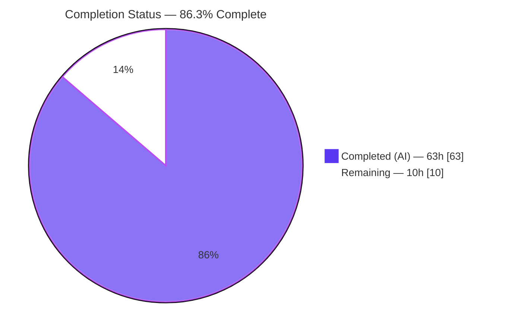
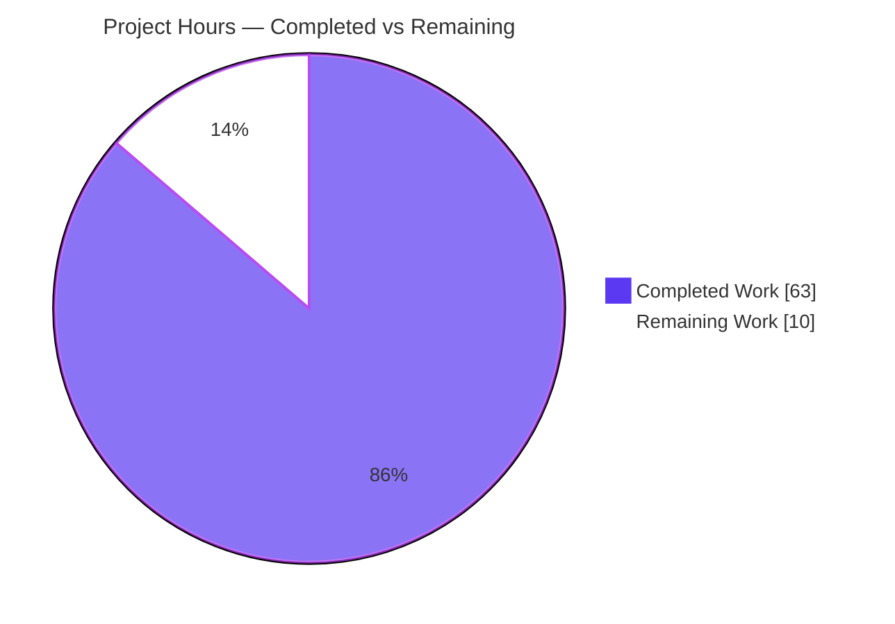
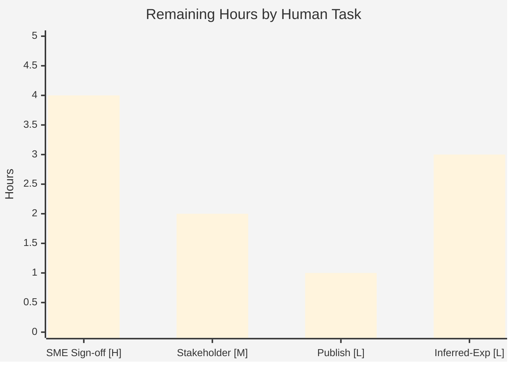

# Blitzy Project Guide — MinIO Fault-Tolerance Q&A (Four-Directory EC:2)

> **Deliverable:** `blitzy/documentation/minio_c07e5b49d477.md` — a single, evidence-grounded Q&A document (1,277 lines) explaining MinIO's runtime disk-failure behavior, derived from a built-and-run server.
> **Repository:** MinIO server (`github.com/minio/minio`) — investigated read-only at commit `c07e5b49d477b0774f23db3b290745aef8c01bd2`.
> **Color legend:** <span style="color:#5B39F3">■ Completed / AI Work — Dark Blue `#5B39F3`</span> · ■ Remaining / Not Completed — White `#FFFFFF` · <span style="color:#B23AF2">Headings/Accents — Violet-Black `#B23AF2`</span> · <span style="color:#A8FDD9">Highlight — Mint `#A8FDD9`</span>

---

## 1. Executive Summary

### 1.1 Project Overview

This project produced one evidence-grounded technical answer document explaining how MinIO decides it is "healthy," how it behaves the moment a data directory becomes inaccessible (both above and below the quorum threshold), whether logs name the failing disk by path, whether a restored directory is re-detected automatically, how objects written during an outage are repaired, and exactly where the quorum decision lives in code. The audience is an engineering team evaluating MinIO before relying on it for fault tolerance. Uniquely, this is a **read-only code investigation**: the MinIO source tree is unmodified; the sole deliverable is a Markdown document whose every behavioral claim is corroborated by live observation of the health endpoint and real S3 write/read attempts against a compiled, running four-directory EC:2 server.

### 1.2 Completion Status



<span style="color:#5B39F3">**■ Completed = Dark Blue `#5B39F3`**</span> · **■ Remaining = White `#FFFFFF`** · **Completion = 63 / 73 = 86.3%**

| Metric | Hours |
|--------|-------|
| **Total Hours** | **73** |
| **Completed Hours (AI + Manual)** | **63** (AI: 63 · Manual: 0) |
| **Remaining Hours** | **10** |
| **Percent Complete** | **86.3%** |

> Completion is computed per the AAP-scoped, hours-based methodology: `Completed ÷ (Completed + Remaining) = 63 ÷ 73 = 86.3%`. Every autonomously-completable AAP deliverable is finished and validated-accurate; the remaining 10h is exclusively human path-to-production (review, acceptance, publishing, optional enhancement) that agents cannot perform.

### 1.3 Key Accomplishments

- ✅ **Sole deliverable created** at the exact required path/filename (`blitzy/documentation/minio_c07e5b49d477.md`, filename = source branch name) with its new parent directory.
- ✅ **All 8 objectives (Q1–Q8) answered** with dedicated, evidence-backed sections (22–45 lines each).
- ✅ **Built-and-run grounding**: MinIO compiled via canonical `make build` (Go 1.23.12) and launched through the real entry point `./minio server /tmp/ec/data{1...4}`.
- ✅ **Both threshold scenarios demonstrated live**: 3 drives online → `/cluster` **200**, PUT succeeds; 2 drives online → `/cluster` **503**, PUT refused (`SlowDownWrite`), GET still succeeds.
- ✅ **Quorum math traced to source**: write quorum **3**, read quorum **2** for 4-dir EC:2, including the +1 split-brain guard.
- ✅ **Non-obvious findings surfaced**: root's `DAC_OVERRIDE` bypasses `chmod 000` (must run non-root); for a *permission* fault the `monitorDiskWritable` offline/online lines do not fire (drive excluded via the DiskInfo/Healing path).
- ✅ **161 `file:line` citations across 24 source files**, all verified accurate; inferred statements explicitly labeled.
- ✅ **Repository left pristine**: `git status --porcelain` empty except the one document; **zero** source/dependency drift.
- ✅ **Autonomous validation passed**: MinIO `cmd` + `internal` unit suites 100% green; all 8 runtime scenarios reproduced; every citation resolved.

### 1.4 Critical Unresolved Issues

| Issue | Impact | Owner | ETA |
|-------|--------|-------|-----|
| _None — no blocking issues_ | The deliverable is complete, validated-accurate, and committed; the repository is pristine. | — | — |

> There are no unresolved defects. The only outstanding work is human path-to-production (Section 2.2 / Section 8), not defect remediation. The Final Validator warranted **zero** document fixes.

### 1.5 Access Issues

| System/Resource | Type of Access | Issue Description | Resolution Status | Owner |
|-----------------|----------------|-------------------|-------------------|-------|
| _None_ | — | No access issues identified. The investigation ran entirely against a locally compiled, loopback-bound MinIO instance using pre-provisioned tooling (`mc`, `curl`, Go 1.23.12). No repository permissions, service credentials, or third-party API access were required. | N/A | — |

**No access issues identified.**

### 1.6 Recommended Next Steps

1. **[High]** Obtain MinIO/distributed-systems **SME technical sign-off** of the 8 answers and a representative subset of the 161 citations before the team relies on the findings for fault tolerance _(4h)_.
2. **[Medium]** Route the document through **stakeholder review & acceptance** by the operating team _(2h)_.
3. **[Low]** **Publish/distribute** the accepted document to the knowledge base and link it from MinIO operations runbooks _(1h)_.
4. **[Low]** _Optional:_ run **follow-up fault-injection experiments** to convert the 3 labeled "inferred (from code)" statements to runtime-observed _(3h)_.
5. **[Low]** Preserve the **non-root reproducibility caveat** prominently wherever operators reproduce the scenario (root bypasses `chmod 000`).

---

## 2. Project Hours Breakdown

### 2.1 Completed Work Detail

<span style="color:#5B39F3">**■ Completed (Dark Blue `#5B39F3`) — all autonomous (AI) work**</span>

| Component | Hours | Description |
|-----------|-------|-------------|
| Environment setup & canonical build | 6 | Go 1.23.12; `make build` (`CGO_ENABLED=0 go build -tags kqueue -trimpath`); non-root user + owned data dirs; `mc`/`curl` provenance; discovery of the critical root/`DAC_OVERRIDE` non-root requirement. |
| Baseline deployment & health-endpoint grounding | 3 | Launch real entry point; confirm banner "1 set(s), 4 drives per set" EC:2; baseline `/cluster` 200 + headers + PUT/GET (foundation for Q8). |
| Q1 — Health/quorum decision investigation & write-up | 3 | `Health()` [cmd/erasure-server-pool.go:L2679], quorum calc, `DefaultParityBlocks`, quorum headers. |
| Q2 — Live permission-loss experiment & write-up | 3 | PUT quorum check [cmd/erasure-object.go:L1304-L1308]; adapt-vs-refuse behavior. |
| Q3 — Above/below threshold dual-scenario experiments | 3 | 3-online (200/PUT-ok) vs 2-online (503/`SlowDownWrite`/GET-ok); `FatalKind` write-quorum log. |
| Q4 — Path-named logs + detection-nuance (hardest) | 6 | Discovered `monitorDiskWritable` does **not** fire for a permission fault; drive named by path via `connectDisks` + Healing path. |
| Q5 — Self-detection/recovery experiment | 4 | Automatic reconnect on next probe; 3-trial latency; DiskInfo-cache-vs-poller isolation; same PID. |
| Q6 — Object-repair investigation | 6 | MRF short-outage auto-repair vs long-outage manual heal/scanner; `xl.meta`/shard census. |
| Q7 — Quorum-decision code trace | 4 | `defaultWQuorum()` [cmd/erasure.go:L85], per-object `FileInfo.WriteQuorum`, +1 rule, end-to-end trace (§8 of doc). |
| Q8 — Grounding pass | 2 | Pairing every behavioral claim with endpoint status/headers + real write/read. |
| Document structure & authoring | 6 | TL;DR table, methodology, quorum math, endpoint contract, evidence organization, coverage pass. |
| External research validation | 2 | Cross-check of findings against official MinIO documentation. |
| QA / code-review refinement cycles | 8 | 3 refinement commits (code-review +850/-363; QA F1/F2/F3/F5; R5 F1/F2/F3). |
| Cleanup & pristine-repo verification | 1 | Exact-PID SIGTERM stop; artifact removal; `git status --porcelain` clean. |
| Final autonomous validation | 6 | Rebuild, re-run all 8 scenarios, verify all 161 citations line-by-line, confirm pristine. |
| **Total Completed** | **63** | **Matches Section 1.2 Completed Hours.** |

### 2.2 Remaining Work Detail

**■ Remaining (White `#FFFFFF`) — human path-to-production**

| Category | Hours | Priority |
|----------|-------|----------|
| SME / distributed-systems peer review & technical sign-off (verify answers + citation subset before operational reliance) | 4 | High |
| Stakeholder review & acceptance by the operating team | 2 | Medium |
| Publish / distribute to knowledge base + link from runbooks | 1 | Low |
| _Optional_ follow-up experiments to close the 3 labeled "inferred (from code)" statements | 3 | Low |
| **Total Remaining** | **10** | **Matches Section 1.2 Remaining Hours & Section 7 pie.** |

### 2.3 Hours Reconciliation

| Check | Value | Status |
|-------|-------|--------|
| Section 2.1 Completed total | 63h | ✅ |
| Section 2.2 Remaining total | 10h | ✅ |
| Section 2.1 + Section 2.2 | 63 + 10 = **73h** = Total (Section 1.2) | ✅ Rule 2 |
| Remaining across 1.2 ↔ 2.2 ↔ 7 | 10h everywhere | ✅ Rule 1 |
| Completion % | 63 ÷ 73 = **86.3%** | ✅ |

---

## 3. Test Results

All results below originate from Blitzy's autonomous validation logs for this project. Because the deliverable is a documentation artifact and the MinIO source is unmodified, "tests" comprise (a) the MinIO unit suites the validator executed to confirm the built server is sound, and (b) empirical runtime validations that ground the document's claims.

| Test Category | Framework | Total Tests | Passed | Failed | Coverage % | Notes |
|---------------|-----------|-------------|--------|--------|-----------|-------|
| Unit — `cmd` package | Go `testing` (`CI=true go test -tags kqueue,dev ./cmd/`) | Full suite | 100% (all) | 0 | Not enumerated in logs | Ran as non-root `tester` with `KUBERNETES_SERVICE_HOST` unset; no failures, none skipped/blocked. |
| Unit — `internal/...` packages | Go `testing` (`go test ./internal/...`) | Full suite | 100% (all) | 0 | Not enumerated in logs | 100% green. |
| Runtime / System — fault-tolerance scenarios | Live health endpoint + real S3 PUT/GET | 8 scenarios | 8 | 0 | N/A | Baseline, above-threshold, below-threshold, path-named logs, recovery/self-detection, object repair (short & long outage) — all reproduced as documented. |
| Citation verification | Source cross-reference vs HEAD | 161 citations | 161 | 0 | N/A | Every `file:line` across 24 source files resolved exactly (zero drift). |
| Document structural validation | Markdown lint / fence balance | — | Pass | 0 | N/A | 48 balanced code fences; clean UTF-8 LF; §1–§9 headings well-formed. |
| Build | `make build` (`CGO_ENABLED=0 go build -tags kqueue -trimpath`, Go 1.23.12) | 1 | 1 | 0 | N/A | Produced `./minio` + debug tools; no errors/warnings. `go mod verify` all-good. |

> **Integrity note (Rule 3):** Exact per-test counts and coverage percentages were **not enumerated** in the autonomous logs; the recorded signal was "100% green, no failures, none skipped." Those fields are reported honestly as "Not enumerated" rather than fabricated.

---

## 4. Runtime Validation & UI Verification

**Legend:** ✅ Operational · ⚠ Partial · ❌ Failing

**Server runtime**
- ✅ Build & launch — `./minio server /tmp/ec/data{1...4}` starts cleanly; banner reports **1 set(s), 4 drives per set**, EC:2.
- ✅ Version banner — `minio version DEVELOPMENT.2024-11-25T17-10-22Z (commit-id=c07e5b49d477b0774f23db3b290745aef8c01bd2)`.
- ✅ Non-root identity — server runs as unprivileged `tester` (uid 1001) with data dirs owned by that user.

**Health endpoint (`/minio/health/cluster`, `/minio/health/cluster/read`)**
- ✅ Baseline (4 drives) — `/cluster` **200** + `X-Minio-Write-Quorum: 3` + `X-Minio-Storage-Class-Defaults: false`; `/cluster/read` **200** + `X-Minio-Read-Quorum: 2`.
- ✅ Above threshold (3 drives) — `/cluster` **stays 200**.
- ✅ Below threshold (2 drives) — `/cluster` **503**; `/cluster/read` **stays 200**.
- ✅ Recovery (restore, no restart) — returns to **200** on the next probe automatically; same server PID.

**S3 data path (real PUT/GET via `mc`)**
- ✅ Baseline — PUT ok, GET ok.
- ✅ Above threshold — PUT ok, GET ok (3 ≥ write quorum 3).
- ✅ Below threshold — PUT **fails** exit 1 (`SlowDownWrite`, "Resource requested is unwritable"); GET **still ok** (2 ≥ read quorum 2).
- ✅ Object repair — short outage: shard auto-rebuilt (~1s, MRF); long outage: shard restored via `mc admin heal` (Yellow→Green); objects readable throughout.

**Admin/observability**
- ✅ `mc admin info` — reports **4/4 OK, EC:2** at baseline; drive counts decrement/restore across scenarios.
- ✅ Path-named logs — failing disk named by exact path (`endpoint="/tmp/ec/data1"`; `.healing.bin … permission denied`).

**UI verification**
- ⚠ **N/A for this deliverable.** MinIO ships an embedded Console UI (`github.com/minio/console` v1.7.3, port 9001), but the investigation is a headless S3/health-endpoint study. No UI feature was built, changed, or in scope; therefore no UI verification was required. The Console was bound to loopback purely for a canonical launch.

---

## 5. Compliance & Quality Review

Cross-mapping the AAP deliverables and the governing **"SWE-AtlasQnA-Repo"** rule set to their validation status.

| # | AAP / Rule Requirement | Benchmark | Status | Progress |
|---|------------------------|-----------|--------|----------|
| 1 | Deliverable at `blitzy/documentation/<branch>.md` | Single committed artifact, correct name | ✅ Pass | 100% |
| 2 | Repository unchanged (read-only) | Zero source/dependency edits | ✅ Pass | 100% |
| 3 | Investigate by running first, then write | Answers derived from built-and-run server | ✅ Pass | 100% |
| 4 | Canonical build & default config | `make build`; default storage class → EC:2 | ✅ Pass | 100% |
| 5 | Real entry point launch | `./minio server /tmp/ec/data{1...4}` | ✅ Pass | 100% |
| 6 | External fault injection only | `chmod 000/755`, no code changes | ✅ Pass | 100% |
| 7 | Every named condition exercised | Baseline/above/below/restored/healed + read-under-degraded | ✅ Pass | 100% |
| 8 | Actual, complete, unedited output per condition | Verbatim §6.1–§6.7 evidence blocks | ✅ Pass | 100% |
| 9 | Exact & grounded citations | 161 `file:line` refs, all verified | ✅ Pass | 100% |
| 10 | Reasoning/rationale per answer | Cause→effect narrative for each Q | ✅ Pass | 100% |
| 11 | Label inferred statements | 3 "(inferred, from code)" clearly marked | ✅ Pass | 100% |
| 12 | Coverage pass | §9 maps every objective + mechanism | ✅ Pass | 100% |
| 13 | Observe at sufficient duration / confirm stability | Each state ≥2×; recovery across poller windows | ✅ Pass | 100% |
| 14 | Mandatory cleanup / pristine repo | Exact-PID stop; `git status` clean except doc | ✅ Pass | 100% |
| 15 | No secrets committed | Only env-var placeholders; ephemeral creds | ✅ Pass | 100% |

**Fixes applied during autonomous validation:** The document was refined across three QA/code-review cycles (commits `37b2ffb4f`, `f23119885`, `c5cd6267b`) addressing code-review and QA findings (F1/F2/F3/F5, R5). The Final Validator warranted **zero** additional fixes — every behavioral claim reproduced and every citation resolved.

**Outstanding compliance items:** None. All rule directives are satisfied. The only remaining actions are human sign-off/acceptance (Section 2.2), which are governance steps rather than compliance gaps.

---

## 6. Risk Assessment

| Risk | Category | Severity | Probability | Mitigation | Status |
|------|----------|----------|-------------|------------|--------|
| Run-dependent measurements (recovery latency ~11–15ms, log-line/heal counts) are single-run/single-environment values | Technical | Low | Medium | Document explicitly frames these as own-run observations, not universal constants | Mitigated |
| Three conclusions labeled "inferred (from code)" not runtime-observed (Q4 `goOffline` route, Q5 per-poller instant, Q6 scanner heal path) | Technical | Low-Med | Low | Honestly labeled; optional experiments (Task HT-4) would convert to observed | Mitigated |
| Conclusions scoped to HEAD `c07e5b49d477` + single-node 4-dir EC:2 (WQ 3 / RQ 2); other topologies differ | Technical | Low | Medium | Explicit scope note in the document | Mitigated |
| No secrets in committed artifact; zero new MinIO attack surface | Security | None | — | Verified by scan — only env-var placeholders; loopback bind; ephemeral creds | Resolved |
| Discloses that root bypasses `chmod 000` via `DAC_OVERRIDE` | Security | None | — | Standard, public Linux behavior — not a MinIO vulnerability | Informational |
| Operational reliance on findings **without** SME sign-off could misapply nuanced results (Q6 timing-dependent healing; Q4 permission-vs-I/O detection) | Operational | Medium | Medium | Mandatory SME review (Task HT-1) before reliance; document nuances the findings | Open → HT-1 |
| Reproducibility requires a non-root user (root bypasses the fault) | Operational | Low-Med | Low | Document §3 prominently flags the non-root requirement | Mitigated |
| Findings not yet linked into operational runbooks/alerts | Operational | Low | Low | Publish/distribute step (Task HT-3) | Open → HT-3 |
| Reproduction needs matching toolchain (Go 1.23.12, `mc` RELEASE.2025-08-13) + owned data dirs | Integration | Low | Low | Development Guide (§9) pins versions and commands | Mitigated |
| No external service integrations (single-node local, no third-party APIs/egress) | Integration | None | — | Minimal integration surface by design | N/A |

**Overall risk posture:** **LOW.** The single Medium risk (operational reliance without sign-off) is precisely why the top human task is SME technical review before the team depends on the findings for fault tolerance.

---

## 7. Visual Project Status

### 7.1 Project Hours Breakdown



<span style="color:#5B39F3">**■ Completed Work = 63h (Dark Blue `#5B39F3`)**</span> · **■ Remaining Work = 10h (White `#FFFFFF`)** · **Total = 73h · 86.3% complete**

> **Integrity (Rule 1):** "Remaining Work" = **10h**, identical to Section 1.2 Remaining Hours and the Section 2.2 Hours total.

### 7.2 Remaining Hours by Task (Priority Distribution)



| Priority | Hours | Share of Remaining |
|----------|-------|--------------------|
| High | 4 | 40% |
| Medium | 2 | 20% |
| Low | 4 | 40% |
| **Total** | **10** | **100%** |

---

## 8. Summary & Recommendations

**Achievements.** The project delivered a rigorous, evidence-grounded answer to all eight objectives about MinIO's fault-tolerance behavior in a four-directory EC:2 deployment. Rather than reason from code alone, the investigation **built and ran** MinIO through its real entry point and observed the health endpoint and real S3 writes/reads at every state boundary — healthy, one disk down (above threshold), two disks down (below threshold), and restored. The document quantifies the thresholds (write quorum **3**, read quorum **2**), demonstrates the exact 200→503 transition and the `SlowDownWrite` write refusal with reads preserved, names the failing disk by path, shows automatic self-detection on recovery, and explains timing-dependent object repair — all with **161 verified `file:line` citations** and honestly-labeled inferred statements.

**Completion.** The project is **86.3% complete** (63h of 73h). Every autonomously-completable AAP deliverable is finished, validated-accurate, and committed, with the repository left pristine (zero source/dependency drift). No defects remain.

**Remaining gaps & critical path to production.** The outstanding **10h** is entirely human path-to-production. The critical path is a single High-priority step: **SME technical sign-off** of the answers and a citation subset before the team relies on the findings for fault tolerance (this closes the one Medium operational risk). Stakeholder acceptance and publishing follow, with an optional 3h to convert the three labeled "inferred" statements into runtime-observed evidence.

**Success metrics.**

| Metric | Target | Actual | Status |
|--------|--------|--------|--------|
| Objectives answered | 8 / 8 | 8 / 8 | ✅ |
| Citations verified accurate | 100% | 161 / 161 | ✅ |
| Source/dependency drift | 0 files | 0 files | ✅ |
| Unit suites (cmd + internal) | 100% pass | 100% pass | ✅ |
| Runtime scenarios reproduced | 8 / 8 | 8 / 8 | ✅ |
| Repository pristine | Yes | Yes (`git status` clean) | ✅ |

**Production readiness assessment.** The deliverable is **ready for human review and acceptance**. As a documentation artifact it carries no runtime/deployment risk; its only gate to "relied-upon" status is SME/stakeholder sign-off — appropriate governance given the operational-reliance purpose. **Recommendation: proceed to SME review (HT-1), then accept and publish.**

---

## 9. Development Guide

This guide reproduces the investigation end-to-end. Every command was verified against the repository. **All commands are copy-pasteable.**

### 9.1 System Prerequisites

- **OS:** Linux x86_64 (investigation used Ubuntu). ~2 vCPU; disk for four data directories (the default deployment advertises a ~48 TiB logical pool but uses little space).
- **A NON-ROOT user (critical).** Running as `root` bypasses `chmod 000` via the `DAC_OVERRIDE` capability, so the permission fault becomes invisible and the scenario **cannot** be reproduced. Use an unprivileged user that owns the data directories.
- **Go 1.23.x** — matches the module directive `go 1.23` (investigation used `go1.23.12`).
- **git**, **make**, GNU coreutils.
- **curl** (used 8.14.1) — raw health-endpoint capture.
- **MinIO `mc` client** (used `RELEASE.2025-08-13T08-35-41Z`) — admin/health/data observation.

```bash
# Verify prerequisites
go version                       # expect go1.23.x
git --version && make --version
curl --version | head -1
mc --version | head -1           # MinIO client
whoami                           # MUST NOT be root
```

### 9.2 Environment Setup

```bash
# From the repository root (this project's cwd)
cd /path/to/minio-repo

# Create four data directories owned by the NON-ROOT user
mkdir -p /tmp/ec/data{1,2,3,4}

# Ephemeral, random root credentials (never the well-known minioadmin/minioadmin)
export EPH_USER="admin-$(head -c6 /dev/urandom | od -An -tx1 | tr -d ' \n')"
export EPH_PASS="$(head -c18 /dev/urandom | od -An -tx1 | tr -d ' \n')"

# Non-orchestrated run (also prevents a unit-test hang):
unset KUBERNETES_SERVICE_HOST KUBERNETES_SERVICE_PORT
```

### 9.3 Build (canonical target)

```bash
# Builds ./minio (and docs/debugging helper binaries); all are git-ignored
make build
# runs: CGO_ENABLED=0 go build -tags kqueue -trimpath --ldflags "$(LDFLAGS)" -o $(PWD)/minio   [Makefile:L177-L179]

./minio --version
# minio version DEVELOPMENT.2024-11-25T17-10-22Z (commit-id=c07e5b49d477b0774f23db3b290745aef8c01bd2)
```

### 9.4 Launch (real entry point, default config)

```bash
MINIO_ROOT_USER="$EPH_USER" MINIO_ROOT_PASSWORD="$EPH_PASS" \
  ./minio server /tmp/ec/data{1...4} \
  --address 127.0.0.1:9000 --console-address 127.0.0.1:9001 > /tmp/ec-run/server.log 2>&1 &
MINIO_PID=$!         # capture the exact PID for guarded cleanup later

# Confirm the banner reports a single EC:2 erasure set of four drives
grep -m1 "set(s)" /tmp/ec-run/server.log      # -> "1 set(s), 4 drives per set"
```

### 9.5 Verification Steps

```bash
# Health endpoint — baseline (expect HTTP 200 + write quorum 3)
curl -sI http://127.0.0.1:9000/minio/health/cluster        | grep -Ei 'HTTP/|X-Minio-Write-Quorum|X-Minio-Storage-Class'
# HTTP/1.1 200 OK
# X-Minio-Write-Quorum: 3
# X-Minio-Storage-Class-Defaults: false

curl -sI http://127.0.0.1:9000/minio/health/cluster/read   | grep -Ei 'HTTP/|X-Minio-Read-Quorum'
# HTTP/1.1 200 OK
# X-Minio-Read-Quorum: 2

# Admin info via mc (isolated config dir; expect 4/4 OK, EC:2)
export MC_CONFIG="/tmp/ec-run/mc-config"
mc --config-dir "$MC_CONFIG" alias set eclab http://127.0.0.1:9000 "$EPH_USER" "$EPH_PASS"
mc --config-dir "$MC_CONFIG" admin info eclab      # -> "4 drives online, 0 drives offline, EC:2"
```

### 9.6 Example Usage — Reproduce the Three Fault States

```bash
# Baseline write/read
mc --config-dir "$MC_CONFIG" mb eclab/testbucket
echo baseline-content > /tmp/ec-run/obj.txt
mc --config-dir "$MC_CONFIG" cp /tmp/ec-run/obj.txt eclab/testbucket/obj.txt   # PUT ok
mc --config-dir "$MC_CONFIG" cat eclab/testbucket/obj.txt                       # GET ok

# ABOVE threshold: one directory inaccessible (3 online) — still 200, PUT ok
chmod 000 /tmp/ec/data1
curl -sI http://127.0.0.1:9000/minio/health/cluster | head -1                   # HTTP/1.1 200 OK
mc --config-dir "$MC_CONFIG" cp /tmp/ec-run/obj.txt eclab/testbucket/above.txt  # PUT ok

# BELOW threshold: a second directory inaccessible (2 online) — 503, PUT refused, GET ok
chmod 000 /tmp/ec/data2
curl -sI http://127.0.0.1:9000/minio/health/cluster | head -1                   # HTTP/1.1 503 Service Unavailable
mc --config-dir "$MC_CONFIG" cp /tmp/ec-run/obj.txt eclab/testbucket/below.txt  # FAILS: SlowDownWrite
mc --config-dir "$MC_CONFIG" cat eclab/testbucket/obj.txt                        # GET still ok

# RECOVERY: restore permissions WITHOUT restarting — auto-detected on next probe
chmod 755 /tmp/ec/data1 /tmp/ec/data2
sleep 2
curl -sI http://127.0.0.1:9000/minio/health/cluster | head -1                   # back to HTTP/1.1 200 OK
```

### 9.7 Verify the Deliverable & Repository Cleanliness

```bash
# View the answer document
sed -n '1,60p' blitzy/documentation/minio_c07e5b49d477.md

# Only the document differs from the investigated MinIO source
git status --porcelain                                        # -> only blitzy/documentation/minio_c07e5b49d477.md
git diff --name-status c07e5b49d477b0774f23db3b290745aef8c01bd2 HEAD
# A   blitzy/documentation/minio_c07e5b49d477.md
```

### 9.8 Guarded Cleanup (leave the repo pristine)

```bash
# Stop the server by its EXACT PID (never pkill/killall — that could kill unrelated processes)
kill "$MINIO_PID"; sleep 2
kill -0 "$MINIO_PID" 2>/dev/null && echo "still running" || echo "process $MINIO_PID gone (confirmed)"

# Remove all transient artifacts
rm -rf /tmp/ec /tmp/ec-run
rm -f ./minio                       # git-ignored build output
# also remove docs/debugging helper binaries produced by make build (xl-meta, s3-check-md5, etc.)
git status --porcelain              # -> only the document remains
```

### 9.9 Troubleshooting

| Symptom | Cause | Resolution |
|---------|-------|-----------|
| `chmod 000` has no effect; endpoint stays 200 | Running as **root** (`DAC_OVERRIDE` bypasses permissions) | Run the server as a **non-root** user owning the data dirs |
| Unit tests hang in `TestCreateServerEndpoints` | Ambient `KUBERNETES_SERVICE_HOST` triggers orchestrated mode | `unset KUBERNETES_SERVICE_HOST` before `go test` |
| `mc` alias/config collisions | Shared `mc` config | Use an isolated `--config-dir` per run |
| Below-threshold PUT unexpectedly succeeds | Fewer than 2 disks actually offline | Confirm `mc admin info` shows exactly 2 online before testing the write |
| Cleanup killed unrelated processes | Broad `pkill`/`killall` | Always kill by the captured exact PID |
| `go build` fails on toolchain mismatch | Go version ≠ 1.23.x | Install Go matching `go.mod` (`go 1.23`) |

---

## 10. Appendices

### A. Command Reference

| Purpose | Command |
|---------|---------|
| Build MinIO | `make build` |
| Version banner | `./minio --version` |
| Launch (4-dir EC:2) | `./minio server /tmp/ec/data{1...4} --address 127.0.0.1:9000 --console-address 127.0.0.1:9001` |
| Cluster health (write) | `curl -sI http://127.0.0.1:9000/minio/health/cluster` |
| Cluster health (read) | `curl -sI http://127.0.0.1:9000/minio/health/cluster/read` |
| Drive status | `mc --config-dir "$MC_CONFIG" admin info eclab` |
| PUT / GET object | `mc ... cp <file> eclab/bucket/key` / `mc ... cat eclab/bucket/key` |
| Manual heal | `mc --config-dir "$MC_CONFIG" admin heal -r eclab/bucket` |
| Inject / restore fault | `chmod 000 /tmp/ec/dataN` / `chmod 755 /tmp/ec/dataN` |
| Unit tests (cmd) | `CI=true go test -tags kqueue,dev ./cmd/` |
| Pristine check | `git status --porcelain` |

### B. Port Reference

| Port | Service | Bind | Notes |
|------|---------|------|-------|
| 9000 | MinIO S3 API | `127.0.0.1` | `GlobalMinioDefaultPort` [cmd/globals.go:L65]; health endpoint under `/minio/health` |
| 9001 | MinIO Console UI | `127.0.0.1` | Embedded `github.com/minio/console` v1.7.3; not part of this investigation's scope |

### C. Key File Locations

| Path | Role |
|------|------|
| `blitzy/documentation/minio_c07e5b49d477.md` | **The deliverable** (sole committed artifact) |
| `cmd/erasure.go` | `defaultWQuorum()` [L85] / `defaultRQuorum()` [L94] — quorum math (Q1/Q7) |
| `cmd/erasure-server-pool.go` | `Health()` [L2679]; write-quorum log [L2794] (Q1/Q3) |
| `cmd/healthcheck-handler.go` | `ClusterCheckHandler` [L56] — 200/503 contract + quorum headers (Q8) |
| `cmd/healthcheck-router.go` | Route registration `/minio/health/cluster` [L27-L44] |
| `cmd/storage-datatypes.go` | `FileInfo.WriteQuorum`/`ReadQuorum` [L298-L314] — per-object +1 rule |
| `internal/config/storageclass/storage-class.go` | `DefaultParityBlocks()` [L355] — EC:2 for 4 drives |
| `cmd/xl-storage-disk-id-check.go` | Path-named offline/online logs [L956, L1015] (Q4) |
| `cmd/xl-storage.go` | DiskInfo cache [L326]; runtime permission map [L802-L826] (Q5) |
| `cmd/background-newdisks-heal-ops.go` | `healFreshDisk()` [L419]; 10s poller [L40] (Q5/Q6) |
| `cmd/mrf.go` | `healRoutine()` [L220] — repair of outage writes (Q6) |
| `cmd/erasure-sets.go` | `monitorAndConnectEndpoints()` [L283]; 15s poller [L348] (Q5) |
| `Makefile` | Canonical build target [L177-L179] |
| `main.go` | Real entry point → `minio.Main(os.Args)` [L26-L31] |

### D. Technology Versions

| Component | Version |
|-----------|---------|
| MinIO (investigated commit) | `c07e5b49d477b0774f23db3b290745aef8c01bd2` (banner `DEVELOPMENT.2024-11-25T17-10-22Z`) |
| Go toolchain | `go1.23.12` (module directive `go 1.23`) |
| MinIO `mc` client | `RELEASE.2025-08-13T08-35-41Z` (commit `7394ce0d…`) |
| curl | 8.14.1 |
| `github.com/klauspost/reedsolomon` | v1.12.4 (erasure coding) |
| `github.com/klauspost/compress` | v1.17.11 |
| `github.com/minio/madmin-go/v3` | v3.0.77 |
| `github.com/minio/minio-go/v7` | v7.0.80 |
| `github.com/minio/console` | v1.7.3 |

### E. Environment Variable Reference

| Variable | Purpose | Notes |
|----------|---------|-------|
| `MINIO_ROOT_USER` | Root access key | Ephemeral random value per run (not `minioadmin`) |
| `MINIO_ROOT_PASSWORD` | Root secret key | Ephemeral random value per run; discarded at cleanup |
| `KUBERNETES_SERVICE_HOST` | (must be **unset**) | If set, forces orchestrated mode → non-canonical run + possible unit-test hang |
| `CI` | `true` for non-interactive `go test` | Prevents watch/interactive behavior |
| `MC_CONFIG` / `mc --config-dir` | Isolated `mc` client state | Per-run scratch dir removed at cleanup |

### F. Developer Tools Guide

| Tool | Use |
|------|-----|
| `mc` (MinIO Client) | `mc admin info` (drive counts/EC), `mc cp`/`mc cat` (PUT/GET), `mc admin heal` (manual heal) |
| `curl` | Raw capture of health-endpoint status codes and `X-Minio-*` quorum headers |
| `docs/debugging/xl-meta` | Decode on-disk `xl.meta` parity (built by `make build`) — used to census shards during Q6 |
| `go test` | MinIO unit suites (`./cmd/`, `./internal/...`) |
| `git diff --name-status <base> HEAD` | Prove the source tree is unchanged except the deliverable |

### G. Glossary

| Term | Definition |
|------|-----------|
| **Erasure Coding (EC:2)** | Data split into data + parity shards; "EC:2" = 2 data + 2 parity across 4 drives (default for 4 drives). |
| **Write Quorum** | Minimum online drives to accept a write. For 4-dir EC:2 = **3** (data 2, +1 split-brain guard when data == parity). |
| **Read Quorum** | Minimum online drives to serve a read. For 4-dir EC:2 = **2**. |
| **Split-brain guard (+1)** | When data blocks equal parity blocks, write quorum is raised by one to prevent divergent writes. |
| **MRF** | Most-Recent-Failures routine — repairs partial/failed writes shortly after they occur (`cmd/mrf.go`). |
| **Healing** | Rebuilding missing/stale shards on a returned drive (`healFreshDisk`, background scanner, or `mc admin heal`). |
| **DiskInfo cache** | ~1s cache whose on-demand re-read re-detects a restored drive on the next health probe (drives self-detection in Q5). |
| **`DAC_OVERRIDE`** | Linux capability held by root that bypasses file permission checks — why the investigation must run non-root. |
| **`SlowDownWrite`** | S3 error returned when a write is refused for lack of write quorum ("Resource requested is unwritable"). |
| **Pristine repository** | `git status --porcelain` empty except the single intended document; zero source/dependency drift. |

---

*This Blitzy Project Guide reflects the AAP-scoped completion of a read-only MinIO fault-tolerance investigation. All hours, percentages, and cross-section values are consistent: **Total 73h · Completed 63h · Remaining 10h · 86.3% complete**. Completed work is shown in Dark Blue (`#5B39F3`); remaining work in White (`#FFFFFF`).*