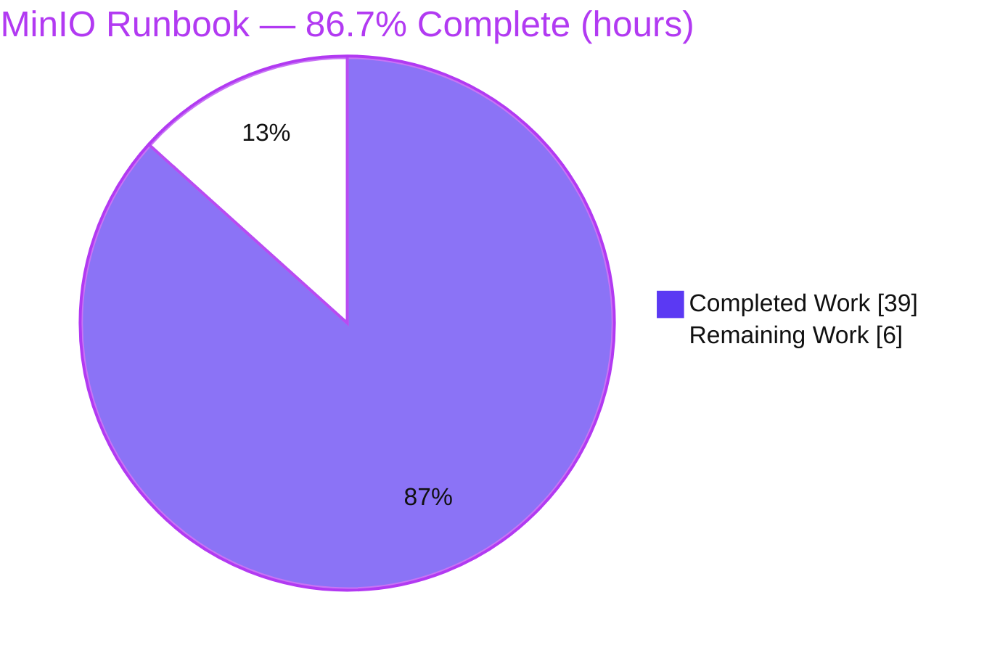
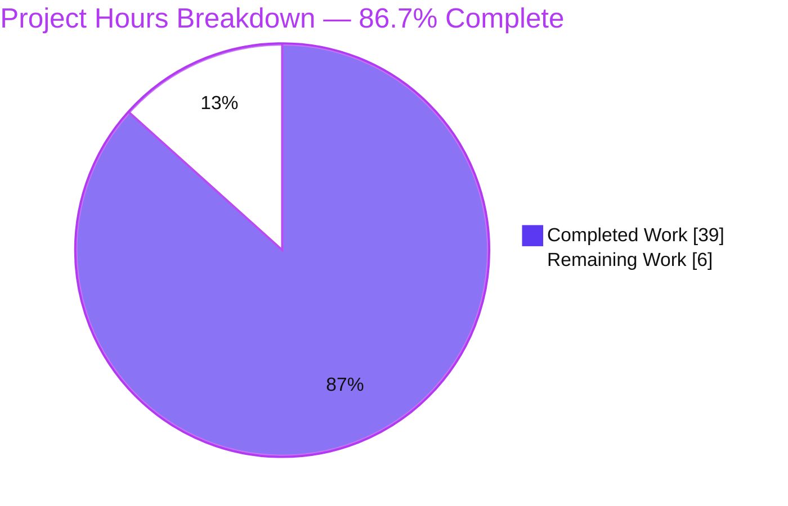
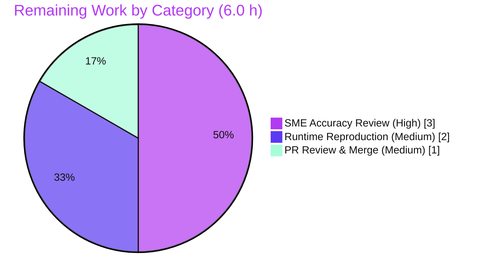

# Blitzy Project Guide — Single-Node MinIO "First Bucket" Lifecycle Investigation Runbook

> **Deliverable:** `blitzy/documentation/minio_c07e5b49d477.md` (1,291 lines)
> **Branch:** `blitzy-a3b4c827-6890-4de0-8ae7-e19b209d24aa` · **HEAD:** `c4a48c63c05bc976669426de9277ca03ee2476b4` · **Base:** `c07e5b49d477`
> **Task type:** Read-only documentation investigation (rule set "SWE-AtlasQnA-Repo")

---

## 1. Executive Summary

### 1.1 Project Overview

This project delivers a single authoritative onboarding runbook documenting, from direct runtime observation, how a fresh single-node MinIO object-storage server behaves end-to-end during the "first bucket" lifecycle. Targeted at engineers new to MinIO, it answers nine questions (Q1–Q9): standing up the server, exercising the full S3 object lifecycle, and capturing exact HTTP status codes, headers, response bodies, timestamped per-request trace logs, authorization checks, on-disk artifacts, and restart persistence. Every claim is backed by actual, unedited server output and grounded with `file:line` citations into the MinIO source. The task was strictly read-only: no existing source, build, or test file was modified — the sole artifact is one markdown document.

### 1.2 Completion Status

The project is **86.7% complete**, measured strictly against AAP-scoped work plus path-to-production (PA1 methodology). 100% of the documentation deliverable (Q1–Q9, all implicit requirements, all constraints) is delivered and live-verified; the remaining 13.3% is human acceptance work that cannot be performed autonomously.



<span style="color:#5B39F3">■ Completed (Dark Blue #5B39F3)</span> · <span>□ Remaining (White #FFFFFF)</span>

| Metric | Value |
|---|---|
| **Total Hours** | 45.0 |
| **Completed Hours (AI + Manual)** | 39.0 (AI autonomous: 39.0 · Manual: 0.0) |
| **Remaining Hours** | 6.0 |
| **Percent Complete** | **86.7%** |

### 1.3 Key Accomplishments

- ✅ Single deliverable authored at the exact mandated path/name: `blitzy/documentation/minio_c07e5b49d477.md` (1,291 lines, 50 balanced code blocks of raw evidence).
- ✅ All nine questions (Q1–Q9) answered **from live runtime observation** — zero discrepancies against the running server.
- ✅ Canonical binary built (`make build`, Go 1.23.12) and single-drive `xl-single` backend proven via startup banner + `format.json`.
- ✅ Full S3 flow captured: CreateBucket, PutObject ×2, ListObjectsV2, GetObject, HeadObject, HeadBucket — all HTTP `200` with complete headers and bodies.
- ✅ Per-request trace logs captured with ISO-8601 millisecond timestamps and mapped to request-received / operation-completed / data-written-read events.
- ✅ Authorization paths exercised: valid SigV4 → `200`; wrong secret → `403 SignatureDoesNotMatch`; anonymous → `403 AccessDenied` (raw XML, byte-verified).
- ✅ On-disk artifacts documented: `xl.meta` magic `XL2 `, inline small-object storage, `.minio.sys` tree.
- ✅ Restart persistence proven: restart banner omits the `Formatting` line; identical ETags across two post-restart reads.
- ✅ ~106 `file:line` citations grounded to named symbols (8/8 independently re-verified); an honest "inferred vs. observed" note included.
- ✅ Read-only scope perfectly honored: `git diff` = one file added (+1,291/−0); `go.mod`/`go.sum` untouched; working tree clean.

### 1.4 Critical Unresolved Issues

| Issue | Impact | Owner | ETA |
|---|---|---|---|
| _None_ — autonomous validation reproduced all Q1–Q9 against live runtime with zero discrepancies; no code or documentation defect is open. | None | — | — |

> There are **no critical unresolved issues**. The only outstanding work is standard human acceptance (see §1.6 and §2.2).

### 1.5 Access Issues

| System / Resource | Type of Access | Issue Description | Resolution Status | Owner |
|---|---|---|---|---|
| _None_ | — | No access issues identified. The build/run toolchain (Go 1.23.12, boto3 1.43.42, `mc`) was fully available; the repository, module dependencies (as pinned), and runtime were all reachable during autonomous validation. | N/A | — |

> **No access issues identified.**

### 1.6 Recommended Next Steps

1. **[High]** Perform an SME technical-accuracy review of the runbook — validate the behavioral claims (banners, status codes, headers, bodies, trace lines, auth errors, `xl.meta`, restart) and spot-check the citations against the code at commit `c07e5b49d477`.
2. **[Medium]** Reproduce the key runtime evidence in a reviewer environment (`make build`, run the server, confirm the banner + `format.json`, drive one CreateBucket/PutObject/GetObject).
3. **[Medium]** Review the PR description, confirm the diff shows only the single additive file (read-only scope), and merge to the target branch.
4. **[Low]** _(Optional, beyond AAP scope)_ Cross-link the runbook from an onboarding/docs index for discoverability.

---

## 2. Project Hours Breakdown

### 2.1 Completed Work Detail

All completed work is autonomous (AI) effort, each row traceable to a specific AAP requirement (Q-number / implicit requirement / constraint).

| Component | Hours | Description |
|---|---|---|
| Environment & Canonical Build `[CON4/IMP1]` | 2.0 | Go 1.23.12 toolchain, `make build`, `--version`/ldflags verification, boto3 + `mc` tooling setup |
| Q1 — Single-Node Server Startup `[Q1]` | 3.0 | Capture both TTY & non-TTY banners verbatim; `format.json` `xl-single`; health `200`; trace banner production to `cmd/main.go` & `cmd/server-startup-msg.go` |
| Q2 — Full Object-Lifecycle Execution `[Q2]` | 3.0 | boto3 SigV4 driver: CreateBucket, PutObject ×2 (distinct keys/content-types), ListObjectsV2, GetObject, HeadObject, HeadBucket |
| Q3 — HTTP Status Codes & Headers `[Q3]` | 3.0 | Per-op status/header capture, header provenance to source, negative results (e.g., `x-amz-bucket-region` absent) |
| Q4 — Response Bodies `[Q4]` | 2.0 | Empty bodies; XML `ListBucketResult` (675/643 B); raw 14 B object; byte-exact |
| Q5 — Timestamped Server-Side Logs `[Q5]` | 3.0 | Prove console silence; attach trace subscriber; capture verbatim `[REQUEST]`/`[RESPONSE]` ISO-8601 ms lines |
| Q6 — Authorization Checks `[Q6]` | 3.0 | Valid SigV4; wrong-secret `403 SignatureDoesNotMatch`; anonymous `403 AccessDenied`; raw XML byte-verified |
| Q7 — Request/Persist Lifecycle `[Q7]` | 3.0 | Map received/completed/data-written-read; `↑rx/↓tx` counters; observed disk ops (MakeVol/RenameData/os.Rename) |
| Q8 — Filesystem Artifacts `[Q8]` | 3.0 | Directory tree; `xl.meta` magic decode; inline-storage proof; `.minio.sys` tree |
| Q9 — Restart Persistence `[Q9]` | 2.0 | Graceful stop; restart banner omits `Formatting`; identical ETags verified twice |
| Citation Grounding & Coverage Pass `[IMP9/IMP10]` | 4.0 | ~106 `file:line` citations naming symbols; coverage table + named-item checklist + honest inferred-items note |
| Reproduction, Cleanliness & Doc Assembly `[CON1/CON5]` | 3.0 | Reproduction commands, cleanliness proof, TOC, formatting, connective prose |
| Read-Only Scope Enforcement & Cleanup `[CON2/CON3]` | 1.0 | Out-of-repo data dir, `/tmp` scripts + binary removed, git left clean |
| Code-Review Remediation Cycle (commit `9472949af`) | 2.0 | Resolve code-review findings |
| QA Remediation Cycle (commit `c4a48c63c`) | 2.0 | Resolve QA findings |
| **Total** | **39.0** | **Matches Completed Hours in §1.2** |

### 2.2 Remaining Work Detail

All remaining work is human path-to-production acceptance; **no code remediation remains** (read-only documentation deliverable, fully delivered and verified).

| Category | Hours | Priority |
|---|---|---|
| SME Technical-Accuracy Review of the runbook (claims + citations) — task **HT-1** | 3.0 | High |
| Runtime-Evidence Reproduction (build, run, spot-check banner/`format.json` + one PutObject/GetObject) — task **HT-2** | 2.0 | Medium |
| PR Review & Merge to target branch (confirm read-only diff, merge) — task **HT-3** | 1.0 | Medium |
| **Total** | **6.0** | **Matches Remaining Hours in §1.2 and §7** |

> _Optional, excluded from totals to preserve cross-section integrity:_ **HT-4** — cross-link the runbook from an onboarding/docs index (Low, 0.0 h, beyond AAP scope).

### 2.3 Hours Summary

| Bucket | Hours | Share |
|---|---|---|
| Completed (AI autonomous) | 39.0 | 86.7% |
| Remaining (human acceptance) | 6.0 | 13.3% |
| **Total Project** | **45.0** | **100%** |

Formula: `Completion % = Completed / (Completed + Remaining) = 39 / (39 + 6) = 39 / 45 = 86.7%`.

---

## 3. Test Results

All results below originate from Blitzy's autonomous validation logs for this project. Because this is a read-only documentation task, the primary "test" is 100% runtime reproduction of every documented claim (Q1–Q9) against the live server; supporting evidence includes targeted unit tests, a citation-resolution sweep, compilation, and markdown-quality checks.

| Test Category | Framework | Total Tests | Passed | Failed | Coverage % | Notes |
|---|---|---|---|---|---|---|
| Runtime Q&A Reproduction (Q1–Q9) | Live MinIO server + boto3 SigV4 + `mc admin trace` | 9 | 9 | 0 | 100% | Every question reproduced against live output; **zero discrepancies** |
| Targeted Unit Tests (doc-central pkgs) | `go test -tags kqueue,dev -count=1` | 2 pkgs | 2 | 0 | n/a | `internal/auth` ok; `internal/config/storageclass` ok |
| Citation Resolution Sweep | Programmatic `file:line` verification | 124 tokens / 39 files | 124 | 0 | 100% | ~98 semantically verified; 8/8 independently re-checked in this assessment |
| Compilation | `make build` (Go 1.23.12) | 1 | 1 | 0 | n/a | Clean build; `./minio` produced |
| Markdown Quality | Structural lint (fences / UTF-8 / anchors) | 4 checks | 4 | 0 | n/a | 100 balanced fences, valid UTF-8, LF-only, 15 anchor links resolve |

**Pre-existing failures (out of scope, untouched, not attributable to this task):** `internal/dsync` (distributed-lock RPC timeout) and `internal/http` `TestNewHTTPListener` (IPv6 `[::1]` bind) fail in the sandbox. Both are **environment-rooted, not code defects**; both packages are confirmed **unchanged** on this branch (empty diff), so the repository's baseline unit-test status is unaffected.

---

## 4. Runtime Validation & UI Verification

Runtime health and API-integration outcomes observed by Blitzy's autonomous validation against the live single-node server:

- ✅ **Operational** — Server startup: single-drive `xl-single` backend; first-boot `Formatting 1st pool, 1 set(s), 1 drives per set.`
- ✅ **Operational** — Health endpoints: `/minio/health/live` = `200`, `/minio/health/ready` = `200`
- ✅ **Operational** — CreateBucket → `200`, `Location: /firstbucket`, empty body
- ✅ **Operational** — PutObject ×2 → `200`, ETag = md5(payload) (independently verified), empty body
- ✅ **Operational** — ListObjectsV2 → `200`, XML `ListBucketResult` (675 B with `encoding-type=url` / 643 B without — exact 32-byte delta)
- ✅ **Operational** — GetObject → `200`, `Content-Type: text/plain`, raw 14 B
- ✅ **Operational** — HeadObject / HeadBucket → `200`, headers-only
- ✅ **Operational** — Auth (valid SigV4): request succeeds
- ✅ **Operational (expected-failure path)** — Auth (wrong secret): `403 SignatureDoesNotMatch` (409 B canonical SDK form)
- ✅ **Operational (expected-failure path)** — Auth (anonymous): `403 AccessDenied` (302 B on bucket / 331 B on object, byte-verified)
- ✅ **Operational** — Per-request trace capture via `mc admin trace -v [--all]`; byte counters reproduced (GetObject `↑151 / ↓14`)
- ✅ **Operational** — Filesystem artifacts: per-object single `xl.meta` (inline), `.minio.sys` tree present
- ✅ **Operational** — Restart persistence: restart banner omits `Formatting`; identical ETags/bytes across two reads

**UI Verification:** ⚪ **Not Applicable.** MinIO's web console exists (`:9001`) but is **explicitly out of scope** per the AAP (§0.5.3 "User Interface Design — Not applicable"). No UI was built, modified, or exercised; it is referenced only as context.

---

## 5. Compliance & Quality Review

Cross-mapping of AAP deliverables and rule-set directives to their delivery status. No fixes were required during autonomous validation (zero discrepancies); the code-review and QA remediation cycles were completed in prior agent commits.

| Deliverable / Benchmark (AAP §0.7 rules) | Status | Progress | Notes |
|---|---|---|---|
| Q1–Q9 answered from direct runtime observation | ✅ Pass | 100% | All nine reproduced against live server |
| Run-first methodology (build & run before writing) | ✅ Pass | 100% | Evidence + reproduction section throughout |
| Actual, complete, unedited output for every claim | ✅ Pass | 100% | 50 code blocks of raw output |
| Exact & grounded (`file:line`, named symbols) | ✅ Pass | 100% | ~106 citations; 8/8 independently re-verified |
| Every condition exercised (happy + error + edge + before/after) | ✅ Pass | 100% | Auth failures + restart transition covered |
| Coverage pass (each named item enumerated & answered) | ✅ Pass | 100% | Explicit coverage table + named-item checklist |
| Single deliverable, fixed name & location | ✅ Pass | 100% | `blitzy/documentation/minio_c07e5b49d477.md` |
| Canonical build/configuration only | ✅ Pass | 100% | `Makefile:177-179`; default single-dir + default creds |
| Read-only scope (repository left unchanged) | ✅ Pass | 100% | Diff = 1 file added; `go.mod`/`go.sum` untouched |
| Cleanliness verification (git clean) | ✅ Pass | 100% | `git status --porcelain` = 0 entries |
| Zero-placeholder / no TODO-FIXME | ✅ Pass | 100% | 0 placeholder markers |
| SME technical-accuracy sign-off | ⬜ Pending | 0% | Human acceptance — task HT-1 |

---

## 6. Risk Assessment

| Risk | Category | Severity | Probability | Mitigation | Status |
|---|---|---|---|---|---|
| Citation line-number drift on future upstream rebases | Technical | Low | Medium | All evidence pinned to exact commit `c07e5b49d477`; citations are commit-anchored | Mitigated |
| Volatile captured values (request IDs, timestamps, "9 months older" notice) not byte-reproducible | Technical | Low | Low | Document explicitly labels volatile fields as observed | Mitigated |
| Pre-existing unit-test failures (`internal/dsync` RPC timeout; `internal/http` IPv6 bind) | Technical | Low | N/A (pre-existing) | Environment-rooted, not code defects; both packages confirmed untouched (empty diff); read-only task | Accepted (out of scope) |
| Document displays default credentials `minioadmin:minioadmin` | Security | Low | Low | MinIO's well-known public defaults; document reproduces the server's own security `WARN` advising rotation via `MINIO_ROOT_USER`/`MINIO_ROOT_PASSWORD` | Informational / Mitigated |
| New attack surface from added code / dependencies | Security | None | None | No source or dependency change; `go.mod`/`go.sum` untouched | N/A |
| Reproducibility depends on external tooling (`mc`, boto3) not in the repo | Operational | Low | Low | Document lists exact versions + install steps; tooling verified present | Mitigated |
| Runtime evidence captured in a specific environment (container IPs, `TERM=dumb`) | Operational | Low | Low | Document explains TTY/non-TTY banner gating and environment-specific fields | Mitigated |
| Q5/Q7 depend on the trace subsystem; default-console-only readers see no per-request lines | Integration | Low | Medium | Document **proves** console silence and explains the trace requirement — this is the answer, not a gap | By-design / Mitigated |
| Merge integration of the additive `blitzy/` directory | Integration | Low | Low | Isolated single-file additive change; no source-tree conflicts | Open (human merge — HT-3) |

**Overall risk posture: LOW.** A read-only documentation task with no code or dependency changes; all technical risks are mitigated or accepted; the only genuinely open item is the human merge.

---

## 7. Visual Project Status

**Project Hours Breakdown** (Completed = Dark Blue `#5B39F3`, Remaining = White `#FFFFFF`):



**Remaining Work by Category** (hours; totals to the 6.0 h Remaining in §1.2 and §2.2):



| Priority | Remaining Hours |
|---|---|
| High | 3.0 |
| Medium | 3.0 |
| Low | 0.0 |
| **Total** | **6.0** |

---

## 8. Summary & Recommendations

**Achievements.** The project is **86.7% complete**. The entire AAP-scoped deliverable — a 1,291-line, runtime-verified onboarding runbook answering Q1–Q9 with complete, unedited output and ~106 grounded `file:line` citations — is finished and was reproduced against a live MinIO server with **zero discrepancies**. The strict read-only constraint was honored precisely: the branch adds exactly one file and leaves all source, build, and test files (including `go.mod`/`go.sum`) untouched.

**Remaining gaps.** The remaining **6.0 hours (13.3%)** are exclusively human path-to-production acceptance — there is no outstanding code or documentation defect. The gaps are: SME technical-accuracy review (3.0 h), runtime-evidence reproduction (2.0 h), and PR review & merge (1.0 h).

**Critical path to production.** SME accuracy review → optional reproduction spot-check → PR merge. The single most valuable action is the SME review (HT-1); reproduction (HT-2) is recommended but not blocking; merge (HT-3) completes delivery.

**Reproduction caveat (important).** The `gen-ldflags` build helper stamps the version/commit from the **current `HEAD`**. Building at the current branch tip yields `DEVELOPMENT.2026-…` rather than the documented `DEVELOPMENT.2024-11-25T17-10-22Z / c07e5b49d477`. For a byte-identical banner, build from a checkout at `c07e5b49d477`. The document itself flags this behavior.

**Success metrics.** Q1–Q9 answered ✅ · zero runtime discrepancies ✅ · read-only scope honored ✅ · citations grounded ✅ · working tree clean ✅.

**Production-readiness assessment.** **Ready for human review and merge.** As a read-only documentation deliverable with no runtime footprint in the repository, deployment risk is negligible; the only precondition to "production" (merge) is SME sign-off.

| Metric | Value |
|---|---|
| Completion | 86.7% |
| Completed / Total Hours | 39.0 / 45.0 |
| Remaining Hours | 6.0 |
| Open defects | 0 |
| Overall risk | Low |
| Recommendation | Approve after SME accuracy review |

---

## 9. Development Guide

This guide reproduces the investigation environment: build MinIO, run a single-node server, drive the S3 flow, capture per-request logs, and verify persistence. All commands were tested in the validation environment.

### 9.1 System Prerequisites

- **Go** 1.23.x (validated: `go1.23.12 linux/amd64`)
- **make**, **git**
- ~2 GB free disk; Linux or macOS
- _Optional (for driving/observing the flow):_ **Python 3** + **boto3** (SigV4 S3 client), and **`mc`** (MinIO Client, for per-request trace)

```bash
go version          # expect: go version go1.23.12 ...
make --version
git --version
python3 -c "import boto3, botocore; print(boto3.__version__)"   # optional
mc --version        # optional
```

### 9.2 Environment Setup

```bash
# From the repository root (branch already checked out):
git rev-parse --abbrev-ref HEAD        # blitzy-a3b4c827-6890-4de0-8ae7-e19b209d24aa

# Choose an OUT-OF-REPO data directory (keeps the working tree clean):
export MINIO_DATA=/tmp/minio-obs-data
mkdir -p "$MINIO_DATA"

# Default credentials are minioadmin:minioadmin. To override (optional):
# export MINIO_ROOT_USER=myadmin
# export MINIO_ROOT_PASSWORD='a-strong-password'
```

### 9.3 Dependency Installation

No repository dependencies are added or changed — the module builds exactly as pinned in `go.sum` (`GOFLAGS=-mod=readonly`). Only optional observation tooling may need installing:

```bash
pip install boto3            # optional: SigV4 S3 driver
# Install mc per https://min.io/docs/minio/linux/reference/minio-mc.html  (optional: trace)
```

### 9.4 Application Startup

```bash
# 1) Build the canonical binary (Makefile:177-179). Produces ./minio (gitignored).
make build
# Equivalent explicit form:
# CGO_ENABLED=0 go build -tags kqueue -trimpath \
#   --ldflags "$(go run buildscripts/gen-ldflags.go)" -o ./minio

# 2) Start the single-node server (background). First boot FORMATS the drive.
./minio server "$MINIO_DATA" --address :9000 --console-address :9001 &
```

Expected first-boot banner (non-TTY form) includes:

```text
INFO: Formatting 1st pool, 1 set(s), 1 drives per set.
MinIO Object Storage Server
...
API: http://127.0.0.1:9000 ...
WARN: Detected default credentials 'minioadmin:minioadmin', ...
```

### 9.5 Verification

```bash
# Backend type is single-drive erasure:
cat "$MINIO_DATA/.minio.sys/format.json"     # -> ..."format":"xl-single"...

# Health checks (both should print 200):
curl -s -o /dev/null -w '%{http_code}\n' http://127.0.0.1:9000/minio/health/live
curl -s -o /dev/null -w '%{http_code}\n' http://127.0.0.1:9000/minio/health/ready
```

### 9.6 Example Usage — the "first bucket" flow (boto3, SigV4)

```python
import boto3
s3 = boto3.client("s3", endpoint_url="http://127.0.0.1:9000",
                  aws_access_key_id="minioadmin",
                  aws_secret_access_key="minioadmin", region_name="us-east-1")
s3.create_bucket(Bucket="firstbucket")                                   # 200
s3.put_object(Bucket="firstbucket", Key="hello.txt",
              Body=b"Hello, MinIO!\n", ContentType="text/plain")         # 200 + ETag
s3.put_object(Bucket="firstbucket", Key="data.json",
              Body=b'{"k":"v"}', ContentType="application/json")         # 200 + ETag
print([o["Key"] for o in s3.list_objects_v2(Bucket="firstbucket")["Contents"]])
print(s3.get_object(Bucket="firstbucket", Key="hello.txt")["Body"].read())
```

Capture per-request logs (default console does **not** log successful requests):

```bash
mc alias set local http://127.0.0.1:9000 minioadmin minioadmin
mc admin trace -v --all local        # timestamped [REQUEST]/[RESPONSE] + disk ops
```

Authorization checks:

```bash
# Anonymous (unsigned) -> 403 AccessDenied:
curl -s http://127.0.0.1:9000/firstbucket?list-type=2
# Wrong secret (signed with a bad key) -> 403 SignatureDoesNotMatch (use boto3 with a wrong secret)
```

### 9.7 Restart Persistence Check

```bash
# Stop the server you started (capture its PID at launch, then):
kill "$MINIO_PID"      # or send SIGTERM to the process you launched
# Restart on the SAME directory — banner OMITS the "Formatting" line:
./minio server "$MINIO_DATA" --address :9000 --console-address :9001 &
# Re-list / re-GET -> identical ETags confirm persistence.
```

### 9.8 Cleanup & Cleanliness

```bash
# Stop the server (kill the PID you launched), then:
rm -f ./minio
rm -rf "$MINIO_DATA" /tmp/minio-obs
git status --porcelain      # MUST be empty (working tree clean)
```

### 9.9 Troubleshooting

- **Version/commit differs from the document** → `gen-ldflags` stamps from the current `HEAD`. For the exact documented banner (`DEVELOPMENT.2024-11-25T17-10-22Z`), build from a checkout at `c07e5b49d477`.
- **`RootUser:`/`RootPass:` banner lines missing** → expected under non-TTY stdout (`color.IsTerminal()` is `false`); run under a TTY to see them.
- **No per-request lines in the server log** → by design; use `mc admin trace`. Audit logging early-returns when no target is configured (`internal/logger/audit.go:63-66`).
- **`403 AccessDenied` on anonymous requests** → expected; SigV4 signing is required by default.
- **Ports 9000/9001 already in use** → change `--address` / `--console-address`.

---

## 10. Appendices

### Appendix A — Command Reference

| Command | Purpose |
|---|---|
| `make build` | Build `./minio` (Go 1.23.12, `Makefile:177-179`) |
| `go run buildscripts/gen-ldflags.go` | Print version/commit ldflags |
| `./minio server <dir> --address :9000 --console-address :9001` | Run single-node server |
| `curl .../minio/health/live` \| `/ready` | Health checks (expect `200`) |
| `mc alias set local http://127.0.0.1:9000 minioadmin minioadmin` | Register `mc` alias |
| `mc admin trace -v --all local` | Capture timestamped per-request + disk-op trace |
| `git diff c07e5b49d477 HEAD --name-status` | Confirm read-only scope (one file `A`) |
| `git status --porcelain` | Confirm clean working tree |

### Appendix B — Port Reference

| Port | Service | Notes |
|---|---|---|
| 9000 | S3 API | Default; `--address :9000` |
| 9001 | Web Console | `--console-address :9001` (exists; out of scope, not exercised) |

### Appendix C — Key File Locations

| Path | Description |
|---|---|
| `blitzy/documentation/minio_c07e5b49d477.md` | **The deliverable** (1,291 lines) |
| `<data-dir>/.minio.sys/format.json` | Backend format record (`"format":"xl-single"`) |
| `<data-dir>/<bucket>/<object>/xl.meta` | Per-object metadata (magic `XL2 `, inline data) |
| `<data-dir>/.minio.sys/{pool.bin,buckets/*/.metadata.bin,config/config.json}` | System metadata tree |
| `Makefile:177-179` | Canonical build target |
| `cmd/server-startup-msg.go:114` | Startup banner (`printServerCommonMsg`) |

### Appendix D — Technology Versions

| Component | Version |
|---|---|
| Go toolchain | 1.23.12 (`go.mod`: `go 1.23`) |
| MinIO (evidence build) | `DEVELOPMENT.2024-11-25T17-10-22Z` @ `c07e5b49d477` |
| boto3 / botocore | 1.43.42 / 1.43.42 |
| MinIO Client (`mc`) | `RELEASE.2025-08-13T08-35-41Z` |

### Appendix E — Environment Variable Reference

| Variable | Purpose | Default |
|---|---|---|
| `MINIO_ROOT_USER` | Root access key override | `minioadmin` |
| `MINIO_ROOT_PASSWORD` | Root secret key override | `minioadmin` |
| `GOFLAGS` | Preserved as `-mod=readonly` (no dependency drift) | — |

### Appendix F — Developer Tools Guide

| Tool | Use in this project |
|---|---|
| `mc admin trace -v [--all]` | Per-request `[REQUEST]`/`[RESPONSE]` lines with ISO-8601 ms timestamps; `--all` adds OS/STORAGE disk operations (answers Q5/Q7) |
| boto3 (SigV4) | Drives the S3 flow and the wrong-secret auth path |
| `mc admin trace` endpoint | `GET /minio/admin/v3/trace` (`cmd/admin-router.go:410` → `TraceHandler`) |
| `xl-meta` | Decodes `xl.meta` to prove inline storage (Q8) |

### Appendix G — Glossary

| Term | Meaning |
|---|---|
| **xl-single / ErasureSD** | Single-drive erasure backend selected by a one-directory `minio server` invocation (`cmd/setup-type.go`) |
| **SigV4** | AWS Signature Version 4 request signing; MinIO's default auth |
| **`xl.meta`** | Per-object metadata file (magic `XL2 `); small objects are stored inline within it |
| **Inline storage** | Objects ≤ 128 KiB stored inside `xl.meta` rather than a separate `part.1` (`storage-class.go:304`) |
| **ETag** | Object entity tag; for these objects equals `md5(payload)` |
| **`.minio.sys`** | System metadata bucket/tree (`format.json`, `pool.bin`, bucket metadata, config) |
| **Trace subsystem** | Pub/sub stream (`httpTracerMiddleware` → `globalTrace.Publish`) delivering per-request telemetry |

---

*Completion figures are consistent across all sections: **Completed 39.0 h · Remaining 6.0 h · Total 45.0 h · 86.7% complete**. Blitzy brand colors applied: Completed = Dark Blue `#5B39F3`, Remaining = White `#FFFFFF`.*