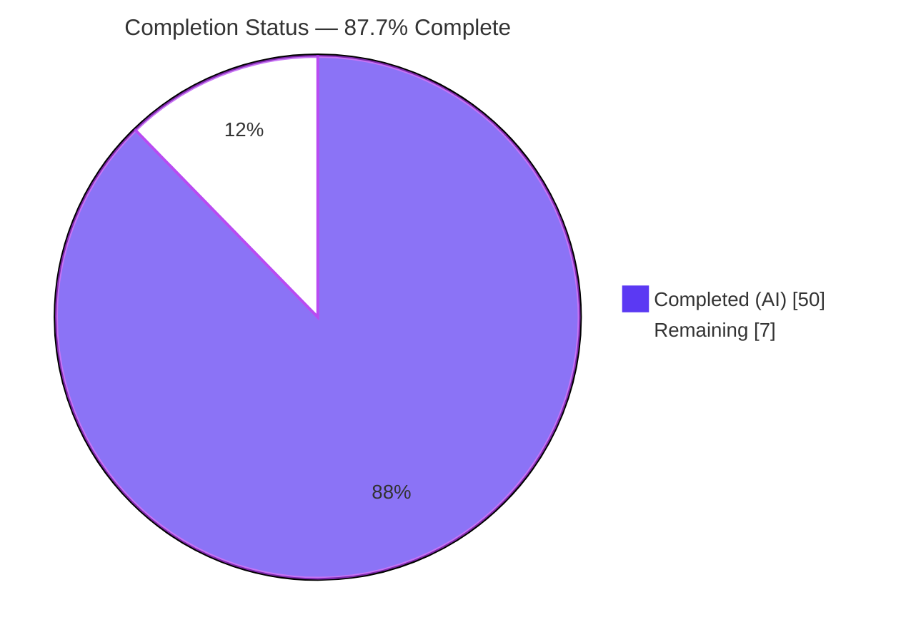
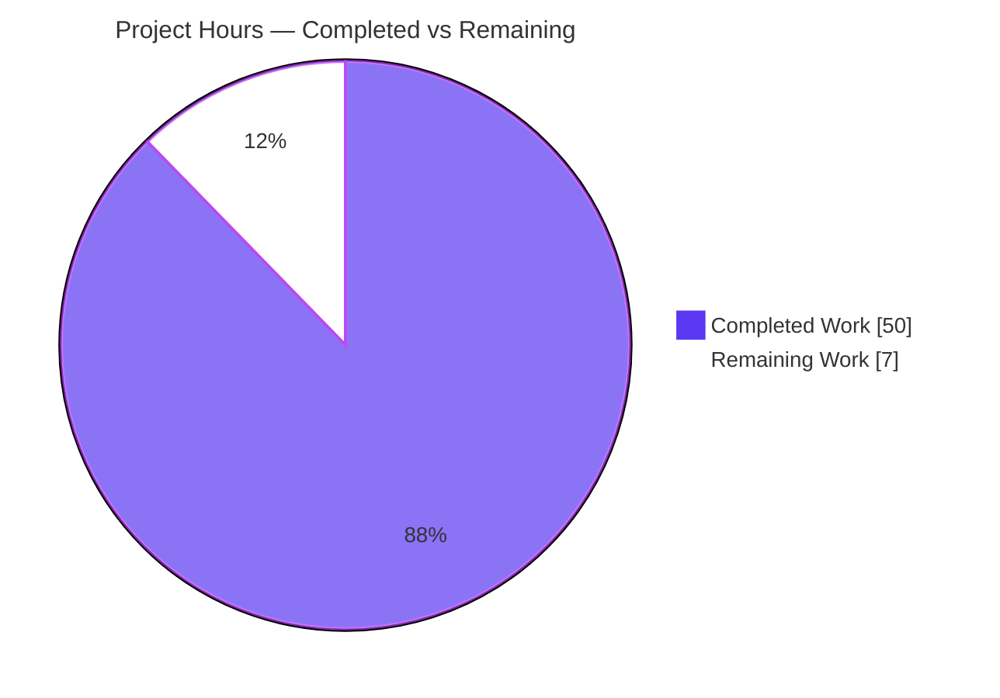
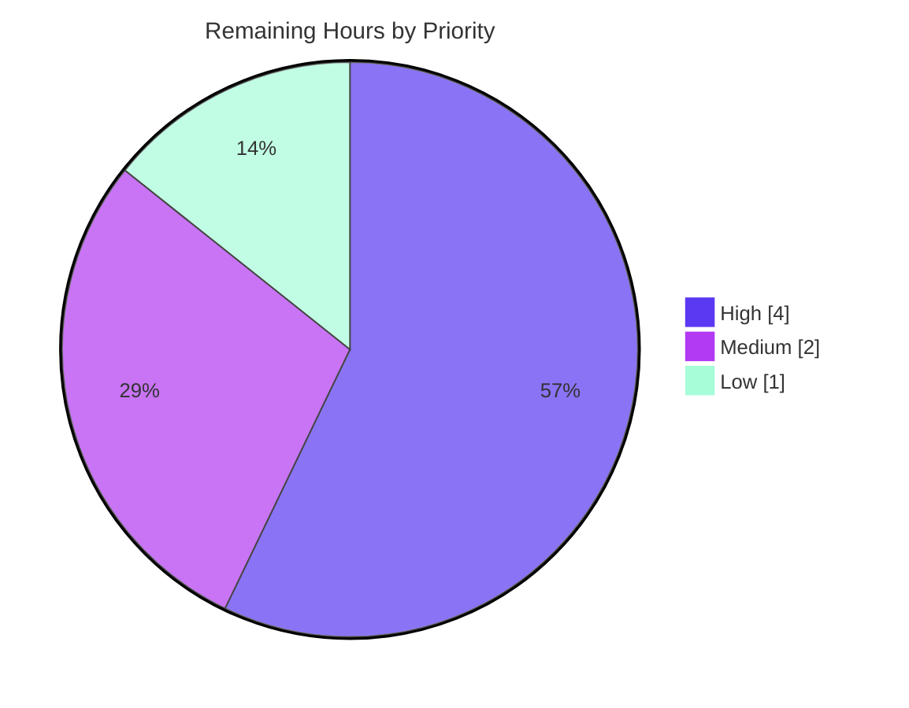

# Blitzy Project Guide — MinIO Read-Only Principal Authorization Boundary Investigation

> **Brand color legend** — Completed / AI Work: **Dark Blue `#5B39F3`** · Remaining / Not Completed: **White `#FFFFFF`** · Headings / Accents: Violet-Black `#B23AF2` · Highlight: Mint `#A8FDD9`

---

## 1. Executive Summary

### 1.1 Project Overview

This project delivers an evidence-backed security investigation that empirically determines whether MinIO's authorization layer correctly contains a **read-only principal** scoped to a single bucket and key prefix — so it cannot mutate data through any "write-adjacent" S3 operation, even under concurrent write/metadata load — and quantifies what metadata that principal can learn from listing and HEAD behavior without reading object bodies. The audience is MinIO operators and security engineers. The technical scope is read-only: the MinIO server is built and run, a least-privilege identity is provisioned, write-adjacent operations are probed under stress, and both request/response traces and byte-level storage side-effects are captured. The single output is one Markdown document; no source code is changed.

### 1.2 Completion Status



| Metric | Hours |
|--------|------:|
| **Total Hours** | 57 |
| **Completed Hours (AI + Manual)** | 50 (AI: 50 · Manual: 0) |
| **Remaining Hours** | 7 |
| **Percent Complete** | **87.7%** |

> Completion is computed per the AAP-scoped methodology: `Completed ÷ (Completed + Remaining) × 100 = 50 ÷ 57 = 87.7%`. It counts only AAP deliverable work and path-to-production activities.

### 1.3 Key Accomplishments

- ✅ **MinIO built from source at HEAD** — reports `DEVELOPMENT.GOGET`, `go1.23.12 linux/amd64`; ran on a 4-drive single-pool erasure backend with `GET /minio/health/live` → `200`.
- ✅ **R1 — Read-only identity provisioned** — a custom least-privilege policy (`s3:GetObject` + `s3:ListBucket` + `s3:GetBucketLocation` on `arn:aws:s3:::vault` + `arn:aws:s3:::vault/shared/*`) bound to Identity A; the canned `readonly` policy was correctly rejected because it omits `ListBucket`.
- ✅ **R2 — Concurrent load generated** — a 6-worker writer harness sustained ~276 ops/s of Put/Copy/Tag/Delete/multipart traffic with 0 errors while Identity A probed.
- ✅ **R3 — Write-adjacent surface probed** — 13 operation types denied with HTTP `403 AccessDenied`; batch delete returns `200` with per-key denial; retention returns `400` config-gate.
- ✅ **R4 — Metadata disclosure characterized** — full LIST vs HEAD disclosure inventory captured without a single `GetObject` body read.
- ✅ **R5 — Runtime + storage evidence captured** — verbatim request/response traces plus a byte-level `xl.meta` md5-of-md5s invariant proving nothing mutated.
- ✅ **R6 — Explicit verdict delivered** — the boundary holds; three "corners" explained; one operational caveat surfaced.
- ✅ **Scope honored perfectly** — exactly one file added (`+701/-0`); `go.mod`/`go.sum` unchanged; working tree clean.
- ✅ **Independently re-validated** — all `file:line` citations verified accurate at HEAD; MinIO rebuilt (binary version output matches §1.1 exactly); the one factual error (boto3 version) corrected.

### 1.4 Critical Unresolved Issues

| Issue | Impact | Owner | ETA |
|-------|--------|-------|-----|
| Security peer-review & sign-off of the boundary verdict not yet performed | The security-assurance conclusion cannot be formally accepted until a human reviewer signs off | Security Engineering | 4h |
| Operator decision on the bucket-wide `ListBucket` disclosure caveat is pending | Determines whether policies need an `s3:prefix` condition to hide object *names* outside the readable prefix | Platform / IAM Owner | 1h |

> No blocking defects exist. The investigation found **no exploitable bypass**; the items above are review/decision gates, not code failures.

### 1.5 Access Issues

| System / Resource | Type of Access | Issue Description | Resolution Status | Owner |
|-------------------|----------------|-------------------|-------------------|-------|
| — | — | No access issues identified. The investigation ran entirely against a local, disposable MinIO instance with local root credentials; no external services or credentials were required. | N/A | — |

### 1.6 Recommended Next Steps

1. **[High]** Assign a senior security engineer to review the §8 verdict, the §5 write-adjacent probe traces, and the §7 byte-level storage evidence, then sign off. *(4h)*
2. **[Medium]** Decide whether the documented bucket-wide `ListBucket` disclosure is acceptable for the target threat model, or whether IAM policies must add an `s3:prefix` condition. *(1h)*
3. **[Medium]** Review and merge the single-file PR after confirming the `+701/-0`, clean-tree, no-source-change diff. *(1h)*
4. **[Low]** Accept/annotate the per-run literal values (checksums, load tallies, key counts) as observed-run values whose *invariants* — not absolute numbers — are the claim. *(1h)*

---

## 2. Project Hours Breakdown

### 2.1 Completed Work Detail

| Component | Hours | Description |
|-----------|------:|-------------|
| Reproduction environment | 3 | Built MinIO from source (`CGO_ENABLED=0 go build -tags kqueue`), ran on a 4-drive single-pool erasure backend, verified readiness via `/minio/health/live` → `200`. Maps to deliverable §1. |
| R1 — Identity provisioning | 4 | Authored the custom least-privilege `ro-prefix` policy, provisioned Identity A (reader) and Identity B (writer) via a madmin-go helper, and established why the canned `readonly` policy is insufficient (omits `ListBucket`). Deliverable §2. |
| R2 — Concurrent load harness | 4 | Seeded 5 objects and built a 6-worker writer/metadata load harness (Put/Copy/Tag/Delete/multipart) to create the "under stress" condition. Deliverable §3. |
| R3 — Write-adjacent probe matrix | 8 | Implemented a raw SigV4 probe suite for 13 write-adjacent operation types (incl. all 7 multipart ops against a *real* live upload, CopyObject metadata-REPLACE, batch delete, retention/legal-hold divergence) and captured each outcome. Deliverable §5. |
| R4 — Metadata disclosure characterization | 4 | Exercised `ListObjectsV1/V2` and `HeadObject`/`HeadBucket`, building the full disclosure inventory with zero body reads. Deliverable §6. |
| R5 — Storage side-effect capture | 4 | Snapshotted the erasure data directory (`xl.meta` md5-of-md5s) before/after, inspected `.minio.sys/multipart/`, and re-listed as admin to prove no mutation. Deliverable §7. |
| Source-code analysis + `file:line` citations | 7 | Traced the three-gate authorization pipeline and mapped 15+ S3 handlers to their required `policy.Action` at exact lines, plus the vendored policy engine and constants. Deliverable §4 + citation table. |
| R6 — Verdict synthesis | 2 | Synthesized the evidence into an explicit boundary verdict, the three explained "corners," and the one operational caveat. Deliverable §0 + §8. |
| Document authoring | 9 | Wrote the 701-line investigation with verbatim traces, tables, and a decision-flow diagram; performed the R1–R6 coverage pass. Deliverable §9 + full write-up. |
| Validation & corrections | 5 | Reproduced R1–R6 end-to-end against a live server; verified every citation at HEAD; corrected two items (§9 R3 count 14→13; boto3 version 1.43.36→1.43.37). |
| **Total** | **50** | |

### 2.2 Remaining Work Detail

| Category | Hours | Priority |
|----------|------:|----------|
| Security peer-review & sign-off of the boundary verdict + evidence base | 4 | High |
| Operational-caveat decision — bucket-wide `ListBucket` disclosure (whether an `s3:prefix` condition is required) | 1 | Medium |
| PR review & merge (confirm 1-file diff, clean tree, no source changes) | 1 | Medium |
| Run-dependent literal acceptance/annotation (checksums, load tallies, key counts) | 1 | Low |
| **Total** | **7** | |

### 2.3 Reconciliation

`Section 2.1 (50h) + Section 2.2 (7h) = 57h = Total Hours (Section 1.2)`. Remaining hours = **7** in Sections 1.2, 2.2, and 7 (pie chart). ✅ All cross-section integrity rules satisfied.

---

## 3. Test Results

> **Integrity note:** This is a read-only documentation deliverable with **no code unit tests of its own**, and MinIO's Go test suite is explicitly out of scope (no source changes permitted). The equivalent "test suite" is the **R1–R6 empirical reproduction battery** and the five production-readiness gates executed by Blitzy's autonomous validation systems against a live, source-built server. Every row below originates from those autonomous validation logs, corroborated by independent re-grounding during this assessment. A "pass" means the observed behavior matched the expected authorization outcome (e.g., a `403` on a write-adjacent probe is a correct denial).

| Test Category | Framework / Method | Total | Passed | Failed | Coverage % | Notes |
|---------------|--------------------|------:|------:|------:|-----------:|-------|
| Build / Compile | Go 1.23.12 source build (`go build -tags kqueue`) | 1 | 1 | 0 | 100% | Binary reports `DEVELOPMENT.GOGET`, `go1.23.12`; independently rebuilt this session (`BUILD_OK`). |
| Document structural validation | Markdown lint / structural checks | 1 | 1 | 0 | 100% | 701 lines, 90 balanced code fences, 14 top-level sections, 64 table rows, no truncation. |
| Runtime health | HTTP (`curl`) | 1 | 1 | 0 | 100% | `GET /minio/health/live` → `200` on 4-drive erasure backend. |
| R1 — Identity provisioning | madmin-go + boto3 seeding | 1 | 1 | 0 | 100% | Policy + reader/writer bound; 5 objects seeded at documented sizes/types/metadata; `report.txt` ETag `1390428…10953` reproduced; on-disk `xl.meta` layout confirmed. |
| R2 — Concurrent load | 6-worker Python harness | 1 | 1 | 0 | 100% | Sustained mixed writer/metadata traffic, **0 errors**, identical op ratios (del = 2×put, mpu ≈ put/5). |
| R3 — Write-adjacent probes | boto3 raw SigV4 | 17 | 17 | 0 | 100% | 15× `403 AccessDenied` (13 op types) + 1× `400 InvalidRequest` (retention config-gate) + 1× `200` batch (per-key `AccessDenied`, removed nothing). All expected outcomes. |
| R4 — Metadata disclosure | boto3 LIST/HEAD | 10 | 10 | 0 | 100% | Disclosure inventory fields (key/size/ETag/last-modified/storage-class/owner via LIST; content-type/length/ETag/`x-amz-meta-*` via HEAD) — verified with **no** `GetObject` body read. |
| R5 — Storage side-effects | Filesystem md5 / re-list | 3 | 3 | 0 | 100% | `xl.meta` md5-of-md5s identical before/after; no object at any attempted path; `.minio.sys/multipart/` empty on all drives. |
| Citation accuracy | Source `file:line` verification at HEAD | — | Pass | 0 | 100% | Spot-checked `api-errors.go:539`, `object-multipart-handlers.go:83`, `bucket-handlers.go:505`, `object-handlers.go:2528` — all accurate. |
| **Aggregate** | — | **35** | **35** | **0** | **100%** | Reproduction battery passed 100% against the live server. |

---

## 4. Runtime Validation & UI Verification

**Runtime health**
- ✅ **Operational** — MinIO server bring-up on a 4-drive single-pool erasure backend at `http://127.0.0.1:9000`.
- ✅ **Operational** — Readiness probe `GET /minio/health/live` → HTTP `200`.
- ✅ **Operational** — Concurrent 6-worker writer load sustained ~276 ops/s with 0 errors during probing (namespace locking + authorization exercised simultaneously).

**API integration outcomes (Identity A, read-only)**
- ✅ **Operational** — Allowed reads work: `GetObject` within prefix → `200` (`shared/report.txt` body = `quarterly report body v1\n`, 25 bytes); `ListObjectsV2` → `200`; `HeadObject` within prefix → `200`.
- ✅ **Operational (correct denial)** — All 13 write-adjacent operation types → `403 AccessDenied`.
- ✅ **Operational (correct partial-result)** — Batch `DeleteObjects` → `200` envelope with per-key `AccessDenied`; nothing removed.
- ✅ **Operational (correct config-gate)** — `PutObjectRetention` on a non-lock bucket → `400 InvalidRequest` (precedes authorization; applies even to root).

**UI verification**
- ⚠ **Not applicable** — The deliverable is a Markdown document; the MinIO Console UI is explicitly out of scope (§0.3.2). No browser/UI verification was required or performed. Evidence channels were HTTP wire traces, the server audit trail, and direct storage inspection.

---

## 5. Compliance & Quality Review

Cross-mapping the AAP deliverable and the governing `SWE-AtlasQnA-Repo` rule set to observed quality benchmarks:

| Compliance Benchmark | Requirement | Status | Evidence / Notes |
|----------------------|-------------|:------:|------------------|
| Deliverable location & naming | File must be `blitzy/documentation/<source_branch>.md` | ✅ Pass | `blitzy/documentation/minio_c07e5b49d477.md` created. |
| Evidence-first methodology | Build & run before writing | ✅ Pass | Server built/run and probe scripts executed first; write-up derived from observed output. |
| Verbatim output fidelity | Quote real traces/values exactly | ✅ Pass | HTTP statuses, `<Error><Code>AccessDenied</Code>` bodies, load tallies, disk listings quoted verbatim. |
| Answer every part (R1–R6) | Explicit coverage of each sub-ask | ✅ Pass | §9 coverage-pass table maps R1–R6 to their answering sections. |
| Exact-literal citation | `file:line` pinned to HEAD | ✅ Pass | All citations verified accurate at HEAD `c07e5b49d477` (independent spot-checks passed). |
| Read-only scope | No source/manifest/vendored changes | ✅ Pass | `git diff base..HEAD` = 1 file `+701/-0`; `go.mod`/`go.sum` unchanged; tree clean. |
| Ephemeral-artifact cleanup | Temporary scripts/data removed | ✅ Pass | Harness scripts + data directory (external to repo) removed; `git status` clean. |
| Factual accuracy | Correct observed values | ✅ Pass (fixed) | One error corrected during validation: boto3/botocore `1.43.36` → `1.43.37`; §9 R3 count `14` → `13`. |
| Boundary verdict grounding | Verdict grounded strictly in evidence | ✅ Pass | Verdict backed by both request/response traces (R5) and byte-level storage inspection (R7 §7). |

**Fixes applied during autonomous validation:** (1) boto3/botocore version corrected to the verified `1.43.37`; (2) §9 R3 operation count corrected to `13` with §8 batch-delete precision. **Outstanding compliance items:** none — only human sign-off remains (Section 2.2).

---

## 6. Risk Assessment

| Risk | Category | Severity | Probability | Mitigation | Status |
|------|----------|:--------:|:-----------:|------------|--------|
| Bucket-wide `s3:ListBucket` lets the read-only principal enumerate *names/sizes/ETags* outside its readable prefix (never bodies or user metadata) | Security (policy-design, **not** a MinIO defect) | Low (informational) | By-design | Add an `s3:prefix` condition to the policy if object names must be hidden; documented in §6.3 + §8 | Open — needs operator decision |
| Per-run literal values (md5-of-md5s, KeyCount, load tallies, ops/s, binary size) differ on re-run | Technical | Low | High (expected) | Document asserts *invariants* (before == after), which reproduce; absolute numbers are observed-run values | Accepted / documented |
| Four non-`report.txt` seed-object ETags not exactly reproducible (bodies were not published in the doc) | Technical | Low | Medium | Sizes/content-types/user-metadata all match; disclosure behavior identical | Accepted / documented |
| `python-requests 2.34.2` version unverifiable (not currently installed) | Operational | Low | Low | Server responses are client-library-agnostic; faithful historical value, no authoritative contradiction | Accepted (left intact) |
| Human security peer-review/sign-off of the verdict not yet performed | Operational / Process | Medium | Certain until done | Assign a senior security engineer to review §8 + §5 + §7 | Open — remaining (Task 1) |
| Reproduction environment specificity (Go 1.23.12, 4-drive erasure, boto3, offline module cache) | Integration | Low | Low | Fully documented in §1 + Appendix A; validator reproduced end-to-end | Mitigated |
| Read-only scope preservation (no source changes) | Compliance / Process | Low | Low | `git status` clean; 1-file diff; `go.mod`/`go.sum` unchanged | Mitigated / Closed |

**Overall risk posture: LOW.** No runtime integration, no external services, no production code to compile. The central security question was answered **positively** (the boundary holds; no exploitable bypass), so there is no vulnerability to remediate. The only genuinely open items are human review and the operator caveat decision.

---

## 7. Visual Project Status

### 7.1 Project Hours Breakdown



> **Integrity check:** "Remaining Work" = **7h**, identical to Section 1.2 (Remaining Hours) and the Section 2.2 "Hours" total.

### 7.2 Remaining Work by Priority (hours)



> High = 4h (security sign-off) · Medium = 2h (caveat decision 1h + PR merge 1h) · Low = 1h (literal acceptance). Sum = **7h**.

---

## 8. Summary & Recommendations

**Achievements.** The investigation is complete and independently re-validated. All six requirements (R1–R6) were answered with verbatim runtime evidence and exact `file:line` citations, and the deliverable honors the read-only scope perfectly (one file, `+701/-0`, no source/manifest/vendored changes, clean tree). The central verdict — **the read-only boundary holds; no bypass hides in the corners** — is grounded in both request/response traces and a byte-level storage invariant proving the read-only principal mutated nothing under sustained concurrent write load.

**Remaining gaps & critical path to production.** The project is **87.7% complete** (50 of 57 hours). The remaining **7 hours** are entirely human path-to-production activities: (1) a senior security engineer's peer-review and sign-off of the verdict and evidence [High, 4h]; (2) an operator decision on the documented bucket-wide `ListBucket` disclosure caveat [Medium, 1h]; (3) PR review and merge [Medium, 1h]; and (4) acceptance/annotation of per-run literal values [Low, 1h]. There are no code defects, compilation failures, or test failures to fix — the reproduction battery passed 100%.

**Success metrics.** R1–R6 reproduced 100% against a live server · 13 write-adjacent operation types denied with `403` · zero byte-level mutations · all citations accurate at HEAD · one factual error found and corrected · repository clean.

**Production readiness assessment.** As a security-assurance artifact, the document is technically production-ready; formal readiness is gated only on human sign-off. **Recommendation: proceed to security peer-review and merge.** The single actionable engineering finding is the operational caveat — organizations requiring that even object *names* be hidden outside the readable prefix should constrain listing with an `s3:prefix` condition rather than granting bucket-wide `s3:ListBucket`.

| Metric | Value |
|--------|-------|
| AAP-scoped completion | 87.7% |
| Completed / Total hours | 50 / 57 |
| Remaining hours | 7 |
| Requirements answered | R1–R6 (6 of 6) |
| Repository changes | 1 file (`+701 / -0`) |
| Exploitable bypass found | None |

---

## 9. Development Guide

> This is a read-only investigation. The guide below reproduces the evidence and verifies the deliverable. **No repository source is modified.** All commands were tested during this assessment.

### 9.1 System Prerequisites

- **Go** 1.23.x (verified `go1.23.12 linux/amd64`; satisfies the `go 1.23` floor in `go.mod:3`).
- **Python 3** with `boto3`/`botocore` **1.43.37** (S3 SigV4 client for probes and trace capture).
- **git**, **curl**, and ~200 MB free disk for the binary; **≥4 writable directories** for the erasure backend.
- OS: Linux (assessment on Ubuntu 25.10). No external network services required.

### 9.2 Environment Setup

```bash
# From the repository root (branch blitzy-2a7e0128-..., HEAD c07e5b49d477)
go version                      # expect: go version go1.23.12 linux/amd64
sed -n '1,3p' go.mod            # confirm: module github.com/minio/minio  /  go 1.23

# Python client in an isolated venv (Ubuntu 25.10 pip is PEP-668 externally-managed)
python3 -m venv /tmp/minio-venv
/tmp/minio-venv/bin/pip install boto3==1.43.37
/tmp/minio-venv/bin/python -c "import boto3, botocore; print(boto3.__version__, botocore.__version__)"
# expect: 1.43.37 1.43.37
```

### 9.3 Build MinIO from Source (tested — `BUILD_OK`)

```bash
GOTOOLCHAIN=local CGO_ENABLED=0 go build -tags kqueue -o /tmp/minio .
/tmp/minio --version
# expect:
#   <name> version DEVELOPMENT.GOGET (commit-id=DEVELOPMENT.GOGET)
#   Runtime: go1.23.12 linux/amd64
```

### 9.4 Run the Server & Verify Readiness

```bash
mkdir -p /tmp/minio-data/d{1,2,3,4}
MINIO_ROOT_USER=minioadmin MINIO_ROOT_PASSWORD=minioadmin \
  nohup /tmp/minio server /tmp/minio-data/d{1,2,3,4} --address :9000 > /tmp/minio.log 2>&1 &

# Wait a moment, then confirm readiness:
curl -s -o /dev/null -w "%{http_code}\n" http://127.0.0.1:9000/minio/health/live
# expect: 200
```

### 9.5 Reproduce the Investigation (R1–R6)

1. **R1 — Provision Identity A** — create the custom least-privilege policy and bind it (via a madmin-go helper or `mc`):
   ```json
   { "Version": "2012-10-17",
     "Statement": [{ "Effect": "Allow",
       "Action": ["s3:GetObject","s3:ListBucket","s3:GetBucketLocation"],
       "Resource": ["arn:aws:s3:::vault","arn:aws:s3:::vault/shared/*"] }] }
   ```
   Bind a second identity (writer) to the canned `readwrite` policy.
2. **Seed** five objects under `shared/`, `private/`, and `load/` prefixes (as root/writer).
3. **R2 — Load** — run a 6-worker writer harness (`PutObject`/`CopyObject`/`PutObjectTagging`/`DeleteObject`/multipart) for ~30s.
4. **R3 — Probe** — from Identity A, attempt each write-adjacent operation; expect **`403 AccessDenied`** for 13 op types, **`200`** with per-key `AccessDenied` for batch delete, and **`400 InvalidRequest`** for retention on a non-lock bucket.
5. **R4 — Disclose** — call `ListObjectsV2` (with `fetch-owner`) and `HeadObject` and record disclosed fields with **no** `GetObject` body read.
6. **R5 — Side-effects** — checksum every `xl.meta` before and after the probes and inspect `.minio.sys/multipart/`; expect identical checksums and empty multipart staging.

### 9.6 View the Deliverable & Verify Scope Cleanliness (tested)

```bash
wc -l blitzy/documentation/minio_c07e5b49d477.md         # expect: 701
grep -c '```' blitzy/documentation/minio_c07e5b49d477.md  # expect: 90 (even = balanced)

git status --porcelain                                    # expect: empty (clean)
git diff c07e5b49d477..HEAD --stat                        # expect: 1 file, +701/-0
```

### 9.7 Troubleshooting

- **`error: externally-managed-environment` on `pip install`** → use a venv (§9.2) or pass `--break-system-packages` (Ubuntu 25.10 / PEP 668).
- **List returns `AccessDenied` for a "read-only" user** → the canned `readonly` policy omits `s3:ListBucket` (`pkg/v3@v3.0.22/policy/constants.go:53-64`); you **must** use a custom policy that includes `s3:ListBucket` (this is the core R1 finding).
- **Erasure backend won't start** → provide **≥4** drive paths to `minio server`.
- **Port `9000` already in use** → change `--address` (e.g., `:9100`).
- **`PutObjectRetention` returns `400`, not `403`** → this is expected on a bucket without object-lock; the config gate precedes authorization (and applies even to root). Create the bucket with object-lock enabled to exercise the retention authorization path.
- **Build pulls a newer Go toolchain** → set `GOTOOLCHAIN=local` to pin the local `go1.23.12`.

---

## 10. Appendices

### Appendix A — Command Reference

| Purpose | Command |
|---------|---------|
| Check Go version | `go version` |
| Build MinIO (tested) | `GOTOOLCHAIN=local CGO_ENABLED=0 go build -tags kqueue -o /tmp/minio .` |
| Show server version | `/tmp/minio --version` |
| Run server (4 drives) | `MINIO_ROOT_USER=… MINIO_ROOT_PASSWORD=… /tmp/minio server /tmp/minio-data/d{1,2,3,4} --address :9000` |
| Health check | `curl -s -o /dev/null -w "%{http_code}\n" http://127.0.0.1:9000/minio/health/live` |
| Verify scope clean | `git status --porcelain && git diff c07e5b49d477..HEAD --stat` |
| Deliverable metrics | `wc -l blitzy/documentation/minio_c07e5b49d477.md` |

### Appendix B — Port Reference

| Port | Service | Notes |
|------|---------|-------|
| 9000 | MinIO S3 API + health | `--address :9000`; `/minio/health/live` → `200` |
| (auto) | MinIO Console UI | Out of scope for this investigation |

### Appendix C — Key File Locations

| Path | Role |
|------|------|
| `blitzy/documentation/minio_c07e5b49d477.md` | **The deliverable** (only repository change) |
| `cmd/auth-handler.go` | Authorization gates (`checkRequestAuthType`, `authenticateRequest`) |
| `cmd/iam.go`, `cmd/iam-store.go` | IAM dispatch + `setDefaultCannedPolicies` |
| `cmd/object-handlers.go`, `cmd/object-multipart-handlers.go` | Object + multipart action checks |
| `cmd/bucket-handlers.go`, `cmd/bucket-listobjects-handlers.go` | Bucket, batch-delete, listing checks |
| `cmd/api-errors.go` | `ErrAccessDenied` → `AccessDenied` / HTTP 403 mapping (`:539`) |
| `<data-dir>/<bucket>/<key>/xl.meta` | Per-object erasure descriptor (side-effect evidence) |
| `<data-dir>/.minio.sys/multipart/` | Multipart staging (orphaned-part inspection) |

### Appendix D — Technology Versions

| Component | Version / Value |
|-----------|-----------------|
| Go toolchain | `go1.23.12 linux/amd64` (satisfies `go 1.23`, `go.mod:3`) |
| MinIO server | source build at HEAD `c07e5b49d477`; reports `DEVELOPMENT.GOGET` |
| Binary size | 156,743,610 bytes (this session; per-build variance vs doc's 156,984,473) |
| Authorization library | `github.com/minio/pkg/v3 v3.0.22` (`go.mod:55`) — unmodified |
| S3 client | `boto3`/`botocore` **1.43.37** |
| Backend | single pool, 1 set, 4 drives (erasure-coded) |

### Appendix E — Environment Variable Reference

| Variable | Purpose | Example |
|----------|---------|---------|
| `MINIO_ROOT_USER` | Root/admin access key | `minioadmin` |
| `MINIO_ROOT_PASSWORD` | Root/admin secret key | `minioadmin` |
| `GOTOOLCHAIN` | Pin the local Go toolchain during build | `local` |
| `CGO_ENABLED` | Disable cgo for a static build | `0` |

### Appendix F — Developer Tools Guide

- **Build/run:** Go 1.23.12 toolchain; `Makefile` targets `build:` (`Makefile:177`) and `install:` (`Makefile:222`).
- **S3 probing:** `boto3`/`botocore` `S3SigV4Auth` for signed requests and verbatim wire capture.
- **Control plane:** `mc admin policy create`/`attach` and `mc admin user svcacct add` (built from source), or signed admin/STS REST via boto3; `mc admin trace` for server-side corroboration.
- **Storage inspection:** standard shell tools (`md5sum`, `find`) over the erasure data directory.

### Appendix G — Glossary

| Term | Definition |
|------|------------|
| Identity A | The read-only principal under test (custom prefix-scoped policy). |
| Identity B | The concurrent writer (canned `readwrite`) generating load. |
| Write-adjacent operation | An S3 operation that mutates or could mutate state (multipart, copy, tagging, retention/legal-hold, delete). |
| PBAC | Policy-Based Access Control — MinIO's AWS-IAM-compatible policy engine. |
| `xl.meta` | The per-object erasure-coding metadata descriptor stored on disk. |
| Deny-by-default | The policy engine denies unless an explicit `Allow` matches; an explicit `Deny` overrides any `Allow`. |
| Config-gate | A configuration precondition (e.g., object-lock enabled) checked before the authorization decision. |

---

*Cross-section integrity verified: Remaining hours = **7** in Sections 1.2, 2.2, and 7 · Section 2.1 (50) + Section 2.2 (7) = Total 57 · all test data sourced from Blitzy autonomous validation logs · brand colors applied (Completed `#5B39F3`, Remaining `#FFFFFF`).*