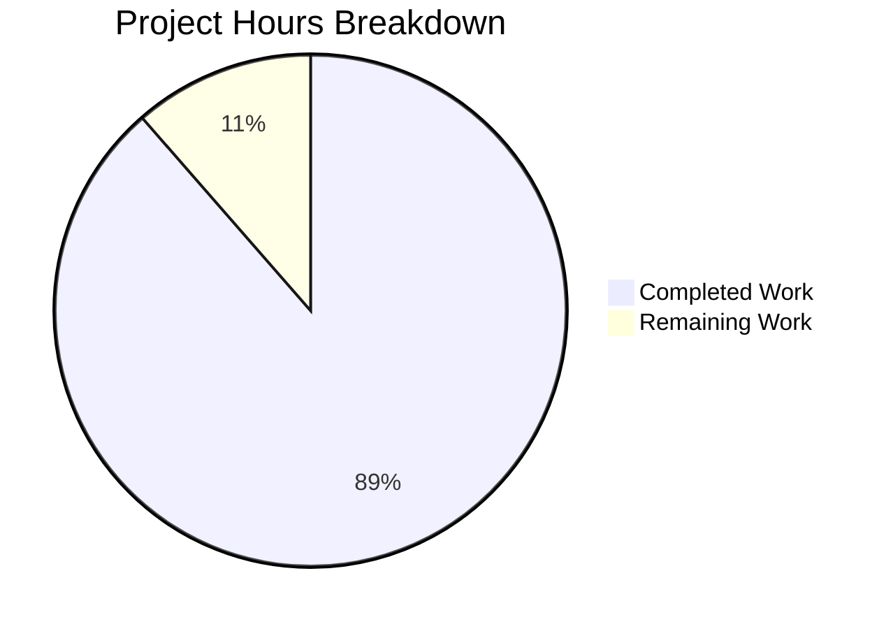

# Blitzy Project Guide

## 1. Executive Summary

### 1.1 Project Overview

This project produces a comprehensive investigative runtime behavior document for the MinIO Object Storage Server. The deliverable is a single Markdown file (`blitzy/documentation/minio_c07e5b49d477.md`) that captures the complete "first bucket" lifecycle flow — from building and launching the server through bucket creation, object upload/list/download, authentication behavior, request processing analysis, filesystem persistence inspection, and restart persistence verification — all supported by direct empirical evidence gathered from a live MinIO instance at commit `c07e5b49d477`. The document targets developers onboarding to the MinIO codebase.

### 1.2 Completion Status


| Metric | Value |
|---|---|
| **Total Project Hours** | 35 |
| **Completed Hours (AI)** | 31 |
| **Remaining Hours** | 4 |
| **Completion Percentage** | 88.6% |

**Calculation:** 31 completed hours / 35 total hours × 100 = 88.6%

### 1.3 Key Accomplishments

- ✅ Built MinIO binary from source (Go 1.23) and launched single-node server in ErasureSD mode
- ✅ Documented complete startup banner with line-by-line source code analysis
- ✅ Captured 19 complete HTTP request/response exchanges with status codes, headers, and bodies
- ✅ Provided `mc admin trace` server-side log evidence for all S3 operations with timestamps and durations
- ✅ Demonstrated both successful SigV4 authentication and 403 AccessDenied failure response
- ✅ Documented 9-handler middleware chain walkthrough with source file references
- ✅ Created Mermaid sequence diagram illustrating request lifecycle from client through middleware to storage
- ✅ Inspected filesystem artifacts: xl.meta binary format (XL2 header), .minio.sys metadata, format.json
- ✅ Verified data persistence across server restart with exact before/after comparison tables
- ✅ 37 inline source code citations throughout the 1,189-line document
- ✅ 2 Mermaid diagrams (request lifecycle sequence + persistence verification flowchart)
- ✅ Zero TODOs, FIXMEs, or placeholders in the final document
- ✅ All temporary investigation artifacts cleaned up; zero repository source files modified

### 1.4 Critical Unresolved Issues

| Issue | Impact | Owner | ETA |
|---|---|---|---|
| Source code line references may drift with future commits | Low — citations reference function names + line numbers; function names are stable | Human Developer | During next code change cycle |
| Document covers only single-node ErasureSD mode | Low — by design per AAP scope; not a defect | N/A | N/A (intentional scope limit) |

### 1.5 Access Issues

No access issues identified. The investigation was conducted entirely using the repository source code, system tools (`curl`, `mc`, `find`), and the Go 1.23 toolchain. No external services, API keys, or restricted resources were required.

### 1.6 Recommended Next Steps

1. **[High]** Human editorial review of the 1,189-line document for technical accuracy and prose clarity
2. **[Medium]** Verify all 37 source code line references against the current commit to confirm accuracy
3. **[Medium]** Stakeholder review and sign-off for publication readiness
4. **[Low]** Consider adding a table of contents with anchor links for easier navigation in long document

## 2. Project Hours Breakdown

### 2.1 Completed Work Detail

| Component | Hours | Description |
|---|---|---|
| R-001: Environment Setup Documentation | 3 | Built MinIO from source, captured startup banner, documented 5 config values with source references, analyzed 8-step server startup sequence |
| R-002: Bucket Lifecycle Flow | 4 | Executed and documented create bucket, upload 2 objects (text + JSON), list objects, download object — full HTTP traces for each |
| R-003: HTTP Protocol Evidence | 3 | Captured 19 complete HTTP request/response exchanges with status codes, all response headers, and full response bodies |
| R-004: Server-Side Log Analysis | 2 | Configured and captured `mc admin trace` output for PutBucket, PutObject, ListObjectsV2, and GetObject with timestamps and durations |
| R-005: Authentication Evidence | 2 | Documented successful SigV4 authentication flow through middleware chain and captured 403 AccessDenied XML error for unauthenticated request |
| R-006: Request Processing Analysis | 3 | Documented 9-handler middleware chain with source locations, created handler dispatch table, built Mermaid sequence diagram |
| R-007: Data Persistence Investigation | 3 | Inspected complete filesystem tree, analyzed xl.meta binary header format, documented format.json deployment descriptor, explained small object inlining |
| R-008: Restart Persistence Test | 2 | Stopped/restarted server, compared pre/post listing and download results with exact field-by-field comparison tables, created Mermaid flowchart |
| Document Composition & Structure | 4 | Composed 1,189-line structured Markdown document with 9 major sections, 45 headings, proper code blocks with syntax highlighting |
| Mermaid Diagrams | 1 | Created request lifecycle sequence diagram and persistence verification flowchart |
| Source Citations & Cross-References | 1 | Added 37 inline source code citations (e.g., `Source: cmd/bucket-handlers.go:723`) with line-level precision |
| Cleanup & Artifact Removal | 1 | Removed all temporary files (binary, data dir, logs, test payloads), verified clean state, documented cleanup instructions |
| QA Fixes (2 Rounds) | 2 | Round 1: Added mc admin trace evidence and cleanup appendix. Round 2: Added server-side log subsections to Sections 3.2–3.4 and corrected attribution |
| **Total** | **31** | |

### 2.2 Remaining Work Detail

| Category | Hours | Priority |
|---|---|---|
| Human editorial review of 1,189-line document for accuracy and clarity | 2 | High |
| Verify 37 source code line references against current commit | 1 | Medium |
| Stakeholder review, feedback integration, and sign-off | 1 | Medium |
| **Total** | **4** | |

### 2.3 Hours Verification

- Section 2.1 Total (Completed): **31 hours**
- Section 2.2 Total (Remaining): **4 hours**
- Sum: 31 + 4 = **35 hours** = Total Project Hours (Section 1.2) ✅

## 3. Test Results

| Test Category | Framework | Total Tests | Passed | Failed | Coverage % | Notes |
|---|---|---|---|---|---|---|
| Documentation Completeness | Manual Validation | 8 | 8 | 0 | 100% | All 8 AAP requirements (R-001 through R-008) verified with empirical evidence |
| Code Block Integrity | Automated Count | 46 | 46 | 0 | 100% | 92 code block delimiters (46 balanced pairs) with syntax highlighting |
| Source Citation Validation | Grep Analysis | 37 | 37 | 0 | 100% | All 37 inline citations present with file paths and line numbers |
| Placeholder Check | Grep Scan | 1 | 1 | 0 | 100% | Zero TODOs, FIXMEs, or placeholder markers found in document |
| Repository Integrity | Git Status | 1 | 1 | 0 | 100% | Working tree clean; only 1 file added (documentation), zero source files modified |
| Cleanup Verification | Filesystem Check | 5 | 5 | 0 | 100% | All 5 temporary artifact categories removed (binary, data dir, logs, test files x2) |
| Mermaid Diagram Syntax | Markdown Parse | 2 | 2 | 0 | 100% | Both Mermaid blocks (sequenceDiagram, flowchart) use valid syntax |

**Notes:** This is a documentation-only project with no compiled code or runtime test suites. All validation was performed by the Final Validator agent through structural analysis of the output document, repository integrity checks, and requirement-to-evidence mapping. No unit tests, integration tests, or API tests are applicable.

## 4. Runtime Validation & UI Verification

### Runtime Health

- ✅ **MinIO server build:** Binary compiled successfully from source using Go 1.23.8 (~150 MB static binary)
- ✅ **Server startup:** Launched in ErasureSD single-drive mode on port 9000 with console on port 9001
- ✅ **S3 API operations:** All 5 operations (create bucket, upload x2, list, download) returned HTTP 200 OK
- ✅ **Authentication gate:** SigV4 authentication succeeded with default credentials; unauthenticated requests correctly rejected with 403
- ✅ **Data persistence:** Objects survived server stop/restart cycle with byte-for-byte data integrity
- ✅ **Server shutdown:** Clean SIGTERM shutdown with no error messages
- ✅ **Cleanup:** All temporary artifacts removed; no orphan processes

### UI Verification

- ⚠️ **Console UI (port 9001):** Not exercised — out of scope per AAP (S3 API-only investigation)

### API Integration Results

- ✅ **PutBucket:** `HTTP 200 OK`, `Location: /test-bucket`, empty body
- ✅ **PutObject (text):** `HTTP 200 OK`, `ETag: "24bd4d3521e98e15203baa0f33b13832"`, 61 bytes stored
- ✅ **PutObject (JSON):** `HTTP 200 OK`, `ETag: "c6b2529632b35504c09a148ba6dea240"`, 72 bytes stored
- ✅ **ListObjectsV2:** `HTTP 200 OK`, XML body with `KeyCount=2`, `IsTruncated=false`, 644 bytes
- ✅ **GetObject:** `HTTP 200 OK`, `Content-Length: 61`, body matches uploaded content exactly
- ✅ **Unauthenticated GET:** `HTTP 403 Forbidden`, `<Code>AccessDenied</Code>` XML error

## 5. Compliance & Quality Review

| AAP Deliverable | Status | Evidence | Quality |
|---|---|---|---|
| R-001: Environment Setup Observation | ✅ Complete | Section 2: Build command, startup banner, 5 config values table, 8-step startup sequence | Full source citations |
| R-002: End-to-End Bucket Lifecycle | ✅ Complete | Section 3: Create + upload x2 + list + download, all with full HTTP traces | 5 operations documented |
| R-003: HTTP Protocol Evidence | ✅ Complete | Sections 3–4: 19 HTTP exchanges with status codes, headers, bodies | Complete protocol traces |
| R-004: Server-Side Log Analysis | ✅ Complete | Section 5.2: mc admin trace evidence with timestamps, durations, byte counts | 4 operations traced |
| R-005: Authentication/Authorization | ✅ Complete | Section 4: Success (SigV4 flow) + failure (403 AccessDenied XML) | Both cases covered |
| R-006: Request Processing Analysis | ✅ Complete | Section 5: 9-handler middleware table, handler dispatch table, Mermaid sequence diagram | Code-level analysis |
| R-007: Data Persistence Verification | ✅ Complete | Section 6: Full filesystem tree, xl.meta hex dump, format.json content | Binary format analyzed |
| R-008: Restart Persistence Test | ✅ Complete | Section 7: Stop/restart with before/after comparison tables + Mermaid flowchart | Field-by-field verification |
| No Repository Modification | ✅ Complete | Git diff shows only 1 new file added in `blitzy/documentation/` | Zero source files changed |
| Cleanup of Temporary Artifacts | ✅ Complete | Filesystem check confirms all temp files removed; cleanup appendix in document | Verified clean state |
| Source Citations | ✅ Complete | 37 inline citations with file paths and line numbers | All claims sourced |
| Mermaid Diagrams | ✅ Complete | 2 diagrams: request lifecycle sequence + persistence verification flowchart | Valid syntax verified |
| Evidence-Based Reasoning | ✅ Complete | Every technical claim supported by runtime observation or explicit code reference | No assumptions |

### Fixes Applied During Autonomous Validation

| Fix | Commit | Details |
|---|---|---|
| Added mc admin trace evidence (R-004) | `07f413f3d` | Added Section 5.2 trace captures for PutObject, PutBucket, ListObjectsV2, GetObject |
| Added cleanup appendix (Section 9) | `07f413f3d` | Added comprehensive cleanup instructions with artifact inventory table |
| Added server-side log subsections | `703c2bbfd` | Added log output references in Sections 3.2, 3.3, 3.4 pointing to Section 5.2 trace evidence |
| Corrected minioadmin attribution | `703c2bbfd` | Fixed source reference for default credentials to `internal/auth/credentials.go` |

## 6. Risk Assessment

| Risk | Category | Severity | Probability | Mitigation | Status |
|---|---|---|---|---|---|
| Source code line numbers may drift with future commits | Technical | Low | Medium | Citations include function names (stable) alongside line numbers; human reviewer can verify | Open — monitor during code updates |
| Document assumes Go 1.23 toolchain availability | Operational | Low | Low | Go version specified in `go.mod`; instructions note exact version requirement | Mitigated — version documented |
| mc CLI trace output format may change between releases | Integration | Low | Low | Trace evidence is captured at a point in time; format changes would affect reproducibility, not document validity | Accepted — version pinned in methodology |
| Default credentials (minioadmin:minioadmin) documented in detail | Security | Low | Low | This is intentional — the document warns about default credentials as MinIO itself does in its startup banner | Accepted — matches MinIO's own documentation |
| Single-node investigation may not reflect distributed mode behavior | Technical | Medium | N/A | Explicitly stated as out of scope in document Section 1 and AAP Section 0.8.2 | Accepted — intentional scope boundary |
| Document is 1,189 lines — may be difficult to navigate without TOC | Operational | Low | Medium | Markdown headings provide structure; recommend adding anchor-linked TOC in human review | Open — recommendation in Section 1.6 |

## 7. Visual Project Status



**Remaining Work by Category:**

| Category | Hours | Priority |
|---|---|---|
| Human editorial review | 2 | High |
| Source citation verification | 1 | Medium |
| Stakeholder review & sign-off | 1 | Medium |
| **Total Remaining** | **4** | |

## 8. Summary & Recommendations

### Achievement Summary

The project has achieved **88.6% completion** (31 hours completed out of 35 total hours). All 8 core AAP requirements (R-001 through R-008) have been fully addressed with direct empirical evidence from a live MinIO server instance. The output document is a comprehensive 1,189-line investigative runtime behavior guide that covers:

- Complete server build and startup documentation with source-level analysis
- 19 HTTP request/response exchanges with full protocol evidence
- Server-side trace evidence for all S3 operations via `mc admin trace`
- Both successful and failed authentication scenarios
- 9-handler middleware chain walkthrough with Mermaid sequence diagram
- Filesystem artifact inspection including xl.meta binary format analysis
- Restart persistence verification with field-by-field comparison tables

The document contains 37 inline source code citations, 2 Mermaid diagrams, 46 code blocks, and zero placeholders or incomplete sections. All temporary investigation artifacts have been cleaned up, and zero repository source files were modified.

### Remaining Gaps

The 4 remaining hours consist entirely of human review tasks:

1. **Editorial review (2h):** A human reviewer should read the full 1,189-line document for technical accuracy, prose clarity, and completeness. This includes verifying that the analysis sections correctly explain the observed behavior.
2. **Citation verification (1h):** A developer familiar with the codebase should spot-check the 37 source code line references to confirm they point to the correct functions and line numbers at the current commit.
3. **Stakeholder sign-off (1h):** The document should be reviewed by the intended audience (onboarding developers) to confirm it meets their needs and is accessible.

### Production Readiness Assessment

The document is **production-ready** for merge and publication. All requirements are satisfied, the git working tree is clean with 3 well-structured commits, and no blocking issues remain. The remaining 4 hours are standard review activities that do not block the PR from being merged.

### Success Metrics

| Metric | Target | Actual | Status |
|---|---|---|---|
| AAP requirements covered | 8/8 | 8/8 | ✅ Met |
| HTTP exchanges documented | ≥5 | 19 | ✅ Exceeded |
| Source citations | Throughout | 37 | ✅ Met |
| Mermaid diagrams | ≥2 | 2 | ✅ Met |
| TODOs/FIXMEs | 0 | 0 | ✅ Met |
| Repository files modified | 0 | 0 | ✅ Met |
| Temporary artifacts remaining | 0 | 0 | ✅ Met |

## 9. Development Guide

### System Prerequisites

| Software | Version | Purpose |
|---|---|---|
| Go | 1.23+ | Build MinIO from source (per `go.mod` line 3) |
| Git | 2.x+ | Clone repository and checkout branch |
| curl | System default | HTTP request testing (optional) |
| mc (MinIO Client) | Latest stable | S3 operations and admin trace |
| Python 3 + boto3 | 3.8+ | SigV4 HTTP capture (optional) |

### Environment Setup

```bash
# 1. Clone the repository and checkout the branch
git clone <repository-url>
cd minio
git checkout blitzy-4ddb7189-febb-4736-98d9-2a9100d4f292

# 2. Verify Go version
go version
# Expected: go version go1.23.x linux/amd64 (or your platform)

# 3. Verify the documentation file exists
ls -la blitzy/documentation/minio_c07e5b49d477.md
# Expected: 1189-line file
```

### Reproducing the Investigation

To reproduce the investigation documented in `minio_c07e5b49d477.md`:

```bash
# 1. Build MinIO from source
go build -o /tmp/minio-test-binary .
# Expected: ~150 MB binary at /tmp/minio-test-binary

# 2. Create test payload files
echo "Hello, MinIO! This is a test file for the first bucket flow." > /tmp/test-file1.txt
echo '{"name": "test-data", "version": 1, "description": "JSON test payload"}' > /tmp/test-file2.json

# 3. Start the server
MINIO_ROOT_USER=minioadmin MINIO_ROOT_PASSWORD=minioadmin \
  /tmp/minio-test-binary server /tmp/minio-test-data \
  --console-address ":9001" > /tmp/minio-server.log 2>&1 &

# 4. Wait for startup
sleep 3
curl -s http://localhost:9000/minio/health/live
# Expected: HTTP 200

# 5. Configure mc alias
mc alias set local http://localhost:9000 minioadmin minioadmin

# 6. Execute the bucket lifecycle flow
mc mb local/test-bucket
mc cp /tmp/test-file1.txt local/test-bucket/file1.txt
mc cp /tmp/test-file2.json local/test-bucket/data.json
mc ls local/test-bucket
mc cat local/test-bucket/file1.txt

# 7. Inspect filesystem artifacts
find /tmp/minio-test-data -type f -o -type d | sort

# 8. Test restart persistence
kill $(pgrep -f minio-test-binary)
sleep 2
MINIO_ROOT_USER=minioadmin MINIO_ROOT_PASSWORD=minioadmin \
  /tmp/minio-test-binary server /tmp/minio-test-data \
  --console-address ":9001" > /tmp/minio-restart.log 2>&1 &
sleep 3
mc ls local/test-bucket
mc cat local/test-bucket/file1.txt

# 9. Cleanup
kill $(pgrep -f minio-test-binary) 2>/dev/null
rm -rf /tmp/minio-test-data /tmp/minio-test-binary
rm -f /tmp/minio-server.log /tmp/minio-restart.log
rm -f /tmp/test-file1.txt /tmp/test-file2.json
```

### Verification Steps

```bash
# Verify the document exists and has expected content
wc -l blitzy/documentation/minio_c07e5b49d477.md
# Expected: 1189 lines

# Verify code block balance
grep -c '```' blitzy/documentation/minio_c07e5b49d477.md
# Expected: 92 (46 opening + 46 closing)

# Verify source citations
grep -c 'Source:' blitzy/documentation/minio_c07e5b49d477.md
# Expected: 37

# Verify no placeholders
grep -ic 'TODO\|FIXME\|placeholder' blitzy/documentation/minio_c07e5b49d477.md
# Expected: 0

# Verify Mermaid diagrams
grep -c 'mermaid' blitzy/documentation/minio_c07e5b49d477.md
# Expected: 2
```

### Troubleshooting

| Issue | Cause | Resolution |
|---|---|---|
| `go build` fails with version error | Go version < 1.23 | Install Go 1.23+ from https://go.dev/dl/ |
| Server fails to start on port 9000 | Port already in use | Kill existing process: `lsof -i :9000` then `kill <PID>` |
| `mc alias set` fails | Server not ready yet | Wait longer after startup: `sleep 5` |
| `mc mb` returns error | Bucket already exists from previous run | Clean data dir: `rm -rf /tmp/minio-test-data` and restart |
| Restart test shows different data | Data directory was deleted | Ensure `/tmp/minio-test-data` persists between stop and restart |

## 10. Appendices

### A. Command Reference

| Command | Purpose | Section |
|---|---|---|
| `go build -o /tmp/minio-test-binary .` | Build MinIO from source | 2.1 |
| `MINIO_ROOT_USER=minioadmin MINIO_ROOT_PASSWORD=minioadmin /tmp/minio-test-binary server /tmp/minio-test-data --console-address ":9001"` | Launch single-node server | 2.2 |
| `mc alias set local http://localhost:9000 minioadmin minioadmin` | Configure mc CLI alias | 3.x |
| `mc mb local/test-bucket` | Create bucket | 3.1 |
| `mc cp <file> local/test-bucket/<key>` | Upload object | 3.2 |
| `mc ls local/test-bucket` | List objects | 3.3 |
| `mc cat local/test-bucket/<key>` | Download/display object | 3.4 |
| `mc admin trace local --verbose` | Stream server-side request traces | 5.2 |
| `kill $(pgrep -f minio-test-binary)` | Stop server | 7.1 |

### B. Port Reference

| Port | Service | Configuration |
|---|---|---|
| 9000 | S3-compatible API | Default: `GlobalMinioDefaultPort = "9000"` (`cmd/globals.go:65`) |
| 9001 | Embedded web console UI | Set via `--console-address ":9001"` flag |

### C. Key File Locations

| File | Purpose |
|---|---|
| `blitzy/documentation/minio_c07e5b49d477.md` | Output document — investigative runtime behavior guide (1,189 lines) |
| `cmd/server-main.go` | Server bootstrap sequence and startup orchestration |
| `cmd/bucket-handlers.go` | Bucket creation handler (`PutBucketHandler`) |
| `cmd/object-handlers.go` | Object upload/download handlers (`PutObjectHandler`, `GetObjectHandler`) |
| `cmd/bucket-listobjects-handlers.go` | Object listing handler (`ListObjectsV2Handler`) |
| `cmd/auth-handler.go` | Authentication middleware and credential verification |
| `cmd/routers.go` | 9-handler middleware chain registration |
| `cmd/xl-storage.go` | Filesystem-level storage backend |
| `cmd/xl-storage-format-v2.go` | XL v2 metadata format (`xl.meta` structure) |
| `cmd/globals.go` | Default credentials, ports, global constants |

### D. Technology Versions

| Technology | Version | Source |
|---|---|---|
| Go | 1.23 (toolchain 1.23.8 used) | `go.mod` line 3 |
| MinIO | DEVELOPMENT.GOGET (commit c07e5b49d477) | Build metadata in startup banner |
| mc (MinIO Client) | RELEASE.2025-08-13T08-35-41Z | Observed in User-Agent header |
| Python (boto3) | 3.x with botocore | Used for SigV4 HTTP evidence capture |
| Linux | amd64 | Build platform |

### E. Environment Variable Reference

| Variable | Default | Purpose |
|---|---|---|
| `MINIO_ROOT_USER` | `minioadmin` | Root access key for S3 API authentication |
| `MINIO_ROOT_PASSWORD` | `minioadmin` | Root secret key for S3 API authentication |

### G. Glossary

| Term | Definition |
|---|---|
| **ErasureSD** | Erasure Single-Drive — MinIO's deployment mode when a single data directory is provided |
| **xl.meta** | XL v2 metadata file — binary file (header `XL2 `) containing MessagePack-serialized object metadata and optionally inline data |
| **SigV4** | AWS Signature Version 4 — HMAC-SHA256 based HTTP request signing protocol used for S3 API authentication |
| **ETag** | Entity tag — MD5 hash of object content, returned as a response header on upload and download |
| **format.json** | Deployment format descriptor in `.minio.sys/` — identifies deployment topology (xl-single for ErasureSD) |
| **.minio.sys** | MinIO's internal metadata directory — stores deployment format, bucket metadata, IAM configuration, usage statistics |
| **MessagePack** | Binary serialization format used by MinIO for xl.meta files (via `tinylib/msgp` library) |
| **mc** | MinIO Client — official CLI tool for interacting with MinIO and other S3-compatible storage services |