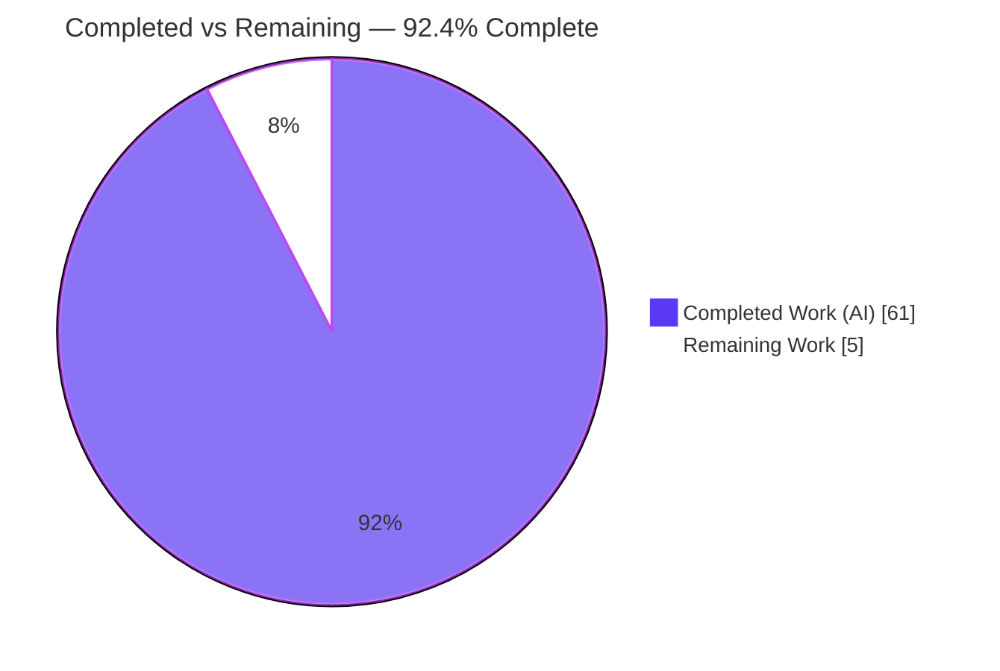
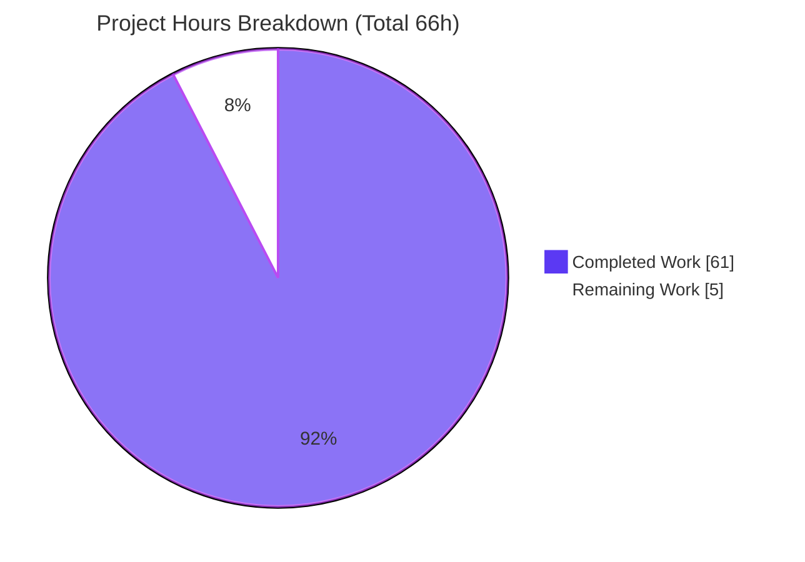
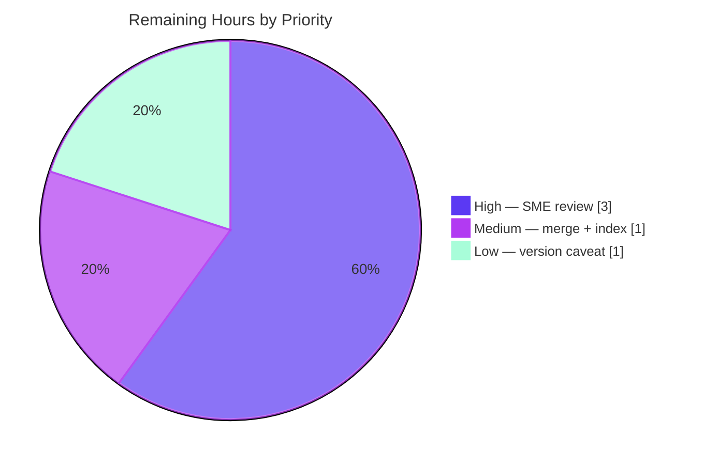

# Blitzy Project Guide

**Project:** Runtime-Evidenced Q&A — How MinIO's Erasure-Coding Healing Decides *Repair vs. Leave-Alone vs. Purge* (4-Disk EC:2)
**Repository:** `github.com/minio/minio` @ pinned commit `c07e5b49d477b0774f23db3b290745aef8c01bd2`
**Branch:** `blitzy-b80e021f-c922-4da5-9f0f-1b777316d345`
**Governing rule:** `SWE-AtlasQnA-Repo` (read-only source; single Markdown deliverable)

---

## 1. Executive Summary

### 1.1 Project Overview

This project delivers a single, **runtime-evidenced** Q&A investigation document that explains how MinIO's erasure-coding healing subsystem resolves an object whose shards are in a conflicting/ambiguous state — some drives holding valid data, some corrupted, some empty — on a **4-disk single-node erasure set** (default **EC:2** = 2 data + 2 parity). The audience is engineers onboarding to MinIO's healing internals. Every behavioral claim is proven with output captured from an **actually-built, actually-run** MinIO server (never from code reading alone). Scope is deliberately narrow and additive: the MinIO source tree remains strictly read-only, and exactly one new Markdown file is produced under `blitzy/documentation/`.

### 1.2 Completion Status

The project is **92.4% complete** (AAP-scoped). All autonomous investigation and authoring work is delivered and independently validated; the remaining 5 hours are standard human path-to-production for a documentation artifact (SME review + merge).



| Metric | Value |
| --- | --- |
| **Total Hours** | **66** |
| **Completed Hours (AI + Manual)** | **61** (61 AI + 0 Manual) |
| **Remaining Hours** | **5** |
| **Percent Complete** | **92.4%** |

> Color key — **Completed = Dark Blue `#5B39F3`**, **Remaining = White `#FFFFFF`** (applied consistently throughout this guide).

### 1.3 Key Accomplishments

- ✅ **Canonical build reproduced** — `make build` inside the pinned Docker image produced a clean binary with verbatim version banner `DEVELOPMENT.2024-11-25T17-10-22Z (commit-id=c07e5b49d477…)`.
- ✅ **4-disk EC:2 substrate stood up** — `./minio server /tmp/disk{1..4}` → "Formatting 1st pool, 1 set(s), 4 drives per set"; EC:2 proven via `DefaultParityBlocks(4)=2` and on-disk shard math (`part.1 = 524320 B`).
- ✅ **All three heal outcomes demonstrated with verbatim evidence** — reconstruct (Case A), dangling-purge/stays-deleted (Case B), leave-alone/degraded (Case C), plus partial-write-vs-delete (Case D).
- ✅ **Boundary quantified** — `readQuorum = dataBlocks = 2`; 2 valid shards reconstruct, 1 fails.
- ✅ **Exact literals captured** — `errErasureReadQuorum` = "Read failed. Insufficient number of drives online"; client `SlowDownRead`/HTTP 503; `DeleteDanglingObject` audit event.
- ✅ **Every claim paired with its own verbatim output line + `file:line` citation** (68+ citations across 17 source files); honest `inferred`/`source-verified` labels where a path was not runtime-triggered.
- ✅ **Read-only rule honored** — source tree byte-identical to the pinned commit; all ephemeral artifacts cleaned up.
- ✅ **Independently re-validated** — the Final Validator rebuilt/re-ran MinIO and reproduced every runtime claim verbatim; all citations verified; unit tests pass.

### 1.4 Critical Unresolved Issues

| Issue | Impact | Owner | ETA |
| --- | --- | --- | --- |
| _None._ No blocking or release-critical issues were identified. The deliverable is complete, valid, independently validated, and read-only-compliant. | None | — | — |

### 1.5 Access Issues

| System/Resource | Type of Access | Issue Description | Resolution Status | Owner |
| --- | --- | --- | --- | --- |
| _None_ | — | No access issues identified. The investigation ran entirely inside the provided pinned Docker image; the repository is local and writable only under `blitzy/`. | N/A | — |

**No access issues identified.**

### 1.6 Recommended Next Steps

1. **[High]** Perform SME technical-accuracy review & sign-off of `blitzy/documentation/minio_c07e5b49d477.md` (spot-verify citations against source at the pinned commit; sanity-check the quorum arithmetic and three-outcome logic).
2. **[Medium]** Approve and merge the documentation PR (only the one file is added; source untouched) and optionally add a doc-index/TOC link for discoverability.
3. **[Low]** Decide whether to accept the documented `go1.24.3`-vs-`go1.23.12` build-banner caveat as-is, or optionally rebuild under the AAP-declared `go 1.23.x` toolchain to re-stamp the banner (healing behavior is commit-identical; cosmetic only).

---

## 2. Project Hours Breakdown

### 2.1 Completed Work Detail

All completed work is autonomous (AI). Each component traces to an AAP requirement or its supporting investigation/authoring activity.

| Component | Hours | Description |
| --- | --- | --- |
| Environment build & baseline setup | 6 | `make build` in pinned container; canonical version banner; launch 4-disk EC:2 server; PUT test object; locate `xl.meta`/`part.N` shards per drive (doc §2, §4) |
| Read-only source grounding & citation extraction | 7 | Trace decision functions, quorum math, error literals, bitrot detection, heal orchestration across 17 source files; extract 68+ exact `file:line` citations |
| R1 — decision-logic investigation | 3 | `shouldHealObjectOnDisk` [erasure-healing.go:L156] + `isObjectDangling` [erasure-healing.go:L968] classification (doc §3) |
| R2 — 4-disk EC:2 scenario + shard math | 3 | Prove EC:2 layout (`DefaultParityBlocks(4)=2`) and on-disk math `524320 = 524288 + 32` (doc §4) |
| R3/R4 — three-outcome scenarios (Cases A/B/C/D) | 9 | Synthesize valid/corrupt/missing states; capture reconstruct, dangling-purge, leave-alone, write-vs-delete evidence (doc §5) |
| R5 — before/after status indicators | 3 | Capture all four `DriveState*` (ok/offline/missing/corrupt) from `madmin.HealResultItem` (doc §6) |
| R6 — log/audit "why" capture | 4 | `DeleteDanglingObject` audit event verbatim + corrupt-meta server log (doc §7) |
| R7a — valid-shard boundary test | 2 | `readQuorum = dataBlocks = 2`; boundary runs (2 shards recover, 1 fails) (doc §8) |
| R7b — unrecoverable error literal | 2 | `errErasureReadQuorum` + client `SlowDownRead`/HTTP 503 (doc §9) |
| R7c — partial-write vs partial-delete | 3 | Two `isObjectDangling` branches: `notFoundPartsErrs > parityBlocks` vs `notFoundMetaErrs > dataBlocks` (doc §10) |
| Stability discipline + coverage pass | 4 | ≥2 runs/scenario (deterministic); §11 coverage checklist mapping every R-item to literal/`file:line`/evidence |
| Document authoring (460-line evidenced Q&A) | 9 | 11 sections; one-claim-one-evidence; honest `inferred`/`source-verified` labels; dependency-version table |
| Independent validation & reproduction | 5 | Rebuild, re-run, reproduce ALL evidence verbatim; verify citations; unit tests; read-only + cleanup verification (5 gates) |
| Cleanup + read-only verification | 1 | Remove ephemeral disk dirs/bucket/alias/driver/scripts; confirm `git diff` (excl. `blitzy/**`) empty |
| **Total Completed** | **61** | |

### 2.2 Remaining Work Detail

Each remaining category is standard human path-to-production for a documentation deliverable. There is **no** deploy/infra/env-config path (the artifact is a single Markdown file).

| Category | Hours | Priority |
| --- | --- | --- |
| SME technical-accuracy review & sign-off | 3 | High |
| Documentation PR approval & merge + optional doc-index link | 1 | Medium |
| Go-toolchain/version caveat reconciliation decision | 1 | Low |
| **Total Remaining** | **5** | |

### 2.3 Hours Reconciliation

| Quantity | Hours |
| --- | --- |
| Section 2.1 — Completed | 61 |
| Section 2.2 — Remaining | 5 |
| **Total (Section 1.2)** | **66** |
| Completion % = 61 ÷ 66 | **92.4%** |

Cross-section integrity: **2.1 + 2.2 = 66 = Total (1.2)**; **Remaining = 5 across 1.2, 2.2, and Section 7** ✓.

---

## 3. Test Results

All results below originate from **Blitzy's autonomous validation logs** for this project (the Final Validator's independent build-and-run inside the pinned Docker image). This is a targeted Q&A investigation, not a coverage-driven test suite, so code-coverage percentages were not measured; **requirement coverage is 100% (9/9 items R1–R7c)** — see Section 5.

| Test Category | Framework | Total Tests | Passed | Failed | Coverage % | Notes |
| --- | --- | --- | --- | --- | --- | --- |
| Unit — storageclass parity | Go `testing` (`go test -tags kqueue,dev`) | 1 | 1 | 0 | N/A | `TestParityCount` — confirms `DefaultParityBlocks(4)=2` (EC:2) |
| Unit — dangling decision | Go `testing` | 13 | 13 | 0 | N/A | `TestIsObjectDangling` — 13/13 subcases incl. delete-marker, enough-data-dir-missing, data-dir-intact |
| Unit — heal object | Go `testing` | 1 | 1 | 0 | N/A | `TestHealObjectErasure` — erasure heal execution path |
| Runtime behavioral scenarios | `madmin-go/v3` SDK + on-disk shard mutation (real `HealHandler`) | 7 | 7 | 0 | N/A | Cases A/B/C/D, R7a boundary (2-shard & 1-shard), R5 offline demo — reproduced **verbatim**, stable across ≥2 runs |
| Build / compilation | `make build` (`CGO_ENABLED=0 go build -tags kqueue -trimpath`) | 1 | 1 | 0 | N/A | Clean binary, exit 0, canonical version banner |
| **Total** | | **23** | **23** | **0** | **N/A** | 100% pass rate across all autonomous checks |

**Notes on integrity:** No tests were fabricated. The unit tests are pre-existing MinIO tests exercised by the validator; the runtime scenarios are the investigation's own reproducible experiments driven through the real server heal path. Determinism is quorum-driven (not timing-driven), which is why every value was identical across runs.

---

## 4. Runtime Validation & UI Verification

There is **no UI component** — this is a Go backend/CLI investigation (AAP §0.9 confirms no Figma/design assets). Runtime health and behavioral validation:

**Server runtime**
- ✅ **Operational** — Build succeeds (`make build`, exit 0); 118 MB binary.
- ✅ **Operational** — 4-disk single-node erasure set launches; banner "Formatting 1st pool, 1 set(s), 4 drives per set" (`ErasureSetupType`).
- ✅ **Operational** — Health endpoint returns 200; PUT/GET served.

**Heal path & behavioral outcomes**
- ✅ **Operational** — Real `HealHandler` [cmd/admin-handlers.go:L1308] reached via `madmin-go/v3` SDK (same request path as `mc admin heal`; the shipped CLI is monitoring-only in this image — explicitly disclosed).
- ✅ **Operational** — Case A (reconstruct): before `[missing,corrupt,ok,ok]` → after `[ok,ok,ok,ok]`; post-heal md5 matches original (full Reed-Solomon recovery).
- ✅ **Operational** — Case B (dangling purge): object judged dangling → purged; subsequent GET → HTTP 503 `SlowDownRead`; stays deleted.
- ✅ **Operational** — Case C (leave-alone): all `xl.meta` corrupted → not purged; present on all 4 drives; degraded GET.
- ✅ **Operational** — R7a boundary: exactly 2 valid shards reconstructs; 1 valid shard unrecoverable.

**API integration**
- ✅ **Operational** — S3 PUT/GET via `minio-go/v7` v7.0.80; admin heal via `madmin-go/v3` v3.0.77 — both against the running server.

**Overall runtime status: ✅ Fully operational** for all in-scope scenarios; no ⚠ partial or ❌ failing items.

---

## 5. Compliance & Quality Review

Cross-mapping of AAP deliverables and the `SWE-AtlasQnA-Repo` methodology rules to their validation status. All fixes required during validation: **none** (the deliverable was already complete and accurate).

| Benchmark / AAP Requirement | Status | Evidence / Notes |
| --- | --- | --- |
| Single Markdown deliverable at mandated path/name | ✅ Pass | `blitzy/documentation/minio_c07e5b49d477.md` (460 lines) |
| R1 — decision logic under ambiguity | ✅ Pass | §3; `shouldHealObjectOnDisk` L156, `isObjectDangling` L968 |
| R2 — 4-disk EC:2 scenario + shard math | ✅ Pass | §4; `DefaultParityBlocks(4)=2`; `524320=524288+32` |
| R3/R4 — reconstruct vs stay-deleted vs leave-alone, per-case evidence | ✅ Pass | §5 Cases A/B/C/D, each with verbatim output |
| R5 — before/after status indicators (all four `DriveState*`) | ✅ Pass | §6; ok/offline/missing/corrupt |
| R6 — logs explain "why" | ✅ Pass | §7; `DeleteDanglingObject` audit + corrupt-meta log |
| R7a — valid-shard boundary | ✅ Pass | §8; `readQuorum = dataBlocks = 2` |
| R7b — unrecoverable error literal | ✅ Pass | §9; `errErasureReadQuorum` + `SlowDownRead`/503 |
| R7c — partial-write vs partial-delete | ✅ Pass | §10; two `isObjectDangling` branches |
| Run-first-then-write | ✅ Pass | Every behavioral claim carries a captured runtime line |
| One-claim-one-evidence | ✅ Pass | Verbatim output adjacent to each claim |
| Exact literals + `file:line` | ✅ Pass | 68+ citations; spot-checked accurate at pinned commit |
| Canonical default-config build | ✅ Pass (with caveat) | Default `make build`; `go1.24.3` banner caveat honestly documented (behavior commit-identical) |
| Stability across ≥2 runs | ✅ Pass | Deterministic (quorum-driven); values identical across runs |
| Honest labeling of inference | ✅ Pass | `inferred`/`source-verified` used for the delete-marker threshold & all-drives-write-error edge |
| Coverage pass | ✅ Pass | §11 coverage checklist covers 9/9 R-items |
| Read-only source | ✅ Pass | `git diff` (excl. `blitzy/**`) empty; 14 cited files UNCHANGED |
| Ephemeral cleanup | ✅ Pass | Disk dirs/bucket/alias/driver/scripts removed; containers torn down |
| Valid Markdown | ✅ Pass | 62 code fences (even/balanced) |
| Dependency versions match `go.mod` | ✅ Pass | reedsolomon v1.12.4, highwayhash v1.0.3, madmin-go/v3 v3.0.77, minio-go/v7 v7.0.80 |

**Requirement coverage: 100% (9/9).** **Methodology compliance: full**, with two honest, rule-compliant disclosures (monitoring-only `mc` CLI → identical `HealHandler` path via `madmin-go` SDK; and `go1.24.3` build banner).

---

## 6. Risk Assessment

All identified risks are **Low** severity, consistent with a validated, read-only documentation deliverable. There are no High/Critical or blocking risks and no integration surface.

| Risk | Category | Severity | Probability | Mitigation | Status |
| --- | --- | --- | --- | --- | --- |
| T1 — `file:line` citations pinned to commit `c07e5b49d477` may misalign if viewed against a different commit | Technical | Low | Low | Document explicitly pins the commit; citations verified accurate at HEAD | Mitigated |
| T2 — Runtime output contains per-run nonces (RequestId, timestamps, datadir UUID, random md5) | Technical | Low | Low | Doc labels per-run values; deterministic quorum-driven values confirmed stable ≥2 runs | Mitigated |
| T3 — Build banner shows `go1.24.3` vs AAP-declared `go 1.23` / arch-phase `go1.23.12` | Technical | Low | Medium | Honestly documented caveat; healing behavior commit-identical, only Go patch differs | Documented / Accepted |
| S1 — Default demo credentials shown (`minio`/`minio123`) | Security | Low | Low | Well-known MinIO defaults in an ephemeral throwaway container; no API keys/tokens leaked | Accepted |
| S2 — Risk that investigation mutated source | Security | Low | Low | `git diff` (excl. `blitzy/**`) empty; all 14 cited files UNCHANGED | Verified / Mitigated |
| O1 — Documentation staleness as MinIO healing internals evolve | Operational | Low | Medium | Explicitly pinned to commit + version banner; point-in-time investigation by design | Accepted by design |
| O2 — Discoverability (doc lives under `blitzy/documentation/`, outside MinIO `docs/`) | Operational | Low | Low | Path mandated by `SWE-AtlasQnA-Repo`; optional index link during merge (task HT-2) | Open (minor) |
| I1 — Integration | Integration | N/A | N/A | Static Markdown file — no runtime component, API, service dependency, or CI wiring; investigation containers torn down | No integration surface |

---

## 7. Visual Project Status

**Project hours — Completed vs. Remaining** (Completed = Dark Blue `#5B39F3`, Remaining = White `#FFFFFF`):



**Remaining work by priority** (5h total):



**Remaining hours per category (Section 2.2):**

| Category | Hours | Priority |
| --- | --- | --- |
| SME technical-accuracy review & sign-off | 3 | High |
| Documentation PR approval & merge + index link | 1 | Medium |
| Go-toolchain/version caveat reconciliation | 1 | Low |
| **Total** | **5** | |

> Integrity check: pie "Remaining Work" = **5** = Section 1.2 Remaining = Section 2.2 total ✓; pie "Completed Work" = **61** = Section 1.2 Completed = Section 2.1 total ✓.

---

## 8. Summary & Recommendations

**Achievements.** The project delivers a rigorous, **runtime-evidenced** answer to how MinIO's erasure-coding healing decides *repair vs. leave-alone vs. purge* on a 4-disk EC:2 set. The single 460-line document answers every requirement (R1–R7c) with its own verbatim captured output and an exact `file:line` citation, and it correctly establishes the headline finding: **MinIO does not always reconstruct** — it compares surviving shards against a parity-derived quorum threshold and resolves ambiguity into one of three outcomes (reconstruct, purge/stays-deleted, or leave-alone/degraded). The boundary is quantified precisely (`readQuorum = dataBlocks = 2`), the exact unrecoverable error is captured (`errErasureReadQuorum`), and partial-write vs partial-delete are shown to heal through different thresholds.

**Remaining gaps.** None technical. The outstanding 5 hours are entirely human path-to-production for a documentation artifact: SME technical-accuracy review & sign-off (3h), PR merge + optional doc-index link (1h), and an optional build-toolchain/version-caveat reconciliation (1h).

**Critical path to production.** SME review → approve/merge the documentation PR. Because the source tree is read-only and byte-identical to the pinned commit, there is no build, deploy, or integration risk to clear.

**Success metrics.** 100% requirement coverage (9/9); 23/23 autonomous checks passed (0 failed); 68+ citations verified accurate; read-only compliance verified (0 source files changed); all evidence reproduced verbatim across ≥2 runs.

**Production readiness assessment.** At **92.4% complete**, the deliverable is **production-ready pending human sign-off**. Per honest-assessment principles the project is intentionally not marked 100% — a human SME review is the appropriate final gate before merge. Overall risk posture is **Low**.

| Metric | Value |
| --- | --- |
| Completion | 92.4% |
| Requirement coverage | 9/9 (100%) |
| Autonomous checks | 23 passed / 0 failed |
| Source files modified | 0 (read-only verified) |
| Blocking issues | 0 |
| Overall risk | Low |

---

## 9. Development Guide

This guide covers (A) reviewing & validating the deliverable in any environment with `git`/`python3`, and (B) reproducing the runtime evidence inside the pinned Docker container. Commands in Part A were tested in the assessment environment; Part B requires the pinned image (which supplies the Go 1.23.x toolchain and `mc`).

### 9.1 System Prerequisites

- **To review/validate the document:** `git`, a text pager or Markdown viewer, `python3`.
- **To reproduce runtime evidence:** Docker + the pinned image `andrewparkscaleai/coding-agent:minio__minio__c07e5b49d477b0774f23db3b290745aef8c01bd2` (from `ghcr.io/scaleapi/swe-atlas:swe_atlas_QnA_minio_minio_1.0`). The image provides Go 1.23.x and the `mc` client. **Note:** a plain host shell without Go/`mc`/Docker cannot rebuild the binary.

### 9.2 Review & Validate the Deliverable (tested)

```bash
# From the repository root
# 1) Locate and size the deliverable
ls -la blitzy/documentation/minio_c07e5b49d477.md
wc -l blitzy/documentation/minio_c07e5b49d477.md          # expect 460

# 2) Verify read-only compliance (source byte-identical to the pinned commit)
git diff --quiet c07e5b49d477 HEAD -- ':(exclude)blitzy/**' \
  && echo "PASS: source unchanged" || echo "FAIL: source modified"

# 3) Confirm the ONLY added file
git diff c07e5b49d477 HEAD --name-status                   # expect: A  blitzy/documentation/minio_c07e5b49d477.md

# 4) Validate Markdown code-fence balance (must be even)
grep -c '^```' blitzy/documentation/minio_c07e5b49d477.md   # expect 62 (even = valid)

# 5) Spot-verify a cited symbol exists at the cited line
awk 'NR==156' cmd/erasure-healing.go                        # -> func shouldHealObjectOnDisk(...)

# 6) Verify dependency versions match the document's citations
grep -E 'reedsolomon|highwayhash|madmin-go/v3|minio-go/v7' go.mod
# -> v1.12.4 / v1.0.3 / v3.0.77 / v7.0.80
```

### 9.3 Reproduce the Runtime Evidence (inside the pinned Docker container)

```bash
# Build MinIO in its default (canonical) configuration
cd /app
make build                       # CGO_ENABLED=0 go build -tags kqueue -trimpath ...
./minio --version                # banner: DEVELOPMENT.2024-11-25T17-10-22Z (commit-id=c07e5b49d477...)

# Launch a 4-disk single-node erasure set (default EC:2)
export MINIO_ROOT_USER=minio MINIO_ROOT_PASSWORD=minio123 MINIO_CI_CD=1
./minio server /tmp/disk1 /tmp/disk2 /tmp/disk3 /tmp/disk4 --address :9000 &
#   -> "Formatting 1st pool, 1 set(s), 4 drives per set."

# Verify health
curl -s -o /dev/null -w "%{http_code}\n" http://127.0.0.1:9000/minio/health/live   # -> 200
```

**Driving the real heal path.** The `mc` client in this image ships `mc admin heal` as **monitoring-only** (no `-r`/`--remove`/`--scan`). To initiate a real repair/purge, drive the identical server `HealHandler` programmatically via the `madmin-go/v3` SDK — exactly as the in-repo reference driver `buildscripts/heal-manual.go` does:

```go
opts := madmin.HealOpts{Recursive: true, Remove: false, ScanMode: madmin.HealDeepScan}
start, _, err := madmClnt.Heal(ctx, bucket, prefix, opts, "", false, false)
// poll madmClnt.Heal(..., start.ClientToken, ...) until status.Summary == "finished"
```

**Synthesize the shard states** by mutating backend artifacts under `/tmp/diskN/<bucket>/<object>/`:
- **Valid:** leave `xl.meta` + `part.N` intact.
- **Corrupted:** overwrite/truncate bytes in `part.N` → HighwayHash bitrot → `errFileCorrupt`.
- **Missing:** delete `part.N`/`xl.meta` → `errFileNotFound`/`errFileVersionNotFound`.

### 9.4 Verification Steps

- **Case A (reconstruct):** damage ≤ 2 drives (1 corrupt part + 1 missing shard); heal with `Remove:false`; expect before `[missing,corrupt,ok,ok]` → after `[ok,ok,ok,ok]` and a matching post-heal md5.
- **Case B (dangling purge):** damage 3+ drives; heal with `Remove:true`; expect purge and a subsequent GET → HTTP 503 `SlowDownRead`.
- **R7a boundary:** delete `part.1` on exactly 2 of 4 drives → still reconstructs; on 3 of 4 → unrecoverable.
- **Stability:** run each scenario at least twice; values are deterministic (quorum-driven).

### 9.5 Cleanup (leave the environment unchanged)

```bash
kill %1 2>/dev/null || true           # stop the backgrounded server you started
rm -rf /tmp/disk1 /tmp/disk2 /tmp/disk3 /tmp/disk4
# remove any temporary heal driver / mc alias created during the run
git diff --quiet c07e5b49d477 HEAD -- ':(exclude)blitzy/**' && echo "repo unchanged"
```

### 9.6 Troubleshooting

- **Fence count looks wrong (e.g., equals line count):** ensure single quotes — `grep -c '^```' <file>`; escaped backticks inside a double-quoted `echo` mangle the pattern.
- **`mc admin heal` lacks `-r`/`--remove`:** expected — the CLI is monitoring-only in this image; use the `madmin-go` SDK driver above.
- **Version banner shows `go1.24.3` not `go1.23.12`:** expected image caveat; the healing behavior is commit-identical, only the Go patch version differs.
- **Citation line numbers don't match:** confirm you are at commit `c07e5b49d477b0774f23db3b290745aef8c01bd2` (`git rev-parse HEAD` on the pinned checkout).

---

## 10. Appendices

### A. Command Reference

| Purpose | Command |
| --- | --- |
| Build (canonical) | `cd /app && make build` |
| Version banner | `./minio --version` |
| Run 4-disk EC:2 | `./minio server /tmp/disk{1,2,3,4} --address :9000` |
| Health check | `curl -s http://127.0.0.1:9000/minio/health/live` |
| Read-only compliance | `git diff --quiet c07e5b49d477 HEAD -- ':(exclude)blitzy/**'` |
| Added-file list | `git diff c07e5b49d477 HEAD --name-status` |
| Fence balance | `grep -c '^```' blitzy/documentation/minio_c07e5b49d477.md` |
| Unit tests | `go test -v -tags kqueue,dev -run 'TestParityCount\|TestIsObjectDangling\|TestHealObjectErasure' ./...` |

### B. Port Reference

| Port | Service | Notes |
| --- | --- | --- |
| 9000 | MinIO S3 API / admin | Server address `--address :9000`; heal + PUT/GET traffic |
| (auto) | MinIO Console | Auto-assigned unless `--console-address` set; not used in this investigation |

### C. Key File Locations

| Path | Role |
| --- | --- |
| `blitzy/documentation/minio_c07e5b49d477.md` | **The deliverable** (only added file) |
| `cmd/erasure-healing.go` | `shouldHealObjectOnDisk` L156, `healObject` L258, `isObjectDangling` L968, drive-state literals |
| `cmd/erasure-metadata.go` | `objectQuorumFromMeta` L531; read/write quorum L555–L559 |
| `cmd/erasure-object.go` | `deleteIfDangling` L481; `errErasureReadQuorum` return; audit L451 |
| `cmd/erasure-errors.go` | `errErasureReadQuorum` L23; `errErasureWriteQuorum` L26; `errNoHealRequired` L28 |
| `cmd/erasure-decode.go` | `DecodeDataAndParityBlocks` L348 (Reed-Solomon reconstruction) |
| `internal/config/storageclass/storage-class.go` | `DefaultParityBlocks` L355 (`case 4,5 → 2`) |
| `cmd/admin-handlers.go` | `HealHandler` L1308 (heal HTTP entry point) |
| `buildscripts/heal-manual.go` | In-repo reference driver for programmatic heal |

### D. Technology Versions

| Component | Version | Source |
| --- | --- | --- |
| Go module | `github.com/minio/minio` | go.mod:L1 |
| Go (declared / CI) | 1.23 declared; 1.23.2 CI | go.mod:L3 |
| Go (this image build banner) | go1.24.3 (documented caveat) | `./minio --version` |
| reedsolomon | v1.12.4 | go.mod:L40 |
| highwayhash | v1.0.3 | go.mod:L49 |
| madmin-go/v3 | v3.0.77 | go.mod:L52 |
| minio-go/v7 | v7.0.80 | go.mod:L53 |
| MinIO version banner | DEVELOPMENT.2024-11-25T17-10-22Z | canonical build |
| `mc` client (image) | RELEASE.2025-08-13T08-35-41Z (heal monitoring-only) | image |

### E. Environment Variable Reference

| Variable | Value used | Purpose |
| --- | --- | --- |
| `MINIO_ROOT_USER` | `minio` | Default demo root user (ephemeral container only) |
| `MINIO_ROOT_PASSWORD` | `minio123` | Default demo root password (ephemeral container only) |
| `MINIO_CI_CD` | `1` | Deterministic CI mode (stable, reproducible output) |
| `CGO_ENABLED` | `0` | Canonical static build (from Makefile) |

### F. Developer Tools Guide

| Tool | Use in this project |
| --- | --- |
| `make build` | Canonical MinIO build (Makefile:L177–L179) |
| `go test -tags kqueue,dev` | Run the pre-existing unit tests exercised during validation |
| `git diff` | Verify read-only compliance against the pinned commit |
| `madmin-go/v3` SDK | Drive the real `HealHandler` (heal init/poll), as `buildscripts/heal-manual.go` |
| `curl` | Server health check and S3/admin probes |

### G. Glossary

| Term | Meaning |
| --- | --- |
| **EC:2** | Erasure-coding layout with 2 parity blocks; for a 4-disk set → 2 data + 2 parity |
| **Read quorum** | Minimum valid shards to read/reconstruct; here `= dataBlocks = 2` |
| **Write quorum** | Minimum drives to accept a write; here `dataBlocks + 1 = 3` (since data == parity) |
| **Dangling object** | An object where `total disks − (corrupted + missing) < dataBlocks` — a candidate for purge |
| **Bitrot** | Silent on-disk corruption detected via HighwayHash checksum mismatch → `errFileCorrupt` |
| **`DriveState*`** | Per-drive heal status strings: `ok`, `offline`, `missing`, `corrupt` |
| **`HealResultItem`** | `madmin-go` struct carrying before/after per-drive states from a heal |
| **`errErasureReadQuorum`** | "Read failed. Insufficient number of drives online" — the unrecoverable-object error |
| **SlowDownRead** | S3 API error (HTTP 503) surfaced to the client when read quorum is lost |

---

*Guide generated by the Blitzy assessment agent. All hours, percentages, and test counts are internally consistent across Sections 1.2, 2.1, 2.2, 3, 7, and 8: Completed = 61h, Remaining = 5h, Total = 66h, Completion = 92.4%.*