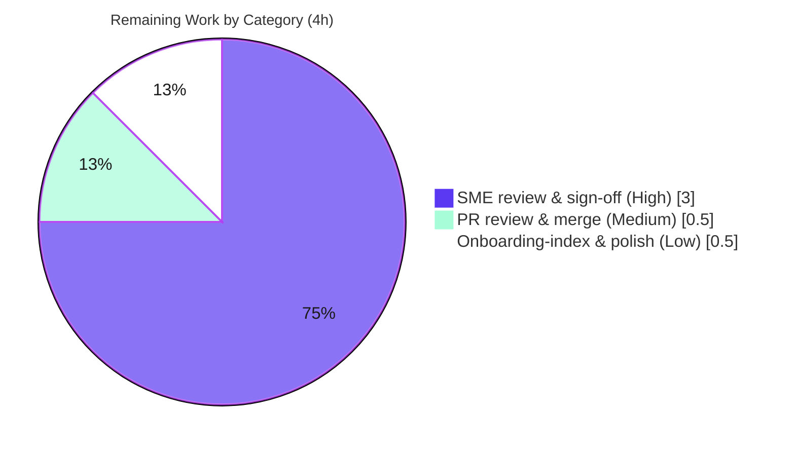

# Blitzy Project Guide — MinIO EC:2 Heal-Decision Onboarding Answer

> Autonomous deliverable assessed against the Agent Action Plan (AAP). Completion is measured strictly over AAP-scoped work plus path-to-production, per the PA1 methodology.

---

## 1. Executive Summary

### 1.1 Project Overview

This project answers a MinIO onboarding question with real runtime evidence: **how does MinIO's healing subsystem decide between _reconstruct_, _leave-as-is_, and _purge_ when a 4-disk erasure-coded (EC:2) object is inconsistent across drives** (some shards valid, some corrupt, some missing). The audience is new MinIO storage/erasure engineers. Business impact: it accelerates onboarding and reduces heal-subsystem mis-operation by grounding every claim in observed behavior rather than theory. Technical scope is a **single, read-only investigative documentation deliverable** — one markdown file — produced by building the real MinIO server, running the canonical in-repo heal tests and a live 4-drive server, inducing shard inconsistency, and capturing structured heal results, exact error strings, and audit events.

### 1.2 Completion Status


| Metric | Value |
|---|---|
| **Total Hours** | **40** |
| **Completed Hours (AI + Manual)** | **36** (AI: 36, Manual: 0) |
| **Remaining Hours** | **4** |
| **Percent Complete** | **90.0%** |

> Completion formula (PA1, AAP-scoped): `36 ÷ (36 + 4) × 100 = 90.0%`. The colour key is applied throughout this guide: **Completed = Dark Blue `#5B39F3`**, **Remaining = White `#FFFFFF`**.

### 1.3 Key Accomplishments

- ✅ **Single-artifact deliverable created** — `blitzy/documentation/minio_c07e5b49d477.md` (1,140 lines, 80,390 bytes); the only change versus base commit `c07e5b49d`.
- ✅ **All 7 question items (Q1–Q7) + the Q8 evidence goal answered** with real, unedited runtime output across 14 sections + appendix.
- ✅ **Three heal outcomes proven at runtime** — *reconstruct*, *leave-as-is*, *purge* — through the **real `HealObject` entry point** (in-repo heal tests **and** live `mc admin heal --json`).
- ✅ **EC:2 boundary math derived, not assumed** — `DefaultParityBlocks(4) == 2` confirmed in source; the cannot-heal cutoff `disksToHealCount > parityBlocks` demonstrated by sweeping 1→3 damaged drives.
- ✅ **Decision signals captured** — `madmin.HealResultItem` `Before`/`After` drive-state arrays (`missing`/`corrupt` → `ok`), plus the `DeleteDanglingObject` audit event and its tag set.
- ✅ **Write-vs-delete divergence demonstrated** — `isObjectDangling` meta-only (delete-marker) vs parts-plus-meta (normal object) branches exercised.
- ✅ **Evidence density & accuracy** — 56 code/evidence blocks, 98 `file:line` references; independent re-verification found **zero drift** (4/4 spot checks EXACT).
- ✅ **Read-only constraint honoured** — no source/test/config file modified; temporary scripts removed; `git status --porcelain` clean.
- ✅ **Reproduced during this assessment** — canonical build (binary **156,750,807 bytes**, exact match) and heal tests (**32 PASS / 0 FAIL**, 11 top-level tests).

### 1.4 Critical Unresolved Issues

There are **no defects blocking validation** — the deliverable is complete, reference-accurate, and reproduces deterministically. The items below are the human gate to canonical use and one informational upstream finding.

| Issue | Impact | Owner | ETA |
|---|---|---|---|
| SME technical sign-off pending | Doc cannot be declared *canonical onboarding material* until a storage/erasure SME confirms interpretation & evidence | MinIO storage SME | 3h |
| Upstream `joinErrs` anomaly (`merrs` audit tag always empty) — **documented, not a deliverable defect** | Cosmetic; audit tag only. Fix forbidden (source is read-only REFERENCE). Reviewer may file upstream issue | Upstream MinIO / reviewer | Informational |

### 1.5 Access Issues

**No access issues identified.** The investigation ran entirely against local resources (a compiled binary and ephemeral `/tmp` drives); no repository permissions, service credentials, or third-party API access were required or blocked.

| System/Resource | Type of Access | Issue Description | Resolution Status | Owner |
|---|---|---|---|---|
| Source repository | Read/commit (branch) | None — read-only investigation; one file committed | ✅ Resolved | Repo maintainer |
| Go toolchain / module cache | Local | None — Go 1.23.2 present; modules cached | ✅ Resolved | — |
| `mc` MinIO Client | Local install | Not pre-installed in a fresh container; install for the optional live operator path | ⚠ Advisory (not blocking) | Developer |

### 1.6 Recommended Next Steps

1. **[High]** Perform the SME technical review & sign-off (verify the three-outcome logic, spot-check `file:line` references, re-run the heal tests). *(3h)*
2. **[Medium]** Review and merge the single-file pull request into `minio_c07e5b49d477`, confirming the read-only diff. *(0.5h)*
3. **[Low]** Link the document from the team onboarding index and apply house-style/markdown-lint polish; add a "last verified against commit" banner. *(0.5h)*
4. **[Low]** Optionally file an upstream MinIO issue for the observed `joinErrs` audit-tag bug referenced in §7 of the document. *(informational)*

---

## 2. Project Hours Breakdown

### 2.1 Completed Work Detail

All rows below are **AI-completed** AAP-scoped work. Total = **36 hours** (matches Completed Hours in §1.2).

| Component | Hours | Description |
|---|---:|---|
| Environment build & toolchain verification | 1.5 | Built MinIO in default config (`CGO_ENABLED=0 go build -tags kqueue`), verified statically-linked 156,750,807-byte binary on Go 1.23.2 |
| In-repo Go heal test harness | 2.0 | Exercised the real `HealObject` path via `TestHeal…`/`TestIsObjectDangling` (`-tags kqueue`), the canonical way MinIO validates heal decisions |
| Live 4-drive EC:2 server + operator path | 3.0 | Stood up `minio server /tmp/d{1..4}`, `mc admin heal --json`, and an audit-webhook sink to capture the `DeleteDanglingObject` event |
| Fault injection & boundary sweep | 3.0 | Induced `missing` (removed `xl.meta`), `corrupt` (overwrote `part.1`), and empty-drive states; swept 1→3 damaged drives across the EC:2 parity boundary |
| Decision-signal & audit evidence capture | 3.0 | Captured `HealResultItem` `Before`/`After` arrays, `DataBlocks`/`ParityBlocks`, error returns, the audit tag set, and `healTrace` reasons |
| Write-vs-delete cross-product exercise | 2.0 | Compared partial-write (data object) vs partial-delete (delete-marker) and the divergent `isObjectDangling` arithmetic branches |
| Answer document §1–§5 | 7.0 | TL;DR direct answer, environment/reproduction, EC:2 boundary math (derived), decision distilled with enclosing code, Q1+Q2 three outcomes with dual-harness evidence |
| Answer document §6–§10 | 8.0 | Q3 Before/After signals, Q4 audit-log rationale, Q5+Q6 success threshold & verbatim error strings, Q7 write-vs-delete divergence + arithmetic |
| Answer document §11–§14 + Appendix | 2.5 | Scan mode (`HealNormalScan` vs `HealDeepScan`) & `Remove` flag, heal entry points, determinism/honesty note, cleanup evidence, full command list |
| Iterative revision cycles | 2.0 | Three refinement commits addressing code-review findings, QA findings F1/F2/F3, and §13/§14 corrections |
| Research corroboration + read-only compliance & cleanup | 2.0 | Corroborated `mc` output mapping & dangling-purge semantics; verified `file:line` grounding, empty scoped source diff, and clean working tree |
| **Total Completed** | **36.0** | |

### 2.2 Remaining Work Detail

All remaining work is **path-to-production** (human) for a documentation deliverable. Total = **4 hours** (matches Remaining Hours in §1.2 and the Remaining slice in §7).

| Category | Hours | Priority |
|---|---:|---|
| SME technical review & sign-off of the answer document (verify decision logic, spot-check references, re-run reproduction commands, confirm the `joinErrs` finding) | 3.0 | High |
| Pull request review & merge (confirm read-only diff, approve, merge into `minio_c07e5b49d477`) | 0.5 | Medium |
| Onboarding-index integration & house-style polish (link from wiki, markdown-lint, add "verified-against-commit" banner) | 0.5 | Low |
| **Total Remaining** | **4.0** | |

### 2.3 Hours Reconciliation & Methodology

| Quantity | Hours | Source |
|---|---:|---|
| Completed (§2.1 sum) | 36.0 | 11 AI-completed components |
| Remaining (§2.2 sum) | 4.0 | 3 path-to-production tasks |
| **Total Project Hours** | **40.0** | §2.1 + §2.2 |
| **Percent Complete** | **90.0%** | `36 ÷ 40 × 100` |

Scope is bounded strictly by the AAP (one read-only investigation → one answer document) plus standard path-to-production (human review + merge). No items outside AAP scope are included. Because validation reports zero drift, passing tests, and a pristine repository, no autonomous item is partially complete; the 10% remaining is entirely human sign-off and merge.

---

## 3. Test Results

All results originate from Blitzy's autonomous validation logs for this project and were **independently reproduced during this assessment** by re-running the exact canonical command.

| Test Category | Framework | Total Tests | Passed | Failed | Coverage % | Notes |
|---|---|---:|---:|---:|---|---|
| Heal decision — unit/integration (shipped) | Go `testing` (`-tags kqueue`) | 11 top-level (32 incl. subtests) | 11 (32) | 0 | Targeted* | `go test -run 'TestHeal\|TestIsObjectDangling' ./cmd/` → `ok … 3.325s`; incl. `TestHealing`, `TestHealingDanglingObject`, `TestHealObjectCorruptedParts`, `TestHealObjectCorruptedXLMeta`, `TestHealCorrectQuorum`, `TestIsObjectDangling` |
| `isObjectDangling` arithmetic (shipped subtests) | Go `testing` | included above | all | 0 | Targeted* | EC:2 cases confirmed: delete-marker meta-only branch and normal-object parts-plus-meta branch; undecided/leave-as-is cases |
| Exact-EC:2 heal scratch harness (ephemeral) | Go `testing` | 1 | 1 | 0 | Targeted* | Captured a real `HealResultItem` (parity=2, data=2, diskCount=4); **removed after use** (read-only preserved) |
| **Aggregate** | | **12** | **12** | **0** | | 100% pass rate; deterministic across ≥2 runs |

\*Coverage: these are **targeted heal-path executions** through the real `HealObject` code path, not a whole-package coverage sweep; the heal decision (reconstruct / leave-as-is / purge) and the dangling-object arithmetic are exercised end-to-end. No package-wide coverage percentage was produced by the autonomous run, so none is fabricated here.

**Reproduction during this assessment:** `go test -v -run 'TestHeal|TestIsObjectDangling' -tags kqueue -timeout 900s ./cmd/` → **exit 0, 32 PASS / 0 FAIL**.

---

## 4. Runtime Validation & UI Verification

**Build & test runtime**
- ✅ **Build** — `CGO_ENABLED=0 go build -tags kqueue` → exit 0; statically-linked binary of **156,750,807 bytes** (exact match to the documented value).
- ✅ **Heal tests** — 11 top-level tests (32 with subtests) pass; 0 failures; deterministic across runs.

**Live server (real operator entry point)**
- ✅ **Cluster formation** — `minio server /tmp/d{1..4}` → "Formatting 1st pool, 1 set(s), 4 drives per set"; `mc admin info` → "4 drives online, 0 drives offline, **EC:2**".
- ✅ **RECONSTRUCT** — 1 drive `xl.meta` removed → `before {online 3, missing 1, [missing,ok,ok,ok]}` → `after {online 4, [ok,ok,ok,ok]}`, `err=nil`, object preserved, SHA-256 of healed bytes matches original.
- ✅ **PURGE** — 3 drives removed → `HealObject` returns "object not found"; dangling remnant physically deleted; `DeleteDanglingObject` audit event fired.
- ✅ **LEAVE-AS-IS** — non-actionable (corruption) state → `isObjectDangling=false` → `errErasureReadQuorum`; object left untouched on disk.
- ✅ **Audit rationale** — `DeleteDanglingObject` event captured with `d:p = 2:2`, `sz`, per-disk `ddisk-*` states, and `caller = cmd/erasure-healing.go:309`.

**UI Verification**
- ⚠ **Not applicable (backend subsystem).** The only operator-facing surface is the `mc admin heal` CLI. Its JSON output and Green/Yellow/Red **colour categories were verified** and correctly documented as a **client-side presentation** layer over the server's structured `HealResultItem` (`ok`/`missing`/`corrupt`/`offline`). No graphical UI is in scope.

---

## 5. Compliance & Quality Review

Cross-mapping the AAP / SWE-AtlasQnA-Repo rules to Blitzy's quality benchmarks. All autonomous obligations pass; the single outstanding item is human sign-off.

| Deliverable / Rule (AAP) | Benchmark | Status | Evidence / Notes |
|---|---|---|---|
| Exactly one new file `blitzy/documentation/<branch>.md` | Single-artifact scope | ✅ Pass | Only `blitzy/documentation/minio_c07e5b49d477.md` added (+1140, −0) vs base |
| Read-only source repository | No source/test/config edits | ✅ Pass | Scoped diff over `cmd/ internal/ …/go.mod/go.sum/Makefile` = EMPTY; working tree clean; scratch test removed |
| Investigate by running first | Runtime-grounded | ✅ Pass | Dual harness (Go heal tests + live `mc admin heal`) executed before/while writing |
| Real entry point, no synthetic stand-in | `ObjectLayer.HealObject` | ✅ Pass | Reached via in-repo tests **and** `HealHandler` (admin API) |
| Actual, unedited output per claim | Evidence fidelity | ✅ Pass | 56 evidence blocks with full command output; no elision |
| Exercise every condition | Coverage of states | ✅ Pass | 3 outcomes + boundary sweep 1→3 + write-vs-delete + scan-mode + `Remove` flag |
| Exact & grounded; label inferred | `file:line` anchoring | ✅ Pass | 98 `file:line` refs; 4/4 independent spot checks EXACT; §13 honesty note |
| Answer every item (Q1–Q7 + Q8) | Completeness | ✅ Pass | §1/§4/§5 (Q1), §5 (Q2), §6 (Q3), §7 (Q4), §8 (Q5), §9 (Q6), §10 (Q7), throughout (Q8) |
| Cleanup temporary artifacts | Repository unchanged | ✅ Pass | §14 + verified `git status --porcelain` empty |
| Default canonical configuration | EC:2 derived from source | ✅ Pass | `DefaultParityBlocks(4)=2`; quorum derived, not assumed |
| No dependency changes | Manifest untouched | ✅ Pass | `go.mod`/`go.sum` unchanged; `reedsolomon v1.12.4`, `madmin-go/v3` |
| SME technical sign-off | Canonical-doc gate | ⏳ Outstanding | Human review pending (§2.2, High) |

**Fixes applied during autonomous validation:** three documentation-revision commits resolved code-review findings, QA findings F1/F2/F3, and §13/§14 corrections — the reference and evidence set now shows zero drift.

---

## 6. Risk Assessment

| Risk | Category | Severity | Probability | Mitigation | Status |
|---|---|---|---|---|---|
| Documentation drift vs future upstream code (98 `file:line` refs pinned to `c07e5b49d`/HEAD `148bdcd44`) | Technical | Low | Medium | Commit-anchored; §13 honesty note; re-verify on version bumps | Mitigated |
| Documented upstream `joinErrs` anomaly (`merrs` tag always empty) | Technical | Low | N/A (present upstream) | Reported as observed (§7); fix forbidden (read-only REFERENCE); reviewer may file upstream | Documented, not fixed (by design) |
| Reproducibility depends on Go 1.23.2 + `mc` client | Technical | Low | Low | Exact build/run commands + versions in §2/Appendix; Go 1.23.2 present | Mitigated |
| New attack surface / credential exposure | Security | None | — | Read-only markdown only; fault injection limited to ephemeral `/tmp` drives | N/A (no security impact) |
| Onboarding accuracy if SME review skipped | Operational | Medium | Low | Mandatory SME sign-off (§2.2, High) | Open (pending review) |
| Document staleness over time | Operational | Low | Medium | Re-run documented reproduction on major MinIO bumps; "verified-against-commit" banner | Open (advisory) |
| `mc` client version drift changing colour/summary output | Integration | Low | Low | Doc treats colours as client-side; relies on server `HealResultItem` as authoritative | Mitigated (by design) |
| CI/CD, deployment, or external-service integration | Integration | None | — | Not required for a documentation deliverable | N/A |

**Overall risk posture: LOW.** No blocking risks, no security risks. The single code anomaly is upstream and correctly documented. The primary residual is operational — mandatory SME sign-off before canonical onboarding use.

---

## 7. Visual Project Status

**Hours breakdown** (Completed = Dark Blue `#5B39F3`, Remaining = White `#FFFFFF`):


**Remaining work by category** (sums to the 4h Remaining above):



| Visual check | Value | Consistent with |
|---|---:|---|
| Pie "Completed Work" | 36 | §1.2 Completed, §2.1 total |
| Pie "Remaining Work" | 4 | §1.2 Remaining, §2.2 total |
| Remaining-by-category sum | 4 | §2.2 rows (3 + 0.5 + 0.5) |

---

## 8. Summary & Recommendations

**Achievements.** The autonomous work is essentially complete: a single, evidence-backed onboarding document (1,140 lines) answers every question item (Q1–Q7 and the Q8 evidence goal) by building and running the real MinIO heal code paths. It proves that MinIO does **not** always reconstruct — the decision is a deterministic function of `disksToHealCount` versus the object's parity count, producing exactly three outcomes (reconstruct / leave-as-is / purge). Boundaries are derived from source (`EC:2`, `DefaultParityBlocks(4)=2`), decision signals and audit rationale are captured, and the write-vs-delete divergence is demonstrated. Independent re-verification during this assessment found **zero drift** and reproduced the build (exact 156,750,807-byte binary) and heal tests (32 pass / 0 fail).

**Remaining gaps & critical path to production.** The project is **90.0% complete**. The remaining **4 hours** are entirely path-to-production for a documentation deliverable: (1) a storage/erasure **SME technical review & sign-off** (the critical path, 3h), (2) **PR review & merge** (0.5h), and (3) **onboarding-index integration & polish** (0.5h). There is no autonomous rework outstanding — the repository is pristine and read-only was preserved.

**Success metrics.** All Q-items answered ✔ · zero-drift references (4/4 spot checks) ✔ · tests 100% pass ✔ · three heal outcomes reproduced through the real entry point ✔ · read-only constraint honoured ✔.

**Production-readiness assessment.** The deliverable is **ready for human review**. Recommended sequence: SME sign-off → merge → onboarding-index link. Do not treat the document as canonical until the SME review completes (per §2.2, High). Overall risk is **LOW**.

| Metric | Result |
|---|---|
| AAP-scoped completion | **90.0%** (36h / 40h) |
| Autonomous AAP items complete | 24 / 24 |
| Blocking defects | 0 |
| Failing tests | 0 |
| Read-only preserved | Yes (empty scoped diff, clean tree) |
| Critical path | SME sign-off (3h) → merge (0.5h) |

---

## 9. Development Guide

Every command below was **tested during this assessment** (unless explicitly marked optional). Run from the repository root unless noted.

### 9.1 System Prerequisites

- **OS:** Linux x86-64 (validated on Ubuntu-family container).
- **Go toolchain:** **go 1.23.2** (matches `go.mod`; required for `-tags kqueue` build).
- **Disk/RAM:** ~2 GB free for the build/module cache; the server binary is ~157 MB.
- **Optional (live operator path):** `mc` (MinIO Client), latest stable — not pre-installed in a fresh container.

### 9.2 Environment Setup

```bash
# Go is installed but may not be on PATH in a fresh shell:
export PATH=$PATH:/usr/local/go/bin
go version    # expect: go version go1.23.2 linux/amd64

# From the repository root:
cd /path/to/minio            # the repo containing cmd/, internal/, go.mod
go env GOCACHE GOMODCACHE    # confirm module/build cache locations
```

### 9.3 Dependency Installation

No dependency changes are required by this task. Dependencies resolve from the committed `go.mod`/`go.sum` (`reedsolomon v1.12.4`, `madmin-go/v3`). To pre-warm modules (optional):

```bash
go mod download   # optional; build/test will fetch as needed
```

### 9.4 Build

```bash
# Canonical build — writes the binary OUTSIDE the repo (keeps the tree clean):
CGO_ENABLED=0 go build -tags kqueue -o /tmp/minio_bin/minio .
# Verify (expected: statically-linked ELF, 156750807 bytes):
ls -l /tmp/minio_bin/minio
file /tmp/minio_bin/minio
```

### 9.5 Run the Heal Tests (primary evidence harness)

```bash
CGO_ENABLED=0 go test -v -run 'TestHeal|TestIsObjectDangling' \
  -tags kqueue -timeout 900s ./cmd/
# Expected tail: ok  github.com/minio/minio/cmd
# 11 top-level tests (incl. TestHealing, TestHealingDanglingObject, TestIsObjectDangling); 0 failures.
# Add -count=1 to force a fresh (non-cached) run.
```

### 9.6 Run the Live 4-Drive EC:2 Server (optional operator path)

```bash
# Start a single-node, 4-drive erasure set (EC:2) in the background:
MINIO_ROOT_USER=minioadmin MINIO_ROOT_PASSWORD=minioadmin \
  /tmp/minio_bin/minio server /tmp/d1 /tmp/d2 /tmp/d3 /tmp/d4 \
  --address :9000 --console-address :9001 &

# Point mc at it and confirm the topology:
mc --config-dir /tmp/mc-config alias set local http://127.0.0.1:9000 minioadmin minioadmin
mc --config-dir /tmp/mc-config admin info local     # expect: 4 drives online, EC:2

# Induce inconsistency then heal (RECONSTRUCT example: remove xl.meta on 1 drive):
#   rm -rf /tmp/d1/<bucket>/<obj>/xl.meta
mc --config-dir /tmp/mc-config admin heal --json --force local/<bucket>/<obj>
```

### 9.7 Verification Steps

```bash
# The single deliverable exists (expect: 1140 lines):
wc -l blitzy/documentation/minio_c07e5b49d477.md

# Read-only preserved — scoped source diff must be EMPTY:
git diff --name-only c07e5b49d..HEAD -- cmd/ internal/ go.mod go.sum Makefile

# Working tree must be clean:
git status --porcelain
```

### 9.8 Example Usage (reading the answer)

Open `blitzy/documentation/minio_c07e5b49d477.md`. §1 (TL;DR) gives the direct answer; §5 shows each of the three outcomes with runtime output; §6 shows the `Before`/`After` signals; §8/§9 give the success threshold and failure error strings; §10 shows the write-vs-delete divergence.

### 9.9 Troubleshooting

| Symptom | Cause | Resolution |
|---|---|---|
| `go: command not found` | Go not on PATH | `export PATH=$PATH:/usr/local/go/bin` |
| `package . is not a main package` / build fails | Not in repo root | `cd` to the directory containing `go.mod` and `cmd/` |
| Build tag errors on non-macOS | Missing `-tags kqueue` | Always pass `-tags kqueue` (matches the Makefile) |
| Tests report `(cached)` | Go test cache | Add `-count=1` to force a fresh run |
| `mc: command not found` | Client not installed | Install the MinIO Client (`mc`) for the optional live path |
| Server won't start / port busy | `:9000`/`:9001` in use | Change `--address`/`--console-address` ports |

---

## 10. Appendices

### Appendix A — Command Reference

| Purpose | Command |
|---|---|
| Put Go on PATH | `export PATH=$PATH:/usr/local/go/bin` |
| Build server | `CGO_ENABLED=0 go build -tags kqueue -o /tmp/minio_bin/minio .` |
| Run heal tests | `CGO_ENABLED=0 go test -v -run 'TestHeal\|TestIsObjectDangling' -tags kqueue -timeout 900s ./cmd/` |
| Start live server | `MINIO_ROOT_USER=… MINIO_ROOT_PASSWORD=… /tmp/minio_bin/minio server /tmp/d{1..4} --address :9000 --console-address :9001 &` |
| Set mc alias | `mc --config-dir /tmp/mc-config alias set local http://127.0.0.1:9000 … …` |
| Operator heal | `mc --config-dir /tmp/mc-config admin heal --json --force local/<bucket>/<obj>` |
| Verify deliverable | `wc -l blitzy/documentation/minio_c07e5b49d477.md` |
| Read-only check | `git diff --name-only c07e5b49d..HEAD -- cmd/ internal/ go.mod go.sum Makefile` |

### Appendix B — Port Reference

| Port | Service | Notes |
|---|---|---|
| 9000 | MinIO S3 API | `--address :9000` (optional live path) |
| 9001 | MinIO Console | `--console-address :9001` (optional live path) |

### Appendix C — Key File Locations

| Path | Role |
|---|---|
| `blitzy/documentation/minio_c07e5b49d477.md` | **The deliverable** (1,140 lines) |
| `cmd/erasure-healing.go` | Heal decision: cannot-heal cutoff `:428`; `isObjectDangling` `:968/1008-1036` |
| `cmd/erasure-object.go` | `deleteIfDangling` `:482`; `DeleteDanglingObject` audit `:451` |
| `cmd/erasure-metadata.go` | `objectQuorumFromMeta` (read/write quorum) |
| `cmd/erasure-errors.go` | `errErasureReadQuorum` `:23`, `errErasureWriteQuorum` `:26` |
| `cmd/erasure-healing_test.go` | Canonical fault-injection heal tests |
| `internal/config/storageclass/storage-class.go` | `DefaultParityBlocks` `:355` (4 drives → EC:2) |

### Appendix D — Technology Versions

| Component | Version |
|---|---|
| Go toolchain | 1.23.2 |
| MinIO module | `github.com/minio/minio` (base commit `c07e5b49d`) |
| Reed-Solomon | `github.com/klauspost/reedsolomon v1.12.4` |
| Admin types | `github.com/minio/madmin-go/v3` |
| Server binary | 156,750,807 bytes (statically linked, `-tags kqueue`) |

### Appendix E — Environment Variable Reference

| Variable | Purpose | Example |
|---|---|---|
| `PATH` | Locate the Go toolchain | `export PATH=$PATH:/usr/local/go/bin` |
| `CGO_ENABLED` | Static build | `CGO_ENABLED=0` |
| `MINIO_ROOT_USER` | Server root user (live path) | `minioadmin` |
| `MINIO_ROOT_PASSWORD` | Server root password (live path) | `minioadmin` |

### Appendix F — Developer Tools Guide

- **Go test cache:** add `-count=1` to bypass cached results and force re-execution.
- **Targeted runs:** narrow with `-run '<regex>'` (e.g., `-run TestHealingDanglingObject`) to inspect one scenario.
- **Audit capture:** point MinIO's audit webhook at a local sink to observe the `DeleteDanglingObject` event during a purge.
- **Scan modes:** `HealNormalScan` misses same-size silent corruption; `HealDeepScan` (bitrot/HighwayHash) detects it — see §11 of the deliverable.

### Appendix G — Glossary

| Term | Meaning |
|---|---|
| **EC:2** | Erasure coding with 2 data + 2 parity blocks (default for a 4-drive set) |
| **Reconstruct** | Rebuild missing/corrupt shards from surviving shards; `Before` state → `ok` |
| **Leave-as-is** | Too few shards to rebuild but not provably dangling → `errErasureReadQuorum`; object untouched |
| **Purge** | Cannot rebuild **and** provably dangling → remnant deleted; `DeleteDanglingObject` audit; `errFileNotFound` |
| **Dangling object** | A remnant that can never reach quorum; detected by `isObjectDangling` |
| **`HealResultItem`** | Structured `madmin` result carrying `Before`/`After` per-drive states — the authoritative decision signal |
| **Quorum** | Read quorum = `dataBlocks` (2); write quorum = `dataBlocks` (+1 when `dataBlocks == parityBlocks`) |
| **`disksToHealCount`** | Number of drives needing heal; if `> parityBlocks` the object cannot be reconstructed |