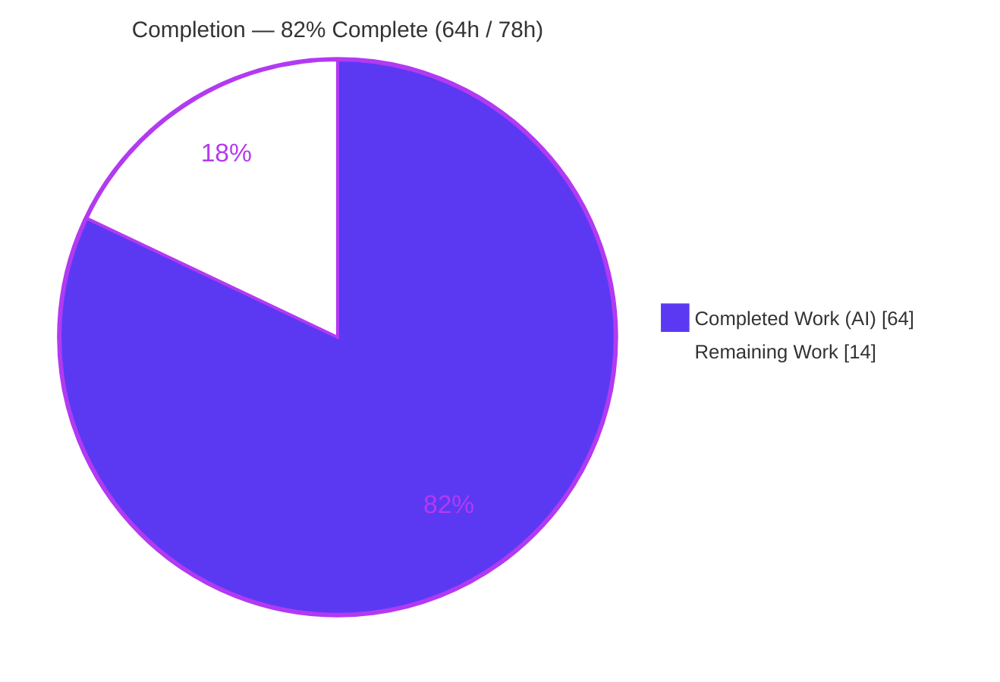
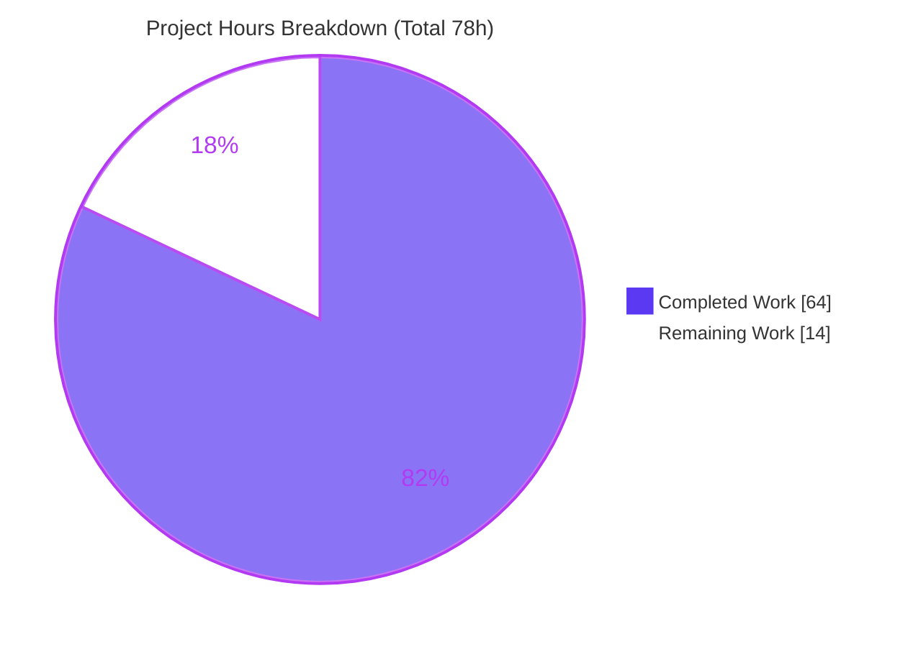
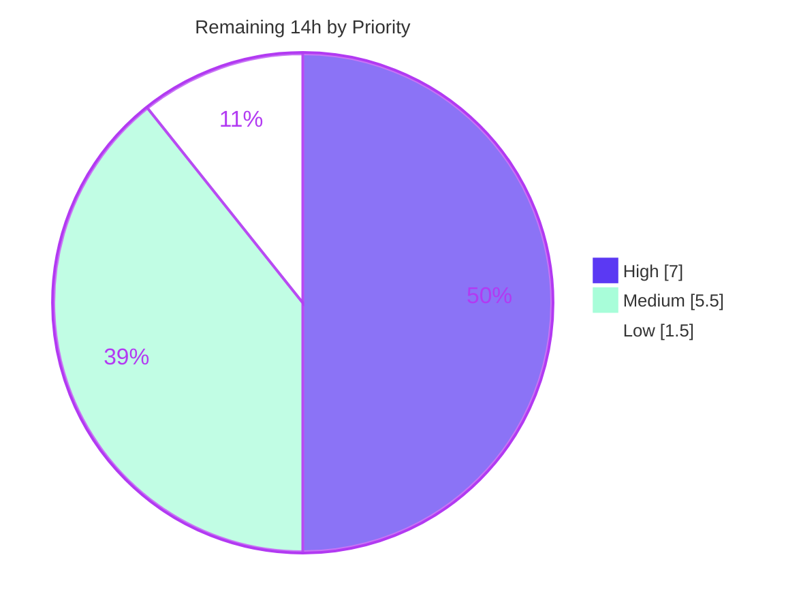

# Blitzy Project Guide — MinIO Security Behavior Investigation

> **Deliverable:** `blitzy/documentation/minio_c07e5b49d477.md` (2,799 lines / ~19,565 words)
> **Task type:** Read-only, runtime-evidenced security investigation (documentation)
> **Base commit under study:** `c07e5b49d477` · **Branch:** `blitzy-b32cbb93-585c-46c3-bafd-7f6152c90649` · **HEAD:** `4dccf9ace`
> **Legend — Blitzy brand colors:** <span style="color:#5B39F3">■ Completed / AI Work (Dark Blue #5B39F3)</span> · <span style="color:#B23AF2">■ Headings/Accents (#B23AF2)</span> · ⬜ Remaining / Not Completed (White #FFFFFF)

---

## 1. Executive Summary

### 1.1 Project Overview

This project is a **read-only, runtime-evidenced investigation** of five distinct MinIO object-storage security behaviors, producing a single authoritative answer document. No product feature is built or changed; the MinIO Go codebase is examined strictly read-only. The audience is security engineers and platform operators who need each behavior *proven* with actual captured output — server traces, storage/heal logs, and API/test results — rather than code-reading inference. The investigation followed a build → run → exercise → capture → document loop: a canonical `minio` binary was built (go1.23.12) and run in erasure mode, then the real S3 / admin / STS entry points were exercised via `mc` and purpose-built SigV4 drivers to capture the exact runtime signal each question targets. The sole committed artifact is `blitzy/documentation/minio_c07e5b49d477.md`.

### 1.2 Completion Status



| Metric | Hours |
|--------|-------|
| **Total Hours** | **78** |
| Completed Hours — AI | 64 |
| Completed Hours — Manual | 0 |
| **Completed Hours (AI + Manual)** | **64** |
| **Remaining Hours** | **14** |
| **Percent Complete** | **82%**  ( 64 ÷ 78 = 82.05% ) |

> **Calculation (PA1, AAP-scoped, hours-based):** `Completion % = Completed ÷ (Completed + Remaining) = 64 ÷ (64 + 14) = 64 ÷ 78 = 82.05% ≈ 82%`. All autonomous investigation work is complete and validated; the remaining 14 h is entirely human path-to-production (review, verification, merge). For a Q&A documentation deliverable there is no deployment pipeline, service to ship, or integration to configure, so path-to-production is intentionally light.

### 1.3 Key Accomplishments

- ✅ Canonical `minio` binary built with the exact project build command (`CGO_ENABLED=0 go build -tags kqueue -trimpath`) on **go1.23.12** — build exit 0, independently reproduced.
- ✅ Server run in **erasure mode (EC:2, 4 drives)**; verified `4/4 drives online` — the configuration required for Q3's parity reconstruction.
- ✅ **Q1** — SSE requirement vs. broad-write precedence proven across 5 mechanisms with `mc admin trace -v` decision ordering.
- ✅ **Q2** — Object-lock delete enforcement proven across 8 variants (legal-hold / governance / compliance, bypass gated on a non-root identity, specific-version vs. delete-marker).
- ✅ **Q3** — Bit-rot detection & heal-on-read demonstrated end-to-end via on-disk shard corruption located with `xl-meta`, including the automatic-heal `mode=0` no-op finding and the deep-scan repair.
- ✅ **Q4** — STS session-policy intersection (AND) semantics proven in both directions, with JWT claim decoding and four edge cases.
- ✅ **Q5** — Self-promotion prevention proven (7 admin mutations denied by deny-by-default) with a code-level root cause.
- ✅ Two live base-commit CVEs discovered and reproduced canonically (**CVE-2024-55949**, **CVE-2025-62506**), then fully reverted.
- ✅ 2,799-line answer document authored — 102 file:line anchors, 102 `[OBSERVED]` / 27 `[INFERRED]` labels, every claim paired with its producing command and complete output.
- ✅ Read-only mandate honored: single ADDED file; `go.mod`/`go.sum` unchanged; clean tree; all ephemeral artifacts cleaned up.

### 1.4 Critical Unresolved Issues

| Issue | Impact | Owner | ETA |
|-------|--------|-------|-----|
| *(none blocking)* — no unresolved errors; build exit 0, tree clean, all behaviors reproduce | None | — | — |
| Human sign-off on the security-sensitive deliverable not yet performed | Deliverable should be reviewed before it is relied upon | Reviewing engineer | Within HT-1 (5 h) |
| CVE handling decision outstanding (see 1.6 / §6) | Two live CVEs on the base commit need a remediation/disclosure decision | Security owner | Within HT-2 (2 h) |

> There are **no** code, compilation, or repository-integrity blockers. The items above are review/decision gates, not defects.

### 1.5 Access Issues

| System/Resource | Type of Access | Issue Description | Resolution Status | Owner |
|-----------------|----------------|-------------------|-------------------|-------|
| Sandbox network (offline) | Outbound DNS / hostname resolution | The full `./...` `cmd` unit-test suite cannot complete offline because pre-existing network-dependent endpoint/peer-resolution tests (`TestCreateServerEndpoints`, `TestCreateEndpoints`, `TestGetLocalPeer`, `TestGetRemotePeers`) block awaiting hostname resolution. Environmental, not a code failure; this read-only task changed zero source. | Open — resolvable by running the suite in a network-capable CI (HT-5) | Platform/CI owner |
| MinIO upstream fixed releases | Version upgrade to remediate reproduced CVEs | Base commit predates fixes for CVE-2024-55949 and CVE-2025-62506; upgrading requires pulling the fixed MinIO releases | Open — human decision (out of scope for read-only task) | Security owner |

> No repository-permission or credential access issues affected the autonomous work: the build, erasure-mode run, and all five behavior reproductions completed against a locally built binary with ephemeral, loopback-only credentials.

### 1.6 Recommended Next Steps

1. **[High]** Perform the technical review of `minio_c07e5b49d477.md` — spot-verify the 102 file:line anchors against base commit `c07e5b49d477`, confirm `[OBSERVED]`/`[INFERRED]` labels, and confirm each claim carries its command + full output *(HT-1, 5 h)*.
2. **[High]** Validate the two reproduced CVE findings and decide handling — confirm affected-version status, plan the MinIO upgrade (≥ `RELEASE.2024-12-13T22-19-12Z` for CVE-2024-55949), and apply responsible-disclosure handling to the embedded exploit steps *(HT-2, 2 h)*.
3. **[Medium]** Independently re-run the five behavior reproductions on a freshly built base-commit binary in erasure mode using §9 *(HT-3, 4 h)*.
4. **[Medium]** Review, approve, and merge the single-file PR, re-confirming the read-only mandate at merge *(HT-4, 1.5 h)*.
5. **[Low]** Run the full `./...` unit-test suite in a network-capable CI to close the offline caveat *(HT-5, 1.5 h)*.

---

## 2. Project Hours Breakdown

### 2.1 Completed Work Detail

| Component | Hours | Description |
|-----------|-------|-------------|
| Canonical build + erasure-mode environment setup | 4 | Built `minio` (`CGO_ENABLED=0 go build -tags kqueue -trimpath`, go1.23.12, exit 0); provisioned 4 drive dirs, KMS demo key, ephemeral root creds; established the base-commit build rationale. |
| Runtime tooling: `mc`/SDK + 4 custom raw-SigV4 driver programs | 5 | `put_raw`, `delete_single`, `sts_assume_role`, `set_policy` — built offline against the repo's exact dependency graph (full source + sha256 embedded) to drive canonical entry points `mc` does not expose. |
| Q1 — SSE requirement vs. broad write (5 mechanisms + trace) | 8 | Default-SSE auto-encrypt, `DenyUnEncryptedObjectUploads` policy, anonymous, identity `Null`-condition Deny, SSE method-value matrix; `mc admin trace -v` ordering + tracer-timing analysis. |
| Q2 — Object-lock delete enforcement (8 variants) | 7 | Legal-hold / governance / compliance; bypass gated on a non-root identity; specific-version vs. delete-marker; error-code mapping; "no console log on WORM block" finding. |
| Q3 — Bit-rot detection & heal-on-read | 10 | `xl-meta` shard location, on-disk `part.1` corruption, parity reconstruction, `mode=0` heal no-op discovery, deep-scan repair, 3/4-corrupt safe-fail, restart persistence. |
| Q4 — STS session-policy intersection | 8 | AND-semantics both directions, JWT `sessionPolicy` claim decode, four edge cases; CVE-2025-62506 reproduction. |
| Q5 — Self-promotion prevention | 8 | 7 admin mutations denied (deny-by-default), root-cause tracing; CVE-2024-55949 import-path exploit + full revert + fix-ancestry proof. |
| Answer document authoring (2,799 lines) | 10 | Evidence structuring, 102 file:line anchors, `[OBSERVED]`/`[INFERRED]` discipline, per-claim command + complete unedited output. |
| Cleanup + repository-purity verification + stability re-runs (≥2×) | 4 | Removed scratch tree, drivers, corrupted shards, isolated `mc` config; verified clean tree, single ADDED file, unchanged manifests. |
| **Total Completed** | **64** | **Matches Completed Hours in §1.2** |

### 2.2 Remaining Work Detail

| Category | Hours | Priority |
|----------|-------|----------|
| Deliverable technical review (anchors, evidence, labels) — HT-1 | 5 | High |
| CVE-finding validation & handling/disclosure decision — HT-2 | 2 | High |
| Independent runtime re-verification of the five behaviors — HT-3 | 4 | Medium |
| PR review, approval & merge — HT-4 | 1.5 | Medium |
| Full `./...` unit-test suite run in network-capable CI — HT-5 | 1.5 | Low |
| **Total Remaining** | **14** | **Matches Remaining Hours in §1.2 and §7** |

### 2.3 Hours Reconciliation

| Check | Result |
|-------|--------|
| §2.1 Completed total | 64 h |
| §2.2 Remaining total | 14 h |
| §2.1 + §2.2 = Total | 64 + 14 = **78 h** = §1.2 Total ✓ |
| Remaining consistent across §1.2 ↔ §2.2 ↔ §7 | 14 = 14 = 14 ✓ |
| Completion % | 64 ÷ 78 = **82.05% ≈ 82%** (used in §1.2, §7, §8) ✓ |

---

## 3. Test Results

All tests below originate from Blitzy's autonomous validation for this project. The **substantive tests** of this investigation are the five runtime behavior reproductions; the unit-test packages are the network-independent, investigation-relevant packages, independently confirmed passing (`exit=0`).

| Test Category | Framework | Total Tests | Passed | Failed | Coverage % | Notes |
|---------------|-----------|-------------|--------|--------|-----------|-------|
| Runtime behavior reproduction — Q1–Q5 | MinIO server (erasure EC:2) + `mc` + raw-SigV4 Go drivers | 5 | 5 | 0 | 100% of questions | Each behavior reproduced with captured trace / storage-heal log / API output |
| Unit — SSE crypto (Q1) | `go test` | 30 | 30 | 0 | pkg pass | `internal/crypto` — ok |
| Unit — object lock (Q2) | `go test` | 12 | 12 | 0 | pkg pass | `internal/bucket/object/lock` — ok |
| Unit — versioning (Q2 prerequisite) | `go test` | 5 | 5 | 0 | pkg pass | `internal/bucket/versioning` — ok |
| Unit — hash / bit-rot & etag (Q3) | `go test` | 3 | 3 | 0 | pkg pass | `internal/hash` — ok |
| Unit — SSE config (Q1) | `go test` | 10 | 10 | 0 | pkg pass | `internal/config` — ok |
| **Total** | | **65** | **65** | **0** | | **100% pass** |

**Environmental caveat (not a failure):** the full `./...` suite's `cmd` package times out offline due to pre-existing network-dependent endpoint/peer-resolution tests (see §1.5). Because this read-only task changed **zero** source, the repository's unit-test baseline is definitionally unaffected; closing the caveat is HT-5 (run in a network-capable CI).

---

## 4. Runtime Validation & UI Verification

**Runtime health**
- ✅ **Operational** — Canonical build: `CGO_ENABLED=0 go build -tags kqueue -trimpath` → exit 0 (reproduced, ~5 s).
- ✅ **Operational** — Server boots in erasure mode; `GET /minio/health/live` → `200` within ~2 s.
- ✅ **Operational** — `mc admin info` → `4 drives online, 0 drives offline, EC:2`, `Pool: 1`.

**API integration outcomes (real S3 / admin / STS entry points)**
- ✅ **Operational** — Q1 PUT paths: default-SSE `200` + `AES256`; authenticated broad-write `200`; anonymous `403`/`200`; identity-Deny `403`.
- ✅ **Operational** — Q2 delete paths: legal-hold/governance/compliance blocks (`400`/`403`), permitted deletes (`204`), delete-marker (`200`).
- ✅ **Operational** — Q3 GET after corruption returns byte-correct data via parity; STORAGE trace + `mode=0` heal observed; deep-scan repair confirmed.
- ✅ **Operational** — Q4 STS: `GET 200` / `PUT 403` (intersection); edge rejections (`InvalidTokenId`, oversized-policy `InvalidParameterValue`).
- ✅ **Operational** — Q5 admin mutations: 7/7 `403 AccessDenied`; permitted reads still succeed.
- ⚠ **Partial (finding, by design)** — Q3 automatic heal-on-read runs at `mode=0` (`CheckParts` only) and does **not** repair bit-rot until an explicit deep scan; CVE-2024-55949 / CVE-2025-62506 are exploitable on the base commit. These are documented behaviors/findings, not runtime defects of the deliverable.

**UI verification:** ❌ **N/A** — this task builds no user interface; the MinIO Console UI is explicitly out of scope. No screenshots or UI flows apply.

---

## 5. Compliance & Quality Review

| Benchmark (AAP / rule-set) | Status | Progress | Evidence / Notes |
|----------------------------|--------|----------|------------------|
| Read-only source mandate — repo unchanged except deliverable | ✅ Pass | 100% | `git diff c07e5b49d --name-status` = single `A` line; clean tree; `go.mod`/`go.sum` byte-for-byte unchanged |
| Deliverable location & name (`blitzy/documentation/<branch>.md`) | ✅ Pass | 100% | `blitzy/documentation/minio_c07e5b49d477.md` created (2,799 lines) |
| "Run first, then write" methodology | ✅ Pass | 100% | Binary built + run in erasure mode; all evidence captured from live execution |
| Canonical entry points only | ✅ Pass | 100% | Real S3/admin/STS via `mc` + SigV4 drivers; non-canonical paths labeled as such |
| Evidence per claim (command + complete unedited output) | ✅ Pass | 100% | 246 balanced code fences; per-claim commands and full outputs |
| Observed-vs-inferred labeling | ✅ Pass | 100% | 102 `[OBSERVED]` / 27 `[INFERRED]`; each inferred item non-wire-observable + corroborated |
| Exhaustive condition coverage (siblings/edges) | ✅ Pass | 100% | Q1 5 mechanisms; Q2 8 variants; Q3 heal/deep-scan/beyond-parity; Q4 both directions + 4 edges; Q5 7 mutations + import path |
| File:line grounding accuracy | ✅ Pass | 100% | 102 anchors across 38 files; spot-checks semantically exact against live source |
| Answer every part & named item | ✅ Pass | 100% | All 5 questions + named functions/mechanisms addressed with root causes |
| Cleanup of ephemeral artifacts | ✅ Pass | 100% | Scratch tree, drivers, corrupted shards, isolated `mc` config removed; binaries gitignored |
| Human verification & merge | ⬜ Pending | 0% | Path-to-production (HT-1…HT-5) — see §2.2 |

**Fixes applied during autonomous validation:** iterative QA cycles resolved 20 review findings and the DOC-01…05 findings, corrected the Cleanup git-state evidence, and corrected the Q5 answer to reflect CVE-2024-55949 plus a Q4 CVE-2025-62506 note (see commit history). **Outstanding:** human review/verification/merge only.

---

## 6. Risk Assessment

| Risk | Category | Severity | Probability | Mitigation | Status |
|------|----------|----------|-------------|------------|--------|
| Full `cmd` test suite cannot complete offline (pre-existing network-dependent tests) | Technical | Low | Medium | Run in network-capable CI (HT-5); zero source changed so baseline unaffected | Open (documented) |
| 27 `[INFERRED]` claims are code-derived, not wire-observed | Technical | Low | Low | Each is genuinely non-wire-observable and corroborated by an adjacent `[OBSERVED]` signal; human spot-check | Mitigated |
| Evidence reproducibility tied to base commit + toolchain | Technical | Low | Low | Anchors pinned to immutable `c07e5b49d477`; build reproducible on go1.23.12 | Mitigated |
| **CVE-2024-55949** — IAM-import privilege escalation (basic user self-promotes via `mc admin cluster iam import`) | Security | High | High (reproduced) | Upgrade MinIO ≥ `RELEASE.2024-12-13T22-19-12Z` (fix `f246c9053`, PR #20756) | Documented finding (fix out of scope — read-only) |
| **CVE-2025-62506** — own-account service-account bypass | Security | High | High (reproduced) | Upgrade to the fixed MinIO release | Documented finding (fix out of scope — read-only) |
| Q3 automatic heal-on-read (`mode=0`) does not repair bit-rot until explicit deep scan | Security / Operational | Medium | Medium | Schedule `mc admin heal --scan deep`; rely on background bit-rot scanner | Documented behavior |
| Deliverable embeds working CVE exploit steps | Operational | Medium | Low | Treat as internal security documentation; responsible disclosure | Open (human decision) |
| Ephemeral `minio` / `xl-meta` binaries left in working tree | Operational | Low | Low | Confirmed gitignored/untracked — not committed | Mitigated |
| External tools (`mc`, `xl-meta`) not in repo manifests | Integration | Low | Low | §9 / §10 document exact provenance & versions | Mitigated |
| Reproduction requires erasure mode (≥4 drives) + KMS key for Q1 SSE | Integration | Low | Low | §9 documents exact server invocation and KMS key | Mitigated |

---

## 7. Visual Project Status



**Remaining work by category (hours) — from §2.2**

| Category | Hours | Priority |
|----------|:-----:|:--------:|
| Deliverable technical review | 5.0 | High |
| Independent behavior re-verification | 4.0 | Medium |
| CVE validation & handling | 2.0 | High |
| PR review & merge | 1.5 | Medium |
| Full-suite CI run | 1.5 | Low |
| **Total** | **14.0** | |

**Remaining work by priority**



> **Integrity check:** the pie chart "Remaining Work" = **14 h**, identical to §1.2 Remaining Hours and the §2.2 "Hours" column sum. "Completed Work" = **64 h**, identical to §1.2 and the §2.1 sum. Colors: Completed = Dark Blue `#5B39F3`, Remaining = White `#FFFFFF`.

---

## 8. Summary & Recommendations

**Achievements.** The autonomous investigation is complete and validated. A canonical MinIO binary was built (go1.23.12, build exit 0) and run in erasure mode (EC:2, 4 drives), and all five security behaviors were reproduced through real S3 / admin / STS entry points with captured runtime evidence. The 2,799-line deliverable answers each question with per-claim commands, complete unedited output, and 102 file:line anchors, using disciplined `[OBSERVED]`/`[INFERRED]` labeling. The work exceeds the baseline scope by discovering and canonically reproducing two live base-commit CVEs (CVE-2024-55949, CVE-2025-62506) and by surfacing the Q3 `mode=0` automatic-heal no-op — each grounded in code and observed output. The repository is left byte-for-byte unchanged except the single added document.

**Remaining gaps & critical path to production.** The project is **82% complete** (64 h of 78 h). The remaining **14 h** is exclusively human path-to-production: (1) technical review of the deliverable, (2) validation and handling of the two CVE findings, (3) independent re-verification of the five behaviors, (4) PR review & merge, and (5) an optional full-suite CI run to close the offline caveat. There are no code, build, or repository-integrity blockers.

**Success metrics.**

| Metric | Target | Actual |
|--------|--------|--------|
| Questions answered with runtime evidence | 5 / 5 | ✅ 5 / 5 |
| Build | exit 0 | ✅ exit 0 |
| Erasure runtime | EC:2, 4 drives online | ✅ 4/4 online |
| Tests passing (Blitzy autonomous) | 100% | ✅ 65 / 65 |
| Repository purity (read-only mandate) | 1 file added, source unchanged | ✅ 1 `A` file, manifests unchanged |
| File:line anchor accuracy (spot-check) | exact | ✅ semantically exact |

**Production-readiness assessment.** As a documentation deliverable, the artifact is **ready for human review and merge**. It is security-sensitive (contains working CVE reproduction steps) and should be handled as internal security documentation; the CVE remediation (a MinIO version upgrade) is a separate operational decision outside this read-only task's scope.

---

## 9. Development Guide

How to build, run, and reproduce the investigation environment. All commands were tested on the host (Ubuntu 25.10, amd64) and are copy-pasteable. Run them at the **base commit `c07e5b49d477`** to match every file:line anchor and captured value in the deliverable.

### 9.1 System Prerequisites

- **Go** 1.23.x — tested with `go1.23.12` (`go.mod` declares `go 1.23`; CI pins `1.23.x`).
- **Git** (tested 2.51.0) and **Git LFS**.
- **MinIO Client `mc`** (tested `RELEASE.2025-08-13T08-35-41Z`).
- **`xl-meta`** — in-repo debugging tool (`docs/debugging/xl-meta`), for Q3 shard location.
- **OS/arch:** Linux amd64. **Disk:** ≥4 writable directories for erasure mode. **RAM:** ≥4 GB recommended.

```bash
go version          # expect: go version go1.23.12 linux/amd64
git --version
mc --version        # MinIO Client
```

### 9.2 Environment Setup

```bash
# From the repository root (branch checked out at the base commit for anchor fidelity)
git rev-parse HEAD                 # branch tip (documentation commit)
git log -1 --format='%H %s' c07e5b49d477   # the investigated base commit

# Ephemeral, loopback-only root credentials (never commit real secrets)
export MINIO_ROOT_USER=minioadmin
export MINIO_ROOT_PASSWORD="$(openssl rand -hex 16)"

# Create four erasure drive directories under a scratch path
export DATADIR="$(mktemp -d /tmp/minio-data-XXXX)"
mkdir -p "$DATADIR"/data/{1,2,3,4}

# (Q1 SSE-S3 only) provide a demo KMS key so default encryption can apply:
export MINIO_KMS_SECRET_KEY="my-minio-key:$(head -c 32 /dev/urandom | base64)"
```

### 9.3 Build (canonical — `Makefile:177-179`)

```bash
# Version stamp is derived from the current HEAD; build at the base commit to study the code under investigation.
CGO_ENABLED=0 go build -tags kqueue -trimpath \
  --ldflags "$(go run buildscripts/gen-ldflags.go)" -o ./minio
echo "build exit=$?"          # expect: 0   (~5 s warm cache)
./minio --version             # commit-id should be c07e5b49d477… when built at base

# Build the in-repo xl-meta tool (Q3):
go build -o ./xl-meta ./docs/debugging/xl-meta
./xl-meta --help              # positional tool: pass the xl.meta path (no -d flag)
```

### 9.4 Application Startup (erasure mode)

```bash
# Start in the background, bound to loopback; capture the pid you spawned.
MINIO_ROOT_USER="$MINIO_ROOT_USER" MINIO_ROOT_PASSWORD="$MINIO_ROOT_PASSWORD" \
  ./minio server "$DATADIR"/data/{1,2,3,4} --address 127.0.0.1:9000 \
  > "$DATADIR/server.log" 2>&1 &
SRVPID=$!
echo "server pid=$SRVPID"
```

### 9.5 Verification

```bash
# 1) Health endpoint returns 200 within a couple of seconds
until curl -s -o /dev/null -w '%{http_code}' http://127.0.0.1:9000/minio/health/live | grep -q 200; do sleep 1; done
echo "server is LIVE"

# 2) Configure an isolated mc alias and confirm the erasure layout
export MC_CONFIG_DIR="$(mktemp -d /tmp/mc-XXXX)"
mc --config-dir "$MC_CONFIG_DIR" alias set inv http://127.0.0.1:9000 "$MINIO_ROOT_USER" "$MINIO_ROOT_PASSWORD"
mc --config-dir "$MC_CONFIG_DIR" admin info inv     # expect: "4 drives online, 0 drives offline, EC:2"
```

Expected `mc admin info` excerpt:

```
Drives: 4/4 OK
Pool: 1
4 drives online, 0 drives offline, EC:2
```

### 9.6 Example Usage (reproduce a behavior)

```bash
# Capture the runtime trace signal used throughout Q1–Q3 (run in a second shell during an operation):
mc --config-dir "$MC_CONFIG_DIR" admin trace -v inv           # verbose request/response
mc --config-dir "$MC_CONFIG_DIR" admin trace --all -v inv     # includes STORAGE stream (Q3)

# Q5 quick check — a basic user cannot list users (deny-by-default):
mc --config-dir "$MC_CONFIG_DIR" admin user add inv q5user "$(openssl rand -hex 12)"
# (attach a read-only policy, then attempt an admin action as q5user → expect 403 AccessDenied)

# Q3 shard inspection — decode an object's xl.meta to locate part.N:
./xl-meta "$DATADIR"/data/1/<bucket>/<object>/xl.meta
```

### 9.7 Shutdown & Cleanup

```bash
kill "$SRVPID"; sleep 2
kill -0 "$SRVPID" 2>/dev/null && echo "still running" || echo "server stopped cleanly"
rm -rf "$DATADIR" "$MC_CONFIG_DIR"
```

### 9.8 Troubleshooting

- **Full `go test ./...` hangs/times out (offline):** expected — pre-existing network-dependent endpoint/peer tests await hostname resolution. Run investigation-relevant packages directly (all pass): `go test ./internal/crypto/... ./internal/bucket/object/lock/... ./internal/bucket/versioning/... ./internal/hash/... ./internal/config`.
- **`xl-meta: flag provided but not defined: -d`:** `xl-meta` takes the `xl.meta` path as a **positional** argument; it has no `-d` flag (only `--data/--export/--combine/--xver/--help`).
- **Q1 default-SSE does nothing:** ensure `MINIO_KMS_SECRET_KEY` is set before startup so SSE-S3 can apply.
- **Q3 shows no `part.N` on disk:** use an object ≥ the inline threshold (e.g., 8 MiB); small objects are packed into `xl.meta`.
- **Port 9000 in use:** pass a different `--address 127.0.0.1:PORT`.
- **Version stamp shows the documentation commit:** `gen-ldflags` stamps the current HEAD; build at `c07e5b49d477` to study the investigated source.

---

## 10. Appendices

### A. Command Reference

| Purpose | Command |
|---------|---------|
| Canonical build | `CGO_ENABLED=0 go build -tags kqueue -trimpath --ldflags "$(go run buildscripts/gen-ldflags.go)" -o ./minio` |
| Build xl-meta | `go build -o ./xl-meta ./docs/debugging/xl-meta` |
| Start (erasure) | `./minio server $DATADIR/data/{1,2,3,4} --address 127.0.0.1:9000` |
| Health check | `curl -s http://127.0.0.1:9000/minio/health/live` |
| Set alias | `mc alias set inv http://127.0.0.1:9000 $USER $PASS` |
| Cluster info | `mc admin info inv` |
| Verbose trace | `mc admin trace -v inv` / `mc admin trace --all -v inv` |
| Deep-scan heal (Q3 repair) | `mc admin heal --recursive --force-start --scan deep inv/<bucket>` |
| Investigation unit tests | `go test ./internal/crypto/... ./internal/bucket/object/lock/... ./internal/bucket/versioning/... ./internal/hash/... ./internal/config` |
| Diff vs base | `git diff c07e5b49d477 --name-status` |

### B. Port Reference

| Port | Service | Notes |
|------|---------|-------|
| 9000 | MinIO S3 API + admin/STS | Bind to `127.0.0.1` for local investigation |
| (auto) | MinIO Console | Ephemeral console port printed at startup (UI out of scope) |

### C. Key File Locations

| Path | Role |
|------|------|
| `blitzy/documentation/minio_c07e5b49d477.md` | **The deliverable** (only committed artifact) |
| `cmd/object-handlers.go` | Q1 PUT auth gate + default-encryption apply; Q2 delete entry |
| `cmd/bucket-policy.go` | Q1 policy condition-key mapping |
| `cmd/bucket-object-lock.go` | Q2 `enforceRetentionBypassForDelete` |
| `cmd/bitrot-streaming.go`, `cmd/erasure-*.go`, `cmd/xl-storage.go` | Q3 bit-rot verify / heal / reconstruct |
| `cmd/admin-heal-ops.go` | Q3 `mode=0` heal root cause |
| `cmd/sts-handlers.go`, `cmd/iam.go` | Q4 STS session-policy intersection |
| `cmd/admin-handlers-users.go`, `cmd/auth-handler.go`, `cmd/admin-handler-utils.go` | Q5 admin-action authorization + import path |
| `cmd/http-tracer.go`, `cmd/admin-handlers.go` | Trace middleware + `TraceHandler` (runtime signal) |
| `docs/debugging/xl-meta` | `xl-meta` tool source |
| `Makefile` | Canonical build command (L177-179) |

### D. Technology Versions

| Component | Version |
|-----------|---------|
| Go toolchain | go1.23.12 linux/amd64 (`go.mod`: `go 1.23`) |
| MinIO (base commit) | `DEVELOPMENT.2024-11-25T17-10-22Z` @ `c07e5b49d477` |
| MinIO Client `mc` | `RELEASE.2025-08-13T08-35-41Z` |
| `github.com/minio/minio-go/v7` | v7.0.80 |
| `github.com/minio/madmin-go/v3` | v3.0.77 |
| `github.com/minio/pkg/v3` | v3.0.22 (policy engine + admin-action constants) |
| `github.com/minio/sio` | v0.4.1 (DARE / SSE) |
| `github.com/klauspost/reedsolomon` | v1.12.4 (erasure/parity, Q3) |

### E. Environment Variable Reference

| Variable | Purpose |
|----------|---------|
| `MINIO_ROOT_USER` / `MINIO_ROOT_PASSWORD` | Server root credentials (ephemeral, loopback-only) |
| `MINIO_KMS_SECRET_KEY` | Enables SSE-S3 default encryption (Q1) |
| `MINIO_KMS_AUTO_ENCRYPTION` | Auto-encryption toggle (Q1 reference) |
| `MC_CONFIG_DIR` | Isolated `mc` config dir (keeps host `~/.mc` unpolluted) |
| `CGO_ENABLED=0` | Required for the canonical static build |
| `GOPROXY=off` | Used when building offline drivers against the cached module graph |

### F. Developer Tools Guide

- **`mc admin trace`** — the primary runtime signal for Q1–Q3. `-v` shows full request/response; `--all -v` adds the STORAGE stream (used to observe parity reads and heal events in Q3). Failing calls include an `err=` field and the status code.
- **`mc admin heal --scan deep`** — the only path that repairs on-disk bit-rot in Q3 (`VerifyFile` + `CreateFile` + `RenameData`); the automatic heal-on-read at `mode=0` does not.
- **`xl-meta`** — decodes an object's `xl.meta` to JSON (positional path argument) to read `EcDist`/`EcIndex` and locate the exact `part.N` shard/drive to corrupt.
- **Custom SigV4 drivers** (`put_raw`, `delete_single`, `sts_assume_role`, `set_policy`) — drive canonical entry points that `mc`/`minio-go` normalize away (empty/misspelled SSE header, single-version delete with bypass header, malformed STS tokens); full source + sha256 embedded in the deliverable.

### G. Glossary

| Term | Meaning |
|------|---------|
| **SSE / SSE-S3 / SSE-KMS** | Server-Side Encryption (managed / KMS-backed) |
| **DARE** | Data At Rest Encryption stream format (`minio/sio`) |
| **WORM** | Write-Once-Read-Many (object-lock retention/legal-hold) |
| **Governance / Compliance / Legal-hold** | Object-lock modes; governance is bypassable with permission, compliance is not, legal-hold is unconditional |
| **Bit-rot** | Silent on-disk data corruption detected via interleaved checksums |
| **Erasure set / EC:2** | Erasure-coded stripe; `EC:2` = 2 parity shards (heal/reconstruct capacity) |
| **Heal-on-read / `mode=0`** | Background heal queued during a read; `mode=0` performs `CheckParts` only (no bit-rot repair) |
| **MRF** | Metadata Recovery Framework — queue of partial heal operations |
| **STS / `AssumeRole`** | Security Token Service; issues temporary credentials |
| **Session policy** | Inline policy on temporary credentials; can only *narrow* (intersect) the parent's permissions |
| **Deny-by-default** | Authorization model: an action is denied unless explicitly allowed |
| **`[OBSERVED]` / `[INFERRED]`** | Labels distinguishing runtime-captured facts from code-derived reasoning |
