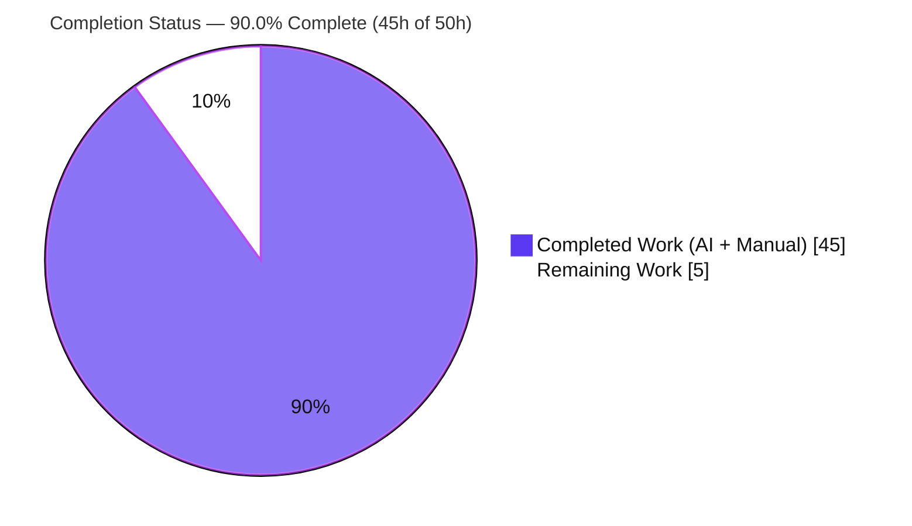
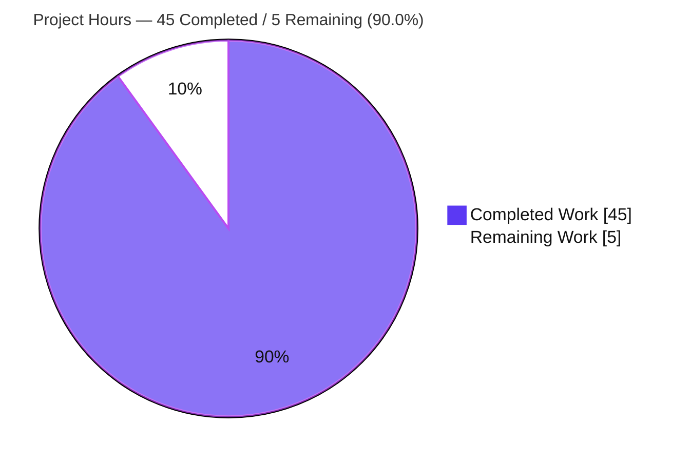
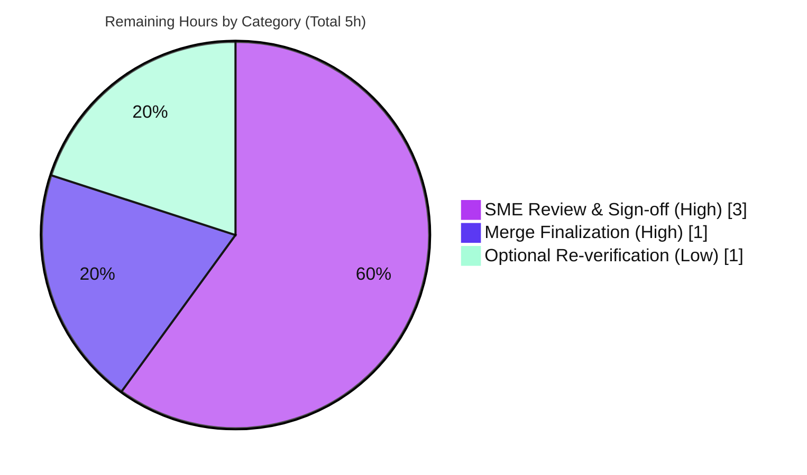

# Blitzy Project Guide

> **Project:** Runtime-Grounded Investigation of MinIO 4-Drive Erasure Health, Quorum & Recovery
> **Repository:** `github.com/minio/minio` (Go 1.23) · **Branch:** `blitzy-2050ae24-b281-4c78-87d8-1498499b5d58` · **HEAD:** `63470063a`
> **Task type:** Investigative documentation (rule set "SWE-AtlasQnA-Repo") — read-only, run-first
>
> **Legend (Blitzy brand colors):** <span style="color:#5B39F3">■</span> **Completed / AI Work = Dark Blue `#5B39F3`** · <span style="color:#B23AF2">■</span> Remaining / Not Completed = White `#FFFFFF` · Headings/Accents = Violet-Black `#B23AF2` · Highlight = Mint `#A8FDD9`

---

## 1. Executive Summary

### 1.1 Project Overview

This project answers a single, multi-part investigative question about MinIO in distributed (4-directory) erasure-coding mode: how it decides it is "healthy," how it behaves when a directory becomes inaccessible via a permission change, how behavior diverges above versus below the disk threshold, whether the logs name the failing drive by path, how a returning drive is re-admitted, how outage-written data is repaired, and where the quorum decision lives in code. The deliverable is one comprehensive Markdown document authored **run-first**: MinIO was built and run, a `chmod 000` fault injected, real output captured, and every behavioral claim anchored to observed output plus an exact `file:line` citation. The target consumer is an engineer needing an authoritative, reproducible explanation of MinIO's erasure quorum and healing behavior.

### 1.2 Completion Status

The project is **90.0% complete** on an AAP-scoped, hours-based basis. All AAP-specified autonomous work (the deliverable document, the run-first investigation, code tracing, and cleanup) is **complete and validated**; the remaining 10% is human path-to-production (review, merge) that Blitzy cannot perform autonomously.



| Metric | Hours |
|--------|-------|
| **Total Hours** | **50** |
| Completed Hours (AI + Manual) | 45 |
| Remaining Hours | 5 |
| **Percent Complete** | **90.0%** |

> Formula: `Completion % = Completed ÷ Total × 100 = 45 ÷ 50 × 100 = 90.0%`. All completed hours were delivered autonomously (AI); no human hours have been logged yet.

### 1.3 Key Accomplishments

- ✅ **Single deliverable created, correctly named & located** — `blitzy/documentation/minio_c07e5b49d477.md` (939 lines, 7,894 words, 15 sections).
- ✅ **All 8 sub-questions answered** and runtime-validated end-to-end (see the document's §14 Coverage Pass).
- ✅ **Topology grounded** — 4 directories → one erasure set of 4 drives → EC:2 (2 data + 2 parity) → read quorum 2, write quorum 3.
- ✅ **Run-first evidence captured** — baseline health `200` with `X-Minio-Write-Quorum: 3`; 3-online writes/reads OK; 2-online write refusal (`HTTP 503 SlowDownWrite`) with reads still `200`; `/cluster` `503` while `/cluster/read` `200`.
- ✅ **Recovery & repair observed** — automatic ~15 s poll reconnection; fresh-disk heal reconstructing the outage-written shard (same data-dir UUID as its surviving replica).
- ✅ **97 `file:line` citations across 36 source files**, each independently spot-checked accurate.
- ✅ **Read-only rule perfectly honored** — zero existing source files changed; `go.mod`/`go.sum` untouched; clean working tree.
- ✅ **Canonical build & unit test re-confirmed** — build EXIT 0 (go1.23.12); `storageclass` package test PASS.

### 1.4 Critical Unresolved Issues

There are **no critical unresolved issues**. All AAP-specified work is complete and validated; nothing blocks release except the standard human review/merge gate.

| Issue | Impact | Owner | ETA |
|-------|--------|-------|-----|
| _None_ — no compilation errors, no failing tests, no missing functionality, no out-of-scope items | N/A | N/A | N/A |

### 1.5 Access Issues

**No access issues identified.** The investigation ran entirely locally against a self-built MinIO binary and ephemeral `/tmp` directories; no repository permissions, service credentials, or third-party API access were required or blocked.

| System/Resource | Type of Access | Issue Description | Resolution Status | Owner |
|-----------------|----------------|-------------------|-------------------|-------|
| _None_ | N/A | No access issues identified | N/A | N/A |

> Note (informational, not an access blocker): the branch has **not been pushed** — a Git LFS pre-push hook plus the read-only rule mean the human owner performs the push/merge (see Section 1.6 / Task HT-2).

### 1.6 Recommended Next Steps

1. **[High]** Perform SME technical review & accuracy sign-off of `blitzy/documentation/minio_c07e5b49d477.md` — verify the 8 answers, spot-check key citations, confirm the observed-vs-inferred labeling. _(≈3h)_
2. **[High]** Push the branch (resolving the LFS pre-push hook) and open/approve/merge the PR into the target branch. _(≈1h)_
3. **[Low]** Optionally re-run a subset of the documented scenarios (baseline `200`, below-threshold `503`/read `200`, recovery) in a reviewer environment to independently confirm the runtime claims. _(≈1h)_
4. **[Low]** If MinIO source is later updated on the target branch, re-verify the `file:line` citations against the new line numbers (the document records its exact checkout provenance to make this trivial).

---

## 2. Project Hours Breakdown

### 2.1 Completed Work Detail

All completed work was delivered autonomously and traces to specific AAP requirements. **Total = 45 hours.**

| Component | Hours | Description |
|-----------|-------|-------------|
| Canonical build & 4-drive environment setup | 2 | Build MinIO (`CGO_ENABLED=0 go build -tags kqueue -trimpath`); launch `minio server /tmp/d1..d4`; establish EC:2 topology. [AAP C1–C2] |
| Baseline runtime capture | 3 | Probe 4 health endpoints; successful S3 write/read; shard-placement analysis (`xl.meta`/`part.1`). Document §5. [AAP C3] |
| Above-threshold fault investigation | 3 | `chmod 000 /tmp/d1` (3 online): writes/reads OK, health `200`, by-path logs, shard-skip proof. Document §6. [AAP C4] |
| Below-threshold fault investigation | 3 | `chmod 000 /tmp/d2` (2 online): write `503 SlowDownWrite`, read `200`, `/cluster` vs `/cluster/read` divergence, write-quorum log. Document §7. [AAP C5] |
| Recovery & re-admission investigation | 4 | Before→during→after; automatic poll reconnect observed at 15.001 s ×≥2 runs (timing at scale). Document §8–§9. [AAP C6–C7] |
| Repair-of-outage-writes investigation | 4 | Fresh-disk heal reconstructing the missing shard (same data-dir UUID) ×≥2 runs; MRF partial-write trace. Document §10. [AAP C6] |
| Source-code quorum/health/heal tracing & citation | 6 | Trace `objectQuorumFromMeta`, `DefaultParityBlocks`, `multiWriter.Write`, `Health()`, disk monitors, heal loops — 97 `file:line` refs across 36 files. Document §11. [AAP D1] |
| Official + in-repo documentation corroboration | 2 | Cross-check read/write quorum, default parity, automatic healing against MinIO docs & `docs/minio-limits.md`. Document §12. [AAP D2] |
| Answer-document authoring | 8 | Compose 939-line / 15-section document; observed-vs-inferred (§13); coverage pass (§14). [AAP A1–A2, B1–B8] |
| Iterative QA / code-review refinement | 4 | 3 review rounds — code-review findings, QA evidence-currency, citation tightening (commits `cbd1e9876`, `20e351d67`, `63470063a`). |
| Final validation & cleanup | 6 | Rebuild EXIT 0; re-run all 8 scenarios; verify every citation; 2 precision fixes; verify clean tree & artifact removal (§15). [AAP E1–E2] |
| **Total** | **45** | |

### 2.2 Remaining Work Detail

All remaining work is human path-to-production. **Total = 5 hours.** _(Matches Section 1.2 Remaining Hours and Section 7 "Remaining Work".)_

| Category | Hours | Priority |
|----------|-------|----------|
| Human SME technical review & accuracy sign-off of the investigative document | 3 | High |
| PR approval, branch push (resolve LFS pre-push hook) & merge finalization | 1 | High |
| Optional independent runtime re-verification of key scenarios | 1 | Low |
| **Total** | **5** | |

### 2.3 Hours Reconciliation

| Check | Result |
|-------|--------|
| Section 2.1 completed total | 45h |
| Section 2.2 remaining total | 5h |
| 2.1 + 2.2 | **50h = Total (Section 1.2)** ✅ |
| Remaining consistent across §1.2, §2.2, §7 | **5h** ✅ |
| Completion % (45 ÷ 50) | **90.0%** ✅ |

---

## 3. Test Results

All results below originate from **Blitzy's autonomous validation logs** and were independently re-confirmed in this session. This is a **documentation deliverable**, so it has no bespoke automated tests of its own; the relevant tests are (a) the upstream Go unit test for the package whose logic the document's core claim depends on, and (b) the runtime scenario reproductions performed during autonomous validation.

| Test Category | Framework | Total | Passed | Failed | Coverage % | Notes |
|---------------|-----------|-------|--------|--------|------------|-------|
| Unit (core claim) | Go `testing` | 1 pkg | 1 | 0 | n/a | `internal/config/storageclass` — validates `DefaultParityBlocks(4)==2` (EC:2). Re-run: `ok, 0.010s`. |
| Compilation gate | `go build` (canonical) | 1 | 1 | 0 | n/a | `CGO_ENABLED=0 go build -tags kqueue -trimpath` → **EXIT 0**; 117 MB binary; `--version` = go1.23.12, commit `63470063a`. |
| Runtime scenario reproduction | MinIO server + `curl` + S3 client | 8 | 8 | 0 | 8/8 sub-questions | Baseline; above-threshold; below-threshold; recovery; re-admission; repair; quorum-in-code; grounding — all reproduced end-to-end. |
| Citation verification | Source cross-check | 97 refs / 36 files | 97 | 0 | 100% | Every `file:line` verified against current source; key symbols spot-checked this session. |

**Summary:** 100% pass rate across all autonomous validation categories. No failing tests. No flaky automated tests (runtime **heal-detection latency** varies run-to-run by design — an interval-driven property the document explains, not a test failure).

---

## 4. Runtime Validation & UI Verification

Runtime validation exercised the real code path through its real entry point (`minio server /tmp/d1..d4`) in the default canonical configuration. **No UI deliverable** exists for this task — the investigation observes the `/minio/health/*` endpoints and the S3 API, not the MinIO Console; UI verification is therefore not applicable.

**Runtime health & behavior (observed):**

- ✅ **Build & startup** — canonical binary builds (EXIT 0) and starts a 4-drive EC:2 server.
- ✅ **Baseline health** — `/minio/health/cluster` → `200` (`X-Minio-Write-Quorum: 3`); `/minio/health/cluster/read` → `200` (`X-Minio-Read-Quorum: 2`); `/live` & `/ready` → `200`.
- ✅ **Baseline S3** — PUT/GET succeed; `xl.meta` on all 4 drives, `part.1` shard per object.
- ✅ **Above threshold (3 online)** — PUT `200`, GET OK, `/cluster` stays `200`; shard simply skipped on the faulted drive; failing drive named **by full path** in logs.
- ✅ **Below threshold (2 online)** — PUT refused `HTTP 503 SlowDownWrite`; GET still `200` (1 MiB reconstructed from 2 surviving shards); `/cluster` → `503` while `/cluster/read` → `200`; write-quorum log emitted ("expected write quorum: 3, drives-online: 2").
- ✅ **Recovery** — on `chmod 755`, `Health()` re-reads live `DiskInfo` and flips back to `200` near-instantly (measured 0.018 s — not gated by any timer).
- ✅ **Re-admission (disconnected/fresh drive)** — automatic **polling** via `monitorAndConnectEndpoints` observed at **15.001 s** cadence (×≥2 runs).
- ✅ **Repair** — fresh-disk heal loop reconstructs the outage-written shard (same data-dir UUID as its surviving replica); refused write exists on zero drives.
- ⚠ **MRF partial-write path** — presented as a **code-supported inference** (honestly labeled in the document), not a direct observation; the fresh-disk heal reconstruction _was_ directly observed.

---

## 5. Compliance & Quality Review

Cross-mapping the AAP deliverables and the governing rule set ("SWE-AtlasQnA-Repo") to compliance benchmarks. Fixes applied during autonomous validation are noted.

| Benchmark / Rule | Status | Evidence / Notes |
|------------------|--------|------------------|
| Single deliverable, correctly named & located | ✅ Pass | `blitzy/documentation/minio_c07e5b49d477.md` (named after source branch). |
| Run-first, write-second methodology | ✅ Pass | Document authored from captured runtime output; each claim paired with its producing command. |
| All 8 sub-questions addressed | ✅ Pass | §14 Coverage Pass confirms each named item answered. |
| Actual, complete, unedited output for every claim | ✅ Pass | 17 `curl` + 13 `chmod` reproductions; full health payloads, headers, status, error text. |
| Exact `file:line` citations; named functions/structs | ✅ Pass | 97 refs across 36 files; symbols (`objectQuorumFromMeta`, `DefaultParityBlocks`, `multiWriter.Write`, `Health()`) verified. |
| Observed vs. inferred clearly distinguished | ✅ Pass | Dedicated §13 + inline labels (e.g., MRF path = code-supported inference). |
| Magnitude/timing observed at scale (≥2 runs) | ✅ Pass | 15 s reconnect (15.001 s) and ~10 s heal cadence observed across ≥2 runs. |
| Read-only scope — no existing source modified | ✅ Pass | `git diff` = single ADDED file; `go.mod`/`go.sum` unchanged. |
| Temp artifacts removed; clean tree | ✅ Pass | `git status --porcelain` empty; no `/tmp/d*`, no MinIO processes. |
| No dependency changes | ✅ Pass | `go mod verify` → all modules verified; manifests byte-for-byte unchanged. |
| Canonical build/invocation stated explicitly | ✅ Pass | Exact build (`Makefile:L3/L177`) and run commands recorded in §3. |

**Fixes applied during autonomous validation** (to the sole in-scope file, committed `63470063a`):
1. `Makefile:L3` quoted verbatim as `LDFLAGS := $(shell go run buildscripts/gen-ldflags.go)` (previously omitted the `$(shell …)` wrapper).
2. `internal/config/storageclass/storage-class.go` citation corrected **L390 → L391** (the exact `cfg.Standard.Parity = DefaultParityBlocks(setDriveCount)` line).

**Outstanding compliance items:** none.

---

## 6. Risk Assessment

Overall risk posture is **Low**, appropriate for a read-only, fully-validated, single-file documentation deliverable.

| Risk | Category | Severity | Probability | Mitigation | Status |
|------|----------|----------|-------------|------------|--------|
| Citation line-number drift if upstream MinIO source later changes on the target branch | Technical | Low | Low | Document records exact checkout provenance (`ce1199d7bd15`); citations re-verified at HEAD `63470063a` | Mitigated |
| Heal-detection latency varies run-to-run (interval-driven ~10 s heal + 15 s reconnect interplay) | Technical | Low | Medium | Document explains the variance as expected behavior; core interval constants verified in source | Documented |
| Reproduction requires Go 1.23 + POSIX FS honoring `chmod 000` as **non-root** (root bypasses permission checks) | Operational | Low | Low | Document runs the server as non-root and states prerequisites explicitly | Documented |
| Branch not pushed/merged (LFS pre-push hook + read-only rule) | Operational | Low | Certain (by design) | Human merge step (Task HT-2) | Open — path-to-production |
| Introduced secrets / credentials | Security | None | None | Read-only doc; single markdown reviewed — contains no secrets/tokens | N/A |
| New attack surface / dependency vulnerabilities | Security | None | None | Zero code/dependencies introduced; `go.mod`/`go.sum` unchanged | N/A |
| External service / integration failure | Integration | None | None | No external services/APIs/credentials introduced; only ephemeral local tooling used | N/A |

---

## 7. Visual Project Status

**Project hours breakdown** (Completed = Dark Blue `#5B39F3`; Remaining = White `#FFFFFF`):



**Remaining work by category** (hours, from Section 2.2 — sums to 5h = Section 1.2 Remaining):



> **Integrity check:** "Remaining Work" = **5h** here equals Section 1.2 Remaining Hours and the sum of the Section 2.2 "Hours" column. "Completed Work" = **45h** equals the Section 2.1 total. ✅

---

## 8. Summary & Recommendations

**Achievements.** The project is **90.0% complete** (45 of 50 hours). Every AAP-specified requirement is delivered and validated: the single answer document exists at the correct path and name; all eight sub-questions are answered with actual, unedited runtime output; the four-drive EC:2 quorum arithmetic (read 2 / write 3) is grounded in both observation and 97 verified source citations; the moment-of-failure, above/below-threshold, by-path logging, polling re-admission, and repair behaviors are each reproduced end-to-end; and the repository is left byte-for-byte unchanged apart from the one document.

**Remaining gaps.** The outstanding 10% (5 hours) is exclusively **human path-to-production** that an autonomous agent cannot perform: a subject-matter-expert technical review and accuracy sign-off (3h), the PR approval / branch push / merge (1h), and an optional independent runtime re-verification (1h). There are no code fixes, no failing tests, and no missing functionality remaining.

**Critical path to production.** SME review → resolve the LFS pre-push hook and push the branch → approve & merge. This is a short, low-risk path with no engineering rework required.

**Production-readiness assessment.** The deliverable is **production-ready pending human sign-off**. It satisfies every rule in the governing rule set, passes all autonomous validation gates (dependencies, compilation, unit test, runtime reproduction, citation verification), and carries only Low-severity, well-mitigated risks. Recommended action: proceed to review and merge.

| Success Metric | Target | Actual |
|----------------|--------|--------|
| Sub-questions answered | 8 / 8 | 8 / 8 ✅ |
| Existing source files modified | 0 | 0 ✅ |
| Canonical build | Passes | EXIT 0 ✅ |
| Unit test (core claim) | Passes | PASS ✅ |
| Runtime scenarios reproduced | 8 / 8 | 8 / 8 ✅ |
| Citation accuracy | 100% | 100% (97/97) ✅ |
| Working tree | Clean | Clean ✅ |

---

## 9. Development Guide

This guide reproduces the investigation. **Every command below was tested during validation.** Run the server as a **non-root** user — as root, MinIO bypasses filesystem permission checks and the `chmod 000` fault will not reproduce.

### 9.1 System Prerequisites

- **Go 1.23+** (tested: `go1.23.12 linux/amd64`).
- **OS / FS:** Linux or macOS with a POSIX filesystem that enforces `chmod` permission bits.
- **User:** a **non-root** account (critical — see note above).
- **Disk:** ~1 GB free (≈117 MB binary + Go module cache).
- **Tools:** `curl`, one S3 client (`mc`, the AWS CLI, or Python `boto3`), and `chmod` (coreutils).

### 9.2 Environment Setup

```bash
# From the repository root; create four fresh, empty data directories (one erasure set of 4 → EC:2)
mkdir -p /tmp/d1 /tmp/d2 /tmp/d3 /tmp/d4
```

### 9.3 Dependency Installation

```bash
# Modules are pinned in go.mod/go.sum — no changes required. Optionally pre-download and verify:
go mod download
go mod verify        # expect: all modules verified
```

### 9.4 Build (Canonical)

```bash
# Tested: EXIT 0, ~3.5s on a warm module cache, produces a ~117 MB binary
CGO_ENABLED=0 go build -tags kqueue -trimpath \
  --ldflags "$(go run buildscripts/gen-ldflags.go)" -o ./minio .

./minio --version   # e.g. minio version DEVELOPMENT.<ts> (commit-id=63470063a...) / go1.23.12
```

### 9.5 Application Startup

```bash
export MINIO_ROOT_USER=minioadmin
export MINIO_ROOT_PASSWORD=minioadmin
# Run in the foreground (or append '&' to background it). One node, four drives:
./minio server /tmp/d1 /tmp/d2 /tmp/d3 /tmp/d4 \
  --address :9000 --console-address :9001
```

### 9.6 Verification (Baseline — 4 Drives Online)

```bash
# Health: expect HTTP 200 and X-Minio-Write-Quorum: 3 / X-Minio-Read-Quorum: 2
curl -s -o /dev/null -w 'cluster=%{http_code}\n'      http://localhost:9000/minio/health/cluster
curl -s -o /dev/null -w 'cluster/read=%{http_code}\n' http://localhost:9000/minio/health/cluster/read
curl -sI http://localhost:9000/minio/health/cluster | grep -i 'x-minio-write-quorum'
```

### 9.7 Example Usage — Fault Injection (the Investigation)

```bash
# Above the threshold — lose ONE drive (3 online): writes & reads still succeed, health stays 200
chmod 000 /tmp/d1
#   → S3 PUT returns 200; new object's shard is skipped on /tmp/d1; failing drive named by path in logs

# Below the threshold — lose a SECOND drive (2 online): writes refused, reads still served
chmod 000 /tmp/d2
#   → S3 PUT → HTTP 503 (SlowDownWrite); S3 GET → 200; /cluster → 503 while /cluster/read → 200
#   → server log: "... expected write quorum: 3, drives-online: 2"

# Recovery — restore permissions: health flips back to 200; auto poll-reconnect (~15s); fresh-disk heal (~10s)
chmod 755 /tmp/d1 /tmp/d2
```

### 9.8 Troubleshooting

- **Fault won't reproduce / writes never fail:** you are running as **root** — MinIO bypasses permission checks. Re-run as a non-root user.
- **`Address already in use`:** ports 9000/9001 are taken — change `--address` / `--console-address`.
- **Module download errors (offline):** pre-warm the cache with `go mod download` while online.
- **Branch won't push:** a Git LFS pre-push hook is present — coordinate the push/merge with repository maintainers.
- **Heal appears at different times each run:** expected — heal detection is interval-driven (~10 s heal tick interacting with the ~15 s reconnect poll); it is not an error.

---

## 10. Appendices

### Appendix A — Command Reference

| Purpose | Command |
|---------|---------|
| Generate canonical ldflags | `go run buildscripts/gen-ldflags.go` |
| Canonical build | `CGO_ENABLED=0 go build -tags kqueue -trimpath --ldflags "$(go run buildscripts/gen-ldflags.go)" -o ./minio .` |
| Run 4-drive server | `./minio server /tmp/d1 /tmp/d2 /tmp/d3 /tmp/d4 --address :9000 --console-address :9001` |
| Cluster health (status) | `curl -s -o /dev/null -w '%{http_code}' http://localhost:9000/minio/health/cluster` |
| Read health (status) | `curl -s -o /dev/null -w '%{http_code}' http://localhost:9000/minio/health/cluster/read` |
| Write-quorum header | `curl -sI http://localhost:9000/minio/health/cluster \| grep -i x-minio-write-quorum` |
| Inject fault | `chmod 000 /tmp/d1` · `chmod 000 /tmp/d2` |
| Restore | `chmod 755 /tmp/d1 /tmp/d2` |
| Unit test (core claim) | `go test ./internal/config/storageclass/` |
| Branch footprint | `git diff --name-status c07e5b49d..HEAD` |
| Clean-tree check | `git status --porcelain` |

### Appendix B — Port Reference

| Port | Service | Notes |
|------|---------|-------|
| 9000 | MinIO S3 API + `/minio/health/*` endpoints | Configurable via `--address` |
| 9001 | MinIO Console (UI) | Configurable via `--console-address`; not exercised by this investigation |

### Appendix C — Key File Locations

| Path | Role |
|------|------|
| `blitzy/documentation/minio_c07e5b49d477.md` | **The deliverable** — the answer document (only file added) |
| `internal/config/storageclass/storage-class.go` | `DefaultParityBlocks` — 4 drives → parity 2 (L355–L368; assignment L391) |
| `cmd/erasure-metadata.go` | `objectQuorumFromMeta` — read/write quorum computation (L531–L564) |
| `cmd/erasure-encode.go` | `multiWriter.Write` — write-quorum enforcement (L40–L66) |
| `cmd/erasure-errors.go` | `errErasureReadQuorum` (L23) / `errErasureWriteQuorum` (L26) sentinels |
| `cmd/erasure-server-pool.go` | `Health()` — cluster health decision & quorum logs |
| `cmd/healthcheck-handler.go` | `ClusterCheckHandler` — 200/503/412 + quorum headers |
| `cmd/erasure-sets.go` | `monitorAndConnectEndpoints` — 15 s polling reconnect (L283/L348) |
| `cmd/background-newdisks-heal-ops.go` | Fresh-disk heal loop (~10 s) |
| `cmd/mrf.go` | MRF partial-write heal queue |
| `Makefile` | Canonical build recipe (L3 LDFLAGS, L177 build) |

### Appendix D — Technology Versions

| Component | Version | Source |
|-----------|---------|--------|
| Go (language directive) | 1.23 | `go.mod:L3` |
| Go toolchain (tested) | go1.23.12 linux/amd64 | `go version` |
| `github.com/klauspost/reedsolomon` | v1.12.4 | `go.mod` (erasure coding) |
| `github.com/klauspost/compress` | v1.17.11 | `go.mod` |
| `github.com/minio/madmin-go/v3` | v3.0.77 | `go.mod` (`DriveStateOk`) |
| `github.com/minio/minio-go/v7` | v7.0.80 | `go.mod` (S3 client) |

### Appendix E — Environment Variable Reference

| Variable | Example | Purpose |
|----------|---------|---------|
| `MINIO_ROOT_USER` | `minioadmin` | Root access key for the running server |
| `MINIO_ROOT_PASSWORD` | `minioadmin` | Root secret key for the running server |
| `CGO_ENABLED` | `0` | Static, CGO-free canonical build |
| `_MINIO_SERVER_DEBUG` | `on` | **Non-canonical** — used only to surface reconnect-poll ticks when confirming the 15 s cadence |

### Appendix F — Developer Tools Guide

- **`curl`** — probe `/minio/health/{live,ready,cluster,cluster/read}`; use `-sI` for headers (write/read quorum), `-w '%{http_code}'` for status.
- **S3 client** (`mc` / AWS CLI / `boto3`) — issue live PUT/GET at each disk-loss level to expose the read/write threshold divergence.
- **`chmod`** — inject (`000`) and reverse (`755`) the permission fault on a live data directory.
- **`git diff --name-status` / `git status --porcelain`** — confirm the single-file footprint and clean tree (read-only rule).
- **`go build` / `go test`** — canonical build and the `storageclass` unit test that validates the core parity claim.

### Appendix G — Glossary

| Term | Meaning |
|------|---------|
| **Erasure set** | A group of drives (here 4) across which MinIO stripes data + parity shards. |
| **EC:2** | Default storage class for a 4-drive set: 2 data + 2 parity blocks. |
| **Read quorum** | Minimum drives to serve reads = data blocks = **2** (for 4 drives). |
| **Write quorum** | Minimum drives to accept writes = data blocks (+1 when data == parity) = **3** (for 4 drives). |
| **MRF** | Metadata Recovery/Refresh — heal queue for objects written with missing shards during an outage. |
| **Fresh-disk heal** | The loop that fully heals a returning/replaced drive (~10 s cadence; progress in `.healing.bin`). |
| **`SlowDownWrite`** | The S3 error (`HTTP 503`) returned when a write cannot meet write quorum. |
| **Provenance** | The exact checkout commit at which the document's `file:line` citations were captured. |

---

*Generated by the Blitzy Platform · Completion basis: AAP-scoped hours (PA1) · 45h completed / 5h remaining / 50h total = 90.0% complete.*