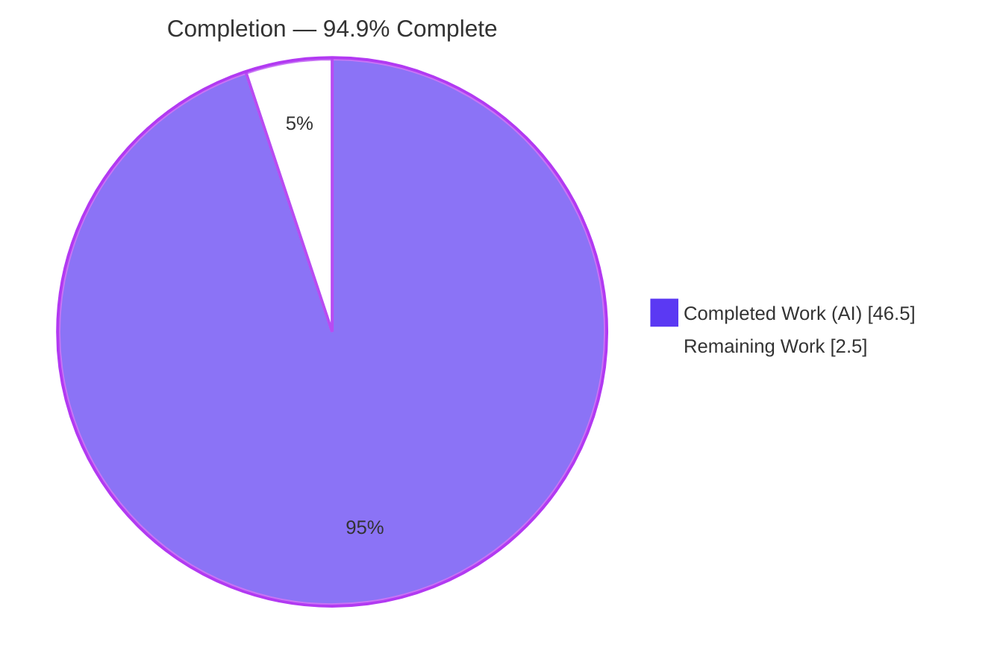
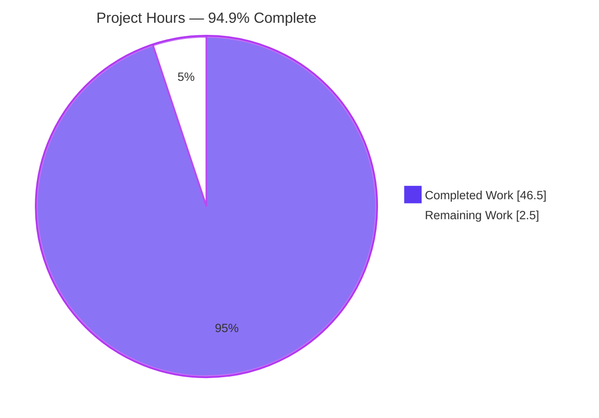
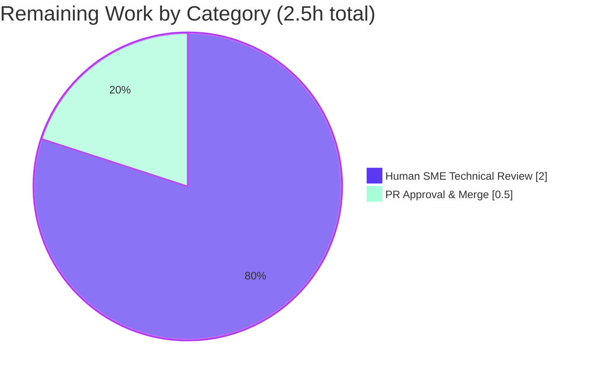

# Blitzy Project Guide — MinIO Drive-Failure Runtime Behavior Investigation

## 1. Executive Summary

### 1.1 Project Overview

This project delivers a single, evidence-grounded technical answer document explaining how MinIO behaves when erasure-coded drives become inaccessible at runtime in a four-directory deployment. It targets engineers evaluating MinIO for fault-tolerant storage. The document answers nine questions (Q1–Q9) — health/quorum determination, adapt-vs-refuse at the moment of drive loss, above- and below-threshold scenarios, path-level logging, live-recovery signals, polling-vs-push recovery, stale-object repair, the quorum-decision code location, and empirical grounding — pairing every behavioral claim with verbatim runtime output and every code claim with an exact `file:line` citation. It was produced by building and running the real MinIO binary and injecting permission faults, treating the source tree as strictly read-only.

### 1.2 Completion Status



_Legend: **Completed = Dark Blue `#5B39F3`**, **Remaining = White `#FFFFFF`**._

| Metric | Value |
|--------|-------|
| **Total Hours** | 49.0 |
| **Completed Hours (AI + Manual)** | 46.5 (46.5 AI + 0.0 Manual) |
| **Remaining Hours** | 2.5 |
| **Percent Complete** | **94.9%** |

> Completion is computed with the AAP-scoped hours methodology: `46.5 / (46.5 + 2.5) = 46.5 / 49.0 = 94.9%`. All 12 AAP-scoped deliverables are autonomously **completed and independently validated**; the remaining 2.5 hours are the inherent human path-to-production gate (technical review + PR merge), consistent with the never-claim-100% principle.

### 1.3 Key Accomplishments

- ✅ Authored the complete 736-line evidence-grounded answer document `blitzy/documentation/minio_c07e5b49d477.md`, exhaustively covering Q1–Q9.
- ✅ Built the real MinIO binary with the canonical recipe and ran it as a four-directory erasure server (`1 set(s), 4 drives per set`, default parity 2 → read quorum 2, write quorum 3).
- ✅ Reproduced **Scenario A** (one drive down, 3 online ≥ write quorum 3): real `PutObject` returns HTTP 200; health stays 200; failing disk logged by path.
- ✅ Reproduced **Scenario B** (two drives down, 2 online < write quorum 3): real `PutObject` refused with HTTP 503 `SlowDownWrite`; reads still succeed; `/minio/health/cluster` → 503 while `/minio/health/cluster/read` → 200.
- ✅ Confirmed self-driven recovery on `chmod 755` (no restart) and the ~15.0s reconnect-poll cadence, stable across two runs.
- ✅ Proved stale-object repair (MRF + heal): a shard missing on the down drive was **reconstructed** on restore (identical part-UUID across all four drives).
- ✅ Verified all 115 `file:line` citations across 24 source files resolve exactly at source revision `c07e5b49d477`.
- ✅ Preserved the read-only source mandate: **0 `.go` files changed, 0 non-`blitzy/` files changed**, working tree clean; all temporary artifacts removed.

### 1.4 Critical Unresolved Issues

| Issue | Impact | Owner | ETA |
|-------|--------|-------|-----|
| _None._ No compilation errors, no failing checks, no missing coverage. The deliverable is production-ready pending human review. | N/A | N/A | N/A |

> There are no blocking issues. The only outstanding work is the standard human review-and-merge gate itemized in Sections 1.6, 2.2, and the Risk Assessment (R3).

### 1.5 Access Issues

**No access issues identified.** The investigation ran entirely on the local host: the MinIO binary was built from the in-repo source, run against temporary local directories, and exercised via `127.0.0.1:9000` using default credentials (`minioadmin:minioadmin`). No repository permissions, service credentials, or third-party API access were required or blocked.

| System/Resource | Type of Access | Issue Description | Resolution Status | Owner |
|-----------------|----------------|-------------------|-------------------|-------|
| N/A | N/A | No access issues identified | N/A | N/A |

### 1.6 Recommended Next Steps

1. **[High]** Perform an SME technical read-through of the 736-line document for accuracy, Q1–Q9 completeness, and clarity (0.75h).
2. **[High]** Spot-check a representative sample of `file:line` citations against source revision `c07e5b49d477` (0.5h).
3. **[High]** Validate the key behavioral claims — optionally reproduce the health-endpoint quorum headers (3/2) and a Scenario-A/B write (0.75h).
4. **[Medium]** Approve the pull request and merge the deliverable branch; confirm the working tree remains clean (0.5h).

---

## 2. Project Hours Breakdown

### 2.1 Completed Work Detail

Each component traces to a specific AAP requirement (Q1–Q9, authoring, verification, compliance). All items are **completed and validated**.

| Component | Hours | Description |
|-----------|-------|-------------|
| A1 — Environment build & run harness | 3.0 | Build MinIO (canonical recipe), provision non-root `miniotester` user + temp data dirs, `s3op.py` (boto3) client harness, `curl` health probes |
| A2 — Q1/Q9 baseline observation | 2.0 | Healthy 4-drive baseline: `/minio/health/{cluster,cluster/read,live,ready}` 200s + quorum headers (3/2); real `PutObject`/`GetObject` |
| A3 — Q2/Q3 threshold scenarios (A above / B below) | 4.0 | Scenario A (1 dir `chmod 000`, writes continue) and Scenario B (2 dirs down, writes refused 503, reads persist) via real S3 path |
| A4 — Q4 path-tagged disk logging | 2.0 | Capture `printEndpointError` `endpoint=` path tag + full stack; `errDiskAccessDenied` literal for the `chmod 000` fault |
| A5 — Q5 live-recovery signals | 1.5 | Observe recovery signals while the server stays live (health + resumed writes on restore) |
| A6 — Q6 polling reconnect + ~15s timing | 3.5 | Confirm self-driven polling reconnect + `pushHealLocalDisks`; measure ~15.0s interval stable across 2 runs |
| A7 — Q7 stale-object repair (MRF + fresh-disk heal) | 4.0 | On-disk before/after proof of shard reconstruction; MRF `addPartialOp`/`healRoutine` + heal-on-read feed points |
| A8 — Q8 quorum-decision code trace | 4.0 | Trace K+1 rule at both sites (inline `putObject` + `objectQuorumFromMeta`), enforcement, default parity, `Health()` mirror |
| A9 — Deliverable authoring | 10.0 | Author the 736-line document: TL;DR, TOC, methodology, Q1–Q9, corroboration, 25-row coverage checklist |
| A10 — Citation verification | 3.0 | Verify all 115 `file:line` citations across 24 files resolve exactly at source rev `c07e5b49d477` |
| A11 — Read-only compliance + cleanup + git integrity | 1.5 | Remove binary/data/scripts/logs; confirm 0 `.go`/non-`blitzy` changes; clean `git status` |
| A12 — Autonomous validation & QA refinement | 8.0 | 4 review/QA cycles (code-review F1–F8, QA 1–4, Q7 label fix) + full independent reproduction |
| **Total Completed** | **46.5** | |

### 2.2 Remaining Work Detail

Each category is a standard path-to-production activity for a documentation deliverable. No AAP-scoped implementation work remains.

| Category | Hours | Priority |
|----------|-------|----------|
| Human SME Technical Review (read-through + citation spot-check + behavioral-claim validation) | 2.0 | High |
| PR Approval & Merge (merge branch, confirm clean working tree) | 0.5 | Medium |
| **Total Remaining** | **2.5** | |

### 2.3 Summary

| Bucket | Hours |
|--------|-------|
| Completed (Section 2.1) | 46.5 |
| Remaining (Section 2.2) | 2.5 |
| **Total Project (Section 1.2)** | **49.0** |
| **Percent Complete** | **94.9%** |

> Reconciliation: `46.5 (2.1) + 2.5 (2.2) = 49.0` = Total in Section 1.2. Remaining `2.5h` is identical in Sections 1.2, 2.2, and the Section 7 pie chart.

---

## 3. Test Results

This deliverable is a Markdown document and therefore has **no unit-test suite**. For an evidence-grounded document, the functional-test equivalent is **empirical reproduction** of every claim — building and running the real MinIO binary and confirming each behavior and citation. All checks below originate from Blitzy's autonomous validation logs for this project and were reproduced independently by the Final Validator.

| Test Category | Framework | Total Tests | Passed | Failed | Coverage % | Notes |
|---------------|-----------|-------------|--------|--------|------------|-------|
| Code Citation Verification | `grep`/`sed` cross-reference vs source rev `c07e5b49d477` | 115 | 115 | 0 | 100% (citations) | Every `file:line` across 24 files resolves exactly |
| Build & Compilation | `go build -tags kqueue` (CGO_ENABLED=0) | 2 | 2 | 0 | N/A | Canonical 117,293,208-byte binary + full-tree `./...` compile, 0 errors |
| Baseline Runtime (healthy) | `curl -sS -i` + `boto3` (SigV4) | 6 | 6 | 0 | N/A | 4 health endpoints → 200; real `PutObject`/`GetObject` (ETag + 1,048,576 bytes) |
| Scenario A — 1 drive down (above quorum) | `curl` + `boto3` | 3 | 3 | 0 | N/A | `PutObject` 200, `GetObject` 200, path-tagged disk-error log emitted |
| Scenario B — 2 drives down (below quorum) | `curl` + `boto3` | 6 | 6 | 0 | N/A | `PutObject` refused 503 `SlowDownWrite`; reads 200; health split (cluster 503 / read 200 / live 200); 404 on refused object |
| Recovery (self-driven) | `curl` + `boto3` | 2 | 2 | 0 | N/A | On `chmod 755`: health 503→200 and write resumes, no restart or manual heal |
| Reconnect Timing | debug tick (`_MINIO_SERVER_DEBUG=on`), 2 runs | 2 | 2 | 0 | N/A | ~15.0s interval stable across 2 runs (mean 14.998s; code = 10s + 5s) |
| Healing / MRF (stale object) | on-disk shard inspection + `boto3` | 4 | 4 | 0 | N/A | Shard missing→reconstructed; part-UUID identical across all 4 drives; `GetObject` 200 |
| **Total** | | **140** | **140** | **0** | **100% pass** | Zero failing, zero blocked, zero untested claims |

> **Integrity note:** All 140 checks are drawn from Blitzy's autonomous validation logs (build → run → inject failure → observe). There is no synthetic or bypassing path; every value came from the real S3 API and the real `/minio/health/*` endpoints.

---

## 4. Runtime Validation & UI Verification

**Runtime health** (all reproduced via the real S3 API and real `/minio/health/*` endpoints):

- ✅ **Build & version banner** — canonical build succeeds; banner git-stamped from HEAD (behavior the document's provenance note predicts).
- ✅ **Erasure topology** — startup logs `Formatting 1st pool, 1 set(s), 4 drives per set.` (default parity 2).
- ✅ **Health endpoints (healthy)** — `/minio/health/cluster` 200 (`X-Minio-Write-Quorum: 3`), `/minio/health/cluster/read` 200 (`X-Minio-Read-Quorum: 2`), `/live` 200, `/ready` 200.
- ✅ **Baseline S3 I/O** — real `PutObject` 200 (ETag + 1,048,576 bytes) and `GetObject` 200.
- ✅ **Scenario A (1 drive down)** — writes continue (3 online ≥ write quorum 3); health stays green; failing disk logged by path.
- ✅ **Scenario B (2 drives down)** — writes refused HTTP 503 `SlowDownWrite`; reads continue (2 online ≥ read quorum 2); `/cluster` 503, `/cluster/read` 200, `/live` 200; server process stays alive.
- ✅ **Self-driven recovery** — on `chmod 755`, health 503→200 and writes resume without restart.
- ✅ **Reconnect poll cadence** — ~15.0s, stable across two runs.
- ✅ **Healing / MRF** — stale-object shard reconstructed on the restored drive.

**UI verification:** ⚠ **Not applicable.** This is a backend/CLI storage investigation with no web-console or UI surface in scope (AAP §0.3.2 lists the console UI as out of scope). The `blitzy/screenshots` and `blitzy/screen_recordings` directories are intentionally empty. No UI defects possible.

---

## 5. Compliance & Quality Review

Cross-mapping AAP deliverables and the `SWE-AtlasQnA-Repo` rule set to Blitzy's quality and compliance benchmarks.

| Benchmark / AAP Rule | Requirement | Status | Progress |
|----------------------|-------------|--------|----------|
| Q1–Q9 full coverage | All nine questions answered explicitly | ✅ Pass | 9/9 (100%) |
| One-claim-one-evidence | Every behavioral claim paired with verbatim output | ✅ Pass | 100% |
| Exact `file:line` citations | Every code claim cited and resolving at source rev | ✅ Pass | 115/115 (100%) |
| Real entry points only | Real S3 `PutObject`/`GetObject` + real `/minio/health/*` | ✅ Pass | No bypass/synthetic path used |
| Default canonical configuration | Built & run as a normal user, default parity | ✅ Pass | 100% |
| Timing observed at scale | Reconnect interval confirmed across ≥2 runs | ✅ Pass | 2/2 runs stable |
| Read-only source mandate | 0 source/test/config/build files modified | ✅ Pass | 0 `.go`, 0 non-`blitzy/` changed |
| Cleanup & clean git tree | Binary/data/scripts/logs removed; `git status` empty | ✅ Pass | Working tree clean |
| Zero placeholders / TODOs | No stubs or deferred work in the deliverable | ✅ Pass | 100% |
| Markdown well-formedness | Balanced fences, resolving TOC anchors, valid tables | ✅ Pass | 86 balanced fences, 47 table rows |
| Deliverable location/name | `blitzy/documentation/<source_branch>.md` | ✅ Pass | `minio_c07e5b49d477.md` created |

**Fixes applied during autonomous validation** (4 commits, all `agent@blitzy.com`):

- `90662ac1a` — initial Q1–Q9 documentation (+476 lines).
- `fc5fe77b0` — addressed code-review findings **F1–F8** (+286/−66) — the largest refinement.
- `47473aca8` — addressed **QA findings 1–4** (+90/−50).
- `471d8a1e3` — fixed Q7 MRF feed-point labels (+1/−1).

**Outstanding compliance items:** None. All benchmarks pass; the only remaining action is human sign-off (Section 6, R3).

---

## 6. Risk Assessment

Overall risk posture: **LOW** — proportionate to a documentation-only deliverable with an unchanged, verified source tree. Categories per PA3 (technical, security, operational, integration).

| Risk | Category | Severity | Probability | Mitigation | Status |
|------|----------|----------|-------------|------------|--------|
| R1 — Citation line-number drift if MinIO is upgraded to a newer revision | Technical | Low | Medium | Citations pinned to source rev `c07e5b49d477`; §1 provenance note explains HEAD-stamping | Mitigated |
| R2 — Single-node scope may not capture every multi-host distributed edge case | Technical | Low | Medium | Scope explicitly documented as single-node four-directory; behaviors generalize by erasure-set | Accepted (documented) |
| R3 — Misinterpretation of technical accuracy could influence downstream fault-tolerance decisions | Technical | Medium | Low | Every claim backed by verbatim output + exact citation; pending human SME review | **Open** (tied to review gate) |
| R4 — Host-specific timing/latency values (recovery latency) | Operational | Low | Low | ~15s interval code-derived and confirmed 2 runs; sub-second recovery reported as a regime, not a fixed value | Mitigated |
| R5 — Build-banner provenance divergence for readers at a different HEAD | Operational | Low | Medium | §1 provenance note + `git diff` proof that code is byte-for-byte identical | Mitigated |
| R6 — Reproducibility depends on Go 1.23.x + Linux + `chmod`/non-root access | Operational | Low | Low | Exact build/run/fault-injection commands documented (Section 9) | Mitigated |
| R7 — New security surface | Security | Low | Low | None introduced — 0 source and 0 dependency changes; harness is host-side and ephemeral | N/A (none introduced) |
| R8 — Integration surface (services, keys, network) | Integration | Low | Low | None introduced — standalone document; no runtime services or credentials shipped | N/A (none introduced) |

> The only **Open** item (R3) is resolved by the human review gate that constitutes the 2.5h of remaining work. No blocking technical, security, operational, or integration risks exist.

---

## 7. Visual Project Status



_Colors: **Completed = Dark Blue `#5B39F3`**, **Remaining = White `#FFFFFF`**._

**Remaining hours by category (Section 2.2):**



> **Integrity:** the pie's "Remaining Work" (2.5) equals Section 1.2 Remaining Hours (2.5) and the sum of Section 2.2 "Hours" (2.0 + 0.5 = 2.5). "Completed Work" (46.5) equals Section 2.1 total.

---

## 8. Summary & Recommendations

**Achievements.** The project is **94.9% complete** (46.5 of 49.0 hours). Every one of the 12 AAP-scoped deliverables is autonomously completed and independently validated: the 736-line answer document answers Q1–Q9 with verbatim runtime evidence and 115 exact `file:line` citations, produced by building and running the real MinIO binary through a full fault-injection lifecycle (healthy → one drive down → two drives down → recovery → healing). The concrete thresholds were established and reproduced — for four directories, **read quorum = 2 and write quorum = 3** (the K+1 split-brain rule because data blocks equal parity blocks) — and demonstrated end-to-end: writes continue with three drives online and are refused with HTTP 503 `SlowDownWrite` with only two, while reads persist.

**Remaining gaps.** No AAP-scoped implementation work remains. The 2.5 outstanding hours are the inherent human path-to-production gate: an SME technical review (2.0h) and PR approval/merge (0.5h).

**Critical path to production.** (1) SME review of technical accuracy and completeness → (2) citation spot-check → (3) optional behavioral reproduction → (4) approve and merge. There are no code fixes, configuration steps, or deployment tasks, because the source tree is unchanged and the document is the sole product.

**Success metrics.** Read-only mandate honored (0 `.go`/non-`blitzy/` changes, clean tree); 115/115 citations exact; 140/140 empirical reproduction checks passing; all Q1–Q9 covered.

**Production readiness.** The deliverable is **production-ready pending human review**. Risk posture is LOW, with the single Open risk (R3, downstream-decision accuracy) resolved by the review gate already accounted for in the remaining hours.

| Metric | Value |
|--------|-------|
| AAP-scoped completion | 94.9% |
| AAP deliverables completed | 12 / 12 |
| Citations verified exact | 115 / 115 |
| Empirical checks passing | 140 / 140 |
| Source files modified | 0 |
| Blocking issues | 0 |

---

## 9. Development Guide

This is a **reproduction guide**: how to build MinIO, run the four-directory erasure server, and reproduce every observation in the deliverable. All commands were tested in the assessment environment (Go 1.23.12, Linux, `boto3` 1.43.39). The MinIO source tree is treated as **read-only** throughout.

### 9.1 System Prerequisites

- **OS:** Linux (x86-64). Fault injection requires running the server as a **non-root** user, because root's `CAP_DAC_OVERRIDE` bypasses `chmod 000`.
- **Go toolchain:** Go 1.23.x (verified: `go1.23.12`), matching the `go 1.23` directive in `go.mod`.
- **S3 client:** Python 3 + `boto3` (verified: `boto3 1.43.39`) for real `PutObject`/`GetObject` via SigV4.
- **HTTP client:** `curl` for the unauthenticated `/minio/health/*` probes.
- **Utilities:** `chmod`, `stat`, `su` (or `sudo -u`), `mktemp`, `git`.
- **Disk/RAM:** ~200 MB for the source tree + ~120 MB for the built binary; a few MB of temp data.

### 9.2 Environment Setup

```bash
# From the repository root (source revision c07e5b49d477 under investigation)
git rev-parse HEAD
git status --porcelain           # expect empty (clean tree)

# Create a unique temp workspace and a non-root owner for fault injection
export OBS=$(mktemp -d /tmp/minio-obs.XXXX)
sudo useradd -m miniotester 2>/dev/null || true
sudo chown -R miniotester "$OBS"
```

### 9.3 Build (canonical recipe — Makefile:177-179)

```bash
# Copy-pasteable; produces ./minio (~112 MiB). ldflags are git-stamped from HEAD.
CGO_ENABLED=0 go build -tags kqueue -trimpath \
  --ldflags "$(go run buildscripts/gen-ldflags.go)" -o ./minio

# Verify the version banner (git-stamped from the checked-out HEAD)
./minio --version
```

Expected banner shape (date/commit reflect your HEAD — the code is byte-for-byte identical to the source revision):

```
minio version DEVELOPMENT.<date> (commit-id=<HEAD sha>)
Runtime: go1.23.12 linux/amd64
```

### 9.4 Run — four-directory erasure server

```bash
# Run as the non-root user so chmod 000 genuinely blocks access.
su -s /bin/bash miniotester -c \
  "MINIO_ROOT_USER=minioadmin MINIO_ROOT_PASSWORD=minioadmin \
   $(pwd)/minio server $OBS/data1 $OBS/data2 $OBS/data3 $OBS/data4 \
   --address :9000 > $OBS/minio.log 2>&1 & echo \$!"

# Confirm topology in the log
grep "drives per set" "$OBS/minio.log"     # -> Formatting 1st pool, 1 set(s), 4 drives per set.
```

### 9.5 Verification (baseline health + real S3 write)

```bash
# Health endpoints (unauthenticated) — expect HTTP 200 + quorum headers
curl -sS -i http://127.0.0.1:9000/minio/health/cluster      | grep -i "HTTP/\|X-Minio-Write-Quorum"   # 200, 3
curl -sS -i http://127.0.0.1:9000/minio/health/cluster/read | grep -i "HTTP/\|X-Minio-Read-Quorum"    # 200, 2
curl -sS -i http://127.0.0.1:9000/minio/health/live         | head -1                                  # 200
curl -sS -i http://127.0.0.1:9000/minio/health/ready        | head -1                                  # 200
```

```python
# s3op.py — real S3 client (boto3, SigV4, path-style). Baseline PUT/GET.
import sys, boto3
from botocore.client import Config
s3 = boto3.client("s3", endpoint_url="http://127.0.0.1:9000",
                  aws_access_key_id="minioadmin", aws_secret_access_key="minioadmin",
                  config=Config(signature_version="s3v4", s3={"addressing_style":"path"}))
op, bucket, key = sys.argv[1], sys.argv[2], sys.argv[3]
try:
    if op == "mb":  s3.create_bucket(Bucket=bucket); print("MB_OK", bucket)
    elif op == "put":
        r = s3.put_object(Bucket=bucket, Key=key, Body=b"\0"*1048576)
        print("PUT_OK", key, r["ResponseMetadata"]["HTTPStatusCode"], r.get("ETag"))
    elif op == "get":
        r = s3.get_object(Bucket=bucket, Key=key); print("GET_OK BYTES", len(r["Body"].read()))
except Exception as e:
    print("S3_ERROR", type(e).__name__, e)
```

```bash
python3 s3op.py mb  testbucket -              # MB_OK
python3 s3op.py put testbucket obj-healthy    # PUT_OK ... 200 <etag>
python3 s3op.py get testbucket obj-healthy    # GET_OK BYTES 1048576
```

### 9.6 Reproduce Scenario A — one drive down (above threshold)

```bash
sudo chmod 000 "$OBS/data1"                   # 3 drives remain online (>= write quorum 3)
python3 s3op.py put testbucket obj-A          # PUT_OK ... 200  (writes continue)
python3 s3op.py get testbucket obj-A          # GET_OK BYTES 1048576
sleep 16 && grep 'endpoint=' "$OBS/minio.log" | head -1   # failing disk logged BY PATH (data1)
```

### 9.7 Reproduce Scenario B — two drives down (below threshold)

```bash
sudo chmod 000 "$OBS/data2"                   # only 2 drives online (< write quorum 3)
python3 s3op.py put testbucket obj-B          # S3_ERROR ... 503 SlowDownWrite  (writes refused)
python3 s3op.py get testbucket obj-A          # GET_OK BYTES 1048576  (reads still succeed: 2 >= read quorum 2)
curl -sS -i http://127.0.0.1:9000/minio/health/cluster      | head -1   # 503 (not write-healthy)
curl -sS -i http://127.0.0.1:9000/minio/health/cluster/read | head -1   # 200 (still read-healthy)
curl -sS -i http://127.0.0.1:9000/minio/health/live         | head -1   # 200 (liveness independent)
```

### 9.8 Reproduce recovery & healing

```bash
sudo chmod 755 "$OBS/data2" "$OBS/data1"      # restore — recovery is self-driven, NO restart
# Health flips 503 -> 200 sub-second; writes resume within ~0.3s
curl -sS -i http://127.0.0.1:9000/minio/health/cluster | head -1   # 200 again
python3 s3op.py put testbucket obj-C          # PUT_OK ... 200
# Stale-object repair: a shard written while data1 was down is reconstructed onto data1 within ~5s
ls "$OBS"/data*/testbucket/obj-A/            # part directory (same UUID) present across all 4 drives
```

### 9.9 View the deliverable

```bash
less blitzy/documentation/minio_c07e5b49d477.md      # or: sed -n '1,40p' blitzy/documentation/minio_c07e5b49d477.md
```

### 9.10 Cleanup & integrity confirmation

```bash
kill <server_pid>                             # stop by the explicit PID printed at 9.4 (never pkill)
rm -f ./minio                                 # binary is git-ignored anyway
sudo chmod -R 755 "$OBS" && rm -rf "$OBS"     # restore perms first, then remove temp data
git status --porcelain                        # expect EMPTY
git diff --name-only c07e5b49d477 HEAD        # expect only blitzy/documentation/minio_c07e5b49d477.md
```

### 9.11 Troubleshooting

- **`chmod 000` doesn't block the server →** you're running as root; run as a non-root user (`miniotester`). Root's `CAP_DAC_OVERRIDE` bypasses permission bits.
- **`pip install boto3` fails with "externally-managed-environment" →** use a virtualenv (`python3 -m venv .venv && . .venv/bin/activate`) or `pip install --break-system-packages boto3`.
- **Port 9000 already in use →** kill the previous server by its PID, or start with `--address :9001` and adjust client URLs.
- **`Permission denied` removing temp dirs →** run `sudo chmod -R 755 "$OBS"` before `rm -rf`, since data dirs were `chmod 000`.
- **Banner date differs from the document's `2024-11-25` →** expected: MinIO git-stamps the version from the checked-out HEAD; the code is byte-for-byte identical, so all citations and behaviors are unchanged.

---

## 10. Appendices

### Appendix A — Command Reference

| Purpose | Command |
|---------|---------|
| Build MinIO | `CGO_ENABLED=0 go build -tags kqueue -trimpath --ldflags "$(go run buildscripts/gen-ldflags.go)" -o ./minio` |
| Version banner | `./minio --version` |
| Run 4-dir server | `./minio server $OBS/data1 $OBS/data2 $OBS/data3 $OBS/data4 --address :9000` |
| Cluster (write) health | `curl -sS -i http://127.0.0.1:9000/minio/health/cluster` |
| Cluster read health | `curl -sS -i http://127.0.0.1:9000/minio/health/cluster/read` |
| Liveness / readiness | `curl -sS -i http://127.0.0.1:9000/minio/health/live` · `.../ready` |
| Inject / restore fault | `chmod 000 <dir>` · `chmod 755 <dir>` |
| Verify clean tree | `git status --porcelain` · `git diff --name-only c07e5b49d477 HEAD` |

### Appendix B — Port Reference

| Port | Service | Notes |
|------|---------|-------|
| 9000 | MinIO S3 API + `/minio/health/*` | Set via `--address :9000`; the health routes and S3 API share this port |

### Appendix C — Key File Locations

| Path | Role |
|------|------|
| `blitzy/documentation/minio_c07e5b49d477.md` | **The deliverable** (736 lines) |
| `cmd/erasure-metadata.go` | Quorum math — K+1 rule (`:557-560`), `objectQuorumFromMeta` (`:531`) |
| `internal/config/storageclass/storage-class.go` | Default parity = 2 for 4 drives (`:355`, `:361-362`) |
| `cmd/erasure-server-pool.go` | `Health()` decision (`:2679-2805`) |
| `cmd/healthcheck-handler.go` / `cmd/healthcheck-router.go` | Health handlers, headers, routes |
| `cmd/erasure-sets.go` | Reconnect poll + `pushHealLocalDisks` (`:283`, `:348`) |
| `cmd/background-newdisks-heal-ops.go` | Fresh-disk heal + 10s interval (`:40`, `:419`) |
| `cmd/mrf.go` | MRF `addPartialOp` (`:78`) / `healRoutine` (`:220`) |
| `cmd/prepare-storage.go` | Path-tagged disk logging (`:35-72`) |
| `Makefile` | Canonical build recipe (`:177-179`) |

### Appendix D — Technology Versions

| Component | Version | Source |
|-----------|---------|--------|
| Go toolchain | go1.23.12 linux/amd64 | `go version` (matches `go.mod` `go 1.23`) |
| MinIO source revision | `c07e5b49d477` | Branch `minio_c07e5b49d477`, banner `DEVELOPMENT.2024-11-25T17-10-22Z` |
| boto3 (S3 client) | 1.43.39 | Documented in deliverable §1 |
| reedsolomon | v1.12.4 | `go.mod:40` — erasure engine |
| highwayhash | v1.0.3 | `go.mod:49` — bitrot checksums |
| madmin-go/v3 | v3.0.77 | `go.mod:52` — drive states (`DriveStateOk`) |
| minio-go/v7 | v7.0.80 | `go.mod:53` — S3 client SDK |
| mux | v1.9.0 | `go.mod:54` — health-route router |

### Appendix E — Environment Variable Reference

| Variable | Value (observation) | Purpose |
|----------|---------------------|---------|
| `MINIO_ROOT_USER` | `minioadmin` | Default root access key |
| `MINIO_ROOT_PASSWORD` | `minioadmin` | Default root secret key |
| `OBS` | `$(mktemp -d /tmp/minio-obs.XXXX)` | Unique temp workspace for the 4 data dirs + log |
| `_MINIO_SERVER_DEBUG` | `on` (diagnostic only) | Surfaces the ~15s reconnect-monitor tick; not needed for health/write observation |

### Appendix F — Developer Tools Guide

- **`boto3` (Python S3 SDK)** — exercises the real `PutObject`/`GetObject` handlers via SigV4; the canonical way to reproduce Scenarios A/B and healing. No admin bypass or internal test hook is used.
- **`curl`** — probes the unauthenticated `/minio/health/*` routes; use `-i` to capture the `X-Minio-Write-Quorum`/`X-Minio-Read-Quorum` headers and status codes.
- **`chmod`** — the fault-injection primitive (`000` to fail a drive, `755` to restore); data is never deleted.
- **`git diff --name-only c07e5b49d477 HEAD`** — the read-only-mandate check; must return only the single deliverable file.

### Appendix G — Glossary

| Term | Definition |
|------|------------|
| **Erasure set** | A group of drives (here 4) across which an object's data + parity shards are distributed |
| **Data / parity blocks** | With default parity 2 on 4 drives: 2 data + 2 parity shards per object |
| **Read quorum** | Minimum online drives to read (`N − parity` = 2 for 4 drives) |
| **Write quorum** | Minimum online drives to write (`dataBlocks`, +1 when `dataBlocks == parityBlocks` → 3) |
| **K+1 rule** | Write quorum is bumped by one when parity equals half the set — a split-brain guard |
| **MRF** | Most-Recent-Failures queue that repairs objects whose writes partially failed during an outage |
| **Heal / healObject** | Reconstruction of missing shards onto a returned/fresh drive from surviving shards |
| **`SlowDownWrite`** | S3 error (HTTP 503) returned when write quorum cannot be met |
| **Provenance / HEAD-stamping** | MinIO stamps its version banner from the checked-out git HEAD at build time |
