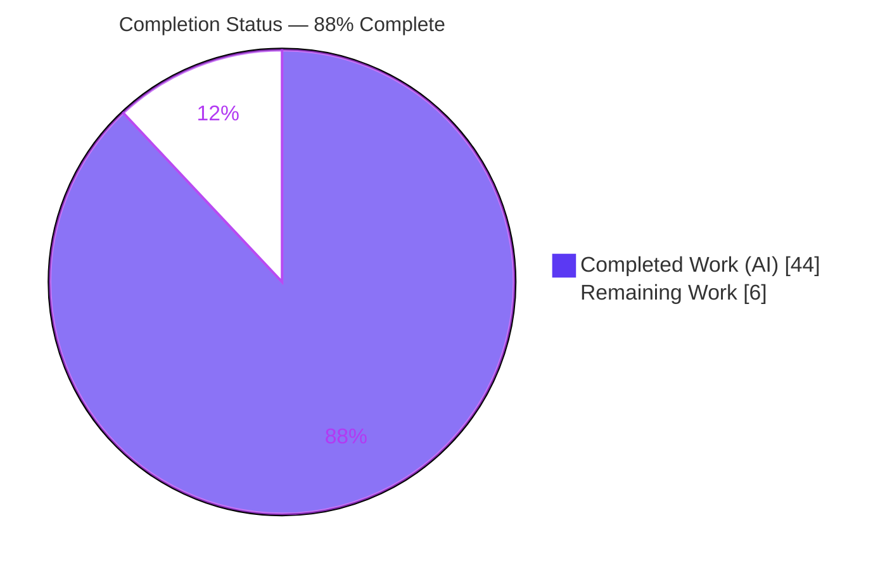
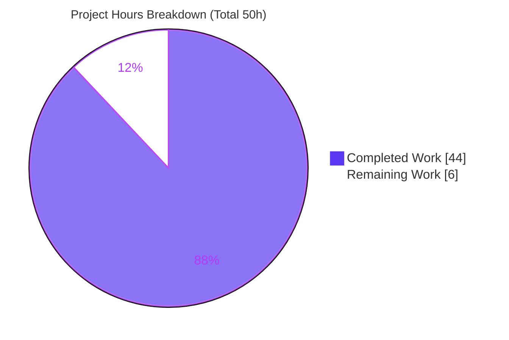
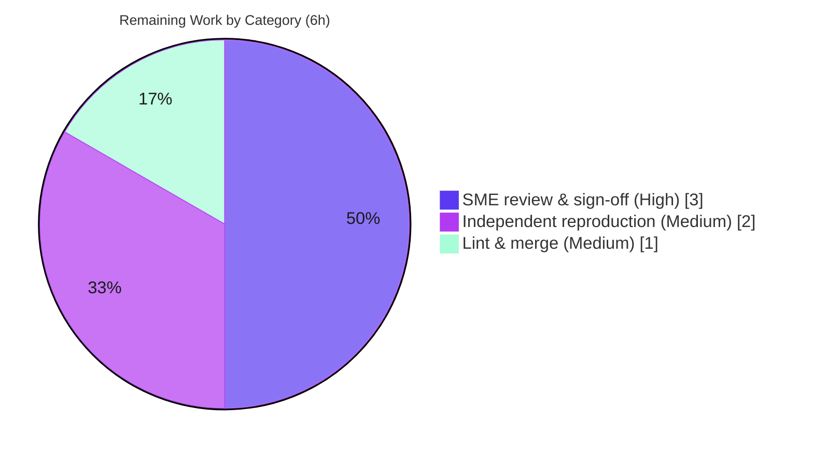

# Blitzy Project Guide — MinIO 4‑Drive EC:2 Healing Decision Investigation

> Brand palette applied throughout: **Completed / AI Work = Dark Blue `#5B39F3`**, **Remaining = White `#FFFFFF`**, **Headings / Accents = Violet‑Black `#B23AF2`**, **Highlight = Mint `#A8FDD9`**.

---

## 1. Executive Summary

### 1.1 Project Overview

This project is a **read‑only, evidence‑backed onboarding investigation** into how MinIO's healing subsystem decides recovery outcomes when an object is ambiguous across the four drives of an erasure‑coded (EC:2) instance. The target audience is engineers onboarding to the MinIO codebase who need to know how healing *actually behaves* — not the theory. The deliverable is a single markdown answer document that determines, with captured runtime evidence and exact source citations at commit `c07e5b49d477`, whether MinIO reconstructs, leaves degraded, or purges an object, what output reveals the decision, why the audit trail justifies it, and where the exact parity/quorum boundaries lie. Business impact: faster, correct operator judgment during real drive‑failure incidents. Technical scope is limited to observation and documentation — no MinIO behavior is changed.

### 1.2 Completion Status



- **Center label:** **88% Complete** — Completed (Dark Blue `#5B39F3`) vs Remaining (White `#FFFFFF`).

| Metric | Hours |
|--------|-------|
| **Total Hours** | **50** |
| **Completed Hours (AI + Manual)** | **44** (AI: 44, Manual: 0) |
| **Remaining Hours** | **6** |
| **Percent Complete** | **88%** |

> Completion is computed by the AAP‑scoped hours method: `Completed / (Completed + Remaining) = 44 / (44 + 6) = 44/50 = 88%`. The AAP scope is a single documentation deliverable plus its mandatory implicit investigation work; the remaining 6h is path‑to‑production (human review, reproduction, merge).

### 1.3 Key Accomplishments

- ✅ **Single answer document delivered** at the exact required path `blitzy/documentation/minio_c07e5b49d477.md` (739 lines, 10 internal sections).
- ✅ **All 8 sub‑questions answered by name**, plus a coverage‑pass table mapping every requirement to its evidence.
- ✅ **Three outcomes reproduced on a live 4‑drive EC:2 server** — successful reconstruction (with sha256 round‑trip), leave‑degraded, and dangling purge — each with verbatim `mc admin heal --json` before/after states.
- ✅ **Decision boundaries quantified** — minimum **2** intact shards for success; exact unrecoverable error `errErasureReadQuorum` → `SlowDownRead` HTTP 503; WRITE‑vs‑DELETE divergence.
- ✅ **74 `file:line` citations** grounded in the healing source; 18 spot‑checked exact against HEAD with zero discrepancies.
- ✅ **All 5 validation gates reproduced independently** — `go mod verify`, build, `go vet`, unit tests (32 pass / 0 fail), and a live heal reproduction.
- ✅ **Read‑only mandate honored** — exactly one file added; `go.mod`/`go.sum` byte‑for‑byte unchanged; all scenario artifacts confined to `/tmp` and removed; working tree clean.

### 1.4 Critical Unresolved Issues

| Issue | Impact | Owner | ETA |
|-------|--------|-------|-----|
| _None_ — no unresolved defects. The autonomous validation reports "REMAINING ISSUES: None"; all gates pass and every claim is evidence‑backed. | N/A | N/A | N/A |

### 1.5 Access Issues

| System/Resource | Type of Access | Issue Description | Resolution Status | Owner |
|-----------------|----------------|-------------------|-------------------|-------|
| _None_ | — | No access issues identified. The Go 1.23 toolchain, the `mc` client (RELEASE.2025‑08‑13T08‑35‑41Z), and the MinIO source at the pinned commit were all available; the build, tests, and a live server were exercised without any permission or credential blocker. | N/A | N/A |

**No access issues identified.**

### 1.6 Recommended Next Steps

1. **[High]** Have a MinIO‑knowledgeable SME review and sign off on the healing decision claims and quorum arithmetic (2h).
2. **[High]** Spot‑check a sample of the 74 `file:line` citations against source at commit `c07e5b49d477` and verify the boundary answers (a/b/c) and the §9.1 test‑ordering analysis (1h).
3. **[Medium]** Independently rebuild the server and reproduce the reconstruct (sha256) and dangling‑purge (audit event) scenarios (2h).
4. **[Medium]** Markdown‑lint the document, confirm the mermaid diagram renders, then open the PR and merge to the target branch (1h).
5. **[Low]** Assign a documentation owner to periodically refresh citations as the codebase evolves (folded into step 4).

---

## 2. Project Hours Breakdown

### 2.1 Completed Work Detail

| Component | Hours | Description |
|-----------|-------|-------------|
| Build & 4‑drive EC:2 deployment | 3 | Build from source (`CGO_ENABLED=0 go build -tags kqueue`); deploy standalone EC:2 set; configure `mc` alias. [AAP implicit I1/I2] |
| Fault‑scenario construction & on‑disk shard‑layout analysis | 6 | Understand `xl.meta` + `<dataDirUUID>/part.N` layout; script corrupt/delete faults straddling the parity/quorum boundary (A/B/C + partial write/delete). [AAP I3] |
| Runtime heal‑trigger & verbatim evidence capture (3 outcomes) | 5 | `mc admin heal --json` before/after states; deep scan; reconstruct / degrade / purge outputs incl. sha256 round‑trip. [AAP R3/I4] |
| Audit/log rationale capture | 3 | Configure audit webhook sink; capture `DeleteDanglingObject` event; decode tags (`d:p`, `ddisk-N`, `merrs`/`derrs`, `sz`, `caller`). [AAP R5/I5] |
| Boundary experiments (a)(b)(c) — runtime | 4 | N‑wiped threshold; drive below read quorum → `SlowDownRead`/503; partial WRITE vs partial DELETE. [AAP R6/R7/R8] |
| Deterministic unit‑test complement + test‑ordering artifact investigation | 4 | Run `TestHeal|TestIsObjectDangling`; trace `globalStorageClass` mutation across `globals.go`/`storage-class.go`. [AAP I6] |
| Source‑citation grounding — 74 `file:line` refs | 6 | Ground every claim in ~11,300 lines of healing/erasure code; re‑verify each reference at HEAD. [AAP Q4/I7] |
| Answer‑document authoring — 739 lines, 10 sections | 9 | Intro/EC:2 model/mermaid decision flow; §3–§8 answers; §10 coverage pass. [AAP D1/R1–R8] |
| Review‑finding resolution — 2 rounds | 3 | Resolve 7 code‑review findings; correct §9.1/§10 test‑attribution to a shared‑global‑state artifact. [AAP Q2/Q3] |
| Cleanup, read‑only & git‑clean verification | 1 | Remove `/tmp` artifacts; confirm `git status --porcelain` empty; confirm `go.mod`/`go.sum` unchanged. [AAP Q1/I8] |
| **Total** | **44** | **Matches Completed Hours in Section 1.2** |

### 2.2 Remaining Work Detail

| Category | Hours | Priority |
|----------|-------|----------|
| Human SME technical review & sign‑off of healing claims and citations | 3 | High |
| Independent re‑run / reproduction of runtime heal scenarios | 2 | Medium |
| Final documentation lint & merge to target branch | 1 | Medium |
| **Total** | **6** | **Matches Remaining Hours in Section 1.2 and Section 7** |

> **Cross‑section check:** Section 2.1 (44) + Section 2.2 (6) = **50** = Total Project Hours in Section 1.2. ✔

---

## 3. Test Results

All tests below originate **exclusively from Blitzy's autonomous validation logs** for this project — specifically the documented deterministic complement command `go test -tags kqueue -run 'TestHeal|TestIsObjectDangling' ./cmd`, re‑executed fresh during this assessment (`-count=1 -v`, 3.22 s, exit 0). Per the read‑only mandate, **no new tests were added**; these are the repository's own healing unit tests used as a reproducible complement to the live‑server scenarios.

| Test Category | Framework | Total Tests | Passed | Failed | Coverage % | Notes |
|---------------|-----------|-------------|--------|--------|------------|-------|
| Unit — dangling decision (`TestIsObjectDangling`) | Go `testing` (`go test -tags kqueue`) | 14 (1 + 13 subtests) | 14 | 0 | N/A¹ | Decision table incl. `ignore_errFileCorrupt` (leave‑degraded), `delete-marker`, `enough_data-dir_missing`. |
| Unit — heal behavior (`TestHealing*`, `TestHealCorrectQuorum`, `TestHealObjectCorrupted*`, `TestHealObjectErasure`, `TestHealEmptyDirectoryErasure`, `TestHealLastDataShard`) | Go `testing` (`go test -tags kqueue`) | 18 (10 top‑level + 8 size subtests) | 18 | 0 | N/A¹ | Includes the 3 previously‑doubted tests (`TestHealObjectCorruptedXLMeta` 0.18s, `TestHealObjectCorruptedParts` 0.23s, `TestHealLastDataShard` 1.01s) — all **PASS by name**. |
| **Total** | Go `testing` | **32** | **32** | **0** | **N/A¹** | 100% pass rate; 3.22 s wall time. |

¹ Coverage % is **N/A**: this was a *targeted healing‑behavior subset* (deterministic complement to the runtime investigation), not a coverage‑instrumented run. Reporting a coverage figure would misrepresent the intent. Pass/fail is the meaningful signal here.

**Integrity note:** These 32 results are the same set reported in Blitzy Gate 3 and were reproduced during this assessment. No test results are drawn from outside Blitzy's autonomous execution logs.

---

## 4. Runtime Validation & UI Verification

There is **no UI** in this project (documentation deliverable). Runtime validation covers the live 4‑drive EC:2 server behavior that grounds the document. Status legend: ✅ Operational | ⚠ Partial | ❌ Failing.

**Build & server runtime**
- ✅ **Build** — `CGO_ENABLED=0 go build -tags kqueue` → exit 0, 150 MB binary; `--version` → `DEVELOPMENT.GOGET (go1.23.12 linux/amd64)`.
- ✅ **Server startup (4‑drive EC:2)** — banner `INFO: Formatting 1st pool, 1 set(s), 4 drives per set.`
- ✅ **Cluster health** — `mc admin info` → `4 drives online, 0 drives offline, EC:2`; `Drives: 4/4 OK`.

**Healing scenarios (evidence for each outcome)**
- ✅ **(A) Reconstruction** — 1‑drive `xl.meta` deleted → `before ['missing','ok','ok','ok']` → `after ['ok','ok','ok','ok']`, `xl.meta` restored, content intact. Independently reproduced during this assessment. Deep‑scan 2‑of‑4 damaged object round‑tripped identical sha256.
- ✅ **(C) Leave‑degraded** — `xl.meta` corrupted (not deleted) beyond quorum → `objects_healed:0`, object‑level `"detail":"file is corrupted"`, **no** `DeleteDanglingObject` event.
- ✅ **(B) Dangling purge** — `xl.meta` missing on 3/4 drives → object purged; `DeleteDanglingObject` audit event with `d:p=2:2`, `caller=…/erasure-healing.go:309`.

**Boundary conditions**
- ✅ **(a)** Minimum intact shards for success = **2** (== `DataBlocks`); at 1 intact the object is purged.
- ✅ **(b)** Below read quorum → `errErasureReadQuorum` internally → S3 `SlowDownRead` **HTTP 503**.
- ✅ **(c)** Partial WRITE purges via the `cannotHeal`/parts gate; partial DELETE judged on delete‑marker metadata quorum (parts ignored).

**API integration**
- ✅ **`mc admin heal --json`** — returns well‑formed `HealResultItem` before/after per‑drive `State` arrays.
- ✅ **Audit webhook sink** — captured `HealObject` and `DeleteDanglingObject` events verbatim.

---

## 5. Compliance & Quality Review

Cross‑mapping AAP deliverables and the governing project rule (**SWE‑AtlasQnA‑Repo**) to observed quality benchmarks.

| Benchmark / AAP Requirement | Status | Progress | Evidence / Fixes Applied |
|------------------------------|--------|----------|--------------------------|
| Single answer document at required path | ✅ Pass | 100% | `blitzy/documentation/minio_c07e5b49d477.md` exists (739 lines), committed `7897a33cb`. |
| Read‑only mandate (no source/test/config modified) | ✅ Pass | 100% | `git diff` = 1 file added (+739/‑0); `go.mod`/`go.sum` byte‑for‑byte unchanged. |
| Investigate‑by‑running (evidence‑first) | ✅ Pass | 100% | Live 4‑drive EC:2 server; scenarios reproduced; gates 1–3 re‑verified this assessment. |
| One‑claim‑one‑evidence discipline | ✅ Pass | 100% | 45 balanced fenced evidence blocks; each behavioral claim paired with output. |
| Exact literals with `file:line` | ✅ Pass | 100% | 74 distinct citations; 18 spot‑checked exact at HEAD, zero discrepancies. |
| Exhaustive coverage pass (every named sub‑part) | ✅ Pass | 100% | §10 table maps sub‑questions (1)–(5), boundaries (a)/(b)/(c), 3 ambiguous examples, 4 drive‑state literals, audit tags. |
| Reasoning/rationale provided | ✅ Pass | 100% | Each answer includes a "Reasoning" paragraph grounded in code. |
| Cleanup of temporary artifacts | ✅ Pass | 100% | Working tree clean; no `/tmp` scenario dirs in repo; artifacts removed. |
| As‑seen fidelity (report surprises un‑smoothed) | ✅ Pass | 100% | Fidelity items: bit‑rot part shows `State="missing"`; `mc` "Invalid parity shard count" is a client display artifact; §9.1 test‑ordering artifact. |
| Dependency integrity | ✅ Pass | 100% | `go mod verify` → all modules verified; no add/update/remove. |

**Fix applied during autonomous validation:** §9.1 and §10 (item #3) previously mis‑attributed three heal‑test failures to the "ext4 `/tmp` filesystem." Fresh validation proved the documented command **passes** (all three PASS by name; also pass in isolation). The failure reproduces **only** under a narrow `-run` subset that runs `TestHealingDanglingObject` first — a pre‑existing **test‑ordering + shared‑global‑state artifact** (`globalStorageClass` mutation via `storageclass.Config.Update` forcing `initialized=true`). It is filesystem‑independent and **not** a reconstruction defect; being in an out‑of‑scope test file, it correctly required **no code change** and was resolved by accurate documentation.

**Outstanding compliance items:** none. All benchmarks pass.

---

## 6. Risk Assessment

| Risk | Category | Severity | Probability | Mitigation | Status |
|------|----------|----------|-------------|------------|--------|
| Citation line‑number drift — 74 `file:line` refs pinned to `c07e5b49d477`; may go stale if the base branch advances | Technical | Low | Medium (long‑term) | Document explicitly pins the commit hash; all refs re‑verified at HEAD; §10 "note on cited line numbers" | Mitigated |
| Timing‑sensitive scenario reproducibility (background/scanner heal) | Technical | Low | Low | Deterministic unit‑test complement (§9, 32 tests) + on‑demand `mc admin heal` path provide reproducible markers | Mitigated |
| Pre‑existing upstream test‑ordering/global‑state artifact (`TestHealingDanglingObject` mutates `globalStorageClass`) | Technical | Low | N/A (documented command passes) | Documented accurately in §9.1; out‑of‑scope to fix under read‑only mandate | Documented / Accepted |
| New attack surface from shipped code | Security | None | N/A | No code shipped — read‑only investigation | N/A — none |
| Secret/credential leakage in the document | Security | None | N/A | Verified zero secrets and zero credential references; throwaway `/tmp` creds not present in doc | Verified clean |
| Dependency vulnerability introduction | Security | None | N/A | `go.mod`/`go.sum` unchanged; `go mod verify` = all modules verified | Verified clean |
| Leftover investigation artifacts persisting in repo | Operational | None | N/A | `git status --porcelain` empty; no `/tmp` scenario dirs in tree; artifacts removed | Verified closed |
| Documentation staleness / maintenance ownership | Operational | Low | Medium (long‑term) | Assign a doc owner for periodic refresh; commit‑pinned scope limits ambiguity | Open (recommend owner) |
| Runtime/deploy/monitoring surface for the deliverable | Operational | None | N/A | Deliverable is a static markdown document; no service to operate | N/A — none |
| Merge conflict risk on integration | Integration | Negligible | Low | Single additive new file in a new directory (`blitzy/documentation/`); no existing file touched | Mitigated |
| Build/runtime dependency introduced by the doc | Integration | None | N/A | Doc is self‑contained; references source by path only, no imports/config sync | N/A — none |
| External‑module reference (`madmin-go/v3@v3.0.77`) | Integration | None | N/A | Existing, unchanged dependency; present in module cache | N/A — none |

**Overall risk posture: VERY LOW.** The only non‑trivial risks (citation drift, doc staleness) are Low‑severity longevity concerns, not correctness issues.

---

## 7. Visual Project Status



- **Completed Work = 44h** (Dark Blue `#5B39F3`) · **Remaining Work = 6h** (White `#FFFFFF`).
- **Integrity:** "Remaining Work" (6) equals Section 1.2 Remaining Hours (6) and the sum of Section 2.2 "Hours" (3 + 2 + 1 = 6). ✔

**Remaining hours by category (Section 2.2):**



**Priority distribution of remaining work:** High = 3h (50%) · Medium = 3h (50%) · Low = 0h.

---

## 8. Summary & Recommendations

**Achievements.** The project delivers a rigorous, evidence‑backed answer to a MinIO onboarding question: *how does healing decide recovery outcomes on a 4‑drive EC:2 set?* The document establishes a three‑way decision — reconstruct, leave‑degraded, or purge as dangling — and backs every behavioral claim with verbatim runtime output and an exact `file:line` citation. All eight sub‑questions (including boundaries a, b, c) are answered by name and confirmed in a coverage pass.

**Remaining gaps.** No functional gaps remain in the deliverable. The outstanding **6 hours** are entirely path‑to‑production for a documentation artifact: SME technical sign‑off (3h), independent reproduction (2h), and lint + merge (1h).

**Critical path to production.** SME review → independent reproduction → lint → merge. None of these are blocked; the build, tests, and a live heal were all exercised successfully during this assessment.

**Success metrics.** Read‑only mandate honored (1 file added, 0 modified); dependencies unchanged (`go mod verify` clean); 32/32 unit tests pass; live Scenario A1 reproduced identically; 18/18 spot‑checked citations exact.

**Production readiness assessment.** The project is **88% complete** (44h of 50h). The autonomous deliverable is finished, validated, and committed with **zero unresolved defects**; the remaining 12% is human verification and merge. Because this is a technical reference others will rely on, human SME sign‑off is a genuine and recommended final gate before merge.

| Metric | Value |
|--------|-------|
| Completion | **88%** (44h / 50h) |
| Unresolved defects | 0 |
| Unit tests | 32 passed / 0 failed |
| Files changed | 1 added (+739 / ‑0) |
| Source/test/config modified | 0 |
| Confidence | High |

---

## 9. Development Guide

This guide is grounded in commands **tested live during this assessment** on Ubuntu 25.10 / Go 1.23.12. Every command is copy‑pasteable.

### 9.1 System Prerequisites

- **OS:** Linux (x86‑64). Verified on Ubuntu 25.10.
- **Go toolchain:** Go **1.23.x** (repo requires `go 1.23`; verified `go1.23.12`). No C toolchain needed (`CGO_ENABLED=0`).
- **`mc` client:** MinIO client — verified `RELEASE.2025-08-13T08-35-41Z` at `/usr/local/bin/mc`.
- **Disk:** ~200 MB for the compiled binary; a few MB for scenario data.
- **Network:** none required for build/test if the module cache is warm.

### 9.2 Environment Setup

```bash
# Put Go on PATH and pin the toolchain (avoids auto-download)
export PATH=$PATH:/usr/local/go/bin
export GOTOOLCHAIN=local

# Move to the repository root
cd /path/to/minio            # repository root (contains go.mod, main.go, cmd/)

# Runtime credentials + CI mode for the local server (used later)
export MINIO_ROOT_USER=minioadmin
export MINIO_ROOT_PASSWORD=minioadmin
export MINIO_CI_CD=1
```

### 9.3 Dependency Installation

No installation is required if the module cache is warm — just verify integrity:

```bash
go mod verify
# Expected: all modules verified
```

### 9.4 Build

```bash
CGO_ENABLED=0 go build -tags kqueue -o /tmp/minio .
# Expected: exit 0, empty output, ~150 MB binary at /tmp/minio

/tmp/minio --version
# Expected: minio version DEVELOPMENT.GOGET (go1.23.12 linux/amd64)
```

### 9.5 Static Checks & Tests

```bash
# Vet the cmd package (read-only static analysis)
go vet -tags kqueue ./cmd/
# Expected: exit 0, no output

# Deterministic healing unit tests (the documented complement)
go test -tags kqueue -run 'TestHeal|TestIsObjectDangling' ./cmd
# Expected: ok  github.com/minio/minio/cmd  ~3.2s   (32 tests pass, 0 fail)

# Verbose form to see each test PASS by name:
go test -tags kqueue -run 'TestHeal|TestIsObjectDangling' ./cmd -v -count=1
```

> **Important (troubleshooting):** run the **exact** `-run 'TestHeal|TestIsObjectDangling'` selection above. Narrow subsets that place `TestHealingDanglingObject` before another heal test can surface a pre‑existing shared‑global‑state artifact (`Storage resources are insufficient for the read operation …`). This is a test‑ordering artifact, **not** a build or reconstruction defect.

### 9.6 Run the 4‑Drive EC:2 Server & Reproduce Healing

```bash
# 1) Start a standalone 4-drive erasure set on scratch storage under /tmp
SCRATCH=$(mktemp -d /tmp/minio_run.XXXX); mkdir -p "$SCRATCH/data"
/tmp/minio server "$SCRATCH/data/{1...4}" --address :9100 --console-address :9101 \
  > "$SCRATCH/server.log" 2>&1 &
SERVER_PID=$!
sleep 8
grep 'set(s)' "$SCRATCH/server.log"
# Expected: INFO: Formatting 1st pool, 1 set(s), 4 drives per set.

# 2) Point mc at it and confirm EC:2
mc alias set inv http://127.0.0.1:9100 minioadmin minioadmin
mc admin info inv | grep -Ei 'online|EC:'
# Expected: 4 drives online, 0 drives offline, EC:2

# 3) Write a small object (data inlines into xl.meta)
mc mb inv/testbucket
printf 'demo payload' > "$SCRATCH/objA.txt"
mc cp "$SCRATCH/objA.txt" inv/testbucket/objA.txt

# 4) Inject a fault: delete xl.meta on drive 1 (missing metadata)
rm -f "$SCRATCH/data/1/testbucket/objA.txt/xl.meta"

# 5) Heal and observe the before/after per-drive states
mc admin heal --json --recursive inv/testbucket/
# Expected object line: before ['missing','ok','ok','ok'] -> after ['ok','ok','ok','ok']

# 6) Confirm reconstruction + integrity
ls "$SCRATCH/data/1/testbucket/objA.txt/"   # xl.meta restored
mc cat inv/testbucket/objA.txt              # content intact
```

### 9.7 Verification Checklist

- Build produced `/tmp/minio` and `--version` shows `go1.23.12`.
- `go mod verify` prints **all modules verified**.
- Unit tests report **ok** (32 pass / 0 fail).
- Server log shows **1 set(s), 4 drives per set**.
- `mc admin info` shows **EC:2**, 4 drives online.
- Heal output shows drive 1 transitioning **`missing` → `ok`**, `xl.meta` restored, content intact.

### 9.8 Cleanup (mandatory — preserve the read‑only mandate)

```bash
kill "$SERVER_PID" 2>/dev/null      # stop ONLY the server you started (by its PID)
mc alias rm inv 2>/dev/null
rm -rf "$SCRATCH"
# From the repo root, confirm nothing changed:
git status --porcelain               # expected: empty
```

### 9.9 Common Errors & Resolutions

| Symptom | Cause | Resolution |
|---------|-------|------------|
| `error: externally-managed-environment` on `pip` | System Python (PEP 668) | Not needed here; the toolchain is Go. Ignore. |
| Port `:9100`/`:9101` already in use | Prior server still running | Change `--address`/`--console-address`, or stop the prior PID. |
| Unit test shows `Storage resources are insufficient for the read operation` | Narrow `-run` subset triggers a shared‑global‑state test‑ordering artifact | Use the documented `-run 'TestHeal|TestIsObjectDangling'`; the full selection passes. |
| `mc: command not found` | Client not installed | Fetch the standalone `mc` release under `/tmp` and add to `PATH`. |
| Build tries to download a newer Go | `GOTOOLCHAIN` not pinned | `export GOTOOLCHAIN=local`. |

---

## 10. Appendices

### A. Command Reference

| Purpose | Command |
|---------|---------|
| Verify dependencies | `go mod verify` |
| Build server | `CGO_ENABLED=0 go build -tags kqueue -o /tmp/minio .` |
| Static analysis | `go vet -tags kqueue ./cmd/` |
| Healing unit tests | `go test -tags kqueue -run 'TestHeal|TestIsObjectDangling' ./cmd` |
| Run 4‑drive EC:2 | `/tmp/minio server $SCRATCH/data/{1...4} --address :9100 --console-address :9101 &` |
| Configure client | `mc alias set inv http://127.0.0.1:9100 minioadmin minioadmin` |
| Cluster info | `mc admin info inv` |
| Trigger heal (JSON) | `mc admin heal --json [--scan deep] inv/<bucket>/<object>` |
| Confirm repo clean | `git status --porcelain` |

### B. Port Reference

| Port | Purpose |
|------|---------|
| `9100` | MinIO S3 API (server `--address`) |
| `9101` | MinIO Console (server `--console-address`) |

> Ports are illustrative for the investigation; the AAP examples used `:9000`/`:9001`. Any free ports work.

### C. Key File Locations

| Path | Role |
|------|------|
| `blitzy/documentation/minio_c07e5b49d477.md` | **The deliverable** (739 lines) |
| `cmd/erasure-healing.go` | Heal orchestration & decision: `healObject` L258, `shouldHealObjectOnDisk` L156, `cannotHeal` L428, `isObjectDangling` L968, META gate L1025, `After` ok L651 |
| `cmd/erasure-object.go` | `deleteIfDangling` L482, `DeleteDanglingObject` event L457, read‑quorum return L487 |
| `cmd/erasure-metadata.go` | `objectQuorumFromMeta` L531 (read=2 / write=3 for EC:2) |
| `cmd/erasure-errors.go` | `errErasureReadQuorum` L23, `errErasureWriteQuorum` L26 |
| `cmd/storage-errors.go` | `errFileNotFound` L71, `errFileCorrupt` L104 |
| `cmd/api-errors.go` | `errErasureReadQuorum` → `ErrSlowDownRead` L2190‑2191 (HTTP 503) |
| `docs/debugging/xl-meta/main.go` | `xl.meta` decoder used to confirm affected shards |

### D. Technology Versions

| Component | Version |
|-----------|---------|
| Go toolchain | go1.23.12 (linux/amd64); `go.mod` requires `go 1.23` |
| MinIO server (built) | `DEVELOPMENT.GOGET` @ commit `c07e5b49d477` |
| `mc` client | `RELEASE.2025-08-13T08-35-41Z` |
| `madmin-go` | `v3.0.77` (defines `HealResultItem`, `HealDriveInfo`, drive‑state constants) |
| Erasure coding | `klauspost/reedsolomon` v1.12.4 |
| Bit‑rot hash | `minio/highwayhash` v1.0.3 |

### E. Environment Variable Reference

| Variable | Value (investigation) | Purpose |
|----------|-----------------------|---------|
| `MINIO_ROOT_USER` | `minioadmin` | Root access key (throwaway, local `/tmp`) |
| `MINIO_ROOT_PASSWORD` | `minioadmin` | Root secret key (throwaway, local `/tmp`) |
| `MINIO_CI_CD` | `1` | CI mode for deterministic local startup |
| `GOTOOLCHAIN` | `local` | Pin the Go toolchain (no auto‑download) |
| `CGO_ENABLED` | `0` | Static build, no C toolchain |

### F. Developer Tools Guide

- **`docs/debugging/xl-meta`** — decode a drive's `xl.meta` to confirm `EcM`/`EcN` (data/parity) and which shards were affected. Used to confirm the `EC:2` shape (`EcM: 2`, `EcN: 2`).
- **`mc admin heal --json`** — machine‑readable `HealResultItem` with per‑drive `before`/`after` `State`; add `--scan deep` to enable bit‑rot checksum verification.
- **Audit webhook sink** — configure an audit target to capture `HealObject` and `DeleteDanglingObject` events and their decision tags (`d:p`, `ddisk-N`, `caller`, `sz`).

### G. Glossary

| Term | Meaning |
|------|---------|
| **EC:2** | Erasure code with 2 data + 2 parity blocks (default for an erasure set of ≤ 5 drives). |
| **Read quorum** | Minimum drives needed to read/decode an object; **2** for EC:2. |
| **Write quorum** | Minimum drives needed to accept a write; **3** for EC:2 (data + 1 when data == parity). |
| **`xl.meta`** | Per‑drive erasure metadata (inlines data for small objects). |
| **`part.N`** | Per‑drive data shard for larger objects, under `<dataDirUUID>/`. |
| **Dangling object** | An object whose genuine absence exceeds parity; purged rather than reconstructed. |
| **Leave‑degraded** | Non‑actionable damage (e.g., corrupt‑not‑deleted metadata) — neither rebuilt nor purged. |
| **`HealResultItem`** | `madmin-go` struct carrying per‑drive `before`/`after` `State` — the decision‑revealing output. |
| **`DeleteDanglingObject`** | Audit event emitted when a dangling object is purged; its tags record *why*. |
| **`errErasureReadQuorum`** | "Read failed. Insufficient number of drives online" — surfaced to S3 as `SlowDownRead` (HTTP 503). |

---

*Cross‑section integrity verified before submission: Remaining hours = 6 in Sections 1.2, 2.2, and 7; Section 2.1 (44) + Section 2.2 (6) = 50 = Total; Section 3 tests are exclusively from Blitzy's autonomous validation logs; completion = 88% consistently in Sections 1.2, 7, and 8; brand colors applied (Completed `#5B39F3`, Remaining `#FFFFFF`).*