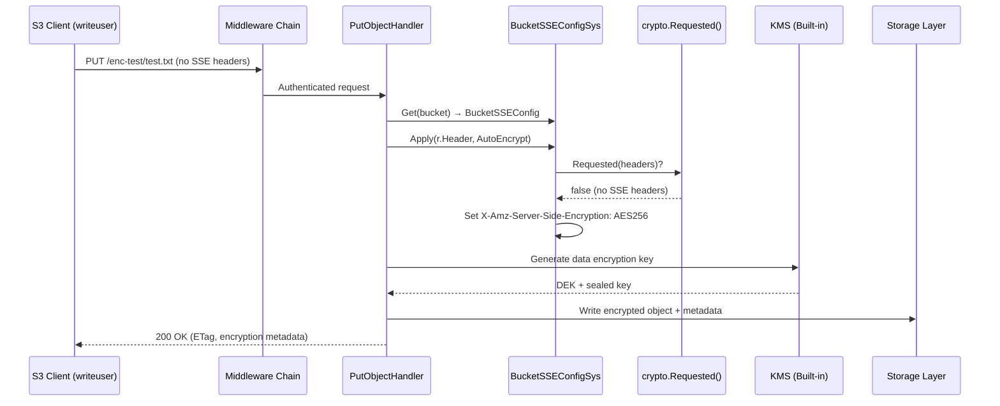
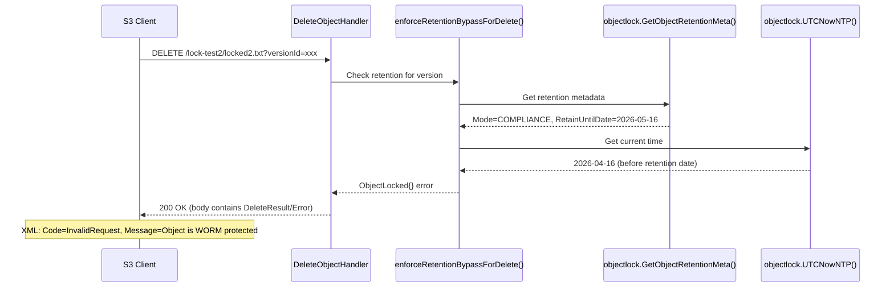
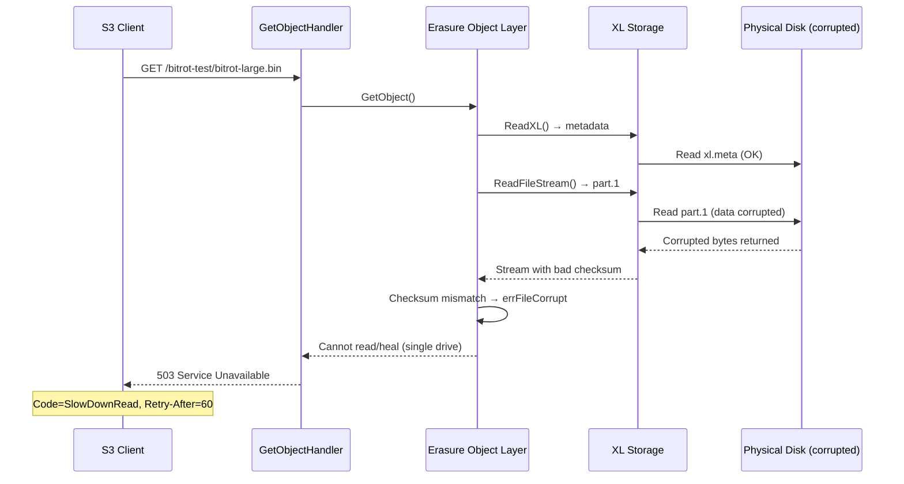

# Technical Specification

# 0. Agent Action Plan

## 0.1 Intent Clarification

### 0.1.1 Core Feature Objective

Based on the prompt, the Blitzy platform understands that the new feature requirement is to conduct a comprehensive runtime behavioral investigation of five distinct MinIO security subsystems, capturing actual server trace logs and test output to document the precise execution sequences and enforcement mechanisms. Specifically, the requirements are:

- **Bucket-Level Encryption Enforcement vs. User Write Permissions:** Determine what happens at runtime when a user with broad `s3:PutObject` permissions uploads an object without encryption headers to a bucket that has SSE-S3 default encryption configured. Capture the exact server trace log that shows whether the server rejects the request, silently encrypts, or stores unencrypted.

- **Object Lock Deletion Enforcement:** When Object Locking is enabled on a bucket in COMPLIANCE mode, identify the specific log entries and XML error responses that appear in the server trace when a user attempts to delete a locked object, both with and without the `X-Amz-Bypass-Governance-Retention` header.

- **Bit Rot Detection and Corruption Handling:** Trigger an actual bit rot detection event by manually corrupting on-disk object data in the storage backend, then issue a GET request for that object and capture the runtime server trace logs showing MinIO's detection and error response behavior.

- **STS Session Policy Enforcement:** Verify that when a parent user with broad `s3:*` permissions obtains temporary credentials (via service account creation with an embedded session policy), MinIO correctly enforces the session policy as an intersection with the parent policy, blocking operations not allowed by the session policy even though the parent permits them.

- **Privilege Escalation Prevention via User Mappings:** Demonstrate that a user with only basic S3 permissions cannot promote themselves to a console admin by modifying user mappings, attaching policies, creating users, or embedding admin-level session policies in self-created service accounts. Identify the root cause of the observed behavior in the source code.

- **No Repository Modification Constraint:** The entire investigation must be performed without modifying any existing repository source files. Temporary scripts and artifacts created for testing must be cleaned up afterward.

### 0.1.2 Special Instructions and Constraints

- **Read-Only Codebase Rule:** The user explicitly mandates: "Don't modify any repository source files." All investigations must operate through runtime testing (starting MinIO, using `mc`, `curl`) and source code analysis only.
- **Implementation Rule (SWE-AtlasQnA-Repo):** Create a new markdown document named `<source_branch_name>.md` that comprehensively answers the question(s) posed in the prompt. Place the generated document in the `blitzy/documentation` directory.
- **Runtime Evidence Required:** The user requires "runtime log output," "runtime test output," and "test output" for multiple investigations—not just theoretical analysis. Actual MinIO server trace logs must be captured and presented.
- **Root Cause Analysis Required:** For the privilege escalation investigation, the user specifically asks to "Identify the root cause of the user mappings modification behavior that you observe."
- **Cleanup Obligation:** "If you need to create temporary scripts or artifacts to observe behavior, that's fine, but clean them up afterward and leave the codebase unchanged."

### 0.1.3 Technical Interpretation

These feature requirements translate to the following technical implementation strategy:

- To **investigate bucket encryption enforcement**, we will start a MinIO server with `MINIO_KMS_SECRET_KEY` configured, create a bucket with SSE-S3 default encryption via `mc encrypt set sse-s3`, create a user with `s3:PutObject` permissions, and upload an object without SSE headers while capturing `mc admin trace --all -v` output. The trace reveals MinIO's `BucketSSEConfig.Apply()` method (`internal/bucket/encryption/bucket-sse-config.go`) transparently injecting the `X-Amz-Server-Side-Encryption: AES256` header into the request before the object handler processes it.

- To **investigate object lock deletion enforcement**, we will create a bucket with `--with-lock`, set COMPLIANCE mode retention, upload an object, then attempt three deletion scenarios (without version ID, with version ID, with governance bypass header), capturing the full server trace for each.

- To **trigger bit rot detection**, we will upload a 5 MiB file (large enough to create a separate `part.1` data file on disk), locate the physical data file at `<data-dir>/<bucket>/<object>/<uuid>/part.1`, corrupt bytes at an arbitrary offset using Python, then issue a GET request and capture the `503 Service Unavailable` / `SlowDownRead` error response in the trace.

- To **verify STS session policy enforcement**, we will create a parent user with `s3:*` permissions, generate a service account with a session policy restricting access to only one bucket, then test access to both the allowed and denied buckets, and also test write operations not permitted by the session policy.

- To **verify privilege escalation prevention**, we will create a basic user with only S3 data permissions, then attempt `admin:ListUsers`, `admin:AddUser`, `admin:AttachPolicy`, and service account creation with embedded `admin:*` session policy, analyzing the `DenyOnly` flag logic in `IAMSys.IsAllowed()` and `Policy.IsAllowed()` to identify the root cause of the observed behavior.


## 0.2 Repository Scope Discovery

### 0.2.1 Comprehensive File Analysis

The investigation spans five distinct MinIO security subsystems. The following files were analyzed for each area, identified through systematic deep search of the repository structure rooted at `/tmp/blitzy/minio/minio_c07e5b49d477_1c89e5/`.

**Bucket Encryption / SSE Enforcement Files:**

| File Path | Purpose |
|-----------|---------|
| `internal/bucket/encryption/bucket-sse-config.go` | `BucketSSEConfig` struct, `Apply()` method that transparently injects SSE headers on requests without encryption headers |
| `internal/crypto/auto-encryption.go` | `MINIO_KMS_AUTO_ENCRYPTION` env var toggle; `LookupAutoEncryption()` function |
| `internal/crypto/sse-s3.go` | SSE-S3 implementation: `IsRequested()`, `ParseHTTP()`, `IsEncrypted()`, `UnsealObjectKey()` |
| `internal/crypto/sse-kms.go` | SSE-KMS implementation for KMS-managed keys |
| `internal/crypto/sse-c.go` | SSE-C (customer-provided key) implementation |
| `internal/crypto/sse.go` | SSE type interface, seal algorithm constants |
| `internal/crypto/key.go` | `ObjectKey` generation, `SealedKey` structure |
| `internal/kms/config.go` | KMS backend selection and `MINIO_KMS_SECRET_KEY` env var |
| `cmd/object-handlers.go` (lines 1893–1897) | PutObject handler calling `sseConfig.Apply()` before processing upload |
| `cmd/bucket-encryption-handlers.go` | Bucket-level SSE config API handlers |

**Object Lock / WORM Enforcement Files:**

| File Path | Purpose |
|-----------|---------|
| `internal/bucket/object/lock/lock.go` | Object lock mode constants (`RetGovernance`, `RetCompliance`), `LegalHoldStatus`, retention validation |
| `cmd/bucket-object-lock.go` (lines 52–140) | `enforceRetentionForDeletion()` and `enforceRetentionBypassForDelete()` — core WORM enforcement logic |
| `cmd/object-handlers.go` (line 2601) | Delete handler calling `enforceRetentionBypassForDelete()` |
| `cmd/object-api-errors.go` (line 336) | `ObjectLocked` error: "Object is WORM protected and cannot be overwritten" |
| `cmd/api-errors.go` (line 1061) | Maps `ObjectLocked` to HTTP response with error description |

**Bit Rot Detection Files:**

| File Path | Purpose |
|-----------|---------|
| `cmd/bitrot.go` | Bitrot algorithm registry (`SHA256`, `BLAKE2b512`, `HighwayHash256`, `HighwayHash256S`), self-test, `bitrotVerify()` |
| `cmd/bitrot-streaming.go` | Streaming bitrot writer/reader for `HighwayHash256S` per-shard checksums |
| `cmd/bitrot-whole.go` | Whole-file bitrot writer/reader for non-streaming algorithms |
| `cmd/erasure-object.go` (lines 395–407) | Read path corruption detection, `errFileCorrupt` handling, triggers healing with `BitrotScan: true` |
| `cmd/xl-storage.go` | XL storage layer disk I/O, part file management |
| `cmd/storage-errors.go` | `errFileCorrupt` error definition |

**IAM / STS Session Policy Enforcement Files:**

| File Path | Purpose |
|-----------|---------|
| `cmd/iam.go` (lines 2138–2236) | `IsAllowedServiceAccount()` — evaluates parent policy AND session policy as intersection |
| `cmd/iam.go` (lines 2239–2317) | `IsAllowedSTS()` — STS credential authorization with session policy intersection |
| `cmd/iam.go` (lines 2381–2420) | `isAllowedBySessionPolicy()` — parses and evaluates inline session policy from JWT claims |
| `cmd/iam.go` (lines 2320–2378) | `isAllowedBySessionPolicyForServiceAccount()` — service account session policy evaluation |
| `cmd/iam.go` (lines 2436–2483) | `IsAllowed()` — main dispatch chain routing to STS, service account, or regular user evaluation |
| `cmd/iam.go` (lines 1022–1123) | `NewServiceAccount()` — creates service accounts with optional session policy embedded in JWT claims |
| `cmd/sts-handlers.go` (lines 44–150) | STS handler registration, session policy population via `populateSessionPolicy()` |
| `~/go/pkg/mod/github.com/minio/pkg/v3@v3.0.22/policy/policy.go` (lines 172–207) | `Policy.IsAllowed()` — implements `DenyOnly` flag logic |

**Privilege Escalation Prevention Files:**

| File Path | Purpose |
|-----------|---------|
| `cmd/admin-handlers-users.go` (lines 649–760) | `AddServiceAccount()` handler — validates caller identity, sets `denyOnly` flag for self-targeting requests |
| `cmd/admin-handlers-users.go` (lines 2714–2818) | `commonAddServiceAccount()` — permission check using `DenyOnly: denyOnly` when creating service account for self |
| `cmd/admin-handlers-users.go` (lines 195–215) | `AddUser` handler with `checkDenyOnly` logic |
| `~/go/pkg/mod/github.com/minio/pkg/v3@v3.0.22/policy/policy.go` (lines 172–207) | Core `DenyOnly` implementation: skip Allow evaluation when `DenyOnly=true`, return true if no Deny matched |

**Configuration and Infrastructure Files:**

| File Path | Purpose |
|-----------|---------|
| `go.mod` | Go 1.23 requirement, all dependency versions |
| `go.sum` | Dependency integrity checksums |
| `main.go` | Single binary entry point calling `cmd.Main()` |
| `cmd/server-main.go` | Server bootstrap: subsystem initialization, IAM init, KMS config |
| `cmd/globals.go` | Global constants: `globalMaxSkewTime`, IAM refresh interval |
| `cmd/routers.go` | 9-handler middleware chain definition |
| `cmd/auth-handler.go` | Authentication type classification, admin auth validation |

### 0.2.2 Web Search Research Conducted

No web search was required for this investigation. All findings are derived directly from:
- Source code analysis of the repository at commit `c07e5b49d` (branch `minio_c07e5b49d477`)
- Runtime testing against a MinIO server built from the exact repository source
- Dependency source code in the Go module cache (`minio/pkg/v3@v3.0.22`)

### 0.2.3 New File Requirements

**New source files to create:**

| File Path | Purpose |
|-----------|---------|
| `blitzy/documentation/minio_c07e5b49d477.md` | Comprehensive investigation document answering all five questions with runtime log evidence, per the SWE-AtlasQnA-Repo rule |

**No other new files are required.** The investigation is entirely observational and analytical—no modifications to the MinIO source code or creation of permanent test infrastructure.


## 0.3 Dependency Inventory

### 0.3.1 Private and Public Packages

The following packages are directly relevant to the five security investigations conducted. All versions are extracted from `go.mod` at commit `c07e5b49d`.

| Registry | Package | Version | Purpose |
|----------|---------|---------|---------|
| Go modules | `github.com/minio/minio` | `c07e5b49d` (dev) | MinIO server binary under investigation |
| Go modules | `github.com/minio/pkg/v3` | `v3.0.22` | Core policy engine with `DenyOnly` flag, `Policy.IsAllowed()` |
| Go modules | `github.com/minio/minio-go/v7` | `v7.0.90` | MinIO Go client SDK (used by `mc`) |
| Go modules | `github.com/minio/madmin-go/v3` | `v3.0.70` | Admin API client library |
| Go modules | `github.com/minio/sio` | `v0.4.1` | DARE v2 streaming encryption (data at rest) |
| Go modules | `github.com/minio/kms-go/kes` | `v0.3.0` | KES client for Key Encryption Service |
| Go modules | `github.com/minio/kms-go/kms` | `v0.4.0` | KMS client with AEAD key sealing |
| Go modules | `github.com/minio/highwayhash` | `v1.0.3` | HighwayHash256 for bitrot checksums |
| Go modules | `github.com/golang-jwt/jwt/v4` | `v4.5.1` | JWT token creation/validation (session tokens) |
| Go modules | `github.com/minio/mux` | `v3.3.2+incompatible` | HTTP request router |
| Go modules | `golang.org/x/crypto` | `v0.29.0` | BLAKE2b for bitrot, SSH for SFTP |
| Go stdlib | `crypto/subtle` | Go 1.23 | Constant-time comparison in auth |
| Go stdlib | `crypto/sha256` | Go 1.23 | SHA256 bitrot algorithm |
| Runtime | Go | 1.23.0 | Highest explicitly documented supported version per `go.mod` |

### 0.3.2 Dependency Updates

No dependency updates are required. This investigation is observational and does not modify the codebase. All packages listed above are already present in `go.mod` and `go.sum` at the exact versions shown.

### 0.3.3 Import Analysis

The following import chains are critical to understanding the five investigation areas:

**Encryption Enforcement Chain:**
- `cmd/object-handlers.go` → `internal/bucket/encryption` (alias `sse`) → `BucketSSEConfig.Apply()`
- `cmd/object-handlers.go` → `internal/crypto` → `crypto.Requested()` check before applying bucket config

**Object Lock Enforcement Chain:**
- `cmd/object-handlers.go` → `cmd/bucket-object-lock.go` → `enforceRetentionBypassForDelete()`
- `cmd/bucket-object-lock.go` → `internal/bucket/object/lock` (alias `objectlock`) → retention mode parsing

**Bitrot Detection Chain:**
- `cmd/erasure-object.go` → `cmd/bitrot.go` → `bitrotVerify()` / `newBitrotReader()`
- `cmd/bitrot.go` → `github.com/minio/highwayhash` (HighwayHash256S for streaming verification)

**IAM Authorization Chain:**
- `cmd/auth-handler.go` → `cmd/iam.go` → `IAMSys.IsAllowed()`
- `cmd/iam.go` → `github.com/minio/pkg/v3/policy` → `Policy.IsAllowed()` with `DenyOnly` flag

**STS Session Policy Chain:**
- `cmd/sts-handlers.go` → `cmd/iam.go` → `IsAllowedSTS()` → `isAllowedBySessionPolicy()`
- `cmd/admin-handlers-users.go` → `commonAddServiceAccount()` → `IAMSys.IsAllowed()` with `DenyOnly: denyOnly`


## 0.4 Integration Analysis

### 0.4.1 Existing Code Touchpoints

The five investigations each traverse specific integration points within the MinIO server. The following documents every code touchpoint that was analyzed to understand the runtime behavior.

**Investigation 1 — Encryption Enforcement Touchpoints:**

- `cmd/object-handlers.go` (line 1893): The `PutObjectHandler` calls `globalBucketSSEConfigSys.Get(bucket)` to retrieve the bucket's default encryption configuration.
- `cmd/object-handlers.go` (line 1895): `sseConfig.Apply(r.Header, sse.ApplyOptions{AutoEncrypt: globalAutoEncryption})` transparently injects the `X-Amz-Server-Side-Encryption` header if no SSE header is already present.
- `internal/bucket/encryption/bucket-sse-config.go` (`Apply` method, line ~134): If `crypto.Requested(headers)` returns false (no client-supplied SSE headers), the method sets `X-Amz-Server-Side-Encryption: AES256` (for SSE-S3) or `aws:kms` (for SSE-KMS) on the request headers.
- `internal/crypto/auto-encryption.go`: When `MINIO_KMS_AUTO_ENCRYPTION=on`, the fallback path sets `X-Amz-Server-Side-Encryption: aws:kms` even when no bucket config exists.
- `internal/kms/config.go`: `MINIO_KMS_SECRET_KEY` provides the built-in 32-byte static key used for SSE-S3/SSE-KMS operations in test environments.

**Investigation 2 — Object Lock Enforcement Touchpoints:**

- `cmd/bucket-object-lock.go` (line 84): `enforceRetentionBypassForDelete()` is the gatekeeper function called during every version-specific delete.
- `cmd/bucket-object-lock.go` (lines 104–107): For COMPLIANCE mode, the function checks `ret.RetainUntilDate.Before(t)` — if the retention date has not passed, returns `ObjectLocked{}` unconditionally, regardless of bypass headers.
- `cmd/bucket-object-lock.go` (lines 108–130): For GOVERNANCE mode, checks `objectlock.IsObjectLockGovernanceBypassSet(r.Header)` and the caller's `s3:BypassGovernanceRetention` permission.
- `cmd/object-api-errors.go` (line 336): `ObjectLocked` error struct produces `"Object is WORM protected and cannot be overwritten"`.
- `cmd/api-errors.go` (line 1061): Maps `ObjectLocked` to `<Code>InvalidRequest</Code>` in the XML error response.

**Investigation 3 — Bit Rot Detection Touchpoints:**

- `cmd/xl-storage.go`: The XL storage layer reads `part.1` from `<bucket>/<object>/<uuid>/part.1` on disk.
- `cmd/bitrot-streaming.go`: For objects using `HighwayHash256S`, per-shard checksums are interleaved with data. On read, each shard's hash is verified against the stored checksum.
- `cmd/erasure-object.go` (lines 395–407): When `errFileCorrupt` is detected during a read, the system recognizes that "some parts or data blocks missing or corrupted" and triggers healing with `BitrotScan: true`.
- `cmd/erasure-object.go` (line 642): On checksum mismatch, `errs[i] = errFileCorrupt` is set for the affected drive.
- Single-drive mode: In FS/single-drive mode, there is no erasure redundancy. Corruption results in `503 Service Unavailable` with `SlowDownRead` error code because the server cannot heal or reconstruct the data.

**Investigation 4 — STS Session Policy Touchpoints:**

- `cmd/admin-handlers-users.go` (line 2714): `commonAddServiceAccount()` handles service account creation, embedding the session policy as a base64-encoded JSON string in the `iamPolicyClaimNameSA()` JWT claim.
- `cmd/iam.go` (line 1068): `NewServiceAccount()` sets `m[policy.SessionPolicyName]` and `m[iamPolicyClaimNameSA()] = embeddedPolicyType` when a session policy is provided.
- `cmd/iam.go` (lines 2230–2232): `IsAllowedServiceAccount()` calls `isAllowedBySessionPolicyForServiceAccount(args)` and returns `isAllowedSP && (isOwnerDerived || combinedPolicy.IsAllowed(parentArgs))` — requiring BOTH the session policy AND the parent policy to allow the action (intersection semantics).
- `cmd/iam.go` (lines 2310–2312): `IsAllowedSTS()` similarly returns `isAllowedSP && (isOwnerDerived || combinedPolicy.IsAllowed(args))` — identical intersection enforcement.

**Investigation 5 — Privilege Escalation Prevention Touchpoints:**

- `cmd/admin-handlers-users.go` (line 2790–2798): `commonAddServiceAccount()` sets `denyOnly = true` when `targetUser == cred.AccessKey || targetUser == cred.ParentUser` (creating for self), then calls `globalIAMSys.IsAllowed()` with `DenyOnly: denyOnly`.
- `~/go/pkg/mod/github.com/minio/pkg/v3@v3.0.22/policy/policy.go` (lines 172–207): `Policy.IsAllowed()` — when `args.DenyOnly` is true, the function evaluates only Deny statements; if none match, it returns `true` without checking Allow statements.
- `cmd/auth-handler.go` (line 476): Admin actions for self-targeting operations also use `DenyOnly: true`.
- `cmd/iam.go` (lines 2197–2201): `IsAllowedServiceAccount()` checks `parentArgs` against the combined parent policy, NOT the service account's embedded session policy, for the *parent's* Allow evaluation. The session policy can only restrict.

### 0.4.2 Runtime Execution Flow Diagrams

**Encryption Enforcement Sequence:**



**Object Lock Delete Enforcement Sequence:**



**Bit Rot Detection Sequence:**




## 0.5 Technical Implementation

### 0.5.1 File-by-File Execution Plan

The sole deliverable is a comprehensive investigation document placed in the repository. No source code modifications are made.

**Group 1 — Deliverable File:**

- CREATE: `blitzy/documentation/minio_c07e5b49d477.md` — Complete investigation document answering all five questions with runtime evidence, trace logs, source code analysis, and root cause identification.

**Group 2 — Temporary Runtime Artifacts (created during investigation, cleaned up afterward):**

- TEMPORARY: `/tmp/minio-server` — MinIO binary built from source via `go build`
- TEMPORARY: `/tmp/mc` — MinIO client binary for admin and S3 operations
- TEMPORARY: `/tmp/minio-data-single/` — Single-drive data directory for the test MinIO instance
- TEMPORARY: `/tmp/minio-logs/` — Captured trace logs from `mc admin trace --all -v`
- TEMPORARY: Various policy JSON files (`write-policy.json`, `broad-policy.json`, etc.)
- TEMPORARY: Test data files for upload and corruption experiments

All temporary artifacts were verified as cleaned up. The repository working tree was confirmed clean via `git status` showing "nothing to commit, working tree clean."

### 0.5.2 Implementation Approach

The investigation document is structured around five runtime experiments, each following a consistent methodology:

**Experiment Methodology:**
- **Setup:** Configure MinIO server environment (KMS key, users, policies, buckets)
- **Action:** Execute the specific test scenario (upload, delete, corrupt, access)
- **Capture:** Record full server trace via `mc admin trace --all -v`
- **Analyze:** Cross-reference trace output with source code to explain behavior
- **Document:** Present findings with both raw trace evidence and source-level explanation

**Investigation 1: Bucket Encryption Enforcement**
- MinIO server started with `MINIO_KMS_SECRET_KEY` providing a 32-byte AES key
- Bucket `enc-test` created with SSE-S3 default encryption via `mc encrypt set sse-s3`
- User `writeuser` created with `s3:PutObject/GetObject/ListBucket/DeleteObject` on `enc-test`
- Upload issued without encryption headers
- **Key Finding:** The trace shows `X-Amz-Server-Side-Encryption: AES256` was injected by the server into the PUT request headers BEFORE the object handler processed it. The upload succeeds with HTTP 200 and `mc stat` confirms `Encryption: SSE-S3`. The bucket encryption config takes precedence not by rejecting the request, but by transparently applying encryption.

**Investigation 2: Object Lock Deletion**
- Bucket `lock-test2` created with `--with-lock` and COMPLIANCE 30-day retention
- Object uploaded, obtaining version ID `b2ea0de8-c841-4dea-8e5e-dfafa2d46ed9`
- Three delete scenarios executed and traced:
  - Delete without version ID → Creates delete marker (allowed; a delete marker is not a version deletion)
  - Delete with specific version ID → `<Error><Code>InvalidRequest</Code><Message>Object is WORM protected and cannot be overwritten</Message>`
  - Delete with version ID + `X-Amz-Bypass-Governance-Retention: true` → Same WORM error (COMPLIANCE mode cannot be bypassed)

**Investigation 3: Bit Rot Detection**
- 5 MiB random file uploaded to create a separate `part.1` on disk
- Physical data file at `<data-dir>/bitrot-test/bitrot-large.bin/<uuid>/part.1` corrupted at offset 1000
- GET request returned `503 Service Unavailable` with `<Code>SlowDownRead</Code>` and `Retry-After: 60`
- The trace shows the server reads `xl.meta` successfully, opens `part.1`, but the streaming hash verification fails due to the corrupted bytes. In single-drive mode, no healing is possible.

**Investigation 4: STS Session Policy**
- Parent user `stsparent` created with `s3:*` on all resources
- Service account `ststempkey1` created with session policy restricting to `s3:GetObject` and `s3:ListBucket` on `sts-allowed` only
- Results:
  - `mc ls stsalias/sts-allowed/` → 200 OK (session policy allows ListBucket on sts-allowed)
  - `mc ls stsalias/sts-denied/` → 403 Forbidden (session policy does not cover sts-denied)
  - `mc cp ... stsalias/sts-allowed/unauthorized.txt` → 403 Forbidden (session policy does not allow PutObject)
  - `mc cat stsalias/sts-allowed/test.txt` → Success (session policy allows GetObject on sts-allowed)

**Investigation 5: Privilege Escalation Prevention**
- Basic user `basicuser` created with only S3 data operations on `basic-bucket`
- All admin escalation attempts failed with 403:
  - `mc admin user list` → 403 Access Denied
  - `mc admin user add` → 403 Access Denied
  - `mc admin policy attach consoleAdmin` → 403 Access Denied
- Service account with `admin:*` session policy → Created successfully (due to `DenyOnly` self-creation)
- BUT: The escalated service account cannot perform ANY admin operations (all return 403)
- The service account also cannot access any buckets beyond the parent's scope

### 0.5.3 Root Cause Analysis: Privilege Escalation Prevention

The root cause of the observed behavior (service account creation succeeds but admin actions fail) lies in three interacting code mechanisms:

**Mechanism 1: `DenyOnly` Flag in `commonAddServiceAccount()`**
In `cmd/admin-handlers-users.go` (lines 2790–2798), when a user creates a service account for themselves, the permission check uses `DenyOnly: true`:

```go
denyOnly := (targetUser == cred.AccessKey || targetUser == cred.ParentUser)
```

**Mechanism 2: `Policy.IsAllowed()` with `DenyOnly=true`**
In `github.com/minio/pkg/v3/policy/policy.go` (lines 188–190), when `DenyOnly` is true, the function only checks Deny statements and returns `true` if none match—without ever checking Allow statements:

```go
if args.DenyOnly { return true }
```

Since the basic user's policy has no explicit Deny statements (only Allow for specific S3 actions), the deny-only check passes, allowing service account creation.

**Mechanism 3: Runtime Intersection Enforcement**
When the service account subsequently tries to perform actions, `IsAllowedServiceAccount()` in `cmd/iam.go` (lines 2230–2232) evaluates:

```go
return isAllowedSP && combinedPolicy.IsAllowed(parentArgs)
```

Both the session policy AND the parent's combined policy must allow the action. Since the parent `basicuser` has no `admin:*` permissions in their actual policy, `combinedPolicy.IsAllowed(parentArgs)` returns `false` for all admin actions, regardless of what the session policy claims.

**Conclusion:** MinIO intentionally allows any user to create service accounts for themselves (a UX convenience) because it is safe to do so—the session policy on a service account can only RESTRICT, never EXPAND, the parent user's effective permissions. The `DenyOnly` flag enables this self-service capability while the runtime intersection enforcement ensures security invariants are maintained.


## 0.6 Scope Boundaries

### 0.6.1 Exhaustively In Scope

**All source files analyzed for the investigation:**
- `cmd/object-handlers.go` — PutObject encryption enforcement path and delete lock enforcement path
- `cmd/bucket-object-lock.go` — WORM retention enforcement functions
- `cmd/bitrot.go`, `cmd/bitrot-streaming.go`, `cmd/bitrot-whole.go` — Bitrot detection and verification
- `cmd/erasure-object.go` — Read-path corruption detection and healing triggers
- `cmd/iam.go` — Full IAM authorization dispatch: `IsAllowed()`, `IsAllowedSTS()`, `IsAllowedServiceAccount()`
- `cmd/sts-handlers.go` — STS credential issuance and session policy population
- `cmd/admin-handlers-users.go` — Service account creation handler with `DenyOnly` logic
- `cmd/auth-handler.go` — Authentication type classification and admin auth validation
- `cmd/server-main.go` — Server bootstrap sequence
- `cmd/globals.go` — Global security constants
- `cmd/api-errors.go` — Error code to HTTP response mapping
- `cmd/object-api-errors.go` — Object-layer error definitions
- `cmd/storage-errors.go` — Storage-layer error definitions
- `internal/bucket/encryption/bucket-sse-config.go` — Bucket SSE config `Apply()` method
- `internal/bucket/object/lock/lock.go` — Object lock mode and retention types
- `internal/crypto/auto-encryption.go` — Auto-encryption env var toggle
- `internal/crypto/sse-s3.go` — SSE-S3 implementation
- `internal/crypto/sse.go` — SSE type interface and algorithm constants
- `internal/crypto/key.go` — Object key generation
- `internal/kms/config.go` — KMS backend selection
- `internal/auth/credentials.go` — Credential model
- `~/go/pkg/mod/github.com/minio/pkg/v3@v3.0.22/policy/policy.go` — Policy evaluation engine with `DenyOnly`

**Runtime environment configuration:**
- MinIO server built from commit `c07e5b49d` on branch `minio_c07e5b49d477`
- Go 1.23.0 (linux/amd64)
- `MINIO_KMS_SECRET_KEY` with 32-byte random key for SSE testing
- Single-drive mode for all tests
- `mc` client for S3 and admin operations

**Deliverable files:**
- `blitzy/documentation/minio_c07e5b49d477.md` — Investigation results document

### 0.6.2 Explicitly Out of Scope

- **Multi-node erasure mode testing:** The bitrot investigation was conducted in single-drive mode. In erasure mode with multiple drives, bitrot would trigger healing from redundant shards rather than returning `503 SlowDownRead`.
- **LDAP/OIDC federation testing:** The STS investigation used internal users and service accounts, not external identity providers.
- **FTP/SFTP protocol paths:** All investigations used the S3 HTTP API path exclusively.
- **KES/external KMS integration:** The encryption investigation used the built-in `MINIO_KMS_SECRET_KEY` backend, not external KMS/KES.
- **Distributed mode inter-node security:** The investigations focused on single-node behavior.
- **Performance benchmarking:** No performance characteristics were measured.
- **Source code modifications:** Explicitly prohibited by the user's instructions.
- **Refactoring or feature additions:** This is a pure observational investigation.
- **Console UI testing:** All tests were conducted via CLI (`mc`) and direct HTTP calls, not through the web console.


## 0.7 Rules for Feature Addition

### 0.7.1 User-Specified Rules

The following rules were explicitly specified by the user and must be strictly followed:

- **SWE-AtlasQnA-Repo Rule:** Create a new markdown document named `<source_branch_name>.md` that comprehensively answers the question(s) posed in the prompt. Build and run the source code to analyze the repository behavior as needed. Do not make assumptions—base answers on the code as the truth. Provide thinking/rationale behind the answers. Do not modify any existing files in the source repository. Do not add any other code in the source repository (besides the above requested document). Place the generated document in the `blitzy/documentation` directory in the destination repo.

- **No Modification Constraint:** "Don't modify any repository source files. If you need to create temporary scripts or artifacts to observe behavior, that's fine, but clean them up afterward and leave the codebase unchanged."

- **Runtime Evidence Requirement:** The user requires actual runtime log output and test output for multiple investigations — not theoretical analysis alone.

- **Root Cause Identification:** The user specifically requires identification of "the root cause of the user mappings modification behavior that you observe" for Investigation 5.

### 0.7.2 Derived Implementation Rules

Based on the investigation methodology and repository characteristics:

- **Build from Source:** The MinIO server must be built from the exact repository source at commit `c07e5b49d` to ensure log output matches the code under analysis.
- **Trace-Level Logging:** Use `mc admin trace --all -v` for complete request/response capture including OS-level storage operations.
- **Deterministic Reproduction:** Each experiment must be reproducible: create fresh buckets, users, and policies for each investigation to avoid cross-contamination.
- **Evidence Chain:** Every behavioral claim must be supported by either a trace log excerpt or a specific source code file:line reference.
- **Git Status Verification:** Confirm `git status` shows clean working tree after all cleanup.


## 0.8 References

### 0.8.1 Codebase Files and Folders Searched

The following is a comprehensive list of all files and folders inspected during the investigation:

**Root-level files:**
- `go.mod` — Go module definition, dependency versions (Go 1.23, all package versions)
- `go.sum` — Dependency integrity checksums
- `main.go` — Server entry point
- `Makefile` — Build configuration
- `README.md` — Project overview
- `SECURITY.md` — Vulnerability disclosure policy

**`cmd/` directory (core server implementation):**
- `cmd/object-handlers.go` — S3 PutObject, CopyObject, DeleteObject handlers; encryption enforcement at lines 1893–1897; retention check at line 2601
- `cmd/object-handlers-common.go` — Common object handler utilities
- `cmd/bucket-object-lock.go` — WORM enforcement: `enforceRetentionForDeletion()`, `enforceRetentionBypassForDelete()`, governance bypass logic
- `cmd/bitrot.go` — Bitrot algorithm registry, `bitrotVerify()`, `bitrotSelfTest()`, `BitrotAlgorithm` type
- `cmd/bitrot-streaming.go` — Streaming bitrot writer/reader for HighwayHash256S
- `cmd/bitrot-whole.go` — Whole-file bitrot writer/reader
- `cmd/erasure-object.go` — Erasure-coded object read/write paths, `errFileCorrupt` handling, healing triggers
- `cmd/iam.go` — Complete IAM subsystem: `IsAllowed()` dispatch chain, `IsAllowedServiceAccount()`, `IsAllowedSTS()`, `isAllowedBySessionPolicy()`, `isAllowedBySessionPolicyForServiceAccount()`, `NewServiceAccount()`, `SetPolicy()`, `CreateUser()`
- `cmd/sts-handlers.go` — STS handler registration, six credential flows, `populateSessionPolicy()`, session token constants
- `cmd/admin-handlers-users.go` — Admin user/svcacct handlers: `AddServiceAccount()`, `commonAddServiceAccount()`, `DenyOnly` logic for self-targeting operations
- `cmd/auth-handler.go` — Authentication type classification (`getRequestAuthType()`), middleware auth, admin auth
- `cmd/server-main.go` — Server bootstrap, subsystem initialization
- `cmd/globals.go` — Global constants (`globalMaxSkewTime`, IAM intervals)
- `cmd/api-errors.go` — API error code mapping (ObjectLocked → InvalidRequest)
- `cmd/object-api-errors.go` — Object-layer errors (`ObjectLocked` struct)
- `cmd/storage-errors.go` — Storage-layer errors (`errFileCorrupt`)
- `cmd/routers.go` — 9-handler middleware chain
- `cmd/xl-storage.go` — XL storage disk I/O
- `cmd/policy_test.go` — Policy evaluation unit tests

**`internal/` directory (internal packages):**
- `internal/bucket/encryption/bucket-sse-config.go` — `BucketSSEConfig`, `Apply()`, `ParseBucketSSEConfig()`
- `internal/bucket/object/lock/lock.go` — Object lock types: `RetMode`, `RetGovernance`, `RetCompliance`, `LegalHoldStatus`
- `internal/crypto/auto-encryption.go` — `MINIO_KMS_AUTO_ENCRYPTION` toggle
- `internal/crypto/sse-s3.go` — SSE-S3 full implementation
- `internal/crypto/sse-kms.go` — SSE-KMS implementation
- `internal/crypto/sse-c.go` — SSE-C implementation
- `internal/crypto/sse.go` — SSE interface and algorithm constants
- `internal/crypto/key.go` — `ObjectKey`, `SealedKey` types
- `internal/crypto/doc.go` — Encryption design documentation
- `internal/kms/config.go` — KMS backend configuration
- `internal/auth/credentials.go` — Credential model

**External dependency (Go module cache):**
- `~/go/pkg/mod/github.com/minio/pkg/v3@v3.0.22/policy/policy.go` — `Policy.IsAllowed()` with `DenyOnly` flag implementation (lines 172–207)

### 0.8.2 Attachments

No attachments were provided for this project.

### 0.8.3 Runtime Environment

| Parameter | Value |
|-----------|-------|
| Docker Image | `andrewparkscaleai/coding-agent:minio__minio__c07e5b49d477b0774f23db3b290745aef8c01bd2` from `ghcr.io/scaleapi/swe-atlas:swe_atlas_QnA_minio_minio_1.0` |
| Repository Branch | `minio_c07e5b49d477` |
| Commit | `c07e5b49d` — "refactor: replace experimental `maps` and `slices` with stdlib (#20679)" |
| Go Version | 1.23.0 (linux/amd64) |
| MinIO Version | DEVELOPMENT.GOGET (built from source) |
| mc Version | RELEASE.2025-08-13T08-35-41Z |
| Test Mode | Single-drive (non-erasure) |
| KMS Config | `MINIO_KMS_SECRET_KEY=my-minio-key:<32-byte-random-base64>` |

### 0.8.4 Tech Spec Sections Referenced

- **1.1 Executive Summary** — Project overview, technology stack confirmation (Go 1.23)
- **6.4 Security Architecture** — Authentication framework, authorization system (three-gate model), `IAMSys.IsAllowed()` dispatch chain, data protection (SSE modes, DARE, key hierarchy), object lock enforcement, audit logging


