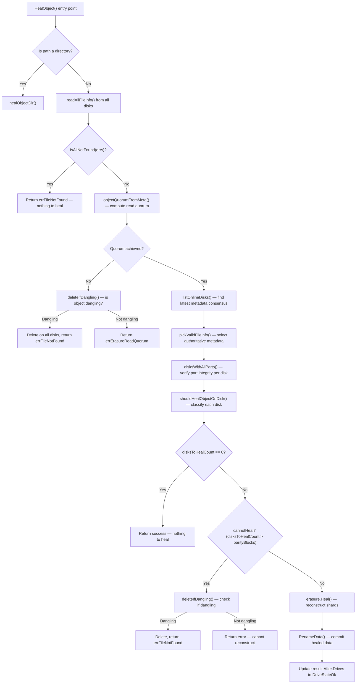

# Technical Specification

# 0. Agent Action Plan

## 0.1 Intent Clarification

### 0.1.1 Core Feature Objective

Based on the prompt, the Blitzy platform understands that the new feature requirement is to **create a comprehensive investigative documentation artifact** that answers a series of deeply technical questions about MinIO's erasure-coding healing subsystem—specifically how healing makes decisions when the cluster state is ambiguous across a 4-disk erasure-coded instance.

The concrete requirements are:

- **Healing Decision Logic Analysis**: Document how MinIO's healing process determines whether to reconstruct an object from valid remaining shards versus deciding the object should remain deleted or degraded, traced directly to source code functions and decision branches in the codebase.
- **Inconsistent-State Scenario Coverage**: Explain what happens when an object exists in an inconsistent state across disks—some disks have valid data, some have corrupted data, and some have nothing—by identifying the exact code paths (`shouldHealObjectOnDisk`, `isObjectDangling`, `deleteIfDangling`, `disksWithAllParts`) that classify each disk and drive the outcome.
- **Healing Output Evidence**: Describe the actual runtime artifacts produced by the healing process: the `madmin.HealResultItem` structure with its before/after `DriveState` values (`DriveStateOk`, `DriveStateMissing`, `DriveStateCorrupt`, `DriveStateOffline`), the `healTrace` function that publishes `madmin.TraceInfo` events, and the `auditHealObject` function that emits audit records.
- **Boundary Conditions**: Define the minimum shard threshold for successful healing (read quorum = `dataBlocks` = `N/2` for a default configuration), the error messages when healing cannot recover (`errErasureReadQuorum`, `ObjectNotFound`, `errFileCorrupt`), and whether behavior differs between partially failed writes versus partially failed deletes.
- **Runtime Evidence Focus**: The user explicitly requires evidence from code behavior—not abstract theory—requiring direct citation of test cases (e.g., `TestIsObjectDangling`, `TestHealingDanglingObject`, `TestHealObjectCorruptedParts`, `TestHealObjectCorruptedXLMeta`) and code-level decision flow, not conceptual summaries.
- **No Source Modification**: Per the implementation rule `SWE-AtlasQnA-Repo`, existing source files must not be modified. The output is a single markdown document placed in `blitzy/documentation/`.
- **Cleanup Requirement**: No test scenarios need to be persisted; the document itself is the deliverable, and any runtime evidence is cited from the existing test suite and source code.

Implicit requirements detected:

- The document must provide the mapping between the 4-disk EC:2 setup's quorum arithmetic (2 data + 2 parity) and the specific code-level thresholds that trigger "heal", "delete as dangling", or "leave alone" decisions.
- The MRF (Missing Replicas Fix) subsystem (`cmd/mrf.go`) is relevant because it captures partial operations (writes and deletes that reached quorum but not all disks) and feeds them into the healing pipeline—this is the mechanism that handles partially failed writes and deletes.
- The answer must distinguish between metadata-level corruption (`xl.meta` missing or corrupt) and data-level corruption (part files missing or corrupt) because the code handles these through separate classification paths.

### 0.1.2 Special Instructions and Constraints

**Implementation Rule — SWE-AtlasQnA-Repo**:
- Create a new markdown document named `minio_c07e5b49d477.md` (matching the source branch name `minio_c07e5b49d477`).
- Place the document in the `blitzy/documentation/` directory in the destination repo.
- Provide thinking and rationale behind answers; base all conclusions on the code as the source of truth.
- Do not modify any existing files in the source repository.
- Do not add any other code in the source repository besides the requested document.

**Architectural Requirements**:
- All answers must be grounded in specific file paths, function names, line ranges, and test-case behaviors from the MinIO codebase.
- The document must serve as an onboarding resource—written for someone new to the repo who wants to understand the healing subsystem in depth.

### 0.1.3 Technical Interpretation

These feature requirements translate to the following technical implementation strategy:

- To **answer the healing decision logic questions**, we will trace the complete code flow from `HealObject` (entry point at `cmd/erasure-healing.go:1038`) through `healObject` (line 258), through the quorum computation in `objectQuorumFromMeta` (`cmd/erasure-metadata.go:531`), the online-disk selection in `listOnlineDisks` (`cmd/erasure-healing-common.go:219`), the part verification in `disksWithAllParts` (`cmd/erasure-healing-common.go:291`), and the heal-vs-delete decision in `isObjectDangling` (`cmd/erasure-healing.go:968`).
- To **document healing output evidence**, we will catalog the `madmin.HealResultItem` structure (populated at `cmd/erasure-healing.go:277`), the drive-state classification logic (lines 382–404), the `healTrace` function (line 1089), and the `auditHealObject` function (line 221).
- To **define boundary conditions**, we will reference the quorum formula in `objectQuorumFromMeta` and the `cannotHeal` threshold check at line 428, grounded by the `TestHealObjectCorruptedPools` and `TestHealObjectCorruptedXLMeta` test cases that verify the error-case behavior.
- To **distinguish partially failed writes from deletes**, we will document the MRF subsystem in `cmd/mrf.go` and the delete-marker-specific dangling logic in `isObjectDangling` (line 1012).
- To **produce the deliverable**, we will create `blitzy/documentation/minio_c07e5b49d477.md` containing the complete analysis.

## 0.2 Repository Scope Discovery

### 0.2.1 Comprehensive File Analysis

Since this task is a documentation-only Q&A exercise (no source modification), the file analysis focuses on identifying every source file and test file that contains evidence of the healing decision-making process. These files are the evidentiary basis for the answers in the generated document.

**Core Healing Engine Files (read in detail)**:

| File Path | Role in Healing | Key Functions |
|-----------|----------------|---------------|
| `cmd/erasure-healing.go` | Primary healing decision logic and object repair | `healObject`, `HealObject`, `shouldHealObjectOnDisk`, `isObjectDangling`, `isObjectDirDangling`, `healObjectDir`, `defaultHealResult`, `auditHealObject`, `healTrace`, `checkAbandonedParts` |
| `cmd/erasure-healing-common.go` | Quorum-based disk selection, part verification, timestamp reconciliation | `listOnlineDisks`, `disksWithAllParts`, `commonTime`, `commonETag`, `convPartErrToInt`, `partNeedsHealing`, `filterOnlineDisksInplace` |
| `cmd/erasure-decode.go` | Erasure shard reading and reconstruction | `parallelReader.Read`, `Erasure.Decode`, `Erasure.Heal` |
| `cmd/erasure-metadata.go` | Quorum computation, metadata reconciliation | `objectQuorumFromMeta`, `findFileInfoInQuorum`, `pickValidFileInfo`, `listObjectParities`, `commonParity` |
| `cmd/erasure-object.go` | Object operations with dangling detection | `deleteIfDangling`, `auditDanglingObjectDeletion`, `getObjectFileInfo` |
| `cmd/erasure-errors.go` | Error sentinel definitions | `errErasureReadQuorum`, `errErasureWriteQuorum`, `errNoHealRequired` |
| `cmd/global-heal.go` | Background healing orchestration | `newBgHealSequence`, `healErasureSet`, `healBucket`, `healObject`, `getLocalBackgroundHealStatus` |
| `cmd/admin-heal-ops.go` | Admin heal coordination, result buffering | `healSequence`, `healTask`, `queueHealTask`, `healSequenceStart`, `traverseAndHeal` |
| `cmd/background-heal-ops.go` | Heal task routing and worker pool | `healRoutine`, `healTask`, `healResult`, `waitForLowIO` |
| `cmd/mrf.go` | Partial operation tracking (failed writes/deletes) | `PartialOperation`, `mrfState`, `addPartialOp`, `healRoutine`, `shutdown`, `startMRFPersistence` |
| `cmd/data-scanner.go` | Scanner-driven healing trigger | `healDeleteDangling`, `scannerItem.applyHealing`, `scannerItem.applyActions` |
| `cmd/erasure.go` | Erasure set quorum helpers | `defaultWQuorum`, `defaultRQuorum`, `getOnlineDisksWithHealing`, `diskErrToDriveState` |
| `cmd/storage-datatypes.go` | Part check status codes | `checkPartSuccess`, `checkPartFileNotFound`, `checkPartFileCorrupt`, `checkPartDiskNotFound`, `checkPartUnknown` |
| `internal/config/heal/heal.go` | Heal configuration (bitrot, sleep, IO count, workers) | `Config`, `BitrotScanCycle`, `LookupConfig` |

**Test Files (provide runtime evidence of healing behavior)**:

| Test File | Coverage |
|-----------|----------|
| `cmd/erasure-healing_test.go` | `TestIsObjectDangling`, `TestHealing`, `TestHealingVersioned`, `TestHealingDanglingObject`, `TestHealCorrectQuorum`, `TestHealObjectCorruptedPools`, `TestHealObjectCorruptedXLMeta`, `TestHealObjectCorruptedParts`, `TestHealObjectErasure`, `TestHealEmptyDirectoryErasure`, `TestHealLastDataShard` |
| `cmd/erasure-healing-common_test.go` | `TestCommonTime`, `TestListOnlineDisks`, `TestListOnlineDisksSmallObjects`, `TestDisksWithAllParts`, `TestCommonParities` |
| `cmd/erasure-heal_test.go` | `TestErasureHeal` — table-driven test of shard-level healing under various disk failure combinations |

**Build/CI Scripts (end-to-end healing verification)**:

| Script Path | Purpose |
|-------------|---------|
| `buildscripts/verify-healing.sh` | 3-node distributed cluster healing regression: starts cluster, uploads objects, destroys one node's disks, restarts, verifies `format.json` and `xl.meta` convergence |
| `buildscripts/verify-healing-empty-erasure-set.sh` | Healing verification for empty erasure sets |
| `buildscripts/verify-healing-with-root-disks.sh` | Healing verification with root disk configurations |
| `buildscripts/heal-inconsistent-versions.sh` | Regression script for inconsistent version healing |
| `buildscripts/heal-manual.go` | Manual healing test utility |
| `.github/workflows/go-healing.yml` | CI workflow that executes healing verification tests |

### 0.2.2 New File Requirements

Per the `SWE-AtlasQnA-Repo` rule, exactly one new file is created:

| File Path | Purpose |
|-----------|---------|
| `blitzy/documentation/minio_c07e5b49d477.md` | Comprehensive Q&A document answering all questions about MinIO's healing decision-making process in ambiguous cluster states |

No other files are created or modified.

### 0.2.3 Web Search Research Conducted

No web search is required for this task. All answers are derived directly from the source code, test suite, and build scripts within the repository—the code is the authoritative source of truth per the implementation rule.

## 0.3 Dependency Inventory

### 0.3.1 Key Packages Relevant to Healing

Since this is a documentation-only task that produces a markdown file, no packages need to be installed or modified. However, the following packages are critical to understanding the healing subsystem's behavior and are referenced in the generated document:

| Registry | Package | Version | Purpose in Healing Context |
|----------|---------|---------|---------------------------|
| Go module | `github.com/minio/minio` | `go 1.23` | The MinIO server itself — all healing logic resides in the `cmd` package |
| Go module | `github.com/minio/madmin-go/v3` | Per `go.mod` | Admin API types: `HealResultItem`, `HealDriveInfo`, `HealOpts`, `HealScanMode`, `DriveStateOk/Missing/Corrupt/Offline`, `TraceInfo`, `BgHealState` |
| Go module | `github.com/klauspost/reedsolomon` | v1.12.4 | Reed-Solomon erasure coding engine underlying `Erasure.Heal` and `Erasure.Decode` |
| Go module | `github.com/minio/pkg/v3` | Per `go.mod` | Concurrency utilities (`sync/errgroup`), environment helpers (`env`), worker pool (`workers`) |
| Go module | `github.com/tinylib/msgp` | Per `go.mod` | MessagePack serialization for MRF persistence (`PartialOperation.EncodeMsg/DecodeMsg`) |
| Go module | `github.com/dustin/go-humanize` | Per `go.mod` | Human-readable sizes in test cases (e.g., `humanize.MiByte`, `humanize.KiByte`) |
| Go module | `github.com/google/uuid` | Per `go.mod` | UUID generation for temporary heal directories and MRF tracking |

### 0.3.2 Dependency Updates

Not applicable — no dependency changes are required. The deliverable is a standalone markdown document that does not introduce any new code dependencies.

## 0.4 Integration Analysis

### 0.4.1 Existing Code Touchpoints

No code is modified in this task, but the following integration points within the healing subsystem are critical for understanding how healing decisions propagate through the system. These touchpoints are documented in the generated Q&A artifact.

**Healing Entry Points (how healing is triggered)**:

- **`cmd/erasure-healing.go` — `HealObject`** (line 1038): Public entry point invoked by admin heal commands, background heal sequence, and MRF heal routine. Routes to `healObjectDir` for directory objects or `healObject` for regular objects.
- **`cmd/global-heal.go` — `healErasureSet`** (line ~170): Background healing orchestrator that scans all objects in an erasure set and dispatches `healObject` calls through a bounded worker pool.
- **`cmd/mrf.go` — `healRoutine`** (line 220): Consumes `PartialOperation` entries from the MRF channel and dispatches heal calls for objects that had partially successful writes or deletes.
- **`cmd/data-scanner.go` — `scannerItem.applyHealing`**: The data scanner periodically triggers healing during namespace scans when objects are found in degraded states.
- **`cmd/admin-heal-ops.go` — `queueHealTask`**: Admin-initiated heal operations are queued as `healTask` records and processed by the heal worker routine.

**Healing Decision Pipeline (how the decision flows)**:

**Dangling Object Detection Pipeline**:

- **`cmd/erasure-healing.go` — `isObjectDangling`** (line 968): Central function that classifies an object as dangling based on metadata and part error counts across all disks. Separate logic paths exist for:
  - Objects with no valid metadata at all (line 988–1005)
  - Delete markers (line 1012–1017)
  - Objects with valid metadata but missing xl.meta beyond parity threshold (line 1025–1028)
  - Objects with valid metadata but missing parts beyond parity threshold (line 1030–1033)

**MRF (Partial Operation) Pipeline**:

- **`cmd/mrf.go` — `addPartialOp`** (line 78): When a write or delete reaches quorum but not all disks, a `PartialOperation` is enqueued into a buffered channel (capacity 100,000).
- **`cmd/mrf.go` — `shutdown`** (line 102): On shutdown, remaining MRF entries are serialized to disk as `list.bin` under `.minio.sys/.heal/mrf/`.
- **`cmd/mrf.go` — `startMRFPersistence`** (line 155): On startup, persisted MRF entries are loaded and replayed into the heal pipeline.
- **`cmd/mrf.go` — `healRoutine`** (line 220): Consumer loop that processes MRF entries, applies short delays for transient failures, and dispatches bucket or object healing.

### 0.4.2 Database/Schema Updates

Not applicable — no schema changes are required. The healing subsystem operates on on-disk `xl.meta` metadata files and `part.N` data files within the MinIO storage directory structure.

### 0.4.3 Configuration Touchpoints

The following configuration parameters (from `internal/config/heal/heal.go`) affect healing behavior and are documented in the Q&A artifact:

| Config Key | Env Variable | Default | Purpose |
|-----------|-------------|---------|---------|
| `heal:bitrotscan` | `MINIO_HEAL_BITROTSCAN` | `off` | Enables/disables bitrot scanning during healing cycles |
| `heal:max_sleep` | `MINIO_HEAL_MAX_SLEEP` | `250ms` | Maximum sleep between healed objects to throttle I/O |
| `heal:max_io` | `MINIO_HEAL_MAX_IO` | `100` | Maximum concurrent I/O operations during healing |
| `heal:drive_workers` | `MINIO_HEAL_DRIVE_WORKERS` | unset | Number of parallel workers per drive for healing |

## 0.5 Technical Implementation

### 0.5.1 File-by-File Execution Plan

This task requires the creation of exactly one file. No existing files are modified.

**Group 1 — Deliverable Document**:

- **CREATE**: `blitzy/documentation/minio_c07e5b49d477.md` — Comprehensive Q&A document answering all questions about MinIO's healing decision-making process

### 0.5.2 Implementation Approach

The document must be structured as a rigorous technical investigation that addresses each user question with code-level evidence. The following approach governs its construction:

**Step 1: Establish Erasure Coding Context for a 4-Disk Setup**

The document must first establish the arithmetic foundation. For a 4-disk instance with default EC:2 parity:
- Data blocks = 2, Parity blocks = 2
- Read quorum = N/2 = 2 (minimum disks to read an object)
- Write quorum = N/2 + 1 = 3 (minimum disks to write an object)
- These thresholds are computed in `objectQuorumFromMeta` (`cmd/erasure-metadata.go:531`)

**Step 2: Trace the Healing Decision Flow**

The document must walk through the complete `healObject` function (`cmd/erasure-healing.go:258`), documenting each decision branch:

- `readAllFileInfo` reads `xl.meta` from all 4 disks
- `objectQuorumFromMeta` checks if at least 2 disks have consistent metadata
- `listOnlineDisks` identifies disks holding the latest metadata version by `ModTime` quorum (falling back to `ETag` quorum)
- `disksWithAllParts` verifies data integrity per disk (normal scan checks file existence; deep scan verifies bitrot checksums)
- `shouldHealObjectOnDisk` classifies each disk using five error categories: `errFileNotFound`, `errFileCorrupt`, `errLegacyXLMeta`, `errOutdatedXLMeta`, `errPartMissingOrCorrupt`
- The `cannotHeal` check at line 428: if more disks need healing than the parity block count, the object cannot be reconstructed

**Step 3: Document Each Scenario**

The document must cover these scenarios with code evidence:

- **Scenario A — Enough valid shards exist**: Healing succeeds. `Erasure.Heal()` reconstructs missing/corrupt shards from the `dataBlocks` valid shards, writes to temporary location under `.minio/tmp/`, then renames to final location. Test evidence: `TestHealing`, `TestHealObjectCorruptedParts`.
- **Scenario B — Object is dangling (irrecoverable)**: The object is deleted. `isObjectDangling` returns `true` when missing metadata exceeds parity blocks. `deleteIfDangling` removes the object from all disks and emits an audit record. Test evidence: `TestHealingDanglingObject`, `TestIsObjectDangling`.
- **Scenario C — Ambiguous state (not enough info to decide)**: The object is left alone. When `isObjectDangling` returns `false` because non-actionable errors (like `errDiskNotFound`) prevent a confident decision, `deleteIfDangling` returns `errErasureReadQuorum` and the object remains untouched. Test evidence: `TestIsObjectDangling` cases `FileInfoUndecided-case1`, `FileInfoUndecided-case2`.

**Step 4: Document Healing Output Artifacts**

The document must catalog the observability output:

- `madmin.HealResultItem`: Contains `Before.Drives[]` and `After.Drives[]` arrays, each entry having an `Endpoint` and `State` field. States transition from `Missing`/`Corrupt`→`Ok` on successful heal.
- `healTrace` (`cmd/erasure-healing.go:1089`): Publishes `madmin.TraceInfo` with `TraceType: TraceHealing`, path, duration, and custom fields (`dry`, `remove`, `mode`, `version-id`, `disks`).
- `auditHealObject` (`cmd/erasure-healing.go:221`): Emits audit log entries with pool/set/object info and counts of corrupted/missing blocks.

**Step 5: Document Boundary Conditions**

For a 4-disk EC:2 setup:
- Minimum valid shards for healing = 2 (the `dataBlocks` count)
- Maximum tolerable failures for healing = 2 (the `parityBlocks` count)
- If `disksToHealCount > parityBlocks` → `cannotHeal = true`
- Error when healing fails: `errErasureReadQuorum` ("Read failed. Insufficient number of drives online") or `ObjectNotFound` after dangling deletion

**Step 6: Document Partially Failed Writes vs Deletes**

- Partially failed writes: MRF subsystem captures the `PartialOperation` with bucket, object, version, set/pool indexes. The `healRoutine` later reconstructs the object from remaining quorum shards.
- Partially failed deletes: Delete markers are special — they have no data parts. A dangling delete marker is detected when `notFoundMetaErrs > dataBlocks` (line 1016). A dangling data object requires `notFoundMetaErrs > parityBlocks` (line 1025). This asymmetry means delete markers are more aggressively cleaned up.

### 0.5.3 Key Code Evidence to Include in Document

The document must reference these specific code artifacts as evidence:

| Evidence Type | Source | What It Proves |
|--------------|--------|----------------|
| `shouldHealObjectOnDisk` function | `cmd/erasure-healing.go:156` | Five-category disk classification (missing, corrupt, legacy, outdated, part errors) |
| `cannotHeal` check | `cmd/erasure-healing.go:428` | Threshold: `disksToHealCount > parityBlocks` triggers dangling check |
| `isObjectDangling` function | `cmd/erasure-healing.go:968` | Separate logic for no-valid-meta, delete markers, meta-missing, and parts-missing |
| `TestIsObjectDangling` test cases | `cmd/erasure-healing_test.go:40` | 13 test cases covering decided/undecided/dangling scenarios |
| `TestHealObjectCorruptedPools` test | `cmd/erasure-healing_test.go:982` | Proves healing succeeds when xl.meta is deleted from one disk, and object is auto-deleted when xl.meta is missing from more than `dataBlocks` disks |
| `TestHealObjectCorruptedParts` test | `cmd/erasure-healing_test.go:1297` | Proves healing reconstructs corrupted `part.1` files and handles simultaneous corruption + missing data |
| `PartialOperation` struct | `cmd/mrf.go:51` | MRF tracking structure for partially failed operations |
| Drive state transitions | `cmd/erasure-healing.go:382–404` | Mapping from error types to `DriveState{Ok,Offline,Missing,Corrupt}` |
| `healTrace` function | `cmd/erasure-healing.go:1089` | Trace output with custom fields: `dry`, `remove`, `mode`, `version-id`, `disks` |
| `verify-healing.sh` script | `buildscripts/verify-healing.sh` | End-to-end proof that destroyed node data is reconstructed after cluster restart |

## 0.6 Scope Boundaries

### 0.6.1 Exhaustively In Scope

**Deliverable File**:
- `blitzy/documentation/minio_c07e5b49d477.md` — The sole output artifact

**Source Files Analyzed for Evidence** (read-only, not modified):
- `cmd/erasure-healing.go` — Core healing decision logic, dangling detection, heal trace, audit
- `cmd/erasure-healing-common.go` — Online disk selection, part verification, quorum helpers
- `cmd/erasure-healing_test.go` — All healing test cases providing runtime evidence
- `cmd/erasure-healing-common_test.go` — Tests for disk selection and part verification
- `cmd/erasure-heal_test.go` — Table-driven shard-level healing tests
- `cmd/erasure-decode.go` — Erasure Heal/Decode shard reconstruction logic
- `cmd/erasure-metadata.go` — `objectQuorumFromMeta`, `pickValidFileInfo`, `findFileInfoInQuorum`
- `cmd/erasure-object.go` — `deleteIfDangling`, `auditDanglingObjectDeletion`
- `cmd/erasure-errors.go` — Sentinel error definitions
- `cmd/erasure.go` — Quorum defaults, disk state classification
- `cmd/global-heal.go` — Background healing orchestration
- `cmd/admin-heal-ops.go` — Admin heal sequence management
- `cmd/background-heal-ops.go` — Heal task routing
- `cmd/mrf.go` — MRF partial operation tracking and replay
- `cmd/data-scanner.go` — Scanner-driven healing triggers
- `cmd/storage-datatypes.go` — Part check status code definitions
- `internal/config/heal/heal.go` — Heal configuration parameters
- `buildscripts/verify-healing.sh` — End-to-end healing verification script
- `buildscripts/heal-inconsistent-versions.sh` — Inconsistent version healing regression
- `buildscripts/verify-healing-empty-erasure-set.sh` — Empty erasure set healing verification
- `.github/workflows/go-healing.yml` — CI healing workflow

**Topics Covered in Document**:
- Healing decision flow for 4-disk EC:2 configuration
- How `shouldHealObjectOnDisk` classifies disks
- How `isObjectDangling` determines if an object should be purged
- The `cannotHeal` threshold and its implications
- Healing output structure: `HealResultItem` before/after drive states
- Trace and audit logging: `healTrace`, `auditHealObject`
- Boundary conditions: minimum shards, error messages, quorum arithmetic
- Partially failed writes vs. partially failed deletes (MRF subsystem)
- Delete marker healing vs. data object healing asymmetry

### 0.6.2 Explicitly Out of Scope

- **Modifying any existing source files** — Prohibited by `SWE-AtlasQnA-Repo` rule
- **Creating test scenarios or running MinIO** — The user asked for test demonstrations, but the implementation rule restricts output to a single markdown document; all evidence comes from the existing test suite and source code
- **Healing of `format.json`** — The format-level healing in `HealFormat` (`cmd/erasure-sets.go`) is a different subsystem from object-level healing
- **Site replication healing** — Cross-site replication repair logic is not covered
- **Decommissioning/rebalance healing** — The `SetDataMov` metadata marker and associated logic are out of scope
- **Performance tuning of healing** — Configuration optimization is not addressed
- **Multi-pool healing topology** — The document focuses on a single 4-disk erasure set, not multi-pool routing
- **Batch heal operations** — Admin batch API behavior beyond the core `HealObject` path

## 0.7 Rules for Feature Addition

### 0.7.1 Implementation Rules

The following rules are explicitly mandated by the user and the `SWE-AtlasQnA-Repo` implementation rule:

- **SWE-AtlasQnA-Repo Rule**: Create a new markdown document named `<source_branch_name>.md` (resolved to `minio_c07e5b49d477.md`) that comprehensively answers the question(s) posed in the prompt. Provide thinking and rationale behind the answers. Do not make assumptions—base answers on the code as the truth. Do not modify any existing files in the source repository. Do not add any other code in the source repository besides the requested document. Place the document in the `blitzy/documentation` directory.

- **Code-as-Truth Principle**: Every claim in the document must trace to a specific function, line, test case, or error constant in the MinIO codebase. Avoid theoretical explanations that cannot be verified against the source code.

- **No Source Modification**: The codebase remains untouched. The only filesystem change is the creation of `blitzy/documentation/minio_c07e5b49d477.md`.

- **No Assumptions**: Where the code behavior is ambiguous or depends on runtime configuration, the document must state the exact conditions and configuration parameters rather than assuming defaults.

- **Rationale Required**: The document must explain the "why" behind healing decisions—not just what the code does, but why the thresholds are set where they are (e.g., why dangling detection uses `parityBlocks` as the threshold rather than `dataBlocks` for data objects, but uses `dataBlocks` for delete markers).

### 0.7.2 Document Quality Requirements

- The document must be self-contained and understandable by someone new to the MinIO codebase
- All file paths cited must be relative to the repository root
- All function names must include the receiver type when applicable (e.g., `(er erasureObjects).healObject`)
- Test case names must be exact to allow the reader to locate them via grep
- The document must address every question posed in the original prompt without omission

## 0.8 References

### 0.8.1 Codebase Files and Folders Searched

The following files and folders were directly inspected to derive the conclusions in this Agent Action Plan:

**Root-level exploration**:
- Repository root (`/`) — Identified project structure: `cmd/`, `internal/`, `docs/`, `buildscripts/`, `.github/`, `helm/`, `dockerscripts/`
- `go.mod` — Confirmed Go 1.23 toolchain, module path `github.com/minio/minio`

**Core healing source files (read in full)**:
- `cmd/erasure-healing.go` — Lines 1–1117 (complete file). Contains `healObject`, `HealObject`, `shouldHealObjectOnDisk`, `isObjectDangling`, `isObjectDirDangling`, `healObjectDir`, `defaultHealResult`, `auditHealObject`, `healTrace`, `checkAbandonedParts`, `SetHealing`, `Healing`, `listAndHeal`, `listAllBuckets`, `statAllDirs`, `isAllNotFound`, `isAllBucketsNotFound`, `danglingMetaErrsCount`, `danglingPartErrsCount`
- `cmd/erasure-healing-common.go` — Lines 1–460 (complete file). Contains `commonETags`, `commonTimeAndOccurrence`, `commonTime`, `commonETag`, `listOnlineDisks`, `disksWithAllParts`, `convPartErrToInt`, `partNeedsHealing`, `hasPartErr`, `filterOnlineDisksInplace`, `bootModtimes`, `listObjectModtimes`, `listObjectETags`
- `cmd/erasure-decode.go` — Lines 1–60 (structure and `parallelReader`); summary used for `Erasure.Heal` and `Erasure.Decode`
- `cmd/erasure-metadata.go` — Lines 270–610. Contains `findFileInfoInQuorum`, `pickValidFileInfo`, `objectQuorumFromMeta`
- `cmd/erasure-object.go` — Lines 482–570. Contains `deleteIfDangling`, `auditDanglingObjectDeletion`
- `cmd/erasure-errors.go` — Complete file. Contains `errErasureReadQuorum`, `errErasureWriteQuorum`, `errNoHealRequired`
- `cmd/erasure.go` — Summary used. Contains `defaultWQuorum`, `defaultRQuorum`, `getOnlineDisksWithHealing`, `diskErrToDriveState`
- `cmd/global-heal.go` — Lines 1–100. Contains `newBgHealSequence`, `bgHealingUUID`, `healDeleteDangling`, `getLocalBackgroundHealStatus`
- `cmd/admin-heal-ops.go` — Summary used. Contains heal sequence lifecycle management
- `cmd/background-heal-ops.go` — Lines 1–80. Contains `healTask`, `healResult`, `healRoutine`
- `cmd/mrf.go` — Lines 1–220. Contains `PartialOperation`, `mrfState`, `addPartialOp`, `shutdown`, `startMRFPersistence`, `healRoutine`
- `cmd/data-scanner.go` — Summary used. Contains `healDeleteDangling` constant and `scannerItem.applyHealing`
- `cmd/storage-datatypes.go` — Lines 536–544. Contains `checkPartUnknown`, `checkPartSuccess`, `checkPartDiskNotFound`, `checkPartVolumeNotFound`, `checkPartFileNotFound`, `checkPartFileCorrupt`
- `internal/config/heal/heal.go` — Complete file (189 lines). Contains `Config`, `BitrotScanCycle`, `LookupConfig`, `DefaultKVS`

**Test files (read in full)**:
- `cmd/erasure-healing_test.go` — Lines 1–1700+. Contains 11 test functions covering dangling detection, object healing, versioned healing, quorum correctness, corrupted metadata, corrupted parts, empty directories, and last-data-shard recovery
- `cmd/erasure-healing-common_test.go` — Summary used. Contains `TestCommonTime`, `TestListOnlineDisks`, `TestDisksWithAllParts`, `TestCommonParities`
- `cmd/erasure-heal_test.go` — Summary used. Contains `TestErasureHeal` table-driven shard healing tests

**Build/CI scripts (read in full)**:
- `buildscripts/verify-healing.sh` — Complete file (168 lines). End-to-end healing verification harness

**Grep/search operations**:
- Searched for all files containing `heal` in filename — 21 files identified
- Searched for `checkPartSuccess`/`checkPartFileNotFound`/`checkPartFileCorrupt` across `cmd/` — mapped to definitions and usage sites
- Searched for `errErasureReadQuorum`/`errErasureWriteQuorum` across `cmd/` — mapped all error propagation paths
- Searched for `healDeleteDangling` across `cmd/` — found in `data-scanner.go` and `global-heal.go`
- Searched for `deleteIfDangling` — found in `cmd/erasure-object.go`
- Searched for `objectQuorumFromMeta` — found in `cmd/erasure-metadata.go`
- Searched for `InsufficientReadQuorum` — mapped all generation and handling sites

### 0.8.2 Attachments

No attachments were provided for this project.

### 0.8.3 External References

No external URLs, Figma screens, or third-party resources are referenced. All analysis is derived exclusively from the MinIO source repository.

