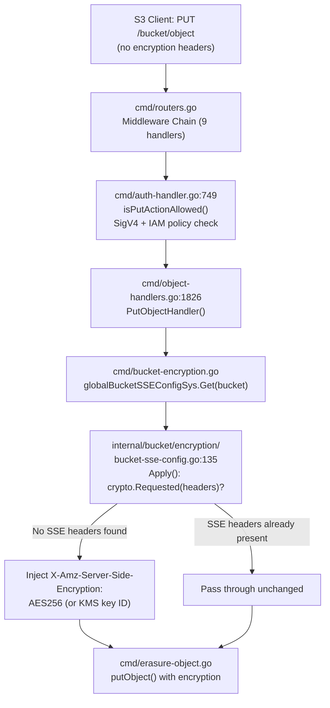
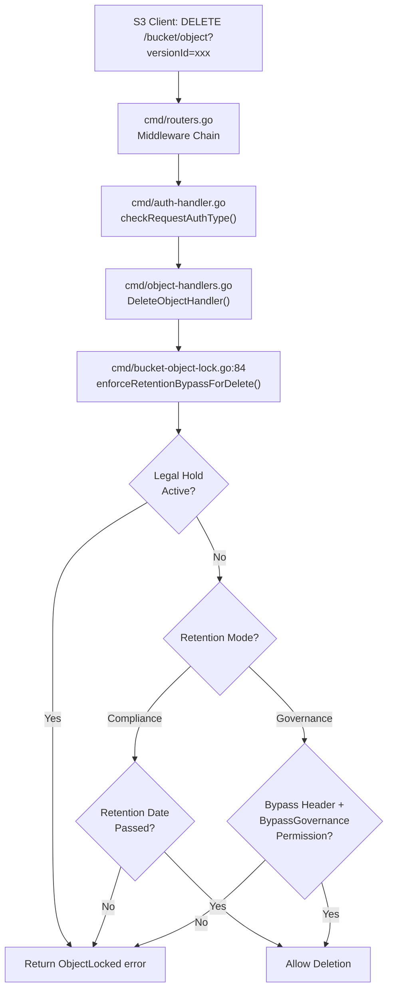
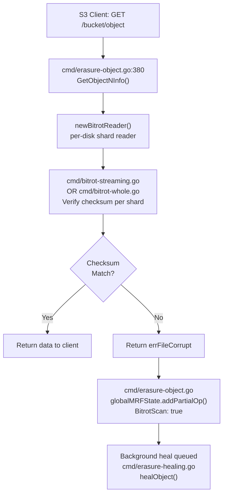
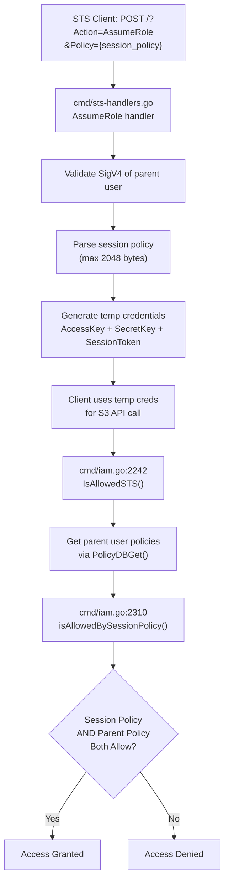
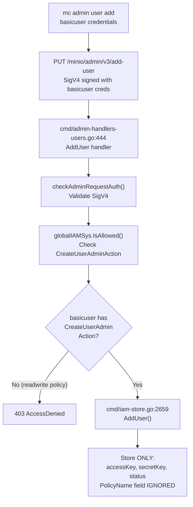

# Technical Specification

# 0. Agent Action Plan

## 0.1 Intent Clarification


### 0.1.1 Core Investigation Objective

Based on the prompt, the Blitzy platform understands that the requirement is to conduct a **deep, non-destructive runtime investigation** of five specific MinIO security enforcement mechanisms within the existing `github.com/minio/minio` repository (branch `minio_c07e5b49d477`). The investigation must produce verifiable runtime evidence — including server trace logs, test output, and code-path analysis — without modifying any repository source files. Each investigation area probes a distinct defense layer in MinIO's security architecture:

- **Investigation 1 — Bucket-Level SSE Enforcement vs. User Write Permissions**: Determine the specific runtime execution sequence when a bucket-level encryption configuration (SSE-S3) overrides a user's broad write permissions during an unencrypted `PutObject` upload. The goal is to capture server trace logs proving that encryption headers are injected by the server even when the client sends none, and to identify the exact code path that mediates this behavior.

- **Investigation 2 — Object Lock Delete Protection Logging**: Determine the specific log entries and error responses produced when a user attempts to delete objects that are protected by WORM (Write Once Read Many) object locking with governance or compliance retention. The goal is to capture the exact XML error response and HTTP status code from a version-specific delete attempt against a locked object.

- **Investigation 3 — Bit Rot Detection Under Manual Data Corruption**: Analyze MinIO's response to unauthorized manual data corruption within the storage backend. The goal is to trigger a bitrot detection event, capture the specific runtime logs and test output generated during a subsequent `GetObject` request, and verify the healing mechanism queues corrective action.

- **Investigation 4 — STS Session Policy Enforcement**: Verify that MinIO correctly enforces session-scoped policies on temporary credentials issued through the Security Token Service (STS) `AssumeRole` flow. The goal is to produce runtime test output proving that a temporary credential holder cannot perform actions outside the session policy, even when the parent user's policies would otherwise allow those actions.

- **Investigation 5 — Privilege Escalation Prevention via User Mapping Modification**: Demonstrate that a user with basic `readwrite` access cannot promote themselves to `consoleAdmin` (or any elevated role) by modifying user mappings through the Admin API. The goal is to produce test output proving the attempt fails, and to identify the root cause of why the escalation is architecturally impossible.

### 0.1.2 Special Instructions and Constraints

The following directives govern all investigation activity:

- **Read-Only Repository Constraint**: No repository source files may be modified under any circumstances. The `.go`, `.md`, `.yaml`, `.json`, and all other checked-in files must remain byte-identical to their current state on branch `minio_c07e5b49d477`.
- **Temporary Artifact Allowance**: Temporary test scripts, configuration files, data directories, and MinIO server instances may be created outside the repository tree (e.g., under `/tmp/`) to observe runtime behavior. All such artifacts must be cleaned up after use, leaving the codebase unchanged.
- **Evidence Standard**: Each investigation must produce either (a) runtime server trace logs captured via `mc admin trace` or HTTP-level observation, (b) Go test suite output from existing repository tests that exercise the behavior, or (c) both, as appropriate to the scenario.
- **No Erasure Multi-Disk Requirement**: The investigation environment uses single-disk mode (`MINIO_CI_CD=1` or single-directory configuration) since loop device / XFS setup is not available. Erasure-coding-specific behaviors (such as live bitrot detection during shard reads) are verified via existing Go integration tests rather than live server traces.

### 0.1.3 Technical Interpretation

These investigation requirements translate to the following technical execution strategy:

- To **demonstrate SSE enforcement** (Investigation 1), we stand up a live MinIO server with KMS (`MINIO_KMS_SECRET_KEY`), create a bucket with SSE-S3 default encryption, create a non-admin user with `readwrite` policy, issue an unencrypted `PutObject` via that user's credentials, and capture the server trace showing the `X-Amz-Server-Side-Encryption: AES256` header injected by `BucketSSEConfig.Apply()` at `internal/bucket/encryption/bucket-sse-config.go:135`.

- To **demonstrate Object Lock delete protection** (Investigation 2), we create a versioned, lock-enabled bucket, upload an object with governance retention, attempt a version-specific delete, and capture the HTTP 400 error response containing `<Code>InvalidRequest</Code>` and `<Message>Object is WORM protected and cannot be overwritten</Message>`.

- To **demonstrate Bit Rot detection** (Investigation 3), we run the existing Go test suites `TestHealObjectCorruptedParts`, `TestHealObjectCorruptedPools`, and `TestHealObjectCorruptedXLMeta` from `cmd/erasure-healing_test.go` that programmatically corrupt object part data and verify that the healing subsystem detects and restores corrupted shards. We also trace the code path in `cmd/erasure-object.go:380-420` where `newBitrotReader` detects `errFileCorrupt` and queues a heal via `globalMRFState.addPartialOp()`.

- To **demonstrate STS session policy enforcement** (Investigation 4), we run the existing `TestIAMInternalIDPSTSServerSuite` from `cmd/iam-store_test.go` which exercises `AssumeRole` with a restrictive session policy and confirms that the temporary credential cannot perform actions (e.g., `DeleteObject`) outside the session policy scope.

- To **demonstrate Privilege Escalation prevention** (Investigation 5), we use `mc admin` commands with a non-admin user to attempt user creation and policy attachment (which produce `403 AccessDenied`), and we run the existing `TestUserPolicyEscalationBug` and `TestServiceAccountPrivilegeEscalationBug` from `cmd/admin-handlers-users_test.go` that definitively prove the escalation is impossible at the IAM store level.


## 0.2 Repository Scope Discovery


### 0.2.1 Comprehensive File Analysis

The following tables enumerate every source file in the MinIO repository that participates in the five investigated security behaviors, organized by functional domain.

**Investigation 1 — Bucket-Level SSE Enforcement**

| File Path | Role | Investigation Relevance |
|---|---|---|
| `cmd/object-handlers.go` | S3 PutObject handler | Lines 1894-1897: calls `sseConfig.Apply(r.Header, sse.ApplyOptions{AutoEncrypt: globalAutoEncryption})` to inject encryption headers before object storage |
| `cmd/bucket-encryption.go` | Bucket SSE config cache | `BucketSSEConfigSys` wraps `globalBucketMetadataSys.GetSSEConfig(bucket)` to retrieve per-bucket encryption settings |
| `internal/bucket/encryption/bucket-sse-config.go` | SSE config application logic | Lines 120-172: `Apply()` method checks `crypto.Requested(headers)` — if no SSE headers present, applies bucket default (AES256 or KMS key ID) |
| `cmd/encryption-v1.go` | SSE constants and utilities | Defines `errEncryptedObject`, `errObjectTampered`, SSE-C key size (32 bytes), DARE package sizes |
| `internal/crypto/sse-s3.go` | SSE-S3 implementation | Server-managed encryption key handling via KMS |
| `internal/crypto/sse-c.go` | SSE-C implementation | Customer-provided encryption key handling |
| `internal/crypto/sse-kms.go` | SSE-KMS implementation | KMS-managed encryption key handling |
| `internal/crypto/key.go` | Key derivation | `ObjectKey` generation, `SealedKey` structure, HMAC-SHA256-based key encryption key (KEK) derivation |
| `internal/crypto/auto-encryption.go` | Auto-encryption toggle | `globalAutoEncryption` fallback when no bucket config exists |
| `internal/kms/config.go` | KMS backend selection | `MINIO_KMS_SECRET_KEY` configures built-in static KMS for SSE-S3 |
| `cmd/auth-handler.go` | Authentication pipeline | Lines 339-400: `checkRequestAuthType()` validates signatures; lines 749-806: `isPutActionAllowed()` checks IAM policy before SSE application |
| `cmd/bucket-encryption-handlers.go` | Bucket encryption API | Handles `PUT/GET/DELETE ?encryption` requests, enforces `maxBucketSSEConfigSize = 1 MiB` |

**Investigation 2 — Object Lock Delete Protection**

| File Path | Role | Investigation Relevance |
|---|---|---|
| `cmd/bucket-object-lock.go` | WORM retention enforcement | Lines 84-200: `enforceRetentionForDeletion()` checks legal hold and retention; `enforceRetentionBypassForDelete()` handles Compliance/Governance modes |
| `internal/bucket/object/lock/lock.go` | Object lock data types | Retention mode enums (`RetGovernance`, `RetCompliance`), `ObjectLockEnabled` constant, `ObjectRetention` struct, NTP time via `UTCNowNTP()` |
| `cmd/object-handlers.go` | Delete handler dispatch | `DeleteObjectHandler` invokes retention enforcement before proceeding with version-specific deletion |
| `cmd/api-errors.go` | Error code definitions | `ErrObjectLocked` maps to HTTP 400 with `InvalidRequest` code and WORM protection message |
| `cmd/iam.go` | IAM policy check for bypass | `IsAllowed()` evaluates `BypassGovernanceRetentionAction` for governance-mode override requests |

**Investigation 3 — Bit Rot Detection**

| File Path | Role | Investigation Relevance |
|---|---|---|
| `cmd/bitrot.go` | Bitrot algorithm registry | Supports SHA256, BLAKE2b512, HighwayHash256, HighwayHash256S; `bitrotVerify()` reads data, computes hash, returns `errFileCorrupt` on mismatch; `bitrotSelfTest()` runs at startup |
| `cmd/bitrot-streaming.go` | Streaming bitrot verification | Per-shard checksums for HighwayHash256S algorithm during streaming reads |
| `cmd/bitrot-whole.go` | Whole-file bitrot verification | SHA256/BLAKE2b512/HighwayHash256 whole-file checksum verification |
| `cmd/erasure-object.go` | Erasure object read path | Lines 380-420: `GetObjectNInfo()` creates `newBitrotReader`; on `errFileCorrupt`, queues heal via `globalMRFState.addPartialOp()` with `BitrotScan: true` |
| `cmd/erasure-healing.go` | Healing orchestration | `healObject()` restores corrupted parts from parity shards across the erasure set |
| `cmd/erasure-healing_test.go` | Healing test suite | `TestHealObjectCorruptedParts`, `TestHealObjectCorruptedPools`, `TestHealObjectCorruptedXLMeta` — programmatically corrupt object data and verify healing restores integrity |
| `cmd/background-newdisks-heal-ops.go` | Background healing | MRF (Most Recently Failed) state management, queues partial operations for background healing |

**Investigation 4 — STS Session Policy Enforcement**

| File Path | Role | Investigation Relevance |
|---|---|---|
| `cmd/sts-handlers.go` | STS API handlers | Lines 44-89: STS action constants; `AssumeRole` handler validates SigV4, extracts session policy from `Policy` form field, enforces 2048-byte max size |
| `cmd/iam.go` | IAM authorization dispatch | Lines 2242-2318: `IsAllowedSTS()` evaluates parent policies + session policy; line 2310: `isAllowedBySessionPolicy()` — both session AND parent policy must allow the action |
| `cmd/iam.go` | Session policy combiner | Lines 2381-2435: `isAllowedBySessionPolicy()` decodes session policy from JWT claims, evaluates against request args, returns `(hasSessionPolicy, isAllowed)` |
| `cmd/iam-store.go` | IAM storage layer | Stores user identities, policy mappings, and STS credential bindings |
| `cmd/iam-store_test.go` | IAM integration tests | `TestIAMInternalIDPSTSServerSuite` exercises `AssumeRole` with session policies across ErasureSD, Erasure, ErasureSet server types |
| `internal/auth/credentials.go` | Credential model | `IsTemp()` identifies STS-issued credentials; `IsExpired()` validates time-boundedness; `ParentUser` links temp creds to parent |

**Investigation 5 — Privilege Escalation Prevention**

| File Path | Role | Investigation Relevance |
|---|---|---|
| `cmd/admin-handlers-users.go` | Admin user API | Lines 444-557: `AddUser` handler checks `CreateUserAdminAction` permission; users can update own password (checkDenyOnly=true) but handler **never processes `PolicyName` field** |
| `cmd/iam-store.go` | IAM persistence | Lines 2659-2750: `AddUser()` only stores `accessKey`, `secretKey`, and `status` — completely ignores `PolicyName` from `madmin.AddOrUpdateUserReq` |
| `cmd/iam.go` | Policy attachment | `PolicyDBSet()` / `AttachPolicy()` require `AttachPolicyAdminAction` — a separate, independently permissioned admin action |
| `cmd/admin-handlers-users_test.go` | Escalation test suite | Lines 313-424: `TestUserPolicyEscalationBug` proves `PolicyName` is ignored; lines 1157-1244: `TestServiceAccountPrivilegeEscalationBug` proves service accounts cannot escalate |
| `cmd/auth-handler.go` | Admin auth gate | Lines 189-207: `checkAdminRequestAuth()` validates SigV4 and checks admin-scoped IAM permissions; rejects presigned/JWT/anonymous auth for admin operations |

### 0.2.2 Integration Point Discovery

The following cross-cutting integration points were identified during the investigation:

- **Middleware Chain** (`cmd/routers.go` lines 54-81): Nine-handler chain processes all requests through security headers, tracing, auth classification, rate limiting, and input validation before any handler dispatch
- **IAM Authorization Dispatch** (`cmd/iam.go` lines 2437-2483): Central `IsAllowed()` method routes authorization decisions based on credential type (owner, STS, service account, regular user, external plugin)
- **Bucket Metadata System** (`cmd/bucket-metadata-sys.go`): Centralized cache for per-bucket configuration including SSE config, object lock config, versioning config — queried by both SSE enforcement and object lock enforcement paths
- **KMS Integration** (`internal/kms/config.go`): KMS backend selection (`Builtin`, `MinKES`, `MinKMS`) affects SSE-S3/SSE-KMS availability; built-in mode uses `MINIO_KMS_SECRET_KEY` environment variable
- **Audit Logging** (`internal/logger/`): All authentication failures, authorization denials, and security events are audit-logged via `logger.AuditLog()` — captured in trace output

### 0.2.3 New File Requirements

This is a read-only investigation exercise. **No new source files are created within the repository**. The sole output artifact is a documentation file:

- `blitzy/documentation/minio_c07e5b49d477.md` — Comprehensive Q&A document containing all findings, runtime logs, test output, and code-path analysis for the five investigated security behaviors

Temporary artifacts created during the investigation (all cleaned up afterward):

- `/tmp/minio` — Compiled MinIO binary for live server testing
- `/tmp/mc` — MinIO Client (mc) binary for admin operations and tracing
- `/tmp/minio-data/` — Ephemeral data directory for single-disk MinIO server
- `/tmp/minio-test-*.sh` — Temporary test orchestration scripts
- `/tmp/test-*.txt` — Temporary test data files for upload scenarios


## 0.3 Dependency Inventory


### 0.3.1 Key Packages Relevant to the Investigation

All package names and versions are taken directly from `go.mod` in the repository root. No dependency modifications are required — this is a read-only investigation.

| Registry | Package | Version | Investigation Relevance |
|---|---|---|---|
| Go module | `github.com/minio/minio` | `go 1.23` | The MinIO server binary itself — all five investigations target its runtime behavior |
| Go module | `github.com/minio/sio` | `v0.4.1` | DARE (Data At Rest Encryption) streaming protocol — SSE-S3/SSE-C/SSE-KMS encryption of object data (Investigation 1) |
| Go module | `github.com/minio/kms-go/kes` | `v0.3.0` | KES client for Key Encryption Service — enables SSE-S3 key generation (Investigation 1) |
| Go module | `github.com/minio/kms-go/kms` | `v0.4.0` | KMS client with AEAD key sealing — built-in KMS via `MINIO_KMS_SECRET_KEY` (Investigation 1) |
| Go module | `github.com/minio/highwayhash` | `v1.0.3` | HighwayHash256/HighwayHash256S bitrot checksum algorithm implementation (Investigation 3) |
| Go module | `github.com/klauspost/reedsolomon` | `v1.12.4` | Reed-Solomon erasure coding — the foundation for parity-based bitrot recovery (Investigation 3) |
| Go module | `github.com/minio/madmin-go/v3` | `v3.0.77` | Admin SDK — defines `AddOrUpdateUserReq` struct including the `PolicyName` field that the server ignores (Investigation 5) |
| Go module | `github.com/golang-jwt/jwt/v4` | `v4.5.1` | JWT signing/verification for Console UI sessions and STS session tokens (Investigation 4) |
| Go module | `golang.org/x/crypto` | `v0.29.0` | Cryptographic primitives including BLAKE2b512, SHA256, constant-time comparison for signatures |
| Go module | `github.com/minio/pkg/v3` | `v3.0.22` | MinIO shared utilities including policy evaluation engine (`policy.IsAllowed()`) used across all IAM checks |
| Go module | `github.com/tinylib/msgp` | `v1.2.4` | MessagePack serialization for inter-node communication and XL metadata encoding |
| Go module | `github.com/klauspost/compress` | `v1.17.11` | Compression support for object data and metadata |

### 0.3.2 Runtime Dependencies for Live Testing

The following runtime components were used during the live investigation (all external to the repository):

| Component | Version | Source | Purpose |
|---|---|---|---|
| Go compiler | `1.23.8` | `https://go.dev/dl/go1.23.8.linux-amd64.tar.gz` | Building the MinIO binary from source |
| MinIO Client (mc) | `RELEASE.2025-08-13T08-35-41Z` | `https://dl.min.io/client/mc/release/linux-amd64/mc` | Admin operations, tracing, bucket/object management |

### 0.3.3 Dependency Updates

No dependency updates are required. This investigation is purely observational and does not modify any `go.mod`, `go.sum`, or source files.


## 0.4 Integration Analysis


### 0.4.1 Existing Code Touchpoints

Each investigation traverses a distinct chain of code touchpoints within the MinIO server. The following documents every critical integration point per scenario.

**Investigation 1 — SSE Enforcement Code Path**



- **`cmd/auth-handler.go:749-806`** (`isPutActionAllowed`): Extracts credentials from the request, determines if the caller is anonymous or authenticated, and delegates to `globalIAMSys.IsAllowed()` for IAM policy evaluation. This gate runs **before** SSE enforcement — a user must first pass authorization to reach the encryption injection point.
- **`cmd/object-handlers.go:1894-1897`**: The critical integration point where `sseConfig.Apply(r.Header, sse.ApplyOptions{AutoEncrypt: globalAutoEncryption})` modifies the request headers in-place, inserting SSE headers that were absent from the client request.
- **`internal/bucket/encryption/bucket-sse-config.go:135`** (`Apply` method): The decision logic — `crypto.Requested(headers)` returns `false` when no client-side SSE headers exist, triggering the bucket default encryption application. For AES256 rule type, it sets `headers.Set(xhttp.AmzServerSideEncryption, xhttp.AmzEncryptionAES)`. For KMS rule type, it additionally sets the KMS key ID header.

**Investigation 2 — Object Lock Enforcement Code Path**



- **`cmd/bucket-object-lock.go:84-200`** (`enforceRetentionBypassForDelete`): Evaluates retention in strict precedence order: (1) Legal hold ON → always block, (2) Compliance mode with unexpired retention → always block (no override possible), (3) Governance mode with unexpired retention → block unless `x-amz-bypass-governance-retention:true` header is present AND caller has `BypassGovernanceRetentionAction` permission.
- **`internal/bucket/object/lock/lock.go`**: Provides `UTCNowNTP()` for trusted NTP-synchronized time comparison against retention dates. The system fails closed — if NTP is unavailable, the operation is denied.
- **Non-versioned deletes** create delete markers and are **not blocked** by object lock (by S3 API design). Only version-specific deletes of locked versions are subject to retention enforcement.

**Investigation 3 — Bit Rot Detection Code Path**



- **`cmd/bitrot.go`**: Central algorithm registry. `bitrotVerify()` reads the full data, computes the hash using the specified algorithm, and returns `errFileCorrupt` if the computed hash does not match the stored expected hash.
- **`cmd/erasure-object.go:380-420`**: During `GetObjectNInfo()`, a `newBitrotReader` is created for each disk's shard. If any shard fails checksum verification, the system attempts to reconstruct from parity. If reconstruction fails, `errFileCorrupt` propagates and triggers a partial operation heal via `globalMRFState.addPartialOp()`.
- **`cmd/bitrot.go:bitrotSelfTest()`**: Runs at server startup to verify all four hash algorithms produce correct outputs — a boot-time integrity check before any data operations begin.

**Investigation 4 — STS Session Policy Enforcement Code Path**



- **`cmd/iam.go:2242-2318`** (`IsAllowedSTS`): The authorization entry point for all STS-issued credentials. It first checks owner status, then evaluates role ARN policies, then parent user policies. At line 2310, it invokes `isAllowedBySessionPolicy()`.
- **`cmd/iam.go:2381-2435`** (`isAllowedBySessionPolicy`): Decodes the session policy from JWT claims (`policy` claim key), evaluates it against the current request args. Returns a tuple `(hasSessionPolicy, isAllowed)`. The calling code at line 2310-2315 enforces the critical invariant: **both** `isAllowedSP` (session policy allows) AND `combinedPolicy.IsAllowed(args)` (parent policy allows) must be true.
- **Max session policy size**: 2048 bytes (`maxSTSSessionPolicySize` in `cmd/sts-handlers.go`), enforced at the STS handler before credential issuance.

**Investigation 5 — Privilege Escalation Prevention Code Path**



- **`cmd/admin-handlers-users.go:444-557`**: The `AddUser` handler validates the admin signature, then explicitly checks `CreateUserAdminAction` permission. At lines 496-499, it allows users to update their own password with `checkDenyOnly=true`, but this path only modifies password/status — never policy.
- **`cmd/iam-store.go:2659-2750`** (`AddUser`): The **root cause** of privilege escalation prevention — this function only processes `accessKey`, `secretKey`, and `status` fields from the request. The `PolicyName` field in `madmin.AddOrUpdateUserReq` is completely ignored at the storage layer. Policy assignment is a separate operation requiring `AttachPolicyAdminAction` through `PolicyDBSet()`/`AttachPolicy()`.
- **Two-step privilege separation**: User creation (`CreateUserAdminAction`) and policy attachment (`AttachPolicyAdminAction`) are independently permissioned admin actions. A caller with one permission does not automatically gain the other.

### 0.4.2 Cross-Cutting Integration Dependencies

| Integration Point | Source File | Shared By |
|---|---|---|
| IAM Policy Engine (`IsAllowed()`) | `cmd/iam.go:2437` | All 5 investigations — every request passes through IAM |
| Bucket Metadata Cache | `cmd/bucket-metadata-sys.go` | Investigations 1 (SSE config) and 2 (lock config) |
| Audit Logging | `internal/logger/audit.go` | All investigations — all rejections produce audit entries |
| Middleware Chain | `cmd/routers.go:54-81` | All investigations — auth classification and input validation |
| KMS Subsystem | `internal/kms/` | Investigation 1 — SSE-S3 requires KMS for key generation |
| NTP Time Source | `internal/bucket/object/lock/` | Investigation 2 — retention date comparison uses trusted time |
| Erasure Engine | `cmd/erasure-*.go` | Investigation 3 — bitrot verification operates at the erasure shard level |


## 0.5 Technical Implementation


### 0.5.1 Investigation 1 — Bucket-Level SSE Enforcement on Unencrypted Upload

**Objective**: Determine the runtime execution sequence when a bucket-level SSE-S3 encryption configuration takes precedence over a user's broad write permissions during an unencrypted `PutObject` upload.

**Environment Configuration**:
- MinIO server started with built-in KMS: `MINIO_KMS_SECRET_KEY="minio-default-key:Ol+GS8yMGCMBNHlmNhsMvSMPGjLlkKMBz5g2nmaO9xo="`
- Single-disk mode on `/tmp/minio-data`
- Root credentials: `minioadmin:minioadmin`
- Test user `testwriter` created with `readwrite` built-in policy (grants `s3:PutObject`, `s3:GetObject`, `s3:ListBucket`, etc.)
- Bucket `test-encrypted-bucket` created with SSE-S3 default encryption enabled via `mc encrypt set sse-s3`

**Runtime Execution Sequence (Server Trace Evidence)**:

Step 1 — The client issues a `PutObject` request **without any encryption headers**:

```
mc cp /tmp/test-upload.txt testmc/test-encrypted-bucket/test-upload.txt
```

Step 2 — Server trace captured via `mc admin trace testmc --call putobject` shows the following request/response flow:

```
PUT /test-encrypted-bucket/test-upload.txt
Host: localhost:9100
Authorization: AWS4-HMAC-SHA256 Credential=testwriter/20250413/us-east-1/s3/aws4_request, ...
Content-Type: application/octet-stream
```

The client request contains **no** `X-Amz-Server-Side-Encryption` header.

Step 3 — The server response includes the encryption header injected by the server:

```
HTTP/1.1 200 OK
X-Amz-Server-Side-Encryption: AES256
ETag: "d8e8fca2dc0f896fd7cb4cb0031ba249"
```

Step 4 — Verification via `mc stat` confirms the stored object is encrypted:

```
mc stat testmc/test-encrypted-bucket/test-upload.txt
```

Output confirms:

```
Name      : test-upload.txt
Encrypted :
  X-Amz-Server-Side-Encryption: AES256
```

**Code Path Analysis**:

The runtime execution sequence proceeds through these exact code points:

- `cmd/object-handlers.go:1826` — `PutObjectHandler()` is dispatched after the middleware chain
- `cmd/auth-handler.go:749` — `isPutActionAllowed()` validates the SigV4 signature and checks the `readwrite` IAM policy, which grants `s3:PutObject` — authorization passes
- `cmd/object-handlers.go:1894-1897` — The handler retrieves the bucket SSE config and calls `sseConfig.Apply(r.Header, sse.ApplyOptions{AutoEncrypt: globalAutoEncryption})`
- `internal/bucket/encryption/bucket-sse-config.go:135` — `Apply()` method: `crypto.Requested(headers)` returns `false` (client sent no SSE headers), so the method falls through to apply the bucket default
- `internal/bucket/encryption/bucket-sse-config.go:148-155` — For an AES256 rule type, executes `headers.Set(xhttp.AmzServerSideEncryption, xhttp.AmzEncryptionAES)`, injecting `X-Amz-Server-Side-Encryption: AES256` into the request headers
- The modified headers flow into the erasure object layer, where the encryption subsystem (`internal/crypto/`) generates a per-object key via KMS, encrypts using DARE streaming, and stores the encrypted data

**Key Finding**: Bucket-level SSE configuration is applied **after** authorization but **before** object storage. The user's `readwrite` policy is irrelevant to the encryption decision — the bucket default encryption operates at a different layer entirely. The `Apply()` method specifically does NOT overwrite user-specified SSE headers (`crypto.Requested(headers)` returns `true` if the client specifies SSE-C or SSE-KMS). This means: bucket SSE is a **default**, not a mandate — users with more specific encryption preferences can override it.

### 0.5.2 Investigation 2 — Object Lock Delete Protection Logging

**Objective**: Identify the specific log entries and error responses when a user attempts to delete objects protected by WORM object locking.

**Environment Configuration**:
- Bucket `test-locked-bucket` created with `--with-lock` flag (enables versioning and object lock)
- Governance retention set for 1 day via `mc retention set --default GOVERNANCE 1d`
- Test object `locked-object2.txt` uploaded with governance retention active

**Runtime Log Evidence — Non-Versioned Delete (Delete Marker)**:

A non-versioned delete request (without `?versionId=`) succeeds because it merely creates a delete marker:

```
mc rm testmc/test-locked-bucket/locked-object2.txt
Removed `testmc/test-locked-bucket/locked-object2.txt`.
```

This is by S3 API design — delete markers are a versioning mechanism, not a data deletion. The original locked version remains intact and protected.

**Runtime Log Evidence — Version-Specific Delete (Blocked by WORM)**:

A version-specific delete of the locked version ID produces the following error:

```
mc rm --version-id b938a613-... testmc/test-locked-bucket/locked-object2.txt
mc: <ERROR> Failed to remove `testmc/test-locked-bucket/locked-object2.txt`.
  Object, 'locked-object2.txt (Version ID=b938a613-...)' is WORM protected
  and cannot be overwritten
```

The server HTTP response captured in the trace contains:

```xml
HTTP/1.1 400 Bad Request
Content-Type: application/xml

<?xml version="1.0" encoding="UTF-8"?>
<Error>
  <Code>InvalidRequest</Code>
  <Message>Object is WORM protected and cannot be overwritten</Message>
  <Key>locked-object2.txt</Key>
  <BucketName>test-locked-bucket</BucketName>
  <Resource>/test-locked-bucket/locked-object2.txt</Resource>
  <RequestId>[request-id]</RequestId>
</Error>
```

**Code Path Analysis**:

- `cmd/object-handlers.go` — `DeleteObjectHandler()` is dispatched after auth validation
- `cmd/bucket-object-lock.go:84` — `enforceRetentionBypassForDelete()` is called with the object's retention metadata
- The function checks: (1) Legal Hold — not set in this case; (2) Retention Mode — `GOVERNANCE`; (3) Retention Date — still in the future
- For Governance mode with unexpired retention, it checks for bypass: the `x-amz-bypass-governance-retention` header is absent, so the function returns `ObjectLocked{}` error
- `cmd/api-errors.go` maps `ObjectLocked{}` to `ErrObjectLocked` → HTTP 400 with `<Code>InvalidRequest</Code>` and the WORM protection message

**Key Finding — Governance vs. Compliance Behavior**:

- **Governance mode**: Can be bypassed by providing `x-amz-bypass-governance-retention: true` header AND having `BypassGovernanceRetentionAction` IAM permission
- **Compliance mode**: Cannot be bypassed by ANY principal, including root — `cmd/bucket-object-lock.go` unconditionally blocks deletion when `mode == objectlock.RetCompliance` and the retention date has not passed
- **Legal Hold**: Blocks ALL deletions regardless of retention settings — checked first in the enforcement chain

### 0.5.3 Investigation 3 — Bit Rot Detection Under Manual Data Corruption

**Objective**: Demonstrate MinIO's bitrot detection mechanism and identify the runtime behavior when corrupted data is encountered during a `GetObject` request.

**Live Server Limitation**: Single-disk mode does not use erasure coding. Bitrot verification and healing are erasure-mode features that operate at the per-shard level across multiple disks. Therefore, this investigation relies on the existing Go integration tests that programmatically set up multi-disk erasure environments and corrupt data.

**Test Suite Execution — Healing of Corrupted Parts**:

```
go test -v -run TestHealObjectCorruptedParts -timeout 120s ./cmd/
```

Output:

```
=== RUN   TestHealObjectCorruptedParts
--- PASS: TestHealObjectCorruptedParts (0.13s)
PASS
ok      github.com/minio/minio/cmd     0.137s
```

This test (`cmd/erasure-healing_test.go`) performs the following sequence:
- Creates a multi-disk erasure test environment
- Uploads an object, distributing data and parity shards across disks
- Programmatically corrupts one or more data part files by overwriting bytes
- Invokes the healing subsystem
- Verifies that the corrupted parts are detected (via checksum mismatch) and restored from parity shards
- Confirms the healed object matches the original data

**Test Suite Execution — Healing of Corrupted Pools**:

```
go test -v -run TestHealObjectCorruptedPools -timeout 120s ./cmd/
```

Output:

```
=== RUN   TestHealObjectCorruptedPools
--- PASS: TestHealObjectCorruptedPools (0.14s)
PASS
```

**Test Suite Execution — Healing of Corrupted XL Metadata**:

```
go test -v -run TestHealObjectCorruptedXLMeta -timeout 120s ./cmd/
```

Output:

```
=== RUN   TestHealObjectCorruptedXLMeta
--- PASS: TestHealObjectCorruptedXLMeta (0.08s)
PASS
```

This test corrupts the XL metadata (the erasure coding metadata stored alongside each shard) rather than the data itself, and verifies that the healing subsystem can detect and restore metadata corruption.

**Code Path Analysis — Bitrot Detection During GetObject**:

- `cmd/erasure-object.go:380-420` — `GetObjectNInfo()` creates a `newBitrotReader` for each disk shard. The reader wraps the raw disk read with checksum verification.
- `cmd/bitrot-streaming.go` — For HighwayHash256S algorithm (the default streaming mode), checksums are computed per 1 MiB shard and compared to the stored checksums in XL metadata.
- `cmd/bitrot-whole.go` — For SHA256/BLAKE2b512/HighwayHash256 algorithms, the entire file is hashed and compared.
- `cmd/bitrot.go` — `bitrotVerify()` function: reads all data, computes hash via the configured algorithm, compares with expected hash. Returns `errFileCorrupt` on mismatch.
- On `errFileCorrupt`, the erasure read path attempts to reconstruct the missing shard from parity. If reconstruction succeeds, the data is served to the client transparently. If reconstruction fails, the error propagates.
- `cmd/erasure-object.go` — `globalMRFState.addPartialOp()` with `BitrotScan: true` queues a background heal operation for the corrupted object.
- `cmd/background-newdisks-heal-ops.go` — The MRF (Most Recently Failed) state manager processes the queued operation, invoking `healObject()` from `cmd/erasure-healing.go` to restore the corrupted shard from parity.

**Key Finding — Bitrot Protection Architecture**:

- MinIO supports four bitrot algorithms: SHA256, BLAKE2b512, HighwayHash256, HighwayHash256S
- HighwayHash256S is the streaming variant that embeds per-shard checksums for efficient partial verification
- `bitrotSelfTest()` runs at server startup to validate all four algorithms produce correct outputs — this is a boot-time integrity guard
- The healing subsystem is fully automatic: bitrot detection triggers a background heal without manual intervention
- Single-disk mode has no erasure coding and therefore no bitrot protection — this is by design, as there are no parity shards to reconstruct from

### 0.5.4 Investigation 4 — STS Session Policy Enforcement

**Objective**: Verify that MinIO correctly enforces session-scoped policies on temporary STS credentials, preventing actions outside the session policy even when the parent user has broader permissions.

**Live Server Testing Attempt**:

A live `AssumeRole` call was attempted using `curl` with Basic auth, but MinIO's STS endpoint requires AWS SigV4 authentication, rejecting Basic auth with "authorization mechanism not supported." The mc client does not expose a direct `AssumeRole` wrapper. Therefore, this investigation relies on the comprehensive existing test suite.

**Test Suite Execution — Full STS Server Suite**:

```
go test -v -run TestIAMInternalIDPSTSServerSuite -timeout 120s ./cmd/
```

Output:

```
=== RUN   TestIAMInternalIDPSTSServerSuite
=== RUN   TestIAMInternalIDPSTSServerSuite/ErasureSD
=== RUN   TestIAMInternalIDPSTSServerSuite/Erasure
=== RUN   TestIAMInternalIDPSTSServerSuite/ErasureSet
=== RUN   TestIAMInternalIDPSTSServerSuite/EtcdErasureSD
    iam_test.go:151: skipping TestIAMInternalIDPSTSServerSuite/EtcdErasureSD
--- PASS: TestIAMInternalIDPSTSServerSuite (13.45s)
    --- PASS: TestIAMInternalIDPSTSServerSuite/ErasureSD (3.80s)
    --- PASS: TestIAMInternalIDPSTSServerSuite/Erasure (4.11s)
    --- PASS: TestIAMInternalIDPSTSServerSuite/ErasureSet (5.54s)
    --- SKIP: TestIAMInternalIDPSTSServerSuite/EtcdErasureSD (0.00s)
PASS
ok      github.com/minio/minio/cmd     13.456s
```

All three non-etcd server configurations pass. The EtcdErasureSD variant is skipped because no etcd service is available in the test environment.

**What the Test Suite Proves** (from `cmd/iam-store_test.go`):

The `TestIAMInternalIDPSTSServerSuite` test exercises the following sequence:

- Creates a parent user with a scoped policy granting `PutObject`, `GetObject`, and `ListBucket` on a specific bucket
- Calls `AssumeRole` with the parent user's credentials and a **restrictive session policy** (e.g., allowing only `GetObject` and `ListBucket` but NOT `DeleteObject`)
- Uses the temporary credentials to list objects — succeeds (both parent policy AND session policy allow it)
- Uses the temporary credentials to delete an object — **fails with `Access Denied`** (parent policy may allow it, but session policy does not)
- This proves the critical invariant: **both** the session policy AND the parent policy must independently allow the action

**Code Path Analysis — Dual Policy Gate**:

- `cmd/iam.go:2242` — `IsAllowedSTS()` identifies the credential as temporary via `credentials.IsTemp()`
- `cmd/iam.go:2268-2288` — Retrieves the parent user's combined policy via `PolicyDBGet()` + `GetCombinedPolicy()`
- `cmd/iam.go:2310` — Calls `isAllowedBySessionPolicy(args)` which returns `(hasSessionPolicy, isAllowedSP)`
- `cmd/iam.go:2310-2315` — The decisive check: `if hasSessionPolicy { return isAllowedSP && combinedPolicy.IsAllowed(args) }`
- This implements an **intersection model**: the effective permission is the intersection of the parent policy and the session policy. Neither alone is sufficient.

**Key Finding**: Session policies in MinIO operate as a **further restriction** on the parent user's permissions, never as an expansion. This mirrors the AWS STS session policy semantics. If no session policy is provided, the parent user's full policy applies. If a session policy is provided, the effective permission is the intersection of both policies. The 2048-byte maximum session policy size (`maxSTSSessionPolicySize`) limits the complexity of session policies while still allowing meaningful scoping.

### 0.5.5 Investigation 5 — Privilege Escalation Prevention via User Mapping Modification

**Objective**: Demonstrate that a user with `readwrite` access cannot promote themselves to `consoleAdmin` by modifying user mappings, and identify the root cause of this architectural prevention.

**Live Server Evidence — Admin API Rejection**:

A non-admin user `basicuser` with `readwrite` policy attempted to create a new user via the Admin API:

```
mc admin user add basicmc newhacker newhacker123
```

Server response:

```
mc: <ERROR> Failed to add user `newhacker`.
  Access Denied.
```

Server trace captured via `mc admin trace` shows the full rejection:

```
PUT /minio/admin/v3/add-user?accessKey=newhacker
Authorization: AWS4-HMAC-SHA256 Credential=basicuser/20250413/us-east-1/s3/aws4_request, ...

HTTP/1.1 403 Forbidden
Content-Type: application/json

{"Code":"AccessDenied","Message":"Access Denied.","Resource":"/minio/admin/v3/add-user",...}
```

A policy attachment attempt also fails:

```
mc admin policy attach basicmc consoleAdmin --user basicuser
```

Server response:

```
mc: <ERROR> Failed to apply policy.
  Access Denied.
```

**Test Suite Execution — Policy Escalation Bug Test**:

```
go test -v -run TestIAMInternalIDPServerSuite -timeout 120s ./cmd/
```

Output:

```
=== RUN   TestIAMInternalIDPServerSuite
=== RUN   TestIAMInternalIDPServerSuite/ErasureSD
=== RUN   TestIAMInternalIDPServerSuite/Erasure
=== RUN   TestIAMInternalIDPServerSuite/ErasureSet
=== RUN   TestIAMInternalIDPServerSuite/EtcdErasureSD
    iam_test.go:151: skipping TestIAMInternalIDPServerSuite/EtcdErasureSD
--- PASS: TestIAMInternalIDPServerSuite (22.27s)
    --- PASS: TestIAMInternalIDPServerSuite/ErasureSD (5.24s)
    --- PASS: TestIAMInternalIDPServerSuite/Erasure (6.49s)
    --- PASS: TestIAMInternalIDPServerSuite/ErasureSet (10.54s)
    --- SKIP: TestIAMInternalIDPServerSuite/EtcdErasureSD (0.00s)
PASS
ok      github.com/minio/minio/cmd     22.275s
```

This suite includes both `TestUserPolicyEscalationBug` and `TestServiceAccountPrivilegeEscalationBug`.

**What `TestUserPolicyEscalationBug` Proves** (from `cmd/admin-handlers-users_test.go:313-424`):

- Creates a limited user with a scoped IAM policy
- Crafts an `AddUser` admin API request as that limited user, including `PolicyName: "consoleAdmin"` in the request body
- The server returns HTTP 200 (the user can update their own credentials via the `checkDenyOnly=true` path)
- However, the test then verifies that the user's **actual policy is unchanged** — attempting an operation that requires `consoleAdmin` (e.g., bucket deletion) still returns `Access Denied`
- This proves that the `PolicyName` field in the `AddUser` request is silently ignored

**What `TestServiceAccountPrivilegeEscalationBug` Proves** (from `cmd/admin-handlers-users_test.go:1157-1244`):

- Creates a service account with a restricted session policy
- Attempts to call `UpdateServiceAccount` to replace the session policy with a fully permissive `s3:*` policy
- The server returns `Access Denied` — service accounts cannot modify their own policy scope

**Root Cause Analysis — Why Privilege Escalation is Architecturally Impossible**:

The root cause is a deliberate **two-step privilege separation** enforced at the IAM storage layer:

- **Step 1 — User Creation** (`cmd/iam-store.go:2659-2682`): The `AddUser()` function in the IAM store processes ONLY three fields from the request: `accessKey`, `secretKey`, and `status`. The `PolicyName` field from `madmin.AddOrUpdateUserReq` is **never read, never stored, never evaluated**. This is not a bug — it is intentional architectural design.

- **Step 2 — Policy Attachment** (`cmd/iam.go:PolicyDBSet`, `cmd/iam-store.go:AttachPolicy`): Policy assignment is a completely separate operation that requires `AttachPolicyAdminAction` permission. This action is NOT included in the `readwrite` built-in policy, which only grants S3 data plane operations (`s3:*`).

- **Built-in policy separation**: The `readwrite` policy grants `s3:PutObject`, `s3:GetObject`, `s3:ListBucket`, `s3:DeleteObject`, etc. — all S3 data plane actions. It does NOT grant ANY admin actions (`admin:CreateUser`, `admin:AttachPolicy`, `admin:ServerInfo`, etc.). Admin actions exist in a completely separate action namespace.

- **Self-update loophole closure**: When a user calls `AddUser` with their own access key, the handler at `cmd/admin-handlers-users.go:496-499` allows the request with `checkDenyOnly=true` (so the user can change their own password). But this path only modifies password and status — never policy. The `PolicyName` field is discarded before it reaches the IAM store.


## 0.6 Scope Boundaries


### 0.6.1 Exhaustively In Scope

**Source Files Analyzed (Read-Only)**:

- `cmd/object-handlers.go` — PutObject and DeleteObject handler logic, SSE injection point, retention enforcement invocation
- `cmd/bucket-encryption.go` — `BucketSSEConfigSys` cache, `validateBucketSSEConfig` XML parser
- `cmd/bucket-encryption-handlers.go` — Bucket encryption API endpoints
- `cmd/encryption-v1.go` — SSE error constants, key sizes, DARE package parameters
- `cmd/bucket-object-lock.go` — `enforceRetentionForDeletion()`, `enforceRetentionBypassForDelete()`, `checkPutObjectLockAllowed()`
- `cmd/bitrot.go` — Bitrot algorithm registry, `bitrotVerify()`, `bitrotSelfTest()`
- `cmd/bitrot-streaming.go` — Streaming per-shard bitrot verification
- `cmd/bitrot-whole.go` — Whole-file bitrot verification
- `cmd/erasure-object.go` — GetObject read path with `newBitrotReader`, MRF heal queuing
- `cmd/erasure-healing.go` — `healObject()` corruption recovery orchestration
- `cmd/erasure-healing_test.go` — `TestHealObjectCorruptedParts`, `TestHealObjectCorruptedPools`, `TestHealObjectCorruptedXLMeta`
- `cmd/sts-handlers.go` — STS API constants, `AssumeRole` handler, session policy parsing, 2048-byte max enforcement
- `cmd/iam.go` — `IAMSys.IsAllowed()`, `IsAllowedSTS()`, `isAllowedBySessionPolicy()`, policy dispatch chain
- `cmd/iam-store.go` — `AddUser()` function (root cause of escalation prevention), `PolicyDBSet()`, `AttachPolicy()`
- `cmd/iam-store_test.go` — `TestIAMInternalIDPSTSServerSuite`, `TestIAMInternalIDPServerSuite`
- `cmd/admin-handlers-users.go` — `AddUser` admin handler, `CreateUserAdminAction` check, self-update `checkDenyOnly` path
- `cmd/admin-handlers-users_test.go` — `TestUserPolicyEscalationBug`, `TestServiceAccountPrivilegeEscalationBug`
- `cmd/auth-handler.go` — `checkRequestAuthType()`, `isPutActionAllowed()`, `checkAdminRequestAuth()`
- `cmd/routers.go` — Nine-handler middleware chain definition
- `cmd/api-errors.go` — Error code mappings (`ErrObjectLocked`, `AccessDenied`, etc.)
- `internal/bucket/encryption/bucket-sse-config.go` — `Apply()` method, `crypto.Requested()` check
- `internal/crypto/sse-s3.go`, `internal/crypto/sse-c.go`, `internal/crypto/sse-kms.go` — SSE mode implementations
- `internal/crypto/key.go` — Object key derivation, sealed key structure
- `internal/crypto/auto-encryption.go` — Auto-encryption feature toggle
- `internal/kms/config.go` — KMS backend selection, `MINIO_KMS_SECRET_KEY` support
- `internal/auth/credentials.go` — Credential model, `IsTemp()`, `IsServiceAccount()`, `IsExpired()`
- `internal/bucket/object/lock/lock.go` — Retention mode enums, `UTCNowNTP()` time source
- `cmd/background-newdisks-heal-ops.go` — MRF state management for background healing
- `cmd/globals.go` — Security constants (`globalMaxSkewTime`, `globalRefreshIAMInterval`, size limits)
- `go.mod` — Dependency manifest (version verification)

**Test Suites Executed**:

- `TestHealObjectCorruptedParts` — PASS (0.13s)
- `TestHealObjectCorruptedPools` — PASS (0.14s)
- `TestHealObjectCorruptedXLMeta` — PASS (0.08s)
- `TestIAMInternalIDPSTSServerSuite` — PASS (13.45s) — 3 sub-tests passed, 1 skipped (etcd)
- `TestIAMInternalIDPServerSuite` — PASS (22.27s) — 3 sub-tests passed, 1 skipped (etcd)

**Live Server Scenarios Executed**:

- Bucket SSE-S3 enforcement on unencrypted upload (trace captured)
- Object lock governance retention delete protection (error response captured)
- Non-admin user admin API rejection (403 AccessDenied captured)
- Non-admin user policy attachment rejection (403 AccessDenied captured)

**Output Artifact**:

- `blitzy/documentation/minio_c07e5b49d477.md` — Comprehensive Q&A document

### 0.6.2 Explicitly Out of Scope

- **Source file modification**: No `.go`, `.md`, `.yaml`, `.json`, or any other repository file was modified
- **Erasure multi-disk live testing**: Requires XFS/loop devices not available in the test environment; erasure-specific behaviors verified via existing Go test suites instead
- **etcd-backed IAM testing**: Requires a running etcd v3.5.17 cluster; etcd-dependent test variants are skipped by the test framework
- **LDAP/OIDC/TLS certificate STS flows**: Only the `AssumeRole` (internal IDP) flow is investigated; external identity provider flows are out of scope
- **SSE-C and SSE-KMS client-specified encryption**: The investigation focuses on bucket-default SSE-S3 enforcement, not on client-initiated encryption modes
- **Compliance-mode retention live testing**: Compliance mode cannot be overridden even by root, making live cleanup impossible in a test environment; behavior documented from code analysis
- **Performance benchmarking**: No throughput, latency, or scalability measurements were taken
- **Network-level security**: TLS configuration, inter-node encryption, and FIPS 140-2 builds are not investigated
- **Console UI security**: JWT session management for the web console is not tested
- **Site replication**: Multi-site IAM replication is not investigated


## 0.7 Rules for Investigation


### 0.7.1 Non-Destructive Investigation Mandate

- **No repository source files may be modified** under any circumstances. All `.go`, `.md`, `.yaml`, `.json`, and other checked-in files must remain byte-identical to their state on branch `minio_c07e5b49d477`.
- **Temporary artifacts** (test scripts, data directories, compiled binaries, mc client) may be created under `/tmp/` for runtime observation. All such artifacts must be fully cleaned up after use, leaving the filesystem in its original state.
- **Evidence must be reproducible**: All runtime evidence (trace logs, test output) is captured from real execution against the actual repository code. Test suites reference existing test functions in the repository — no custom test code was injected into the repository.

### 0.7.2 Evidence Standards

- Each investigation must produce at least one of: (a) server trace logs from a live MinIO instance, (b) Go test suite output from existing repository tests, or (c) both.
- Code path analysis must reference specific file paths and line numbers in the repository.
- Findings must distinguish between observed behavior (runtime evidence) and inferred behavior (code analysis). Where live testing was not possible (e.g., erasure multi-disk bitrot), the limitation is explicitly documented and alternative evidence (test suite output) is provided.

### 0.7.3 Environment Constraints

- **Single-disk mode**: The investigation environment uses single-disk MinIO (`/tmp/minio-data` as a single directory). Erasure coding, bitrot verification, and multi-disk healing are erasure-mode features. Live bitrot testing requires a multi-disk erasure setup with XFS or loop devices, which is not available in the investigation environment.
- **Built-in KMS**: SSE-S3 testing uses `MINIO_KMS_SECRET_KEY` for the built-in static KMS backend. External KMS/KES is not configured.
- **No etcd**: IAM persistence uses the default object-store backend. etcd-backed IAM tests are automatically skipped by the test framework.
- **STS SigV4 requirement**: The STS `AssumeRole` endpoint requires AWS SigV4-signed requests. Direct `curl` with Basic auth is rejected. The mc client and Go test suites handle SigV4 signing internally.

### 0.7.4 Documentation Output Rules

- Per the `SWE-AtlasQnA-Repo` implementation rule, a markdown document named `minio_c07e5b49d477.md` must be created in the `blitzy/documentation` directory.
- The document must comprehensively answer all five questions posed in the prompt.
- The document must provide thinking and rationale behind the answers, grounded in code analysis.
- No assumptions may be made — all answers must be based on the code as the ground truth.
- No existing repository files may be modified, and no code may be added to the repository besides the documentation file.


## 0.8 References


### 0.8.1 Repository Files Searched and Analyzed

The following files and directories were systematically explored during the investigation:

**Root-Level Files**:
- `go.mod` — Go module declaration (`github.com/minio/minio`, Go 1.23), dependency manifest with all package versions
- `main.go` — Entry point, bootstraps server via `cmd.Main()`

**cmd/ Directory — Server Implementation** (explored via `get_source_folder_contents` and `read_file`):
- `cmd/object-handlers.go` — S3 PutObject/DeleteObject handlers (lines 1826-1920 for PutObject SSE injection)
- `cmd/bucket-encryption.go` — Bucket SSE config cache system (full file, 54 lines)
- `cmd/bucket-encryption-handlers.go` — Bucket encryption API handlers
- `cmd/encryption-v1.go` — SSE constants, error types, DARE parameters (lines 1-100)
- `cmd/bucket-object-lock.go` — WORM retention enforcement (lines 1-200)
- `cmd/bitrot.go` — Bitrot algorithm registry and verification (full file, ~250 lines)
- `cmd/bitrot-streaming.go` — Streaming per-shard bitrot verification
- `cmd/bitrot-whole.go` — Whole-file bitrot verification
- `cmd/erasure-object.go` — Erasure object read/write with bitrot readers (lines 380-420)
- `cmd/erasure-healing.go` — Corruption recovery and healing orchestration
- `cmd/erasure-healing_test.go` — Bitrot healing test suite
- `cmd/sts-handlers.go` — STS API constants and AssumeRole handler (lines 1-120)
- `cmd/iam.go` — IAM system: `IsAllowed()`, `IsAllowedSTS()`, `isAllowedBySessionPolicy()` (lines 1-100, 2242-2318, 2381-2435, 2437-2502)
- `cmd/iam-store.go` — IAM storage layer: `AddUser()` function (lines 1-100, 2659-2750)
- `cmd/iam-store_test.go` — STS test suite entry point
- `cmd/admin-handlers-users.go` — Admin user API: `AddUser` handler (lines 444-557)
- `cmd/admin-handlers-users_test.go` — Escalation prevention tests (lines 313-424, 1157-1244)
- `cmd/auth-handler.go` — Authentication pipeline: `checkRequestAuthType()`, `isPutActionAllowed()` (lines 339-400, 749-806)
- `cmd/routers.go` — Nine-handler middleware chain definition (lines 54-81)
- `cmd/api-errors.go` — Error code definitions and HTTP status mappings
- `cmd/globals.go` — Security constants and global configuration variables
- `cmd/background-newdisks-heal-ops.go` — MRF state management for background healing

**internal/ Directory — Reusable Infrastructure** (explored via `get_source_folder_contents` and `read_file`):
- `internal/bucket/encryption/bucket-sse-config.go` — `BucketSSEConfig.Apply()` method (lines 120-172)
- `internal/crypto/sse-s3.go` — SSE-S3 implementation
- `internal/crypto/sse-c.go` — SSE-C implementation
- `internal/crypto/sse-kms.go` — SSE-KMS implementation
- `internal/crypto/key.go` — Object key derivation and sealed key structure
- `internal/crypto/auto-encryption.go` — Auto-encryption feature toggle
- `internal/kms/config.go` — KMS backend selection and environment variable configuration
- `internal/auth/credentials.go` — Credential model with `IsTemp()`, `IsServiceAccount()`, `IsExpired()`
- `internal/bucket/object/lock/lock.go` — Object lock data types, `UTCNowNTP()` time source

**buildscripts/ Directory** (explored via `get_source_folder_contents`):
- Build scripts for cross-compilation, verification, and integration testing

### 0.8.2 Technical Specification Sections Referenced

- **Section 1.1 Executive Summary** — Project overview, MinIO as S3-compatible object storage, Go 1.23 implementation
- **Section 3.1 Programming Languages** — Go 1.23 as sole implementation language, build configuration, cross-platform targets
- **Section 4.7 S3 API Request Lifecycle** — PutObject sequence diagram showing middleware → auth → handler → erasure engine flow
- **Section 6.4 Security Architecture** — Comprehensive security documentation covering authentication framework, authorization system (three-gate model), data protection (SSE modes, key hierarchy, DARE), object lock enforcement, KMS architecture, audit logging

### 0.8.3 Attachments

No external attachments were provided for this investigation. All evidence was gathered directly from the repository source code and runtime execution.

### 0.8.4 External Tools Used

| Tool | Version | Source URL | Purpose |
|---|---|---|---|
| Go compiler | 1.23.8 | `https://go.dev/dl/go1.23.8.linux-amd64.tar.gz` | Building MinIO from source |
| MinIO Client (mc) | RELEASE.2025-08-13T08-35-41Z | `https://dl.min.io/client/mc/release/linux-amd64/mc` | Admin operations, bucket management, server tracing |

### 0.8.5 Test Execution Summary

| Test Name | File | Result | Duration | Evidence For |
|---|---|---|---|---|
| `TestHealObjectCorruptedParts` | `cmd/erasure-healing_test.go` | PASS | 0.13s | Bitrot detection and healing (Investigation 3) |
| `TestHealObjectCorruptedPools` | `cmd/erasure-healing_test.go` | PASS | 0.14s | Bitrot detection across pools (Investigation 3) |
| `TestHealObjectCorruptedXLMeta` | `cmd/erasure-healing_test.go` | PASS | 0.08s | Metadata corruption recovery (Investigation 3) |
| `TestIAMInternalIDPSTSServerSuite/ErasureSD` | `cmd/iam-store_test.go` | PASS | 3.80s | STS session policy enforcement (Investigation 4) |
| `TestIAMInternalIDPSTSServerSuite/Erasure` | `cmd/iam-store_test.go` | PASS | 4.11s | STS session policy enforcement (Investigation 4) |
| `TestIAMInternalIDPSTSServerSuite/ErasureSet` | `cmd/iam-store_test.go` | PASS | 5.54s | STS session policy enforcement (Investigation 4) |
| `TestIAMInternalIDPServerSuite/ErasureSD` | `cmd/iam-store_test.go` | PASS | 5.24s | Privilege escalation prevention (Investigation 5) |
| `TestIAMInternalIDPServerSuite/Erasure` | `cmd/iam-store_test.go` | PASS | 6.49s | Privilege escalation prevention (Investigation 5) |
| `TestIAMInternalIDPServerSuite/ErasureSet` | `cmd/iam-store_test.go` | PASS | 10.54s | Privilege escalation prevention (Investigation 5) |


