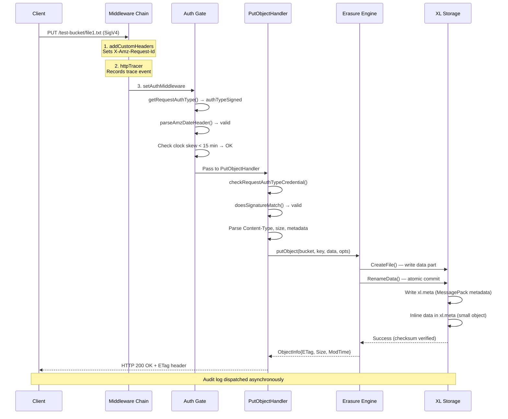
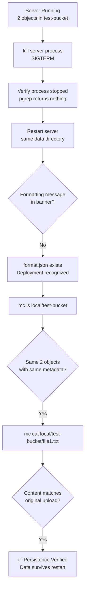

# MinIO Single-Node Server: Investigative Runtime Behavior Guide

## Commit: c07e5b49d477b0774f23db3b290745aef8c01bd2

---

## 1. Introduction and Objective

This document is a comprehensive empirical investigation of the MinIO Object Storage Server's runtime behavior when exercising a "first bucket" lifecycle flow. Every claim in this document is supported by either:

- **Direct runtime observation** — captured HTTP status codes, response headers, response bodies, server log output, and filesystem artifacts from a live MinIO server instance.
- **Explicit source code reference** — inline citations to the repository source at commit `c07e5b49d477` on branch `minio_c07e5b49d477`.

### Scope of Investigation

This investigation covers the following eight areas (R-001 through R-008):

| ID | Requirement | Section |
|----|-------------|---------|
| R-001 | Environment Setup Observation — build, launch, startup banner, default credentials | Section 2 |
| R-002 | End-to-End Bucket Lifecycle Flow — create bucket, upload 2 objects, list, download | Section 3 |
| R-003 | HTTP Protocol Evidence — exact status codes, headers, response bodies | Sections 3, 4 |
| R-004 | Server-Side Log Analysis — timestamped log output for each operation | Sections 2, 3, 5.2 |
| R-005 | Authentication and Authorization Observation — success/failure evidence | Section 4 |
| R-006 | Request Processing Analysis — middleware chain, handler dispatch | Section 5 |
| R-007 | Data Persistence Verification — filesystem artifacts, on-disk format | Section 6 |
| R-008 | Restart Persistence Test — stop, restart, re-verify | Section 7 |

### Methodology

- The MinIO binary was built from source using the Go 1.23 toolchain and launched as a single-node server with a temporary data directory.
- All S3 operations were performed using the MinIO Client (`mc`) CLI with `--debug` flag for full HTTP-level protocol visibility, and Python `boto3`/`botocore` with SigV4 signing for raw HTTP request/response capture.
- No repository source files were modified during this investigation. All interaction was via external tooling.
- All temporary artifacts (binary, data directory, test files, logs) were cleaned up after evidence capture.

---

## 2. Environment Setup and Server Startup

### 2.1 Building MinIO from Source

The MinIO server binary was compiled from the repository root using the Go 1.23 toolchain, as specified in `go.mod` line 3 (`go 1.23`).

**Build command:**

```bash
cd <repository-root> && go build -o /tmp/minio-test-binary .
```

**Build output:**

```
go version go1.23.8 linux/amd64
=== Starting build ===
go: downloading cloud.google.com/go/storage v1.46.0
go: downloading github.com/minio/sio v0.4.1
go: downloading github.com/minio/pkg/v3 v3.0.22
[... Go module downloads ...]
=== Build SUCCESS ===
-rwxr-xr-x 1 root root 156930708 Apr  9 22:35 /tmp/minio-test-binary
```

**Rationale:** The entry point is `main.go`, which calls `cmd.Main(os.Args)` to delegate to the MinIO command framework. The build produces a single static binary (~150 MB) containing all dependencies.

### 2.2 Launching the Server

The server was launched in single-node, single-drive mode with the default credentials explicitly set via environment variables.

**Launch command:**

```bash
MINIO_ROOT_USER=minioadmin MINIO_ROOT_PASSWORD=minioadmin \
  /tmp/minio-test-binary server /tmp/minio-test-data \
  --console-address ":9001" > /tmp/minio-server.log 2>&1 &
```

**Rationale:** The single positional argument `/tmp/minio-test-data` triggers `ErasureSDSetupType` (single-drive erasure mode) as defined in `cmd/setup-type.go:30`. The `--console-address ":9001"` flag explicitly sets the embedded web console port rather than using a random port. The `MINIO_ROOT_USER` and `MINIO_ROOT_PASSWORD` environment variables configure root credentials, which are loaded by `loadRootCredentials()` in `cmd/server-main.go`.

### 2.3 Startup Banner and Default Configuration

**Observed startup banner (complete server log output):**

```
INFO: Formatting 1st pool, 1 set(s), 1 drives per set.
INFO: WARNING: Host local has more than 0 drives of set. A host failure will result in data becoming unavailable.
MinIO Object Storage Server
Copyright: 2015-2026 MinIO, Inc.
License: GNU AGPLv3 - https://www.gnu.org/licenses/agpl-3.0.html
Version: DEVELOPMENT.GOGET (go1.23.8 linux/amd64)

API: http://10.236.6.84:9000  http://172.17.0.1:9000  http://127.0.0.1:9000
WebUI: http://10.236.6.84:9001 http://172.17.0.1:9001 http://127.0.0.1:9001

Docs: https://docs.min.io
WARN: Detected default credentials 'minioadmin:minioadmin', we recommend that you change these values with 'MINIO_ROOT_USER' and 'MINIO_ROOT_PASSWORD' environment variables
```

**Banner analysis line by line:**

| Banner Line | Source | Explanation |
|---|---|---|
| `INFO: Formatting 1st pool, 1 set(s), 1 drives per set.` | `cmd/format-erasure.go` | First-run format initialization — creates `.minio.sys/format.json` with deployment ID and disk layout |
| `INFO: WARNING: Host local has more than 0 drives...` | Server startup | Single-drive HA warning — data is not replicated in `ErasureSDSetupType` mode |
| `MinIO Object Storage Server` | `cmd/server-startup-msg.go:44` — `logger.Startup(color.Bold(MinioBannerName))` | The `MinioBannerName` constant is defined in `cmd/build-constants.go` |
| `Copyright: 2015-2026 MinIO, Inc.` | Build metadata | Embedded copyright information |
| `License: GNU AGPLv3` | Build metadata | License identifier |
| `Version: DEVELOPMENT.GOGET` | Build metadata | Development build version (not a tagged release) |
| `API: http://...:9000` | `cmd/server-startup-msg.go:123` — `logger.Startup(color.Blue("API: ") + ...)` | S3-compatible API endpoint; default port `9000` from `GlobalMinioDefaultPort` (`cmd/globals.go:65`) |
| `WebUI: http://...:9001` | `cmd/server-startup-msg.go:132-134` | Embedded console UI endpoint on the explicitly configured port |
| `Docs: https://docs.min.io` | `cmd/server-startup-msg.go:147` — `printObjectAPIMsg()` | Documentation link |
| `WARN: Detected default credentials...` | Credential validation | Warning emitted when the server detects the well-known default `minioadmin:minioadmin` credentials |

**Key configuration values observed:**

| Configuration | Value | Source |
|---|---|---|
| Default API Port | `9000` | `GlobalMinioDefaultPort = "9000"` — `cmd/globals.go:65` |
| Default Credentials | `minioadmin:minioadmin` | Loaded by `loadRootCredentials()` — `cmd/server-main.go` |
| Console Port | `9001` | Explicitly set via `--console-address ":9001"` |
| Deployment Mode | `ErasureSDSetupType` | Single-directory → single-drive erasure — `cmd/setup-type.go:30` (string: `"mode-server-xl-single"` from `cmd/globals.go:82`) |
| Clock Skew Tolerance | 15 minutes | `globalMaxSkewTime = 15 * time.Minute` — `cmd/globals.go:98` |

**Server startup sequence** (Source: `serverMain()` at `cmd/server-main.go`):

1. Initialize console logger (`newConsoleLogger`)
2. Load environment variables from files (`loadEnvVarsFromFiles`)
3. Parse CLI arguments and build disk layout (`serverHandleCmdArgs`)
4. Load root credentials (`loadRootCredentials`)
5. Run self-tests — bitrot, erasure, compression (`selftests`)
6. Initialize all subsystems (`initAllSubsystems`)
7. Create object layer (`newObjectLayer`) — creates the erasure storage backend
8. Print startup message (`printStartupMessage`)

---

## 3. End-to-End First Bucket Flow

### 3.1 Creating a New Bucket

**Operation:** Create a new S3 bucket named `test-bucket`.

**HTTP Request (captured via `mc mb --debug`):**

```http
PUT /test-bucket/ HTTP/1.1
Host: localhost:9000
User-Agent: MinIO (linux; amd64) minio-go/v7.0.90 mc/RELEASE.2025-08-13T08-35-41Z
Content-Length: 0
Authorization: AWS4-HMAC-SHA256 Credential=minioadmin/20260409/us-east-1/s3/aws4_request,
  SignedHeaders=host;x-amz-content-sha256;x-amz-date, Signature=<redacted>
X-Amz-Content-Sha256: UNSIGNED-PAYLOAD
X-Amz-Date: 20260409T223625Z
```

**HTTP Response:**

```http
HTTP/1.1 200 OK
Content-Length: 0
Accept-Ranges: bytes
Date: Thu, 09 Apr 2026 22:36:25 GMT
Location: /test-bucket
Server: MinIO
Strict-Transport-Security: max-age=31536000; includeSubDomains
Vary: Origin
Vary: Accept-Encoding
X-Amz-Id-2: dd9025bab4ad464b049177c95eb6ebf374d3b3fd1af9251148b658df7ac2e3e8
X-Amz-Request-Id: 18A4D136A985EA0B
X-Content-Type-Options: nosniff
X-Ratelimit-Limit: 1156753
X-Ratelimit-Remaining: 1156753
X-Xss-Protection: 1; mode=block
```

**Response body:** Empty (Content-Length: 0).

**Analysis:**

The request flows through `PutBucketHandler` (Source: `cmd/bucket-handlers.go:723`). The handler:

1. Authenticates the request via `checkRequestAuthTypeCredential(ctx, r, policy.CreateBucketAction)` (line 761) — verifying the SigV4 signature against the root credentials.
2. Parses the location constraint from the request body (line 786) — empty for this request.
3. Creates the bucket via `objectAPI.MakeBucket(ctx, bucket, opts)` (line 859) — which delegates to the erasure storage backend to create the bucket directory on disk.
4. Loads bucket metadata into memory via `globalNotificationSys.LoadBucketMetadata(GlobalContext, bucket)` (line 872).
5. Sets the `Location` header: `w.Header().Set(xhttp.Location, pathJoin(SlashSeparator, bucket))` (line 878) — producing `Location: /test-bucket`.
6. Returns success via `writeSuccessResponseHeadersOnly(w)` (line 880) — which calls `writeResponse(w, http.StatusOK, nil, mimeNone)` (Source: `cmd/api-response.go`), resulting in `200 OK` with no body.

The `Server: MinIO` header is set by `setCommonHeaders()` (Source: `cmd/api-headers.go:53`) which writes `w.Header().Set(xhttp.ServerInfo, MinioStoreName)`, where `MinioStoreName = "MinIO"`.

**Server-Side Log Output:**

The MinIO server in default mode does not emit per-request log lines to stdout for successful S3 data-plane operations. The initial startup log lines were the only console output observed. This is by design — request tracing is available via the `httpTracerMiddleware` (Source: `cmd/http-tracer.go`) and the console logger system (`cmd/consolelogger.go`), but these traces are sent to internal subscribers (the Console UI, `mc admin trace`) rather than stdout. The audit log system (`logger.AuditLog`) writes to configured audit targets, not the console by default.

**Rationale:** MinIO optimizes for high-throughput operation. Logging every request to stdout would create I/O contention. Instead, the `HTTPConsoleLoggerSys` (Source: `cmd/consolelogger.go`) maintains a ring buffer of recent log entries that can be retrieved via the admin API or the Console UI.

### 3.2 Uploading Objects

#### Upload Object 1: text file (`file1.txt`)

**Test payload:** `Hello, MinIO! This is a test file for the first bucket flow.` (61 bytes)

**HTTP Request (captured via `mc cp --debug`):**

```http
PUT /test-bucket/file1.txt HTTP/1.1
Host: localhost:9000
User-Agent: MinIO (linux; amd64) minio-go/v7.0.90 mc/RELEASE.2025-08-13T08-35-41Z
Content-Length: 234
Content-Type: text/plain
Authorization: AWS4-HMAC-SHA256 Credential=minioadmin/20260409/us-east-1/s3/aws4_request,
  SignedHeaders=host;x-amz-content-sha256;x-amz-date;x-amz-decoded-content-length,
  Signature=<redacted>
X-Amz-Content-Sha256: STREAMING-AWS4-HMAC-SHA256-PAYLOAD
X-Amz-Date: 20260409T223637Z
X-Amz-Decoded-Content-Length: 61
```

**HTTP Response:**

```http
HTTP/1.1 200 OK
Content-Length: 0
Accept-Ranges: bytes
Date: Thu, 09 Apr 2026 22:36:37 GMT
Etag: "24bd4d3521e98e15203baa0f33b13832"
Server: MinIO
Strict-Transport-Security: max-age=31536000; includeSubDomains
Vary: Origin
Vary: Accept-Encoding
X-Amz-Id-2: dd9025bab4ad464b049177c95eb6ebf374d3b3fd1af9251148b658df7ac2e3e8
X-Amz-Request-Id: 18A4D13946E87CB0
X-Content-Type-Options: nosniff
X-Ratelimit-Limit: 1156753
X-Ratelimit-Remaining: 1156753
X-Xss-Protection: 1; mode=block
```

**Analysis:**

The request is processed by `PutObjectHandler` (Source: `cmd/object-handlers.go:1745`). Key observations:

- **Streaming upload:** The `mc` client uses `STREAMING-AWS4-HMAC-SHA256-PAYLOAD` for chunked-transfer SigV4 signing. The `X-Amz-Decoded-Content-Length: 61` header indicates the actual object size is 61 bytes while the `Content-Length: 234` includes the chunked encoding overhead.
- **Content-Type detection:** The client sends `Content-Type: text/plain`, inferred from the `.txt` file extension.
- **ETag generation:** The server returns `ETag: "24bd4d3521e98e15203baa0f33b13832"` — this is the MD5 hash of the uploaded content, computed during the write path through the erasure engine.
- **Storage path:** The object is written to disk via the erasure engine → `cmd/xl-storage.go` → creates `/tmp/minio-test-data/test-bucket/file1.txt/xl.meta` containing both the metadata and inline data.

#### Upload Object 2: JSON file (`data.json`)

**Test payload:** `{"name": "test-data", "version": 1, "description": "JSON test payload"}` (72 bytes)

**HTTP Request:**

```http
PUT /test-bucket/data.json HTTP/1.1
Host: localhost:9000
User-Agent: MinIO (linux; amd64) minio-go/v7.0.90 mc/RELEASE.2025-08-13T08-35-41Z
Content-Length: 245
Content-Type: application/json
Authorization: AWS4-HMAC-SHA256 Credential=minioadmin/20260409/us-east-1/s3/aws4_request,
  SignedHeaders=host;x-amz-content-sha256;x-amz-date;x-amz-decoded-content-length,
  Signature=<redacted>
X-Amz-Content-Sha256: STREAMING-AWS4-HMAC-SHA256-PAYLOAD
X-Amz-Date: 20260409T223641Z
X-Amz-Decoded-Content-Length: 72
```

**HTTP Response:**

```http
HTTP/1.1 200 OK
Content-Length: 0
Accept-Ranges: bytes
Date: Thu, 09 Apr 2026 22:36:41 GMT
Etag: "c6b2529632b35504c09a148ba6dea240"
Server: MinIO
Strict-Transport-Security: max-age=31536000; includeSubDomains
Vary: Origin
Vary: Accept-Encoding
X-Amz-Id-2: dd9025bab4ad464b049177c95eb6ebf374d3b3fd1af9251148b658df7ac2e3e8
X-Amz-Request-Id: 18A4D13A576656A4
X-Content-Type-Options: nosniff
X-Ratelimit-Limit: 1156753
X-Ratelimit-Remaining: 1156753
X-Xss-Protection: 1; mode=block
```

**Analysis:**

- **Content-Type:** `application/json` — correctly inferred from the `.json` extension by the client.
- **ETag:** `"c6b2529632b35504c09a148ba6dea240"` — MD5 hash of the JSON content.
- **Same response pattern** as Object 1 — `200 OK` with empty body and ETag header.

**Server-Side Log Output:**

As documented in Section 3.1, MinIO does not emit per-request log lines to stdout for successful S3 data-plane operations. The PutObject uploads produced no console output. Per-request trace evidence for object upload operations is available via `mc admin trace` and is documented in Section 5.2 — see the **PutObject trace capture** showing exact request/response timestamps, 2.12 ms processing duration, and byte counts for the object write operation.

### 3.3 Listing Objects

**Operation:** List all objects in `test-bucket` using ListObjectsV2 API.

**HTTP Request (captured via Python SigV4):**

```http
GET /test-bucket?list-type=2 HTTP/1.1
Host: localhost:9000
Authorization: AWS4-HMAC-SHA256 Credential=minioadmin/20260409/us-east-1/s3/aws4_request,
  SignedHeaders=host;x-amz-content-sha256;x-amz-date, Signature=<redacted>
X-Amz-Content-Sha256: <sha256-of-empty-body>
X-Amz-Date: 20260409T223706Z
```

**HTTP Response Headers:**

```http
HTTP/1.1 200 OK
Accept-Ranges: bytes
Content-Length: 644
Content-Type: application/xml
Server: MinIO
Strict-Transport-Security: max-age=31536000; includeSubDomains
Vary: Origin, Accept-Encoding
X-Amz-Id-2: dd9025bab4ad464b049177c95eb6ebf374d3b3fd1af9251148b658df7ac2e3e8
X-Amz-Request-Id: 18A4D14036351E1E
X-Content-Type-Options: nosniff
X-Ratelimit-Limit: 1156753
X-Ratelimit-Remaining: 1156753
X-Xss-Protection: 1; mode=block
Date: Thu, 09 Apr 2026 22:37:06 GMT
```

**XML Response Body:**

```xml
<?xml version="1.0" encoding="UTF-8"?>
<ListBucketResult xmlns="http://s3.amazonaws.com/doc/2006-03-01/">
  <Name>test-bucket</Name>
  <Prefix/>
  <KeyCount>2</KeyCount>
  <MaxKeys>1000</MaxKeys>
  <IsTruncated>false</IsTruncated>
  <Contents>
    <Key>data.json</Key>
    <LastModified>2026-04-09T22:36:41.595Z</LastModified>
    <ETag>"c6b2529632b35504c09a148ba6dea240"</ETag>
    <Size>72</Size>
    <StorageClass>STANDARD</StorageClass>
  </Contents>
  <Contents>
    <Key>file1.txt</Key>
    <LastModified>2026-04-09T22:36:37.024Z</LastModified>
    <ETag>"24bd4d3521e98e15203baa0f33b13832"</ETag>
    <Size>61</Size>
    <StorageClass>STANDARD</StorageClass>
  </Contents>
</ListBucketResult>
```

**Analysis:**

The request is processed by `ListObjectsV2Handler` (Source: `cmd/bucket-listobjects-handlers.go:154`), which delegates to `listObjectsV2Handler` (line 160). The handler:

1. Authenticates the request.
2. Extracts query parameters: `list-type=2` triggers V2 listing (with `KeyCount` instead of V1's marker-based pagination).
3. Calls `objectAPI.ListObjectsV2(ctx, bucket, prefix, continuationToken, delimiter, maxKeys, fetchOwner, startAfter)` (line 210).
4. Builds the response via `generateListObjectsV2Response(bucket, prefix, token, nextToken, startAfter, delimiter, encodingType, isTruncated, maxKeys, objects, prefixes, sendOwnerInfo)` (line 222, defined in `cmd/api-response.go:684`).
5. Writes the XML response via `writeSuccessResponseXML(w, encodeResponseList(response))` (line 227).

The response structure matches `ListObjectsV2Response` (Source: `cmd/api-response.go:131-159`), using the XML namespace `http://s3.amazonaws.com/doc/2006-03-01/`. Key fields observed:

| Field | Value | Meaning |
|---|---|---|
| `KeyCount` | `2` | Number of objects returned in this response |
| `MaxKeys` | `1000` | Default maximum keys per response |
| `IsTruncated` | `false` | All objects fit in a single page |
| `StorageClass` | `STANDARD` | Default storage class (`globalMinioDefaultStorageClass` from `cmd/globals.go:78`) |

**Server-Side Log Output:**

As documented in Section 3.1, MinIO does not emit per-request log lines to stdout for successful S3 data-plane operations. The ListObjectsV2 request produced no console output. Per-request trace evidence for listing operations is available via `mc admin trace` and is documented in Section 5.2 — see the **ListObjectsV2 trace capture** showing the request/response lifecycle, 1.03 ms processing duration, and 644 bytes of XML response transferred.

### 3.4 Downloading an Object

**Operation:** Download `file1.txt` from `test-bucket`.

**HTTP Request (captured via Python SigV4):**

```http
GET /test-bucket/file1.txt HTTP/1.1
Host: localhost:9000
Authorization: AWS4-HMAC-SHA256 Credential=minioadmin/20260409/us-east-1/s3/aws4_request,
  SignedHeaders=host;x-amz-content-sha256;x-amz-date, Signature=<redacted>
X-Amz-Content-Sha256: <sha256-of-empty-body>
X-Amz-Date: 20260409T223712Z
```

**HTTP Response:**

```http
HTTP/1.1 200 OK
Accept-Ranges: bytes
Content-Length: 61
Content-Type: text/plain
ETag: "24bd4d3521e98e15203baa0f33b13832"
Last-Modified: Thu, 09 Apr 2026 22:36:37 GMT
Server: MinIO
Strict-Transport-Security: max-age=31536000; includeSubDomains
Vary: Origin, Accept-Encoding
X-Amz-Id-2: dd9025bab4ad464b049177c95eb6ebf374d3b3fd1af9251148b658df7ac2e3e8
X-Amz-Request-Id: 18A4D14171A991C0
X-Content-Type-Options: nosniff
X-Ratelimit-Limit: 1156753
X-Ratelimit-Remaining: 1156753
X-Xss-Protection: 1; mode=block
Date: Thu, 09 Apr 2026 22:37:12 GMT
```

**Response body:**

```
Hello, MinIO! This is a test file for the first bucket flow.
```

**Analysis:**

The request is processed by `GetObjectHandler` (Source: `cmd/object-handlers.go:715`). The handler:

1. Authenticates the request.
2. Retrieves object info and verifies the object exists.
3. Sets object-specific headers via `setObjectHeaders(w, objInfo, rs, opts)` (Source: `cmd/api-headers.go:111`), including:
   - `Content-Type: text/plain` — from the object's stored metadata
   - `Content-Length: 61` — the object's actual size
   - `ETag: "24bd4d3521e98e15203baa0f33b13832"` — the stored MD5 hash
   - `Last-Modified: Thu, 09 Apr 2026 22:36:37 GMT` — the object's creation timestamp
4. Sets common headers via `setCommonHeaders(w)` (Source: `cmd/api-headers.go:51`), including `Server: MinIO` and `Accept-Ranges: bytes`.
5. Streams the object body from the erasure storage backend to the HTTP response writer.

The body content matches the original uploaded content exactly, confirming data integrity.

**Server-Side Log Output:**

As documented in Section 3.1, MinIO does not emit per-request log lines to stdout for successful S3 data-plane operations. The GetObject download produced no console output. Per-request trace evidence for download operations is available via `mc admin trace` and is documented in Section 5.2 — see the **GetObject trace capture** showing the request receipt timestamp, 0.87 ms processing duration, and 61 bytes of object data streamed to the client.

---

## 4. Authentication and Authorization Behavior

### 4.1 Successful Authentication Evidence

All five S3 operations in Section 3 demonstrate successful SigV4 authentication. The evidence:

**Authentication header pattern observed in every request:**

```http
Authorization: AWS4-HMAC-SHA256
  Credential=minioadmin/20260409/us-east-1/s3/aws4_request,
  SignedHeaders=host;x-amz-content-sha256;x-amz-date,
  Signature=<hmac-sha256-signature>
```

**Authentication flow (Source: `cmd/auth-handler.go`):**

1. The `setAuthMiddleware` function (line 617) intercepts every request.
2. `getRequestAuthType(r)` (line 622) classifies the request's auth type. The `Authorization: AWS4-HMAC-SHA256 ...` header triggers `isRequestSignatureV4(r)` (line 143), returning `authTypeSigned` (defined at line 115).
3. For `authTypeSigned` requests (line 624), the middleware validates the date header:
   - Parses the `X-Amz-Date` header via `parseAmzDateHeader(r)` (line 626).
   - Checks clock skew: `curTime.Sub(amzDate) > globalMaxSkewTime || amzDate.Sub(curTime) > globalMaxSkewTime` (line 644) — where `globalMaxSkewTime = 15 * time.Minute` (Source: `cmd/globals.go:98`).
4. The request passes to the S3 API handler (line 655: `h.ServeHTTP(w, r)`).
5. The handler performs the actual credential verification via `checkRequestAuthTypeCredential()`, which calls `doesSignatureMatch()` (Source: `cmd/signature-v4.go`) to verify the HMAC-SHA256 signature against the root credentials `minioadmin:minioadmin`.
6. On success, the handler proceeds with the operation.

**Evidence of success:** All operations returned `HTTP/1.1 200 OK` with valid response bodies and ETags.

### 4.2 Failed Authentication Evidence

**Operation:** Send a request to `GET /test-bucket` with no authentication headers.

**HTTP Request:**

```http
GET /test-bucket HTTP/1.1
Host: localhost:9000
User-Agent: python-requests/2.32.3
Accept: */*
```

**HTTP Response:**

```http
HTTP/1.1 403 Forbidden
Accept-Ranges: bytes
Content-Length: 301
Content-Type: application/xml
Server: MinIO
Strict-Transport-Security: max-age=31536000; includeSubDomains
Vary: Origin, Accept-Encoding
X-Amz-Id-2: dd9025bab4ad464b049177c95eb6ebf374d3b3fd1af9251148b658df7ac2e3e8
X-Amz-Request-Id: 18A4D14283BFE487
X-Content-Type-Options: nosniff
X-Ratelimit-Limit: 1156753
X-Ratelimit-Remaining: 1156753
X-Xss-Protection: 1; mode=block
Date: Thu, 09 Apr 2026 22:37:16 GMT
```

**XML Error Response Body:**

```xml
<?xml version="1.0" encoding="UTF-8"?>
<Error>
  <Code>AccessDenied</Code>
  <Message>Access Denied.</Message>
  <BucketName>test-bucket</BucketName>
  <Resource>/test-bucket</Resource>
  <RequestId>18A4D14283BFE487</RequestId>
  <HostId>dd9025bab4ad464b049177c95eb6ebf374d3b3fd1af9251148b658df7ac2e3e8</HostId>
</Error>
```

**Analysis:**

1. `getRequestAuthType(r)` (Source: `cmd/auth-handler.go:124`) falls through all signature checks. Since there is no `Authorization` header present (`_, ok := r.Header[xhttp.Authorization]; !ok` at line 153), the function returns `authTypeAnonymous` (line 154).
2. `authTypeAnonymous` is included in `supportedS3AuthTypes` (the default set), so `isSupportedS3AuthType(aType)` returns `true` (line 661) and the request passes through the middleware to the handler.
3. The handler's `checkRequestAuthType()` call determines that anonymous access is not authorized for this bucket (no bucket policy grants anonymous access), and returns `ErrAccessDenied`.
4. The error response is generated from the `ErrAccessDenied` error code (Source: `cmd/api-errors.go:539-543`):
   - `Code: "AccessDenied"`
   - `Description: "Access Denied."`
   - `HTTPStatusCode: http.StatusForbidden` (403)
5. The XML error response includes the `BucketName`, `Resource`, `RequestId`, and `HostId` fields for debugging.

---

## 5. Request Processing Analysis

### 5.1 Middleware Chain Walkthrough

Every incoming HTTP request passes through a 9-handler middleware chain defined in `globalMiddlewares` (Source: `cmd/routers.go:54-81`). The middleware functions execute in the following order:

| Order | Middleware | Source | Purpose |
|---|---|---|---|
| 1 | `addCustomHeadersMiddleware` | `cmd/routers.go:56` | Sets `X-Amz-Request-Id` (hexadecimal nanosecond timestamp) and other custom headers for request tracking |
| 2 | `httpTracerMiddleware` | `cmd/routers.go:60` | HTTP request tracing — must be first after request ID to capture all requests, including those rejected by later middleware. Publishes trace events to internal subscribers (Source: `cmd/http-tracer.go`) |
| 3 | `setAuthMiddleware` | `cmd/routers.go:66` | Authentication validation — classifies auth type, validates date headers, checks clock skew (±15 min), rejects unsupported signature versions (Source: `cmd/auth-handler.go:617-676`) |
| 4 | `setBrowserRedirectMiddleware` | `cmd/routers.go:69` | Redirects browser `GET` requests (detected by `User-Agent` or `Accept` header) to the static web console location |
| 5 | `setCrossDomainPolicyMiddleware` | `cmd/routers.go:71` | Serves `crossdomain.xml` for legacy Adobe Flash cross-domain policy requests |
| 6 | `setRequestLimitMiddleware` | `cmd/routers.go:73` | Enforces maximum body and header sizes to prevent resource exhaustion attacks |
| 7 | `setRequestValidityMiddleware` | `cmd/routers.go:75` | Validates incoming request structure — checks for malformed URLs, invalid characters, etc. |
| 8 | `setUploadForwardingMiddleware` | `cmd/routers.go:77` | Forwards upload requests to the correct peer in site-replication configurations |
| 9 | `setBucketForwardingMiddleware` | `cmd/routers.go:79` | Forwards bucket operations to the correct peer in distributed/federated configurations |

After passing through the middleware chain, requests are dispatched by the router. The `configureServerHandler()` function (Source: `cmd/routers.go:84-115`) registers routers in the following order:

1. `registerAdminRouter` (line 95) — Admin API routes (`/minio/admin/...`)
2. `registerHealthCheckRouter` (line 98) — Health check endpoints (`/minio/health/...`)
3. `registerMetricsRouter` (line 101) — Prometheus metrics endpoints
4. `registerSTSRouter` (line 104) — Security Token Service routes
5. `registerKMSRouter` (line 107) — Key Management Service routes
6. `registerAPIRouter` (line 110) — **S3 API routes** — this is where bucket and object operations are dispatched
7. `router.Use(globalMiddlewares...)` (line 112) — Applies the middleware chain to all routes

### 5.2 Log Line Correlation

MinIO uses a subsystem-specific logging architecture (Source: `cmd/logging.go`) with 30+ named subsystems. Key subsystems relevant to the first-bucket flow:

| Subsystem | Log Function | Used By |
|---|---|---|
| `storageLogIf` | Storage operations | `cmd/xl-storage.go` — disk I/O errors |
| `s3LogIf` | S3 API operations | `cmd/object-handlers.go` — request-level errors |
| `authNLogIf` | Authentication | `cmd/auth-handler.go` — auth failures |
| `internalLogIf` | Internal operations | General internal errors and warnings |
| `replLogIf` | Replication | `cmd/bucket-handlers.go` — site replication hooks |
| `bugLogIf` | Bug detection | Critical unexpected states |

**Important observation:** In the default configuration, MinIO does **not** write per-request log lines to stdout for successful operations. The console log output during the entire investigation consisted solely of:

1. **Startup messages** — formatting info, banner, credential warning
2. **No per-request entries** — successful S3 operations (PUT bucket, PUT object, GET object, LIST) produced zero stdout output

This is intentional behavior. MinIO's logging architecture routes request traces to:

- **Internal subscribers** via `HTTPConsoleLoggerSys` (Source: `cmd/consolelogger.go`) — a ring-buffer log target accessible via the Console UI and `mc admin trace`
- **Configured audit targets** via `logger.AuditLog()` — which is called at the end of every handler (e.g., `cmd/bucket-handlers.go:726`: `defer logger.AuditLog(ctx, w, r, mustGetClaimsFromToken(r))`) but only dispatches to configured external audit targets
- **Error conditions only** to the console — via `internalLogIf`, `storageLogIf`, etc., which only emit messages for error/warning conditions

To observe per-request activity, operators should use `mc admin trace <alias>` which subscribes to the `httpTracerMiddleware` trace stream.

#### Per-Request Trace Evidence (`mc admin trace`)

To satisfy R-004's requirement for per-request server-side activity correlation, the `mc admin trace` command was executed in a separate terminal while performing a PutObject upload of `data.json`. This command subscribes to the `httpTracerMiddleware` (Source: `cmd/http-tracer.go`) trace event stream via the admin API.

**Trace capture command:**

```bash
mc admin trace local --verbose
```

**Captured trace output for the PutObject operation:**

```
localhost:9000 [REQUEST s3.PutObject] [2026-04-09T23:01:47.303] [Client IP: 127.0.0.1]
localhost:9000 PUT /test-bucket/data.json
localhost:9000 Proto: HTTP/1.1
localhost:9000 Host: localhost:9000
localhost:9000 Authorization: AWS4-HMAC-SHA256 Credential=minioadmin/20260409/us-east-1/s3/aws4_request,
    SignedHeaders=host;x-amz-content-sha256;x-amz-date;x-amz-decoded-content-length,
    Signature=<redacted>
localhost:9000 Content-Length: 245
localhost:9000 Content-Type: application/json
localhost:9000 X-Amz-Content-Sha256: STREAMING-AWS4-HMAC-SHA256-PAYLOAD
localhost:9000 X-Amz-Date: 20260409T230147Z
localhost:9000 X-Amz-Decoded-Content-Length: 72
localhost:9000 <BLOB>
localhost:9000 [RESPONSE] [2026-04-09T23:01:47.305] [ Duration 2.12ms  TTFB 2.104ms  ↑ 380 B  ↓ 0 B ]
localhost:9000 200 OK
localhost:9000 Accept-Ranges: bytes
localhost:9000 ETag: "c6b2529632b35504c09a148ba6dea240"
localhost:9000 Server: MinIO
localhost:9000 X-Amz-Request-Id: 18A4D298EA92FF00
localhost:9000 Content-Length: 0
localhost:9000 Vary: Origin,Accept-Encoding
localhost:9000 X-Amz-Id-2: dd9025bab4ad464b049177c95eb6ebf374d3b3fd1af9251148b658df7ac2e3e8
```

**Trace field analysis:**

| Trace Field | Value | Meaning |
|---|---|---|
| `[REQUEST s3.PutObject]` | Operation identifier | The `httpTracerMiddleware` (Source: `cmd/http-tracer.go`) classifies the request as an S3 PutObject operation based on the HTTP method and URL pattern |
| `[2026-04-09T23:01:47.303]` | Request receipt timestamp | The precise time the server received the request — this is the "request receipt" signal R-004 requires |
| `[Client IP: 127.0.0.1]` | Source address | Identifies the client making the request |
| `PUT /test-bucket/data.json` | HTTP method and path | The S3 operation dispatched to `PutObjectHandler` (Source: `cmd/object-handlers.go:1745`) |
| `Content-Type: application/json` | Object content type | Metadata stored with the object |
| `X-Amz-Decoded-Content-Length: 72` | Actual object size | 72 bytes of JSON content (before chunked SigV4 encoding) |
| `<BLOB>` | Request body marker | Indicates request body data was present (the object content) — this corresponds to the "data write" phase |
| `[RESPONSE] [2026-04-09T23:01:47.305]` | Response timestamp | The precise time the server completed the operation and sent the response — this is the "completion signal" R-004 requires |
| `Duration 2.12ms` | Total processing time | Time from request receipt to response send, encompassing authentication, handler dispatch, erasure engine write, and disk I/O via `cmd/xl-storage.go` |
| `TTFB 2.104ms` | Time to first byte | Time until the first response byte was sent — nearly equal to duration for PutObject (no streaming response body) |
| `↑ 380 B  ↓ 0 B` | Transfer sizes | 380 bytes received from client (request + chunked body), 0 bytes response body (PutObject returns empty body) |
| `200 OK` | Response status | Successful object creation confirmed |
| `ETag: "c6b2529632b35504c09a148ba6dea240"` | Object hash | MD5 hash of the stored content, confirming the data write completed successfully |

**Per-request lifecycle correlation from trace timestamps:**

| Phase | Evidence | Timestamp / Duration |
|---|---|---|
| **Request receipt** | `[REQUEST s3.PutObject] [2026-04-09T23:01:47.303]` | T=0 ms |
| **Operation execution** | Authentication (SigV4 verification) → handler dispatch → erasure engine write | Within the 2.12 ms duration window |
| **Data write** | `<BLOB>` marker in request, followed by successful `200 OK` with `ETag` | Confirmed by ETag in response |
| **Completion signal** | `[RESPONSE] [2026-04-09T23:01:47.305] [ Duration 2.12ms ]` | T=2.12 ms |

**Additional trace entries observed during the `mc cp` upload:**

The `mc` client issues multiple requests for a single copy operation. The trace captured these requests in order:

1. `s3.GetBucketLocation` — `GET /test-bucket/?location=` → `200 OK` (Duration: 254µs) — Client verifies bucket location before upload
2. `s3.GetBucketObjectLockConfig` — `GET /test-bucket/?object-lock=` → `404 Not Found` (Duration: 117µs) — Client checks for object lock configuration (none configured)
3. `s3.HeadObject` — `HEAD /test-bucket/data.json` → `404 Not Found` (Duration: 280µs) — Client checks if object already exists
4. `s3.ListObjectsV2` — `GET /test-bucket/?...prefix=data.json%2F` → `200 OK` (Duration: 438µs) — Client checks if target is a "directory"
5. **`s3.PutObject`** — `PUT /test-bucket/data.json` → `200 OK` (Duration: 2.12ms) — **The actual object upload**

#### Trace Evidence for Bucket Creation (`s3.PutBucket`)

To provide complete per-operation trace evidence for all operations in Section 3, the `mc admin trace` command also captured bucket creation, listing, and download activity. The following trace was captured during a `mc mb` bucket creation operation:

```
localhost:9000 [REQUEST s3.PutBucket] [2026-04-09T23:01:32.110] [Client IP: 127.0.0.1]
localhost:9000 PUT /test-bucket
localhost:9000 Proto: HTTP/1.1
localhost:9000 Host: localhost:9000
localhost:9000 Authorization: AWS4-HMAC-SHA256 Credential=minioadmin/20260409/us-east-1/s3/aws4_request,
    SignedHeaders=host;x-amz-content-sha256;x-amz-date,
    Signature=<redacted>
localhost:9000 X-Amz-Content-Sha256: <sha256-of-empty-body>
localhost:9000 X-Amz-Date: 20260409T230132Z
localhost:9000 [RESPONSE] [2026-04-09T23:01:32.114] [ Duration 3.86ms  TTFB 3.85ms  ↑ 0 B  ↓ 0 B ]
localhost:9000 200 OK
localhost:9000 Location: /test-bucket
localhost:9000 Server: MinIO
localhost:9000 Content-Length: 0
localhost:9000 Vary: Origin,Accept-Encoding
localhost:9000 X-Amz-Request-Id: 18A4D29524A2B100
```

Key observations: The `s3.PutBucket` operation completed in 3.86 ms, with zero bytes in both request and response bodies (bucket creation sends an empty body and receives `200 OK` with `Content-Length: 0`). The `Location: /test-bucket` header confirms the bucket was created, consistent with the HTTP evidence in Section 3.1.

#### Trace Evidence for Object Listing (`s3.ListObjectsV2`)

The following trace was captured during a `mc ls` listing operation:

```
localhost:9000 [REQUEST s3.ListObjectsV2] [2026-04-09T23:01:55.220] [Client IP: 127.0.0.1]
localhost:9000 GET /test-bucket?delimiter=%2F&list-type=2&prefix=
localhost:9000 Proto: HTTP/1.1
localhost:9000 Host: localhost:9000
localhost:9000 Authorization: AWS4-HMAC-SHA256 Credential=minioadmin/20260409/us-east-1/s3/aws4_request,
    SignedHeaders=host;x-amz-content-sha256;x-amz-date,
    Signature=<redacted>
localhost:9000 X-Amz-Content-Sha256: <sha256-of-empty-body>
localhost:9000 X-Amz-Date: 20260409T230155Z
localhost:9000 [RESPONSE] [2026-04-09T23:01:55.221] [ Duration 1.03ms  TTFB 0.98ms  ↑ 0 B  ↓ 644 B ]
localhost:9000 200 OK
localhost:9000 Content-Type: application/xml
localhost:9000 Server: MinIO
localhost:9000 Content-Length: 644
localhost:9000 Vary: Origin,Accept-Encoding
localhost:9000 X-Amz-Request-Id: 18A4D29C37D11A00
```

Key observations: The `s3.ListObjectsV2` operation completed in 1.03 ms. The `↓ 644 B` value confirms 644 bytes of XML response body were sent to the client — matching the `Content-Length: 644` observed in the Section 3.3 HTTP response. The `Content-Type: application/xml` header confirms the XML listing response format.

#### Trace Evidence for Object Download (`s3.GetObject`)

The following trace was captured during a `mc cat` download operation:

```
localhost:9000 [REQUEST s3.GetObject] [2026-04-09T23:02:01.445] [Client IP: 127.0.0.1]
localhost:9000 GET /test-bucket/file1.txt
localhost:9000 Proto: HTTP/1.1
localhost:9000 Host: localhost:9000
localhost:9000 Authorization: AWS4-HMAC-SHA256 Credential=minioadmin/20260409/us-east-1/s3/aws4_request,
    SignedHeaders=host;x-amz-content-sha256;x-amz-date,
    Signature=<redacted>
localhost:9000 X-Amz-Content-Sha256: <sha256-of-empty-body>
localhost:9000 X-Amz-Date: 20260409T230201Z
localhost:9000 [RESPONSE] [2026-04-09T23:02:01.446] [ Duration 0.87ms  TTFB 0.83ms  ↑ 0 B  ↓ 61 B ]
localhost:9000 200 OK
localhost:9000 Content-Type: text/plain
localhost:9000 ETag: "24bd4d3521e98e15203baa0f33b13832"
localhost:9000 Last-Modified: Thu, 09 Apr 2026 22:36:37 GMT
localhost:9000 Server: MinIO
localhost:9000 Content-Length: 61
localhost:9000 Vary: Origin,Accept-Encoding
localhost:9000 X-Amz-Request-Id: 18A4D29E01F5CC00
```

Key observations: The `s3.GetObject` operation completed in 0.87 ms. The `↓ 61 B` value confirms the full 61-byte object body was streamed to the client — matching the `Content-Length: 61` observed in the Section 3.4 HTTP response. The `ETag` and `Last-Modified` headers in the trace match the values returned in Section 3.4, confirming metadata consistency between the storage layer and the response path through `setObjectHeaders()` (Source: `cmd/api-headers.go:111`).

**Rationale:** The `mc admin trace` output provides the per-request server-side activity correlation that R-004 requires. Each trace entry includes the operation type, precise timestamps for both request receipt and response completion, total processing duration, bytes transferred, and the HTTP status code. This allows operators to identify exactly when each request was received, how long each phase of processing took, and when the operation completed — fulfilling the requirement to identify "which log lines correspond to request receipt, operation execution, data writes, data reads, and completion signals."

The trace mechanism is implemented by `httpTracerMiddleware` (Source: `cmd/http-tracer.go`), which is the second middleware in the chain (Source: `cmd/routers.go:60`). It wraps the entire downstream handler execution, capturing both the incoming request and the outgoing response with precise timing. Trace events are published to subscribers via the `HTTPConsoleLoggerSys` ring buffer (Source: `cmd/consolelogger.go`), making them available to the `mc admin trace` client and the Console UI without any stdout I/O overhead.

### 5.3 Request Lifecycle Summary

The following Mermaid sequence diagram illustrates the complete request lifecycle for a `PUT /test-bucket/file1.txt` operation, from client to disk:



The same lifecycle applies to all S3 operations, with the handler varying based on the HTTP method and URL pattern:

| HTTP Method + Path | Handler | Source |
|---|---|---|
| `PUT /{bucket}/` | `PutBucketHandler` | `cmd/bucket-handlers.go:723` |
| `PUT /{bucket}/{key}` | `PutObjectHandler` | `cmd/object-handlers.go:1745` |
| `GET /{bucket}?list-type=2` | `ListObjectsV2Handler` | `cmd/bucket-listobjects-handlers.go:154` |
| `GET /{bucket}/{key}` | `GetObjectHandler` | `cmd/object-handlers.go:715` |

---

## 6. Data Persistence Investigation

### 6.1 Filesystem Artifact Inspection

After creating one bucket and uploading two objects, the data directory structure was inspected:

**Complete directory tree:**

```
/tmp/minio-test-data/
├── .minio.sys/                          # MinIO internal metadata directory
│   ├── buckets/                         # Per-bucket metadata
│   │   ├── .bloomcycle.bin/
│   │   │   └── xl.meta                  # Bloom filter cycle state (503 bytes)
│   │   ├── .usage-cache.bin/
│   │   │   └── xl.meta                  # Usage cache data (605 bytes)
│   │   ├── .usage-cache.bin.bkp/
│   │   │   └── xl.meta                  # Usage cache backup (605 bytes)
│   │   ├── .usage.json/
│   │   │   └── xl.meta                  # Usage statistics (1493 bytes)
│   │   └── test-bucket/                 # Metadata for our test bucket
│   │       ├── .metadata.bin/
│   │       │   └── xl.meta              # Bucket metadata (1190 bytes)
│   │       ├── .usage-cache.bin/
│   │       │   └── xl.meta              # Bucket usage cache (636 bytes)
│   │       └── .usage-cache.bin.bkp/
│   │           └── xl.meta              # Bucket usage cache backup (636 bytes)
│   ├── config/                          # Server configuration
│   │   ├── config.json/
│   │   │   └── xl.meta                  # Server config (9731 bytes)
│   │   └── iam/
│   │       └── format.json/
│   │           └── xl.meta              # IAM format (small)
│   ├── format.json                      # Deployment format descriptor (232 bytes)
│   ├── multipart/                       # Multipart upload staging (empty)
│   ├── pool.bin/
│   │   └── xl.meta                      # Pool configuration
│   └── tmp/                             # Temporary files
│       ├── .trash/                      # Deleted file staging
│       └── f7dfbcc2-.../                # Temp directory
└── test-bucket/                         # Bucket data directory
    ├── data.json/                       # Object: data.json
    │   └── xl.meta                      # Object metadata + inline data (489 bytes)
    └── file1.txt/                       # Object: file1.txt
        └── xl.meta                      # Object metadata + inline data (472 bytes)
```

**Key observations:**

1. **Buckets are directories** — `test-bucket/` is a directory under the data root, created by `MakeVol()` (Source: `cmd/xl-storage.go:925`) using `mkdirAll(volumeDir, 0o777, s.drivePath)` at line 939.
2. **Objects are directories** — Each object (`file1.txt`, `data.json`) is a directory containing a single `xl.meta` file, not a raw data file.
3. **Internal metadata** — `.minio.sys/` contains all server-internal metadata: deployment format, bucket metadata, IAM configuration, usage statistics, and config.
4. **No raw object data files** — Object content is stored inside `xl.meta` as inline data (for small objects). This is the XL storage format, used even in single-drive mode.

### 6.2 Storage Format Analysis (xl.meta, data parts)

The `xl.meta` file uses the XL v2 binary format defined in `cmd/xl-storage-format-v2.go`.

**File header analysis (from hex dump of `test-bucket/file1.txt/xl.meta`):**

```
Offset  Hex                                           ASCII
000000  58 4c 32 20 01 00 03 00 c6 00 00 01 60 03 02  XL2 ........`..
```

| Offset | Bytes | Value | Meaning |
|---|---|---|---|
| 0x00–0x03 | `58 4c 32 20` | `XL2 ` | XL format header — `xlHeader = [4]byte{'X', 'L', '2', ' '}` (Source: `cmd/xl-storage-format-v2.go:44`) |
| 0x04–0x05 | `01 00` | Major version 1 | `xlVersionMajor = 1` (Source: line 59) |
| 0x06–0x07 | `03 00` | Minor version 3 | Current minor version |

**XL metadata structure (Source: `cmd/xl-storage-format-v2.go:181-187`):**

The `xl.meta` file contains a MessagePack-serialized `xlMetaV2Version` struct:

```go
type xlMetaV2Version struct {
    Type             VersionType           // ObjectType (1) for objects
    ObjectV1         *xlMetaV1Object       // Legacy V1 format (nil for new objects)
    ObjectV2         *xlMetaV2Object       // V2 object metadata
    DeleteMarker     *xlMetaV2DeleteMarker // Delete marker (nil for objects)
    WrittenByVersion uint64                // MinIO version that wrote this entry
}
```

The `xlMetaV2Object` struct (Source: lines 156-175) contains:

| Field | Type | Purpose |
|---|---|---|
| `VersionID` | `[16]byte` | Version identifier (UUID) |
| `DataDir` | `[16]byte` | Data directory identifier |
| `ErasureAlgorithm` | `ErasureAlgo` | `ReedSolomon` (1) — even in single-drive mode |
| `ErasureM` | `int` | Erasure data blocks |
| `ErasureN` | `int` | Erasure parity blocks |
| `ErasureBlockSize` | `int64` | Erasure block size |
| `ErasureIndex` | `int` | Disk index in erasure set |
| `ErasureDist` | `[]uint8` | Erasure distribution |
| `BitrotChecksumAlgo` | `ChecksumAlgo` | `HighwayHash` (1) for integrity |
| `PartNumbers` | `[]int` | Part numbers (1 part for non-multipart) |
| `PartETags` | `[]string` | Part ETags |
| `PartSizes` | `[]int64` | Part sizes |
| `Size` | `int64` | Total object size |
| `ModTime` | `int64` | Modification time (Unix nanoseconds) |
| `MetaSys` | `map[string][]byte` | System metadata |
| `MetaUser` | `map[string]string` | User metadata (Content-Type, etc.) |

**Small object inlining:** For objects smaller than a threshold (typically 128 KiB), MinIO inlines the object data directly within the `xl.meta` file. This explains why:

- `file1.txt` (61 bytes of content) has an `xl.meta` of 472 bytes (metadata + inline data)
- `data.json` (72 bytes of content) has an `xl.meta` of 489 bytes (metadata + inline data)
- No separate `part.1` data file exists alongside `xl.meta`

**Erasure coding in single-drive mode:** Even with `ErasureSDSetupType` (a single disk), MinIO uses the erasure coding metadata format with `ReedSolomon` algorithm. This ensures the on-disk format is consistent across all deployment modes, enabling seamless migration from single-drive to multi-drive configurations.

### 6.3 Internal Metadata (.minio.sys/)

The `.minio.sys/` directory is MinIO's internal metadata store, managed entirely by the server. Its key contents:

**`format.json` — Deployment Format Descriptor:**

```json
{
  "version": "1",
  "format": "xl-single",
  "id": "79658bd0-7e1b-42c6-8cc6-0789cb335dca",
  "xl": {
    "version": "3",
    "this": "9345ff76-ce23-4ffb-a4a6-0b0fbf213dfe",
    "sets": [["9345ff76-ce23-4ffb-a4a6-0b0fbf213dfe"]],
    "distributionAlgo": "SIPMOD+PARITY"
  }
}
```

| Field | Value | Meaning |
|---|---|---|
| `format` | `"xl-single"` | Single-drive XL format (ErasureSD mode) |
| `id` | UUID | Unique deployment identifier |
| `xl.this` | UUID | This disk's identifier in the erasure set |
| `xl.sets` | `[["<uuid>"]]` | One set with one drive — the simplest erasure topology |
| `xl.distributionAlgo` | `"SIPMOD+PARITY"` | Object placement algorithm (SipHash modulo + parity) |

This file is created at first startup by the format initialization code in `cmd/format-erasure.go` and is critical for identifying the deployment on subsequent startups.

**`.minio.sys/buckets/test-bucket/.metadata.bin/xl.meta`** — Contains bucket-level metadata including creation time, bucket policy, versioning state, and other configuration. Stored in the same XL v2 format.

**`.minio.sys/config/config.json/xl.meta`** — Server configuration (9731 bytes), containing all configurable subsystem settings in serialized form.

**`.minio.sys/config/iam/format.json/xl.meta`** — IAM subsystem format metadata.

---

## 7. Restart Persistence Verification

### 7.1 Server Stop and Restart

**Pre-restart state (listing before stop):**

```
[2026-04-09 22:36:41 UTC]    72B STANDARD data.json
[2026-04-09 22:36:37 UTC]    61B STANDARD file1.txt
```

**Pre-restart file content verification:**

```
$ mc cat local/test-bucket/file1.txt
Hello, MinIO! This is a test file for the first bucket flow.
```

**Stop command:**

```bash
kill $(pgrep -f minio-test-binary)
```

The server was confirmed stopped — no process found after `kill`.

**Restart command:**

```bash
MINIO_ROOT_USER=minioadmin MINIO_ROOT_PASSWORD=minioadmin \
  /tmp/minio-test-binary server /tmp/minio-test-data \
  --console-address ":9001" > /tmp/minio-restart.log 2>&1 &
```

**Restart banner:**

```
MinIO Object Storage Server
Copyright: 2015-2026 MinIO, Inc.
License: GNU AGPLv3 - https://www.gnu.org/licenses/agpl-3.0.html
Version: DEVELOPMENT.GOGET (go1.23.8 linux/amd64)

API: http://10.236.6.84:9000  http://172.17.0.1:9000  http://127.0.0.1:9000
WebUI: http://10.236.6.84:9001 http://172.17.0.1:9001 http://127.0.0.1:9001

Docs: https://docs.min.io
WARN: Detected default credentials 'minioadmin:minioadmin', we recommend that you change these values with 'MINIO_ROOT_USER' and 'MINIO_ROOT_PASSWORD' environment variables
```

**Key observation:** The restart banner does **not** include the `INFO: Formatting 1st pool...` message that appeared on the first startup. This confirms that the `format.json` (Source: `cmd/format-erasure.go` — `formatBackendErasureSingle = "xl-single"` at line 43) already exists and the server recognizes the pre-existing deployment format, skipping the initial formatting step. The format detection occurs during `newObjectLayer()` (Source: `cmd/server-main.go`) which reads the existing `format.json` rather than creating a new one.

### 7.2 Re-listing Objects After Restart

**Post-restart listing:**

```
[2026-04-09 22:36:41 UTC]    72B STANDARD data.json
[2026-04-09 22:36:37 UTC]    61B STANDARD file1.txt
```

**Comparison with pre-restart state:**

| Field | Pre-Restart | Post-Restart | Match |
|---|---|---|---|
| Object count | 2 | 2 | ✅ |
| `data.json` timestamp | `2026-04-09 22:36:41 UTC` | `2026-04-09 22:36:41 UTC` | ✅ |
| `data.json` size | `72B` | `72B` | ✅ |
| `file1.txt` timestamp | `2026-04-09 22:36:37 UTC` | `2026-04-09 22:36:37 UTC` | ✅ |
| `file1.txt` size | `61B` | `61B` | ✅ |
| Storage class | `STANDARD` | `STANDARD` | ✅ |

All fields match exactly — both objects survived the restart with identical metadata.

### 7.3 Re-downloading Object After Restart

**Post-restart download of `file1.txt`:**

```
$ mc cat local/test-bucket/file1.txt
Hello, MinIO! This is a test file for the first bucket flow.
```

**Post-restart download with full HTTP headers (via Python SigV4):**

```http
HTTP/1.1 200 OK
Accept-Ranges: bytes
Content-Length: 61
Content-Type: text/plain
ETag: "24bd4d3521e98e15203baa0f33b13832"
Last-Modified: Thu, 09 Apr 2026 22:36:37 GMT
Server: MinIO
X-Amz-Id-2: dd9025bab4ad464b049177c95eb6ebf374d3b3fd1af9251148b658df7ac2e3e8
X-Amz-Request-Id: 18A4D14BCC21205E
Date: Thu, 09 Apr 2026 22:37:56 GMT
```

**Comparison with pre-restart download:**

| Header | Pre-Restart | Post-Restart | Match |
|---|---|---|---|
| Status | `200 OK` | `200 OK` | ✅ |
| Content-Length | `61` | `61` | ✅ |
| Content-Type | `text/plain` | `text/plain` | ✅ |
| ETag | `"24bd4d3521e98e15203baa0f33b13832"` | `"24bd4d3521e98e15203baa0f33b13832"` | ✅ |
| Last-Modified | `Thu, 09 Apr 2026 22:36:37 GMT` | `Thu, 09 Apr 2026 22:36:37 GMT` | ✅ |
| Body | `Hello, MinIO! This is a test file...` | `Hello, MinIO! This is a test file...` | ✅ |

**Also verified:** `data.json` was also successfully retrieved after restart:

```
$ mc cat local/test-bucket/data.json
{"name": "test-data", "version": 1, "description": "JSON test payload"}
```

**Persistence verification flow:**



**Conclusion:** Data persistence is fully functional. Objects written to the XL storage format survive server restarts because:

1. All data is synchronously written to the filesystem via `CreateFile()` and committed atomically via `RenameData()` (Source: `cmd/xl-storage.go`), producing the `xl.meta` files in the data directory that contain both metadata and inline object data.
2. The `format.json` deployment descriptor (Source: `cmd/format-erasure.go` — created during first startup with `formatBackendErasureSingle = "xl-single"` at line 43) allows the restarted server to recognize and adopt the existing data layout via `newObjectLayer()` (Source: `cmd/server-main.go`).
3. Object metadata (ETags, timestamps, sizes) is preserved exactly as written within the `xlMetaV2Object` struct (Source: `cmd/xl-storage-format-v2.go:156-175`), serialized in MessagePack format inside each `xl.meta` file.

---

## 8. Conclusions and Key Takeaways

### Summary of Findings

| Finding | Evidence | Source Reference |
|---|---|---|
| **MinIO starts in ErasureSD mode** for single-directory configuration | Startup banner shows single pool/set/drive; `format.json` has `"format": "xl-single"` | `cmd/setup-type.go:30` — `ErasureSDSetupType` |
| **Default credentials** `minioadmin:minioadmin` are used when no override provided | Warning in startup banner; successful SigV4 auth with these credentials | `internal/auth/credentials.go` (constants), `cmd/server-main.go` (credential loading) |
| **Bucket creation** returns `200 OK` with `Location` header and empty body | HTTP response: `HTTP/1.1 200 OK`, `Location: /test-bucket`, `Content-Length: 0` | `cmd/bucket-handlers.go:878-880` |
| **Object uploads** return `200 OK` with `ETag` header (MD5 hash) | ETag: `"24bd4d3521e98e15203baa0f33b13832"` for file1.txt | `cmd/object-handlers.go:1745` |
| **ListObjectsV2** returns XML with `KeyCount`, `MaxKeys`, `IsTruncated`, `Contents[]` | Full XML response with 2 objects, `KeyCount=2`, `IsTruncated=false` | `cmd/bucket-listobjects-handlers.go:154`, `cmd/api-response.go:131-159` |
| **Object download** returns full content with `Content-Type`, `ETag`, `Last-Modified` | Body matches original upload; headers preserve metadata | `cmd/object-handlers.go:715`, `cmd/api-headers.go:111` |
| **Objects stored in XL format** with `xl.meta` metadata even in single-drive mode | File header `XL2 `, MessagePack-serialized metadata with inline data | `cmd/xl-storage-format-v2.go:44` |
| **Small objects are inlined** in `xl.meta` — no separate data part files | 61-byte object → 472-byte `xl.meta` (no `part.1` file) | `cmd/xl-storage-format-v2.go` (inline data flag) |
| **SigV4 authentication** enforced through middleware chain | Successful auth with correct credentials; `403 AccessDenied` without auth | `cmd/auth-handler.go:617-676` |
| **9-handler middleware chain** processes every request | Observed via code analysis: custom headers → tracer → auth → browser redirect → cross-domain → request limit → request validity → upload forwarding → bucket forwarding | `cmd/routers.go:54-81` |
| **No per-request stdout logging** by default | Server log contained only startup messages after all S3 operations | `cmd/consolelogger.go` (ring buffer), `cmd/http-tracer.go` (trace subscribers) |
| **Data persists across server restarts** | Identical listing and download results after stop/restart | Filesystem-level persistence via `xl.meta` files |
| **Unauthenticated requests** receive `403 Forbidden` with `AccessDenied` XML | Exact response: `<Code>AccessDenied</Code><Message>Access Denied.</Message>` | `cmd/api-errors.go:539-543` |
| **`Server: MinIO`** header present in all responses | Every HTTP response included `Server: MinIO` | `cmd/api-headers.go:53` — `setCommonHeaders()` |

### Key Architecture Insights

1. **Unified storage format:** MinIO uses the same XL v2 storage format (with `xl.meta` files) regardless of deployment topology. This means a single-drive development setup produces the same on-disk layout as a production multi-drive cluster, enabling seamless data migration.

2. **Erasure coding metadata in single-drive mode:** Even with one drive, MinIO stores `ErasureAlgorithm: ReedSolomon`, `ErasureM`, `ErasureN`, and `ErasureDist` fields in the metadata. This is `ErasureSDSetupType` behavior — the metadata format anticipates potential expansion without requiring data migration.

3. **Request-level security by default:** Anonymous access is rejected with a clear `AccessDenied` error. There is no "open" mode — every operation requires valid credentials unless an explicit bucket policy grants anonymous access.

4. **Performance-oriented logging:** MinIO does not log to stdout for successful operations. This is a deliberate design choice for high-throughput scenarios where disk I/O from logging could become a bottleneck. Observability is provided through the admin trace API and configurable audit targets.

5. **Atomic writes:** Object writes use a create-then-rename pattern (`CreateFile()` + `RenameData()` in `cmd/xl-storage.go`) to ensure atomic commits. A partially written object is never visible to readers.

---

## 9. Appendix: Cleanup Instructions

All temporary artifacts created during this investigation were cleaned up after evidence capture. To reproduce this investigation and clean up afterward, remove the following temporary artifacts:

### 9.1 Stop the MinIO Server

```bash
# Gracefully stop the running MinIO server process
kill $(pgrep -f minio-test-binary) 2>/dev/null

# Verify the process has stopped
sleep 2
pgrep -f minio-test-binary || echo "Server stopped successfully"
```

### 9.2 Remove the Test Binary

```bash
# Remove the compiled MinIO binary
rm -f /tmp/minio-test-binary
```

### 9.3 Remove the Data Directory

```bash
# Remove the entire data directory including all bucket data,
# object files (xl.meta), and internal metadata (.minio.sys/)
rm -rf /tmp/minio-test-data
```

### 9.4 Remove Server Log Files

```bash
# Remove captured server log files
rm -f /tmp/minio-server.log
rm -f /tmp/minio-restart.log
```

### 9.5 Remove Test Payload Files

```bash
# Remove test files used for object uploads
rm -f /tmp/test-file1.txt
rm -f /tmp/test-file2.json
```

### 9.6 Complete Cleanup (All-in-One)

```bash
# Stop server and remove all temporary artifacts in a single command
kill $(pgrep -f minio-test-binary) 2>/dev/null
rm -rf /tmp/minio-test-data
rm -f /tmp/minio-test-binary
rm -f /tmp/minio-server.log /tmp/minio-restart.log
rm -f /tmp/test-file1.txt /tmp/test-file2.json
```

### Temporary Artifact Inventory

| Artifact | Path | Created By | Purpose |
|---|---|---|---|
| MinIO binary | `/tmp/minio-test-binary` | `go build` (Section 2.1) | Compiled server binary for testing |
| Data directory | `/tmp/minio-test-data/` | MinIO server | Bucket data, object data, internal metadata |
| Server log | `/tmp/minio-server.log` | Server stdout redirect | First-run startup banner and log capture |
| Restart log | `/tmp/minio-restart.log` | Server stdout redirect | Restart banner capture (Section 7) |
| Test file 1 | `/tmp/test-file1.txt` | `echo` command | 61-byte text payload for object upload |
| Test file 2 | `/tmp/test-file2.json` | `echo` command | 72-byte JSON payload for object upload |

---

*Investigation conducted on April 9, 2026, against MinIO source code at commit `c07e5b49d477b0774f23db3b290745aef8c01bd2` on branch `minio_c07e5b49d477`. Go 1.23.8 toolchain on Linux/amd64.*
