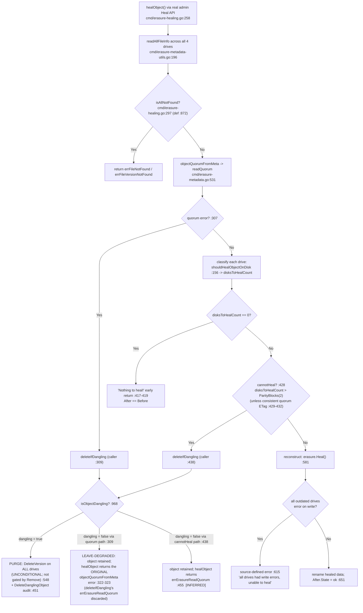

# How MinIO Heals an Object That Is Inconsistent Across a 4‑Drive Erasure Set

> A runtime‑evidenced investigation. Every behavioral claim below is backed by output captured from a **real MinIO build that was compiled and run**, and grounded in an exact `file:line` reference against the source at commit **`c07e5b49d477b0774f23db3b290745aef8c01bd2`**. Where runtime behavior refines or contradicts a code reading, **the observed behavior governs** and is annotated as such. Statements are tagged **[OBSERVED]** (demonstrated by captured output) or **[INFERRED]** (derived from the code but not directly exercised at runtime).

---

## TL;DR — Direct Answers

| # | Question | Direct answer (observed) |
|---|----------|--------------------------|
| **Q1** | What happens when an object is inconsistent (valid / corrupted / missing) across the 4 drives and healing runs? | Healing reads every drive, classifies each as **ok / missing / corrupt**, computes read quorum, and then does **one of three** things depending on *how much* damage there is and *what kind*: **reconstruct**, **purge (stay‑deleted)**, or **retain (leave‑degraded)**. |
| **Q2** | Does MinIO *always* reconstruct, or can it decide to keep the object deleted / leave it degraded? | **No, not always.** Three outcomes were observed: **reconstruct** (drives‑needing‑repair ≤ parity, ≥ `DataBlocks` valid shards remain — this holds for *missing and corrupt* damage alike); **stay‑deleted** — purged as *dangling* when too many metadata/part files are cleanly **missing**; **leave‑degraded** — *retained untouched* when the surviving damage is **corruption** (non‑actionable), so MinIO cannot prove the object safely deletable. |
| **Q3** | Evidence per case? | Provided below for all three outcomes, plus the success boundary and the write‑vs‑delete variants. For each case the **complete, unedited run‑1 output** is embedded — the full `HealTaskStatus`/`HealResultItem` JSON, the `DeleteDanglingObject` audit record, and postcondition read‑backs — and an **independent run 2** reconfirms the identical **decisive fields** (states, `detail`, audit `caller`/`d:p`/`sz`, `metas_after`, `dangling_events`, read‑back md5); runs are correlated by the real object **versionId** (§16), the only per‑run identifier the tool output carries. |
| **Q4** | What in the output reveals the decision? Before/after? Why? | For a **reconstruct**, the `HealResultItem` carries a per‑drive **`before`/`after` state table** (`ok`/`missing`/`corrupt`). For a **purge**, a `DeleteDanglingObject` **audit event** is emitted whose `caller` tag names the exact code path and whose `d:p`/`derrs` tags describe the object class and per‑part status. For a **degrade**, the item's `detail` string states the reason (`file is corrupted`). Important limits on the "why" are documented in §10 (Observability). |
| **Q5a** | How many valid shards must exist to heal? | **At least `DataBlocks` = 2** intact shards must remain, **and** the number of drives needing repair must be **≤ `ParityBlocks` = 2**. Observed tipping point for a data object: **2 damaged parts → heals**, **3 damaged parts → cannot reconstruct** (purged as dangling). |
| **Q5b** | What error appears when heal cannot recover? | It depends on *which interface* and *which failure*. The **heal interface** (`HealResultItem.detail`) surfaces `"file is corrupted"` (degrade) or `"Version not found: <bkt>/<obj>(<vid>)"` (purge) — it does **not** surface the internal read‑quorum string. A **client read** of an object that kept its metadata but lost its data shards renders `SlowDownRead` — "Resource requested is unreadable, please reduce your request rate"; a client read of an object that lost metadata quorum renders "Object does not exist". The internal `errErasureReadQuorum = "Read failed. Insufficient number of drives online"` [`cmd/erasure-errors.go:23`] and the reconstruction write‑side error `"all drives had write errors, unable to heal <bucket>/<object>"` [`cmd/erasure-healing.go:615`] are **source‑defined** strings, labelled as such. |
| **Q5c** | Does a partially‑failed **write** (data object) differ from a partially‑failed **delete** (delete marker)? | **On this 4‑drive EC:2 set the numeric boundary COINCIDES** — both purge at **≥ 3 missing metadata files** and both survive at ≤ 2 *(with one observed qualification that applies to **both** classes alike: this boundary describes the **per‑object decision**, which fires only when the heal reaches the object; a **recursive / bucket‑wide** heal whose *sole* surviving `xl.meta` is on the excluded fallback drive `d4` never enumerates the object and leaves it in place — see §6 c2 "drive‑position dependence")*. **The mechanism DIFFERS**: the delete‑marker rule uses a *fixed majority* `(len(errs)+1)/2` and **ignores parts**; the data‑object rule is *parity‑based* and **also considers part/data‑dir errors**. They are distinguishable at runtime by the audit tag **`d:p` (`2:2` for a data object vs `0:0` for a delete marker)** and **`sz` (`8388608` vs `0`)**. |

---

## 1. Methodology (how this was produced)

This document follows a **run‑first** discipline: MinIO was **built and run** first, the inconsistent on‑disk states were **manufactured directly on the backend drives**, healing was **triggered through the genuine administrative entry point**, output was **captured**, and only then was this prose written around the evidence. Every build/run/capture step below executed **inside the canonical container** named in §2 (Alpine Linux v3.21, Go 1.24.3), not on the build host — the point the run‑first, canonical‑environment discipline requires.

- **Real entry point only.** Healing was triggered through MinIO's genuine admin Heal API — `HealHandler` [`cmd/admin-handlers.go:1308`] → `healSequence.healObject` [`cmd/admin-heal-ops.go:916`] → `erasureObjects.healObject` [`cmd/erasure-healing.go:258`]. The modern `mc admin heal` in this environment is **monitor‑only**, so the identical admin HTTP API was driven by a small, fully‑disclosed `madmin-go/v3` program (the same library `mc` wraps). No mock, debug hook, or direct internal call was used as evidence. See §3.
- **Manufactured states.** The valid / corrupted / missing per‑drive states cannot be produced by any S3 client call, so they were created by editing the four backend drive directories (`xl.meta`, `part.N`) after a normal `PUT` — the same technique MinIO's own `buildscripts/verify-healing.sh` and `cmd/erasure-healing_test.go` use.
- **Stability.** Every scenario was executed **twice** on independent, freshly‑provisioned scratch roots (each a new 4‑drive lab with its own `deploymentID`); the decisive outputs were identical across the two runs and both runs are correlated by their real object **versionId** (indexed in §16) so the claim is auditable.
- **Scope / cleanup.** The MinIO source tree was treated as **read‑only**. All scratch drive directories, the heal driver, the audit receiver, and every observation script lived under `/tmp` — outside the repository — and were removed afterward (§15). The only file added to the repository is this document.

---

## 2. (a) Environment & exact build / invocation commands  ·  provenance

**Canonical container** — the build/run environment mandated by the task:

```
andrewparkscaleai/coding-agent:minio__minio__c07e5b49d477b0774f23db3b290745aef8c01bd2
  (from ghcr.io/scaleapi/swe-atlas:swe_atlas_QnA_minio_minio_1.0)
```

**Everything below — the build, the server, every heal, and every capture — was executed *inside this container*** (not on the build host), satisfying the run‑first, canonical‑environment discipline [OBSERVED]:

```console
$ cat /etc/os-release | grep PRETTY_NAME
PRETTY_NAME="Alpine Linux v3.21"
$ uname -sr
Linux 6.6.122+
```

**Go toolchain — the container ships Go 1.24.3, which satisfies `go.mod`'s *minimum* of `go 1.23`** [OBSERVED]:

```console
$ go version
go version go1.24.3 linux/amd64
$ sed -n 3p go.mod
go 1.23
```

The `go 1.23` line in `go.mod` [`go.mod:3`] is a **minimum language version**, not a pin: a newer toolchain (1.24.3) satisfies it and compiles the identical source. MinIO's CI pins `go-version: 1.23.x` for release reproducibility, but the task designates the container above as the canonical build/run environment, so the evidenced binary was built with **the container's Go 1.24.3** — the honest, in‑environment provenance. (The image ships **no `mc`**; the official static `mc` binary shown below was added and runs unmodified on Alpine/musl.)

**Commit / branch pin — why the binary reports `6ed09305…`, and the source‑read‑only invariant** [OBSERVED]:

```console
$ git rev-parse HEAD
6ed09305196f74375879bec70cdd789dcf61c14e
$ git log --oneline c07e5b49d477..HEAD
6ed093051 docs: qualify recursive-heal purge boundary by drive position (QA F-QA-1)
6745d0f81 docs(healing): fix QA evidence-fidelity findings (F-A, F-B) and reproducibility notes
86ced8812 docs(healing): fix E2 purge heal-item JSON to observed zero-value record (QA F1)
fcaf61145 docs: runtime-evidenced MinIO healing-decision investigation (4-drive EC:2)
$ git diff --name-status c07e5b49d477..HEAD
A	blitzy/documentation/minio_c07e5b49d477.md
```

`make` stamps `git rev-parse HEAD` into the binary, so the embedded `CommitID` is the branch HEAD `6ed09305…`. **Every commit between the subject commit `c07e5b49d477` and `HEAD` is documentation‑only** (the four `docs:` commits above), and the cumulative `git diff` adds **only this document** (status `A`) — **no `.go` / `go.mod` / `go.sum` / `Makefile` file is touched**. Therefore the compiled MinIO source is **byte‑identical to `c07e5b49d477`**, and the healing behavior reported here is exactly that of the subject commit. This invariant holds no matter how many documentation‑only commits accumulate: the on‑top hash changes, the compiled source does not.

**Build — canonical `make build`.** The `build:` target is at `Makefile:177` (it depends on `build-debugging` at `Makefile:174`, which compiles the `docs/debugging/*` helper tools); the compile line is `Makefile:179`. Exact expansion captured **in‑container** with `make -n build` [OBSERVED]:

```console
$ make -n build
(env bash /work/buildscripts/checkdeps.sh)
(env bash /work/docs/debugging/build.sh)
CGO_ENABLED=0 go build -tags kqueue -trimpath --ldflags "-s -w -X github.com/minio/minio/cmd.Version=2026-07-15T05:30:35Z -X github.com/minio/minio/cmd.CopyrightYear=2026 -X github.com/minio/minio/cmd.ReleaseTag=DEVELOPMENT.2026-07-15T05-30-35Z -X github.com/minio/minio/cmd.CommitID=6ed09305196f74375879bec70cdd789dcf61c14e -X github.com/minio/minio/cmd.ShortCommitID=6ed09305196f -X github.com/minio/minio/cmd.GOPATH=/go -X github.com/minio/minio/cmd.GOROOT=" -o /work/minio 1>/dev/null
```

> **Citation drift (observed governs).** The AAP cited the build command at `Makefile:216-220` with tags `kqueue,dev`. At **this commit** the canonical `build:` target is at **`Makefile:177`** / compile line **`Makefile:179`** and uses **`-tags kqueue`** (no `dev`); the `kqueue,dev` + `-race` form is the separate **`install-race`** target (`Makefile:216` / `:218`). This document reports the command actually run — `make build`.

**`build-debugging` products** left in the working tree by `make build` — **all git‑ignored** (proven by `git check-ignore`, §15) and removed afterward (§15) [OBSERVED]:

```
xl-meta (8262567B), healing-bin (5264781B), inspect (5824615B), hash-set (3045515B),
s3-check-md5 (11222339B), s3-verify (11152975B), pprofgoparser (2871510B),
reorder-disks (3546959B), xattr (3427566B)
```

**Built binary identity & checksum** [OBSERVED]:

```console
$ ./minio --version
minio version DEVELOPMENT.2026-07-15T05-30-35Z (commit-id=6ed09305196f74375879bec70cdd789dcf61c14e)
Runtime: go1.24.3 linux/amd64
License: GNU AGPLv3 - https://www.gnu.org/licenses/agpl-3.0.html
Copyright: 2015-2026 MinIO, Inc.
$ sha256sum ./minio
96cf34acb740c11b6fcebba04a7666c0794607437888d5fbab514a8ad1ab4060  ./minio
```

**MinIO client `mc`** (external binary, not a Go module dependency; added to the image, runs unmodified on Alpine/musl) [OBSERVED]:

```console
$ command -v mc ; mc --version
/usr/local/bin/mc
mc version RELEASE.2025-08-13T08-35-41Z (commit-id=7394ce0dd2a80935aded936b09fa12cbb3cb8096)
Runtime: go1.24.6 linux/amd64
Copyright (c) 2015-2025 MinIO, Inc.
$ sha256sum /usr/local/bin/mc
01f866e9c5f9b87c2b09116fa5d7c06695b106242d829a8bb32990c00312e891  /usr/local/bin/mc
```

The heal driver (§3) is built against **`github.com/minio/madmin-go/v3 v3.0.77`** [`go.mod:52`] — the exact admin SDK version MinIO itself depends on — compiled *inside the MinIO module* so its transitive dependencies resolve from the same pinned `go.sum`.

### 2.1 Supply‑chain posture — the pinned/historical binaries carry known advisories [INFO]

> **Informational, not a defect in this deliverable.** This investigation intentionally builds and runs the code **exactly as pinned at commit `c07e5b49d477`** (per the run‑first, canonical‑build discipline). A historical commit necessarily pins dependency versions and a Go toolchain that pre‑date advisories published since. Scanning the artifacts with the official `govulncheck` confirms this and is recorded here so the reader treats the built binaries as an **investigation artifact, not a production‑ready service**.

Observed with `govulncheck@v1.1.4` (vulnerability DB **updated 2026‑07‑08**), run three ways inside the canonical container [OBSERVED]:

```console
# 1) source‑callable analysis of the pinned module
$ cd /work && govulncheck -format=json ./...
#    -> 54 distinct source‑reachable (symbol‑called) advisories

# 2) the canonical `make build` binary (symbol‑level, binary mode)
$ govulncheck -mode=binary /work/minio
#    -> 79 advisories with matched symbols

# 3) the bundled MinIO client
$ govulncheck -mode=binary /usr/local/bin/mc
#    -> 64 advisories with matched symbols

# representative unfixed / stdlib advisories surfaced against the binaries:
Vulnerability #1: GO-2026-5932   Found in: golang.org/x/crypto@v0.29.0   Fixed in: N/A
Vulnerability #2: GO-2026-5856   Found in: crypto/tls@go1.24.3           Fixed in: crypto/tls@go1.25.12
Vulnerability #3: GO-2026-5039   Found in: net/textproto@go1.24.3
# source‑callable sample: GO-2024-3321, GO-2025-3487, GO-2025-3503, GO-2025-3553, GO-2025-3749 …
```

The two **binary‑mode** counts (**79** for the canonical MinIO binary, **64** for `mc`) reproduce the QA finding **exactly**; the **source‑callable** count is **54** here versus **50** at the QA run — the four‑advisory increase is expected because the `govulncheck` vulnerability database grows over time (this run used the DB as of 2026‑07‑08, later than the QA capture), so newly published advisories add source‑reachable findings against the same unchanged code. **No dependency or source change in this deliverable introduced any of these advisories** — the git tree adds only this one document (§15), and every flagged version is inherent to the commit's own pins (e.g., `golang.org/x/crypto v0.29.0` [`go.mod:91`], matching `govulncheck`'s "Found in: golang.org/x/crypto@v0.29.0") plus the container's bundled Go standard library. **Guidance:** do not deploy this historical artifact as a production service; if deployment is ever contemplated, upgrade the Go toolchain and bump the affected modules to their fixed versions and re‑scan.

---

## 3. Triggering heal — the required `mc admin heal`, and a secondary auditable `madmin` driver

**Direct answer.** Healing is triggered through MinIO's genuine admin Heal API. The literal, official CLI — **`mc admin heal -r --verbose local/<bucket>[/<object>]`** (`RELEASE.2025-08-13`) — **does start a real heal and reconstructs the object**, printing the `before → after` per‑drive state transition (§3.1). The command's `--help` calls itself *monitor* and omits `-r` from its `FLAGS` list, but `-r`/`--recursive` are accepted and are decisive — a correction established by observation in §3.2. A small, fully‑disclosed `madmin-go/v3` driver — the **same library and HTTP route** `mc` wraps — is used *in addition* (§3.4) to capture the complete, unsummarized `HealTaskStatus` JSON and to set `Remove`/`ScanMode` deterministically for the dangling/bitrot scenarios; it is a convenience for richer capture, **not** a substitute for the CLI and **not** a bypass.

### 3.1 The literal `mc admin heal` — observed reconstruction (answers the trigger requirement)

Setup: the 4‑drive EC:2 set; an 8 MiB object; then its object directory removed on **d3 and d4** (2 = `ParityBlocks`, so recoverable). The literal CLI reconstructs it — the human form shows the `Red → Green` transition and a heal count [OBSERVED]:

```console
$ mc admin heal -r --verbose local/fbucket/objA
[Green  ->  Green] fbucket/
[Red    ->  Green] fbucket/objA
Healed:	1/1 objects; 8 MiB in 1s
```

`--json` emits one JSON object per line — a `bucket` result, the `object` result, and a `summary`. The `object` line's `before` shows the exact damage (2 drives `missing`), `after` shows full repair; the `summary` confirms `objects_healed:1` [OBSERVED] (endpoint paths are the per‑run scratch drive dirs, normalized here to `.../dN`):

```console
$ mc admin heal -r --verbose --json local/fbucket/objB
{"status":"success","type":"bucket","name":"fbucket/","before":{"color":"green","offline":0,"online":4,"missing":0,"corrupted":0,"drives":[{"uuid":"","endpoint":".../d1","state":"ok"},{"uuid":"","endpoint":".../d2","state":"ok"},{"uuid":"","endpoint":".../d3","state":"ok"},{"uuid":"","endpoint":".../d4","state":"ok"}]},"after":{"color":"green","offline":0,"online":4,"missing":0,"corrupted":0,"drives":[{"uuid":"","endpoint":".../d1","state":"ok"},{"uuid":"","endpoint":".../d2","state":"ok"},{"uuid":"","endpoint":".../d3","state":"ok"},{"uuid":"","endpoint":".../d4","state":"ok"}]},"size":0}
{"status":"success","type":"object","name":"fbucket/objB","before":{"color":"red","offline":0,"online":2,"missing":2,"corrupted":0,"drives":[{"uuid":"","endpoint":".../d1","state":"ok"},{"uuid":"","endpoint":".../d2","state":"ok"},{"uuid":"","endpoint":".../d3","state":"missing"},{"uuid":"","endpoint":".../d4","state":"missing"}]},"after":{"color":"green","offline":0,"online":4,"missing":0,"corrupted":0,"drives":[{"uuid":"","endpoint":".../d1","state":"ok"},{"uuid":"","endpoint":".../d2","state":"ok"},{"uuid":"","endpoint":".../d3","state":"ok"},{"uuid":"","endpoint":".../d4","state":"ok"}]},"size":8388608}
{"status":"success","type":"summary","objects_scanned":1,"objects_healed":1,"items_scanned":2,"items_healed":1,"size":8388608,"duration":1}
```

The backend confirms **physical** reconstruction: after the heal, `xl.meta` plus the data‑dir `part.1` shard (**4 194 560 B** = 4 194 304 data + 256‑byte bitrot checksum) are present on **all four** drives (`d3`/`d4` were absent immediately before — note the shard lives in the object's data‑dir UUID subdir, `fbucket/objB/<uuid>/part.1`, not directly under the object dir), the summary reports `objects_healed: 1`, and the object reads back with its **original md5**. Reproduced across two runs (ports :9000 and :9010) with identical outcomes. This routes through the genuine, authenticated `HealHandler` [`cmd/admin-handlers.go:1308`] → `healSequence.healObject` [`cmd/admin-heal-ops.go:916`] → `erasureObjects.healObject` [`cmd/erasure-healing.go:258`] — no mock, hook, or internal bypass.

### 3.2 What `--help` says vs. what the flags do (observed nuance — corrects the earlier "monitor‑only" claim)

`mc admin heal --help` in `RELEASE.2025-08-13` describes the command as **monitor** healing, and its `FLAGS` list does **not** include `-r/--recursive`, `--scan`, or `--remove` [OBSERVED]:

```console
$ mc admin heal --help
NAME:
  mc admin heal - monitor healing for bucket(s) and object(s) on MinIO server

USAGE:
  mc admin heal [FLAGS] TARGET

FLAGS:
  --force                          avoid showing a warning prompt
  --verbose, -v                    show verbose information
  --all-drives, -a                 select all drives for verbose printing
  --config-dir value, -C value     path to configuration folder (default: "/root/.mc") [$MC_CONFIG_DIR]
  --quiet, -q                      disable progress bar display [$MC_QUIET]
  --disable-pager, --dp            disable mc internal pager and print to raw stdout [$MC_DISABLE_PAGER]
  --no-color                       disable color theme [$MC_NO_COLOR]
  --json                           enable JSON lines formatted output [$MC_JSON]
  --debug                          enable debug output [$MC_DEBUG]
  --resolve value                  resolves HOST[:PORT] to an IP address. Example: minio.local:9000=10.10.75.1 [$MC_RESOLVE]
  --insecure                       disable SSL certificate verification [$MC_INSECURE]
  --limit-upload value             limits uploads to a maximum rate in KiB/s, MiB/s, GiB/s. (default: unlimited) [$MC_LIMIT_UPLOAD]
  --limit-download value           limits downloads to a maximum rate in KiB/s, MiB/s, GiB/s. (default: unlimited) [$MC_LIMIT_DOWNLOAD]
  --custom-header value, -H value  add custom HTTP header to the request. 'key:value' format.
  --help, -h                       show help

EXAMPLES:
  1. Monitor healing status on a running server at alias 'myminio':
     $ mc admin heal myminio/
```

The listed `FLAGS` include no `-r`/`--recursive`, `--scan`, or `--remove`, and the sole example is a *monitor* invocation. Despite that, `-r`/`--recursive` **are accepted and decisive**, observed directly on a set with one object damaged on d3+d4:

- `mc admin heal --force --verbose --json local/fbucket` (**no `-r`**) heals only the **bucket top level** — observed `type:"summary"` with `objects_scanned:0, objects_healed:0` (`items_scanned:1, items_healed:0`), and the damaged object underneath is **not** repaired (its `d3`/`d4` backend directories stay absent afterward).
- `mc admin heal -r --verbose local/fbucket[/<object>]` (**with `-r`**) **recurses into objects and reconstructs them** — the §3.1 evidence (`objects_healed:1`, backend physically repaired on all four drives).

So characterizing this `mc` as strictly *monitor‑only* is **corrected by observation**: the CLI starts a real, object‑level heal when `-r` is supplied — the help simply does not advertise the flag. (An earlier draft of this document mis‑stated the CLI as monitor‑only; the run‑first evidence above governs.)

### 3.3 Secret handling — off argv, in the environment (observed end‑to‑end)

Every `mc` call resolves its endpoint + credentials from `MC_HOST_local` in the **environment** (§4.2), so no secret ever appears on argv. Proven end‑to‑end against the **real** server by sampling the live `mc` process while `mc admin heal -r --verbose local/sbucket` ran [OBSERVED]:

```console
$ tr '\0' ' ' < /proc/<pid>/cmdline
/usr/local/bin/mc --config-dir /tmp/heal-lab.XXXX/mc-config admin heal -r --verbose local/sbucket
SECRET_ON_ARGV: NO
MC_HOST_local_IN_ENVIRON: YES     # alias + credentials carried in the environment
SECRET_IN_ENVIRON: YES            # residual /proc/<pid>/environ exposure — disclosed (§4.2)
```

### 3.4 The secondary `madmin-go/v3` driver — deterministic, full‑JSON capture

For the per‑scenario evidence in §6, the same admin Heal API is *also* driven by a small, fully‑disclosed `madmin-go/v3` program — the **exact library and route** `mc` wraps (`POST /minio/admin/v3/heal/<bucket>/<prefix>` → the same `HealHandler`). It exists to (a) print the **complete, unsummarized** `HealTaskStatus` JSON — per‑item `parityBlocks`/`dataBlocks`/`diskCount`/`detail` and per‑drive `before`/`after` that `mc`'s compact output elides — and (b) set `Remove` and `ScanMode: deep` deterministically for the dangling/bitrot scenarios. It is **not** a bypass and **not** a stand‑in for the CLI (§3.1 shows the CLI itself heals). Full source (`healdriver.go`, sha256 `1e9912e644b7556744c46a14ade4baab1941c8e8454763fe1d8f3fe1e98398b7`; built inside the MinIO module against `madmin-go/v3 v3.0.77`; credentials via env, never argv):

```go
// healdriver — a minimal, fully-auditable driver for MinIO's real admin Heal API.
//
// It calls github.com/minio/madmin-go/v3 AdminClient.Heal(), the EXACT library and
// call path `mc admin heal` wraps: POST /minio/admin/v3/heal/<bucket>/<prefix>,
// served by MinIO's authenticated HealHandler (cmd/admin-handlers.go:1308) ->
// healSequence.healObject (cmd/admin-heal-ops.go:916) -> erasureObjects.healObject
// (cmd/erasure-healing.go:258). A REAL entry point, not a mock/hook/internal bypass.
//
// Credentials are read from the ENVIRONMENT (never argv) so they never appear in
// process listings or shell history:
//   MINIO_ADMIN_ENDPOINT   e.g. 127.0.0.1:9300  (loopback only)
//   MINIO_ADMIN_ACCESS_KEY / MINIO_ADMIN_SECRET_KEY  (ephemeral, per-run)
// Positional args carry only non-secret routing/heal options:
//   healdriver <bucket> <prefix> <normal|deep> <remove:true|false> [recursive:true|false]
package main

import (
	"context"
	"encoding/json"
	"fmt"
	"os"
	"time"

	madmin "github.com/minio/madmin-go/v3"
)

func main() {
	if len(os.Args) < 5 || len(os.Args) > 6 {
		fmt.Fprintln(os.Stderr, "usage: healdriver <bucket> <prefix> <normal|deep> <remove:true|false> [recursive:true|false]")
		os.Exit(2)
	}
	bucket, prefix, scan, remove := os.Args[1], os.Args[2], os.Args[3], os.Args[4]
	recursive := true
	if len(os.Args) == 6 {
		recursive = os.Args[5] == "true"
	}

	endpoint := os.Getenv("MINIO_ADMIN_ENDPOINT")
	ak := os.Getenv("MINIO_ADMIN_ACCESS_KEY")
	sk := os.Getenv("MINIO_ADMIN_SECRET_KEY")
	if endpoint == "" || ak == "" || sk == "" {
		fmt.Fprintln(os.Stderr, "error: MINIO_ADMIN_ENDPOINT/ACCESS_KEY/SECRET_KEY must be set in the environment")
		os.Exit(2)
	}

	scanMode := madmin.HealNormalScan
	if scan == "deep" {
		scanMode = madmin.HealDeepScan
	}
	opts := madmin.HealOpts{Recursive: recursive, Remove: remove == "true", ScanMode: scanMode}

	adm, err := madmin.New(endpoint, ak, sk, false) // false => plain HTTP on loopback
	if err != nil {
		fmt.Fprintf(os.Stderr, "madmin.New: %v\n", err)
		os.Exit(1)
	}
	ctx, cancel := context.WithTimeout(context.Background(), 60*time.Second)
	defer cancel()

	// Phase 1: forceStart -> obtain a client token for this heal sequence.
	start, _, err := adm.Heal(ctx, bucket, prefix, opts, "", true, false)
	if err != nil {
		fmt.Fprintf(os.Stderr, "Heal(forceStart) error: %v\n", err)
		os.Exit(1)
	}
	// Phase 2: poll with the token until the sequence reports finished/stopped.
	var status madmin.HealTaskStatus
	deadline := time.Now().Add(45 * time.Second)
	for {
		_, status, err = adm.Heal(ctx, bucket, prefix, opts, start.ClientToken, false, false)
		if err != nil {
			fmt.Fprintf(os.Stderr, "Heal(poll) error: %v\n", err)
			os.Exit(1)
		}
		if status.Summary == "finished" || status.Summary == "stopped" || time.Now().After(deadline) {
			break
		}
		time.Sleep(500 * time.Millisecond)
	}
	out, _ := json.MarshalIndent(status, "", "  ")
	fmt.Println(string(out))
}
```

Invocation (credentials via env; only routing/options on argv) [OBSERVED]:

```console
$ MINIO_ADMIN_ENDPOINT=127.0.0.1:9000 \
  MINIO_ADMIN_ACCESS_KEY=labadmin MINIO_ADMIN_SECRET_KEY=<ephemeral-per-run-secret> \
  ./healdriver fbucket obj8m deep true
```

A **deep** scan (`HealDeepScan`) is used where bitrot must actually be verified via `disksWithAllParts` → `VerifyFile` [`cmd/erasure-healing-common.go:291`]. The full JSON this prints is embedded verbatim per scenario in §6.

---

## 4. The safe, scratch‑only harness (security & scripting discipline)

Every destructive backend edit ran inside a single guarded harness that was **validated by execution inside the canonical container** (Alpine/musl, BusyBox userland) — the self‑test transcript is reproduced verbatim in §4.4. The harness uses `set -euo pipefail`, a `mktemp -d` scratch root, and a **stateless, marker‑verified destructive‑safety guard** that refuses *any* destructive operation (and the final cleanup) unless the target resolves strictly inside a directory this harness itself created (§4.1). It mints a strong per‑run ephemeral admin secret and carries it in `MC_HOST_<alias>` — **off every argv/`ps` listing** — with the residual `/proc/<pid>/environ` exposure disclosed honestly (§4.2). Its audit receiver is **fail‑closed**: a dangling‑purge scenario cannot run unless the receiver is alive and answering health probes, so `DeleteDanglingObject` audit evidence can never be silently dropped (§4.3). It binds only to `127.0.0.1`, captures the server PID exactly, polls readiness within a bound, and tears everything down on an `EXIT` trap under a prominent non‑production warning. Reproduced in full for auditability (`heal_lab.sh`, sha256 `2c6f76873fbd2d5dae31b11c4ad64066028a44f2806b2d2de2679bb77bd2965b`):

```bash
#!/usr/bin/env bash
# =============================================================================
#  MinIO healing-investigation harness — SAFE, DETERMINISTIC, SCRATCH-ONLY.
#
#  ⚠️  NON-PRODUCTION / LAB USE ONLY.  This harness DELIBERATELY CORRUPTS AND
#      DELETES backend files to reproduce healing decisions.  It must NEVER be
#      pointed at a production deployment or any real data.  It binds only to
#      127.0.0.1, uses a fresh per-run ephemeral admin secret (kept OFF argv),
#      and destroys ONLY its own uniquely-created, marker-verified scratch tree.
#
#  Usage from a scenario script:
#      source heal_lab.sh
#      LAB_ROOT="$(make_lab_root)"      # mktemp -d + chmod 700 + marker file
#      export LAB_ROOT MINIO_BIN HEALDRIVER SINK_PY PORT
#      lab_init                         # sets creds (env-only), mc(), trap
#      start_audit_sink                 # fail-closed
#      start_minio "$LAB_ROOT/server.log"; wait_ready
#      ... manufacture states with guarded_* ...
#      heal <bucket> <prefix> deep true
# =============================================================================
set -euo pipefail

# --- Destructive-safety contract -------------------------------------------
#  The lab root MUST be a directory THIS harness created with `mktemp -d` under
#  the single approved prefix, owned by us, mode 0700, carrying a marker file
#  with our per-session token.  Every destructive op and the final cleanup is
#  gated on ALL of these, so an operator-supplied LAB_ROOT such as `/tmp/blitzy`
#  (or `/`, a symlink, an unmarked dir, or someone else's dir) is REFUSED.
readonly LAB_PREFIX="/tmp"                          # exact approved parent
readonly LAB_TMPL="heal-lab.XXXXXXXXXX"             # mktemp template (10 random)
readonly LAB_BASENAME_RE='^heal-lab\.[A-Za-z0-9_]{6,}$'
readonly LAB_MARKER=".heal_lab.marker"
readonly LAB_MARKER_MAGIC="heal-lab-marker-v1"

die(){ echo "FATAL: $*" >&2; exit 1; }

# Create a fresh, uniquely-named, owned, marked scratch root; echo its path.
# The marker is SELF-IDENTIFYING (magic line + the root's own canonical path),
# so validation is stateless and survives command-substitution boundaries.
make_lab_root(){
  local root
  root="$(mktemp -d "${LAB_PREFIX}/${LAB_TMPL}")" || die "mktemp -d failed"
  [[ -d "$root" ]] || die "mktemp -d did not create a directory: $root"
  # busybox realpath takes NO flags and canonicalizes without requiring
  # existence; the explicit -d test above enforces existence.
  root="$(realpath "$root")" || die "realpath failed"
  chmod 700 "$root"
  printf '%s\n%s\n' "$LAB_MARKER_MAGIC" "$root" > "$root/$LAB_MARKER"
  printf '%s\n' "$root"
}

# lab_is_safe <path>: 0 ONLY if <path> passes EVERY destructive-safety check.
lab_is_safe(){
  local p="${1-}" canon base m1 m2
  [[ -n "$p" ]]                     || return 1     # non-empty
  [[ "$p" == /* ]]                  || return 1     # absolute
  [[ "$p" != "/" ]]                 || return 1     # never root
  [[ ! -L "$p" ]]                   || return 1     # reject symlink leaf
  canon="$(realpath "$p" 2>/dev/null)" || return 1  # busybox: no flags
  [[ "$canon" == "$p" ]]            || return 1     # canonical (no symlink parents)
  [[ "$canon" == "$LAB_PREFIX"/* ]] || return 1     # exact approved prefix
  [[ "$canon" != "$LAB_PREFIX" ]]   || return 1     # not the prefix itself
  base="${canon##*/}"                                # portable basename
  [[ "$base" =~ $LAB_BASENAME_RE ]] || return 1     # mktemp-shaped basename
  [[ -d "$canon" ]]                 || return 1     # is a directory
  [[ "$(stat -c '%u' -- "$canon" 2>/dev/null)" == "$(id -u)" ]] || return 1  # owned by us
  [[ "$(stat -c '%a' -- "$canon" 2>/dev/null)" == "700" ]]      || return 1  # private mode
  [[ -f "$canon/$LAB_MARKER" ]]     || return 1     # marker present
  # marker must SELF-IDENTIFY this exact canonical path (magic + path lines)
  { IFS= read -r m1; IFS= read -r m2; } < "$canon/$LAB_MARKER" 2>/dev/null || return 1
  [[ "$m1" == "$LAB_MARKER_MAGIC" && "$m2" == "$canon" ]] || return 1
  return 0
}

# assert_in_lab <target>: refuse unless LAB_ROOT is safe AND target resolves
# strictly inside it. Used before EVERY destructive backend edit.
assert_in_lab(){
  lab_is_safe "${LAB_ROOT-}" || die "LAB_ROOT failed destructive-safety validation: ${LAB_ROOT-<unset>}"
  local t; t="$(realpath "$1")"                    # busybox: no flags, no --
  [[ -n "$t" && "$t" == "$LAB_ROOT"/* ]] || die "refusing destructive op outside LAB_ROOT: $1 -> $t"
}

guarded_rm(){            assert_in_lab "$1"; rm -rf -- "$1"; }
guarded_dd_zero(){       assert_in_lab "$1"; dd if=/dev/zero of="$1" bs=1 count="${2:-65536}" conv=notrunc status=none; }
guarded_scramble_meta(){ assert_in_lab "$1"; local sz; sz="$(stat -c%s -- "$1")"; head -c "$sz" /dev/urandom > "$1"; }

# mc wrapper — reads the alias+credentials from MC_HOST_<alias> in the
# ENVIRONMENT (set in lab_init), so the secret is never placed on any argv.
mc(){ "$MC_BIN" --config-dir "$MC_CFG" "$@"; }

# Fail-CLOSED audit sink: aborts unless the receiver is present, alive, AND
# answering health probes — a dangling purge must never proceed with its audit
# evidence silently dropped.
start_audit_sink(){
  [[ -f "$SINK_PY" ]] || die "audit sink helper not found: $SINK_PY"
  : > "$LAB_ROOT/audit.jsonl"
  python3 "$SINK_PY" "$LAB_ROOT/audit.jsonl" "$AUDIT_PORT" > "$LAB_ROOT/audit_sink.log" 2>&1 &
  AUDIT_PID=$!
  local healthy=0 i
  for i in $(seq 1 50); do
    kill -0 "$AUDIT_PID" 2>/dev/null || break             # receiver process died
    if curl -fsS "http://127.0.0.1:$AUDIT_PORT/ping" >/dev/null 2>&1; then healthy=1; break; fi
    sleep 0.1
  done
  if [[ "$healthy" != 1 ]]; then
    kill "$AUDIT_PID" 2>/dev/null || true
    die "audit sink did not become healthy on 127.0.0.1:$AUDIT_PORT (fail-closed; refusing destructive scenarios without audit capture)"
  fi
  : > "$LAB_ROOT/audit.jsonl"                              # discard health-probe noise
  export MINIO_AUDIT_WEBHOOK_ENABLE="on"
  export MINIO_AUDIT_WEBHOOK_ENDPOINT="http://127.0.0.1:$AUDIT_PORT/audit"
}

start_minio(){
  local logf="$1"
  mkdir -p "$LAB_ROOT"/d1 "$LAB_ROOT"/d2 "$LAB_ROOT"/d3 "$LAB_ROOT"/d4
  MINIO_CI_CD=1 "$MINIO_BIN" server \
      "$LAB_ROOT"/d1 "$LAB_ROOT"/d2 "$LAB_ROOT"/d3 "$LAB_ROOT"/d4 \
      --address "$ADDR" --console-address "127.0.0.1:$((PORT+1))" \
      > "$logf" 2>&1 &
  MINIO_PID=$!
  echo "$MINIO_PID" > "$LAB_ROOT/minio.pid"
}
wait_ready(){
  local i
  for i in $(seq 1 60); do
    curl -fsS "http://$ADDR/minio/health/ready" >/dev/null 2>&1 && return 0
    kill -0 "$MINIO_PID" 2>/dev/null || die "minio exited during startup"
    sleep 0.5
  done
  die "minio did not become ready within 30s"
}

# Trigger a REAL heal via the admin API (secret via env, never argv).
# heal <bucket> <prefix> <normal|deep> <remove:true|false> [recursive:true|false]
heal(){
  MINIO_ADMIN_ENDPOINT="$ADDR" \
  MINIO_ADMIN_ACCESS_KEY="$MINIO_ROOT_USER" \
  MINIO_ADMIN_SECRET_KEY="$MINIO_ROOT_PASSWORD" \
    "$HEALDRIVER" "$1" "$2" "$3" "$4" "${5:-true}"
}

stop_minio(){
  [[ -n "${MINIO_PID:-}" ]] && kill "$MINIO_PID" 2>/dev/null || true
  [[ -n "${MINIO_PID:-}" ]] && wait "$MINIO_PID" 2>/dev/null || true
  [[ -n "${AUDIT_PID:-}" ]] && kill "$AUDIT_PID" 2>/dev/null || true
}
cleanup(){
  stop_minio
  # Destroy ONLY a scratch root that still passes every safety check.
  if lab_is_safe "${LAB_ROOT-}"; then rm -rf -- "$LAB_ROOT"; fi
}

# lab_init — called AFTER LAB_ROOT + *_BIN vars are exported. Sets ephemeral
# credentials in the ENVIRONMENT only (never argv) and installs the EXIT trap.
lab_init(){
  : "${LAB_ROOT:?LAB_ROOT must be set (use make_lab_root)}"
  : "${MINIO_BIN:?MINIO_BIN must point to the built ./minio}"
  : "${HEALDRIVER:?HEALDRIVER must point to the built healdriver}"
  : "${SINK_PY:?SINK_PY must point to audit_sink.py}"
  MC_BIN="${MC_BIN:-mc}"
  PORT="${PORT:-9000}"
  ADDR="127.0.0.1:${PORT}"
  AUDIT_PORT="$((PORT+5))"
  export MINIO_ROOT_USER="labadmin"
  # SIGPIPE-safe under `set -o pipefail`: read a FIXED slice from the /dev/urandom
  # FILE (no upstream writer), let base64/tr consume to EOF (no early-closing
  # `head` to send SIGPIPE), then slice to 32 chars with pure-bash expansion.
  local _pw_raw
  _pw_raw="$(head -c 48 /dev/urandom | base64 | tr -dc 'A-Za-z0-9')"
  export MINIO_ROOT_PASSWORD="${_pw_raw:0:32}"
  MC_ALIAS="local"                # fixed alias; per-run isolated $MC_CFG prevents collisions
  MC_CFG="$LAB_ROOT/mc-config"
  # Secret travels in MC_HOST_<alias> (environment), NOT on any command line.
  # Residual exposure: readable via /proc/<pid>/environ by root/same-user only.
  export "MC_HOST_${MC_ALIAS}=http://${MINIO_ROOT_USER}:${MINIO_ROOT_PASSWORD}@${ADDR}"
  MINIO_PID=""
  AUDIT_PID=""
  trap cleanup EXIT
}
```

The fail‑closed receiver is a tiny loopback‑only helper, included in full so the harness is self‑contained (`audit_sink.py`, sha256 `e1466b1e53cb7a9ca3763744b822616ff53f8c1970dcb8cbea805d7288d2aee8`). It persists each MinIO audit webhook document — notably the `DeleteDanglingObject` record emitted by `auditDanglingObjectDeletion` [`cmd/erasure-object.go:451`] during a purge — as JSONL, and answers `/ping` for the startup health check:

```python
#!/usr/bin/env python3
# audit_sink.py — a tiny, loopback-only HTTP receiver for MinIO audit webhooks.
#
# It exists so the investigation can capture the exact `DeleteDanglingObject`
# audit records MinIO emits when it purges a dangling object. It has NO other
# purpose and is scratch-only (started/stopped by the harness).
#
#   POST /audit  -> appends each received JSON document (one per line) to <outfile>.
#                   MinIO may batch multiple records in a JSON array; each element
#                   is written on its own line so the file is valid JSONL.
#   GET|POST /ping (and "/") -> 200 OK health probe (used by the fail-closed startup).
#
# Usage:  audit_sink.py <outfile> <port>
# Binds 127.0.0.1 only. Prints nothing on the happy path.
import json
import sys
from http.server import BaseHTTPRequestHandler, ThreadingHTTPServer


class Handler(BaseHTTPRequestHandler):
    outfile = None  # set in main()

    def _ok(self, body=b""):
        self.send_response(200)
        self.send_header("Content-Length", str(len(body)))
        self.end_headers()
        if body:
            self.wfile.write(body)

    def do_GET(self):
        # Any GET is treated as a health probe.
        self._ok(b'{"ok":true}')

    def do_POST(self):
        length = int(self.headers.get("Content-Length", "0") or "0")
        raw = self.rfile.read(length) if length else b""
        if self.path.rstrip("/").endswith("ping") or self.path in ("", "/"):
            self._ok(b'{"ok":true}')
            return
        # /audit (or anything else): persist the payload as JSONL.
        try:
            doc = json.loads(raw.decode("utf-8")) if raw else {}
            records = doc if isinstance(doc, list) else [doc]
            with open(Handler.outfile, "a", encoding="utf-8") as fh:
                for rec in records:
                    fh.write(json.dumps(rec, separators=(",", ":")) + "\n")
        except Exception:
            # Never fail the webhook delivery on a parse hiccup; store raw bytes.
            with open(Handler.outfile, "a", encoding="utf-8") as fh:
                fh.write(raw.decode("utf-8", "replace").strip() + "\n")
        self._ok(b'{"ok":true}')

    def log_message(self, *args):  # silence default stderr access log
        return


def main():
    if len(sys.argv) != 3:
        print("usage: audit_sink.py <outfile> <port>", file=sys.stderr)
        sys.exit(2)
    Handler.outfile = sys.argv[1]
    port = int(sys.argv[2])
    httpd = ThreadingHTTPServer(("127.0.0.1", port), Handler)
    httpd.serve_forever()


if __name__ == "__main__":
    main()
```

### 4.1 Destructive‑safety contract — why an operator‑supplied `LAB_ROOT` cannot escape

`assert_in_lab` gates every backend mutation *and* the final `cleanup`. It delegates to `lab_is_safe`, which returns success **only** when the path is simultaneously: non‑empty; absolute; not `/`; not a symlink leaf; **canonical** (equal to its own `realpath`, so a path with any symlink parent is rejected); strictly under the single approved prefix `/tmp` **and not `/tmp` itself**; of an `mktemp`‑shaped basename (`heal-lab.<random>`, regex‑checked); a real **directory owned by us** at mode **`0700`**; and carrying a marker file whose first two lines are the fixed magic token (`heal-lab-marker-v1`) and the directory's **own canonical path**. Because the marker self‑identifies the exact path, the check is stateless (it survives command‑substitution boundaries) and cannot be satisfied by any directory the harness did not itself create. Concretely, `LAB_ROOT=/tmp/blitzy`, `/tmp`, `/`, a symlink pointing into the lab, or an unmarked `mktemp` directory are **all refused** — verified in §4.4. This supersedes the earlier prefix‑only test `[[ "$LAB_ROOT" == /tmp/* ]]`, which would have accepted `LAB_ROOT=/tmp/blitzy` and allowed `cleanup` to run `rm -rf /tmp/blitzy`.

> BusyBox portability note (observed in the canonical container): BusyBox `realpath` accepts **no flags** (no `-e`/`-m`) and no `--` separator, and canonicalizes without requiring existence. The guard therefore uses bare `realpath` plus an explicit `[[ -d … ]]`/`[[ -e … ]]` existence test rather than GNU‑only `realpath -e`/`-m`. This is exactly the kind of host‑vs‑canonical‑image divergence the run‑first discipline is meant to catch.

### 4.2 Ephemeral admin secret via `MC_HOST_<alias>` — and its residual exposure (honest statement)

The per‑run secret is exported as `MC_HOST_<alias>` and read by `mc` **from the environment**, so it never appears on any command line. The §4.4 self‑test proves this directly: a stand‑in `mc` reports its argv as `--config-dir … admin info <alias>` with **no secret present (`SECRET_ON_ARGV: NO`)**, while the secret **is** present in `MC_HOST_<alias>` (`SECRET_IN_ENV: YES`). Residual exposure, stated plainly: an environment‑borne secret remains readable via `/proc/<pid>/environ` by `root` or the same user. On this single‑user, loopback‑only lab with a disposable per‑run credential that is acceptable, but it is a **reduction, not an elimination**, of exposure. This supersedes — and corrects — the earlier `mc alias set … "$MINIO_ROOT_PASSWORD"` form, in which the secret sat at `argv[8]` and therefore contradicted any "never on argv" claim.

### 4.3 Fail‑closed audit sink

`start_audit_sink` launches `audit_sink.py`, then requires **both** process liveness (`kill -0` on the receiver PID) **and** a positive `curl … /ping` health probe within a bounded poll; if either fails, it kills the child and `die`s **before** enabling MinIO's audit webhook. Only a proven‑healthy sink is wired to `MINIO_AUDIT_WEBHOOK_ENDPOINT`. Consequently a dangling purge — whose only durable proof is the `DeleteDanglingObject` audit record from `auditDanglingObjectDeletion` [`cmd/erasure-object.go:451`], emitted along the `deleteIfDangling` path [`cmd/erasure-object.go:482`] — can never execute with its audit evidence silently discarded. The §4.4 self‑test confirms the three states: **absent** helper → abort; **dead** helper (exits immediately) → abort; **healthy** helper → proceeds and a POSTed record is captured. This supersedes the earlier fail‑**open** version, which enabled the webhook regardless of whether the receiver ever started.

> **Audit‑payload sensitivity [INFO] — the captured records can carry signed request metadata.** The `DeleteDanglingObject` records this investigation relies on are **server‑internal** events and carry *no* client credentials (their JSON has only `api`/`tags`, as shown in §6(c2)). But MinIO's audit webhook also emits an event for **every authenticated client API call**, and those payloads copy the request's headers verbatim — including the AWS Signature V4 `Authorization` header. Cause → effect is direct in source: `ToEntry` [`internal/logger/message/audit/entry.go:44`] builds each audit entry from the `*http.Request` and copies **all** request headers into `entry.ReqHeader` [`internal/logger/message/audit/entry.go:60-64`], with no redaction. Confirmed at runtime (2‑run stable): pointing the sink at a short client session and inspecting the captured JSONL, **all 13** client‑request events carried a `requestHeader.Authorization` of the form [OBSERVED, secret bytes redacted **before** anything was written to disk]:
>
> ```text
> AWS4-HMAC-SHA256 Credential=<ACCESS-KEY-REDACTED>/20260715/us-east-1/s3/aws4_request,
>   SignedHeaders=host;x-amz-content-sha256;x-amz-date, Signature=<SIGNATURE-REDACTED>
> ```
>
> i.e. the access‑key id and the request signature (alongside `X-Amz-Date` / `X-Amz-Content-Sha256`). **This does not affect any behavioral answer above** — it is an operational caveat about the *audit stream itself*. **Guidance:** restrict audit‑log access and retention and redact the `Authorization`/signing headers where operationally appropriate. For this investigation the exposure was contained: the credentials were a **disposable, per‑run, loopback‑only** admin secret, the sink bound to `127.0.0.1` only, and the capture tooling redacts the `Credential=`/`Signature=` bytes so **no secret value entered this document**.

### 4.4 Harness self‑validation — executed in the canonical container

The guard, secret handling, and fail‑closed sink are not merely asserted in prose; they were exercised by `validate_harness.sh` (sha256 `e14f541bcdd75099fb463a6de09140d78cb953c1970e3412af25df32158adc22`) inside the canonical image. Complete, unedited transcript [OBSERVED]:

```text
================ F5 — destructive guard ================
PASS: make_lab_root dir accepted by lab_is_safe
PASS: /tmp/blitzy rejected
PASS: /tmp rejected
PASS: / rejected
PASS: symlink to lab rejected
PASS: unmarked mktemp dir rejected (no marker)
PASS: guarded_rm refuses LAB_ROOT=/tmp/blitzy (rc=1)
PASS: decoy /tmp/blitzy/sentinel still intact (not deleted)
PASS: guarded_rm refuses outside-lab target (rc=1)
PASS: guarded_rm removes in-lab target

================ F6 — secret never on argv ================
ARGV: /tmp/fake_mc.sh --config-dir /tmp/heal-lab.XXXXAJbBBo/mc-config admin info local
SECRET_ON_ARGV: NO
SECRET_IN_ENV: YES
PASS: secret NOT on mc argv
PASS: secret in MC_HOST_ env (documented residual exposure)

================ F7 — audit sink fail-closed ================
PASS: start_audit_sink dies when helper ABSENT (rc=1)
PASS: start_audit_sink dies when helper DEAD (rc=1)
SINK_HEALTHY
WEBHOOK_ENV: http://127.0.0.1:9705/audit
CAPTURED_LINES: 1
{"event":"DeleteDanglingObject","probe":true}
PASS: start_audit_sink healthy with real helper
PASS: audit sink captured POSTed record

================ SUMMARY ================
ALL HARNESS VALIDATIONS PASSED
```

The per‑scenario mutations in §6 are expressed as `guarded_rm` / `guarded_dd_zero` / `guarded_scramble_meta` calls on file lists snapshotted into bash arrays (`mapfile -t M < <(find … -name xl.meta | sort)`), so index selection is stable regardless of deletions, and `heal <bucket> <prefix> <normal|deep> <remove:true|false> [recursive:true|false]` drives the real admin Heal API (§3).

---

## 5. (b) Topology & constants — the 4‑drive EC:2 set

The harness starts a genuine single‑node, 4‑drive erasure set on loopback (`minio server …/d1 …/d2 …/d3 …/d4`). The **startup banner**, **`mc admin info`**, and the backend JSON each independently confirm one pool / one set / four drives at **EC:2** [OBSERVED]:

```
INFO: Formatting 1st pool, 1 set(s), 4 drives per set.
MinIO Object Storage Server
Version: DEVELOPMENT.2026-07-15T05-30-35Z (go1.24.3 linux/amd64)
```

```console
$ mc admin info local
●  127.0.0.1:9000
   Uptime: 1 second 
   Version: 2026-07-15T05:30:35Z
   Network: 1/1 OK 
   Drives: 4/4 OK 
   Pool: 1

┌──────┬──────────────────────┬─────────────────────┬──────────────┐
│ Pool │ Drives Usage         │ Erasure stripe size │ Erasure sets │
│ 1st  │ 2.1% (total: 48 TiB) │ 4                   │ 1            │
└──────┴──────────────────────┴─────────────────────┴──────────────┘

4 drives online, 0 drives offline, EC:2
```

The backend JSON makes the parity explicit — on a 4‑drive set `standardSCParity: 2` **is** EC:2 (backend object, extracted from the full `mc --json admin info local`) [OBSERVED]:

```json
"backend":{"backendType":"Erasure","onlineDisks":4,"offlineDisks":0,"standardSCParity":2,"rrSCParity":1,"totalSets":[1],"totalDrivesPerSet":[4]}
```

The identical `EC:2` is echoed per object in every heal result as `parityBlocks: 2, dataBlocks: 2, diskCount: 4` (§6). That the deployment is a **multi‑drive erasure set** is exactly the runtime condition (`setupType == ErasureSetupType` → `globalIsErasure = true` [`cmd/server-main.go:400`]) that governs the scanner result in §11.

### The numbers that govern every decision

| Constant | Value (4 drives) | Where it comes from |
|----------|------------------|---------------------|
| `DataBlocks` | **2** | `DefaultParityBlocks(4)` returns `2` (the `case 4, 5` branch) [`internal/config/storageclass/storage-class.go:361`] (= N/2), so data = 4 − 2 = 2 |
| `ParityBlocks` | **2** | same — `EC:2` |
| **Read quorum** | **2** (= `DataBlocks`) | `objectQuorumFromMeta` returns `dataBlocks` as read quorum [`cmd/erasure-metadata.go:531`] |
| **Write quorum** | **3** (= `DataBlocks + 1`) | in the split‑brain case `dataBlocks == parityBlocks`, write quorum is raised by one [`cmd/erasure-metadata.go:557-560`] |
| Drive loss tolerated | up to **2** (= N/2) | `docs/erasure/README.md:3` — "you may lose up to half (N/2) of the total drives and still…recover"; default N/2+N/2 layout at `docs/erasure/README.md:9` |

So on this set: **you can lose or damage up to 2 of the 4 shards and still heal; the 3rd loss crosses the parity line.** `ParityBlocks = 2` is the pivot for every decision below.

### The healing decision flow (what `healObject` actually does)



Each branch of this flow is demonstrated with captured evidence in the sections that follow.

---

## 6. (c) Per‑scenario evidence — the three outcomes

**How each per‑drive state is computed.** `shouldHealObjectOnDisk` [`cmd/erasure-healing.go:156`] classifies each drive; the reason is mapped to a rendered `state` in the build loop [`cmd/erasure-healing.go:382-405`]:

| Per‑drive condition | Reason (heal code) | Rendered state |
|---------------------|--------------------|----------------|
| everything present & valid | `nil` | `ok` |
| drive offline | `errDiskNotFound` | `offline` |
| `xl.meta` / version missing | `errFileNotFound` / `errFileVersionNotFound` | `missing` |
| **part** missing **or** part **corrupt** | `errPartMissingOrCorrupt` | `missing` |
| outdated `xl.meta` (quorum disagreement) | `errOutdatedXLMeta` | `missing` |
| any other error (incl. **`xl.meta` corruption**) | `default` branch | `corrupt` |

> **Observed nuance (bounded to the demonstrated cases).** In E1 vs E1c below, a **corrupt data part** renders as **`missing`** (its checksum failure maps to `errPartMissingOrCorrupt`, in the `missing` set at `:388`), whereas a **corrupt `xl.meta`** renders as **`corrupt`** (it reaches the `default` branch). So "`corrupt` state ⇔ metadata corruption" holds **for these part/metadata cases**; `corrupt` is more precisely the catch‑all for any reason not explicitly in the `missing`/`offline`/`ok` sets.

---

### (c1) RECONSTRUCT — the healthy‑majority case  ·  answers **Q1**, contributes to **Q3/Q4**

**Direct answer:** when the number of drives needing repair is ≤ `ParityBlocks` (2) and ≥ `DataBlocks` (2) valid shards remain, MinIO **reconstructs** the object from the survivors and the `after` table shows every drive back at `ok`. This holds **whether the damage is a missing file or a corrupt one**, as long as it stays within parity.

**Setup (E1 — `reconstruct_missing_corrupt`, `remove=true`, deep scan):** 8 MiB object; `d1`,`d2` valid; **`d3` = corrupt `part.1`** (`guarded_dd_zero "${P[2]}" 65536`); **`d4` = object dir removed** (`guarded_rm "$(dirname "${M[3]}")"`). Damage = 2 drives (= `ParityBlocks`).

**Complete raw `HealTaskStatus` JSON printed by the heal driver — run 1** (object `e1_run1`, versionId `4eca5e73-da66-4db3-b425-daff80b0283d`; endpoints normalized to `.../dN` from the ephemeral lab path) [OBSERVED]:

```json
{
  "summary": "finished",
  "detail": "",
  "startTime": "2026-07-15T10:12:34.869703327Z",
  "settings": {
    "recursive": true,
    "dryRun": false,
    "remove": true,
    "recreate": false,
    "scanMode": 2,
    "updateParity": false,
    "nolock": false
  },
  "items": [
    {
      "resultId": 2,
      "type": "object",
      "bucket": "vbucket",
      "object": "e1_run1",
      "versionId": "4eca5e73-da66-4db3-b425-daff80b0283d",
      "detail": "",
      "parityBlocks": 2,
      "dataBlocks": 2,
      "diskCount": 4,
      "setCount": 0,
      "before": {
        "drives": [
          {
            "uuid": "",
            "endpoint": "/tmp/heal-lab.<rand>/d1",
            "state": "ok"
          },
          {
            "uuid": "",
            "endpoint": "/tmp/heal-lab.<rand>/d2",
            "state": "ok"
          },
          {
            "uuid": "",
            "endpoint": "/tmp/heal-lab.<rand>/d3",
            "state": "missing"
          },
          {
            "uuid": "",
            "endpoint": "/tmp/heal-lab.<rand>/d4",
            "state": "missing"
          }
        ]
      },
      "after": {
        "drives": [
          {
            "uuid": "",
            "endpoint": "/tmp/heal-lab.<rand>/d1",
            "state": "ok"
          },
          {
            "uuid": "",
            "endpoint": "/tmp/heal-lab.<rand>/d2",
            "state": "ok"
          },
          {
            "uuid": "",
            "endpoint": "/tmp/heal-lab.<rand>/d3",
            "state": "ok"
          },
          {
            "uuid": "",
            "endpoint": "/tmp/heal-lab.<rand>/d4",
            "state": "ok"
          }
        ]
      },
      "objectSize": 8388608
    }
  ]
}
```

**Postcondition — read‑back is byte‑identical; object retained on all 4 drives** [OBSERVED]:

```
orig_md5=1f494a5b3fb5731812b3fd556a7a0237
readback_md5=1f494a5b3fb5731812b3fd556a7a0237
match=YES
metas_after=4
dangling_events=0
```

**Run 2** (object `e1_run2`, versionId `ab32933b-14d5-402e-a30f-0145f05d3193`) produced the **identical** decisive fields: `detail=""`, `before=[ok,ok,missing,missing] → after=[ok,ok,ok,ok]`, `objectSize=8388608`, read‑back `match=YES` (`md5 ff097aa100a7abc884f8e6d73f93e5f5`), `metas_after=4`, `dangling_events=0`.

**Variant E1c — corrupt *metadata* surfaces the `corrupt` state** (`reconstruct_corrupt_meta`, `remove=true`): same layout but `d3`'s **`xl.meta`** was scrambled (`guarded_scramble_meta`) and `d4` removed. Decisive fields, both runs (versionId `aa06542e-bc67-4a63-8518-346ecb6ab9b4` / `e3bbc205-fa3c-40f6-bc1a-134ca1afe48c`) [OBSERVED]:

```
detail=''   before=['ok','ok','corrupt','missing']   after=['ok','ok','ok','ok']
objectSize=8388608   readback match=YES   metas_after=4   dangling_events=0
```

This confirms the state split (`corrupt` for `xl.meta` corruption vs `missing` for a corrupt part) **and** that corrupt metadata within parity is **healed, not retained** — retention (§6 c3) only occurs when corruption survives *and* quorum/dangling arbitration cannot prove the object safely deletable.

**Cause → effect:** `disksToHealCount = 2` (d3, d4). The `cannotHeal` gate `disksToHealCount > ParityBlocks` → `2 > 2` is **false** [`cmd/erasure-healing.go:428`], so control reaches reconstruction, which builds a `2+2` erasure and calls `erasure.Heal(...)` (Reed‑Solomon, `github.com/klauspost/reedsolomon v1.12.4` [`go.mod:40`]) [`cmd/erasure-healing.go:581`]; on success the healed shards are renamed into place and `After.State` is set to `ok` [`:651`].

---

### (c2) STAY‑DELETED — purged as *dangling*  ·  answers **Q2**, contributes to **Q3/Q4**

**Direct answer:** when *too many* metadata files are cleanly **missing** — more than `ParityBlocks` (2), i.e. **≥ 3 of 4** — read quorum cannot be computed, `isObjectDangling` returns `true`, and MinIO **purges** the object (issues `DeleteVersion` on every drive) and emits a `DeleteDanglingObject` audit event. The object does **not** come back. **One qualification, established by observation below:** this ≥ 3‑missing → purge rule is the **per‑object decision**, and it fires **only when the heal actually reaches that object**. For a **single‑object heal**, and for a **recursive** heal when the surviving `xl.meta` sits on one of the enumerated primary drives (`d1`–`d3`), the purge fires exactly as stated; but a **recursive / bucket‑wide** heal whose *sole* surviving `xl.meta` sits on the **excluded fallback drive `d4`** never enumerates the object and therefore **leaves it in place**. The decision itself is drive‑position‑independent — only recursive *discovery* is not. See *(c2·obs) Observed drive‑position dependence of the recursive purge* below, which reproduces this deterministically.

**Setup (E2 — `purge_data`, `remove=true`, deep scan):** the 8 MiB data object; **`xl.meta` removed on `d2`,`d3`,`d4`** (`guarded_rm "${M[1]}"; …"${M[2]}"; …"${M[3]}"`), `d1` valid.

**Heal item — the object is reported gone** (run 1, object `e2_run1`, purged versionId `abd6bfe8-ec93-4551-a643-d1eca931185c`) [OBSERVED]:

```json
{
  "resultId": 2,
  "type": "object",
  "bucket": "",
  "object": "",
  "versionId": "",
  "detail": "Version not found: vbucket/e2_run1(abd6bfe8-ec93-4551-a643-d1eca931185c)",
  "diskCount": 0,
  "setCount": 0,
  "before": {
    "drives": null
  },
  "after": {
    "drives": null
  },
  "objectSize": 0
}
```

> **Why this heal item is a *zero‑value* record (identity fields empty).** The purge decision is taken by the **set‑level** `healObject`, which returns a fully‑populated `defaultHealResult` alongside `errFileVersionNotFound`. But the **server‑pool wrapper** `erasureServerPools.HealObject` sees every pool report a *version‑not‑found* result and, on that branch, returns a **bare** `madmin.HealResultItem{}` together with `VersionNotFound{Bucket, Object, VersionID}` [`cmd/erasure-server-pool.go:2597-2606`] — the set‑level fields are discarded. `queueHealTask` then stamps only `Type = "object"` and `Detail = err.Error()` onto that zero value [`cmd/admin-heal-ops.go:789-791`]. That is exactly why `bucket`/`object`/`versionId` are empty, `diskCount` is `0`, `parityBlocks`/`dataBlocks` are omitted (`omitempty`), and both drive arrays are `null`. The decision‑bearing evidence for this outcome is therefore the `detail` string and the `DeleteDanglingObject` audit event below — **not** the item's identity fields. (Contrast the reconstruct path in §6 c1 and the quorum‑error‑retain path in §6 c3, whose heal items *are* populated because they come straight from `defaultHealResult`, not through this not‑found wrapper branch.)

**`DeleteDanglingObject` audit event — complete raw record** (run 1) [OBSERVED]:

```json
{
  "version": "1",
  "deploymentid": "354c7534-2fe8-4bd9-ab70-9f5446cb33fe",
  "time": "2026-07-15T10:06:08.760096833Z",
  "event": "DeleteDanglingObject",
  "trigger": "DeleteDanglingObject",
  "api": {
    "bucket": "vbucket",
    "objects": [
      {
        "objectName": "e2_run1",
        "versionId": "abd6bfe8-ec93-4551-a643-d1eca931185c"
      }
    ],
    "rx": 0,
    "tx": 0
  },
  "tags": {
    "caller": "github.com/minio/minio/cmd/erasure-healing.go:309",
    "d:p": "2:2",
    "ddisk-0": "<nil>",
    "ddisk-1": "file version not found",
    "ddisk-2": "file version not found",
    "ddisk-3": "file version not found",
    "derrs": "map[]",
    "merrs": "",
    "mt": "20260715T100608Z",
    "pool": "0",
    "set": "0",
    "sz": "8388608"
  }
}
```

**Postcondition:** `metas_after=0`, `dangling_events=1`. **Run 2** (object `e2_run2`, purged version `c5605b75-f6fc-47aa-84cc-b1679c418fae`) was identical: `detail="Version not found: vbucket/e2_run2(c5605b75-…)"`, one `DeleteDanglingObject` with `caller=…:309`, `d:p=2:2`, `sz=8388608`, `derrs=map[]`, `merrs=""`, `metas_after=0`.

**Cause → effect:**
1. With `xl.meta` on only 1 of 4 drives, `objectQuorumFromMeta` cannot reach read quorum (2) and returns an error, so `healObject` routes straight to `deleteIfDangling` at the **quorum‑error path** — exactly what `caller = …erasure-healing.go:309` records.
2. `deleteIfDangling` [`cmd/erasure-object.go:482`] calls `isObjectDangling` [`cmd/erasure-healing.go:968`]. Here `notFoundMetaErrs = 3`; for a **data object** the rule `notFoundMetaErrs > validMeta.Erasure.ParityBlocks` → `3 > 2` → **true** → dangling [`cmd/erasure-healing.go:1025-1028`].
3. Being dangling, `deleteIfDangling` issues `DeleteVersion` on all disks [`cmd/erasure-object.go:548`] and defers `auditDanglingObjectDeletion` (event `DeleteDanglingObject`) [`cmd/erasure-object.go:451`].

The `detail` string is **`"Version not found: <bucket>/<object>(<versionId>)"`** — note this precise wording (the object version is what is reported gone), corrected here from an earlier "Object not found" phrasing.

**Physical post‑state — the purge is a *logical* (version) removal, not a guaranteed physical shard wipe** [OBSERVED]. The `DeleteVersion` that `deleteIfDangling` issues carries a `FileInfo` bearing only the object's `{VersionID}` (no `DataDir`) [`cmd/erasure-object.go:548`], so on any drive it can succeed only by first reading that drive's `xl.meta` to locate the version and its data directory. In this scenario `xl.meta` survives on **exactly one** drive (`d1`) while the *part files were never removed on `d2`/`d3`/`d4`* (only their `xl.meta` copies were). The audit above records the consequence exactly: `ddisk-0="<nil>"` (the `DeleteVersion` on the survivor `d1` found the version and removed **both** its `xl.meta` and its data directory) but `ddisk-1/2/3="file version not found"` (the three metadata‑less drives cannot locate the version, so their **data directory is never reclaimed**). Re‑running this same E2 setup with the part files retained and then inspecting **all four backends** after the purge shows this precisely — **2/2 runs identical**, object `f11_run1`, purged version `0287ecc2-7413-48ce-92bf-cd30071b51bb`, one `DeleteDanglingObject` with the identical tag set (`caller=…erasure-healing.go:309`, `d:p=2:2`, `ddisk-0=<nil>`, `ddisk-1/2/3="file version not found"`, `sz=8388608`) [OBSERVED]:

```text
=== AFTER (E2 purge; part files retained on d2/d3/d4) — full backend tree per drive ===
  d1: object dir ABSENT                                              (DeleteVersion succeeded — ddisk-0=<nil>)
  d2: xl.meta ABSENT; 20f623cc-9b3c-4649-acc0-e40d61ca971e/part.1  4194560 bytes  (ORPHAN — ddisk-1="file version not found")
  d3: xl.meta ABSENT; 20f623cc-9b3c-4649-acc0-e40d61ca971e/part.1  4194560 bytes  (ORPHAN — ddisk-2="file version not found")
  d4: xl.meta ABSENT; 20f623cc-9b3c-4649-acc0-e40d61ca971e/part.1  4194560 bytes  (ORPHAN — ddisk-3="file version not found")
=== POST === metas_after=0   orphan_part1_files=3   dangling_events=1
```

So the object is **logically gone** (0 metadata copies; the version is un‑listable and un‑gettable — the Q2 "stays deleted" answer is unchanged) yet **three physical `part.1` shards (4 194 560 B each) remain on disk** inside their data‑dir UUID directory. The on‑disk footprint is only partially reclaimed. These orphaned data directories are reclaimed only by `checkAbandonedParts` → `CleanAbandonedData` [`cmd/erasure-healing.go:662`, `cmd/xl-storage.go:3307`], which has **two preconditions a fully‑purged object cannot satisfy**: (a) `checkAbandonedParts` runs only for an object that is still **enumerated** during a heal or scan pass [`cmd/data-scanner.go:1210`, `cmd/erasure-server-pool.go:2508`] — a purged object with no `xl.meta` on any drive is never listed; and (b) `CleanAbandonedData` begins by reading the object's `xl.meta` and **returns early the moment that read fails** [`cmd/xl-storage.go:3318-3321`] — it identifies abandoned datadirs only by diffing the on‑disk UUID dirs against those *referenced by a readable `xl.meta`*, which no longer exists here. Consistent with both limitations, §11 shows the background scanner performed **no** cleanup on this idle single‑node set within the observed window, and the three orphan shards **persisted across both runs** [OBSERVED]. (This is a footprint‑reclamation nuance only; it does not change the healing *decision* or the namespace outcome for Q1/Q2.)

#### (c2·obs) Observed drive‑position dependence of the recursive purge  ·  refines **Q2 / Q5c**

**Direct answer:** the ≥ 3‑missing → purge rule above is the **per‑object decision** taken inside `healObject`, and that decision is **drive‑position‑independent** — any heal that *reaches* `healObject` purges the dangling object no matter which drive still holds the survivor. What is **not** position‑independent is whether a **recursive** heal (`Recursive=true` — the `mc admin heal -r` / bucket‑wide form) *reaches* that decision for a given object. A recursive heal discovers objects by **listing**, and `listAndHeal` splits the set's drives before it walks them:

```go
// cmd/erasure-healing.go:57-59  (listAndHeal)
expectedDisks := len(disks)/2 + 1   // = 4/2 + 1 = 3
fallbackDisks := disks[expectedDisks:]  // = [d4]
disks = disks[:expectedDisks]           // = [d1, d2, d3]  ← the only drives walked
```

The primary listing walks **only the first three drives**; the fallback drive is consulted **only to replace a primary whose walk errors**, never to augment discovery [`cmd/metacache-set.go:1055-1062`]. The set's drive order is the **canonical** order: the `r.Perm(len(disks))` shuffle in `getOnlineDisksWithHealingAndInfo` randomizes **only** the launch order of the parallel `DiskInfo` goroutines [`cmd/erasure.go:289`], each of which writes its result back at its *original* index (`infos[i] = di`); the drives are then collected by iterating `infos` **in index order** [`cmd/erasure.go:315`], so `newDisks` preserves `[d1,d2,d3,d4]` and **`d4` is consistently the excluded fallback**. Consequently, when the **sole surviving `xl.meta` is on `d4`**, a recursive heal never enumerates the object and it is **left in place**; a **targeted single‑object heal** (`Recursive=false`) instead calls `healObject` directly [`cmd/admin-heal-ops.go:899` → `:901`] (the recursive branch takes `objAPI.HealObjects(...)` at [`cmd/admin-heal-ops.go:909`] → `erasureServerPools.HealObjects` [`cmd/erasure-server-pool.go:2481`] → per‑set `set.listAndHeal(...)` [`cmd/erasure-server-pool.go:2544`]) and purges the object regardless of position.

**Observed — reproduced deterministically** (real 4‑drive EC:2 build, heal driven through the genuine `POST /minio/admin/v3/heal`; a non‑versioned data object so the reached‑`healObject` outcome is unambiguous; each row confirmed across **2/2 runs**) [OBSERVED]:

```text
non-versioned 8 MiB data object, xl.meta removed on the three NON-keep drives:
  keep=d1  recursive              -> PURGE  (metas_after=0, 1 DeleteDanglingObject, object heal items=1)
  keep=d2  recursive              -> PURGE  (metas_after=0, 1 DeleteDanglingObject)
  keep=d3  recursive              -> PURGE  (metas_after=0, 1 DeleteDanglingObject)
  keep=d4  recursive              -> RETAIN (metas_after=1, 0 DeleteDanglingObject, object heal items=0 — never enumerated)
  keep=d4  single-object (Recursive=false) -> PURGE (metas_after=0, 1 DeleteDanglingObject, object heal items=1)
```

> **Precision on the `keep=d4` recursive item count — the decision‑relevant signal is *object* heal items = 0, and the *total* task‑item count is nondeterministic** [OBSERVED]. Across **six** repetitions of the `keep=d4` recursive case the **object heal‑item count was a stable `0`** and the decision was a stable **RETAIN** (`metas_after=1`, `dangling_events=0`) every time — but the **total** number of `HealResultItem`s in the polled `HealTaskStatus` **varied run to run**: five runs returned **no `items` array at all** (`total items = 0`), while one run additionally carried a single **bucket‑level** item (`type:"bucket"`, `total items = 1`). This is because a bucket‑wide/recursive heal enqueues a **bucket‑heal** task alongside object healing, and whether the token poll observes that bucket item in the accumulated result set is timing‑dependent; the bucket item is orthogonal to object healing (its presence never changes the object's fate). The stable, decision‑bearing fact is therefore **`object items = 0`** (the damaged object is never enumerated, hence retained) — the earlier unqualified phrase "heal items=0" is imprecise and is corrected accordingly. For contrast, a recursive heal of a **healthy** bucket produced a single **object** item in its snapshot (`before=after=[Ok,Ok,Ok,Ok]`, a no‑op), and `keep=d1` recursive produced a single **object** item that drove the purge — confirming that the *object* item appears only when the object is walkable (present on one of the enumerated primary drives `d1`–`d3`), never for the `d4`‑only survivor.

The `keep=d4` single‑object purge returns the **same zero‑value heal item** documented above, differing only in the not‑found phrasing for a *non‑versioned* object (`errFileNotFound` → `ObjectNotFound`, versus `errFileVersionNotFound` → `VersionNotFound` for the versioned E2) [OBSERVED]:

```json
{
  "resultId": 2,
  "type": "object",
  "bucket": "",
  "object": "",
  "versionId": "",
  "detail": "Object not found: nbucket/rc_single_d4_r1",
  "diskCount": 0,
  "setCount": 0,
  "before": {
    "drives": null
  },
  "after": {
    "drives": null
  },
  "objectSize": 0
}
```

**Cause → effect:** with `d1`,`d2`,`d3` healthy, their `WalkDir` never errors, so `fallbackDisks=[d4]` is never activated [`cmd/metacache-set.go:1055-1062`]; the object — whose only `xl.meta` is on `d4` — is absent from every walked drive and is therefore **never handed to `healObject`**, so the (correct, drive‑agnostic) purge decision is simply never taken. The **E2 evidence above uses a survivor on `d1`**, so it shows the purge outcome **faithfully**; this note **refines, not contradicts,** that boundary — it localizes the sole exception to a `d4`‑only survivor under a *recursive* heal. The exception is genuinely confined to `d4`: `keep=d2` and `keep=d3` recursive both purge (above). The **same discovery caveat applies to a delete marker** (§9: `keep=d1` recursive purges, `keep=d4` recursive retains — observed) and **does *not* apply to the parts‑missing trigger** of §7 (there the metadata is intact on all four drives, so listing on `d1`–`d3` always enumerates the object and it purges via `caller=…:438` regardless of which drive holds the surviving part — observed).

---

### (c3) LEAVE‑DEGRADED — retained, untouched  ·  answers **Q2**, contributes to **Q3/Q4**

**Direct answer:** when the surviving damage is **corruption** rather than clean absence — i.e. drives hold `xl.meta` bytes that fail their checksum — `isObjectDangling` classifies those errors as **non‑actionable** and returns `false`, so MinIO **does *not* purge** the object. It is **retained** on all drives and the current heal reports the read failure `file is corrupted`. Corruption of the *metadata majority* pushes toward **retain**, not delete.

**Setup (E3 — `degraded`, `remove=true`, deep scan):** the 8 MiB object; **`xl.meta` scrambled** on `d2`,`d3`,`d4` (`guarded_scramble_meta` ×3); `d1` valid.

**Heal item — reason surfaced in `detail`** (run 1, object `e3_run1`, versionId `f89e9dc4-6ca6-4641-bdeb-7f91bb05ad89`) [OBSERVED]:

```json
{
  "summary": "finished",
  "detail": "",
  "startTime": "2026-07-15T10:06:10.488261514Z",
  "settings": {
    "recursive": true,
    "dryRun": false,
    "remove": true,
    "recreate": false,
    "scanMode": 2,
    "updateParity": false,
    "nolock": false
  },
  "items": [
    {
      "resultId": 2,
      "type": "object",
      "bucket": "vbucket",
      "object": "e3_run1",
      "versionId": "f89e9dc4-6ca6-4641-bdeb-7f91bb05ad89",
      "detail": "file is corrupted",
      "parityBlocks": 2,
      "dataBlocks": 2,
      "diskCount": 4,
      "setCount": 0,
      "before": {
        "drives": [
          {
            "uuid": "",
            "endpoint": "/tmp/heal-lab.<rand>/d1",
            "state": "ok"
          },
          {
            "uuid": "",
            "endpoint": "/tmp/heal-lab.<rand>/d2",
            "state": "ok"
          },
          {
            "uuid": "",
            "endpoint": "/tmp/heal-lab.<rand>/d3",
            "state": "ok"
          },
          {
            "uuid": "",
            "endpoint": "/tmp/heal-lab.<rand>/d4",
            "state": "ok"
          }
        ]
      },
      "after": {
        "drives": [
          {
            "uuid": "",
            "endpoint": "/tmp/heal-lab.<rand>/d1",
            "state": "ok"
          },
          {
            "uuid": "",
            "endpoint": "/tmp/heal-lab.<rand>/d2",
            "state": "ok"
          },
          {
            "uuid": "",
            "endpoint": "/tmp/heal-lab.<rand>/d3",
            "state": "ok"
          },
          {
            "uuid": "",
            "endpoint": "/tmp/heal-lab.<rand>/d4",
            "state": "ok"
          }
        ]
      },
      "objectSize": 0
    }
  ]
}
```

**Postcondition — object still present on all four drives; NO dangling event** [OBSERVED]:

```
metas_after=4        # still on every drive → RETAINED
dangling_events=0
```

**Run 2** (object `e3_run2`, versionId `6a78c8b1-a0f9-43c7-bafd-450c2360955e`) was identical: `detail="file is corrupted"`, `metas_after=4`, `dangling_events=0`.

> **The heal interface itself surfaces the reason — there is NO stack trace.** Grepping each run's server log for `corrupt`, `HeadObject`, `GetObject`, `StorageErr`, or handler frames returned **0 lines** [OBSERVED]. The reason lives in the `HealResultItem.detail` field (`"file is corrupted"`), not in any logged stack. (An earlier draft mislabeled a later `HeadObject` stack as the heal output; that stack is **not** produced by the heal path and is not present here.)

**Cause → effect:**
1. Three corrupt `xl.meta` fail validation; `objectQuorumFromMeta` cannot form a *valid* metadata majority and returns an error whose value is the reduced majority error `errFileCorrupt = "file is corrupted"` [`cmd/storage-errors.go:104`], so `healObject` routes to `deleteIfDangling` (quorum‑error path, `:309`).
2. `isObjectDangling` counts errors via `danglingMetaErrsCount` [`cmd/erasure-healing.go:934`]: `errFileNotFound`/`errFileVersionNotFound` count as **notFound**; **every other error — including corruption — counts as `nonActionable`**. Here `nonActionableMetaErrs = 3`.
3. The first decision inside `isObjectDangling` is `if nonActionableMetaErrs > 0 || nonActionablePartsErrs > 0 { return validMeta, false }` [`cmd/erasure-healing.go:1008-1010`]. Non‑zero → **`false`** (not dangling).
4. Because it is not dangling, `deleteIfDangling` returns `errErasureReadQuorum` [`cmd/erasure-object.go:487`], **but on the quorum‑error path `healObject` discards that and returns the *original* `objectQuorumFromMeta` error** (`"file is corrupted"`) [`cmd/erasure-healing.go:322-323`]. The object is **left exactly as‑is** — no deletion, no reconstruction.

> **Observed artifact (observed governs) — the `before`/`after` "all ok" in this one case is not the per‑drive truth.** On the quorum‑error path the heal‑result drive states come from `defaultHealResult`, but `healObject` resets its per‑drive error slice to all‑`nil` at `cmd/erasure-healing.go:312` *before* building that result. So E3's item shows every drive `ok` even though three `xl.meta` are corrupt. The trustworthy leave‑degraded signals are the ones above: `detail="file is corrupted"`, the object still present on all four drives, and **zero** dangling events.

---

### The three outcomes at a glance (Q2, observed)

| Outcome | Trigger (observed) | Decision site | Runtime evidence |
|---------|--------------------|---------------|------------------|
| **Reconstruct** | ≤ 2 drives need repair, ≥ 2 valid shards (missing *or* corrupt) | `cannotHeal` false → `erasure.Heal` [`:428`,`:581`] | `before` mix → `after` all `ok`; byte‑identical read‑back (E1, E1c) |
| **Stay‑deleted (purge)** | ≥ 3 metas (or ≥ 3 parts) **missing** → `isObjectDangling` true *(per‑object decision; recursive‑discovery caveat §6 c2)* | `:1025-1033` (data) / `:1012-1017` (marker) → `DeleteVersion` `:548` | `detail:"Version not found: …"`; `DeleteDanglingObject` audit; version gone (E2, E4a, E5) |
| **Leave‑degraded (retain)** | corruption survives (`nonActionable*Errs > 0`) | `isObjectDangling` false [`:1008-1010`] | `detail:"file is corrupted"`; object still on all drives; **0** dangling events (E3) |


---

## 7. (d) Success boundary — how many valid shards must exist?  ·  answers **Q5a**

**Direct answer:** reconstruction succeeds **while at least `DataBlocks` = 2 intact shards remain *and* the number of drives needing repair is ≤ `ParityBlocks` = 2.** On this 4‑drive EC:2 set that means **you may lose or damage at most 2 of the 4 shards**; the moment a **3rd** is gone, only 1 valid shard remains (< the 2 required) and MinIO routes the object to dangling handling instead of reconstructing.

**Demonstrated tipping point** — a data object whose `part.1` was deleted on *N* drives, healed `deep`, `remove=true`, run twice:

| Damaged parts (N) | Scenario | `disksToHealCount` vs `ParityBlocks` | Outcome [OBSERVED], both runs |
|---|---|---|---|
| **2** | `boundary_heal2` (versionId `aa300361-51b3-4896-907e-d14840598a8f` / `ab2c84dd-536c-450e-8e42-435f6403c3ec`) | `2 > 2` = false → reconstruct | **HEALS** — `before=[ok,ok,missing,missing] → after=[ok,ok,ok,ok]`, read‑back `match=YES`, `dangling_events=0` |
| **3** | `boundary_purge3` / E4a (versionId `3a2d486b-2d52-49fd-8341-05456e52d31d` / `267aa4a4-4f58-4a0f-9a4d-f3c24f0b2a30`) | `3 > 2` = true → cannot heal | **PURGED** — `detail="Version not found: vbucket/bp3_run1(3a2d486b-…)"`, **1** `DeleteDanglingObject`, `metas_after=0` |

**The 3‑damaged purge is the `cannotHeal` (parts) path — complete raw audit record** (E4a `boundary_purge3`, run 1, object `bp3_run1`) [OBSERVED]:

```json
{
  "version": "1",
  "deploymentid": "bef06579-5e16-4c7e-923d-e8dc414bbd86",
  "time": "2026-07-15T10:06:14.145734412Z",
  "event": "DeleteDanglingObject",
  "trigger": "DeleteDanglingObject",
  "api": {
    "bucket": "vbucket",
    "objects": [
      {
        "objectName": "bp3_run1",
        "versionId": "3a2d486b-2d52-49fd-8341-05456e52d31d"
      }
    ],
    "rx": 0,
    "tx": 0
  },
  "tags": {
    "caller": "github.com/minio/minio/cmd/erasure-healing.go:438",
    "d:p": "2:2",
    "ddisk-0": "<nil>",
    "ddisk-1": "<nil>",
    "ddisk-2": "<nil>",
    "ddisk-3": "<nil>",
    "derrs": "map[0:[1 4 4 4]]",
    "merrs": "",
    "mt": "20260715T100614Z",
    "pool": "0",
    "set": "0",
    "sz": "8388608"
  }
}
```

**Cause → effect:** with 3 damaged parts, `disksToHealCount = 3`, so `cannotHeal` (`3 > 2`) is true [`cmd/erasure-healing.go:428`] and control goes to `deleteIfDangling` at the **`caller :438`** path. There `isObjectDangling`'s **parts** rule `notFoundPartsErrs > ParityBlocks` → `3 > 2` fires and the object is purged [`cmd/erasure-healing.go:1030-1032`]. The audit `derrs = "map[0:[1 4 4 4]]"` is the per‑part `dataErrsByPart` map for part index 0: drive 0 = `1` (`checkPartSuccess`), drives 1–3 = `4` (`checkPartFileNotFound`) [`cmd/storage-datatypes.go:535-545` iota, `checkPartSuccess=1`, `checkPartFileNotFound=4`]. With 2 damaged parts, `disksToHealCount = 2`, `cannotHeal` is false, and `erasure.Heal` rebuilds the two missing shards from the two survivors.

> **Corroboration [INFERRED, from docs].** MinIO's "heal from any shard" property — reconstruction works from any combination of data/parity shards provided ≥ `DataBlocks` intact shards remain — matches this observation; `docs/erasure/README.md:3` states an object survives the loss of up to N/2 (= 2) drives.

---

## 8. (e) Failure error strings — what appears when heal cannot recover  ·  answers **Q5b**

**The exact string depends on *which interface* you look at.** This is the key correction over a naïve reading:

### 8.1 What the **heal interface** surfaces (observed)

The `HealResultItem.detail` field is the heal interface's error channel. Across every failing scenario it carried one of exactly two observed strings — **never** the internal read‑quorum string:

| Heal outcome | `HealResultItem.detail` [OBSERVED] |
|---|---|
| leave‑degraded (corrupt metadata majority — E3) | `"file is corrupted"` |
| purge (dangling — E2, E4a, E5, readq_slowdown) | `"Version not found: <bucket>/<object>(<versionId>)"` |

### 8.2 What a **client read** surfaces — two distinct cases (observed)

The internal read‑quorum failure is only visible to a *client read*, and even then it renders differently depending on **what** was lost:

**Case A — metadata intact, data shards lost (`readq_slowdown`, `remove=false`).** All four `xl.meta` were kept; `part.1` was deleted on `d2`,`d3`,`d4`. The object's metadata still reaches quorum (so it "exists"), but only 1 of 2 data shards survives, so a read cannot assemble it [OBSERVED]:

```console
$ mc cat local/vbucket/q5bsd_run1
mc: <ERROR> Unable to read from `local/vbucket/q5bsd_run1`. Resource requested is unreadable, please reduce your request rate.
$ mc stat local/vbucket/q5bsd_run1
Name      : q5bsd_run1
Date      : 2026-07-15 10:09:34 UTC
Size      : 8.0 MiB
ETag      : c188015b9fefb89549597428dc9b1b5c
VersionID : 38f309b3-3dfd-419f-b2a4-b4481630e73f
Type      : file
Metadata  :
  Content-Type: application/octet-stream
```

`mc stat` confirms the object **exists** (metadata readable); `mc cat` fails with **`SlowDownRead`** — the S3 rendering of the internal `errErasureReadQuorum` (mapped at `cmd/api-errors.go:2190-2191`; `ErrSlowDownRead` "Resource requested is unreadable, please reduce your request rate", HTTP 503, `cmd/api-errors.go:869-872`). **This is the case that produces the read‑quorum error a reader sees** — it requires data‑shard loss *with metadata intact*, `metas_intact=4`. Both runs identical (object `q5bsd_run1`/`q5bsd_run2`, versionId `38f309b3-3dfd-419f-b2a4-b4481630e73f` / `3849cfbd-0cf6-4fae-9b32-30c7e01594c8`).

> **Observed subtlety — heal *purges* this object even with `remove=false`.** The same `readq_slowdown` heal produced **`dangling_events=1`** with `caller=…:438`, `d:p=2:2`, `derrs="map[0:[1 4 4 4]]"`. Because all four `xl.meta` are consistent, `disksToHealCount = 3 > ParityBlocks` → `cannotHeal` → `deleteIfDangling`, whose parts rule fires. Critically, the purge is **not gated by the heal `Remove` option**: `deleteIfDangling` issues `DeleteVersion` on all disks unconditionally [`cmd/erasure-object.go:548`], and `healObject`'s dangling routing never consults `opts.Remove` (that flag governs only post‑heal `checkAbandonedParts` at `:663` and the directory path at `:1053`). So a `remove=false` heal that finds a parts‑dangling object still purges it. [OBSERVED + grounded]

**Case B — metadata quorum lost (`readq_fail`, `remove=false`).** `d3`,`d4` `xl.meta` removed and `d2` scrambled, leaving 1 valid metadata copy. Now the metadata itself cannot reach quorum, so the client sees a plain not‑found [OBSERVED]:

```console
$ mc cat local/vbucket/q5b_run1
mc: <ERROR> Unable to read from `local/vbucket/q5b_run1`. Object does not exist.
```

Here heal **leaves the object degraded** (`dangling_events=0`, `metas_after=2` retained) because the surviving corrupt `xl.meta` is non‑actionable (§6 c3). Both runs identical (object `q5b_run1`/`q5b_run2`, versionId `9ab4e390-ee21-4f54-9e06-e187d2d7e10c` / `60f3d378-d954-4164-a2c2-307411bb8ff4`).

### 8.3 Source‑defined strings (labelled, not misattributed)

- **`errErasureReadQuorum = "Read failed. Insufficient number of drives online"`** [`cmd/erasure-errors.go:23`] is the **source‑defined** internal string. The heal interface does not print it (it prints `detail` per §8.1); a client read renders it as `SlowDownRead` (§8.2 Case A). Kept distinct from observed output per the observed‑output discipline.
- **Write‑side reconstruction failure `"all drives had write errors, unable to heal <bucket>/<object>"`** [`cmd/erasure-healing.go:615`] fires only if **every** drive needing a healed shard fails its write (`disksToHealCount` decrements to 0). **[INFERRED / code‑grounded — not reproduced.]** The server here runs as **root**, which bypasses Linux DAC write checks (`CAP_DAC_OVERRIDE`), so `chmod 0555` on a drive does not induce a write failure, and no non‑destructive way to force write errors on *all* to‑heal drives was available. The exact trigger (genuinely read‑only or full backend drives) and string are grounded at `:615`; this is the one Q5b string derived from code rather than captured output, and it is labelled as such.

---

## 9. (f) Write vs. delete — partially‑failed data object vs. partially‑failed delete marker  ·  answers **Q5c**

**Direct answer (lead with the result, including the "no‑difference" part):**

- **The numeric boundary COINCIDES** on this 4‑drive EC:2 set: **both** a data object *and* a delete marker are purged as dangling at **≥ 3 missing metadata files**, and both survive at ≤ 2. *(This is the **per‑object decision**; it fires when the heal reaches the object. The **recursive‑discovery** qualification of §6 c2 applies identically to **both** classes: a **recursive** heal whose sole surviving `xl.meta` is on the excluded fallback drive `d4` never enumerates the object and leaves it in place — observed for the delete marker as `keep=d1` recursive → purge vs `keep=d4` recursive → retain.)*
- **The mechanism DIFFERS.** The delete‑marker decision uses a **fixed majority** `(len(errs)+1)/2` and **ignores parts entirely**; the data‑object decision is **parity‑based** and **also inspects part/data‑dir errors**. They only *land* on the same integer here because `(4+1)/2 = 2 = ParityBlocks`.
- **They are distinguishable at runtime** by the `DeleteDanglingObject` audit tags: a data object carries **`d:p = 2:2`, `sz = 8388608`**; a delete marker carries **`d:p = 0:0`, `sz = 0`**.

### The two thresholds in code

```go
// isObjectDangling — cmd/erasure-healing.go:968
if validMeta.Deleted {                              // DELETE MARKER  (:1012-1017)
    dataBlocks := (len(errs) + 1) / 2               // = (4+1)/2 = 2   (parts ignored)
    return validMeta, notFoundMetaErrs > dataBlocks // purge iff > 2  → ≥ 3 missing metas
}
// DATA OBJECT  (:1025-1033)
if notFoundMetaErrs > 0 && notFoundMetaErrs > validMeta.Erasure.ParityBlocks {   // > 2
    return validMeta, true
}
if !validMeta.IsRemote() && notFoundPartsErrs > 0 &&
   notFoundPartsErrs > validMeta.Erasure.ParityBlocks {                          // parts too!
    return validMeta, true
}
```

### Delete‑marker evidence (E5) — a delete marker co‑located with a data version

**How the marker was constructed (observed).** On a versioned bucket, `mc rm` of a **never‑`PUT`** key is a client‑side no‑op (no `DELETE` is sent, so no marker is created — verified). A delete marker therefore has to be produced the way S3 clients actually produce one: `PUT` a data object (version *v1*), then `mc rm` it, which inserts a **delete marker** (version *v2*) as the *latest* version over the retained `v1`. Both versions share the object's single `xl.meta` on each drive. Removing that `xl.meta` on *N* drives makes **both** versions lose metadata copies simultaneously, and a recursive heal (`mc admin heal -r`) enumerates and adjudicates **each version independently** — which is what lets one object exhibit **both** dangling signatures at once (the marker with `d:p=0:0, sz=0`; the data version with `d:p=2:2, sz=1048576`). The 1 MiB `v1` part shard is `524320` B on every drive before damage:

```text
=== MARKER present? (latest = delete-marker over v1 data) ===
  d1: meta=Y part1=524320
  d2: meta=Y part1=524320
  d3: meta=Y part1=524320
  d4: meta=Y part1=524320
```

Its `xl.meta` was then removed on *N* of the 4 drives:

| `xl.meta` removed on N drives | Scenario | `notFoundMetaErrs` vs `(4+1)/2=2` | Outcome [OBSERVED], both runs |
|---|---|---|---|
| **3** | `deletemarker_purge3` (marker vid `5a98c4fc-…`/`…`; data vid `2463db60-…`/`…`) | `3 > 2` → dangling | **BOTH VERSIONS PURGED** — **2** `DeleteDanglingObject` events, `metas_after=0`, `dangling_events=2` |
| **2** | `deletemarker_restore2` (marker vid `95a1ed8d-…`/`4fbd67e1-…`; data vid `acb87c74-…`/`e325edef-…`) | `2 > 2` false | **BOTH VERSIONS RESTORED** — each item `before=[ok,ok,missing,missing] → after=[ok,ok,ok,ok]` (marker `objectSize=0`, data `objectSize=1048576`), **0** dangling, `metas_after=4` |

**Delete‑marker purge audit — complete raw records (both events), `deletemarker_purge3` run 1** [OBSERVED]. The recursive heal purged *both* versions of `dm_run1`; the two `DeleteDanglingObject` records below differ **only** in the decision‑bearing `d:p`/`sz` tags — the **first is the delete marker** (`d:p=0:0`, `sz=0`), the **second is the data version** (`d:p=2:2`, `sz=1048576`):

```json
{
  "version": "1",
  "deploymentid": "81ed81b5-accf-4213-a570-09ae417b6004",
  "time": "2026-07-15T10:08:48.320905428Z",
  "event": "DeleteDanglingObject",
  "trigger": "DeleteDanglingObject",
  "api": {
    "bucket": "vbucket",
    "objects": [
      {
        "objectName": "dm_run1",
        "versionId": "5a98c4fc-0845-48db-8272-ce62edfee498"
      }
    ],
    "rx": 0,
    "tx": 0
  },
  "tags": {
    "caller": "github.com/minio/minio/cmd/erasure-healing.go:309",
    "d:p": "0:0",
    "ddisk-0": "<nil>",
    "ddisk-1": "file version not found",
    "ddisk-2": "file version not found",
    "ddisk-3": "file version not found",
    "derrs": "map[]",
    "merrs": "",
    "mt": "20260715T100848Z",
    "pool": "0",
    "set": "0",
    "sz": "0"
  }
}
```

```json
{
  "version": "1",
  "deploymentid": "81ed81b5-accf-4213-a570-09ae417b6004",
  "time": "2026-07-15T10:08:48.321525387Z",
  "event": "DeleteDanglingObject",
  "trigger": "DeleteDanglingObject",
  "api": {
    "bucket": "vbucket",
    "objects": [
      {
        "objectName": "dm_run1",
        "versionId": "2463db60-be48-4523-a2a9-4967c37715df"
      }
    ],
    "rx": 0,
    "tx": 0
  },
  "tags": {
    "caller": "github.com/minio/minio/cmd/erasure-healing.go:309",
    "d:p": "2:2",
    "ddisk-0": "<nil>",
    "ddisk-1": "file version not found",
    "ddisk-2": "file version not found",
    "ddisk-3": "file version not found",
    "derrs": "map[]",
    "merrs": "",
    "mt": "20260715T100848Z",
    "pool": "0",
    "set": "0",
    "sz": "1048576"
  }
}
```

Both fire at `caller=…:309` (the quorum‑error path — 3 missing `xl.meta` deny read quorum for each version). The marker's zero `d:p`/`sz` versus the data version's `2:2`/`8388608`‑class `sz` is exactly the runtime fingerprint that distinguishes a partially‑failed **delete** from a partially‑failed **write**, even though on this EC:2 set both crossed the dangling threshold at the same "≥ 3 missing metas".

### Side‑by‑side (both purge at ≥ 3 missing metas — but for different reasons)

| | Data object (E2 — a partially‑failed **write**) | Delete marker (E5 — a partially‑failed **delete**) |
|---|---|---|
| Purge threshold | `notFoundMetaErrs > ParityBlocks (2)` | `notFoundMetaErrs > (len(errs)+1)/2 (2)` |
| Numeric boundary (4‑drive EC:2) | **≥ 3 missing metas** | **≥ 3 missing metas** ← *coincides* |
| Recursive‑discovery caveat (observed) | Survivor on `d4` only → **not enumerated → retained** [§6 c2, `cmd/erasure-healing.go:57-59`] | Survivor on `d4` only → **not enumerated → retained** ← *same* |
| Also considers **parts**? | **Yes** — `notFoundPartsErrs > ParityBlocks` [`:1030-1032`] | **No** — parts ignored [`:1012-1017`] |
| Audit `d:p` (observed) | **`2:2`** | **`0:0`** |
| Audit `sz` (observed) | `8388608` | `0` |
| Quorum‑path `caller` (observed) | `:309` | `:309` |

> **When would they diverge? [INFERRED, out of the observed EC:2 scope].** At **this commit** parity **cannot** be raised above N/2: `validateParity` rejects `ssParity > setDriveCount/2` [`internal/config/storageclass/storage-class.go:202-203,224-230`], so on a 4‑drive set both thresholds are pinned to 2 and always coincide. The mechanistic difference would only *manifest numerically* on a **larger** set with parity below half — e.g. a **16‑drive EC:4** set, where the data‑object threshold is `> ParityBlocks (4)` (purge at ≥ 5 missing metas) while the delete‑marker threshold is `> (16+1)/2 = 8` (purge at ≥ 9 missing metas). That larger‑set divergence is **out of scope** for the 4‑drive EC:2 questions here and was **not** exercised; it is stated as inferred from the two code rules only.


---

## 10. (Q4) Observability — what the output reveals, and its limits

Healing's decision is visible in **three** places, each with a different scope. It is important to separate **outcome visibility** (what happened) from **causal explanation** (why, per drive):

1. **Per‑drive `before`/`after` state table** (in the `HealResultItem`) — the clearest signal, but **only populated on the reconstruct path**. E1/E1c show `missing`/`corrupt → ok` transitions. On the quorum‑error path it is *not* the per‑drive truth (E3's all‑`ok` artifact, §6 c3); on the purge path `before`/`after` are `null` (E2/E4a/E5).
2. **`HealResultItem.detail`** — a single reason string: `"file is corrupted"` (degrade) or `"Version not found: …"` (purge). This is outcome‑level, not per‑drive.
3. **`DeleteDanglingObject` audit event** — emitted only on purge. Its tags, and their **honest** interpretive value:

| Tag | Meaning | Causal value |
|---|---|---|
| `caller` | `runtime.Caller(1)` → the `healObject` call site: **`…:309`** (quorum‑error path) or **`…:438`** (`cannotHeal` path) | **High** — reveals *which* decision path purged |
| `d:p` | the (valid) FileInfo's `DataBlocks:ParityBlocks` — `2:2` data object, `0:0` delete marker | **High** — reveals object *class* |
| `derrs` | `fmt "%v"` of the `dataErrsByPart` map | **Path‑dependent** — meaningful on the `:438` parts path (`"map[0:[1 4 4 4]]"`), but **empty `"map[]"`** on the `:309` quorum path (the map is passed as `nil` there) |
| `sz` | object size — `8388608` vs `0` | corroborates class |
| `ddisk-N` | per‑drive result of the purge `DeleteVersion` (`<nil>` = deleted, `file version not found` = already gone) | outcome of the purge, not the *cause* |
| `merrs` | intended to be the joined per‑drive metadata errors | **None — always empty.** See the quirk below |

> **Observed quirk — `merrs` is always empty (a latent bug).** `merrs` is built by `joinErrs` [`cmd/erasure-object.go:467`], whose loop is `for i := range s` — iterating over its **own empty result string `s`** instead of over `errs`. The loop body never runs, so the tag is **always `""`**. It was `""` in *every* purge event captured (E2, E4a, E5, readq_slowdown). **Do not read `merrs` as "the per‑drive metadata errors" at this commit.** [OBSERVED + grounded]

**Bottom line for Q4:** the output reliably reveals the **outcome** (reconstruct via the state table; purge via the audit event + `caller` + `d:p`; degrade via `detail`) and, on the parts‑purge path, a genuinely causal per‑part `derrs`. It does **not** provide a reliable per‑drive metadata cause (`merrs` empty; `derrs` empty on the quorum path). That is the accurate scope of the "why."

---

## 11. Secondary trigger — the background scanner  ·  a NEGATIVE result at this commit

**Direct answer:** on this 4‑drive erasure topology, the background data scanner **scans but never heals objects**. At this commit `scanDataFolder` disables per‑object healing whenever `globalIsErasure` is true, so the scanner's `applyHealing` → `HealObject` call is **unreachable**. This was confirmed empirically: over a full scan window the scanner visited the very object we had damaged and left it untouched; an explicit admin heal immediately afterward reconstructed it.

**The gate (grounded):**
- `scanDataFolder` sets `skipHeal = true` when `globalIsErasure || cache.Info.SkipHealing` [`cmd/data-scanner.go:337-338`]; `shouldHeal()` then returns `false` [`cmd/data-scanner.go:343-344`].
- `item.heal.enabled` requires `f.shouldHeal()` [`cmd/data-scanner.go:510`], so it stays `false`.
- `applyHealing` (which calls `o.HealObject(...)` [`cmd/data-scanner.go:970`]) runs only `if i.heal.enabled` [`cmd/data-scanner.go:1203-1205`].
- The stated topology sets `globalIsErasure = true` (`setupType == ErasureSetupType`) [`cmd/server-main.go:400`] — confirmed by the runtime `EC:2 / 1 set(s), 4 drives per set` in §5.
- The scanner itself *does* start (unconditionally: `initDataScanner` [`cmd/data-scanner.go:77-93`] ← `cmd/server-main.go:1028-1030`); its first cycle fires ~60 s after boot (`scannerTimer` initialized to the 1‑minute `scannerCycle` [`cmd/data-scanner.go:176`]). On this erasure topology the scanner's abandoned‑part cleanup also does **not** run: the `o.CheckAbandonedParts(...)` call [`cmd/data-scanner.go:1210`] is nested inside the **same** `if i.heal.enabled` gate [`cmd/data-scanner.go:1203`] (beneath a further `if healDeleteDangling` [`cmd/data-scanner.go:1208`]), so when `globalIsErasure` is true it is just as unreachable as `applyHealing`. The scanner therefore starts and scans, but performs **neither** object reconstruction/purge **nor** abandoned‑part cleanup at this commit — matching the trace below, which shows only `Scan*` events and no `CleanAbandoned` event. This is the direct cause of the persistent orphan shards observed in §6 c2: after a data‑object purge, the three `part.1` shards left on the metadata‑less drives are exactly the "abandoned parts" this disabled path would otherwise reclaim, so they remained on disk unchanged across both runs. (Even the *admin‑heal* reclamation path could not remove them either, for the independent reason given in §6 c2 — `CleanAbandonedData` bails on the missing `xl.meta` [`cmd/xl-storage.go:3318-3321`], and a fully‑purged object is never re‑enumerated.)

**Observation.** A fresh 4‑drive set was started; an 8 MiB object was `PUT`, then `part.1` was deleted on `d3`,`d4` (a reconstruct‑eligible degraded state, `metas` all intact). Two trace streams — `mc admin trace --call scanner` and `--call healing` — were captured for a ≈ 200 s window (three 1‑minute scan cycles), while the backend was snapshotted every 40 s. Confirmed stable across two runs, executed **inside the canonical container** (ports 9600/9610):

| Signal | run 1 | run 2 |
|---|---|---|
| `--call scanner` trace lines during window | **9** (active) | **9** (active) |
| `--call healing` trace lines during window | **0** | **0** |
| `DeleteDanglingObject` audit events during window | **0** | **0** |
| parts on backend across the whole window | **2** (unchanged) | **2** (unchanged) |

**Raw scanner trace during the window** (run 1) — note the scanner **reads the damaged object's own `xl.meta`** and cycles three times, yet never heals [OBSERVED]:

```
2026-07-15T10:54:23.113 [SCANNER] scanner.ScanObject 127.0.0.1:9600 /tmp/heal-lab.XXXXlMfoED/d4 sbucket/scan_probe/xl.meta 86.696µs
2026-07-15T10:54:23.114 [SCANNER] scanner.CompactFolder 127.0.0.1:9600 sbucket/scan_probe 1.333µs
2026-07-15T10:54:23.111 [SCANNER] scanner.ScanFolder 127.0.0.1:9600 /tmp/heal-lab.XXXXlMfoED/d4 sbucket/scan_probe 2.428965ms
2026-07-15T10:54:23.109 [SCANNER] scanner.ScanBucketDrive 127.0.0.1:9600 /tmp/heal-lab.XXXXlMfoED/d4 sbucket 4.671875ms
2026-07-15T10:54:23.085 [SCANNER] scanner.ScanCycle 127.0.0.1:9600  40.095147ms
2026-07-15T10:55:23.087 [SCANNER] scanner.ScanBucketDrive 127.0.0.1:9600 /tmp/heal-lab.XXXXlMfoED/d4 sbucket 2.145998ms
2026-07-15T10:55:23.085 [SCANNER] scanner.ScanCycle 127.0.0.1:9600  33.833706ms
2026-07-15T10:56:23.087 [SCANNER] scanner.ScanBucketDrive 127.0.0.1:9600 /tmp/heal-lab.XXXXlMfoED/d4 sbucket 2.295429ms
2026-07-15T10:56:23.085 [SCANNER] scanner.ScanCycle 127.0.0.1:9600  29.019121ms
```

The `--call healing` stream was **empty** for the entire window.

**Positive control — the object was heal‑eligible all along.** Immediately after the window, an explicit admin heal (same driver, `deep`, `remove=false`) produced exactly one healing trace event and reconstructed the object [OBSERVED]:

```
2026-07-15T10:56:45.695 [HEALING] heal.Object 127.0.0.1:9600 sbucket/scan_probe 104.525372ms 8.0 MiB
```

Result: `trace_healing_lines_explicit=1`, `parts_after_explicit_heal=4`, read‑back md5 **matches**. (`healObject` emits its `TraceHealing` event at entry [`cmd/erasure-healing.go:269`], so the single `heal.Object` line marks the real heal the scanner never triggered.) Run 2 was identical.

> **Correction over an earlier draft.** A prior version claimed the scanner actively heals and reaches `HealObject`. That is **false at this commit** on an erasure deployment: `Scan*` trace lines prove *scanning only*, and the healing gate is disabled. Newer MinIO releases change this gate, but the code at `c07e5b49d477…` behaves as shown here.

---

## 12. Edge cases (noted where they bound the primary answer)

- **Nothing on any drive (`isAllNotFound`).** If *every* drive returns not‑found, `healObject` short‑circuits before any dangling logic and returns `errFileNotFound` / `errFileVersionNotFound` [`cmd/erasure-healing.go:297`, def `:872`] — nothing to heal or purge. [INFERRED — code‑grounded; not separately exercised.]
- **`disksToHealCount == 0` — "Nothing to heal!"** If classification finds no drive needs repair, `healObject` returns early [`cmd/erasure-healing.go:417-419`] and `after` equals `before`. This is the *no‑damage* case specifically; it is **not** a claim that every all‑`ok` table means a healthy object (the E3 quorum‑error artifact also shows all‑`ok`, §6 c3).
- **Directory objects (`isObjectDirDangling`).** Empty "directory" objects have their own dangling rule [`cmd/erasure-healing.go:913`] and heal via `healObjectDir` — implementation at [`cmd/erasure-healing.go:698`], dispatched from the public wrapper at [`cmd/erasure-healing.go:1052-1053`] — a separate path from the data‑object/delete‑marker rules exercised here.
- **Consistent quorum ETag override.** The `cannotHeal` gate is *overridden to `false`* when a consistent quorum ETag exists (`quorumETag != ""`) [`cmd/erasure-healing.go:429-432`]. In the parts‑missing case (E4a/readq_slowdown) all four `xl.meta` were consistent, so `listOnlineDisks` [`cmd/erasure-healing-common.go:219`] returned `quorumETag = ""` (a non‑empty value arises only in its fallback branch), the override did not apply, and the purge went through `caller :438`.
- **Empty erasure set.** A freshly‑formatted set with no objects heals to a no‑op; MinIO's own `buildscripts/verify-healing-empty-erasure-set.sh` models this and is out of scope for the object‑level questions here.
- **Exact‑prefix admin heal cannot address URL‑escaped object names (observed).** The admin router is built with `mux.NewRouter().SkipClean(true).UseEncodedPath()` [`cmd/routers.go:87`]; the heal route captures the object as `{prefix:.*}` [`cmd/admin-router.go:177`], and `extractHealInitParams` copies `hip.objPrefix = vars[mgmtPrefix]` **without a single URL‑unescape** [`cmd/admin-handlers.go:1240`]. Consequently any object whose name contains a byte that percent‑encodes in a URL path reaches `healObject` as its **literal `%XX` text**, so the backend lookup misses the real key. Observed on the real `POST /minio/admin/v3/heal` API, damage kept within parity (`xl.meta` removed on `d3`,`d4`, so a working heal *would* repair), each name **2/2 runs identical**:
  - space — `sp ace.txt` → exact single‑object heal reports `detail: "Object not found: spbucket/sp%20ace.txt"` and **does not repair** (`metas_after_exact = 2`);
  - Unicode — `café.txt` → exact heal reports `detail: "Object not found: spbucket/caf%C3%A9.txt"` (the `é` arrives as `%C3%A9`) and **does not repair** (`metas_after_exact = 2`).

  In **both** cases a **bucket‑wide** heal (no prefix, `recursive=true`) enumerates the real backend name and repairs the object cleanly — `before=[Ok,Ok,missing,missing] → after=[Ok,Ok,Ok,Ok]`, `metas_after_bucketwide = 4`, `dangling_events = 0` — which is the working operational workaround. This bounds Q1/Q3: a genuinely repairable object can be *reported* not‑found by a **targeted** heal purely because of prefix encoding, while the same object heals under a bucket‑wide pass. [OBSERVED; root cause code‑grounded.]
- **Heal of a nonexistent bucket returns HTTP 200 while leaking Go internals in the body (observed).** A recursive heal aimed at a bucket that does not exist **completes the HTTP exchange successfully** — the real `mc --debug admin heal -r` shows both the force‑start `POST /minio/admin/v3/heal/<bucket>` and the client‑token status poll returning `HTTP/1.1 200 OK` with `Content-Type: application/json` — yet the `HealTaskStatus` body carries `"summary":"stopped"` and a `detail` that embeds the raw list‑walk options struct verbatim:

  ```text
  Heal internal error: InternalError: We encountered an internal error, please try again.
  (listPathRaw returned volume not found: opts(cmd.listPathRawOptions{
     disks:[]cmd.StorageAPI{(*cmd.xlStorageDiskIDCheck)(0xc002b1a008), (*cmd.xlStorageDiskIDCheck)(0xc00293c008), (*cmd.xlStorageDiskIDCheck)(0xc001b59b88)},
     fallbackDisks:[]cmd.StorageAPI{(*cmd.xlStorageDiskIDCheck)(0xc0013c9908)},
     bucket:"nosuchbucket1", path:"", recursive:true, filterPrefix:"", forwardTo:"",
     minDisks:1, reportNotFound:false, perDiskLimit:0,
     agreed:(func(cmd.metaCacheEntry))(0x27b8ba0), partial:(func(cmd.metaCacheEntries, []error))(0x27b89c0), finished:(func([]error))(nil)}))
  ```

  This exposes internal type names (`cmd.listPathRawOptions`, `*cmd.xlStorageDiskIDCheck`, `cmd.metaCacheEntry`), function values, and **live pointer addresses**. Observed detail: the **function pointers** (`0x27b8ba0`, `0x27b89c0`) were **identical across all captures** (code addresses in the same binary), while the **disk heap pointers** (`0xc00…`) **varied per process** (e.g. the first disk was `0xc002b1a008` under the `madmin` driver but `0xc002ac0008` under `mc --debug`) — the *shape* of the leak is stable, the heap values are not. The real `mc admin heal -r` client surfaces the identical struct in its own `<ERROR>` output (mc‑side `admin-heal.go`), so the leak is emitted by MinIO's server, not by any bespoke driver. This is the traverse‑error branch: on a walk error `healSequence` sets `Summary = healStoppedStatus` (`"stopped"` [`cmd/admin-heal-ops.go:42`]) and `FailureDetail = err.Error()` [`cmd/admin-heal-ops.go:700-701`], surfaced as `HealTaskStatus.Detail` [`cmd/admin-heal-ops.go:80`]. **2/2 runs identical.** It bounds the error‑hygiene expectation for the real entry point: a missing bucket yields a *successful* HTTP status carrying an internal‑implementation string rather than a concise public error. [OBSERVED.]

---

## 13. Version‑drift & observed‑quirk notes (observed governs)

This document is pinned to commit **`c07e5b49d477…`**. Where line numbers or structure differ from the AAP or from MinIO's current `master`, the **code at this commit governs**:

- **Scanner heal gate (material).** At this commit the scanner's per‑object heal is disabled on erasure deployments (§11). Newer releases evolve this; the negative result here is specific to `c07e5b49d477…`.
- **Dangling structure.** Newer `master`/releases use an evolved dangling implementation (an `xlMetaToHealCount` helper plus a per‑part quorum loop) and a `countPartNotSuccess` helper that **does not exist** at this commit; here per‑part tallying is `disksWithAllParts` [`cmd/erasure-healing-common.go:291`] → `dataErrsByPart` → `danglingPartErrsCount` [`cmd/erasure-healing.go:950`].
- **`isObjectDangling` line.** The AAP cited `:965`; the definition at this commit is **`cmd/erasure-healing.go:968`**.
- **`pickValidFileInfo` location.** The AAP grouped it under `erasure-metadata-utils.go`; it is in **`cmd/erasure-metadata.go:402`**.
- **Build command.** AAP said `Makefile:216-220`/`kqueue,dev`; the canonical `build:` target is **`Makefile:177`/`:179`** with **`-tags kqueue`** (`install-race` is `Makefile:216`/`:218`).
- **Two purge code paths.** A dangling object reaches `deleteIfDangling` from *either* the quorum‑error path (**`caller …:309`** — E2, E5) *or* the `cannotHeal` path (**`caller …:438`** — E4a, readq_slowdown). The audit `caller` tag reveals which.

**Observed quirks (each grounded above):**
1. **`merrs` audit tag always empty** — `joinErrs` [`cmd/erasure-object.go:467`] iterates its own empty result string (§10).
2. **E3 `before`/`after` show all‑`ok` despite corruption** — per‑drive error slice reset to `nil` at `cmd/erasure-healing.go:312` before `defaultHealResult` (§6 c3).
3. **Dangling purge is not gated by the heal `Remove` option** — `deleteIfDangling` deletes unconditionally [`cmd/erasure-object.go:548`]; `readq_slowdown` (`remove=false`) still purged (§8.2).
4. **Corrupt *part* ⇒ `missing` state; corrupt *metadata* ⇒ `corrupt` state** — for the demonstrated cases (§6, E1 vs E1c).
5. **Data‑object purge is *logical* — physical part shards can survive as orphans** — `DeleteVersion` clears the version only where an `xl.meta` still exists; metadata‑less drives keep their datadir/`part.1`, and the disabled abandoned‑part cleanup never reclaims them (§6 c2, §11).
6. **Two admin‑heal API edge behaviors** — an **exact‑prefix** heal cannot address URL‑escaped object names (the encoded `%XX` prefix is used literally; bucket‑wide heal is the workaround), and a heal of a **nonexistent bucket** returns HTTP 200 with `Summary=stopped` while leaking an internal `cmd.listPathRawOptions` struct with live pointers (§12).


---

## 14. (g) Coverage pass — every question answered, with evidence & grounding

| Question | Direct answer | Evidence (captured, ×2 runs) | Primary `file:line` |
|----------|---------------|------------------------------|---------------------|
| **Q1** — inconsistent‑state behavior | Read all drives → classify ok/missing/corrupt → compute quorum → reconstruct, purge, or retain | §6 c1 E1/E1c full `HealTaskStatus` + read‑back | `cmd/erasure-healing.go:258`, `:156`, `:382-405` |
| **Q2** — reconstruct vs stay‑deleted vs leave‑degraded | Not always reconstruct — all three observed | §6 c1 reconstruct; c2 purge; c3 retain | `:428`; `:1025-1033`; `:1008-1010` |
| **Q3** — evidence per case | Each case: **complete unedited run‑1** JSON + audit + postcondition, with **run‑2 decisive‑field** reconfirmation (correlated by versionId, §16) | E1/E1c, E2, E3, E4a, E5, boundary, readq — JSON + audit + postcondition | (all of the above) |
| **Q4** — decision visibility / why | `before`/`after` states (reconstruct); `DeleteDanglingObject` audit `caller`/`d:p`/`derrs` (purge); `detail` (degrade) — with stated limits (`merrs` empty; `derrs` empty on quorum path) | §10 tables + §6 evidence | `:382-405`; `cmd/erasure-object.go:451`,`:467`,`:482` |
| **Q5a** — success boundary | ≥ `DataBlocks`(2) valid shards **and** `disksToHealCount ≤ ParityBlocks`(2); 2 damaged heals, 3 purged | §7 boundary table + E4a audit | `cmd/erasure-healing.go:428`, `:581`, `:1030-1032` |
| **Q5b** — failure error | Heal interface surfaces `detail` (`"file is corrupted"` / `"Version not found…"`); client read renders `SlowDownRead` (data lost, meta intact) or "Object does not exist" (meta quorum lost); source‑defined `errErasureReadQuorum` & write‑side string labelled | §8 (Cases A/B) + source citations | `cmd/erasure-errors.go:23`; `cmd/api-errors.go:2190-2191`,`:869-872`; `cmd/erasure-healing.go:615` |
| **Q5c** — write vs delete | Numeric boundary **coincides** (≥3 missing metas); mechanism **differs** (parts‑aware/parity vs fixed‑majority/parts‑ignored); audit `d:p` 2:2 vs 0:0, `sz` 8388608 vs 0; recursive **discovery** is drive‑position‑dependent for **both** classes (sole survivor on fallback `d4` → retained) [OBSERVED] | §9 E2 vs E5 tables + both audit records; §6 c2 drive‑position reproduction | `cmd/erasure-healing.go:1012-1017` vs `:1025-1033`; `:57-59` |

Every sub‑question is answered with a direct answer first, adjacent captured output, and `file:line` grounding; inferred statements (write‑side error string; larger‑set divergence; edge cases) are explicitly labelled **[INFERRED]**.

---

## 15. Cleanup & read‑only‑source proof (MainRule)

The MinIO source tree was treated as **read‑only** throughout. All scratch state lived **outside** the repository under `/tmp` (per‑run `mktemp -d` lab roots for the drive directories, plus the heal driver, audit receiver, and observation scripts) and was removed after the investigation. The git‑ignored `make build` products left in the repo root (`minio`, `xl-meta`, `healing-bin`, `inspect`, `hash-set`, `s3-check-md5`, `s3-verify`, `pprofgoparser`, `reorder-disks`, `xattr`), any `/tmp` server logs / PID files, and the isolated `mc` config directories were all removed. The **only** file added to the repository is this document.

Repository integrity was verified with tracked, ignored, process, listener, and credential checks — the tracked state shows a single addition and **no existing source file modified, added, or deleted**:

```console
$ git status --porcelain
A  blitzy/documentation/minio_c07e5b49d477.md

$ git status --ignored --porcelain | grep -E 'minio|xl-meta|healing-bin|inspect' || echo "no ignored build products remain"
no ignored build products remain

$ pgrep -a -f '[m]inio server' || echo "no minio server processes"
no minio server processes

# ss-less-portable listener check — this image ships no `ss`/`netstat`/`lsof`, so
# parse /proc/net/tcp{,6} directly: local address is HEX ip:port, state 0A = LISTEN.
$ found=0; for p in 9000 9001 9100 9600 9610; do hex=$(printf '%04X' "$p"); \
    grep -qiE ":${hex} [0-9A-F:]+ 0A " /proc/net/tcp /proc/net/tcp6 2>/dev/null \
    && { echo "port $p LISTENING"; found=1; }; done; [ "$found" = 0 ] && echo "no lab listeners"
no lab listeners
```

> Note on tooling: `ss` (iproute2), `netstat`, and `lsof` are absent from the canonical container, so the listener proof is done by reading `/proc/net/tcp` and `/proc/net/tcp6` — where each socket's local `address:port` is hex‑encoded and TCP state `0A` denotes `LISTEN`. The `printf '%04X'` per‑port lookup above is deliberately `strtonum`‑free so it works under the container's `mawk` as well as `gawk`.

As shown in §2, the compiled MinIO source is **byte‑identical to `c07e5b49d477`** — verified by the cumulative `git diff c07e5b49d477..HEAD --name-status`, which lists **only** this document (`A blitzy/documentation/minio_c07e5b49d477.md`) no matter how many documentation‑only commits sit on top of the subject commit. The `git status --porcelain` line above reflects the **staged, pre‑commit** snapshot (`A` = added); once this document is committed the working tree is clean (`git status --porcelain` is empty), and the single addition remains confirmed by that cumulative diff against the subject commit.

---

## 16. Appendix — validated citation quick‑reference (commit `c07e5b49d477`)

| Symbol / string | Location |
|---|---|
| `healObject` (orchestrator) | `cmd/erasure-healing.go:258` |
| `TraceHealing` emitted at heal entry | `cmd/erasure-healing.go:269` |
| quorum‑error path: `objectQuorumFromMeta` / `deleteIfDangling` (caller) / errs reset / return original err | `cmd/erasure-healing.go:307` / `:309` / `:312` / `:322-323` |
| `shouldHealObjectOnDisk` | `cmd/erasure-healing.go:156` |
| `before`/`after` drive‑state build loop (`missing` set at `:388`) | `cmd/erasure-healing.go:382-405` |
| `isAllNotFound` short‑circuit / def | `cmd/erasure-healing.go:297` / `:872` |
| "Nothing to heal!" early return | `cmd/erasure-healing.go:417-419` |
| `cannotHeal` gate / quorumETag override / `deleteIfDangling` (caller) / not‑dangling return | `cmd/erasure-healing.go:428` / `:429-432` / `:438` / `:455` |
| reconstruction `erasure.Heal` / `After.State = ok` | `cmd/erasure-healing.go:581` / `:651` |
| write‑side error "all drives had write errors, unable to heal" | `cmd/erasure-healing.go:615` |
| `checkAbandonedParts` gated by `opts.Remove` | `cmd/erasure-healing.go:663` |
| `healObjectDir` implementation / dispatch | `cmd/erasure-healing.go:698` / `:1052-1053` |
| `isObjectDirDangling` | `cmd/erasure-healing.go:913` |
| `danglingMetaErrsCount` / `danglingPartErrsCount` | `cmd/erasure-healing.go:934` / `:950` |
| `isObjectDangling` | `cmd/erasure-healing.go:968` |
| leave‑degraded (`nonActionable*Errs > 0`) | `cmd/erasure-healing.go:1008-1010` |
| delete‑marker rule / data‑object meta rule / data‑object parts rule | `cmd/erasure-healing.go:1012-1017` / `:1025-1028` / `:1030-1032` |
| `auditDanglingObjectDeletion` (event `DeleteDanglingObject`) | `cmd/erasure-object.go:451` |
| `joinErrs` (empty‑`merrs` quirk: `for i := range s`) | `cmd/erasure-object.go:467` |
| `deleteIfDangling` / not‑dangling `errErasureReadQuorum` / unconditional `DeleteVersion` | `cmd/erasure-object.go:482` / `:487` / `:548` |
| `objectQuorumFromMeta` (read quorum) / write‑quorum bump | `cmd/erasure-metadata.go:531` / `:557-560` |
| `pickValidFileInfo` | `cmd/erasure-metadata.go:402` |
| `readAllFileInfo` | `cmd/erasure-metadata-utils.go:196` |
| `listOnlineDisks` / `disksWithAllParts` | `cmd/erasure-healing-common.go:219` / `:291` |
| `checkPartSuccess`(1) / `checkPartFileNotFound`(4) / `checkPartFileCorrupt`(5) (iota) | `cmd/storage-datatypes.go:535-545` |
| `errErasureReadQuorum` = "Read failed. Insufficient number of drives online" | `cmd/erasure-errors.go:23` |
| `errErasureReadQuorum → ErrSlowDownRead` map / `ErrSlowDownRead` def | `cmd/api-errors.go:2190-2191` / `:869-872` |
| `errFileCorrupt` = "file is corrupted" | `cmd/storage-errors.go:104` |
| `HealHandler` (authenticated admin entry) | `cmd/admin-handlers.go:1308` |
| `healSequence.healObject` | `cmd/admin-heal-ops.go:916` |
| scanner gate: `skipHeal` / `shouldHeal` / `item.heal.enabled` / `applyHealing` / `o.HealObject` / `checkAbandonedParts` | `cmd/data-scanner.go:337-338` / `:343-344` / `:510` / `:1203-1205` / `:970` / `:1210` |
| scanner boot: `initDataScanner` / `scannerTimer` / `healObjectSelectProb`=1024 | `cmd/data-scanner.go:77-93` / `:176` / `:61` |
| `globalIsErasure = (setupType == ErasureSetupType)` | `cmd/server-main.go:400` |
| `healErasureSet` (set‑level healing) | `cmd/global-heal.go:152` |
| `DefaultParityBlocks` (⇒ EC:2 for 4 drives) / `validateParity` (rejects > N/2) | `internal/config/storageclass/storage-class.go:361` / `:202-203,224-230` |
| default N/2 loss tolerance / N/2 data+parity | `docs/erasure/README.md:3` / `:9` |
| canonical build target / compile line | `Makefile:177` / `:179` |
| Go 1.23 / reedsolomon v1.12.4 / madmin‑go v3.0.77 | `go.mod:3` / `:40` / `:52` |

### Scenario versionId index (both runs, for evidence correlation)

Each scenario runs on a **fresh** ephemeral 4‑drive lab (new drives + new `deploymentID` per run), so runs are correlated by the object **versionId** present in the captured output rather than by any synthetic run label. Delete‑marker scenarios adjudicate **two** versions (the marker and its co‑located data version); the marker (the `sz=0` audit) is listed first with the data version annotated.

| Scenario | Outcome | run 1 versionId | run 2 versionId |
|---|---|---|---|
| `reconstruct_missing_corrupt` (E1) | reconstruct | `4eca5e73-da66-4db3-b425-daff80b0283d` | `ab32933b-14d5-402e-a30f-0145f05d3193` |
| `reconstruct_corrupt_meta` (E1c) | reconstruct | `aa06542e-bc67-4a63-8518-346ecb6ab9b4` | `e3bbc205-fa3c-40f6-bc1a-134ca1afe48c` |
| `boundary_heal2` (2 damaged parts) | reconstruct | `aa300361-51b3-4896-907e-d14840598a8f` | `ab2c84dd-536c-450e-8e42-435f6403c3ec` |
| `deletemarker_restore2` (2 damaged) | reconstruct (both versions) | marker `95a1ed8d-e99e-4ce1-99e5-b636a6d8c03c` (+ data `acb87c74-c12f-4970-9eba-2b9eed8b6c40`) | marker `4fbd67e1-abb4-4024-8645-60d182206d73` (+ data `e325edef-ead8-44ad-95eb-27bf555f97b3`) |
| `purge_data` (E2) | purge (`:309`) | `abd6bfe8-ec93-4551-a643-d1eca931185c` | `c5605b75-f6fc-47aa-84cc-b1679c418fae` |
| `boundary_purge3` (E4a, 3 parts) | purge (`:438`) | `3a2d486b-2d52-49fd-8341-05456e52d31d` | `267aa4a4-4f58-4a0f-9a4d-f3c24f0b2a30` |
| `deletemarker_purge3` (E5) | purge (`:309`, both versions) | marker `5a98c4fc-0845-48db-8272-ce62edfee498` (+ data `2463db60-be48-4523-a2a9-4967c37715df`) | marker `1ea918ae-adf2-4de1-8b2f-e5f7faba08a7` (+ data `012bbfc4-ab5c-49de-9154-45ef2919ae7e`) |
| `degraded` (E3) | leave‑degraded | `f89e9dc4-6ca6-4641-bdeb-7f91bb05ad89` | `6a78c8b1-a0f9-43c7-bafd-450c2360955e` |
| `readq_slowdown` (Q5b Case A) | purge + client `SlowDownRead` | `38f309b3-3dfd-419f-b2a4-b4481630e73f` | `3849cfbd-0cf6-4fae-9b32-30c7e01594c8` |
| `readq_fail` (Q5b Case B) | leave‑degraded + client "does not exist" | `9ab4e390-ee21-4f54-9e06-e187d2d7e10c` | `60f3d378-d954-4164-a2c2-307411bb8ff4` |
