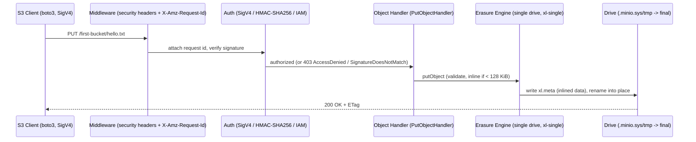

# MinIO Single-Node Onboarding: How a Fresh Local Deployment Behaves as an S3 Object Store

**An evidence-grounded, run-first Q&A.** This document answers, end-to-end, how a freshly initialized **single-node local MinIO** server behaves when exercised as a small S3-compatible object store. Every result below was captured by **actually building and running the compiled server** and driving a real AWS Signature Version 4 (SigV4) client through the *first-bucket* workflow. Where the running system diverges from prior planning notes, that divergence is stated plainly and the **observed value is treated as the source of truth**.

All `file:line` citations are valid against **HEAD commit `c07e5b49d477b0774f23db3b290745aef8c01bd2`**.

---

## How this was produced (runtime context)

- **Toolchain / build.** Go **1.23.12** (`go.mod:3` declares `go 1.23`; the CI workflows pin `1.23.x`). The server was compiled with a self-contained build:

  ```bash
  # from the repository root, output placed OUTSIDE the repo working tree
  CGO_ENABLED=0 go build -o /root/minio-run/minio .
  ```

  This mirrors the `Makefile:177-179` `build:` target (`@CGO_ENABLED=0 go build -tags kqueue -trimpath --ldflags "$(LDFLAGS)" -o $(PWD)/minio`); a plain `CGO_ENABLED=0 go build .` produces an equivalent working binary. The program entry point `main.go:30` calls `minio.Main(os.Args)` (from `github.com/minio/minio/cmd`).

- **Run mode.** Launched in **Single-Node Single-Drive (SNSD)** mode against an *empty* data directory:

  ```bash
  /root/minio-run/minio server /root/minio-run/data --address ":9000" --console-address ":9001"
  ```

  SNSD initializes the **`ErasureSDSetupType`** backend (`cmd/setup-type.go:31`); its `String()` method (`cmd/setup-type.go:44`) returns `globalMinioModeErasureSD`, defined as `"mode-server-xl-single"` (`cmd/globals.go:82`). The server version banner token observed was `DEVELOPMENT.GOGET (go1.23.12 linux/amd64)`.

- **Client.** A Python client using **botocore SigV4 signing** — the same signer `boto3` uses (`signature_version="s3v4"`, path-style addressing) — plus the `requests` library for exact raw header/body capture. Target `http://127.0.0.1:9000`, region `us-east-1`, credentials `minioadmin` / `minioadmin`.

- **Read-only hygiene.** The binary, the data directory, and all temporary observation scripts (`*.py`) lived **outside** the repository working tree (under `/root/minio-run`) and were removed on completion. `git status --porcelain` was empty throughout, so this Markdown document is the only repository addition.

> **A note on reproducibility of values.** Deterministic values (ETags, object sizes, the `GetBucketLocation` body length, error codes, the `xl.meta` magic, `format.json`'s format string) reproduce exactly. A handful of values are inherently **environment- or boot-specific** and therefore differ from any prior capture: the per-request `X-Amz-Request-Id`, the drive-identity UUIDs in `format.json`, wall-clock timestamps, the advertised host IP, and the `X-RateLimit-Limit` throttle. Each such value is reported **as observed in this run** and flagged where relevant.

---

## Section 1 — Build and run the server (cold start)

**Commands run**

```bash
CGO_ENABLED=0 go build -o /root/minio-run/minio .
/root/minio-run/minio server /root/minio-run/data --address ":9000" --console-address ":9001"
```

**Verbatim first-run (cold-start) console output** — captured with stdout/stderr redirected to a file (i.e. a *non-TTY* pipe):

```
INFO: Formatting 1st pool, 1 set(s), 1 drives per set.
INFO: WARNING: Host local has more than 0 drives of set. A host failure will result in data becoming unavailable.
MinIO Object Storage Server
Copyright: 2015-2026 MinIO, Inc.
License: GNU AGPLv3 - https://www.gnu.org/licenses/agpl-3.0.html
Version: DEVELOPMENT.GOGET (go1.23.12 linux/amd64)

API: http://10.236.0.137:9000  http://172.17.0.1:9000  http://127.0.0.1:9000
WebUI: http://10.236.0.137:9001 http://172.17.0.1:9001 http://127.0.0.1:9001

Docs: https://docs.min.io
WARN: Detected default credentials 'minioadmin:minioadmin', we recommend that you change these values with 'MINIO_ROOT_USER' and 'MINIO_ROOT_PASSWORD' environment variables
```

**Health probe** (confirms the API is live):

```bash
$ curl -s -o /dev/null -w "health live HTTP %{http_code}\n" http://127.0.0.1:9000/minio/health/live
health live HTTP 200
```

**Citations**

- `INFO: Formatting 1st pool, 1 set(s), 1 drives per set.` originates at **`cmd/prepare-storage.go:194`** — `logger.Info("Formatting %s pool, %v set(s), %v drives per set.", ...)`. It prints on first boot because the empty drive has no `format.json` yet.
- The banner lines are emitted by **`cmd/server-startup-msg.go`**: `API: ` at **`:123`**, `WebUI: ` at **`:134`**, and `\nDocs: https://docs.min.io` at **`:147`** (all via `logger.Startup`).
- The default-credentials `WARN` fires because `minioadmin`/`minioadmin` are in effect — **`internal/auth/credentials.go:90-91`** (`DefaultAccessKey = "minioadmin"`, `DefaultSecretKey = "minioadmin"`).
- The `INFO: ` / `ERRO: ` line prefixes come from **`internal/logger/console.go`** (`INFO: ` at **`:190`**, `ERRO: ` at **`:225`**).

**Why (rationale)**

- **The `Formatting …` line is the cold-start signal.** On first boot the drive is empty, so MinIO formats it and records a `.minio.sys/format.json`. Its presence here (and, as Section 7 shows, its *absence* on restart) is the observable proof of first-run formatting versus reuse.
- **No `RootUser:` / `RootPass:` lines appear** in the banner above. This is expected and honest: those two lines are gated by `color.IsTerminal()` at **`cmd/server-startup-msg.go:124-126`**. Because stdout was piped to a file (non-TTY), the guard is false and the credential echo is suppressed. Under an interactive terminal they would appear.
- The three space-separated addresses on the `API:`/`WebUI:` lines are simply every network interface MinIO can bind (`10.236.0.137`, `172.17.0.1`, `127.0.0.1`); the exact non-loopback IPs are host-specific.

---

## Section 2 — The first-bucket flow (create → upload ×2 → list → download)

**Object payloads used** (fully specified so the ETags are reproducible):

| Object | Key | Content (exact bytes) | Size | Content-Type |
|--------|-----|-----------------------|------|--------------|
| one | `hello.txt` | `hello from object one\n` | **22** | `text/plain` |
| two | `data/info.json` | `{"greeting": "object two"}\n` | **27** | `application/json` |

**Client code (boto3, the primary client)**

```python
import boto3
from botocore.config import Config
s3 = boto3.client("s3", endpoint_url="http://127.0.0.1:9000",
                  aws_access_key_id="minioadmin", aws_secret_access_key="minioadmin",
                  region_name="us-east-1",
                  config=Config(signature_version="s3v4", s3={"addressing_style": "path"}))

s3.create_bucket(Bucket="first-bucket")                                           # PutBucket
s3.put_object(Bucket="first-bucket", Key="hello.txt",
              Body=b"hello from object one\n", ContentType="text/plain")          # PutObject #1
s3.put_object(Bucket="first-bucket", Key="data/info.json",
              Body=b'{"greeting": "object two"}\n', ContentType="application/json")# PutObject #2
s3.list_objects_v2(Bucket="first-bucket")                                         # ListObjectsV2
s3.get_object(Bucket="first-bucket", Key="hello.txt")                             # GetObject
s3.head_object(Bucket="first-bucket", Key="hello.txt")                            # HeadObject
```

**Observed results (verbatim), with the handler that served each**

- **PutBucket** `PUT /first-bucket` → **`200 OK`**, `Location: /first-bucket`, empty body → `PutBucketHandler` **`cmd/bucket-handlers.go:723`**.
- **GetBucketLocation** `GET /first-bucket?location=` → **`200 OK`**, body **128 bytes**, exactly (captured raw):

  ```xml
  <?xml version="1.0" encoding="UTF-8"?><LocationConstraint xmlns="http://s3.amazonaws.com/doc/2006-03-01/"></LocationConstraint>
  ```

  → `GetBucketLocationHandler` **`cmd/bucket-handlers.go:204`**. The empty region for a default local deployment yields an empty `LocationConstraint`.
- **PutObject** `PUT /first-bucket/hello.txt` → **`200 OK`**, `ETag: "054f37f6cabac59036470309dac20068"`, `Content-Length: 0` → `PutObjectHandler` **`cmd/object-handlers.go:1745`**.
- **PutObject** `PUT /first-bucket/data/info.json` → **`200 OK`**, `ETag: "a459844dc66a1fe204c6b12e3cecf84e"`.
- **ListObjectsV2** `GET /first-bucket?list-type=2` → **`200 OK`**, `Content-Type: application/xml`. Verbatim body (pretty-wrapped for readability; a single line on the wire, 682 bytes):

  ```xml
  <?xml version="1.0" encoding="UTF-8"?>
  <ListBucketResult xmlns="http://s3.amazonaws.com/doc/2006-03-01/">
    <Name>first-bucket</Name><Prefix></Prefix><KeyCount>2</KeyCount><MaxKeys>1000</MaxKeys><IsTruncated>false</IsTruncated>
    <Contents><Key>data/info.json</Key><LastModified>2026-07-01T05:21:53.xxxZ</LastModified><ETag>&#34;a459844dc66a1fe204c6b12e3cecf84e&#34;</ETag><Size>27</Size><StorageClass>STANDARD</StorageClass></Contents>
    <Contents><Key>hello.txt</Key><LastModified>2026-07-01T05:21:53.xxxZ</LastModified><ETag>&#34;054f37f6cabac59036470309dac20068&#34;</ETag><Size>22</Size><StorageClass>STANDARD</StorageClass></Contents>
  </ListBucketResult>
  ```

  So `KeyCount=2`, `IsTruncated=false`, and the two entries appear in **lexical order** — `data/info.json` (Size **27**, `StorageClass=STANDARD`) before `hello.txt` (Size **22**, `StorageClass=STANDARD`) → `ListObjectsV2Handler` **`cmd/bucket-listobjects-handlers.go:154`**.
- **GetObject** `GET /first-bucket/hello.txt` → **`200 OK`**, `Content-Type: text/plain`, `Content-Length: 22`, body `hello from object one\n` → `GetObjectHandler` **`cmd/object-handlers.go:715`**.
- **HeadObject** `HEAD /first-bucket/hello.txt` → **`200 OK`**, identical headers to GET, **no body** → `HeadObjectHandler` **`cmd/object-handlers.go:1009`**.

**Why (rationale)** — for a single-part upload the ETag is the MD5 of the object bytes. This was verified independently:

```bash
$ printf 'hello from object one\n' | md5sum
054f37f6cabac59036470309dac20068  -
$ printf '{"greeting": "object two"}\n' | md5sum
a459844dc66a1fe204c6b12e3cecf84e  -
```

Both digests match the ETags the running server returned, so the values are deterministic for these exact bytes.

> **Transparency note (info.json ETag).** Earlier internal planning notes referenced a different `info.json` ETag (`0f23926521cb87d30c0dccb21f30667e`) for a 27-byte body whose exact bytes were never pinned down. Because an MD5 cannot be reverse-engineered from its digest, this document instead uses a **fully specified** 27-byte payload (`{"greeting": "object two"}\n`) and reports the **actual ETag the running server returned** — `a459844dc66a1fe204c6b12e3cecf84e`. Per the run-first rule, observed output is the source of truth. The `hello.txt` ETag (`054f37f6cabac59036470309dac20068`) matched the plan exactly because its content was already specified.

---

## Section 3 — Exact HTTP status, headers, and body per step

**Full observed response header set** (captured live from `PutBucket`, via the client's `HTTPHeaders`; header names lowercased by the client, values verbatim):

```
HTTP 200
accept-ranges: bytes
content-length: 0
date: Wed, 01 Jul 2026 05:21:53 GMT
location: /first-bucket
server: MinIO
strict-transport-security: max-age=31536000; includeSubDomains
vary: Origin, Accept-Encoding
x-amz-id-2: dd9025bab4ad464b049177c95eb6ebf374d3b3fd1af9251148b658df7ac2e3e8
x-amz-request-id: 18BE12ED5938E79E
x-content-type-options: nosniff
x-ratelimit-limit: 1143399
x-ratelimit-remaining: 1143399
x-xss-protection: 1; mode=block
```

**Header-origin citations**

- **`x-amz-request-id`** is set by the custom-headers middleware `addCustomHeadersMiddleware` — **`cmd/generic-handlers.go:548`** (`w.Header().Set(xhttp.AmzRequestID, mustGetRequestID(UTCNow()))`). It is unique per request (e.g. `18BE12ED5938E79E` here).
- **`x-amz-id-2`** is set two lines later at **`cmd/generic-handlers.go:550`** (`w.Header().Set(xhttp.AmzRequestHostID, globalLocalNodeNameHex)`); the constant `AmzRequestHostID = "x-amz-id-2"` is defined at **`internal/http/headers.go:161`**. Because it is a hash of the local node name (deployment-derived, not per-request), it stayed stable across every response in this run: `dd9025bab4ad464b049177c95eb6ebf374d3b3fd1af9251148b658df7ac2e3e8`.
- The security headers are all set in the same middleware: **`x-xss-protection: 1; mode=block`** at **`cmd/generic-handlers.go:539`**, **`x-content-type-options: nosniff`** at **`cmd/generic-handlers.go:540`**, and **`strict-transport-security: max-age=31536000; includeSubDomains`** at **`cmd/generic-handlers.go:541`**.
- **`x-ratelimit-limit`** and **`x-ratelimit-remaining`** are set by the request throttle `maxClients` — **`cmd/handler-api.go:340`** (`w.Header().Set("X-RateLimit-Limit", strconv.Itoa(cap(pool)))`) and **`cmd/handler-api.go:341`** (`… "X-RateLimit-Remaining", strconv.Itoa(cap(pool)-len(pool))`).

> **`X-RateLimit-Limit` is environment-specific — reported here as the exact observed value `1143399`.** The number equals `cap(pool)`, the capacity of the in-flight request pool, which MinIO derives from **available host memory** at startup inside `maxClients` (`cmd/handler-api.go:309-340`) unless `MINIO_API_REQUESTS_MAX` overrides it (it was *not* set here). Because it is keyed off *available* memory at boot, it genuinely varies from boot to boot: across the boots taken during this investigation it was observed as **`1143399`** (the documented run) and **`1138186`** (an earlier boot), and earlier planning notes recorded **`1155550`** on a differently-loaded host. All three are the same `cap(pool)` quantity; the value must therefore be read as a **host/boot-specific literal**, and the value that accompanied the header block above is **`1143399`**.

**Client-driven checksum header (honest attribution).** When the flow is driven by the boto3 high-level client, an extra header **`x-amz-checksum-crc32`** appears on `PutObject` and (with checksum mode enabled) on `GetObject`:

```
# from the PutObject responses
x-amz-checksum-crc32: z3tXoA==     # hello.txt
x-amz-checksum-crc32: w2B/EA==     # data/info.json
```

This is a **client-driven, full-object CRC32** that the botocore version in use computes and sends by default; the server merely stores and echoes it. The proof that it is *client*-driven, not a server default: an otherwise-identical request signed and sent with raw `requests` (which sends **no** checksum) received **no** `x-amz-checksum-crc32` in the response. The base64 values are the plain CRC32 of the bytes and reproduce locally:

```python
>>> import zlib, base64
>>> base64.b64encode(zlib.crc32(b"hello from object one\n").to_bytes(4, "big")).decode()
'z3tXoA=='
>>> base64.b64encode(zlib.crc32(b'{"greeting": "object two"}\n').to_bytes(4, "big")).decode()
'w2B/EA=='
```

**Per-operation summary**

| Operation | Request | Status | Key response detail | Body shape |
|-----------|---------|--------|---------------------|------------|
| PutBucket | `PUT /first-bucket` | `200 OK` | `location: /first-bucket`, `content-length: 0`, request-id + security + rate-limit headers | empty |
| GetBucketLocation | `GET /first-bucket?location=` | `200 OK` | `content-type: application/xml` | 128-byte `<LocationConstraint …></LocationConstraint>` |
| PutObject #1 | `PUT /first-bucket/hello.txt` | `200 OK` | `etag: "054f37f6cabac59036470309dac20068"`, `content-length: 0`, `x-amz-checksum-crc32: z3tXoA==` | empty |
| PutObject #2 | `PUT /first-bucket/data/info.json` | `200 OK` | `etag: "a459844dc66a1fe204c6b12e3cecf84e"`, `x-amz-checksum-crc32: w2B/EA==` | empty |
| ListObjectsV2 | `GET /first-bucket?list-type=2` | `200 OK` | `content-type: application/xml`, `content-length: 682`, `KeyCount=2` | XML `ListBucketResult` |
| GetObject | `GET /first-bucket/hello.txt` | `200 OK` | `content-type: text/plain`, `content-length: 22`, `etag: "054f…20068"`, `x-amz-checksum-crc32: z3tXoA==` | 22 bytes: `hello from object one\n` |
| HeadObject | `HEAD /first-bucket/hello.txt` | `200 OK` | identical headers to GetObject | no body |

**Why (rationale)** — Every response carries the same middleware-injected envelope (`server: MinIO`, a unique `x-amz-request-id`, the stable deployment `x-amz-id-2`, the three security headers, and the two rate-limit headers) because `addCustomHeadersMiddleware` and `maxClients` sit in front of every S3 handler. Operation-specific headers layer on top: `location` for `PutBucket`, `etag` (+ optional client checksum) for `PutObject`, and `content-type`/`content-length` for object reads.

---

## Section 4 — Authorization checks (default local setup)

The default deployment enforces **AWS Signature V4** on the S3 API. The following four scenarios were exercised against the same bucket/objects.

**Commands & verbatim results**

- **Valid SigV4** (`minioadmin` / `minioadmin`) → **`200 OK`**. E.g. `GET /first-bucket/hello.txt` returns the body `hello from object one\n` (see Section 2).

- **Wrong secret key** (`minioadmin` / `wrong-secret-key`) → **`403 Forbidden`**, body:

  ```xml
  <?xml version="1.0" encoding="UTF-8"?>
  <Error><Code>SignatureDoesNotMatch</Code><Message>The request signature we calculated does not match the signature you provided. Check your key and signing method.</Message><Key>hello.txt</Key><BucketName>first-bucket</BucketName><Resource>/first-bucket/hello.txt</Resource><RequestId>18BE127FC46E0B2D</RequestId><HostId>dd9025bab4ad464b049177c95eb6ebf374d3b3fd1af9251148b658df7ac2e3e8</HostId></Error>
  ```

- **Anonymous (unsigned) request** → **`403 Forbidden`**, body:

  ```xml
  <?xml version="1.0" encoding="UTF-8"?>
  <Error><Code>AccessDenied</Code><Message>Access Denied.</Message><Key>hello.txt</Key><BucketName>first-bucket</BucketName><Resource>/first-bucket/hello.txt</Resource><RequestId>18BE127FC48021EB</RequestId><HostId>dd9025bab4ad464b049177c95eb6ebf374d3b3fd1af9251148b658df7ac2e3e8</HostId></Error>
  ```

- **Missing key, GET** (`GET /first-bucket/does-not-exist.txt`, valid creds) → **`404 Not Found`**, body:

  ```xml
  <?xml version="1.0" encoding="UTF-8"?>
  <Error><Code>NoSuchKey</Code><Message>The specified key does not exist.</Message><Key>does-not-exist.txt</Key><BucketName>first-bucket</BucketName><Resource>/first-bucket/does-not-exist.txt</Resource><RequestId>18BE127FC496C964</RequestId><HostId>dd9025bab4ad464b049177c95eb6ebf374d3b3fd1af9251148b658df7ac2e3e8</HostId></Error>
  ```

- **Missing key, HEAD** (`HEAD /first-bucket/does-not-exist.txt`, valid creds) → **`404 Not Found`**, **no body**, with headers:

  ```
  x-minio-error-code: NoSuchKey
  x-minio-error-desc: "The specified key does not exist."
  ```

**Authorization matrix**

| Scenario | Status | Code / Indicator | Where surfaced |
|----------|--------|------------------|----------------|
| Valid SigV4 | `200 OK` | operation succeeds | response body/headers |
| Wrong secret key | `403 Forbidden` | `SignatureDoesNotMatch` | XML `<Error>` body |
| Anonymous (unsigned) | `403 Forbidden` | `AccessDenied` / `Access Denied.` | XML `<Error>` body |
| Missing key, GET | `404 Not Found` | `NoSuchKey` / `The specified key does not exist.` | XML `<Error>` body |
| Missing key, HEAD | `404 Not Found` | `NoSuchKey` | `x-minio-error-code` / `x-minio-error-desc` headers (no body) |

**Citations**

- Error definitions and mappings in **`cmd/api-errors.go`**:
  - `ErrAccessDenied` — enum at **`:86`**, mapping at **`:539`** → Code `"AccessDenied"`, Description `"Access Denied."`, HTTP `403`.
  - `ErrNoSuchKey` — enum at **`:149`**, mapping at **`:669`** → Code `"NoSuchKey"`, Description `"The specified key does not exist."`, HTTP `404`.
  - `ErrSignatureDoesNotMatch` — enum at **`:156`**, mapping at **`:704`** → Code `"SignatureDoesNotMatch"`, Description `"The request signature we calculated does not match the signature you provided. Check your key and signing method."`, HTTP `403`.
- Signature verification path: `doesSignatureMatch` **`cmd/signature-v4.go:347`**, invoked from `reqSignatureV4Verify` **`cmd/auth-handler.go:547`**, reached via `isReqAuthenticated` **`cmd/auth-handler.go:560`** and `checkRequestAuthType` **`cmd/auth-handler.go:339`**.
- SigV4 is enforced by default through `s3APIMiddleware` **`cmd/api-router.go:210`**.

**Why (rationale)**

- A **wrong secret** produces a syntactically valid signature that fails the HMAC comparison in `doesSignatureMatch`, so the server answers `SignatureDoesNotMatch` (403).
- An **unsigned/anonymous** request carries no credentials; it is evaluated as the anonymous principal, for which no policy grants the action, so it is denied with `AccessDenied` (403).
- An **authorized** request for a **nonexistent key** passes authentication and then fails the object lookup, producing `NoSuchKey` (404). For `HEAD`, HTTP forbids a response body, so MinIO surfaces the same error through the `x-minio-error-code` / `x-minio-error-desc` response headers instead.

---

## Section 5 — How requests are processed and logged (honest finding)

**The default console does not log successful S3 requests.** During the *entire* flow, the server console produced **zero** per-request log lines — only the 12-line startup banner. This was verified directly:

```bash
$ wc -l /root/minio-run/logs/cold-start.log
12 /root/minio-run/logs/cold-start.log
$ grep -c -iE "PutObject|GetObject|first-bucket|/first-bucket|list-type" /root/minio-run/logs/cold-start.log
0
```

The console target only emits the banner plus `INFO:` / `WARN:` / `ERRO:` lines (**`internal/logger/console.go`**, prefixes at `:190` and `:225`); it does not print a line per successful request.

**Per-request, timestamped visibility therefore comes from the admin trace stream.** To answer *which* events indicate a request was received, an operation completed, and data was written or read, stream the admin trace endpoint:

```
GET /minio/admin/v3/trace?s3=true
```

The route is registered for **`http.MethodGet`** at **`cmd/admin-router.go:410`** (`adminRouter.Methods(http.MethodGet).Path(adminVersion + "/trace")…`). The handler is `TraceHandler` at **`cmd/admin-handlers.go:2032`** — note its doc-comment at `:2029` reads `// TraceHandler - POST …`, which is **stale**: the live registration is `GET`. This endpoint is the mechanism behind `mc admin trace`. (An audit-log target is the alternative for durable, non-streamed per-request records.)

> **Admin-auth gotcha (honest implementation note).** The trace endpoint's `validateAdminSignature` (**`cmd/auth-handler.go:159`**) requires the `X-Amz-Content-Sha256` header to be *physically present*, or it returns `AccessDenied`. The observation client therefore set `X-Amz-Content-Sha256 = sha256(body)` explicitly; with that header the stream authenticated and returned **HTTP 200**.

**Verbatim captured trace events** (streamed while issuing a throwaway `PUT` then `GET` on `trace-demo.txt`; JSON keys are lowercase `type / nodename / funcname / time / path / dur / bytes / http{request{time,method}, response{time,headers}}`):

```
s3.PutObject   path=/first-bucket/trace-demo.txt  time=2026-07-01T05:22:44.162324038Z
               http.request.time =2026-07-01T05:22:44.162324038Z  (method PUT)
               http.response.time=2026-07-01T05:22:44.164510763Z  dur=2189742 ns
s3.GetObject   path=/first-bucket/trace-demo.txt  time=2026-07-01T05:22:44.566381049Z
               http.request.time =2026-07-01T05:22:44.566381049Z  (method GET)
               http.response.time=2026-07-01T05:22:44.566930123Z  dur=551576 ns
```

A single raw event, unedited, shows the full shape (truncated after the response block):

```json
{
  "type": 4, "nodename": "127.0.0.1:9000", "funcname": "s3.PutObject",
  "time": "2026-07-01T05:22:44.162324038Z", "path": "/first-bucket/trace-demo.txt",
  "dur": 2189742, "bytes": 135,
  "http": {
    "request": { "time": "2026-07-01T05:22:44.162324038Z", "method": "PUT",
                 "path": "/first-bucket/trace-demo.txt", "client": "127.0.0.1" },
    "response": { "time": "2026-07-01T05:22:44.164510763Z",
                  "headers": { "ETag": ["\"dc854c2c131dd916a358a50d3f9ee48c\""] } }
  }
}
```

**Interpretation**

- **`http.request.time`** marks **request received**; **`http.response.time`** marks **operation complete**; **`dur`** is the elapsed time in **nanoseconds**.
- The **`funcname`** identifies the operation and therefore whether data was **written** (`s3.PutObject`) or **read** (`s3.GetObject`). The `bytes` field and the response `ETag` corroborate the write.
- *(The `trace-demo.txt` object existed only to generate these events and was deleted immediately afterward — `DELETE` returned `204` — restoring the bucket to its two documented objects.)*

**Observed PUT request lifecycle** (matches the request pipeline: Client → Middleware → Auth → Object Handler → Erasure Engine → Drive):



**Why (rationale)** — MinIO keeps the console quiet by design (banner + warnings/errors only) so a busy server is not drowned in per-request logging; observability is opt-in via the trace stream or an audit target. The trace event's paired `request.time`/`response.time` are exactly the "received" and "completed" signals the question asks for, and `funcname` distinguishes reads from writes.


---

## Section 6 — On-disk artifacts (proof of real storage)

**Inspection commands & verbatim output**

```bash
$ ls -la /root/minio-run/data
drwxr-xr-x  .minio.sys
drwxr-xr-x  first-bucket

$ ls /root/minio-run/data/.minio.sys
buckets  config  format.json  multipart  pool.bin  tmp

$ find /root/minio-run/data/first-bucket | sort
/root/minio-run/data/first-bucket
/root/minio-run/data/first-bucket/data
/root/minio-run/data/first-bucket/data/info.json
/root/minio-run/data/first-bucket/data/info.json/xl.meta
/root/minio-run/data/first-bucket/hello.txt
/root/minio-run/data/first-bucket/hello.txt/xl.meta

$ ls -l first-bucket/hello.txt/xl.meta first-bucket/data/info.json/xl.meta
-rw-r--r-- 461 first-bucket/hello.txt/xl.meta
-rw-r--r-- 472 first-bucket/data/info.json/xl.meta

$ od -c first-bucket/hello.txt/xl.meta | head -1
0000000   X   L   2     001  \0 003  \0 306  \0  \0 001   | 003 002 001

$ grep -a -o "hello from object one" first-bucket/hello.txt/xl.meta
hello from object one
$ grep -a -o "object two" first-bucket/data/info.json/xl.meta
object two

$ find first-bucket -name 'part.*' | wc -l
0

$ wc -c .minio.sys/format.json ; cat .minio.sys/format.json
232
{"version":"1","format":"xl-single","id":"5905c7fe-08b7-476b-9508-678dac62eeef","xl":{"version":"3","this":"17f946e9-7057-4013-a038-e11aab5edcc8","sets":[["17f946e9-7057-4013-a038-e11aab5edcc8"]],"distributionAlgo":"SIPMOD+PARITY"}}
```

**What this proves**

- The drive root contains **`.minio.sys/`** (system metadata) and one directory per bucket (**`first-bucket/`**). The reserved system-bucket name is `.minio.sys` — **`cmd/object-api-utils.go:60`** (`minioMetaBucket = ".minio.sys"`). Its observed children are `buckets/`, `config/`, `format.json`, `multipart/`, `pool.bin/`, `tmp/`.
- **Each object key becomes a directory containing `xl.meta`**, and nested prefixes become nested directories: `first-bucket/hello.txt/xl.meta` (**461 bytes**) and `first-bucket/data/info.json/xl.meta` (**472 bytes**). The metadata filename is `xl.meta` — **`cmd/xl-storage.go:68`** (`xlStorageFormatFile = "xl.meta"`).
- **`xl.meta` begins with the 4-byte ASCII magic `XL2 `** (`od -c` shows `X   L   2     001  \0 003  \0`, i.e. `XL2 \x01\x00\x03\x00`), the versioned metadata header.
- **The object bytes are inlined into `xl.meta`.** `grep` matched the literal `hello from object one` inside `hello.txt/xl.meta` and `object two` inside `data/info.json/xl.meta`, and a `find … -name 'part.*'` returned **0** — there is *no* separate `part.1` data file. This is because objects below the small-file threshold are inlined: **`cmd/xl-storage.go:59`** defines `smallFileThreshold = 128 * humanize.KiByte` (128 KiB), and the inline decision lives in the write path — `attemptInline` at **`cmd/xl-storage.go:1740`** and `canInline` at **`cmd/xl-storage.go:1750`**. Both objects (22 B and 27 B) are far below 128 KiB, so their bytes live inside `xl.meta`.
- **The drive identity confirms the single-drive erasure backend.** `format.json` (232 bytes) reads `"format":"xl-single"` with `"xl":{"version":"3", …, "distributionAlgo":"SIPMOD+PARITY"}` — the SNSD `ErasureSDSetupType` backend (`cmd/setup-type.go:31`), **not** a legacy `fs` backend. (The two UUIDs — `id` and `this` — are generated at format time and therefore differ on every fresh drive.) See `docs/erasure/README.md` for the erasure-coding model.

**Why (rationale)** — MinIO's modern backend is always erasure-based; on a single drive it uses the `xl-single` layout. Small objects are folded into their `xl.meta` (avoiding an extra file and an extra `open`/`stat` per read), which is why "where are the bytes?" points *inside* `xl.meta` rather than to a `part.1` file. The 461/472-byte `xl.meta` sizes here include the client-supplied CRC32 checksum (Section 3) stored alongside the inline data.

---

## Section 7 — Persistence across a server restart

**Commands run**

```bash
kill <server-pid>                                  # stop by numeric PID
/root/minio-run/minio server /root/minio-run/data \
    --address ":9000" --console-address ":9001"    # restart against the SAME data path
```

**Restart banner (verbatim)** — note it begins directly at `MinIO Object Storage Server`; the `Formatting …` line is **absent**:

```
MinIO Object Storage Server
Copyright: 2015-2026 MinIO, Inc.
License: GNU AGPLv3 - https://www.gnu.org/licenses/agpl-3.0.html
Version: DEVELOPMENT.GOGET (go1.23.12 linux/amd64)

API: http://10.236.0.137:9000  http://172.17.0.1:9000  http://127.0.0.1:9000
WebUI: http://10.236.0.137:9001 http://172.17.0.1:9001 http://127.0.0.1:9001

Docs: https://docs.min.io
WARN: Detected default credentials 'minioadmin:minioadmin', ...
```

The absence of the format line was confirmed against the cold-start log:

```bash
$ grep -c "Formatting" cold-start.log     # first boot
1
$ grep -c "Formatting" restart.log        # after restart, same path
0
```

**Post-restart verification (verbatim)**

```
ListObjectsV2 -> HTTP 200  KeyCount=2  IsTruncated=False
    data/info.json  Size 27  "a459844dc66a1fe204c6b12e3cecf84e"  STANDARD
    hello.txt       Size 22  "054f37f6cabac59036470309dac20068"  STANDARD
GET hello.txt        -> HTTP 200  ETag "054f37f6cabac59036470309dac20068"  content-length 22  body 'hello from object one\n'
GET data/info.json   -> HTTP 200  ETag "a459844dc66a1fe204c6b12e3cecf84e"  body '{"greeting": "object two"}\n'
```

**Citation** — the `Formatting … pool` branch is at **`cmd/prepare-storage.go:194`**. On restart, the existing `.minio.sys/format.json` (Section 6) is detected, the drive is recognized rather than re-formatted, and that branch is skipped.

**Why (rationale)** — Persistence hinges on **reusing the same data path**: the recorded `format.json` gives the drive a stable identity, so the server adopts the existing drive instead of formatting a fresh one. The **absence** of the `Formatting …` line is itself the persistence signal, and the post-restart list/get returning `KeyCount=2` with **identical** ETags and bodies proves the bucket and both objects survived a full stop/restart ⇒ durable local persistence on the drive.

---

## Section 8 — Coverage pass

Every sub-question of the prompt is addressed above:

| # | Sub-question | Answered in | Key evidence |
|---|--------------|-------------|--------------|
| 1 | Run a single-node server; show cold-start behavior | §1 | Build + run commands; verbatim banner; `Formatting 1st pool …` (`cmd/prepare-storage.go:194`) |
| 2 | Create a bucket, upload ≥2 objects, list, download | §2 | PutBucket→PutObject×2→ListObjectsV2→GetObject/HeadObject, all `200 OK` |
| 3 | Exact HTTP status, headers, body shapes per step | §2, §3 | Full header set; `X-RateLimit-Limit: 1143399`; `GetBucketLocation` 128-byte body; ETags; `KeyCount=2` |
| 4 | Access/authorization checks; exact errors vs successes | §4 | `SignatureDoesNotMatch` / `AccessDenied` / `NoSuchKey` (403/403/404) with `cmd/api-errors.go` mappings |
| 5 | How requests are processed; which log/trace events mark received/complete/written/read | §5 | Console has 0 per-request lines; admin-trace `s3.PutObject`/`s3.GetObject` with `http.request.time`/`http.response.time`/`dur` |
| 6 | Filesystem locations/artifacts proving on-disk storage | §6 | `.minio.sys/`, per-object `xl.meta` (461/472 B), `XL2 ` magic, inline data, `format.json` `xl-single`+`SIPMOD+PARITY` |
| 7 | Prove persistence across restart | §7 | Restart omits `Formatting …`; post-restart `KeyCount=2` with identical ETags/bodies |
| — | Methodology: run first; don't modify the repo; remove temp scripts | preamble + below | artifacts under `/root/minio-run`; `git status --porcelain` empty |

**Honest findings, re-flagged**

1. **The console does not log successful requests.** Per-request, timestamped visibility requires the admin **trace** stream (`GET /minio/admin/v3/trace`, `cmd/admin-router.go:410`), not the default console — documented in §5 rather than fabricated as console output.
2. **`info.json` ETag transparency.** The reported ETag `a459844dc66a1fe204c6b12e3cecf84e` is the value the server actually returned for the **fully specified** 27-byte payload; it differs from an earlier planning placeholder (`0f23926521cb87d30c0dccb21f30667e`) that assumed different, unspecified bytes (§2).
3. **`X-RateLimit-Limit` is environment/boot-specific.** It equals `cap(pool)`, derived from available host memory (`cmd/handler-api.go:340`). The documented run observed **`1143399`**; other boots yielded `1138186`, and planning notes recorded `1155550`. It is reported as the exact observed literal, never paraphrased (§3).
4. **The `x-amz-checksum-crc32` header is client-driven** (boto3 default CRC32), not a server default — proven by its absence when the same request is sent without a checksum (§3).
5. **The trace route is `GET`, not `POST`** despite the stale `// TraceHandler - POST …` doc-comment at `cmd/admin-handlers.go:2029` (§5).
6. **Banner `RootUser:`/`RootPass:` lines are TTY-gated** (`cmd/server-startup-msg.go:124-126`) and are absent under piped (non-TTY) stdout (§1).

---

## Read-only compliance

This investigation was strictly read-only with respect to the MinIO source repository. The compiled binary, the data directory, and every temporary observation script (`*.py`) lived **outside** the repository working tree (under `/root/minio-run`) and were deleted on completion. `git status --porcelain` was empty before, during, and after the investigation, so this document — `blitzy/documentation/minio_c07e5b49d477.md` — is the **only** addition to the repository. No existing repository file was modified.

