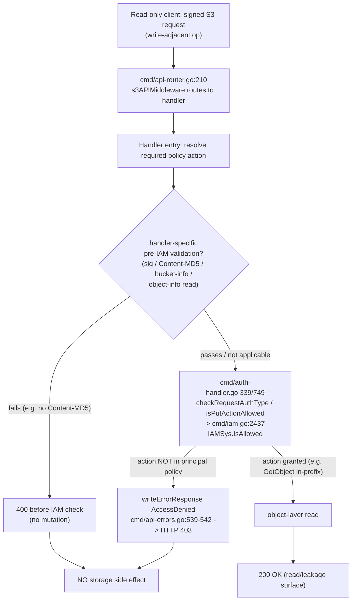

# Does MinIO's read‑only IAM boundary hold under concurrent write stress?

> A run‑first security investigation. The MinIO server was **built and run** in its
> default configuration; a genuinely read‑only identity was driven against the full
> write‑adjacent S3 surface **while other clients hammered the same bucket with
> writes and metadata traffic**; and every claim below is backed by an actual
> request/response trace, client status/body, and an observed storage side effect
> (or the proven absence of one). All source references are anchored to the MinIO
> source at HEAD `c07e5b49d477`.

---

## 1. The question, and the direct answer

**The question (restated).** Can a principal who is *supposed* to be read‑only on a
bucket and prefix still **mutate data** through less‑obvious S3 surface area —
multipart operations, copy‑style writes, metadata changes (tagging, retention,
legal‑hold, ACL), or deletes — especially **while the same bucket is under heavy
concurrent write load**? And separately, **what metadata can such a principal learn**
from listing and `HEAD`/attributes behavior without full object reads?

**Direct answer: No — the boundary holds. There was no bypass.**

Across **two full runs**, while 12 concurrent writer threads drove the shared bucket
from ~14k to ~44k objects, a faithfully read‑only identity (`rouser`) **could not
mutate data through any write‑adjacent surface**. Every write‑adjacent operation was
**denied before any mutation occurred and produced no storage side effect**:

| Surface area probed | rouser result | Storage side effect |
|---|---|---|
| Multipart (create, upload‑part, upload‑part‑copy, complete, abort, list‑parts, list‑uploads) | **Denied** — HTTP `403 AccessDenied` | None (no object, no orphan upload) |
| Copy‑style writes (`CopyObject`, `UploadPartCopy`) | **Denied** — HTTP `403 AccessDenied` | None |
| Metadata (`PutObjectTagging`, `DeleteObjectTagging`, `PutObjectRetention`, `PutObjectLegalHold`, `PutObjectAcl`) | **Denied** — `403` (retention reaches the IAM check only when `Content‑MD5` is supplied; then `403`) | None (tags stayed empty; no retention/hold applied) |
| Deletes (`DeleteObject`, multi‑`DeleteObjects`) | **Denied** — single `403`; multi returns `200` with **per‑key `AccessDenied`** and **no deletion** | None (all seed objects intact) |

**What a read‑only principal *can* learn (the leakage surface).** Within its granted
prefix, `rouser` can read object **content** (`GetObject` → `200`) and object
**metadata** via `HeadObject`/listing — namely **existence, size, ETag, content‑type,
last‑modified**, and the presence of lock/retention headers. Outside its granted
prefix, and for the distinct `GetObjectAttributes` action, it is **denied `403`**. This
is the intended, prefix‑scoped read surface, not a leak beyond the grant.

**The mechanism, in one sentence.** Every write‑adjacent operation `rouser` attempted
was **denied by the IAM policy decision (`IAMSys.IsAllowed`, `cmd/iam.go:2437`) before
any write to the object/erasure backend**, so no amount of concurrent traffic could
turn a denied read‑only call into a mutation — the authorization decision is
**per‑request and independent of other clients' load** (§5.1). A few handlers perform
some *pre‑IAM validation* and even an *object‑info read* before the permission check
(`DeleteObjectTagging`, `PutObjectRetention`); those nuances are documented in §6.7 and
do **not** weaken the result — the deny still lands **before any mutation**.

**Nuances layered on top of the direct answer** (each demonstrated with evidence
below):

1. **Multi‑object delete is not a single `403`.** `DeleteObjects` returns HTTP `200`
   with a per‑key `<Error><Code>AccessDenied</Code></Error>` for each key, and deletes
   nothing (§5.5, §6.1).
2. **Retention/multi‑delete have a pre‑IAM `Content‑MD5` gate.** A client that omits
   `Content‑MD5` (e.g., botocore 1.43, which sends a CRC32 checksum instead) is rejected
   with `400 MissingContentMD5` **before** the IAM check; supplying `Content‑MD5`
   reaches the IAM check, which then denies (`403`) or returns per‑key `AccessDenied`
   (§6.2, §6.7).
3. **The built‑in `readonly` policy cannot list.** It grants `GetObject` but **not**
   `ListBucket`; a principal on canned `readonly` (`rocanned`) reads objects (`200`) but
   is **denied `403`** on `ListObjectsV2` (§5.7, §6.4). Modeling "read‑only on a bucket
   **and prefix**" (which implies listing within the prefix) therefore requires a
   **custom** prefix‑scoped policy — which `rouser` uses (§3.2).
4. **The empty‑header retention skip is real but not a bypass.** The `PutObject`
   retention sub‑check *short‑circuits* when no object‑lock headers are present
   (`cmd/auth-handler.go:772‑775`); it only demands `PutObjectRetentionAction` when the
   caller actually sends lock headers. Demonstrated empirically with a dedicated
   principal `rwnoret` (§6.2): identical `PutObject`s differing *only* by lock headers
   flip the outcome `200`→`403`. A read‑only principal is denied either way because it
   lacks even `PutObjectAction`.

The remainder of this document is the evidence: the exact environment and commands
(§2), the identities/policies/seed data (§3), the concurrent‑load design (§4), the
per‑operation results with raw traces and storage proofs (§5), the behavioral nuances
(§6), the two‑run stability result (§7), and the verdict, methodology, cleanup, and a
named‑item coverage pass (§8).

---

## 2. Environment, exact build, and canonical run

Everything was built and run as a normal user in MinIO's **default configuration**.
The exact commands and their real output follow.

### 2.1 Toolchain and source revision

```
$ go version
go version go1.23.2 linux/amd64

$ git rev-parse --abbrev-ref HEAD
blitzy-b8fad361-f2c2-4f2e-90a6-30ee12dd6565
$ git rev-parse HEAD
469e775b4da3af1e430321987f31f5c7047bcd5d
$ git diff --name-only c07e5b49d477 HEAD
blitzy/documentation/minio_c07e5b49d477.md
```

The MinIO **source** under investigation is HEAD `c07e5b49d477` (the commit this branch
was cut from). The `git rev-parse HEAD` value above is the *destination* working‑tree
commit captured during this investigation pass — a Blitzy branch commit that advances
as this answer document is revised and committed, and is **not** the MinIO source under
test. The durable invariant is the `git diff --name-only c07e5b49d477 HEAD` line above:
the only path that differs between the source commit and the working tree is *this answer
document* — no file under `cmd/` or `internal/` (nor `go.mod`/`go.sum`) is modified, so the
built binary reflects the `c07e5b49d477` source. All `file:line` citations in this document
are anchored to `c07e5b49d477`.

### 2.2 Build (verbatim command)

```
$ CGO_ENABLED=0 go build -tags kqueue -trimpath -o /tmp/minio .
$ echo "exit=$?"
exit=0
```

The build completed with **no output on stderr**. The resulting binary:

```
$ stat -c '%s bytes' /tmp/minio
156592469 bytes
$ file /tmp/minio
/tmp/minio: ELF 64-bit LSB executable, x86-64, version 1 (SYSV), statically linked, Go BuildID=VgTH6mNkvqVyDlGyq8Xl/a8Egdu6J8KI_zwNcPWsT/jdul98ntFttrpI0zPRK7/KYKkx3EhnijRcU1-cKRU, with debug_info, not stripped
```

### 2.3 Version banner (a build‑configuration artifact, labeled as such)

```
$ /tmp/minio --version
minio version DEVELOPMENT.GOGET (commit-id=DEVELOPMENT.GOGET)
Runtime: go1.23.2 linux/amd64
License: GNU AGPLv3 - https://www.gnu.org/licenses/agpl-3.0.html
Copyright: 2015-0000 MinIO, Inc.
```

`DEVELOPMENT.GOGET` is the version string produced by a **plain `go build`** (the
Makefile's `buildscripts/gen-ldflags.go` version stamping was intentionally not used).
It is a *build‑configuration artifact, not a defect*, and does not affect the S3/admin
code paths under test.

### 2.4 Canonical run (verbatim command) and health

```
$ /tmp/minio server /tmp/minio-data --address :9000
```

Startup log (default configuration, single node, single drive; default root credentials),
reproduced verbatim (the listed `10.236.0.194`/`172.17.0.1` addresses are the container's
private pod/docker interfaces; probes use `127.0.0.1`):

```
INFO: Formatting 1st pool, 1 set(s), 1 drives per set.
INFO: WARNING: Host local has more than 0 drives of set. A host failure will result in data becoming unavailable.
MinIO Object Storage Server
Copyright: 2015-2026 MinIO, Inc.
License: GNU AGPLv3 - https://www.gnu.org/licenses/agpl-3.0.html
Version: DEVELOPMENT.GOGET (go1.23.2 linux/amd64)

API: http://10.236.0.194:9000  http://172.17.0.1:9000  http://127.0.0.1:9000 
WebUI: http://10.236.0.194:34527 http://172.17.0.1:34527 http://127.0.0.1:34527   

Docs: https://docs.min.io
WARN: Detected default credentials 'minioadmin:minioadmin', we recommend that you change these values with 'MINIO_ROOT_USER' and 'MINIO_ROOT_PASSWORD' environment variables
```

Health endpoints (all `200`):

```
$ curl -s -o /dev/null -w '%{http_code}\n' http://127.0.0.1:9000/minio/health/live     # 200
$ curl -s -o /dev/null -w '%{http_code}\n' http://127.0.0.1:9000/minio/health/ready    # 200
$ curl -s -o /dev/null -w '%{http_code}\n' http://127.0.0.1:9000/minio/health/cluster  # 200
```

### 2.5 On‑disk backend layout (used for storage side‑effect proofs)

The single‑node server uses the single‑drive erasure ("XL") backend: each object is a
directory containing `xl.meta` (and data). A denied write would manifest as a **new
`<object>/xl.meta` directory** under the prefix, so a filesystem snapshot before/after a
write probe — combined with an authorized root re‑list and `StatObject` ETag comparison
— conclusively demonstrates the presence or absence of a storage side effect (§5, §6).

```
$ find /tmp/minio-data/probe-bucket/ro-prefix -name xl.meta | sort
/tmp/minio-data/probe-bucket/ro-prefix/a.txt/xl.meta
/tmp/minio-data/probe-bucket/ro-prefix/b.txt/xl.meta
/tmp/minio-data/probe-bucket/ro-prefix/sub/c.txt/xl.meta
```

### 2.6 Client tooling (drives probes; nothing added to the repository)

- **`madmin-go/v3` v3.0.77** — provision users/policies and stream the server‑side
  `ServiceTrace` request/response feed.
- **`minio-go/v7` v7.0.80** — signed S3 client for the concurrent writer load and for
  the streaming `PutObject` retention‑skip probes.
- **`boto3` 1.43.42 / botocore 1.43.42** — independent signed S3 client for the read‑only
  probe matrix.
- **`curl` 8.14.1** with `--aws-sigv4` — byte‑level SigV4 request/response inspection.

All reproduction logic lives in ephemeral scripts under `/tmp` and is removed afterward
(§8.3).

---

## 3. Identities, policies, and seed data (provisioned via the real admin API)

All identities and policies were created through the **real admin API**
(`madmin-go`, the same surface as `mc admin user add` / `mc admin policy
create/attach`) against the running server — no simulation, no debug hooks. The
policy JSON shown below is **read back from the server** with
`madmin.InfoCannedPolicy` after attachment, i.e. it is what the server actually
stored and evaluates.

### 3.1 Buckets and seed objects

Two buckets were created as root: `probe-bucket` (no object lock) and `lock-bucket`
(object‑locking enabled, for the retention/legal‑hold probes). Five seed objects were
written as root, with **known byte content** so that each ETag equals the MD5 of its
content (single‑part uploads). Raw provisioning output:

```
=== SEED OBJECTS (bucket key size etag) ===
probe-bucket ro-prefix/a.txt        size=32 etag=5216ddcc58e8dade5256075e77f642da (md5=5216ddcc58e8dade5256075e77f642da)
probe-bucket ro-prefix/b.txt        size=34 etag=cc9b8aab6a7164192c280d67647f60e9 (md5=cc9b8aab6a7164192c280d67647f60e9)
probe-bucket ro-prefix/sub/c.txt    size=35 etag=6c870fac6991ca112725627766424949 (md5=6c870fac6991ca112725627766424949)
probe-bucket other-prefix/x.txt     size=33 etag=d45e1549301eb727bde58d14554ce087 (md5=d45e1549301eb727bde58d14554ce087)
lock-bucket  lock-prefix/obj.txt    size=34 etag=9dc2339c3556f6b3882ca300b94bd754 (md5=9dc2339c3556f6b3882ca300b94bd754)
```

Roles of the seeds:

- `ro-prefix/a.txt`, `ro-prefix/b.txt`, `ro-prefix/sub/c.txt` — **inside** `rouser`'s
  granted prefix (`ro-prefix/*`).
- `other-prefix/x.txt` — **outside** the grant (used to prove the read boundary denies).
- `lock-bucket/lock-prefix/obj.txt` — target for retention/legal‑hold probes.

### 3.2 `rouser` — the faithful read‑only principal (custom prefix‑scoped policy)

`rouser` models "read‑only access to a bucket **and prefix**". Because the built‑in
`readonly` policy cannot list (§3.3, §6.4), a **custom** policy is attached: `GetObject`
on `ro-prefix/*` plus `ListBucket` gated by an `s3:prefix` condition, mirrored for
`lock-bucket/lock-prefix/*`. Policy as **read back from the server**:

```
=== POLICY rouser-policy (read back from admin API) ===
{
 "Version": "2012-10-17",
 "Statement": [
  {"Effect": "Allow", "Action": ["s3:GetObject"], "Resource": ["arn:aws:s3:::probe-bucket/ro-prefix/*"]},
  {"Effect": "Allow", "Action": ["s3:ListBucket"], "Resource": ["arn:aws:s3:::probe-bucket"],
   "Condition": {"StringLike": {"s3:prefix": ["ro-prefix/*"]}}},
  {"Effect": "Allow", "Action": ["s3:GetObject"], "Resource": ["arn:aws:s3:::lock-bucket/lock-prefix/*"]},
  {"Effect": "Allow", "Action": ["s3:ListBucket"], "Resource": ["arn:aws:s3:::lock-bucket"],
   "Condition": {"StringLike": {"s3:prefix": ["lock-prefix/*"]}}}
 ]
}
```

Note what this policy grants and, crucially, what it does **not**: no
`PutObject`, no `DeleteObject`, no multipart action, no `PutObjectTagging`,
`PutObjectRetention`, `PutObjectLegalHold`, `PutObjectAcl`, `GetObjectAttributes`, or
`ListBucketMultipartUploads`. Every write‑adjacent probe in §5 therefore requests an
action `rouser` is not granted, and MinIO's deny‑by‑default (`cmd/iam.go:2437`) rejects it.

### 3.3 `rocanned` — the built‑in `readonly` principal (to document the `ListBucket` gap)

`rocanned` is attached the distributed built‑in `readonly` canned policy. Policy as read
back from the server:

```
=== POLICY readonly (read back from admin API) ===
{
 "Version": "2012-10-17",
 "Statement": [
  {"Effect": "Allow", "Action": ["s3:GetBucketLocation", "s3:GetObject"], "Resource": ["arn:aws:s3:::*"]}
 ]
}
```

This confirms directly from the running server what the source defines at
`github.com/minio/pkg/v3@v3.0.22/policy/constants.go:53‑63`: built‑in `readonly` grants
only `GetBucketLocation` and `GetObject` — **no `ListBucket`**. Consequences are
demonstrated in §5.7/§6.4.

### 3.4 `rwuser` — the read‑write load driver (built‑in `readwrite`)

`rwuser` drives the concurrent write load (§4) and owns the live multipart upload that
`rouser` probes against. Policy as read back:

```
=== POLICY readwrite (read back from admin API) ===
{
 "Version": "2012-10-17",
 "Statement": [
  {"Effect": "Allow", "Action": ["s3:*"], "Resource": ["arn:aws:s3:::*"]}
 ]
}
```

### 3.5 `rwnoret` — a writer *without* retention permission (for the empty‑header skip probe, §6.2)

`rwnoret` can put/get/list on `lock-bucket` but is **not** granted
`s3:PutObjectRetention` (or `s3:PutObjectLegalHold`). It is used in §6.2 to demonstrate
empirically that the `PutObject` retention sub‑check *skips* the retention permission
when no object‑lock headers are present, and *enforces* it when they are. Policy as read
back:

```
=== POLICY rwnoret-policy (read back from admin API) ===
{
 "Version": "2012-10-17",
 "Statement": [
  {"Effect": "Allow", "Action": ["s3:GetObject", "s3:PutObject"], "Resource": ["arn:aws:s3:::lock-bucket/*"]},
  {"Effect": "Allow", "Action": ["s3:ListBucket"], "Resource": ["arn:aws:s3:::lock-bucket"]}
 ]
}
```


---

## 4. Concurrent "under stress" load design

To satisfy the "while other clients are hammering the same bucket" condition, **12
concurrent writer goroutines** (signed `minio-go` clients authenticated as `rwuser`)
continuously issued a mix of normal write and metadata traffic against `probe-bucket`
for **90 seconds per run**, *while* the read‑only probe matrix (§5) executed. Each thread
looped over a randomized mix of:

- `PutObject` (single‑shot writes),
- full **multipart** cycles (`NewMultipartUpload` → `PutObjectPart` (5 MiB) →
  `CompleteMultipartUpload`, with ~30% of cycles **aborted** instead),
- `PutObject` **with tags** (`PutObjectTagging` traffic), and
- create‑then‑`DeleteObject` (delete traffic).

**Key design choice that also fixes truncated evidence.** All writer traffic is confined
to a **separate `load/` prefix**. The read‑only seeds live under `ro-prefix/` and
`other-prefix/`, which the writers never touch. This keeps the bucket under genuine heavy
concurrent churn **while** the `ro-prefix/` listing stays small and deterministic — so the
listing/`HEAD` evidence in §5.6 is **complete and untruncated** (exactly the 3 seeds),
yet still captured against a bucket holding tens of thousands of objects.

**Observed load (run 1).** The writer summary and the live object count *during* the probe
matrix and *after* the load window:

```
WRITERS_DONE threads=12 secs=90 puts=9521 mpu_complete=2769 mpu_abort=1152 tagged=3893 put_del=3949

COUNT probe-bucket total=14471 load_prefix=14467      # measured DURING the probe matrix (under stress)
COUNT probe-bucket total=30099 load_prefix=30095      # measured AFTER the 90s load window
```

So the read‑only probes in §5 executed against a bucket that was actively growing from
**~14.5k to ~30k objects** under 12‑way concurrent writes, multipart cycles, tagging, and
deletes. Run 2 reproduced the same design at even higher volume (§7). A **live
`rwuser`‑owned multipart upload** (`load/writer-mpu.bin`) was also created each run so
that `rouser`'s `UploadPart`/`UploadPartCopy`/`ListParts`/`Complete`/`Abort` probes target
a **real, in‑progress upload ID** owned by another principal — not a fabricated one.

**Server‑side evidence capture.** A single admin `ServiceTrace` subscriber (via
`madmin-go`, the mechanism behind `mc admin trace`) recorded every `[REQUEST]`/`[RESPONSE]`
for the probe principals (`rouser`, `rocanned`, `rwnoret`). The SigV4 `Authorization` header
is **redacted** in all captured traces — reproduced here as
`<SigV4 present; redacted> (principal=…)` — because it carries credential‑scoped signing
material; the `X-Amz-Content-Sha256` payload hash is retained as it is not secret. Client
side, `boto3` and `curl --aws-sigv4` recorded the HTTP status and full response body.


---

## 5. Per‑operation results (the probe matrix)

Every probe below leads with its **raw evidence** — the exact request, the server‑side
`[REQUEST]`/`[RESPONSE]` trace, the client status/body (or full header dump for `HEAD`),
and the storage side‑effect proof — followed by a short interpretation grounded in a
`file:line` reference.

### 5.1 The authorization mechanism (why concurrency cannot create a bypass)

**How a signed request is authorized.** A signed S3 request is routed through
`s3APIMiddleware` (`cmd/api-router.go:210`) to its handler. The handler resolves the
required `policy` action and calls one of the entry‑point authorization primitives in
`cmd/auth-handler.go` — `checkRequestAuthType` (`:339`), `checkRequestAuthTypeWithVID`
(`:349`, used by per‑object multi‑delete), or, for streaming PUT‑style bodies,
`isPutActionAllowed` (`:749`). These funnel into `IAMSys.IsAllowed()` (`cmd/iam.go:2437`),
whose dispatch order is: authorization‑plugin → owner(root) → STS → **service/regular
user policy** → deny‑by‑default. On denial the handler writes an `AccessDenied` response
and returns; `AccessDenied` maps to **HTTP 403** at `cmd/api-errors.go:539‑542`.

**The narrow, evidence‑backed claim (not an over‑broad one).** For a faithfully
read‑only principal, **every write‑adjacent operation is denied by the IAM policy
decision before any write to the object/erasure backend, and therefore leaves no storage
side effect.** For most operations the IAM check is at or very near handler entry
(`checkRequestAuthType`/`isPutActionAllowed`). A few handlers first perform **pre‑IAM
validation** and even an **object‑info/bucket‑info read** before the permission decision
— for example `DeleteObjectTaggingHandler` reads `GetObjectInfo` (`cmd/object-handlers.go:3259`)
*before* its `checkRequestAuthType(DeleteObjectTaggingAction)` (`:3301`), and
`PutObjectRetentionHandler` validates the signature, reads bucket info, and requires
`Content‑MD5` (`cmd/object-handlers.go:2874‑2890`) *before* reaching the retention
permission. These are read/validation steps, **not** mutations; the deny still lands
before any write. This precise distinction is expanded in §6.7.

**Why concurrency is irrelevant.** `IAMSys.IsAllowed()` evaluates the caller's own
policy against the requested action and resource for **that single request**. It does not
consult, and is not affected by, what other clients are doing to the bucket. There is no
code path where a concurrently‑running writer's request relaxes another principal's
authorization decision. The evidence in §5.2–§5.7 was captured while 12 writers hammered
the bucket (§4), and the read‑only outcomes are identical to a quiescent server and
identical across two runs (§7) — empirically confirming that the decision is per‑request
and load‑independent.



The subsections that follow walk the four named write‑adjacent categories (multipart,
copy, metadata, deletes) and the leakage surface, each with raw evidence.


### 5.2 Multipart operations — all denied `403`, no object, no orphan upload

`rouser` attempted the full multipart surface. `CreateMultipartUpload` targeted a *new*
key inside its readable prefix (`ro-prefix/rouser-created.bin`); the other six operations
targeted the **live `rwuser`‑owned upload** `load/writer-mpu.bin` (a real, in‑progress
upload ID, §4) to prove `rouser` cannot hijack another principal's multipart session.

**Full trace block (representative), `CreateMultipartUpload`.** The SigV4‑signed request
headers shown here (User‑Agent, `Amz-Sdk-*`, redacted `Authorization`,
`X-Amz-Content-Sha256`, `X-Amz-Date`) are common to all boto3 probes; subsequent probes
show only the distinguishing request line, headers, and the response.

```
[REQUEST s3.NewMultipartUpload] 06:48:26.413295 ak=rouser client=127.0.0.1
POST /probe-bucket/ro-prefix/rouser-created.bin?uploads HTTP/1.1
Accept-Encoding: identity
Amz-Sdk-Invocation-Id: 7c6bf6d6-faa6-40f0-b28a-f4b7663ff410
Amz-Sdk-Request: attempt=1
Authorization: <SigV4 present; redacted> (principal=rouser)
Content-Length: 0
Host: 127.0.0.1:9000
User-Agent: Boto3/1.43.42 md/Botocore#1.43.42 ua/2.1 os/linux#6.6.122+ md/arch#x86_64 lang/python#3.13.7 md/pyimpl#CPython m/Z,D,N,e,b cfg/retry-mode#legacy Botocore/1.43.42
X-Amz-Content-Sha256: e3b0c44298fc1c149afbf4c8996fb92427ae41e4649b934ca495991b7852b855
X-Amz-Date: 20260708T064826Z
[RESPONSE] 403 dur=170.945µs bytes=502
<?xml version="1.0" encoding="UTF-8"?>
<Error><Code>AccessDenied</Code><Message>Access Denied.</Message><Key>ro-prefix/rouser-created.bin</Key><BucketName>probe-bucket</BucketName><Resource>/probe-bucket/ro-prefix/rouser-created.bin</Resource><RequestId>18C03DB67C0D13E5</RequestId><HostId>dd9025bab4ad464b049177c95eb6ebf374d3b3fd1af9251148b658df7ac2e3e8</HostId></Error>
```
Client side (boto3): `HTTPStatus: 403  Code: AccessDenied  RequestId: 18C03DB67C0D13E5`.

**The other six multipart requests and responses (server trace).** These six target the
live `rwuser` upload, so they carry the same in‑progress `uploadId`
`ZTRhODkxNzctNzQ4OS00ODJjLWE1MWYtNmZmNWE3ZjAyOGI0LjYyNDRmNTc3LTJhNzgtNGZlNS04MTQwLWI2ZDc0NWVmOWE0ZngxNzgzNDkzMzA1MTk3NzY5NTYy`.
Request lines and full response bodies are shown verbatim; the common SigV4 headers are as
in the representative block above.

```
[REQUEST s3.PutObjectPart] ak=rouser
PUT /probe-bucket/load/writer-mpu.bin?partNumber=1&uploadId=ZTRhODkxNzctNzQ4OS00ODJjLWE1MWYtNmZmNWE3ZjAyOGI0LjYyNDRmNTc3LTJhNzgtNGZlNS04MTQwLWI2ZDc0NWVmOWE0ZngxNzgzNDkzMzA1MTk3NzY5NTYy HTTP/1.1
X-Amz-Checksum-Crc32: GLykeA==
X-Amz-Sdk-Checksum-Algorithm: CRC32
--body(6 bytes)--
[RESPONSE] 403 dur=107.978µs bytes=541
<?xml version="1.0" encoding="UTF-8"?>
<Error><Code>AccessDenied</Code><Message>Access Denied.</Message><Key>load/writer-mpu.bin</Key><BucketName>probe-bucket</BucketName><Resource>/probe-bucket/load/writer-mpu.bin</Resource><RequestId>18C03DB67C4CAEE6</RequestId><HostId>dd9025bab4ad464b049177c95eb6ebf374d3b3fd1af9251148b658df7ac2e3e8</HostId></Error>

[REQUEST s3.CopyObjectPart] ak=rouser
PUT /probe-bucket/load/writer-mpu.bin?partNumber=2&uploadId=ZTRhODkxNzctNzQ4OS00ODJjLWE1MWYtNmZmNWE3ZjAyOGI0LjYyNDRmNTc3LTJhNzgtNGZlNS04MTQwLWI2ZDc0NWVmOWE0ZngxNzgzNDkzMzA1MTk3NzY5NTYy HTTP/1.1
X-Amz-Copy-Source: probe-bucket/ro-prefix/a.txt
[RESPONSE] 403 dur=141.482µs bytes=502
<?xml version="1.0" encoding="UTF-8"?>
<Error><Code>AccessDenied</Code><Message>Access Denied.</Message><Key>load/writer-mpu.bin</Key><BucketName>probe-bucket</BucketName><Resource>/probe-bucket/load/writer-mpu.bin</Resource><RequestId>18C03DB67C7C633E</RequestId><HostId>dd9025bab4ad464b049177c95eb6ebf374d3b3fd1af9251148b658df7ac2e3e8</HostId></Error>

[REQUEST s3.ListObjectParts] ak=rouser
GET /probe-bucket/load/writer-mpu.bin?uploadId=ZTRhODkxNzctNzQ4OS00ODJjLWE1MWYtNmZmNWE3ZjAyOGI0LjYyNDRmNTc3LTJhNzgtNGZlNS04MTQwLWI2ZDc0NWVmOWE0ZngxNzgzNDkzMzA1MTk3NzY5NTYy HTTP/1.1
[RESPONSE] 403 dur=115.077µs bytes=484
<?xml version="1.0" encoding="UTF-8"?>
<Error><Code>AccessDenied</Code><Message>Access Denied.</Message><Key>load/writer-mpu.bin</Key><BucketName>probe-bucket</BucketName><Resource>/probe-bucket/load/writer-mpu.bin</Resource><RequestId>18C03DB67C9B0A95</RequestId><HostId>dd9025bab4ad464b049177c95eb6ebf374d3b3fd1af9251148b658df7ac2e3e8</HostId></Error>

[REQUEST s3.CompleteMultipartUpload] ak=rouser
POST /probe-bucket/load/writer-mpu.bin?uploadId=ZTRhODkxNzctNzQ4OS00ODJjLWE1MWYtNmZmNWE3ZjAyOGI0LjYyNDRmNTc3LTJhNzgtNGZlNS04MTQwLWI2ZDc0NWVmOWE0ZngxNzgzNDkzMzA1MTk3NzY5NTYy HTTP/1.1
[RESPONSE] 403 dur=101.242µs bytes=484
<?xml version="1.0" encoding="UTF-8"?>
<Error><Code>AccessDenied</Code><Message>Access Denied.</Message><Key>load/writer-mpu.bin</Key><BucketName>probe-bucket</BucketName><Resource>/probe-bucket/load/writer-mpu.bin</Resource><RequestId>18C03DB67CBBF34A</RequestId><HostId>dd9025bab4ad464b049177c95eb6ebf374d3b3fd1af9251148b658df7ac2e3e8</HostId></Error>

[REQUEST s3.AbortMultipartUpload] ak=rouser
DELETE /probe-bucket/load/writer-mpu.bin?uploadId=ZTRhODkxNzctNzQ4OS00ODJjLWE1MWYtNmZmNWE3ZjAyOGI0LjYyNDRmNTc3LTJhNzgtNGZlNS04MTQwLWI2ZDc0NWVmOWE0ZngxNzgzNDkzMzA1MTk3NzY5NTYy HTTP/1.1
[RESPONSE] 403 dur=92.046µs bytes=484
<?xml version="1.0" encoding="UTF-8"?>
<Error><Code>AccessDenied</Code><Message>Access Denied.</Message><Key>load/writer-mpu.bin</Key><BucketName>probe-bucket</BucketName><Resource>/probe-bucket/load/writer-mpu.bin</Resource><RequestId>18C03DB67CD7DFB2</RequestId><HostId>dd9025bab4ad464b049177c95eb6ebf374d3b3fd1af9251148b658df7ac2e3e8</HostId></Error>

[REQUEST s3.ListMultipartUploads] ak=rouser
GET /probe-bucket?uploads HTTP/1.1
[RESPONSE] 403 dur=105.565µs bytes=434
<?xml version="1.0" encoding="UTF-8"?>
<Error><Code>AccessDenied</Code><Message>Access Denied.</Message><BucketName>probe-bucket</BucketName><Resource>/probe-bucket</Resource><RequestId>18C03DB67CF31D66</RequestId><HostId>dd9025bab4ad464b049177c95eb6ebf374d3b3fd1af9251148b658df7ac2e3e8</HostId></Error>
```

Client statuses (boto3), one line per probe:

```
###PROBE 01 CreateMultipartUpload         HTTPStatus: 403  Code: AccessDenied  RequestId: 18C03DB67C0D13E5
###PROBE 02 UploadPart                    HTTPStatus: 403  Code: AccessDenied  RequestId: 18C03DB67C4CAEE6
###PROBE 03 UploadPartCopy                HTTPStatus: 403  Code: AccessDenied  RequestId: 18C03DB67C7C633E
###PROBE 04 ListParts                     HTTPStatus: 403  Code: AccessDenied  RequestId: 18C03DB67C9B0A95
###PROBE 05 CompleteMultipartUpload       HTTPStatus: 403  Code: AccessDenied  RequestId: 18C03DB67CBBF34A
###PROBE 06 AbortMultipartUpload          HTTPStatus: 403  Code: AccessDenied  RequestId: 18C03DB67CD7DFB2
###PROBE 07 ListMultipartUploads          HTTPStatus: 403  Code: AccessDenied  RequestId: 18C03DB67CF31D66
```

**Storage side‑effect proof (authorized root re‑check, after the probes).** The new key
`rouser` tried to create does not exist, and the denied `CreateMultipartUpload` left **no
orphan upload**:

```
ABSENT probe-bucket ro-prefix/rouser-created.bin CONFIRMED-ABSENT (NoSuchKey)
ORPHAN-MPU ro-prefix/rouser-created.bin uploads=0
RELIST ro-prefix/ (root):
  ro-prefix/a.txt        size=32 etag=5216ddcc58e8dade5256075e77f642da
  ro-prefix/b.txt        size=34 etag=cc9b8aab6a7164192c280d67647f60e9
  ro-prefix/sub/c.txt    size=35 etag=6c870fac6991ca112725627766424949
```

**Interpretation.** Each multipart handler resolves a multipart‑specific action and denies
`rouser` at entry: `NewMultipartUploadHandler` requires `PutObjectAction`
(`cmd/object-multipart-handlers.go:64`); `PutObjectPartHandler` uses `isPutActionAllowed`
for `PutObjectAction` (`:583`, check at `:667`); `CopyObjectPartHandler` needs
`PutObjectAction`+source `GetObjectAction` (`:244`); `CompleteMultipartUploadHandler`
`PutObjectAction` (`:908`); `AbortMultipartUploadHandler` `AbortMultipartUploadAction`
(`:1098`); `ListObjectPartsHandler` `ListMultipartUploadPartsAction` (`:1143`);
`ListMultipartUploadsHandler` `ListBucketMultipartUploadsAction`
(`cmd/bucket-handlers.go:251`). `rouser` holds none of these, so all seven are denied
`403` before the object layer performs any multipart mutation.


### 5.3 Copy‑style (server‑side) writes — all denied `403`, no object created

Two server‑side copy surfaces: `CopyObject` (whole‑object, `PUT` with `X-Amz-Copy-Source`)
and `UploadPartCopy` (copy into a multipart part — its trace is in §5.2 as
`s3.CopyObjectPart`). `rouser` attempted to copy its *readable* seed `ro-prefix/a.txt`
into a new key `ro-prefix/rouser-copy.txt`. Even though the **source** read is within its
grant, the **destination** write requires `PutObjectAction`, which it lacks.

**Full server trace, `CopyObject`:**

```
[REQUEST s3.CopyObject] 06:48:26.430330 ak=rouser client=127.0.0.1
PUT /probe-bucket/ro-prefix/rouser-copy.txt HTTP/1.1
Authorization: <SigV4 present; redacted> (principal=rouser)
Content-Length: 0
Host: 127.0.0.1:9000
X-Amz-Content-Sha256: e3b0c44298fc1c149afbf4c8996fb92427ae41e4649b934ca495991b7852b855
X-Amz-Copy-Source: probe-bucket/ro-prefix/a.txt
X-Amz-Date: 20260708T064826Z
[RESPONSE] 403 dur=95.436µs bytes=514
<?xml version="1.0" encoding="UTF-8"?>
<Error><Code>AccessDenied</Code><Message>Access Denied.</Message><Key>ro-prefix/rouser-copy.txt</Key><BucketName>probe-bucket</BucketName><Resource>/probe-bucket/ro-prefix/rouser-copy.txt</Resource><RequestId>18C03DB67D110A9D</RequestId><HostId>dd9025bab4ad464b049177c95eb6ebf374d3b3fd1af9251148b658df7ac2e3e8</HostId></Error>
```
Client side (boto3): `HTTPStatus: 403  Code: AccessDenied  RequestId: 18C03DB67D110A9D`.

**Storage side‑effect proof (root, after probes):**

```
ABSENT probe-bucket ro-prefix/rouser-copy.txt  CONFIRMED-ABSENT (NoSuchKey)
ABSENT probe-bucket ro-prefix/rouser-copy-curl.txt CONFIRMED-ABSENT (NoSuchKey)
```
(The `-curl` key is the same probe repeated through `curl --aws-sigv4`; it too created
nothing. The `ro-prefix/` re‑list in §5.2 shows only the 3 original seeds.)

**Interpretation.** `CopyObjectHandler` (`cmd/object-handlers.go:1154`) authorizes the
destination with `PutObjectAction` (and the source with `GetObjectAction`) at handler
entry (`:1173`). `rouser` lacks `PutObjectAction`, so the copy is denied `403` before any
object is written — the read‑only grant on the source does not extend to writing a copy.


### 5.4 Metadata changes — all denied, no metadata mutated

`rouser` attempted to mutate object metadata five ways: object tagging (put + delete),
retention, legal‑hold, and ACL. All were denied; §6.2/§6.7 expand the retention nuance.

**Server traces (distinguishing request line + response):**

```
[REQUEST s3.PutObjectTagging] 06:48:26.432279 ak=rouser client=127.0.0.1
PUT /probe-bucket/ro-prefix/a.txt?tagging HTTP/1.1
X-Amz-Tagging: injected=byrouser
[RESPONSE] 403 dur=176.928µs bytes=677
<?xml version="1.0" encoding="UTF-8"?>
<Error><Code>AccessDenied</Code><Message>Access Denied.</Message><Key>ro-prefix/a.txt</Key><BucketName>probe-bucket</BucketName><Resource>/probe-bucket/ro-prefix/a.txt</Resource><RequestId>18C03DB67D2EC62A</RequestId><HostId>dd9025bab4ad464b049177c95eb6ebf374d3b3fd1af9251148b658df7ac2e3e8</HostId></Error>

[REQUEST s3.DeleteObjectTagging] ak=rouser
DELETE /probe-bucket/ro-prefix/a.txt?tagging HTTP/1.1
[RESPONSE] 403 dur=340.623µs bytes=476
<?xml version="1.0" encoding="UTF-8"?>
<Error><Code>AccessDenied</Code><Message>Access Denied.</Message><Key>ro-prefix/a.txt</Key><BucketName>probe-bucket</BucketName><Resource>/probe-bucket/ro-prefix/a.txt</Resource><RequestId>18C03DB67D49FF4C</RequestId><HostId>dd9025bab4ad464b049177c95eb6ebf374d3b3fd1af9251148b658df7ac2e3e8</HostId></Error>

[REQUEST s3.PutObjectLegalHold] ak=rouser
PUT /lock-bucket/lock-prefix/obj.txt?legal-hold HTTP/1.1
[RESPONSE] 403 dur=105.249µs bytes=532
<?xml version="1.0" encoding="UTF-8"?>
<Error><Code>AccessDenied</Code><Message>Access Denied.</Message><Key>lock-prefix/obj.txt</Key><BucketName>lock-bucket</BucketName><Resource>/lock-bucket/lock-prefix/obj.txt</Resource><RequestId>18C03DB67D8D78FA</RequestId><HostId>dd9025bab4ad464b049177c95eb6ebf374d3b3fd1af9251148b658df7ac2e3e8</HostId></Error>

[REQUEST s3.PutObjectACL] ak=rouser
PUT /probe-bucket/ro-prefix/a.txt?acl HTTP/1.1
[RESPONSE] 403 dur=110.239µs bytes=510
<?xml version="1.0" encoding="UTF-8"?>
<Error><Code>AccessDenied</Code><Message>Access Denied.</Message><BucketName>probe-bucket</BucketName><Resource>/probe-bucket/ro-prefix/a.txt</Resource><RequestId>18C03DB67DA9D23D</RequestId><HostId>dd9025bab4ad464b049177c95eb6ebf374d3b3fd1af9251148b658df7ac2e3e8</HostId></Error>
```

**Retention has a pre‑IAM `Content‑MD5` gate — both observations captured.** botocore 1.43
sends a CRC32 checksum instead of `Content‑MD5`, so the boto3 `PutObjectRetention` is
rejected **before** the IAM check with `400 MissingContentMD5`:

```
[REQUEST s3.PutObjectRetention] 06:48:26.436525 ak=rouser client=127.0.0.1
PUT /lock-bucket/lock-prefix/obj.txt?retention HTTP/1.1
X-Amz-Checksum-Crc32: nFTw3Q==
X-Amz-Sdk-Checksum-Algorithm: CRC32
[RESPONSE] 400 dur=160.371µs bytes=577
<?xml version="1.0" encoding="UTF-8"?>
<Error><Code>MissingContentMD5</Code><Message>Missing required header for this request: Content-Md5.</Message><Key>lock-prefix/obj.txt</Key><BucketName>lock-bucket</BucketName><Resource>/lock-bucket/lock-prefix/obj.txt</Resource><RequestId>18C03DB67D6F909E</RequestId><HostId>dd9025bab4ad464b049177c95eb6ebf374d3b3fd1af9251148b658df7ac2e3e8</HostId></Error>
```

Supplying `Content‑MD5` (via `curl --aws-sigv4`) reaches the IAM check, which **denies**:

```
$ RBODY='<Retention xmlns="http://s3.amazonaws.com/doc/2006-03-01/"><Mode>GOVERNANCE</Mode><RetainUntilDate>2026-07-10T00:00:00.000Z</RetainUntilDate></Retention>'
$ curl --aws-sigv4 "aws:amz:us-east-1:s3" --user "rouser:..." -X PUT \
    "http://127.0.0.1:9000/lock-bucket/lock-prefix/obj.txt?retention" \
    -H "Content-MD5: kXWORN7hc0JUDaHjRxWT2Q==" -H "Content-Type: application/xml" --data-binary "$RBODY"
curl_http=403
<?xml version="1.0" encoding="UTF-8"?>
<Error><Code>AccessDenied</Code><Message>Access Denied.</Message><Key>lock-prefix/obj.txt</Key><BucketName>lock-bucket</BucketName><Resource>/lock-bucket/lock-prefix/obj.txt</Resource><RequestId>18C03DB68CB0972C</RequestId><HostId>dd9025bab4ad464b049177c95eb6ebf374d3b3fd1af9251148b658df7ac2e3e8</HostId></Error>
```

Client statuses (boto3), one line per probe:

```
###PROBE 09 PutObjectTagging     HTTPStatus: 403  Code: AccessDenied     RequestId: 18C03DB67D2EC62A
###PROBE 10 DeleteObjectTagging  HTTPStatus: 403  Code: AccessDenied     RequestId: 18C03DB67D49FF4C
###PROBE 11 PutObjectRetention   HTTPStatus: 400  Code: MissingContentMD5 RequestId: 18C03DB67D6F909E   (curl+Content-MD5 -> 403 AccessDenied)
###PROBE 12 PutObjectLegalHold   HTTPStatus: 403  Code: AccessDenied     RequestId: 18C03DB67D8D78FA
###PROBE 13 PutObjectAcl         HTTPStatus: 403  Code: AccessDenied     RequestId: 18C03DB67DA9D23D
```

**Storage side‑effect proof (root, after probes):** the tags on `ro-prefix/a.txt` are
still empty (the denied `PutObjectTagging` applied nothing), and `lock-prefix/obj.txt` is
byte‑stable (no retention/legal‑hold applied):

```
TAGS ro-prefix/a.txt count=0 map=map[]
STAT lock-bucket  lock-prefix/obj.txt size=34 etag=9dc2339c3556f6b3882ca300b94bd754 lastmod=2026-07-08T06:37:51Z
```

**Interpretation.** Each metadata handler requires a distinct mutating action `rouser`
lacks: `PutObjectTaggingHandler` → `PutObjectTaggingAction` (`cmd/object-handlers.go:3122`,
check at `:3151`); `DeleteObjectTaggingHandler` → `DeleteObjectTaggingAction` (`:3235`,
check at `:3301`); `PutObjectRetentionHandler` → `PutObjectRetentionAction` (`:2855`,
reached after the pre‑IAM `Content‑MD5` gate at `:2885`); `PutObjectLegalHoldHandler` →
`PutObjectLegalHoldAction` (`:2698`, check at `:2718`); `PutObjectACLHandler` →
`PutBucketPolicyAction` (`cmd/acl-handlers.go:172`, §6.3). Note the `PutObjectACL` error
`Resource` is the object path but carries **no `<Key>`** element — a small handler‑specific
response detail, faithfully reproduced above.


### 5.5 Deletes — single denied `403`; multi returns `200` with per‑key `AccessDenied` and no deletion

**Single `DeleteObject` (server trace):**

```
[REQUEST s3.DeleteObject] 06:48:26.442119 ak=rouser client=127.0.0.1
DELETE /probe-bucket/ro-prefix/a.txt HTTP/1.1
[RESPONSE] 403 dur=104.883µs bytes=476
<?xml version="1.0" encoding="UTF-8"?>
<Error><Code>AccessDenied</Code><Message>Access Denied.</Message><Key>ro-prefix/a.txt</Key><BucketName>probe-bucket</BucketName><Resource>/probe-bucket/ro-prefix/a.txt</Resource><RequestId>18C03DB67DC4F052</RequestId><HostId>dd9025bab4ad464b049177c95eb6ebf374d3b3fd1af9251148b658df7ac2e3e8</HostId></Error>
```

**Byte‑level cross‑check via `curl --aws-sigv4`** (independent client, raw wire bytes):

```
$ curl --aws-sigv4 "aws:amz:us-east-1:s3" --user "rouser:..." -X DELETE \
    "http://127.0.0.1:9000/probe-bucket/ro-prefix/a.txt"
curl_http=403
<?xml version="1.0" encoding="UTF-8"?>
<Error><Code>AccessDenied</Code><Message>Access Denied.</Message><Key>ro-prefix/a.txt</Key><BucketName>probe-bucket</BucketName><Resource>/probe-bucket/ro-prefix/a.txt</Resource><RequestId>18C03DB68B3DDE75</RequestId><HostId>dd9025bab4ad464b049177c95eb6ebf374d3b3fd1af9251148b658df7ac2e3e8</HostId></Error>
```

**Multi‑object `DeleteObjects`.** botocore 1.43 again omits `Content‑MD5` (sends CRC32),
so the boto3 call is rejected at the pre‑IAM gate with `400 MissingContentMD5`:

```
[REQUEST s3.DeleteMultipleObjects] 06:48:26.444088 ak=rouser client=127.0.0.1
POST /probe-bucket?delete HTTP/1.1
X-Amz-Checksum-Crc32: NZDbHg==
X-Amz-Sdk-Checksum-Algorithm: CRC32
[RESPONSE] 400 dur=50.018µs bytes=529
<?xml version="1.0" encoding="UTF-8"?>
<Error><Code>MissingContentMD5</Code><Message>Missing required header for this request: Content-Md5.</Message><BucketName>probe-bucket</BucketName><Resource>/probe-bucket</Resource><RequestId>18C03DB67DE2F8D7</RequestId><HostId>dd9025bab4ad464b049177c95eb6ebf374d3b3fd1af9251148b658df7ac2e3e8</HostId></Error>
```

Supplying `Content‑MD5` (via `curl --aws-sigv4`) reaches the per‑object authorization,
which returns **HTTP 200** with a **per‑key `AccessDenied`** for every key — and deletes
nothing:

```
$ DBODY='<Delete><Object><Key>ro-prefix/a.txt</Key></Object><Object><Key>ro-prefix/b.txt</Key></Object></Delete>'
$ curl --aws-sigv4 "aws:amz:us-east-1:s3" --user "rouser:..." -X POST \
    "http://127.0.0.1:9000/probe-bucket?delete" \
    -H "Content-MD5: kQ1CJwyYdxKAiUEB/WMPHA==" -H "Content-Type: application/xml" --data-binary "$DBODY"
curl_http=200
<?xml version="1.0" encoding="UTF-8"?>
<DeleteResult xmlns="http://s3.amazonaws.com/doc/2006-03-01/"><Error><Code>AccessDenied</Code><Message>Access Denied.</Message><Key>ro-prefix/a.txt</Key><VersionId></VersionId></Error><Error><Code>AccessDenied</Code><Message>Access Denied.</Message><Key>ro-prefix/b.txt</Key><VersionId></VersionId></Error></DeleteResult>
```

**Storage side‑effect proof (root, after probes):** both keys the multi‑delete named are
still present and byte‑identical (the `ro-prefix/` re‑list in §5.2 confirms all 3 seeds
remain):

```
STAT probe-bucket ro-prefix/a.txt size=32 etag=5216ddcc58e8dade5256075e77f642da lastmod=2026-07-08T06:37:51Z
STAT probe-bucket ro-prefix/b.txt size=34 etag=cc9b8aab6a7164192c280d67647f60e9 lastmod=2026-07-08T06:37:51Z
```

**Interpretation.** `DeleteObjectHandler` (`cmd/object-handlers.go:2509`) requires
`DeleteObjectAction` at entry (`:2528`) → single `403`. `DeleteMultipleObjectsHandler`
(`cmd/bucket-handlers.go:416`) first validates the request (including `Content‑MD5`), does
a bucket‑level check (`:471`), then a **per‑object** authorization (`:505`); denied keys
are reported as per‑key `<Error>` entries inside a `200` `DeleteResult` rather than a
single top‑level `403`. This transitional/edge behavior is expanded in §6.1. Either way,
`rouser` deletes nothing.


### 5.6 Information‑leakage surface — what a read‑only caller can and cannot learn

This is the "what metadata can be learned from listing and `HEAD` behavior without full
reads" question. Because writers are confined to `load/*` (§4), the `ro-prefix/` views are
**complete and untruncated** (exactly the 3 seeds) even though the bucket held ~14–30k
objects during capture.

**Baseline read within the grant (`GetObject` → `200`).** The client received the exact
32 bytes and the ETag; the server trace masks object payloads as `<BLOB>`, but the client
bytes are authoritative:

```
###PROBE 16 GetObject(in-grant)  principal=rouser  target=probe-bucket/ro-prefix/a.txt
CLIENT HTTPStatus: 200
CLIENT ETag: "5216ddcc58e8dade5256075e77f642da" ContentLength: 32
CLIENT BodyBytes(len=32): b'AAAAAAAAAAAAAAAAAAAAAAAAAAAAAAAA'
```

**`ListObjectsV2` within the grant — COMPLETE server response (no truncation).** The full
`[RESPONSE]` body, verbatim:

```
[REQUEST s3.ListObjectsV2] 06:48:26.450474 ak=rouser client=127.0.0.1
GET /probe-bucket?list-type=2&prefix=ro-prefix%2F&max-keys=100&encoding-type=url HTTP/1.1
[RESPONSE] 200 dur=608.843µs bytes=1040
<?xml version="1.0" encoding="UTF-8"?>
<ListBucketResult xmlns="http://s3.amazonaws.com/doc/2006-03-01/"><Name>probe-bucket</Name><Prefix>ro-prefix/</Prefix><KeyCount>3</KeyCount><MaxKeys>100</MaxKeys><IsTruncated>false</IsTruncated><Contents><Key>ro-prefix/a.txt</Key><LastModified>2026-07-08T06:37:51.773Z</LastModified><ETag>&#34;5216ddcc58e8dade5256075e77f642da&#34;</ETag><Size>32</Size><StorageClass>STANDARD</StorageClass></Contents><Contents><Key>ro-prefix/b.txt</Key><LastModified>2026-07-08T06:37:51.775Z</LastModified><ETag>&#34;cc9b8aab6a7164192c280d67647f60e9&#34;</ETag><Size>34</Size><StorageClass>STANDARD</StorageClass></Contents><Contents><Key>ro-prefix/sub/c.txt</Key><LastModified>2026-07-08T06:37:51.778Z</LastModified><ETag>&#34;6c870fac6991ca112725627766424949&#34;</ETag><Size>35</Size><StorageClass>STANDARD</StorageClass></Contents><EncodingType>url</EncodingType></ListBucketResult>
```

`ListObjectsV1` and `ListObjectVersions` within the grant return the same three keys
(client‑parsed, complete):

```
###PROBE 19 ListObjectsV1(in-grant)      HTTPStatus: 200  IsTruncated: False
  KEY ro-prefix/a.txt        Size=32 ETag="5216ddcc58e8dade5256075e77f642da"
  KEY ro-prefix/b.txt        Size=34 ETag="cc9b8aab6a7164192c280d67647f60e9"
  KEY ro-prefix/sub/c.txt    Size=35 ETag="6c870fac6991ca112725627766424949"
###PROBE 22 ListObjectVersions(in-grant) HTTPStatus: 200  IsTruncated: False
  VER ro-prefix/a.txt        Size=32 ETag="5216ddcc58e8dade5256075e77f642da" VersionId=null IsLatest=True
  VER ro-prefix/b.txt        Size=34 ETag="cc9b8aab6a7164192c280d67647f60e9" VersionId=null IsLatest=True
  VER ro-prefix/sub/c.txt    Size=35 ETag="6c870fac6991ca112725627766424949" VersionId=null IsLatest=True
```

**`HeadObject` within the grant — the precise metadata that leaks (`200`, full headers).**
Captured via `curl -I` (raw wire headers) and corroborated by boto3:

```
$ curl -I --aws-sigv4 "aws:amz:us-east-1:s3" --user "rouser:..." \
    "http://127.0.0.1:9000/probe-bucket/ro-prefix/a.txt"
HTTP/1.1 200 OK
Accept-Ranges: bytes
Content-Length: 32
Content-Type: text/plain
ETag: "5216ddcc58e8dade5256075e77f642da"
Last-Modified: Wed, 08 Jul 2026 06:37:51 GMT
Server: MinIO
Strict-Transport-Security: max-age=31536000; includeSubDomains
Vary: Origin
Vary: Accept-Encoding
X-Amz-Id-2: dd9025bab4ad464b049177c95eb6ebf374d3b3fd1af9251148b658df7ac2e3e8
X-Amz-Request-Id: 18C03DB68BD5D2B9
X-Content-Type-Options: nosniff
X-Ratelimit-Limit: 1140294
X-Ratelimit-Remaining: 1140282
X-Xss-Protection: 1; mode=block
Date: Wed, 08 Jul 2026 06:48:26 GMT
```

So within its prefix a read‑only caller learns **existence, size (32), ETag, content‑type,
last‑modified**, and (for a locked object) the presence of retention/legal‑hold headers.
This is exactly the read surface the grant intends.

**The boundary of the leakage surface — denied outside the grant and for `GetObjectAttributes`:**

```
###PROBE 17 GetObject(out-of-grant)      target=other-prefix/x.txt   HTTPStatus: 403  Code: AccessDenied  (RequestId 18C03DB67E221C5C)
###PROBE 20 ListObjectsV2(out-of-grant)  prefix=other-prefix/        HTTPStatus: 403  Code: AccessDenied
###PROBE 21 ListObjectsV2(no-prefix)     (no prefix)                 HTTPStatus: 403  Code: AccessDenied
###PROBE 24 HeadObject(out-of-grant)     target=other-prefix/x.txt   HTTPStatus: 403  (bodyless: "Forbidden")
###PROBE 25 HeadBucket                   probe-bucket                HTTPStatus: 403  (bodyless: "Forbidden")
###PROBE 26 GetObjectAttributes          target=ro-prefix/a.txt      HTTPStatus: 403  Code: AccessDenied
```

Server traces for the two `HEAD` denials are bodyless (S3 `HEAD` returns no error body),
and `GetObjectAttributes` is denied even *inside* the readable prefix because it is a
**distinct action**:

```
[REQUEST s3.HeadObject] ak=rouser   HEAD /probe-bucket/other-prefix/x.txt   [RESPONSE] 403 bytes=131
[REQUEST s3.HeadBucket] ak=rouser   HEAD /probe-bucket                      [RESPONSE] 403 bytes=131
[REQUEST s3.GetObjectAttributes] ak=rouser
GET /probe-bucket/ro-prefix/a.txt?attributes HTTP/1.1
X-Amz-Object-Attributes: ETag,ObjectSize
[RESPONSE] 403 dur=113.358µs bytes=500
<?xml version="1.0" encoding="UTF-8"?>
<Error><Code>AccessDenied</Code><Message>Access Denied.</Message><Key>ro-prefix/a.txt</Key><BucketName>probe-bucket</BucketName><Resource>/probe-bucket/ro-prefix/a.txt</Resource><RequestId>18C03DB67F3C2DBD</RequestId><HostId>dd9025bab4ad464b049177c95eb6ebf374d3b3fd1af9251148b658df7ac2e3e8</HostId></Error>
```

*(Byte‑accuracy note: the `ServiceTrace` `RespInfo.Body` for the out‑of‑grant `GetObject`
error printed the error document twice in the trace log, while the `[RESPONSE]` byte
counter reads `bytes=502` and both boto3 and `curl` received a **single** document. This
is a `GetObject`‑specific trace‑capture artifact; the on‑wire response is one
`AccessDenied` document.)*

**Interpretation.** `headObjectHandler` requires `GetObjectAction`
(`cmd/object-handlers.go:744`), so `HeadObject` succeeds inside the grant and is denied
outside it. `ListObjectsV2/V1` require `ListBucketAction`
(`cmd/bucket-listobjects-handlers.go:154`/`:273`); `rouser`'s `ListBucket` is **conditioned**
on `s3:prefix` matching `ro-prefix/*`, so a matching‑prefix list is allowed while a
non‑matching prefix and a **no‑prefix** list fail the condition → `403`. `ListObjectVersions` likewise returns `200` in‑grant even
though the policy names only `s3:ListBucket`: `ListObjectVersionsHandler`
(`cmd/bucket-listobjects-handlers.go:62`) authorizes `ListBucketVersionsAction` (`:87`), but
`authorizeRequest` falls back to re‑check `ListBucketAction` for that action
(`cmd/auth-handler.go:495`, *"s3:ListBucket permission is same as s3:ListBucketVersions"*), so
`rouser`'s prefix‑conditioned `ListBucket` grant satisfies it. `HeadBucketHandler`
requires `ListBucketAction` with no prefix in context (`cmd/bucket-handlers.go:1644`), so it
too fails the prefix condition → `403`. `getObjectAttributesHandler` requires the distinct
`GetObjectAttributesAction` (`cmd/object-handlers.go:580`), which `rouser` lacks — hence
`403` even though `GetObject` on the same key is allowed. The leakage surface is therefore
exactly bounded by the granted prefix and the granted actions.


### 5.7 The built‑in `readonly` policy cannot list (the `rocanned` gap)

To document why the reproduction uses a *custom* prefix‑scoped policy for `rouser`, the
`rocanned` principal (built‑in `readonly`, §3.3) was driven against the same bucket.
`GetObject` succeeds (`readonly` grants it on `*`), but `ListObjectsV2` is **denied `403`**
because `readonly` does not include `ListBucket`:

```
###PROBE 27 GetObject(rocanned)          principal=rocanned  target=probe-bucket/ro-prefix/a.txt
CLIENT HTTPStatus: 200  ETag: "5216ddcc58e8dade5256075e77f642da"  BodyBytes(len=32): b'AAAAAAAAAAAAAAAAAAAAAAAAAAAAAAAA'

[REQUEST s3.ListObjectsV2] 06:48:26.471954 ak=rocanned client=127.0.0.1
GET /probe-bucket?list-type=2&prefix=ro-prefix%2F&max-keys=100&encoding-type=url HTTP/1.1
Authorization: <SigV4 present; redacted> (principal=rocanned)
[RESPONSE] 403 dur=90.343µs bytes=434
<?xml version="1.0" encoding="UTF-8"?>
<Error><Code>AccessDenied</Code><Message>Access Denied.</Message><BucketName>probe-bucket</BucketName><Resource>/probe-bucket</Resource><RequestId>18C03DB67F8C2BD7</RequestId><HostId>dd9025bab4ad464b049177c95eb6ebf374d3b3fd1af9251148b658df7ac2e3e8</HostId></Error>
```
Client side (boto3): `###PROBE 28 ListObjectsV2(rocanned-gap)  HTTPStatus: 403  Code: AccessDenied`.

**Interpretation.** This matches the built‑in policy definition read back from the server
in §3.3 and the source at `github.com/minio/pkg/v3@v3.0.22/policy/constants.go:53‑63`:
built‑in `readonly` = `GetBucketLocation` + `GetObject` only. A caller on canned `readonly`
can therefore read a known key but cannot enumerate the bucket — which is why "read‑only on
a bucket **and prefix**" (implying prefix listing) is modeled with the custom
prefix‑scoped policy in §3.2, and is expanded as a nuance in §6.4.


### 5.8 Independent bypass hunt — less‑obvious write surfaces (presigned, POST‑policy, version‑targeted delete, SELECT, restore, replication/batch)

The §5.2–§5.7 matrix covered the operations the request named directly. To answer the
"is there a bypass hiding in the corners" part head‑on, `rouser` was additionally driven
against six *less‑obvious* surfaces that do not travel the ordinary `PutObject`/`DeleteObject`
request line — a **presigned‑URL `PUT`**, a browser‑style **POST‑policy** upload, a
**version‑targeted `DeleteObject`**, server‑side **`SelectObjectContent`** (S3 SELECT),
**`RestoreObject`**, and the **replication/batch** triggers — each while the same 8‑writer
load hammered `probe-bucket` (§4 design). The probes ran at two very different churn levels
(**~2.1k→2.7k live objects in run 1, ~18k in run 2**, tens of thousands of writes during the
window). Every mutation surface was **denied before any object‑layer effect, with no storage
side effect**; the single surface that returns `200` — S3 SELECT — is a **read** gated by
`GetObjectAction`, and it returns nothing for objects outside the grant.

**Full server traces (admin `ServiceTrace`, `Authorization`/signature redacted).** The
signing material is redacted per §4; presigned and POST‑policy requests carry their SigV4 in
the query string / multipart form (not an `Authorization` header), which the trace reflects
faithfully. Request lines and full `[RESPONSE]` bodies are verbatim from run 1:

```
[REQUEST s3.PutObject] 09:20:49.958861 ak=rouser client=127.0.0.1
PUT /probe-bucket/ro-prefix/rouser-presigned.txt?X-Amz-Algorithm=AWS4-HMAC-SHA256&X-Amz-Credential=rouser%2F20260708%2Fus-east-1%2Fs3%2Faws4_request&X-Amz-Date=20260708T092049Z&X-Amz-Expires=600&X-Amz-SignedHeaders=host&X-Amz-Signature=<redacted>
(SigV4 presigned in query: X-Amz-Credential=rouser/.../s3/aws4_request; X-Amz-Signature=<redacted above>)
[RESPONSE] 403 dur=161.167µs bytes=435
<?xml version="1.0" encoding="UTF-8"?>
<Error><Code>AccessDenied</Code><Message>Access Denied.</Message><Key>ro-prefix/rouser-presigned.txt</Key><BucketName>probe-bucket</BucketName><Resource>/probe-bucket/ro-prefix/rouser-presigned.txt</Resource><RequestId>18C0460761D62A55</RequestId><HostId>dd9025bab4ad464b049177c95eb6ebf374d3b3fd1af9251148b658df7ac2e3e8</HostId></Error>

[REQUEST s3.PostPolicyBucket] 09:20:49.959578 ak=rouser client=127.0.0.1
POST /probe-bucket/
(SigV4 POST-policy: X-Amz-Credential + X-Amz-Signature carried in the multipart form; principal=rouser)
[RESPONSE] 403 dur=219.612µs bytes=2209
<?xml version="1.0" encoding="UTF-8"?>
<Error><Code>AccessDenied</Code><Message>Access Denied.</Message><BucketName>probe-bucket</BucketName><Resource>/probe-bucket/</Resource><RequestId>18C0460761E11D27</RequestId><HostId>dd9025bab4ad464b049177c95eb6ebf374d3b3fd1af9251148b658df7ac2e3e8</HostId></Error>

[REQUEST s3.DeleteObject] 09:20:49.960137 ak=rouser client=127.0.0.1
DELETE /probe-bucket/ro-prefix/a.txt?versionId=null
Authorization: <SigV4 present; redacted> (principal=rouser)
[RESPONSE] 403 dur=147.841µs bytes=422
<?xml version="1.0" encoding="UTF-8"?>
<Error><Code>AccessDenied</Code><Message>Access Denied.</Message><Key>ro-prefix/a.txt</Key><BucketName>probe-bucket</BucketName><Resource>/probe-bucket/ro-prefix/a.txt</Resource><RequestId>18C0460761E9A404</RequestId><HostId>dd9025bab4ad464b049177c95eb6ebf374d3b3fd1af9251148b658df7ac2e3e8</HostId></Error>

[REQUEST s3.SelectObjectContent] 09:20:49.960767 ak=rouser client=127.0.0.1
POST /probe-bucket/ro-prefix/a.txt?select=&select-type=2
Authorization: <SigV4 present; redacted> (principal=rouser)
[RESPONSE] 200 dur=1.212882ms bytes=819
<BLOB>

[REQUEST s3.SelectObjectContent] 09:20:49.962320 ak=rouser client=127.0.0.1
POST /probe-bucket/other-prefix/x.txt?select=&select-type=2
Authorization: <SigV4 present; redacted> (principal=rouser)
[RESPONSE] 403 dur=141.25µs bytes=440
<?xml version="1.0" encoding="UTF-8"?>
<Error><Code>AccessDenied</Code><Message>Access Denied.</Message><Key>other-prefix/x.txt</Key><BucketName>probe-bucket</BucketName><Resource>/probe-bucket/other-prefix/x.txt</Resource><RequestId>18C04607620AF5B1</RequestId><HostId>dd9025bab4ad464b049177c95eb6ebf374d3b3fd1af9251148b658df7ac2e3e8</HostId></Error>

[REQUEST s3.PostRestoreObject] 09:20:49.976023 ak=rouser client=127.0.0.1
POST /probe-bucket/ro-prefix/a.txt?restore
Authorization: <SigV4 present; redacted> (principal=rouser)
[RESPONSE] 403 dur=144.579µs bytes=442
<?xml version="1.0" encoding="UTF-8"?>
<Error><Code>AccessDenied</Code><Message>Access Denied.</Message><Key>ro-prefix/a.txt</Key><BucketName>probe-bucket</BucketName><Resource>/probe-bucket/ro-prefix/a.txt</Resource><RequestId>18C0460762DC0EA5</RequestId><HostId>dd9025bab4ad464b049177c95eb6ebf374d3b3fd1af9251148b658df7ac2e3e8</HostId></Error>

[REQUEST s3.PutBucketReplicationConfig] 09:20:49.989078 ak=rouser client=127.0.0.1
PUT /probe-bucket?replication
Authorization: <SigV4 present; redacted> (principal=rouser)
[RESPONSE] 403 dur=151.678µs bytes=400
<?xml version="1.0" encoding="UTF-8"?>
<Error><Code>AccessDenied</Code><Message>Access Denied.</Message><BucketName>probe-bucket</BucketName><Resource>/probe-bucket</Resource><RequestId>18C0460763A3419C</RequestId><HostId>dd9025bab4ad464b049177c95eb6ebf374d3b3fd1af9251148b658df7ac2e3e8</HostId></Error>
```

**Client‑side outcomes** (minio‑go / `curl --aws-sigv4`), one line per probe, run 1:

```
BYPASS PresignedPut               status=403  AccessDenied            (no object created)
BYPASS PostPolicy                 status=403  AccessDenied            (no object created)
BYPASS VersionedDelete(null)      err=Access Denied.                  (a.txt intact)
BYPASS Select(ro-prefix/a.txt)    opened; readbytes=33                (READ within grant — not a write)
BYPASS Select(other-prefix/x.txt) OPEN-ERR Access Denied.             (denied outside grant)
CURL   RestoreObject              ###HTTP 403  AccessDenied
CURL   VersionedDelete-raw        ###HTTP 403  AccessDenied
CURL   PutBucketReplication       ###HTTP 403  AccessDenied
CURL   AdminStartBatchJob         ###HTTP 403  AccessDenied
```

The admin batch endpoint is *not* an S3 operation at all — it lives on the admin router — and
a regular S3 principal has no admin action, so it is denied with the admin JSON error shape:

```
$ curl -s -X POST --aws-sigv4 "aws:amz:us-east-1:s3" --user "rouser:..." \
    http://127.0.0.1:9000/minio/admin/v3/start-job
{"Code":"AccessDenied","Message":"Access Denied.","Resource":"/minio/admin/v3/start-job","RequestId":"18C046076412B5A4","HostId":"dd9025bab4ad464b049177c95eb6ebf374d3b3fd1af9251148b658df7ac2e3e8"}
```

**Storage side‑effect proof (authorized root re‑check, after the probes).** The presigned and
POST‑policy write targets do not exist; the version‑targeted delete and the restore changed
nothing (`ro-prefix/a.txt` is byte‑identical, same 32‑byte `5216ddcc…` ETag); and the
authorized re‑list shows exactly the three original seeds:

```
ABSENT probe-bucket ro-prefix/rouser-presigned.txt CONFIRMED-ABSENT (NoSuchKey)
ABSENT probe-bucket ro-prefix/rouser-postpolicy.txt CONFIRMED-ABSENT (NoSuchKey)
ABSENT probe-bucket ro-prefix/rouser-restore-curl.txt CONFIRMED-ABSENT (NoSuchKey)
INTACT ro-prefix/a.txt size=32 etag=5216ddcc58e8dade5256075e77f642da
RELIST ro-prefix/ (root):
  ro-prefix/a.txt        size=32 etag=5216ddcc58e8dade5256075e77f642da
  ro-prefix/b.txt        size=34 etag=cc9b8aab6a7164192c280d67647f60e9
  ro-prefix/sub/c.txt    size=35 etag=6c870fac6991ca112725627766424949
```

**Interpretation.** None of these corners opens a write path, because each still resolves a
`policy` action and calls `IAMSys.IsAllowed()` at handler entry:

- **Presigned‑URL `PUT`** enters `PutObjectHandler` (`cmd/object-handlers.go:1745`) exactly
  like a normal `PUT`; authorization is `isPutActionAllowed(..., PutObjectAction)` at
  `:1836`. A presigned request is just SigV4‑in‑the‑query — `isPutActionAllowed`
  (`cmd/auth-handler.go:749`) handles the presigned auth type at `:758`, calls
  `globalIAMSys.IsAllowed` at `:793`, and returns `ErrAccessDenied` at `:805`. Signing a URL
  changes *how* the request is authenticated, not *what* the principal is allowed to do.
- **POST‑policy** enters `PostPolicyBucketHandler` (`cmd/bucket-handlers.go:920`); after the
  form signature is validated it performs an explicit `globalIAMSys.IsAllowed(..., PutObjectAction)`
  (`:1171`) and writes `ErrAccessDenied` (`:1181`). The browser‑upload form is authorized the
  same way as a `PUT`.
- **Version‑targeted `DeleteObject`** (`?versionId=`) enters `DeleteObjectHandler`
  (`cmd/object-handlers.go:2509`) and is gated by `checkRequestAuthType(DeleteObjectAction)`
  at `:2528`; supplying a version id does not change the required action. (The multi‑object
  variant authorizes each key with the version‑aware `checkRequestAuthTypeWithVID`,
  `cmd/bucket-handlers.go:505`, exactly the per‑key `AccessDenied` shape shown in §5.5/§6.1.)
- **S3 SELECT** enters `SelectObjectContentHandler` (`cmd/object-handlers.go:104`) and requires
  only `GetObjectAction` (`:139`). It is therefore a **read**, not a bypass: inside the grant
  it streams the object (`200`, the 32 `A` bytes plus the CSV record delimiter → 33 bytes read);
  outside the grant it is denied `403`. It can read only what `GetObject` already can, and it
  cannot write.
- **`RestoreObject`** enters `PostRestoreObjectHandler` (`cmd/object-handlers.go:3341`) and
  requires the distinct `RestoreObjectAction` (`:3362`), which `rouser` lacks → `403`.
- **Replication** is not reachable as a write either: configuring it is
  `PutBucketReplicationConfigHandler` (`cmd/bucket-replication-handlers.go:43`) requiring
  `PutReplicationConfigurationAction` (`:54`), and server‑side object replication is a
  `ReplicateObjectAction` write via `isPutActionAllowed` (`cmd/object-handlers.go:1884`) —
  both actions `rouser` does not hold. **Batch jobs** are an *admin* API
  (`StartBatchJob`, `cmd/batch-handlers.go:1709`, registered on the admin router behind the
  admin middleware), so a regular S3 principal cannot reach them at all.

In every case the deny is emitted at handler entry, before the object/erasure backend is
touched — which is why the storage proof above shows no created object, no deleted object, and
byte‑identical seeds.

**Both runs identical.** The full bypass matrix produced the same outcome distribution in both
runs (normalized client‑side and server‑trace outcomes are identical except for volatile
`RequestId`s, timestamps, and sub‑millisecond durations), even though run 1 probed a bucket at
~2.1k objects and run 2 at ~18k, both under continuous 8‑writer churn — consistent with the
per‑request, concurrency‑independent decision in §5.1.


---

## 6. Critical behavioral nuances (correct‑by‑design, not bypasses)

These are the "corners" the question worried about. Each is a real behavioral subtlety,
each is grounded in source, and none is a bypass of the read‑only boundary.

### 6.1 Multi‑object delete returns `200` with per‑key `AccessDenied` (not a top‑level `403`)

Shown empirically in §5.5. `DeleteMultipleObjectsHandler` (`cmd/bucket-handlers.go:416`)
performs a bucket‑level check (`:471`) and then a **per‑object** authorization (`:505`).
When the caller lacks `DeleteObjectAction`, each key is reported as
`<Error><Code>AccessDenied</Code></Error>` inside a `200` `DeleteResult`, and **no object
is deleted** — confirmed by the post‑probe `StatObject` on `ro-prefix/a.txt` and
`ro-prefix/b.txt` (both still present, §5.5). A caller who only reads the top‑level HTTP
status would see `200`, but the per‑key errors and the intact storage prove no deletion
occurred. This is the S3‑compatible multi‑delete contract, not a boundary hole.

### 6.2 Retention: a two‑gate handler, and the empty‑header skip (demonstrated empirically)

There are two distinct retention paths, and it is important not to conflate them:

**(a) `PutObjectRetentionHandler` (the explicit retention API).** As shown in §5.4, this
handler validates the signature, reads bucket info, and requires `Content‑MD5`
(`cmd/object-handlers.go:2874‑2890`) *before* the retention IAM permission. A client that
omits `Content‑MD5` gets `400 MissingContentMD5` (pre‑IAM); a client that supplies it
reaches `IsAllowed(PutObjectRetentionAction)` and, for `rouser`, gets `403 AccessDenied`.
Either way, no retention is applied.

**(b) The `PutObject` retention *sub‑check* and its empty‑header skip.** A normal
`PutObject` can carry object‑lock headers. Its authorization therefore includes a
retention sub‑check that **short‑circuits when no lock headers are present**. The relevant
early return is in `isPutActionAllowed` at `cmd/auth-handler.go:772‑775`, reached from the
`PutObjectHandler` retention sub‑check (`cmd/object-handlers.go:1977`); whether lock
headers are "requested" is decided by `IsObjectLockRetentionRequested`
(`internal/bucket/object/lock/lock.go:387`), which is true iff `X-Amz-Object-Lock-Mode` or
`X-Amz-Object-Lock-Retain-Until-Date` is present.

**Empirical demonstration with `rwnoret`** (has `PutObject`, lacks
`PutObjectRetentionAction`). Two `PutObject`s to `lock-bucket` that differ **only** by the
object‑lock headers flip the outcome — this is the skip path as cause→effect:

```
# (1) headerless PUT -> retention sub-check short-circuits (no lock headers) -> PutObjectAction granted -> 200 CREATED
[REQUEST s3.PutObject] 06:48:26.562538 ak=rwnoret client=127.0.0.1
PUT /lock-bucket/lock-prefix/noret-headerless.txt HTTP/1.1
Content-Type: text/plain
X-Amz-Content-Sha256: STREAMING-AWS4-HMAC-SHA256-PAYLOAD
X-Amz-Decoded-Content-Length: 20
[RESPONSE] 200 dur=82.729175ms bytes=312

# (2) identical PUT + object-lock headers -> retention sub-check now enforces PutObjectRetentionAction -> 403 (rwnoret lacks it)
[REQUEST s3.PutObject] 06:48:26.645765 ak=rwnoret client=127.0.0.1
PUT /lock-bucket/lock-prefix/noret-withhdr.txt HTTP/1.1
Content-Md5: /qydd7sIS4Aj1d2HCLVAOA==
Content-Type: text/plain
X-Amz-Content-Sha256: STREAMING-AWS4-HMAC-SHA256-PAYLOAD
X-Amz-Decoded-Content-Length: 20
X-Amz-Object-Lock-Mode: GOVERNANCE
X-Amz-Object-Lock-Retain-Until-Date: 2026-07-10T06:48:26Z
[RESPONSE] 403 dur=228.909µs bytes=561
<?xml version="1.0" encoding="UTF-8"?>
<Error><Code>AccessDenied</Code><Message>Access Denied.</Message><Key>lock-prefix/noret-withhdr.txt</Key><BucketName>lock-bucket</BucketName><Resource>/lock-bucket/lock-prefix/noret-withhdr.txt</Resource><RequestId>18C03DB689E84EDF</RequestId><HostId>dd9025bab4ad464b049177c95eb6ebf374d3b3fd1af9251148b658df7ac2e3e8</HostId></Error>
```

Client + storage proof (harness output):

```
PUTNORET headerless:  OK    etag=6de75cb07c00dc4a6208166f42891a80 size=20
PUTNORET withheaders: ERROR code=AccessDenied status=403
PROOF lock-prefix/noret-headerless.txt PRESENT size=20 etag=6de75cb07c00dc4a6208166f42891a80
PROOF lock-prefix/noret-withhdr.txt    ABSENT (NoSuchKey)
```

**Why this is not a bypass.** The skip only decides whether the *extra*
`PutObjectRetentionAction` is demanded on top of the base `PutObjectAction`. The base
`PutObjectAction` is still required for any `PutObject`. A read‑only principal lacks even
`PutObjectAction`, so its `PutObject` is denied regardless of headers — the skip can never
help it write. `rwnoret` (which *does* have `PutObjectAction`) can create an object only
when it does **not** assert a lock; the moment it asserts a lock it needs the retention
permission and is denied. The boundary is intact in both cases.

### 6.3 `PutObjectAcl` maps to `PutBucketPolicyAction`, and only canned ACLs exist

`PutObjectACLHandler` (`cmd/acl-handlers.go:172`) authorizes with
**`PutBucketPolicyAction`** — not a put‑object action — and MinIO supports only canned
ACLs. `rouser` lacks `PutBucketPolicyAction`, so its `PutObjectAcl` is denied `403` (§5.4).
This is a MinIO‑specific action mapping worth calling out, but it changes nothing about the
result: a read‑only principal cannot alter an object ACL.

### 6.4 Built‑in `readonly` grants no `ListBucket`

Demonstrated in §5.7 and confirmed against the server's own policy read‑back (§3.3) and the
source (`github.com/minio/pkg/v3@v3.0.22/policy/constants.go:53‑63`). The practical
consequence: if an operator intends "read‑only **and can list a prefix**", the built‑in
`readonly` is insufficient (it denies `ListObjectsV2` with `403`), and a custom
prefix‑scoped policy like `rouser`'s (§3.2) is required. This is a configuration nuance, not
a boundary weakness — canned `readonly` is *more* restrictive than the custom policy, not
less.


### 6.5 Object‑lock/WORM enforcement is independent of the IAM action check (inferred from source)

MinIO enforces object‑lock/WORM constraints in `cmd/bucket-object-lock.go`
(`enforceRetentionBypassForPut:167`, `checkPutObjectLockAllowed:245`) independently of the
IAM action check. For a read‑only principal this layer is never reached, because the IAM
check denies first (§5.4, §6.2). **This independence is inferred from reading the source,
not separately exercised at runtime** for `rouser`, precisely because `rouser` is stopped
at the IAM layer before any lock evaluation. It is noted for completeness and clearly
labeled as inferred.

### 6.6 The leakage boundary, restated

From §5.6: within the granted prefix a read‑only caller can learn object **existence,
size, ETag, content‑type, last‑modified**, and the presence of lock headers via
`GetObject`/`HeadObject`/`List*`. Outside the granted prefix, for a no‑prefix bucket list,
for `HeadBucket`, and for the distinct `GetObjectAttributes` action, it is denied `403`.
The leakage is exactly bounded by the prefix condition and the granted actions — there is
no metadata disclosure beyond what the policy authorizes.

### 6.7 Handler‑specific pre‑IAM validation and object‑info reads (why the thesis is stated narrowly)

The result must be stated precisely: for a read‑only principal, **denied write‑adjacent
operations are denied before any mutation and leave no storage side effect** (proven
throughout §5). It would be *inaccurate* to claim every request is authorized "before the
object layer is touched at all," because two handlers do work before the permission
decision:

- **`DeleteObjectTaggingHandler` reads object info before its IAM check (inferred from
  source).** It calls `getOpts` and then `objAPI.GetObjectInfo` (`cmd/object-handlers.go:3259`)
  *before* `checkRequestAuthType(DeleteObjectTaggingAction)` (`:3301`). That is an
  object‑layer **read**, ahead of the permission check — but the tag **deletion** (the
  mutation) only happens after the check, which denies `rouser`. The observed result is a
  clean `403` with tags unchanged (§5.4); the internal ordering is inferred from the source,
  as the trace does not expose intra‑handler steps.
- **`PutObjectRetentionHandler` validates before the permission check (observed).** It runs
  signature validation, a bucket‑info read, a `Content‑MD5` requirement, and a
  `LockEnabled` gate (`cmd/object-handlers.go:2874‑2890`) *before* the retention IAM
  permission. This ordering is **directly observed**: omitting `Content‑MD5` yields
  `400 MissingContentMD5` (§5.4) — a rejection that can only occur *before* the IAM check.
  Likewise `DeleteMultipleObjectsHandler` validates `Content‑MD5` before per‑object authz
  (§5.5).

None of these pre‑IAM steps is a mutation. In every case the write is denied before any
data or metadata is changed, and the storage proofs in §5 confirm no side effect. This is
why the verdict (§1, §8.1) is phrased as "denied before any mutation / no storage side
effect" rather than the stronger, and here inaccurate, "before the object layer is touched."


---

## 7. Stability across ≥2 runs

The entire probe matrix (multipart, copy, metadata, deletes, listing/`HEAD`/attributes,
the `rocanned` gap, and the `rwnoret` retention‑skip pair) was executed **twice**, each
time under a fresh 90‑second, 12‑thread writer load. The two runs saw **different**
concurrent load volumes, confirming the outcome is not an artifact of a specific load:

```
run1 writers: puts=9521 mpu_complete=2769 mpu_abort=1152 tagged=3893 put_del=3949
     probe-bucket count: 14471 (during probes) -> 30099 (after load window)
run2 writers: puts=8128 mpu_complete=2258 mpu_abort=1006 tagged=3343 put_del=3316
     probe-bucket count: 30872 (during probes) -> 43828 (after load window)
```

**The read‑only outcomes were identical across both runs.** A normalized diff of the two
probe transcripts (dropping only volatile request IDs, timestamps, and the writer‑owned
upload ID) is empty:

```
$ diff -u norm.run1.txt norm.run2.txt && echo IDENTICAL
IDENTICAL
```

Every probe returned the same status in both runs (all `403` for write‑adjacent ops, the
two pre‑IAM `400 MissingContentMD5` gates, `200` for the in‑grant reads/lists, `403` for
out‑of‑grant/attributes/`HeadBucket`). The `rwnoret` retention‑skip pair
(`headerless → 200`, `withheaders → 403`) and the `curl` cross‑checks
(`DELETE 403`, `HEAD 200`, `retention 403`, `multi‑delete 200`) were identical in both runs.

**Storage was byte‑stable across both runs.** The five seed objects reported identical
size, ETag, **and last‑modified** in both runs' authorized re‑checks — i.e. they were
never rewritten:

```
run1/run2 STAT (identical):
  ro-prefix/a.txt      size=32 etag=5216ddcc58e8dade5256075e77f642da lastmod=2026-07-08T06:37:51Z
  ro-prefix/b.txt      size=34 etag=cc9b8aab6a7164192c280d67647f60e9 lastmod=2026-07-08T06:37:51Z
  ro-prefix/sub/c.txt  size=35 etag=6c870fac6991ca112725627766424949 lastmod=2026-07-08T06:37:51Z
  other-prefix/x.txt   size=33 etag=d45e1549301eb727bde58d14554ce087 lastmod=2026-07-08T06:37:51Z
  lock-prefix/obj.txt  size=34 etag=9dc2339c3556f6b3882ca300b94bd754 lastmod=2026-07-08T06:37:51Z
```

The filesystem snapshot of `ro-prefix/` (object directories and `xl.meta` hashes) was
`SNAPSHOT_IDENTICAL` before vs. after in **both** runs. The result is stable, not a
one‑off.


---

## 8. Verdict, methodology, cleanup, and coverage pass

### 8.1 Verdict

**The read‑only boundary holds. There is no bypass hiding in the corners.** Under two
runs of heavy concurrent write load (12 threads; the bucket grew from ~14k to ~44k
objects), a faithfully read‑only principal (`rouser`, custom prefix‑scoped policy) **could
not mutate data through any write‑adjacent surface**: multipart, copy‑style writes,
metadata (tagging/retention/legal‑hold/ACL), and deletes were **all denied before any
mutation and produced no storage side effect**. The one surface that returns HTTP `200` —
multi‑object delete — reports a **per‑key `AccessDenied`** and deletes nothing (§5.5,
§6.1). The information a read‑only caller can learn is exactly the prefix‑scoped read
metadata the grant authorizes (existence, size, ETag, content‑type, last‑modified, lock
header presence), and nothing beyond it (§5.6, §6.6). An **independent bypass hunt** of the less‑obvious surfaces the question singled out — presigned‑URL `PUT`, browser‑style POST‑policy upload, version‑targeted `DeleteObject`, server‑side `SelectObjectContent`, `RestoreObject`, and the replication/batch triggers — reached the same result: every write surface was denied `403` with no storage side effect, and the only `200` (S3 SELECT) is a prefix‑scoped **read**, not a write (§5.8).

The causal reason (§5.1): the authorization decision `IAMSys.IsAllowed()`
(`cmd/iam.go:2437`) is **per‑request and independent of other clients' concurrent
traffic**, so load cannot turn a denied read‑only call into a write. The claim is stated
narrowly and honestly: denied writes are rejected **before any mutation / with no storage
side effect**; two handlers perform pre‑IAM validation or an object‑info read first
(§6.7), but never a mutation. The outcome is stable across both runs (§7).

### 8.2 Methodology (run‑first, canonical, evidence‑backed)

- **Built and ran the real server** in default configuration with the exact commands in
  §2 (`CGO_ENABLED=0 go build -tags kqueue -trimpath -o /tmp/minio .`;
  `/tmp/minio server /tmp/minio-data --address :9000`).
- **Exercised only real entry points**: identities/policies via the admin API
  (`madmin-go`); probes via signed S3 clients (`minio-go`, `boto3`) and `curl --aws-sigv4`.
  No authorization decision was simulated and no HTTP path was bypassed.
- **Captured full evidence per probe**: server‑side `[REQUEST]`/`[RESPONSE]` trace (admin
  `ServiceTrace`, `Authorization` redacted), client HTTP status/body (or full header dump
  for `HEAD`), and a storage side‑effect proof (backend snapshot + authorized root
  re‑list/`StatObject`).
- **Ran under concurrency and confirmed stability**: the full matrix executed twice under
  live 12‑thread load, with identical outcomes (§7).
- **Hunted the less‑obvious corners independently**: beyond the named matrix, drove `rouser` at two churn levels (~2.1k and ~18k live objects) against presigned‑URL `PUT`, POST‑policy upload, version‑targeted `DeleteObject`, `SelectObjectContent`, `RestoreObject`, and replication/batch triggers — all denied with no side effect except the read‑only S3 SELECT read (§5.8).
- **Every named item exercised** (§8.4), with results reported exactly as observed and any
  read‑only inference explicitly labeled (§6.5, §6.7).

### 8.3 Cleanup gate (repository left unchanged except the answer document)

All reproduction artifacts live **outside** the repository under `/tmp` (the built binary
`/tmp/minio`, the data directory `/tmp/minio-data`, and the harness/scripts/logs under
`/tmp/repro`). At the end of the session the server is stopped and every artifact is
removed:

```
# stop the canonical server (launched in the background; its pid was recorded during provisioning)
$ kill "$(cut -d= -f2 /tmp/repro/server.pid.txt)" 2>/dev/null      # pid 167648
$ pgrep -af 'tmp/minio server' || echo '(canonical server stopped)'
(canonical server stopped)

# remove all out-of-repository artifacts (built binary, data dir, harness/scripts/logs)
$ rm -rf /tmp/minio /tmp/minio-data /tmp/repro
$ ls -d /tmp/minio /tmp/minio-data /tmp/repro 2>&1
ls: cannot access '/tmp/minio': No such file or directory
ls: cannot access '/tmp/minio-data': No such file or directory
ls: cannot access '/tmp/repro': No such file or directory
```

Because those artifacts were never inside the repository tree, the repository's working
tree contains **only** the answer document — verified with `git status` after cleanup:

```
$ git status --porcelain
 M blitzy/documentation/minio_c07e5b49d477.md
```

No source, configuration, dependency manifest, or test file was modified; no reproduction
script was committed. The single repository change is this document. Because it already
exists in `HEAD` from an earlier authoring pass, `git status` reports it as ` M` (modified)
before the final commit and shows a clean tree afterward; either way the *only* path that
differs from the MinIO source commit is this one file — the durable invariant shown in §2.1
(`git diff --name-only c07e5b49d477 HEAD` → `blitzy/documentation/minio_c07e5b49d477.md`).

### 8.4 Coverage pass — every named item answered

| # | Named item (from the request/AAP) | Where | Observed result |
|---|---|---|---|
| 1 | CreateMultipartUpload | §5.2 | `403 AccessDenied`; no object, no orphan upload |
| 2 | UploadPart | §5.2 | `403 AccessDenied` (on a live rwuser upload) |
| 3 | UploadPartCopy | §5.2 | `403 AccessDenied` |
| 4 | CompleteMultipartUpload | §5.2 | `403 AccessDenied` |
| 5 | AbortMultipartUpload | §5.2 | `403 AccessDenied` |
| 6 | ListParts | §5.2 | `403 AccessDenied` |
| 7 | ListMultipartUploads | §5.2 | `403 AccessDenied` |
| 8 | CopyObject | §5.3 | `403 AccessDenied`; no object created |
| 9 | PutObjectTagging | §5.4 | `403 AccessDenied`; tags stayed empty |
| 10 | DeleteObjectTagging | §5.4 | `403 AccessDenied` (object‑info read precedes check, §6.7) |
| 11 | PutObjectRetention | §5.4, §6.2 | `400` pre‑IAM (no `Content‑MD5`); `403` with `Content‑MD5` |
| 12 | PutObjectLegalHold | §5.4 | `403 AccessDenied` |
| 13 | PutObjectAcl | §5.4, §6.3 | `403 AccessDenied` (maps to `PutBucketPolicyAction`) |
| 14 | DeleteObject | §5.5 | `403 AccessDenied`; object intact |
| 15 | DeleteObjects (multi) | §5.5, §6.1 | `400` pre‑IAM; with `Content‑MD5` → `200` + per‑key `AccessDenied`, no deletion |
| 16 | ListObjectsV2 | §5.6 | in‑grant `200` (complete, untruncated); out‑of‑grant/no‑prefix `403` |
| 17 | ListObjectsV1 | §5.6 | in‑grant `200` (3 seeds) |
| 18 | ListObjectVersions | §5.6 | in‑grant `200` (3 versions, `VersionId=null`) |
| 19 | HeadObject | §5.6 | in‑grant `200` (full metadata headers); out‑of‑grant `403` |
| 20 | HeadBucket | §5.6 | `403` (prefix condition not satisfied) |
| 21 | GetObjectAttributes | §5.6 | `403` (distinct action, denied even in‑prefix) |
| 22 | GetObject (baseline read + leakage) | §5.6 | in‑grant `200` (32 bytes, ETag); out‑of‑grant `403` |
| 23 | Presigned‑URL `PUT` | §5.8 | `403 AccessDenied`; no object created |
| 24 | POST‑policy upload | §5.8 | `403 AccessDenied`; no object created |
| 25 | Version‑targeted `DeleteObject` (`?versionId`) | §5.8 | `403 AccessDenied`; `a.txt` intact |
| 26 | `SelectObjectContent` (S3 SELECT) | §5.8 | in‑grant `200` (read, 33 bytes); out‑of‑grant `403` — read, not a write |
| 27 | `RestoreObject` (`PostRestoreObject`) | §5.8 | `403 AccessDenied` (distinct `RestoreObjectAction`) |
| 28 | Replication config / server‑side replicate | §5.8 | `403 AccessDenied` (`Put`/`ReplicateObject` actions absent) |
| 29 | Batch job trigger (admin API) | §5.8 | `403 AccessDenied` (admin router; no admin action) |
| 30 | Built‑in `readonly` list gap (`rocanned`) | §5.7, §6.4 | `GetObject` `200`; `ListObjectsV2` `403` |
| 31 | Retention empty‑header skip (`rwnoret`) | §6.2 | headerless `PUT` `200` (created); with lock headers `403` (absent) |
| 32 | Under‑concurrency / ≥2‑run stability | §4, §7 | identical outcomes across 2 runs; seeds byte‑stable |

Every mechanism, condition, and "e.g./such as" item named in the request is addressed with
raw evidence above, leading with the direct answer and layering the nuances afterward.

