# How MinIO Behaves When Drives Fail and Recover — A Runtime Investigation of Quorum, Health, and Healing (four-drive distributed erasure, EC:2)

This document answers, from **runtime observation**, how a single‑node MinIO server running in
distributed erasure mode over **four directories** decides it is "healthy", what it assumes about the
required number of disks, and exactly what happens when directories become inaccessible (via permission
changes) during normal operation and later return. Every behavioural claim below is backed by the exact
command that produced it and its complete, unedited output; every code claim carries a `file:line`
citation naming the specific function/struct. The investigation was performed by **building and running the
real server**, injecting real drive faults, and issuing **real S3 write/read attempts** and **real
`/minio/health/*` queries** — not by reading code alone.

**One‑paragraph conclusion.** For four drives the default parity is **EC:2** (`DefaultParityBlocks(4) => 2`),
giving **read quorum = 2** and **write quorum = 3**. MinIO calls the cluster "healthy" when the number of
online drives in each erasure set is `>=` the set's write quorum. Losing **one** directory (3 online) keeps
the cluster **write‑healthy** — writes and reads continue (a write lands with the standard parity of 2 on the
3 surviving drives, and the shard missing from the offline drive is healed later). Losing a **second**
directory (2 online) drops below write quorum: the write‑health endpoint `/minio/health/cluster` flips to
**HTTP 503** and writes are **rejected** with `errErasureWriteQuorum` (surfaced to S3 as `SlowDownWrite`),
while the **read**‑health endpoint `/minio/health/cluster/read` stays **HTTP 200** and reads still succeed
because 2 `>=` read quorum 2. Losing a **third** (1 online) drops below read quorum too and reads then fail
with `errErasureReadQuorum` (`SlowDownRead`). When a directory returns, MinIO **re‑detects it on its own** (the
online count is recomputed live on every health query), and objects written while the drive was down are
repaired by MinIO's healing subsystem — automatically when the drive is seen as fresh/unformatted, or on
demand via `mc admin heal` (the explicit push). The quorum decision itself lives in `objectQuorumFromMeta()`
(`cmd/erasure-metadata.go:531`) and is mirrored at the cluster level in `(z *erasureServerPools) Health()`
(`cmd/erasure-server-pool.go:2679`).

## Methodology and scope

- **Run‑first.** The server was built with `make build` and run as a four‑directory distributed erasure
  deployment. Faults were injected by removing directory permissions (`chmod 000`) on the live data
  directories — the faithful reproduction of the prompt's "inaccessible due to permission changes" — and the
  behaviour was observed at the health endpoints and through real S3 operations before any prose was written.
- **Non‑root execution (required for the permission fault).** Under the `root` user, Linux DAC checks are
  bypassed, so `chmod 000` would *not* take a directory offline. The server was therefore run as a dedicated
  non‑root user (`minobs`, uid 1002) that owns the data directories, so permission removal genuinely denies
  access.
- **Isolation.** All scratch state (the compiled binary, the four data directories `/tmp/obs/d1..d4`, the
  server log, temporary scripts, and the `mc` config) lives under `/tmp`, outside the repository. The MinIO
  source tree is never modified. The only file this task adds to the repository is this document.
- **State progression exercised (each state observed, before/during/after):**

```mermaid
stateDiagram-v2
    [*] --> Healthy4: 4 online (EC:2, RQ=2, WQ=3)
    Healthy4 --> Degraded3: chmod 000 d4 (3 online)
    Degraded3 --> BelowWQ2: chmod 000 d3 (2 online)
    BelowWQ2 --> BelowRQ1: chmod 000 d2 (1 online)
    BelowRQ1 --> Recovered: chmod 755 (drives return)
    Recovered --> Healed4: heal reconstructs shards (4 online)
    Healed4 --> [*]

    Healthy4: writes OK, reads OK, /cluster=200 /cluster/read=200
    Degraded3: writes OK (standard parity, shard healed later), reads OK, /cluster=200
    BelowWQ2: writes REJECTED (SlowDownWrite), reads OK, /cluster=503 /cluster/read=200
    BelowRQ1: writes rejected, reads REJECTED (SlowDownRead), /cluster=503 /cluster/read=503
    Recovered: drive re-detected automatically; writes OK again at 3 online
    Healed4: shards reconstructed via HealObject; fully healthy
```



---

## 1. Setup and canonical build

### 1.1 Toolchain and canonical build

```sh
$ go version
go version go1.23.12 linux/amd64
```

The server was built with the canonical `make build` target (`Makefile:177`), which runs
`CGO_ENABLED=0 go build -tags kqueue -trimpath --ldflags "$(LDFLAGS)" -o $(PWD)/minio` and stamps the version
via `LDFLAGS`:

```sh
$ make build
Checking dependencies
Building minio binary to './minio'
```

`make build` writes `./minio` into the repository root, which is already ignored by `.gitignore`. The binary
was relocated to `/tmp/obs/minio` so the repository stays pristine, and its **canonical** version string
(note: `make build` stamps a real version; a plain `go build` would report the non‑canonical
`DEVELOPMENT.GOGET`) was confirmed:

```console
$ /tmp/obs/minio --version
minio version DEVELOPMENT.2024-11-25T17-10-22Z (commit-id=c07e5b49d477b0774f23db3b290745aef8c01bd2)
Runtime: go1.23.12 linux/amd64
License: GNU AGPLv3 - https://www.gnu.org/licenses/agpl-3.0.html
Copyright: 2015-2024 MinIO, Inc.
```

The stamped commit id (`c07e5b49d477b0774f23db3b290745aef8c01bd2`) is the **source‑branch base commit** these
citations reference. This document is the only artifact this task adds; the binary is therefore built from the
Go source at that base commit (HEAD's parent once the document is committed), and the working tree's Go source
is byte‑identical to it:

```console
$ git rev-parse HEAD^
c07e5b49d477b0774f23db3b290745aef8c01bd2
$ git diff c07e5b49d477b0774f23db3b290745aef8c01bd2 --stat -- '*.go'
$        # (empty diff = the Go source tree is byte-identical to the cited commit)
```

### 1.2 Launching the four‑directory distributed erasure server

The four data directories were created outside the repo and the server was launched as the non‑root user
`minobs`. The `{1...4}` ellipsis‑brace is quoted so bash passes it literally; the MinIO binary itself expands
the `...` ellipsis (the direct analog of the documented `minio server /data{1...12}` in
`docs/erasure/README.md`):

```sh
$ mkdir -p /tmp/obs/d1 /tmp/obs/d2 /tmp/obs/d3 /tmp/obs/d4
$ nohup sudo -u minobs env MINIO_ROOT_USER=minioadmin MINIO_ROOT_PASSWORD=minioadmin \
    HOME=/tmp/obs/minobs-home \
    /tmp/obs/minio server "/tmp/obs/d{1...4}" --address :9000 --console-address :9001 \
    > /tmp/obs/captures/server.log 2>&1 &
```

The **actual startup banner** captured from the server log was:

```text
INFO: Formatting 1st pool, 1 set(s), 4 drives per set.
INFO: WARNING: Host local has more than 2 drives of set. A host failure will result in data becoming unavailable.
MinIO Object Storage Server
Copyright: 2015-2026 MinIO, Inc.
License: GNU AGPLv3 - https://www.gnu.org/licenses/agpl-3.0.html
Version: DEVELOPMENT.2024-11-25T17-10-22Z (go1.23.12 linux/amd64)

API: http://10.236.0.192:9000  http://172.17.0.1:9000  http://127.0.0.1:9000
WebUI: http://10.236.0.192:9001 http://172.17.0.1:9001 http://127.0.0.1:9001

Docs: https://docs.min.io
WARN: Detected default credentials 'minioadmin:minioadmin', we recommend that you change these values with 'MINIO_ROOT_USER' and 'MINIO_ROOT_PASSWORD' environment variables
```

Two observations from the banner:

1. `Formatting 1st pool, 1 set(s), 4 drives per set` confirms the four directories form **one** erasure set of
   four drives (not four independent single‑drive backends). This specific line is emitted by
   `logger.Info("Formatting %s pool, %v set(s), %v drives per set.", ...)` during first‑time format at
   `cmd/prepare-storage.go:194` — **not** by the banner renderer. The surrounding server‑identity banner
   (name, copyright, version, `API:`/`WebUI:` endpoint lists) is rendered by `printStartupMessage()`
   (`cmd/server-startup-msg.go:39`) via `printServerCommonMsg()` (`cmd/server-startup-msg.go:114`).
2. **The banner does not print any "We can withstand *N* more drive failure(s)" line.** A repository‑wide
   search confirms that wording does not exist in the binary at all:

   ```console
   $ grep -rn "withstand" --include=*.go .
   $        # 0 matches (grep exit status 1)
   ```

   `printStartupMessage()` prints the server identity, endpoints, and credentials warning, but **no
   drive‑tolerance sentence**. The nearest real "drive failures that can be tolerated" wording lives only in
   Prometheus metric *help* text (`cmd/metrics-v3-cluster-erasure-set.go:61` "No of drive failures that can be
   tolerated without disrupting read operations" and `:64` for write operations), never in the startup banner.
   Any claim that the server prints a "withstand" banner would be incorrect for this binary.

### 1.3 Seeding data

An `mc` alias was configured (operator tooling, not a project dependency; its config was kept under `/tmp`),
a bucket was created, and four known objects were written **individually** through the **real S3 PUT path**.
`mc --json` gives clean, unedited machine output for each write (each JSON line is one completed PUT):

```console
$ mc alias set obs http://localhost:9000 minioadmin minioadmin
Added `obs` successfully.
$ mc mb obs/testbucket
Bucket created successfully `obs/testbucket`.

# Each object is written individually through the real S3 PUT path; --json gives clean, unedited output:
$ mc --json cp /tmp/obs/src/obj1.txt obs/testbucket/obj1.txt
{"status":"success","total":56,"transferred":56,"duration":26602715,"speed":2105.0483005212063}
$ mc --json cp /tmp/obs/src/obj2.txt obs/testbucket/obj2.txt
{"status":"success","total":29,"transferred":29,"duration":10232434,"speed":2834.125292183658}
$ mc --json cp /tmp/obs/src/obj3.txt obs/testbucket/obj3.txt
{"status":"success","total":235,"transferred":235,"duration":14022523,"speed":16758.753043229095}
$ mc --json cp /tmp/obs/src/obj4.bin obs/testbucket/obj4.bin
{"status":"success","total":1048576,"transferred":1048576,"duration":82701029,"speed":12679116.72537956}

$ mc ls obs/testbucket
[2026-07-08 05:44:02 UTC]    56B STANDARD obj1.txt
[2026-07-08 05:44:02 UTC]    29B STANDARD obj2.txt
[2026-07-08 05:44:02 UTC]   235B STANDARD obj3.txt
[2026-07-08 05:44:02 UTC] 1.0MiB STANDARD obj4.bin
```

On disk, every object is erasure‑spread across **all four drives** — each drive holds an `xl.meta`, and the
1 MiB `obj4.bin` additionally has one Reed‑Solomon shard (`part.1`) per drive (small objects are inlined into
`xl.meta`). This is the **"before"** state for the healing comparison in §6:

```console
$ find /tmp/obs/d1 /tmp/obs/d2 /tmp/obs/d3 /tmp/obs/d4 -path '*testbucket*' \( -name 'xl.meta' -o -name 'part.*' \) | sort
/tmp/obs/d1/.minio.sys/buckets/testbucket/.metadata.bin/xl.meta
/tmp/obs/d1/.minio.sys/buckets/testbucket/.usage-cache.bin.bkp/xl.meta
/tmp/obs/d1/.minio.sys/buckets/testbucket/.usage-cache.bin/xl.meta
/tmp/obs/d1/testbucket/obj1.txt/xl.meta
/tmp/obs/d1/testbucket/obj2.txt/xl.meta
/tmp/obs/d1/testbucket/obj3.txt/xl.meta
/tmp/obs/d1/testbucket/obj4.bin/3a708a8e-5de9-4daf-9a14-9046673910bf/part.1
/tmp/obs/d1/testbucket/obj4.bin/xl.meta
/tmp/obs/d2/.minio.sys/buckets/testbucket/.metadata.bin/xl.meta
/tmp/obs/d2/.minio.sys/buckets/testbucket/.usage-cache.bin.bkp/xl.meta
/tmp/obs/d2/.minio.sys/buckets/testbucket/.usage-cache.bin/xl.meta
/tmp/obs/d2/testbucket/obj1.txt/xl.meta
/tmp/obs/d2/testbucket/obj2.txt/xl.meta
/tmp/obs/d2/testbucket/obj3.txt/xl.meta
/tmp/obs/d2/testbucket/obj4.bin/3a708a8e-5de9-4daf-9a14-9046673910bf/part.1
/tmp/obs/d2/testbucket/obj4.bin/xl.meta
/tmp/obs/d3/.minio.sys/buckets/testbucket/.metadata.bin/xl.meta
/tmp/obs/d3/.minio.sys/buckets/testbucket/.usage-cache.bin.bkp/xl.meta
/tmp/obs/d3/.minio.sys/buckets/testbucket/.usage-cache.bin/xl.meta
/tmp/obs/d3/testbucket/obj1.txt/xl.meta
/tmp/obs/d3/testbucket/obj2.txt/xl.meta
/tmp/obs/d3/testbucket/obj3.txt/xl.meta
/tmp/obs/d3/testbucket/obj4.bin/3a708a8e-5de9-4daf-9a14-9046673910bf/part.1
/tmp/obs/d3/testbucket/obj4.bin/xl.meta
/tmp/obs/d4/.minio.sys/buckets/testbucket/.metadata.bin/xl.meta
/tmp/obs/d4/.minio.sys/buckets/testbucket/.usage-cache.bin.bkp/xl.meta
/tmp/obs/d4/.minio.sys/buckets/testbucket/.usage-cache.bin/xl.meta
/tmp/obs/d4/testbucket/obj1.txt/xl.meta
/tmp/obs/d4/testbucket/obj2.txt/xl.meta
/tmp/obs/d4/testbucket/obj3.txt/xl.meta
/tmp/obs/d4/testbucket/obj4.bin/3a708a8e-5de9-4daf-9a14-9046673910bf/part.1
/tmp/obs/d4/testbucket/obj4.bin/xl.meta
```

(The `.minio.sys/buckets/testbucket/...` entries are MinIO's internal per‑bucket metadata; the
`testbucket/objN` entries are the user objects. Every one of the four user objects has an `xl.meta` on **all
four** drives, and `obj4.bin` has one Reed‑Solomon shard `part.1` per drive under the object's version UUID
`3a708a8e-5de9-4daf-9a14-9046673910bf`.)

---

## 2. How "healthy" is decided and the disk assumptions (O1, O7)

### 2.1 The quorum math for four drives (EC:2 ⇒ RQ=2, WQ=3)

MinIO's default parity for a given drive count is returned by `DefaultParityBlocks()`
(`internal/config/storageclass/storage-class.go:355`). For four (or five) drives it returns **2**:

```go
// internal/config/storageclass/storage-class.go:355
func DefaultParityBlocks(drive int) int {
	switch drive {
	case 1:
		return 0
	case 3, 2:
		return 1
	case 4, 5:            // :361
		return 2          // :362  -> EC:2 for a four-drive set
	case 6, 7:
		return 3
	default:
		return 4
	}
}
```

So a four‑drive set is **2 data + 2 parity**. The per‑object quorum is computed in `objectQuorumFromMeta()`
(`cmd/erasure-metadata.go:531`). The **read quorum equals the number of data blocks**, and because data
blocks equal parity blocks (2 == 2) the **write quorum is incremented by one** — the "K+1" rule that prevents a
split‑brain when parity is exactly half the set:

```go
// cmd/erasure-metadata.go — func objectQuorumFromMeta() opens at L531; the quorum is derived contiguously at L549-L564:
	parities := listObjectParities(partsMetaData, errs)                 // :549
	parityBlocks := commonParity(parities, defaultParityCount)          // :550
	if parityBlocks < 0 {                                               // :551
		return -1, -1, InsufficientReadQuorum{Err: errErasureReadQuorum, Type: RQInsufficientOnlineDrives}
	}

	dataBlocks := len(partsMetaData) - parityBlocks   // :555  4 - 2 = 2

	writeQuorum := dataBlocks                          // :557  2
	if dataBlocks == parityBlocks {                    // :558  2 == 2 (parity is exactly half the set)
		writeQuorum++                                  // :559  -> 3  (the K+1 rule)
	}

	// Since all the valid erasure code meta updated at the same time are equivalent, pass dataBlocks
	// from latestFileInfo to get the quorum
	return dataBlocks, writeQuorum, nil                // :564  readQuorum = dataBlocks = 2, writeQuorum = 3
}
```

Therefore, for the four‑drive set: **read quorum = 2, write quorum = 3.** These are not merely inferred from
code — they are returned verbatim by the running server in the health‑endpoint response headers (see §2.3).

| Drives online | `/minio/health/cluster` (write) | `/minio/health/cluster/read` (read) | Real S3 PUT | Real S3 GET | Observed? |
|---:|---|---|---|---|---|
| 4 | healthy (200) | healthy (200) | success | success | observed |
| 3 | healthy (200), 3 ≥ WQ 3 | healthy (200) | success (standard parity 2; missing shard healed later) | success | observed |
| 2 | **UNHEALTHY (503)**, 2 < WQ 3 | healthy (200), 2 ≥ RQ 2 | **REJECTED** (`SlowDownWrite`) | success | observed |
| 1 | unhealthy (503) | **UNHEALTHY (503)**, 1 < RQ 2 | rejected | **REJECTED** (`SlowDownRead`) | observed |

### 2.2 Where the cluster‑level decision is made

The cluster health verdict is produced by `(z *erasureServerPools) Health()`
(`cmd/erasure-server-pool.go:2679`), which returns a `HealthResult` (`cmd/erasure-server-pool.go:2638`) given
`HealthOptions` (`cmd/erasure-server-pool.go:2629`). It first derives each pool's read/write quorum, applying
the same K+1 rule as `objectQuorumFromMeta()`:

```go
// cmd/erasure-server-pool.go:2722
	for i, data := range b.StandardSCData {
		poolReadQuorums[i] = data                 // :2723
		poolWriteQuorums[i] = data                // :2724
		if data == b.StandardSCParity {           // :2725
			poolWriteQuorums[i] = data + 1        // :2726
		}
	}
```

It then counts online drives per set (a drive counts as online when its live `DiskInfo` probe reports
`madmin.DriveStateOk`, `cmd/erasure-server-pool.go:2707`) and decides health by comparing that count against
the quorums:

```go
// cmd/erasure-server-pool.go:2783 (per-set health fields, logged via an anonymous struct) then :2791 onward (the decision + logging)
				Healthy:       erasureSetUpCount[poolIdx][setIdx].online >= poolWriteQuorums[poolIdx],  // :2783
				HealthyRead:   erasureSetUpCount[poolIdx][setIdx].online >= poolReadQuorums[poolIdx],   // :2784
				HealthyDrives: erasureSetUpCount[poolIdx][setIdx].online,                                // :2785
				HealingDrives: erasureSetUpCount[poolIdx][setIdx].healing,                               // :2786
				ReadQuorum:    poolReadQuorums[poolIdx],                                                 // :2787
				WriteQuorum:   poolWriteQuorums[poolIdx],                                                // :2788
			})                                                                                          // :2789

			healthy := erasureSetUpCount[poolIdx][setIdx].online >= poolWriteQuorums[poolIdx]   // :2791
			if !healthy && !opts.NoLogging {                                                    // :2792
				storageLogIf(logger.SetReqInfo(ctx, reqInfo),
					fmt.Errorf("Write quorum could not be established on pool: %d, set: %d, expected write quorum: %d, drives-online: %d",  // :2794
						poolIdx, setIdx, poolWriteQuorums[poolIdx], erasureSetUpCount[poolIdx][setIdx].online), logger.FatalKind)
			}
			result.Healthy = result.Healthy && healthy                                          // :2797

			healthyRead := erasureSetUpCount[poolIdx][setIdx].online >= poolReadQuorums[poolIdx] // :2799
			if !healthyRead && !opts.NoLogging {                                                 // :2800
				storageLogIf(logger.SetReqInfo(ctx, reqInfo),
					fmt.Errorf("Read quorum could not be established on pool: %d, set: %d, expected read quorum: %d, drives-online: %d",   // :2802
						poolIdx, setIdx, poolReadQuorums[poolIdx], erasureSetUpCount[poolIdx][setIdx].online))
			}
			result.HealthyRead = result.HealthyRead && healthyRead                               // :2805
```

Two consequences that matter for the observations below:

- The **write** decision uses `online >= poolWriteQuorums` (`:2783`/`:2791`), the **read** decision uses
  `online >= poolReadQuorums` (`:2784`/`:2799`). These are the two tiers surfaced by the two health endpoints.
- The quorum‑loss log lines (`:2794` write, `:2802` read) are gated by `!opts.NoLogging`. The boot readiness
  gate calls `Health()` with `NoLogging:true` (`cmd/server-main.go:937`, also `:948`) so it is silent, but the
  HTTP handler `ClusterCheckHandler` calls `Health()` **without** `NoLogging`, so simply hitting
  `/minio/health/cluster` while below quorum makes the log fire (proven in §4).

The interface method the handlers call is `Health(ctx context.Context, opts HealthOptions) HealthResult`
(`cmd/object-api-interface.go:305`).

### 2.3 Observed healthy baseline (4 online)

With all four drives online, all four health endpoints return **HTTP 200** with an **empty body**
(`Content-Length: 0`, and the request‑writer's `[[http_code=200 body_bytes=0]]` trailer confirms zero bytes
downloaded). The write‑ and read‑quorum endpoints echo the exact quorum numbers derived above in their
response headers (`X-Minio-Write-Quorum: 3` set by `ClusterCheckHandler` at `cmd/healthcheck-handler.go:72`;
`X-Minio-Read-Quorum: 2` set by `ClusterReadCheckHandler` at `cmd/healthcheck-handler.go:109`). These are full
**GET** responses (headers **and** body), not just `HEAD`:

```console
$ curl -s -i -w '\n[[http_code=%{http_code} body_bytes=%{size_download}]]\n' http://localhost:9000/minio/health/cluster
HTTP/1.1 200 OK
Accept-Ranges: bytes
Content-Length: 0
Server: MinIO
Strict-Transport-Security: max-age=31536000; includeSubDomains
Vary: Origin
X-Amz-Id-2: dd9025bab4ad464b049177c95eb6ebf374d3b3fd1af9251148b658df7ac2e3e8
X-Amz-Request-Id: 18C03A34DE631A24
X-Content-Type-Options: nosniff
X-Minio-Storage-Class-Defaults: false
X-Minio-Write-Quorum: 3
X-Xss-Protection: 1; mode=block
Date: Wed, 08 Jul 2026 05:44:11 GMT


[[http_code=200 body_bytes=0]]
```

```console
$ curl -s -i -w '\n[[http_code=%{http_code} body_bytes=%{size_download}]]\n' http://localhost:9000/minio/health/cluster/read
HTTP/1.1 200 OK
Accept-Ranges: bytes
Content-Length: 0
Server: MinIO
Strict-Transport-Security: max-age=31536000; includeSubDomains
Vary: Origin
X-Amz-Id-2: dd9025bab4ad464b049177c95eb6ebf374d3b3fd1af9251148b658df7ac2e3e8
X-Amz-Request-Id: 18C03A34DF3753E6
X-Content-Type-Options: nosniff
X-Minio-Read-Quorum: 2
X-Minio-Storage-Class-Defaults: false
X-Xss-Protection: 1; mode=block
Date: Wed, 08 Jul 2026 05:44:11 GMT


[[http_code=200 body_bytes=0]]
```

The liveness and readiness endpoints are also 200 but expose **no** quorum header — they are process‑liveness
probes, not quorum gates (see §4.4):

```console
$ curl -s -i -w '\n[[http_code=%{http_code} body_bytes=%{size_download}]]\n' http://localhost:9000/minio/health/live
HTTP/1.1 200 OK
Accept-Ranges: bytes
Content-Length: 0
Server: MinIO
Strict-Transport-Security: max-age=31536000; includeSubDomains
Vary: Origin
X-Amz-Id-2: dd9025bab4ad464b049177c95eb6ebf374d3b3fd1af9251148b658df7ac2e3e8
X-Amz-Request-Id: 18C03A34DFFED49D
X-Content-Type-Options: nosniff
X-Xss-Protection: 1; mode=block
Date: Wed, 08 Jul 2026 05:44:11 GMT


[[http_code=200 body_bytes=0]]
```

```console
$ curl -s -i -w '\n[[http_code=%{http_code} body_bytes=%{size_download}]]\n' http://localhost:9000/minio/health/ready
HTTP/1.1 200 OK
Accept-Ranges: bytes
Content-Length: 0
Server: MinIO
Strict-Transport-Security: max-age=31536000; includeSubDomains
Vary: Origin
X-Amz-Id-2: dd9025bab4ad464b049177c95eb6ebf374d3b3fd1af9251148b658df7ac2e3e8
X-Amz-Request-Id: 18C03A34E0D8D0D0
X-Content-Type-Options: nosniff
X-Xss-Protection: 1; mode=block
Date: Wed, 08 Jul 2026 05:44:11 GMT


[[http_code=200 body_bytes=0]]
```

All health bodies are empty (`Content-Length: 0`, `body_bytes=0`), matching
`writeResponse(w, http.StatusOK, nil, mimeNone)` in the handlers (`cmd/healthcheck-handler.go:89` for
`/cluster`, `:126` for `/cluster/read`). The four routes are registered in `cmd/healthcheck-router.go` (path
consts `:27`–`:31`, GET+HEAD routes `:41`–`:52`) under the `/minio` reserved prefix (`minioReservedBucketPath`,
`cmd/generic-handlers.go:144`).

**Answer to O1.** The cluster is "healthy" when, for every erasure set, the number of online drives is at
least the set's **write quorum**; a separate "read‑healthy" verdict uses the **read quorum**. For four drives
the assumption is EC:2, i.e. it needs **3** online drives to remain write‑healthy and **2** to remain
read‑healthy. Observed live: `X-Minio-Write-Quorum: 3` and `X-Minio-Read-Quorum: 2`.

---

## 3. One directory lost — above the threshold (O2, O3a)

While the server was live, one data directory was made inaccessible by removing its permissions, leaving
**3 online**:

```console
$ chmod 000 /tmp/obs/d4
$ ls -lad /tmp/obs/d4
d--------- 4 minobs minobs 4096 Jul  8 05:42 /tmp/obs/d4
```

The write‑health endpoint **stays healthy** because 3 ≥ write quorum 3 (full GET response; body empty):

```console
$ curl -s -i -w "\n[[http_code=%{http_code} body_bytes=%{size_download}]]\n" http://localhost:9000/minio/health/cluster   # 3 online
HTTP/1.1 200 OK
Accept-Ranges: bytes
Content-Length: 0
Server: MinIO
Strict-Transport-Security: max-age=31536000; includeSubDomains
Vary: Origin
X-Amz-Id-2: dd9025bab4ad464b049177c95eb6ebf374d3b3fd1af9251148b658df7ac2e3e8
X-Amz-Request-Id: 18C03A38E14914C0
X-Content-Type-Options: nosniff
X-Minio-Storage-Class-Defaults: false
X-Minio-Write-Quorum: 3
X-Xss-Protection: 1; mode=block
Date: Wed, 08 Jul 2026 05:44:28 GMT


[[http_code=200 body_bytes=0]]
```

A **real PUT succeeds** — MinIO adapts to the missing drive and keeps accepting writes, recording the object
on the three online drives; reads succeed too:

```console
$ mc --json cp /tmp/obs/src/afterfail1.txt obs/testbucket/afterfail1   # 3 online (>= write quorum 3)
{"status":"success","total":56,"transferred":56,"duration":28122513,"speed":1991.2871940000528}

$ mc stat obs/testbucket/afterfail1
Name      : afterfail1
Date      : 2026-07-08 05:44:28 UTC
Size      : 56 B
ETag      : bb6d600f03a75f1b1853cb2495ed7c11
Type      : file
Metadata  :
  Content-Type: text/plain

$ mc cat obs/testbucket/afterfail1   # read-back, 3 online
written while d4 offline (3 online, above write quorum)
$ mc cat obs/testbucket/obj1.txt   # existing object still readable, 3 online
hello-object-one content for erasure quorum observation
```

On disk, at the moment of the first fault `afterfail1` was written to the three online drives and was **absent
from the offline d4** — this is precisely the object that needs healing when d4 returns (§6). This listing was
captured at the original fault, before any heal, so the path genuinely did not exist on d4's filesystem (note:
the observation shell runs as `root`, which bypasses `chmod 000`, so a *present* file would still be listed —
here `d4` reports ABSENT because the file truly was never written there):

```console
$ for d in d1 d2 d3 d4; do \
    [ -e /tmp/obs/$d/testbucket/afterfail1/xl.meta ] && echo "$d: afterfail1/xl.meta PRESENT" || echo "$d: afterfail1 ABSENT"; done
d1: afterfail1/xl.meta PRESENT
d2: afterfail1/xl.meta PRESENT
d3: afterfail1/xl.meta PRESENT
d4: afterfail1 ABSENT
```

### 3.1 What parity does a degraded write actually get? (O3a, the "adapt" mechanism)

The prompt asks whether MinIO "quietly adapts and keeps going." It does — and it is worth being **precise**
about *how*, because MinIO has a code path that can *upgrade* an object's parity when drives are offline at PUT
time, and it is important to report what that path actually did here rather than assert a vague "degraded
redundancy."

The parity‑upgrade path is in `erasureObjects.putObject` (`cmd/erasure-object.go`), gated on the
availability‑optimized storage class (which is the **default**):

```go
// cmd/erasure-object.go:1291
	if !opts.MaxParity && globalStorageClass.AvailabilityOptimized() {
		// If we have offline disks upgrade the number of erasure codes for this object.
		parityOrig := parityDrives                          // :1293

		var offlineDrives int
		for _, disk := range storageDisks {                 // :1296
			if disk == nil || !disk.IsOnline() {
				parityDrives++                              // :1298  count each offline drive as extra parity
				offlineDrives++
				continue
			}
		}

		if offlineDrives >= (len(storageDisks)+1)/2 {       // :1304  > 50% offline -> no quorum, fail now
			return ObjectInfo{}, toObjectErr(errErasureWriteQuorum, bucket, object)
		}

		if parityDrives >= len(storageDisks)/2 {            // :1311  cap parity at half the set
			parityDrives = len(storageDisks) / 2            // :1312
		}

		if parityOrig != parityDrives {                     // :1315  only record an upgrade if it changed
			userDefined[minIOErasureUpgraded] = strconv.Itoa(parityOrig) + "->" + strconv.Itoa(parityDrives)  // :1316
		}
	}
```

`AvailabilityOptimized()` defaults to true (`internal/config/storageclass/storage-class.go:327`, which returns
`true` when the storage class is uninitialized and for `Optimize == "availability" || Optimize == ""`), so
this branch **is** taken. The upgrade marker key is
`minIOErasureUpgraded = "x-minio-internal-erasure-upgraded"` (`cmd/erasure-metadata.go:38`).

**Cause → effect for this exact four‑drive/one‑offline case.** Start with `parityOrig = 2` (EC:2). The loop
(`:1296`–`:1301`) sees **one** offline drive, so `parityDrives` becomes `3` and `offlineDrives = 1`. The
"fail now" guard at `:1304` is `1 >= (4+1)/2` i.e. `1 >= 2` — **false**, so the write proceeds. Then the cap at
`:1311`–`:1312` fires: `3 >= 4/2` i.e. `3 >= 2` is true, so `parityDrives` is clamped **back to 2**. Finally
`:1315` tests `parityOrig(2) != parityDrives(2)` — **false**, so the `minIOErasureUpgraded` key is **never
written**. The net effect: for a four‑drive EC:2 set with a single drive offline, the parity‑upgrade path is a
**no‑op** — the object simply lands with the standard parity of 2.

This is confirmed by the object's on‑disk metadata. `afterfail1` (written at 3 online) has exactly the same
erasure parameters as `obj1.txt` (written at 4 online) — `EcM: 2, EcN: 2` — and its `MetaSys` contains only
the inline‑data marker, **no** `x-minio-internal-erasure-upgraded` key:

```console
$ /tmp/obs/xl-meta -data=false /tmp/obs/d1/testbucket/afterfail1/xl.meta | jq ".Versions[0].Metadata.V2Obj | {EcM,EcN,MetaSys}"
{
  "EcM": 2,
  "EcN": 2,
  "MetaSys": {
    "x-minio-internal-inline-data": "dHJ1ZQ=="
  }
}
$ /tmp/obs/xl-meta -data=false /tmp/obs/d1/testbucket/obj1.txt/xl.meta | jq ".Versions[0].Metadata.V2Obj | {EcM,EcN,MetaSys}"
{
  "EcM": 2,
  "EcN": 2,
  "MetaSys": {
    "x-minio-internal-inline-data": "dHJ1ZQ=="
  }
}
$ for d in d1 d2 d3; do /tmp/obs/xl-meta -data=false /tmp/obs/$d/testbucket/afterfail1/xl.meta | grep -c "erasure-upgraded"; done
0
0
0
```

(`xl-meta` is the repository's own metadata inspector, built from `docs/debugging/xl-meta` **outside** the
repo tree and used read‑only; `-data=false` prints structure without shard bytes.)

So the honest, precise statement is: at 3 online the write is accepted with **standard parity 2**. The object
has four shards total (2 data + 2 parity); with `d4` offline, three of them land on the three online drives —
enough to satisfy write quorum 3 — and the fourth shard (destined for `d4`) is simply absent, to be
reconstructed by healing after the drive returns (§6). The parity‑upgrade mechanism *exists* and its branch
*runs*, but for this specific topology it makes no change because the default parity is already at the `len/2`
ceiling the cap enforces.

**Answer to O2 / O3a.** At the moment one directory becomes inaccessible, MinIO does **not** draw a hard
line — it **adapts and keeps serving**. With 3 of 4 drives online (still at/above write quorum 3), writes and
reads both continue; the newly written object lands with standard parity on the surviving drives, with the
missing shard healed after the drive returns. MinIO only refuses writes once write quorum is actually lost
(next section).

---

## 4. Second directory lost — below the threshold (O3b, O4)

A second directory was then made inaccessible, leaving **2 online** (below write quorum 3, but still at read
quorum 2):

```console
$ chmod 000 /tmp/obs/d3
$ ls -lad /tmp/obs/d3 /tmp/obs/d4
d--------- 4 minobs minobs 4096 Jul  8 05:42 /tmp/obs/d3
d--------- 4 minobs minobs 4096 Jul  8 05:42 /tmp/obs/d4
```

### 4.1 The two‑tier health split: write‑unhealthy but read‑healthy

The write‑health endpoint flips to **HTTP 503**, while the read‑health endpoint **stays HTTP 200** (both shown
as full GET responses; the `[[...]]` trailer confirms the status and empty body):

```console
$ curl -s -i -w "\n[[http_code=%{http_code} body_bytes=%{size_download}]]\n" http://localhost:9000/minio/health/cluster   # 2 online
HTTP/1.1 503 Service Unavailable
Accept-Ranges: bytes
Content-Length: 0
Server: MinIO
Strict-Transport-Security: max-age=31536000; includeSubDomains
Vary: Origin
X-Amz-Id-2: dd9025bab4ad464b049177c95eb6ebf374d3b3fd1af9251148b658df7ac2e3e8
X-Amz-Request-Id: 18C03A4A6D008AF7
X-Content-Type-Options: nosniff
X-Minio-Storage-Class-Defaults: false
X-Minio-Write-Quorum: 3
X-Xss-Protection: 1; mode=block
Date: Wed, 08 Jul 2026 05:45:43 GMT


[[http_code=503 body_bytes=0]]
```

```console
$ curl -s -i -w "\n[[http_code=%{http_code} body_bytes=%{size_download}]]\n" http://localhost:9000/minio/health/cluster/read   # 2 online
HTTP/1.1 200 OK
Accept-Ranges: bytes
Content-Length: 0
Server: MinIO
Strict-Transport-Security: max-age=31536000; includeSubDomains
Vary: Origin
X-Amz-Id-2: dd9025bab4ad464b049177c95eb6ebf374d3b3fd1af9251148b658df7ac2e3e8
X-Amz-Request-Id: 18C03A4A6D701443
X-Content-Type-Options: nosniff
X-Minio-Read-Quorum: 2
X-Minio-Storage-Class-Defaults: false
X-Xss-Protection: 1; mode=block
Date: Wed, 08 Jul 2026 05:45:43 GMT


[[http_code=200 body_bytes=0]]
```

Liveness and readiness both remain 200 in this state:

```console
$ curl -s -o /dev/null -w "live=%{http_code} " http://localhost:9000/minio/health/live; curl -s -o /dev/null -w "ready=%{http_code}\n" http://localhost:9000/minio/health/ready   # 2 online
live=200 ready=200
```

The 503 is emitted by `ClusterCheckHandler` when `!result.Healthy` (`cmd/healthcheck-handler.go:78`–`85`, i.e.
`writeResponse(w, http.StatusServiceUnavailable, nil, mimeNone)` at `:85`); the 200 on the read endpoint is
emitted by `ClusterReadCheckHandler` (`cmd/healthcheck-handler.go:108`–`126`) because `result.HealthyRead` is
still true (2 ≥ read quorum 2). This is the required **write‑unhealthy / read‑healthy** distinction, observed
directly.

### 4.2 A real write is rejected; a real read still succeeds

```console
$ mc cp /tmp/obs/src/belowwq.txt obs/testbucket/belowwq ; echo "mc-exit=$?"   # 2 online (< write quorum 3)
mc: <ERROR> Failed to copy `/tmp/obs/src/belowwq.txt`. Resource requested is unwritable, please reduce your request rate
mc-exit=1
$ mc stat obs/testbucket/belowwq
mc: <ERROR> Unable to stat `obs/testbucket/belowwq`. Object does not exist.
```

The write was rejected (`mc-exit=1`) and, as the following `mc stat` confirms, the object was **not**
persisted. The client‑facing message "Resource requested is unwritable, please reduce your request rate"
is the description of the S3 error code `SlowDownWrite` (`cmd/api-errors.go:874`).

Internally this is `errErasureWriteQuorum` (`cmd/erasure-errors.go:26`,
`errors.New("Write failed. Insufficient number of drives online")`):

```go
// cmd/erasure-errors.go:23,26
var errErasureReadQuorum  = errors.New("Read failed. Insufficient number of drives online")
var errErasureWriteQuorum = errors.New("Write failed. Insufficient number of drives online")
```

Two **distinct** switches in `cmd/api-errors.go` map quorum loss to the S3 codes, and it is worth
distinguishing them because they key on different error shapes:

```go
// Switch #1 — direct sentinel errors (the plain errors.New values above), cmd/api-errors.go:2190
	case errErasureReadQuorum:
		apiErr = ErrSlowDownRead          // :2191  -> Code "SlowDownRead"  (cmd/api-errors.go:869)
	case errErasureWriteQuorum:
		apiErr = ErrSlowDownWrite         // :2193  -> Code "SlowDownWrite" (cmd/api-errors.go:874)
```

```go
// Switch #2 — typed wrapper errors (structs), a different switch at cmd/api-errors.go:2314
	case InsufficientWriteQuorum:
		apiErr = ErrSlowDownWrite         // :2315
	case InsufficientReadQuorum:
		apiErr = ErrSlowDownRead          // :2317
```

Switch #1 (`:2190`/`:2192`) matches the bare sentinel values `errErasureReadQuorum`/`errErasureWriteQuorum`;
switch #2 (`:2314`/`:2316`) matches the **typed** wrapper errors `InsufficientWriteQuorum` /
`InsufficientReadQuorum` (the structured forms produced on the object metadata path, e.g. the
`InsufficientReadQuorum{...}` returned at `cmd/erasure-metadata.go:552`). Both routes converge on the same two
S3 codes — `SlowDownWrite` (HTTP 503) and `SlowDownRead` (HTTP 503) — whose definitions are at
`cmd/api-errors.go:869` (`ErrSlowDownRead`) and `:874` (`ErrSlowDownWrite`).

A real **GET still succeeds** at 2 online, including the 1 MiB object that must be reconstructed from its two
data shards (2 online = exactly read quorum 2):

```console
$ mc cat obs/testbucket/obj1.txt   # 2 online (>= read quorum 2)
hello-object-one content for erasure quorum observation
$ mc cat obs/testbucket/obj4.bin | cmp - /tmp/obs/src/obj4.bin && echo "obj4.bin (1 MiB) readback IDENTICAL"   # 2 online
obj4.bin (1 MiB) readback IDENTICAL
```

**Answer to O3b.** Below the write-quorum threshold — a second directory lost, so **2 online < write quorum 3** — MinIO **draws a hard line and refuses writes**: a real PUT is rejected as S3 `SlowDownWrite` (HTTP 503), surfacing `errErasureWriteQuorum` "Write failed. Insufficient number of drives online" (`cmd/erasure-errors.go:26`). **Reads still succeed** because 2 online is exactly read quorum 2 — including the 1 MiB `obj4.bin`, reconstructed from its two data shards and read back byte-identical.

### 4.3 What the logs show, and whether the failing disk is named by path (O4)

**Yes — the logs name the failing disk by path.** Two distinct log families do so, and both carry the run's
`DeploymentID: 3b70aec8-f1d8-432b-beed-a6d37020199f`.

First, from the moment d4 became inaccessible, the drive is named by its full path in disk‑info/healing
probes (`/tmp/obs/d4/.minio.sys/...`). This particular block is on the **`getDisksInfo` path** that
`StorageInfo()`/`Health()` uses to count online drives — note frame 2, `cmd/erasure.go:192:cmd.getDisksInfo.func1()`:

```text
API: SYSTEM.internal
Time: 05:44:28 UTC 07/08/2026
DeploymentID: 3b70aec8-f1d8-432b-beed-a6d37020199f
Error: unable to read /tmp/obs/d4/.minio.sys/buckets/.healing.bin: open /tmp/obs/d4/.minio.sys/buckets/.healing.bin: permission denied (*fmt.wrapError)
      10: internal/logger/logger.go:268:logger.LogIf()
       9: cmd/logging.go:112:cmd.internalLogIf()
       8: cmd/xl-storage.go:436:cmd.(*xlStorage).Healing()
       7: cmd/xl-storage.go:352:cmd.newXLStorage.func2()
       6: internal/cachevalue/cache.go:143:cachevalue.(*Cache[...]).update()
       5: internal/cachevalue/cache.go:128:cachevalue.(*Cache[...]).GetWithCtx()
       4: cmd/xl-storage.go:781:cmd.(*xlStorage).DiskInfo()
       3: cmd/xl-storage-disk-id-check.go:329:cmd.(*xlStorageDiskIDCheck).DiskInfo()
       2: cmd/erasure.go:192:cmd.getDisksInfo.func1()
       1: github.com/minio/pkg/v3@v3.0.22/sync/errgroup/errgroup.go:123:errgroup.(*Group).Go.func1()
```

and — most explicitly — in a `drive access denied` error tagged with `endpoint="/tmp/obs/d4"`:

```text
API: SYSTEM.peers
Time: 05:44:37 UTC 07/08/2026
DeploymentID: 3b70aec8-f1d8-432b-beed-a6d37020199f
Error: drive access denied (cmd.StorageErr)
       endpoint="/tmp/obs/d4"
       4: internal/logger/logger.go:258:logger.LogAlwaysIf()
       3: cmd/logging.go:65:cmd.peersLogAlwaysIf()
       2: cmd/prepare-storage.go:51:cmd.init.func22.1()
       1: cmd/erasure-sets.go:230:cmd.(*erasureSets).connectDisks.func2()
```

The storage‑layer error for a permission‑removed directory is **`errDiskAccessDenied`**, defined as
`StorageErr("drive access denied")` at `cmd/storage-errors.go:68` (comment: "we don't have write permissions on
disk"). *(Note: the closely‑related `errDiskNotDir` "drive is not directory or mountpoint" at
`cmd/storage-errors.go:50` — the error the AAP originally named for an inaccessible directory — is emitted when
a path is not a directory/mount at all; the `chmod 000` permission fault surfaces `errDiskAccessDenied`, not
`errDiskNotDir`. This is reported as observed.)*

That same log entry is also the answer to O4's second half — **is any recovery attempt visible while the
system is live?** Yes: the `endpoint="/tmp/obs/d4"` / "drive access denied" line originates from
`connectDisks.func2()` (`cmd/erasure-sets.go:230`) via `printEndpointError` (`cmd/prepare-storage.go:51`).
`connectDisks` is the periodic **reconnect probe** actively trying to bring the drive back — so the log shows
MinIO attempting recovery in real time (it just cannot succeed while the permission denial persists).

Second, hitting `/minio/health/cluster` while below write quorum triggers the **quorum‑loss log line**
verbatim (this is the reliable way to capture it, because the handler does not pass `NoLogging`):

```text
Time: 05:45:43 UTC 07/08/2026
DeploymentID: 3b70aec8-f1d8-432b-beed-a6d37020199f
Error: Write quorum could not be established on pool: 0, set: 0, expected write quorum: 3, drives-online: 2 (*errors.errorString)
       maintenance="false"
       5: internal/logger/logger.go:268:logger.LogIf()
       4: cmd/logging.go:156:cmd.storageLogIf()
       3: cmd/erasure-server-pool.go:2793:cmd.(*erasureServerPools).Health()
       2: cmd/healthcheck-handler.go:71:cmd.ClusterCheckHandler()
       1: net/http/server.go:2220:http.HandlerFunc.ServeHTTP()
```

Only the **write** variant appears here (not the read variant at `:2802`) because read quorum is still met at
2 online. The stack trace confirms it is emitted from `Health()` (`cmd/erasure-server-pool.go:2793`) called by
`ClusterCheckHandler()` (`cmd/healthcheck-handler.go:71`).

Machine‑readable offline signals corroborate the state. `mc admin info` (which also confirms the EC:2 layout
and single set) reports:

```console
$ mc admin info obs
●  localhost:9000
   Uptime: 4 minutes
   Version: 2024-11-25T17:10:22Z
   Network: 1/1 OK
   Drives: 2/4 OK
   Pool: 1

┌──────┬──────────────────────┬─────────────────────┬──────────────┐
│ Pool │ Drives Usage         │ Erasure stripe size │ Erasure sets │
│ 1st  │ 2.9% (total: 48 TiB) │ 4                   │ 1            │
└──────┴──────────────────────┴─────────────────────┴──────────────┘

1.0 MiB Used, 1 Bucket, 5 Objects
2 drives online, 2 drives offline, EC:2
```

and the Prometheus cluster metrics expose the offline gauges directly (the v3 metric name constants are
`healthDrivesOfflineCount = "drives_offline_count"` at `cmd/metrics-v3-cluster-health.go:23` and the per‑drive
`driveOfflineCount = "offline_count"` at `cmd/metrics-v3-system-drive.go:60`). Filtering the full metrics dump
to the drive gauges (each metric family printed with its `# HELP` and `# TYPE` lines):

```console
$ mc admin prometheus metrics obs cluster | grep -E 'drive_offline_total|drive_online_total|erasure_set_healing_drives|erasure_set_online_drives'
# HELP minio_cluster_drive_offline_total Total drives offline in this cluster
# TYPE minio_cluster_drive_offline_total gauge
minio_cluster_drive_offline_total{server="127.0.0.1:9000"} 2
# HELP minio_cluster_drive_online_total Total drives online in this cluster
# TYPE minio_cluster_drive_online_total gauge
minio_cluster_drive_online_total{server="127.0.0.1:9000"} 2
# HELP minio_cluster_health_erasure_set_healing_drives Get the count of healing drives of this erasure set
# TYPE minio_cluster_health_erasure_set_healing_drives gauge
minio_cluster_health_erasure_set_healing_drives{pool="0",server="127.0.0.1:9000",set="0"} 0
# HELP minio_cluster_health_erasure_set_online_drives Get the count of the online drives in this erasure set
# TYPE minio_cluster_health_erasure_set_online_drives gauge
minio_cluster_health_erasure_set_online_drives{pool="0",server="127.0.0.1:9000",set="0"} 2
```

**Answer to O4.** Yes — the server logs name the failing directory **by its full path** (`/tmp/obs/d4/...`), on both the `getDisksInfo`/`Healing()` probe that `Health()` uses to count online drives (frame `cmd/erasure.go:192`) and the quorum-loss stack. There is also a visible sign of **recovery being attempted while the system is live**: the `.healing.bin` probe and background heal frames appear in the same log stream before any manual action.

### 4.4 The 1‑online case (below read quorum) for completeness

Taking a third directory offline (1 online) drops below **read** quorum too. Now the read endpoint also flips
to 503 and reads fail with `SlowDownRead` (from `errErasureReadQuorum`, `cmd/api-errors.go:2190`–`2191`):

```console
$ chmod 000 /tmp/obs/d2          # now d2,d3,d4 offline => 1 online
$ curl -s -i -w "\n[[http_code=%{http_code} body_bytes=%{size_download}]]\n" http://localhost:9000/minio/health/cluster/read   # 1 online
HTTP/1.1 503 Service Unavailable
Accept-Ranges: bytes
Content-Length: 0
Server: MinIO
Strict-Transport-Security: max-age=31536000; includeSubDomains
Vary: Origin
X-Amz-Id-2: dd9025bab4ad464b049177c95eb6ebf374d3b3fd1af9251148b658df7ac2e3e8
X-Amz-Request-Id: 18C03A60A02DB6F8
X-Content-Type-Options: nosniff
X-Minio-Read-Quorum: 2
X-Minio-Storage-Class-Defaults: false
X-Xss-Protection: 1; mode=block
Date: Wed, 08 Jul 2026 05:47:19 GMT


[[http_code=503 body_bytes=0]]

$ mc cat obs/testbucket/obj4.bin >/dev/null ; echo "mc-exit=$?"   # 1 online (< read quorum 2)
mc-exit=1
# stderr:
mc: <ERROR> Unable to read from `obs/testbucket/obj4.bin`. Resource requested is unreadable, please reduce your request rate.
```

and the **read** quorum‑loss log line now appears (the `:2802` format string; the `storageLogIf` call site is
`cmd/erasure-server-pool.go:2801`):

```text
Time: 05:47:28 UTC 07/08/2026
DeploymentID: 3b70aec8-f1d8-432b-beed-a6d37020199f
Error: Read quorum could not be established on pool: 0, set: 0, expected read quorum: 2, drives-online: 1 (*errors.errorString)
       maintenance="false"
       5: internal/logger/logger.go:268:logger.LogIf()
       4: cmd/logging.go:156:cmd.storageLogIf()
       3: cmd/erasure-server-pool.go:2801:cmd.(*erasureServerPools).Health()
       2: cmd/healthcheck-handler.go:71:cmd.ClusterCheckHandler()
       1: net/http/server.go:2220:http.HandlerFunc.ServeHTTP()
```

**Note on liveness/readiness.** `/minio/health/live` and `/minio/health/ready` stayed **200** throughout all
of the above. `ReadinessCheckHandler` (`cmd/healthcheck-handler.go:132`) and `LivenessCheckHandler`
(`cmd/healthcheck-handler.go:192`) do **not** call `Health()`; they report process liveness (and, for
readiness, KMS/etcd reachability) and are therefore *not* quorum gates. Only `/minio/health/cluster` and
`/minio/health/cluster/read` reflect quorum.

---

## 5. Recovery — self‑detection vs. the manual push (O5)

When a directory becomes accessible again, MinIO recognises it **on its own** — nothing needs to push it back
into service for the drive to be counted online again. Repairing the *objects* written while it was down is a
separate step, which happens automatically for a fresh/replaced drive and on demand via `mc admin heal`.

### 5.1 Self‑detection: the online count recovers automatically

Restoring permissions and polling `/minio/health/cluster` shows the write‑health endpoint returning to 200
essentially immediately. This was repeated three times (toggling `d3` while `d4` stayed offline, i.e. a single
2→3 online transition each time):

```console
$ # temporary script: chmod 000 d3; confirm 503; chmod 755 d3; poll /health/cluster every ~0.1s until 200
===== reconnect run 1 =====
  baseline (d3 offline): /health/cluster HTTP 503
  RUN result: restored d3 at 05:48:03 -> /health/cluster returned 200 after 0.0s (polled 0.1s)
===== reconnect run 2 =====
  baseline (d3 offline): /health/cluster HTTP 503
  RUN result: restored d3 at 05:48:08 -> /health/cluster returned 200 after 0.0s (polled 0.1s)
===== reconnect run 3 =====
  baseline (d3 offline): /health/cluster HTTP 503
  RUN result: restored d3 at 05:48:13 -> /health/cluster returned 200 after 0.0s (polled 0.1s)
```

The result is **stable at ~0 s across all three runs** (each run a few seconds; polling resolution 0.1 s). The
cause is in `Health()` itself: it recomputes the online count on every call by asking each drive for its
`DiskInfo` live. Concretely, `Health()` calls `z.StorageInfo(ctx, false)` (`cmd/erasure-server-pool.go:2694`);
`StorageInfo()` (`cmd/erasure-server-pool.go:729`) delegates to `globalNotificationSys.StorageInfo(...)`
(`cmd/notification.go:1099`), which fans out to `LocalStorageInfo` (`cmd/erasure-server-pool.go:705`) → the
per‑pool `erasureObjects.LocalStorageInfo` (`cmd/erasure.go:262`) → `getStorageInfo` (`cmd/erasure.go:238`) →
`getDisksInfo` (`cmd/erasure.go:173`). Inside `getDisksInfo`, a fresh live probe
`info, err := disks[index].DiskInfo(...)` runs per drive (`cmd/erasure.go:192`) and the drive's state is set
from that probe's error via `di.State = diskErrToDriveState(err)` (`cmd/erasure.go:203`). `Health()` then
counts a drive online **iff** that state is `madmin.DriveStateOk` (`cmd/erasure-server-pool.go:2707`). Because a
local directory whose permissions were merely removed is never fully *disconnected* (the storage handle
persists; individual operations just error), the very next health query after `chmod 755` sees the drive as OK
again. **No manual push is required for re‑detection.**

*(Note: `getOnlineDisksWithHealingAndInfo()` at `cmd/erasure.go:284` is a **different** helper used by the I/O
and heal paths to order/select disks; it is **not** what `Health()` calls to count online drives — the count
comes from the `StorageInfo`/`getDisksInfo` path traced above.)*

Once re‑detected, the cluster is back at 3 online (write quorum met) and **writes resume** — the Recovered(3)
state. With one drive still offline (3 online), the write‑health endpoint is 200 again and a real PUT succeeds:

```console
$ curl -s -o /dev/null -w "HTTP %{http_code}\n" http://localhost:9000/minio/health/cluster   # 3 online (Recovered state)
HTTP 200
$ mc --json cp /tmp/obs/src/recovered3.txt obs/testbucket/recovered3   # 3 online, write resumes
{"status":"success","total":44,"transferred":44,"duration":12431126,"speed":3539.50237492565}
$ mc admin info obs | tail -1
3 drives online, 1 drive offline, EC:2
```

### 5.2 The background reconnect/heal poll (~15 s), observed via a replaced drive

MinIO also runs a background reconnect poll, `monitorAndConnectEndpoints()` (`cmd/erasure-sets.go:283`), which
calls `connectDisks()` (`cmd/erasure-sets.go:194`) on the interval
`defaultMonitorConnectEndpointInterval = defaultMonitorNewDiskInterval + time.Second*5`
(`cmd/erasure-sets.go:348`) — i.e. **10 s + 5 s = ~15 s** (`defaultMonitorNewDiskInterval = time.Second * 10`,
`cmd/background-newdisks-heal-ops.go:40`). This poll is what re‑establishes a drive that returns **fresh /
unformatted** (e.g. a replaced disk) and queues it for healing; its "running drive monitoring" log is gated
behind `serverDebugLog`, so the interval is best observed via its *effect*.

To observe it, `d4` was wiped (`rm -rf` its contents) so it returns *unformatted* — the exact condition the
reconnect poll acts on. The time from wipe to automatic re‑format was measured over **five** runs:

```console
$ # wipe d4 contents -> unformatted; poll for format.json to reappear (no manual push)
run1: d4 auto-reformatted after ~9s
run2: d4 auto-reformatted after ~8s
run3: d4 auto-reformatted after ~18s
run4: d4 auto-reformatted after ~7s
run5: d4 auto-reformatted after ~17s
```

**~7–18 s, bracketing the ~15 s code‑defined interval.** The spread is expected and is *not* noise in the
interval: a wipe lands at a random point in the ~15 s reconnect cycle, so the measured latency is the time
remaining until the next `connectDisks()` tick — anywhere from just after a tick (long wait, ~17–18 s) to just
before one (short wait, ~7–9 s). Every value falls within one interval of the ~15 s period, which is exactly
what a fixed‑period poll produces. After re‑format, healing began on its own (see §6). The gate that routes an
unformatted returned drive into the heal path is in `connectDisks.func2()`:

```go
// cmd/erasure-sets.go:225
			if err != nil {
				if endpoint.IsLocal && errors.Is(err, errUnformattedDisk) {   // :226
					globalBackgroundHealState.pushHealLocalDisks(endpoint)     // :227
				} else if !errors.Is(err, errDriveIsRoot) {
					if log {
						printEndpointError(endpoint, err, true)                // :230 one-shot log per endpoint
					}
				}
				return
			}
```

### 5.3 The manual push: `mc admin heal`

Independently of any polling, an operator can push the cluster into a heal explicitly. `mc admin heal` issues
`POST /minio/admin/{version}/heal/...`. Running it against the whole alias (`obs`, root credentials) reconstructs
exactly the two objects written while a drive was down:

```console
$ mc admin heal --recursive --force obs      # root/alias heal (POST /minio/admin/v3/heal/ -> HealHandler)
[Green  ->  Green] ** system:bucket-metadata:.minio.sys/config/config.json **
[Green  ->  Green] ** system:bucket-metadata:.minio.sys/config/iam/format.json **
[Green  ->  Green] testbucket/
[Yellow ->  Green] testbucket/afterfail1
[Green  ->  Green] testbucket/obj1.txt
[Green  ->  Green] testbucket/obj2.txt
[Green  ->  Green] testbucket/obj3.txt
[Green  ->  Green] testbucket/obj4.bin
[Yellow ->  Green] testbucket/recovered3
Healed:	2/6 objects; 1 MiB in 1s
```

The request lands on `HealHandler`, confirmed by an `mc admin trace` captured while a heal was issued (the
`admin.Heal` request name and the `POST /minio/admin/v3/heal/{bucket}` path):

```console
$ mc admin trace --all --verbose obs   # while running: mc admin heal --recursive --force obs/testbucket
localhost:9000 [REQUEST admin.Heal] [2026-07-08T05:54:27.733] [Client IP: 127.0.0.1]
localhost:9000 POST /minio/admin/v3/heal/testbucket
localhost:9000 [REQUEST admin.Heal] [2026-07-08T05:54:27.734] [Client IP: 127.0.0.1]
```

All three heal routes are registered to the **same** `HealHandler` in `cmd/admin-router.go`, so a whole‑alias
heal (`/heal/`), a bucket‑scoped heal (`/heal/{bucket}`, the one traced above), and a prefix‑scoped heal
(`/heal/{bucket}/{prefix}`) are the same handler with a narrower scope:

```go
// cmd/admin-router.go:175
adminRouter.Methods(http.MethodPost).Path(adminVersion + "/heal/").HandlerFunc(adminMiddleware(adminAPI.HealHandler, traceAllFlag))                       // :175
adminRouter.Methods(http.MethodPost).Path(adminVersion + "/heal/{bucket}").HandlerFunc(adminMiddleware(adminAPI.HealHandler, traceAllFlag))               // :176
adminRouter.Methods(http.MethodPost).Path(adminVersion + "/heal/{bucket}/{prefix:.*}").HandlerFunc(adminMiddleware(adminAPI.HealHandler, traceAllFlag))   // :177
```

**Answer to O5.** MinIO does **both**. It recognises a returned directory **on its own**: the online count is
recomputed live on every health query (via the `StorageInfo`→`getDisksInfo`→`DiskInfo` path in §5.1), so a
permission‑restored drive is counted online again near‑instantly (measured ~0 s, stable over 3 runs), and a
fresh/replaced drive is re‑detected and re‑formatted by the ~15 s background reconnect poll
`monitorAndConnectEndpoints()` (measured ~7–18 s across 5 runs, i.e. within one ~15 s interval). It **also**
accepts an explicit push via `mc admin heal` → `HealHandler` (`cmd/admin-router.go:175`–`177`). Nothing
external is *required* for detection; a push is one way to force/expedite the *repair*.

---

## 6. Repair of objects written while a drive was down (O6)

The object `afterfail1` was written while `d4` was offline (§3), so its shard is missing on `d4`. This is the
**"before"** state (captured at the original fault, before any heal):

```console
$ for d in d1 d2 d3 d4; do \
    [ -e /tmp/obs/$d/testbucket/afterfail1/xl.meta ] && echo "$d: afterfail1/xl.meta PRESENT" || echo "$d: afterfail1 ABSENT"; done
d1: afterfail1/xl.meta PRESENT
d2: afterfail1/xl.meta PRESENT
d3: afterfail1/xl.meta PRESENT
d4: afterfail1 ABSENT
```

### 6.1 What triggers the repair

MinIO's automatic **fresh‑disk** heal chain is `initAutoHeal()` (`cmd/background-newdisks-heal-ops.go:377`) →
`monitorLocalDisksAndHeal()` (`cmd/background-newdisks-heal-ops.go:563`, a 10 s timer) → `healFreshDisk()`
(`cmd/background-newdisks-heal-ops.go:419`), which drives `healErasureSet()` (`cmd/global-heal.go:152`) and
`HealObject()` (`cmd/erasure-healing.go:1039`) to reconstruct shards; reconstructed shards are protected by
bitrot checksums (`cmd/bitrot.go`).

An important, honestly‑reported nuance: this **fresh‑disk** path only fires for a drive that returns
**unformatted**. `monitorLocalDisksAndHeal()` acts on the endpoints pushed by `connectDisks` — and (as shown
in §5.2) `connectDisks` only calls `pushHealLocalDisks(endpoint)` when the reconnect sees `errUnformattedDisk`
(`cmd/erasure-sets.go:226`–`227`); `healFreshDisk()` likewise proceeds only for an unformatted disk. A
directory that returns with its `format.json` intact (the permission‑restore case) is therefore **not** picked
up by the fresh‑disk auto‑heal. Observed directly: after `d4`'s permissions were restored (drive online again,
`format.json` intact), the fresh‑disk auto‑heal did **not** reconstruct `afterfail1` within a 90 s watch:

```console
$ chmod 755 /tmp/obs/d4    # d4 returns with format.json intact (permission-restore case)
$ [ -e /tmp/obs/d4/.minio.sys/format.json ] && echo "d4 format.json INTACT (returns FORMATTED)"
d4 format.json INTACT (returns FORMATTED)
$ mc admin info obs | tail -1    # d4 re-detected online
4 drives online, 0 drives offline, EC:2
$ # Watch d4 for automatic reconstruction of afterfail1 over 90s (d4 returned FORMATTED):
start: 05:49:03
  t=15s: d4:afterfail1 ABSENT (not auto-healed)
  t=30s: d4:afterfail1 ABSENT (not auto-healed)
  t=45s: d4:afterfail1 ABSENT (not auto-healed)
  t=60s: d4:afterfail1 ABSENT (not auto-healed)
  t=75s: d4:afterfail1 ABSENT (not auto-healed)
  t=90s: d4:afterfail1 ABSENT (not auto-healed)
end: 05:50:33
```

Such objects are instead repaired by the periodic background scanner heal or by an explicit `mc admin heal`
(§6.2). The fully‑automatic reconstruction is demonstrated separately with a genuinely fresh (wiped) drive in
§6.3.

### 6.2 Repair via the manual push (before → after)

Running `mc admin heal` (the §5.3 command) reconstructs exactly the two objects that were written while a
drive was down (`afterfail1` and `recovered3`, both `[Yellow -> Green]`; the pre‑fault objects are already
`Green`), and `afterfail1`'s shard reappears on `d4`. The captured before/after:

```console
--- BEFORE (d4 online/formatted, before any heal push): ---
d1: afterfail1/xl.meta PRESENT
d2: afterfail1/xl.meta PRESENT
d3: afterfail1/xl.meta PRESENT
d4: afterfail1 ABSENT
# Background fresh-disk auto-heal did NOT reconstruct it within 90s (d4 returned FORMATTED, not errUnformattedDisk).

--- AFTER `mc admin heal --recursive --force obs`: ---
d1: afterfail1/xl.meta PRESENT
d2: afterfail1/xl.meta PRESENT
d3: afterfail1/xl.meta PRESENT
d4: afterfail1/xl.meta PRESENT

# recovered3 too:
d1: recovered3/xl.meta PRESENT
d2: recovered3/xl.meta PRESENT
d3: recovered3/xl.meta PRESENT
d4: recovered3/xl.meta PRESENT
```

Reading the object back confirms the content is intact after reconstruction:

```console
$ mc cat obs/testbucket/afterfail1
written while d4 offline (3 online, above write quorum)
```

### 6.3 Repair via the automatic path (fresh/replaced drive)

To show the automatic path end‑to‑end, `d4` was wiped so it returned unformatted (§5.2). This makes the
before/during/after fully observable and requires **no manual push**:

**Before** — wipe d4 and confirm it is empty and unformatted, and that the objects written during the outage
are absent from it:

```console
$ ls /tmp/obs/d4/testbucket/   # BEFORE wipe: objects present on d4
afterfail1
obj1.txt
obj2.txt
obj3.txt
obj4.bin
recovered3
$ rm -rf /tmp/obs/d4/* /tmp/obs/d4/.[!.]*   # wipe d4 -> returns UNFORMATTED (no format.json)
$ [ -e /tmp/obs/d4/.minio.sys/format.json ] && echo present || echo "d4 format.json ABSENT (unformatted)"
d4 format.json ABSENT (unformatted)
```

**During** — with no manual push, MinIO re‑formats d4 (the ~15 s reconnect poll, §5.2) and the fresh‑disk
auto‑heal reconstructs the objects onto it. The heal is logged and, again, **names the drive by path**. The
log was extracted with an exact filter:

```console
$ grep -E "Healing drive .*/tmp/obs/d4|Healing of drive .*/tmp/obs/d4|use [0-9]+ parallel workers" /tmp/obs/captures/server.log
Healing drive '/tmp/obs/d4' - 'mc admin heal alias/ --verbose' to check the current status.
Healing drive '/tmp/obs/d4' - use 4 parallel workers.
Healing of drive '/tmp/obs/d4' is finished (healed: 14, skipped: 0).
Healing drive '/tmp/obs/d4' - 'mc admin heal alias/ --verbose' to check the current status.
Healing drive '/tmp/obs/d4' - use 4 parallel workers.
Healing of drive '/tmp/obs/d4' is finished (healed: 15, skipped: 0).
Healing drive '/tmp/obs/d4' - 'mc admin heal alias/ --verbose' to check the current status.
Healing drive '/tmp/obs/d4' - use 4 parallel workers.
Healing of drive '/tmp/obs/d4' is finished (healed: 15, skipped: 0).
Healing drive '/tmp/obs/d4' - 'mc admin heal alias/ --verbose' to check the current status.
Healing drive '/tmp/obs/d4' - use 4 parallel workers.
Healing of drive '/tmp/obs/d4' is finished (healed: 15, skipped: 0).
Healing drive '/tmp/obs/d4' - 'mc admin heal alias/ --verbose' to check the current status.
Healing drive '/tmp/obs/d4' - use 4 parallel workers.
Healing of drive '/tmp/obs/d4' is finished (healed: 14, skipped: 0).
```

(Each triplet is one wipe/auto‑heal cycle across the five timing runs of §5.2, healing 14 or 15 items.
`"Healing drive '%s' - 'mc admin heal ..."` is emitted at `cmd/background-newdisks-heal-ops.go:460`, `"Healing
drive '%s' - use %d parallel workers."` at `cmd/global-heal.go:210`, and `"Healing of drive '%s' is finished
(healed: %d, skipped: %d)."` at `cmd/background-newdisks-heal-ops.go:520`.)

**After** — all objects, including the 1 MiB `obj4.bin` and the two written during the outage, are present on
d4 again, and the 1 MiB object reads back byte‑identical to the original:

```console
$ for o in obj1.txt obj2.txt obj3.txt obj4.bin afterfail1 recovered3; do \
    [ -e /tmp/obs/d4/testbucket/$o/xl.meta ] && echo "d4: $o PRESENT" || echo "d4: $o ABSENT"; done
d4: obj1.txt PRESENT
d4: obj2.txt PRESENT
d4: obj3.txt PRESENT
d4: obj4.bin PRESENT
d4: afterfail1 PRESENT
d4: recovered3 PRESENT
$ mc cat obs/testbucket/obj4.bin | cmp - /tmp/obs/src/obj4.bin && echo "obj4.bin (1 MiB) readback IDENTICAL after auto-heal"
obj4.bin (1 MiB) readback IDENTICAL after auto-heal
```

**Answer to O6.** Objects written while a drive was down are missing that drive's shard; MinIO repairs them by
reconstructing the shard from the surviving data/parity shards via `HealObject()`
(`cmd/erasure-healing.go:1039`) driven by `healErasureSet()`/`healObject()` (`cmd/global-heal.go:152`,
`cmd/global-heal.go:591`). When the returned drive is fresh/replaced (unformatted), the auto‑heal chain
(`initAutoHeal` → `monitorLocalDisksAndHeal` → `healFreshDisk`) does this on its own after the ~15 s reconnect
poll (demonstrated in §6.3); when the drive simply returns with its format intact, those objects are healed by
the background scanner or by an explicit `mc admin heal` (demonstrated in §6.2). Either way the shard is fully
reconstructed (verified before/after on disk and by reading the object back).

---

## 7. Where the "enough disks to proceed" decision lives (O7)

The threshold — "enough disks to proceed" versus "stop, too risky" — is computed as **cause → effect** in two
places that use the identical rule:

1. **Per object**, `objectQuorumFromMeta()` (`cmd/erasure-metadata.go:531`) sets `readQuorum = dataBlocks` and
   `writeQuorum = dataBlocks`, then applies the K+1 bump when parity equals data:

   ```go
   // cmd/erasure-metadata.go:557
   	writeQuorum := dataBlocks
   	if dataBlocks == parityBlocks {   // :558   for four drives: 2 == 2
   		writeQuorum++                 // :559   -> writeQuorum = 3
   	}
   ```

   *Cause:* parity (2) equals data (2). *Effect:* write quorum becomes 3, so a write needs 3 online drives; a
   read needs only `dataBlocks` = 2.

2. **Per cluster**, `Health()` (`cmd/erasure-server-pool.go:2679`) derives the same per‑pool quorums
   (`cmd/erasure-server-pool.go:2723`–`2726`, the `if data == b.StandardSCParity { poolWriteQuorums[i] = data + 1 }`
   bump) and then makes the go/no‑go decision by comparing the live online count to those quorums:
   `Healthy = online >= poolWriteQuorums` (`cmd/erasure-server-pool.go:2783`/`2791`) and
   `HealthyRead = online >= poolReadQuorums` (`cmd/erasure-server-pool.go:2784`/`2799`).

   *Cause:* online count falls to 2. *Effect:* `2 >= 3` is false ⇒ `result.Healthy = false` ⇒
   `/minio/health/cluster` returns 503 and the write path rejects with `errErasureWriteQuorum`; but
   `2 >= 2` is true ⇒ `result.HealthyRead = true` ⇒ `/minio/health/cluster/read` stays 200 and reads succeed.

The values these functions store per object are exposed on `FileInfo` as `FileInfo.WriteQuorum()`
(`cmd/storage-datatypes.go:298`) and `FileInfo.ReadQuorum()` (`cmd/storage-datatypes.go:310`), and the object
PUT/GET paths consume the same computation — e.g.
`readQuorum, writeQuorum, err := objectQuorumFromMeta(ctx, metaArr, errs, er.defaultParityCount)` at
`cmd/erasure-object.go:103`. The boot‑time readiness gate uses the very same `Health()` (with
`NoLogging:true`) at `cmd/server-main.go:937` so the server refuses to serve until write quorum is met at
startup.

**Answer to O7.** The "enough disks to proceed" decision lives in two tiers. The per-object threshold is computed in `objectQuorumFromMeta()` (`cmd/erasure-metadata.go:531`), where `writeQuorum := dataBlocks` and the `if dataBlocks == parityBlocks { writeQuorum++ }` bump (`cmd/erasure-metadata.go:557`) produce **RQ=2 / WQ=3** for EC:2. The cluster-level go/no-go is made in `Health()` (`cmd/erasure-server-pool.go:2679`) by comparing the live online count to the per-pool quorums — `Healthy = online >= poolWriteQuorums` (`cmd/erasure-server-pool.go:2783`). Observed cause->effect at 2 online: `2 >= 3` is false so the cluster is unhealthy and writes are rejected, while `2 >= 2` is true so it stays read-healthy and reads are served.

---

## 8. Coverage pass (O1–O8)

**Answer to O8.** Every behavioural claim in this document is grounded in the two surfaces the prompt names — the `/minio/health/*` endpoints and real write/read attempts against the running server. The matrix below maps each sub-question to the exact command and the `file:line` that explains it; across the investigation this rests on live `curl /minio/health/*` queries against all four endpoints in every state (10 command lines) plus **25** real `mc` write/read/admin commands, all captured verbatim above.

| # | Sub‑question | Answer (observed) | Key command / evidence | `file:line` |
|---|---|---|---|---|
| O1 | How is "healthy" decided; disk assumptions? | Online drives per set must be ≥ write quorum (3) to be write‑healthy, ≥ read quorum (2) to be read‑healthy; four drives ⇒ EC:2 ⇒ RQ 2 / WQ 3. | `curl -i /minio/health/cluster` → 200 + `X-Minio-Write-Quorum: 3`; `/cluster/read` → 200 + `X-Minio-Read-Quorum: 2` | `cmd/erasure-server-pool.go:2679,2694,2707,2783,2784`; `cmd/erasure-metadata.go:531,558`; `internal/config/storageclass/storage-class.go:355,361,362`; `cmd/object-api-interface.go:305`; `cmd/server-main.go:937` |
| O2 | The moment a directory becomes inaccessible | Adapts and keeps serving; no hard line at 3 online; storage layer reports `drive access denied` | `chmod 000 d4`; PUT `afterfail1` `{"status":"success",...}`; GET succeeds; log `endpoint="/tmp/obs/d4"` | `cmd/storage-errors.go:68` (`errDiskAccessDenied`, observed); `cmd/storage-errors.go:50` (`errDiskNotDir`, AAP‑named sibling for not‑a‑dir); `cmd/erasure-sets.go:230` |
| O3a | Above threshold (3 online) | `/cluster` stays 200; PUT + GET succeed; write lands with **standard parity 2** (upgrade path is a no‑op here) | `curl -i /minio/health/cluster` → 200; `mc --json cp ... afterfail1` success; `xl-meta` shows `EcM:2,EcN:2`, no `erasure-upgraded` key | `cmd/erasure-server-pool.go:2791`; `cmd/erasure-object.go:1291,1304,1311,1316`; `cmd/erasure-metadata.go:38` |
| O3b | Below threshold (2 online) | `/cluster` → 503, `/cluster/read` → 200; PUT rejected (`SlowDownWrite`), GET succeeds | `curl -i` (503 vs 200); `mc cp` → SlowDownWrite, `mc-exit=1`; `mc cat obj4.bin` IDENTICAL | `cmd/erasure-errors.go:26`; `cmd/api-errors.go:2192,2314`; `cmd/erasure-server-pool.go:2783,2784` |
| O4 | Do logs name the failing disk by path? recovery attempt visible? | **Yes** — `endpoint="/tmp/obs/d4"` + `/tmp/obs/d4/.minio.sys/...` paths; reconnect probe (`connectDisks`) logs it live; write & read quorum‑loss lines captured; **no "withstand" banner exists** | server.log stacks (DeploymentID `3b70aec8`); `grep -rn withstand` → 0; `mc admin info` 2/4; metrics `minio_cluster_drive_offline_total 2` | `cmd/erasure-sets.go:230`; `cmd/prepare-storage.go:51`; `cmd/erasure-server-pool.go:2794,2802`; `cmd/metrics-v3-cluster-health.go:23`; `cmd/metrics-v3-system-drive.go:60`; `cmd/prepare-storage.go:194`; `cmd/server-startup-msg.go:39` |
| O5 | Self‑detection vs. pushed heal | **Both**: online count recovers live via `StorageInfo→getDisksInfo→DiskInfo` (~0 s, ×3); fresh‑disk reconnect poll ~15 s (measured ~7–18 s across 5 runs, within one interval); manual `mc admin heal` push → `HealHandler` (traced) | reconnect timing runs; wipe→auto‑reformat timing; `mc admin heal --recursive --force obs`; `mc admin trace` → `POST /minio/admin/v3/heal/testbucket` | `cmd/erasure-server-pool.go:2694,2707`; `cmd/erasure.go:173,192,203,262`; `cmd/notification.go:1099`; `cmd/erasure-sets.go:283,194,348,226`; `cmd/background-newdisks-heal-ops.go:40`; `cmd/admin-router.go:175,176,177` |
| O6 | Repair of objects written while down | Shard reconstructed via heal; auto for fresh/unformatted disk, else scanner/`mc admin heal`; before/after on disk verified | manual: before d4 ABSENT → after d4 PRESENT; auto (wiped disk): heal log "healed: 15", d4 PRESENT, `obj4.bin` readback IDENTICAL | `cmd/background-newdisks-heal-ops.go:377,419,460,520,563`; `cmd/global-heal.go:152,210,591`; `cmd/erasure-healing.go:1039`; `cmd/bitrot.go` |
| O7 | Where the quorum decision lives | `objectQuorumFromMeta()` (K+1 rule) + cluster aggregation in `Health()` | code trace + observed 503/200 split | `cmd/erasure-metadata.go:531,558,559`; `cmd/erasure-server-pool.go:2723,2724,2725,2726,2783,2784`; `cmd/storage-datatypes.go:298,310` |
| O8 | Grounding in health endpoint + write attempts | Every claim tied to a real `/minio/health/*` GET response (headers + body + status) and/or a real `mc` PUT/GET | all `curl -i` and `mc` outputs above | `cmd/healthcheck-handler.go:56,72,78,89,93,109,115,126,132,192`; `cmd/healthcheck-router.go:27,41`; `cmd/generic-handlers.go:144` |

**Named‑item checklist:** health decision ✔; disk assumptions (EC:2/RQ2/WQ3) ✔; above‑threshold write ✔;
below‑threshold write rejection ✔; continued reads below write quorum ✔; write‑unhealthy/read‑healthy
distinction ✔; log‑names‑path (yes, with the exact lines) ✔; recovery attempt visible while live ✔;
self‑detection poll ✔ **and** manual `mc admin heal` push ✔; object repair with before/after shards (manual
**and** automatic/fresh‑disk) ✔; quorum code location ✔; health‑endpoint + write‑attempt grounding ✔; the
"withstand" banner reported honestly as **not emitted** ✔; the parity‑upgrade path reported honestly as a
**no‑op for this topology** (key absent) ✔.

**Inference labelling.** All eight objectives and all four rows of the quorum table (4/3/2/1 online) were
exercised and observed at runtime, with the raw output embedded above. Two points rest on reading the code
*in addition to* the observation, and both are corroborated by runtime evidence: (a) the *reason* the
parity‑upgrade path is a no‑op here is traced to the cap at `cmd/erasure-object.go:1311`–`1312` and confirmed by
the object's on‑disk metadata (no `x-minio-internal-erasure-upgraded` key); (b) the *reason* the fresh‑disk
auto‑heal skips a format‑intact drive is traced to the `errUnformattedDisk` gate at `cmd/erasure-sets.go:226`
and confirmed by the observed 90 s no‑heal window followed by a successful manual heal and, separately, a
successful fully‑automatic heal of a genuinely wiped (unformatted) drive.

---

## 9. Cleanup and repository‑pristine verification

The four‑drive server was run entirely from `/tmp/obs` (binary, data directories, logs, temporary scripts, the
`mc` config, and the `xl-meta` inspector). After the investigation the server was stopped and all scratch was
removed; the built `./minio` (and gitignored debug helpers) were deleted from the repo root. The **MinIO source
tree is unchanged** — the only addition to the repository is this document. This is verified two ways: the diff
of the Go source against the cited base commit is empty, and the only path added between that base commit and
HEAD is this file:

```console
$ git diff c07e5b49d477b0774f23db3b290745aef8c01bd2 --stat -- '*.go' '*.mod' '*.sum'
$        # (empty = no source/dependency changes)

$ git diff c07e5b49d477b0774f23db3b290745aef8c01bd2 HEAD --name-status
A	blitzy/documentation/minio_c07e5b49d477.md

$ ls ./minio 2>/dev/null || echo "no ./minio in repo root (clean)"
no ./minio in repo root (clean)
```

The build target and its artifacts are already ignored by `.gitignore` (`minio` on line 4). All `file:line`
citations in this document correspond to the source‑branch base commit
`c07e5b49d477b0774f23db3b290745aef8c01bd2` (HEAD's parent), whose Go source is byte‑identical to the working
tree the server was built and observed from.
