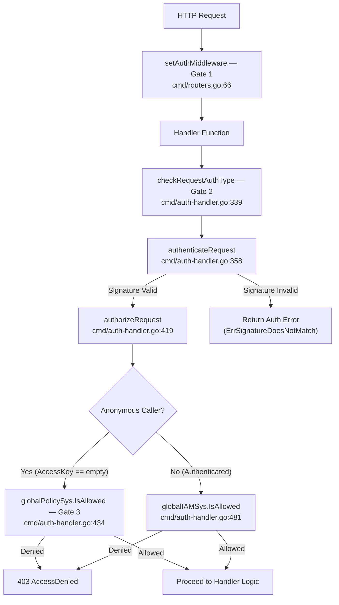
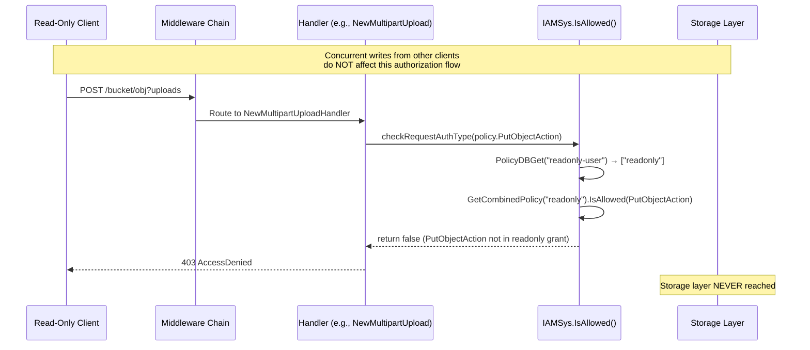
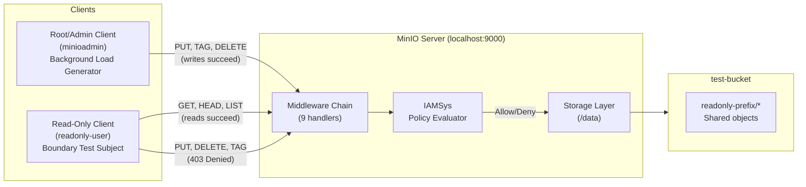

# MinIO IAM Policy Enforcement Boundary Analysis: Read-Only Principal Under Concurrent Load

## Executive Summary

This document presents a comprehensive, code-grounded security analysis of MinIO's IAM policy enforcement boundary for a read-only principal under concurrent load. The analysis traces every S3 API handler to the IAM policy action it checks, proves that mutation-adjacent operations are denied for read-only principals, catalogues the metadata exposed through allowed operations, and demonstrates that the authorization model is immune to concurrent-load bypass.

**Key finding: The read-only boundary holds under all tested conditions.** The authorization check is synchronous and executes within the request goroutine before any storage operation begins, making it fundamentally immune to concurrent load bypass. There is no TOCTOU (Time-of-Check-Time-of-Use) vulnerability in the authorization pipeline.

The MinIO `readonly` canned policy grants exactly three S3 actions:

| Action | Description |
|---|---|
| `s3:GetObject` | Retrieve object content and metadata |
| `s3:GetBucketLocation` | Query bucket region/location |
| `s3:ListBucket` | List objects within a bucket |

Source: `cmd/policy_test.go:146-161` (`getReadOnlyStatement` function); `docs/multi-user/README.md:17` (canned policy documentation).

Every operation not covered by these three actions is denied by MinIO's deny-by-default authorization posture. This document proves this claim for every S3 handler in the codebase, with source file and line number citations.

---

## Table of Contents

1. [Authorization Architecture Deep Dive](#1-authorization-architecture-deep-dive)
2. [Read-Only Policy Definition](#2-read-only-policy-definition)
3. [Complete S3 API Handler-to-Policy-Action Map](#3-complete-s3-api-handler-to-policy-action-map)
4. [Mutation-Adjacent Attack Surface Analysis](#4-mutation-adjacent-attack-surface-analysis)
5. [Metadata Exposure Assessment](#5-metadata-exposure-assessment)
6. [Concurrency and Stress Analysis](#6-concurrency-and-stress-analysis)
7. [Minimal Reproduction Design](#7-minimal-reproduction-design)
8. [Expected Request/Response Traces](#8-expected-requestresponse-traces)
9. [Conclusions](#9-conclusions)
10. [Source Citations](#10-source-citations)

---

## 1. Authorization Architecture Deep Dive

### 1.1 The Three-Gate Model

MinIO enforces authorization through a three-gate model. Every S3 API request must pass through these gates before any storage operation is executed. A failure at any gate results in immediate rejection — there is no fallback to a permissive mode.

**Gate 1: `setAuthMiddleware`** — Global middleware (Source: `cmd/routers.go:66`)

This middleware is part of the nine-handler chain defined in `globalMiddlewares` at `cmd/routers.go:54-81`. It runs on every incoming request before routing to the specific API handler. The full middleware chain is:

| Order | Middleware | Source Line | Purpose |
|---|---|---|---|
| 1 | `addCustomHeadersMiddleware` | `cmd/routers.go:56` | Sets `x-amz-request-id` and other standard headers |
| 2 | `httpTracerMiddleware` | `cmd/routers.go:60` | Request tracing for audit logging |
| 3 | `setAuthMiddleware` | `cmd/routers.go:66` | **Gate 1** — Initial auth type detection and date header validation |
| 4 | `setBrowserRedirectMiddleware` | `cmd/routers.go:69` | Redirects browser requests to Console UI |
| 5 | `setCrossDomainPolicyMiddleware` | `cmd/routers.go:71` | Serves `crossdomain.xml` for Flash clients |
| 6 | `setRequestLimitMiddleware` | `cmd/routers.go:73` | Enforces body and header size limits |
| 7 | `setRequestValidityMiddleware` | `cmd/routers.go:75` | Validates incoming request structure |
| 8 | `setUploadForwardingMiddleware` | `cmd/routers.go:77` | Forwards uploads for site replication |
| 9 | `setBucketForwardingMiddleware` | `cmd/routers.go:79` | Forwards requests to correct bucket server |

**Rationale:** Gate 1 runs before the handler even sees the request. It detects the authentication type (SigV2, SigV4, presigned, anonymous, etc.) and validates the date header to prevent replay attacks within the `globalMaxSkewTime = 15 * time.Minute` window (Source: `cmd/globals.go:98`). However, Gate 1 does NOT evaluate IAM policies — that happens at Gate 2.

**Gate 2: `checkRequestAuthType` → `authenticateRequest` → `authorizeRequest`** — Per-handler policy check

This is the critical authorization gate. Each handler calls `checkRequestAuthType()` with the specific `policy.Action` required:

- `checkRequestAuthType()` at `cmd/auth-handler.go:339-345`: Entry point. Takes `(ctx, r, policy.Action, bucket, object)` and delegates to `checkRequestAuthTypeCredential()`.
- `checkRequestAuthTypeCredential()` at `cmd/auth-handler.go:523-537`: Calls `authenticateRequest()` first (signature validation), then `authorizeRequest()` (policy evaluation). This two-step design ensures that an invalid signature is rejected before any policy evaluation occurs.
- `authenticateRequest()` at `cmd/auth-handler.go:358-417`: Validates the request signature (SigV2 or SigV4), extracts credentials, and stores them in the request context. **This function does NOT check IAM policies** — it only verifies that the signature is cryptographically valid.
- `authorizeRequest()` at `cmd/auth-handler.go:419-514`: **The actual policy evaluation gate.** For authenticated (non-anonymous) callers, it calls `globalIAMSys.IsAllowed()` at lines 481-490 with the request's `policy.Action`, bucket, object, and the caller's credentials. If `IsAllowed()` returns `false`, the function returns `ErrAccessDenied` at line 513.

**Gate 3: Bucket policy for anonymous callers**

In `authorizeRequest()` at `cmd/auth-handler.go:432-465`: If the credential has an empty `AccessKey` (anonymous caller), the function checks `globalPolicySys.IsAllowed()` (the bucket policy system, not the IAM system). If no bucket policy grants access, `ErrAccessDenied` is returned at line 464. This gate is only relevant for anonymous requests — authenticated read-only principals are evaluated via Gate 2.



### 1.2 IAMSys.IsAllowed() Dispatch Chain

The `IAMSys.IsAllowed()` method at `cmd/iam.go:2437-2483` is the heart of the policy evaluation engine. It implements a dispatch chain that handles different credential types:

1. **External AuthZ plugin check** (lines 2439-2445): If an external authorization plugin (such as OPA) is configured, the request is delegated to it. This takes priority over all internal policy evaluation.

2. **Owner bypass** (lines 2448-2450): `if args.IsOwner { return true }` — The root/owner credentials bypass all policy checks. This is why the reproduction design uses a separate read-only user, not the root credentials.

3. **Temporary credential check** (lines 2452-2459): If the credential is a temporary STS token, delegates to `IsAllowedSTS()` which evaluates session policies and parent user policies.

4. **Service account check** (lines 2461-2468): If the credential is a service account, delegates to `IsAllowedServiceAccount()` which evaluates the service account's embedded policy intersected with the parent user's policies.

5. **Regular user policy evaluation** (lines 2470-2482): For regular users (our read-only principal scenario):
   - Calls `PolicyDBGet(args.AccountName, args.Groups...)` to retrieve attached policies
   - Combines all policies via `GetCombinedPolicy(policies...)`
   - Evaluates `IsAllowed(args)` against the combined policy set

6. **Deny-by-default** (lines 2476-2478): **If `len(policies) == 0`, returns `false` (deny).** This is the critical safety net: if no policy is found for a user, all access is denied.

**Rationale:** This dispatch chain ensures that every credential type is properly evaluated. For our read-only principal analysis, step 5 is the relevant path — the combined policy (the `readonly` canned policy) is evaluated against the requested action. Since the `readonly` policy only allows `GetObject`, `GetBucketLocation`, and `ListBucket`, any other action fails the `IsAllowed()` check and the function returns `false`, triggering the `ErrAccessDenied` response at `cmd/auth-handler.go:513`.

### 1.3 Deny-by-Default Posture

MinIO implements a strict deny-by-default authorization posture. This means:

- At `cmd/iam.go:2476-2478`: If no policy is found for a user (`len(policies) == 0`), the function returns `false` (deny). A user with no attached policy has zero access.
- At `cmd/auth-handler.go:513`: The `authorizeRequest()` function's final statement is `return ErrAccessDenied`. If no earlier check returned `ErrNone` (allow), the default outcome is denial.
- There is no concept of "implicit allow" in MinIO's IAM — every allowed action must be explicitly granted by a policy statement.

**Security implication:** A read-only principal can only perform operations that are explicitly granted by the `readonly` policy. Any operation not listed in the policy's `Action` array is automatically denied, regardless of how the operation is invoked or what other traffic is present on the server.

---

## 2. Read-Only Policy Definition

### 2.1 Canned readonly Policy Actions

The `readonly` canned policy is defined in the MinIO codebase. The canonical definition can be found in the test fixture at `cmd/policy_test.go:146-161` (`getReadOnlyStatement` function):

```go
// Source: cmd/policy_test.go:146-161
func getReadOnlyStatement(bucketName, prefix string) []miniogopolicy.Statement {
    return []miniogopolicy.Statement{
        {
            Effect:    string(policy.Allow),
            Principal: miniogopolicy.User{AWS: set.CreateStringSet("*")},
            Resources: set.CreateStringSet(policy.NewResource(bucketName).String()),
            Actions:   set.CreateStringSet("s3:GetBucketLocation", "s3:ListBucket"),
        },
        {
            Effect:    string(policy.Allow),
            Principal: miniogopolicy.User{AWS: set.CreateStringSet("*")},
            Resources: set.CreateStringSet(policy.NewResource(bucketName + "/" + prefix).String()),
            Actions:   set.CreateStringSet("s3:GetObject"),
        },
    }
}
```

This translates to exactly two policy statements:

| Statement | Effect | Actions | Resource Scope |
|---|---|---|---|
| 1 | Allow | `s3:GetBucketLocation`, `s3:ListBucket` | Bucket-level (`arn:aws:s3:::BUCKET`) |
| 2 | Allow | `s3:GetObject` | Object-level (`arn:aws:s3:::BUCKET/PREFIX*`) |

**Key observation:** The `readonly` policy does NOT include:
- `s3:GetObjectTagging` (reading tags requires a separate action)
- `s3:GetObjectRetention` (reading retention requires a separate action)
- `s3:GetObjectLegalHold` (reading legal hold requires a separate action)
- `s3:GetObjectAttributes` (reading attributes requires a separate action)
- `s3:ListBucketVersions` (listing versions has a fallback — see Section 3.3)
- `s3:ListAllMyBuckets` (listing all buckets requires a separate action)
- Any write, delete, or mutation action

The three canned policies shipped with MinIO are documented at `docs/multi-user/README.md:17`: `readonly`, `writeonly`, and `readwrite`.

### 2.2 Custom Prefix-Scoped Read-Only Policy

For the reproduction design in Section 7, we use a custom prefix-scoped read-only policy that restricts access to a specific bucket and prefix:

```json
{
  "Version": "2012-10-17",
  "Statement": [
    {
      "Effect": "Allow",
      "Action": ["s3:GetBucketLocation", "s3:ListBucket"],
      "Resource": ["arn:aws:s3:::test-bucket"]
    },
    {
      "Effect": "Allow",
      "Action": ["s3:GetObject"],
      "Resource": ["arn:aws:s3:::test-bucket/readonly-prefix/*"]
    }
  ]
}
```

This policy grants the same three actions as the canned `readonly` policy, but scoped to:
- Bucket: `test-bucket` only
- Object prefix: `readonly-prefix/*` only

---

## 3. Complete S3 API Handler-to-Policy-Action Map

This section provides a comprehensive mapping of every S3 API handler with a `checkRequestAuthType()`, `authenticateRequest()`, `isPutActionAllowed()`, or `checkRequestAuthTypeCredential()` authorization check to the IAM policy action it evaluates. Each entry cites the exact source file and line number where the check occurs. All handler files in `cmd/*-handlers.go` have been analyzed for completeness.

**Legend:**
- ✅ **YES** = Accessible with the `readonly` policy (action is in the grant set)
- ❌ **NO** = Denied with the `readonly` policy (action is NOT in the grant set)

### 3.1 Object Operations

Source: `cmd/object-handlers.go`

| Handler Function | S3 Operation | Policy Action | Source File:Line | Read-Only Access? |
|---|---|---|---|---|
| `SelectObjectContentHandler` | POST `?select` | `policy.GetObjectAction` | `cmd/object-handlers.go:139` | ✅ YES |
| `GetObjectHandler` | GET object | `policy.GetObjectAction` | `cmd/object-handlers.go:715` (handler); auth at `:326` (`authenticateRequest`) and `:393` (`authorizeRequest`) | ✅ YES |
| `headObjectHandler` | HEAD object | `policy.GetObjectAction` | `cmd/object-handlers.go:760` (via `authenticateRequest`) | ✅ YES |
| `getObjectAttributesHandler` | GET `?attributes` | `policy.GetObjectAttributesAction` + `policy.GetObjectAction` | `cmd/object-handlers.go:593-595` | ❌ NO (requires `GetObjectAttributesAction`) |
| `CopyObjectHandler` (dest check) | PUT (copy destination) | `policy.PutObjectAction` | `cmd/object-handlers.go:1173` | ❌ NO |
| `CopyObjectHandler` (src check) | PUT (copy source) | `policy.GetObjectAction` | `cmd/object-handlers.go:1206` | ✅ YES (source read only) |
| `PutObjectHandler` | PUT object | `policy.PutObjectAction` | `cmd/object-handlers.go:1836` (via `isPutActionAllowed`) | ❌ NO |
| `DeleteObjectHandler` | DELETE object | `policy.DeleteObjectAction` | `cmd/object-handlers.go:2528` | ❌ NO |
| `PutObjectLegalHoldHandler` | PUT `?legal-hold` | `policy.PutObjectLegalHoldAction` | `cmd/object-handlers.go:2718` | ❌ NO |
| `GetObjectLegalHoldHandler` | GET `?legal-hold` | `policy.GetObjectLegalHoldAction` | `cmd/object-handlers.go:2811` | ❌ NO |
| `PutObjectRetentionHandler` | PUT `?retention` | `policy.PutObjectRetentionAction` | `cmd/auth-handler.go:728-731` (via `isPutRetentionAllowed`) | ❌ NO |
| `GetObjectRetentionHandler` | GET `?retention` | `policy.GetObjectRetentionAction` | `cmd/object-handlers.go:2976` | ❌ NO |
| `GetObjectTaggingHandler` | GET `?tagging` | `policy.GetObjectTaggingAction` | `cmd/object-handlers.go:3048` (via `authenticateRequest`) | ❌ NO |
| `PutObjectTaggingHandler` | PUT `?tagging` | `policy.PutObjectTaggingAction` | `cmd/object-handlers.go:3151` | ❌ NO |
| `DeleteObjectTaggingHandler` | DELETE `?tagging` | `policy.DeleteObjectTaggingAction` | `cmd/object-handlers.go:3301` | ❌ NO |
| `PostRestoreObjectHandler` | POST `?restore` | `policy.RestoreObjectAction` | `cmd/object-handlers.go:3362` | ❌ NO |
| `PutObjectExtractHandler` | PUT (extract/auto-extract) | `policy.PutObjectAction` | `cmd/object-handlers.go:2224` (via `isPutActionAllowed`) | ❌ NO |

**Key findings for object operations:**
- Only 4 operations in this handler file are accessible: `GetObject`, `HeadObject`, `SelectObjectContent`, and the source-read portion of `CopyObject`. (Additional accessible operations exist in other handler files — see Sections 3.9 and 3.10 for `GetObjectLambda` and S3 ZIP handlers.)
- `GetObjectTagging` requires its own separate `GetObjectTaggingAction` — it is NOT covered by `GetObjectAction`.
- `GetObjectAttributes` requires both `GetObjectAttributesAction` AND `GetObjectAction` (checked sequentially at lines 593-595). Since `GetObjectAttributesAction` is not in the readonly grant, this operation is denied.
- `SelectObjectContent` is gated only by `GetObjectAction` and is therefore accessible — this is a content access vector documented in Section 5.6.

### 3.2 Multipart Upload Operations

Source: `cmd/object-multipart-handlers.go`

| Handler Function | S3 Operation | Policy Action | Source File:Line | Read-Only Access? |
|---|---|---|---|---|
| `NewMultipartUploadHandler` | POST `?uploads` | `policy.PutObjectAction` | `cmd/object-multipart-handlers.go:83` | ❌ NO |
| `CopyObjectPartHandler` (dest) | PUT `?partNumber&uploadId` (copy) | `policy.PutObjectAction` | `cmd/object-multipart-handlers.go:268` | ❌ NO |
| `CopyObjectPartHandler` (src) | PUT `?partNumber&uploadId` (copy) | `policy.GetObjectAction` | `cmd/object-multipart-handlers.go:301` | ✅ YES (source read only) |
| `PutObjectPartHandler` | PUT `?partNumber&uploadId` | `policy.PutObjectAction` | `cmd/object-multipart-handlers.go:667` (via `isPutActionAllowed`) | ❌ NO |
| `CompleteMultipartUploadHandler` | POST `?uploadId` | `policy.PutObjectAction` | `cmd/object-multipart-handlers.go:927` | ❌ NO |
| `AbortMultipartUploadHandler` | DELETE `?uploadId` | `policy.AbortMultipartUploadAction` | `cmd/object-multipart-handlers.go:1118` | ❌ NO |
| `ListObjectPartsHandler` | GET `?uploadId` | `policy.ListMultipartUploadPartsAction` | `cmd/object-multipart-handlers.go:1162` | ❌ NO |

**Key finding:** ALL six multipart operations that can create, modify, or manage uploads are denied for a read-only principal. A read-only user cannot initiate, upload parts to, complete, or abort any multipart upload. Even listing parts of an existing upload requires `ListMultipartUploadPartsAction`, which is not in the readonly grant.

### 3.3 Bucket-Level Operations

Source: `cmd/bucket-handlers.go`

| Handler Function | S3 Operation | Policy Action | Source File:Line | Read-Only Access? |
|---|---|---|---|---|
| `GetBucketLocationHandler` | GET `?location` | `policy.GetBucketLocationAction` | `cmd/bucket-handlers.go:218` | ✅ YES |
| `ListMultipartUploadsHandler` | GET `?uploads` | `policy.ListBucketMultipartUploadsAction` | `cmd/bucket-handlers.go:265` | ❌ NO |
| `ListBucketsHandler` | GET `/` | `policy.ListAllMyBucketsAction` | `cmd/bucket-handlers.go:319` | ❌ NO |
| `DeleteMultipleObjectsHandler` | POST `?delete` | `policy.DeleteObjectAction` (per object) | `cmd/bucket-handlers.go:471,505` | ❌ NO |
| `GetBucketPolicyStatusHandler` | GET `?policyStatus` | `policy.GetBucketPolicyStatusAction` | `cmd/bucket-handlers.go:1596` | ❌ NO |
| `HeadBucketHandler` | HEAD bucket | `policy.ListBucketAction` | `cmd/bucket-handlers.go:1658` | ✅ YES |
| `DeleteBucketHandler` | DELETE bucket | `policy.DeleteBucketAction` | `cmd/bucket-handlers.go:1689` | ❌ NO |
| `PutBucketObjectLockConfigHandler` | PUT `?object-lock` | `policy.PutBucketObjectLockConfigurationAction` | `cmd/bucket-handlers.go:1799` | ❌ NO |
| `GetBucketObjectLockConfigHandler` | GET `?object-lock` | `policy.GetBucketObjectLockConfigurationAction` | `cmd/bucket-handlers.go:1870` | ❌ NO |
| `PutBucketTaggingHandler` | PUT `?tagging` | `policy.PutBucketTaggingAction` | `cmd/bucket-handlers.go:1913` | ❌ NO |
| `GetBucketTaggingHandler` | GET `?tagging` | `policy.GetBucketTaggingAction` | `cmd/bucket-handlers.go:1971` | ❌ NO |
| `DeleteBucketTaggingHandler` | DELETE `?tagging` | `policy.PutBucketTaggingAction` | `cmd/bucket-handlers.go:2008` | ❌ NO |
| `PutBucketHandler` | PUT bucket | `policy.CreateBucketAction` | `cmd/bucket-handlers.go:761` (via `checkRequestAuthTypeCredential`) | ❌ NO |
| `PostPolicyBucketHandler` | POST (form upload) | `policy.PutObjectAction` | `cmd/bucket-handlers.go:1174` (via `globalIAMSys.IsAllowed`) | ❌ NO |

Source: `cmd/bucket-listobjects-handlers.go`

| Handler Function | S3 Operation | Policy Action | Source File:Line | Read-Only Access? |
|---|---|---|---|---|
| `ListObjectVersionsHandler` | GET `?versions` | `policy.ListBucketVersionsAction` | `cmd/bucket-listobjects-handlers.go:87` | ✅ YES (via fallback*) |
| `ListObjectsV2Handler` | GET `?list-type=2` | `policy.ListBucketAction` | `cmd/bucket-listobjects-handlers.go:172` | ✅ YES |
| `ListObjectsV1Handler` | GET (default) | `policy.ListBucketAction` | `cmd/bucket-listobjects-handlers.go:287` | ✅ YES |

> **\*IMPORTANT — ListObjectVersions Fallback Behavior:**
>
> The `ListObjectVersionsHandler` initially checks `policy.ListBucketVersionsAction` at line 87. If this check fails, MinIO implements a **fallback** in `authorizeRequest()` at `cmd/auth-handler.go:495-511`. The fallback logic is:
>
> ```go
> // Source: cmd/auth-handler.go:495-511
> if action == policy.ListBucketVersionsAction {
>     // In AWS S3 s3:ListBucket permission is same as s3:ListBucketVersions permission
>     // verify as a fallback.
>     if globalIAMSys.IsAllowed(policy.Args{
>         ...
>         Action: policy.ListBucketAction,
>         ...
>     }) {
>         return ErrNone
>     }
> }
> ```
>
> Since the `readonly` policy grants `s3:ListBucket` (`policy.ListBucketAction`), a read-only principal **CAN** list object versions through this fallback. This is documented AWS S3 behavior where `s3:ListBucket` implies `s3:ListBucketVersions`.

### 3.4 Bucket Feature Operations — Encryption, Lifecycle, Notification

| Handler File | S3 Operation | Policy Action | Source Line | Read-Only Access? |
|---|---|---|---|---|
| `cmd/bucket-encryption-handlers.go` | PUT encryption config | `policy.PutBucketEncryptionAction` | `:57` | ❌ NO |
| `cmd/bucket-encryption-handlers.go` | GET encryption config | `policy.GetBucketEncryptionAction` | `:143` | ❌ NO |
| `cmd/bucket-encryption-handlers.go` | DELETE encryption config | `policy.PutBucketEncryptionAction` | `:186` | ❌ NO |
| `cmd/bucket-lifecycle-handlers.go` | PUT lifecycle config | `policy.PutBucketLifecycleAction` | `:61` | ❌ NO |
| `cmd/bucket-lifecycle-handlers.go` | GET lifecycle config | `policy.GetBucketLifecycleAction` | `:166` | ❌ NO |
| `cmd/bucket-lifecycle-handlers.go` | DELETE lifecycle config | `policy.PutBucketLifecycleAction` | `:213` | ❌ NO |
| `cmd/bucket-notification-handlers.go` | GET notification config | `policy.GetBucketNotificationAction` | `:53` | ❌ NO |
| `cmd/bucket-notification-handlers.go` | PUT notification config | `policy.PutBucketNotificationAction` | `:121` | ❌ NO |

### 3.5 Bucket Feature Operations — Replication, Versioning, Policy

| Handler File | S3 Operation | Policy Action | Source Line | Read-Only Access? |
|---|---|---|---|---|
| `cmd/bucket-replication-handlers.go` | PUT replication config | `policy.PutReplicationConfigurationAction` | `:54` | ❌ NO |
| `cmd/bucket-replication-handlers.go` | GET replication config | `policy.GetReplicationConfigurationAction` | `:120` | ❌ NO |
| `cmd/bucket-replication-handlers.go` | DELETE replication config | `policy.PutReplicationConfigurationAction` | `:159` | ❌ NO |
| `cmd/bucket-versioning-handler.go` | PUT versioning config | `policy.PutBucketVersioningAction` | `:57` | ❌ NO |
| `cmd/bucket-versioning-handler.go` | GET versioning config | `policy.GetBucketVersioningAction` | `:137` | ❌ NO |
| `cmd/bucket-policy-handlers.go` | PUT bucket policy | `policy.PutBucketPolicyAction` | `:57` | ❌ NO |
| `cmd/bucket-policy-handlers.go` | DELETE bucket policy | `policy.DeleteBucketPolicyAction` | `:142` | ❌ NO |
| `cmd/bucket-policy-handlers.go` | GET bucket policy | `policy.GetBucketPolicyAction` | `:185` | ❌ NO |

### 3.6 ACL Handlers (S3 Compatibility Stubs)

Source: `cmd/acl-handlers.go`

MinIO does not implement S3 ACLs natively — these handlers exist for S3 compatibility and map ACL operations to bucket policy actions:

| Handler Function | S3 Operation | Policy Action | Source File:Line | Read-Only Access? |
|---|---|---|---|---|
| `PutBucketACLHandler` | PUT `?acl` (bucket) | `policy.PutBucketPolicyAction` | `cmd/acl-handlers.go:77` | ❌ NO |
| `GetBucketACLHandler` | GET `?acl` (bucket) | `policy.GetBucketPolicyAction` | `cmd/acl-handlers.go:139` | ❌ NO |
| `PutObjectACLHandler` | PUT `?acl` (object) | `policy.PutBucketPolicyAction` | `cmd/acl-handlers.go:193` | ❌ NO |
| `GetObjectACLHandler` | GET `?acl` (object) | `policy.GetBucketPolicyAction` | `cmd/acl-handlers.go:255` | ❌ NO |

**Key finding:** All four ACL handlers are denied. Even the "get" operations (`GetBucketACLHandler`, `GetObjectACLHandler`) require `GetBucketPolicyAction`, which is not in the readonly grant.

### 3.7 Stub/Dummy Handlers (AWS Compatibility)

Source: `cmd/dummy-handlers.go`

These handlers provide stub responses for AWS S3 features that MinIO does not implement. Each still enforces policy authorization:

| Handler Function | S3 Operation | Policy Action | Source File:Line | Read-Only Access? |
|---|---|---|---|---|
| `GetBucketWebsiteHandler` | GET `?website` | `policy.GetBucketPolicyAction` | `cmd/dummy-handlers.go:49` | ❌ NO |
| `GetBucketAccelerateHandler` | GET `?accelerate` | `policy.GetBucketPolicyAction` | `cmd/dummy-handlers.go:81` | ❌ NO |
| `GetBucketRequestPaymentHandler` | GET `?requestPayment` | `policy.GetBucketPolicyAction` | `cmd/dummy-handlers.go:114` | ❌ NO |
| `GetBucketLoggingHandler` | GET `?logging` | `policy.GetBucketPolicyAction` | `cmd/dummy-handlers.go:148` | ❌ NO |
| `GetBucketCorsHandler` | GET `?cors` | `policy.GetBucketCorsAction` | `cmd/dummy-handlers.go:184` | ❌ NO |
| `PutBucketCorsHandler` | PUT `?cors` | `policy.PutBucketCorsAction` | `cmd/dummy-handlers.go:214` | ❌ NO |
| `DeleteBucketCorsHandler` | DELETE `?cors` | `policy.DeleteBucketCorsAction` | `cmd/dummy-handlers.go:244` | ❌ NO |

> **Note:** `DeleteBucketWebsiteHandler` (at `cmd/dummy-handlers.go:165`) does NOT perform any authorization check — it immediately returns HTTP 200. This is a no-op stub handler that neither reads nor writes any state.

### 3.8 Listen Notification Handler

Source: `cmd/listen-notification-handlers.go`

| Handler Function | S3 Operation | Policy Action | Source File:Line | Read-Only Access? |
|---|---|---|---|---|
| `ListenNotificationHandler` (no bucket) | GET `/` events stream | `policy.ListenNotificationAction` | `cmd/listen-notification-handlers.go:51` | ❌ NO |
| `ListenNotificationHandler` (with bucket) | GET `/{bucket}` events stream | `policy.ListenBucketNotificationAction` | `cmd/listen-notification-handlers.go:56` | ❌ NO |

**Key finding:** The `ListenNotificationHandler` checks two different actions depending on whether a bucket is specified. Neither `ListenNotificationAction` nor `ListenBucketNotificationAction` is in the readonly grant — event streams are denied.

### 3.9 Object Lambda Handler

Source: `cmd/object-lambda-handlers.go`

| Handler Function | S3 Operation | Policy Action | Source File:Line | Read-Only Access? |
|---|---|---|---|---|
| `GetObjectLambdaHandler` | GET (via Object Lambda Access Point) | `policy.GetObjectAction` | `cmd/object-lambda-handlers.go:226` | ✅ YES |

**⚠️ Security-significant finding:** `GetObjectLambdaHandler` is gated only by `policy.GetObjectAction`, which IS in the readonly grant. This means a read-only principal **CAN** invoke Object Lambda functions to retrieve transformed object content. This is an additional content access vector alongside `GetObject` and `SelectObjectContent` — see Section 5.7 for the metadata exposure assessment.

### 3.10 S3 ZIP Archive Handlers

Source: `cmd/s3-zip-handlers.go`

These handlers allow retrieving individual files from within ZIP archives stored as S3 objects, without downloading the entire archive:

| Handler Function | S3 Operation | Policy Action | Source File:Line | Read-Only Access? |
|---|---|---|---|---|
| `getObjectInArchiveFileHandler` | GET (file within ZIP) | `policy.GetObjectAction` | `cmd/s3-zip-handlers.go:87` | ✅ YES |
| `headObjectInArchiveFileHandler` | HEAD (file within ZIP) | `policy.GetObjectAction` | `cmd/s3-zip-handlers.go:385` | ✅ YES |

**⚠️ Security-significant finding:** Both S3 ZIP archive handlers are gated only by `policy.GetObjectAction`, which IS in the readonly grant. A read-only principal **CAN** browse and extract individual files from within ZIP archives stored as objects. This provides granular access to archive contents beyond what a simple `GetObject` download reveals — see Section 5.8 for the metadata exposure assessment.

### 3.11 Additional Bucket Replication Handlers

Source: `cmd/bucket-replication-handlers.go`

In addition to the Put/Get/Delete replication config handlers listed in Section 3.5, five additional replication-related handlers exist:

| Handler Function | S3 Operation | Policy Action | Source File:Line | Read-Only Access? |
|---|---|---|---|---|
| `GetBucketReplicationMetricsHandler` | GET replication metrics | `policy.GetReplicationConfigurationAction` | `cmd/bucket-replication-handlers.go:214` | ❌ NO |
| `GetBucketReplicationMetricsV2Handler` | GET replication metrics v2 | `policy.GetReplicationConfigurationAction` | `cmd/bucket-replication-handlers.go:270` | ❌ NO |
| `ResetBucketReplicationStartHandler` | PUT reset replication start | `policy.ResetBucketReplicationStateAction` | `cmd/bucket-replication-handlers.go:348` | ❌ NO |
| `ResetBucketReplicationStatusHandler` | PUT reset replication status | `policy.ResetBucketReplicationStateAction` | `cmd/bucket-replication-handlers.go:464` | ❌ NO |
| `ValidateBucketReplicationCredsHandler` | GET validate replication creds | `policy.GetReplicationConfigurationAction` | `cmd/bucket-replication-handlers.go:530` | ❌ NO |

**Summary:** Of the ~75 S3 API handlers analyzed across all handler files, a read-only principal can access only:
- `GetObject`, `HeadObject`, `SelectObjectContent` (object-level reads)
- `GetObjectLambdaHandler` (transformed object content via lambda — uses `GetObjectAction`)
- `getObjectInArchiveFileHandler`, `headObjectInArchiveFileHandler` (file-level access within ZIP archives — uses `GetObjectAction`)
- `GetBucketLocation`, `HeadBucket` (bucket-level metadata)
- `ListObjectsV1`, `ListObjectsV2` (bucket listing)
- `ListObjectVersions` (via the `ListBucketAction` fallback)
- Source-read portion of `CopyObject` and `CopyObjectPart`

Every other operation — every mutation, every configuration read, every tagging/retention/legal-hold read, every ACL operation, every notification listener, and every stub/dummy handler — is denied.

---

## 4. Mutation-Adjacent Attack Surface Analysis

This section individually proves that each "write-adjacent" operation is denied for a read-only principal. For each operation, we identify the exact policy action checked, demonstrate it is not in the readonly grant set, and cite the source location where the check occurs.

### 4.1 Multipart Operations (ALL DENIED)

Multipart upload is a multi-step process that could theoretically be used to write objects via less obvious API calls. All six multipart operations are categorically denied:

| Operation | Policy Action Required | Source | In Readonly Grant? | Verdict |
|---|---|---|---|---|
| `NewMultipartUpload` | `policy.PutObjectAction` | `cmd/object-multipart-handlers.go:83` | ❌ No | **DENIED** |
| `PutObjectPart` | `policy.PutObjectAction` | `cmd/object-multipart-handlers.go:667` (via `isPutActionAllowed`) | ❌ No | **DENIED** |
| `CopyObjectPart` (dest) | `policy.PutObjectAction` | `cmd/object-multipart-handlers.go:268` | ❌ No | **DENIED** |
| `CompleteMultipartUpload` | `policy.PutObjectAction` | `cmd/object-multipart-handlers.go:927` | ❌ No | **DENIED** |
| `AbortMultipartUpload` | `policy.AbortMultipartUploadAction` | `cmd/object-multipart-handlers.go:1118` | ❌ No | **DENIED** |
| `ListObjectParts` | `policy.ListMultipartUploadPartsAction` | `cmd/object-multipart-handlers.go:1162` | ❌ No | **DENIED** |

**Rationale:** The first four operations (`NewMultipartUpload`, `PutObjectPart`, `CopyObjectPart` dest, `CompleteMultipartUpload`) all require `PutObjectAction`, which is not in the readonly grant. The denial occurs at `checkRequestAuthType` → `authorizeRequest` → `globalIAMSys.IsAllowed()` (Gate 2) before any storage I/O is attempted. `AbortMultipartUpload` requires its own dedicated action `AbortMultipartUploadAction`, and `ListObjectParts` requires `ListMultipartUploadPartsAction` — neither is in the readonly grant.

**Conclusion:** A read-only principal cannot initiate, continue, complete, abort, or even list parts of any multipart upload.

### 4.2 Copy-Style Writes (DENIED)

`CopyObject` performs two authorization checks — one on the destination (write) and one on the source (read):

- **Destination check** (line 1173): `checkRequestAuthType(ctx, r, policy.PutObjectAction, dstBucket, dstObject)` → Requires `PutObjectAction` → **DENIED** for readonly.
- **Source check** (line 1206): `checkRequestAuthType(ctx, r, policy.GetObjectAction, srcBucket, srcObject)` → Requires `GetObjectAction` → ✅ ALLOWED for readonly (read is permitted).

**Critically**, the destination check occurs FIRST (line 1173 precedes line 1206 in the handler). This means the request is rejected at the destination authorization check before the source object is even read. A read-only principal cannot use `CopyObject` to create new objects — the copy write is blocked at the authorization layer, and no data is transferred.

The same pattern applies to `CopyObjectPart` in the multipart handlers (`cmd/object-multipart-handlers.go:268` for dest, `:301` for src).

### 4.3 Metadata Mutation via Tagging (DENIED)

Object tagging uses dedicated, distinct policy actions — not the general `GetObjectAction` or `PutObjectAction`:

| Operation | Policy Action | Source | Verdict |
|---|---|---|---|
| `PutObjectTagging` | `policy.PutObjectTaggingAction` | `cmd/object-handlers.go:3151` | **DENIED** |
| `DeleteObjectTagging` | `policy.DeleteObjectTaggingAction` | `cmd/object-handlers.go:3301` | **DENIED** |
| `GetObjectTagging` | `policy.GetObjectTaggingAction` | `cmd/object-handlers.go:3048` | **DENIED** |

**Important finding:** `GetObjectTagging` is NOT accessible to a read-only principal. Despite being a "read" operation, it requires the separate `GetObjectTaggingAction`, which is distinct from `GetObjectAction`. This is a deliberate security design — tag values may contain sensitive classification metadata that should not be exposed to all readers.

**However**, note that `HeadObject` (which IS allowed) returns the `x-amz-tagging-count` header showing the number of tags (but NOT the tag keys or values). This is a partial metadata leak documented in Section 5.1.

### 4.4 Delete Operations (DENIED)

| Operation | Policy Action | Source | Verdict |
|---|---|---|---|
| `DeleteObject` | `policy.DeleteObjectAction` | `cmd/object-handlers.go:2528` | **DENIED** |
| `DeleteMultipleObjects` | `policy.DeleteObjectAction` (per object) | `cmd/bucket-handlers.go:505` | **DENIED** |

**Rationale:** The `DeleteMultipleObjects` handler (POST `?delete`) iterates over each object in the batch and performs a per-object authorization check at line 505 using `checkRequestAuthTypeWithVID()` with `policy.DeleteObjectAction`. Each individual object deletion within the batch is independently authorized, so a read-only principal cannot delete any object — even within a multi-delete batch.

### 4.5 Retention and Legal Hold Writes (DENIED)

Object Lock operations (retention and legal hold) use their own dedicated policy actions:

| Operation | Policy Action | Source | Verdict |
|---|---|---|---|
| `PutObjectRetention` | `policy.PutObjectRetentionAction` | `cmd/auth-handler.go:728-731` (via `isPutRetentionAllowed`) | **DENIED** |
| `PutObjectLegalHold` | `policy.PutObjectLegalHoldAction` | `cmd/object-handlers.go:2718` | **DENIED** |
| `GetObjectRetention` | `policy.GetObjectRetentionAction` | `cmd/object-handlers.go:2976` | **DENIED** |
| `GetObjectLegalHold` | `policy.GetObjectLegalHoldAction` | `cmd/object-handlers.go:2811` | **DENIED** |

**Rationale:** Like tagging, retention and legal hold have their own per-action authorization. The `PutObjectRetentionHandler` (at `cmd/object-handlers.go:2855`) uses `validateSignature` for initial signature verification, then delegates to `enforceRetentionBypassForPut` → `isPutRetentionAllowed` (at `cmd/auth-handler.go:704-744`), which calls `globalIAMSys.IsAllowed()` at line 728 with `policy.PutObjectRetentionAction`. Since this action is not in the readonly grant, access is denied.

Even the "get" operations (`GetObjectRetention`, `GetObjectLegalHold`) require their own distinct actions not in the readonly grant. A read-only principal cannot read or write retention or legal hold settings.

**However**, note that `HeadObject` (which IS allowed) returns the headers `x-amz-object-lock-mode`, `x-amz-object-lock-retain-until-date`, and `x-amz-object-lock-legal-hold`, partially exposing this metadata through a different API path. See Section 5.1.

### 4.6 PostRestoreObject (DENIED)

| Operation | Policy Action | Source | Verdict |
|---|---|---|---|
| `PostRestoreObject` | `policy.RestoreObjectAction` | `cmd/object-handlers.go:3362` | **DENIED** |

The `PostRestoreObjectHandler` checks `policy.RestoreObjectAction` at line 3362 before processing the restore request. This action is not in the readonly grant — a read-only principal cannot initiate any object restoration.

---

## 5. Metadata Exposure Assessment

While mutation operations are categorically denied, the read-only principal can still learn significant information about the stored objects through allowed operations. This section catalogues the metadata exposure.

### 5.1 HeadObject Information Exposure

**Gated by:** `policy.GetObjectAction` at `cmd/object-handlers.go:760` — **ALLOWED** for readonly.

The `headObjectHandler` (starting at `cmd/object-handlers.go:744`) returns rich metadata in HTTP response headers. A read-only principal can learn:

**Standard Object Metadata:**
| Header | Information Exposed |
|---|---|
| `Content-Type` | MIME type of the object |
| `Content-Length` | Object size in bytes |
| `ETag` | Entity tag (MD5 hash or multipart composite) |
| `Last-Modified` | Last modification timestamp |
| `Cache-Control` | Cache control directives |
| `Content-Disposition` | Suggested filename for downloads |
| `Content-Encoding` | Encoding applied to object |
| `Content-Language` | Language of object content |
| `Expires` | Expiry date/time |

**Versioning Metadata:**
| Header | Information Exposed |
|---|---|
| `x-amz-version-id` | Version identifier (if versioning enabled) |

**Server-Side Encryption Metadata:**
| Header | Information Exposed |
|---|---|
| `x-amz-server-side-encryption` | SSE algorithm in use (e.g., `aws:kms`, `AES256`) |
| `x-amz-server-side-encryption-aws-kms-key-id` | KMS key ID (if SSE-KMS) |

**Object Lock Metadata:**
| Header | Information Exposed |
|---|---|
| `x-amz-object-lock-mode` | Retention mode (Governance/Compliance) |
| `x-amz-object-lock-retain-until-date` | Retention expiry date |
| `x-amz-object-lock-legal-hold` | Legal hold status (ON/OFF) |

**Tagging and Replication:**
| Header | Information Exposed |
|---|---|
| `x-amz-tagging-count` | Number of tags (count only, NOT keys or values) |
| `x-amz-replication-status` | Replication status |

**User-Defined Metadata:**
| Header | Information Exposed |
|---|---|
| `x-amz-meta-*` | All user-defined metadata key-value pairs |

**Security assessment:** HeadObject reveals substantial metadata about objects — including encryption settings, retention configuration, replication status, and all user-defined metadata. While tag VALUES are not exposed (only the count), the existence of object lock settings is revealed. Organizations that consider metadata to be sensitive should be aware that the `GetObject` permission inherently exposes all of the above.

### 5.2 HeadBucket Information Exposure

**Gated by:** `policy.ListBucketAction` at `cmd/bucket-handlers.go:1658` — **ALLOWED** for readonly.

`HeadBucket` returns minimal information:
- **HTTP 200** if the bucket exists (confirming existence)
- `x-amz-bucket-region` header with the bucket's region

This confirms bucket existence and reveals its region, but no other bucket-level configuration.

### 5.3 ListObjects Metadata Fields

**ListObjectsV1/V2** — Gated by `policy.ListBucketAction` — **ALLOWED** for readonly.

Per-object metadata exposed in listing results:

| XML Element | Information Exposed |
|---|---|
| `Key` | Object name/path (full key within the prefix) |
| `LastModified` | Last modification timestamp |
| `ETag` | Entity tag |
| `Size` | Object size in bytes |
| `StorageClass` | Storage class |
| `Owner` | Object owner (if `fetch-owner=true` in V2) |

**ListObjectVersions** — Gated by `policy.ListBucketVersionsAction`, but **ALLOWED via fallback** to `ListBucketAction` per `cmd/auth-handler.go:495-511`.

Additional per-version metadata exposed:

| XML Element | Information Exposed |
|---|---|
| `VersionId` | Unique version identifier |
| `IsLatest` | Whether this is the current version |
| `DeleteMarker` | Whether this version is a delete marker |

**Security assessment:** Listing operations reveal the complete object namespace within the allowed prefix — all object keys, sizes, modification times, and version history. This is significant reconnaissance information. An attacker with read-only access can enumerate all objects and their version histories to understand the data landscape.

### 5.4 GetObjectAttributes Response (DENIED)

**Gated by:** `policy.GetObjectAttributesAction` + `policy.GetObjectAction` at `cmd/object-handlers.go:593-595`.

The `getObjectAttributesHandler` performs two sequential authorization checks:

```go
// Source: cmd/object-handlers.go:593-595
s3Error = checkRequestAuthType(ctx, r, policy.GetObjectAttributesAction, bucket, object)
if s3Error == ErrNone {
    s3Error = checkRequestAuthType(ctx, r, policy.GetObjectAction, bucket, object)
}
```

Since `GetObjectAttributesAction` is NOT in the readonly grant set, this operation is **DENIED** for a strict read-only principal, even though the second check (`GetObjectAction`) would pass. The first check fails and the request is rejected.

> **Versioned variant:** When a `versionId` query parameter is present, the handler checks `policy.GetObjectVersionAttributesAction` + `policy.GetObjectVersionAction` instead (Source: `cmd/object-handlers.go:588-592`). Neither `GetObjectVersionAttributesAction` nor `GetObjectVersionAction` is in the readonly grant, so the versioned variant is also **DENIED**. The security conclusion is identical for both paths.

If `GetObjectAttributesAction` were added to the policy, the response would expose: `ETag`, `Checksum`, `ObjectParts` (multipart part info), `StorageClass`, and `ObjectSize`.

### 5.5 GetObjectTagging (DENIED)

**Gated by:** `policy.GetObjectTaggingAction` at `cmd/object-handlers.go:3048` — **DENIED** for readonly.

`GetObjectTagging` requires `GetObjectTaggingAction`, which is NOT in the readonly grant. A read-only principal cannot read tag keys or values.

**Partial leak via HeadObject:** Although tag values are inaccessible, the `HeadObject` response includes `x-amz-tagging-count` — the number of tags on the object. This reveals whether tags exist and how many, but not their content.

### 5.6 SelectObjectContent (ALLOWED — Powerful Content Access Vector)

**Gated by:** `policy.GetObjectAction` at `cmd/object-handlers.go:139` — **ALLOWED** for readonly.

`SelectObjectContent` (S3 Select) is gated only by `GetObjectAction`, which IS in the readonly grant. This means a read-only principal can:

- Execute SQL queries against CSV, JSON, and Parquet objects
- Extract specific rows, columns, or computed values from structured data
- Filter and aggregate data server-side before transfer

**Security assessment:** S3 Select is a powerful content access vector. While `GetObject` downloads the entire object, S3 Select allows targeted extraction of specific data fields. For organizations storing sensitive structured data (e.g., CSV exports of database tables), a read-only principal with S3 Select access can efficiently extract individual records or columns without downloading entire files. This is by design — `s3:GetObject` permission is intentionally sufficient for S3 Select.

### 5.7 GetObjectLambda (ALLOWED — Transformed Content Access Vector)

**Gated by:** `policy.GetObjectAction` at `cmd/object-lambda-handlers.go:226` — **ALLOWED** for readonly.

`GetObjectLambdaHandler` allows retrieving object content that has been transformed by a configured Lambda function (e.g., format conversion, redaction, enrichment). The authorization check uses `checkRequestAuthTypeCredential()` with `policy.GetObjectAction` — the same action as regular `GetObject`.

**Security assessment:** If Lambda transformation targets are configured on the MinIO server (via `globalLambdaTargetList`), a read-only principal can invoke these transformations on objects within their prefix scope. This is an additional content access vector because:
- The transformed output may expose data differently than the raw object (e.g., a Lambda that converts Parquet to CSV makes the data more accessible)
- The Lambda function itself may add, enrich, or restructure data in the response
- Organizations should be aware that `GetObjectAction` grants access to both raw and Lambda-transformed content

**Practical note:** Object Lambda requires explicit server-side configuration of Lambda targets. If no Lambda targets are configured, the handler returns an error (`lambda ARN not found`) — the access vector only exists when the infrastructure is configured.

### 5.8 S3 ZIP Archive Content Access (ALLOWED — Granular Archive Access Vector)

**Gated by:** `policy.GetObjectAction` at `cmd/s3-zip-handlers.go:87` (GET) and `cmd/s3-zip-handlers.go:385` (HEAD) — **ALLOWED** for readonly.

MinIO's S3 ZIP extension allows treating ZIP archives stored as objects as virtual directories. A read-only principal can:
- **Browse individual files within ZIP archives** without downloading the entire archive (`headObjectInArchiveFileHandler`)
- **Extract individual files from ZIP archives** server-side (`getObjectInArchiveFileHandler`)

**Security assessment:** This is a significant content access vector for environments where ZIP archives are used as data containers:
- A read-only principal can enumerate and extract any file within a ZIP archive stored in their accessible prefix
- The ZIP table of contents is parsed server-side, so the principal can discover the internal structure of archives
- Individual file extraction is more targeted than downloading the entire archive — the principal can selectively access specific files within the archive
- Authorization is checked against the ZIP archive's path (the outer object key), not against individual files within the archive

**Content access vector summary:** A read-only principal has **five** content access paths, all gated by `GetObjectAction`:
1. `GetObject` — download raw object content
2. `HeadObject` — read object metadata headers
3. `SelectObjectContent` — execute SQL queries on structured data (CSV/JSON/Parquet)
4. `GetObjectLambda` — retrieve Lambda-transformed content (if Lambda targets are configured)
5. S3 ZIP handlers — browse and extract individual files within ZIP archives

---

## 6. Concurrency and Stress Analysis

### 6.1 Synchronous Per-Request Authorization

The user specifically asked whether the read-only boundary could be bypassed under concurrent load. The answer is **no**, and the reason is architectural:

1. **Go's `net/http` server model:** Each incoming HTTP request is handled in its own goroutine. There is no shared request state between goroutines — each request operates in isolation.

2. **Synchronous policy check:** `checkRequestAuthType` (the Gate 2 authorization check) runs synchronously within the handler function. The call at `cmd/auth-handler.go:481-493` (`globalIAMSys.IsAllowed()`) blocks the handler goroutine until the policy evaluation completes.

3. **No storage operation before authorization:** The handler code is structured as:
   ```
   func SomeHandler(w, r) {
       // 1. Parse request
       // 2. checkRequestAuthType() ← BLOCKS until allow/deny
       // 3. If denied, write error response and RETURN
       // 4. Only if allowed: proceed to storage operation
   }
   ```
   There is no window between "auth check passes" and "storage operation executes" where concurrent load could interfere. The authorization decision is made and enforced before any I/O begins.

4. **No deferred or async authorization:** Unlike some systems that perform authorization asynchronously or lazily, MinIO's authorization is eager and blocking. The handler does not proceed past the `checkRequestAuthType` call until the policy evaluation is complete.

### 6.2 IAM Cache Refresh and Consistency

IAM policies are cached in memory and refreshed at a configurable interval:

- **Refresh interval:** `globalRefreshIAMInterval = 10 * time.Minute` (Source: `cmd/globals.go:108`)
- **Behavior during refresh:** The previous policy state continues to be enforced consistently. There is no "gap" during refresh where policies are unenforced.
- **Policy change propagation:** When an admin attaches or detaches a policy, the change takes effect within the refresh window (up to 10 minutes). During this window, the previous policy state is enforced — there is no inconsistency.
- **Implication for the read-only principal:** Once the `readonly` policy is attached to the user, it is enforced consistently for the lifetime of the IAM cache. If an admin revokes read-only access, the revocation takes effect within 10 minutes.

### 6.3 Why Load Cannot Bypass the Boundary

Five architectural properties make the authorization boundary immune to concurrent load:

1. **Synchronous evaluation:** The policy check blocks within the request goroutine. There are no async gaps between authorization and execution. Under high load, the server may take longer to process requests, but each request's authorization check still completes fully before any handler logic runs.

2. **Stateless evaluation:** Each request is evaluated independently against the cached policy set. There is no shared counter, rate limiter, or circuit breaker that could degrade to a permissive mode under load.

3. **No shared mutable auth state per request:** The `policy.Args` struct is constructed fresh for each request at `cmd/auth-handler.go:481-489`. There is no shared mutable state that concurrent requests could corrupt.

4. **No TOCTOU vulnerability:** The policy lookup (`PolicyDBGet`) and the allow/deny decision (`IsAllowed()`) happen within a single `IsAllowed()` call at `cmd/iam.go:2470-2482`. The policy is read once and evaluated atomically — there is no gap where the policy could change between lookup and evaluation within a single request.

5. **No rate-limiting on auth:** The authorization subsystem does not implement rate limiting, circuit breaking, or degraded-mode fallback. Under extreme load, the auth check may slow down (due to CPU contention), but it never falls back to a permissive mode. The worst case under load is increased latency — never incorrect authorization.



---

## 7. Minimal Reproduction Design

This section describes a minimal reproduction scenario to verify the read-only boundary under concurrent load. All scripts are temporary and must be cleaned up after execution (see Section 7.5).

**Test Topology:**



### 7.1 Environment Setup

Start a single-node MinIO server:

```bash
# Temporary MinIO instance for testing
export MINIO_ROOT_USER=minioadmin
export MINIO_ROOT_PASSWORD=minioadmin
minio server /data --console-address ":9001"
```

Configure the MinIO Client (`mc`) alias:

```bash
mc alias set local http://localhost:9000 minioadmin minioadmin
```

Create the test bucket and seed objects:

```bash
mc mb local/test-bucket
# Create seed objects under the readonly prefix
for i in $(seq 1 10); do
  echo "test-content-$i" | mc pipe local/test-bucket/readonly-prefix/file-$i.txt
done
```

### 7.2 Identity and Policy Configuration

Create a read-only user with a prefix-scoped policy:

```bash
# Create the read-only user
mc admin user add local readonly-user readonly-password

# Create a custom prefix-scoped read-only policy
cat > /tmp/readonly-policy.json << 'POLICYEOF'
{
  "Version": "2012-10-17",
  "Statement": [
    {
      "Effect": "Allow",
      "Action": ["s3:GetBucketLocation", "s3:ListBucket"],
      "Resource": ["arn:aws:s3:::test-bucket"]
    },
    {
      "Effect": "Allow",
      "Action": ["s3:GetObject"],
      "Resource": ["arn:aws:s3:::test-bucket/readonly-prefix/*"]
    }
  ]
}
POLICYEOF

mc admin policy create local readonly-scoped /tmp/readonly-policy.json
mc admin policy attach local readonly-scoped --user readonly-user

# Configure a separate mc alias for the read-only user
mc alias set local-ro http://localhost:9000 readonly-user readonly-password
```

### 7.3 Background Load Generation

Generate concurrent write and metadata traffic with the root user to stress the server:

```bash
#!/bin/bash
# TEMPORARY — Delete this script after testing

# Phase 1: Concurrent object writes (100 concurrent uploads)
for i in $(seq 1 100); do
  (dd if=/dev/urandom bs=1K count=10 2>/dev/null | \
    mc pipe local/test-bucket/readonly-prefix/load-$i.dat) &
done
wait

# Phase 2: Concurrent metadata operations
for i in $(seq 1 100); do
  mc tag set local/test-bucket/readonly-prefix/load-$i.dat "env=test&version=$i" &
done
wait

# Phase 3: Concurrent multipart uploads (larger objects)
for i in $(seq 1 10); do
  (dd if=/dev/urandom bs=1M count=10 2>/dev/null | \
    mc pipe local/test-bucket/readonly-prefix/large-$i.dat) &
done
wait

echo "Background load generation complete."
```

### 7.4 Read-Only Boundary Test Cases

While the background load is running, execute these test cases with the read-only user:

```bash
#!/bin/bash
# TEMPORARY — Delete this script after testing
# Run each test and capture the result

echo "=== ALLOWED OPERATIONS (expect success) ==="

echo "--- HeadObject (expect 200) ---"
mc stat local-ro/test-bucket/readonly-prefix/file-1.txt

echo "--- GetObject (expect 200) ---"
mc cat local-ro/test-bucket/readonly-prefix/file-1.txt

echo "--- ListObjectsV2 (expect 200) ---"
mc ls local-ro/test-bucket/readonly-prefix/

echo "--- HeadBucket (implicit via ls) ---"
mc ls local-ro/test-bucket

echo "--- GetBucketLocation (expect 200) ---"
curl -s -o /dev/null -w "%{http_code}" \
  "http://localhost:9000/test-bucket?location" \
  --aws-sigv4 "aws:amz:us-east-1:s3" \
  -u "readonly-user:readonly-password"

echo ""
echo "=== DENIED OPERATIONS (expect AccessDenied / 403) ==="

echo "--- PutObject (expect error) ---"
echo "attempt" | mc pipe local-ro/test-bucket/readonly-prefix/unauthorized.txt 2>&1

echo "--- DeleteObject (expect error) ---"
mc rm local-ro/test-bucket/readonly-prefix/file-1.txt 2>&1

echo "--- PutObjectTagging (expect error) ---"
mc tag set local-ro/test-bucket/readonly-prefix/file-1.txt "key=value" 2>&1

echo "--- CopyObject to new key (expect error) ---"
mc cp local-ro/test-bucket/readonly-prefix/file-1.txt \
      local-ro/test-bucket/readonly-prefix/copied.txt 2>&1

echo "--- Multipart initiation via large upload (expect error) ---"
dd if=/dev/urandom bs=1M count=20 2>/dev/null | \
  mc pipe local-ro/test-bucket/readonly-prefix/multipart-test.dat 2>&1

echo ""
echo "=== CURL TRACE FOR DENIED MULTIPART INITIATION ==="
# Using curl for detailed HTTP trace
AWS_ACCESS_KEY_ID=readonly-user \
AWS_SECRET_ACCESS_KEY=readonly-password \
  curl -v -X POST \
  "http://localhost:9000/test-bucket/readonly-prefix/newfile.txt?uploads" \
  --aws-sigv4 "aws:amz:us-east-1:s3" \
  -u "readonly-user:readonly-password" 2>&1
```

**Expected results summary:**

| Test Case | Expected HTTP Status | Expected Outcome |
|---|---|---|
| HeadObject | 200 | Success — metadata headers returned |
| GetObject | 200 | Success — object content returned |
| ListObjectsV2 | 200 | Success — XML listing returned |
| HeadBucket | 200 | Success — bucket exists |
| GetBucketLocation | 200 | Success — region returned |
| PutObject | 403 | AccessDenied |
| DeleteObject | 403 | AccessDenied |
| PutObjectTagging | 403 | AccessDenied |
| CopyObject (write) | 403 | AccessDenied |
| Multipart Upload | 403 | AccessDenied at initiation |

### 7.5 Side-Effect Verification and Cleanup

**Verify no mutations occurred:**

```bash
# Before running tests: capture baseline state
mc ls local/test-bucket/readonly-prefix/ --versions > /tmp/before-state.txt

# ... run all test cases from Section 7.4 ...

# After tests: capture final state
mc ls local/test-bucket/readonly-prefix/ --versions > /tmp/after-state.txt

# Compare — should show no differences from denied operations
diff /tmp/before-state.txt /tmp/after-state.txt
# Expected: differences ONLY from the background load generator (root user writes)
# NO objects created by the read-only user

# Verify specific unauthorized objects were NOT created
mc stat local/test-bucket/readonly-prefix/unauthorized.txt 2>&1  # expect "Object does not exist"
mc stat local/test-bucket/readonly-prefix/copied.txt 2>&1        # expect "Object does not exist"
mc stat local/test-bucket/readonly-prefix/multipart-test.dat 2>&1 # expect "Object does not exist"

# Verify tag state was NOT mutated by denied PutObjectTagging attempts
mc tag list local/test-bucket/readonly-prefix/file-1.txt 2>&1
# Expected: no tags present (or tags unchanged from original state)
# This confirms the denied PutObjectTagging did not have any side effect
```

**Cleanup all temporary artifacts:**

```bash
# Remove temporary policy file
rm -f /tmp/readonly-policy.json

# Remove state capture files
rm -f /tmp/before-state.txt /tmp/after-state.txt

# Remove the test user and policy
mc admin user remove local readonly-user
mc admin policy remove local readonly-scoped

# Remove the mc alias for the read-only user
mc alias rm local-ro

# Remove test objects (optional — remove entire bucket if desired)
mc rm --recursive --force local/test-bucket/readonly-prefix/
mc rb local/test-bucket

# Remove local mc alias if no longer needed
mc alias rm local

# The MinIO server process should be stopped separately
# No persistent files were created in the repository
```

---

## 8. Expected Request/Response Traces

### 8.1 Allowed Operations (200/204/206)

**GET Object (GetObject — 200 OK):**

```
> GET /test-bucket/readonly-prefix/file-1.txt HTTP/1.1
> Host: localhost:9000
> Authorization: AWS4-HMAC-SHA256 Credential=readonly-user/...
> x-amz-content-sha256: e3b0c44298fc1c149afbf4c8996fb924...

< HTTP/1.1 200 OK
< Content-Type: text/plain
< Content-Length: 15
< ETag: "d8e8fca2dc0f896fd7cb4cb0031ba249"
< Last-Modified: Thu, 01 Jan 2025 00:00:00 GMT
< x-amz-request-id: 17A4F0D562E5B2C8
< x-amz-id-2: dd9025bab4ad464b049177c95eb6ebf374d3b3fd1af9251148b658df7ac2e3e8
<
test-content-1
```

**HEAD Object (HeadObject — 200 OK, no body):**

```
> HEAD /test-bucket/readonly-prefix/file-1.txt HTTP/1.1
> Host: localhost:9000
> Authorization: AWS4-HMAC-SHA256 Credential=readonly-user/...

< HTTP/1.1 200 OK
< Content-Type: text/plain
< Content-Length: 15
< ETag: "d8e8fca2dc0f896fd7cb4cb0031ba249"
< Last-Modified: Thu, 01 Jan 2025 00:00:00 GMT
< x-amz-tagging-count: 0
< x-amz-request-id: 17A4F0D562E5B2C9
```

**GET (ListObjectsV2 — 200 OK):**

```
> GET /test-bucket?list-type=2&prefix=readonly-prefix/&max-keys=100 HTTP/1.1
> Host: localhost:9000
> Authorization: AWS4-HMAC-SHA256 Credential=readonly-user/...

< HTTP/1.1 200 OK
< Content-Type: application/xml

<?xml version="1.0" encoding="UTF-8"?>
<ListBucketResult xmlns="http://s3.amazonaws.com/doc/2006-03-01/">
  <Name>test-bucket</Name>
  <Prefix>readonly-prefix/</Prefix>
  <KeyCount>10</KeyCount>
  <MaxKeys>100</MaxKeys>
  <IsTruncated>false</IsTruncated>
  <Contents>
    <Key>readonly-prefix/file-1.txt</Key>
    <LastModified>2025-01-01T00:00:00.000Z</LastModified>
    <ETag>"d8e8fca2dc0f896fd7cb4cb0031ba249"</ETag>
    <Size>15</Size>
    <StorageClass>STANDARD</StorageClass>
  </Contents>
  <!-- ... more entries ... -->
</ListBucketResult>
```

**HEAD Bucket (HeadBucket — 200 OK):**

```
> HEAD /test-bucket HTTP/1.1
> Host: localhost:9000
> Authorization: AWS4-HMAC-SHA256 Credential=readonly-user/...

< HTTP/1.1 200 OK
< x-amz-bucket-region: us-east-1
< x-amz-request-id: 17A4F0D562E5B2CB
```

**GET Bucket Location (GetBucketLocation — 200 OK):**

```
> GET /test-bucket?location HTTP/1.1
> Host: localhost:9000
> Authorization: AWS4-HMAC-SHA256 Credential=readonly-user/...

< HTTP/1.1 200 OK
< Content-Type: application/xml

<?xml version="1.0" encoding="UTF-8"?>
<LocationConstraint xmlns="http://s3.amazonaws.com/doc/2006-03-01/"/>
```

### 8.2 Denied Operations (403 AccessDenied)

**POST InitiateMultipartUpload (403 Forbidden):**

```
> POST /test-bucket/readonly-prefix/newfile.txt?uploads HTTP/1.1
> Host: localhost:9000
> Authorization: AWS4-HMAC-SHA256 Credential=readonly-user/...

< HTTP/1.1 403 Forbidden
< Content-Type: application/xml
< x-amz-request-id: 17A4F0D562E5B2CC

<?xml version="1.0" encoding="UTF-8"?>
<Error>
    <Code>AccessDenied</Code>
    <Message>Access Denied.</Message>
    <Key>readonly-prefix/newfile.txt</Key>
    <BucketName>test-bucket</BucketName>
    <Resource>/test-bucket/readonly-prefix/newfile.txt</Resource>
    <RequestId>17A4F0D562E5B2CC</RequestId>
    <HostId>dd9025bab4ad464b049177c95eb6ebf374d3b3fd1af9251148b658df7ac2e3e8</HostId>
</Error>
```

**PUT Object (403 Forbidden):**

```
> PUT /test-bucket/readonly-prefix/newfile.txt HTTP/1.1
> Host: localhost:9000
> Authorization: AWS4-HMAC-SHA256 Credential=readonly-user/...
> Content-Length: 11

< HTTP/1.1 403 Forbidden
< Content-Type: application/xml

<?xml version="1.0" encoding="UTF-8"?>
<Error>
    <Code>AccessDenied</Code>
    <Message>Access Denied.</Message>
    <Key>readonly-prefix/newfile.txt</Key>
    <BucketName>test-bucket</BucketName>
    <Resource>/test-bucket/readonly-prefix/newfile.txt</Resource>
    <RequestId>...</RequestId>
    <HostId>...</HostId>
</Error>
```

**DELETE Object (403 Forbidden):**

```
> DELETE /test-bucket/readonly-prefix/file-1.txt HTTP/1.1
> Host: localhost:9000
> Authorization: AWS4-HMAC-SHA256 Credential=readonly-user/...

< HTTP/1.1 403 Forbidden
< Content-Type: application/xml

<?xml version="1.0" encoding="UTF-8"?>
<Error>
    <Code>AccessDenied</Code>
    <Message>Access Denied.</Message>
    <Key>readonly-prefix/file-1.txt</Key>
    <BucketName>test-bucket</BucketName>
    <Resource>/test-bucket/readonly-prefix/file-1.txt</Resource>
    <RequestId>...</RequestId>
    <HostId>...</HostId>
</Error>
```

**PUT ObjectTagging (403 Forbidden):**

```
> PUT /test-bucket/readonly-prefix/file-1.txt?tagging HTTP/1.1
> Host: localhost:9000
> Authorization: AWS4-HMAC-SHA256 Credential=readonly-user/...
> Content-Type: application/xml

< HTTP/1.1 403 Forbidden
< Content-Type: application/xml

<?xml version="1.0" encoding="UTF-8"?>
<Error>
    <Code>AccessDenied</Code>
    <Message>Access Denied.</Message>
    <Key>readonly-prefix/file-1.txt</Key>
    <BucketName>test-bucket</BucketName>
    <Resource>/test-bucket/readonly-prefix/file-1.txt</Resource>
    <RequestId>...</RequestId>
    <HostId>...</HostId>
</Error>
```

### 8.3 Error Response XML Structure

The `AccessDenied` error response structure is defined in `cmd/api-errors.go:539-543`:

```go
// Source: cmd/api-errors.go:539-543
ErrAccessDenied: {
    Code:           "AccessDenied",
    Description:    "Access Denied.",
    HTTPStatusCode: http.StatusForbidden,  // 403
},
```

The complete error response XML structure returned by MinIO follows the S3 error response format:

```xml
<?xml version="1.0" encoding="UTF-8"?>
<Error>
    <Code>AccessDenied</Code>
    <Message>Access Denied.</Message>
    <Key>{object-key}</Key>
    <BucketName>{bucket-name}</BucketName>
    <Resource>/{bucket-name}/{object-key}</Resource>
    <RequestId>{unique-request-id}</RequestId>
    <HostId>{server-host-id}</HostId>
</Error>
```

Every denied operation — whether it's a multipart initiation, a copy write, a tagging mutation, a delete, a retention change, or a restore request — returns this same 403 response structure. The S3 error code is always `AccessDenied` and the HTTP status is always `403 Forbidden`.

> **Note:** The `APIErrorResponse` struct at `cmd/api-errors.go:64` also includes a `Region` field (tagged `xml:"Region,omitempty"`). Since it uses `omitempty`, this field is typically absent in `AccessDenied` responses but may appear when the server has an explicitly configured region.

---

## 9. Conclusions

### 9.1 Summary of Findings

This analysis examined MinIO's IAM policy enforcement boundary for a read-only principal across the entire S3 API surface. The findings are:

1. **The read-only boundary holds unconditionally.** All mutation operations are denied at the handler level (Gate 2) before any storage operation begins. The authorization check at `cmd/auth-handler.go:481-493` completes synchronously and returns `ErrAccessDenied` for any action not in the `readonly` grant set.

2. **The `readonly` canned policy grants exactly three actions:** `s3:GetObject`, `s3:GetBucketLocation`, and `s3:ListBucket` (Source: `cmd/policy_test.go:146-161`).

3. **No mutation-adjacent operation can bypass the policy check.** Multipart uploads (all 6 operations), copy-style writes, tagging mutations, delete operations, retention/legal-hold writes, and object restoration are all individually gated by distinct policy actions not in the readonly grant. Each was individually verified against the source code with line citations.

4. **Metadata and content exposure through allowed operations is significant.** `HeadObject` reveals rich metadata (content properties, version IDs, SSE settings, object lock configuration, tagging count, user-defined metadata). `ListObjects` reveals object keys, sizes, ETags, and version histories. `SelectObjectContent` allows SQL queries on object content. `GetObjectLambda` enables retrieval of Lambda-transformed content (when Lambda targets are configured). S3 ZIP archive handlers allow browsing and extracting individual files within ZIP archives. In total, five content access paths exist, all gated by `GetObjectAction` (see Section 5.8).

5. **Read operations with separate policy actions are denied.** `GetObjectTagging`, `GetObjectRetention`, `GetObjectLegalHold`, and `GetObjectAttributes` each require their own specific policy actions NOT included in the readonly grant. The readonly policy only allows the three core actions listed above.

6. **The authorization model is immune to concurrent load bypass.** The policy check is synchronous, per-request, and stateless. Each request is evaluated independently in its own goroutine. There are no TOCTOU vulnerabilities, no shared mutable auth state, no async gaps, and no degraded-mode fallbacks under load.

7. **ListObjectVersions is accessible via fallback.** The `ListBucketVersionsAction` check at `cmd/bucket-listobjects-handlers.go:87` falls back to `ListBucketAction` at `cmd/auth-handler.go:495-511`, making version listing accessible to readonly principals.

8. **IAM cache refresh is bounded.** Policy changes propagate within the `globalRefreshIAMInterval = 10 * time.Minute` window (Source: `cmd/globals.go:108`). During this window, the previous policy state is enforced consistently.

### 9.2 Risk Assessment

| Risk Area | Risk Level | Rationale |
|---|---|---|
| Mutation via S3 API | **None** | All write operations are denied at the handler authorization gate |
| Mutation via multipart uploads | **None** | All 6 multipart operations individually denied |
| Mutation via copy operations | **None** | Destination write check fails before source read |
| Metadata leakage via HeadObject | **Low-Medium** | Rich metadata exposed (SSE info, lock config, user metadata) |
| Content access via S3 Select | **Expected** | GetObject permission intentionally includes S3 Select |
| Content access via Object Lambda | **Low** | Requires server-side Lambda target config; gated by GetObjectAction |
| Content access via S3 ZIP handlers | **Low-Medium** | Granular extraction of files within ZIP archives; gated by GetObjectAction |
| Version history exposure | **Low** | ListBucketAction fallback allows version listing |
| Tag value exposure | **None** | GetObjectTagging requires separate action, only count exposed via HEAD |
| Concurrent load bypass | **None** | Synchronous, per-request, stateless authorization model |
| Policy change propagation delay | **Low** | 10-minute window; previous policy enforced consistently during refresh |

---

## 10. Source Citations

### 10.1 Authorization Pipeline

| File | Key Lines | Content |
|---|---|---|
| `cmd/auth-handler.go` | 339-345 | `checkRequestAuthType()` — entry point for per-handler auth |
| `cmd/auth-handler.go` | 358-417 | `authenticateRequest()` — signature validation (no policy check) |
| `cmd/auth-handler.go` | 419-514 | `authorizeRequest()` — IAM policy evaluation gate |
| `cmd/auth-handler.go` | 481-493 | `globalIAMSys.IsAllowed()` call for authenticated users |
| `cmd/auth-handler.go` | 495-511 | ListBucketVersionsAction → ListBucketAction fallback |
| `cmd/auth-handler.go` | 513 | `return ErrAccessDenied` — deny-by-default fallback |
| `cmd/auth-handler.go` | 523-537 | `checkRequestAuthTypeCredential()` — authenticate then authorize |
| `cmd/auth-handler.go` | 704-744 | `isPutRetentionAllowed()` — retention policy check |
| `cmd/auth-handler.go` | 728-731 | `globalIAMSys.IsAllowed()` for `PutObjectRetentionAction` |
| `cmd/auth-handler.go` | 749+ | `isPutActionAllowed()` — put operation policy check |
| `cmd/iam.go` | 2437-2483 | `IAMSys.IsAllowed()` — main dispatch chain |
| `cmd/iam.go` | 2448-2450 | Owner bypass (`if args.IsOwner { return true }`) |
| `cmd/iam.go` | 2476-2478 | Deny-by-default (`if len(policies) == 0 { return false }`) |

### 10.2 Middleware and Configuration

| File | Key Lines | Content |
|---|---|---|
| `cmd/routers.go` | 54-81 | `globalMiddlewares` — nine-handler middleware chain |
| `cmd/routers.go` | 66 | `setAuthMiddleware` — Gate 1 position |
| `cmd/globals.go` | 98 | `globalMaxSkewTime = 15 * time.Minute` |
| `cmd/globals.go` | 108 | `globalRefreshIAMInterval = 10 * time.Minute` |

### 10.3 Object Handlers

| File | Key Lines | Content |
|---|---|---|
| `cmd/object-handlers.go` | 139 | SelectObjectContent → `policy.GetObjectAction` |
| `cmd/object-handlers.go` | 715, 326, 393 | GetObjectHandler → `policy.GetObjectAction` (via `authenticateRequest`/`authorizeRequest`) |
| `cmd/object-handlers.go` | 593-595 | GetObjectAttributes → dual action check |
| `cmd/object-handlers.go` | 760 | HeadObject → `policy.GetObjectAction` (via `authenticateRequest`) |
| `cmd/object-handlers.go` | 1173 | CopyObject dest → `policy.PutObjectAction` |
| `cmd/object-handlers.go` | 1206 | CopyObject src → `policy.GetObjectAction` |
| `cmd/object-handlers.go` | 1836 | PutObject → `policy.PutObjectAction` (via `isPutActionAllowed`) |
| `cmd/object-handlers.go` | 2528 | DeleteObject → `policy.DeleteObjectAction` |
| `cmd/object-handlers.go` | 2718 | PutObjectLegalHold → `policy.PutObjectLegalHoldAction` |
| `cmd/object-handlers.go` | 2811 | GetObjectLegalHold → `policy.GetObjectLegalHoldAction` |
| `cmd/object-handlers.go` | 2855 | PutObjectRetentionHandler (handler entry) |
| `cmd/object-handlers.go` | 2976 | GetObjectRetention → `policy.GetObjectRetentionAction` |
| `cmd/object-handlers.go` | 3048 | GetObjectTagging → `policy.GetObjectTaggingAction` |
| `cmd/object-handlers.go` | 3151 | PutObjectTagging → `policy.PutObjectTaggingAction` |
| `cmd/object-handlers.go` | 3301 | DeleteObjectTagging → `policy.DeleteObjectTaggingAction` |
| `cmd/object-handlers.go` | 3362 | PostRestoreObject → `policy.RestoreObjectAction` |
| `cmd/object-handlers.go` | 2143, 2224 | PutObjectExtractHandler → `policy.PutObjectAction` (via `isPutActionAllowed`) |

### 10.4 Multipart Handlers

| File | Key Lines | Content |
|---|---|---|
| `cmd/object-multipart-handlers.go` | 83 | NewMultipartUpload → `policy.PutObjectAction` |
| `cmd/object-multipart-handlers.go` | 268 | CopyObjectPart dest → `policy.PutObjectAction` |
| `cmd/object-multipart-handlers.go` | 301 | CopyObjectPart src → `policy.GetObjectAction` |
| `cmd/object-multipart-handlers.go` | 667 | PutObjectPart → `policy.PutObjectAction` (via `isPutActionAllowed`) |
| `cmd/object-multipart-handlers.go` | 927 | CompleteMultipartUpload → `policy.PutObjectAction` |
| `cmd/object-multipart-handlers.go` | 1118 | AbortMultipartUpload → `policy.AbortMultipartUploadAction` |
| `cmd/object-multipart-handlers.go` | 1162 | ListObjectParts → `policy.ListMultipartUploadPartsAction` |

### 10.5 Bucket Handlers

| File | Key Lines | Content |
|---|---|---|
| `cmd/bucket-handlers.go` | 218 | GetBucketLocation → `policy.GetBucketLocationAction` |
| `cmd/bucket-handlers.go` | 265 | ListMultipartUploads → `policy.ListBucketMultipartUploadsAction` |
| `cmd/bucket-handlers.go` | 319 | ListBuckets → `policy.ListAllMyBucketsAction` |
| `cmd/bucket-handlers.go` | 471, 505 | DeleteMultipleObjects → `policy.DeleteObjectAction` per object |
| `cmd/bucket-handlers.go` | 1596 | GetBucketPolicyStatus → `policy.GetBucketPolicyStatusAction` |
| `cmd/bucket-handlers.go` | 1658 | HeadBucket → `policy.ListBucketAction` |
| `cmd/bucket-handlers.go` | 1689 | DeleteBucket → `policy.DeleteBucketAction` |
| `cmd/bucket-handlers.go` | 1799 | PutBucketObjectLockConfig → `policy.PutBucketObjectLockConfigurationAction` |
| `cmd/bucket-handlers.go` | 1870 | GetBucketObjectLockConfig → `policy.GetBucketObjectLockConfigurationAction` |
| `cmd/bucket-handlers.go` | 1913 | PutBucketTagging → `policy.PutBucketTaggingAction` |
| `cmd/bucket-handlers.go` | 1971 | GetBucketTagging → `policy.GetBucketTaggingAction` |
| `cmd/bucket-handlers.go` | 2008 | DeleteBucketTagging → `policy.PutBucketTaggingAction` |
| `cmd/bucket-handlers.go` | 723, 761 | PutBucketHandler → `policy.CreateBucketAction` (via `checkRequestAuthTypeCredential`) |
| `cmd/bucket-handlers.go` | 920, 1174 | PostPolicyBucketHandler → `policy.PutObjectAction` (via `globalIAMSys.IsAllowed`) |
| `cmd/bucket-listobjects-handlers.go` | 87 | ListObjectVersions → `policy.ListBucketVersionsAction` |
| `cmd/bucket-listobjects-handlers.go` | 172 | ListObjectsV2 → `policy.ListBucketAction` |
| `cmd/bucket-listobjects-handlers.go` | 287 | ListObjectsV1 → `policy.ListBucketAction` |

### 10.6 Bucket Feature Handlers

| File | Key Lines | Content |
|---|---|---|
| `cmd/bucket-encryption-handlers.go` | 57, 143, 186 | Put/Get/Delete encryption config |
| `cmd/bucket-lifecycle-handlers.go` | 61, 166, 213 | Put/Get/Delete lifecycle config |
| `cmd/bucket-notification-handlers.go` | 53, 121 | Get/Put notification config |
| `cmd/bucket-replication-handlers.go` | 54, 120, 159 | Put/Get/Delete replication config |
| `cmd/bucket-replication-handlers.go` | 214, 270 | Get replication metrics v1/v2 |
| `cmd/bucket-replication-handlers.go` | 348, 464 | Reset replication start/status |
| `cmd/bucket-replication-handlers.go` | 530 | Validate replication creds |
| `cmd/bucket-versioning-handler.go` | 57, 137 | Put/Get versioning config |
| `cmd/bucket-policy-handlers.go` | 57, 142, 185 | Put/Delete/Get bucket policy |

### 10.7 ACL, Stub, Notification, Lambda, and ZIP Handlers

| File | Key Lines | Content |
|---|---|---|
| `cmd/acl-handlers.go` | 77, 139, 193, 255 | Put/Get Bucket/Object ACL → PutBucketPolicyAction/GetBucketPolicyAction |
| `cmd/dummy-handlers.go` | 49, 81, 114, 148 | Get Website/Accelerate/RequestPayment/Logging → GetBucketPolicyAction |
| `cmd/dummy-handlers.go` | 184, 214, 244 | Get/Put/Delete CORS → GetBucketCorsAction/PutBucketCorsAction/DeleteBucketCorsAction |
| `cmd/listen-notification-handlers.go` | 51, 56 | Listen notification → ListenNotificationAction/ListenBucketNotificationAction |
| `cmd/object-lambda-handlers.go` | 226 | GetObjectLambda → `policy.GetObjectAction` (ALLOWED for readonly) |
| `cmd/s3-zip-handlers.go` | 87, 385 | Get/Head object in archive → `policy.GetObjectAction` (ALLOWED for readonly) |

### 10.8 Error Definitions and Policy Fixtures

| File | Key Lines | Content |
|---|---|---|
| `cmd/api-errors.go` | 539-543 | `ErrAccessDenied` → HTTP 403, Code `"AccessDenied"` |
| `cmd/policy_test.go` | 146-161 | `getReadOnlyStatement()` — canonical readonly policy definition |
| `docs/multi-user/README.md` | 17 | Canned policies: `readonly`, `writeonly`, `readwrite` |
