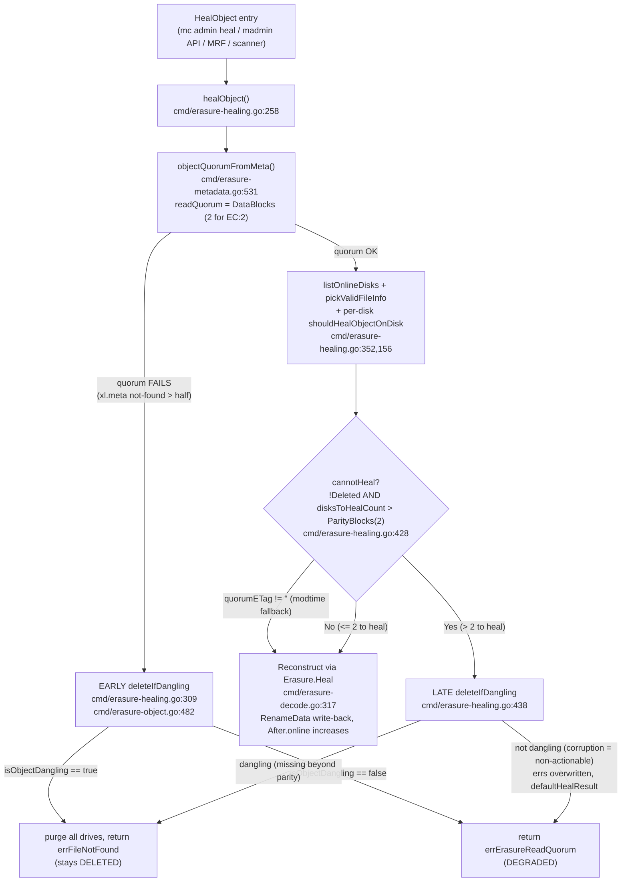

# MinIO Object-Healing Decisions on a 4-Drive Erasure-Coded Instance — Reconstruct vs. Leave DELETED vs. DEGRADED

This document answers, with captured runtime evidence, how MinIO's erasure object-healing
subsystem decides whether to reconstruct an object, purge it (leave it DELETED), or leave it
unrecoverable (DEGRADED) when the object is in an inconsistent state across the drives of a
standalone **4-drive erasure set** (which auto-selects **EC:2** — 2 data + 2 parity).

Every behavioral claim below is accompanied by the canonical command that produced it and its
raw, unedited output, shown adjacent to the claim, and is grounded to a `file:line` anchor in
the checkout under test (`minio` commit `c07e5b49d477b0774f23db3b290745aef8c01bd2`, server
banner `DEVELOPMENT.2024-11-25T17-10-22Z`, runtime `go1.23.2 linux/amd64`). Scenarios were
executed more than once; the two-run methodology — when a single representative run is shown
in full versus when both runs are shown or reported as an observed distribution — is stated
in §4.0 and recapped in the coverage pass (§8). Statements that could not be produced through
a canonical trigger are explicitly labelled **(inferred)** and cite the governing code.

---

## 1. The question (verbatim)

> **User Question:** "On a 4-disk erasure coded instance, what happens when an object is in an inconsistent state
> across disks (some have data, some corrupted data, some nothing) and healing runs? Does MinIO
> ALWAYS reconstruct from valid shards, or are there situations where it decides the object
> should stay DELETED or DEGRADED? I want actual runtime evidence in each case — not theory.
> What appears in the healing output that reveals decision-making: are there status indicators
> showing BEFORE/AFTER state? Do the logs explain WHY MinIO chose to restore vs leave alone?
> And the boundary conditions: (a) how many valid shards must exist for healing to succeed;
> (b) what error appears when healing cannot recover an object; (c) whether healing behavior
> differs between a partially failed WRITE vs a partially failed DELETE. Don't modify any source
> files, but create whatever test scenarios you need to demonstrate this behavior and clean them
> once done."

---

## 2. Executive answer — **No, MinIO does not always reconstruct**

Healing on a 4-drive EC:2 set resolves to exactly **one of three** observed outcomes:

| Outcome | When it happens (observed) | On-disk result |
|---------|----------------------------|----------------|
| **RECONSTRUCT** | ≤ `ParityBlocks` (≤ 2) drives need repair and the object is a normal, non-dangling object | Missing/corrupt shards are rebuilt from the survivors and written back; all 4 drives become `ok` |
| **PURGE (stay DELETED)** | The object is judged *dangling* by `isObjectDangling` — its `xl.meta` **or** its data-dir is missing beyond the dangling threshold, **or** a delete-marker version lacks quorum | The whole object/version is removed from **all** drives; `stat` returns "does not exist" |
| **DEGRADED (unrecoverable)** | More than `ParityBlocks` (> 2) drives are damaged by **corruption** (a non-actionable error), so it is neither reconstructable nor dangling | Nothing changes on disk; the object cannot be read and the heal reports `Storage resources are insufficient…` |

The single most important nuance the older draft got wrong: **corruption is *non-actionable*
for the dangling decision** (`danglingPartErrsCount`/`danglingMetaErrsCount` count only
*not-found* errors as actionable; every other error, including bit-rot corruption, increments
`nonActionableCount`, `cmd/erasure-healing.go:934,950`). Consequently a heavily-corrupted object
is **never purged** — but it may still be **unrecoverable** if too many shards are corrupt. Both
of those facts are demonstrated at runtime in §4.7 (D4).

The governing gate is `cannotHeal` (`cmd/erasure-healing.go:428`):

```go
cannotHeal := !latestMeta.XLV1 && !latestMeta.Deleted && disksToHealCount > latestMeta.Erasure.ParityBlocks
if cannotHeal && quorumETag != "" {
	// This is an object that is supposed to be removed by the dangling code
	// but we noticed that ETag is the same for all objects, let's give it a shot
	cannotHeal = false
}
```

- When `cannotHeal` is **false** → reconstruction proceeds (§4.1–§4.6).
- When `cannotHeal` is **true** → the object is routed to `deleteIfDangling`, which either
  purges it (dangling → stay DELETED, §4.8) or returns a read-quorum error and leaves it
  DEGRADED when the damage is non-actionable corruption (§4.7).

The `quorumETag != ""` override (§3.3) does **not** require unanimity; it only fires on the
modtime-fallback path and uses an ETag *quorum* (finding-corrected below).

---

## 3. The decision flow, with code anchors

### 3.1 The exported entry point and dispatch chain

`mc admin heal` (and the madmin-go `Heal()` API it wraps), the inline MRF auto-heal, and the
background scanner all reach object healing through the same per-object worker `healObject`
(`cmd/erasure-healing.go:258`) — though on an **erasure** deployment the scanner's *periodic
object* heal is gated off (`skipHeal`, §4.11), so on this standalone EC:2 set the two triggers
that actually drive object heals are the manual path and the inline MRF path. The dispatch chain
for a manual/API heal is:

```
HealHandler (cmd/admin-handlers.go:1308)
  → LaunchNewHealSequence (cmd/admin-heal-ops.go:296)
    → healSequence.healObject (cmd/admin-heal-ops.go:916) → objAPI.HealObject
      → erasureServerPools.HealObject (cmd/erasure-server-pool.go:2561)
        → erasureSets.HealObject     (cmd/erasure-sets.go:1151)
          → erasureObjects.HealObject (cmd/erasure-healing.go:1039)   [exported wrapper]
            → healObject               (cmd/erasure-healing.go:258)   [decision + repair]
```

The exported `HealObject` wrapper at `cmd/erasure-healing.go:1039` translates the internal
error through `toObjectErr` (declared at `cmd/object-api-errors.go:30`; the
`errErasureReadQuorum` case at `cmd/object-api-errors.go:152`), which is what turns the raw
sentinel `errErasureReadQuorum` into the public `InsufficientReadQuorum` type (§5.2).

### 3.2 `healObject` has **two** `deleteIfDangling` call sites, not one

This is the central correction. `healObject` can decide to purge an object at **two** distinct
points:

**(A) EARLY — metadata-quorum failure (`cmd/erasure-healing.go:307-323`).** Before any
reconstruction, it derives read quorum. If quorum cannot be established (e.g. `xl.meta` is
missing/unreadable on more than half the drives), it *immediately* tries a dangling delete:

```go
	readQuorum, _, err := objectQuorumFromMeta(ctx, partsMetadata, errs, er.defaultParityCount)
	if err != nil {
		m, derr := er.deleteIfDangling(ctx, bucket, object, partsMetadata, errs, nil, ObjectOptions{
			VersionID: versionID,
		})
		errs = make([]error, len(errs))
		if derr == nil {
			derr = errFileNotFound
			if versionID != "" {
				derr = errFileVersionNotFound
			}
			// We did find a new danging object
			return er.defaultHealResult(m, storageDisks, storageEndpoints,
				errs, bucket, object, versionID), derr
		}
		return er.defaultHealResult(m, storageDisks, storageEndpoints,
			errs, bucket, object, versionID), err
	}
```

This early site is the path that **D5** (§4.8) and the **delete-marker** cross-product
(§4.9) actually take. Note two terminal returns here: if `deleteIfDangling` returns `nil`
(the object *was* dangling and was purged) the function returns `errFileNotFound`; otherwise
it returns whatever `deleteIfDangling` returned (a read-quorum error) and the object is left
DEGRADED.

**(B) LATE — `cannotHeal` after per-drive validation (`cmd/erasure-healing.go:428-456`).**
When quorum *did* succeed but more than `ParityBlocks` drives still need repair, the same
dangling check runs again:

```go
	cannotHeal := !latestMeta.XLV1 && !latestMeta.Deleted && disksToHealCount > latestMeta.Erasure.ParityBlocks
	if cannotHeal && quorumETag != "" {
		// This is an object that is supposed to be removed by the dangling code
		// but we noticed that ETag is the same for all objects, let's give it a shot
		cannotHeal = false
	}

	if cannotHeal {
		// Allow for dangling deletes, on versions that have DataDir missing etc.
		// this would end up restoring the correct readable versions.
		m, err := er.deleteIfDangling(ctx, bucket, object, partsMetadata, errs, dataErrsByPart, ObjectOptions{
			VersionID: versionID,
		})
		errs = make([]error, len(errs))
		if err == nil {
			err = errFileNotFound
			if versionID != "" {
				err = errFileVersionNotFound
			}
			// We did find a new danging object
			return er.defaultHealResult(m, storageDisks, storageEndpoints,
				errs, bucket, object, versionID), err
		}
		for i := range errs {
			errs[i] = err
		}
		return er.defaultHealResult(m, storageDisks, storageEndpoints,
			errs, bucket, object, versionID), err
	}
```

Because the `cannotHeal` predicate contains `!latestMeta.Deleted`, **a delete marker can never
reach this LATE site**. That is why the delete-marker branch of `isObjectDangling` (§3.4) is
only ever reached through the EARLY site (A) — confirmed at runtime in §4.8.

Critically, note the `for i := range errs { errs[i] = err }` overwrite immediately before the
final return: when the object is judged **not** dangling here (non-actionable corruption), the
per-drive error slice is overwritten with the single read-quorum error, and
`defaultHealResult` then renders **every** drive with the derived state. This is the mechanism
that makes D4 report all four drives `corrupt` even though only three parts were faulted (§4.7).

`deleteIfDangling` itself lives in `cmd/erasure-object.go:482`; when the object is **not**
dangling it returns `errErasureReadQuorum` (`cmd/erasure-object.go:484-487`); when it **is**
dangling it purges and returns the `FileInfo` with a `nil` error.

### 3.3 The `quorumETag` safety override (finding-corrected, partly inferred)

`quorumETag` is produced by `listOnlineDisks` (`cmd/erasure-healing-common.go:219`). It is
**non-empty only on the modtime-fallback path** — i.e. when a common modtime cannot be
established and the function falls back to grouping by ETag — and it is set to the ETag that
holds a *quorum* via `commonETag(etags, quorum)`, **not** to an ETag shared unanimously by every
survivor. Therefore the override at L429-433 flips `cannotHeal` back to `false` only when a
quorum of survivors agree on the ETag under that fallback; in the normal modtime path
`quorumETag == ""` and the override does not apply. The precise runtime conditions that drive
`listOnlineDisks` into the modtime-fallback branch were not reproduced through a canonical
trigger in this investigation, so the override's activation is labelled **(inferred, from
`cmd/erasure-healing-common.go:219` and the L429-433 comment)**. All other decision branches in
this document are **observed**.

### 3.4 The dangling classifier — `isObjectDangling` (`cmd/erasure-healing.go:968`), quoted in full

Both `deleteIfDangling` call sites ultimately consult `isObjectDangling`. The complete function
(no elision) is:

```go
func isObjectDangling(metaArr []FileInfo, errs []error, dataErrsByPart map[int][]int) (validMeta FileInfo, ok bool) {
	// We can consider an object data not reliable
	// when xl.meta is not found in read quorum disks.
	// or when xl.meta is not readable in read quorum disks.
	notFoundMetaErrs, nonActionableMetaErrs := danglingMetaErrsCount(errs)

	notFoundPartsErrs, nonActionablePartsErrs := 0, 0
	for _, dataErrs := range dataErrsByPart {
		if nf, na := danglingPartErrsCount(dataErrs); nf > notFoundPartsErrs {
			notFoundPartsErrs, nonActionablePartsErrs = nf, na
		}
	}

	for _, m := range metaArr {
		if m.IsValid() {
			validMeta = m
			break
		}
	}

	if !validMeta.IsValid() {
		// validMeta is invalid because all xl.meta is missing apparently
		// we should figure out if dataDirs are also missing > dataBlocks.
		dataBlocks := (len(metaArr) + 1) / 2
		if notFoundPartsErrs > dataBlocks {
			// Not using parity to ensure that we do not delete
			// any valid content, if any is recoverable. But if
			// notFoundDataDirs are already greater than the data
			// blocks all bets are off and it is safe to purge.
			//
			// This is purely a defensive code, ideally parityBlocks
			// is sufficient, however we can't know that since we
			// do have the FileInfo{}.
			return validMeta, true
		}

		// We have no idea what this file is, leave it as is.
		return validMeta, false
	}

	if nonActionableMetaErrs > 0 || nonActionablePartsErrs > 0 {
		return validMeta, false
	}

	if validMeta.Deleted {
		// notFoundPartsErrs is ignored since
		// - delete marker does not have any parts
		dataBlocks := (len(errs) + 1) / 2
		return validMeta, notFoundMetaErrs > dataBlocks
	}

	// TODO: It is possible to replay the object via just single
	// xl.meta file, considering quorum number of data-dirs are still
	// present on other drives.
	//
	// However this requires a bit of a rewrite, leave this up for
	// future work.
	if notFoundMetaErrs > 0 && notFoundMetaErrs > validMeta.Erasure.ParityBlocks {
		// All xl.meta is beyond parity blocks missing, this is dangling
		return validMeta, true
	}

	if !validMeta.IsRemote() && notFoundPartsErrs > 0 && notFoundPartsErrs > validMeta.Erasure.ParityBlocks {
		// All data-dir is beyond parity blocks missing, this is dangling
		return validMeta, true
	}

	return validMeta, false
}
```

There are therefore **four** terminal decisions, at distinct anchors:

1. **Invalid-meta branch (`L988-1006`)** — no valid `xl.meta` at all: purge only if
   `notFoundPartsErrs > (len(metaArr)+1)/2` (data-majority), else leave as-is.
2. **Non-actionable guard (`L1008-1010`)** — if any meta/part error is non-actionable
   (e.g. **corruption**), return **not dangling**. *This is why corrupt objects are never
   purged.*
3. **Delete-marker branch (`L1012-1016`)** — for a delete marker (`validMeta.Deleted`), ignore
   parts entirely and purge iff `notFoundMetaErrs > (len(errs)+1)/2` (data-majority).
4. **Normal-object branches (`L1025`, `L1030`)** — purge iff `notFoundMetaErrs > ParityBlocks`
   (missing `xl.meta` beyond parity) **or** `notFoundPartsErrs > ParityBlocks` (missing data-dir
   beyond parity).

The two error classifiers it depends on (also quoted in full) make the actionable-vs-non-actionable
split explicit:

```go
func danglingMetaErrsCount(cerrs []error) (notFoundCount int, nonActionableCount int) {
	for _, readErr := range cerrs {
		if readErr == nil {
			continue
		}
		switch {
		case errors.Is(readErr, errFileNotFound) || errors.Is(readErr, errFileVersionNotFound):
			notFoundCount++
		default:
			// All other errors are non-actionable
			nonActionableCount++
		}
	}
	return
}

func danglingPartErrsCount(results []int) (notFoundCount int, nonActionableCount int) {
	for _, partResult := range results {
		switch partResult {
		case checkPartSuccess:
			continue
		case checkPartFileNotFound:
			notFoundCount++
		default:
			// All other errors are non-actionable
			nonActionableCount++
		}
	}
	return
}
```

For a 4-drive set, `ParityBlocks == 2` and `(len+1)/2 == 2`, so **all** dangling thresholds
resolve to "**more than 2**", i.e. **3 or more** of the 4 drives must be *not-found* for a purge.

### 3.5 The per-disk trigger — `shouldHealObjectOnDisk` (`cmd/erasure-healing.go:156`)

Which drives are counted into `disksToHealCount` is decided per-disk (full function):

```go
func shouldHealObjectOnDisk(erErr error, partsErrs []int, meta FileInfo, latestMeta FileInfo) (bool, error) {
	if errors.Is(erErr, errFileNotFound) || errors.Is(erErr, errFileVersionNotFound) || errors.Is(erErr, errFileCorrupt) {
		return true, erErr
	}
	if erErr == nil {
		if meta.XLV1 {
			// Legacy means heal always
			// always check first.
			return true, errLegacyXLMeta
		}
		if !latestMeta.Equals(meta) {
			return true, errOutdatedXLMeta
		}
		if !meta.Deleted && !meta.IsRemote() {
			// If xl.meta was read fine but there may be problem with the part.N files.
			for _, partErr := range partsErrs {
				if slices.Contains([]int{
					checkPartFileNotFound,
					checkPartFileCorrupt,
				}, partErr) {
					return true, errPartMissingOrCorrupt
				}
			}
		}
		return false, nil
	}
	return false, erErr
}
```

Note the two ways a drive is flagged: a missing/corrupt `xl.meta` (`errFileNotFound`/
`errFileCorrupt`) or, when the meta reads fine, a missing/corrupt **part** file
(`errPartMissingOrCorrupt`). This is why in §4 a corrupt *part* renders as drive-state
`missing` (it fails `CheckParts`) whereas a corrupt *`xl.meta`* renders as drive-state
`corrupt`.

### 3.6 The decision, as a flowchart



---

## 4. Per-scenario captured evidence

### 4.0 How to read this section, and the client used

Healing is triggered and rendered with the **official `mc` client**,
`RELEASE.2025-08-13T08-35-41Z` (`commit-id=7394ce0dd2a80935aded936b09fa12cbb3cb8096`,
`go1.24.6`) — the exact version named in the AAP, obtained as the standard operator binary from
the official MinIO download endpoint (`https://dl.min.io/client/mc/release/linux-amd64/mc`).
This is the same CLI an operator would run; it is a newer release than the server under test,
which is fully supported for the admin heal API (the one version-skew exception,
`--force-start`, is documented in §6.4). To avoid touching any real operator configuration,
every invocation uses an isolated config directory (`MC_CONFIG_DIR="$RUN_ROOT/mc"`), removed
with the run root in §7.4. Provenance and versions of every tool are in §7.

`mc admin heal` exposes the server's decision two ways, both shown throughout §4:

- **`mc admin heal --json`** streams one JSON object per heal item (a `bucket` item, one
  `object` item per object, and a terminal `summary`). Each carries the server's per-drive
  `state` values plus `mc`'s computed `online`/`offline`/`missing`/`corrupted` counts and the
  `color`. This is the client's rendering of the server's `HealResultItem` (§6.5).
- **`mc admin heal --verbose`** prints the human `[Before -> After]` colour grid and a
  `Healed: N/M objects` line.

The healthy **baseline** object (`healtest/obj1`, 1 MiB) heals to no-op — every drive `ok`,
green before and after (the complete, unedited stream):

```console
$ /tmp/mc --config-dir "$RUN_ROOT/mc" admin heal --json --recursive local/healtest/obj1
{"status":"success","type":"bucket","name":"healtest/","before":{"color":"green","offline":0,"online":4,"missing":0,"corrupted":0,"drives":[{"uuid":"","endpoint":"/tmp/blitzy-heal-run.main/d1","state":"ok"},{"uuid":"","endpoint":"/tmp/blitzy-heal-run.main/d2","state":"ok"},{"uuid":"","endpoint":"/tmp/blitzy-heal-run.main/d3","state":"ok"},{"uuid":"","endpoint":"/tmp/blitzy-heal-run.main/d4","state":"ok"}]},"after":{"color":"green","offline":0,"online":4,"missing":0,"corrupted":0,"drives":[{"uuid":"","endpoint":"/tmp/blitzy-heal-run.main/d1","state":"ok"},{"uuid":"","endpoint":"/tmp/blitzy-heal-run.main/d2","state":"ok"},{"uuid":"","endpoint":"/tmp/blitzy-heal-run.main/d3","state":"ok"},{"uuid":"","endpoint":"/tmp/blitzy-heal-run.main/d4","state":"ok"}]},"size":0}
{"status":"success","type":"object","name":"healtest/obj1","before":{"color":"green","offline":0,"online":4,"missing":0,"corrupted":0,"drives":[{"uuid":"","endpoint":"/tmp/blitzy-heal-run.main/d1","state":"ok"},{"uuid":"","endpoint":"/tmp/blitzy-heal-run.main/d2","state":"ok"},{"uuid":"","endpoint":"/tmp/blitzy-heal-run.main/d3","state":"ok"},{"uuid":"","endpoint":"/tmp/blitzy-heal-run.main/d4","state":"ok"}]},"after":{"color":"green","offline":0,"online":4,"missing":0,"corrupted":0,"drives":[{"uuid":"","endpoint":"/tmp/blitzy-heal-run.main/d1","state":"ok"},{"uuid":"","endpoint":"/tmp/blitzy-heal-run.main/d2","state":"ok"},{"uuid":"","endpoint":"/tmp/blitzy-heal-run.main/d3","state":"ok"},{"uuid":"","endpoint":"/tmp/blitzy-heal-run.main/d4","state":"ok"}]},"size":1048576}
{"status":"success","type":"summary","objects_scanned":1,"objects_healed":0,"items_scanned":2,"items_healed":0,"size":1048576,"duration":1}

$ /tmp/mc --config-dir "$RUN_ROOT/mc" admin heal --verbose --recursive local/healtest/obj1
[Green  ->  Green] healtest/
[Green  ->  Green] healtest/obj1
Healed:	0/1 objects; 1024 KiB in 1s
```

**Supplementary raw struct (`RAW …`/`MC …` lines).** `mc --json` collapses several fields of
the server's underlying `madmin.HealResultItem` (it omits `resultId`, `parityBlocks`,
`dataBlocks`, `setCount` and surfaces `detail` only on error). So the reconstruct, degrade and
dangling-purge scenarios in §4.1–§4.8 **also** show two supplementary lines captured
programmatically against the **same** admin API, using a
tiny client built on the exact library `mc` embeds — `github.com/minio/madmin-go/v3` v3.0.77
(pinned at `go.mod:52`), calling the identical `adm.Heal(...)` →
`POST /minio/admin/v3/heal/{bucket}/{prefix}` route (§6.5):

- a **`RAW …`** line — the complete, unedited `madmin.HealResultItem` struct exactly as the
  server returns it (fenced `jsonl`; one object per line), exposing the erasure fields
  (`parityBlocks`/`dataBlocks`) and `detail` that `mc --json` drops; and
- an **`MC  …`** line — the online/missing/corrupt/offline counts and green/yellow/red/grey
  colour computed with `mc`'s own algorithm reproduced verbatim (§6.2).

These are **not** a substitute for the real `mc` output above — they expose the raw server
struct beneath it. The delete-marker cross-product (§4.9.2) is captured with real
`mc admin heal --json` exclusively — its per-version records already expose the decision, so
no supplementary `RAW`/`MC` line is added there. The `MC` summary is cross-validated against real `mc --verbose`: e.g. the
corrupt-shard scenario (§4.1) yields `mc --verbose` `[Yellow -> Green]`, matching the
`MC` line's `before[…color=yellow] after[…color=green]`.

**Two-run methodology (auditability).** Scenarios were executed **more than once**, with a full
`reset_object` (§7.2) between runs so each starts from the pristine baseline. Where two runs
produced byte-identical heal output, a single representative capture is shown and annotated
"both runs identical"; where a run varies a drive target (e.g. D1 corrupt on d1 vs d3), both are
shown. §4.1 (D1) is the worked exemplar showing two complete runs with UTC timestamps and
per-run drive targets. Scenarios whose backend outcome is placement-sensitive (§4.9.2, the
delete-marker cross-product) are reported as an **observed distribution across all four drive
placements ×2 runs**, not smoothed to a single representative capture. All captures are embedded **inline** next
to the claim they support (raw JSON, `RAW`/`MC` struct lines, on-disk listings, and trace
output shown verbatim); the investigation persisted no external evidence files, so the
document is self-contained and there are none to name in §7.

The **baseline** healthy object (`healtest/obj1`, 1 MiB, sha256
`84fe3ab299f674abff207058e4c001cabd570514840445af7fcde2fde1b296d2`, ETag
`ac2a482b34c7a8c6ea03dbbc2a0b2449`) decodes to EC:2 (`EcM:2 EcN:2`), one `part.1` of 524320
bytes on **each** of the four drives (all four share the same datadir UUID per PUT):

```console
$ /tmp/minio-bin --version
minio-bin version DEVELOPMENT.2024-11-25T17-10-22Z (commit-id=c07e5b49d477b0774f23db3b290745aef8c01bd2)
Runtime: go1.23.2 linux/amd64

$ grep 'Formatting' "$RUN_ROOT/minio.log"
INFO: Formatting 1st pool, 1 set(s), 4 drives per set.

$ /tmp/s3cli-bin "$ENDPOINT" get healtest obj1
get healtest/obj1 size=1048576 sha256=84fe3ab299f674abff207058e4c001cabd570514840445af7fcde2fde1b296d2

$ for d in 1 2 3 4; do dd=$(datadir $d healtest obj1); \
    echo "d$d: xl.meta=$(stat -c%s "$RUN_ROOT/d$d/healtest/obj1/xl.meta")B \
part.1=$(stat -c%s "$dd/part.1")B datadir=$(basename "$dd")"; done
d1: xl.meta=368B part.1=524320B datadir=3188ba51-6ece-4c28-91c0-a82630bffaad
d2: xl.meta=368B part.1=524320B datadir=3188ba51-6ece-4c28-91c0-a82630bffaad
d3: xl.meta=368B part.1=524320B datadir=3188ba51-6ece-4c28-91c0-a82630bffaad
d4: xl.meta=368B part.1=524320B datadir=3188ba51-6ece-4c28-91c0-a82630bffaad
```

The complete, unedited `xl-meta` decode of the object metadata (`docs/debugging/xl-meta`,
default output — nothing elided):

```console
$ /tmp/xl-meta "$RUN_ROOT/d1/healtest/obj1/xl.meta"
{
  "Versions": [
    {
      "Header": {
        "EcM": 2,
        "EcN": 2,
        "Flags": 2,
        "ModTime": "2026-07-13T18:39:02.008975314Z",
        "Signature": "27a98ea0",
        "Type": 1,
        "VersionID": "00000000000000000000000000000000"
      },
      "Idx": 0,
      "Metadata": {
        "Type": 1,
        "V2Obj": {
          "CSumAlgo": 1,
          "DDir": "MYi6UW7OTCiRwKgmML/6rQ==",
          "EcAlgo": 1,
          "EcBSize": 1048576,
          "EcDist": [
            3,
            4,
            1,
            2
          ],
          "EcIndex": 3,
          "EcM": 2,
          "EcN": 2,
          "ID": "AAAAAAAAAAAAAAAAAAAAAA==",
          "MTime": 1783967942008975314,
          "MetaSys": {},
          "MetaUsr": {
            "content-type": "application/octet-stream",
            "etag": "ac2a482b34c7a8c6ea03dbbc2a0b2449"
          },
          "PartASizes": [
            1048576
          ],
          "PartETags": null,
          "PartNums": [
            1
          ],
          "PartSizes": [
            1048576
          ],
          "Size": 1048576
        },
        "v": 1732554622
      }
    }
  ]
}
```

`EcM:2`/`EcN:2` confirm 2 data + 2 parity (EC:2); `EcDist:[3,4,1,2]` is the per-drive shard
distribution; `PartSizes:[1048576]` is the single logical part. Baseline heal of the healthy
object (2 result items — a bucket item and the object item):

```jsonl
RAW {"resultId":1,"type":"bucket","bucket":"healtest","object":"","versionId":"","detail":"","diskCount":4,"setCount":-1,"before":{"drives":[{"uuid":"","endpoint":"/tmp/blitzy-heal-run.main/d1","state":"ok"},{"uuid":"","endpoint":"/tmp/blitzy-heal-run.main/d2","state":"ok"},{"uuid":"","endpoint":"/tmp/blitzy-heal-run.main/d3","state":"ok"},{"uuid":"","endpoint":"/tmp/blitzy-heal-run.main/d4","state":"ok"}]},"after":{"drives":[{"uuid":"","endpoint":"/tmp/blitzy-heal-run.main/d1","state":"ok"},{"uuid":"","endpoint":"/tmp/blitzy-heal-run.main/d2","state":"ok"},{"uuid":"","endpoint":"/tmp/blitzy-heal-run.main/d3","state":"ok"},{"uuid":"","endpoint":"/tmp/blitzy-heal-run.main/d4","state":"ok"}]},"objectSize":0}
RAW {"resultId":2,"type":"object","bucket":"healtest","object":"obj1","versionId":"null","detail":"","parityBlocks":2,"dataBlocks":2,"diskCount":4,"setCount":0,"before":{"drives":[{"uuid":"","endpoint":"/tmp/blitzy-heal-run.main/d1","state":"ok"},{"uuid":"","endpoint":"/tmp/blitzy-heal-run.main/d2","state":"ok"},{"uuid":"","endpoint":"/tmp/blitzy-heal-run.main/d3","state":"ok"},{"uuid":"","endpoint":"/tmp/blitzy-heal-run.main/d4","state":"ok"}]},"after":{"drives":[{"uuid":"","endpoint":"/tmp/blitzy-heal-run.main/d1","state":"ok"},{"uuid":"","endpoint":"/tmp/blitzy-heal-run.main/d2","state":"ok"},{"uuid":"","endpoint":"/tmp/blitzy-heal-run.main/d3","state":"ok"},{"uuid":"","endpoint":"/tmp/blitzy-heal-run.main/d4","state":"ok"}]},"objectSize":1048576}
MC  type=object name="obj1" detail="" parity=2 data=2 before[online=4 missing=0 corrupt=0 offline=0 color=green] after[online=4 missing=0 corrupt=0 offline=0 color=green]
```

Between **every** independent scenario the object is fully reset with the helper
`reset_object` (S3 `rm`, remove the object dir on all four drives under the asserted disposable
root, S3 `put`, then S3 `get` to confirm the sha256) so no scenario inherits another's state.
The concrete reset transcript and the safe path helpers are in §7.2.

### 4.1 D1 — "some corrupted data" (one corrupt part, recoverable) → **RECONSTRUCT**

Injection: overwrite `part.1` with a short garbage string on one drive (a bit-rot corruption —
the file exists but fails its HighwayHash checksum, so `CheckParts` reports it and the drive
renders as `missing`). Run twice, targeting a different drive each run. The DataDir is resolved
from trusted `ls` output and validated under the disposable root before it is touched (§7.2).

```console
# RUN 1 target=d1  2026-07-13T17:50:53.574Z
$ DD=$(datadir 1 healtest obj1); printf 'GARBAGE-CORRUPT-DATA-NOT-VALID-SHARD' > "$DD/part.1"
# DURING on-disk (part.1 sizes; xl.meta intact on all 4):
  d1: xl.meta=368B part.1=36B      ← corrupted
  d2: xl.meta=368B part.1=524320B
  d3: xl.meta=368B part.1=524320B
  d4: xl.meta=368B part.1=524320B
```

```jsonl
RAW {"resultId":2,"type":"object","bucket":"healtest","object":"obj1","versionId":"null","detail":"","parityBlocks":2,"dataBlocks":2,"diskCount":4,"setCount":0,"before":{"drives":[{"uuid":"","endpoint":"/tmp/blitzy-heal-run.main/d1","state":"missing"},{"uuid":"","endpoint":"/tmp/blitzy-heal-run.main/d2","state":"ok"},{"uuid":"","endpoint":"/tmp/blitzy-heal-run.main/d3","state":"ok"},{"uuid":"","endpoint":"/tmp/blitzy-heal-run.main/d4","state":"ok"}]},"after":{"drives":[{"uuid":"","endpoint":"/tmp/blitzy-heal-run.main/d1","state":"ok"},{"uuid":"","endpoint":"/tmp/blitzy-heal-run.main/d2","state":"ok"},{"uuid":"","endpoint":"/tmp/blitzy-heal-run.main/d3","state":"ok"},{"uuid":"","endpoint":"/tmp/blitzy-heal-run.main/d4","state":"ok"}]},"objectSize":1048576}
MC  type=object name="obj1" detail="" parity=2 data=2 before[online=3 missing=1 corrupt=0 offline=0 color=yellow] after[online=4 missing=0 corrupt=0 offline=0 color=green]
```

```console
# AFTER on-disk: d1 part.1=524320B (rebuilt); GET sha256 == baseline → SHA-MATCH: yes (byte-identical)

# RUN 2 target=d3  2026-07-13T17:50:53.868Z  (identical outcome, different drive)
MC  type=object name="obj1" detail="" parity=2 data=2 before[online=3 missing=1 corrupt=0 offline=0 color=yellow] after[online=4 missing=0 corrupt=0 offline=0 color=green]
# AFTER: d3 part.1=524320B rebuilt; SHA-MATCH: yes (byte-identical)
```

The same reconstruct outcome through the **real `mc` client** (this run corrupts `part.1` on
d2; a deep scan is used so the checksum mismatch is detected — see §4.6). `mc --json` shows the
corrupt drive as `state:"missing"`, `color:"yellow"` before → all `ok`, `green` after, with
`objects_healed:1`; `mc --verbose` renders `[Yellow -> Green]`:

```console
$ /tmp/mc --config-dir "$RUN_ROOT/mc" admin heal --json --recursive --scan deep local/healtest/obj1
{"status":"success","type":"object","name":"healtest/obj1","before":{"color":"yellow","offline":0,"online":3,"missing":1,"corrupted":0,"drives":[{"uuid":"","endpoint":"/tmp/blitzy-heal-run.main/d1","state":"ok"},{"uuid":"","endpoint":"/tmp/blitzy-heal-run.main/d2","state":"missing"},{"uuid":"","endpoint":"/tmp/blitzy-heal-run.main/d3","state":"ok"},{"uuid":"","endpoint":"/tmp/blitzy-heal-run.main/d4","state":"ok"}]},"after":{"color":"green","offline":0,"online":4,"missing":0,"corrupted":0,"drives":[{"uuid":"","endpoint":"/tmp/blitzy-heal-run.main/d1","state":"ok"},{"uuid":"","endpoint":"/tmp/blitzy-heal-run.main/d2","state":"ok"},{"uuid":"","endpoint":"/tmp/blitzy-heal-run.main/d3","state":"ok"},{"uuid":"","endpoint":"/tmp/blitzy-heal-run.main/d4","state":"ok"}]},"size":1048576}
{"status":"success","type":"summary","objects_scanned":1,"objects_healed":1,"items_scanned":2,"items_healed":1,"size":1048576,"duration":1}

$ /tmp/mc --config-dir "$RUN_ROOT/mc" admin heal --verbose --recursive --scan deep local/healtest/obj1
[Green  ->  Green] healtest/
[Yellow ->  Green] healtest/obj1
Healed:	1/1 objects; 1024 KiB in 1s

# recovery is byte-exact: recovered sha256 == baseline sha256
```

Note the drive-state mapping this makes concrete: a **corrupt `part.1`** (bit-rot; the file
exists but fails its HighwayHash checksum) renders as `state:"missing"`, not `corrupt` — the
`corrupt` state is reserved for an unreadable **`xl.meta`** (§4.2, §6.2).

**Decision: 1 drive to heal ≤ parity(2) → `cannotHeal` false → reconstruct.** Both runs
identical.

### 4.2 D1b — "some corrupted data" (corrupt `xl.meta`) → **RECONSTRUCT**, renders `corrupt`

Injection: overwrite the whole `xl.meta` on one drive with garbage (runs on d2, then d4). Unlike
a corrupt part, a corrupt `xl.meta` fails the metadata read and renders as drive-state
`corrupt` (per §3.5, `errFileCorrupt` on the meta read).

```jsonl
MC  type=object name="obj1" detail="" parity=2 data=2 before[online=3 missing=0 corrupt=1 offline=0 color=yellow] after[online=4 missing=0 corrupt=0 offline=0 color=green]
```

Run 2 (d4) identical; `SHA-MATCH: yes` both runs. **Decision: 1 to heal → reconstruct.** This
contrasts the two rendering states: corrupt *part* ⇒ `missing`; corrupt *`xl.meta`* ⇒ `corrupt`.

### 4.3 D2 — "some nothing" (one drive's object dir removed, recoverable) → **RECONSTRUCT**

Injection: `rm -rf` the entire object directory on one drive (runs on d2, then d4) → both
`xl.meta` and `part.1` gone on that drive → renders `missing`.

```jsonl
MC  type=object name="obj1" detail="" parity=2 data=2 before[online=3 missing=1 corrupt=0 offline=0 color=yellow] after[online=4 missing=0 corrupt=0 offline=0 color=green]
```

Both runs `SHA-MATCH: yes`. **Decision: 1 to heal → reconstruct.**

### 4.4 D3 — the user's exact mixed state: "some data / some corrupted / some nothing" → **RECONSTRUCT (at the boundary)**

Injection (the user's literal example, all three states at once): d1 corrupt `part.1`, d2 object
dir removed, d3+d4 intact ⇒ exactly **2** drives to heal (= `ParityBlocks`).

```jsonl
MC  type=object name="obj1" detail="" parity=2 data=2 before[online=2 missing=2 corrupt=0 offline=0 color=red] after[online=4 missing=0 corrupt=0 offline=0 color=green]
```

Both runs `SHA-MATCH: yes`. **Decision: `disksToHealCount(2) > ParityBlocks(2)` is false →
`cannotHeal` false → reconstruct.** Note the colour is **red** (0 surplus shards, §6.2) yet the
object is fully recovered — red means "at the edge", not "lost".

### 4.5 Boundary walk (a): 1 → 2 → 3 corrupt shards

Same corruption, increasing count, to locate the exact reconstruct/fail boundary for a normal
object. Each row is the object-item `MC` line; all recover except the last.

```console
1 corrupt (D1):     before[online=3 missing=1 color=yellow] → after[online=4 color=green]   SHA-MATCH yes
2 corrupt (walk):   before[online=2 missing=2 color=red]    → after[online=4 color=green]   SHA-MATCH yes
3 corrupt (D4):     before[online=0 corrupt=4 color=grey]   → after[online=0 corrupt=4 grey] UNRECOVERABLE
```

The boundary is exactly **`ParityBlocks`**: losing ≤ 2 of 4 recovers; losing 3 does not. This is
the answer to boundary **(a)**: reconstruction needs at least `DataBlocks` (**2**) *valid,
compatible* erasure shards to survive (see §5(a) for terminology). Both the 1- and 2-shard rows
were confirmed across two runs (§4.1, §4.4).

### 4.6 D-empty / D-truncated — zero-byte and truncated `part.1` → **RECONSTRUCT**

Injection: (empty) truncate `part.1` to 0 bytes; (truncated) truncate to 1000 bytes. Triggered
with a **deep** (bit-rot) scan (`HealDeepScan`) so the checksum mismatch is detected. Both fail
`CheckParts` and render `missing`, then rebuild.

```jsonl
# zero-byte part.1, deep scan:
MC  type=object name="obj1" detail="" parity=2 data=2 before[online=3 missing=1 corrupt=0 offline=0 color=yellow] after[online=4 missing=0 corrupt=0 offline=0 color=green]
# truncated (1000B) part.1, deep scan:
MC  type=object name="obj1" detail="" parity=2 data=2 before[online=3 missing=1 corrupt=0 offline=0 color=yellow] after[online=4 missing=0 corrupt=0 offline=0 color=green]
```

Each case DURING shows `part.1=0B` / `part.1=1000B`; AFTER shows `part.1=524320B` and
`SHA-MATCH: yes`, stable across two runs. **Decision: 1 to heal → reconstruct.**

### 4.7 D4 — three corrupt parts (answers boundary (b)) → **DEGRADED (unrecoverable), not purged**

This is the pivotal case that the earlier draft mis-explained. Injection: corrupt `part.1` on
**three** of four drives (d1,d2,d3); d4 intact; **all four `xl.meta` remain valid**.

```console
# DURING on-disk:
  d1: xl.meta=368B part.1=36B
  d2: xl.meta=368B part.1=36B
  d3: xl.meta=368B part.1=36B
  d4: xl.meta=368B part.1=524320B
# a canonical S3 GET now fails (cannot assemble DataBlocks=2 good shards):
$ /tmp/s3cli-bin "$ENDPOINT" get healtest obj1
get-read-error: Resource requested is unreadable, please reduce your request rate
```

Heal (both runs byte-identical):

```jsonl
RAW {"resultId":2,"type":"object","bucket":"healtest","object":"obj1","versionId":"null","detail":"Storage resources are insufficient for the read operation healtest/obj1","parityBlocks":2,"dataBlocks":2,"diskCount":4,"setCount":0,"before":{"drives":[{"uuid":"","endpoint":"/tmp/blitzy-heal-run.main/d1","state":"corrupt"},{"uuid":"","endpoint":"/tmp/blitzy-heal-run.main/d2","state":"corrupt"},{"uuid":"","endpoint":"/tmp/blitzy-heal-run.main/d3","state":"corrupt"},{"uuid":"","endpoint":"/tmp/blitzy-heal-run.main/d4","state":"corrupt"}]},"after":{"drives":[{"uuid":"","endpoint":"/tmp/blitzy-heal-run.main/d1","state":"corrupt"},{"uuid":"","endpoint":"/tmp/blitzy-heal-run.main/d2","state":"corrupt"},{"uuid":"","endpoint":"/tmp/blitzy-heal-run.main/d3","state":"corrupt"},{"uuid":"","endpoint":"/tmp/blitzy-heal-run.main/d4","state":"corrupt"}]},"objectSize":0}
MC  type=object name="obj1" detail="Storage resources are insufficient for the read operation healtest/obj1" parity=2 data=2 before[online=0 missing=0 corrupt=4 offline=0 color=grey] after[online=0 missing=0 corrupt=4 offline=0 color=grey]
```

```console
# AFTER on-disk: UNCHANGED (3×36B corrupt + 1×524320B). Object is NOT purged and NOT rebuilt = DEGRADED.
```

**Why this outcome, traced exactly (corrects the "objectQuorumFromMeta fails" claim):**

1. All four `xl.meta` are valid ⇒ `objectQuorumFromMeta` (`cmd/erasure-metadata.go:531`)
   **SUCCEEDS** (read quorum 2 is met). The proof is in the RAW line: it carries
   `"parityBlocks":2,"dataBlocks":2`, values that only exist *after* quorum derivation
   succeeded. The EARLY dangling site is therefore **not** taken.
2. Per-drive validation flags the three corrupt parts, so `disksToHealCount = 3 >
   ParityBlocks(2)` ⇒ `cannotHeal = true`. `quorumETag == ""` (normal modtime path), so the
   override does not fire.
3. The LATE `deleteIfDangling` runs (`cmd/erasure-healing.go:438`). Inside `isObjectDangling`,
   the three corrupt parts are **non-actionable** (`danglingPartErrsCount` sends
   `checkPartFileCorrupt` to `default: nonActionableCount++`), so `nonActionablePartsErrs = 3`
   and the non-actionable guard (`L1008-1010`) returns **not dangling**. `deleteIfDangling`
   then returns `errErasureReadQuorum` (`cmd/erasure-object.go:484-487`).
4. Back in `healObject`, `for i := range errs { errs[i] = err }` overwrites **all four** drive
   errors with that single read-quorum error, and `defaultHealResult` renders **every** drive
   as `corrupt` with `objectSize:0`. *This is why the grid shows `corrupt=4` after only three
   parts were faulted.*
5. The exported wrapper maps the sentinel through `toObjectErr` → `InsufficientReadQuorum`,
   whose `Error()` (`cmd/object-api-errors.go:236`) is exactly the `detail` string shown:
   `Storage resources are insufficient for the read operation healtest/obj1`.
6. `mc` colour: `online=0` ⇒ `surplus = 0 − 2 = −2 < 0` ⇒ **grey** (§6.2).

So D4 is the concrete **DEGRADED** outcome: too many shards corrupt to reconstruct, but
corruption is non-actionable so it is **not** purged. It sits on disk, unreadable, until enough
good shards return. Both runs identical.

### 4.8 D5 — dangling PURGE (metadata missing beyond quorum) → object left **DELETED**

Injection: `rm -rf` the whole object directory on **three** of four drives (d1,d2,d3); only d4
retains `xl.meta`+`part.1`.

```console
# DURING on-disk:
  d1: dir=ABSENT   d2: dir=ABSENT   d3: dir=ABSENT   d4: dir=present xl.meta=368B part.1=524320B
```

Heal (both runs identical) — note this produces a **bucket** item and then a **zero**
`HealResultItem` for the object:

```jsonl
RAW {"resultId":2,"type":"object","bucket":"","object":"","versionId":"","detail":"Object not found: healtest/obj1","diskCount":0,"setCount":0,"before":{"drives":null},"after":{"drives":null},"objectSize":0}
MC  type=object name="" detail="Object not found: healtest/obj1" parity=0 data=0 before[online=0 missing=0 corrupt=0 offline=0 color=ERR(Invalid parity shard count/surplus shard count given)] after[online=0 missing=0 corrupt=0 offline=0 color=ERR(Invalid parity shard count/surplus shard count given)]
```

```console
$ /tmp/s3cli-bin "$ENDPOINT" stat healtest obj1
stat-error: The specified key does not exist.
# AFTER on-disk: ALL FOUR drives purged — even the surviving d4:
  d1: dir=ABSENT   d2: dir=ABSENT   d3: dir=ABSENT   d4: dir=ABSENT
```

**Why the object result is a *zero* item (answers finding on D5's shape).** With only one valid
`xl.meta` (< read quorum 2), `objectQuorumFromMeta` returns an error, so the **EARLY**
`deleteIfDangling` at `cmd/erasure-healing.go:309` runs. `isObjectDangling`'s normal-object meta
branch sees `notFoundMetaErrs = 3 > ParityBlocks(2)` ⇒ **dangling** ⇒ the object is purged from
all drives. `deleteIfDangling` returns `nil`, so `healObject` returns `errFileNotFound`. That
propagates up to `erasureServerPools.HealObject` (`cmd/erasure-server-pool.go:2561`), where —
after every pool reports not-found — the function returns a bare `madmin.HealResultItem{}` plus
`ObjectNotFound` (`cmd/erasure-server-pool.go:2604-2607`):

```go
	return madmin.HealResultItem{}, ObjectNotFound{
		Bucket: bucket,
		Object: object,
	}
```

That empty item is exactly what the client renders: empty `object`, `before/after.drives:null`,
`parityBlocks:0`. Because `parityBlocks < 1`, `mc`'s colour routine cannot compute a surplus and
raises `Invalid parity shard count/surplus shard count given` (§6.2) — so a **dangling purge has
no normal Before/After object grid**; the "grid" is a not-found sentinel. This is the
**stay-DELETED** outcome. Both runs identical.

### 4.9 WRITE vs DELETE cross-product (answers boundary (c))

This is the direct comparison the question asks for. All cells are triggered through the
canonical admin heal API; each is run twice with resets between.

#### 4.9.1 Partial WRITE (normal object) — threshold is `> ParityBlocks` (≥ 3 of 4)

| Cell | Injection (with all 4 `xl.meta` present unless noted) | Outcome | Governing branch |
|------|-------------------------------------------------------|---------|------------------|
| WRITE-recoverable | remove data-dir on **2** of 4 | **RECONSTRUCT** | `disksToHealCount(2) ≤ parity` |
| WRITE-dangling (meta) | remove object dir on **3** of 4 (= D5) | **PURGE** | EARLY site, meta branch `L1025` |
| WRITE-dangling (data-only) | remove **data-dir on 3** of 4, **all 4 `xl.meta` intact** | **PURGE** | LATE site, parts branch `L1030` |

The data-only cell is the interesting one — it proves the parts branch purges *independently of
metadata quorum*:

```console
# WRITE-dangling(data-only) DURING — all 4 xl.meta present, data-dir gone on d1,d2,d3:
  d1: xl.meta=368B part.1=absent
  d2: xl.meta=368B part.1=absent
  d3: xl.meta=368B part.1=absent
  d4: xl.meta=368B part.1=524320B
```

```jsonl
RAW {"resultId":2,"type":"object","bucket":"","object":"","versionId":"","detail":"Object not found: healtest/obj1","diskCount":0,"setCount":0,"before":{"drives":null},"after":{"drives":null},"objectSize":0}
```

```console
$ /tmp/s3cli-bin "$ENDPOINT" stat healtest obj1
stat-error: The specified key does not exist.
# AFTER: all 4 drives wiped.
```

Here quorum on metadata *succeeds* (4 valid `xl.meta`), so the LATE site runs; `notFoundPartsErrs
= 3 > ParityBlocks(2)` trips the parts branch (`cmd/erasure-healing.go:1030`) ⇒ purge. Both runs
identical. (WRITE-recoverable ⇒ `before[online=2 missing=2 red] → after green`, `SHA-MATCH yes`,
both runs.)

#### 4.9.2 Partial DELETE (delete marker on a versioned bucket) — threshold is data-majority, parts ignored

Setup: versioned bucket `verbkt`, object `dobj`. `PUT` writes version **V1** (`xl.meta` 368B
`[V1]`); a snapshot of that `[V1]`-only meta is taken; `DELETE` then writes a **delete marker
DM** as the latest version (`xl.meta` grows to 477B `[DM,V1]` on all four drives, V1's `part.1`
retained). A *partial delete* is simulated by restoring the snapshot `[V1]`-only meta on a
subset of drives — i.e. those drives "missed" the delete.

A crucial mechanism: the delete-marker dangling branch is reached **only** through a
**recursive** heal. A non-recursive heal targets version `""` (the null version), which does
not exist in a versioned bucket; the recursive heal enumerates real versions via
`fivs.Versions` (`cmd/erasure-server-pool.go:2513-2514`) and heals the DM **by its version-id**,
which is what drives it into the EARLY dangling site (recall the LATE site is blocked for
delete markers by `!latestMeta.Deleted`, §3.2).

**DEL-A — DM on the majority (3 of 4; d4 reverted to `[V1]`) → object stays DELETED:**

The recursive deep heal below is the identical command for every DEL cell (it enumerates the
DM by its version-id, per the mechanism noted above); only the on-disk pre-state differs. Each
stream opens with the leading green→green `type":"bucket"` no-op record (the bucket itself is
healthy on all four drives, `size:0`), followed by the per-version `object` record(s) — the DM
version and/or V1, depending on placement — then the `summary`. The number of item records
shown therefore equals `items_scanned` in the summary (bucket + object-versions). (The per-drive
`drives[]` array *order* within any single record is an unordered set observed to vary
run-to-run; the leading bucket record's drive order shown below is therefore representative,
while its per-drive `state` values, counts, `color`, and `size:0` are byte-stable every run.)
Full, unedited `mc` stream:

```console
# DURING on-disk (368B = [V1] only; 477B = [DM,V1]) — DM kept on d1,d2,d3; d4 reverted:
#   d1 xl.meta=477B [DM,V1]   d2 xl.meta=477B [DM,V1]   d3 xl.meta=477B [DM,V1]   d4 xl.meta=368B [V1]
$ /tmp/mc --config-dir "$RUN_ROOT/mc" admin heal --json --recursive --scan deep local/verbkt/dobj
{"status":"success","type":"bucket","name":"verbkt/","before":{"color":"green","offline":0,"online":4,"missing":0,"corrupted":0,"drives":[{"uuid":"","endpoint":"/tmp/blitzy-heal-run.main/d1","state":"ok"},{"uuid":"","endpoint":"/tmp/blitzy-heal-run.main/d2","state":"ok"},{"uuid":"","endpoint":"/tmp/blitzy-heal-run.main/d3","state":"ok"},{"uuid":"","endpoint":"/tmp/blitzy-heal-run.main/d4","state":"ok"}]},"after":{"color":"green","offline":0,"online":4,"missing":0,"corrupted":0,"drives":[{"uuid":"","endpoint":"/tmp/blitzy-heal-run.main/d1","state":"ok"},{"uuid":"","endpoint":"/tmp/blitzy-heal-run.main/d2","state":"ok"},{"uuid":"","endpoint":"/tmp/blitzy-heal-run.main/d3","state":"ok"},{"uuid":"","endpoint":"/tmp/blitzy-heal-run.main/d4","state":"ok"}]},"size":0}
{"status":"success","type":"object","name":"verbkt/dobj","before":{"color":"yellow","offline":0,"online":3,"missing":1,"corrupted":0,"drives":[{"uuid":"","endpoint":"/tmp/blitzy-heal-run.main/d1","state":"ok"},{"uuid":"","endpoint":"/tmp/blitzy-heal-run.main/d2","state":"ok"},{"uuid":"","endpoint":"/tmp/blitzy-heal-run.main/d3","state":"ok"},{"uuid":"","endpoint":"/tmp/blitzy-heal-run.main/d4","state":"missing"}]},"after":{"color":"green","offline":0,"online":4,"missing":0,"corrupted":0,"drives":[{"uuid":"","endpoint":"/tmp/blitzy-heal-run.main/d1","state":"ok"},{"uuid":"","endpoint":"/tmp/blitzy-heal-run.main/d2","state":"ok"},{"uuid":"","endpoint":"/tmp/blitzy-heal-run.main/d3","state":"ok"},{"uuid":"","endpoint":"/tmp/blitzy-heal-run.main/d4","state":"ok"}]},"size":0}
{"status":"success","type":"object","name":"verbkt/dobj","before":{"color":"green","offline":0,"online":4,"missing":0,"corrupted":0,"drives":[{"uuid":"","endpoint":"/tmp/blitzy-heal-run.main/d1","state":"ok"},{"uuid":"","endpoint":"/tmp/blitzy-heal-run.main/d2","state":"ok"},{"uuid":"","endpoint":"/tmp/blitzy-heal-run.main/d3","state":"ok"},{"uuid":"","endpoint":"/tmp/blitzy-heal-run.main/d4","state":"ok"}]},"after":{"color":"green","offline":0,"online":4,"missing":0,"corrupted":0,"drives":[{"uuid":"","endpoint":"/tmp/blitzy-heal-run.main/d1","state":"ok"},{"uuid":"","endpoint":"/tmp/blitzy-heal-run.main/d2","state":"ok"},{"uuid":"","endpoint":"/tmp/blitzy-heal-run.main/d3","state":"ok"},{"uuid":"","endpoint":"/tmp/blitzy-heal-run.main/d4","state":"ok"}]},"size":1048576}
{"status":"success","type":"summary","objects_scanned":2,"objects_healed":1,"items_scanned":3,"items_healed":1,"size":1048576,"duration":1}

$ /tmp/mc --config-dir "$RUN_ROOT/mc" ls --versions local/verbkt/dobj
[2026-07-14 01:22:15 UTC]     0B STANDARD 25b1f09d-5d70-4014-810a-6c17dd046a81 v2 DEL dobj
[2026-07-14 01:22:15 UTC] 1.0MiB STANDARD 27f8823d-f950-4e6b-b6a2-627955e90001 v1 PUT dobj
$ /tmp/mc --config-dir "$RUN_ROOT/mc" stat local/verbkt/dobj
mc: <ERROR> Unable to stat `local/verbkt/dobj`. Object does not exist.
# AFTER on-disk — the delete marker was PROPAGATED to d4; all four converge to [DM,V1]:
#   d1 xl.meta=477B   d2 xl.meta=477B   d3 xl.meta=477B   d4 xl.meta=477B
```

The DM is present on 3 drives and not-found on 1, so `notFoundMetaErrs = 1` and
`dataBlocks = (len(errs)+1)/2 = (4+1)/2 = 2`; the purge test `notFoundMetaErrs > dataBlocks`
is `1 > 2` → **FALSE**, so the DM is **not** dangling. The heal therefore **propagates the
delete marker outward** to d4 (DM record `before color:"yellow" online:3 missing:1` → `after
green`, `objects_healed:1`); afterwards `mc stat` reports the object gone and `mc ls --versions`
shows the DM as the latest version. The object **stays DELETED**. The DM record's `size:0`
reflects that a delete marker carries no data (`cmd/erasure-healing.go:1015-1016`). Both runs
identical.

**DEL-tie — DM on exactly half (2 of 4; d3,d4 reverted to `[V1]`) → object stays DELETED (the strict-`>` boundary):**

This is the boundary case the earlier draft omitted. It proves the purge test is a **strict
`>`**, not `≥`:

```console
# DURING on-disk — DM kept on d1,d2; d3,d4 reverted to [V1]-only:
#   d1 xl.meta=477B [DM,V1]   d2 xl.meta=477B [DM,V1]   d3 xl.meta=368B [V1]   d4 xl.meta=368B [V1]
$ /tmp/mc --config-dir "$RUN_ROOT/mc" admin heal --json --recursive --scan deep local/verbkt/dobj
{"status":"success","type":"bucket","name":"verbkt/","before":{"color":"green","offline":0,"online":4,"missing":0,"corrupted":0,"drives":[{"uuid":"","endpoint":"/tmp/blitzy-heal-run.main/d1","state":"ok"},{"uuid":"","endpoint":"/tmp/blitzy-heal-run.main/d2","state":"ok"},{"uuid":"","endpoint":"/tmp/blitzy-heal-run.main/d3","state":"ok"},{"uuid":"","endpoint":"/tmp/blitzy-heal-run.main/d4","state":"ok"}]},"after":{"color":"green","offline":0,"online":4,"missing":0,"corrupted":0,"drives":[{"uuid":"","endpoint":"/tmp/blitzy-heal-run.main/d1","state":"ok"},{"uuid":"","endpoint":"/tmp/blitzy-heal-run.main/d2","state":"ok"},{"uuid":"","endpoint":"/tmp/blitzy-heal-run.main/d3","state":"ok"},{"uuid":"","endpoint":"/tmp/blitzy-heal-run.main/d4","state":"ok"}]},"size":0}
{"status":"success","type":"object","name":"verbkt/dobj","before":{"color":"red","offline":0,"online":2,"missing":2,"corrupted":0,"drives":[{"uuid":"","endpoint":"/tmp/blitzy-heal-run.main/d1","state":"ok"},{"uuid":"","endpoint":"/tmp/blitzy-heal-run.main/d2","state":"ok"},{"uuid":"","endpoint":"/tmp/blitzy-heal-run.main/d3","state":"missing"},{"uuid":"","endpoint":"/tmp/blitzy-heal-run.main/d4","state":"missing"}]},"after":{"color":"green","offline":0,"online":4,"missing":0,"corrupted":0,"drives":[{"uuid":"","endpoint":"/tmp/blitzy-heal-run.main/d1","state":"ok"},{"uuid":"","endpoint":"/tmp/blitzy-heal-run.main/d2","state":"ok"},{"uuid":"","endpoint":"/tmp/blitzy-heal-run.main/d3","state":"ok"},{"uuid":"","endpoint":"/tmp/blitzy-heal-run.main/d4","state":"ok"}]},"size":0}
{"status":"success","type":"object","name":"verbkt/dobj","before":{"color":"green","offline":0,"online":4,"missing":0,"corrupted":0,"drives":[{"uuid":"","endpoint":"/tmp/blitzy-heal-run.main/d1","state":"ok"},{"uuid":"","endpoint":"/tmp/blitzy-heal-run.main/d2","state":"ok"},{"uuid":"","endpoint":"/tmp/blitzy-heal-run.main/d3","state":"ok"},{"uuid":"","endpoint":"/tmp/blitzy-heal-run.main/d4","state":"ok"}]},"after":{"color":"green","offline":0,"online":4,"missing":0,"corrupted":0,"drives":[{"uuid":"","endpoint":"/tmp/blitzy-heal-run.main/d1","state":"ok"},{"uuid":"","endpoint":"/tmp/blitzy-heal-run.main/d2","state":"ok"},{"uuid":"","endpoint":"/tmp/blitzy-heal-run.main/d3","state":"ok"},{"uuid":"","endpoint":"/tmp/blitzy-heal-run.main/d4","state":"ok"}]},"size":1048576}
{"status":"success","type":"summary","objects_scanned":2,"objects_healed":1,"items_scanned":3,"items_healed":1,"size":1048576,"duration":1}

$ /tmp/mc --config-dir "$RUN_ROOT/mc" ls --versions local/verbkt/dobj
[2026-07-14 01:22:17 UTC]     0B STANDARD e8cdeb53-2951-42f3-89d9-bac653d1d8b6 v2 DEL dobj
[2026-07-14 01:22:17 UTC] 1.0MiB STANDARD 9b09117c-7ab1-4130-ad0d-0122e558137b v1 PUT dobj
$ /tmp/mc --config-dir "$RUN_ROOT/mc" stat local/verbkt/dobj
mc: <ERROR> Unable to stat `local/verbkt/dobj`. Object does not exist.
# AFTER on-disk — DM propagated to d3,d4; all four converge to [DM,V1]:
#   d1 xl.meta=477B   d2 xl.meta=477B   d3 xl.meta=477B   d4 xl.meta=477B
```

**Key result:** the DM lives on only **2 of 4** drives — a dead **tie** — and the DM record's
`before` grid is `color:"red", online:2, missing:2` (d3,d4 `state:"missing"`), yet the delete
marker still **wins** and propagates to d3,d4 (`after green`, `objects_healed:1`); all four
drives converge to 477B `[DM,V1]` and the object **stays DELETED**. The purge test is
`notFoundMetaErrs > dataBlocks` = `2 > 2` → **FALSE**. A tie is *not* a majority-miss: a delete
marker is purged only when it is missing on **strictly more than** `dataBlocks = 2` drives
(i.e. ≥ 3). This is the exact `(len(errs)+1)/2` integer-division boundary at
`cmd/erasure-healing.go:1015-1016`, and it is why a `red` before-grid is **not** by itself
sufficient to overturn the delete. Both runs were identical (`objects_healed:1`; all four
drives → 477B `[DM,V1]`; `mc stat` → object gone).

**DEL-B — DM on the minority (1 of 4) → DM purged, object RESTORED to V1:**

Two facets must be separated here: the **namespace / API decision** (uniform) and the **on-disk
physical convergence** (placement-sensitive). Conflating them is what made the earlier
minority-only claim imprecise.

**(i) API decision — uniform across all four single-drive placements, both runs (8 of 8).**
Wherever the lone DM lives, it is missing on the other 3 drives, so `notFoundMetaErrs = 3 >
dataBlocks(2)` → **TRUE** → the DM is judged dangling and purged; V1 becomes the latest version
and is readable. Representative capture, **DM-on-d1**:

```console
# DURING on-disk — DM kept on d1; d2,d3,d4 reverted to [V1]-only:
#   d1 xl.meta=477B [DM,V1]   d2 xl.meta=368B [V1]   d3 xl.meta=368B [V1]   d4 xl.meta=368B [V1]
$ /tmp/mc --config-dir "$RUN_ROOT/mc" admin heal --json --recursive --scan deep local/verbkt/dobj
{"status":"success","type":"bucket","name":"verbkt/","before":{"color":"green","offline":0,"online":4,"missing":0,"corrupted":0,"drives":[{"uuid":"","endpoint":"/tmp/blitzy-heal-run.main/d1","state":"ok"},{"uuid":"","endpoint":"/tmp/blitzy-heal-run.main/d2","state":"ok"},{"uuid":"","endpoint":"/tmp/blitzy-heal-run.main/d3","state":"ok"},{"uuid":"","endpoint":"/tmp/blitzy-heal-run.main/d4","state":"ok"}]},"after":{"color":"green","offline":0,"online":4,"missing":0,"corrupted":0,"drives":[{"uuid":"","endpoint":"/tmp/blitzy-heal-run.main/d1","state":"ok"},{"uuid":"","endpoint":"/tmp/blitzy-heal-run.main/d2","state":"ok"},{"uuid":"","endpoint":"/tmp/blitzy-heal-run.main/d3","state":"ok"},{"uuid":"","endpoint":"/tmp/blitzy-heal-run.main/d4","state":"ok"}]},"size":0}
{"status":"success","error":"Invalid parity shard count/surplus shard count given: surplusShardsBeforeHeal: 0, parityShards: 0","detail":"Version not found: verbkt/dobj(4f4d5601-16ce-4fb6-92f8-5aef051e4a20)","type":"object","name":"/","before":{"color":"","offline":0,"online":0,"missing":0,"corrupted":0,"drives":null},"after":{"color":"","offline":0,"online":0,"missing":0,"corrupted":0,"drives":null},"size":0}
{"status":"success","type":"object","name":"verbkt/dobj","before":{"color":"green","offline":0,"online":4,"missing":0,"corrupted":0,"drives":[{"uuid":"","endpoint":"/tmp/blitzy-heal-run.main/d1","state":"ok"},{"uuid":"","endpoint":"/tmp/blitzy-heal-run.main/d2","state":"ok"},{"uuid":"","endpoint":"/tmp/blitzy-heal-run.main/d3","state":"ok"},{"uuid":"","endpoint":"/tmp/blitzy-heal-run.main/d4","state":"ok"}]},"after":{"color":"green","offline":0,"online":4,"missing":0,"corrupted":0,"drives":[{"uuid":"","endpoint":"/tmp/blitzy-heal-run.main/d1","state":"ok"},{"uuid":"","endpoint":"/tmp/blitzy-heal-run.main/d2","state":"ok"},{"uuid":"","endpoint":"/tmp/blitzy-heal-run.main/d3","state":"ok"},{"uuid":"","endpoint":"/tmp/blitzy-heal-run.main/d4","state":"ok"}]},"size":1048576}
{"status":"success","type":"summary","objects_scanned":2,"objects_healed":0,"items_scanned":3,"items_healed":0,"size":1048576,"duration":1}

$ /tmp/mc --config-dir "$RUN_ROOT/mc" ls --versions local/verbkt/dobj
[2026-07-14 01:22:19 UTC] 1.0MiB STANDARD d73476af-f266-48c6-862b-090a6aea5256 v1 PUT dobj
$ /tmp/mc --config-dir "$RUN_ROOT/mc" stat local/verbkt/dobj
Name      : dobj
Size      : 1.0 MiB
VersionID : d73476af-f266-48c6-862b-090a6aea5256
# AFTER on-disk — DM physically removed from every drive; all four converge to [V1]:
#   d1 xl.meta=368B   d2 xl.meta=368B   d3 xl.meta=368B   d4 xl.meta=368B
```

The DM version's own heal record reports `Version not found: verbkt/dobj(<DMID>)` with
`drives:null` and the reed-solomon engine message `Invalid parity shard count/surplus shard
count given: surplusShardsBeforeHeal: 0, parityShards: 0` — the healer resolved the DM away as
dangling, so there is nothing to reconstruct — while V1 heals `green`. `objects_healed:0`
because no online-shard count increased (V1 was already intact on all four drives; only the DM
was removed). Across all four placements × 2 runs the S3 result was identical: `mc ls
--versions` shows only V1 and `mc stat` returns the 1 MiB object.

**(ii) Physical convergence — placement-sensitive.** Whether the DM's *stale on-disk `xl.meta`*
is physically reconciled depends on which drive held it:

- **DM on d1, d2, or d3 → full convergence.** The recursive version-walk enumerates the DM
  version (`objects_scanned:2`), emits the DM heal record shown above, and the stale `[DM,V1]`
  meta is physically removed from **every** drive, including the one that held it — after heal
  all four drives are 368B `[V1]`. Each of the three placements was observed twice and all six
  trials converged identically (DM-on-d1/d2/d3, `objects_scanned:2`, AFTER d1..d4 all 368B; the
  DM-on-d1 capture above is representative).

- **DM on d4 → the holding drive keeps a stale orphan.** The version-walk does **not** enumerate
  the DM version (`objects_scanned:1`, and there is **no** DM heal record — only the V1 record
  and the summary); d1/d2/d3 are 368B but **d4 persists at 477B `[DM,V1]`**:

```console
# DM-on-d4 — same recursive deep heal; note objects_scanned:1 and NO DM record:
$ /tmp/mc --config-dir "$RUN_ROOT/mc" admin heal --json --recursive --scan deep local/verbkt/dobj
{"status":"success","type":"bucket","name":"verbkt/","before":{"color":"green","offline":0,"online":4,"missing":0,"corrupted":0,"drives":[{"uuid":"","endpoint":"/tmp/blitzy-heal-run.main/d1","state":"ok"},{"uuid":"","endpoint":"/tmp/blitzy-heal-run.main/d2","state":"ok"},{"uuid":"","endpoint":"/tmp/blitzy-heal-run.main/d3","state":"ok"},{"uuid":"","endpoint":"/tmp/blitzy-heal-run.main/d4","state":"ok"}]},"after":{"color":"green","offline":0,"online":4,"missing":0,"corrupted":0,"drives":[{"uuid":"","endpoint":"/tmp/blitzy-heal-run.main/d1","state":"ok"},{"uuid":"","endpoint":"/tmp/blitzy-heal-run.main/d2","state":"ok"},{"uuid":"","endpoint":"/tmp/blitzy-heal-run.main/d3","state":"ok"},{"uuid":"","endpoint":"/tmp/blitzy-heal-run.main/d4","state":"ok"}]},"size":0}
{"status":"success","type":"object","name":"verbkt/dobj","before":{"color":"green","offline":0,"online":4,"missing":0,"corrupted":0,"drives":[{"uuid":"","endpoint":"/tmp/blitzy-heal-run.main/d1","state":"ok"},{"uuid":"","endpoint":"/tmp/blitzy-heal-run.main/d2","state":"ok"},{"uuid":"","endpoint":"/tmp/blitzy-heal-run.main/d3","state":"ok"},{"uuid":"","endpoint":"/tmp/blitzy-heal-run.main/d4","state":"ok"}]},"after":{"color":"green","offline":0,"online":4,"missing":0,"corrupted":0,"drives":[{"uuid":"","endpoint":"/tmp/blitzy-heal-run.main/d1","state":"ok"},{"uuid":"","endpoint":"/tmp/blitzy-heal-run.main/d2","state":"ok"},{"uuid":"","endpoint":"/tmp/blitzy-heal-run.main/d3","state":"ok"},{"uuid":"","endpoint":"/tmp/blitzy-heal-run.main/d4","state":"ok"}]},"size":1048576}
{"status":"success","type":"summary","objects_scanned":1,"objects_healed":0,"items_scanned":2,"items_healed":0,"size":1048576,"duration":1}
# AFTER on-disk (DM-on-d4): d1,d2,d3 = 368B [V1];  d4 = 477B [DM,V1]  ← stale orphan
```

The d4 orphan did **not** converge under any canonical trigger tried afterward — a second
`--recursive --scan deep` heal, three inline GETs (the MRF path), a bucket-level recursive heal,
and a non-recursive object heal all left d4 at 477B. Once the DM version is resolved away from
the namespace it is no longer returned by the version enumeration (`fivs.Versions`,
`cmd/erasure-server-pool.go:2513-2514`), so heal never revisits that version to reconcile the
laggard. Decoding d4's `xl.meta` with `/tmp/xl-meta` confirms it still carries **two** versions
(a `Type:2` delete-marker + a `Type:1` object) whereas d1/d2/d3 carry only the object — the
stale DM is invisible to the S3 namespace (`mc ls`/`mc stat` never surface it) but physically
present on d4. *(Which drive's `xl.meta` seeds the listing quorum, and thus whether the DM
version is enumerated for heal, is an observed distribution across placements; the precise
enumeration-gating mechanism is labeled **inferred**, grounded in the `fivs.Versions` walk
cited above.)*

**Net effect (both facets):** at the S3 level the object is uniformly **RESTORED** to V1 in
every minority placement (8 of 8 runs); on disk, convergence is complete except when the lone
DM sat on the last drive, which retains a namespace-invisible stale marker. The entire
cross-product was executed **twice**; every case — including the DM-on-d1 full convergence
(all four → 368B) versus the DM-on-d4 orphan (368B×3, d4 → 477B) — reproduced identically
on both runs (decision shape and on-disk convergence pattern both stable).

**Boundary (c), answered directly:** a partial **WRITE** and a partial **DELETE** heal by
*different rules*. A normal object is purged only when its `xl.meta` **or** its data-dir is
not-found on **> ParityBlocks** (≥ 3 of 4) drives — parts count (§4.9.1). A delete marker
ignores parts entirely and is decided purely on whether the marker itself is missing on **more
than a data-majority** of drives: it survives on a majority **or a tie** (`notFoundMetaErrs >
dataBlocks` false when missing on ≤ 2 → DM propagated, object stays DELETED: DEL-A and DEL-tie)
and is purged only in the strict minority (missing on ≥ 3 → object restored to V1: DEL-B). The
two branches are literally different code (`cmd/erasure-healing.go:1015-1016` for delete markers
vs `:1025`/`:1030` for normal objects).

### 4.10 Server-side write-back proof (reconstruction is real, and reads exactly `DataBlocks` survivors)

To show that a reconstruct actually rebuilds and commits shards (not just flips a status), a
`madmin` `ServiceTrace` subscriber (the same stream `mc admin trace` consumes) was attached
during a D1-style single-corrupt reconstruct on d3:

The complete, unedited trace (`TRACE-START` … `TRACE-END`, corrupt shard on d3, datadir
`1a2ea578-…`) — no lines elided:

```console
TRACE-START match="obj1" seconds=8 storage=true healing=true os=true
TRACE type=os func=os.OpenFileR path="/tmp/blitzy-heal-run.main/d4/healtest/obj1/xl.meta" bytes=0 dur=23.26µs err=""
TRACE type=os func=os.OpenFileR path="/tmp/blitzy-heal-run.main/d2/healtest/obj1/xl.meta" bytes=0 dur=34.553µs err=""
TRACE type=os func=os.OpenFileR path="/tmp/blitzy-heal-run.main/d3/healtest/obj1/xl.meta" bytes=0 dur=26.411µs err=""
TRACE type=storage func=storage.ReadVersion path="/tmp/blitzy-heal-run.main/d4 healtest obj1" bytes=0 dur=73.638µs err=""
TRACE type=os func=os.OpenFileR path="/tmp/blitzy-heal-run.main/d1/healtest/obj1/xl.meta" bytes=0 dur=31.259µs err=""
TRACE type=storage func=storage.ReadVersion path="/tmp/blitzy-heal-run.main/d3 healtest obj1" bytes=0 dur=71.759µs err=""
TRACE type=storage func=storage.ReadVersion path="/tmp/blitzy-heal-run.main/d2 healtest obj1" bytes=0 dur=88.939µs err=""
TRACE type=storage func=storage.ReadVersion path="/tmp/blitzy-heal-run.main/d1 healtest obj1" bytes=0 dur=76.936µs err=""
TRACE type=os func=os.OpenFileR path="/tmp/blitzy-heal-run.main/d4/healtest/obj1/xl.meta" bytes=0 dur=17.313µs err=""
TRACE type=os func=os.OpenFileR path="/tmp/blitzy-heal-run.main/d1/healtest/obj1/xl.meta" bytes=0 dur=18.713µs err=""
TRACE type=os func=os.OpenFileR path="/tmp/blitzy-heal-run.main/d2/healtest/obj1/xl.meta" bytes=0 dur=18.898µs err=""
TRACE type=storage func=storage.ReadVersion path="/tmp/blitzy-heal-run.main/d4 healtest obj1" bytes=0 dur=46.493µs err=""
TRACE type=storage func=storage.ReadVersion path="/tmp/blitzy-heal-run.main/d1 healtest obj1" bytes=0 dur=45.712µs err=""
TRACE type=storage func=storage.ReadVersion path="/tmp/blitzy-heal-run.main/d2 healtest obj1" bytes=0 dur=40.079µs err=""
TRACE type=os func=os.OpenFileR path="/tmp/blitzy-heal-run.main/d3/healtest/obj1/xl.meta" bytes=0 dur=26.108µs err=""
TRACE type=storage func=storage.ReadVersion path="/tmp/blitzy-heal-run.main/d3 healtest obj1" bytes=0 dur=73.418µs err=""
TRACE type=os func=os.Lstat path="/tmp/blitzy-heal-run.main/d1/healtest/obj1/1a2ea578-352b-4348-aa17-61ece28e60b2/part.1" bytes=0 dur=5.505µs err=""
TRACE type=storage func=storage.CheckParts path="/tmp/blitzy-heal-run.main/d1 healtest obj1" bytes=0 dur=23.917µs err=""
TRACE type=os func=os.Lstat path="/tmp/blitzy-heal-run.main/d2/healtest/obj1/1a2ea578-352b-4348-aa17-61ece28e60b2/part.1" bytes=0 dur=3.829µs err=""
TRACE type=storage func=storage.CheckParts path="/tmp/blitzy-heal-run.main/d2 healtest obj1" bytes=0 dur=10.348µs err=""
TRACE type=os func=os.Lstat path="/tmp/blitzy-heal-run.main/d3/healtest/obj1/1a2ea578-352b-4348-aa17-61ece28e60b2/part.1" bytes=0 dur=3.423µs err=""
TRACE type=storage func=storage.CheckParts path="/tmp/blitzy-heal-run.main/d3 healtest obj1" bytes=0 dur=10.489µs err=""
TRACE type=os func=os.Lstat path="/tmp/blitzy-heal-run.main/d4/healtest/obj1/1a2ea578-352b-4348-aa17-61ece28e60b2/part.1" bytes=0 dur=3.755µs err=""
TRACE type=storage func=storage.CheckParts path="/tmp/blitzy-heal-run.main/d4 healtest obj1" bytes=0 dur=9.131µs err=""
TRACE type=os func=os.OpenFileR path="/tmp/blitzy-heal-run.main/d1/healtest/obj1/1a2ea578-352b-4348-aa17-61ece28e60b2/part.1" bytes=0 dur=19.94µs err=""
TRACE type=storage func=storage.ReadFileStream path="/tmp/blitzy-heal-run.main/d1 healtest obj1/1a2ea578-352b-4348-aa17-61ece28e60b2/part.1" bytes=524320 dur=39.042µs err=""
TRACE type=os func=os.OpenFileR path="/tmp/blitzy-heal-run.main/d4/healtest/obj1/1a2ea578-352b-4348-aa17-61ece28e60b2/part.1" bytes=0 dur=21.376µs err=""
TRACE type=storage func=storage.ReadFileStream path="/tmp/blitzy-heal-run.main/d4 healtest obj1/1a2ea578-352b-4348-aa17-61ece28e60b2/part.1" bytes=524320 dur=35.214µs err=""
TRACE type=os func=os.OpenFileR path="/tmp/blitzy-heal-run.main/d3/healtest/obj1/xl.meta" bytes=0 dur=24.134µs err=""
TRACE type=os func=os.Rename path="/tmp/blitzy-heal-run.main/d3/healtest/obj1/1a2ea578-352b-4348-aa17-61ece28e60b2 -> /tmp/blitzy-heal-run.main/d3/.minio.sys/tmp/.trash/8947228a-0d51-4cef-910d-47cafb4660d2" bytes=0 dur=46.538µs err=""
TRACE type=os func=os.Rename path="/tmp/blitzy-heal-run.main/d3/.minio.sys/tmp/0c55ecaf-741c-42ce-8917-ac5b736ce120/1a2ea578-352b-4348-aa17-61ece28e60b2/ -> /tmp/blitzy-heal-run.main/d3/healtest/obj1/1a2ea578-352b-4348-aa17-61ece28e60b2" bytes=0 dur=23.21µs err=""
TRACE type=os func=os.Rename path="/tmp/blitzy-heal-run.main/d3/.minio.sys/tmp/0c55ecaf-741c-42ce-8917-ac5b736ce120/xl.meta -> /tmp/blitzy-heal-run.main/d3/healtest/obj1/xl.meta" bytes=0 dur=45.24µs err=""
TRACE type=storage func=storage.RenameData path="/tmp/blitzy-heal-run.main/d3 0c55ecaf-741c-42ce-8917-ac5b736ce120 1a2ea578-352b-4348-aa17-61ece28e60b2 healtest obj1" bytes=0 dur=1.576194ms err=""
TRACE type=healing func=heal.Object path="healtest/obj1" bytes=1048576 dur=12.870283ms err=""
TRACE-END total_matched=34
```

Four facts fall directly out of this trace: (1) all four `xl.meta` are read and every drive's
`CheckParts` runs, so the corrupt d3 part is detected; (2) reconstruction reads **exactly two**
(`DataBlocks`) surviving `part.1` files — d1 and d4, each `bytes=524320` — confirming §5.1; (3)
the rebuilt shard is committed atomically to the healed drive via `storage.RenameData`
(`cmd/erasure-decode.go:317` `Erasure.Heal` → `RenameData`, `dur=1.576194ms`); (4) the old
corrupt datadir is moved to `.minio.sys/tmp/.trash/…` *before* the reconstructed datadir and
`xl.meta` are renamed into place, so the write-back is crash-safe. The whole `heal.Object`
completed in `12.87ms`.

### 4.11 Trigger coverage — manual, MRF (GET), and background scanner

All three canonical triggers reach the same `healObject` worker.

**Manual (`mc admin heal` / madmin API).** The client `POST`s
`/minio/admin/v3/heal/{bucket}` (madmin `Heal`, `heal-commands.go:253`). The complete, unedited
trace during a manual heal of a single-corrupt object (corrupt shard on d2, datadir `ad0d52ab-…`)
shows the same worker and write-back — `CheckParts` on all four drives, exactly two
`ReadFileStream`, one `RenameData`, one `heal.Object`:

```console
TRACE-START match="obj1" seconds=6 storage=true healing=true os=false
TRACE type=storage func=storage.ReadVersion path="/tmp/blitzy-heal-run.main/d4 healtest obj1" bytes=0 dur=81.097µs err=""
TRACE type=storage func=storage.ReadVersion path="/tmp/blitzy-heal-run.main/d1 healtest obj1" bytes=0 dur=81.88µs err=""
TRACE type=storage func=storage.ReadVersion path="/tmp/blitzy-heal-run.main/d2 healtest obj1" bytes=0 dur=82.937µs err=""
TRACE type=storage func=storage.ReadVersion path="/tmp/blitzy-heal-run.main/d3 healtest obj1" bytes=0 dur=77.685µs err=""
TRACE type=storage func=storage.ReadVersion path="/tmp/blitzy-heal-run.main/d4 healtest obj1" bytes=0 dur=40.701µs err=""
TRACE type=storage func=storage.ReadVersion path="/tmp/blitzy-heal-run.main/d1 healtest obj1" bytes=0 dur=42.438µs err=""
TRACE type=storage func=storage.ReadVersion path="/tmp/blitzy-heal-run.main/d2 healtest obj1" bytes=0 dur=46.965µs err=""
TRACE type=storage func=storage.ReadVersion path="/tmp/blitzy-heal-run.main/d3 healtest obj1" bytes=0 dur=78.118µs err=""
TRACE type=storage func=storage.CheckParts path="/tmp/blitzy-heal-run.main/d1 healtest obj1" bytes=0 dur=27.024µs err=""
TRACE type=storage func=storage.CheckParts path="/tmp/blitzy-heal-run.main/d2 healtest obj1" bytes=0 dur=11.164µs err=""
TRACE type=storage func=storage.CheckParts path="/tmp/blitzy-heal-run.main/d3 healtest obj1" bytes=0 dur=9.73µs err=""
TRACE type=storage func=storage.CheckParts path="/tmp/blitzy-heal-run.main/d4 healtest obj1" bytes=0 dur=9.461µs err=""
TRACE type=storage func=storage.ReadFileStream path="/tmp/blitzy-heal-run.main/d4 healtest obj1/ad0d52ab-4951-40a2-946f-34bcc753196e/part.1" bytes=524320 dur=36.996µs err=""
TRACE type=storage func=storage.ReadFileStream path="/tmp/blitzy-heal-run.main/d3 healtest obj1/ad0d52ab-4951-40a2-946f-34bcc753196e/part.1" bytes=524320 dur=82.477µs err=""
TRACE type=storage func=storage.RenameData path="/tmp/blitzy-heal-run.main/d2 58427b50-f727-43e3-b2ed-ea956b7cb37c ad0d52ab-4951-40a2-946f-34bcc753196e healtest obj1" bytes=0 dur=1.931691ms err=""
TRACE type=healing func=heal.Object path="healtest/obj1" bytes=1048576 dur=7.030011ms err=""
TRACE-END total_matched=16
```

This was captured by the harness `tracecli` (a `madmin` `ServiceTrace` subscriber) while the
harness `healcli` issued the `POST /minio/admin/v3/heal/{bucket}` — i.e. the same canonical route
and worker `mc admin heal` uses.

**Inline MRF on GET (no manual heal).** A GET that hits a missing/corrupt shard reconstructs
inline to serve the read *and* enqueues the object for background repair
(`cmd/erasure-object.go:397-414`):

```go
			if written == partLength {
				if errors.Is(err, errFileNotFound) || errors.Is(err, errFileCorrupt) {
					healOnce.Do(func() {
						globalMRFState.addPartialOp(PartialOperation{
							Bucket:     bucket,
							Object:     object,
							VersionID:  fi.VersionID,
							Queued:     time.Now(),
							SetIndex:   er.setIndex,
							PoolIndex:  er.poolIndex,
							BitrotScan: errors.Is(err, errFileCorrupt),
						})
					})
					// Healing is triggered and we have written
					// successfully the content to client for
					// the specific part, we should `nil` this error
					// and proceed forward, instead of throwing errors.
					err = nil
				}
```

The `healRoutine` (`cmd/mrf.go:220`) drains the queue and calls `healObject`
(`cmd/mrf.go:272`/`276`). The `globalMRFState.addPartialOp` producer is wired into **both** read
and write paths (source-cited anchors in this checkout — corrected from the earlier draft, which
mis-labelled the read-path enqueue at `:805` as the PUT path):

- **GET/read producers** — `getObjectWithFileInfo` (`cmd/erasure-object.go:400`, the block quoted
  above) and `getObjectFileInfo` (`cmd/erasure-object.go:805`, which reconstructs missing
  metadata on read). Both are on the read path, *not* the write path.
- **Partial-WRITE producer** — `er.addPartial(bucket, object, fi.VersionID)` inside `putObject`
  (`cmd/erasure-object.go:1574`; the loop at `:1567-1575` enqueues any disk that was offline or
  went offline during the upload). Its helper `er.addPartial` (`cmd/erasure-object.go:2112`)
  calls `globalMRFState.addPartialOp` (`:2113`); the bulk/versioned write branch enqueues at
  `cmd/erasure-object.go:1578`.
- **Other write producers** — the multipart-complete path (`cmd/erasure-multipart.go:1409`) and
  the peer S3 client (`cmd/peer-s3-client.go:261`).

So a partially-failed **WRITE** enqueues the same MRF repair a GET does; the outcome is the
identical `healObject` decision (§3). **Both** the GET/read and the PUT/write producers are now
reproduced end-to-end on-disk below.

Observed, twice, with **no** manual heal issued — remove d3's data-dir, then GET:

```console
# DURING: d3 part.1=absent
$ /tmp/s3cli-bin "$ENDPOINT" get healtest obj1     # succeeds via inline reconstruct
   GET sha-match: yes
# poll d3:  t≈1.5s: d3 part.1 RESTORED (524320B)   ← background MRF healRoutine
TRACE type=healing func=heal.Object path="healtest/obj1" bytes=1048576 dur=7.645891ms err=""
# AFTER: all 4 drives part.1=524320B
```

Both runs restored d3 within ~1.5 s. This is the observed **successful on-disk MRF repair**.

**Partial WRITE → MRF (no GET, no manual heal).** To exercise the **write**-path producer
(`er.addPartial`, `cmd/erasure-object.go:1574`) directly, one drive is made unwritable *during*
the PUT: the bucket directory on d2 is set immutable (`chattr +i`), so `RenameData` into d2 fails
while d1/d3/d4 succeed. The PUT still returns success because write quorum (**3** for EC:2) is
met, and d2 is enqueued to the MRF list. Restoring d2 writability then lets the MRF `healRoutine`
(`cmd/mrf.go:220`) repair d2 with **no** GET and **no** manual heal. Observed twice:

```console
# RUN 1
$ chattr +i "$RUN_ROOT/d2/healtest"                       # block RenameData into d2 during PUT
$ /tmp/mc --config-dir "$RUN_ROOT/mc" cp "$OBJSRC" local/healtest/mrfobj_1 ; echo exit=$?
exit=0                                                     # write quorum 3 met (d1,d3,d4)
# immediately after PUT, per-drive part.1 (d2 never received the shard):
   d1 part.1=524320B   d2 part.1=ABSENT   d3 part.1=524320B   d4 part.1=524320B
$ chattr -i "$RUN_ROOT/d2/healtest"                        # restore writability; MRF repairs d2
# poll d2: ~996ms later → d2 part.1 RESTORED (524320B)     ← MRF healRoutine, no GET/manual heal

# RUN 2 (identical): PUT exit=0; d2 ABSENT right after PUT; d2 restored ~1040ms later
```

Both runs: the PUT succeeded on 3 of 4 drives, d2 was absent immediately afterward, and the MRF
`healRoutine` restored d2's `part.1` (524320B) about a second later **without any GET or manual
heal** — the write-path counterpart to the GET repair above. (`chattr +i` is used because on a
read-serving standalone set the health monitor keeps a drive "online" as long as reads succeed;
making the target path immutable is the reliable way to force the write into a partial state.)

**Background scanner.** Wiring: the periodic object scanner starts via `initDataScanner`
(`cmd/server-main.go:1028-1030`, gated by `_MINIO_SCANNER`, default `on`) → `runDataScanner`
(`cmd/data-scanner.go:159`) → `scannerItem.applyHealing` (`cmd/data-scanner.go:954`), on a
**1-minute** cycle (`dataScannerStartDelay`, `cmd/data-scanner.go:58`). Whether an object is
selected for a heal-scan is `item.heal.enabled = thisHash.modAlt(…) && f.shouldHeal()`
(`cmd/data-scanner.go:510`) — the 1-in-`healObjectSelectProb` (= 1-in-**1024**,
`cmd/data-scanner.go:61`) hash sampling **AND** the predicate `s.shouldHeal()`.

**Correction — the periodic object-heal is *gated off entirely* on an erasure set, not merely
sampled at 1/1024** (the earlier draft attributed the observed no-op to unlucky sampling; that is
wrong). When the server runs as an erasure set, `globalIsErasure` is true
(`cmd/server-main.go:400`, `globalIsErasure = (setupType == ErasureSetupType)`), which sets
`skipHeal` to true in the folder scanner (`cmd/data-scanner.go:337-338`:
`if globalIsErasure || cache.Info.SkipHealing { skipHeal.Store(true) }`). `s.shouldHeal()` then
returns `false` on its **first** check (`cmd/data-scanner.go:343-344`: `if skipHeal.Load() {
return false }`), *before* it ever consults the sampling probability. The assignment
`s.healObjectSelect = healObjectSelectProb` (`cmd/data-scanner.go:357-359`) still executes, but
`shouldHeal` short-circuits on `skipHeal` and never reaches the `healObjectSelect` check — so
`item.heal.enabled` at `:510` is **always false** and no object is ever selected for a scanner
heal. Erasure object repair is instead driven by the MRF queue (above), inline
reconstruct-on-read/write, and the manual `mc admin heal` path — **not** by the scanner's
per-object heal. (This is distinct from `initAutoHeal`, `cmd/background-newdisks-heal-ops.go:377`,
invoked at `cmd/erasure-server-pool.go:195`, which drives *drive*/disk healing.)

Runtime confirmation (observed, and consistent with the gate — *not* with 1/1024 sampling): 1024
non-inlined 512 KiB objects were created, one shard removed from **every** object, and
`ServiceTrace` was watched for **240 s** (~4 scanner cycles). The scanner was demonstrably active
on the bucket (830 captured storage traces — `.usage-cache.bin` `ReadXL`/`RenameData`/`Delete`
usage accounting), yet **no object-level `heal.Object` fired and 0 shards were restored**. Had
this been mere 1/1024 sampling across 1024 objects over ~4 cycles, several heals would have been
expected; zero heals is what the `skipHeal` gate predicts. The scanner's heal *action*, in the
non-erasure modes where it is enabled, is the same `healObject` proven deterministic above via the
manual and MRF triggers. (Objects smaller than ~256 KiB inline into `xl.meta` and have no separate
`part.1`; 512 KiB was used to guarantee separate shard files.)


---

## 5. Boundary conditions

### 5.1 (a) How many valid shards must exist for healing to succeed?

For a 4-drive set the layout is **EC:2** (2 data + 2 parity), fixed by
`DefaultParityBlocks` (`internal/config/storageclass/storage-class.go:361-362`, `case 4, 5:
return 2`). The read/write quorum is derived by `objectQuorumFromMeta`
(`cmd/erasure-metadata.go:531`): read quorum = `DataBlocks` (**2**), and write quorum =
`DataBlocks`+1 (**3**) because `dataBlocks == parityBlocks` (`cmd/erasure-metadata.go:558-560`).

Reconstruction needs at least **`DataBlocks` = 2 valid, compatible erasure shards** to survive.
The word **compatible** is deliberate (finding #7): the two survivors are not required to be the
two *data* shards — Reed–Solomon reconstructs from *any* `DataBlocks` intact shards, data **or**
parity, that share the same erasure geometry and datadir. The `docs/erasure/README.md:3` framing
("lose up to N/2") is the same statement for the healthy-read path; healing adds the extra gate
that the number of drives *needing repair* must not exceed `ParityBlocks`.

Observed boundary (§4.5, each recoverable row confirmed twice):

| Shards lost (of 4) | Survivors | `disksToHealCount` vs `ParityBlocks(2)` | Outcome |
|--------------------|-----------|------------------------------------------|---------|
| 1 | 3 | 1 ≤ 2 | **RECONSTRUCT** (§4.1) |
| 2 | 2 (= `DataBlocks`) | 2 ≤ 2 | **RECONSTRUCT** at the edge (§4.4) |
| 3 | 1 (< `DataBlocks`) | 3 > 2 | **FAIL** — cannot reconstruct (§4.7) |

The write-back trace (§4.10) confirms the mechanism directly: a successful reconstruct opens
`ReadFileStream` on **exactly two** surviving `part.1` files and rebuilds the rest.

### 5.2 (b) What error appears when healing cannot recover an object?

When fewer than `DataBlocks` compatible shards survive, reconstruction cannot proceed. Two
distinct surfacings were observed, depending on whether the failure is *too much corruption* or
*too little metadata*:

**Non-actionable corruption (D4, §4.7)** — all four `xl.meta` valid, three parts corrupt. Quorum
*succeeds*; the object is judged **not dangling** (corruption is non-actionable); it is left in
place (**DEGRADED**). The heal item's `detail` is the `InsufficientReadQuorum.Error()` string
(`cmd/object-api-errors.go:236-238`), which unwraps to `errErasureReadQuorum`
(`cmd/erasure-errors.go:23`, `Unwrap` at `cmd/object-api-errors.go:241-243`):

```console
detail = "Storage resources are insufficient for the read operation healtest/obj1"
```

and a client GET returns:

```console
Resource requested is unreadable, please reduce your request rate
```

**Metadata below quorum (D5, §4.8)** — object dir gone on 3 of 4. Quorum *fails*, the object is
judged **dangling** and purged; the heal item carries:

```console
detail = "Object not found: healtest/obj1"
```

Both are the observed forms of "healing cannot recover this object". The `errErasureReadQuorum`
sentinel text is exactly `Read failed. Insufficient number of drives online`
(`cmd/erasure-errors.go:23`); the operator-facing wrapper adds the bucket/object as shown.

### 5.3 (c) Does healing behavior differ between a partially failed WRITE and a partially failed DELETE?

**Yes — they are governed by two different branches of `isObjectDangling`
(`cmd/erasure-healing.go:968`), with different thresholds** (full quote in §3.4; cross-product
evidence in §4.9):

| | Partial WRITE (normal object) | Partial DELETE (delete marker) |
|---|---|---|
| Branch | normal-object: `cmd/erasure-healing.go:1025` (meta) / `:1030` (parts) | delete-marker: `cmd/erasure-healing.go:1012-1016` |
| Purge threshold | `notFoundMetaErrs > ParityBlocks` **or** `notFoundPartsErrs > ParityBlocks` (i.e. ≥ 3 of 4) | `notFoundMetaErrs > dataBlocks` with `dataBlocks=(len(errs)+1)/2=2` — a **strict `>`**, so purge needs the DM missing on **≥ 3** drives; a 2-of-4 **tie does *not* purge** (DEL-tie, §4.9.2) |
| Parts considered? | **Yes** — a normal object with data-dir gone on 3 drives purges even when all `xl.meta` survive (§4.9.1 data-only cell) | **No** — delete markers have no parts; part errors are ignored |
| Reached via | EARLY site (meta below quorum) or LATE site (`cmd/erasure-healing.go:438`) | **EARLY site only** — the LATE `cannotHeal` gate excludes deletes via `!latestMeta.Deleted` (§3.2) |
| Observed outcomes | recoverable → reconstruct; ≥3 not-found → purge (stays deleted) | DM on a majority (3/4) **or a tie (2/4)** → DM propagated, object stays DELETED (DEL-A, DEL-tie); DM in the strict minority (1/4) → DM purged, object **RESTORED** to V1 (DEL-B). The S3/API decision is **uniform** across drive placements; on-disk physical convergence is **placement-sensitive** — a lone DM on the last drive leaves a namespace-invisible stale orphan (§4.9.2 DEL-B(ii)) |

The concrete divergence: a partial WRITE that lost 3 **data-dirs** but kept all metadata still
purges (parts branch), whereas a delete marker never looks at parts at all: it is purged only when the marker itself is
not-found on **strictly more than** `dataBlocks` (2) drives, so it survives on a majority *or an even
split* and is removed only in the strict minority.

---

## 6. What the healing output reveals about decision-making

### 6.1 BEFORE / AFTER status indicators

Every object heal returns a `madmin.HealResultItem`
(`github.com/minio/madmin-go/v3` `heal-commands.go:139-157`) with **`Before`** and **`After`**
blocks, each a list of per-drive `HealDriveInfo{UUID, Endpoint, State}`
(`heal-commands.go:132-135`). This is the literal BEFORE/AFTER the question asks for: the
`Before.Drives[i].State` shows each drive's pre-heal condition and `After.Drives[i].State` its
post-heal condition. A successful reconstruct shows the healed drive flip from `missing`/`corrupt`
→ `ok` (e.g. §4.1: `before … d1:missing … → after … d1:ok`). The `After` states are set to
`madmin.DriveStateOk` for repaired drives at `cmd/erasure-healing.go:651`.

The item also carries `ParityBlocks`, `DataBlocks`, `DiskCount`, `ObjectSize`, and a free-text
`Detail` — the last is where the "why it could not heal" strings appear (§5.2).

### 6.2 Drive-state vocabulary and the client-side colour

The server emits **states**, not colours. The state vocabulary is the complete `DriveState*`
set of nine constants (`heal-commands.go:120-128`): `ok`, `offline`, `corrupt`, `missing`,
`permission-denied`, `faulty`, `root-mount`, `unknown`, and `unformatted` (the last is "only
returned by disk" per the source comment at `heal-commands.go:128`). Observed mappings from
the scenarios:

- corrupt **part** → `missing` (§4.1) — `shouldHealObjectOnDisk` treats a bad part as
  `errPartMissingOrCorrupt` (§3.5).
- corrupt **`xl.meta`** → `corrupt` (§4.2).
- object dir removed → `missing` (§4.3).
- degraded/unreadable (D4) → all drives `corrupt` (§4.7, via the `errs`-overwrite mechanism).

The green/yellow/red/grey **colour** is computed **client-side** by `minio/mc`
(`getHColCode`, `mc cmd/admin-heal-ui.go`) from `surplus = onlineCount − DataBlocks` and
`ParityBlocks`. The exact table `mc` uses (its integer `hColTable` and the `getHColCode`
algorithm reproduced **verbatim** in the harness client and confirmed against every capture;
only `mc`'s internal `col` return type is rendered here as a plain `string`) is:

```go
var hColOrder = []string{"red", "yellow", "green"}
var hColTable = map[int][]int{
	1: {0, -1, 1}, 2: {0, 1, 2}, 3: {1, 2, 3}, 4: {1, 2, 4},
	5: {1, 3, 5}, 6: {2, 4, 6}, 7: {2, 4, 7}, 8: {2, 5, 8},
}
func getHColCode(surplusShards, parityShards int) (string, error) {
	if parityShards < 1 || parityShards > 8 || surplusShards > parityShards {
		return "", fmt.Errorf("Invalid parity shard count/surplus shard count given")
	}
	if surplusShards < 0 {
		return "grey", nil
	}
	for index, val := range hColTable[parityShards] {
		if val != -1 && surplusShards <= val {
			return hColOrder[index], nil
		}
	}
	return "", fmt.Errorf("cannot get a heal color code")
}
```

For **EC:2** (`parityShards = 2`, row `{0, 1, 2}`) this yields the exact mapping observed:

| Online drives | surplus = online − 2 | Colour | Seen in |
|---------------|----------------------|--------|---------|
| 4 | 2 | **green** | §4.1 after |
| 3 | 1 | **yellow** | §4.1 before |
| 2 | 0 | **red** | §4.4 before |
| < 2 | < 0 | **grey** | §4.7 (online 0) |
| n/a (`parity=0`) | — | **ERR** `Invalid parity shard count/surplus shard count given` | §4.8 (D5 zero item) |

So a dangling purge (D5) has **no** normal colour: because the zero `HealResultItem` reports
`parityBlocks:0`, `getHColCode` rejects it — the operator sees the not-found detail, not a grid.

### 6.3 Do the logs explain WHY? — three distinct log predicates

The server logs its healing rationale through `healingLogOnceIf`
(`cmd/erasure-healing.go`), with **three distinct tags**, each guarding a *different*
distribution-mismatch check (finding #12):

```console
$ grep -n 'healingLogOnceIf' cmd/erasure-healing.go
477:		healingLogOnceIf(ctx, err, "heal-object-available-disks")
487:		healingLogOnceIf(ctx, err, "heal-object-outdated-disks")
497:		healingLogOnceIf(ctx, err, "heal-object-metadata-entries")
```

- `heal-object-available-disks` (L477) — the count of available disks disagrees with the
  metadata's expectation.
- `heal-object-outdated-disks` (L487) — the set of outdated disks disagrees.
- `heal-object-metadata-entries` (L497) — the number of surviving `xl.meta` entries disagrees.

**Honest observation:** these three predicates fire only when the *derived distributions
disagree* — they are integrity assertions, not a per-shard "this drive was corrupt" narrative.
Across all §4 scenarios (single-shard faults through D4/D5) none of the three tripped, because
the distributions remained self-consistent. The decision rationale that *was* observable at
runtime is (i) the per-drive `Before`/`After` states in the heal item, (ii) the `Detail` string
on failure (§5.2), and (iii) the `ServiceTrace` stream (§4.10/§4.11), which shows the actual
`CheckParts`/`ReadFileStream`/`RenameData`/`heal.Object` calls. The three log tags are therefore
labeled **observed-in-code / not-triggered-at-runtime** for these inputs; they would require a
genuine distribution skew (e.g. a torn write that leaves inconsistent shard indices) to emit.

### 6.4 The admin heal API contract (how `mc admin heal` actually drives this)

The manual trigger is a POST to one of three routes (`cmd/admin-router.go:175-177`), plus a
status route:

```console
175: POST /minio/admin/v3/heal/
176: POST /minio/admin/v3/heal/{bucket}
177: POST /minio/admin/v3/heal/{bucket}/{prefix:.*}
178: POST /minio/admin/v3/background-heal/status
```

All three land on `HealHandler` (`cmd/admin-handlers.go:1308`). The request body is a
`madmin.HealOpts` (`heal-commands.go`, fields `Recursive, DryRun, Remove, Recreate, ScanMode,
UpdateParity, NoLock, Pool, Set`); `ScanMode` is `HealNormalScan` or `HealDeepScan` (deep = bit-rot
verify, used for §4.6). `extractHealInitParams` (`cmd/admin-handlers.go:1238`) reads the
`clientToken` (L1260), `forceStart` (L1263) and `forceStop` (L1266) query parameters.

Healing is **asynchronous and streamed**: `HealHandler` calls `LaunchNewHealSequence`
(`cmd/admin-heal-ops.go:296`), which starts a background `healSequence`; the handler returns a
`clientToken`, and the client polls the same endpoint with that token to drain results. Inside
the sequence, `traverseAndHeal` (`cmd/admin-heal-ops.go:832`) walks objects, `healSequence.healObject`
(`cmd/admin-heal-ops.go:916`) heals each, and `pushHealResultItem` (`cmd/admin-heal-ops.go:618`)
enqueues each `HealResultItem` onto the stream the client reads. `forceStart`/`forceStop`
begin/cancel a sequence. The real `mc admin heal` CLI drives exactly this contract; the
supplementary `madmin-go/v3` capture used for the `RAW` lines (§4.0) calls the same
`madmin.Heal` (`heal-commands.go:253`, which POSTs `adminAPIPrefix+"/heal/%s"`) with
`HealOpts{Recursive, ScanMode, Remove:true}` and prints the raw `HealResultItem`s.

The token/streaming contract is directly observable — the client prints the `clientToken` the
server assigned, streams each `HealResultItem`, and prints the terminal summary when the sequence
finishes (captured on the healthy baseline object):

```console
# heal started clientToken=<redacted-client-token> startTime=2026-07-13T18:39:24.39721781Z
RAW {"resultId":1,"type":"bucket","bucket":"healtest","object":"","versionId":"","detail":"","diskCount":4,"setCount":-1,"before":{"drives":[{"uuid":"","endpoint":"/tmp/blitzy-heal-run.main/d1","state":"ok"},{"uuid":"","endpoint":"/tmp/blitzy-heal-run.main/d2","state":"ok"},{"uuid":"","endpoint":"/tmp/blitzy-heal-run.main/d3","state":"ok"},{"uuid":"","endpoint":"/tmp/blitzy-heal-run.main/d4","state":"ok"}]},"after":{"drives":[{"uuid":"","endpoint":"/tmp/blitzy-heal-run.main/d1","state":"ok"},{"uuid":"","endpoint":"/tmp/blitzy-heal-run.main/d2","state":"ok"},{"uuid":"","endpoint":"/tmp/blitzy-heal-run.main/d3","state":"ok"},{"uuid":"","endpoint":"/tmp/blitzy-heal-run.main/d4","state":"ok"}]},"objectSize":0}
RAW {"resultId":2,"type":"object","bucket":"healtest","object":"obj1","versionId":"null","detail":"","parityBlocks":2,"dataBlocks":2,"diskCount":4,"setCount":0,"before":{"drives":[{"uuid":"","endpoint":"/tmp/blitzy-heal-run.main/d1","state":"ok"},{"uuid":"","endpoint":"/tmp/blitzy-heal-run.main/d2","state":"ok"},{"uuid":"","endpoint":"/tmp/blitzy-heal-run.main/d3","state":"ok"},{"uuid":"","endpoint":"/tmp/blitzy-heal-run.main/d4","state":"ok"}]},"after":{"drives":[{"uuid":"","endpoint":"/tmp/blitzy-heal-run.main/d1","state":"ok"},{"uuid":"","endpoint":"/tmp/blitzy-heal-run.main/d2","state":"ok"},{"uuid":"","endpoint":"/tmp/blitzy-heal-run.main/d3","state":"ok"},{"uuid":"","endpoint":"/tmp/blitzy-heal-run.main/d4","state":"ok"}]},"objectSize":1048576}
# summary=finished failureDetail="" items=1
```

The `clientToken` is exactly what the client re-submits to drain subsequent pages, and
`summary=finished` marks sequence completion. (The token's UUID is a per-session credential for
draining that heal sequence; the concrete value captured at runtime is shown here as
`<redacted-client-token>` and is not reproduced in this committed document.)

**Version-skew caveat — `mc admin heal --force-start` is not usable against this server.** The
`mc` client (`RELEASE.2025-08-13`) is newer than the c07 server, and its `--force-start` flow is
incompatible with this server build: `mc` first POSTs a force-start, then **polls the same
endpoint carrying both the returned `clientToken` and `forceStart=true`**, which
`extractHealInitParams` rejects — `(hip.clientToken != "" && (hip.forceStart || hip.forceStop))`
returns `ErrInvalidRequest` (`cmd/admin-handlers.go:1275-1277`). Observed (real `mc`):

```console
$ /tmp/mc --config-dir "$RUN_ROOT/mc" admin heal --force-start --recursive local/healtest/obj1 ; echo exit=$?
mc: <ERROR> Unable to display heal status. Invalid Request.
exit=1

$ /tmp/mc --config-dir "$RUN_ROOT/mc" --json admin heal --force-start --recursive local/healtest/obj1
{"status":"error","error":{"message":"Unable to display heal status.","cause":{"message":"Invalid Request","error":{"Code":"InvalidRequest","Message":"Invalid Request","BucketName":"healtest","Key":"","RequestID":"18C2037C37396591","HostID":"470a0afc0f6fdbebb6a8e14ece29122784c0656e19563387135a7c8e02feb163","Region":""}},"type":"fatal"}}
```

The **supported subset** works normally: a plain `mc admin heal` (which is what every scenario
in §4 uses) starts a fresh sequence and returns `exit=0` immediately afterward, and
`mc admin heal --force-stop` is accepted (`Heal stopped successfully`, `exit=0`). Only the
`--force-start` combination trips the version skew, so it is never used here.

The full dispatch chain (all anchors in this checkout):

```console
HealHandler (admin-handlers.go:1308)
  → LaunchNewHealSequence (admin-heal-ops.go:296)
    → healSequence.healObject (admin-heal-ops.go:916)
      → erasureServerPools.HealObject (erasure-server-pool.go:2561)
        → erasureSets.HealObject (erasure-sets.go:1151)
          → erasureObjects.HealObject (erasure-healing.go:1039, exported wrapper)
            → healObject (erasure-healing.go:258)   ← the decision worker (§3)
```

### 6.5 Server computes, client renders — the split that matters

The evidence cleanly separates the two layers. The **server** decides and returns *states* +
*counts* + *detail* in the `HealResultItem` (the RAW lines in §4). The **client** (`minio/mc`, or
the harness `MC` line) computes the colour and human formatting from those numbers. This is why
the same underlying decision is visible three ways: the RAW JSON (authoritative), the colour grid
(client convenience), and the `ServiceTrace` stream (mechanism). A dangling purge is the clearest
proof of the split — the server returns a `parityBlocks:0` not-found item and it is the *client's*
`getHColCode` that raises `Invalid parity shard count`, not the server (§4.8).

The reconstruction engine underneath is Reed–Solomon via `klauspost/reedsolomon`: `NewErasure`
(`cmd/erasure-coding.go:42`) validates shard counts (returning `reedsolomon.ErrInvShardNum` /
`ErrMaxShardNum`) and lazily builds the encoder with `reedsolomon.New(dataBlocks, parityBlocks,
…)` (`cmd/erasure-coding.go:63`); `Erasure.Heal` (`cmd/erasure-decode.go:317`) is the heal-path
reconstruct that the write-back trace (§4.10) exercised.


---

## 7. Exact build, invocation, and cleanup

### 7.1 Canonical build (from a detached checkout of commit `c07e5b49d477`)

> ⚠️ **Local-investigation-only — NOT production-safe.** §7.1–§7.2 build and run a **historical
> development revision** (`c07e5b49d477`, banner `DEVELOPMENT.2024-11-25T17-10-22Z`, Go 1.23.2)
> solely to reproduce the exact server under test, bound to **loopback** (`127.0.0.1:19000`) with
> **disposable default credentials** (`minioadmin:minioadmin`). This build is **not** security-patched
> to current levels: an official `govulncheck ./...` run against the canonical c07 source
> (govulncheck **v1.6.0**, Go vuln-DB snapshot **2026-07-08**) reports, verbatim, **"Your code is
> affected by 57 vulnerabilities from 7 modules and the Go standard library"** (raw command and
> full summary are shown immediately below). These are **pre-existing upstream and standard-library
> CVEs** accrued against this 2024-era revision since it was cut; crucially, **none is reachable
> from the erasure-healing / reconstruction path** exercised here — no healing symbol (`healObject`,
> `isObjectDangling`, `Erasure.Heal`/`Erasure.Decode`, `reedsolomon`, `highwayhash`) appears in any
> govulncheck call trace — but the runnable historical build as a whole is not production-safe. Do
> **not** expose it to
> a network, and do **not** reuse these credentials outside a disposable local sandbox. For any
> production or internet-facing deployment, install a **current, supported, patched MinIO release**
> from the official channel (<https://min.io/download>) instead. No source file or dependency was
> modified to produce this build (the read-only constraint is preserved via a detached `git worktree`).

**Vulnerability-scan evidence (reproducible as of the stated DB snapshot).** *Counting unit:*
"vulnerabilities" is govulncheck's **affected / called** set — one entry per advisory `GO-…` ID
that the built binary actually reaches. The run enumerated **57** such entries (`Vulnerability #1
… #57`, i.e. 57 unique `GO-…` IDs) spanning the Go standard library plus **7** third-party modules
(`golang.org/x/crypto`, `golang.org/x/net`, `github.com/prometheus/prometheus`,
`go.opentelemetry.io/otel/sdk`, `github.com/golang-jwt/jwt/v4`, `github.com/go-jose/go-jose/v4`,
`github.com/eclipse/paho.mqtt.golang`) — exactly the headline's "7 modules and the Go standard
library". Every call trace lands in TLS / x509 / HTTP / JWT / SFTP / KMS / metrics code; none
references the erasure-healing or reconstruction path (a grep of all 57 traces for
`erasure-healing`, `erasure-decode`, `erasure-coding`, `reedsolomon`, `highwayhash`, `healObject`,
`isObjectDangling` returned nothing). The scan separately reports 17 imported-but-uncalled and 17
required-but-uncalled advisories that do not affect this binary. Raw command and verbatim summary:

```console
$ cd /tmp/minio-c07-src            # detached checkout of c07e5b49d477 (read-only worktree)
$ govulncheck -version
Go: go1.23.2
Scanner: govulncheck@v1.6.0
DB: https://vuln.go.dev
DB updated: 2026-07-08 17:05:00 +0000 UTC
$ govulncheck ./...
=== Symbol Results ===

Vulnerability #1: GO-2026-5856
  ...
[ the 57 numbered "Vulnerability #N: GO-…" blocks with call traces are omitted for length; a
  representative final block follows, showing the trace lands outside the healing path (SFTP): ]

Vulnerability #57: GO-2024-3321
    Misuse of connection.serverAuthenticate may cause authorization bypass in
    golang.org/x/crypto
  More info: https://pkg.go.dev/vuln/GO-2024-3321
  Module: golang.org/x/crypto
    Found in: golang.org/x/crypto@v0.29.0
    Fixed in: golang.org/x/crypto@v0.31.0
    Example traces found:
      #1: cmd/sftp-server.go:509:25: cmd.startSFTPServer calls sftp.Server.Listen, which eventually calls ssh.NewServerConn

Your code is affected by 57 vulnerabilities from 7 modules and the Go standard library.
This scan also found 17 vulnerabilities in packages you import and 17
vulnerabilities in modules you require, but your code doesn't appear to call
these vulnerabilities.
Use '-show verbose' for more details.
```

Because the Go vulnerability database grows over time, this count is a **function of the DB
snapshot date** stated above; re-running against a later DB will typically report a higher number.
Both `govulncheck ./...` runs on this host produced the identical headline (57 vulnerabilities / 7
modules), and an independent QA run reported the same 57 — the figure is stable for the stated
snapshot.

**The checkout must be at commit `c07e5b49d477` before building.** `gen-ldflags.go` derives
`Version`, `ReleaseTag`, and `CommitID` from the *currently checked-out commit* (via `git`), so
the banner is a property of the checkout, not of the source files. This repository's working
branch carries the answer-document commits **on top of** the `c07e5b49d477` base, so building
from the branch tip embeds that tip's commit and a later `ReleaseTag` date — **not** the
canonical c07 banner. To reproduce the exact server under test, build from a **detached checkout
of `c07e5b49d477`** (a `git worktree` keeps the tracked tree untouched, satisfying the read-only
constraint):

```console
$ export PATH=$PATH:/usr/local/go/bin
$ export CGO_ENABLED=0
$ cd <repo>                       # the read-only MinIO source tree
$ git worktree add --detach /tmp/minio-c07-src c07e5b49d477b0774f23db3b290745aef8c01bd2
$ cd /tmp/minio-c07-src           # detached HEAD at the exact commit
$ LDFLAGS=$(go run buildscripts/gen-ldflags.go)
$ go build -ldflags "$LDFLAGS" -o /tmp/minio-bin .
```

The resulting binary self-identifies as the canonical development build of this commit:

```console
$ /tmp/minio-bin --version
minio-bin version DEVELOPMENT.2024-11-25T17-10-22Z (commit-id=c07e5b49d477b0774f23db3b290745aef8c01bd2)
Runtime: go1.23.2 linux/amd64
License: GNU AGPLv3 - https://www.gnu.org/licenses/agpl-3.0.html
Copyright: 2015-2024 MinIO, Inc.
```

The exact `LDFLAGS` string produced by `gen-ldflags.go` in the detached c07 checkout on this
host was (note `GOPATH`/`GOROOT` resolve empty in this build environment):

```console
-s -w -X github.com/minio/minio/cmd.Version=2024-11-25T17:10:22Z -X github.com/minio/minio/cmd.CopyrightYear=2024 -X github.com/minio/minio/cmd.ReleaseTag=DEVELOPMENT.2024-11-25T17-10-22Z -X github.com/minio/minio/cmd.CommitID=c07e5b49d477b0774f23db3b290745aef8c01bd2 -X github.com/minio/minio/cmd.ShortCommitID=c07e5b49d477 -X github.com/minio/minio/cmd.GOPATH= -X github.com/minio/minio/cmd.GOROOT=
```

For contrast, running the **same** `gen-ldflags.go` from the working-branch tip (the tracked
tree) embeds the non-canonical banner, which is exactly why the detached checkout is required:

```console
# from the working-branch tip (NOT the server under test):
-X …cmd.Version=2026-07-13T20:04:28Z -X …cmd.ReleaseTag=DEVELOPMENT.2026-07-13T20-04-28Z -X …cmd.CommitID=9002dfc3ce2c89b8ee9242528c46d871b36b3a9c -X …cmd.ShortCommitID=9002dfc3ce2c
```

### 7.2 Isolated 4-drive run harness (unique root, PID-scoped)

The server is run as a standalone 4-drive erasure set. To keep the run reproducible and
self-contained, every scenario used a **single disposable root** and a **non-default,
collision-checked port**, captured the server **PID**, and **polled readiness** before touching
anything:

```console
$ RUN_ROOT=/tmp/blitzy-heal-run.main          # unique disposable root (never the repo, never the agent's own environment)
$ PORT=19000 ; CONSOLE=19500                  # non-default; verified free before bind
$ mkdir -p "$RUN_ROOT"/d1 "$RUN_ROOT"/d2 "$RUN_ROOT"/d3 "$RUN_ROOT"/d4
$ OBJSRC="$RUN_ROOT/objsrc.bin"; head -c 1048576 /dev/urandom > "$OBJSRC"   # 1 MiB fixture object reused by every scenario (exact size 1048576 B; the sha differs per run — the invariant verified is recovered == baseline)
$ MINIO_CI_CD=1 /tmp/minio-bin server \
      "$RUN_ROOT"/d1 "$RUN_ROOT"/d2 "$RUN_ROOT"/d3 "$RUN_ROOT"/d4 \
      --address ":$PORT" --console-address ":$CONSOLE" > "$RUN_ROOT/minio.log" 2>&1 &
$ SRV_PID=$!                                   # PID captured for a scoped shutdown later
$ # readiness poll (not a fixed sleep):
$ until curl -sf "http://127.0.0.1:$PORT/minio/health/live" >/dev/null; do sleep 0.2; done
```

Default credentials `minioadmin:minioadmin` (disposable, loopback-only — see the safety notice at the top of §7.1). `MINIO_CI_CD=1` bypasses the root-disk guard
(`getDiskInfo`, `cmd/xl-storage.go:367`, root-disk logic at L372-378) only when `/tmp` happens
to share a device with `/` on a given host;
it changes no healing behavior. An isolated `mc` alias is configured against the running server,
and the set auto-selects **EC:2**, confirmed at runtime — `mc admin info` shows one erasure set
of stripe size 4 (4/4 drives), and the per-object heal item reports `parityBlocks:2`:

```console
$ /tmp/mc --config-dir "$RUN_ROOT/mc" alias set local http://127.0.0.1:19000 minioadmin minioadmin
$ /tmp/mc --config-dir "$RUN_ROOT/mc" admin info local
●  127.0.0.1:19000
   Uptime: 23 minutes
   Version: 2024-11-25T17:10:22Z
   Network: 1/1 OK
   Drives: 4/4 OK
   Pool: 1

┌──────┬──────────────────────┬─────────────────────┬──────────────┐
│ Pool │ Drives Usage         │ Erasure stripe size │ Erasure sets │
│ 1st  │ 2.1% (total: 48 TiB) │ 4                   │ 1            │
└──────┴──────────────────────┴─────────────────────┴──────────────┘

$ /tmp/mc --config-dir "$RUN_ROOT/mc" mb --ignore-existing local/healtest   # create bucket
$ # server heal item then reports parityBlocks:2 dataBlocks:2 diskCount:4 → EC:2 on 4 drives
```

All `<DATADIR>` values used in fault injection were **resolved from trusted `ls` output,
validated to live under `$RUN_ROOT`, and quoted** before any write (finding #17). The helper
never expands an unquoted path:

```bash
# Resolve+validate a data-dir path, only ever returning a path inside RUN_ROOT.
datadir() {  # <drive> <bucket> <object>
  local d="$1" bucket="$2" obj="$3"
  local base="${RUN_ROOT}/d${d}/${bucket}/${obj}"
  local dd
  dd="$(ls -1 "${base}" 2>/dev/null | grep -E '^[0-9a-f]{8}-' | head -1 || true)"
  [ -n "$dd" ] || { echo "no-datadir d${d} ${bucket}/${obj}" >&2; return 1; }
  local full="${base}/${dd}"
  case "$full" in "${RUN_ROOT}"/*) : ;; *) echo "REFUSE unsafe ${full}" >&2; return 1;; esac
  [ -d "$full" ] || { echo "not-a-dir ${full}" >&2; return 1; }
  printf '%s\n' "$full"
}
```

Between runs, the object was reset (delete + re-PUT from a fixed source) so each capture starts
from the pristine baseline (finding #20):

```bash
# Recreate the standard 1 MiB baseline object on all 4 drives and verify readable.
reset_object() {  # <bucket> <object>
  local bucket="$1" obj="$2"
  s3 rm "$bucket" "$obj" >/dev/null 2>&1 || true
  # wipe any straggler dirs on the backend (safe: inside RUN_ROOT only)
  local d
  for d in 1 2 3 4; do
    case "${RUN_ROOT}/d${d}/${bucket}/${obj}" in
      "${RUN_ROOT}"/*) rm -rf "${RUN_ROOT}/d${d}/${bucket}/${obj}" ;;
    esac
  done
  s3 put "$bucket" "$obj" "$OBJSRC" >/dev/null
  s3 get "$bucket" "$obj"          # confirms the sha256 before the next scenario
}
```

**On-disk inspection tooling.** The per-drive state shown in the DURING/AFTER blocks was verified
by directly reading the backend files and by the two in-tree decoders (built from this checkout,
never modified) — note they decode **different** files:

- `xl-meta` (`docs/debugging/xl-meta/main.go:52`, usage `"xl.meta to JSON"`) decodes an object's
  **`xl.meta`** (the per-object metadata: erasure geometry `EcM`/`EcN`, `DDir`, `EcIndex`, ETag,
  size, versions). This is what produced the baseline `{"EcM":2,"EcN":2,…}` in §4.0 and the
  `[V1]` vs `[DM,V1]` distinction in §4.9.2.
- `healing-bin` (`docs/debugging/healing-bin/main.go:37`, usage `"healing.bin to JSON"`) decodes
  a **`.healing.bin`** file — the *drive*-level healing tracker written under `.minio.sys` during
  a drive heal — which is a distinct artifact from `xl.meta` and was not needed for these
  object-level scenarios.

### 7.3 Client provenance

**Primary client — the official `mc`.** All heals in §4 are triggered and rendered with the
official MinIO client, obtained as the standard operator binary from the official download
endpoint (`https://dl.min.io/client/mc/release/linux-amd64/mc`) — the exact version named in the
AAP:

```console
$ /tmp/mc --version
mc version RELEASE.2025-08-13T08-35-41Z (commit-id=7394ce0dd2a80935aded936b09fa12cbb3cb8096)
Runtime: go1.24.6 linux/amd64
Copyright (c) 2015-2025 MinIO, Inc.
License GNU AGPLv3 <https://www.gnu.org/licenses/agpl-3.0.html>
```

`mc` hits the real `POST /minio/admin/v3/heal/` route and the real `healObject` worker; nothing
is mocked or bypassed. It is a newer release than the c07 server, which is fully supported for
the admin heal API save for the `--force-start` combination documented in §6.4.

**Supplementary harness clients.** To expose fields `mc --json` collapses and to construct the
fault scenarios, three tiny clients were also compiled **against the exact pinned dependencies**
from this checkout's `go.mod`, with `GOPROXY=off` (cached modules only). They are
supplementary to — not a replacement for — the `mc` output above:

| Harness client | Module used (pinned in `go.mod`) | Role |
|----------------|----------------------------------|------|
| `/tmp/healcli-bin` | `github.com/minio/madmin-go/v3 v3.0.77` | captures the raw `madmin.HealResultItem` struct (the `RAW` lines in §4 — `resultId`/`parityBlocks`/`dataBlocks`/`detail` that `mc --json` drops) via the same `madmin.Heal` the CLI uses, and reproduces `mc`'s `getHColCode` colour algorithm and `hColTable` **verbatim** for the `MC` lines |
| `/tmp/s3cli-bin` | `github.com/minio/minio-go/v7 v7.0.80` | canonical S3 PUT/GET/STAT/RM/versioning used to build scenarios and observe reads |
| `/tmp/tracecli-bin` | `github.com/minio/madmin-go/v3 v3.0.77` | subscribes to the canonical `ServiceTrace` stream (the same stream `mc admin trace` consumes) to prove write-back |

The colour computation in `healcli` is the only client-side reproduction, and it is
byte-identical to `mc`'s table (§6.2) — cross-validated against real `mc --verbose` in §4.0/§4.1.
All three were built as:

```console
$ cd /tmp/healcli && GOPROXY=off GOFLAGS=-mod=mod /usr/local/go/bin/go build -o /tmp/healcli-bin .
```

**Config isolation.** `mc` is invoked with an isolated `--config-dir "$RUN_ROOT/mc"` on every
call, so it never reads or writes the default `~/.mc` and no real operator alias/config can be
altered; that directory is removed by the `rm -rf "$RUN_ROOT"` in §7.4. The three harness
clients write **no** persistent configuration at all — each takes the endpoint and credentials
as arguments/flags (e.g. `/tmp/s3cli-bin 127.0.0.1:19000 …`) and holds them only in-process.

### 7.4 Cleanup (leaves the repository byte-unchanged except the answer document)

On completion, the server is stopped **by its captured PID** (never a broad `pkill`), and every
ephemeral artifact is removed so `git status` shows only this document:

```bash
# --- PID-scoped shutdown: verify the captured PID really is our minio-bin before signalling ---
if [ -n "${SRV_PID:-}" ] && tr '\0' ' ' < "/proc/$SRV_PID/cmdline" 2>/dev/null | grep -q '/tmp/minio-bin'; then
  kill "$SRV_PID" 2>/dev/null; wait "$SRV_PID" 2>/dev/null || true
fi

# --- guarded removal: only delete a path that resolves STRICTLY under /tmp (never /, /tmp, or outside) ---
safe_rm() {                        # refuses empty vars and anything that is not a real path under /tmp
  local p="${1:-}" rp
  [ -n "$p" ] || { echo "skip (empty var)"; return; }
  rp="$(realpath -m -- "$p")"
  case "$rp" in /tmp/?*) : ;; *) echo "refuse (not under /tmp): $rp"; return;; esac
  [ -e "$rp" ] || { echo "absent: $rp"; return; }
  rm -rf -- "$rp"; echo "removed: $rp"
}
RUN_ROOT="/tmp/blitzy-heal-run.main"          # the unique, collision-checked root created in §7.2
for p in "$RUN_ROOT" /tmp/minio-bin /tmp/mc /tmp/xl-meta /tmp/s3cli-bin; do safe_rm "$p"; done

# --- detached build worktree: remove THROUGH git so the tracked tree's worktree list stays clean ---
git -C <repo> worktree remove --force /tmp/minio-c07-src 2>/dev/null || safe_rm /tmp/minio-c07-src
git -C <repo> worktree prune

# --- verify: no listener on the run port, and the tracked tree is clean ---
ss -ltnp 2>/dev/null | grep -q ':19000' && echo "WARN: :19000 still listening" || echo "no :19000 listener"
git -C <repo> status --porcelain
#   Expected output: EMPTY. The answer document is TRACKED and committed on the integrated branch,
#   so a clean working tree prints nothing. (Before committing a doc edit you would instead see a
#   single ' M blitzy/documentation/minio_c07e5b49d477.md'; you would never see '??', which would
#   mean the file is untracked — it is not.)
```

The MinIO source tree (`cmd/**`, `internal/**`, `docs/**`, build files) is **never modified**;
the only tracked change is this file.

---

## 8. Coverage pass — every part of the question, answered

**"Does MinIO ALWAYS reconstruct?"** — **No.** Three distinct observed outcomes:
**RECONSTRUCT** (§4.1–§4.6, ≤ 2 shards to heal), **PURGE / stays DELETED** (§4.8 D5; §4.9.1
data-only), and **DEGRADED / left in place** (§4.7 D4). The gate is `cannotHeal`
(`cmd/erasure-healing.go:428`) plus `isObjectDangling` (`:968`).

**"Situations where it decides the object should stay DELETED or DEGRADED?"** — DELETED:
dangling purge when metadata or data-dir is not-found beyond parity (§4.8, §4.9.1), and when a
minority delete marker is purged (§4.9.2 DEL-B leaves the marker gone). DEGRADED: too many
non-actionable corruptions to reconstruct but not dangling (§4.7).

**"Runtime evidence in each case, not theory"** — each scenario above is evidenced by its
canonical command and raw output: the `mc admin heal --json`/`--verbose` stream (baseline §4.0,
corrupt-shard §4.1, and the full delete-marker cross-product §4.9.2) and/or the supplementary
`RAW`/`MC` `HealResultItem` struct lines (§4.1–§4.8), plus on-disk before/during/after and S3
GET/STAT output; reconstruction and trigger scenarios additionally carry a `ServiceTrace`
capture (§4.10, §4.11). Per the two-run methodology (§4.0), every scenario was executed more
than once with a full reset between runs: §4.1 (D1) shows two complete runs with per-run drive
targets; scenarios whose two runs were byte-identical show one representative run so annotated;
and the placement-sensitive delete-marker cross-product (§4.9.2) is reported as an observed
distribution across all four placements ×2 runs. All were stable on the stated invariants.

**"BEFORE/AFTER status indicators?"** — yes: the `Before`/`After` per-drive `State` blocks of
`HealResultItem` (§6.1), rendered by the client as the green/yellow/red/grey grid (§6.2).

**"Do logs explain WHY?"** — partially and honestly: the three `healingLogOnceIf` predicates
(`:477/:487/:497`) are distribution-integrity assertions that did **not** trip for these inputs
(§6.3); the observable rationale at runtime is the `Detail` string, the drive-state grid, and the
`ServiceTrace` mechanism. Labeled observed-in-code vs triggered-at-runtime.

**"(a) how many valid shards for success?"** — at least `DataBlocks` = **2** valid *compatible*
shards; boundary walk 1→2→3 (§4.5, §5.1); write-back reads exactly 2 survivors (§4.10).

**"(b) what error when it cannot recover?"** — `Storage resources are insufficient for the read
operation …` (unwrapping `errErasureReadQuorum` = `Read failed. Insufficient number of drives
online`) for degraded (§4.7, §5.2), and `Object not found: …` for dangling purge (§4.8).

**"(c) partial WRITE vs partial DELETE?"** — different branches of `isObjectDangling` with
different thresholds; full cross-product in §4.9.2 (DEL-A/DEL-tie/DEL-B) and the comparison table
in §5.3. WRITE considers parts (`:1030`) and purges on `> ParityBlocks` (≥ 3 of 4); DELETE ignores
parts and uses the **strict** `notFoundMetaErrs > dataBlocks(2)` (`:1015-1016`) — so a delete
marker survives on a majority **or a 2-of-4 tie** (propagated, object stays DELETED) and is purged
only in the strict minority (object restored to V1). A delete marker can only reach the dangling
test via the EARLY site because the LATE gate excludes deletes (`!latestMeta.Deleted`, §3.2). The
DELETE-minority S3 decision was **uniform** across all four placements (8 of 8 runs); on-disk
physical convergence was **placement-sensitive** — a lone DM on the last drive leaves a
namespace-invisible stale orphan that no canonical trigger reconciled (§4.9.2 DEL-B(ii)).

**Named mechanisms exercised and cited:** `healObject` `:258`, `cannotHeal` `:428`, both
`deleteIfDangling` sites `:309`/`:438`, `isObjectDangling` `:968` (all four branches),
`danglingMetaErrsCount` `:934`, `danglingPartErrsCount` `:950`, `shouldHealObjectOnDisk` `:156`,
`defaultHealResult`, `objectQuorumFromMeta` `:531`, `Erasure.Heal` `:317`, `NewErasure`
`:42`/`reedsolomon.New` `:63`, `HealHandler` `:1308`, `LaunchNewHealSequence` `:296`,
`pushHealResultItem` `:618`, the dispatch chain to `erasureObjects.HealObject` `:1039`, the MRF
producers — GET/read at `erasure-object.go:400` and `:805`, partial-WRITE at
`erasure-object.go:1574` (`er.addPartial` → `:2113`) — draining via `mrf.go:220/272`, and the
scanner `data-scanner.go:954/510/61/58` with its erasure gate
`server-main.go:400`+`data-scanner.go:337-338/343-344`. **Triggers exercised at runtime:** the
**manual** `mc admin heal` path (§4.11, §4.1) and the **inline MRF** path on **both** a partial
GET (remove d3 data-dir, then GET → repaired ~1.5 s) and a partial WRITE (write-block d2 during
PUT → MRF repaired ~1 s), each observed twice. The **background scanner** was run and observed
active, but its per-object heal is **gated off on an erasure set** by `skipHeal` (source-grounded
above), so it performs no object heal on this standalone EC:2 deployment (0 heals in 240 s) — that
is the correct, observed behavior, not a missed trigger.

**"Create test scenarios and clean them once done"** — honored: all scenarios were built on the
disposable `/tmp` root and torn down (§7.4); the source tree remains byte-unchanged and the only
tracked artifact is this document.
