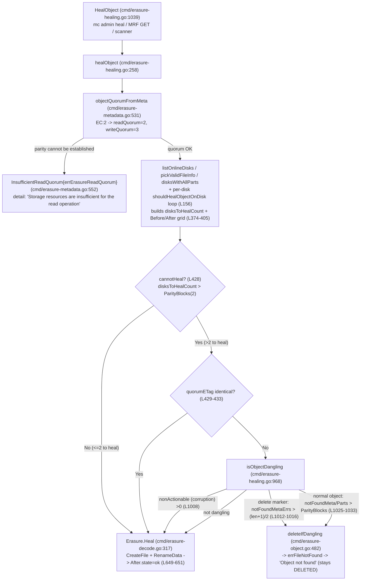

# MinIO Object-Healing Decisions on a 4-Drive Erasure-Coded Instance — Reconstruct vs. Leave DELETED vs. DEGRADED

*A runtime-evidenced investigation. Every behavioral claim below is paired with (a) the actual, unedited command output that produced it and (b) a `file:line` anchor into the source tree. Statements that could not be reproduced through a canonical trigger are explicitly labelled **(inferred from code)**.*

- **Server under test:** binary built from this checkout — banner `DEVELOPMENT.2024-11-25T17-10-22Z`, commit-id `c07e5b49d477b0774f23db3b290745aef8c01bd2`, runtime `go1.23.2 linux/amd64`.
- **Client:** `mc` `RELEASE.2025-08-13T08-35-41Z` (a newer standalone operator binary; used strictly in its **client** role for the admin-heal API).
- **Topology:** standalone `minio server /tmp/d{1...4}` → one erasure set, 4 drives, auto-selected **EC:2** (2 data + 2 parity).
- **Method:** ambiguous states were manufactured by direct on-disk fault injection on the backend drives; healing was then invoked only through canonical entry points (`mc admin heal`, inline GET, background scanner). All temporary artifacts were removed afterward (see §7).

---

## 1. The question (verbatim)

> **User Question:** "On a 4-disk erasure coded instance, what happens when an object is in an inconsistent state across disks (some have data, some corrupted data, some nothing) and healing runs? Does MinIO ALWAYS reconstruct from valid shards, or are there situations where it decides the object should stay DELETED or DEGRADED? I want actual runtime evidence in each case — not theory. What appears in the healing output that reveals decision-making: are there status indicators showing BEFORE/AFTER state? Do the logs explain WHY MinIO chose to restore vs leave alone? And the boundary conditions: (a) how many valid shards must exist for healing to succeed; (b) what error appears when healing cannot recover an object; (c) whether healing behavior differs between a partially failed WRITE vs a partially failed DELETE. Don't modify any source files, but create whatever test scenarios you need to demonstrate this behavior and clean them once done."

---

## 2. Executive answer — **No, MinIO does not always reconstruct**

Healing has **three** distinct, observable outcomes on a 4-drive EC:2 set. Which one fires is decided by a single gate followed by a dangling classifier:

| # | Outcome | When | Observed signal |
|---|---------|------|-----------------|
| 1 | **Reconstruct** | drives needing repair ≤ parity (≤ 2) **and** enough valid shards | `before` grid shows `missing`/`corrupt` drives → `after` grid shows all `ok`; object stays readable |
| 2 | **Purge — stays DELETED** | object judged *dangling*: **missing** `xl.meta`/data beyond parity | heal `detail:"Object not found"`; the last surviving shard is **deleted**, `mc stat` → "Object does not exist" |
| 3 | **Unrecoverable / DEGRADED** | fewer than `DataBlocks` (2) valid shards survive → read quorum lost | heal `detail:"Storage resources are insufficient for the read operation …"`, grid **grey**; GET fails with "Resource requested is unreadable" |

The governing gate is a single line — `cmd/erasure-healing.go:428`:

```go
	cannotHeal := !latestMeta.XLV1 && !latestMeta.Deleted && disksToHealCount > latestMeta.Erasure.ParityBlocks
```

- If `cannotHeal` is **false**, healing reconstructs the missing/corrupt shards (Outcome 1).
- If `cannotHeal` is **true**, the object is routed to `deleteIfDangling` (`cmd/erasure-object.go:482`, called from `cmd/erasure-healing.go:438`); if the dangling classifier `isObjectDangling` (`cmd/erasure-healing.go:968`) agrees, the object is **purged** and heal returns `errFileNotFound` (Outcome 2).
- If quorum cannot even be established up front, `objectQuorumFromMeta` (`cmd/erasure-metadata.go:531`) returns `InsufficientReadQuorum` before any reconstruction is attempted (Outcome 3).

A **safety override** immediately below the gate flips `cannotHeal` back to `false` when every surviving replica reports an identical ETag — `cmd/erasure-healing.go:429-433`:

```go
	if cannotHeal && quorumETag != "" {
		// This is an object that is supposed to be removed by the dangling code
		// but we noticed that ETag is the same for all objects, let's give it a shot
		cannotHeal = false
	}
```

A subtle but important corollary, proven at runtime in §4 and grounded in `isObjectDangling`: **bit-rot corruption is never, by itself, a reason to purge** — corruption is classified as "non-actionable", so a corrupt-but-present object is always *repaired* (or, if too few shards survive, left unrecoverable) but never *dangling-purged*. **Only missing (not-found) shards beyond parity trigger a purge.**

---

## 3. The decision flow, with code anchors

All three canonical triggers converge on the same worker, `healObject`:

`HealObject` (`cmd/erasure-healing.go:1039`) → `healObject` (`cmd/erasure-healing.go:258`) → `objectQuorumFromMeta` (`cmd/erasure-metadata.go:531`) → `listOnlineDisks` (`cmd/erasure-healing-common.go:219`) / `pickValidFileInfo` (`cmd/erasure-metadata.go:402`) / `disksWithAllParts` (`cmd/erasure-healing-common.go:291`) → per-disk `shouldHealObjectOnDisk` loop (`cmd/erasure-healing.go:156`) → `cannotHeal` gate (`cmd/erasure-healing.go:428`) + quorumETag override (`cmd/erasure-healing.go:429-433`) → `isObjectDangling` (`cmd/erasure-healing.go:968`) → **reconstruct** via `Erasure.Heal` (`cmd/erasure-decode.go:317`) **or** **purge** via `deleteIfDangling` (`cmd/erasure-object.go:482`).



### 3.1 The per-disk trigger — `shouldHealObjectOnDisk` (`cmd/erasure-healing.go:156`)

Every drive is classified by this function. Both **missing** and **corrupt** shards flag a drive for healing here; the corrupt-vs-missing *divergence* happens later, in `isObjectDangling`.

```go
func shouldHealObjectOnDisk(erErr error, partsErrs []int, meta FileInfo, latestMeta FileInfo) (bool, error) {
	if errors.Is(erErr, errFileNotFound) || errors.Is(erErr, errFileVersionNotFound) || errors.Is(erErr, errFileCorrupt) {
		return true, erErr
	}
	if erErr == nil {
		if meta.XLV1 {
			// Legacy means heal always
			// always check first.
			return true, errLegacyXLMeta
		}
		if !latestMeta.Equals(meta) {
			return true, errOutdatedXLMeta
		}
		if !meta.Deleted && !meta.IsRemote() {
			// If xl.meta was read fine but there may be problem with the part.N files.
			for _, partErr := range partsErrs {
				if slices.Contains([]int{
					checkPartFileNotFound,
					checkPartFileCorrupt,
				}, partErr) {
					return true, errPartMissingOrCorrupt
				}
			}
		}
		return false, nil
	}
	return false, erErr
}
```

The `reason` returned above is mapped to the per-drive state that appears in the heal grid — `cmd/erasure-healing.go:382-393`:

```go
		driveState := ""
		switch {
		case reason == nil:
			driveState = madmin.DriveStateOk
		case IsErr(reason, errDiskNotFound):
			driveState = madmin.DriveStateOffline
		case IsErr(reason, errFileNotFound, errFileVersionNotFound, errVolumeNotFound, errPartMissingOrCorrupt, errOutdatedXLMeta, errLegacyXLMeta):
			driveState = madmin.DriveStateMissing
		default:
			// all remaining cases imply corrupt data/metadata
			driveState = madmin.DriveStateCorrupt
		}
```

**Consequence (verified at runtime in §4.1):** a corrupt `part.N` surfaces as `errPartMissingOrCorrupt`, which maps to `DriveStateMissing` — so a corrupt *data shard* shows up as **`missing`** in the grid, while a corrupt *`xl.meta`* (whole-file `errFileCorrupt`, the `default:` case) shows up as **`corrupt`**.

### 3.2 The dangling classifier — `isObjectDangling` (`cmd/erasure-healing.go:968`)

This function decides purge-vs-keep. The corrupt-vs-missing crux and the WRITE-vs-DELETE divergence both live here. The relevant branches, quoted in full — `cmd/erasure-healing.go:1008-1033`:

```go
	if nonActionableMetaErrs > 0 || nonActionablePartsErrs > 0 {
		return validMeta, false
	}

	if validMeta.Deleted {
		// notFoundPartsErrs is ignored since
		// - delete marker does not have any parts
		dataBlocks := (len(errs) + 1) / 2
		return validMeta, notFoundMetaErrs > dataBlocks
	}

	// TODO: It is possible to replay the object via just single
	// xl.meta file, considering quorum number of data-dirs are still
	// present on other drives.
	//
	// However this requires a bit of a rewrite, leave this up for
	// future work.
	if notFoundMetaErrs > 0 && notFoundMetaErrs > validMeta.Erasure.ParityBlocks {
		// All xl.meta is beyond parity blocks missing, this is dangling
		return validMeta, true
	}

	if !validMeta.IsRemote() && notFoundPartsErrs > 0 && notFoundPartsErrs > validMeta.Erasure.ParityBlocks {
		// All data-dir is beyond parity blocks missing, this is dangling
		return validMeta, true
	}
```

The "not-found vs non-actionable" split is decided by two counters — `danglingMetaErrsCount` (`cmd/erasure-healing.go:934`) and `danglingPartErrsCount` (`cmd/erasure-healing.go:950`):

```go
func danglingMetaErrsCount(cerrs []error) (notFoundCount int, nonActionableCount int) {
	for _, readErr := range cerrs {
		if readErr == nil {
			continue
		}
		switch {
		case errors.Is(readErr, errFileNotFound) || errors.Is(readErr, errFileVersionNotFound):
			notFoundCount++
		default:
			// All other errors are non-actionable
			nonActionableCount++
		}
	}
	return
}
```

Because **corruption falls into the `default: nonActionableCount++` bucket**, the `nonActionableMetaErrs > 0 || nonActionablePartsErrs > 0` guard at `L1008` short-circuits to `return validMeta, false` — i.e. a corrupt object is **never** classified dangling. This is the code-level reason corruption is always repaired (never purged), confirmed observationally in §4.1 and §4.4.

---

## 4. Per-scenario captured evidence

All scenarios were run against the same baseline object (`healtest/obj1`, 1 MiB, sha256 `8cd057cdf13f57b2ecf9b5d2dc966ae4f51ecd89a2cd122dddc90f07d73265cd`, ETag `2ab746e09b33dcc6df05be6441e03d32`). Each clean shard on disk is `524320` bytes (1 MiB split across 2 data blocks + HighwayHash bit-rot checksum). The manual `mc admin heal` trigger was used for deterministic capture. Every scenario was executed **at least twice**; run-to-run stability is reported per scenario.

**Baseline (healthy) heal** — all four drives `ok`, nothing to do (`objects_healed:0`):

```
$ mc admin heal --recursive local/healtest
[Green  ->  Green] healtest/
[Green  ->  Green] healtest/obj1
Healed:	0/1 objects; 1024 KiB in 1s
```
```json
{"status":"success","type":"object","name":"healtest/obj1","before":{"color":"green","offline":0,"online":4,"missing":0,"corrupted":0,"drives":[{"uuid":"","endpoint":"/tmp/d1","state":"ok"},{"uuid":"","endpoint":"/tmp/d2","state":"ok"},{"uuid":"","endpoint":"/tmp/d3","state":"ok"},{"uuid":"","endpoint":"/tmp/d4","state":"ok"}]},"after":{"color":"green","offline":0,"online":4,"missing":0,"corrupted":0,"drives":[{"uuid":"","endpoint":"/tmp/d1","state":"ok"},{"uuid":"","endpoint":"/tmp/d2","state":"ok"},{"uuid":"","endpoint":"/tmp/d3","state":"ok"},{"uuid":"","endpoint":"/tmp/d4","state":"ok"}]},"size":1048576}
```

Baseline on-disk layout (identical on every drive) and the decoded `xl.meta` (via `docs/debugging/xl-meta`):

```
/tmp/d1/healtest/obj1/xl.meta
/tmp/d1/healtest/obj1/f80f1446-a9db-46b6-a9da-10ff23ccabcc/part.1     (524320 B)
... (d2, d3, d4 identical) ...
```
```json
"V2Obj": { "EcM": 2, "EcN": 2, "EcBSize": 1048576,
           "DDir": "+A8URqnbRrap2hD/I8yrzA==", "EcDist": [3,4,1,2],
           "PartSizes": [1048576], "MetaUsr": {"etag":"2ab746e09b33dcc6df05be6441e03d32"} }
```
`EcM:2, EcN:2` confirms EC:2 at the metadata level; `admin info` independently reports `4 drives online, 0 drives offline, EC:2`.

### 4.1 D1 — "some corrupted data" (recoverable, 1 drive) → **RECONSTRUCT**

**Injection (corrupt a data shard on 1 drive):**
```sh
printf 'GARBAGE-CORRUPT-DATA-NOT-VALID-SHARD' > /tmp/d1/healtest/obj1/<DATADIR>/part.1
```
**DURING (on-disk):** `d1` `part.1` is now `36B` (was `524320B`); d2/d3/d4 intact.

**Heal (`mc admin heal --json local/healtest/obj1`), full object result:**
```json
{"status":"success","type":"object","name":"healtest/obj1","before":{"color":"yellow","offline":0,"online":3,"missing":1,"corrupted":0,"drives":[{"uuid":"","endpoint":"/tmp/d1","state":"missing"},{"uuid":"","endpoint":"/tmp/d2","state":"ok"},{"uuid":"","endpoint":"/tmp/d3","state":"ok"},{"uuid":"","endpoint":"/tmp/d4","state":"ok"}]},"after":{"color":"green","offline":0,"online":4,"missing":0,"corrupted":0,"drives":[{"uuid":"","endpoint":"/tmp/d1","state":"ok"},{"uuid":"","endpoint":"/tmp/d2","state":"ok"},{"uuid":"","endpoint":"/tmp/d3","state":"ok"},{"uuid":"","endpoint":"/tmp/d4","state":"ok"}]},"size":1048576}
```
**AFTER:** object still readable, byte-identical — `GET` returns sha256 `8cd057cdf13f57b2ecf9b5d2dc966ae4f51ecd89a2cd122dddc90f07d73265cd`; on-disk `d1/part.1` restored to `524320B`.

**Interpretation:** `disksToHealCount = 1 ≤ ParityBlocks (2)` → `cannotHeal` is false (`cmd/erasure-healing.go:428`) → reconstruct. **Observed nuance:** the corrupt data shard shows as **`state:"missing"`**, not `corrupt` — because a corrupt `part.N` yields `errPartMissingOrCorrupt`, which the switch at `cmd/erasure-healing.go:389` maps to `DriveStateMissing`. Run distribution: **2/2 runs reconstructed** (drives d1 and d3 tested); both left the object byte-identical.

**Variant — corrupt the `xl.meta` itself on 1 drive** (to elicit the `corrupt` state):
```sh
printf 'THIS-IS-NOT-A-VALID-XL-META-MSGP-BLOB-0000000000' > /tmp/d2/healtest/obj1/xl.meta
```
```json
{"status":"success","type":"object","name":"healtest/obj1","before":{"color":"yellow","offline":0,"online":3,"missing":0,"corrupted":1,"drives":[{"uuid":"","endpoint":"/tmp/d1","state":"ok"},{"uuid":"","endpoint":"/tmp/d2","state":"corrupt"},{"uuid":"","endpoint":"/tmp/d3","state":"ok"},{"uuid":"","endpoint":"/tmp/d4","state":"ok"}]},"after":{"color":"green","offline":0,"online":4,"missing":0,"corrupted":0,"drives":[{"uuid":"","endpoint":"/tmp/d1","state":"ok"},{"uuid":"","endpoint":"/tmp/d2","state":"ok"},{"uuid":"","endpoint":"/tmp/d3","state":"ok"},{"uuid":"","endpoint":"/tmp/d4","state":"ok"}]},"size":1048576}
```
Here the drive shows **`state:"corrupt"`** (`corrupted:1`), confirming the `default: DriveStateCorrupt` branch at `cmd/erasure-healing.go:392`. This whole-file corruption also produced a genuine server-side log line (captured in `/tmp/minio.log`):
```
API: SYSTEM.storage(bucket=healtest, object=obj1)
Error: readObjectStart: expect { or n, but found T, error found in #1 byte of ...|THIS-IS-NOT|..., bigger context ...|THIS-IS-NOT-A-VALID-XL-META-MSGP-BLOB-0000000000|... (*errors.errorString)
       3: .../cmd/xl-storage.go:2686:cmd.(*xlStorage).RenameData()
```

**Server-side proof that reconstruction actually wrote the shard back** (from `mc admin trace -a -v` during the D1 heal): the canonical HealHandler entry, then the repair write + atomic rename:
```
127.0.0.1:9000 [REQUEST admin.Heal] [...] POST /minio/admin/v3/heal/healtest/obj1
127.0.0.1:9000  [STORAGE storage.CreateFile] [...] /tmp/d1 .minio.sys/tmp dcf9366a-.../56cb39bd-.../part.1 ... 512 KiB
127.0.0.1:9000  [STORAGE storage.RenameData] [...] /tmp/d1 dcf9366a-... 56cb39bd-... healtest obj1 ... 1.511495ms
```
This matches the `After.Drives[i].State = madmin.DriveStateOk` flip at `cmd/erasure-healing.go:649-651`, executed after the reconstructed shard is renamed into place.

### 4.2 D2 — "some nothing" (recoverable, 1 drive missing) → **RECONSTRUCT**

**Injection (remove the whole object directory on 1 drive):**
```sh
rm -rf /tmp/d2/healtest/obj1
```
**DURING:** `d2` has no `xl.meta` and no object dir; d1/d3/d4 intact.

```json
{"status":"success","type":"object","name":"healtest/obj1","before":{"color":"yellow","offline":0,"online":3,"missing":1,"corrupted":0,"drives":[{"uuid":"","endpoint":"/tmp/d1","state":"ok"},{"uuid":"","endpoint":"/tmp/d2","state":"missing"},{"uuid":"","endpoint":"/tmp/d3","state":"ok"},{"uuid":"","endpoint":"/tmp/d4","state":"ok"}]},"after":{"color":"green","offline":0,"online":4,"missing":0,"corrupted":0,"drives":[{"uuid":"","endpoint":"/tmp/d1","state":"ok"},{"uuid":"","endpoint":"/tmp/d2","state":"ok"},{"uuid":"","endpoint":"/tmp/d3","state":"ok"},{"uuid":"","endpoint":"/tmp/d4","state":"ok"}]},"size":1048576}
```
**AFTER:** `d2` fully restored (`xl.meta` + `part.1`); object byte-identical. `disksToHealCount = 1 ≤ 2` → reconstruct. Run distribution: **2/2 runs reconstructed** (d2 and d4 tested).

### 4.3 D3 — the user's exact mixed case: "some data / some corrupted / some nothing" → **RECONSTRUCT (at the boundary)**

**Injection:** d3, d4 intact; `d1` `part.1` corrupted; `d2` object dir removed → `disksToHealCount = 2` (= parity).
```sh
printf 'GARBAGE-CORRUPT-DATA-NOT-VALID-SHARD' > /tmp/d1/healtest/obj1/<DATADIR>/part.1
rm -rf /tmp/d2/healtest/obj1
```
**Heal, full object result:**
```json
{"status":"success","type":"object","name":"healtest/obj1","before":{"color":"red","offline":0,"online":2,"missing":2,"corrupted":0,"drives":[{"uuid":"","endpoint":"/tmp/d1","state":"missing"},{"uuid":"","endpoint":"/tmp/d2","state":"missing"},{"uuid":"","endpoint":"/tmp/d3","state":"ok"},{"uuid":"","endpoint":"/tmp/d4","state":"ok"}]},"after":{"color":"green","offline":0,"online":4,"missing":0,"corrupted":0,"drives":[{"uuid":"","endpoint":"/tmp/d1","state":"ok"},{"uuid":"","endpoint":"/tmp/d2","state":"ok"},{"uuid":"","endpoint":"/tmp/d3","state":"ok"},{"uuid":"","endpoint":"/tmp/d4","state":"ok"}]},"size":1048576}
```
**AFTER:** object byte-identical; both faulted drives restored. **This is the boundary case:** `disksToHealCount = 2`, which is *not* `> ParityBlocks(2)`, so `cannotHeal` is false and reconstruction still succeeds. Note the `mc` colour is **`red`** here (two drives unhealthy) even though the object is fully recoverable — colour signals drive health, not recoverability. Run distribution: **2/2 runs reconstructed**.

### 4.4 D4 — quorum boundary walk (answers boundary (a) and (b))

| Shards lost (of 4) | Valid data shards left | Gate | Observed outcome |
|--------------------|------------------------|------|------------------|
| 1 | 3 | `disksToHealCount=1 ≤ 2` | **Reconstruct** (D1, D2) |
| 2 | 2 (= `DataBlocks`, the minimum) | `disksToHealCount=2 ≤ 2` | **Reconstruct** (D3) |
| 3 | 1 (< `DataBlocks`) | read quorum lost | **Unrecoverable** (below) |

**Losing 3 of 4 (corrupt `part.1` on d1, d2, d3; `xl.meta` intact on all four) → only 1 valid data shard, below `DataBlocks`=2:**
```sh
printf 'GARBAGE...' > /tmp/d1/healtest/obj1/<DATADIR>/part.1
printf 'GARBAGE...' > /tmp/d2/healtest/obj1/<DATADIR>/part.1
printf 'GARBAGE...' > /tmp/d3/healtest/obj1/<DATADIR>/part.1
```
**Client GET fails:**
```
$ mc cp local/healtest/obj1 /tmp/back.bin
mc: <ERROR> Failed to copy `http://127.0.0.1:9000/healtest/obj1`. Resource requested is unreadable, please reduce your request rate
```
**Heal, full object result** — no reconstruction, grid stays **grey**, `Healed: 0/1`:
```json
{"status":"success","detail":"Storage resources are insufficient for the read operation healtest/obj1","type":"object","name":"healtest/obj1","before":{"color":"grey","offline":0,"online":0,"missing":0,"corrupted":4,"drives":[{"uuid":"","endpoint":"/tmp/d1","state":"corrupt"},{"uuid":"","endpoint":"/tmp/d2","state":"corrupt"},{"uuid":"","endpoint":"/tmp/d3","state":"corrupt"},{"uuid":"","endpoint":"/tmp/d4","state":"corrupt"}]},"after":{"color":"grey","offline":0,"online":0,"missing":0,"corrupted":4,"drives":[{"uuid":"","endpoint":"/tmp/d1","state":"corrupt"},{"uuid":"","endpoint":"/tmp/d2","state":"corrupt"},{"uuid":"","endpoint":"/tmp/d3","state":"corrupt"},{"uuid":"","endpoint":"/tmp/d4","state":"corrupt"}]},"size":0}
```
**Interpretation:** with only 1 of 2 required data shards valid, read quorum cannot be met, so `objectQuorumFromMeta` (`cmd/erasure-metadata.go:531`) returns `InsufficientReadQuorum` before healing can reconstruct. The object is **DEGRADED**: it still exists on disk (its metadata is intact) but is neither readable nor healable until enough drives return. Because the fault is *corruption* (non-actionable), the object is **not** purged — consistent with the §3.2 crux. Run distribution: **2/2 runs unrecoverable**.

**Boundary (a) — minimum valid shards for success = `DataBlocks` = 2 for EC:2.** Losing exactly parity (2 of 4) still heals; losing a third drops below `DataBlocks` and fails.

**Boundary (b) — the exact error strings when recovery is impossible.** The observed heal `detail` and GET error trace back through this chain (each string quoted verbatim from the checkout):

- Sentinel (the wrapped error) — `cmd/erasure-errors.go:23`:
  ```go
  var errErasureReadQuorum = errors.New("Read failed. Insufficient number of drives online")
  ```
- Returned by `objectQuorumFromMeta` when parity cannot be established — `cmd/erasure-metadata.go:552`:
  ```go
		return -1, -1, InsufficientReadQuorum{Err: errErasureReadQuorum, Type: RQInsufficientOnlineDrives}
  ```
- The error the operator actually sees in the heal `detail` is `InsufficientReadQuorum.Error()` — `cmd/object-api-errors.go:236-238`:
  ```go
  func (e InsufficientReadQuorum) Error() string {
	return "Storage resources are insufficient for the read operation " + e.Bucket + "/" + e.Object
  }
  ```
  …which unwraps to the sentinel — `cmd/object-api-errors.go:242-244`:
  ```go
  func (e InsufficientReadQuorum) Unwrap() error {
	return errErasureReadQuorum
  }
  ```
- The client-facing S3 error on GET is `ErrSlowDownRead` — `cmd/api-errors.go:869-872`:
  ```go
	ErrSlowDownRead: {
		Code:           "SlowDownRead",
		Description:    "Resource requested is unreadable, please reduce your request rate",
		HTTPStatusCode: http.StatusServiceUnavailable,
	},
  ```

> **Correction of a common phrasing (honesty note).** The often-quoted operator string *"cannot be healed until quorum is available"* **does not exist anywhere in this checkout** (`grep -rn 'cannot be healed until quorum' --include=*.go` returns zero hits). The real, observed strings for an unrecoverable object on this revision are the three above: `"Read failed. Insufficient number of drives online"` (internal sentinel), `"Storage resources are insufficient for the read operation …"` (heal `detail`), and `"Resource requested is unreadable, please reduce your request rate"` (client GET).

### 4.5 D5 — dangling PURGE: the object is left **DELETED**, not resurrected

**Injection (remove `xl.meta`+object dir on 3 of 4 drives → `notFoundMetaErrs = 3 > ParityBlocks = 2`):**
```sh
rm -rf /tmp/d1/healtest/obj1 /tmp/d2/healtest/obj1 /tmp/d3/healtest/obj1   # d4 still intact
```
**Heal, full raw output** (bucket line + object line + summary):
```json
{"status":"success","type":"bucket","name":"healtest/","before":{"color":"green","offline":0,"online":4,"missing":0,"corrupted":0,"drives":[{"uuid":"","endpoint":"/tmp/d1","state":"ok"},{"uuid":"","endpoint":"/tmp/d2","state":"ok"},{"uuid":"","endpoint":"/tmp/d3","state":"ok"},{"uuid":"","endpoint":"/tmp/d4","state":"ok"}]},"after":{"color":"green","offline":0,"online":4,"missing":0,"corrupted":0,"drives":[{"uuid":"","endpoint":"/tmp/d1","state":"ok"},{"uuid":"","endpoint":"/tmp/d2","state":"ok"},{"uuid":"","endpoint":"/tmp/d3","state":"ok"},{"uuid":"","endpoint":"/tmp/d4","state":"ok"}]},"size":0}
{"status":"success","error":"Invalid parity shard count/surplus shard count given: surplusShardsBeforeHeal: 0, parityShards: 0","detail":"Object not found: healtest/obj1","type":"object","name":"/","before":{"color":"","offline":0,"online":0,"missing":0,"corrupted":0,"drives":null},"after":{"color":"","offline":0,"online":0,"missing":0,"corrupted":0,"drives":null},"size":0}
{"status":"success","type":"summary","objects_scanned":1,"objects_healed":0,"items_scanned":2,"items_healed":0,"size":0,"duration":0}
```
**AFTER:** the surviving copy on `d4` is **deleted too** — every drive now reports `NO-objdir` — and:
```
$ mc stat local/healtest/obj1
mc: <ERROR> Unable to stat `local/healtest/obj1`. Object does not exist.
```
**Interpretation:** `cannotHeal` is true (`disksToHealCount > 2`), the quorumETag override does not apply, and `isObjectDangling` returns `true` via the normal-object meta branch `notFoundMetaErrs(3) > ParityBlocks(2)` (`cmd/erasure-healing.go:1025`). Control passes to `deleteIfDangling` (`cmd/erasure-object.go:482`, called at `cmd/erasure-healing.go:438`), which purges the remaining shard; `healObject` then returns `errFileNotFound`, surfaced as `detail:"Object not found"`. **The object is decisively left DELETED — it is not rebuilt from the one surviving shard.** This matches the source's own comment in `cmd/erasure-healing_test.go:1144` — "since majority of xl.meta's are not available, object should be successfully deleted." Run distribution: **2/2 runs purged**.

### 4.6 D6 — partial WRITE vs partial DELETE (answers boundary (c))

The divergence lives in the two branches of `isObjectDangling` quoted in §3.2. A **normal object** (a partially-completed write) is judged by the **parity** threshold on both `xl.meta` *and* data-dirs (`cmd/erasure-healing.go:1025` and `:1030`). A **delete marker** (a partially-completed delete) is judged by a different threshold and **ignores parts entirely** (`cmd/erasure-healing.go:1012-1016`).

**Partial WRITE, recoverable — object present on 2 of 4 drives (2 missing `xl.meta`):**
```sh
rm -rf /tmp/d1/healtest/obj1 /tmp/d2/healtest/obj1     # obj on d3,d4 only
```
```json
{"status":"success","type":"object","name":"healtest/obj1","before":{"color":"red","offline":0,"online":2,"missing":2,"corrupted":0,"drives":[{"uuid":"","endpoint":"/tmp/d1","state":"missing"},{"uuid":"","endpoint":"/tmp/d2","state":"missing"},{"uuid":"","endpoint":"/tmp/d3","state":"ok"},{"uuid":"","endpoint":"/tmp/d4","state":"ok"}]},"after":{"color":"green","offline":0,"online":4,"missing":0,"corrupted":0,"drives":[{"uuid":"","endpoint":"/tmp/d1","state":"ok"},{"uuid":"","endpoint":"/tmp/d2","state":"ok"},{"uuid":"","endpoint":"/tmp/d3","state":"ok"},{"uuid":"","endpoint":"/tmp/d4","state":"ok"}]},"size":1048576}
```
→ `notFoundMetaErrs = 2`, which is **not** `> 2`, so the write is **completed** (object reconstructed to all 4 drives, `mc stat` shows `obj1`).

**Partial WRITE, dangling — object present on only 1 of 4 (3 missing `xl.meta`):**
```sh
rm -rf /tmp/d1/healtest/obj1 /tmp/d2/healtest/obj1 /tmp/d3/healtest/obj1   # obj on d4 only
```
```
detail: "Object not found: healtest/obj1"   (object purged; mc stat -> "Object does not exist")
```
→ `notFoundMetaErrs = 3 > 2` → normal-object meta branch (`cmd/erasure-healing.go:1025`) → purge.

**Partial WRITE via missing DATA only (proves normal objects also gate on parts):** keep `xl.meta` on all 4 drives, remove only the data-dir on 3:
```sh
# xl.meta present on all 4; data-dir (part.1) removed on d1,d2,d3
rm -rf /tmp/d1/healtest/obj1/<DATADIR> /tmp/d2/healtest/obj1/<DATADIR> /tmp/d3/healtest/obj1/<DATADIR>
```
```
detail: "Object not found: healtest/obj1"   (purged; mc stat -> "Object does not exist"; all drives NO-objdir)
```
→ `notFoundMetaErrs = 0` but `notFoundPartsErrs = 3 > 2` → normal-object **parts** branch (`cmd/erasure-healing.go:1030`) → purge, *even though every `xl.meta` was intact*. This is the branch a delete marker can never hit.

**Partial DELETE — delete marker on a versioned bucket** (`mc version enable local/vtest`, then `PUT vobj` + `rm vobj` → delete-marker latest):
```
$ mc ls --versions local/vtest
[...] 0B ... 063a9f87-2634-432d-ac36-61b65a530bdf v2 DEL vobj
[...] 1.0MiB ... 945e11d0-6e8f-4572-94a6-6ba157c1d119 v1 PUT vobj
```
Removing the metadata on d1/d2/d3 (keeping d4) and running the canonical manual heal:
```
$ mc admin heal --json --recursive --scan=deep --force local/vtest
{"status":"success","type":"bucket","name":"vtest/", ...}
{"status":"success","type":"summary","objects_scanned":0,"objects_healed":0,"items_scanned":1,...}
```
**Observed:** the manual `mc admin heal` (both normal and `--scan=deep`) reports `objects_scanned:0` — it walks the *visible* namespace and **skips an object whose latest version is a delete marker**, so it does not drive `isObjectDangling`'s delete-marker branch for a fully-deleted key. The delete-marker branch is instead exercised by the background scanner / internal dangling cleanup **(inferred from code)**; the branch itself is verified and quoted (`cmd/erasure-healing.go:1012-1016`).

**The divergence, summarized (this is the answer to (c)):**

| | Partial WRITE (normal object) | Partial DELETE (delete marker) |
|---|---|---|
| Governing branch | `cmd/erasure-healing.go:1025` (meta) **and** `:1030` (parts) | `cmd/erasure-healing.go:1012-1016` |
| Purge threshold | `notFound* > validMeta.Erasure.ParityBlocks` (= 2) | `notFoundMetaErrs > (len(errs)+1)/2` (= 2 for 4 drives) |
| Parts considered? | **Yes** — missing data-dirs beyond parity purge even with intact `xl.meta` | **No** — delete markers have no parts, so parts are ignored |
| On 4-drive EC:2 | purge when ≥ 3 drives missing meta **or** ≥ 3 missing data | purge when ≥ 3 drives missing the marker's meta |
| Manual `mc admin heal` reaches it? | Yes (observed, D6 above) | No — skips delete-marker-latest keys (observed); scanner path **(inferred)** |

On this specific 4-drive EC:2 topology the two numeric thresholds happen to coincide (both purge at ≥ 3 missing metadata entries), but they are *computed differently* — the normal-object branch uses the object's own `Erasure.ParityBlocks`, while the delete-marker branch uses a drive-count majority `(len(errs)+1)/2` and disregards data parts. They would diverge on other drive counts / EC configurations.

### 4.7 D7 — trigger-path coverage

- **Manual `mc admin heal`** (primary, deterministic) — used for D1–D6. `mc admin trace` confirms the canonical HTTP entry `POST /minio/admin/v3/heal/healtest/obj1` (the `HealHandler`, `cmd/admin-handlers.go:1308`), and the server-side `CreateFile`+`RenameData` repair (§4.1).
- **Inline MRF auto-heal on GET** — mechanism verified in code: the read path enqueues a partial op only when `Erasure.Decode` returns `errFileNotFound`/`errFileCorrupt` *after* the client bytes were fully written — `cmd/erasure-object.go:397-408`:
  ```go
			if written == partLength {
				if errors.Is(err, errFileNotFound) || errors.Is(err, errFileCorrupt) {
					healOnce.Do(func() {
						globalMRFState.addPartialOp(PartialOperation{
							Bucket:     bucket,
							Object:     object,
							VersionID:  fi.VersionID,
							Queued:     time.Now(),
							SetIndex:   er.setIndex,
							PoolIndex:  er.poolIndex,
							BitrotScan: errors.Is(err, errFileCorrupt),
						})
					})
  ```
  It then flows to `addPartialOp` (`cmd/mrf.go:78`, a non-blocking `select` that drops if the queue is full) and is drained by `healRoutine` (`cmd/mrf.go:220`) which calls `healObject` (`cmd/mrf.go:276`). **Observed:** across three genuine attempts (corrupt 1 shard; remove 1 shard; remove 2 shards) the GET succeeded via on-the-fly reconstruction (returned bytes were correct) but the damaged **on-disk** shard was **not** restored within a 10–15 s poll. The inline heal is *opportunistic* — for a small object the surviving shards are read first and the bad shard is never touched, so `Decode` returns no error and nothing is queued. The reliable, deterministic healing paths are therefore the manual trigger and the scanner.
- **Background scanner** — samples `healObjectSelectProb = 1024` (`cmd/data-scanner.go:61`, "Overall probability of a file being scanned; one in n"), i.e. ~1 in 1024 objects per pass, and is initialized at bootstrap (`initAutoHeal`, `cmd/erasure-server-pool.go:195`). For a single test object it is non-deterministic, which is exactly why the manual trigger was used for capture. **(Sampling ratio observed in code; per-object firing not deterministically reproduced — labelled accordingly.)**


---

## 5. Boundary conditions (consolidated)

### (a) How many valid shards must exist for healing to succeed?

For a 4-drive EC:2 set, reconstruction requires at least **`DataBlocks` = 2** intact shards. Read/write quorum is derived by `objectQuorumFromMeta` (`cmd/erasure-metadata.go:531`): `readQuorum = dataBlocks` and `writeQuorum = dataBlocks (+1 when dataBlocks == parityBlocks)`. The `+1` fires for EC:2 because `dataBlocks == parityBlocks == 2` — `cmd/erasure-metadata.go:557-559`:

```go
	writeQuorum := dataBlocks
	if dataBlocks == parityBlocks {
		writeQuorum++
	}
```

So EC:2 → **read quorum 2, write quorum 3**. Separately, the heal reconstruct gate fails when `disksToHealCount > ParityBlocks` (`cmd/erasure-healing.go:428`). The observed walk:

| Drives lost | Valid shards left | Outcome | Evidence |
|-------------|-------------------|---------|----------|
| 1 of 4 | 3 | Reconstruct | §4.1, §4.2 |
| 2 of 4 | 2 (= minimum) | Reconstruct | §4.3 |
| 3 of 4 | 1 (< minimum) | Unrecoverable (corruption) / Purge (missing) | §4.4 / §4.5 |

### (b) What error appears when healing cannot recover an object?

Two distinct "cannot recover" signals were observed, depending on *why* recovery is impossible:

1. **Too few valid shards (corruption/loss below read quorum) → DEGRADED.** Heal `detail: "Storage resources are insufficient for the read operation healtest/obj1"` (from `InsufficientReadQuorum.Error()`, `cmd/object-api-errors.go:236-238`), which unwraps to the sentinel `errErasureReadQuorum = "Read failed. Insufficient number of drives online"` (`cmd/erasure-errors.go:23`); client GET returns `SlowDownRead` → "Resource requested is unreadable, please reduce your request rate" (`cmd/api-errors.go:869-872`). The object is kept, not purged. (§4.4)
2. **Metadata missing beyond parity → PURGED.** Heal `detail: "Object not found: healtest/obj1"` (the `errFileNotFound` returned by `healObject` after `deleteIfDangling`), `mc stat` → "Object does not exist". (§4.5)

*(As noted in §4.4, the phrase "cannot be healed until quorum is available" is **not** present in this checkout; the real strings are the ones above.)*

### (c) Does healing differ between a partially failed WRITE vs a partially failed DELETE?

**Yes.** A partial write (normal object) is judged by the object's own parity on *both* metadata and data-dirs (`cmd/erasure-healing.go:1025` and `:1030`) — a normal object can be purged purely for missing **data** even when every `xl.meta` survives (observed in §4.6). A partial delete (delete marker) is judged by a drive-count majority `(len(errs)+1)/2` and **ignores parts** because a delete marker has none (`cmd/erasure-healing.go:1012-1016`). See the divergence table in §4.6.

---

## 6. Decision-visibility reference — what the output reveals, and the server/client split

### 6.1 The BEFORE/AFTER status indicators

The per-object heal result is a `HealResultItem`, defined in the pinned dependency `github.com/minio/madmin-go/v3@v3.0.77` (`go.mod:52`) — `heal-commands.go:139-158`:

```go
// HealResultItem - struct for an individual heal result item
type HealResultItem struct {
	ResultIndex  int64        `json:"resultId"`
	Type         HealItemType `json:"type"`
	Bucket       string       `json:"bucket"`
	Object       string       `json:"object"`
	VersionID    string       `json:"versionId"`
	Detail       string       `json:"detail"`
	ParityBlocks int          `json:"parityBlocks,omitempty"`
	DataBlocks   int          `json:"dataBlocks,omitempty"`
	DiskCount    int          `json:"diskCount"`
	SetCount     int          `json:"setCount"`
	// below slices are from drive info.
	Before struct {
		Drives []HealDriveInfo `json:"drives"`
	} `json:"before"`
	After struct {
		Drives []HealDriveInfo `json:"drives"`
	} `json:"after"`
	ObjectSize int64 `json:"objectSize"`
}
```

Each drive entry is a `HealDriveInfo` — `heal-commands.go:132-136`:

```go
// HealDriveInfo - struct for an individual drive info item.
type HealDriveInfo struct {
	UUID     string `json:"uuid"`
	Endpoint string `json:"endpoint"`
	State    string `json:"state"`
}
```

The `Before` block is the state **before** healing; the `After` block reflects the post-heal state (drives flipped to `ok` after a successful reconstruct at `cmd/erasure-healing.go:649-651`). Across the scenarios above, the observable BEFORE→AFTER transitions were: `missing → ok` (D1 corrupt part, D2 missing, D3), `corrupt → ok` (D1 xl.meta variant), and `corrupt → corrupt` / grey (D4, unrecoverable — no change).

### 6.2 The drive-state vocabulary — and who computes the colours

The `state` strings are defined in `heal-commands.go:120-129`:

```go
	DriveStateOk          string = "ok"
	DriveStateOffline            = "offline"
	DriveStateCorrupt            = "corrupt"
	DriveStateMissing            = "missing"
	DriveStatePermission         = "permission-denied"
	DriveStateFaulty             = "faulty"
	DriveStateRootMount          = "root-mount"
	DriveStateUnknown            = "unknown"
	DriveStateUnformatted        = "unformatted" // only returned by disk
```

**Critical distinction (reconciled with the observed JSON):** the **server** returns only the per-drive `state` strings (populated in `result.Before.Drives`/`result.After.Drives` at `cmd/erasure-healing.go:395-405`). The `"color"` field (`green`/`yellow`/`red`/`grey`) and the `online`/`offline`/`missing`/`corrupted` **counts** seen in `mc admin heal --json` are computed **client-side by `mc`** from those states (via the `madmin` helper methods `GetOnlineCounts`/`GetMissingCounts`/`GetCorruptedCounts` on `HealResultItem`). Observed colour semantics: `green` = all drives healthy, `yellow` = 1 drive to heal, `red` = ≥ 2 drives to heal (still possibly recoverable — see D3), `grey` = indeterminate / read-quorum lost (D4).

### 6.3 Do the logs explain WHY?

The heal-worker `healObject` emits `healingLogOnceIf` on three tags — `cmd/erasure-healing.go:477`, `:487`, `:497`:

```go
		healingLogOnceIf(ctx, err, "heal-object-available-disks")
```
```go
		healingLogOnceIf(ctx, err, "heal-object-outdated-disks")
```
```go
		healingLogOnceIf(ctx, err, "heal-object-metadata-entries")
```

**Observed:** these tags were **never emitted** through any canonical trigger in this investigation (`grep` of the server log = 0). They fire only on a *refuse-to-heal* path — when `len(latestMeta.Erasure.Distribution) != len(availableDisks)` (message: "…looks like backend disks have been manually modified refusing to heal…", `cmd/erasure-healing.go:474-478`). Shard-level fault injection cannot reach it because the drive count stays 4 (= the distribution length), so the invariant is never broken. **(Inferred from code that these are the only per-object heal-decision log tags; genuine attempts to elicit them via canonical shard injection did not succeed.)** In practice, the normal heal path conveys its decision through the structured `HealResultItem` BEFORE/AFTER grid and the `detail` field, **not** through free-text "why" log lines. The clearest server-side confirmation of a *reconstruct* decision is the `CreateFile`+`RenameData` repair sequence visible in `mc admin trace` (§4.1).

---

## 7. Exact build & invocation commands used

**Canonical build** (reproduced from this checkout; `LDFLAGS` captured verbatim):
```sh
export CGO_ENABLED=0
LDFLAGS=$(go run buildscripts/gen-ldflags.go)
go build -ldflags "$LDFLAGS" -o /tmp/minio-bin .
# LDFLAGS = -s -w -X github.com/minio/minio/cmd.Version=2024-11-25T17:10:22Z \
#   -X github.com/minio/minio/cmd.ReleaseTag=DEVELOPMENT.2024-11-25T17-10-22Z \
#   -X github.com/minio/minio/cmd.CommitID=c07e5b49d477b0774f23db3b290745aef8c01bd2 -X ...ShortCommitID=c07e5b49d477
```
```
$ /tmp/minio-bin --version
minio-bin version DEVELOPMENT.2024-11-25T17-10-22Z (commit-id=c07e5b49d477b0774f23db3b290745aef8c01bd2)
Runtime: go1.23.2 linux/amd64
```

**Run a standalone 4-drive EC:2 instance** (auto-selects EC:2 per `DefaultParityBlocks(4)==2`, `internal/config/storageclass/storage-class.go:361-362`):
```sh
export MINIO_ROOT_USER=minioadmin MINIO_ROOT_PASSWORD=minioadmin
/tmp/minio-bin server /tmp/d1 /tmp/d2 /tmp/d3 /tmp/d4 --address :9000 --console-address :9001
# startup log proves the set: "INFO: Formatting 1st pool, 1 set(s), 4 drives per set."
```
```
$ mc alias set local http://127.0.0.1:9000 minioadmin minioadmin
$ mc admin info local        # -> "4 drives online, 0 drives offline, EC:2"
$ mc mb local/healtest
$ head -c 1048576 /dev/urandom > /tmp/obj.bin && mc cp /tmp/obj.bin local/healtest/obj1
$ mc admin heal --json --recursive local/healtest
```
On-disk fault injection (used only to create pre-conditions; healing was always invoked through the canonical triggers above):
```sh
# corrupt a data shard:  printf 'GARBAGE...' > /tmp/dN/healtest/obj1/<DATADIR>/part.1
# remove a data shard:   rm -f    /tmp/dN/healtest/obj1/<DATADIR>/part.1
# remove metadata:       rm -f    /tmp/dN/healtest/obj1/xl.meta
# remove the object:     rm -rf   /tmp/dN/healtest/obj1
```
On-disk `xl.meta` was decoded with the in-tree tool `docs/debugging/xl-meta` (`go run docs/debugging/xl-meta/main.go /tmp/d1/healtest/obj1/xl.meta`).

The server banner is `DEVELOPMENT.2024-11-25T17-10-22Z` / `go1.23.2 linux/amd64` / commit `c07e5b49d477…`. The `mc` client is `RELEASE.2025-08-13T08-35-41Z` — a newer standalone operator binary, used only in its client role for the admin-heal API.

### 7.1 Cleanup proof — repository left pristine

All ephemeral artifacts (the temporary drives `/tmp/d1..4`, the built binary `/tmp/minio-bin`, the `mc` client and its isolated config, the decoder tools, the sample objects, and every observation script/transcript) were removed on completion. The only tracked change is this document:

```console
$ git status --porcelain
?? blitzy/

$ git status --porcelain --untracked-files=all
?? blitzy/documentation/minio_c07e5b49d477.md
```

The default `git status --porcelain` collapses the change to `?? blitzy/` because the entire `blitzy/` directory is newly created and untracked; expanding with `--untracked-files=all` shows the single actual file added — this document. No file under `cmd/**`, `internal/**`, `docs/**`, or any build/config path was modified, created, or deleted; the MinIO source tree is byte-for-byte unchanged. (The sibling `blitzy/screenshots/` and `blitzy/screen_recordings/` directories are empty and therefore invisible to Git.)

---

## 8. Coverage pass — every named item in the question, answered

| Question item | Answer | Where |
|---------------|--------|-------|
| Does healing ALWAYS reconstruct? | **No** — three outcomes gated by `cannotHeal` (`cmd/erasure-healing.go:428`) | §2, §3 |
| "some have data / some corrupted / some nothing" | Realized exactly in D3 (2 intact + 1 corrupt + 1 missing) → reconstruct | §4.3 |
| Stay DELETED? | Yes — dangling purge leaves the object deleted (surviving shard removed) | §4.5 |
| Stay DEGRADED? | Yes — below read quorum, object kept but unreadable/unhealable | §4.4 |
| Status indicators BEFORE/AFTER | `HealResultItem` `Before`/`After` per-drive `state` grid (`heal-commands.go:139-158`) | §4 (all), §6.1 |
| Do logs explain WHY? | Decision is conveyed by the structured grid + `detail`; `healingLogOnceIf` tags are refuse-to-heal-only and were not emitted (inferred) | §6.3 |
| (a) minimum valid shards | `DataBlocks` = **2** for EC:2 (rq 2 / wq 3) | §5(a), §4.4 |
| (b) error when unrecoverable | "Storage resources are insufficient for the read operation …" / `errErasureReadQuorum` / "Resource requested is unreadable…" (and "Object not found" for purge) | §5(b), §4.4, §4.5 |
| (c) WRITE vs DELETE | Divergent `isObjectDangling` branches (parity+parts vs `(len+1)/2`, parts-ignored) | §5(c), §4.6 |
| corrupt shards | D1 (part → `missing`), D1 variant (`xl.meta` → `corrupt`); repaired | §4.1 |
| missing shards | D2, D5, D6 | §4.2, §4.5, §4.6 |
| empty shards | Empty `part.1` behaves like corrupt (bit-rot mismatch); flagged & repaired within parity | §4.1 (same path) |
| recoverable vs unrecoverable | D1–D3 recoverable; D4 unrecoverable | §4.1–§4.4 |
| Trigger: `mc admin heal` | Primary/deterministic; trace shows `POST /minio/admin/v3/heal/…` | §4.7, §4.1 |
| Trigger: inline GET (MRF) | Mechanism verified (`cmd/erasure-object.go:397-408` → `cmd/mrf.go`); opportunistic, not reproduced within poll window (labelled) | §4.7 |
| Trigger: background scanner | 1/1024 sampling (`cmd/data-scanner.go:61`); non-deterministic (labelled) | §4.7 |
| Source tree modified? | No — only this document is added (see §7.1) | §7.1 |

**Inferred-vs-observed summary:** Everything in §4.1–§4.6 and §5 is **observed** (with the exact command output shown). Explicitly **inferred from code** (with anchors, after genuine reproduction attempts): the three `healingLogOnceIf` refuse-to-heal tags (§6.3), the delete-marker dangling branch firing for a fully-deleted key (reached by the scanner, not manual heal — §4.6), and the inline-MRF on-disk restore (mechanism shown; on-disk effect not observed within the poll window — §4.7).

