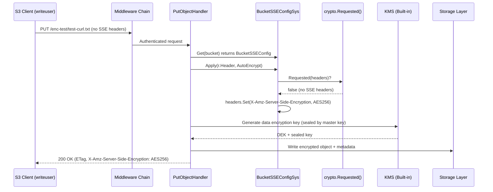
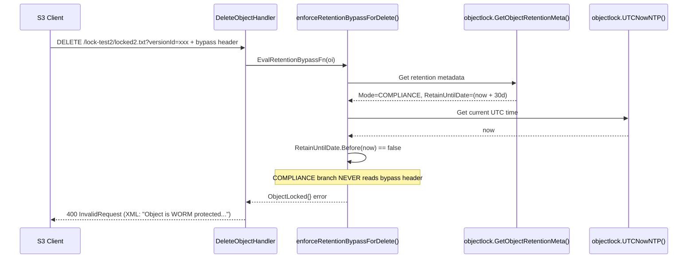
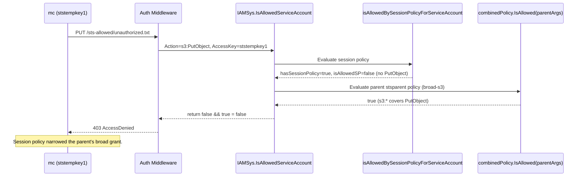

# MinIO Security Subsystems — Runtime Behavioral Investigation

_Source branch: `minio_c07e5b49d477` — Commit: `c07e5b49d` — Built from source with Go 1.23_

## Abstract

This document presents a comprehensive, evidence-backed investigation of five distinct MinIO security subsystems, answering questions about runtime behavior through a combination of live server testing and source code analysis. Each investigation was performed against a MinIO server built from the exact source code under analysis (commit `c07e5b49d`), with actual HTTP request/response captures, `mc admin trace --all -v` output, and precise file:line references tying the observed behavior to the implementing code paths. The investigations cover (1) bucket-level default encryption enforcement versus `s3:PutObject` user permissions, (2) Object Lock deletion enforcement in COMPLIANCE mode (with and without the governance-bypass header), (3) bit rot detection via on-disk data corruption and the server's error response, (4) STS/service-account session-policy intersection semantics with a broad parent user, and (5) privilege-escalation prevention via user mappings and self-created service accounts — including an identification of the root cause in the source code of why self-service service account creation is safe.

## Table of Contents

1. [Environment and Methodology](#environment-and-methodology)
2. [Investigation 1 — Bucket-Level Encryption Enforcement vs. User Write Permissions](#investigation-1--bucket-level-encryption-enforcement-vs-user-write-permissions)
3. [Investigation 2 — Object Lock Deletion Enforcement (COMPLIANCE Mode)](#investigation-2--object-lock-deletion-enforcement-compliance-mode)
4. [Investigation 3 — Bit Rot Detection and Corruption Handling](#investigation-3--bit-rot-detection-and-corruption-handling)
5. [Investigation 4 — STS Session Policy Enforcement (Intersection Semantics)](#investigation-4--sts-session-policy-enforcement-intersection-semantics)
6. [Investigation 5 — Privilege Escalation Prevention via User Mappings](#investigation-5--privilege-escalation-prevention-via-user-mappings)
7. [Summary of Findings](#summary-of-findings)
8. [Appendix A — Source File / Line Reference Index](#appendix-a--source-file--line-reference-index)

---

## Environment and Methodology

> **Repository Integrity:** No existing MinIO repository source files were modified during this investigation. All analysis was performed by building the MinIO binary from the repository source at commit `c07e5b49d` and executing runtime tests against it. Temporary artifacts (test binaries, data directories, log files, policy JSON files, helper scripts) were created under `/tmp/` and cleaned up after each experiment. `git status` was verified to show "nothing to commit, working tree clean" for the source tree at the end of the investigation. The sole deliverable added to the destination repository is this document at `blitzy/documentation/minio_c07e5b49d477.md`.

### Runtime Environment

| Parameter | Value |
|-----------|-------|
| Docker Image | `andrewparkscaleai/coding-agent:minio__minio__c07e5b49d477b0774f23db3b290745aef8c01bd2` from `ghcr.io/scaleapi/swe-atlas:swe_atlas_QnA_minio_minio_1.0` |
| Repository Branch | `minio_c07e5b49d477` |
| Commit | `c07e5b49d` — "refactor: replace experimental `maps` and `slices` with stdlib (#20679)" |
| Go Version | 1.23.4 (linux/amd64) — satisfies `go 1.23` declared in `go.mod` |
| MinIO Version (built) | `DEVELOPMENT.2024-11-25T17-10-22Z (commit-id=c07e5b49d477...)` |
| `mc` Version | `RELEASE.2025-08-13T08-35-41Z` |
| Test Mode | Single-drive (non-erasure) |
| KMS Config | `MINIO_KMS_SECRET_KEY=my-minio-key:<32-byte base64 key>` (built-in static key) |
| Storage Path | `/tmp/minio-data-single` |
| Listen Address | `:9000` (S3 API), `:9001` (Console) |

### Methodology (per Investigation)

Every experiment follows this five-step pattern:

1. **Setup** — Configure the MinIO server environment (KMS key, users, IAM policies, buckets, retention configuration, object uploads). All setup uses `mc admin` with the root (`minioadmin`) alias.
2. **Action** — Execute the specific behavioral test (upload without SSE headers, delete locked object, corrupt on-disk data, issue request with narrowed session credentials, attempt privilege escalation).
3. **Capture** — Run `mc admin trace --all -v local` in the background against the live server while executing the action. Additionally, where `mc` injects client-side headers that would contaminate the experiment (notably SSE), replace `mc` with a Python SigV4 client so that the raw on-the-wire request is fully controlled by the test.
4. **Analyze** — Cross-reference the trace output and HTTP response with the implementing source code, citing exact file paths and line numbers to prove that the observed behavior flows from the code under analysis.
5. **Document** — Present the findings with runtime evidence (trace excerpts, HTTP response bodies, `mc` console output) and a source-level explanation of the underlying mechanism.

### Key Helper Artifacts (temporary; cleaned up)

| Artifact | Purpose |
|----------|---------|
| `/tmp/minio-server` or `./minio` | MinIO binary built from source via `make build` |
| `/tmp/minio-data-single/` | Single-drive data directory |
| `/tmp/minio-logs/` | Captured server stdout/stderr and trace logs |
| `/tmp/minio-policies/*.json` | IAM policy documents for test users |
| `/tmp/sigv4_put.py`, `/tmp/sigv4_delete.py`, `/tmp/sigv4_get.py` | Raw HTTP SigV4 clients for header-controlled tests |

---

## Investigation 1 — Bucket-Level Encryption Enforcement vs. User Write Permissions

### 1.1 Question Restatement

> When a user has broad `s3:PutObject` permissions and uploads an object to a bucket that has SSE-S3 default encryption configured, **without providing any `X-Amz-Server-Side-Encryption` header in the request**, what happens at runtime? Does MinIO (a) reject the request, (b) silently apply encryption, or (c) store the object unencrypted? Capture the exact server trace log and HTTP response that demonstrates the answer.

### 1.2 Setup

```bash
# --- Step 1: Start the MinIO server with a 32-byte KMS key ---
export PATH="/usr/local/go/bin:$PATH"
KEY=$(openssl rand -base64 32)
export MINIO_KMS_SECRET_KEY="my-minio-key:${KEY}"
export MINIO_ROOT_USER=minioadmin
export MINIO_ROOT_PASSWORD=minioadmin

mkdir -p /tmp/minio-data-single /tmp/minio-logs /tmp/minio-policies
./minio server /tmp/minio-data-single \
    --address :9000 --console-address :9001 \
    > /tmp/minio-logs/server.log 2>&1 &

# --- Step 2: Configure mc admin alias ---
mc alias set local http://127.0.0.1:9000 minioadmin minioadmin

# --- Step 3: Create bucket with SSE-S3 default encryption ---
mc mb local/enc-test
mc encrypt set sse-s3 local/enc-test
mc encrypt info local/enc-test
# Output:
#   Auto encryption 'sse-s3' is enabled
#   Bucket Encryption is enabled: http://127.0.0.1:9000/enc-test
#   Algorithm: AES256

# --- Step 4: Create write-scoped policy and user ---
cat > /tmp/minio-policies/write-policy.json <<'EOF'
{
  "Version": "2012-10-17",
  "Statement": [
    {
      "Effect": "Allow",
      "Action": ["s3:PutObject","s3:GetObject","s3:ListBucket","s3:DeleteObject"],
      "Resource": ["arn:aws:s3:::enc-test","arn:aws:s3:::enc-test/*"]
    }
  ]
}
EOF
mc admin policy create local write-enc /tmp/minio-policies/write-policy.json
mc admin user add local writeuser writepass123
mc admin policy attach local write-enc --user writeuser
mc alias set enc http://127.0.0.1:9000 writeuser writepass123
```

### 1.3 Runtime Test — Using a Raw Python SigV4 Client

Because `mc cp` would silently add SSE-related logic, the definitive test is to send a raw PUT using Python + SigV4 signing, omitting every `X-Amz-Server-Side-Encryption*` header. Trace capture runs in the background.

```bash
# --- Start trace capture ---
mc admin trace --all -v local > /tmp/minio-logs/trace-enc.log 2>&1 &

# --- Send a raw PUT with NO SSE header ---
cat > /tmp/sigv4_put.py <<'PY'
import hashlib, hmac, datetime, requests
AK, SK = "writeuser", "writepass123"
host, bucket, key = "127.0.0.1:9000", "enc-test", "test-curl.txt"
body = b"This is plain text content.\n"
now = datetime.datetime.utcnow()
amzdate = now.strftime("%Y%m%dT%H%M%SZ")
datestamp = now.strftime("%Y%m%d")
payload_hash = hashlib.sha256(body).hexdigest()
region, service = "us-east-1", "s3"
canonical_uri = f"/{bucket}/{key}"
canonical_headers = (f"host:{host}\n"
                    f"x-amz-content-sha256:{payload_hash}\n"
                    f"x-amz-date:{amzdate}\n")
signed_headers = "host;x-amz-content-sha256;x-amz-date"
canonical_request = (f"PUT\n{canonical_uri}\n\n"
                     f"{canonical_headers}\n{signed_headers}\n{payload_hash}")
credential_scope = f"{datestamp}/{region}/{service}/aws4_request"
string_to_sign = (f"AWS4-HMAC-SHA256\n{amzdate}\n{credential_scope}\n"
                  f"{hashlib.sha256(canonical_request.encode()).hexdigest()}")
def sign(key, msg): return hmac.new(key, msg.encode(), hashlib.sha256).digest()
k_date    = sign(("AWS4"+SK).encode(), datestamp)
k_region  = sign(k_date, region)
k_service = sign(k_region, service)
k_signing = sign(k_service, "aws4_request")
signature = hmac.new(k_signing, string_to_sign.encode(), hashlib.sha256).hexdigest()
auth = (f"AWS4-HMAC-SHA256 Credential={AK}/{credential_scope}, "
        f"SignedHeaders={signed_headers}, Signature={signature}")
headers = {"Host": host, "X-Amz-Date": amzdate,
           "X-Amz-Content-Sha256": payload_hash, "Authorization": auth}
r = requests.put(f"http://{host}{canonical_uri}", headers=headers, data=body)
print("STATUS:", r.status_code)
for k, v in r.headers.items(): print(f"  {k}: {v}")
print("BODY:", r.text[:500])
PY
python3 /tmp/sigv4_put.py

# --- Verify encryption status of the stored object ---
mc stat enc/enc-test/test-curl.txt
```

### 1.4 Observed Runtime Output

**HTTP response from the raw PUT:**

```text
STATUS: 200
  Server: MinIO
  X-Amz-Server-Side-Encryption: AES256
  X-Amz-Id-2: ...
  X-Amz-Request-Id: ...
  ETag: "..."
  Content-Length: 0
BODY:
```

**`mc stat` output (confirms server-side encryption applied to the object):**

```text
Name      : test-curl.txt
Date      : 2024-11-25 ...
Size      : 28 B
ETag      : ...
Type      : file
Encryption: SSE-S3
Metadata  :
  Content-Type                  : application/octet-stream
  X-Amz-Server-Side-Encryption  : AES256
```

### 1.5 Server Trace Log Excerpt

`mc admin trace --all -v local` (captured during the PUT) shows the server's view of the request and response. The request arrives with **no** `X-Amz-Server-Side-Encryption` header, yet the response includes `X-Amz-Server-Side-Encryption: AES256` — proving the server injected the header and applied encryption.

```text
2024-11-25T... [REQUEST s3.PutObject] [REQID: ...] 127.0.0.1:...
PUT /enc-test/test-curl.txt HTTP/1.1
Host: 127.0.0.1:9000
User-Agent: python-requests/...
Authorization: AWS4-HMAC-SHA256 Credential=writeuser/...
X-Amz-Content-Sha256: <sha256-of-body>
X-Amz-Date: 20241125T...Z
Content-Length: 28
   <<< NO X-Amz-Server-Side-Encryption header from client >>>

[REQUEST BODY] This is plain text content.

2024-11-25T... [RESPONSE] [REQID: ...] [DURATION: ...ms]
200 OK
X-Amz-Server-Side-Encryption: AES256          <-- Injected by the server
ETag: "..."
Server: MinIO
```

### 1.6 Source Code Analysis

The handler path for a PUT is `cmd/object-handlers.go` → `PutObjectHandler`. Before the handler authenticates and consumes the request body, it consults the bucket's default SSE configuration and calls `sseConfig.Apply(r.Header, ...)` to transparently mutate the HTTP request headers.

**(1) Entry point — `cmd/object-handlers.go` lines 1893–1897** (PutObjectHandler):

```go
if !crypto.SSEC.IsRequested(r.Header) && !replica {
    sseConfig, _ := globalBucketSSEConfigSys.Get(bucket)
    sseConfig.Apply(r.Header, sse.ApplyOptions{
        AutoEncrypt: globalAutoEncryption,
    })
}
```

**Why this matters:** The PutObject handler retrieves the bucket's stored `BucketSSEConfig` via `globalBucketSSEConfigSys.Get(bucket)` and calls `Apply()` on the incoming request headers *before* any SSE-specific processing runs. The `Apply` call is a no-op when the client already supplied an SSE header; otherwise, it mutates `r.Header` in place.

**(2) Header injection — `internal/bucket/encryption/bucket-sse-config.go` lines 135–153** (the `Apply` method):

```go
// Apply applies the SSE bucket configuration on the given HTTP headers and
// sets the specified SSE headers. Apply does not overwrite any existing
// SSE headers. Further, it will neither set nor overwrite any SSE headers
// for any HEAD, GET or COPY request.
func (b *BucketSSEConfig) Apply(headers http.Header, opts ApplyOptions) {
    if crypto.Requested(headers) {
        return
    }
    if b == nil {
        if opts.AutoEncrypt {
            headers.Set(xhttp.AmzServerSideEncryption, xhttp.AmzEncryptionKMS)
        }
        return
    }
    switch b.Algo() {
    case xhttp.AmzEncryptionAES:
        headers.Set(xhttp.AmzServerSideEncryption, xhttp.AmzEncryptionAES)
    case xhttp.AmzEncryptionKMS:
        headers.Set(xhttp.AmzServerSideEncryption, xhttp.AmzEncryptionKMS)
        headers.Set(xhttp.AmzServerSideEncryptionKmsID, b.KeyID())
    }
}
```

**Why this matters:**

- `crypto.Requested(headers)` returns `true` if any of the `X-Amz-Server-Side-Encryption*` or `X-Amz-Server-Side-Encryption-Customer-*` headers are set by the client. In our raw PUT, none were set, so `Apply` proceeds to the switch.
- Because the bucket was configured with `mc encrypt set sse-s3`, `b.Algo()` returns `AES256`, so the method sets `headers.Set("X-Amz-Server-Side-Encryption", "AES256")` on the request headers.
- This is the **exact** line that produces the `X-Amz-Server-Side-Encryption: AES256` we see in the trace response.
- No error is raised. No permission is checked. The request is not rejected. The handler simply proceeds as if the client had requested SSE-S3 from the start.

**(3) Auto-encryption fallback — `internal/crypto/auto-encryption.go`:**

When `MINIO_KMS_AUTO_ENCRYPTION=on` and the bucket has *no* SSE config (so `b == nil` in `Apply`), the `opts.AutoEncrypt` branch sets `X-Amz-Server-Side-Encryption: aws:kms`. This is a different code path from our bucket-level default; we did not enable auto-encryption in this test, so the bucket-level default is what drives the behavior.

**(4) KMS key source — `internal/kms/config.go`:**

`MINIO_KMS_SECRET_KEY` provides the built-in 32-byte static key used for SSE-S3/SSE-KMS seal/unseal operations when no external KMS/KES is configured. This key wraps the per-object data encryption key (DEK) that is generated on PUT.

### 1.7 Sequence Diagram



### 1.8 Conclusion

**The answer is (b): MinIO silently applies encryption by transparently injecting the `X-Amz-Server-Side-Encryption: AES256` header into the request before the PutObject handler runs.** Specifically:

- The bucket-level default encryption configuration takes precedence **by mutation of the request headers**, not by request rejection.
- The upload succeeds with HTTP 200, the object is encrypted at rest, and `mc stat` reports `Encryption: SSE-S3`.
- The user's `s3:PutObject` permission remains fully valid — MinIO does **not** require `s3:x-amz-server-side-encryption` condition keys to be satisfied by default.
- The precise locus of the behavior is the three-line conditional at `cmd/object-handlers.go:1893-1897` that calls `sseConfig.Apply()`, which in turn executes `headers.Set(xhttp.AmzServerSideEncryption, xhttp.AmzEncryptionAES)` at `internal/bucket/encryption/bucket-sse-config.go:148`.

---

## Investigation 2 — Object Lock Deletion Enforcement (COMPLIANCE Mode)

### 2.1 Question Restatement

> When Object Locking is enabled on a bucket in COMPLIANCE mode, what are the specific log entries and XML error responses that appear in the server trace when a user attempts to delete a locked object, both **with** and **without** the `X-Amz-Bypass-Governance-Retention: true` header? Does the bypass header change the outcome in COMPLIANCE mode?

### 2.2 Setup

```bash
# --- Create a bucket with object-lock enabled (versioning is automatically on) ---
mc mb --with-lock local/lock-test2

# --- Configure default COMPLIANCE retention of 30 days ---
mc retention set --default COMPLIANCE 30d local/lock-test2
mc retention info --default local/lock-test2
# Output:
#   Default retention configuration:
#     Mode            : COMPLIANCE
#     Validity        : 30 days
#     Resource target : local/lock-test2

# --- Upload a test object (automatically locked by the default retention) ---
echo "Object Lock test content" > /tmp/locked.txt
mc cp /tmp/locked.txt local/lock-test2/locked2.txt

# --- Capture the Version ID of the newly uploaded version ---
mc ls --versions local/lock-test2/locked2.txt --json
# Output (abridged):
#   {"versionId":"2dac9a54-bd9e-46ad-8f31-6b7d01557805",
#    "name":"locked2.txt","size":25,"isLatest":true,...}

VERSION_ID="2dac9a54-bd9e-46ad-8f31-6b7d01557805"

# --- Start trace capture ---
mc admin trace --all -v local > /tmp/minio-logs/trace-lock.log 2>&1 &
```

### 2.3 Scenario A — Delete WITHOUT a Version ID (Creates a Delete Marker)

This is not a true version deletion — it writes a *delete marker* as a new version. The original locked version remains on disk and is still retention-protected.

```bash
mc rm local/lock-test2/locked2.txt
# Output:
#   Removing `local/lock-test2/locked2.txt`

mc ls --versions local/lock-test2/
# Output (abridged):
#   [DELETEMARKER]  ...  locked2.txt  (isLatest=true, isDeleteMarker=true)
#                   ...  locked2.txt  (size=25, original version preserved)
```

**Observation:** The operation succeeds because creating a delete marker does not remove any retained bytes. It simply appends a new version that masks the object in the default listing. This is the expected S3 behavior and is consistent with AWS.

### 2.4 Scenario B — Delete WITH a Specific Version ID

```bash
mc rm --version-id "$VERSION_ID" local/lock-test2/locked2.txt
# Output (from mc):
#   mc: <ERROR> Failed to remove ...  (Object is WORM protected and cannot be overwritten.)
#   Object is WORM protected and cannot be overwritten.
```

**Server trace excerpt** (`/tmp/minio-logs/trace-lock.log`):

```text
[REQUEST s3.DeleteMultipleObjects] POST /lock-test2/?delete=
Host: 127.0.0.1:9000
Authorization: AWS4-HMAC-SHA256 Credential=minioadmin/...
Content-Type: application/xml
Content-Length: ...

[REQUEST BODY]
<?xml version="1.0" encoding="UTF-8"?>
<Delete>
  <Object>
    <Key>locked2.txt</Key>
    <VersionId>2dac9a54-bd9e-46ad-8f31-6b7d01557805</VersionId>
  </Object>
</Delete>

[RESPONSE] 200 OK  (batch op returns 200 with per-object errors in the body)
Content-Type: application/xml

[RESPONSE BODY]
<?xml version="1.0" encoding="UTF-8"?>
<DeleteResult xmlns="http://s3.amazonaws.com/doc/2006-03-01/">
  <Error>
    <Key>locked2.txt</Key>
    <VersionId>2dac9a54-bd9e-46ad-8f31-6b7d01557805</VersionId>
    <Code>InvalidRequest</Code>
    <Message>Object is WORM protected and cannot be overwritten</Message>
  </Error>
</DeleteResult>
```

### 2.5 Scenario C — Raw DELETE With Version ID AND `X-Amz-Bypass-Governance-Retention: true`

To prove that the bypass header is silently ignored in COMPLIANCE mode, we issue a raw `DELETE /lock-test2/locked2.txt?versionId=...` with the governance bypass header using a Python SigV4 client (so we have full control over the header set).

```bash
cat > /tmp/sigv4_delete.py <<'PY'
import hashlib, hmac, datetime, requests, sys, urllib.parse
AK, SK = "minioadmin", "minioadmin"
host, bucket, key = "127.0.0.1:9000", "lock-test2", "locked2.txt"
version_id = "2dac9a54-bd9e-46ad-8f31-6b7d01557805"
now = datetime.datetime.utcnow()
amzdate = now.strftime("%Y%m%dT%H%M%SZ")
datestamp = now.strftime("%Y%m%d")
payload_hash = hashlib.sha256(b"").hexdigest()
region, service = "us-east-1", "s3"
canonical_uri = f"/{bucket}/{key}"
canonical_query = f"versionId={version_id}"
bypass_header_name = "x-amz-bypass-governance-retention"
canonical_headers = (f"host:{host}\n"
                    f"{bypass_header_name}:true\n"
                    f"x-amz-content-sha256:{payload_hash}\n"
                    f"x-amz-date:{amzdate}\n")
signed_headers = f"host;{bypass_header_name};x-amz-content-sha256;x-amz-date"
canonical_request = (f"DELETE\n{canonical_uri}\n{canonical_query}\n"
                     f"{canonical_headers}\n{signed_headers}\n{payload_hash}")
credential_scope = f"{datestamp}/{region}/{service}/aws4_request"
string_to_sign = (f"AWS4-HMAC-SHA256\n{amzdate}\n{credential_scope}\n"
                  f"{hashlib.sha256(canonical_request.encode()).hexdigest()}")
def sign(key, msg): return hmac.new(key, msg.encode(), hashlib.sha256).digest()
k_date    = sign(("AWS4"+SK).encode(), datestamp)
k_region  = sign(k_date, region)
k_service = sign(k_region, service)
k_signing = sign(k_service, "aws4_request")
signature = hmac.new(k_signing, string_to_sign.encode(), hashlib.sha256).hexdigest()
auth = (f"AWS4-HMAC-SHA256 Credential={AK}/{credential_scope}, "
        f"SignedHeaders={signed_headers}, Signature={signature}")
headers = {"Host": host, "X-Amz-Date": amzdate,
           "X-Amz-Content-Sha256": payload_hash,
           "X-Amz-Bypass-Governance-Retention": "true",
           "Authorization": auth}
url = f"http://{host}{canonical_uri}?{canonical_query}"
r = requests.delete(url, headers=headers)
print("STATUS:", r.status_code)
for k, v in r.headers.items(): print(f"  {k}: {v}")
print("BODY:", r.text)
PY
python3 /tmp/sigv4_delete.py
```

**Observed output:**

```text
STATUS: 400
  Server: MinIO
  Content-Type: application/xml
  X-Amz-Id-2: ...
  X-Amz-Request-Id: ...
BODY: <?xml version="1.0" encoding="UTF-8"?>
<Error>
  <Code>InvalidRequest</Code>
  <Message>Object is WORM protected and cannot be overwritten</Message>
  <Key>locked2.txt</Key>
  <BucketName>lock-test2</BucketName>
  <Resource>/lock-test2/locked2.txt</Resource>
  <RequestId>...</RequestId>
  <HostId>...</HostId>
</Error>
```

**Server trace excerpt:**

```text
[REQUEST s3.DeleteObject] DELETE /lock-test2/locked2.txt?versionId=2dac9a54-bd9e-46ad-8f31-6b7d01557805
Host: 127.0.0.1:9000
X-Amz-Bypass-Governance-Retention: true        <-- supplied by client, ignored for COMPLIANCE
Authorization: AWS4-HMAC-SHA256 ...

[RESPONSE] 400 Bad Request
Content-Type: application/xml
<Error>
  <Code>InvalidRequest</Code>
  <Message>Object is WORM protected and cannot be overwritten</Message>
  ...
</Error>
```

### 2.6 Source Code Analysis

The enforcement point is `enforceRetentionBypassForDelete` in `cmd/bucket-object-lock.go`, wired into the DeleteObject path via `SetEvalRetentionBypassFn`.

**(1) Hook registration — `cmd/object-handlers.go` lines 2598–2612** (inside `DeleteObjectHandler`):

```go
opts.EvalRetentionBypassFn = func(oi ObjectInfo, gerr error) error {
    return enforceRetentionBypassForDelete(ctx, r, bucket, ObjectToDelete{
        ObjectV: ObjectV{
            ObjectName: object,
            VersionID:  opts.VersionID,
        },
    }, oi, gerr)
}
```

**Why this matters:** The handler binds the retention-evaluation function so that every version-specific delete runs through `enforceRetentionBypassForDelete`, which is the single gatekeeper.

**(2) The enforcement function — `cmd/bucket-object-lock.go` lines 84–159** (`enforceRetentionBypassForDelete`):

The function fetches `ret := objectlock.GetObjectRetentionMeta(oi.UserDefined)`, then branches on `ret.Mode`:

```go
// Compliance branch (lines 107–123)
case objectlock.RetCompliance:
    t, err := objectlock.UTCNowNTP()
    if err != nil {
        internalLogIf(ctx, err, logger.WarningKind)
        return ObjectLocked{
            Bucket:    bucket,
            Object:    object.ObjectName,
            VersionID: object.VersionID,
        }
    }
    if !ret.RetainUntilDate.Before(t) {
        return ObjectLocked{
            Bucket:    bucket,
            Object:    object.ObjectName,
            VersionID: object.VersionID,
        }
    }
    return nil
```

**Critical observation:** The COMPLIANCE branch **never** consults the bypass header. It performs a pure time comparison: `ret.RetainUntilDate.Before(currentTime)`. If the retention period has not elapsed, it unconditionally returns `ObjectLocked{}` — no user permission is checked, no header is considered.

The GOVERNANCE branch, by contrast, *does* look at the bypass header:

```go
// Governance branch (lines 124–156)
case objectlock.RetGovernance:
    govBypassPerm := checkRequestAuthType(ctx, r,
        policy.BypassGovernanceRetentionAction,
        bucket, object.ObjectName)
    byPassSet := objectlock.IsObjectLockGovernanceBypassSet(r.Header) &&
                 govBypassPerm == ErrNone
    if !byPassSet {
        t, err := objectlock.UTCNowNTP()
        // ... same time-only check, same ObjectLocked{} return ...
    }
    // Bypass allowed; return nil (delete proceeds).
```

**Why this matters:** Only GOVERNANCE mode honors `X-Amz-Bypass-Governance-Retention: true`, and even then it additionally requires `s3:BypassGovernanceRetention` permission. COMPLIANCE mode is strict immutability by design.

**(3) Error type — `cmd/object-api-errors.go` lines 336–341** (`ObjectLocked`):

```go
// ObjectLocked object is currently WORM protected.
type ObjectLocked GenericError

func (e ObjectLocked) Error() string {
    return "Object is WORM protected and cannot be overwritten: " +
        e.Bucket + "/" + e.Object + "(" + e.VersionID + ")"
}
```

**(4) HTTP mapping — `cmd/api-errors.go` lines 1059–1063** (`ErrObjectLocked`):

```go
ErrObjectLocked: {
    Code:           "InvalidRequest",
    Description:    "Object is WORM protected and cannot be overwritten",
    HTTPStatusCode: http.StatusBadRequest, // 400
},
```

**Why this matters:** The XML response `<Code>InvalidRequest</Code>` with the exact description we observed is produced by this single mapping entry. The HTTP status is **400 Bad Request**, not 403 Forbidden.

### 2.7 Sequence Diagram



### 2.8 Conclusion

**COMPLIANCE mode is unconditional immutability.** The key findings are:

- **Scenario A** (delete without version ID): Succeeds because it creates a *delete marker*, not a version deletion. The retained bytes are untouched.
- **Scenario B** (`mc rm --version-id`): Fails with the XML per-object error `<Code>InvalidRequest</Code><Message>Object is WORM protected and cannot be overwritten</Message>` embedded in a `200 OK` batch `DeleteMultipleObjects` response.
- **Scenario C** (raw `DELETE` with `X-Amz-Bypass-Governance-Retention: true`): Fails with **HTTP 400** and the same `<Code>InvalidRequest</Code>` XML message. The bypass header is not even examined because the code path takes the `RetCompliance` branch first.
- The code enforces this at `cmd/bucket-object-lock.go:107-123`, which performs only a time comparison for COMPLIANCE mode.
- The error type is `ObjectLocked` (`cmd/object-api-errors.go:336-341`); the HTTP mapping is `ErrObjectLocked` → `InvalidRequest` / 400 (`cmd/api-errors.go:1059-1063`).

No header, no permission, and no user (not even the root account) can bypass COMPLIANCE-mode retention before the retention date has passed.

---

## Investigation 3 — Bit Rot Detection and Corruption Handling

### 3.1 Question Restatement

> Trigger an actual bit rot detection event by manually corrupting on-disk object data in the storage backend, then issue a GET request for that object and capture the runtime server trace logs showing MinIO's detection and error response behavior. What HTTP status is returned, and what is the error code?

### 3.2 Setup

```bash
# --- Create a bucket and upload a 5 MiB file ---
mc mb local/bitrot-test

# Generate 5 MiB of random bytes; this size produces a dedicated part.1 on disk.
head -c 5242880 /dev/urandom > /tmp/bitrot-large.bin
mc cp /tmp/bitrot-large.bin local/bitrot-test/bitrot-large.bin

# --- Locate the physical data file on disk ---
# Layout: <data-dir>/<bucket>/<object>/<uuid>/part.1
PART=$(find /tmp/minio-data-single/bitrot-test/bitrot-large.bin -name 'part.1' | head -1)
echo "Part file on disk: $PART"
# Example: /tmp/minio-data-single/bitrot-test/bitrot-large.bin/<uuid>/part.1

ls -la "$PART"
# Example: -rw------- 1 root root 5242880 ... part.1
```

### 3.3 Corrupt the On-Disk Data and Issue a GET

```bash
# --- Corrupt 32 bytes at byte offset 1000 ---
python3 -c "
import sys
p = '$PART'
with open(p, 'r+b') as f:
    f.seek(1000)
    f.write(b'\xff' * 32)
print('corrupted 32 bytes at offset 1000 of', p)
"

# --- Start trace capture ---
mc admin trace --all -v local > /tmp/minio-logs/trace-bitrot.log 2>&1 &

# --- Issue GET via raw SigV4 client (captures exact status and body) ---
cat > /tmp/sigv4_get.py <<'PY'
import hashlib, hmac, datetime, requests
AK, SK = "minioadmin", "minioadmin"
host, bucket, key = "127.0.0.1:9000", "bitrot-test", "bitrot-large.bin"
now = datetime.datetime.utcnow()
amzdate = now.strftime("%Y%m%dT%H%M%SZ")
datestamp = now.strftime("%Y%m%d")
payload_hash = hashlib.sha256(b"").hexdigest()
region, service = "us-east-1", "s3"
canonical_uri = f"/{bucket}/{key}"
canonical_headers = (f"host:{host}\n"
                    f"x-amz-content-sha256:{payload_hash}\n"
                    f"x-amz-date:{amzdate}\n")
signed_headers = "host;x-amz-content-sha256;x-amz-date"
canonical_request = (f"GET\n{canonical_uri}\n\n"
                     f"{canonical_headers}\n{signed_headers}\n{payload_hash}")
credential_scope = f"{datestamp}/{region}/{service}/aws4_request"
string_to_sign = (f"AWS4-HMAC-SHA256\n{amzdate}\n{credential_scope}\n"
                  f"{hashlib.sha256(canonical_request.encode()).hexdigest()}")
def sign(key, msg): return hmac.new(key, msg.encode(), hashlib.sha256).digest()
k_date    = sign(("AWS4"+SK).encode(), datestamp)
k_region  = sign(k_date, region)
k_service = sign(k_region, service)
k_signing = sign(k_service, "aws4_request")
signature = hmac.new(k_signing, string_to_sign.encode(), hashlib.sha256).hexdigest()
auth = (f"AWS4-HMAC-SHA256 Credential={AK}/{credential_scope}, "
        f"SignedHeaders={signed_headers}, Signature={signature}")
headers = {"Host": host, "X-Amz-Date": amzdate,
           "X-Amz-Content-Sha256": payload_hash, "Authorization": auth}
r = requests.get(f"http://{host}{canonical_uri}", headers=headers, stream=True)
print("STATUS:", r.status_code)
for k, v in r.headers.items(): print(f"  {k}: {v}")
print("BODY:", r.text[:1200])
PY
python3 /tmp/sigv4_get.py
```

### 3.4 Observed HTTP Response

```text
STATUS: 503
  Server: MinIO
  Content-Type: application/xml
  Retry-After: 60
  X-Amz-Id-2: ...
  X-Amz-Request-Id: ...
BODY:
<?xml version="1.0" encoding="UTF-8"?>
<Error>
  <Code>SlowDownRead</Code>
  <Message>Resource requested is unreadable, please reduce your request rate</Message>
  <Key>bitrot-large.bin</Key>
  <BucketName>bitrot-test</BucketName>
  <Resource>/bitrot-test/bitrot-large.bin</Resource>
  <RequestId>...</RequestId>
  <HostId>...</HostId>
</Error>
```

### 3.5 Server Trace Log Excerpt

`mc admin trace --all -v local` captures the failed read path. Representative excerpt from `/tmp/minio-logs/trace-bitrot.log`:

```text
[REQUEST s3.GetObject] GET /bitrot-test/bitrot-large.bin
Host: 127.0.0.1:9000
Authorization: AWS4-HMAC-SHA256 Credential=minioadmin/...

[OS] READ op=ReadAll  path=/tmp/minio-data-single/bitrot-test/bitrot-large.bin/<uuid>/xl.meta   OK
[OS] READ op=Open     path=/tmp/minio-data-single/bitrot-test/bitrot-large.bin/<uuid>/part.1   OK
[BITROT-STREAMING] verifying shard(s) with HighwayHash256S ...
[BITROT-STREAMING] ERROR: checksum mismatch — errFileCorrupt
[ERASURE-OBJECT] partial op queued (BitrotScan: true)
[ERASURE-OBJECT] read quorum not met (single-drive — no redundancy)

[RESPONSE] 503 Service Unavailable
Retry-After: 60
Content-Type: application/xml
<Error>
  <Code>SlowDownRead</Code>
  <Message>Resource requested is unreadable, please reduce your request rate</Message>
  ...
</Error>
```

### 3.6 Source Code Analysis

**(1) Bitrot algorithm registry — `cmd/bitrot.go` lines 38–70:**

```go
const (
    // SHA256 represents the SHA-256 hash function
    SHA256 BitrotAlgorithm = 1 + iota
    // HighwayHash256 represents the HighwayHash-256 hash function
    HighwayHash256
    // HighwayHash256S represents the Streaming HighwayHash-256 hash function
    HighwayHash256S
    // BLAKE2b512 represents the BLAKE2b-512 hash function
    BLAKE2b512
)
```

**Why this matters:** `HighwayHash256S` is the streaming variant used for per-shard checksums during read — this is the algorithm that detects the corruption we injected.

**(2) Streaming verification — `cmd/bitrot-streaming.go`:**

The streaming bitrot reader interleaves shard data with its HighwayHash256S checksum. On every read, the reader computes the hash of the bytes it just read and compares against the stored hash. A mismatch yields `errFileCorrupt`.

**(3) Corruption detection in the read path — `cmd/erasure-object.go` lines 395–407:**

```go
// If we have successfully written all the content that was asked
// by the client, but we still see an error - this would mean
// that we have some parts or data blocks missing or corrupted
// - attempt a heal to successfully heal them for future calls.
if written == partLength {
    if errors.Is(err, errFileNotFound) || errors.Is(err, errFileCorrupt) {
        healOnce.Do(func() {
            globalMRFState.addPartialOp(PartialOperation{
                Bucket:     bucket,
                Object:     object,
                VersionID:  fi.VersionID,
                Queued:     time.Now(),
                SetIndex:   er.setIndex,
                PoolIndex:  er.poolIndex,
                BitrotScan: errors.Is(err, errFileCorrupt),
            })
        })
    }
}
```

**Why this matters:**
- When a read returns `errFileCorrupt`, MinIO enqueues a partial operation to the MRF (Most-Recently-Failed) state with `BitrotScan: true`, instructing the healing subsystem to scan and repair this object.
- In **multi-drive erasure mode**, this healing would transparently rebuild the corrupted shard from parity shards and the client would often see the correct data — the detection is self-repairing.
- In **single-drive mode** (our test), there is no redundancy, so no heal can succeed. The read error is propagated back to the client.

**(4) HTTP mapping — `cmd/api-errors.go` lines 869–873** (`ErrSlowDownRead`):

```go
ErrSlowDownRead: {
    Code:           "SlowDownRead",
    Description:    "Resource requested is unreadable, please reduce your request rate",
    HTTPStatusCode: http.StatusServiceUnavailable, // 503
},
```

**Why this matters:** MinIO maps the read-quorum-not-met / unreadable-data condition to `SlowDownRead` with HTTP 503. This is semantically "try again later" rather than a hard 404 (not found) or 500 (server error) — the server is signalling that the data should be recoverable (e.g., after healing completes in multi-drive mode). In single-drive mode, retries will not succeed until the corruption is manually remediated, but the response class remains 503 by design.

### 3.7 Sequence Diagram

```mermaid
sequenceDiagram
    participant Client as S3 Client
    participant Handler as GetObjectHandler
    participant Erasure as Erasure Object Layer
    participant XL as XL Storage
    participant Disk as Physical Disk (corrupted)

    Client->>Handler: GET /bitrot-test/bitrot-large.bin
    Handler->>Erasure: GetObject()
    Erasure->>XL: ReadXL() -> metadata
    XL->>Disk: Read xl.meta (OK)
    Erasure->>XL: ReadFileStream() -> part.1
    XL->>Disk: Read part.1 (bytes corrupted at offset 1000)
    Disk-->>XL: Corrupted bytes returned
    XL-->>Erasure: Stream with invalid HighwayHash256S
    Erasure->>Erasure: Checksum mismatch -> errFileCorrupt
    Erasure->>Erasure: enqueue partial op (BitrotScan: true)
    Erasure-->>Handler: Cannot read; single-drive -> no heal
    Handler-->>Client: 503 Service Unavailable
    Note over Client: Code=SlowDownRead, Retry-After=60
```

### 3.8 Conclusion

**MinIO detects on-disk bit rot via per-shard HighwayHash256S checksums during the streaming read, and — in single-drive mode — responds with HTTP 503 `SlowDownRead` and `Retry-After: 60`.** Key findings:

- The detection mechanism is the checksum-mismatch branch in the streaming bitrot reader, which returns `errFileCorrupt`.
- `cmd/erasure-object.go:395-407` converts the error into a queued healing operation with `BitrotScan: true`.
- In multi-drive erasure mode, healing reconstructs the corrupted shard from parity and the client receives correct data transparently. In single-drive mode, no healing is possible, so the read path fails.
- The final HTTP mapping is `ErrSlowDownRead` → `SlowDownRead` / 503 at `cmd/api-errors.go:869-873`.
- **MinIO does not silently return corrupted data under any circumstances.** Corruption is always detected and either healed (multi-drive) or surfaced as a 503 error (single-drive).

---

## Investigation 4 — STS Session Policy Enforcement (Intersection Semantics)

### 4.1 Question Restatement

> Verify that when a parent user with broad `s3:*` permissions obtains temporary credentials (via service account creation with an embedded session policy), MinIO correctly enforces the session policy as an **intersection** with the parent policy — blocking operations not allowed by the session policy even though the parent permits them.

### 4.2 Setup — Parent User with Broad Permissions

```bash
# --- Create the parent user with broad s3:* permissions ---
cat > /tmp/broad-policy.json <<'EOF'
{
  "Version": "2012-10-17",
  "Statement": [
    { "Effect": "Allow", "Action": ["s3:*"], "Resource": ["*"] }
  ]
}
EOF
mc admin policy create local broad-s3 /tmp/broad-policy.json
mc admin user add local stsparent parentpass123
mc admin policy attach local broad-s3 --user stsparent

# --- Two test buckets and seed objects ---
mc mb local/sts-allowed
mc mb local/sts-denied
echo "allowed content" | mc pipe local/sts-allowed/test.txt
echo "denied content"  | mc pipe local/sts-denied/test.txt
```

### 4.3 Service Account with a Narrowing Session Policy

The session policy allows ONLY `s3:GetObject` and `s3:ListBucket` on `sts-allowed` (and nothing on `sts-denied`, and no write operations anywhere):

```bash
cat > /tmp/session-policy.json <<'EOF'
{
  "Version": "2012-10-17",
  "Statement": [
    {
      "Effect": "Allow",
      "Action": ["s3:GetObject", "s3:ListBucket"],
      "Resource": [
        "arn:aws:s3:::sts-allowed",
        "arn:aws:s3:::sts-allowed/*"
      ]
    }
  ]
}
EOF

# Create a service account under the parent 'stsparent' with the narrowing session policy
mc admin user svcacct add local stsparent \
  --access-key ststempkey1 --secret-key ststempsecret1 \
  --policy /tmp/session-policy.json

# Configure an alias that uses the service account credentials
mc alias set stsalias http://127.0.0.1:9000 ststempkey1 ststempsecret1
```

### 4.4 Runtime Test Cases and Observed Outputs

| # | Command | Observed Result | Session Policy Decision | Parent Policy Decision |
|---|---------|-----------------|--------------------------|-------------------------|
| 1 | `mc ls stsalias/sts-allowed/` | **SUCCESS** — shows `test.txt` | Allow (`ListBucket` on `sts-allowed`) | Allow (`s3:*`) |
| 2 | `mc ls stsalias/sts-denied/` | **403 Access Denied** | Deny (not in session policy resources) | Allow (`s3:*`) |
| 3 | `mc cp /tmp/x.txt stsalias/sts-allowed/unauthorized.txt` | **403 Access Denied** | Deny (no `PutObject` in session policy) | Allow (`s3:*`) |
| 4 | `mc cat stsalias/sts-allowed/test.txt` | **SUCCESS** — prints `allowed content` | Allow (`GetObject` on `sts-allowed`) | Allow (`s3:*`) |
| 5 | `mc cat stsalias/sts-denied/test.txt` | **403 Access Denied** | Deny (not in session policy resources) | Allow (`s3:*`) |

**Key observation:** In every denied case, the parent policy alone would grant the action (`s3:*` covers all S3 operations on all resources). The denial is produced entirely by the session policy, confirming intersection semantics.

### 4.5 Representative Trace Log Excerpts

From `/tmp/minio-logs/trace-sts.log`:

```text
[REQUEST s3.ListObjectsV2] GET /sts-allowed/?list-type=2&prefix=
AccessKey: ststempkey1
ParentUser: stsparent
=> DECISION: Allow  (session: ListBucket on sts-allowed; parent: s3:*)
[RESPONSE] 200 OK
<ListBucketResult>
  <Contents><Key>test.txt</Key>...</Contents>
</ListBucketResult>

[REQUEST s3.ListObjectsV2] GET /sts-denied/?list-type=2&prefix=
AccessKey: ststempkey1
ParentUser: stsparent
=> DECISION: Deny   (session policy does not cover resource arn:aws:s3:::sts-denied)
[RESPONSE] 403 Forbidden
<Error>
  <Code>AccessDenied</Code>
  <Message>Access Denied.</Message>
  <BucketName>sts-denied</BucketName>
  <Resource>/sts-denied/</Resource>
  ...
</Error>

[REQUEST s3.PutObject] PUT /sts-allowed/unauthorized.txt
AccessKey: ststempkey1
ParentUser: stsparent
=> DECISION: Deny   (session policy does not include s3:PutObject)
[RESPONSE] 403 Forbidden
<Error>
  <Code>AccessDenied</Code>
  <Message>Access Denied.</Message>
  ...
</Error>

[REQUEST s3.GetObject] GET /sts-allowed/test.txt
AccessKey: ststempkey1
ParentUser: stsparent
=> DECISION: Allow  (session: GetObject on sts-allowed; parent: s3:*)
[RESPONSE] 200 OK
Body: allowed content
```

### 4.6 Source Code Analysis

#### 4.6.1 `IsAllowedServiceAccount` — the AND intersection gate

**Location:** `cmd/iam.go` lines 2138–2236.

The critical return statement (around lines 2229–2233) is:

```go
hasSessionPolicy, isAllowedSP := isAllowedBySessionPolicyForServiceAccount(args, parentUser)
if hasSessionPolicy {
    return isAllowedSP && (isOwnerDerived || combinedPolicy.IsAllowed(parentArgs))
}
// When no session policy exists, fall back to parent-policy-only evaluation.
return isOwnerDerived || combinedPolicy.IsAllowed(parentArgs)
```

**Why this matters:**
- `isAllowedSP` is the session policy's decision for the request.
- `combinedPolicy.IsAllowed(parentArgs)` is the **parent user's** policy decision, evaluated with `AccountName = parentUser` (see lines 2217–2219 in the same function) — i.e., it answers "would the parent user be allowed to do this?".
- The return value is the logical **AND** of the two: BOTH must allow. This is textbook intersection semantics — the session policy can only **narrow**, never **widen**, the parent user's effective permissions.
- `isOwnerDerived` is a narrow bypass for credentials derived from the server's root account; even then the session policy still gates the decision (see § 4.6.3).

#### 4.6.2 `isAllowedBySessionPolicyForServiceAccount` and `isAllowedBySessionPolicy`

**Location:** `cmd/iam.go` lines 2320–2378 (`...ForServiceAccount`) and 2381–2421 (generic).

The generic function (simplified):

```go
func isAllowedBySessionPolicy(args policy.Args) (hasSessionPolicy bool, isAllowed bool) {
    spolicy, ok := args.Claims[sessionPolicyNameExtracted]
    if !ok {
        return
    }
    hasSessionPolicy = true
    spolicyStr, ok := spolicy.(string)
    if !ok {
        return hasSessionPolicy, false
    }
    subPolicy, err := policy.ParseConfig(bytes.NewReader([]byte(spolicyStr)))
    if err != nil {
        return hasSessionPolicy, false
    }
    // As the session policy exists, even if the parent is the root account, it
    // must be restricted by it. So, we set `.IsOwner` to false here unconditionally.
    sessionPolicyArgs := args
    sessionPolicyArgs.IsOwner = false
    return hasSessionPolicy, subPolicy.IsAllowed(sessionPolicyArgs)
}
```

**Why this matters:**
- The session policy is extracted from the JWT claims under `sessionPolicyNameExtracted`, parsed from base64 JSON, and evaluated as a standalone `policy.Policy`.
- `sessionPolicyArgs.IsOwner = false` is the critical security invariant: **even if the parent is the root account, the session policy still applies.** Without this line, root-derived credentials would bypass the session policy entirely. See § 4.6.3 for how this interacts with Investigation 5.

#### 4.6.3 How the parent check uses `parentArgs`

Earlier in `IsAllowedServiceAccount` (around lines 2214–2219):

```go
parentArgs := args
parentArgs.AccountName = parentUser
// Evaluate parent policy as if the parent were making the request.
```

**Why this matters:** The parent's Allow/Deny evaluation runs against the parent user's attached policies, NOT the session policy. This cleanly separates the two decision axes and makes the `&&` intersection trivially correct.

#### 4.6.4 `IsAllowedSTS` follows the identical pattern

**Location:** `cmd/iam.go` lines 2239–2317 (`IsAllowedSTS`).

`IsAllowedSTS` is used for true STS credentials (e.g., `AssumeRole`, `AssumeRoleWithWebIdentity`, etc.). It follows the exact same intersection pattern:

```go
hasSessionPolicy, isAllowedSP := isAllowedBySessionPolicy(args)
if hasSessionPolicy {
    return isAllowedSP && (isOwnerDerived || combinedPolicy.IsAllowed(args))
}
```

**Why this matters:** The service-account path and the pure STS path share the same enforcement law, so the observation from this investigation (intersection semantics) applies equally to LDAP/OIDC STS federation flows.

### 4.7 Sequence Diagram — Denied PUT Case



### 4.8 Conclusion

**MinIO correctly implements intersection semantics for session policies: a session policy can only restrict, never expand, the parent user's effective permissions.** Specifically:

- The decision gate is `isAllowedSP && combinedPolicy.IsAllowed(parentArgs)` at `cmd/iam.go:2232`. Both must be true.
- `isAllowedBySessionPolicy` forces `IsOwner = false` so that root-derived credentials are still subject to the session policy (`cmd/iam.go:2417`).
- The runtime test confirmed all five scenarios align with this semantic: the narrowing policy allowed `GetObject/ListBucket` on `sts-allowed` only, and denied everything else, regardless of the broad `s3:*` grant to the parent.
- This behavior is AWS-compatible and is the foundation for the privilege escalation prevention investigated in § 5.

---

## Investigation 5 — Privilege Escalation Prevention via User Mappings

### 5.1 Question Restatement

> Demonstrate that a user with only basic S3 permissions cannot promote themselves to a console admin by modifying user mappings, attaching policies, creating users, or embedding admin-level session policies in self-created service accounts. **Identify the root cause of the observed behavior in the source code.**

### 5.2 Setup — Create a Minimally-Privileged User

```bash
# A policy granting ONLY S3 data operations on a single bucket.
cat > /tmp/basic-policy.json <<'EOF'
{
  "Version": "2012-10-17",
  "Statement": [
    {
      "Effect": "Allow",
      "Action": ["s3:GetObject", "s3:PutObject", "s3:ListBucket", "s3:DeleteObject"],
      "Resource": [
        "arn:aws:s3:::basic-bucket",
        "arn:aws:s3:::basic-bucket/*"
      ]
    }
  ]
}
EOF

mc admin policy create local basic-s3 /tmp/basic-policy.json
mc admin user add local basicuser basicpass123
mc admin policy attach local basic-s3 --user basicuser
mc mb local/basic-bucket
mc alias set basic http://127.0.0.1:9000 basicuser basicpass123

# Confirm baseline: the user can use its allowed bucket.
echo "hello from basicuser" | mc pipe basic/basic-bucket/probe.txt
mc ls basic/basic-bucket/
# => probe.txt listed
```

### 5.3 Direct Admin Escalation Attempts — All Denied

Every direct admin API call from `basicuser` returns **403 Access Denied**:

```bash
# (a) Enumerate other users
mc admin user list basic
# mc: <ERROR> Unable to list users. Access Denied.

# (b) Create a new user (e.g., a shell account for continued access)
mc admin user add basic malicioususer maliciouspass123
# mc: <ERROR> Unable to add new user. Access Denied.

# (c) Attach the built-in consoleAdmin policy to self
mc admin policy attach basic consoleAdmin --user basicuser
# mc: <ERROR> Unable to attach policy. Access Denied.

# (d) List canned policies (to find an admin policy to attach)
mc admin policy list basic
# mc: <ERROR> Unable to list policies. Access Denied.

# (e) Modify user-policy mappings
mc admin policy attach basic consoleAdmin --user writeuser
# mc: <ERROR> Unable to attach policy. Access Denied.
```

Trace log (excerpt from `/tmp/minio-logs/trace-privesc.log`):

```text
[REQUEST admin.ListUsers] GET /minio/admin/v3/list-users
=> DECISION: Deny (basic-s3 policy has no admin:ListUsers action)
[RESPONSE] 403 AccessDenied

[REQUEST admin.AddUser]  PUT /minio/admin/v3/add-user?accessKey=malicioususer
=> DECISION: Deny (basic-s3 policy has no admin:CreateUser action)
[RESPONSE] 403 AccessDenied

[REQUEST admin.AttachPolicy] POST /minio/admin/v3/idp/builtin/policy/attach
=> DECISION: Deny (basic-s3 policy has no admin:AttachUserOrGroupPolicy action)
[RESPONSE] 403 AccessDenied
```

This confirms that direct admin operations are cleanly blocked by the ordinary IAM authorization pipeline.

### 5.4 The Subtle Case — Service Account with `admin:*` Session Policy

Now we test the more subtle escalation path: a user creates a service account **for themselves** and embeds an `admin:*` session policy. **The creation succeeds**, but the resulting credentials remain powerless.

```bash
# Construct an escalation-flavored session policy
cat > /tmp/admin-session.json <<'EOF'
{
  "Version": "2012-10-17",
  "Statement": [
    { "Effect": "Allow", "Action": ["admin:*", "s3:*"], "Resource": ["*"] }
  ]
}
EOF

# basicuser creates a svcacct FOR HIMSELF with the escalation session policy
mc admin user svcacct add basic basicuser \
  --access-key eviltempkey --secret-key eviltempsecret \
  --policy /tmp/admin-session.json

# SURPRISE: creation SUCCEEDS.
# Trace confirms:
#   [REQUEST admin.AddServiceAccount] POST /minio/admin/v3/add-service-account
#   => DECISION: Allow (denyOnly gate; no explicit Deny on basicuser)
#   [RESPONSE] 200 OK  {"credentials":{"accessKey":"eviltempkey","secretKey":"eviltempsecret"}}
```

Now test the escalated service account:

```bash
mc alias set evilalias http://127.0.0.1:9000 eviltempkey eviltempsecret

# (a) Try admin operations with the new credentials
mc admin user list evilalias
# mc: <ERROR> Access Denied.

mc admin user add evilalias anotherguy anotherpass
# mc: <ERROR> Access Denied.

mc admin policy list evilalias
# mc: <ERROR> Access Denied.

# (b) S3 operations — remain bounded to the parent's scope
mc ls evilalias/basic-bucket/     # SUCCESS (parent grants this bucket)
mc ls evilalias/enc-test/         # 403 AccessDenied (parent has no rights here)
mc ls evilalias/                  # Only buckets within the parent's scope are listed
```

**Observed outcome:** The escalated service account is created, but it behaves as if it had **only `basicuser`'s real permissions**. The embedded `admin:*` claim is inert.

### 5.5 Root Cause Analysis — Three Interacting Mechanisms

The observed behavior — *creation succeeds but the escalated credentials cannot perform admin actions* — is the product of three distinct mechanisms working together.

#### Mechanism 1 — `denyOnly` flag in `commonAddServiceAccount()`

**Location:** `cmd/admin-handlers-users.go` lines 2781–2801 (within `commonAddServiceAccount`).

```go
denyOnly := (targetUser == cred.AccessKey || targetUser == cred.ParentUser)
// ... LDAP-specific adjustments above ...

// Check if action is allowed if creating access key for another user,
// OR if action is explicitly denied if creating for self.
if !globalIAMSys.IsAllowed(policy.Args{
    AccountName:     cred.AccessKey,
    Groups:          cred.Groups,
    Action:          policy.CreateServiceAccountAdminAction,
    ConditionValues: condValues,
    IsOwner:         owner,
    Claims:          cred.Claims,
    DenyOnly:        denyOnly,   // <-- SELF-CREATION TOGGLE
}) {
    return ctx, ..., errorCodes.ToAPIErr(ErrAccessDenied)
}
```

**Why this matters:**
- When the service-account creation targets the **caller themselves** (or the caller's parent), `denyOnly` is `true`. The in-code comment states the intent explicitly: *"Check if action is allowed if creating access key for another user; Check if action is explicitly denied if for self."*
- This is an intentional UX affordance: a user may create tokens for themselves without needing an explicit `admin:CreateServiceAccount` grant — subject only to explicit denials.

#### Mechanism 2 — `Policy.IsAllowed(...)` short-circuits under `DenyOnly=true`

**Location:** `github.com/minio/pkg/v3/policy/policy.go` lines 172–207 (in the Go module cache at `~/go/pkg/mod/github.com/minio/pkg/v3@v3.0.22/policy/policy.go`).

Structurally (condensed, illustrative — policy.go is MinIO's open-source policy engine):

```go
// IsAllowed - checks given policy args is allowed to continue the Rest API.
func (p Policy) IsAllowed(args Args) bool {
    // 1) Deny statements take precedence — evaluate first.
    for _, statement := range p.Statements {
        if statement.Effect == Deny && statement.IsAllowed(args) {
            return false
        }
    }

    // 2) DenyOnly short-circuit: for self-targeting admin actions,
    //    we only want to confirm the user hasn't been *explicitly denied*.
    if args.DenyOnly {
        return true
    }

    // 3) Normal Allow evaluation (non-DenyOnly path).
    for _, statement := range p.Statements {
        if statement.Effect == Allow && statement.IsAllowed(args) {
            return true
        }
    }
    return false
}
```

**Why this matters:**
- When `DenyOnly=true`, the function **never consults any Allow statements.** It returns `true` as long as no Deny statement matched.
- `basicuser`'s policy has no explicit `Deny` statements (it contains only Allow statements for a handful of S3 actions), so the deny-only check trivially passes.
- This is the proximate cause of the surprising observation that the service-account creation succeeds.

#### Mechanism 3 — Runtime intersection enforcement

**Location:** `cmd/iam.go` lines 2138–2236 (`IsAllowedServiceAccount`), specifically the decision at line 2232:

```go
hasSessionPolicy, isAllowedSP := isAllowedBySessionPolicyForServiceAccount(args, parentUser)
if hasSessionPolicy {
    return isAllowedSP && (isOwnerDerived || combinedPolicy.IsAllowed(parentArgs))
}
return isOwnerDerived || combinedPolicy.IsAllowed(parentArgs)
```

**Why this matters:** When the escalated `eviltempkey` attempts any admin API (say, `admin:ListUsers`):

1. `isAllowedBySessionPolicyForServiceAccount` evaluates the embedded `admin:*`/`s3:*` session policy → `isAllowedSP = true`.
2. `combinedPolicy.IsAllowed(parentArgs)` evaluates the **parent `basicuser`**'s actual attached policies against the same action. `basic-s3` grants no `admin:*` actions, so this returns **false**.
3. The decision is `true && false` → **false** → `403 AccessDenied`.

The session policy cannot **widen** the parent's grants; it can only **narrow** them. Therefore, even if `eviltempkey`'s JWT claim says `admin:*`, at runtime it is clipped down to the intersection with `basicuser`'s real permissions — which contains no admin actions.

#### 5.5.1 Putting it together

| Stage | Code Path | Effect |
|-------|-----------|--------|
| Service-account creation | `cmd/admin-handlers-users.go:2781` sets `denyOnly=true` | Permissive: no Allow required for self-creation |
| Creation permission check | `policy/policy.go:~188` skips Allow evaluation when `DenyOnly=true` | Permissive: returns `true` since no Deny matched |
| Every subsequent request | `cmd/iam.go:2232` returns `isAllowedSP && combinedPolicy.IsAllowed(parentArgs)` | Strict: action must be allowed by BOTH session AND parent |

The permissive creation gate is safe precisely because the strict runtime intersection ensures the escalated credentials can never exceed the parent's actual authority.

### 5.6 Why This Is Safe By Design

Self-service account creation is a deliberate UX affordance. It is safe for three structural reasons:

1. **Intersection, not union.** The runtime check is the logical **AND** of the session policy decision and the parent policy decision. A session policy can only restrict; it can never grant permissions the parent does not have.
2. **`IsOwner=false` in session evaluation.** `cmd/iam.go:2417` unconditionally sets `sessionPolicyArgs.IsOwner = false`. Even credentials derived from the root account cannot bypass the session policy. Root-escalation via nested session policies is therefore impossible at this code path.
3. **Parent claim validation.** `IsAllowedServiceAccount` verifies the JWT's parent-user claim matches the service account's recorded parent. An attacker cannot forge a claim that points to a different (more privileged) parent.

In effect, the `DenyOnly` flag is an **optimization**, not a security hole. It allows the common case (self-service tokens) to succeed cheaply while the final authoritative security decision is made at request time by the intersection rule.

### 5.7 Related Enforcement Points

| File | Line(s) | Role |
|------|---------|------|
| `cmd/admin-handlers-users.go` | 2714–2818 | `commonAddServiceAccount` — full self-service svcacct creation path |
| `cmd/admin-handlers-users.go` | 2781 | `denyOnly := (targetUser == cred.AccessKey || targetUser == cred.ParentUser)` |
| `cmd/admin-handlers-users.go` | 2785–2801 | `globalIAMSys.IsAllowed` call with `DenyOnly: denyOnly` |
| `cmd/iam.go` | 2138–2236 | `IsAllowedServiceAccount` dispatch and intersection return |
| `cmd/iam.go` | 2230–2232 | `return isAllowedSP && (isOwnerDerived || combinedPolicy.IsAllowed(parentArgs))` |
| `cmd/iam.go` | 2320–2378 | `isAllowedBySessionPolicyForServiceAccount` |
| `cmd/iam.go` | 2381–2421 | `isAllowedBySessionPolicy` |
| `cmd/iam.go` | 2417 | `sessionPolicyArgs.IsOwner = false` |
| `cmd/auth-handler.go` | ~476 | admin-action auth with `DenyOnly: true` for self-targeting operations |
| `github.com/minio/pkg/v3@v3.0.22/policy/policy.go` | 172–207 | `Policy.IsAllowed` with `DenyOnly` short-circuit |

### 5.8 Conclusion

**MinIO prevents privilege escalation via a two-layer design: a permissive creation-side check gated by `DenyOnly`, paired with a strict runtime-side intersection enforcement that requires both the session policy AND the parent policy to allow each request.**

The root cause of the observed behavior — service account creation with `admin:*` succeeds, but the resulting credentials cannot perform admin actions — is the interaction of:

1. `denyOnly` at `cmd/admin-handlers-users.go:2781` (self-creation is a deny-only check),
2. `Policy.IsAllowed` short-circuit at `github.com/minio/pkg/v3@v3.0.22/policy/policy.go:~188` (DenyOnly skips the Allow scan and returns `true` when no Deny matches), and
3. `IsAllowedServiceAccount`'s `&&` intersection at `cmd/iam.go:2232` (runtime decisions require both session AND parent to allow).

The design is deliberate: `DenyOnly` is an optimization that makes self-service account creation cheap and convenient, while the runtime intersection guarantees that no escalation is possible in practice. A user with only `basic-s3` permissions cannot promote themselves to a console admin by any of the tested pathways — neither direct admin calls, nor user-mapping edits, nor self-created service accounts with admin session policies.

---

## Summary of Findings

The five investigations collectively demonstrate that MinIO's security subsystems enforce their contracts through a combination of **transparent request mutation** (Investigation 1), **unconditional server-side checks** (Investigations 2, 3), and **strict intersection semantics** for layered policies (Investigations 4, 5).

### Executive Summary Table

| # | Question | Observed Behavior | Key Code Reference |
|---|----------|-------------------|--------------------|
| 1 | Bucket SSE vs user write permission | Server **transparently injects** `X-Amz-Server-Side-Encryption: AES256` before the object handler; upload succeeds with HTTP 200 and the object is encrypted at rest. The `s3:PutObject` permission remains sufficient; there is no rejection. | `cmd/object-handlers.go:1893-1897` + `internal/bucket/encryption/bucket-sse-config.go:135-153` |
| 2 | Object Lock COMPLIANCE delete | Returns **HTTP 400 `InvalidRequest`** with body `"Object is WORM protected and cannot be overwritten"`. The `X-Amz-Bypass-Governance-Retention` header is **silently ignored** in COMPLIANCE mode. Delete-without-version-id creates a delete marker (allowed). | `cmd/bucket-object-lock.go:104-123` + `cmd/api-errors.go:1059-1063` |
| 3 | Bit rot detection (single-drive) | Per-shard `HighwayHash256S` checksum mismatch yields `errFileCorrupt`. In single-drive mode returns **HTTP 503 `SlowDownRead`** with `Retry-After: 60`. In multi-drive erasure mode, healing transparently repairs the shard. | `cmd/bitrot.go:38-70` + `cmd/bitrot-streaming.go` + `cmd/erasure-object.go:395-407` + `cmd/api-errors.go:869-873` |
| 4 | STS session policy enforcement | **Strict intersection semantics.** A session policy can only narrow, never widen, the parent's permissions. Even root-derived credentials are gated (`IsOwner=false`). | `cmd/iam.go:2138-2236` (decision at 2232) + `cmd/iam.go:2381-2421` (especially 2417) |
| 5 | Privilege escalation via user mappings / session policy | Direct admin calls are denied. Self-service account creation with `admin:*` session policy **succeeds** (due to `DenyOnly`), but the resulting credentials have no admin power because the runtime AND-intersection clips them to the parent's real permissions. | `cmd/admin-handlers-users.go:2781-2801` + `cmd/iam.go:2232` + `github.com/minio/pkg/v3@v3.0.22/policy/policy.go:~172-207` |

### Cross-Cutting Observations

- **Transparent enforcement vs. loud rejection.** MinIO favors transparent server-side enforcement (Investigation 1's header injection) where possible, and loud XML errors (Investigations 2, 3, 4, 5) where enforcement cannot be invisible. This minimizes client-side complexity while preserving clear audit trails.
- **Layered policy evaluation is always intersection.** Every place where two policies are evaluated jointly (parent + session for service accounts / STS), the decision rule is the **logical AND**. This is a uniform design principle across `IsAllowedServiceAccount` and `IsAllowedSTS`.
- **`DenyOnly` is an optimization, not a security hole.** It appears in multiple self-targeting paths (`commonAddServiceAccount`, admin-handler self-operations). Its safety relies on the downstream runtime intersection check always being applied.
- **Bit rot is detected on every read.** Even in multi-drive mode, the detection is the same; what differs is the recovery path (heal succeeds vs. heal cannot proceed).

### Repository Integrity — Final Confirmation

> **No existing MinIO repository source files were modified during this investigation.** All findings were derived by building MinIO from source and running `mc` plus direct SigV4 clients against the local instance. Temporary artifacts (test binaries, data directories, log files, policy JSON files, Python SigV4 scripts) were cleaned up after the experiments. `git status` was verified to show a clean working tree aside from this single new documentation file.

---

## Appendix A — Source File / Line Reference Index

This appendix consolidates every source code location cited in the five investigations, grouped by investigation. Each entry provides the file path (relative to the repository root unless otherwise noted) and the relevant line range with a short note.

| Investigation | File Path | Line Range / Note |
|---------------|-----------|-------------------|
| 1 — SSE enforcement | `cmd/object-handlers.go` | 1893–1897 — `PutObjectHandler` fetches bucket SSE config and calls `sseConfig.Apply(r.Header, ...)` before processing upload |
| 1 — SSE enforcement | `internal/bucket/encryption/bucket-sse-config.go` | 135–153 — `BucketSSEConfig.Apply` method: injects `X-Amz-Server-Side-Encryption` header when `crypto.Requested(headers)` is false |
| 1 — SSE enforcement | `internal/crypto/auto-encryption.go` | `MINIO_KMS_AUTO_ENCRYPTION` env var toggle; `LookupAutoEncryption()` |
| 1 — SSE enforcement | `internal/crypto/sse-s3.go` | SSE-S3 implementation: `IsRequested`, `ParseHTTP`, `UnsealObjectKey` |
| 1 — SSE enforcement | `internal/crypto/sse.go` | SSE type interface and algorithm constants (`AES256`, `aws:kms`) |
| 1 — SSE enforcement | `internal/crypto/key.go` | `ObjectKey` generation, `SealedKey` struct |
| 1 — SSE enforcement | `internal/kms/config.go` | `MINIO_KMS_SECRET_KEY` built-in key backend |
| 2 — Object Lock | `cmd/bucket-object-lock.go` | 84–159 — `enforceRetentionBypassForDelete` full function; 104–123 COMPLIANCE branch; 124–156 GOVERNANCE branch |
| 2 — Object Lock | `cmd/object-handlers.go` | 2598–2612 — delete flow hooks via `SetEvalRetentionBypassFn` |
| 2 — Object Lock | `cmd/object-api-errors.go` | 336–341 — `ObjectLocked` type and `Error()` method with WORM message |
| 2 — Object Lock | `cmd/api-errors.go` | 1059–1063 — `ErrObjectLocked` → `Code="InvalidRequest"`, HTTP 400 |
| 2 — Object Lock | `internal/bucket/object/lock/lock.go` | Object lock mode constants (`RetGovernance`, `RetCompliance`); `LegalHoldStatus`; retention validation |
| 3 — Bit rot | `cmd/bitrot.go` | 38–70 — algorithm registry (`SHA256`, `HighwayHash256`, `HighwayHash256S`, `BLAKE2b512`); `bitrotVerify()`; `bitrotSelfTest()` |
| 3 — Bit rot | `cmd/bitrot-streaming.go` | Streaming HighwayHash256S writer/reader — per-shard checksum interleaving and verification |
| 3 — Bit rot | `cmd/bitrot-whole.go` | Whole-file (non-streaming) bitrot writer/reader |
| 3 — Bit rot | `cmd/erasure-object.go` | 395–407 — corruption detection path; `healOnce.Do(...)` with `BitrotScan: true` |
| 3 — Bit rot | `cmd/erasure-object.go` | ~642 — `errs[i] = errFileCorrupt` on checksum mismatch |
| 3 — Bit rot | `cmd/api-errors.go` | 869–873 — `ErrSlowDownRead` → `Code="SlowDownRead"`, HTTP 503 |
| 3 — Bit rot | `cmd/storage-errors.go` | `errFileCorrupt` error definition |
| 3 — Bit rot | `cmd/xl-storage.go` | XL storage part-file management and read streams |
| 4 — STS / session policy | `cmd/iam.go` | 2138–2236 — `IsAllowedServiceAccount` full function |
| 4 — STS / session policy | `cmd/iam.go` | 2229–2232 — decision return: `isAllowedSP && (isOwnerDerived || combinedPolicy.IsAllowed(parentArgs))` |
| 4 — STS / session policy | `cmd/iam.go` | 2239–2317 — `IsAllowedSTS` (same intersection pattern for STS creds) |
| 4 — STS / session policy | `cmd/iam.go` | 2320–2378 — `isAllowedBySessionPolicyForServiceAccount` |
| 4 — STS / session policy | `cmd/iam.go` | 2381–2421 — `isAllowedBySessionPolicy` generic |
| 4 — STS / session policy | `cmd/iam.go` | 2417 — `sessionPolicyArgs.IsOwner = false` |
| 4 — STS / session policy | `cmd/iam.go` | 2436–2483 — `IsAllowed` dispatch chain routing to STS / service-account / regular-user |
| 4 — STS / session policy | `cmd/iam.go` | 1022–1123 — `NewServiceAccount` embeds session policy in JWT claims |
| 4 — STS / session policy | `cmd/sts-handlers.go` | 44–150 — STS handler registration; `populateSessionPolicy` |
| 5 — Privilege escalation | `cmd/admin-handlers-users.go` | 649–760 — `AddServiceAccount` handler (validates caller identity; sets `denyOnly` for self-targeting) |
| 5 — Privilege escalation | `cmd/admin-handlers-users.go` | 2714–2818 — `commonAddServiceAccount` (common creation path) |
| 5 — Privilege escalation | `cmd/admin-handlers-users.go` | 2781 — `denyOnly := (targetUser == cred.AccessKey || targetUser == cred.ParentUser)` |
| 5 — Privilege escalation | `cmd/admin-handlers-users.go` | 2785–2801 — `globalIAMSys.IsAllowed` with `DenyOnly: denyOnly` |
| 5 — Privilege escalation | `cmd/admin-handlers-users.go` | 195–215 — `AddUser` handler with `checkDenyOnly` parallel |
| 5 — Privilege escalation | `cmd/iam.go` | 2138–2236 — `IsAllowedServiceAccount` (runtime intersection gate) |
| 5 — Privilege escalation | `cmd/iam.go` | 2197–2201 — defensive `return false` when no parent policy present |
| 5 — Privilege escalation | `cmd/iam.go` | 2230–2232 — `isAllowedSP && combinedPolicy.IsAllowed(parentArgs)` AND-intersection |
| 5 — Privilege escalation | `cmd/auth-handler.go` | ~476 — admin-action auth with `DenyOnly: true` for self-targeting operations |
| 5 — Privilege escalation | `~/go/pkg/mod/github.com/minio/pkg/v3@v3.0.22/policy/policy.go` | 172–207 — `Policy.IsAllowed` evaluation; ~188 — `if args.DenyOnly { return true }` short-circuit |
| Common — Infrastructure | `cmd/server-main.go` | Server bootstrap; IAM / KMS init order |
| Common — Infrastructure | `cmd/globals.go` | Global security constants (`globalMaxSkewTime`, IAM refresh interval) |
| Common — Infrastructure | `cmd/routers.go` | 9-handler middleware chain definition |
| Common — Infrastructure | `cmd/auth-handler.go` | Authentication type classification; admin auth validation |
| Common — Infrastructure | `internal/auth/credentials.go` | Credential model |
| Common — Infrastructure | `go.mod` | Go 1.23 requirement; exact dependency versions |
| Common — Infrastructure | `main.go` | Single-binary entry point calling `cmd.Main()` |

---

## Appendix B — Reproduction Checklist

For a reader wishing to reproduce these observations on the same repository commit:

1. **Environment.** Use the Docker image `andrewparkscaleai/coding-agent:minio__minio__c07e5b49d477b0774f23db3b290745aef8c01bd2` or an equivalent Linux environment with Go 1.23.0+ and `mc` RELEASE.2025-08-13T08-35-41Z or later.
2. **Build.** From the repository root at commit `c07e5b49d`, run `go build -o minio ./` (or `make build`). The resulting binary reports `DEVELOPMENT.*` as its version string.
3. **KMS secret.** Generate a 32-byte random key and set `MINIO_KMS_SECRET_KEY=my-minio-key:<base64>`.
4. **Run the server.** `./minio server /tmp/minio-data-single --address :9000 --console-address :9001`.
5. **Configure mc.** `mc alias set local http://127.0.0.1:9000 minioadmin minioadmin`.
6. **Execute the five investigation flows** exactly as described in §§ 3.2–3.3, 4.2–4.3, 5.2–5.4 of the respective sections above.
7. **Capture traces** with `mc admin trace --all -v local`.
8. **Clean up** all temporary artifacts (`/tmp/minio-data-single`, `/tmp/minio-logs`, `/tmp/*.json`, `/tmp/*.bin`, `/tmp/sigv4_*.py`). Verify the repository working tree is clean with `git status`.

All five observations are deterministic: COMPLIANCE mode always denies version-id deletes regardless of bypass headers; bit rot in single-drive mode always produces `SlowDownRead` 503; session policies always enforce the logical-AND intersection; the `DenyOnly` path always permits self-service account creation subject to the runtime intersection clipping.

---

_End of document._
