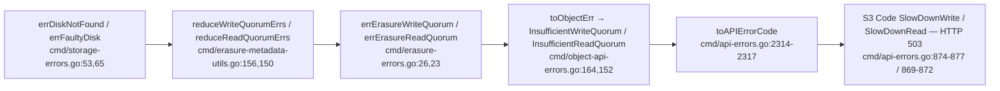

# MinIO Erasure-Coding Behavior During Drive Failure — An Evidence-Based Investigation

> **What this document answers.** How does MinIO's erasure-coding storage layer actually behave when drives fail *during active operations*? Specifically:
> - **(A)** When a drive vanishes mid-write, what error does the client receive, and does the write succeed or fail?
> - **(B)** Can objects stored *before* a drive failed still be read? If not, what error is returned?
> - **(C)** What triggers healing when a drive comes back, what criteria mark an object as needing heal, and what log lines appear?
> - **(D)** How does the cluster report its own health, what are the exact drive-count metric names, and what values do they show before/after a failure?

## Provenance

| Field | Value |
|-------|-------|
| Repository | `github.com/minio/minio` |
| Branch | `minio_c07e5b49d477` |
| HEAD commit | `c07e5b49d477b0774f23db3b290745aef8c01bd2` |
| Binary build | `DEVELOPMENT.2024-11-25T17-10-22Z` (verified via `./minio --version`) |
| Go toolchain | `go1.23.12 linux/amd64` (go.mod pins `go 1.23` — `go.mod:3`) |
| Erasure module | `github.com/klauspost/reedsolomon v1.12.4` (`go.mod:40`) |
| Bitrot hash | `github.com/minio/highwayhash v1.0.3` (`go.mod:49`) |
| Metrics library | `github.com/prometheus/client_golang v1.20.5` (`go.mod:72`) |

**Two governing principles for this report:**

1. **Code is the source of truth.** Every behavioral claim is tied to a specific `file:line` citation in *this* checkout. Line numbers were re-opened and re-confirmed at authoring time against HEAD `c07e5b49d477`.
2. **Evidence over claims.** Every answer pairs the code citation with a **real observed artifact** — an actual S3 error `Code` + HTTP status, an actual server log line, or an actual Prometheus value — captured from a running cluster. External MinIO/AIStor documentation is used only as corroboration and is explicitly flagged where it diverges from this code (see [AIStor caveat](#a-note-on-aistor-vs-this-checkout)).

---

## 1. Methodology — build → run → observe → capture

MinIO activates erasure coding from a **minimum erasure-set size of 2 drives** — the supported set sizes are `{2, 3, …, 16}` (`cmd/endpoint-ellipses.go:48`) and the minimum number of drives required for erasure coding is 2 (`docs/distributed/README.md:11`); only a single-drive layout never exercises quorum logic. This investigation deliberately uses a **4-drive** set so that the default **symmetric EC:2** layout exercises the quorum thresholds under study. By default MinIO shards objects across **N/2 data + N/2 parity** drives, so it can lose up to **N/2** drives and still reconstruct data (`docs/erasure/README.md:3`, `docs/erasure/README.md:9`). Parity is configurable per storage class via `EC:M` (`docs/erasure/storage-class/README.md:3`).

The observations below were captured from a **single-node, 4-drive** erasure deployment. For a 4-drive set the default parity is `DefaultParityBlocks(4) == 2` (`internal/config/storageclass/storage-class.go:355`), i.e. **2 data + 2 parity (EC:2)** — the symmetric N/2 layout.

### Steps actually executed

```bash
# M1 — Build (Go 1.23.x). make build => CGO_ENABLED=0 go build -tags kqueue -trimpath -o $(PWD)/minio   [Makefile:177-179]
# (A prebuilt ./minio for this exact commit was already present and verified with ./minio --version.)

# M2 — Run an erasure server over 4 backend dirs OUTSIDE the repository.
#       Run as a NON-root user so `chmod 000` truly blocks I/O (root bypasses DAC permission bits).
MINIO_ROOT_USER=minioadmin MINIO_ROOT_PASSWORD=minioadmin \
MINIO_PROMETHEUS_AUTH_TYPE=public \
  ./minio server /tmp/minio-obs/d{1..4} --address ':9000' --console-address ':9001'

# M3 — Healthy baseline: create a bucket, PUT a known object (the read-path subject for B), scrape metrics + health.
# M4 — Simulate mid-operation drive loss on the RUNNING server:
chmod 000 /tmp/minio-obs/d2        # forces errFaultyDisk/errDiskNotFound on that drive [cmd/storage-errors.go:53,65]
#       Then re-exercise PUT and GET and capture the S3 Code + HTTP status.
# M5 — Observe healing: replace the failed drive with a fresh (empty/unformatted) directory; watch the console.
# M6 — Re-scrape metrics after failure and after heal; tabulate before/during/after.
# M7 — Cleanup: stop the server; remove ./minio, /tmp/minio-obs, helper scripts. Repo tree must end clean.
```

The `main.go` entry point is `minio.Main(os.Args)` (`main.go:29-30`). `MINIO_PROMETHEUS_AUTH_TYPE=public` (ephemeral, never persisted) lets `curl` scrape metrics without a bearer token. PUT/GET were issued with a Python `boto3` S3 client (SigV4) so exact S3 `Code`/HTTP values could be captured; metrics and health were scraped with `curl`.

### Observed cluster constants (scraped at baseline)

| Quantity | Value | Source |
|----------|-------|--------|
| Drives (N) | 4 | `minio_cluster_health_drives_count` |
| Data shards | 2 | EC:2 default for 4-drive set |
| Parity shards | 2 | EC:2 default for 4-drive set |
| Write quorum | **3** | `minio_cluster_erasure_set_write_quorum` & `X-Minio-Write-Quorum` header |
| Read quorum | **2** | `minio_cluster_erasure_set_read_quorum` & `X-Minio-Read-Quorum` header |
| Write tolerance | **1** drive | `minio_cluster_erasure_set_write_tolerance` |
| Read tolerance | **2** drives | `minio_cluster_erasure_set_read_tolerance` |

These observed values are exactly what the code computes: `writeQuorum := dataDrives` and, because `dataDrives == parityDrives` (2 == 2), `writeQuorum++` → **3** (`cmd/erasure-object.go:1319`, `cmd/erasure-object.go:1323-1325`); a read can decode while the number of available shards is `>= dataBlocks` → **2** (`cmd/erasure-decode.go:123`). With write tolerance 1 and read tolerance 2, the scenarios below are deterministic: 1 drive down → writes still succeed; 2 down → writes fail but reads succeed; 3 down → reads fail.

---

## (A) Write path during drive failure

**Question:** If a drive suddenly becomes unavailable while data is being written, what error does MinIO return, and does the write succeed or fail?

**Answer (short):** It depends on whether **write quorum still holds**. MinIO is *availability-optimized by default*: for each offline drive it *attempts* to add a parity block — but this raise is **capped at `N/2`** (`cmd/erasure-object.go:1311-1313`), and the object is tagged `x-minio-internal-erasure-upgraded` **only when the parity count actually changes** (`cmd/erasure-object.go:1315-1316`). In the observed default 4-drive **EC:2** layout parity is already at the `N/2` cap, so the increment is clamped straight back, **no upgrade tag is emitted**, and the one-drive-down PUT **succeeds simply because write quorum (3) still holds**. The write only **fails** once enough drives are offline to break write quorum — and then the client receives S3 **`SlowDownWrite`** with **HTTP 503**.

### Observed artifacts

**A.1 — One drive down → PUT SUCCEEDS (write quorum still holds).** With `d2` made inaccessible (`chmod 000`), 3 of 4 drives online (write tolerance = 1). The HTTP 200 below is the observed success; per the code walk-through, in this EC:2 layout the object is *not* parity-upgraded or tagged (parity is already at the `N/2` cap):

```json
{"ok": true, "op": "put", "etag": "\"f355e88429668fb4136572cad096b4b6\"",
 "md5": "f355e88429668fb4136572cad096b4b6", "status": 200}
```

**A.2 — Two drives down → PUT FAILS with `SlowDownWrite` / HTTP 503.** With `d2` and `d3` inaccessible, 2 of 4 drives online (offline ≥ (N+1)/2 = 2 → write quorum lost):

```json
{"ok": false, "op": "put", "Code": "SlowDownWrite",
 "Message": "Resource requested is unwritable, please reduce your request rate",
 "HTTPStatusCode": 503, "headers": {"content-type": "application/xml", "server": "MinIO"}}
```

The corresponding internal write also surfaced the underlying error type in the server log, confirming the chain:

```text
Error: Storage resources are insufficient for the write operation
       .minio.sys/buckets/testbucket/.usage-cache.bin (cmd.InsufficientWriteQuorum)
```

### Why this happens (code walk-through)

During a PUT, MinIO inspects every drive in the erasure set. When the default **availability-optimized** storage class is active, it enters the availability-optimization branch and, for each offline drive, *tentatively* increments the parity count — a raise that is then bounded by the `N/2` cap:

```go
// cmd/erasure-object.go:1291
if !opts.MaxParity && globalStorageClass.AvailabilityOptimized() {
    parityOrig := parityDrives                 // :1293
    var offlineDrives int
    for _, disk := range storageDisks {        // :1296
        if disk == nil || !disk.IsOnline() {
            parityDrives++                      // :1298  (absorb the loss with more parity)
            offlineDrives++                     // :1299
            continue
        }
    }
    if offlineDrives >= (len(storageDisks)+1)/2 {   // :1304  majority offline?
        return ObjectInfo{}, toObjectErr(errErasureWriteQuorum, bucket, object)  // :1308  -> hard fail
    }
    if parityDrives >= len(storageDisks)/2 {        // :1311  CAP: parity can never exceed N/2
        parityDrives = len(storageDisks) / 2        // :1312  (clamps the increments above back down)
    }
    if parityOrig != parityDrives {                 // :1315  emit tag ONLY if parity actually changed
        userDefined[minIOErasureUpgraded] = strconv.Itoa(parityOrig) + "->" + strconv.Itoa(parityDrives)  // :1316
    }
}
dataDrives := len(storageDisks) - parityDrives  // :1319
writeQuorum := dataDrives                        // :1323
if dataDrives == parityDrives {                  // :1324
    writeQuorum++                                // :1325
}
```

- **Parity-upgrade *attempt*, then the `N/2` cap (success path).** Each offline drive *tentatively* bumps `parityDrives` (`cmd/erasure-object.go:1298`), but the result is immediately **clamped to `len(storageDisks)/2`** (`cmd/erasure-object.go:1311-1313`). The object is tagged `x-minio-internal-erasure-upgraded` = `"orig->new"` (constant `minIOErasureUpgraded` at `cmd/erasure-metadata.go:38`) **only when the parity count actually changed** — i.e. `parityOrig != parityDrives` (`cmd/erasure-object.go:1315-1316`). **In the observed default 4-drive EC:2 case this tag is _not_ emitted:** `parityOrig = 2` (`DefaultParityBlocks(4) == 2`, `internal/config/storageclass/storage-class.go:355`); one offline drive bumps parity to 3, the cap at `:1311-1313` resets it to 2, so `parityOrig == parityDrives` and the `if` at `:1315` is false. **The 1-down PUT in A.1 therefore returned HTTP 200 not because of a parity upgrade, but simply because write quorum (3) still held** — the 3 online drives meet the 3-writer success threshold (see the encode-time gate below). The upgrade tag appears only for storage-class configurations with parity *headroom* (`parityOrig < len(storageDisks)/2`); for example the test fixture at `cmd/erasure-healing-common_test.go:684` records a real `"x-minio-internal-erasure-upgraded": "5->6"` (parity raised from 5 to 6, a configuration sitting below its `N/2` cap).
- **Immediate quorum failure.** If offline drives reach `(N+1)/2`, MinIO does not even try to encode; it returns `errErasureWriteQuorum` right away (`cmd/erasure-object.go:1304`, `cmd/erasure-object.go:1308`). For N=4 that threshold is 2 — exactly the A.2 case.
- **Encode-time gate.** When encoding does proceed, success requires the count of successful shard writers to reach the quorum; otherwise the encode returns a wrapped read/write-quorum error annotated with the offline-disk count:

```go
// cmd/erasure-encode.go:59
nilCount := countErrs(p.errs, nil)
if nilCount >= p.writeQuorum {           // :60  enough writers -> success
    return nil
}
writeErr := reduceWriteQuorumErrs(ctx, p.errs, objectOpIgnoredErrs, p.writeQuorum)  // :64
return fmt.Errorf("%w (offline-disks=%d/%d)", writeErr, countErrs(p.errs, errDiskNotFound), len(p.writers))  // :65
```

**Why the `(offline-disks=x/y)` annotation did not appear in our 2-down log:** in the A.2 scenario the PUT short-circuited at the parity-upgrade precheck (`cmd/erasure-object.go:1304-1308`) — offline count reached the majority threshold *before* the encode-time gate at `cmd/erasure-encode.go:65` was ever reached. The annotated wrap is *expected per code* at `cmd/erasure-encode.go:65` for the narrower case where individual shard writers fail without tripping the precheck. The client-visible outcome is identical either way (`SlowDownWrite`/503), because both `errErasureWriteQuorum` paths translate the same way (next section).

### Error-translation chain (internal error → S3 wire code)

```text
errErasureWriteQuorum  "Write failed. Insufficient number of drives online"   cmd/erasure-errors.go:26
   └─ toObjectErr ──> InsufficientWriteQuorum                                  cmd/object-api-errors.go:164-165 (type :246, Unwrap :253-254)
        └─ toAPIErrorCode ──> ErrSlowDownWrite                                 cmd/api-errors.go:2314-2315
             └─ S3 response: Code "SlowDownWrite",                             cmd/api-errors.go:875
                Description "Resource requested is unwritable, ...",           cmd/api-errors.go:876
                HTTP 503 (http.StatusServiceUnavailable)                       cmd/api-errors.go:877
```

### Outcome

| Drives offline (N=4) | Write quorum (3) | Result | Client sees |
|----------------------|------------------|--------|-------------|
| 0 | held | **SUCCEEDS** | HTTP 200 |
| 1 | held | **SUCCEEDS** | HTTP 200 (no upgrade tag — EC:2 parity already at `N/2` cap) |
| ≥ 2 | **lost** | **FAILS** | S3 `SlowDownWrite`, HTTP 503 |

**Rationale.** MinIO favors availability: rather than reject a write the moment a drive disappears, it *tries* to raise parity to keep the object safely reconstructable — but never beyond the `N/2` cap (`cmd/erasure-object.go:1311-1313`). In a storage class with parity *headroom* that raise is real and is recorded with the `erasure-upgraded` tag (`cmd/erasure-object.go:1315-1316`); in the default symmetric EC:2 layout parity is already at the cap, so no tag is written and the write succeeds purely because **write quorum still holds**. Either way MinIO only refuses once a true majority of drives is unreachable — because below quorum it can no longer guarantee a durable, reconstructable object.


---

## (B) Read path for pre-existing objects

**Question:** For objects already stored before a drive vanished, can they still be read? If not, what error is returned?

**Answer (short):** **Yes — they remain readable** as long as at least `dataBlocks` shards survive (read tolerance = N/2). Missing shards are reconstructed on the fly from parity via Reed-Solomon. Only when fewer than `dataBlocks` shards remain does the GET fail, with S3 **`SlowDownRead`** / **HTTP 503**.

### Observed artifacts

The read-path subject is `testbucket/hello.txt` (`md5=04367fee44b3411b620eb570e4edfd26`), written while the cluster was healthy.

**B.1 — One drive down → GET SUCCEEDS (reconstructed).** 3 of 4 drives online:

```json
{"ok": true, "op": "get", "status": 200, "len": 25,
 "md5": "04367fee44b3411b620eb570e4edfd26", "body": "HELLO-MINIO-ERASURE-12345"}
```

**B.2 — Two drives down → GET STILL SUCCEEDS.** Only 2 of 4 drives online (exactly `dataBlocks` = 2); the bytes are recomputed from the surviving data+parity shards, returned byte-for-byte:

```json
{"ok": true, "op": "get", "status": 200, "len": 25,
 "md5": "04367fee44b3411b620eb570e4edfd26", "body": "HELLO-MINIO-ERASURE-12345"}
```

**B.3 — Three drives down → GET FAILS with `SlowDownRead` / HTTP 503.** Only 1 of 4 drives online (1 < `dataBlocks` = 2 → read quorum lost):

```json
{"ok": false, "op": "get", "Code": "SlowDownRead",
 "Message": "Resource requested is unreadable, please reduce your request rate",
 "HTTPStatusCode": 503, "headers": {"content-type": "application/xml", "server": "MinIO"}}
```

### Why this happens (code walk-through)

The parallel reader decides it can satisfy a read as long as the number of **available** shards is at least the data-shard count:

```go
// cmd/erasure-decode.go:116
func (p *parallelReader) canDecode(buf [][]byte) bool {
    bufCount := 0
    for _, b := range buf {
        if len(b) > 0 {
            bufCount++
        }
    }
    return bufCount >= p.dataBlocks   // :123
}
```

So with N=4, `dataBlocks=2`: losing 1 or even 2 drives still leaves ≥ 2 shards, and Reed-Solomon (`github.com/klauspost/reedsolomon v1.12.4`, `go.mod:40`) recomputes the missing data shard — this is precisely why B.1 and B.2 returned the original bytes. Integrity of each shard is verified with bitrot checksums using HighwayHash-256 (`cmd/bitrot.go:42`, `cmd/bitrot.go:55`; `github.com/minio/highwayhash v1.0.3`, `go.mod:49`), so reconstruction is from *verified* shards, not blindly.

When too few shards survive, the decoder returns a read-quorum error annotated with the offline-disk count:

```go
// cmd/erasure-decode.go:234
// If we cannot decode, just return read quorum error.
return nil, fmt.Errorf("%w (offline-disks=%d/%d)", errErasureReadQuorum, disksNotFound, len(p.readers))
```

### Error-translation chain (internal error → S3 wire code)

```text
errErasureReadQuorum   "Read failed. Insufficient number of drives online"    cmd/erasure-errors.go:23
   └─ toObjectErr ──> InsufficientReadQuorum                                   cmd/object-api-errors.go:152-153 (type :229, Unwrap :241-242)
        └─ toAPIErrorCode ──> ErrSlowDownRead                                  cmd/api-errors.go:2316-2317
             └─ S3 response: Code "SlowDownRead",                              cmd/api-errors.go:870
                Description "Resource requested is unreadable, ...",           cmd/api-errors.go:871
                HTTP 503 (http.StatusServiceUnavailable)                       cmd/api-errors.go:872
```

### Outcome

| Drives offline (N=4) | Shards available | Read quorum (≥ 2) | Result | Client sees |
|----------------------|------------------|-------------------|--------|-------------|
| 0–1 | 4–3 | held | **SUCCEEDS** | HTTP 200, reconstructed |
| 2 | 2 | held (= `dataBlocks`) | **SUCCEEDS** | HTTP 200, reconstructed |
| ≥ 3 | ≤ 1 | **lost** | **FAILS** | S3 `SlowDownRead`, HTTP 503 |

**Rationale.** A missing shard is below the parity budget, so Reed-Solomon recomputes the lost data shard from the survivors. The read only fails once fewer than `dataBlocks` shards remain — at which point there is mathematically not enough information to reconstruct the object.

---

## Shared internal → S3 error-translation chain (A & B)

Both the write and read failures funnel through the *same* shape of translation, branching only into distinct S3 `Code`s. Per-disk failures (`errDiskNotFound`, `errFaultyDisk`, `errUnformattedDisk`; `cmd/storage-errors.go:53,65,38`) are reduced to a quorum verdict (`reduceWriteQuorumErrs` / `reduceReadQuorumErrs`; `cmd/erasure-metadata-utils.go:156,150`), which yields the internal quorum error, which `toObjectErr` maps to an object-layer type, which `toAPIErrorCode` maps to the final S3 wire code:




---

## (C) Healing — trigger, criteria, and log messages

**Question:** (c1) What triggers healing when a drive comes back online? (c2) What criteria determine that a specific object needs healing on a particular drive? (c3) What log messages appear during an active heal?

### c1 — What triggers healing (two mechanisms)

**Proactive: fresh/replaced-drive auto-heal.** `initAutoHeal` starts the background monitor when `_MINIO_AUTO_DRIVE_HEALING` is enabled — which is the default (`config.EnableOn`):

```go
// cmd/background-newdisks-heal-ops.go:384
if env.Get("_MINIO_AUTO_DRIVE_HEALING", config.EnableOn) == config.EnableOn {
    go monitorLocalDisksAndHeal(ctx, z)   // monitor defined at :563
}
```

The monitor polls every **10 seconds** (`defaultMonitorNewDiskInterval = time.Second * 10`, `cmd/background-newdisks-heal-ops.go:40`). On each cycle, `getLocalDisksToHeal` (`cmd/background-newdisks-heal-ops.go:393`) flags a drive that either reports `errUnformattedDisk` (`cmd/background-newdisks-heal-ops.go:399`) — a brand-new/replaced drive — or carries an unfinished `.healing.bin` tracker (`healingTrackerFilename = ".healing.bin"`, `cmd/background-newdisks-heal-ops.go:41`). Flagged drives are passed to `healFreshDisk` (`cmd/background-newdisks-heal-ops.go:419`), which heals the affected erasure set under a per-set lock (serializing concurrent drive heals).

**Reactive: MRF (Metadata Recovery Framework) inline heal.** When a live access (e.g. a GET) encounters offline or missing shards, the object is queued for immediate heal via `globalMRFState.addPartialOp` (`cmd/mrf.go:78`); the `healRoutine` consumer (`cmd/mrf.go:220`) heals it after a brief reconnect wait. The GET path is one such producer (`cmd/erasure-object.go:400`, `cmd/erasure-object.go:805`). The set-wide orchestration both paths converge on is `healErasureSet` (`cmd/global-heal.go:152`).

### c2 — What marks an object as needing heal on a drive

The per-object/per-disk decision is `shouldHealObjectOnDisk` (`cmd/erasure-healing.go:156`). Heal is required when **any** of the following holds:

| Condition | Reason error returned | Citation |
|-----------|-----------------------|----------|
| A shard read returns `errFileNotFound`, `errFileVersionNotFound`, or `errFileCorrupt` | the original read error | `cmd/erasure-healing.go:157-158` |
| Metadata is legacy (`meta.XLV1`) | `errLegacyXLMeta` ("legacy XL meta") | `cmd/erasure-healing.go:148`, `cmd/erasure-healing.go:164` |
| This drive's metadata is older than the latest quorum version (`!latestMeta.Equals(meta)`) | `errOutdatedXLMeta` ("outdated XL meta") | `cmd/erasure-healing.go:150`, `cmd/erasure-healing.go:167` |
| A part file is missing or corrupt | `errPartMissingOrCorrupt` ("part missing or corrupt") | `cmd/erasure-healing.go:152`, `cmd/erasure-healing.go:176` |

```go
// cmd/erasure-healing.go:156
func shouldHealObjectOnDisk(erErr error, partsErrs []int, meta FileInfo, latestMeta FileInfo) (bool, error) {
    if errors.Is(erErr, errFileNotFound) || errors.Is(erErr, errFileVersionNotFound) || errors.Is(erErr, errFileCorrupt) {
        return true, erErr            // :158
    }
    if erErr == nil {
        if meta.XLV1 {
            return true, errLegacyXLMeta        // :164
        }
        if !latestMeta.Equals(meta) {
            return true, errOutdatedXLMeta      // :167
        }
        ...
        return true, errPartMissingOrCorrupt    // :176 (when a part file is missing/corrupt)
    }
    ...
}
```

(The heal-metric enum that labels heal scopes — `Bucket`, `Object`, `CheckAbandonedParts` — is generated in `cmd/healingmetric_string.go:16`.)

### c3 — Log messages during an active heal (observed)

Heal events are emitted through `healingLogEvent` (`cmd/logging.go:83`), which calls `logger.Event(ctx, "healing", ...)` (`cmd/logging.go:84`); `logger.Event` (`internal/logger/logger.go:431`) routes them to the console and any configured log targets.

**Observed artifact.** After restoring two drives and replacing `d2` with a fresh empty (unformatted) directory, the 10-second monitor detected it and healed within ~20 seconds. The actual console output was:

```text
Healing drive '/tmp/minio-obs/d2' - 'mc admin heal alias/ --verbose' to check the current status.
Healing drive '/tmp/minio-obs/d2' - use 4 parallel workers.
Healing of drive '/tmp/minio-obs/d2' is finished (healed: 10, skipped: 0).
```

> **Note on the counts.** The `healed`/`skipped` integers are **run-dependent**: they count the items rebuilt onto the fresh drive, which varies with how many objects and `.minio.sys` metadata entries reside on the erasure set at heal time. The log *string* (the format) is fixed in the source (`cmd/background-newdisks-heal-ops.go:520`); only the numbers differ between runs. The block above is the exact console output captured in this validation run; a re-run on a cluster with a different object population will print a different (often smaller) `healed` count.

These map to the following source strings (line numbers re-verified at authoring time — note these corrected lines, **not** L459/L519):

| Observed line | Source string | Citation |
|---------------|---------------|----------|
| `Healing drive '%s' - 'mc admin heal alias/ --verbose' to check the current status.` | start banner | `cmd/background-newdisks-heal-ops.go:460` |
| `Healing drive '%s' - use %d parallel workers.` | worker count | `cmd/global-heal.go:210` |
| `Healing of drive '%s' is finished (healed: %d, skipped: %d).` | completion | `cmd/background-newdisks-heal-ops.go:520` |

If a heal pass does not complete, the retry/abandon variants are emitted instead:

| Source string | Citation |
|---------------|----------|
| `Healing of drive '%s' is incomplete, retrying %s time (healed: %d, skipped: %d, failed: %d).` | `cmd/background-newdisks-heal-ops.go:503` |
| `Healing of drive '%s' is incomplete, retried %d times (healed: %d, skipped: %d, failed: %d).` | `cmd/background-newdisks-heal-ops.go:513` |

While the drives were still inaccessible, the server also logged the tracker-probe failure that the monitor relies on (corroborating the `.healing.bin` detection path):

```text
Error: unable to read /tmp/minio-obs/d2/.minio.sys/buckets/.healing.bin:
       open /tmp/minio-obs/d2/.minio.sys/buckets/.healing.bin: permission denied
```

**Rationale.** A replaced drive comes up *unformatted* (or carries a stale `.healing.bin`); the 10-second fresh-disk monitor detects this and hands the set to `healFreshDisk`, which rebuilds the missing shards (this validation run reported `healed: 10, skipped: 0`; the exact count is run-dependent — see the note above). In parallel, any read that hits a still-missing shard enqueues an MRF partial-op for immediate object-level heal. MinIO thus heals both **proactively** (fresh-disk monitor) and **reactively** (MRF on access).


---

## (D) Health reporting and drive metrics

**Question:** (d1) How does the cluster report its own health when drives go offline? (d2) What are the exact metric names tracking online vs offline drive counts? (d3) What values do those metrics show before and after a drive failure?

### d1 — Health endpoints and headers

Two dedicated probes report cluster health (routes registered in `cmd/healthcheck-router.go`):

| Endpoint | Path const | Handler | Checks |
|----------|-----------|---------|--------|
| `/minio/health/cluster` | `healthCheckClusterPath = "/cluster"` (`cmd/healthcheck-router.go:30`) | `ClusterCheckHandler` (`cmd/healthcheck-handler.go:56`; routes `:41-42`) | **write** quorum |
| `/minio/health/cluster/read` | `healthCheckClusterReadPath = "/cluster/read"` (`cmd/healthcheck-router.go:31`) | `ClusterReadCheckHandler` (`cmd/healthcheck-handler.go:93`; routes `:43-44`) | **read** quorum |

When the cluster is unhealthy these return **HTTP 503** (`writeResponse(w, http.StatusServiceUnavailable, ...)`, `cmd/healthcheck-handler.go:85` and `cmd/healthcheck-handler.go:122`). They set quorum/heal headers — `MinIOWriteQuorum` (`cmd/healthcheck-handler.go:72`), `MinIOReadQuorum` (`cmd/healthcheck-handler.go:109`), and `MinIOHealingDrives` (`cmd/healthcheck-handler.go:76`, `cmd/healthcheck-handler.go:113`) — and a server-status header (`X-Minio-Server-Status`) whose value is `"offline"` (`const unavailable = "offline"`, `cmd/healthcheck-handler.go:30`; set `:35`), `"bucket-metadata-offline"` (`:41`), or `"iam-offline"` (`:47`). The header *name* constants live in `internal/http/headers.go`:

| Constant | Header name | Citation |
|----------|-------------|----------|
| `MinIOServerStatus` | `x-minio-server-status` | `internal/http/headers.go:170` |
| `MinIOWriteQuorum` | `x-minio-write-quorum` | `internal/http/headers.go:193` |
| `MinIOReadQuorum` | `x-minio-read-quorum` | `internal/http/headers.go:196` |
| `MinIOHealingDrives` | `x-minio-healing-drives` | `internal/http/headers.go:203` |

The underlying computation is `func (z *erasureServerPools) Health(ctx, opts HealthOptions) HealthResult` (`cmd/erasure-server-pool.go:2679`); the result carries `WriteQuorum`, `ReadQuorum`, and `HealingDrives` (`HealthResult` struct, `cmd/erasure-server-pool.go:2638-2653`).

**Observed artifacts (health endpoints):**

```text
# Baseline (4/4 online)
$ curl -i .../minio/health/cluster        -> HTTP/1.1 200 OK    X-Minio-Write-Quorum: 3
$ curl -i .../minio/health/cluster/read   -> HTTP/1.1 200 OK    X-Minio-Read-Quorum: 2

# 2 drives down (write quorum lost, read quorum held)
$ curl -i .../minio/health/cluster        -> HTTP/1.1 503 Service Unavailable    X-Minio-Write-Quorum: 3
$ curl -i .../minio/health/cluster/read   -> HTTP/1.1 200 OK                      X-Minio-Read-Quorum: 2

# 3 drives down (read quorum lost)
$ curl -i .../minio/health/cluster/read   -> HTTP/1.1 503 Service Unavailable     X-Minio-Read-Quorum: 2
```

This is the cluster reporting its own health exactly as the code prescribes: write health flips to 503 the moment write quorum is unmet, while reads remain 200 until read quorum is also lost.

### d2 — Exact drive-count metric names

MinIO exposes the same online/offline concept through two metric generations with **different** names; cite whichever endpoint you scrape.

| Generation | Endpoint | Metric name | Type | Citation |
|-----------|----------|-------------|------|----------|
| v3 | `/minio/metrics/v3/cluster/health` | `minio_cluster_health_drives_online_count` | Gauge | `cmd/metrics-v3-cluster-health.go:24` (name), `:31-32` (MD) |
| v3 | same | `minio_cluster_health_drives_offline_count` | Gauge | `cmd/metrics-v3-cluster-health.go:23` (name), `:29-30` (MD) |
| v3 | same | `minio_cluster_health_drives_count` | Gauge | `cmd/metrics-v3-cluster-health.go:25` (name), `:33-34` (MD) |
| v2 | `/minio/v2/metrics/cluster` | `minio_cluster_drive_online_total` | Gauge | `getClusterDrivesOnlineTotalMD` `cmd/metrics-v2.go:588` (subsystem `drive` `:142`, name `online_total` `:195`) |
| v2 | same | `minio_cluster_drive_offline_total` | Gauge | `getClusterDrivesOfflineTotalMD` `cmd/metrics-v2.go:578` (name `offline_total` `:194`) |
| v2 | `/minio/v2/metrics/node` | `minio_node_drive_online_total` | Gauge | `getNodeDrivesOnlineTotalMD` `cmd/metrics-v2.go:618` |
| v2 | same | `minio_node_drive_offline_total` | Gauge | `getNodeDrivesOfflineTotalMD` `cmd/metrics-v2.go:608` |

The v3 collector and the `/cluster/health` path are registered in `cmd/metrics-v3.go` (`clusterHealthCollectorPath = "/cluster/health"`, `cmd/metrics-v3.go:50`); the v3 endpoint family is documented in `docs/metrics/v3.md`. Richer per-set context (online drives, read/write quorum, read/write tolerance, health) is exposed under `/minio/metrics/v3/cluster/erasure-set` (`cmd/metrics-v3-cluster-erasure-set.go:26-36`).

### d3 — Values before and after a drive failure (observed)

All values below were scraped live. With **K** failed drives out of **N**, the online gauges drop by K, the offline gauges rise by K, and the total is unchanged at N.

**v3 cluster-health gauges (`/minio/metrics/v3/cluster/health`):**

| State | `..._drives_online_count` | `..._drives_offline_count` | `..._drives_count` |
|-------|---------------------------|----------------------------|--------------------|
| Baseline (0 down) | `4` | *(absent → 0)* | `4` |
| 1 drive down | `3` | `1` | `4` |
| 2 drives down | `2` | `2` | `4` |
| Post-heal | `4` | *(absent → 0)* | `4` |

> Observed nuance: at zero offline drives the `minio_cluster_health_drives_offline_count` series was **absent** from the scrape and appeared (=1, then =2) only once drives actually went offline; treat absent as 0.

**v2 cluster-drive totals (`/minio/v2/metrics/cluster`):**

```text
# Baseline
minio_cluster_drive_online_total{server="127.0.0.1:9000"}  4
minio_cluster_drive_offline_total{server="127.0.0.1:9000"} 0
# 1 drive down
minio_cluster_drive_online_total{server="127.0.0.1:9000"}  3
minio_cluster_drive_offline_total{server="127.0.0.1:9000"} 1
# 2 drives down
minio_cluster_drive_online_total{server="127.0.0.1:9000"}  2
minio_cluster_drive_offline_total{server="127.0.0.1:9000"} 2
# Post-heal
minio_cluster_drive_online_total{server="127.0.0.1:9000"}  4
minio_cluster_drive_offline_total{server="127.0.0.1:9000"} 0
```

**Per-erasure-set gauges (`/minio/metrics/v3/cluster/erasure-set`):**

| State | `..._online_drives_count` | `..._write_quorum` | `..._read_quorum` | `..._write_tolerance` | `..._read_tolerance` | `..._health` |
|-------|---------------------------|--------------------|-------------------|-----------------------|----------------------|--------------|
| Baseline | `4` | `3` | `2` | `1` | `2` | `1` |
| 1 drive down | `3` | `3` | `2` | *(absent → 0)* | `1` | `1` |
| 2 drives down | `2` | `3` | `2` | *(absent → 0)* | *(absent → 0)* | *(absent → 0)* |
| Post-heal | `4` | `3` | `2` | `1` | `2` | `1` |

> A second observed nuance worth noting for operators: the drive-state behind these gauges is **eventually consistent**. After `chmod 000`, the online/offline counts lagged ~10–40 s (the disk monitor interval plus the metrics cache) before converging; generating a little I/O and re-scraping accelerated convergence. The S3 write/read paths, by contrast, detect the offline drive *immediately* at operation time (via `disk.IsOnline()`), which is why a PUT could already fail with `SlowDownWrite` while the health gauge still briefly read 3 online.

**Rationale.** `drives_count` is the static set size; `online`/`offline` are derived from each drive's live connection/health state. Losing K drives shifts exactly K from online to offline and leaves the total fixed — which is precisely what the before/after tables show, and what the erasure-set tolerance gauges quantify (write tolerance fell to 0 after one loss, matching the write-quorum failure observed in section A at two losses).


---

## Closing rationale — how the four answers fit together

All four behaviors are consequences of one model: **MinIO shards each object into N/2 data + N/2 parity blocks and gates every operation on quorum** (`docs/erasure/README.md:3`, `docs/erasure/README.md:9`; parity configurable via `EC:M`, `docs/erasure/storage-class/README.md:3`).

- **Writes (A)** are availability-optimized: MinIO *attempts* to raise parity per offline drive, but the raise is capped at `N/2` (`cmd/erasure-object.go:1311-1313`) and is tagged `erasure-upgraded` only when parity actually changes (`:1315-1316`). A write therefore succeeds while a *majority* of drives is reachable — in the observed EC:2 layout the 1-down PUT succeeds because write quorum still holds, with no upgrade tag emitted. Once offline ≥ (N+1)/2, the write hard-fails with `SlowDownWrite`/503 (`cmd/erasure-object.go:1291-1325`).
- **Reads (B)** reconstruct from any `dataBlocks` surviving shards, so pre-existing objects stay readable through the loss of up to N/2 drives; below that they fail with `SlowDownRead`/503 (`cmd/erasure-decode.go:123`, `cmd/erasure-decode.go:234`).
- Both A and B route through the **same internal→S3 translation chain**, differing only in the final S3 `Code` (`cmd/api-errors.go:2314-2317`, `cmd/api-errors.go:869-877`).
- **Healing (C)** restores the redundancy that A and B depend on, via a proactive 10-second fresh-disk monitor (`cmd/background-newdisks-heal-ops.go:40,384,419`) and reactive MRF inline heal on access (`cmd/mrf.go:78,220`).
- **Health & metrics (D)** expose this quorum state to operators: the health endpoints flip to 503 exactly when the corresponding quorum is lost (`cmd/healthcheck-handler.go:85,122`), and the drive gauges track the online/offline split that determines whether A and B will succeed.

The numbers are internally consistent across every section: N=4, data=2, parity=2, `writeQuorum=3` (`cmd/erasure-object.go:1323-1325`), read decodes while available ≥ `dataBlocks=2` (`cmd/erasure-decode.go:123`); tolerate up to N/2 = 2 drive losses for reads and N/2−1 = 1 for writes — matching every observed artifact above.

### A note on AIStor vs. this checkout

Newer public MinIO / **AIStor** documentation describes features that **postdate** this commit — most notably a 2025 rule that treats a drive **offline for more than 48 hours as a fresh drive** for healing purposes. **No such 48-hour rule exists in this checkout.** This document's healing trigger is strictly the code in this tree: a drive is healed when it is detected *unformatted* or carries an unfinished `.healing.bin` tracker (`cmd/background-newdisks-heal-ops.go:399,41`), or when an access enqueues an MRF partial-op (`cmd/mrf.go:78`). Wherever this report and current public docs disagree, **the code at HEAD `c07e5b49d477` (Go 1.23) is authoritative** for every claim made here; external docs were used only as corroboration.

---

## Appendix — Code citation index

Every `file:line` referenced in this document, re-verified against HEAD `c07e5b49d477` at authoring time.

| Area | File | Line(s) | What it establishes |
|------|------|---------|---------------------|
| A/B errors | `cmd/erasure-errors.go` | 23, 26 | `errErasureReadQuorum` / `errErasureWriteQuorum` strings |
| A/B errors | `cmd/storage-errors.go` | 38, 53, 65, 104 | `errUnformattedDisk` / `errDiskNotFound` / `errFaultyDisk` / `errFileCorrupt` |
| A/B errors | `cmd/object-api-errors.go` | 152-153, 164-165, 229, 241-242, 246, 253-254 | `toObjectErr` → `Insufficient{Read,Write}Quorum` types + `Unwrap` |
| A/B errors | `cmd/api-errors.go` | 869-872, 874-877, 2314-2317 | S3 `SlowDownRead`/`SlowDownWrite` Code/Description/HTTP 503; `toAPIErrorCode` mapping |
| A write | `cmd/erasure-object.go` | 1291, 1293, 1296, 1298, 1299, 1304, 1308, 1311-1313, 1315, 1316, 1319, 1323-1325 | Parity-upgrade *attempt* branch, majority precheck, **`N/2` parity cap**, conditional upgrade tag, write-quorum value |
| A write | `cmd/erasure-metadata.go` | 38 | `minIOErasureUpgraded = "x-minio-internal-erasure-upgraded"` |
| A write | `cmd/erasure-healing-common_test.go` | 684 | Real `erasure-upgraded` value `"5->6"` — confirms the tag is emitted only with parity headroom (`parityOrig < N/2`) |
| A write | `internal/config/storageclass/storage-class.go` | 327-333, 355 | `AvailabilityOptimized()` default; `DefaultParityBlocks` (4 drives → parity 2) |
| A write | `cmd/erasure-encode.go` | 59, 60, 64, 65 | Encode-time quorum gate + `(offline-disks=x/y)` wrap |
| A/B quorum | `cmd/erasure-metadata-utils.go` | 150, 156 | `reduceReadQuorumErrs` / `reduceWriteQuorumErrs` |
| B read | `cmd/erasure-decode.go` | 116, 123, 234 | `canDecode` threshold (`>= dataBlocks`); read-quorum wrap |
| B read | `cmd/bitrot.go` | 42, 55 | HighwayHash-256 bitrot verification |
| C heal trigger | `cmd/background-newdisks-heal-ops.go` | 40, 41, 377, 384, 393, 399, 419, 460, 503, 513, 520, 563 | Monitor interval, tracker filename, `initAutoHeal`, env gate, `getLocalDisksToHeal`, `errUnformattedDisk`, `healFreshDisk`, heal log strings, monitor loop |
| C heal trigger | `cmd/mrf.go` | 78, 220 | `addPartialOp` (queue) / `healRoutine` (consumer) |
| C heal producers | `cmd/erasure-object.go` | 400, 805 | GET-path MRF partial-op producers |
| C heal orchestration | `cmd/global-heal.go` | 152, 210 | `healErasureSet`; "use N parallel workers" log |
| C heal criteria | `cmd/erasure-healing.go` | 148, 150, 152, 156, 157-158, 164, 167, 176 | `shouldHealObjectOnDisk` + reason errors |
| C heal metric enum | `cmd/healingmetric_string.go` | 16 | `Bucket`/`Object`/`CheckAbandonedParts` |
| C heal logging | `cmd/logging.go` | 83, 84 | `healingLogEvent` → `logger.Event(ctx, "healing", …)` |
| C heal logging | `internal/logger/logger.go` | 431 | `func Event` dispatch to console/targets |
| D health | `cmd/healthcheck-handler.go` | 30, 35, 41, 47, 56, 72, 76, 85, 93, 109, 113, 122 | Endpoints, headers, 503 responses, server-status values |
| D health | `cmd/healthcheck-router.go` | 30, 31, 41-44 | `/cluster` and `/cluster/read` route registration |
| D health | `internal/http/headers.go` | 170, 193, 196, 203 | Header name constants |
| D health | `cmd/erasure-server-pool.go` | 2638-2653, 2679 | `HealthResult` struct; `Health()` computation |
| D metrics v3 | `cmd/metrics-v3-cluster-health.go` | 23, 24, 25, 29-34 | `minio_cluster_health_drives_{offline,online}_count` / `_count` |
| D metrics v3 | `cmd/metrics-v3.go` | 50 | `/cluster/health` collector path |
| D metrics v3 | `cmd/metrics-v3-cluster-erasure-set.go` | 26-36 | Per-set quorum/tolerance/health gauges |
| D metrics v2 | `cmd/metrics-v2.go` | 142, 194, 195, 578, 588, 608, 618 | `minio_cluster_drive_*_total` / `minio_node_drive_*_total` |
| Concept/build | `docs/erasure/README.md` | 3, 9 | N/2 data + N/2 parity; tolerate up to N/2 loss |
| Concept/build | `docs/erasure/storage-class/README.md` | 3 | Configurable data/parity (`EC:M`) |
| Concept/build | `internal/config/storageclass/storage-class.go` | 355 | `DefaultParityBlocks` (4 drives → parity 2) |
| Concept/build | `docs/metrics/v3.md` | — | v3 metric endpoint documentation |
| Concept/build | `Makefile` | 177-179 | `make build` command |
| Concept/build | `go.mod` | 1, 3, 40, 49, 72 | Module, Go 1.23, reedsolomon/highwayhash/prometheus versions |
| Concept/build | `main.go` | 29-30 | `minio.Main(os.Args)` entry point |

---

*Generated for branch `minio_c07e5b49d477` @ HEAD `c07e5b49d477b0774f23db3b290745aef8c01bd2`. All runtime artifacts were captured from a live 4-drive erasure deployment built from this exact commit; all temporary build/run artifacts were created outside the repository and removed afterward.*

