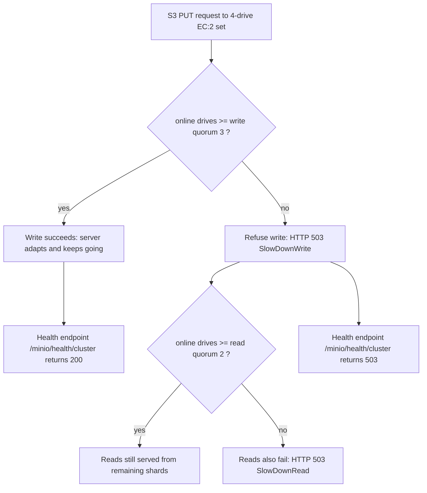

# MinIO Fault Tolerance in a 4-Drive Distributed Erasure-Coded Deployment

This document answers eight questions about how MinIO behaves at runtime when disks fail in a
distributed, four-directory, erasure-coded (`EC:2`) deployment. Every behavioral claim is grounded
in **two independent witnesses**: (a) a **source-code citation** in `file:line` form, taken from the
MinIO server at branch `minio_c07e5b49d477`, HEAD commit `c07e5b49d`, Go module
`github.com/minio/minio`; and (b) **captured live runtime evidence** — health-endpoint responses and
actual S3 write/read attempts — produced by building and running a real four-drive instance. Where an
external source conflicts with the repository, the repository is treated as authoritative (for
example, the build baseline follows `go.mod`, which declares `go 1.23`, rather than any externally
quoted minimum).

The eight questions answered below are:

1. How does MinIO decide it is "healthy", and how many disks does it assume it needs?
2. When a directory suddenly becomes inaccessible mid-operation, does MinIO adapt and keep going, or refuse to write?
3. What is the divergent behavior above the threshold (lose 1 disk) versus below the threshold (lose a 2nd disk)?
4. Do the logs call out the failing disk directly by path, and is there any visible sign of recovery being attempted while the system is live?
5. Once the missing directory becomes accessible again, does MinIO re-detect it on its own (polling), or must something push it back?
6. How do objects that were written while a disk was down get repaired once the disk returns?
7. Where does the quorum decision live in the code, and how is the "enough disks to proceed" threshold calculated?
8. How is the whole explanation grounded in observable behavior from the health endpoint and actual write attempts?

---

## 1. Methodology and Topology

### 1.1 Topology

The four directories supplied to a single `minio server` invocation initialize as **one erasure set**.
With the default `STANDARD` storage-class parity for a set of this size — **`EC:2`** (2 data blocks +
2 parity blocks) — this yields a **read quorum of 2** and a **write quorum of 3**. The default-parity
rule by set size is documented by the project itself (`docs/erasure/storage-class/README.md:50-54`):

| Erasure Set Size | Default Parity (EC:N) |
|------------------|-----------------------|
| 5 or fewer       | EC:2                  |
| 6-7              | EC:3                  |
| 8 or more        | EC:4                  |

MinIO uses Reed-Solomon coding to shard objects into
data and parity blocks, tolerating the loss of up to N/2 drives, and protects every shard with
HighwayHash bit-rot checksums (`docs/erasure/README.md:3`, `docs/erasure/README.md:7`,
`docs/erasure/README.md:9`, `docs/erasure/README.md:19-23`).

### 1.2 Reproducible Methodology

The evidence in this document was produced exactly as follows. All transient artifacts (the Go
toolchain, the compiled binary, the drive directories, and the Python S3 helper) lived **outside** the
repository and were removed afterward; the source tree remained byte-for-byte unchanged.

**Build** — the binary was compiled with the **Go 1.23.x** toolchain (baseline = `go.mod` `go 1.23`;
the run used Go **1.23.12**):

```bash
CGO_ENABLED=0 go build -o <out-of-repo>/minio ./
```

The resulting binary reports:

```
minio version DEVELOPMENT.GOGET (commit-id=DEVELOPMENT.GOGET)
Runtime: go1.23.12 linux/amd64
```

**Launch (single host, four drives)** — following the invocation pattern documented at
`docs/distributed/DESIGN.md:12-13` (`minio server [FLAGS] DIR1 [DIR2..]`) and mirroring the existing
four-disk erasure topology in `buildscripts/verify-build.sh:44-45` (`start_minio_erasure()`):

```bash
minio server /tmp/minio-run/drive1 /tmp/minio-run/drive2 \
             /tmp/minio-run/drive3 /tmp/minio-run/drive4 \
             --address ":9000" --console-address ":9001"
```

The startup log confirms the set sizing — the four directories become a single erasure set:

```
INFO: Formatting 1st pool, 1 set(s), 4 drives per set.
WARNING: Host local has more than 2 drives of set. ...
```

**Non-root requirement (and why it matters)** — the server was run as a **non-root** user
(`gotester`, uid 1001). This is essential for reproducibility: the **root account bypasses
discretionary access control (DAC)**, so a process running as root would still be able to read a
directory after `chmod 000`. Only a non-root process experiences the permission change as a genuine
*permission denied*, which is exactly the disk-failure condition we want to inject.

**Failure injection** — a drive was taken offline with `chmod 000` on its directory, a second drive
likewise, and access was restored with `chmod 755`. Cluster health was probed with `curl -i`, and S3
PUT/GET/LIST operations were issued through a transient **boto3** (1.43.36) helper using Signature
Version 4.

### 1.3 The Decision the Server Makes on Every Write

The remainder of this document explains, question by question, the decision summarized below.



---

## 2. Q1 — How MinIO Decides It Is "Healthy" and How Many Disks It Needs

**Answer.** Four directories form one `EC:2` erasure set, so **data = 2, parity = 2**. From those two
numbers MinIO derives a **read quorum of 2** and a **write quorum of 3**. "Healthy" in the sense of
*writable* means the number of online drives is **at least the write quorum (3)**; *read-healthy*
means online drives are at least the read quorum (2).

**Code.** The defaults are computed directly from the set drive count and the configured parity:

```go
// cmd/erasure.go:85-91 — defaultWQuorum
func (er erasureObjects) defaultWQuorum() int {
	dataCount := er.setDriveCount - er.defaultParityCount
	if dataCount == er.defaultParityCount {
		return dataCount + 1
	}
	return dataCount
}

// cmd/erasure.go:94-96 — defaultRQuorum
func (er erasureObjects) defaultRQuorum() int {
	return er.setDriveCount - er.defaultParityCount
}
```

For four drives with `EC:2`, `defaultWQuorum` computes `dataCount = 4 - 2 = 2`; because `2 == 2` it
returns `2 + 1 = `**`3`** (`cmd/erasure.go:85-91`). `defaultRQuorum` returns `4 - 2 = `**`2`**
(`cmd/erasure.go:94-96`).

The same logic exists per object. A `FileInfo`'s write quorum is its data-block count, bumped by one
when data blocks equal parity blocks, and its read quorum is simply the data-block count:

```go
// cmd/storage-datatypes.go:298-307 — FileInfo.WriteQuorum
func (fi FileInfo) WriteQuorum(dquorum int) int {
	if fi.Deleted {
		return dquorum
	}
	quorum := fi.Erasure.DataBlocks
	if fi.Erasure.DataBlocks == fi.Erasure.ParityBlocks {
		quorum++
	}
	return quorum
}

// cmd/storage-datatypes.go:310-315 — FileInfo.ReadQuorum
func (fi FileInfo) ReadQuorum(dquorum int) int {
	if fi.Deleted {
		return dquorum
	}
	return fi.Erasure.DataBlocks
}
```

The default `EC:2` for a four-drive set is the project's documented behavior
(`docs/erasure/storage-class/README.md:50-54`).

**Runtime witness.** The cluster health endpoint advertises the derived write quorum in a response
header. With all four drives online, the baseline probe returns:

```
$ curl -i http://127.0.0.1:9000/minio/health/cluster
HTTP/1.1 200 OK
...
X-Minio-Storage-Class-Defaults: false
X-Minio-Write-Quorum: 3
```

The **`X-Minio-Write-Quorum: 3`** header empirically confirms the write quorum derived from the code.
The companion endpoints `/minio/health/cluster/read`, `/minio/health/live`, and
`/minio/health/ready` all returned `200` at baseline.

**Rationale — why the `+1` rule.** The `+1` applied when parity equals data is **split-brain
prevention**. When the parity count `M` equals the data count `K` (here `2 == 2`), a bare majority of
just `K` drives is not enough to guarantee a single authoritative copy: two disjoint halves of the set
(`K` drives each) could each accept a write and each believe it holds a valid, complete object,
producing two divergent "latest" versions with no overlap to arbitrate between them. Requiring
`K + 1` for a successful write guarantees that **any two successful writes share at least one drive**,
so there is always a common drive that knows which version is truly the latest. That is precisely why
a four-drive `EC:2` set reports a write quorum of **3** rather than **2**.

---

## 3. Q2 — On Mid-Operation Disk Loss: Does MinIO Adapt or Refuse?

**Answer.** MinIO **adapts and keeps writing while the online drive count is at least the write quorum
(3)**. The moment the online count drops **below** the write quorum, it **refuses writes** and returns
HTTP **503**, while **continuing to serve reads as long as the read quorum (2) still holds**. This is
the graceful-degradation contract: it does not crash, and it does not silently accept an unsafe write
— it degrades to read-only for the affected set.

**Code.** The cluster verdict is rendered in `Health()`, which counts online drives per pool and set
and compares the count against the per-pool quorums:

```go
// cmd/erasure-server-pool.go:2679
func (z *erasureServerPools) Health(ctx context.Context, opts HealthOptions) HealthResult {
```

The per-pool quorums are computed with the same `+1` rule seen above, this time at cluster scope:

```go
// cmd/erasure-server-pool.go:2720-2726
poolReadQuorums := make([]int, len(b.StandardSCData))
poolWriteQuorums := make([]int, len(b.StandardSCData))
for i, data := range b.StandardSCData {
	poolReadQuorums[i] = data
	poolWriteQuorums[i] = data
	if data == b.StandardSCParity {
		poolWriteQuorums[i] = data + 1
	}
}
```

The writable verdict is a direct comparison, and a shortfall is logged with the exact numbers
involved:

```go
// cmd/erasure-server-pool.go:2791
healthy := erasureSetUpCount[poolIdx][setIdx].online >= poolWriteQuorums[poolIdx]

// cmd/erasure-server-pool.go:2793-2795
storageLogIf(logger.SetReqInfo(ctx, reqInfo),
	fmt.Errorf("Write quorum could not be established on pool: %d, set: %d, expected write quorum: %d, drives-online: %d",
		poolIdx, setIdx, poolWriteQuorums[poolIdx], erasureSetUpCount[poolIdx][setIdx].online), logger.FatalKind)
```

The HTTP handler converts that verdict into a status code and surfaces the quorum on the wire:

```go
// cmd/healthcheck-handler.go:56  — ClusterCheckHandler
// cmd/healthcheck-handler.go:72  — w.Header().Set(xhttp.MinIOWriteQuorum, strconv.Itoa(result.WriteQuorum))
// cmd/healthcheck-handler.go:83  — writeResponse(w, http.StatusPreconditionFailed, ...)   // 412 (maintenance probe)
// cmd/healthcheck-handler.go:85  — writeResponse(w, http.StatusServiceUnavailable, ...)    // 503 (not healthy)
// cmd/healthcheck-handler.go:89  — writeResponse(w, http.StatusOK, ...)                     // 200 (healthy)
```

When the storage layer cannot meet quorum it returns one of two sentinel errors:

```go
// cmd/erasure-errors.go:23
var errErasureReadQuorum = errors.New("Read failed. Insufficient number of drives online")
// cmd/erasure-errors.go:26
var errErasureWriteQuorum = errors.New("Write failed. Insufficient number of drives online")
```

These map onto S3 API errors that the client sees:

```go
// cmd/api-errors.go:2190-2193
case errErasureReadQuorum:
	apiErr = ErrSlowDownRead
case errErasureWriteQuorum:
	apiErr = ErrSlowDownWrite

// cmd/api-errors.go:874-878
ErrSlowDownWrite: {
	Code:           "SlowDownWrite",
	Description:    "Resource requested is unwritable, please reduce your request rate",
	HTTPStatusCode: http.StatusServiceUnavailable,   // 503
},
```

**Runtime witness.** The demonstration of this contract is the pair of threshold scenarios in the next
section (Q3): they *are* the live proof that the server adapts above the line and refuses below it.

---


## 4. Q3 — Two Demonstrable Threshold Scenarios (Above vs Below)

This is the heart of the demonstration: contrast the **above-threshold (lose 1 disk)** case with the
**below-threshold (lose a 2nd disk)** case, and observe the divergent behavior at each side of the
boundary.

### 4.1 Scenario A — ABOVE threshold (lose 1 disk → 3/4 online, AT write quorum 3)

`drive4` was taken offline with `chmod 000`, leaving **3 of 4 drives online** — exactly **at** write
quorum (3 online ≥ 3 required). The health-checked storage layer reflects the lost drive within about a
second (the cluster verdict is recomputed live from current per-disk reachability on each probe, not on
a fixed timer), and because the set is still at write quorum the cluster endpoint stays `200`.

Health:

```
GET /minio/health/cluster       -> HTTP/1.1 200 OK     (X-Minio-Write-Quorum: 3)
GET /minio/health/cluster/read  -> HTTP/1.1 200 OK
```

S3 operations (via boto3):

```
PUT scenarioA.txt  -> OK
GET scenarioA.txt  -> OK
GET baseline.txt   -> OK
LIST               -> ['baseline.txt', 'scenarioA.txt']
```

**Conclusion.** MinIO **adapts and keeps going** — both writes and reads succeed while the set is at
write quorum, and the cluster endpoint still reports `200`. Losing one drive in a four-drive `EC:2`
set is fully tolerated.

### 4.2 Scenario B — BELOW threshold (lose a 2nd disk → 2/4 online, BELOW write quorum 3)

`drive3` was *additionally* taken offline with `chmod 000`. The set now has 2 online drives — **below**
the write quorum of 3, but still **at** the read quorum of 2.

Health:

```
GET /minio/health/cluster       -> HTTP/1.1 503 Service Unavailable   (X-Minio-Write-Quorum: 3)
GET /minio/health/cluster/read  -> HTTP/1.1 200 OK                    (read quorum 2 still met)
GET /minio/health/live          -> HTTP/1.1 200 OK                    (process alive)
```

S3 operations (via boto3):

```
PUT scenarioB.txt -> FAIL  http=503  code=SlowDownWrite  msg="Resource requested is unwritable, please reduce your request rate"
GET baseline.txt  -> OK
GET scenarioA.txt -> OK
LIST              -> ['baseline.txt', 'scenarioA.txt']
```

Server log (emitted by `cmd/erasure-server-pool.go:2793-2795`):

```
Error: Write quorum could not be established on pool: 0, set: 0, expected write quorum: 3, drives-online: 2 (*errors.errorString)
```

No read-quorum error was emitted, because the read quorum (2) remained satisfied.

**Conclusion.** This is the **hard line**: writes are refused with HTTP **503 `SlowDownWrite`** while
reads remain fully available. This is exactly the divergence between the two sides of the threshold.

**Rationale.** With 2 of 4 drives online, the write check `2 >= 3` is **false**, so the write is
refused; the read check `2 >= 2` is **true**, so reads are still served. This connects directly to the
`Health()` comparison (`cmd/erasure-server-pool.go:2791`) and to the error chain
`errErasureWriteQuorum → ErrSlowDownWrite → HTTP 503` (`cmd/erasure-errors.go:26`,
`cmd/api-errors.go:2192-2193`, `cmd/api-errors.go:874-878`).

---

## 5. Q4 — Does the Log Name the Failing Disk by Path? Any Sign of Live Recovery?

**Answer.** **Yes — the log names the failing directory explicitly by its full path**, and it does so
repeatedly (once per detection cycle). The stack frames attached to that error reveal the
disk-health/monitor machinery actively probing the drive *while the server keeps serving requests* —
the visible sign that recovery is being attempted live.

**Runtime witness (the headline evidence).** When `drive4` was made inaccessible, the server logged:

```
Error: unable to read /tmp/minio-run/drive4/.minio.sys/buckets/.healing.bin: open /tmp/minio-run/drive4/.minio.sys/buckets/.healing.bin: permission denied (*fmt.wrapError)
      ...
       x: cmd/xl-storage.go:436:cmd.(*xlStorage).Healing()
       x: cmd/xl-storage-disk-id-check.go:233:cmd.(*xlStorageDiskIDCheck).Healing()
       x: cmd/xl-storage-disk-id-check.go:329:cmd.(*xlStorageDiskIDCheck).DiskInfo()
       x: cmd/erasure.go:192 (and :206):cmd.getDisksInfo.func1()
       x: cmd/erasure.go:301:cmd.erasureObjects.getOnlineDisksWithHealingAndInfo.func1()
```

Emitted alongside that record — as part of the same drive-failure detection — is a **second, sibling
log record** that names the drive through a structured `endpoint=` field rather than inside the message
text:

```
API: SYSTEM.peers
Error: drive access denied (cmd.StorageErr)
       endpoint="/tmp/minio-run/drive4"
       3: cmd/logging.go:65:cmd.peersLogAlwaysIf()
       2: cmd/prepare-storage.go:51:cmd.init.func22.1()          (printEndpointError)
       1: cmd/erasure-sets.go:230:cmd.(*erasureSets).connectDisks.func2()
```

The two records come from **different code paths and even different logger subsystems**. The
`.healing.bin` *permission denied* error above is logged by `Healing()` through `internalLogIf` (API
`SYSTEM.internal`) and embeds the drive path in its message; it does **not** itself carry the
`endpoint=` tag. The `endpoint=`-bearing record is the `drive access denied` storage error
(`errDiskAccessDenied = StorageErr("drive access denied")`, `cmd/storage-errors.go:68`) logged by the
reconnect monitor: `connectDisks` (`cmd/erasure-sets.go:230`) calls `printEndpointError`
(`cmd/prepare-storage.go:35`), which attaches the `endpoint` tag via
`AppendTags("endpoint", endpoint.String())` and emits through `peersLogAlwaysIf` (API `SYSTEM.peers`).
Either way, the failing drive is named **by its full path** — by two independent witnesses.

**Code.** The path in that message is provably constructed in `xl-storage.go`'s `Healing()`. The
function is declared at `cmd/xl-storage.go:430`, and the `internalLogIf(...)` line that emits this
exact error — and that appears in the stack frame — is `cmd/xl-storage.go:436`:

```go
// cmd/xl-storage.go:430-436
func (s *xlStorage) Healing() *healingTracker {
	healingFile := pathJoin(s.drivePath, minioMetaBucket,
		bucketMetaPrefix, healingTrackerFilename)
	b, err := os.ReadFile(healingFile)
	if err != nil {
		if !errors.Is(err, os.ErrNotExist) {
			internalLogIf(GlobalContext, fmt.Errorf("unable to read %s: %w", healingFile, err))
		}
```

The path components resolve to the literal directory named in the log:

- `minioMetaBucket = ".minio.sys"` (`cmd/object-api-utils.go:60`)
- `bucketMetaPrefix = "buckets"` (`cmd/object-api-common.go:40`)
- `healingTrackerFilename = ".healing.bin"` (`cmd/background-newdisks-heal-ops.go:41`)

so `healingFile` = `<drivePath>/.minio.sys/buckets/.healing.bin` — i.e. exactly
`/tmp/minio-run/drive4/.minio.sys/buckets/.healing.bin`. The health-checked storage wrapper that sits
in front of the raw disk supplies the next frames: `cmd/xl-storage-disk-id-check.go:233` (the
`return p.storage.Healing()` statement inside the `Healing()` wrapper at lines 232-234) and
`cmd/xl-storage-disk-id-check.go:329` (`p.storage.DiskInfo(...)`).

**Live-recovery signal.** The fact that these frames originate from `Healing()` and from
`getOnlineDisksWithHealingAndInfo` (`cmd/erasure.go:301`; declared at `cmd/erasure.go:284`, with the
`DiskInfo`/`Healing()` probes at `cmd/erasure.go:192` and `cmd/erasure.go:206`) — *while the server is
still answering S3 and health requests* — is the direct, visible evidence that the background
disk-health and heal machinery is actively probing the failed drive during the outage. That same
machinery is what re-detects the drive when it returns (Q5) and what drives the repair (Q6).

---

## 6. Q5 — On Return, Does MinIO Re-Detect the Disk Itself (Polling) or Must Something Push It?

**Answer.** Re-detection is **automatic and polling-based**. No external push, no server restart, and
no manual heal command is required for the disk to rejoin the set and for cluster health to recover.
MinIO runs server-side timer loops that periodically attempt to reconnect any disconnected endpoints.

**Code.** The reconnect loop is a timer that, on every tick, calls `connectDisks(true)` to
re-establish disks and place any reconnected ones back into the set:

```go
// cmd/erasure-sets.go:281-283
// ... keeps track of disconnected endpoints by reconnecting them and making sure to place
// them into right position in the set topology, this monitoring happens at a given interval.
func (s *erasureSets) monitorAndConnectEndpoints(ctx context.Context, monitorInterval time.Duration) {
```

```go
// cmd/erasure-sets.go:194
func (s *erasureSets) connectDisks(log bool) {
```

The cadence and launch:

```go
// cmd/erasure-sets.go:348 — interval is ~15s
const defaultMonitorConnectEndpointInterval = defaultMonitorNewDiskInterval + time.Second*5
// cmd/erasure-sets.go:479 — the loop is started as a goroutine
go s.monitorAndConnectEndpoints(ctx, defaultMonitorConnectEndpointInterval)
```

A second, complementary loop watches specifically for newly returned/replaced disks so it can heal
them, on a ~10s cadence:

```go
// cmd/background-newdisks-heal-ops.go:40
defaultMonitorNewDiskInterval = time.Second * 10
// cmd/background-newdisks-heal-ops.go:563
func monitorLocalDisksAndHeal(ctx context.Context, z *erasureServerPools) {
```

This new-disk heal monitor is wired up by `initAutoHeal` (`cmd/background-newdisks-heal-ops.go:377`),
which launches `monitorLocalDisksAndHeal` (`cmd/background-newdisks-heal-ops.go:386`).

**Runtime witness.** After `chmod 755` restored `drive3` and `drive4`, with **no restart and no
`mc admin heal`**, the cluster endpoint returned to healthy on its own **within a second or two** and
writes succeeded again:

```
GET /minio/health/cluster  -> HTTP/1.1 200 OK   (X-Minio-Write-Quorum: 3)
PUT post-recovery.txt      -> OK
```

The unattended return to `200` is the empirical proof of automatic re-detection: nothing external
pushed the drive back. The recovery is fast — in fact **faster than the ~15 s reconnect interval** —
because the cluster-health verdict is not gated by that timer loop. `Health()` recomputes the verdict
**live on every probe** from the current online-drive count (`cmd/erasure-server-pool.go:2694`,
`cmd/erasure-server-pool.go:2791`), and a drive's online/offline state is tracked continuously by the
health-checked storage layer (`cmd/xl-storage-disk-id-check.go`). So once permissions are restored the
drive's reachability clears within about a second and the endpoint immediately reports `200` again. The
~15 s `monitorAndConnectEndpoints` loop and the ~10 s new-disk heal monitor still run on their own
cadence — they fold a fully disconnected drive back into the set topology and drive healing — but the
cluster-health endpoint recovers ahead of them.

**Rationale.** Because reconnection is implemented as a server-side timer loop, an operator (or an
orchestrator like Kubernetes) does **not** have to notify MinIO that a drive is back. The server
discovers the restored path on its next tick and folds the drive back into the set automatically.

---


## 7. Q6 — How Are Objects Written While a Disk Was Down Repaired When It Returns?

**Answer.** For the four-drive `EC:2` topology under test, repair is driven by the **healing
subsystem**, not by a parity upgrade. Three facts cooperate. (a) The 3/4 write **succeeds at write
quorum using the standard `EC:2` layout** (2 data + 2 parity); because only three drives are online,
three shards are written and the shard destined for the offline drive is simply *missing*. For this
topology **no parity upgrade is recorded** — the availability-optimized upgrade path caps parity at
`len(storageDisks)/2`, which for four drives is already `2`, so the recorded parity does not change
(the line-by-line trace is below). (b) The partial write is **enqueued for healing** through the MRF
(Most-Recent-Failures) subsystem. (c) The object stays **fully readable** from its surviving shards
throughout, while the **missing shard is later reconstructed onto the returned drive via Reed-Solomon
healing**. Reconstruction is performed by the MRF heal routine, the new-disk/fresh-disk heal monitor,
the periodic background data-scanner, and/or an operator-triggered `mc admin heal`.

**Code — the availability-optimized parity path, and why it does *not* upgrade this object.** When
storage is availability-optimized (the default), the write path *conditionally* increases parity for
each offline drive, **but caps the result at `len(storageDisks)/2`** and only stamps the upgrade
metadata when the parity actually changed. The full block is:

```go
// cmd/erasure-object.go:1291-1318
if !opts.MaxParity && globalStorageClass.AvailabilityOptimized() {
	// If we have offline disks upgrade the number of erasure codes for this object.
	parityOrig := parityDrives

	var offlineDrives int
	for _, disk := range storageDisks {
		if disk == nil || !disk.IsOnline() {
			parityDrives++
			offlineDrives++
			continue
		}
	}

	if offlineDrives >= (len(storageDisks)+1)/2 {
		// if offline drives are more than 50% of the drives
		// we have no quorum, we shouldn't proceed just
		// fail at that point.
		return ObjectInfo{}, toObjectErr(errErasureWriteQuorum, bucket, object)
	}

	if parityDrives >= len(storageDisks)/2 {
		parityDrives = len(storageDisks) / 2
	}

	if parityOrig != parityDrives {
		userDefined[minIOErasureUpgraded] = strconv.Itoa(parityOrig) + "->" + strconv.Itoa(parityDrives)
	}
}
```

**Applying this to the four-drive `EC:2` run (the case the user asked about).** Default parity is `2`
(`EC:2`), so `parityOrig = 2`. With `drive4` offline the loop increments `parityDrives` to `3`
(`offlineDrives = 1`). The quorum guard `offlineDrives >= (len(storageDisks)+1)/2` evaluates to
`1 >= 2`, which is **false**, so the write proceeds. The cap `parityDrives >= len(storageDisks)/2`
evaluates to `3 >= 2`, which is **true**, so `parityDrives` is clamped **back to `2`**. Because
`parityOrig (2) == parityDrives (2)`, the final `if parityOrig != parityDrives` is **false** and the
`minIOErasureUpgraded` metadata is **never written**. In short, for a four-drive `EC:2` set the
standard parity is already the maximum the cap allows, so a one-drive outage cannot raise it:
`scenarioA.txt` is stored with ordinary `EC:2` parity and carries **no** `x-minio-internal-erasure-upgraded`
key. The metadata key, on the larger sets where it *is* set, is:

```go
// cmd/erasure-metadata.go:37-38
// Object was stored with additional erasure codes due to degraded system at upload time
const minIOErasureUpgraded = "x-minio-internal-erasure-upgraded"
```

The parity upgrade therefore records metadata only on **larger** sets that have headroom below the
`len(storageDisks)/2` cap — for example an `EC:4` object on a 12-drive set, where the cap is `6` and a
single offline drive can lift recorded parity from `4` to `5`. The identical conditional logic exists
on the multipart write path (`cmd/erasure-multipart.go:412`, `cmd/erasure-multipart.go:434-435`),
subject to the same cap (there computed as `len(onlineDisks)/2`). Whether the path runs at all is
governed by the repository-defined storage-class optimization setting `MINIO_STORAGE_CLASS_OPTIMIZE`
(`OptimizeEnv`, `internal/config/storageclass/storage-class.go:54`); `AvailabilityOptimized()`
(`internal/config/storageclass/storage-class.go:322-333`) returns `true` for the default (empty) or
`"availability"` value, enabling the conditional upgrade. No environment variable *forces* a parity
upgrade in the four-drive `EC:2` one-drive case — the `len(storageDisks)/2` cap makes it a no-op for
this topology.

**Code — MRF enqueue.** A write that completed but did not reach every drive is queued for repair:

```go
// cmd/erasure-object.go:2112-2118
func (er erasureObjects) addPartial(bucket, object, versionID string) {
	globalMRFState.addPartialOp(PartialOperation{
		Bucket:    bucket,
		Object:    object,
		VersionID: versionID,
		Queued:    time.Now(),
	})
}
```

`addPartial` is called from every partial-write site, e.g. `cmd/erasure-object.go:1574`,
`cmd/erasure-object.go:1773`, `cmd/erasure-object.go:1786`, `cmd/erasure-object.go:1895`,
`cmd/erasure-object.go:1943`, `cmd/erasure-object.go:2047`, and `cmd/erasure-object.go:2405`.

**Code — MRF drain and heal.** The queued partial operations are drained and healed by a background
routine:

```go
// cmd/mrf.go:71  — newMRFState()
// cmd/mrf.go:220 — func (m *mrfState) healRoutine(z *erasureServerPools) { ... }
```

It is launched together with MRF persistence:

```go
// cmd/background-newdisks-heal-ops.go:389-390
go globalMRFState.startMRFPersistence()
go globalMRFState.healRoutine(z)
```

**Code — fresh/returned disk heal and object reconstruction.** A freshly returned or replaced disk is
healed by `healFreshDisk` (`cmd/background-newdisks-heal-ops.go:419`), driven by the new-disk monitor
`monitorLocalDisksAndHeal` (`cmd/background-newdisks-heal-ops.go:563`). The per-object Reed-Solomon
reconstruction itself is:

```go
// cmd/erasure-healing.go:257-258
// Heals an object by re-writing corrupt/missing erasure blocks.
func (er *erasureObjects) healObject(ctx context.Context, bucket string, object string, versionID string, opts madmin.HealOpts) (result madmin.HealResultItem, err error) {
```

with the public entry point `HealObject` at `cmd/erasure-healing.go:1039`, the set-wide driver
`healErasureSet` at `cmd/global-heal.go:152`, and the periodic background scan that also triggers
healing on detected disagreement, `runDataScanner`, at `cmd/data-scanner.go:159`.

**Runtime witness.** `scenarioA.txt` was written while `drive4` was down (3/4 online). Immediately
after `drive4` returned, the object's `xl.meta` was present on `drive1`, `drive2`, and `drive3` but
**still missing on `drive4`** — the periodic scanner runs on a long interval, so passive
reconstruction was not instantaneous. An explicit heal demonstrated the reconstruction:

```
$ mc admin heal -r local/testbucket
[Yellow ->  Green] testbucket/scenarioA.txt
Healed: 1/3 objects; 67 B in 1s
```

After healing, `scenarioA.txt`'s `xl.meta` was present on **all four drives**, a re-heal reported all
`Green` (nothing left to heal), and `GET scenarioA.txt` still returned the original content.
Throughout the entire episode the object remained readable, because the read quorum was always met.

**Rationale and an honest nuance.** It is important to separate two timelines. The **disk** is
re-detected automatically by the polling loops, and **cluster health recovers unattended** within
seconds (Q5). **Object-shard reconstruction**, however, is the job of the heal subsystem (MRF heal,
fresh-disk heal, the background scanner, or an explicit `mc admin heal`). That is why a freshly
returned drive can briefly still be missing a shard for an object that was written during the outage,
*even though that object is fully readable and the cluster reports healthy*. The surviving `EC:2`
shards (three of the four written, which exceeds read quorum 2) guarantee durability and readability
immediately; the missing shard is then normalized onto the returned drive by the heal subsystem rather
than instantaneously and passively.

---

## 8. Q7 — Where Does the Quorum Decision Live in the Code?

The threshold can be traced end to end, from the formula that produces the numbers, through the
per-object and cluster evaluations, to the HTTP and S3 surfaces that an operator or client observes.

1. **Defaults (the formula).** `cmd/erasure.go:85-96` — `defaultWQuorum` and `defaultRQuorum`. Write
   quorum is `dataBlocks`, plus one when `dataBlocks == parityBlocks`; read quorum is `dataBlocks`.
2. **Per-object.** `cmd/storage-datatypes.go:298-316` — `FileInfo.WriteQuorum` and `ReadQuorum`,
   carrying the same `+1` split-brain guard at object granularity.
3. **Derived from on-disk metadata.** `cmd/erasure-metadata.go:531` — `objectQuorumFromMeta` computes
   an object's read/write quorum from its persisted metadata and the default parity.
4. **Per-disk error tallies collapsed against the threshold.** `cmd/erasure-metadata-utils.go:137`
   `reduceQuorumErrs`, with `cmd/erasure-metadata-utils.go:150` `reduceReadQuorumErrs` and
   `cmd/erasure-metadata-utils.go:156` `reduceWriteQuorumErrs` — these decide whether the tally of
   per-disk errors has crossed the quorum line.
5. **Cluster verdict and shortfall log.** `cmd/erasure-server-pool.go:2720-2726` (quorum calculation),
   `cmd/erasure-server-pool.go:2791` (the verdict `online >= poolWriteQuorums`), and
   `cmd/erasure-server-pool.go:2793-2795` (the "Write quorum could not be established …" log).
6. **HTTP surface.** `cmd/healthcheck-handler.go:56`, `:72`, `:83`, `:85`, `:89`. **S3 surface.**
   `cmd/api-errors.go:2190-2193` and `cmd/api-errors.go:869-878`.

**The calculation, in prose.** Write quorum = `dataBlocks` (`+1` when `dataBlocks == parityBlocks`);
read quorum = `dataBlocks`. For a four-drive `EC:2` set this is **write quorum 3, read quorum 2**.
MinIO **proceeds** with an operation when the number of online drives meets the relevant quorum, and
**stops** — refusing writes — below it. The reason it stops rather than pressing on is that completing
a write without quorum would risk an object that is either unrecoverable or split-brained: there would
be no guarantee that a single authoritative latest version exists.

---

## 9. Q8 — Grounding in Observable Behavior (Health Endpoint + Actual Write Attempts)

Every conclusion in this document is anchored to something an operator can observe directly: an HTTP
response from a health endpoint, or the outcome of a real S3 PUT/GET.

**The four un-authenticated health endpoints** (documented in `docs/metrics/healthcheck/README.md`):

- `/minio/health/live` — liveness (is the process up?).
- `/minio/health/ready` — readiness.
- `/minio/health/cluster` — the **write-quorum** probe; carries the `X-Minio-Write-Quorum` header and
  returns `200` when the cluster has write quorum, `503` when it does not, or `412` for a maintenance
  probe that would lose high availability.
- `/minio/health/cluster/read` — the **read-quorum** probe.

**Route wiring.** The routes are registered by `registerHealthCheckRouter`
(`cmd/healthcheck-router.go:36`), whose path constants (`/health`, `/live`, `/ready`, `/cluster`,
`/cluster/read`, and the `/minio/health` prefix) are defined at `cmd/healthcheck-router.go:27-32`.
Registration happens at `cmd/routers.go:98`, and the endpoint paths are matched as un-authenticated in
`cmd/generic-handlers.go:221-224`. The header name itself is a constant:

```go
// internal/http/headers.go:193
MinIOWriteQuorum = "x-minio-write-quorum"
```

**The project's own documentation matches the live capture.** `docs/metrics/healthcheck/README.md`
shows example responses carrying `X-Minio-Write-Quorum: 3` together with `503 Service Unavailable` and
`412 Precondition Failed` statuses — precisely the headers and statuses captured from the running
server in Scenarios A and B above. In short, the read-quorum-2 / write-quorum-3 model is not merely
derived from the source; it is **observable on the wire**, and every behavioral claim here is backed
by a captured endpoint response and/or an actual boto3 PUT/GET outcome.

---

## 10. Threshold Summary and Closing Rationale

The table below consolidates the behavior at each online-drive count for the four-drive `EC:2` set
(write quorum 3, read quorum 2).

| Online drives | Write quorum (3) | Read quorum (2) | PUT | GET | `/health/cluster` | `/health/cluster/read` |
|---|---|---|---|---|---|---|
| 4/4 | met | met | ✅ | ✅ | 200 | 200 |
| 3/4 (Scenario A) | met | met | ✅ | ✅ | 200 | 200 |
| 2/4 (Scenario B) | **not met** | met | ❌ 503 SlowDownWrite | ✅ | **503** | 200 |
| 1/4 (EXTRAPOLATED) | not met | **not met** | ❌ 503 SlowDownWrite | ❌ 503 SlowDownRead | 503 | 503 |

At **1/4 online** the read quorum is breached: a single online drive cannot satisfy a read
(`1 >= 2` is false), so both writes and reads fail and both cluster probes return `503`. **This row is
`EXTRAPOLATED` from the code, not directly observed.** The user-requested demonstration deliberately
covered exactly two cases — the above-threshold case (3/4, Scenario A) and the below-threshold case
(2/4, Scenario B); a third drive was never removed, so the 1/4 behavior is projected from the
read-quorum formula and the code's error mapping rather than captured at runtime. By that code path a
read attempted below read quorum surfaces the internal `errErasureReadQuorum` sentinel, which maps to
the S3 wire code `SlowDownRead` ("Resource requested is unreadable, please reduce your request rate")
(`cmd/api-errors.go:2191`, `cmd/api-errors.go:869-873`); and the same `Health()` evaluation that
produced the write-quorum verdict and shortfall log directly observed in Scenario B
(`cmd/erasure-server-pool.go:2791`, `cmd/erasure-server-pool.go:2793-2795`) carries a symmetric
read-quorum comparison and failure log (`cmd/erasure-server-pool.go:2799`,
`cmd/erasure-server-pool.go:2802`) that would fire at one online drive, driving
`/minio/health/cluster/read` to `503`. In summary, the 4/4 baseline, 3/4 (Scenario A), and 2/4
(Scenario B) rows were **directly observed** at runtime, whereas the 1/4 row is **`EXTRAPOLATED`** from
the source code.

**Closing rationale.**

- **The `+1` split-brain rule.** When parity equals data (`EC:2` on four drives), write quorum is
  `data + 1 = 3`, not `2`. Requiring an overlap of at least one drive between any two successful
  writes guarantees a single authoritative latest version and prevents two disjoint halves of the set
  from diverging (`cmd/erasure.go:85-91`, `cmd/storage-datatypes.go:298-307`).
- **Why writes stop but reads continue across the boundary.** The write check and the read check are
  separate comparisons against separate thresholds (`cmd/erasure-server-pool.go:2791` and the
  read-quorum comparison alongside it). At 2/4 online, `2 >= 3` fails (writes refused, `503`
  `SlowDownWrite`) while `2 >= 2` holds (reads served). MinIO degrades to read-only rather than going
  fully offline, preserving availability of existing data.
- **Why recovery is polling-based.** Reconnection and new-disk healing are server-side timer loops
  (`cmd/erasure-sets.go:283` at ~15 s; `cmd/background-newdisks-heal-ops.go:40` at ~10 s), so a
  restored drive is folded back into the set and healed with no external push. The cluster-health
  endpoint itself recovers even sooner — within a second or two — because `Health()` recomputes its
  verdict live from current per-disk reachability on each probe (`cmd/erasure-server-pool.go:2694`,
  `cmd/erasure-server-pool.go:2791`) rather than waiting on those timer ticks, which is why cluster
  health returned to `200` unattended almost immediately after permissions were restored. Object-shard
  reconstruction for data written during the outage is then completed by the heal subsystem
  (`cmd/mrf.go:220`, `cmd/erasure-healing.go:258`). The availability-optimized parity path
  (`cmd/erasure-object.go:1291-1318`) can add parity on larger sets, but on this four-drive `EC:2` set
  it is a no-op — parity is already at the `len(storageDisks)/2` cap — so durability here rests on the
  standard `EC:2` shards plus healing.

