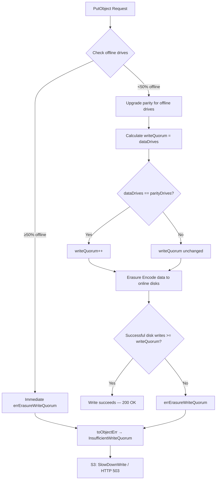
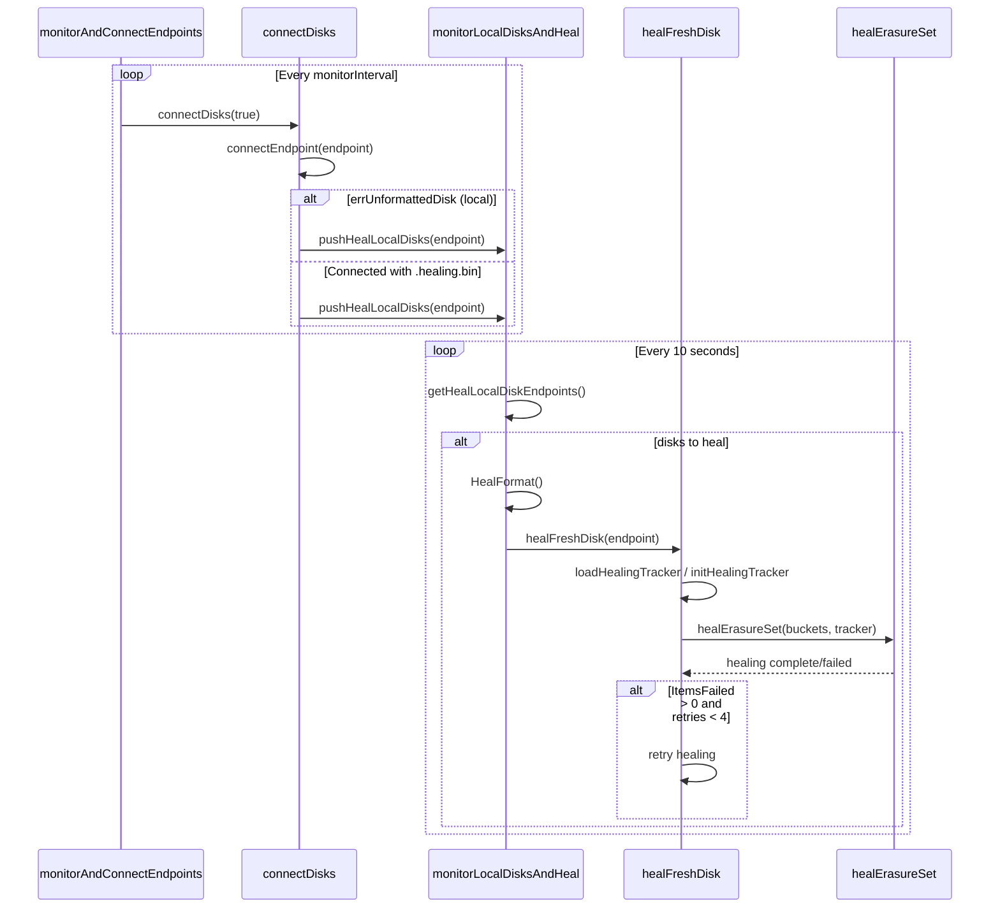
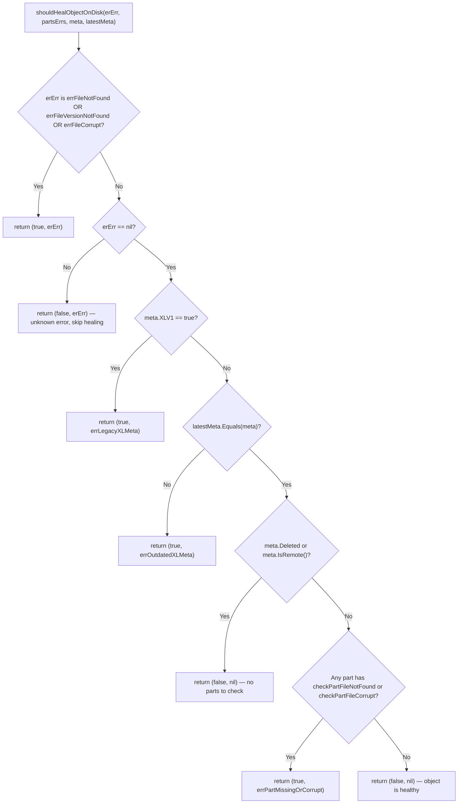

# MinIO Erasure Coding: Drive Failure Behavior — Source Code Investigation

This document investigates what MinIO's erasure coding layer **actually does** during drive failure scenarios, based exclusively on source code analysis — not marketing documentation or external guides.

Every technical claim is grounded in the MinIO source code with specific file paths and line numbers cited. Where hypothetical metric values are presented, they are computed from code-verified formulas for a 16-drive erasure set with default EC:4 parity.

## Methodology

- All answers are derived exclusively from source code analysis of the MinIO repository (`cmd/` package).
- File paths and line numbers are cited for every technical claim using the format: `Source: path/to/file.go:LineNumber`.
- Error messages, log strings, and metric names are quoted verbatim from source code.
- Hypothetical metric values are computed for a concrete example deployment: a single 16-drive erasure set with default EC:4 parity (12 data + 4 parity drives).
- No assumptions are made; all behavior described is directly traceable to code.

## Scope

This document covers six question areas:

- **Write-Path Failure Behavior** — What error does an S3 client receive when a drive fails during a PutObject?
- **Read-Path Degraded Behavior** — Can objects written before a drive failure still be read? What mechanism enables this?
- **Healing Trigger Conditions** — What event causes MinIO to start healing when a drive returns online?
- **Healing Decision Criteria** — How does MinIO decide that a specific object on a specific drive needs healing?
- **Healing Log Output** — What log messages appear during an active healing operation?
- **Health Metrics Under Failure** — What Prometheus metrics track drive health, and what values do they show during a failure?

---

## 1. Erasure Coding Fundamentals

Before examining failure behavior, it is essential to understand how MinIO calculates quorum — the minimum number of drives required for a read or write operation to succeed.

### 1.1 Quorum Calculation

The function `objectQuorumFromMeta` determines the read and write quorum for every object operation.

`Source: cmd/erasure-metadata.go:531-564`

**The quorum formulas are:**

- `readQuorum = dataBlocks` — The minimum number of drives needed to reconstruct an object's data. `Source: cmd/erasure-metadata.go:555,564`
- `writeQuorum = dataBlocks` — Under normal conditions. `Source: cmd/erasure-metadata.go:557`
- `writeQuorum = dataBlocks + 1` — When `dataBlocks == parityBlocks` (equal data and parity). This extra drive prevents ambiguity. `Source: cmd/erasure-metadata.go:558-560`

Before computing per-object quorum, the function performs an initial metadata consensus check:

- `expectedRQuorum = len(partsMetaData) / 2` — At least half of the drives must return valid metadata. `Source: cmd/erasure-metadata.go:533`
- If `defaultParityCount == 0` (no parity), all drives must return valid metadata: `expectedRQuorum = len(partsMetaData)`. `Source: cmd/erasure-metadata.go:536`

**Concrete examples for a 16-drive erasure set:**

| Configuration | Data Drives | Parity Drives | Read Quorum | Write Quorum |
|---|---|---|---|---|
| EC:4 (default) | 12 | 4 | 12 | 12 |
| EC:8 (data == parity) | 8 | 8 | 8 | **9** (dataBlocks + 1) |

### 1.2 Availability-Optimized Parity Upgrade

When drives go offline, MinIO does not simply fail writes if quorum can still be met. Instead, it dynamically increases the parity count to maintain redundancy on the remaining drives. This behavior is controlled by the `AvailabilityOptimized` storage class setting (enabled by default).

`Source: cmd/erasure-object.go:1291-1318`

**How it works:**

- For each offline drive detected, `parityDrives` is incremented by one. `Source: cmd/erasure-object.go:1296-1301`
- **Critical 50%+ threshold**: If `offlineDrives >= (len(storageDisks)+1)/2` — meaning half or more drives are offline — the operation returns `errErasureWriteQuorum` immediately, without attempting the write. `Source: cmd/erasure-object.go:1304-1308`
- **Parity cap**: The upgraded parity is capped at `len(storageDisks)/2` to ensure at least one data block exists. `Source: cmd/erasure-object.go:1311-1313`
- **Metadata annotation**: When parity is upgraded, MinIO records the change in object metadata: `userDefined[minIOErasureUpgraded] = strconv.Itoa(parityOrig) + "->" + strconv.Itoa(parityDrives)`. `Source: cmd/erasure-object.go:1315-1316`

---

## 2. Write-Path Behavior During Drive Failure

> **Question**: What error code and message does MinIO return to an S3 client when a drive becomes unavailable during an active write (PutObject) operation? Does the write succeed or fail?

### 2.1 Write Quorum Enforcement

After the parity upgrade logic (Section 1.2), the `putObject` function calculates the final write quorum:

`Source: cmd/erasure-object.go:1319-1326`

- `dataDrives := len(storageDisks) - parityDrives` — Data drives are whatever remains after parity. `Source: cmd/erasure-object.go:1319`
- `writeQuorum := dataDrives` — Base write quorum. `Source: cmd/erasure-object.go:1323`
- `if dataDrives == parityDrives { writeQuorum++ }` — Extra drive required when data equals parity. `Source: cmd/erasure-object.go:1324-1326`

### 2.2 Encoding-Phase Quorum Check

During the actual data write, the `multiWriter.Write` function in the erasure encoder writes blocks to each online drive and checks quorum.

`Source: cmd/erasure-encode.go:34-66`

- Per-disk writes happen in a loop (lines 35-53). If a disk is `nil` or already errored, it is skipped with `errDiskNotFound`.
- After all writes, a quorum check occurs:
  - `nilCount := countErrs(p.errs, nil)` — Count of successful writes. `Source: cmd/erasure-encode.go:59`
  - `if nilCount >= p.writeQuorum { return nil }` — If enough drives succeeded, the write succeeds. `Source: cmd/erasure-encode.go:60-62`
  - Otherwise, `reduceWriteQuorumErrs` is called, which returns `errErasureWriteQuorum` if successful writes fall below `writeQuorum`. `Source: cmd/erasure-encode.go:64`
- The error is wrapped with offline disk count information: `fmt.Errorf("%w (offline-disks=%d/%d)", writeErr, countErrs(p.errs, errDiskNotFound), len(p.writers))`. `Source: cmd/erasure-encode.go:65`

### 2.3 Complete Error Chain (Internal → S3 Response)

When a write fails due to insufficient online drives, the error propagates through three layers before reaching the S3 client:

| Step | Error | Detail | Source |
|---|---|---|---|
| 1. Internal Sentinel | `errErasureWriteQuorum` | `"Write failed. Insufficient number of drives online"` | `cmd/erasure-errors.go:26` |
| 2. Object API Wrapping | `InsufficientWriteQuorum{Bucket, Object}` | `"Storage resources are insufficient for the write operation <bucket>/<object>"` | `cmd/object-api-errors.go:245-249` |
| 3. S3 API Response | `ErrSlowDownWrite` | S3 Code: `"SlowDownWrite"`, Description: `"Resource requested is unwritable, please reduce your request rate"`, HTTP Status: **503 Service Unavailable** | `cmd/api-errors.go:874-878` |

The `InsufficientWriteQuorum` error wraps `errErasureWriteQuorum` via its `Unwrap()` method, preserving the full error chain. `Source: cmd/object-api-errors.go:253-254`

The `reduceWriteQuorumErrs` helper is the bridge between the raw error array and the sentinel. It calls `reduceQuorumErrs` with `errErasureWriteQuorum` as the default error. `Source: cmd/erasure-metadata-utils.go:156-158`

### 2.4 Write Success vs. Failure Thresholds

The following table shows what happens for a **16-drive erasure set with default EC:4 parity** as drives go offline. The availability-optimized parity upgrade dynamically adjusts the data/parity ratio.

| Offline Drives | Upgraded Parity | Data Drives | Write Quorum | Online Drives Available | Result |
|---|---|---|---|---|---|
| 0 | 4 | 12 | 12 | 16 | **SUCCESS** |
| 1 | 5 | 11 | 11 | 15 | **SUCCESS** |
| 2 | 6 | 10 | 10 | 14 | **SUCCESS** |
| 3 | 7 | 9 | 9 | 13 | **SUCCESS** |
| 4 | 8 | 8 | **9** (data==parity) | 12 | **SUCCESS** (tight — needs all 12 remaining, but WQ=9 so 3 can still fail during write) |
| 5 | 8 (capped at 16/2) | 8 | **9** | 11 | **SUCCESS** (parity capped, WQ=9, have 11) |
| 6 | 8 (capped) | 8 | **9** | 10 | **SUCCESS** |
| 7 | 8 (capped) | 8 | **9** | 9 | **SUCCESS** (exactly at quorum — zero margin) |
| 8 | — | — | — | 8 | **FAIL** — ≥50% offline → immediate `errErasureWriteQuorum` |

**Key insight**: With availability-optimized parity, a 16-drive EC:4 set can tolerate up to 7 offline drives for writes (though with degraded redundancy). At 8+ offline drives (≥50%), writes fail immediately before any encoding is attempted. `Source: cmd/erasure-object.go:1304`

---

## 3. Read-Path Behavior for Pre-Existing Objects

> **Question**: Can objects stored before a drive failure still be read successfully? If reads fail, what is the exact error returned? If reads succeed, what erasure decoding mechanism makes this possible?

### 3.1 Successful Degraded Reads

**Yes, objects stored before a drive failure can still be read**, as long as the number of remaining online drives meets or exceeds `readQuorum` (which equals `dataBlocks`).

The read path flows through `GetObjectNInfo`:

`Source: cmd/erasure-object.go:200-305`

- Step 1: `getObjectFileInfo` reads object metadata (xl.meta) from available drives and establishes a quorum consensus. `Source: cmd/erasure-object.go:236`
- Step 2: `getObjectWithFileInfo` reads the actual data shards from online drives. `Source: cmd/erasure-object.go:291`

The `readQuorum` is calculated by `objectQuorumFromMeta` as `dataBlocks`. For a 16-drive EC:4 set, `readQuorum = 12`, meaning **up to 4 drives can be offline** and reads still succeed.

**How reconstruction works**: The `parallelReader` in `cmd/erasure-decode.go` reads shards from all available online drives. When some shards are missing (due to offline drives), the Reed-Solomon decoder reconstructs the missing data shards from the available parity shards. As long as at least `dataBlocks` shards (from any combination of data and parity) are available, the original data can be perfectly reconstructed.

### 3.2 Read Failure Error

When too many drives are offline and `readQuorum` cannot be met, the error chain is:

| Step | Error | Detail | Source |
|---|---|---|---|
| 1. Internal Sentinel | `errErasureReadQuorum` | `"Read failed. Insufficient number of drives online"` | `cmd/erasure-errors.go:23` |
| 2. Object API Wrapping | `InsufficientReadQuorum{Bucket, Object, Err, Type}` | `"Storage resources are insufficient for the read operation <bucket>/<object>"` | `cmd/object-api-errors.go:228-237` |
| 3. S3 API Response | `ErrSlowDownRead` | S3 Code: `"SlowDownRead"`, Description: `"Resource requested is unreadable, please reduce your request rate"`, HTTP Status: **503 Service Unavailable** | `cmd/api-errors.go:869-873` |

The `InsufficientReadQuorum` struct includes a `Type` field of type `RQErrType`, which can be:
- `RQInsufficientOnlineDrives` — Not enough drives are online. `Source: cmd/object-api-errors.go:220`
- `RQInconsistentMeta` — Metadata is inconsistent across drives. `Source: cmd/object-api-errors.go:221-222`

The `reduceReadQuorumErrs` helper calls `reduceQuorumErrs` with `errErasureReadQuorum` as the default error returned when the quorum count is not met. `Source: cmd/erasure-metadata-utils.go:150-152`

### 3.3 MRF (Most Recently Failed) Partial Operation Tracking

When a write succeeds with quorum but not all drives receive the data (because some drives were offline), MinIO does not simply forget about the missing copies. The MRF (Most Recently Failed) subsystem tracks these partial operations for background repair.

`Source: cmd/mrf.go:38-59`

- **`PartialOperation` struct** (lines 51-59): Tracks `Bucket`, `Object`, `VersionID`, `SetIndex`, `PoolIndex`, and `Queued` timestamp for each partially-written object.
- **Queue size**: `mrfOpsQueueSize = 100000` — Up to 100,000 partial operations can be queued. `Source: cmd/mrf.go:39`
- **Persistence directory**: `healMRFDir = bucketMetaPrefix + "/.heal/mrf"` — MRF state is persisted to disk so it survives server restarts. `Source: cmd/mrf.go:44`

**How MRF bridges write success and healing**: When a PutObject succeeds (quorum met) but some drives missed the write, the object is enqueued as a `PartialOperation`. The MRF background worker periodically processes this queue and attempts to heal the missing copies, ensuring that the full redundancy level is eventually restored — even before a full drive-level healing cycle occurs.

---

## 4. Healing Mechanism

### 4.1 Healing Trigger: Drive Reconnection Pipeline

> **Question**: What specific event or condition causes MinIO to initiate a healing operation when a drive returns online?

Healing is triggered through a three-stage pipeline that connects drive reconnection detection to actual healing execution.

**Stage 1: Drive Reconnection Monitoring**

The `monitorAndConnectEndpoints` function runs a periodic loop that checks for disconnected drives and attempts to reconnect them.

`Source: cmd/erasure-sets.go:283-309`

- Runs a periodic timer with `monitorInterval`. `Source: cmd/erasure-sets.go:291,306`
- On each tick, calls `s.connectDisks(true)`. `Source: cmd/erasure-sets.go:303`

**Stage 2: Disk Connection and Healing Detection**

The `connectDisks` function processes each endpoint, attempting to reconnect offline drives.

`Source: cmd/erasure-sets.go:194-278`

- For each endpoint where the disk is `nil` or offline, it calls `connectEndpoint(endpoint)`. `Source: cmd/erasure-sets.go:224`
- **Unformatted disk detection**: If the connection returns `errUnformattedDisk` AND the endpoint is local, the drive is pushed to the healing queue via `globalBackgroundHealState.pushHealLocalDisks(endpoint)`. `Source: cmd/erasure-sets.go:226-227`
- **Interrupted healing detection**: If a disk connects successfully and has an unfinished healing tracker (`.healing.bin` file where `h.Finished` is false), it is also pushed to the healing queue. `Source: cmd/erasure-sets.go:235-239`

**Stage 3: Healing Execution**

The `monitorLocalDisksAndHeal` function is the healing executor that processes drives pushed to the healing queue.

`Source: cmd/background-newdisks-heal-ops.go:563-609`

- **Timer interval**: `defaultMonitorNewDiskInterval = time.Second * 10` — checks every 10 seconds. `Source: cmd/background-newdisks-heal-ops.go:40`
- On each tick, it checks `globalBackgroundHealState.getHealLocalDiskEndpoints()` for drives that need healing. `Source: cmd/background-newdisks-heal-ops.go:573`
- If disks need healing:
  - First calls `z.HealFormat()` to reformat unformatted drives. `Source: cmd/background-newdisks-heal-ops.go:581`
  - Then launches a goroutine per disk calling `healFreshDisk`. `Source: cmd/background-newdisks-heal-ops.go:589-602`

**The `healFreshDisk` function** performs the actual healing:

`Source: cmd/background-newdisks-heal-ops.go:419-558`

- Acquires a distributed lock `new-drive-healing/<poolIdx>/<setIdx>` to prevent parallel healing of the same erasure set. `Source: cmd/background-newdisks-heal-ops.go:438`
- Loads an existing `healingTracker` or creates a new one. `Source: cmd/background-newdisks-heal-ops.go:448-458`
- Calls `healErasureSet` to iterate through all buckets and objects, healing each one. `Source: cmd/background-newdisks-heal-ops.go:495`
- **Retry logic**: If `tracker.ItemsFailed > 0` and `tracker.RetryAttempts < 4`, the healing is retried (up to 4 retries). `Source: cmd/background-newdisks-heal-ops.go:500-510`
- The retry sentinel is `errRetryHealing` = `"some items failed to heal, we will retry healing this drive again"`. `Source: cmd/background-newdisks-heal-ops.go:417`

### 4.2 Per-Object Healing Criteria: `shouldHealObjectOnDisk`

> **Question**: What criteria does the system use to determine that a particular object on a particular drive needs to be healed?

The `shouldHealObjectOnDisk` function evaluates whether a specific object on a specific drive requires healing. It takes four inputs: the error from reading the disk's metadata (`erErr`), the part file verification results (`partsErrs`), the disk's metadata (`meta`), and the latest known-good metadata (`latestMeta`).

`Source: cmd/erasure-healing.go:156-183`

The decision tree has the following conditions, evaluated in order:

1. **Missing or corrupt metadata** (line 157): If `erErr` is `errFileNotFound`, `errFileVersionNotFound`, or `errFileCorrupt` → returns `(true, erErr)`. The object's xl.meta file is missing or corrupted on this disk.

2. **Unknown error** (line 182): If `erErr` is non-nil but not one of the above → returns `(false, erErr)`. Healing is **not** attempted for unrecognized errors. This is a safety measure.

3. **Legacy XLV1 metadata** (lines 160-164): If `erErr` is nil and `meta.XLV1 == true` → returns `(true, errLegacyXLMeta)`. Legacy format metadata always triggers healing. The sentinel is `errLegacyXLMeta = errors.New("legacy XL meta")`. `Source: cmd/erasure-healing.go:148`

4. **Outdated metadata** (lines 166-168): If `!latestMeta.Equals(meta)` — the disk's metadata does not match the latest known version → returns `(true, errOutdatedXLMeta)`. The sentinel is `errOutdatedXLMeta = errors.New("outdated XL meta")`. `Source: cmd/erasure-healing.go:150`

5. **Missing or corrupt part files** (lines 169-178): If xl.meta is valid and current, but individual part data files (part.N) have `checkPartFileNotFound` or `checkPartFileCorrupt` errors → returns `(true, errPartMissingOrCorrupt)`. The sentinel is `errPartMissingOrCorrupt = errors.New("part missing or corrupt")`. `Source: cmd/erasure-healing.go:152`

6. **No healing needed** (line 180): If none of the above conditions match → returns `(false, nil)`. The object is healthy on this disk.

Note: For deleted objects (`meta.Deleted`) or tiered/remote objects (`meta.IsRemote()`), the part file check is skipped since there are no local part files to verify. `Source: cmd/erasure-healing.go:169`

---

## 5. Healing Log Messages

> **Question**: What specific log messages appear during an active healing operation?

Healing logs use two functions, both tagging output under the `"healing"` subsystem:
- `healingLogEvent` — For informational messages (healing start, progress, completion). `Source: cmd/logging.go:83-84`
- `healingLogIf` — For error/warning messages. `Source: cmd/logging.go:79-80`

### 5.1 Healing Start Messages

| Log Function | Message Template | Source |
|---|---|---|
| `healingLogEvent` | `"Healing drive '%s' - 'mc admin heal alias/ --verbose' to check the current status."` | `cmd/background-newdisks-heal-ops.go:460` |
| `healingLogEvent` | `"Healing drive '%s' - use %d parallel workers."` | `cmd/global-heal.go:210` |

### 5.2 Healing Progress and Error Messages

| Log Function | Message Template | Source |
|---|---|---|
| `healingLogIf` | `"Unable to load healing tracker on '%s': %w, re-initializing.."` | `cmd/background-newdisks-heal-ops.go:456` |
| `healingLogIf` | `"unexpected tracker healing start time found: %v"` | `cmd/global-heal.go:172` |
| `healingLogIf` | Tracker update errors (periodic state persistence) | `cmd/global-heal.go:180, 254, 262, 566` |
| `healingLogIf` | Bucket healing errors | `cmd/global-heal.go:186` |
| `healingLogIf` | `"unable to heal object %s/%s: %w"` (non-versioned) | `cmd/global-heal.go:439` |
| `healingLogIf` | `"unable to heal object %s/%s (version-id=%s): %w"` (versioned) | `cmd/global-heal.go:488` |
| `healingLogIf` | `"unable to heal object %s/%s: %w"` (versioned fallback, no version ID) | `cmd/global-heal.go:491` |
| `healingLogIf` | `"all drives are in healing state, aborting.."` | `cmd/global-heal.go:341` |
| `healingLogIf` | `"listing failed with: %v on bucket: %v"` | `cmd/global-heal.go:556` |

### 5.3 Healing Completion and Retry Messages

| Log Function | Message Template | Source |
|---|---|---|
| `healingLogEvent` | `"Healing of drive '%s' is incomplete, retrying %s time (healed: %d, skipped: %d, failed: %d)."` | `cmd/background-newdisks-heal-ops.go:503-504` |
| `healingLogEvent` | `"Healing of drive '%s' is incomplete, retried %d times (healed: %d, skipped: %d, failed: %d)."` | `cmd/background-newdisks-heal-ops.go:513-514` |
| `healingLogEvent` | `"Healing of drive '%s' is complete, retried %d times (healed: %d, skipped: %d)."` | `cmd/background-newdisks-heal-ops.go:517-518` |
| `healingLogEvent` | `"Healing of drive '%s' is finished (healed: %d, skipped: %d)."` | `cmd/background-newdisks-heal-ops.go:520` |

**Rationale for retry messages**: The healing system attempts up to 4 retries when `tracker.ItemsFailed > 0`. `Source: cmd/background-newdisks-heal-ops.go:500` The first retry uses ordinal formatting (e.g., "1st time"), while subsequent retries use cardinal counts. After all retries are exhausted, a final "incomplete" message is logged with the total retry count. If healing succeeds (either on the first pass or after retries), a "complete" or "finished" message is logged.

---

## 6. Health Metrics During Drive Failure

> **Question**: What are the exact Prometheus metric names that track online versus offline drive counts, and what values do they show before and after a drive failure event?

### 6.1 Cluster-Level Health Metrics

These metrics provide a cluster-wide summary of drive status.

`Source: cmd/metrics-v3-cluster-health.go:22-34`

| Metric Name | Type | Description | Source |
|---|---|---|---|
| `drives_offline_count` | Gauge | Count of offline drives in the cluster | `cmd/metrics-v3-cluster-health.go:23,29-30` |
| `drives_online_count` | Gauge | Count of online drives in the cluster | `cmd/metrics-v3-cluster-health.go:24,31-32` |
| `drives_count` | Gauge | Count of all drives in the cluster | `cmd/metrics-v3-cluster-health.go:25,33-34` |

All three metrics are loaded by `loadClusterHealthDriveMetrics`. `Source: cmd/metrics-v3-cluster-health.go:39`

### 6.2 Per-Drive Metrics

These metrics are emitted per drive with labels identifying the specific drive.

`Source: cmd/metrics-v3-system-drive.go:39-61`

**Drive health indicator**:

| Metric Name | Type | Description | Source |
|---|---|---|---|
| `health` | Gauge | Drive health: `0` = offline, `1` = healthy, `2` = healing | `cmd/metrics-v3-system-drive.go:58,99-100` |

The health values are defined as constants:
- `driveHealthOffline = float64(0)` — `Source: cmd/metrics-v3-system-drive.go:39`
- `driveHealthOnline = float64(1)` — `Source: cmd/metrics-v3-system-drive.go:40`
- `driveHealthHealing = float64(2)` — `Source: cmd/metrics-v3-system-drive.go:41`

**Labels**: `drive`, `pool_index`, `set_index`, `drive_index`. `Source: cmd/metrics-v3-system-drive.go:44`

**Error counters** (per drive):

| Metric Name | Type | Description | Source |
|---|---|---|---|
| `timeout_errors_total` | Counter | Total timeout errors on a drive | `cmd/metrics-v3-system-drive.go:53,87-88` |
| `io_errors_total` | Counter | Total I/O errors on a drive | `cmd/metrics-v3-system-drive.go:54,89-90` |
| `availability_errors_total` | Counter | Total availability errors (I/O + timeouts) on a drive | `cmd/metrics-v3-system-drive.go:55,91-93` |

**Aggregate per-drive counts**:

| Metric Name | Type | Description | Source |
|---|---|---|---|
| `offline_count` | Gauge | Per-drive offline count | `cmd/metrics-v3-system-drive.go:60` |
| `online_count` | Gauge | Per-drive online count | `cmd/metrics-v3-system-drive.go:61` |

### 6.3 Erasure Set Metrics

These metrics are emitted per erasure set with `pool_id` and `set_id` labels.

`Source: cmd/metrics-v3-cluster-erasure-set.go:25-71`

| Metric Name | Type | Description | Source |
|---|---|---|---|
| `overall_write_quorum` | Gauge | Overall write quorum across pools and sets | `cmd/metrics-v3-cluster-erasure-set.go:26,45-46` |
| `overall_health` | Gauge | Overall health across pools and sets (1=healthy, 0=unhealthy) | `cmd/metrics-v3-cluster-erasure-set.go:27,47-48` |
| `read_quorum` | Gauge | Read quorum for the erasure set in a pool | `cmd/metrics-v3-cluster-erasure-set.go:28,49-50` |
| `write_quorum` | Gauge | Write quorum for the erasure set in a pool | `cmd/metrics-v3-cluster-erasure-set.go:29,51-52` |
| `online_drives_count` | Gauge | Count of online drives in the erasure set in a pool | `cmd/metrics-v3-cluster-erasure-set.go:30,53-54` |
| `healing_drives_count` | Gauge | Count of healing drives in the erasure set in a pool | `cmd/metrics-v3-cluster-erasure-set.go:31,55-56` |
| `health` | Gauge | Health of the erasure set in a pool (1=healthy, 0=unhealthy) | `cmd/metrics-v3-cluster-erasure-set.go:32,57-59` |
| `read_tolerance` | Gauge | Number of drive failures tolerable without disrupting reads | `cmd/metrics-v3-cluster-erasure-set.go:33,60-62` |
| `write_tolerance` | Gauge | Number of drive failures tolerable without disrupting writes | `cmd/metrics-v3-cluster-erasure-set.go:34,63-65` |
| `read_health` | Gauge | Read health of the erasure set (1=healthy, 0=unhealthy) | `cmd/metrics-v3-cluster-erasure-set.go:35,66-68` |
| `write_health` | Gauge | Write health of the erasure set (1=healthy, 0=unhealthy) | `cmd/metrics-v3-cluster-erasure-set.go:36,69-71` |

**Labels**: `pool_id`, `set_id`. `Source: cmd/metrics-v3-cluster-erasure-set.go:40-42`

**Tolerance calculation** from `loadClusterErasureSetMetrics`:

`Source: cmd/metrics-v3-cluster-erasure-set.go:99-113`

- `readTolerance = HealthyDrives - ReadQuorum` — `Source: cmd/metrics-v3-cluster-erasure-set.go:100`
- `writeTolerance = HealthyDrives + HealingDrives - WriteQuorum` — `Source: cmd/metrics-v3-cluster-erasure-set.go:108`

**Key insight**: Healing drives count toward `writeTolerance` (they are additive on top of `HealthyDrives`) but do **not** contribute to `readTolerance`. This is because healing drives can accept new writes but may not yet have all historical data needed for reads.

### 6.4 Healthcheck Endpoint Behavior

MinIO exposes HTTP healthcheck endpoints that complement the Prometheus metrics:

**`/minio/health/cluster` — Write Health Check**

`Source: cmd/healthcheck-handler.go:56-90`

- Returns `X-Minio-Write-Quorum` header with the current write quorum value. `Source: cmd/healthcheck-handler.go:72`
- Returns `X-Minio-Storage-Class-Defaults` header. `Source: cmd/healthcheck-handler.go:73`
- Returns `X-Minio-Healing-Drives` header when drives are actively healing (value > 0). `Source: cmd/healthcheck-handler.go:75-77`
- Returns **HTTP 200** if the cluster is healthy for writes. `Source: cmd/healthcheck-handler.go:89`
- Returns **HTTP 503** if write quorum cannot be satisfied. `Source: cmd/healthcheck-handler.go:85`

**`/minio/health/cluster/read` — Read Health Check**

`Source: cmd/healthcheck-handler.go:92-127`

- Returns `X-Minio-Read-Quorum` header with the current read quorum value. `Source: cmd/healthcheck-handler.go:109`
- Returns `X-Minio-Healing-Drives` header when drives are healing. `Source: cmd/healthcheck-handler.go:112-113`
- Returns **HTTP 200** if the cluster is healthy for reads. `Source: cmd/healthcheck-handler.go:126`
- Returns **HTTP 503** if read quorum cannot be satisfied. `Source: cmd/healthcheck-handler.go:122`

### 6.5 Example: Metric Values for 16-Drive EC:4 Deployment

The following table shows expected metric values for a single 16-drive erasure set with default EC:4 parity (12 data + 4 parity) across three states: all healthy, one drive offline, and one drive returning and healing.

| Metric | All Healthy | 1 Drive Offline | Drive Returning (Healing) |
|---|---|---|---|
| `drives_count` | 16 | 16 | 16 |
| `drives_online_count` | 16 | 15 | 16 |
| `drives_offline_count` | 0 | 1 | 0 |
| Per-drive `health` (failed drive) | 1 | **0** | **2** |
| Per-drive `health` (other drives) | 1 | 1 | 1 |
| Erasure set `online_drives_count` | 16 | 15 | 16 |
| Erasure set `healing_drives_count` | 0 | 0 | **1** |
| `read_quorum` | 12 | 12 | 12 |
| `write_quorum` | 12 | 12 | 12 |
| `read_tolerance` | 4 (16−12) | **3** (15−12) | 4 (16−12) |
| `write_tolerance` | 4 (16+0−12) | **3** (15+0−12) | **5** (16+1−12) |
| `health` | 1 | 1 | 1 |
| `read_health` | 1 | 1 | 1 |
| `write_health` | 1 | 1 | 1 |
| `/minio/health/cluster` | 200 OK | 200 OK | 200 OK |
| `X-Minio-Healing-Drives` | (not set) | (not set) | **1** |

**Rationale for `write_tolerance = 5` during healing**: The formula is `HealthyDrives + HealingDrives - WriteQuorum`. When the drive returns and begins healing, it is counted in `HealthyDrives` (it is online) AND in `HealingDrives`. So `writeTolerance = 16 + 1 - 12 = 5`. This reflects the reality that a healing drive can accept new writes (it functions as a normal drive for new operations), so the cluster's write resilience is actually improved. `Source: cmd/metrics-v3-cluster-erasure-set.go:108`

**Rationale for `read_tolerance` not including healing drives**: `readTolerance = HealthyDrives - ReadQuorum = 16 - 12 = 4`. The healing drive is counted in `HealthyDrives` (it's online), but `HealingDrives` is not added. This is because while the healing drive is online for new reads, historical data not yet healed may still be missing on that drive. `Source: cmd/metrics-v3-cluster-erasure-set.go:100`

---

## 7. Source References

The following source files were analyzed to produce this document:

| Category | File Path | Content Referenced |
|---|---|---|
| **Erasure Error Definitions** | `cmd/erasure-errors.go` | `errErasureReadQuorum`, `errErasureWriteQuorum`, `errNoHealRequired` sentinels |
| **Storage Error Definitions** | `cmd/storage-errors.go` | `errUnformattedDisk`, `errDiskNotFound`, `errFaultyDisk`, `errFileNotFound`, `errFileVersionNotFound` |
| **Object Write Path** | `cmd/erasure-object.go` | `PutObject`/`putObject` write quorum logic, parity upgrade, `GetObjectNInfo` read path |
| **Erasure Encoding** | `cmd/erasure-encode.go` | `multiWriter.Write` per-disk error tracking and quorum check |
| **Erasure Decoding** | `cmd/erasure-decode.go` | `parallelReader` for Reed-Solomon reconstruction |
| **S3 Error Code Mapping** | `cmd/api-errors.go` | `ErrSlowDownRead` (HTTP 503), `ErrSlowDownWrite` (HTTP 503) |
| **Object API Error Types** | `cmd/object-api-errors.go` | `InsufficientReadQuorum`, `InsufficientWriteQuorum` structs and error messages |
| **Quorum Calculation** | `cmd/erasure-metadata.go` | `objectQuorumFromMeta` — derives `readQuorum` and `writeQuorum` |
| **Quorum Reduction Logic** | `cmd/erasure-metadata-utils.go` | `reduceReadQuorumErrs`, `reduceWriteQuorumErrs` |
| **Healing Trigger** | `cmd/background-newdisks-heal-ops.go` | `monitorLocalDisksAndHeal` (10s timer), `healFreshDisk`, healing log messages, retry logic |
| **Healing Criteria** | `cmd/erasure-healing.go` | `shouldHealObjectOnDisk` decision function, healing error sentinels |
| **Healing Common** | `cmd/erasure-healing-common.go` | `commonTime`, `commonETags` quorum helpers |
| **Healing Orchestration** | `cmd/global-heal.go` | `healErasureSet`, worker allocation, per-object healing, log messages |
| **MRF Subsystem** | `cmd/mrf.go` | `PartialOperation` struct, MRF queue, persistence |
| **Drive Reconnection** | `cmd/erasure-sets.go` | `connectDisks`, `monitorAndConnectEndpoints` |
| **Disk Health Checking** | `cmd/xl-storage-disk-id-check.go` | `IsOnline`, disk state management |
| **Healthcheck Endpoints** | `cmd/healthcheck-handler.go` | `ClusterCheckHandler`, `ClusterReadCheckHandler` |
| **Cluster Health Metrics** | `cmd/metrics-v3-cluster-health.go` | `drives_offline_count`, `drives_online_count`, `drives_count` |
| **Per-Drive Metrics** | `cmd/metrics-v3-system-drive.go` | Per-drive `health` (0/1/2), error counters, labels |
| **Erasure Set Metrics** | `cmd/metrics-v3-cluster-erasure-set.go` | Per-set `online_drives_count`, `healing_drives_count`, tolerance calculations |
| **Server Pool Health** | `cmd/erasure-server-pool.go` | Health aggregation across pools and sets |
| **Logging Infrastructure** | `cmd/logging.go` | `healingLogIf`, `healingLogEvent` function definitions |
| **Format Preparation** | `cmd/prepare-storage.go` | `waitForFormatErasure`, drive format initialization |
