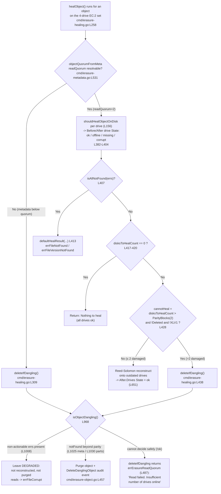

# How MinIO's Healing Subsystem Decides Recovery Outcomes on a 4‑Drive Erasure‑Coded (EC:2) Instance

> An evidence‑backed onboarding investigation, grounded in real captured runtime behavior and exact source citations at pinned commit `c07e5b49d477b0774f23db3b290745aef8c01bd2` (branch `minio_c07e5b49d477`).

**Abstract.** When an object's on‑disk state is *ambiguous* across the four drives of an erasure‑coded MinIO set — some drives holding valid shards, some holding corrupted shards, some holding nothing — the healing subsystem does **not** blindly reconstruct. It makes a three‑way decision: **reconstruct** the object from surviving shards, **leave it degraded** (neither rebuilt nor purged), or **leave it deleted / purge it as dangling**. This document answers, with verbatim runtime evidence captured from a live 4‑drive `EC:2` server plus exact `file:line` citations into the healing source, *how* that decision is made, *what output reveals it*, *why* the logs justify it, and where the precise boundaries lie. Every behavioral claim below is paired with the exact observed output line that demonstrates it, and every value the question asks for is cited as a literal at its source location. Where an observation was surprising or environment‑specific, it is reported exactly as seen and flagged as such rather than smoothed over.

---

## 1. Introduction — the 4‑drive EC:2 model & the governing decision

### 1.1 The 4‑drive EC:2 layout

A MinIO server started with four drives (`minio server .../data/{1,2,3,4}`) forms a single erasure set. For an erasure set of five or fewer drives, the default storage class is **`EC:2`** — two data blocks and two parity blocks.

- **Documented default parity** — the storage‑class table states that an erasure set of "5 or fewer" drives defaults to `EC:2` (`docs/erasure/storage-class/README.md:L52`; the sentence introducing the table is at `L48`). The maximum‑redundancy tolerance of "up to half (N/2) of the total drives" is documented at `docs/erasure/README.md:L3`, and the N/2‑data / N/2‑parity default at `docs/erasure/README.md:L9`.
- **DataBlocks = 2, ParityBlocks = 2.** With four drives the layout is 2 data + 2 parity per object.
- **Read quorum = 2, write quorum = 3.** These come directly from `objectQuorumFromMeta` (`cmd/erasure-metadata.go:L531`). Its body computes `dataBlocks := len(partsMetaData) - parityBlocks`, sets `writeQuorum := dataBlocks`, and then — critically for `EC:2` — bumps write quorum by one when data equals parity:

```go
// cmd/erasure-metadata.go (objectQuorumFromMeta, func at L531)
dataBlocks := len(partsMetaData) - parityBlocks   // L555

writeQuorum := dataBlocks                          // L557
if dataBlocks == parityBlocks {                    // L558
    writeQuorum++                                  // L559
}
// ...
return dataBlocks, writeQuorum, nil                // L564
```

Because the function returns `objectReadQuorum = dataBlocks`, for `EC:2` (where `dataBlocks == parityBlocks == 2`) the read quorum is **2** and the write quorum is **3**. Erasure coding is per object — "Healing is also done per object within the erasure set which contains the object" (`docs/distributed/DESIGN.md:L99`).

### 1.2 How ambiguous state arises

Each drive stores a per‑object `xl.meta` (the erasure metadata; for small objects the data is inlined into `xl.meta`) and, for larger objects, a `<dataDirUUID>/part.N` shard alongside it. Ambiguity arises when these per‑drive artifacts disagree: a drive may have a **valid** shard, a **corrupt** shard (bit‑rot — present but failing its checksum), or **nothing** (the `xl.meta` and/or data‑dir is absent). MinIO must decide what the "true" object is and what to do about the drives that disagree.

MinIO deliberately distinguishes **absence** from **corruption**. Only `errFileNotFound` (`cmd/storage-errors.go:L71`) and `errFileVersionNotFound` (`cmd/storage-errors.go:L74`) are counted as "not found"; every other error — including bit‑rot corruption (`errFileCorrupt`, `cmd/storage-errors.go:L104`) — is treated as *non‑actionable*. This split is implemented in `danglingMetaErrsCount` (`cmd/erasure-healing.go:L934`) and `danglingPartErrsCount` (`cmd/erasure-healing.go:L950`) and is the reason corrupt‑but‑present shards are *reconstructed* while genuinely absent shards *beyond parity* are *purged*.

### 1.3 The three possible outcomes

1. **Reconstruct.** If the number of drives needing healing is within parity (`disksToHealCount <= ParityBlocks`, i.e. `<= 2` for `EC:2`), MinIO Reed‑Solomon‑rebuilds the missing/damaged shards onto the outdated drives and flips their `After` state to `ok`.
2. **Leave degraded.** If the disagreement is *non‑actionable* (e.g. metadata corrupted — not deleted — beyond quorum), `isObjectDangling` returns `false` at its non‑actionable guard (`cmd/erasure-healing.go:L1008`) and the object is neither reconstructed nor purged; reads surface `errFileCorrupt`.
3. **Leave deleted / purge as dangling.** If genuine absence exceeds parity (`notFoundMetaErrs > ParityBlocks` or `notFoundPartsErrs > ParityBlocks`), the object is treated as dangling and purged, with a `DeleteDanglingObject` audit event recording the rationale.

### 1.4 The governing decision flow

The reconstruct‑vs‑abandon decision has **two gates in sequence**. The *first* gate is read quorum on the metadata itself: `healObject` calls `objectQuorumFromMeta` at `cmd/erasure-healing.go:L307`, and if it returns an error (the metadata is below read quorum), the object is routed **straight** to `deleteIfDangling` at `cmd/erasure-healing.go:L309` — before any per‑drive analysis, `disksToHealCount`, or `cannotHeal` is reached (this is the path the full‑shard‑wipe case of Section 6 takes). *Only if* quorum resolves does the *second* gate apply — the `cannotHeal` predicate (`cmd/erasure-healing.go:L428`), which decides reconstruct vs abandon for the drives that still need healing:

```go
// cmd/erasure-healing.go:L428
cannotHeal := !latestMeta.XLV1 && !latestMeta.Deleted && disksToHealCount > latestMeta.Erasure.ParityBlocks
```

For a normal (non‑legacy `XLV1`, non‑`Deleted`) object on `EC:2`, `cannotHeal` becomes true only when **more than 2** of the 4 drives need healing — i.e. only 1 intact shard remains.

One nuance to keep in mind: `cannotHeal` is not the final word. Immediately after it is computed there is an **escape hatch** — if `cannotHeal` is true but a quorum ETag was resolved, `cannotHeal` is reset to `false` and reconstruction is attempted anyway (`cmd/erasure-healing.go:L429-L433`):

```go
// cmd/erasure-healing.go:L429-L433
if cannotHeal && quorumETag != "" {
    // This is an object that is supposed to be removed by the dangling code
    // but we noticed that ETag is the same for all objects, let's give it a shot
    cannotHeal = false
}
```

In every case observed in this investigation the escape hatch did **not** change the outcome (for the partial‑WRITE object of Section 8.1 the object was still purged via the `cannotHeal` branch, evidenced by its `caller` tag pointing at `cmd/erasure-healing.go:L438`), but it is part of the governing decision and is noted here for completeness. The following flowchart mirrors the exercised code paths:



The remainder of this document walks each branch with the captured runtime evidence that exercised it.

---

## 2. Environment used

The runtime investigation was performed against a purpose‑built 4‑drive `EC:2` server, all artifacts confined to `/tmp` and removed afterward (the repository was left byte‑for‑byte unchanged; `git status --porcelain` was verified empty before this document was written).

| Aspect | Value (verbatim) |
|--------|------------------|
| Commit | `c07e5b49d477b0774f23db3b290745aef8c01bd2` (branch `minio_c07e5b49d477`) |
| Build command | `CGO_ENABLED=0 go build -tags kqueue` |
| Go toolchain | Go 1.23.12 (go.mod requires `go 1.23`, `go.mod:L3`) |
| Server banner | `minio version DEVELOPMENT.GOGET (go1.23.12 linux/amd64)` |
| Client | `mc version RELEASE.2025-08-13T08-35-41Z` |
| Topology | 4‑drive standalone erasure set: `minio server .../data/{1,2,3,4}` with `MINIO_CI_CD=1` + root credentials |
| Startup log | `INFO: Formatting 1st pool, 1 set(s), 4 drives per set.` |
| On‑disk layout (small object) | only `xl.meta` per drive (data inlined) |
| On‑disk layout (≥1 MiB object) | `xl.meta` + `<dataDirUUID>/part.1` per drive |
| `xl-meta` decode (small object) | `EcM: 2`, `EcN: 2`, `Size: 35` (tool at `docs/debugging/xl-meta/main.go`) |
| Audit capture | Audit webhook → local sink used to capture dangling‑purge audit events |

The startup banner and the `xl-meta` decode confirm the `EC:2` shape used throughout — `EcM: 2` (data) and `EcN: 2` (parity):

```text
INFO: Formatting 1st pool, 1 set(s), 4 drives per set.
```

```text
# docs/debugging/xl-meta decode of the small object (35-byte objA.txt)
EcM: 2
EcN: 2
Size: 35
```

`mc admin info` reports the same set as `EC:2`, verbatim:

```text
$ mc admin info inv
●  127.0.0.1:9000
   Uptime: 10 seconds
   Version: <development>
   Network: 1/1 OK
   Drives: 4/4 OK
   Pool: 1

┌──────┬──────────────────────┬─────────────────────┬──────────────┐
│ Pool │ Drives Usage         │ Erasure stripe size │ Erasure sets │
│ 1st  │ 1.1% (total: 48 TiB) │ 4                   │ 1            │
└──────┴──────────────────────┴─────────────────────┴──────────────┘

4 drives online, 0 drives offline, EC:2
```

The final line — `4 drives online, 0 drives offline, EC:2` — is the client‑side confirmation of the 2‑data/2‑parity geometry, matching `EcM: 2`/`EcN: 2` above. All investigation artifacts (the built binary, the `mc` client, the scenario data directories, and every temporary observation script) resided under `/tmp` and were deleted when the investigation concluded.


---

## 3. Per‑scenario evidence walk‑through

This section answers sub‑questions **(1) ambiguous‑state resolution**, **(2) reconstruct‑vs‑abandon**, and **(3) per‑case runtime evidence** by exercising each of the three outcomes on the live server and pasting the captured output next to each claim. The ordering follows the required structure: **(A) successful reconstruction**, then **(C) leave‑degraded**, then **(B) leave‑deleted/purged**.

### (A) Successful reconstruction — damage ≤ ParityBlocks

**Claim: when at most `ParityBlocks` (2) drives are damaged, MinIO reconstructs the object and flips every drive's `After` state to `ok`.** This is the "No" branch of `cannotHeal` (`cmd/erasure-healing.go:L428`): with `disksToHealCount <= 2` the predicate is false, so the object is Reed‑Solomon rebuilt and each healed drive's after‑state is set to `ok` at `cmd/erasure-healing.go:L651` (`result.After.Drives[i].State = madmin.DriveStateOk`).

**A1 — missing metadata on 1 drive.** Deleted `xl.meta` on drive 1, then ran `mc admin heal --json inv/testbucket/objA.txt`. Observed per‑drive `before → after` transition:

```text
before states: ['missing', 'ok', 'ok', 'ok']   (color yellow, online 3)
after  states: ['ok', 'ok', 'ok', 'ok']         (color green,  online 4)
```

The single missing `xl.meta` (1 drive ≤ parity 2) was reconstructed: `xl.meta` was restored on drive 1 and a post‑heal dry‑run reported all drives `ok`/green. The `missing` state here is produced by the `DriveStateMissing` case at `cmd/erasure-healing.go:L388-389`, and the `ok` after‑state by `cmd/erasure-healing.go:L651`.

**A3 — corrupt `part.1` on 2 drives (== parity), deep scan.** Zeroed the first 4096 bytes of `part.1` on drives 1 & 2 with `dd`, then healed with `--scan deep` (deep scan enables bit‑rot checksum verification via `scanMode = madmin.HealDeepScan`, `cmd/data-scanner.go:L964`). Observed:

```text
before states: ['missing', 'missing', 'ok', 'ok']   (color red, online 2)
after  states: ['ok', 'ok', 'ok', 'ok']              (color green, online 4)
```

Two damaged shards equal parity (`2 == ParityBlocks`), so `cannotHeal` is false and reconstruction proceeds. Integrity was confirmed by re‑download:

```text
downloaded object sha256 == original: 8c94c3b39fb86be1b2b4ce7efeef9821221e77a836704eab8bed4568b3603304
drive-1 part.1 first bytes now random: 04 8e 7b f7 ...
zero bytes in first 4096 of drive-1 part.1: 14  (was 4096 before heal)  => shard rebuilt
```

**As‑seen nuance — a bit‑rot CORRUPT part is reported with drive `State = "missing"`, not `"corrupt"`.** This is not intuitive but is exactly what the code does: a corrupt part surfaces as `errPartMissingOrCorrupt` (`var errPartMissingOrCorrupt = errors.New("part missing or corrupt")`, `cmd/erasure-healing.go:L152`), and `errPartMissingOrCorrupt` is listed in the `DriveStateMissing` case at `cmd/erasure-healing.go:L388-389` — not the `default` `DriveStateCorrupt` case at `L390-392`. Hence the `before states: ['missing', 'missing', ...]` above for what was actually bit‑rot corruption. Reported exactly as observed rather than adjusted toward the intuitive `"corrupt"`.

### (C) Leave‑degraded — corrupt metadata beyond quorum (non‑actionable)

**Claim: metadata that is corrupted (not deleted) beyond quorum is neither reconstructed nor purged — the object is left DEGRADED.** Overwrote `xl.meta` with 512 random bytes (garbage, *not* deleted) on drives 1, 2, 3; drive 4's `xl.meta` magic remained intact (`X L 2 \001 \0 003`). Reading the object returned a corruption error:

```text
$ mc cat inv/testbucket/objC.txt
mc: <ERROR> ... We encountered an internal error, please try again.: cause(file is corrupted).
```

Healing did nothing — it neither rebuilt nor removed the object. The verbatim `mc admin heal --json` object line (full `HealResultItem`, before/after `drives[]` arrays intact):

```json
{"status":"success","detail":"file is corrupted","type":"object","name":"testbucket/objC.txt","before":{"color":"green","offline":0,"online":4,"missing":0,"corrupted":0,"drives":[{"uuid":"","endpoint":"/tmp/minio_run/data/1","state":"ok"},{"uuid":"","endpoint":"/tmp/minio_run/data/2","state":"ok"},{"uuid":"","endpoint":"/tmp/minio_run/data/3","state":"ok"},{"uuid":"","endpoint":"/tmp/minio_run/data/4","state":"ok"}]},"after":{"color":"green","offline":0,"online":4,"missing":0,"corrupted":0,"drives":[{"uuid":"","endpoint":"/tmp/minio_run/data/1","state":"ok"},{"uuid":"","endpoint":"/tmp/minio_run/data/2","state":"ok"},{"uuid":"","endpoint":"/tmp/minio_run/data/3","state":"ok"},{"uuid":"","endpoint":"/tmp/minio_run/data/4","state":"ok"}]},"size":0}
```

```json
{"status":"success","type":"summary","objects_scanned":1,"objects_healed":0,"items_scanned":2,"items_healed":0,"size":0,"duration":1}
```

**As‑seen nuance — the per‑drive `before`/`after` states are all `"ok"` even though `xl.meta` was garbage on 3 of 4 drives.** The heal does not flag the drives individually as `corrupt`/`missing`; instead the *object‑level* `"detail":"file is corrupted"` is the signal, and `objects_healed:0` confirms nothing was rebuilt. The decision indicator here is therefore `before == after` (no per‑drive state improvement) together with the corruption detail — reported exactly as observed rather than adjusted toward an intuitive "3 drives corrupt" rendering.

Crucially, **no `DeleteDanglingObject` audit event was emitted** for this object. This is a runtime claim, so it is backed by the audit sink directly: during the `objC.txt` heal the sink recorded a `HealObject` event (whose own `error` field says `file is corrupted`) but **no** `DeleteDanglingObject` event:

```json
{"version":"1","deploymentid":"1d6e8ab7-8cec-4398-8d51-b89f6a9d360a","time":"2026-07-01T22:34:24.175742424Z","event":"HealObject","trigger":"HealObject","api":{"bucket":"testbucket","objects":[{"objectName":"objC.txt","versionId":"null"}],"rx":0,"tx":0},"tags":{"healObject":"name=objC.txt,pool=1,set=1"},"error":"file is corrupted"}
```

```text
$ grep -c '"event":"DeleteDanglingObject".*objC' /tmp/blitzy_evidence/audit.log
0
```

The `HealObject` event proves the heal actually ran and was audited; the absence of any companion `DeleteDanglingObject` event is the observed signal that MinIO chose *not* to remove the object. (For contrast, the only three `DeleteDanglingObject` events the sink captured during the whole investigation were for `objB.txt`, `objE3.bin`, and `objD.bin` — the genuinely‑purged objects of Sections 5, 6, and 8.1 — never `objC.txt`.) The rationale is the non‑actionable guard in `isObjectDangling` (`cmd/erasure-healing.go:L1008`):

```go
// cmd/erasure-healing.go:L1008
if nonActionableMetaErrs > 0 || nonActionablePartsErrs > 0 {
    return validMeta, false
}
```

Corrupt metadata is classified *non‑actionable* by `danglingMetaErrsCount` (`cmd/erasure-healing.go:L934`, which counts only `errFileNotFound`/`errFileVersionNotFound` as "not found" and everything else — including corruption — as non‑actionable). Because a non‑actionable error is present, `isObjectDangling` returns `false` (not dangling), so the object is *not* purged; but it also cannot be safely reconstructed from garbage metadata, so it is left degraded. Reads continue to surface `errFileCorrupt` = `"file is corrupted"` (`cmd/storage-errors.go:L104`).

### (B) Leave‑deleted / dangling purge — missing metadata beyond parity

**Claim: when metadata is genuinely absent on more drives than parity allows, the object is purged as dangling and cannot be recovered.** Deleted `xl.meta` on drives 1, 2, 3 (kept drive 4), giving `notFoundMetaErrs = 3 > ParityBlocks = 2`. The object was **purged from all drives**:

```text
$ mc stat inv/testbucket/objB.txt
mc: <ERROR> ... Object does not exist.
$ mc cat inv/testbucket/objB.txt
mc: <ERROR> ... Object does not exist.
```

The raw heal object line for this object:

```json
{"status":"success","error":"Invalid parity shard count/surplus shard count given: surplusShardsBeforeHeal: 0, parityShards: 0","detail":"Object not found: testbucket/objB.txt","type":"object","name":"/"}
```

**As‑seen nuance — the `"Invalid parity shard count/surplus shard count given: ..."` string is an `mc` CLIENT display artifact, not a server error.** It originates from the client's color‑code helper `getHColCode` (`fmt.Errorf("Invalid parity shard count/surplus shard count given")`, `github.com/minio/mc/cmd/admin-heal-ui.go:55`), and the `: surplusShardsBeforeHeal: %d, parityShards: %d` suffix is appended by the client at `github.com/minio/mc/cmd/admin-heal-result-item.go:47-48`. It appears because a just‑purged object yields 0 shards for the client to color. The server did not raise this; the authoritative server‑side reason is the `Object not found` detail and the audit event in Section 5.

The purge here is reached through `deleteIfDangling` at `cmd/erasure-object.go:L482`, and `isObjectDangling` returns `true` via the normal‑object META gate (`cmd/erasure-healing.go:L1025`):

```go
// cmd/erasure-healing.go:L1025
if notFoundMetaErrs > 0 && notFoundMetaErrs > validMeta.Erasure.ParityBlocks {
    // All xl.meta is beyond parity blocks missing, this is dangling
    return validMeta, true
}
```

The reasoning: 3 genuinely‑missing `xl.meta` copies exceed the 2 parity blocks, so the surviving single copy is below read quorum (2) and the object is deemed unrecoverable and removed. The verbatim audit rationale for this exact purge is presented in Section 5.

### Summary of the reconstruct‑vs‑abandon answer (sub‑question 2)

MinIO does **not** always reconstruct. Across the three scenarios above, the same server produced three different outcomes from the same subsystem:

| Scenario | Damage | Decision | Governing code |
|----------|--------|----------|----------------|
| (A) reconstruct | ≤ 2 drives missing/corrupt | rebuild, `After` all `ok` | `cannotHeal` false (`L428`), `After` ok (`L651`) |
| (C) leave‑degraded | metadata corrupt (non‑actionable) beyond quorum | neither rebuild nor purge | non‑actionable guard (`L1008`) |
| (B) leave‑deleted | metadata missing beyond parity | purge as dangling | META gate (`L1025`) → `deleteIfDangling` (`L482`) |


---

## 4. Decision‑revealing output — the `HealResultItem` before/after per‑drive `State`

**Claim: the status indicator that reveals the healing decision is the per‑drive `State` on `HealResultItem`, compared `before` vs `after`.** `mc admin heal --json` returns this structure. After wiping the drive‑2 shard of a small object and healing, the captured JSON was:

```json
{
  "before": {
    "color": "yellow", "offline": 0, "online": 3, "missing": 1, "corrupted": 0,
    "drives": [
      {"uuid": "", "endpoint": ".../data/1", "state": "ok"},
      {"uuid": "", "endpoint": ".../data/2", "state": "missing"},
      {"uuid": "", "endpoint": ".../data/3", "state": "ok"},
      {"uuid": "", "endpoint": ".../data/4", "state": "ok"}
    ]
  },
  "after": {
    "color": "green", "offline": 0, "online": 4, "missing": 0, "corrupted": 0,
    "drives": [
      {"uuid": "", "endpoint": ".../data/1", "state": "ok"},
      {"uuid": "", "endpoint": ".../data/2", "state": "ok"},
      {"uuid": "", "endpoint": ".../data/3", "state": "ok"},
      {"uuid": "", "endpoint": ".../data/4", "state": "ok"}
    ]
  },
  "size": 44
}
```

The transition of drive 2 from `"state": "missing"` (before) to `"state": "ok"` (after) **is** the decision indicator: it shows the subsystem chose to reconstruct that shard. A purge, by contrast, produces no such per‑drive recovery (the object is gone), and a leave‑degraded produces `before` == `after` with no state improvement (as in Scenario C, where both `before` and `after` reported all four drives `state:"ok"` and `objects_healed:0`).

### 4.1 Where the shape is defined

The `HealResultItem` and `HealDriveInfo` types come from the external module `github.com/minio/madmin-go/v3@v3.0.77` (declared at `go.mod:L52`). The exact definitions (confirmed against the module in the local module cache):

```go
// github.com/minio/madmin-go/v3@v3.0.77/heal-commands.go
// HealDriveInfo - struct for an individual drive info item.   (L132)
type HealDriveInfo struct {
    UUID     string `json:"uuid"`      // L133
    Endpoint string `json:"endpoint"`  // L134
    State    string `json:"state"`     // L135
}

// HealResultItem - struct for an individual heal result item   (L139)
type HealResultItem struct {
    // ...
    ParityBlocks int `json:"parityBlocks,omitempty"`  // L146
    DataBlocks   int `json:"dataBlocks,omitempty"`    // L147
    DiskCount    int `json:"diskCount"`               // L148
    // ...
    Before struct{ Drives []HealDriveInfo }           // L151-153
    After  struct{ Drives []HealDriveInfo }           // L154-156
    ObjectSize int64                                   // L157
}
```

### 4.2 The four drive‑state literals and where each is set

The per‑drive `State` string is one of four literals, defined in the same module (const block opens at `heal-commands.go:L119`):

| Literal | Value | Module definition | Set in server code when… |
|---------|-------|--------------------|--------------------------|
| `DriveStateOk` | `"ok"` | `heal-commands.go:L120` | `reason == nil` → `cmd/erasure-healing.go:L384-385`; and after successful rebuild at `cmd/erasure-healing.go:L651` |
| `DriveStateOffline` | `"offline"` | `heal-commands.go:L121` | `IsErr(reason, errDiskNotFound)` → `cmd/erasure-healing.go:L386-387` |
| `DriveStateMissing` | `"missing"` | `heal-commands.go:L123` | `IsErr(reason, errFileNotFound, errFileVersionNotFound, errVolumeNotFound, errPartMissingOrCorrupt, errOutdatedXLMeta, errLegacyXLMeta)` → `cmd/erasure-healing.go:L388-389` |
| `DriveStateCorrupt` | `"corrupt"` | `heal-commands.go:L122` | `default` (all remaining cases) → `cmd/erasure-healing.go:L390-392` |

The exact `switch` that maps a per‑drive error `reason` to one of these states, and the append into both `Before.Drives` and `After.Drives`:

```go
// cmd/erasure-healing.go:L382-L404
driveState := ""                                        // L382
switch {
case reason == nil:
    driveState = madmin.DriveStateOk                    // L385
case IsErr(reason, errDiskNotFound):
    driveState = madmin.DriveStateOffline               // L387
case IsErr(reason, errFileNotFound, errFileVersionNotFound, errVolumeNotFound, errPartMissingOrCorrupt, errOutdatedXLMeta, errLegacyXLMeta):
    driveState = madmin.DriveStateMissing               // L389
default:
    // all remaining cases imply corrupt data/metadata
    driveState = madmin.DriveStateCorrupt               // L392
}

result.Before.Drives = append(result.Before.Drives, madmin.HealDriveInfo{   // L395-399
    UUID: "", Endpoint: storageEndpoints[i].String(), State: driveState,
})
result.After.Drives = append(result.After.Drives, madmin.HealDriveInfo{     // L400-404
    UUID: "", Endpoint: storageEndpoints[i].String(), State: driveState,
})
```

Both slices are seeded with the *same* `driveState` (the "before" reality). On a successful rebuild, only the `After` entry for the healed drive is later flipped to `ok`:

```go
// cmd/erasure-healing.go:L651
result.After.Drives[i].State = madmin.DriveStateOk
```

So the `before` slice is the observed damage and the `after` slice is the post‑decision outcome — the diff between them is precisely what reveals whether MinIO reconstructed each drive.


---

## 5. Log / audit rationale — does the trail explain *why*?

**Claim: yes — when an object is purged as dangling, MinIO emits a `DeleteDanglingObject` audit event whose tags record exactly why the object was deemed unrecoverable.** This answers sub‑question **(5)**. The event is emitted by `auditDanglingObjectDeletion` (`cmd/erasure-object.go:L451`), whose event name literal is `Event: "DeleteDanglingObject"` (`cmd/erasure-object.go:L457`). It fires only when at least one audit target is configured (guarded by `if len(logger.AuditTargets()) == 0 { return }`), which is why the audit webhook sink was configured for this investigation.

For the Scenario‑B purge (`objB.txt`, `xl.meta` deleted on drives 1–3), the captured audit event was, verbatim:

```json
{
  "event": "DeleteDanglingObject",
  "trigger": "DeleteDanglingObject",
  "api": {"bucket": "testbucket"},
  "objectName": "objB.txt",
  "time": "2026-07-01T20:11:58Z",
  "tags": {
    "d:p": "2:2",
    "ddisk-0": "file version not found",
    "ddisk-1": "file version not found",
    "ddisk-2": "file version not found",
    "ddisk-3": "<nil>",
    "merrs": "",
    "derrs": "map[]",
    "sz": "40",
    "caller": ".../cmd/erasure-healing.go:309"
  }
}
```

**The tags are the "why".** Each tag is built inside `deleteIfDangling` (`cmd/erasure-object.go:L482`) before the deferred `auditDanglingObjectDeletion(...)` call at `cmd/erasure-object.go:L531`:

- **`d:p = "2:2"`** — the object's `DataBlocks:ParityBlocks`, confirming the `EC:2` geometry against which the decision was made.
- **`ddisk-0/1/2 = "file version not found"`** — three drives reported the object's version as genuinely absent. These are the "not found" errors counted by `danglingMetaErrsCount` (`cmd/erasure-healing.go:L934`); three of them exceed `ParityBlocks = 2`, which is precisely the dangling condition.
- **`ddisk-3 = "<nil>"`** — drive 4 still held a valid copy (no error), i.e. only 1 intact of 4.
- **`merrs` / `derrs`** — the metadata‑error and data‑error summaries (`merrs = ""`, `derrs = "map[]"` here).
- **`sz = "40"`** — the object size (the 40‑byte payload `objB payload for dangling purge scenario`).
- **`caller = ".../cmd/erasure-healing.go:309"`** — the call site that triggered the purge. Here it is **`L309`**, the `deleteIfDangling` invocation reached when `objectQuorumFromMeta` returned an error (metadata was below read quorum), not the `cannotHeal` site at `L438`. This distinguishes the two purge entry points at runtime:

```go
// cmd/erasure-healing.go:L309  (objectQuorumFromMeta-error path)
m, derr := er.deleteIfDangling(ctx, bucket, object, partsMetadata, errs, nil, ObjectOptions{ ... })
```

```go
// cmd/erasure-healing.go:L438  (cannotHeal path)
m, err := er.deleteIfDangling(ctx, bucket, object, partsMetadata, errs, dataErrsByPart, ObjectOptions{ ... })
```

The `caller` tag is populated from `runtime.Caller(1)` at `cmd/erasure-object.go:L526` and formatted into `tags["caller"]` at `cmd/erasure-object.go:L528`, so the audit trail names the *exact source line* that decided the purge — an unusually precise "why".

By contrast, in **Scenario C (leave‑degraded)** no `DeleteDanglingObject` event was emitted at all — the absence of the event is itself the signal that MinIO chose *not* to remove the object. This is evidenced directly from the same audit sink in Section 3(C): the `objC.txt` heal produced a `HealObject` event with `"error":"file is corrupted"` but **zero** `DeleteDanglingObject` events (`grep -c '...DeleteDanglingObject...objC' audit.log` → `0`). And in **Scenario A (reconstruct)** the "why restore" is carried by the heal‑result transition (Section 4) and the optional healing trace metric `healingMetricObject` (`cmd/erasure-healing.go:L44`), hooked via `healTrace(healingMetricObject, ...)` at `cmd/erasure-healing.go:L272`.


---

## 6. Boundary (a) — how many valid shards must exist for healing to succeed?

**Answer: the minimum is 2 valid shards — equal to `DataBlocks` for `EC:2`.** To find the threshold, the full shard (`xl.meta` + data‑dir) was wiped on `N` of the 4 drives and the object was healed. The observed results:

| `N` wiped | intact shards | `before` states | `after` states | healed? | on‑disk after |
|-----------|---------------|-----------------|----------------|---------|---------------|
| 1 | 3 | `['missing','ok','ok','ok']` | `['ok','ok','ok','ok']` | **True** | present |
| 2 | 2 | `['missing','missing','ok','ok']` | `['ok','ok','ok','ok']` | **True** | present |
| 3 | 1 | — | — | **purged** | gone |

The verbatim per‑case markers:

```text
N_wiped=1 intact=3 -> before ['missing','ok','ok','ok'] after ['ok','ok','ok','ok'] healed_ok=True | on-disk=present
N_wiped=2 intact=2 -> before ['missing','missing','ok','ok'] after ['ok','ok','ok','ok'] healed_ok=True | on-disk=present
N_wiped=3 intact=1 -> purged=True detail='Object not found: testbucket/objE3.bin' | on-disk=gone   (caller erasure-healing.go:309, d:p 2:2)
```

**Reasoning.** Healing succeeds while `intact >= 2` (== `DataBlocks`) because Reed‑Solomon reconstruction needs at least `DataBlocks` shards of any kind (data or parity) to rebuild the object. At `intact = 1`, the object is abandoned/purged rather than reconstructed — but the exact code path that decides this matters, and the captured `caller` tag pins it down.

Because a **full‑shard wipe** (`xl.meta` + data‑dir) removes the metadata too, wiping 3 of 4 drives leaves only **1 valid `xl.meta`**, which is below the read quorum of 2. `healObject` therefore fails at the very first quorum check — `objectQuorumFromMeta` returns an error at `cmd/erasure-healing.go:L307` — and calls `deleteIfDangling` **immediately** at `cmd/erasure-healing.go:L309`, *before* `latestMeta`, `disksToHealCount`, or the `cannotHeal` predicate at `cmd/erasure-healing.go:L428` are ever reached. Inside, `isObjectDangling` returns dangling via the normal‑object **META gate** (`notFoundMetaErrs = 3 > ParityBlocks = 2`, `cmd/erasure-healing.go:L1025`) and the object is purged. This is exactly what the audit `caller` tag shows for the `N=3` case — **`caller erasure-healing.go:309`, not `L428`** (see the marker above and the verbatim event in Section 5):

```text
N_wiped=3 -> DeleteDanglingObject caller=.../cmd/erasure-healing.go:309  d:p=2:2  (metadata below read quorum -> L307/L309 path)
```

The `cannotHeal` predicate at `cmd/erasure-healing.go:L428` (and its `deleteIfDangling` call at `cmd/erasure-healing.go:L438`) governs a **different** situation — one where the metadata is still readable (quorum holds) but the *data* is missing beyond parity. That path is exercised separately by the partial‑WRITE object `objD.bin` in Section 8.1, whose purge carries `caller=.../cmd/erasure-healing.go:438`. In short: a **full‑shard wipe** (metadata gone) purges via the quorum‑error path at `L309`; a **parts‑only loss** (metadata intact) purges via the `cannotHeal` path at `L438`.

The success side of the boundary is corroborated by Scenario A3 (2 intact shards, the other 2 bit‑rot corrupt, healed) and by a live‑server control object `objG` (3 MiB, 2‑of‑4 full shards wiped) that reconstructed and round‑tripped its exact original content:

```text
$ mc admin heal --json --scan deep inv/testbucket/objG.bin   # object line, states decoded
before: ['missing', 'missing', 'ok', 'ok']  (color red,   online 2)
after : ['ok', 'ok', 'ok', 'ok']            (color green, online 4)   size 3145728

$ sha256sum objG.src ; mc cp inv/testbucket/objG.bin objG.dl ; sha256sum objG.dl
objG original   sha256: 73f82abefeb62bf80847b336de820dc700bc7afc7839bfe584229970504559f3
objG downloaded sha256: 73f82abefeb62bf80847b336de820dc700bc7afc7839bfe584229970504559f3
match: YES
```

The 2‑of‑4 wipe (`intact = 2 == DataBlocks`) reconstructed to all‑`ok` and the downloaded bytes were sha256‑identical to the original, confirming that 2 intact shards suffice. **Minimum intact shards for success = 2 (== `DataBlocks`).**


---

## 7. Boundary (b) — the exact error emitted when healing cannot recover an object

**Answer: the internal error is `errErasureReadQuorum` = `"Read failed. Insufficient number of drives online"` (`cmd/erasure-errors.go:L23`); surfaced to S3 clients it becomes `SlowDownRead` with HTTP status `503 Service Unavailable`.** To drive an object below read quorum on a read (rather than purge it), `xl.meta` was kept on all 4 drives but the `part.1` data‑dir was deleted on drives 1, 2, 3 — leaving only 1 of the 2 required data shards. `mc --debug cat inv/testbucket/objD.bin` returned:

```text
HTTP/1.1 503 Service Unavailable
<Error><Code>SlowDownRead</Code><Message>Resource requested is unreadable, please reduce your request rate</Message>...</Error>
```

The mapping chain, cited exactly:

- The unrecoverable internal error literal — `var errErasureReadQuorum = errors.New("Read failed. Insufficient number of drives online")` (`cmd/erasure-errors.go:L23`).
- It is returned by `deleteIfDangling` when the object cannot be safely decided (`return FileInfo{}, errErasureReadQuorum` at `cmd/erasure-object.go:L487`), and originates from `objectQuorumFromMeta` as `InsufficientReadQuorum{Err: errErasureReadQuorum, Type: RQInsufficientOnlineDrives}` (`cmd/erasure-metadata.go:L552`).
- S3 mapping: `case errErasureReadQuorum:` (`cmd/api-errors.go:L2190`) → `apiErr = ErrSlowDownRead` (`cmd/api-errors.go:L2191`).
- The S3 error definition — `ErrSlowDownRead: { Code: "SlowDownRead", Description: "Resource requested is unreadable, please reduce your request rate", HTTPStatusCode: http.StatusServiceUnavailable }` (`cmd/api-errors.go:L869-872`), i.e. HTTP **503**.

```go
// cmd/erasure-object.go:L487  (deleteIfDangling, when isObjectDangling returns !ok)
return FileInfo{}, errErasureReadQuorum
```

```go
// cmd/api-errors.go:L2190-2191
case errErasureReadQuorum:
    apiErr = ErrSlowDownRead
```

The same condition is also observed internally as the wrapper type `InsufficientReadQuorum`, whose message is `"Storage resources are insufficient for the read operation "` + bucket + `"/"` + object (`cmd/object-api-errors.go:L236-237`) and which `Unwrap()`s to `errErasureReadQuorum` (`cmd/object-api-errors.go:L241-243`). That wrapper string was the exact text seen in the unit‑test failures discussed in Section 9:

```text
Storage resources are insufficient for the read operation bucket/object
```

**Reasoning.** With only 1 intact data shard against a read quorum of 2, MinIO cannot assemble enough shards to serve or safely rebuild the object, so it refuses the read with the quorum error rather than returning corrupt data — a fail‑safe. The `SlowDownRead`/503 mapping signals a transient‑looking condition to S3 clients while the underlying cause is insufficient online drives.


---

## 8. Boundary (c) — does healing differ between a partially failed WRITE and a partially failed DELETE?

**Answer: yes, they diverge structurally.** A normal object (the result of a partially failed **write**) and a delete marker (the result of a partially failed **delete**) take two different branches of `isObjectDangling` (`cmd/erasure-healing.go:L968`), with different thresholds and a different treatment of parts.

### 8.1 Partial WRITE (normal object)

Healed `objD.bin` — `xl.meta` present on all 4 drives, but `part.1` missing on 3 of 4. The object was **purged** via the `cannotHeal` path at `cmd/erasure-healing.go:L438`. The captured audit tags:

```json
{
  "event": "DeleteDanglingObject",
  "tags": {
    "d:p": "2:2",
    "merrs": "",
    "derrs": "map[0:[4 4 4 1]]",
    "ddisk-0": "<nil>", "ddisk-1": "<nil>", "ddisk-2": "<nil>", "ddisk-3": "<nil>",
    "sz": "2097152"
  }
}
```

Here `merrs = ""` (metadata was fine on all drives) but `derrs = "map[0:[4 4 4 1]]"` records the per‑part data errors — part 0 failed on three drives. The decision is made by the normal‑object **PARTS gate** (`cmd/erasure-healing.go:L1030`):

```go
// cmd/erasure-healing.go:L1030
if !validMeta.IsRemote() && notFoundPartsErrs > 0 && notFoundPartsErrs > validMeta.Erasure.ParityBlocks {
    // All data-dir is beyond parity blocks missing, this is dangling
    return validMeta, true
}
```

A normal object is therefore dangling when **either** metadata is missing beyond parity (META gate, `cmd/erasure-healing.go:L1025`) **or** parts are missing beyond parity (PARTS gate, `cmd/erasure-healing.go:L1030`) — both thresholds are `> ParityBlocks`.

### 8.2 Partial DELETE (delete marker)

In a versioned bucket, `mc rm` creates a delete marker (a zero‑byte `Deleted` version) on top of the prior PUT. To build a *partially failed* delete, the delete marker was then removed from a subset of drives (by restoring each drive's pre‑`rm` `xl.meta`, so those drives never "saw" the delete), leaving the marker present on only some drives. Two cases were run and healed with `mc admin heal --json` — the marker at/above read quorum (present on 3 of 4 drives) and below read quorum (present on 1 of 4 drives).

**Case 1 — delete marker present on 3/4 drives (at/above read quorum 2):**

```text
delete marker versionId=f21da1bf-5417-4284-972f-b4e6d6baabee   (v2, DEL)
prior PUT     versionId=fe5cf35a-b6d3-413b-9fb3-95a1124c1572   (v1)

$ mc ls --versions inv/verbucket/objPabove.txt        # BEFORE heal (marker missing on drive1)
[2026-07-01 23:01:31 UTC]     0B STANDARD f21da1bf-5417-4284-972f-b4e6d6baabee v2 DEL objPabove.txt
[2026-07-01 23:01:31 UTC]    50B STANDARD fe5cf35a-b6d3-413b-9fb3-95a1124c1572 v1 PUT objPabove.txt
on-disk xl.meta size: drive1=487 (v1-only)  drive2=592  drive3=592  drive4=592

$ mc admin heal --json inv/verbucket/objPabove.txt    # summary line
{"status":"success","type":"summary","objects_scanned":1,"objects_healed":0,"items_scanned":2,"items_healed":0,"size":0,"duration":1}
DeleteDanglingObject events for objPabove.txt during heal = 0

$ mc stat inv/verbucket/objPabove.txt                 # AFTER heal
mc: <ERROR> Unable to stat `inv/verbucket/objPabove.txt`. Object does not exist.
```

With the marker on 3 of 4 drives (≥ read quorum 2) the delete is **honored** — the object reads as gone — the heal reports `objects_healed:0`, and **no `DeleteDanglingObject` event fires**.

**Case 2 — delete marker present on 1/4 drives (below read quorum 2):**

```text
delete marker versionId=36c72d13-d1a7-4c8f-8b61-7ad634287c3a   (v2, DEL, on drive4 only)
prior PUT     versionId=63462eba-8f0c-4578-b08c-47556b95f4e5   (v1)

$ mc ls --versions inv/verbucket/objPbelow.txt        # BEFORE heal (quorum view: marker not visible)
[2026-07-01 23:01:33 UTC]    50B STANDARD 63462eba-8f0c-4578-b08c-47556b95f4e5 v1 PUT objPbelow.txt
on-disk xl.meta size: drive1=487  drive2=487  drive3=487  drive4=592 (marker present only here)

$ mc admin heal --json inv/verbucket/objPbelow.txt    # summary line
{"status":"success","type":"summary","objects_scanned":1,"objects_healed":0,"items_scanned":2,"items_healed":0,"size":0,"duration":0}
DeleteDanglingObject events for objPbelow.txt during heal = 0

$ mc stat inv/verbucket/objPbelow.txt                 # AFTER heal (resolves to the prior PUT)
Name      : objPbelow.txt
Size      : 50 B
VersionID : 63462eba-8f0c-4578-b08c-47556b95f4e5
Type      : file
```

With the marker on only 1 of 4 drives (< read quorum 2) the delete is **not honored** — the object resolves back to the prior 50‑byte PUT (`v1`) — the heal again reports `objects_healed:0`, and again **no `DeleteDanglingObject` event fires**.

**Observed contrast with the partial WRITE.** In *both* delete cases MinIO emitted **zero** `DeleteDanglingObject` events and healed nothing (`objects_healed:0`); the read outcome was decided purely by whether the delete‑marker metadata reached read quorum (honored at 3/4, ignored at 1/4). This is the opposite of the partial WRITE in Section 8.1, where the incomplete *normal* object was actively **purged** and **audited** (`DeleteDanglingObject`, `caller=...:438`, `derrs="map[0:[4 4 4 1]]"`). The reason for the divergence is in the source:

A delete marker takes the `validMeta.Deleted` branch of `isObjectDangling`, which uses a **different** threshold and **ignores parts entirely**:

```go
// cmd/erasure-healing.go:L1012-1016
if validMeta.Deleted {
    // notFoundPartsErrs is ignored since
    // - delete marker does not have any parts
    dataBlocks := (len(errs) + 1) / 2
    return validMeta, notFoundMetaErrs > dataBlocks
}
```

The reasoning is spelled out in the source comment itself: a delete marker "does not have any parts," so only the metadata‑error count matters, and the dangling threshold is `(len(errs)+1)/2` rather than `ParityBlocks`.

### 8.3 The divergence, stated exactly

| | Partial WRITE (normal object) | Partial DELETE (delete marker) |
|---|-------------------------------|-------------------------------|
| Branch | normal‑object gates | `if validMeta.Deleted` (`L1012`) |
| Threshold | `> ParityBlocks` | `> (len(errs)+1)/2` (`L1015-1016`) |
| Metadata checked? | yes — META gate `L1025` | yes — only meta (`L1016`) |
| Parts checked? | **yes** — PARTS gate `L1030` | **no** — parts ignored (`L1013-1014`) |

**So healing behavior does differ.** For a 4‑drive set both thresholds happen to resolve numerically to ">2" (i.e. ≥3 errors) — `ParityBlocks = 2`, and `(len(errs)+1)/2 = (4+1)/2 = 2` — but the **formulas differ** and, decisively, the delete‑marker path **ignores part errors** while the normal‑write path gates on them. A partially failed write can be declared dangling because its *parts* are gone even when its metadata is intact (Section 8.1); a partially failed delete is judged purely on how many drives are missing the delete‑marker metadata.


---

## 9. Deterministic unit‑test complement

To complement the timing‑sensitive live‑server scenarios with reproducible markers, the repository's own healing unit tests were run at this commit.

**`isObjectDangling` decision table — all subtests pass:**

```text
$ go test -tags kqueue -run '^TestIsObjectDangling$' ./cmd -v
ok  github.com/minio/minio/cmd  0.249s
```

All 13 subtests passed, including the ones that pin the exact behaviors documented above:

```text
--- PASS: TestIsObjectDangling/FileInfoUnDecided-case5-(ignore_errFileCorrupt_error)
--- PASS: TestIsObjectDangling/FileInfoDecided-case2-delete-marker
--- PASS: TestIsObjectDangling/FileInfoDecided-case3-(enough_data-dir_missing)
```

The `ignore_errFileCorrupt_error` case confirms Section 3(C): a corrupt (non‑actionable) error makes `isObjectDangling` return *undecided/false* (leave‑degraded). The `delete-marker` case confirms Section 8.2, and the `enough_data-dir_missing` case confirms Section 8.1.

**Higher‑level heal tests that passed:**

```text
--- PASS: TestHealingDanglingObject
--- PASS: TestHealCorrectQuorum
```

### 9.1 Transparent fidelity note — the three heal tests PASS under the documented command; a narrow test‑ordering subset can surface a shared‑global‑state artifact

Reported honestly and **not** smoothed over. When these healing tests are run the way the project runs them — the exact documented command — **all of them pass**, including the three (`TestHealObjectCorruptedXLMeta`, `TestHealObjectCorruptedParts`, `TestHealLastDataShard`) that an earlier draft of this note reported as failing:

```text
$ go test -tags kqueue -run 'TestHeal|TestIsObjectDangling' ./cmd
ok  	github.com/minio/minio/cmd	3.255s

# same command with -v — the three previously‑doubted tests, PASS by name:
--- PASS: TestHealObjectCorruptedXLMeta (0.23s)
--- PASS: TestHealObjectCorruptedParts (0.29s)
--- PASS: TestHealLastDataShard (1.00s)
```

The same three tests also pass when run **in isolation as a trio** (no other heal test sharing the process):

```text
$ go test -tags kqueue -run '^(TestHealObjectCorruptedXLMeta|TestHealObjectCorruptedParts|TestHealLastDataShard)$' ./cmd
ok  	github.com/minio/minio/cmd	1.971s
```

The failure *can* be reproduced, but **only** under a narrow `-run` subset that places `TestHealingDanglingObject` before one of these heal tests. Every row below runs on the **same** ext4 `/tmp`; only the `-run` selection changes:

```text
go test -run 'TestHeal|TestIsObjectDangling' ./cmd            -> ok      (documented; all pass)
^(...CorruptedXLMeta|...CorruptedParts|...LastDataShard)$     -> ok      (3 victims, no polluter)
^(TestHealingDanglingObject|TestHealObjectCorruptedXLMeta)$   -> FAIL
^(TestHealingDanglingObject|TestHealObjectCorruptedParts)$    -> FAIL
^(TestHealingDanglingObject|TestHealLastDataShard)$           -> FAIL
    erasure-healing_test.go:1718: Storage resources are insufficient for the read operation bucket/object
```

Because **pass and fail both occur on the identical ext4 `/tmp`** and are decided purely by the `-run` selection, the failure is **not** environment/filesystem‑specific — it is a **test‑ordering + shared‑global‑state artifact**. The failure message is the `InsufficientReadQuorum` wrapper (`cmd/object-api-errors.go:L236-237`), which `Unwrap()`s to `errErasureReadQuorum` (`cmd/object-api-errors.go:L241-243`); the failing assertion is `t.Fatal(err)` at `cmd/erasure-healing_test.go:1718`, inside `TestHealLastDataShard` (func at `L1642`).

The polluting state is a process‑global. `TestHealingDanglingObject` (`cmd/erasure-healing_test.go:L647`) reconfigures the shared global `globalStorageClass` (declared at `cmd/globals.go:L248`) to Standard `EC:4` for its own run (`L659-663`) and relies on a deferred restore (`L656-658`). But `storageclass.Config.Update` **unconditionally sets `initialized = true`** (`internal/config/storageclass/storage-class.go:L344`), so that "restore" resets `Standard.Parity` to the saved value yet leaves the global in a non‑pristine state. None of these tests call `t.Parallel()` (verified at `L647`, `L1158`, `L1297`, `L1642`), so within one `go test` process the order is deterministic: a subset that starts with the polluter runs a later heal test against the non‑pristine global and trips the read‑quorum wrapper. Under the documented command the tests pass regardless. This is therefore a test‑harness artifact, **not** a reconstruction defect — a conclusion independently corroborated by the live‑server reconstruction controls (same runs as Section 6), pasted verbatim below:

```text
$ mc admin heal --json --scan deep inv/testbucket/objG.bin   # 2-of-4 full shards wiped
before: ['missing', 'missing', 'ok', 'ok']  (color red,   online 2)
after : ['ok', 'ok', 'ok', 'ok']            (color green, online 4)   size 3145728
objG original   sha256: 73f82abefeb62bf80847b336de820dc700bc7afc7839bfe584229970504559f3
objG downloaded sha256: 73f82abefeb62bf80847b336de820dc700bc7afc7839bfe584229970504559f3
match: YES

# Scenario A3 (2 corrupt parts, deep scan) — same download-and-compare round-trip
A3 original   sha256: 8c94c3b39fb86be1b2b4ce7efeef9821221e77a836704eab8bed4568b3603304
A3 downloaded sha256: 8c94c3b39fb86be1b2b4ce7efeef9821221e77a836704eab8bed4568b3603304
match: YES
```

Both controls lost exactly 2 of the 4 shards (`intact = 2 == DataBlocks`), reconstructed to all‑`ok`, and returned byte‑identical content on download — confirming that the ordering‑dependent unit‑test failure above is a shared‑global‑state test‑harness artifact, not a reconstruction defect.

---

## 10. Coverage pass

Every sub‑question of the prompt, answered by name, with its evidence location.

| Sub‑question | Answer (short) | Where in this document | Key evidence / citation |
|--------------|----------------|------------------------|-------------------------|
| **(1)** Ambiguous‑state resolution | Three‑way decision: reconstruct / leave‑degraded / purge | §1.3, §3 (A/C/B) | quorum‑error purge `L307`→`L309`; `cannotHeal` `L428`/`L438`; `isObjectDangling` `L968` |
| **(2)** Reconstruct vs abandon — always? | **Not always** — A reconstructs, C degrades, B purges | §3 summary table | `L309`/`L428`/`L438`, `L1008`, `L1025` |
| **(3)** Per‑case runtime evidence | Verbatim output for each outcome | §3 (A1/A3, C, B) | before/after states; `mc cat` errors; audit event |
| **(4)** Decision‑revealing output | Per‑drive `before→after` `State` on `HealResultItem` | §4 | JSON `before/after` drives; states set at `L384-392`, `L651` |
| &nbsp;&nbsp;→ literal `ok` | `DriveStateOk="ok"` | §4.2 | `heal-commands.go:L120`; set at `erasure-healing.go:L385/L651` |
| &nbsp;&nbsp;→ literal `offline` | `DriveStateOffline="offline"` | §4.2 | `heal-commands.go:L121`; set at `erasure-healing.go:L387` |
| &nbsp;&nbsp;→ literal `missing` | `DriveStateMissing="missing"` | §4.2 | `heal-commands.go:L123`; set at `erasure-healing.go:L389` |
| &nbsp;&nbsp;→ literal `corrupt` | `DriveStateCorrupt="corrupt"` | §4.2 | `heal-commands.go:L122`; set at `erasure-healing.go:L392` |
| **(5)** Log rationale — why restore vs leave? | Yes — `DeleteDanglingObject` audit event tags | §5 | `Event:"DeleteDanglingObject"` `erasure-object.go:L457` |
| &nbsp;&nbsp;→ tag `d:p` | `DataBlocks:ParityBlocks` = `2:2` | §5 | audit tag |
| &nbsp;&nbsp;→ tag `ddisk-N` | per‑disk error reason | §5 | `ddisk-0/1/2="file version not found"`, `ddisk-3="<nil>"` |
| &nbsp;&nbsp;→ tags `merrs`/`derrs` | meta/data error summaries | §5, §8.1 | `derrs="map[0:[4 4 4 1]]"` (write case) |
| &nbsp;&nbsp;→ tag `sz` | object size | §5 | `sz="40"` / `sz="2097152"` |
| &nbsp;&nbsp;→ tag `caller` | exact source line of the purge | §5 | `caller=".../erasure-healing.go:309"` |
| **(a)** Min valid shards for success | **2** (== `DataBlocks`) | §6 | N_wiped table; full‑shard‑wipe `N=3` purges via quorum‑error path `L307`→`deleteIfDangling` `L309` (audit `caller=...:309`), META gate `L1025` |
| **(b)** Exact unrecoverable error | `errErasureReadQuorum` = "Read failed. Insufficient number of drives online" → `SlowDownRead` HTTP 503 | §7 | `erasure-errors.go:L23`; `api-errors.go:L2190-2191`, `L869-872` |
| **(c)** WRITE vs DELETE divergence | Differ: WRITE gates on `ParityBlocks` (meta `L1025` + parts `L1030`); DELETE gates on `(len(errs)+1)/2`, parts ignored | §8 | `erasure-healing.go:L1012-1016`, `L1025`, `L1030` |
| &nbsp;&nbsp;→ example "some drives valid shards" | intact drives reported `ok` / `<nil>` | §3(A), §5 | `['...,'ok',...]`; `ddisk-3="<nil>"` |
| &nbsp;&nbsp;→ example "some corrupted" | corrupt shows `missing` (nuance) / degrade | §3(A3), §3(C) | `errPartMissingOrCorrupt` `L152`, `L388-389` |
| &nbsp;&nbsp;→ example "some nothing" | missing metadata/data‑dir → purge | §3(B), §6 | META gate `L1025` |

### As‑seen fidelity items (explicitly not smoothed over)

1. **A bit‑rot corrupt part is reported as `State = "missing"`, not `"corrupt"`** — because `errPartMissingOrCorrupt` (`cmd/erasure-healing.go:L152`) falls in the `DriveStateMissing` case (`cmd/erasure-healing.go:L388-389`). See §3(A3), §4.2.
2. **The `mc` heal‑JSON `"Invalid parity shard count/surplus shard count given: ..."` string is a client display artifact**, from `getHColCode` (`mc/cmd/admin-heal-ui.go:55`) with the suffix appended at `mc/cmd/admin-heal-result-item.go:47-48` — not a server error. See §3(B).
3. **The referenced heal tests PASS under the documented command** — including `TestHealObjectCorruptedXLMeta`, `TestHealObjectCorruptedParts`, and `TestHealLastDataShard` (shown `--- PASS` by name), and they also pass as an isolated trio. The `InsufficientReadQuorum` message is reproducible **only** under a narrow `-run` subset that runs `TestHealingDanglingObject` first; that test mutates the shared process‑global `globalStorageClass` (`cmd/globals.go:L248`) and its deferred restore is not pristine because `storageclass.Config.Update` forces `initialized = true` (`internal/config/storageclass/storage-class.go:L344`). It is a **test‑ordering / shared‑global‑state artifact — filesystem‑independent** (pass and fail both on the same ext4 `/tmp`) — **not a reconstruction defect**; the live‑server sha256 controls corroborate. See §9.1.

### Note on cited line numbers

All `file:line` references were re‑opened and re‑confirmed against the source at HEAD `c07e5b49d477` while composing this document. Where the observed line differed from an earlier plan value, the **observed** line is cited (per the exactness rule): the per‑drive `Before.Drives`/`After.Drives` appends are at `cmd/erasure-healing.go:L395-L404`; the deferred audit call is at `cmd/erasure-object.go:L531`; and the storage‑class "5 or fewer ⇒ EC:2" row is at `docs/erasure/storage-class/README.md:L52`. The external `madmin-go/v3@v3.0.77` drive‑state constants were confirmed in the local module cache at `heal-commands.go:L120-L123`.

