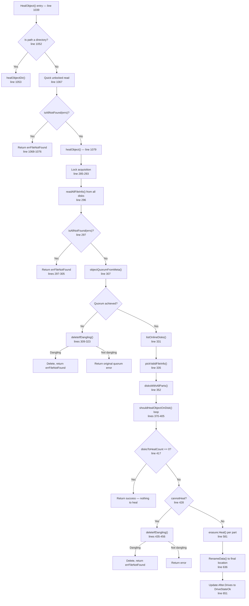

# MinIO Erasure-Coding Healing Subsystem: Decision-Making in Ambiguous Cluster States

## Document Metadata

| Field | Value |
|-------|-------|
| **Source Branch** | `minio_c07e5b49d477` |
| **Evidence Source** | All conclusions are derived exclusively from the MinIO codebase; no external resources are referenced. |
| **Scope** | 4-disk erasure-coded instance with default EC:2 parity (2 data blocks + 2 parity blocks) |
| **Go Module** | `github.com/minio/minio` (Go 1.23 toolchain) |

---

## Table of Contents

1. [Erasure Coding Context for a 4-Disk Setup](#1-erasure-coding-context-for-a-4-disk-setup)
2. [Complete Healing Decision Flow](#2-complete-healing-decision-flow)
   - 2.1 [Entry Point — `(er erasureObjects).HealObject`](#21-entry-point--er-erasureobjectshealobject)
   - 2.2 [Core Healing — `(er *erasureObjects).healObject`](#22-core-healing--er-erasureobjectshealobject)
   - 2.3 [Disk Classification — `shouldHealObjectOnDisk`](#23-disk-classification--shouldhealobjectonDisk)
   - 2.4 [Online Disk Selection — `listOnlineDisks`](#24-online-disk-selection--listonlinedisks)
   - 2.5 [Part Integrity Verification — `disksWithAllParts`](#25-part-integrity-verification--diskswithallparts)
   - 2.6 [Drive State Assignment](#26-drive-state-assignment)
   - 2.7 [The `cannotHeal` Threshold](#27-the-cannotheal-threshold)
3. [Dangling Object Detection](#3-dangling-object-detection)
   - 3.1 [`isObjectDangling` — The Five Decision Paths](#31-isobjectdangling--the-five-decision-paths)
   - 3.2 [`(er erasureObjects).deleteIfDangling` — Audit and Purge](#32-er-erasureobjectsdeleteifdangling--audit-and-purge)
   - 3.3 [Test Evidence — `TestIsObjectDangling`](#33-test-evidence--testisObjectDangling)
4. [Healing Output Artifacts](#4-healing-output-artifacts)
   - 4.1 [`HealResultItem` Structure](#41-healresultitem-structure)
   - 4.2 [`healTrace` — Trace Emission](#42-healtrace--trace-emission)
   - 4.3 [`(er *erasureObjects).auditHealObject` — Audit Logging](#43-er-erasureobjectsaudithealobject--audit-logging)
5. [Boundary Conditions](#5-boundary-conditions)
   - 5.1 [Minimum Shard Threshold](#51-minimum-shard-threshold)
   - 5.2 [Error Messages](#52-error-messages)
   - 5.3 [Test Evidence for Boundary Conditions](#53-test-evidence-for-boundary-conditions)
6. [Partially Failed Writes vs. Deletes — The MRF Subsystem](#6-partially-failed-writes-vs-deletes--the-mrf-subsystem)
   - 6.1 [MRF State and Structures](#61-mrf-state-and-structures)
   - 6.2 [MRF Persistence](#62-mrf-persistence)
   - 6.3 [MRF Heal Routine](#63-mrf-heal-routine)
   - 6.4 [Difference: Partially Failed Writes vs. Deletes](#64-difference-partially-failed-writes-vs-deletes)
7. [Three Outcome Scenarios with Code Evidence](#7-three-outcome-scenarios-with-code-evidence)
   - 7.1 [Scenario A — Healing Succeeds](#71-scenario-a--healing-succeeds)
   - 7.2 [Scenario B — Object is Dangling (Irrecoverable)](#72-scenario-b--object-is-dangling-irrecoverable)
   - 7.3 [Scenario C — Ambiguous State (Left Alone)](#73-scenario-c--ambiguous-state-left-alone)
8. [Additional Healing Infrastructure](#8-additional-healing-infrastructure)
   - 8.1 [Background Healing](#81-background-healing)
   - 8.2 [Scanner-Driven Healing](#82-scanner-driven-healing)
   - 8.3 [Heal Configuration](#83-heal-configuration)
   - 8.4 [End-to-End Verification Script](#84-end-to-end-verification-script)

---

## 1. Erasure Coding Context for a 4-Disk Setup

Before tracing any healing logic, we must establish the arithmetic foundation for a 4-disk MinIO instance with default EC:2 parity. Every threshold, quorum check, and dangling detection in the healing subsystem derives from these numbers.

### 1.1 Data Distribution

For a 4-disk erasure set with the default parity count of 2:

| Parameter | Value | Derivation |
|-----------|-------|------------|
| Total disks (N) | 4 | Erasure set size |
| Parity blocks | 2 | `defaultParityCount` = N/2 |
| Data blocks | 2 | N − parityBlocks = 4 − 2 |
| Read quorum | 2 | `dataBlocks` (minimum disks to read) |
| Write quorum | 3 | `dataBlocks + 1` (when data == parity) |

When an object is written, its data is split into 2 data shards and 2 parity shards, with each shard written to a different disk. Any 2 of the 4 shards are sufficient to reconstruct the complete object.

### 1.2 Code Evidence for Quorum Computation

**`objectQuorumFromMeta`** at `cmd/erasure-metadata.go:531` computes per-object quorum from metadata:

```go
// cmd/erasure-metadata.go:531-564
func objectQuorumFromMeta(ctx context.Context, partsMetaData []FileInfo, errs []error, defaultParityCount int) (objectReadQuorum, objectWriteQuorum int, err error) {
    // Line 533: There should be at least half correct entries
    expectedRQuorum := len(partsMetaData) / 2   // = 4/2 = 2 for our setup

    // Line 539: Reduce errors against expected quorum
    reducedErr := reduceReadQuorumErrs(ctx, errs, objectOpIgnoredErrs, expectedRQuorum)

    // Line 549-550: Determine actual parity from stored metadata
    parities := listObjectParities(partsMetaData, errs)
    parityBlocks := commonParity(parities, defaultParityCount)

    // Line 555: Data blocks = total disks - parity blocks
    dataBlocks := len(partsMetaData) - parityBlocks  // = 4 - 2 = 2

    // Lines 557-560: Write quorum special case
    writeQuorum := dataBlocks
    if dataBlocks == parityBlocks {   // 2 == 2, so true for our setup
        writeQuorum++                 // writeQuorum becomes 3
    }

    // Line 564: Return dataBlocks as read quorum
    return dataBlocks, writeQuorum, nil  // returns (2, 3, nil)
}
```

**`defaultRQuorum`** and **`defaultWQuorum`** at `cmd/erasure.go:85-96` provide erasure-set-level defaults:

```go
// cmd/erasure.go:85-91
func (er erasureObjects) defaultWQuorum() int {
    dataCount := er.setDriveCount - er.defaultParityCount  // 4 - 2 = 2
    if dataCount == er.defaultParityCount {                 // 2 == 2, true
        return dataCount + 1                                // returns 3
    }
    return dataCount
}

// cmd/erasure.go:94-96
func (er erasureObjects) defaultRQuorum() int {
    return er.setDriveCount - er.defaultParityCount  // 4 - 2 = 2
}
```

### 1.3 Concrete 4-Disk Example

Consider an object `photos/sunset.jpg` stored on disks D1–D4:

```
Disk D1: xl.meta + part.1 (data shard 1)
Disk D2: xl.meta + part.1 (data shard 2)
Disk D3: xl.meta + part.1 (parity shard 1)
Disk D4: xl.meta + part.1 (parity shard 2)
```

Each disk holds a copy of `xl.meta` (the metadata) and the corresponding erasure shard in `part.1` (or `part.N` for multipart uploads). The erasure index (`Erasure.Index`) in each disk's `xl.meta` identifies which shard that disk holds, and `Erasure.Distribution` maps logical shard positions to physical disk positions.

**Key insight**: Healing needs at least `dataBlocks` (2) valid shards to reconstruct any missing/corrupt shards. If more than `parityBlocks` (2) shards are unavailable, healing is impossible.

### 1.4 Why Write Quorum Is 3 (Not 2)

The special case at line 558–559 of `cmd/erasure-metadata.go` increments write quorum when `dataBlocks == parityBlocks`. The rationale: if exactly half the disks have a new write and half have stale data, there is no clear majority to determine which version is authoritative. By requiring `dataBlocks + 1 = 3` disks for writes, MinIO ensures the new version always has a strict majority, preventing split-brain ambiguity during read quorum.

---

## 2. Complete Healing Decision Flow

This section traces the complete code path from the public `HealObject` entry point through every decision branch in the healing pipeline.

### 2.1 Entry Point — `(er erasureObjects).HealObject`

**File**: `cmd/erasure-healing.go:1039`

```go
func (er erasureObjects) HealObject(ctx context.Context, bucket, object, versionID string, opts madmin.HealOpts) (hr madmin.HealResultItem, err error)
```

The flow is:

1. **Directory check** (line 1052): If `HasSuffix(object, SlashSeparator)`, route to `healObjectDir` — a separate, simpler path for directory objects (buckets/prefixes).

2. **Quick unlocked read** (line 1067): `readAllFileInfo(healCtx, storageDisks, "", bucket, object, versionID, false, false)` — a fast probe without acquiring a write lock.

3. **Early exit if all-not-found** (lines 1068–1076): If every disk returns `errFileNotFound`/`errFileVersionNotFound`/`errVolumeNotFound`, the object is already gone. Returns `defaultHealResult` with appropriate `ObjectNotFound` error.

4. **Core heal** (line 1079): `er.healObject(healCtx, bucket, object, versionID, opts)` — the main healing logic.

5. **Bitrot retry** (lines 1080–1084): If `healObject` returns `errFileCorrupt` and the scan mode was not `HealDeepScan`, it automatically retries with `HealDeepScan` enabled. This means bitrot corruption detected during a normal scan triggers a deeper verification pass.

6. **Error conversion** (line 1086): `toObjectErr(err, bucket, object, versionID)` converts internal errors (like `errFileNotFound`) to API-level errors (like `ObjectNotFound`).

### 2.2 Core Healing — `(er *erasureObjects).healObject`

**File**: `cmd/erasure-healing.go:258`

This is the heart of the healing subsystem. Every step is documented below with exact line numbers.



**Step-by-step walkthrough**:

**Step 1 — Lock Acquisition** (lines 285–293):
```go
lk := er.NewNSLock(bucket, object)
lkctx, err := lk.GetLock(ctx, globalOperationTimeout)
```
A namespace write lock ensures no concurrent operations on the same object during healing.

**Step 2 — Read Metadata from All Disks** (line 296):
```go
partsMetadata, errs := readAllFileInfo(ctx, storageDisks, "", bucket, object, versionID, true, true)
```
Reads `xl.meta` from every disk in the erasure set. The `errs` array captures per-disk errors: `nil` for success, `errFileNotFound` for missing metadata, `errFileCorrupt` for unreadable metadata, `errDiskNotFound` for offline disks, etc.

**Step 3 — All-Not-Found Check** (lines 297–305):
If `isAllNotFound(errs)` — meaning every disk returned a "not found" variant — the object is fully gone and there is nothing to heal.

**Step 4 — Quorum Computation** (line 307):
```go
readQuorum, _, err := objectQuorumFromMeta(ctx, partsMetadata, errs, er.defaultParityCount)
```
If this fails (not enough consistent metadata across disks), we fall through to `deleteIfDangling` (lines 309–323). This is the first point where the dangling detection is invoked.

**Step 5 — Online Disk Selection** (line 331):
```go
onlineDisks, quorumModTime, quorumETag := listOnlineDisks(storageDisks, partsMetadata, errs, readQuorum)
```
Selects the authoritative set of disks. Details in [Section 2.4](#24-online-disk-selection--listonlinedisks).

**Step 6 — Pick Valid Metadata** (line 335):
```go
latestMeta, err := pickValidFileInfo(ctx, partsMetadata, quorumModTime, quorumETag, readQuorum)
```
Selects the single authoritative `FileInfo` that represents the latest correct state of the object.

**Step 7 — Part Integrity Verification** (line 352):
```go
availableDisks, dataErrsByDisk, dataErrsByPart := disksWithAllParts(ctx, onlineDisks, partsMetadata, errs, latestMeta, filterByETag, bucket, object, scanMode)
```
Checks whether each disk's part files match the expected checksums/existence. Details in [Section 2.5](#25-part-integrity-verification--diskswithallparts).

**Step 8 — Disk Classification** (lines 370–405):
For each disk, `shouldHealObjectOnDisk` classifies whether the disk needs healing and why. Details in [Section 2.3](#23-disk-classification--shouldhealobjectondisk).

**Step 9 — Nothing-to-Heal Check** (line 417):
If `disksToHealCount == 0`, the object is perfectly healthy on all disks. Return success.

**Step 10 — Dry-Run Check** (line 424):
If `opts.DryRun`, return the heal result without making changes.

**Step 11 — `cannotHeal` Check** (line 428):
```go
cannotHeal := !latestMeta.XLV1 && !latestMeta.Deleted && disksToHealCount > latestMeta.Erasure.ParityBlocks
```
For our 4-disk setup: if more than 2 disks need healing, we cannot reconstruct. Details in [Section 2.7](#27-the-cannotheal-threshold).

**Step 12 — Heal Execution** (lines 458+):
If healing is possible:
- Reorder disks by erasure distribution (line 482, 492).
- For each part: create `bitrotReader`s from valid disks and `bitrotWriter`s for outdated disks (lines 546–576).
- Call `erasure.Heal(ctx, writers, readers, partSize, prefer)` (line 581) — the Reed-Solomon reconstruction engine from `klauspost/reedsolomon`.
- Write healed data to temporary location `.minio/tmp/<uuid>/` (line 565).
- Rename to final location via `disk.RenameData()` (line 636).
- Update `result.After.Drives[i].State = madmin.DriveStateOk` for each successfully healed disk (line 651).

### 2.3 Disk Classification — `shouldHealObjectOnDisk`

**File**: `cmd/erasure-healing.go:156-183`

This function classifies each disk into one of five healing-required categories:

```go
func shouldHealObjectOnDisk(erErr error, partsErrs []int, meta FileInfo, latestMeta FileInfo) (bool, error)
```

| Category | Error Returned | Condition | What It Means |
|----------|---------------|-----------|---------------|
| **Missing xl.meta** | `errFileNotFound` or `errFileVersionNotFound` | Line 157 | The metadata file is completely absent. The disk has no record of this object version. |
| **Corrupt xl.meta** | `errFileCorrupt` | Line 157 | The metadata file exists but cannot be parsed or is invalid. |
| **Legacy format** | `errLegacyXLMeta` | Lines 161–164: `meta.XLV1 == true` | The disk has an old V1-format `xl.meta`. Legacy objects always need migration. |
| **Outdated metadata** | `errOutdatedXLMeta` | Lines 166–167: `!latestMeta.Equals(meta)` | The metadata does not match the authoritative latest version (different `ModTime`, `DataDir`, etc). |
| **Part file issues** | `errPartMissingOrCorrupt` | Lines 169–178 | The `xl.meta` is valid and current, but one or more `part.N` files are missing or corrupt. Only checked for non-deleted, non-remote objects. |

The three sentinel errors used for classification are defined at lines 148–152:

```go
var errLegacyXLMeta = errors.New("legacy XL meta")           // line 148
var errOutdatedXLMeta = errors.New("outdated XL meta")       // line 150
var errPartMissingOrCorrupt = errors.New("part missing or corrupt")  // line 152
```

**Part check status codes** are defined in `cmd/storage-datatypes.go:535-545`:

```go
const (
    checkPartUnknown       int = iota  // = 0
    checkPartSuccess                   // = 1
    checkPartDiskNotFound              // = 2
    checkPartVolumeNotFound            // = 3
    checkPartFileNotFound              // = 4
    checkPartFileCorrupt               // = 5
)
```

The part error check at lines 171–177 specifically looks for `checkPartFileNotFound` and `checkPartFileCorrupt`:

```go
if !meta.Deleted && !meta.IsRemote() {
    for _, partErr := range partsErrs {
        if slices.Contains([]int{
            checkPartFileNotFound,
            checkPartFileCorrupt,
        }, partErr) {
            return true, errPartMissingOrCorrupt
        }
    }
}
```

**Rationale**: Only `checkPartFileNotFound` and `checkPartFileCorrupt` trigger healing. `checkPartDiskNotFound` and `checkPartVolumeNotFound` do not — they represent transient disk issues where taking action could be dangerous (the parts may exist but the disk is temporarily inaccessible).

### 2.4 Online Disk Selection — `listOnlineDisks`

**File**: `cmd/erasure-healing-common.go:219-254`

```go
func listOnlineDisks(disks []StorageAPI, partsMetadata []FileInfo, errs []error, quorum int) (onlineDisks []StorageAPI, modTime time.Time, etag string)
```

This function determines which disks hold the latest, authoritative copy of the object's metadata. It uses a two-tier consensus mechanism:

**Tier 1 — ModTime Consensus** (lines 223–226):
1. Extract `ModTime` from each disk's `xl.meta`.
2. `commonTime(modTimes, quorum)` finds the most frequently occurring modification time that meets quorum (≥ 2 disks for our setup).
3. Disks whose `ModTime` matches are marked as "online" (have latest data).
4. Disks with different `ModTime` or no metadata are set to `nil`.

**Tier 2 — ETag Fallback** (lines 228–242):
If no `ModTime` achieves quorum (returns `timeSentinel`), the function falls back to ETag-based consensus:
1. Extract ETags from each disk's metadata.
2. `commonETag(etags, quorum)` finds the most common ETag.
3. Disks matching the common ETag are marked as online.

**When does ETag fallback activate?** This happens when there are timestamp discrepancies across disks — for example, due to clock drift or when an object was written by different nodes with slightly different timestamps. The ETag (content hash) provides a content-based consensus mechanism.

The function returns:
- `onlineDisks`: disks with the latest metadata (others are `nil`).
- `modTime`: the quorum modification time (zero if ETag fallback was used).
- `etag`: the quorum ETag (empty if ModTime consensus worked).

### 2.5 Part Integrity Verification — `disksWithAllParts`

**File**: `cmd/erasure-healing-common.go:291-458`

```go
func disksWithAllParts(ctx context.Context, onlineDisks []StorageAPI, partsMetadata []FileInfo,
    errs []error, latestMeta FileInfo, filterByETag bool, bucket, object string,
    scanMode madmin.HealScanMode,
) (availableDisks []StorageAPI, dataErrsByDisk map[int][]int, dataErrsByPart map[int][]int)
```

This function verifies that each disk's actual part files match the expected state from the authoritative metadata.

**Phase 1 — Metadata Consistency Check** (lines 307–378):
- Checks that `Erasure.Distribution` has the correct number of entries.
- Verifies `Erasure.Distribution[i] == Erasure.Index` (disk position matches expected shard index).
- If `filterByETag`, disks with mismatched ETags are marked `errFileCorrupt`.
- Otherwise, disks with mismatched `ModTime` or `DataDir` are marked `errFileCorrupt`.

**Phase 2 — Inline Data Verification** (lines 401–410):
For small objects stored inline (data embedded in `xl.meta`), bitrot verification is performed directly on the inline bytes.

**Phase 3 — On-Disk Part Verification** (lines 418–434):
For objects with on-disk parts:
- **Normal scan** (`madmin.HealNormalScan`): Calls `onlineDisk.CheckParts(ctx, bucket, object, meta)` — verifies part files exist with correct sizes.
- **Deep scan** (`madmin.HealDeepScan`): Calls `onlineDisk.VerifyFile(ctx, bucket, object, meta)` — reads part files and verifies bitrot checksums (full content hash verification).

**Phase 4 — Result Assembly** (lines 437–456):
- `dataErrsByDisk[diskIndex]` = array of part-level errors for each disk.
- `dataErrsByPart[partIndex]` = array of per-disk errors for each part.
- `availableDisks` = disks where metadata is consistent AND all parts are intact.

### 2.6 Drive State Assignment

**File**: `cmd/erasure-healing.go:382-404`

After `shouldHealObjectOnDisk` classifies each disk, the healing code maps the classification reason to a `madmin.DriveState` value:

```go
switch {
case reason == nil:
    driveState = madmin.DriveStateOk          // Disk is healthy
case IsErr(reason, errDiskNotFound):
    driveState = madmin.DriveStateOffline      // Disk is unreachable
case IsErr(reason, errFileNotFound, errFileVersionNotFound,
    errVolumeNotFound, errPartMissingOrCorrupt,
    errOutdatedXLMeta, errLegacyXLMeta):
    driveState = madmin.DriveStateMissing      // Data is missing/outdated but disk is alive
default:
    driveState = madmin.DriveStateCorrupt      // Data is corrupt
}
```

The four possible drive states are:

| Drive State | Meaning | Typical Causes |
|-------------|---------|----------------|
| `DriveStateOk` | Healthy, no healing needed | `shouldHealObjectOnDisk` returned `false` |
| `DriveStateOffline` | Disk is unreachable | `errDiskNotFound` — network failure, disk removed |
| `DriveStateMissing` | Data absent or stale, but disk works | `errFileNotFound`, `errPartMissingOrCorrupt`, `errOutdatedXLMeta`, `errLegacyXLMeta` |
| `DriveStateCorrupt` | Data exists but is corrupt | `errFileCorrupt`, unknown errors |

These states are written into both `result.Before.Drives` and `result.After.Drives` arrays (lines 395–404). After successful healing, the `After` state transitions to `DriveStateOk` (line 651).

### 2.7 The `cannotHeal` Threshold

**File**: `cmd/erasure-healing.go:428-456`

```go
cannotHeal := !latestMeta.XLV1 && !latestMeta.Deleted && disksToHealCount > latestMeta.Erasure.ParityBlocks
```

**For a 4-disk EC:2 setup**: `cannotHeal = true` when `disksToHealCount > 2`.

This means: if 3 or 4 disks need healing (only 1 or 0 have valid data), the Reed-Solomon engine cannot reconstruct the missing shards because it needs at least `dataBlocks` (2) valid shards as input.

**Exceptions to `cannotHeal`**:

1. **Legacy XLV1 objects** (`latestMeta.XLV1`): Exempt because V1 format migration is always attempted.
2. **Deleted objects** (`latestMeta.Deleted`): Exempt because delete markers have no data parts — they only need metadata replication.
3. **ETag-consensus objects** (lines 429–433): If `quorumETag != ""`, the `cannotHeal` flag is cleared. This gives the object another chance because ETag consensus indicates content agreement even when some metadata is inconsistent.

**When `cannotHeal` is true**, the code calls `deleteIfDangling` (line 438):
- If the object is dangling → delete it from all disks (lines 442–449).
- If the object is NOT dangling → return the error as-is (lines 451–455).

**Rationale**: When we don't have enough shards to reconstruct, but the object is determined to be "dangling" (see Section 3), cleaning it up is safer than leaving corrupt remnants on disk. If it's NOT dangling (ambiguous state), leaving it alone is the conservative choice.

---

## 3. Dangling Object Detection

"Dangling" means an object exists in a state where it cannot be served or recovered, and its remnants should be cleaned up. The detection logic is designed to be **conservative** — it errs on the side of leaving objects alone rather than deleting potentially recoverable data.

### 3.1 `isObjectDangling` — The Five Decision Paths

**File**: `cmd/erasure-healing.go:968-1036`

```go
func isObjectDangling(metaArr []FileInfo, errs []error, dataErrsByPart map[int][]int) (validMeta FileInfo, ok bool)
```

This function is the central dangling detection oracle. It examines metadata and part errors across all disks and returns `(validMeta, isDangling)`.

**Helper functions:**

- `danglingMetaErrsCount` (line 934): Counts `errFileNotFound`/`errFileVersionNotFound` as `notFoundCount`; all other non-nil errors as `nonActionableCount`.
- `danglingPartErrsCount` (line 950): Counts `checkPartFileNotFound` as `notFoundCount`; all other non-success results as `nonActionableCount`.

**Aggregate computation** (lines 974–979):
```go
notFoundPartsErrs, nonActionablePartsErrs := 0, 0
for _, dataErrs := range dataErrsByPart {
    if nf, na := danglingPartErrsCount(dataErrs); nf > notFoundPartsErrs {
        notFoundPartsErrs, nonActionablePartsErrs = nf, na
    }
}
```
The part error computation takes the **maximum** `notFoundPartsErrs` across all parts. This means even one part with excessive missing files triggers dangling detection.

**The five decision paths:**

---

#### Path 1 — No Valid Metadata (lines 988–1005)

**Condition**: `!validMeta.IsValid()` — no disk has a parseable `xl.meta`.

```go
dataBlocks := (len(metaArr) + 1) / 2  // = (4+1)/2 = 2 for 4-disk setup
if notFoundPartsErrs > dataBlocks {
    return validMeta, true   // DANGLING
}
return validMeta, false  // "We have no idea what this file is, leave it as is."
```

**Rationale**: Without any valid metadata, we cannot even know the object's original parity configuration. The code uses a conservative `dataBlocks = (N+1)/2` threshold rather than the actual `parityBlocks` (which is unknown). The comment at lines 993–1000 explicitly states: "Not using parity to ensure that we do not delete any valid content, if any is recoverable." Only when part directories are missing beyond this defensive threshold is the object considered dangling.

---

#### Path 2 — Non-Actionable Errors Present (lines 1008–1009)

**Condition**: `nonActionableMetaErrs > 0 || nonActionablePartsErrs > 0`

```go
return validMeta, false  // NOT DANGLING — leave alone
```

**Rationale**: Non-actionable errors include `errDiskNotFound` (offline disk), `errFileCorrupt` (corrupt but possibly recoverable), and any other unknown errors. These represent disks that **might** have valid data but can't be reached or read right now. Making a deletion decision with incomplete information is dangerous, so the object is left untouched.

---

#### Path 3 — Delete Marker (lines 1012–1017)

**Condition**: `validMeta.Deleted == true`

```go
dataBlocks := (len(errs) + 1) / 2  // = (4+1)/2 = 2
return validMeta, notFoundMetaErrs > dataBlocks
```

**Rationale**: Delete markers have no data parts (they're just metadata), so `notFoundPartsErrs` is ignored. A delete marker is dangling if more than `dataBlocks` disks are missing its `xl.meta`. For our 4-disk setup: dangling if `notFoundMetaErrs > 2` (i.e., 3 or 4 disks lack the delete marker).

**Threshold**: `dataBlocks = (N+1)/2 = 2`. This uses a computed value, NOT the metadata's `Erasure.ParityBlocks`.

---

#### Path 4 — Data Object with Missing Metadata (lines 1025–1028)

**Condition**: `notFoundMetaErrs > 0 && notFoundMetaErrs > validMeta.Erasure.ParityBlocks`

```go
return validMeta, true  // DANGLING — xl.meta missing beyond parity tolerance
```

**Rationale**: For data objects with valid metadata on at least one disk, we know the actual parity configuration. If more disks are missing `xl.meta` than the parity block count allows, the object cannot be reconstructed and is declared dangling.

For our 4-disk EC:2 setup: dangling if `notFoundMetaErrs > 2` (i.e., 3+ disks missing metadata).

---

#### Path 5 — Data Object with Missing Parts (lines 1030–1033)

**Condition**: `!validMeta.IsRemote() && notFoundPartsErrs > 0 && notFoundPartsErrs > validMeta.Erasure.ParityBlocks`

```go
return validMeta, true  // DANGLING — part files missing beyond parity tolerance
```

**Rationale**: Same threshold as Path 4, but for part files instead of metadata. The `!validMeta.IsRemote()` check excludes remote-tiered objects whose data lives elsewhere.

For our 4-disk EC:2 setup: dangling if `notFoundPartsErrs > 2`.

---

### 3.1.1 The Delete Marker vs. Data Object Threshold Asymmetry

**Delete markers** use `dataBlocks = (len(errs) + 1) / 2` (Path 3), which is a computed value that doesn't use the metadata's `Erasure.ParityBlocks`.

**Data objects** use `validMeta.Erasure.ParityBlocks` (Paths 4 and 5), which is the actual stored parity configuration.

For a **4-disk EC:2** setup, both thresholds evaluate to 2, so there is no practical difference. However, for **asymmetric configurations** (e.g., 6 disks with EC:1, where `dataBlocks=5` and `parityBlocks=1`):
- Delete marker threshold: `(6+1)/2 = 3`
- Data object threshold: `1` (parityBlocks)

In this case, a data object would be declared dangling much more easily (>1 missing disk) than a delete marker (>3 missing disks). This makes delete markers **less** aggressively cleaned up in asymmetric configurations, contrary to what one might expect. The reason is defensive: delete markers use the conservative `(N+1)/2` formula because they cannot validate against stored parity information in the same way.

### 3.2 `(er erasureObjects).deleteIfDangling` — Audit and Purge

**File**: `cmd/erasure-object.go:482-562`

```go
func (er erasureObjects) deleteIfDangling(ctx context.Context, bucket, object string, metaArr []FileInfo, errs []error, dataErrsByPart map[int][]int, opts ObjectOptions) (FileInfo, error)
```

**Flow**:

1. **Dangling check** (line 483): `m, ok := isObjectDangling(metaArr, errs, dataErrsByPart)`

2. **If NOT dangling** (lines 484–487):
   ```go
   return FileInfo{}, errErasureReadQuorum
   ```
   The object is left untouched. The caller receives `errErasureReadQuorum`, signaling that the object couldn't be healed but also shouldn't be deleted.

3. **If dangling — audit tag collection** (lines 489–529):
   - `set`: erasure set index
   - `pool`: pool index
   - `merrs`: joined error strings from metadata reads
   - `derrs`: formatted data error map
   - `sz`, `mt`, `d:p`: object size, mod-time, data:parity ratio
   - `offline`: count of offline disks
   - `caller`: file:line of the calling function

4. **Audit log emission** (line 531): `auditDanglingObjectDeletion(ctx, bucket, object, m.VersionID, tags)`

5. **Deletion from all disks** (lines 540–550):
   ```go
   disks := er.getDisks()
   g := errgroup.WithNErrs(len(disks))
   for index := range disks {
       g.Go(func() error {
           return disks[index].DeleteVersion(ctx, bucket, object, fi, false, DeleteOptions{})
       }, index)
   }
   ```
   Uses `DeleteVersion` to remove the specific version from every reachable disk in parallel.

6. **Per-disk deletion result logging** (lines 552–560): Each disk's deletion success/failure is tagged for the audit record.

### 3.3 Test Evidence — `TestIsObjectDangling`

**File**: `cmd/erasure-healing_test.go:40-309`

This test function validates `isObjectDangling` across 13 distinct scenarios. The test uses a 4-element array (simulating a 4-disk erasure set with `dataBlocks=2, parityBlocks=2`).

| # | Test Case Name | metaArr | errs | dataErrs | Expected Dangling | Rationale |
|---|---|---|---|---|---|---|
| 1 | `FileInfoExists-case1` | 2 valid `fi`, 2 empty | `[notFound, diskNotFound, nil, nil]` | `nil` | **false** | 2 valid disks ≥ threshold; `diskNotFound` is non-actionable so cannot confidently declare dangling |
| 2 | `FileInfoExists-case2` | 2 valid `fi`, 2 empty | `[notFound, notFound, nil, nil]` | `nil` | **false** | 2 `notFoundMetaErrs` is NOT > `parityBlocks` (2); exactly at threshold, not above |
| 3 | `FileInfoUndecided-case1` | 1 valid `fi`, 3 empty | `[notFound, diskNotFound, diskNotFound, nil]` | `nil` | **false** | 2 `diskNotFound` errors are non-actionable → Path 2 fires, returns false |
| 4 | `FileInfoUndecided-case2` | 0 valid (empty slice) | `[notFound, diskNotFound, diskNotFound, notFound]` | `nil` | **false** | No valid meta → Path 1; `diskNotFound` is non-actionable; `notFoundPartsErrs` = 0, not > `dataBlocks` (2) |
| 5 | `FileInfoUndecided-case3(file deleted)` | 0 valid (empty slice) | `[notFound, notFound, notFound, notFound]` | `nil` | **false** | No valid meta → Path 1; `notFoundPartsErrs` = 0 (no part errors), not > `dataBlocks`; "leave it as is" |
| 6 | `FileInfoUnDecided-case4` | 1 valid inline `ifi`, 3 empty | `[notFound, fileCorrupt, fileCorrupt, nil]` | `nil` | **false** | `fileCorrupt` counted as non-actionable → Path 2 fires |
| 7 | `FileInfoUnDecided-case5-(ignore errFileCorrupt error)` | 1 valid `fi`, 3 empty | `[notFound, fileCorrupt, nil, nil]` | Part 0: `[corrupt, notFound, success, corrupt]` | **false** | `fileCorrupt` in meta errs is non-actionable → Path 2; also `checkPartFileCorrupt` in parts is non-actionable |
| 8 | `FileInfoUnDecided-case6-(data-dir intact)` | 1 valid `fi`, 3 empty | `[notFound, notFound, notFound, nil]` | Part 0: `[notFound, corrupt, success, success]` | **false** | `notFoundMetaErrs` = 3 > `parityBlocks` (2) would trigger Path 4, BUT `checkPartFileCorrupt` is a non-actionable part error → Path 2 catches first |
| 9 | `FileInfoDecided-case1` | 1 valid inline `ifi`, 3 empty | `[notFound, notFound, notFound, nil]` | `nil` | **true** | `notFoundMetaErrs` = 3 > `parityBlocks` (2) → Path 4; no non-actionable errors; inline data so no part checks |
| 10 | `FileInfoDecided-case2-delete-marker` | 1 `{Deleted:true}`, 3 empty | `[notFound, notFound, notFound, nil]` | `nil` | **true** | Delete marker → Path 3; `notFoundMetaErrs` = 3 > `dataBlocks` (2) |
| 11 | `FileInfoDecided-case3-(enough data-dir missing)` | 1 valid `fi`, 3 empty | `[notFound, notFound, nil, nil]` | Part 0: `[notFound, notFound, success, notFound]` | **true** | `notFoundPartsErrs` = 3 > `parityBlocks` (2) → Path 5 |
| 12 | `FileInfoDecided-case4-(missing data-dir for part 2)` | 1 valid `fi`, 3 empty | `[notFound, notFound, nil, nil]` | Part 0: `[success×4]`, Part 1: `[success, notFound, notFound, notFound]` | **true** | Per-part max: Part 1 has 3 `notFoundPartsErrs` > `parityBlocks` (2) → Path 5 |
| 13 | `FileInfoDecided-case4-(enough data-dir existing for each part)` | 1 valid `fi`, 3 empty | `[notFound, notFound, nil, nil]` | Parts 0–3: each has exactly 1 `notFound` | **false** | Per-part max: 1 `notFoundPartsErrs` ≤ `parityBlocks` (2); each part individually is recoverable |

---

## 4. Healing Output Artifacts

### 4.1 `HealResultItem` Structure

**File**: `cmd/erasure-healing.go:277-283` (initialization), various lines (population)

The `madmin.HealResultItem` structure is the primary output of every heal operation. It is populated progressively throughout `healObject`:

```go
// Line 277-283: Initialization
result = madmin.HealResultItem{
    Type:      madmin.HealItemObject,
    Bucket:    bucket,
    Object:    object,
    VersionID: versionID,
    DiskCount: len(storageDisks),
}

// Lines 326-327: Quorum info
result.ParityBlocks = result.DiskCount - readQuorum
result.DataBlocks = readQuorum

// Line 365: Object size
result.ObjectSize, err = latestMeta.ToObjectInfo(bucket, object, true).GetActualSize()

// Lines 395-404: Per-drive state (Before and After)
result.Before.Drives = append(result.Before.Drives, madmin.HealDriveInfo{
    UUID:     "",
    Endpoint: storageEndpoints[i].String(),
    State:    driveState,
})
result.After.Drives = append(result.After.Drives, madmin.HealDriveInfo{
    UUID:     "",
    Endpoint: storageEndpoints[i].String(),
    State:    driveState,
})

// Line 651: After successful heal, update After state
result.After.Drives[i].State = madmin.DriveStateOk
```

**Before/After state transition example** for a 4-disk setup where disk 1 has a missing `part.1`:

```
Before:
  Drive 0: DriveStateMissing  (part.1 missing)
  Drive 1: DriveStateOk
  Drive 2: DriveStateOk
  Drive 3: DriveStateOk

After (successful heal):
  Drive 0: DriveStateOk       (part.1 reconstructed)
  Drive 1: DriveStateOk
  Drive 2: DriveStateOk
  Drive 3: DriveStateOk
```

### 4.2 `healTrace` — Trace Emission

**File**: `cmd/erasure-healing.go:1090-1116`

```go
func healTrace(funcName healingMetric, startTime time.Time, bucket, object string, opts *madmin.HealOpts, err error, result *madmin.HealResultItem)
```

This function publishes real-time trace events for heal operations. It is only invoked if trace subscribers exist:

```go
// Line 269: Guard check
if globalTrace.NumSubscribers(madmin.TraceHealing) > 0 {
    startTime := time.Now()
    defer func() {
        healTrace(healingMetricObject, startTime, bucket, object, &opts, err, &result)
    }()
}
```

The trace event structure:

```go
tr := madmin.TraceInfo{
    TraceType: madmin.TraceHealing,    // line 1092
    Time:      startTime,              // line 1093
    NodeName:  globalLocalNodeName,    // line 1094
    FuncName:  "heal." + funcName.String(),  // line 1095, e.g., "heal.Object"
    Duration:  time.Since(startTime),  // line 1096
    Path:      pathJoin(bucket, decodeDirObject(object)),  // line 1097
}
```

Custom fields (lines 1100–1108):

| Field | Value | Purpose |
|-------|-------|---------|
| `dry` | `opts.DryRun` | Whether this was a dry-run heal |
| `remove` | `opts.Remove` | Whether dangling objects should be removed |
| `mode` | `opts.ScanMode` | Scan mode (`HealNormalScan` or `HealDeepScan`) |
| `version-id` | `result.VersionID` | Object version being healed |
| `disks` | `result.DiskCount` | Total disk count in the erasure set |

Additional fields:
- `tr.Bytes = result.ObjectSize` (line 1108)
- `tr.Error = err.Error()` (line 1112, only if error occurred)
- `tr.HealResult = result` (line 1114)

Published via `globalTrace.Publish(tr)` (line 1115).

### 4.3 `(er *erasureObjects).auditHealObject` — Audit Logging

**File**: `cmd/erasure-healing.go:221-254`

```go
func (er *erasureObjects) auditHealObject(ctx context.Context, bucket, object, versionID string, result madmin.HealResultItem, err error)
```

This function emits structured audit log entries. It fires on **every** heal attempt (successful or not), but only if audit targets are configured:

```go
// Line 222: Guard
if len(logger.AuditTargets()) == 0 {
    return
}
```

The audit log includes:

```go
opts := AuditLogOptions{
    Event:     "HealObject",           // line 227
    Bucket:    bucket,                 // line 228
    Object:    decodeDirObject(object), // line 229
    VersionID: versionID,              // line 230
}
```

**Error reporting** (lines 236–244):

- **Corrupted blocks**: If `result.GetCorruptedCounts()` shows before == after (corruption not resolved), logs: `"unable to heal %d corrupted blocks on drives"`.
- **Missing blocks**: If `result.GetMissingCounts()` shows before == after (missing data not restored), logs: `"unable to heal %d missing blocks on drives"`.

**Tags** (lines 246–252):
- `pool`: 1-based pool index (`er.poolIndex + 1`)
- `set`: 1-based set index (`er.setIndex + 1`)
- Object name, encoded as `auditObjectOp` string

The audit is deferred at line 266: `defer func() { er.auditHealObject(ctx, bucket, object, versionID, result, err) }()`, ensuring it always fires, even on error or panic.

---

## 5. Boundary Conditions

### 5.1 Minimum Shard Threshold

For a 4-disk EC:2 setup:

| Condition | Threshold | Code Reference |
|-----------|-----------|----------------|
| Minimum valid shards for healing | **2** (`dataBlocks`) | Reed-Solomon needs `dataBlocks` shards minimum |
| Maximum tolerable disk failures | **2** (`parityBlocks`) | Up to `parityBlocks` disks can fail |
| `cannotHeal` triggers when | `disksToHealCount > 2` | `cmd/erasure-healing.go:428` |
| Dangling detection (data object) | `notFoundMetaErrs > 2` OR `notFoundPartsErrs > 2` | `cmd/erasure-healing.go:1025,1030` |
| Dangling detection (delete marker) | `notFoundMetaErrs > 2` | `cmd/erasure-healing.go:1015-1016` |

**Concrete scenarios:**

| Scenario | Disks OK | Disks Broken | Can Heal? | Outcome |
|----------|----------|-------------|-----------|---------|
| 4 healthy disks | 4 | 0 | N/A (nothing to heal) | `disksToHealCount == 0`, return success |
| 1 disk missing `xl.meta` | 3 | 1 | **Yes** | Reconstruct from 3 remaining shards |
| 2 disks with corrupt parts | 2 | 2 | **Yes** | Reconstruct from 2 valid shards (minimum) |
| 3 disks with missing data | 1 | 3 | **No** | `cannotHeal = true` → `deleteIfDangling` |
| All 4 disks missing | 0 | 4 | **No** | `isAllNotFound` → return `errFileNotFound` |

### 5.2 Error Messages

| Error | Location | Message | When It Occurs |
|-------|----------|---------|----------------|
| `errErasureReadQuorum` | `cmd/erasure-errors.go:23` | "Read failed. Insufficient number of drives online" | Not enough disks with valid metadata to determine quorum |
| `errErasureWriteQuorum` | `cmd/erasure-errors.go:26` | "Write failed. Insufficient number of drives online" | Not enough disks to write healed data (during write operations) |
| `errNoHealRequired` | `cmd/erasure-errors.go:29` | "No healing is required" | Object is already healthy on all disks |
| `errFileNotFound` | (internal) | N/A | Object doesn't exist on a disk; also returned after dangling deletion |
| `errFileVersionNotFound` | (internal) | N/A | Specific version doesn't exist; returned when versionID is specified |
| `errFileCorrupt` | (internal) | N/A | `xl.meta` is unparseable; triggers deep scan retry (lines 1080–1084) |
| `ObjectNotFound` | (API level) | N/A | API-level error converted from `errFileNotFound` via `toObjectErr()` (line 1086) |

**Error flow for `cannotHeal` + dangling:**
1. `cannotHeal = true` (line 428)
2. `deleteIfDangling` called (line 438)
3. `isObjectDangling` returns `true`
4. Object deleted from all disks
5. `deleteIfDangling` returns `(m, nil)` — where `m` is the deleted object's metadata
6. Caller converts to `errFileNotFound` (line 443) or `errFileVersionNotFound` (line 444–445)
7. `HealObject` converts to `ObjectNotFound` via `toObjectErr` (line 1086)

**Error flow for `cannotHeal` + NOT dangling:**
1. `cannotHeal = true` (line 428)
2. `deleteIfDangling` called (line 438)
3. `isObjectDangling` returns `false`
4. `deleteIfDangling` returns `(FileInfo{}, errErasureReadQuorum)` (line 487)
5. All errs set to this error (lines 451–452)
6. Returned via `defaultHealResult` (lines 454–455)

### 5.3 Test Evidence for Boundary Conditions

#### `TestHealObjectCorruptedPools` (`cmd/erasure-healing_test.go:982`)

This test uses a 32-disk setup (2 pools × 16 disks), creating a multipart object in pool 2, then progressively damaging it:

**Test 1** (line 1043): Deletes `xl.meta` from one disk:
```go
firstDisk.Delete(context.Background(), bucket, pathJoin(object, xlStorageFormatFile), ...)
```
→ `HealObject` succeeds. The missing `xl.meta` is reconstructed. Verified at line 1066–1068: `StatInfoFile` confirms `xl.meta` exists again.

**Test 2** (lines 1070–1096): Deletes `part.1` from disk, replaces with empty file, then heals with `HealDeepScan`:
→ Healing succeeds. `FileInfo` after heal equals pre-corruption `FileInfo` (line 1094).

**Test 3** (lines 1098–1125): Corrupts `part.1` with different-length data, then heals with `HealDeepScan`:
→ Healing succeeds. Part data restored to original content.

**Test 4** (lines 1127–1155): Deletes `xl.meta` from more than `DataBlocks` disks:
```go
for i := 0; i <= nfi.Erasure.DataBlocks; i++ {
    erasureDisks[i].Delete(context.Background(), bucket, pathJoin(object, xlStorageFormatFile), ...)
}
```
→ `HealObject` returns `ObjectNotFound` error. Object is auto-deleted as dangling. Verified at line 1145–1148: `GetObjectInfo` also returns `ObjectNotFound`. Lines 1150–1155 verify `xl.meta` is gone from ALL disks.

#### `TestHealObjectCorruptedXLMeta` (`cmd/erasure-healing_test.go:1158`)

**Test 1** (lines 1218–1250): Deletes `xl.meta` from first disk → healing restores it. Post-heal `FileInfo` equals pre-corruption `FileInfo`.

**Test 2** (lines 1252–1271): Corrupts `xl.meta` with `"abcd"`:
```go
firstDisk.WriteAll(context.Background(), bucket, pathJoin(object, xlStorageFormatFile), []byte("abcd"))
```
→ Healing succeeds. The corrupted `xl.meta` is overwritten with correct content.

**Test 3** (lines 1273–1294): Deletes `xl.meta` from more than `DataBlocks` disks → `ObjectNotFound` error. Object auto-deleted.

#### `TestHealObjectCorruptedParts` (`cmd/erasure-healing_test.go:1297`)

**Test 1** (lines 1375–1396): Removes `part.1` from first disk:
```go
firstDisk.Delete(context.Background(), bucket, pathJoin(object, fi.DataDir, "part.1"), ...)
```
→ Healing reconstructs `part.1`. Byte-for-byte verification at line 1394: `reflect.DeepEqual(part1Disk1Origin, part1Replaced)`.

**Test 2** (lines 1398–1416): Corrupts `part.1` with `"foobytes"`:
```go
firstDisk.WriteAll(context.Background(), bucket, pathJoin(object, fi.DataDir, "part.1"), []byte("foobytes"))
```
→ Normal scan triggers heal. Part data restored. Byte-for-byte match confirmed (line 1414).

**Test 3** (lines 1418–1453): Corrupts `part.1` on disk 1 AND removes all data from disk 2:
→ Healing succeeds using remaining 14 healthy disks. Both corrupted and missing parts are reconstructed. Original content verified on both disks.

---

## 6. Partially Failed Writes vs. Deletes — The MRF Subsystem

The Missing Replicas Fix (MRF) subsystem handles the gap between quorum-successful operations (where the client gets a success response) and full-replica writes (where all disks have the data). When a write or delete reaches quorum but not all disks, MRF ensures eventual consistency.

### 6.1 MRF State and Structures

**File**: `cmd/mrf.go`

**`PartialOperation` struct** (line 51):
```go
type PartialOperation struct {
    Bucket              string
    Object              string
    VersionID           string
    Versions            []byte
    SetIndex, PoolIndex int
    Queued              time.Time
    BitrotScan          bool
}
```

**`mrfState`** (line 63):
```go
type mrfState struct {
    opCh    chan PartialOperation   // buffered channel
    closed  int32
    closing int32
    wg      sync.WaitGroup
}
```

Initialized at line 71–74 with a channel capacity of **100,000** (`mrfOpsQueueSize` at line 39).

**`addPartialOp`** (line 78): Non-blocking enqueue:
```go
func (m *mrfState) addPartialOp(op PartialOperation) {
    // ...safety checks...
    select {
    case m.opCh <- op:  // Enqueue if space available
    default:            // Drop silently if channel is full
    }
}
```

**Rationale for non-blocking**: If the MRF channel is full (100,000 entries), new partial operations are silently dropped rather than blocking the write/delete path. This prevents MRF from becoming a bottleneck. Background healing will eventually discover and fix these objects through periodic scans.

### 6.2 MRF Persistence

**Shutdown** — `(m *mrfState).shutdown()` (line 102):

1. Sets `closing` flag to stop accepting new entries (line 103).
2. Waits for in-flight `addPartialOp` calls to complete (line 104).
3. Closes the channel (line 105).
4. Serializes remaining entries to disk (lines 112–152):
   - Format: 4-byte header (2-byte format + 2-byte version) + msgpack-encoded `PartialOperation` entries.
   - Location: `.minio.sys/.heal/mrf/list.bin` on any available local drive.
   - Uses `msgp.NewWriter` for efficient serialization.

**Startup** — `(m *mrfState).startMRFPersistence()` (line 155):

1. Scans local drives for persisted `list.bin` files.
2. Reads the header to verify format and version.
3. Deserializes `PartialOperation` entries via `msgp.NewReader`.
4. Replays entries into the `opCh` channel.
5. Deletes the `list.bin` file after successful processing (line 208).

This ensures MRF state survives server restarts.

### 6.3 MRF Heal Routine

**`(m *mrfState).healRoutine(z *erasureServerPools)`** at line 220:

This is the consumer loop that processes MRF entries:

```go
for {
    select {
    case <-GlobalContext.Done():
        return
    case u, ok := <-m.opCh:
        // Process each partial operation
    }
}
```

**Filtering** (lines 233–247): Skips internal MinIO objects that don't need MRF healing:
- `.metacache/*` — temporary metadata cache files
- `tmp/*` — temporary upload files
- `multipart/*` — in-progress multipart uploads
- `tmp-old/*` — old temporary files

**Delay for recent entries** (lines 250–254):
```go
if now.Sub(u.Queued) < time.Second {
    time.Sleep(time.Second)
}
```
Allows recently failed networks 1 second to reconnect before attempting repair.

**Heal dispatch** (lines 265–278):
```go
if u.Object == "" {
    healBucket(u.Bucket, scan)    // Bucket-level heal
} else {
    if len(u.Versions) > 0 {
        // Multi-version heal: each 16-byte UUID is a version
        for i := 0; i < vers; i++ {
            healObject(u.Bucket, u.Object, uuid.UUID(u.Versions[16*i:]).String(), scan)
        }
    } else {
        healObject(u.Bucket, u.Object, u.VersionID, scan)
    }
}
```

**I/O throttling** (lines 258, 280): `wait := healSleeper.Timer(context.Background())` — a dynamic sleeper that throttles heal operations during high-I/O periods, honoring the `max_sleep` configuration.

### 6.4 Difference: Partially Failed Writes vs. Deletes

Both partially failed writes and deletes enter the MRF pipeline through `addPartialOp` and are processed by `healRoutine`. The key differences emerge in the `healObject` path:

**Partially failed writes:**
1. MRF captures a `PartialOperation` with the object's bucket, key, and version.
2. `healRoutine` dispatches `healObject(bucket, object, versionID, scan)`.
3. `healObject` reads metadata from all disks. The write succeeded on quorum disks, so `objectQuorumFromMeta` succeeds.
4. `listOnlineDisks` identifies disks with the latest write.
5. `disksWithAllParts` verifies which disks have complete data.
6. `shouldHealObjectOnDisk` classifies the missing disks as needing `errFileNotFound` healing.
7. `erasure.Heal()` reconstructs shards from the `dataBlocks` valid disks and writes to the missing disks.

**Partially failed deletes:**
1. MRF captures a `PartialOperation` for the delete marker.
2. `healRoutine` dispatches `healObject(bucket, object, versionID, scan)`.
3. `healObject` reads metadata. The delete marker's `xl.meta` (with `Deleted: true`) exists on quorum disks.
4. `listOnlineDisks` identifies disks with the delete marker.
5. Since `latestMeta.Deleted == true` (line 356): erasure coding is **not** initialized (delete markers have no data parts).
6. The healing path for deleted objects only needs to replicate the `xl.meta` (delete marker metadata) to missing disks — no part reconstruction is needed.
7. If the delete marker exists on fewer disks than expected, `shouldHealObjectOnDisk` returns `errFileNotFound` for disks missing the delete marker, and the metadata is written to those disks.

**Behavioral difference in dangling detection:**
- For **data objects**: `isObjectDangling` uses `validMeta.Erasure.ParityBlocks` as the threshold (Path 4/5).
- For **delete markers**: `isObjectDangling` uses `(len(errs)+1)/2` as the threshold (Path 3).
- Both paths ignore part errors for delete markers (since they have none).

This means the healing logic intrinsically handles the write/delete distinction — no separate MRF logic is needed for each case. The same `healObject` → `isObjectDangling` pipeline makes the correct decision based on the `latestMeta.Deleted` flag.

---

## 7. Three Outcome Scenarios with Code Evidence

When healing encounters an object in an inconsistent state across disks, exactly one of three outcomes occurs:

### 7.1 Scenario A — Healing Succeeds

**Condition**: `disksToHealCount > 0` AND `disksToHealCount <= parityBlocks` (line 428 check is `false`).

**Code path**:
1. Disks are reordered by `Erasure.Distribution` (lines 482, 492).
2. For each part, `bitrotReader`s are created from valid disks and `bitrotWriter`s for outdated disks (lines 546–576).
3. `erasure.Heal(ctx, writers, readers, partSize, prefer)` reconstructs missing shards (line 581).
4. Healed data is written to temporary location `.minio/tmp/<uuid>/` (line 565).
5. `disk.RenameData()` atomically moves healed data to the final location (line 636).
6. `result.After.Drives[i].State` is updated to `madmin.DriveStateOk` (line 651).

**4-disk example**: Disks D1 (data shard 1) and D2 (data shard 2) are healthy. D3 has a missing `part.1`. D4 is fine.
- `disksToHealCount = 1` (only D3).
- `1 <= 2` (parityBlocks) → `cannotHeal = false`.
- `erasure.Heal()` reads shards from D1, D2, D4 and reconstructs D3's shard.
- Result: D3 transitions from `DriveStateMissing` → `DriveStateOk`.

**Test evidence**: `TestHealing` (`cmd/erasure-healing_test.go:313`), `TestHealObjectCorruptedParts` (line 1297).

### 7.2 Scenario B — Object is Dangling (Irrecoverable)

**Condition**: `isObjectDangling` returns `true`.

This occurs in two places:
1. **Quorum failure** (lines 309–323): `objectQuorumFromMeta` fails, then `deleteIfDangling` determines the object is dangling.
2. **cannotHeal** (lines 435–456): Too many disks need healing, then `deleteIfDangling` determines the object is dangling.

**Code path**:
1. `isObjectDangling` evaluates the five decision paths and returns `true`.
2. `deleteIfDangling` collects audit tags (pool, set, error details, caller).
3. `auditDanglingObjectDeletion` emits the audit record.
4. `DeleteVersion` is called on every reachable disk to remove the object.
5. `errFileNotFound` (or `errFileVersionNotFound`) is returned.
6. `HealObject` converts to `ObjectNotFound`.

**4-disk example**: D1, D2, D3 all have missing `xl.meta`. Only D4 has valid metadata.
- `notFoundMetaErrs = 3 > parityBlocks (2)` → `isObjectDangling` returns `true` via Path 4.
- Object is purged from all 4 disks.
- API returns `ObjectNotFound`.

**Test evidence**: `TestHealingDanglingObject` (`cmd/erasure-healing_test.go`), `TestIsObjectDangling` Decided cases (9–12), `TestHealObjectCorruptedPools` Test 4 (lines 1127–1155).

### 7.3 Scenario C — Ambiguous State (Left Alone)

**Condition**: `isObjectDangling` returns `false` despite insufficient data for healing.

**Code path**:
1. `isObjectDangling` evaluates the five decision paths and returns `false` — typically because:
   - Non-actionable errors (offline disks) prevent a confident decision (Path 2).
   - Not enough evidence to declare dangling (not found counts within threshold).
2. `deleteIfDangling` returns `(FileInfo{}, errErasureReadQuorum)` (line 487).
3. The object remains untouched on all disks.
4. The error propagates to the caller.

**4-disk example**: D1 is offline (`errDiskNotFound`), D2 has `errFileNotFound`, D3 has valid data, D4 has valid data.
- `nonActionableMetaErrs = 1` (D1's `errDiskNotFound` is non-actionable) → Path 2 fires.
- `isObjectDangling` returns `false`.
- Object is left alone. Healing may succeed later when D1 comes back online.

**Rationale**: This is the **conservative, safe** outcome. When information is incomplete (disks are offline, errors are ambiguous), MinIO refuses to make a destructive decision. The object may become healable when the offline disks return, or it may be detected as dangling in a future scan with more information.

**Test evidence**: `TestIsObjectDangling` Undecided cases (1–8).

---

## 8. Additional Healing Infrastructure

### 8.1 Background Healing

**`cmd/global-heal.go`**: The background healing orchestrator that runs continuously:

- `newBgHealSequence()`: Creates a background heal sequence that scans all erasure sets.
- `healErasureSet()`: Iterates over all objects in an erasure set, dispatching `healObject` calls through a bounded worker pool.
- `getLocalBackgroundHealStatus()`: Reports current healing progress via the admin API.

**`cmd/background-heal-ops.go`**: The heal task routing layer:

- `healRoutine()`: Processes `healTask` entries from a channel, calling `HealObject` for each.
- `healResult`: Captures the result and error of each heal operation.
- `waitForLowIO()`: Throttles healing during periods of high I/O to avoid degrading normal operations.

### 8.2 Scanner-Driven Healing

**`cmd/data-scanner.go`**: The namespace scanner can trigger healing during periodic scans:

- `scannerItem.applyHealing()`: When the scanner encounters a degraded object, it dispatches a heal request.
- `healDeleteDangling` constant: Controls whether dangling objects discovered during scans are automatically deleted (the `Remove` flag in heal options).

The scanner acts as a safety net: even if MRF entries are lost (e.g., channel overflow), the scanner will eventually discover and heal degraded objects during its periodic traversal.

### 8.3 Heal Configuration

**File**: `internal/config/heal/heal.go`

| Config Key | Environment Variable | Default | Purpose |
|-----------|---------------------|---------|---------|
| `bitrotscan` | `MINIO_HEAL_BITROTSCAN` | `off` | Controls bitrot scanning during heal cycles. Values: `off` (disabled), `on` (continuous), or `Nm` (every N months, minimum 1). |
| `max_sleep` | `MINIO_HEAL_MAX_SLEEP` | `250ms` | Maximum sleep duration between healed objects. Controls I/O throttling. |
| `max_io` | `MINIO_HEAL_MAX_IO` | `100` | Maximum concurrent I/O operations allowed during healing. |
| `drive_workers` | `MINIO_HEAL_DRIVE_WORKERS` | (unset, defaults to -1) | Number of parallel heal workers per drive. When unset, the system auto-selects. |

**`BitrotScanCycle()` return values** (line 69):
- `-1`: Bitrot scanning disabled (`off`).
- `0`: Continuous bitrot scanning (`on`).
- `> 0`: Interval between bitrot scan cycles (e.g., `3m` → every 3 months).

**`LookupConfig` at line 154**: Reads configuration from environment variables, falling back to `DefaultKVS` values. Validates all inputs (e.g., minimum bitrot cycle is 1 month, drive_workers must be positive).

### 8.4 End-to-End Verification Script

**File**: `buildscripts/verify-healing.sh`

This script provides end-to-end proof that MinIO's healing subsystem works in a distributed deployment:

**Setup** (lines 17–78):
1. Starts a 3-node distributed cluster with 6 drives per erasure set.
2. Configures `MINIO_ERASURE_SET_DRIVE_COUNT=6`.
3. Uploads 20 test objects to `testbucket`.

**Test execution** (lines 135–153):
1. Removes ALL contents of one node's disks: `rm -rf ${WORK_DIR}/${node}/*/`.
2. Restarts the cluster with the same addresses.
3. Calls `check_heal` to verify recovery.

**Verification** (lines 80–97):
```bash
function check_heal() {
    for ((i = 0; i < 20; i++)); do
        # Check format.json exists on the healed node
        test -f ${WORK_DIR}/$1/1/.minio.sys/format.json
        v1=$?
        # Count xl.meta files on the healed node and an adjacent node
        foundFiles1=$(find ${WORK_DIR}/$1/1/ | grep -v .minio.sys | grep xl.meta | wc -l)
        foundFiles2=$(find ${WORK_DIR}/$nextInES/1/ | grep -v .minio.sys | grep xl.meta | wc -l)
        # Verify they match
        test $foundFiles1 -eq $foundFiles2
        v2=$?
        [ $v1 == 0 -a $v2 == 0 ] && return 0
        sleep 10
    done
    return 1
}
```

The script verifies:
- `format.json` is recreated on the wiped node (format-level healing).
- The number of `xl.meta` files on the healed node matches an adjacent healthy node (object-level healing convergence).
- Tests all 3 nodes sequentially (`perform_test "2"`, `perform_test "1"`, `perform_test "3"`).

**CI Integration**: This script is executed by `.github/workflows/go-healing.yml` as part of the continuous integration pipeline, ensuring healing behavior is verified on every code change.

---

## Appendix A: Key Source File Reference

| File Path | Primary Functions | Role |
|-----------|-------------------|------|
| `cmd/erasure-healing.go` | `healObject`, `HealObject`, `shouldHealObjectOnDisk`, `isObjectDangling`, `isObjectDirDangling`, `healObjectDir`, `defaultHealResult`, `auditHealObject`, `healTrace`, `checkAbandonedParts`, `danglingMetaErrsCount`, `danglingPartErrsCount` | Core healing decision logic, object repair, trace/audit |
| `cmd/erasure-healing-common.go` | `listOnlineDisks`, `disksWithAllParts`, `commonTime`, `commonETag`, `convPartErrToInt`, `partNeedsHealing` | Quorum-based disk selection, part verification |
| `cmd/erasure-metadata.go` | `objectQuorumFromMeta`, `findFileInfoInQuorum`, `pickValidFileInfo`, `listObjectParities`, `commonParity` | Quorum computation, metadata reconciliation |
| `cmd/erasure-object.go` | `deleteIfDangling`, `auditDanglingObjectDeletion` | Dangling detection orchestration, deletion |
| `cmd/erasure-errors.go` | `errErasureReadQuorum`, `errErasureWriteQuorum`, `errNoHealRequired` | Error sentinel definitions |
| `cmd/erasure.go` | `defaultWQuorum`, `defaultRQuorum`, `diskErrToDriveState` | Erasure set quorum helpers |
| `cmd/mrf.go` | `PartialOperation`, `mrfState`, `addPartialOp`, `shutdown`, `startMRFPersistence`, `healRoutine` | MRF partial operation tracking and replay |
| `cmd/global-heal.go` | `healErasureSet`, `getLocalBackgroundHealStatus` | Background healing orchestration |
| `cmd/background-heal-ops.go` | `healRoutine`, `healResult`, `waitForLowIO` | Heal task routing |
| `cmd/data-scanner.go` | `applyHealing`, `healDeleteDangling` | Scanner-driven healing triggers |
| `cmd/storage-datatypes.go` | `checkPartSuccess`, `checkPartFileNotFound`, `checkPartFileCorrupt` | Part check status codes |
| `internal/config/heal/heal.go` | `Config`, `BitrotScanCycle`, `LookupConfig`, `DefaultKVS` | Heal configuration |

## Appendix B: Test Case Reference

| Test Function | File | Coverage |
|--------------|------|----------|
| `TestIsObjectDangling` | `cmd/erasure-healing_test.go:40` | 13 scenarios for dangling detection across decided/undecided/existing states |
| `TestHealing` | `cmd/erasure-healing_test.go:313` | Basic object + bucket healing on 16-disk setup |
| `TestHealingVersioned` | `cmd/erasure-healing_test.go` | Versioned object healing |
| `TestHealingDanglingObject` | `cmd/erasure-healing_test.go` | Dangling object detection and deletion |
| `TestHealCorrectQuorum` | `cmd/erasure-healing_test.go` | Quorum correctness after healing |
| `TestHealObjectCorruptedPools` | `cmd/erasure-healing_test.go:982` | Multi-pool healing with xl.meta deletion, part corruption, and beyond-quorum failures |
| `TestHealObjectCorruptedXLMeta` | `cmd/erasure-healing_test.go:1158` | Healing with deleted/corrupted xl.meta |
| `TestHealObjectCorruptedParts` | `cmd/erasure-healing_test.go:1297` | Healing with deleted/corrupted part files, byte-for-byte verification |
| `TestHealObjectErasure` | `cmd/erasure-healing_test.go` | Erasure-level healing scenarios |
| `TestHealEmptyDirectoryErasure` | `cmd/erasure-healing_test.go` | Directory object healing |
| `TestHealLastDataShard` | `cmd/erasure-healing_test.go` | Minimum-viable healing (last data shard scenario) |
| `TestCommonTime` | `cmd/erasure-healing-common_test.go` | ModTime quorum consensus |
| `TestListOnlineDisks` | `cmd/erasure-healing-common_test.go` | Online disk selection logic |
| `TestListOnlineDisksSmallObjects` | `cmd/erasure-healing-common_test.go` | Online disk selection for small/inline objects |
| `TestDisksWithAllParts` | `cmd/erasure-healing-common_test.go` | Part integrity verification |
| `TestCommonParities` | `cmd/erasure-healing-common_test.go` | Parity consensus computation |
| `TestErasureHeal` | `cmd/erasure-heal_test.go` | Table-driven shard-level healing under various failure combinations |
