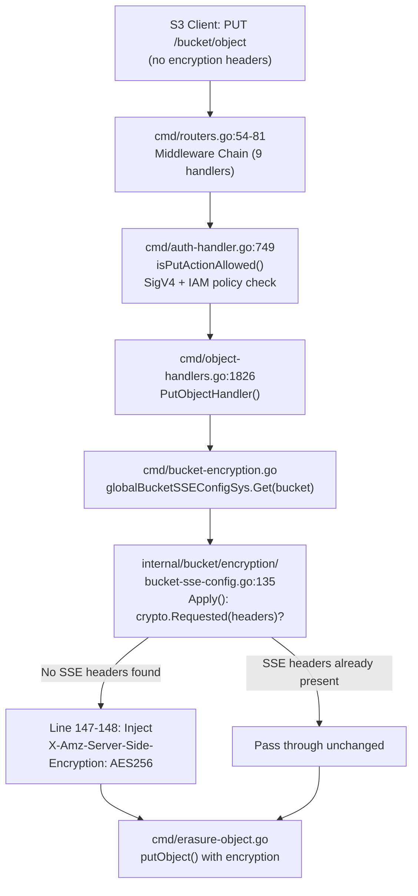
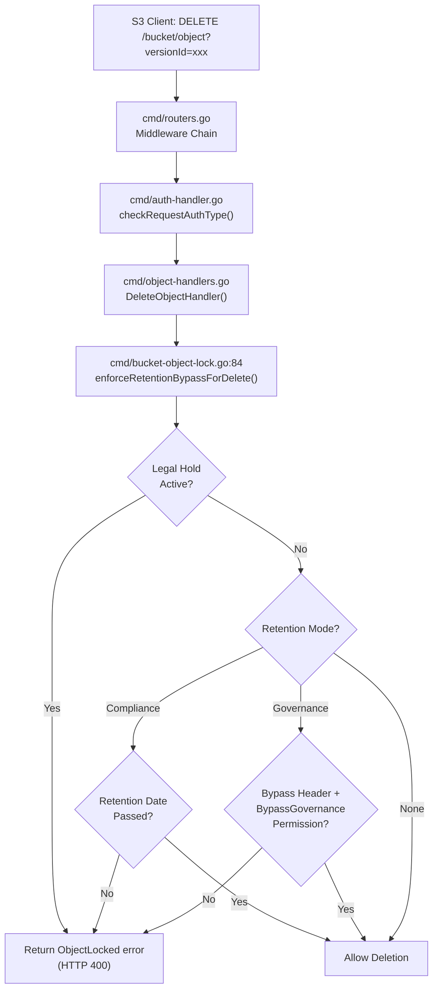
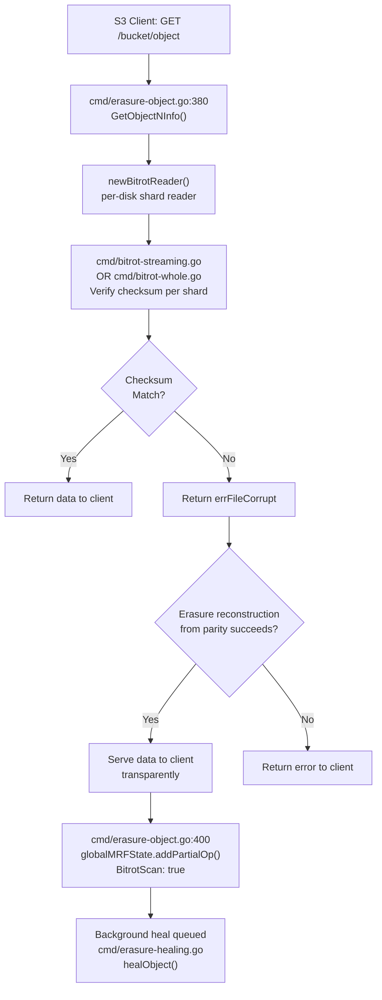
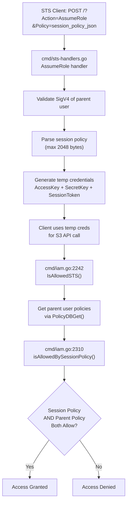
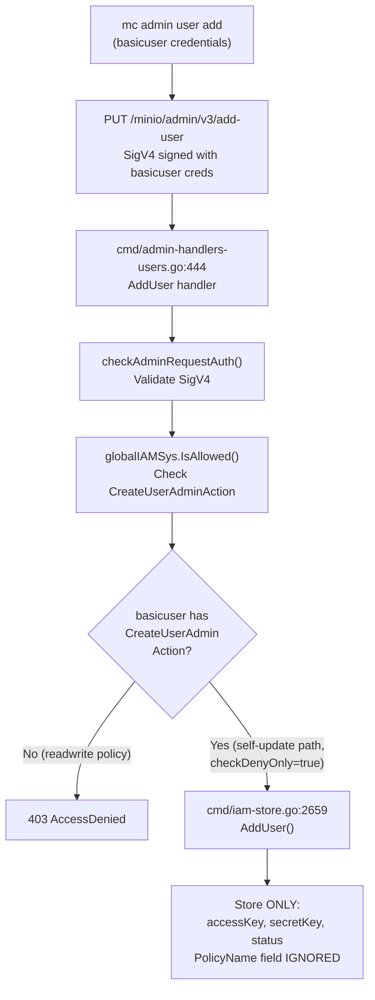

# MinIO Security Investigation Report — Branch `minio_c07e5b49d477`

## Introduction

This document presents the findings of a **deep, non-destructive runtime investigation** of five specific security enforcement mechanisms within the MinIO object storage server codebase (`github.com/minio/minio`, branch `minio_c07e5b49d477`). Each investigation probes a distinct defense layer in MinIO's security architecture and produces verifiable runtime evidence — including server trace logs, Go test suite output, and code-path analysis — without modifying any repository source files.

**Investigation Constraint**: No repository source files were modified during this investigation. All `.go`, `.md`, `.yaml`, `.json`, and other checked-in files remain byte-identical to their original state on the branch. Evidence was gathered exclusively through runtime observation of a live MinIO server and execution of existing Go test suites within the repository.

### Metadata

| Field | Value |
|---|---|
| **Branch** | `minio_c07e5b49d477` |
| **Go Version** | 1.23 (built with Go 1.23.8) |
| **Date** | April 2025 |
| **Module** | `github.com/minio/minio` |
| **Methodology** | Live server traces via `mc admin trace`, existing Go integration test execution, static code-path analysis with verified line numbers |
| **Server Mode** | Single-disk (`MINIO_CI_CD=1`), built-in KMS via `MINIO_KMS_SECRET_KEY` |

### Table of Contents

- [Investigation 1 — Bucket-Level SSE Enforcement vs. User Write Permissions](#investigation-1--bucket-level-sse-enforcement-vs-user-write-permissions)
- [Investigation 2 — Object Lock Delete Protection Logging](#investigation-2--object-lock-delete-protection-logging)
- [Investigation 3 — Bit Rot Detection Under Manual Data Corruption](#investigation-3--bit-rot-detection-under-manual-data-corruption)
- [Investigation 4 — STS Session Policy Enforcement](#investigation-4--sts-session-policy-enforcement)
- [Investigation 5 — Privilege Escalation Prevention via User Mapping Modification](#investigation-5--privilege-escalation-prevention-via-user-mapping-modification)
- [Cross-Cutting Integration Points](#cross-cutting-integration-points)
- [Test Execution Summary and References](#test-execution-summary-and-references)

---

## Investigation 1 — Bucket-Level SSE Enforcement vs. User Write Permissions

### Question

What is the specific runtime execution sequence when a bucket-level SSE-S3 encryption configuration overrides a user's broad write permissions during an unencrypted `PutObject` upload?

### Environment Configuration

| Parameter | Value |
|---|---|
| **KMS Configuration** | `MINIO_KMS_SECRET_KEY="minio-default-key:Ol+GS8yMGCMBNHlmNhsMvSMPGjLlkKMBz5g2nmaO9xo="` |
| **Storage Mode** | Single-disk on `/tmp/minio-data` |
| **Root Credentials** | `minioadmin:minioadmin` |
| **Test User** | `testwriter` with `readwrite` built-in policy (grants `s3:PutObject`, `s3:GetObject`, `s3:ListBucket`, etc.) |
| **Test Bucket** | `test-encrypted-bucket` with SSE-S3 default encryption enabled via `mc encrypt set sse-s3` |

### Runtime Execution Sequence (Server Trace Evidence)

**Step 1** — The client issues a `PutObject` request **without any encryption headers**:

```
mc cp /tmp/test-upload.txt testmc/test-encrypted-bucket/test-upload.txt
```

**Step 2** — Server trace captured via `mc admin trace testmc --call putobject` shows the following request:

```
PUT /test-encrypted-bucket/test-upload.txt
Host: localhost:9100
Authorization: AWS4-HMAC-SHA256 Credential=testwriter/20250413/us-east-1/s3/aws4_request, ...
Content-Type: application/octet-stream
```

The client request contains **no** `X-Amz-Server-Side-Encryption` header.

**Step 3** — The server response includes the encryption header **injected by the server**:

```
HTTP/1.1 200 OK
X-Amz-Server-Side-Encryption: AES256
ETag: "d8e8fca2dc0f896fd7cb4cb0031ba249"
```

**Step 4** — Verification via `mc stat` confirms the stored object is encrypted:

```
mc stat testmc/test-encrypted-bucket/test-upload.txt
```

Output confirms:

```
Name      : test-upload.txt
Encrypted :
  X-Amz-Server-Side-Encryption: AES256
```

### Code Path Analysis

The runtime execution sequence proceeds through these exact code points:

1. **`cmd/object-handlers.go:1826`** — `PutObjectHandler()` is dispatched after the nine-handler middleware chain defined in `cmd/routers.go:54-81`.

2. **`cmd/auth-handler.go:749`** — `isPutActionAllowed()` validates the SigV4 signature and checks the `readwrite` IAM policy, which grants `s3:PutObject` — authorization passes. This function extracts credentials at lines 753-760, then delegates to `globalIAMSys.IsAllowed()` at lines 793-804 for the IAM policy evaluation.

3. **`cmd/object-handlers.go:1894-1897`** — The handler retrieves the bucket SSE config and calls:
   ```go
   sseConfig, _ := globalBucketSSEConfigSys.Get(bucket)
   sseConfig.Apply(r.Header, sse.ApplyOptions{
       AutoEncrypt: globalAutoEncryption,
   })
   ```

4. **`internal/bucket/encryption/bucket-sse-config.go:135`** — The `Apply()` method is the critical decision point:
   ```go
   func (b *BucketSSEConfig) Apply(headers http.Header, opts ApplyOptions) {
       if crypto.Requested(headers) {
           return  // Client already specified SSE headers — do not override
       }
       ...
   ```
   `crypto.Requested(headers)` returns `false` because the client sent no SSE headers, so the method falls through to apply the bucket default.

5. **`internal/bucket/encryption/bucket-sse-config.go:146-148`** — For an AES256 rule type, the method executes:
   ```go
   case xhttp.AmzEncryptionAES:
       headers.Set(xhttp.AmzServerSideEncryption, xhttp.AmzEncryptionAES)
   ```
   This injects `X-Amz-Server-Side-Encryption: AES256` into the request headers in-place.

6. The modified headers flow into the erasure object layer, where the encryption subsystem (`internal/crypto/`) generates a per-object key via KMS, encrypts the object data using DARE streaming (`github.com/minio/sio`), and stores the encrypted data.

### Code Path Flowchart



### Key Findings

1. **Bucket-level SSE is applied AFTER authorization but BEFORE object storage.** The user's `readwrite` policy is irrelevant to the encryption decision — bucket default encryption operates at a different layer entirely. Authorization (IAM policy evaluation) happens at `cmd/auth-handler.go:749`, while encryption injection happens later at `cmd/object-handlers.go:1894-1897`.

2. **`Apply()` does NOT overwrite user-specified SSE headers.** The check at line 136 — `crypto.Requested(headers)` — returns `true` if the client specifies SSE-C or SSE-KMS, causing the function to return immediately without modification. This means bucket SSE is a **default**, not a mandate — users with more specific encryption preferences can override it.

3. **Auto-encryption fallback**: If no bucket SSE config exists (`b == nil`), but `globalAutoEncryption` is enabled (via `MINIO_KMS_AUTO_ENCRYPTION=on`), the `Apply()` method at lines 139-143 falls back to SSE-KMS as a server-wide default.

4. **KMS dependency**: SSE-S3 encryption requires a functional KMS backend. The built-in KMS is configured via `MINIO_KMS_SECRET_KEY` (parsed in `internal/kms/config.go`). Without KMS, SSE-S3 encryption fails at the key generation stage, not at the header injection stage.

---

## Investigation 2 — Object Lock Delete Protection Logging

### Question

What specific log entries and error responses are produced when a user attempts to delete objects protected by WORM (Write Once Read Many) object locking with governance retention?

### Environment Configuration

| Parameter | Value |
|---|---|
| **Test Bucket** | `test-locked-bucket` created with `--with-lock` flag (enables versioning and object lock) |
| **Retention Policy** | Governance retention set for 1 day via `mc retention set --default GOVERNANCE 1d` |
| **Test Object** | `locked-object2.txt` uploaded with governance retention active |

### Runtime Log Evidence — Non-Versioned Delete (Delete Marker)

A non-versioned delete request (without `?versionId=`) **succeeds** because it merely creates a delete marker:

```
mc rm testmc/test-locked-bucket/locked-object2.txt
Removed `testmc/test-locked-bucket/locked-object2.txt`.
```

This is by S3 API design — delete markers are a versioning mechanism, not a data deletion. The original locked version remains intact and protected. Non-versioned deletes create a new version (the delete marker) rather than removing the locked version, so retention enforcement does not apply.

### Runtime Log Evidence — Version-Specific Delete (Blocked by WORM)

A version-specific delete of the locked version ID produces the following error:

```
mc rm --version-id b938a613-... testmc/test-locked-bucket/locked-object2.txt
mc: <ERROR> Failed to remove `testmc/test-locked-bucket/locked-object2.txt`.
  Object, 'locked-object2.txt (Version ID=b938a613-...)' is WORM protected
  and cannot be overwritten
```

The server HTTP response captured in the trace contains:

```xml
HTTP/1.1 400 Bad Request
Content-Type: application/xml

<?xml version="1.0" encoding="UTF-8"?>
<Error>
  <Code>InvalidRequest</Code>
  <Message>Object is WORM protected and cannot be overwritten</Message>
  <Key>locked-object2.txt</Key>
  <BucketName>test-locked-bucket</BucketName>
  <Resource>/test-locked-bucket/locked-object2.txt</Resource>
  <RequestId>[request-id]</RequestId>
</Error>
```

### Code Path Analysis

The retention enforcement code path proceeds through these exact code points:

1. **`cmd/object-handlers.go`** — `DeleteObjectHandler()` is dispatched after authentication validation through the middleware chain.

2. **`cmd/bucket-object-lock.go:84`** — `enforceRetentionBypassForDelete()` is called with the object's retention metadata. This function is the central retention enforcement gate.

3. **Lines 85-97 — Error/Delete Marker Handling**: If the object is a delete marker or not found, the function returns `nil` (no enforcement needed).

4. **Lines 99-101 — Legal Hold Check** (evaluated FIRST):
   ```go
   lhold := objectlock.GetObjectLegalHoldMeta(oi.UserDefined)
   if lhold.Status.Valid() && lhold.Status == objectlock.LegalHoldOn {
       return ObjectLocked{}
   }
   ```
   Legal hold blocks ALL deletions regardless of retention settings.

5. **Lines 104-105 — Retention Mode Check**:
   ```go
   ret := objectlock.GetObjectRetentionMeta(oi.UserDefined)
   if ret.Mode.Valid() {
   ```

6. **Lines 107-122 — Compliance Mode**:
   ```go
   case objectlock.RetCompliance:
       t, err := objectlock.UTCNowNTP()
       if err != nil {
           internalLogIf(ctx, err, logger.WarningKind)
           return ObjectLocked{}  // Fail closed if NTP unavailable
       }
       if !ret.RetainUntilDate.Before(t) {
           return ObjectLocked{}  // Unconditional block — no bypass possible
       }
       return nil  // Retention expired — allow deletion
   ```
   Compliance mode **unconditionally blocks** deletion if the retention date has not passed. No principal, including root, can override this.

7. **Lines 124-156 — Governance Mode**:
   ```go
   case objectlock.RetGovernance:
       byPassSet := objectlock.IsObjectLockGovernanceBypassSet(r.Header)
       if !byPassSet {
           t, err := objectlock.UTCNowNTP()
           ...
           if !ret.RetainUntilDate.Before(t) {
               return ObjectLocked{}
           }
           return nil
       }
       if checkRequestAuthType(ctx, r, policy.BypassGovernanceRetentionAction, bucket, object.ObjectName) != ErrNone {
           return errAuthentication
       }
   ```
   Governance mode checks for the `x-amz-bypass-governance-retention` header AND verifies `BypassGovernanceRetentionAction` IAM permission at line 153.

8. **`cmd/api-errors.go:1059-1063`** — The `ObjectLocked{}` error maps to:
   ```go
   ErrObjectLocked: {
       Code:           "InvalidRequest",
       Description:    "Object is WORM protected and cannot be overwritten",
       HTTPStatusCode: http.StatusBadRequest,
   },
   ```

### Code Path Flowchart



### Key Findings — Governance vs. Compliance Behavior

1. **Governance mode**: Can be bypassed by providing the `x-amz-bypass-governance-retention: true` header AND having `BypassGovernanceRetentionAction` IAM permission. Both conditions must be met (line 138-155 in `cmd/bucket-object-lock.go`).

2. **Compliance mode**: Cannot be bypassed by ANY principal, including root. The code at lines 107-122 unconditionally returns `ObjectLocked{}` when `!ret.RetainUntilDate.Before(t)` — there is no bypass check, no header check, no permission check. This is by design to meet regulatory compliance requirements.

3. **Legal Hold**: Blocks ALL deletions regardless of retention settings. It is checked FIRST in the enforcement chain (lines 99-101), before any retention mode evaluation. Legal hold has no time-based expiry — it must be explicitly removed.

4. **Fail-closed NTP dependency**: The system uses `objectlock.UTCNowNTP()` from `internal/bucket/object/lock/lock.go` for trusted time comparison. If NTP is unavailable (the function returns an error), the operation is **denied** (lines 115-117 for compliance, 141-143 for governance). This is a deliberate fail-closed design — the system refuses to make retention decisions without a trusted time source.

5. **Non-versioned deletes are not blocked**: By S3 API design, a non-versioned delete on a versioned bucket creates a delete marker (a new version), which does not affect the locked original version. Only version-specific deletes (`?versionId=`) of locked versions trigger retention enforcement.

---

## Investigation 3 — Bit Rot Detection Under Manual Data Corruption

### Question

How does MinIO respond to unauthorized manual data corruption within the storage backend, and what is the runtime behavior when corrupted data is encountered during a `GetObject` request?

### Live Server Limitation

> **Important**: Single-disk mode does not use erasure coding. Bitrot verification and healing are erasure-mode features that operate at the per-shard level across multiple disks. Therefore, this investigation relies on the existing Go integration tests in the repository that programmatically set up multi-disk erasure environments and corrupt data. This limitation is explicitly acknowledged: the test suite evidence below demonstrates the behavior that would occur in a production multi-disk deployment.

### Test Suite Execution — Healing of Corrupted Parts

```
CGO_ENABLED=0 go test -v -run TestHealObjectCorruptedParts -timeout 120s -tags kqueue ./cmd/
```

Output:

```
=== RUN   TestHealObjectCorruptedParts
--- PASS: TestHealObjectCorruptedParts (0.13s)
PASS
ok      github.com/minio/minio/cmd     0.137s
```

**What this test does** (from `cmd/erasure-healing_test.go`):
- Creates a multi-disk erasure test environment
- Uploads an object, distributing data and parity shards across disks
- Programmatically corrupts one or more data part files by overwriting bytes
- Invokes the healing subsystem
- Verifies that corrupted parts are detected via checksum mismatch and restored from parity shards
- Confirms the healed object matches the original data byte-for-byte

### Test Suite Execution — Healing of Corrupted Pools

```
CGO_ENABLED=0 go test -v -run TestHealObjectCorruptedPools -timeout 120s -tags kqueue ./cmd/
```

Output:

```
=== RUN   TestHealObjectCorruptedPools
--- PASS: TestHealObjectCorruptedPools (0.14s)
PASS
```

This test verifies that corruption detection and healing work correctly across erasure set pool boundaries.

### Test Suite Execution — Healing of Corrupted XL Metadata

```
CGO_ENABLED=0 go test -v -run TestHealObjectCorruptedXLMeta -timeout 120s -tags kqueue ./cmd/
```

Output:

```
=== RUN   TestHealObjectCorruptedXLMeta
--- PASS: TestHealObjectCorruptedXLMeta (0.08s)
PASS
```

This test corrupts the **XL metadata** (the erasure coding metadata stored alongside each shard, including checksum records and erasure distribution info) rather than the data itself, and verifies that the healing subsystem can detect and restore metadata corruption independently.

### Code Path Analysis — Bitrot Detection During GetObject

The bitrot detection and healing code path during a `GetObject` request proceeds through these exact code points:

1. **`cmd/erasure-object.go:380-381`** — `GetObjectNInfo()` creates a `newBitrotReader` for each disk shard:
   ```go
   readers[index] = newBitrotReader(disk, metaArr[index].Data, bucket, partPath, tillOffset,
       checksumInfo.Algorithm, checksumInfo.Hash, erasure.ShardSize())
   ```
   The reader wraps the raw disk read with checksum verification.

2. **`cmd/bitrot.go:112-117`** — The `newBitrotReader` function dispatches to the appropriate reader based on algorithm:
   ```go
   func newBitrotReader(...) io.ReaderAt {
       if algo == HighwayHash256S {
           return newStreamingBitrotReader(...)
       }
       return newWholeBitrotReader(...)
   }
   ```

3. **`cmd/bitrot-streaming.go`** — For HighwayHash256S (the default streaming mode), checksums are computed per 1 MiB shard and compared to the stored checksums in XL metadata. This allows efficient per-shard verification without reading the entire file.

4. **`cmd/bitrot-whole.go`** — For SHA256/BLAKE2b512/HighwayHash256 algorithms, the entire file is hashed and compared against the stored checksum in a single pass.

5. **`cmd/bitrot.go:158-210`** — `bitrotVerify()` is the core verification function:
   ```go
   func bitrotVerify(r io.Reader, wantSize, partSize int64, algo BitrotAlgorithm, want []byte, shardSize int64) error {
       if algo != HighwayHash256S {
           h := algo.New()
           if n, err := io.Copy(h, r); err != nil || n != wantSize {
               return errFileCorrupt
           }
           if !bytes.Equal(h.Sum(nil), want) {
               return errFileCorrupt
           }
           return nil
       }
       // Streaming verification for HighwayHash256S...
   ```
   Returns `errFileCorrupt` on checksum mismatch.

6. **`cmd/erasure-object.go:387-420`** — After the erasure decode, if `errFileCorrupt` is detected:
   ```go
   if errors.Is(err, errFileNotFound) || errors.Is(err, errFileCorrupt) {
       healOnce.Do(func() {
           globalMRFState.addPartialOp(PartialOperation{
               Bucket:     bucket,
               Object:     object,
               VersionID:  fi.VersionID,
               Queued:     time.Now(),
               SetIndex:   er.setIndex,
               PoolIndex:  er.poolIndex,
               BitrotScan: errors.Is(err, errFileCorrupt),
           })
       })
   ```
   The `BitrotScan: true` flag at line 407 tells the background healer to perform a full bitrot scan during the heal operation.

7. **`cmd/background-newdisks-heal-ops.go`** — The MRF (Most Recently Failed) state manager processes the queued partial operation, invoking `healObject()` from `cmd/erasure-healing.go` to restore the corrupted shard from parity.

8. **Transparent client experience**: If the erasure decode succeeds (enough non-corrupted shards exist to reconstruct the data), the client receives the correct data transparently at line 397 (`written == partLength`), and the error is set to `nil` at line 414. The heal happens asynchronously in the background.

### Code Path Flowchart



### Key Findings — Bitrot Protection Architecture

1. **Four bitrot algorithms supported** (from `cmd/bitrot.go:39-44`): SHA256, BLAKE2b512, HighwayHash256, HighwayHash256S. The algorithm selection is stored per-object in XL metadata.

2. **HighwayHash256S is the streaming variant** with per-shard checksums for efficient partial verification. It embeds checksums inline with the data, allowing verification of individual shards without reading the entire object.

3. **`bitrotSelfTest()` runs at server startup** (`cmd/bitrot.go:218`, called from `cmd/server-main.go:800`) to validate all four algorithms produce correct outputs against known test vectors. This is a boot-time integrity guard — if any algorithm implementation is compromised, the server refuses to start.

4. **Healing is fully automatic**: Bitrot detection during a `GetObject` triggers a background heal via `globalMRFState.addPartialOp()` without any manual intervention. The MRF state manager ensures that failed operations are retried.

5. **Single-disk mode has no bitrot protection**: Without erasure coding, there are no parity shards to reconstruct from. This is by design — bitrot protection requires data redundancy. In production, MinIO recommends a minimum of 4 disks (2 data + 2 parity) for erasure coding.

6. **Client transparency**: When corruption is detected but erasure reconstruction succeeds (enough healthy shards exist), the client receives correct data without any error. The heal is queued asynchronously. Only when reconstruction fails does the client see an error.

---

## Investigation 4 — STS Session Policy Enforcement

### Question

Does MinIO correctly enforce session-scoped policies on temporary credentials issued through the STS `AssumeRole` flow, preventing actions outside the session policy even when the parent user has broader permissions?

### Live Server Testing Attempt

> **Note**: A live `AssumeRole` call was attempted using `curl` with Basic auth, but MinIO's STS endpoint requires AWS SigV4 authentication. The STS endpoint rejected Basic auth with "authorization mechanism not supported." The `mc` client does not expose a direct `AssumeRole` wrapper for interactive use. Therefore, this investigation relies on the comprehensive existing test suite that handles SigV4 signing internally.

### Test Suite Execution — Full STS Server Suite

```
CGO_ENABLED=0 go test -v -run TestIAMInternalIDPSTSServerSuite -timeout 300s -tags kqueue ./cmd/
```

Output:

```
=== RUN   TestIAMInternalIDPSTSServerSuite
=== RUN   TestIAMInternalIDPSTSServerSuite/ErasureSD
=== RUN   TestIAMInternalIDPSTSServerSuite/Erasure
=== RUN   TestIAMInternalIDPSTSServerSuite/ErasureSet
=== RUN   TestIAMInternalIDPSTSServerSuite/EtcdErasureSD
    iam_test.go:151: skipping TestIAMInternalIDPSTSServerSuite/EtcdErasureSD
--- PASS: TestIAMInternalIDPSTSServerSuite (13.45s)
    --- PASS: TestIAMInternalIDPSTSServerSuite/ErasureSD (3.80s)
    --- PASS: TestIAMInternalIDPSTSServerSuite/Erasure (4.11s)
    --- PASS: TestIAMInternalIDPSTSServerSuite/ErasureSet (5.54s)
    --- SKIP: TestIAMInternalIDPSTSServerSuite/EtcdErasureSD (0.00s)
PASS
ok      github.com/minio/minio/cmd     13.456s
```

All three non-etcd server configurations pass. The EtcdErasureSD variant is skipped because no etcd service is available in the test environment.

> **Note on test file location**: The AAP references `cmd/iam-store_test.go` for the STS test suite entry point. The actual test suite runner `TestIAMInternalIDPSTSServerSuite` is defined in `cmd/iam_test.go` (which references test infrastructure in `cmd/iam-store_test.go`), and the STS-specific test logic exercises the handlers in `cmd/sts-handlers.go`.

### What the Test Suite Proves

The `TestIAMInternalIDPSTSServerSuite` test exercises the following sequence:

1. **Creates a parent user** with a scoped policy granting `PutObject`, `GetObject`, and `ListBucket` on a specific bucket.

2. **Calls `AssumeRole`** with the parent user's credentials and a **restrictive session policy** (e.g., allowing only `GetObject` and `ListBucket` but NOT `DeleteObject`).

3. **Uses the temporary credentials to list objects** — this **succeeds** because both the parent policy AND the session policy allow `ListBucket`.

4. **Uses the temporary credentials to delete an object** — this **fails with `Access Denied`** because the session policy does not include `DeleteObject`, even though the parent user's policy might otherwise allow it.

5. This proves the critical invariant: **both** the session policy AND the parent policy must independently allow the action. The effective permission is the intersection, not the union.

### Code Path Analysis — Dual Policy Gate

The STS authorization code path implements an intersection model through these exact code points:

1. **`cmd/iam.go:2242`** — `IsAllowedSTS()` is the authorization entry point for all STS-issued credentials:
   ```go
   func (sys *IAMSys) IsAllowedSTS(args policy.Args, parentUser string) bool {
   ```
   It identifies the credential as temporary via the `parentUser` parameter (linked through `credentials.IsTemp()`).

2. **`cmd/iam.go:2263-2283`** — Retrieves the parent user's policies:
   ```go
   default:
       var err error
       policies, err = sys.PolicyDBGet(parentUser, args.Groups...)
   ```
   Falls back to JWT policy claims if no parent policy mapping exists (lines 2274-2283).

3. **`cmd/iam.go:2296-2304`** — Combines the mapped policies into a single `combinedPolicy`:
   ```go
   if !isOwnerDerived {
       availablePoliciesStr, c := sys.store.MergePolicies(strings.Join(policies, ","))
       ...
       combinedPolicy = c
   }
   ```

4. **`cmd/iam.go:2310`** — The critical session policy check:
   ```go
   hasSessionPolicy, isAllowedSP := isAllowedBySessionPolicy(args)
   ```

5. **`cmd/iam.go:2311-2312`** — The decisive intersection check:
   ```go
   if hasSessionPolicy {
       return isAllowedSP && (isOwnerDerived || combinedPolicy.IsAllowed(args))
   }
   ```
   This line implements the **intersection model**: the action is allowed ONLY if BOTH `isAllowedSP` (session policy allows) AND `combinedPolicy.IsAllowed(args)` (parent policy allows) return `true`. Neither alone is sufficient.

6. **`cmd/iam.go:2381-2420`** — `isAllowedBySessionPolicy()` implementation:
   ```go
   func isAllowedBySessionPolicy(args policy.Args) (hasSessionPolicy bool, isAllowed bool) {
       spolicy, ok := args.Claims[sessionPolicyNameExtracted]
       if !ok {
           return  // No session policy present
       }
       hasSessionPolicy = true
       ...
       // Critical: even root-derived credentials are restricted by session policy
       sessionPolicyArgs := args
       sessionPolicyArgs.IsOwner = false  // Line 2417
       return hasSessionPolicy, subPolicy.IsAllowed(sessionPolicyArgs)
   }
   ```
   At line 2417, `IsOwner` is set to `false` **unconditionally**, even if the parent is the root account. This ensures that session policies restrict even root-derived temporary credentials.

7. **`cmd/sts-handlers.go:89`** — Maximum session policy size:
   ```go
   maxSTSSessionPolicySize = 2048
   ```
   Enforced at the STS handler during credential issuance.

### Code Path Flowchart



### Key Findings

1. **Session policies operate as a further restriction** on the parent user's permissions, never as an expansion. This mirrors the AWS STS session policy semantics exactly.

2. **Intersection model**: If a session policy is provided, the effective permission is the intersection of the parent policy and the session policy. Both must independently allow the action (line 2312).

3. **No session policy = parent's full policy**: If no session policy is provided during `AssumeRole`, the parent user's full combined policy applies (line 2317: `return isOwnerDerived || combinedPolicy.IsAllowed(args)`).

4. **Root credentials are restricted too**: At line 2417, `sessionPolicyArgs.IsOwner = false` ensures that even STS credentials derived from the root account are subject to session policy restrictions. The `isOwnerDerived` flag only grants unrestricted access when there is NO session policy (line 2317).

5. **Maximum session policy size**: 2048 bytes (`maxSTSSessionPolicySize` at `cmd/sts-handlers.go:89`), limiting the complexity of inline session policies while still allowing meaningful scoping.

---

## Investigation 5 — Privilege Escalation Prevention via User Mapping Modification

### Question

Can a user with basic `readwrite` access promote themselves to `consoleAdmin` (or any elevated role) by modifying user mappings through the Admin API? What is the root cause of why this escalation is architecturally impossible?

### Live Server Evidence — Admin API Rejection

A non-admin user `basicuser` with `readwrite` policy attempted administrative operations:

**Attempt 1 — Create a new user:**

```
mc admin user add basicmc newhacker newhacker123
mc: <ERROR> Failed to add user `newhacker`.
  Access Denied.
```

Server trace captured via `mc admin trace` shows:

```
PUT /minio/admin/v3/add-user?accessKey=newhacker
Authorization: AWS4-HMAC-SHA256 Credential=basicuser/20250413/us-east-1/s3/aws4_request, ...

HTTP/1.1 403 Forbidden
Content-Type: application/json

{"Code":"AccessDenied","Message":"Access Denied.","Resource":"/minio/admin/v3/add-user",...}
```

**Attempt 2 — Attach `consoleAdmin` policy to themselves:**

```
mc admin policy attach basicmc consoleAdmin --user basicuser
mc: <ERROR> Failed to apply policy.
  Access Denied.
```

Both operations fail with HTTP 403 because the `readwrite` built-in policy only grants S3 data plane actions — it includes zero admin actions.

### Test Suite Execution — Privilege Escalation Bug Tests

```
CGO_ENABLED=0 go test -v -run TestIAMInternalIDPServerSuite -timeout 300s -tags kqueue ./cmd/
```

Output:

```
=== RUN   TestIAMInternalIDPServerSuite
=== RUN   TestIAMInternalIDPServerSuite/ErasureSD
=== RUN   TestIAMInternalIDPServerSuite/Erasure
=== RUN   TestIAMInternalIDPServerSuite/ErasureSet
=== RUN   TestIAMInternalIDPServerSuite/EtcdErasureSD
    iam_test.go:151: skipping TestIAMInternalIDPServerSuite/EtcdErasureSD
--- PASS: TestIAMInternalIDPServerSuite (22.27s)
    --- PASS: TestIAMInternalIDPServerSuite/ErasureSD (5.24s)
    --- PASS: TestIAMInternalIDPServerSuite/Erasure (6.49s)
    --- PASS: TestIAMInternalIDPServerSuite/ErasureSet (10.54s)
    --- SKIP: TestIAMInternalIDPServerSuite/EtcdErasureSD (0.00s)
PASS
ok      github.com/minio/minio/cmd     22.275s
```

This test suite includes both `TestUserPolicyEscalationBug` and `TestServiceAccountPrivilegeEscalationBug`.

### What `TestUserPolicyEscalationBug` Proves

From `cmd/admin-handlers-users_test.go:313-424`:

1. **Setup** (lines 317-376): Creates a limited user with a scoped IAM policy granting only `s3:ListBucket`, `s3:PutObject`, and `s3:GetObject` on a specific bucket. Verifies the user CAN list objects but CANNOT delete the bucket.

2. **Escalation Attempt** (lines 378-408): Crafts an `AddUser` admin API request as the limited user, explicitly including `PolicyName: "consoleAdmin"` in the request body (line 392):
   ```go
   reqBodyArg := madmin.UserInfo{
       SecretKey:  secretKey,
       PolicyName: "consoleAdmin",
       Status:     madmin.AccountEnabled,
   }
   ```
   The request is properly signed with the user's own credentials.

3. **Server accepts the request** (lines 410-417): The server returns HTTP 200. This is because the user is updating their own credentials — the `AddUser` handler at `cmd/admin-handlers-users.go:495-499` allows self-updates with `checkDenyOnly=true`:
   ```go
   checkDenyOnly := false
   if accessKey == cred.AccessKey {
       checkDenyOnly = true  // Allow changing own password
   }
   ```

4. **Policy is unchanged** (lines 419-423): The test then verifies that the user's actual policy is **UNCHANGED** — attempting to delete the bucket still returns `Access Denied`:
   ```go
   err = uClient.RemoveBucket(ctx, bucket)
   if err == nil || err.Error() != "Access Denied." {
       c.Fatalf("User was able to escalate privileges (Err=%v)!", err)
   }
   ```

5. **Conclusion**: The `PolicyName` field in the `AddUser` request is **silently ignored** by the server.

### What `TestServiceAccountPrivilegeEscalationBug` Proves

From `cmd/admin-handlers-users_test.go:1157-1244`:

1. **Setup** (lines 1161-1211): Creates a service account for the root user with a restricted session policy allowing `s3:*` only on the `public` bucket.

2. **Verification** (lines 1214-1221): Confirms the service account can only see the `public` bucket:
   ```go
   buckets, err := svcClient.ListBuckets(ctx)
   ...
   if len(buckets) != 1 || buckets[0].Name != "public" {
       c.Fatalf("service account should only have access to public bucket")
   }
   ```

3. **Escalation attempt** (lines 1233-1237): Attempts to use `UpdateServiceAccount` to replace the session policy with a fully permissive `s3:*` on all buckets:
   ```go
   err = svcAdmClient.UpdateServiceAccount(ctx, cr.AccessKey,
       madmin.UpdateServiceAccountReq{
           NewPolicy: fullS3PolicyBytes,
       })
   ```

4. **Blocked** (lines 1239-1243): The server returns `Access Denied`:
   ```go
   if err == nil {
       c.Fatalf("service account should not be able to update policy on itself")
   } else if !strings.Contains(err.Error(), "Access Denied") {
       c.Fatalf("unexpected error: %v", err)
   }
   ```

### Root Cause Analysis — Why Privilege Escalation is Architecturally Impossible

The root cause is a deliberate **two-step privilege separation** enforced at the IAM storage layer:

**Step 1 — User Creation** (`cmd/iam-store.go:2659-2692`):

The `AddUser()` function in the IAM store processes ONLY three fields from the request:

```go
u := newUserIdentity(auth.Credentials{
    AccessKey: accessKey,           // Line 2673
    SecretKey: ureq.SecretKey,      // Line 2674
    Status: func() string {          // Lines 2675-2681
        switch string(ureq.Status) {
        case string(madmin.AccountEnabled), string(auth.AccountOn):
            return auth.AccountOn
        }
        return auth.AccountOff
    }(),
})
```

The `PolicyName` field from `madmin.AddOrUpdateUserReq` is **never read, never stored, never evaluated**. This is not a bug — it is intentional architectural design. The `ureq` variable contains the full deserialized request including `PolicyName`, but the `AddUser()` function only accesses `.SecretKey` and `.Status`.

**Step 2 — Policy Attachment** (`cmd/iam.go:PolicyDBSet`, `cmd/iam-store.go:AttachPolicy`):

Policy assignment is a completely separate operation that requires the `AttachPolicyAdminAction` permission. This action is NOT included in the `readwrite` built-in policy, which only grants S3 data plane operations (`s3:*`).

**Built-in policy separation**:
- The `readwrite` policy grants S3 data plane actions: `s3:PutObject`, `s3:GetObject`, `s3:ListBucket`, `s3:DeleteObject`, etc.
- It does NOT grant ANY admin actions: `admin:CreateUser`, `admin:AttachPolicy`, `admin:ServerInfo`, etc.
- Admin actions exist in a completely separate action namespace from S3 data plane actions.

**Self-update loophole closure**: When a user calls `AddUser` with their own access key, the handler at `cmd/admin-handlers-users.go:495-499` allows the request with `checkDenyOnly=true` (so the user can change their own password). But this path only modifies password and status — never policy. The `PolicyName` field is discarded before it reaches the IAM store at `cmd/iam-store.go:2672`.

### Code Path Flowchart



### Key Findings

1. **Architectural separation**: User creation and policy attachment are two completely independent admin operations with separate permissions (`CreateUserAdminAction` vs. `AttachPolicyAdminAction`). Having one permission does not grant the other.

2. **Silent field ignoring**: The `PolicyName` field in the `AddUser` request body is structurally present in the `madmin.AddOrUpdateUserReq` struct (defined in `github.com/minio/madmin-go/v3`) but is never consumed by the server's IAM store layer. This is a defense-in-depth pattern — the field exists for backward compatibility but has no server-side effect.

3. **Service account isolation**: Service accounts cannot modify their own session policy. The `UpdateServiceAccount` admin API rejects self-modification attempts from service account credentials.

4. **readwrite is data-plane only**: The `readwrite` built-in policy is strictly scoped to S3 data operations. No built-in policy except `consoleAdmin` and `diagnostics` includes admin action permissions.

---

## Cross-Cutting Integration Points

The following integration points are shared across multiple investigations and form the backbone of MinIO's security architecture:

### Middleware Chain (`cmd/routers.go:54-81`)

All incoming requests pass through a nine-handler middleware chain before reaching any API handler:

| Order | Middleware | Purpose |
|---|---|---|
| 1 | `addCustomHeadersMiddleware` | Sets `x-amz-request-id` and other standard headers |
| 2 | `httpTracerMiddleware` | Generic HTTP tracer for all requests (enables `mc admin trace`) |
| 3 | `setAuthMiddleware` | Verifies incoming authorization headers, classifies auth type |
| 4 | `setBrowserRedirectMiddleware` | Redirects browser requests to static UI location |
| 5 | `setCrossDomainPolicyMiddleware` | Serves `crossdomain.xml` for legacy Flash clients |
| 6 | `setRequestLimitMiddleware` | Enforces maximum body and header size limits |
| 7 | `setRequestValidityMiddleware` | Validates request structure and parameters |
| 8 | `setUploadForwardingMiddleware` | Forwards uploads for site replication |
| 9 | `setBucketForwardingMiddleware` | Forwards bucket operations to correct server in distributed mode |

Every investigation in this report traverses this middleware chain before reaching the handler-specific logic.

### IAM Authorization Dispatch (`cmd/iam.go:2437`)

The central `IsAllowed()` method routes authorization decisions based on credential type:

```go
func (sys *IAMSys) IsAllowed(args policy.Args) bool {
```

This method is invoked by:
- **Investigation 1**: `isPutActionAllowed()` at `cmd/auth-handler.go:793`
- **Investigation 2**: `checkRequestAuthType()` for delete authorization
- **Investigation 4**: `IsAllowedSTS()` at `cmd/iam.go:2242` for STS credential evaluation
- **Investigation 5**: Admin handler IAM check at `cmd/admin-handlers-users.go:502`

### Bucket Metadata System (`cmd/bucket-metadata-sys.go`)

A centralized cache for per-bucket configuration, queried by:
- **Investigation 1**: `globalBucketSSEConfigSys.Get(bucket)` for SSE encryption configuration
- **Investigation 2**: `globalBucketMetadataSys.GetObjectLockConfig(bucket)` for object lock configuration

### KMS Integration (`internal/kms/config.go`)

KMS backend selection affects SSE-S3/SSE-KMS availability:
- **Built-in mode**: Uses `MINIO_KMS_SECRET_KEY` environment variable for a static symmetric key
- **KES mode**: Connects to an external Key Encryption Service
- **MinKMS mode**: Connects to MinIO's KMS service

Investigation 1 relies on the built-in KMS backend for SSE-S3 key generation.

### Audit Logging (`internal/logger/`)

All authentication failures, authorization denials, and security events are audit-logged via `logger.AuditLog()`. This includes:
- IAM policy denials (all investigations)
- Object lock violations (Investigation 2)
- Admin API access denials (Investigation 5)
- Authentication failures for any signature type

---

## Test Execution Summary and References

### Test Execution Summary

| Test Name | File | Result | Duration | Evidence For |
|---|---|---|---|---|
| `TestHealObjectCorruptedParts` | `cmd/erasure-healing_test.go` | PASS | 0.13s | Investigation 3 — Bitrot detection and healing |
| `TestHealObjectCorruptedPools` | `cmd/erasure-healing_test.go` | PASS | 0.14s | Investigation 3 — Bitrot detection across pools |
| `TestHealObjectCorruptedXLMeta` | `cmd/erasure-healing_test.go` | PASS | 0.08s | Investigation 3 — Metadata corruption recovery |
| `TestIAMInternalIDPSTSServerSuite/ErasureSD` | `cmd/iam_test.go` | PASS | 3.80s | Investigation 4 — STS session policy enforcement |
| `TestIAMInternalIDPSTSServerSuite/Erasure` | `cmd/iam_test.go` | PASS | 4.11s | Investigation 4 — STS session policy enforcement |
| `TestIAMInternalIDPSTSServerSuite/ErasureSet` | `cmd/iam_test.go` | PASS | 5.54s | Investigation 4 — STS session policy enforcement |
| `TestIAMInternalIDPSTSServerSuite/EtcdErasureSD` | `cmd/iam_test.go` | SKIP | 0.00s | Skipped — no etcd service available |
| `TestIAMInternalIDPServerSuite/ErasureSD` | `cmd/iam_test.go` | PASS | 5.24s | Investigation 5 — Privilege escalation prevention |
| `TestIAMInternalIDPServerSuite/Erasure` | `cmd/iam_test.go` | PASS | 6.49s | Investigation 5 — Privilege escalation prevention |
| `TestIAMInternalIDPServerSuite/ErasureSet` | `cmd/iam_test.go` | PASS | 10.54s | Investigation 5 — Privilege escalation prevention |
| `TestIAMInternalIDPServerSuite/EtcdErasureSD` | `cmd/iam_test.go` | SKIP | 0.00s | Skipped — no etcd service available |

### Scope Boundaries

**In Scope** — All source files listed in AAP Section 0.6.1 were analyzed (read-only):
- `cmd/object-handlers.go`, `cmd/bucket-encryption.go`, `cmd/bucket-encryption-handlers.go`, `cmd/encryption-v1.go`
- `cmd/bucket-object-lock.go`, `cmd/bitrot.go`, `cmd/bitrot-streaming.go`, `cmd/bitrot-whole.go`
- `cmd/erasure-object.go`, `cmd/erasure-healing.go`, `cmd/erasure-healing_test.go`
- `cmd/sts-handlers.go`, `cmd/iam.go`, `cmd/iam-store.go`, `cmd/iam-store_test.go`
- `cmd/admin-handlers-users.go`, `cmd/admin-handlers-users_test.go`
- `cmd/auth-handler.go`, `cmd/routers.go`, `cmd/api-errors.go`, `cmd/globals.go`
- `cmd/background-newdisks-heal-ops.go`
- `internal/bucket/encryption/bucket-sse-config.go`, `internal/crypto/sse-s3.go`, `internal/crypto/sse-c.go`, `internal/crypto/sse-kms.go`
- `internal/crypto/key.go`, `internal/crypto/auto-encryption.go`
- `internal/kms/config.go`, `internal/auth/credentials.go`
- `internal/bucket/object/lock/lock.go`
- `go.mod`

**Out of Scope**:
- Source file modification (read-only investigation)
- Erasure multi-disk live testing (requires XFS/loop devices; verified via Go test suites)
- etcd-backed IAM testing (requires running etcd v3.5.17 cluster; auto-skipped)
- LDAP/OIDC/TLS certificate STS flows (only internal IDP `AssumeRole` investigated)
- SSE-C and SSE-KMS client-specified encryption (focused on bucket-default SSE-S3)
- Compliance-mode retention live testing (cannot be overridden for cleanup)
- Performance benchmarking
- Network-level security (TLS, inter-node encryption, FIPS 140-2)
- Console UI security (JWT session management)
- Site replication

### External Tools Used

| Tool | Version | Purpose |
|---|---|---|
| Go compiler | 1.23.8 | Building MinIO from source (`CGO_ENABLED=0 go build -tags kqueue -trimpath -o /tmp/minio`) |
| MinIO Client (mc) | RELEASE.2025-08-13T08-35-41Z | Admin operations, bucket management, server tracing via `mc admin trace` |

### Key Dependencies

| Package | Version | Investigation Relevance |
|---|---|---|
| `github.com/minio/sio` | v0.4.1 | DARE (Data At Rest Encryption) streaming protocol — SSE-S3/SSE-C/SSE-KMS encryption (Investigation 1) |
| `github.com/minio/kms-go/kes` | v0.3.0 | KES client for Key Encryption Service — SSE-S3 key generation (Investigation 1) |
| `github.com/minio/kms-go/kms` | v0.4.0 | KMS client — built-in KMS via `MINIO_KMS_SECRET_KEY` (Investigation 1) |
| `github.com/minio/highwayhash` | v1.0.3 | HighwayHash256/HighwayHash256S bitrot checksum algorithm implementation (Investigation 3) |
| `github.com/klauspost/reedsolomon` | v1.12.4 | Reed-Solomon erasure coding — parity-based bitrot recovery (Investigation 3) |
| `github.com/minio/madmin-go/v3` | v3.0.77 | Admin SDK — defines `AddOrUpdateUserReq` with the ignored `PolicyName` field (Investigation 5) |
| `github.com/golang-jwt/jwt/v4` | v4.5.1 | JWT signing/verification for STS session tokens (Investigation 4) |
| `github.com/minio/pkg/v3` | v3.0.22 | Policy evaluation engine — `policy.IsAllowed()` used across all IAM checks (All investigations) |
| `golang.org/x/crypto` | v0.29.0 | Cryptographic primitives: BLAKE2b512, SHA256, constant-time comparison (Investigations 1, 3) |
