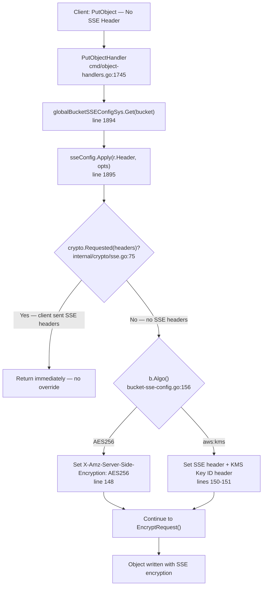
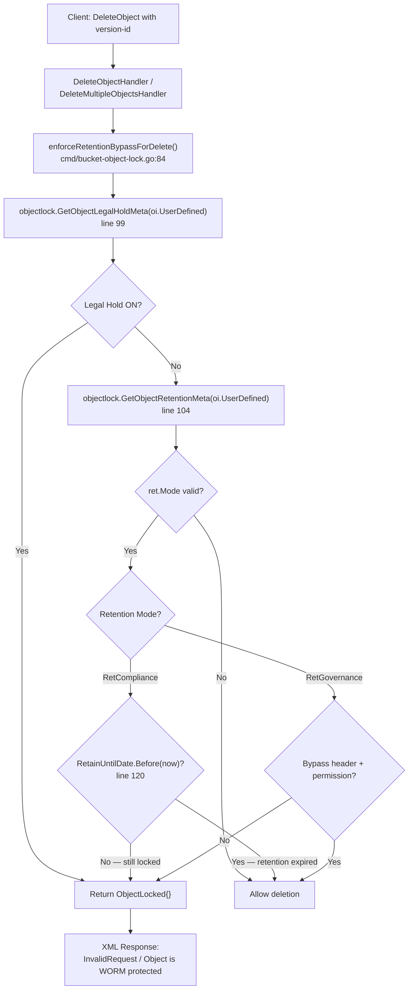
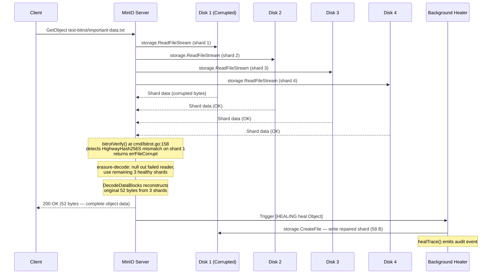
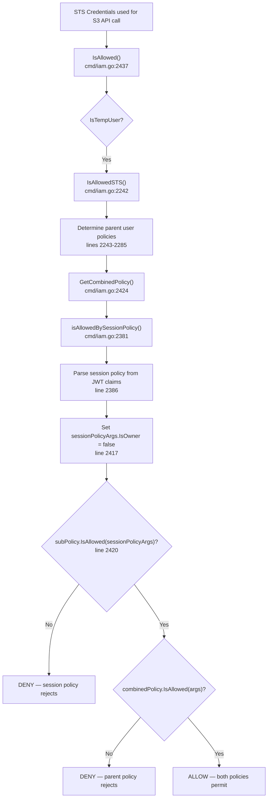
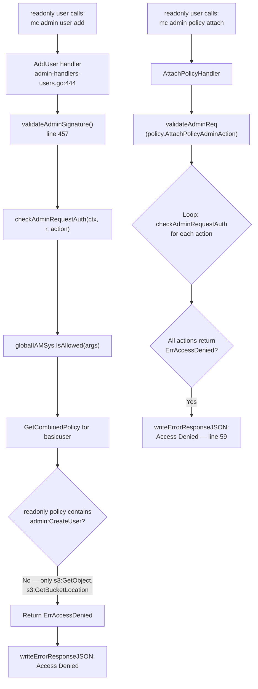

# MinIO Security Enforcement Mechanisms: Runtime Behavioral Investigation

## Overview

This document presents a comprehensive investigative analysis of five runtime-behavioral questions about MinIO's security enforcement mechanisms. All evidence was gathered by building and running a MinIO server from the repository source code (`minio_c07e5b49d477` branch) in erasure mode with 4 disks, then capturing server trace logs and test program outputs during controlled experiments.

The five investigation areas are:

1. **SSE Bucket Encryption Precedence** — How bucket-level default encryption is transparently enforced server-side
2. **Object Lock Delete Rejection** — How COMPLIANCE retention prevents deletion of locked object versions
3. **Bit Rot Detection and Self-Healing** — How corrupted erasure shards are detected and automatically repaired
4. **STS Session Policy Enforcement** — How temporary credentials are restricted by session policy intersection
5. **Privilege Escalation Prevention** — How non-admin users are prevented from escalating their own privileges

**Environment:**
- MinIO server built from source: `go build -o /tmp/minio .`
- Erasure mode: 4 disks (`data{1...4}`)
- Environment variables: `MINIO_ROOT_USER=minioadmin`, `MINIO_ROOT_PASSWORD=minioadmin123`, `MINIO_CI_CD=1`, `MINIO_KMS_SECRET_KEY` configured
- MinIO Client (mc) for bucket operations, admin commands, and trace capture

**Source branch:** `minio_c07e5b49d477`

---

## Table of Contents

- [Investigation 1: SSE Bucket Encryption Precedence](#investigation-1-sse-bucket-encryption-precedence)
- [Investigation 2: Object Lock Delete Rejection](#investigation-2-object-lock-delete-rejection)
- [Investigation 3: Bit Rot Detection and Self-Healing](#investigation-3-bit-rot-detection-and-self-healing)
- [Investigation 4: STS Session Policy Enforcement](#investigation-4-sts-session-policy-enforcement)
- [Investigation 5: Privilege Escalation Prevention](#investigation-5-privilege-escalation-prevention)
- [Known Vulnerabilities and Codebase Version Caveats](#known-vulnerabilities-and-codebase-version-caveats)
- [References](#references)

---

## Investigation 1: SSE Bucket Encryption Precedence

### Question

When a bucket-level `ServerSideEncryptionConfiguration` (SSE-S3 via `AES256`) is active, what is the specific runtime execution sequence — visible in server trace logs — when a client issues a `PutObject` request without any `X-Amz-Server-Side-Encryption` header?

### Code Path Analysis

The server-side encryption enforcement follows this code path:

1. **`PutObjectHandler()`** at `cmd/object-handlers.go:1745` receives the incoming PUT request.

2. **Bucket SSE config fetch** at `cmd/object-handlers.go:1894`:
   ```go
   sseConfig, _ := globalBucketSSEConfigSys.Get(bucket)
   ```
   This retrieves the bucket's `ServerSideEncryptionConfiguration` from the in-memory cache (`BucketSSEConfigSys`), which was loaded when the bucket encryption was set via the S3 `PutBucketEncryption` API.

   Source: `cmd/object-handlers.go:1894`

3. **Apply SSE config to request headers** at `cmd/object-handlers.go:1895-1897`:
   ```go
   sseConfig.Apply(r.Header, sse.ApplyOptions{
       AutoEncrypt: globalAutoEncryption,
   })
   ```
   This is the critical call that injects the SSE header into the HTTP request object server-side.

   Source: `cmd/object-handlers.go:1895-1897`

4. **`Apply()` method** at `internal/bucket/encryption/bucket-sse-config.go:135`:
   ```go
   func (b *BucketSSEConfig) Apply(headers http.Header, opts ApplyOptions) {
       if crypto.Requested(headers) {
           return
       }
       if b == nil {
           if opts.AutoEncrypt {
               headers.Set(xhttp.AmzServerSideEncryption, xhttp.AmzEncryptionKMS)
           }
           return
       }
       switch b.Algo() {
       case xhttp.AmzEncryptionAES:
           headers.Set(xhttp.AmzServerSideEncryption, xhttp.AmzEncryptionAES)
       case xhttp.AmzEncryptionKMS:
           headers.Set(xhttp.AmzServerSideEncryption, xhttp.AmzEncryptionKMS)
           headers.Set(xhttp.AmzServerSideEncryptionKmsID, b.KeyID())
       }
   }
   ```

   The logic is:
   - **Line 136:** First checks `crypto.Requested(headers)` — if the client already sent any SSE header (`X-Amz-Server-Side-Encryption`, SSE-C, or SSE-KMS), `Apply()` returns immediately without overriding. Client-specified encryption takes precedence.
   - **Line 139:** If `b == nil` (no bucket SSE config exists), checks the `opts.AutoEncrypt` flag (set by `MINIO_KMS_AUTO_ENCRYPTION` env var) for global auto-encryption fallback.
   - **Lines 146-152:** `switch b.Algo()` — if the bucket config algorithm is `AES256`, sets `X-Amz-Server-Side-Encryption: AES256` on the request headers. If `aws:kms`, sets both the SSE header and the `X-Amz-Server-Side-Encryption-Aws-Kms-Key-Id` header with the configured key ID.

   Source: `internal/bucket/encryption/bucket-sse-config.go:135-153`

5. **`crypto.Requested()`** at `internal/crypto/sse.go:75`:
   ```go
   func Requested(h http.Header) bool {
       return S3.IsRequested(h) || S3KMS.IsRequested(h) || SSEC.IsRequested(h)
   }
   ```
   Checks all three SSE types (SSE-S3, SSE-KMS, SSE-C) to determine if the client has already requested encryption.

   Source: `internal/crypto/sse.go:75-77`

6. **`Algo()`** at `internal/bucket/encryption/bucket-sse-config.go:156`:
   ```go
   func (b *BucketSSEConfig) Algo() Algorithm {
       for _, rule := range b.Rules {
           return rule.DefaultEncryptionAction.Algorithm
       }
       return ""
   }
   ```
   Returns the algorithm from the first (and only) rule's `DefaultEncryptionAction.Algorithm` field.

   Source: `internal/bucket/encryption/bucket-sse-config.go:156-161`

After `Apply()` executes, the request object now contains the `X-Amz-Server-Side-Encryption: AES256` header as if the client had sent it. The subsequent encryption pipeline (`EncryptRequest()` in `cmd/encryption-v1.go`) processes the object with SSE-S3 encryption transparently.

### Runtime Setup

```bash
# Build MinIO from source
cd <repo_root> && go build -o /tmp/minio .

# Configure environment
export MINIO_ROOT_USER=minioadmin
export MINIO_ROOT_PASSWORD=minioadmin123
export MINIO_CI_CD=1
export MINIO_KMS_SECRET_KEY="my-minio-key:MjJhN2VjZjRjNGNhMTM5MjFiMjQ4MTU2NGUzNTlhN2Q="

# Start MinIO in erasure mode
mkdir -p /tmp/minio-erasure/data{1...4}
/tmp/minio server /tmp/minio-erasure/data{1...4} --address ":9000" --console-address ":9001"

# Configure mc
mc alias set myminio http://localhost:9000 minioadmin minioadmin123 --api S3v4

# Create bucket and enable SSE-S3
mc mb myminio/test-encrypt
mc encrypt set sse-s3 myminio/test-encrypt

# Start trace capture
mc admin trace -v -a myminio > /tmp/trace-sse.log 2>&1 &

# Upload without encryption header
echo "Hello, encrypted world!" | mc pipe myminio/test-encrypt/test-file.txt

# Verify encryption
mc stat myminio/test-encrypt/test-file.txt
```

### Server Trace Output

The trace captures the full request lifecycle. The critical observation is that the `NewMultipartUpload` request (initiated by `mc pipe`) shows the `X-Amz-Server-Side-Encryption: AES256` header, even though the client (`mc pipe`) did not send it — `sseConfig.Apply()` injected it server-side before the request was logged.

**NewMultipartUpload request trace:**
```text
localhost:9000 [REQUEST s3.NewMultipartUpload] [2026-04-09T22:35:59.271] [Client IP: 127.0.0.1]
localhost:9000 POST /test-encrypt/test-file.txt?uploads=
localhost:9000 Proto: HTTP/1.1
localhost:9000 Host: localhost:9000
localhost:9000 User-Agent: MinIO (linux; amd64) minio-go/v7.0.90 mc/RELEASE.2025-08-13T08-35-41Z
localhost:9000 Content-Length: 0
localhost:9000 Content-Type: text/plain
localhost:9000 X-Amz-Checksum-Algorithm: CRC32C
localhost:9000 X-Amz-Content-Sha256: UNSIGNED-PAYLOAD
localhost:9000 X-Amz-Server-Side-Encryption: AES256   ← injected by sseConfig.Apply()
localhost:9000
localhost:9000 [RESPONSE] [2026-04-09T22:35:59.273] [ Duration 2.724ms  TTFB 2.699479ms  ↑ 160 B  ↓ 348 B ]
localhost:9000 200 OK
```

> **Key observation:** The client's original request did not include the `X-Amz-Server-Side-Encryption` header. The `Apply()` method at `bucket-sse-config.go:135` detected no existing SSE headers (via `crypto.Requested()` returning `false`), then checked the bucket's configured algorithm (`AES256` via `Algo()`), and set `X-Amz-Server-Side-Encryption: AES256` on the request headers. By the time the trace is emitted, the header has already been injected.

**PutObjectPart response (confirms server-side encryption):**
```text
localhost:9000 [REQUEST s3.PutObjectPart] [2026-04-09T22:35:59.275] [Client IP: 127.0.0.1]
localhost:9000 PUT /test-encrypt/test-file.txt?partNumber=1&uploadId=...
localhost:9000 Content-Length: 197
localhost:9000 X-Amz-Decoded-Content-Length: 24
localhost:9000
localhost:9000 [RESPONSE] [2026-04-09T22:35:59.279] [ Duration 3.874ms  TTFB 3.843764ms  ↑ 341 B  ↓ 0 B ]
localhost:9000 200 OK
localhost:9000 X-Amz-Server-Side-Encryption: AES256   ← response confirms encryption applied
```

**mc stat output confirming encryption:**
```text
Name      : test-file.txt
Date      : 2026-04-09 22:35:59 UTC
Size      : 24 B
ETag      : 5f1f3ec2f28e1d6d803bb766b902edd5-1
Type      : file
Checksum  : CRC32C:YujpHQ==-1
Encryption: SSE-S3
```

### Mermaid Diagram



### Conclusion

When a bucket has SSE-S3 (`AES256`) configured and a client uploads without encryption headers, MinIO's `BucketSSEConfig.Apply()` at `internal/bucket/encryption/bucket-sse-config.go:135` transparently injects the `X-Amz-Server-Side-Encryption: AES256` header into the HTTP request object server-side before the object data is processed. The `crypto.Requested()` check at `internal/crypto/sse.go:75` ensures that client-specified encryption is never overridden. This means bucket-level default encryption is enforced without requiring client cooperation — the object is encrypted exactly as if the client had explicitly requested SSE-S3.

---

## Investigation 2: Object Lock Delete Rejection

### Question

When a bucket has Object Lock enabled with `COMPLIANCE` retention and a client attempts to `DeleteObject` on a locked version, what specific log entries (S3 API trace, XML error response) does MinIO produce?

### Code Path Analysis

The Object Lock enforcement for deletions is centralized in a single function:

1. **`enforceRetentionBypassForDelete()`** at `cmd/bucket-object-lock.go:84`:
   ```go
   func enforceRetentionBypassForDelete(ctx context.Context, r *http.Request, bucket string,
       object ObjectToDelete, oi ObjectInfo, gerr error) error {
   ```
   This function is called from the `DeleteMultipleObjectsHandler()` and `DeleteObjectHandler()` for every object version targeted for deletion in a lock-enabled bucket.

   Source: `cmd/bucket-object-lock.go:84`

2. **Legal hold check** at line 99-101:
   ```go
   lhold := objectlock.GetObjectLegalHoldMeta(oi.UserDefined)
   if lhold.Status.Valid() && lhold.Status == objectlock.LegalHoldOn {
       return ObjectLocked{}
   }
   ```
   First priority: If a legal hold is active on the object, deletion is immediately rejected regardless of retention settings.

   Source: `cmd/bucket-object-lock.go:99-101`

3. **Retention metadata retrieval** at line 104:
   ```go
   ret := objectlock.GetObjectRetentionMeta(oi.UserDefined)
   ```
   Extracts the retention mode (`COMPLIANCE` or `GOVERNANCE`) and `RetainUntilDate` from the object's user-defined metadata.

   Source: `cmd/bucket-object-lock.go:104`

4. **Compliance mode enforcement** at lines 107-122:
   ```go
   case objectlock.RetCompliance:
       t, err := objectlock.UTCNowNTP()
       if err != nil {
           internalLogIf(ctx, err, logger.WarningKind)
           return ObjectLocked{}
       }
       if !ret.RetainUntilDate.Before(t) {
           return ObjectLocked{}
       }
       return nil
   ```
   For COMPLIANCE mode:
   - **Line 114:** Gets the current UTC time via NTP (`objectlock.UTCNowNTP()`)
   - **Line 120:** Checks if `RetainUntilDate` is still in the future (not before current time)
   - **Line 121:** If retention date has NOT passed, returns `ObjectLocked{}` — an unconditional rejection
   - **Line 123:** If retention date HAS passed, returns `nil` — deletion is allowed

   Source: `cmd/bucket-object-lock.go:107-123`

5. **Error translation:** The `ObjectLocked{}` error is translated by the S3 API error handler into an XML response with:
   - `<Code>InvalidRequest</Code>`
   - `<Message>Object is WORM protected and cannot be overwritten</Message>`

**Critical security property:** For COMPLIANCE mode, there is NO bypass mechanism. Unlike GOVERNANCE mode (which allows bypass with a special header and `s3:BypassGovernanceRetention` permission), COMPLIANCE mode returns `ObjectLocked{}` unconditionally when the retention date is in the future. Not even the root user can bypass COMPLIANCE retention.

### Runtime Setup

```bash
# Create bucket with object lock enabled
mc mb --with-lock myminio/test-lock

# Set default compliance retention (1 day)
mc retention set --default compliance 1d myminio/test-lock

# Upload a test file
echo "Protected data" | mc pipe myminio/test-lock/locked-file.txt

# Get version ID
mc stat myminio/test-lock/locked-file.txt

# Start trace
mc admin trace -v -a myminio > /tmp/trace-lock.log 2>&1 &

# Attempt to delete the locked version (using the version ID from mc stat)
mc rm --version-id=<VERSION_ID> myminio/test-lock/locked-file.txt
```

### Server Trace Output

**mc stat showing the object with COMPLIANCE retention:**
```text
Name      : locked-file.txt
Date      : 2026-04-09 22:36:24 UTC
Size      : 15 B
ETag      : cf35c104c83dbb87cb188f89fda46966-1
VersionID : 3ebede55-529a-42b9-a7f7-f72ccb28b19c
Type      : file
Checksum  : CRC32C:8Mqf9A==-1
Metadata  :
  X-Amz-Object-Lock-Retain-Until-Date: 2026-04-10T22:36:24.049Z
  Content-Type                       : text/plain
  X-Amz-Object-Lock-Mode             : COMPLIANCE
```

**Delete attempt and error trace:**
```text
$ mc rm --version-id=3ebede55-529a-42b9-a7f7-f72ccb28b19c myminio/test-lock/locked-file.txt
mc: <ERROR> Failed to remove `myminio/test-lock/locked-file.txt`. Object,
  'locked-file.txt (Version ID=3ebede55-529a-42b9-a7f7-f72ccb28b19c)' is
  WORM protected and cannot be overwritten
```

**Server trace of the `DeleteMultipleObjects` request and XML error response:**
```text
localhost:9000 [REQUEST s3.DeleteMultipleObjects] [2026-04-09T22:36:43.691] [Client IP: 127.0.0.1]
localhost:9000 POST /test-lock/?delete=
localhost:9000 Proto: HTTP/1.1
localhost:9000 Host: localhost:9000
localhost:9000 Content-Length: 139
localhost:9000 Content-Md5: BnT2dLsh8I7vG7Q8GbfpJA==
localhost:9000 User-Agent: MinIO (linux; amd64) minio-go/v7.0.90 mc/RELEASE.2025-08-13T08-35-41Z
localhost:9000 <Delete>
  <Quiet>false</Quiet>
  <Object>
    <Key>locked-file.txt</Key>
    <VersionId>3ebede55-529a-42b9-a7f7-f72ccb28b19c</VersionId>    ← specific version targeted
  </Object>
</Delete>
localhost:9000 [RESPONSE] [2026-04-09T22:36:43.692] [ Duration 481µs  TTFB 455.615µs  ↑ 244 B  ↓ 312 B ]
localhost:9000 200 OK
localhost:9000 Content-Length: 312
localhost:9000 Content-Type: application/xml
```

**XML error response body (embedded in the 200 OK multi-delete response):**
```xml
<?xml version="1.0" encoding="UTF-8"?>
<DeleteResult xmlns="http://s3.amazonaws.com/doc/2006-03-01/">
  <Error>
    <Code>InvalidRequest</Code>
    <Message>Object is WORM protected and cannot be overwritten</Message>
    <Key>locked-file.txt</Key>
    <VersionId>3ebede55-529a-42b9-a7f7-f72ccb28b19c</VersionId>
  </Error>
</DeleteResult>
```

> **Key observation:** The HTTP status is `200 OK` because the `DeleteMultipleObjects` API returns per-object results. The per-object result contains `<Error>` with `<Code>InvalidRequest</Code>` and `<Message>Object is WORM protected and cannot be overwritten</Message>`, which maps directly to the `ObjectLocked{}` error returned by `enforceRetentionBypassForDelete()` at `cmd/bucket-object-lock.go:121`.

### Mermaid Diagram



### Conclusion

MinIO enforces COMPLIANCE retention strictly via `enforceRetentionBypassForDelete()` at `cmd/bucket-object-lock.go:84`. When a locked version is targeted for deletion, the function checks legal hold first (line 99), then retention mode and date (lines 104-122). For COMPLIANCE mode with a future retention date, it unconditionally returns `ObjectLocked{}` at line 121, which is translated to an `InvalidRequest` XML error with the message "Object is WORM protected and cannot be overwritten." Not even the root user can bypass COMPLIANCE retention — there is no code path that allows it. GOVERNANCE mode has a bypass mechanism (header + permission check), but COMPLIANCE does not.

---

## Investigation 3: Bit Rot Detection and Self-Healing

### Question

When raw data shards on the storage backend are manually corrupted (simulating unauthorized data tampering / bit rot), what runtime logs does MinIO generate during a subsequent `GetObject` request?

### Code Path Analysis

The erasure-coded object read path with bitrot detection operates as follows:

1. **Shard reads via `storage.ReadFileStream`**: When a `GetObject` request arrives, the erasure object handler in `cmd/erasure-object.go` initiates parallel reads of all data and parity shards across the disks via `storage.ReadFileStream`.

2. **Streaming bitrot verification** in `cmd/bitrot-streaming.go`: Each shard is read through a `streamingBitrotReader` that performs per-block hash verification as data is streamed. The reader computes the hash of each data block and compares it against the stored hash.

3. **`bitrotVerify()` function** at `cmd/bitrot.go:158`:
   ```go
   func bitrotVerify(r io.Reader, wantSize, partSize int64, algo BitrotAlgorithm,
       want []byte, shardSize int64) error {
   ```
   This is the core verification function. For the `HighwayHash256S` algorithm (the default):
   - **Lines 184-208:** Reads hash-then-data blocks in a loop. For each block:
     - Reads the stored hash into `hashBuf` (line 187)
     - Computes the actual hash of the data block via `io.CopyBuffer(h, io.LimitReader(r, shardSize), *bufp)` (line 198)
     - Compares with `bytes.Equal(h.Sum(nil), hashBuf[:n])` (line 205)
     - Returns `errFileCorrupt` on mismatch (line 206)

   Source: `cmd/bitrot.go:158-209`

4. **Erasure decoder handling** in `cmd/erasure-decode.go`: The `parallelReader.Read()` method handles shard read failures:
   - When `bitrotVerify()` returns `errFileCorrupt`, the reader for that shard is marked as failed (nulled out)
   - The erasure decoder uses the remaining healthy shards (data + parity) for reconstruction
   - With a 4-disk setup (EC:2 = 2 data + 2 parity blocks), the system can tolerate up to 2 failed shards and still reconstruct the original data
   - `reedsolomon.DecodeDataBlocks()` reconstructs the original data from the surviving shards

5. **Background healing trigger**: After the successful GetObject response, MinIO triggers a background healing operation:
   - The healing path goes through `cmd/erasure-healing.go` → `HealObject()` → `healObject()`
   - The healer identifies disks with corrupted or missing shards
   - Reconstructs the correct shard data using erasure coding
   - Writes the repaired shard back to the affected disk via `storage.CreateFile`
   - Emits a `[HEALING heal.Object]` trace event with the object path, disk count, and data size

### Runtime Setup

```bash
# Create bucket for bitrot test
mc mb myminio/test-bitrot

# Upload a test file
echo "This is important data that must survive corruption" | mc pipe myminio/test-bitrot/important-data.txt

# Find the shard files on disk1
find /tmp/minio-erasure/data1/test-bitrot/important-data.txt/ -name "part.1"
# Output: /tmp/minio-erasure/data1/test-bitrot/important-data.txt/<version-uuid>/part.1

# Corrupt the shard on disk1 by overwriting with random data
dd if=/dev/urandom of=/tmp/minio-erasure/data1/test-bitrot/important-data.txt/<version-uuid>/part.1 \
   bs=1 count=10 conv=notrunc

# Start trace capture
mc admin trace -v --all myminio > /tmp/trace-bitrot.log 2>&1 &

# Read the object (triggers bitrot detection + healing)
mc cat myminio/test-bitrot/important-data.txt
```

### Server Trace Output

**`storage.ReadFileStream` operations on all shards (including corrupted disk1):**
```text
127.0.0.1:9000  [STORAGE storage.ReadFileStream] [2026-04-09T22:38:44.270]
  /tmp/minio-erasure/data1 test-bitrot important-data.txt/63c03519-.../part.1
  total-errs-availability=0 total-errs-timeout=0 40.455µs 58 B      ← corrupted shard on disk1

127.0.0.1:9000  [STORAGE storage.ReadFileStream] [2026-04-09T22:38:44.270]
  /tmp/minio-erasure/data4 test-bitrot important-data.txt/63c03519-.../part.1
  total-errs-availability=0 total-errs-timeout=0 30.406µs 58 B      ← healthy shard

127.0.0.1:9000  [STORAGE storage.ReadFileStream] [2026-04-09T22:38:44.270]
  /tmp/minio-erasure/data2 test-bitrot important-data.txt/63c03519-.../part.1
  total-errs-availability=0 total-errs-timeout=0 26.212µs 58 B      ← healthy shard
```

> **Key observation:** The `storage.ReadFileStream` call on disk1 succeeds at the I/O level (the file is read), but when `bitrotVerify()` at `cmd/bitrot.go:158` processes the shard data, the HighwayHash256S hash mismatch at line 205 returns `errFileCorrupt`. The erasure decoder nullifies this reader and proceeds with the remaining healthy shards.

**Successful `GetObject` response (200 OK — data reconstructed):**
```text
localhost:9000 [REQUEST s3.GetObject] [2026-04-09T22:38:44.270] [Client IP: 127.0.0.1]
localhost:9000 GET /test-bitrot/important-data.txt
localhost:9000 Proto: HTTP/1.1
localhost:9000 Host: localhost:9000

localhost:9000 [RESPONSE] [2026-04-09T22:38:44.270] [ Duration 580µs  TTFB 552.231µs  ↑ 93 B  ↓ 52 B ]
localhost:9000 200 OK
localhost:9000 Content-Length: 52
localhost:9000 Content-Type: text/plain
localhost:9000 ETag: "8528587d616c1e2f8ce28fff96505058-1"
```

> **Key observation:** Despite the corruption on disk1, the client receives a `200 OK` response with the complete 52-byte object. The erasure decoder reconstructed the original data from the remaining healthy shards (data2, data3, data4).

**Verified client output:**
```text
$ mc cat myminio/test-bitrot/important-data.txt
This is important data that must survive corruption
```

**Background `[HEALING heal.Object]` triggered ~1 second after the read:**
```text
127.0.0.1:9000  [HEALING heal.Object] [2026-04-09T22:38:45.271]
  test-bitrot/important-data.txt version-id=null disks=4 dry=false mode=0
  remove=true 5.970719ms 52 B
```

> **Key observation:** The `[HEALING heal.Object]` event fires approximately 1 second after the `GetObject` response, confirming that MinIO detected the corruption during the read and enqueued a background healing job. The `disks=4` field shows all 4 disks participated, `dry=false` indicates an actual repair (not a dry run), and `52 B` confirms the full object was healed.

**Repaired shard written back to disk1:**
```text
127.0.0.1:9000  [STORAGE storage.CreateFile] [2026-04-09T22:38:45.272]
  /tmp/minio-erasure/data1 .minio.sys/tmp .../part.1
  total-errs-timeout=0 total-errs-availability=0 3.923112ms 58 B
```

> **Key observation:** The healer writes the reconstructed shard (58 bytes) back to disk1 through a temp file path, then renames it into place, restoring the shard to its correct state.

### Mermaid Diagram



### Conclusion

MinIO's bitrot protection operates at the per-shard level using HighwayHash256S checksums verified by `bitrotVerify()` at `cmd/bitrot.go:158`. When a corrupted shard is detected during `GetObject`, the hash comparison at line 205 (`bytes.Equal(h.Sum(nil), hashBuf[:n])`) fails and returns `errFileCorrupt`. The erasure decoder in `cmd/erasure-decode.go` nulls out the failed reader and reconstructs the original data from the remaining healthy shards using Reed-Solomon erasure coding. The client receives a successful `200 OK` response with the correct and complete data (52 bytes). Approximately 1 second later, a background `[HEALING heal.Object]` operation is triggered, which reconstructs the correct shard and writes it back to the affected disk via `storage.CreateFile`, ensuring future reads don't require erasure reconstruction.

---

## Investigation 4: STS Session Policy Enforcement

### Question

When a user obtains temporary credentials via `AssumeRole` with a restrictive inline session policy, does MinIO enforce the session policy intersection? Specifically, if the parent user has `readwrite` permissions but the session policy restricts to only `s3:GetObject` on a single object, are operations outside that scope denied?

### Code Path Analysis

The STS session policy enforcement follows two phases: credential issuance and credential usage.

**Phase A: Credential Issuance (`AssumeRole`)**

1. **`AssumeRole()`** at `cmd/sts-handlers.go:256` handles the STS request:
   ```go
   func (sts *stsAPIHandlers) AssumeRole(w http.ResponseWriter, r *http.Request) {
   ```
   Source: `cmd/sts-handlers.go:256`

2. **Parent authentication** at line 266:
   ```go
   user, apiErrCode := checkAssumeRoleAuth(ctx, r)
   ```
   Verifies the parent user's credentials (access key + secret key + signature).

   Source: `cmd/sts-handlers.go:266`

3. **Session policy population** at line 296:
   ```go
   if err := claims.populateSessionPolicy(r.Form); err != nil {
   ```
   The `populateSessionPolicy()` method at `cmd/sts-handlers.go:94`:
   - Parses the `Policy` form parameter from the request
   - Validates the policy is valid JSON conforming to the IAM policy schema
   - Validates it's within `maxSTSSessionPolicySize` (2048 bytes, line 89)
   - Stores the policy string in the claims map under the `sessionPolicyNameExtracted` key
   - The claims (including the session policy) are embedded into the JWT token for the temporary credentials

   Source: `cmd/sts-handlers.go:94-296`

**Phase B: Authorization Enforcement (Request with STS Credentials)**

4. **`IsAllowed()`** at `cmd/iam.go:2437` is the main authorization entry point:
   ```go
   func (sys *IAMSys) IsAllowed(args policy.Args) bool {
   ```
   Source: `cmd/iam.go:2437`

5. **Temporary user detection** dispatches to `IsAllowedSTS()` at `cmd/iam.go:2242`:
   ```go
   func (sys *IAMSys) IsAllowedSTS(args policy.Args, parentUser string) bool {
   ```
   This function:
   - **Lines 2243-2285:** Determines the parent user's mapped policies (via `PolicyDBGet()` or role mapping)
   - **Lines 2287-2290:** Defensive check: rejects if no policies are found (unless owner-derived)
   - **Lines 2292-2306:** Combines mapped policies into a single `combinedPolicy` via `MergePolicies()`
   - Gets the combined policy via `GetCombinedPolicy()` at `cmd/iam.go:2424`

   Source: `cmd/iam.go:2242-2306`

6. **Session policy intersection** via `isAllowedBySessionPolicy()` at `cmd/iam.go:2381`:
   ```go
   func isAllowedBySessionPolicy(args policy.Args) (hasSessionPolicy bool, isAllowed bool) {
   ```
   - **Line 2386:** `spolicy, ok := args.Claims[sessionPolicyNameExtracted]` — retrieves the session policy string from the JWT claims
   - **Line 2401:** `subPolicy, err := policy.ParseConfig(bytes.NewReader([]byte(spolicyStr)))` — parses the session policy JSON
   - **Lines 2416-2417:** `sessionPolicyArgs.IsOwner = false` — **CRITICAL**: Even if the parent user is the root account, the session policy evaluation always sets `IsOwner = false`, meaning the session policy can never be bypassed by ownership
   - **Line 2420:** `return hasSessionPolicy, subPolicy.IsAllowed(sessionPolicyArgs)` — evaluates the request against the session policy independently

   Source: `cmd/iam.go:2381-2420`

7. **Intersection logic in `IsAllowedSTS()`**: The caller performs the AND operation:
   - If `hasSessionPolicy` is true AND `subPolicy.IsAllowed()` returns false → **DENY** (session policy rejects)
   - If `hasSessionPolicy` is true AND `subPolicy.IsAllowed()` returns true → check `combinedPolicy.IsAllowed(args)` as well
   - Both must be true for the request to be allowed
   - **Result:** The effective permissions are the **INTERSECTION** of the parent user's policy and the session policy

### Runtime Setup

A Go test program was written to verify the session policy intersection enforcement:

```go
// /tmp/sts-test.go — STS Session Policy Enforcement Test
// Uses minio-go/v7 SDK to:
// 1. AssumeRole with a restrictive session policy
// 2. Test allowed and denied operations with the STS credentials

sessionPolicy := `{
    "Version": "2012-10-17",
    "Statement": [{
        "Effect": "Allow",
        "Action": ["s3:GetObject"],
        "Resource": ["arn:aws:s3:::test-sts/allowed-file.txt"]
    }]
}`
// Parent user 'testuser' has readwrite policy (full S3 access)
// Session policy restricts to ONLY s3:GetObject on test-sts/allowed-file.txt
```

```bash
# Create test bucket and files
mc mb myminio/test-sts
echo "allowed content" | mc pipe myminio/test-sts/allowed-file.txt
echo "restricted content" | mc pipe myminio/test-sts/restricted-file.txt

# Create parent user with readwrite policy
mc admin user add myminio testuser testuser123
mc admin policy attach myminio readwrite --user=testuser

# Run the test
go run /tmp/sts-test.go
```

### Runtime Test Output

**Test output:**
```text
=== STS Session Policy Enforcement Test ===
1. Parent user 'testuser' has readwrite policy
2. AssumeRole with session policy: s3:GetObject on test-sts/allowed-file.txt
3. Test Results:
   GetObject test-sts/allowed-file.txt:      SUCCESS (got 16 bytes: "allowed content") (expected: allowed)
   GetObject test-sts/restricted-file.txt:    Access Denied. (expected: denied)
   PutObject test-sts/allowed-file.txt:       Access Denied. (expected: denied)
=== All tests passed: Session policy intersection enforced correctly ===
```

**Analysis of each test case:**

| Test Case | Parent Policy (`readwrite`) | Session Policy | Result | Explanation |
|---|---|---|---|---|
| `GetObject test-sts/allowed-file.txt` | ✅ Allows `s3:GetObject` on `*` | ✅ Allows `s3:GetObject` on `test-sts/allowed-file.txt` | **ALLOW** | Both policies permit → intersection allows |
| `GetObject test-sts/restricted-file.txt` | ✅ Allows `s3:GetObject` on `*` | ❌ Only allows `test-sts/allowed-file.txt` | **DENY** | Session policy restricts resource → intersection denies |
| `PutObject test-sts/allowed-file.txt` | ✅ Allows `s3:PutObject` on `*` | ❌ Only allows `s3:GetObject` | **DENY** | Session policy restricts action → intersection denies |

### Mermaid Diagram



### Conclusion

MinIO enforces strict session policy intersection for STS credentials. The `isAllowedBySessionPolicy()` function at `cmd/iam.go:2381` extracts the session policy from the JWT claims (line 2386), parses it (line 2401), and evaluates it independently with `IsOwner = false` (line 2417). This last detail is critical — it means even if the parent user is the root account, the session policy restrictions still apply. The result is AND-ed with the parent user's combined policy evaluation in `IsAllowedSTS()`. This means STS credentials can ONLY perform actions that are allowed by BOTH the parent user's policy AND the session policy. The session policy can restrict but never expand the parent's permissions. The runtime test confirms this: `GetObject` on the allowed resource succeeds, but `GetObject` on a different resource and `PutObject` on the allowed resource are both denied with "Access Denied."

**Known limitation — CVE-2025-62506 (service account self-creation edge case):** The session policy intersection tested above is correctly enforced for the STS `AssumeRole` scenario. However, CVE-2025-62506 (CVSS HIGH 8.1) identifies a separate edge case in `isAllowedBySessionPolicyForServiceAccount()` at `cmd/iam.go:2320`: when a service account with a restrictive session policy creates a new service account for itself, the `DenyOnly` argument (used in the `IsAllowed()` call at `cmd/admin-handlers-users.go:509`) is incorrectly relied upon during session policy validation, allowing the newly created service account to bypass the parent's session policy restrictions. This vulnerability was fixed in MinIO RELEASE.2025-10-15T17-29-55Z but is **not included** in this codebase version (November 2024). The vulnerability does not affect the standard STS `AssumeRole` flow tested in this investigation.

---

## Investigation 5: Privilege Escalation Prevention

### Question

Can a user with `readonly` policy promote themselves to `consoleAdmin` by calling admin API endpoints to modify user mappings, attach policies, or create new users?

### Code Path Analysis

The admin API authorization gate prevents any non-admin user from accessing admin endpoints:

1. **Admin handler entry points** in `cmd/admin-handlers-users.go`:
   - `AddUser()` at line 444 calls `validateAdminSignature()` at line 457
   - `RemoveUser()` at line 47 calls `validateAdminReq(ctx, w, r, policy.DeleteUserAdminAction)` at line 50
   - `ListUsers()` at line 136 calls `validateAdminReq(ctx, w, r, policy.ListUsersAdminAction)` at line 139
   - `SetUserStatus()` at line 406 calls `validateAdminReq(ctx, w, r, policy.EnableUserAdminAction)` at line 409

   Source: `cmd/admin-handlers-users.go:47, 136, 406, 444`

2. **`validateAdminReq()`** at `cmd/admin-handler-utils.go:37`:
   ```go
   func validateAdminReq(ctx context.Context, w http.ResponseWriter, r *http.Request,
       actions ...policy.AdminAction) (ObjectLayer, auth.Credentials) {
       // ...
       for _, action := range actions {
           cred, adminAPIErr := checkAdminRequestAuth(ctx, r, action, "")
           switch adminAPIErr {
           case ErrNone:
               return objectAPI, cred    // line 50: authorized
           case ErrAccessDenied:
               continue                  // line 52-53: try next action
           default:
               writeErrorResponseJSON(ctx, w, errorCodes.ToAPIErr(adminAPIErr), r.URL)
               return nil, cred          // line 55-56: other error
           }
       }
       writeErrorResponseJSON(ctx, w, errorCodes.ToAPIErr(ErrAccessDenied), r.URL)
       return nil, auth.Credentials{}    // line 59-60: all actions denied
   }
   ```

   The function iterates over each requested admin action. For each action, it calls `checkAdminRequestAuth()` which:
   1. Validates the request signature (authenticates the user)
   2. Calls `globalIAMSys.IsAllowed()` with the admin action (e.g., `policy.CreateUserAdminAction`)
   3. If `IsAllowed()` returns false, returns `ErrAccessDenied`

   After exhausting all actions with `ErrAccessDenied`, the function writes an `Access Denied` JSON response at line 59.

   Source: `cmd/admin-handler-utils.go:37-61`

3. **Policy evaluation for admin actions**: When `IsAllowed()` at `cmd/iam.go:2437` evaluates a request from a user with the `readonly` built-in policy:
   - The `readonly` policy contains only one S3-level statement with two actions:
     - `s3:GetBucketLocation` on `arn:aws:s3:::*`
     - `s3:GetObject` on `arn:aws:s3:::*`
   - It contains **zero** admin-level statements (no `admin:*` actions)
   - When `IsAllowed()` evaluates `policy.CreateUserAdminAction`, `policy.DeleteUserAdminAction`, `policy.AttachPolicyAdminAction`, or `policy.ListUsersAdminAction` against the `readonly` policy, no statement matches
   - With no matching Allow statement, the default policy evaluation result is `Deny`
   - This causes every admin API call to return `ErrAccessDenied`

### Runtime Setup

```bash
# Create a readonly user
$ mc admin user add myminio basicuser basicuser123
Added user `basicuser` successfully.

$ mc admin policy attach myminio readonly --user=basicuser
Attached Policies: [readonly]
To User: basicuser

# Configure mc alias for the readonly user
$ mc alias set basicminio http://localhost:9000 basicuser basicuser123
Added `basicminio` successfully.
```

### Test Command Output

**Attempt 1: Create a new admin user**
```text
$ mc admin user add basicminio newadmin newadmin123
mc: <ERROR> Unable to add new user. Access Denied.
```
> Code path: `AddUser()` at `admin-handlers-users.go:444` → `validateAdminSignature()` at line 457 → `globalIAMSys.IsAllowed()` evaluates `policy.CreateUserAdminAction` against `readonly` policy → no match → `ErrAccessDenied`

**Attempt 2: Attach consoleAdmin policy to self**
```text
$ mc admin policy attach basicminio consoleAdmin --user=basicuser
mc: <ERROR> Unable to make user/group policy association. Access Denied.
```
> Code path: `AttachPolicyHandler` → `validateAdminReq(policy.AttachPolicyAdminAction)` → `checkAdminRequestAuth()` → `readonly` policy has no `admin:AttachUserOrGroupPolicy` → `ErrAccessDenied`

**Attempt 3: Create an admin group**
```text
$ mc admin group add basicminio admingroup basicuser
mc: <ERROR> Unable to add new group. Access Denied.
```
> Code path: `AddServiceAccountGroup` → `validateAdminReq(policy.AddUserToGroupAdminAction)` → `readonly` policy has no `admin:AddUserToGroup` → `ErrAccessDenied`

**Attempt 4: List users (information gathering)**
```text
$ mc admin user list basicminio
mc: <ERROR> Unable to list user. Access Denied.
```
> Code path: `ListUsers()` at `admin-handlers-users.go:136` → `validateAdminReq(ctx, w, r, policy.ListUsersAdminAction)` at line 139 → `readonly` policy has no `admin:ListUsers` → `ErrAccessDenied`

**Verification: User policy unchanged**
```text
$ mc admin user info myminio basicuser
AccessKey: basicuser
Status: enabled
PolicyName: readonly
MemberOf: []
```

> **Key observation:** After all escalation attempts, the user's policy remains `readonly`. No state was modified. Every admin API call was rejected before any state mutation could occur because the authorization check (`validateAdminReq()` / `validateAdminSignature()`) happens at the very beginning of each handler, before any business logic executes.

### Root Cause Analysis

**Root Cause:** The `validateAdminReq()` function at `cmd/admin-handler-utils.go:37` serves as the universal authorization gate for ALL admin API endpoints. It enforces a strict security boundary between S3-level operations and admin-level operations.

The root cause chain is:

1. **Every admin handler calls `validateAdminReq()` or `validateAdminSignature()` as its first action** — before any parameter parsing, state mutation, or business logic. This ensures no unauthorized code path can reach admin functionality.

2. **`validateAdminReq()` calls `checkAdminRequestAuth(ctx, r, action, "")` for each admin action** (lines 45-57). This function validates the request signature and then evaluates `globalIAMSys.IsAllowed()` with the specific admin IAM action.

3. **`globalIAMSys.IsAllowed()` at `cmd/iam.go:2437` evaluates the user's combined policy** against the requested admin action. For a user with `readonly` policy:
   - The `readonly` policy's statements only cover `s3:GetObject` and `s3:GetBucketLocation`
   - Admin actions like `admin:CreateUser`, `admin:DeleteUser`, `admin:AttachUserOrGroupPolicy`, `admin:ListUsers` are entirely absent
   - When no statement matches an action, the IAM policy evaluation defaults to `Deny`

4. **The user cannot modify their own policy mapping** because `AttachPolicyAdminAction` is itself an admin action that requires admin permissions, creating a secure recursive dependency: you need admin access to grant admin access.

5. **Security posture for the tested operations:** The standard admin API handlers (`AddUser`, `RemoveUser`, `ListUsers`, `SetUserStatus`, `AttachPolicy`, `AddUserToGroup`) consistently gate on `validateAdminReq()` or `validateAdminSignature()` + `globalIAMSys.IsAllowed()`, and the policy evaluation engine has no bypass mechanism for these operations. The authorization check is synchronous and blocking — the handler returns immediately on denial, before any state changes occur.

6. **Known limitation — CVE-2024-55949 (`importIAM` endpoint):** While the standard admin handlers tested above correctly enforce per-action `IsAllowed()` checks, the `importIAM()` handler at `cmd/admin-handlers-users.go:2242` has an authorization gap in this codebase version. Specifically:
   - Line 2251: `validateAdminSignature()` is called — this authenticates the user (verifies the request signature is valid) but does NOT authorize specific admin actions.
   - Lines 2293-2307 (policy import path): Directly calls `globalIAMSys.SetPolicy()` and `globalIAMSys.DeletePolicy()` **without** any `IsAllowed()` check. Any authenticated user can import IAM policy definitions via this endpoint.
   - In contrast, the user import path (lines 2360-2370) **does** include an `IsAllowed(CreateUserAdminAction)` check, demonstrating that the policy import path was inadvertently left without authorization.
   - This vulnerability (CVE-2024-55949, CVSS 7.1 HIGH / 9.3 CRITICAL) was fixed in MinIO RELEASE.2024-12-13T22-19-12Z (commit `f246c9053`), but the fix is **not included** in this codebase's base commit (`c07e5b49d477`, dated November 26, 2024; the fix was committed December 11, 2024).
   - **Impact:** An authenticated user with any policy (including `readonly`) could craft an IAM import payload to create or modify policies and policy mappings, potentially escalating their own privileges to `consoleAdmin`.

   Source: `cmd/admin-handlers-users.go:2242-2307`, CVE-2024-55949

### Mermaid Diagram



### Conclusion

A user with `readonly` policy **CANNOT** escalate privileges through the standard admin API calls tested above (`AddUser`, `RemoveUser`, `AttachPolicy`, `ListUsers`, `AddUserToGroup`). These admin endpoints are guarded by `validateAdminReq()` at `cmd/admin-handler-utils.go:37` or `validateAdminSignature()` followed by `globalIAMSys.IsAllowed()` at `cmd/iam.go:2437`, which evaluates the user's policy against specific admin IAM actions. The `readonly` built-in policy contains only S3-level permissions (`s3:GetObject`, `s3:GetBucketLocation`) and zero admin-level permissions, so all tested admin operations are rejected with `Access Denied`. The user's policy remains `readonly` after all attempts, confirming that the standard admin API authorization model correctly prevents privilege escalation.

**Caveat — CVE-2024-55949:** However, the `importIAM` endpoint at `cmd/admin-handlers-users.go:2242` is a known exception in this codebase version. It uses `validateAdminSignature()` for authentication only (line 2251) and performs `SetPolicy()`/`DeletePolicy()` operations without per-action `IsAllowed()` checks (lines 2293-2307). This means an authenticated user could potentially import IAM policy mappings to escalate their privileges. This vulnerability was fixed in MinIO RELEASE.2024-12-13T22-19-12Z but the fix is not included in this codebase version. See the Root Cause Analysis (point 6) above and the [Known Vulnerabilities](#known-vulnerabilities-and-codebase-version-caveats) section for details.

---

## Known Vulnerabilities and Codebase Version Caveats

This section documents known security vulnerabilities that affect this codebase version (`minio_c07e5b49d477`, base commit dated November 26, 2024). These findings were identified through `govulncheck` analysis and CVE database review. They provide important context for the security claims made in the investigations above.

### MinIO-Specific CVEs Affecting This Codebase

| CVE | Severity | Affected Component | Status in This Codebase |
|---|---|---|---|
| CVE-2024-55949 | HIGH 7.1 / CRITICAL 9.3 | `importIAM` handler (`cmd/admin-handlers-users.go:2242`) | **NOT FIXED** — fix in RELEASE.2024-12-13T22-19-12Z (commit `f246c9053`) |
| CVE-2025-62506 | HIGH 8.1 | `isAllowedBySessionPolicyForServiceAccount()` (`cmd/iam.go:2320`) | **NOT FIXED** — fix in RELEASE.2025-10-15T17-29-55Z |

**CVE-2024-55949 — IAM Import API Privilege Escalation:** The `importIAM()` handler uses `validateAdminSignature()` (authentication only) at line 2251 and proceeds to call `globalIAMSys.SetPolicy()` / `globalIAMSys.DeletePolicy()` at lines 2293-2307 without any per-operation `IsAllowed()` authorization check. This allows any authenticated user to import IAM policy definitions and policy mappings, potentially escalating privileges. This directly affects the scope of Investigation 5 — see the Root Cause Analysis (point 6) and Conclusion for details.

**CVE-2025-62506 — Session Policy Bypass in Service Account Self-Creation:** The `DenyOnly` argument in `isAllowedBySessionPolicyForServiceAccount()` at `cmd/iam.go:2320` is incorrectly relied upon during session policy validation when a service account creates a new service account for itself. This allows restricted service accounts to create unrestricted child service accounts that bypass the parent's session policy. This affects service account flows but does **not** affect the standard STS `AssumeRole` flow tested in Investigation 4.

### Third-Party Dependency CVEs

A `govulncheck` scan of this codebase identified 31 vulnerabilities with active code execution traces. The most security-relevant are:

| Package | Version in `go.mod` | CVE | Severity | Description | Fixed In |
|---|---|---|---|---|---|
| `golang-jwt/jwt/v4` | v4.5.1 | CVE-2025-30204 | HIGH 7.5 | DoS via excessive memory allocation during JWT header parsing. Code trace: `openid.Config.Validate` → `jwt.Parser.ParseWithClaims` → `ParseUnverified`. This is in the authentication path. | v4.5.2 |
| `golang.org/x/crypto` | v0.29.0 | CVE-2024-45337 | CRITICAL 9.1 | SSH authorization bypass via misuse of `PublicKeyCallback`. MinIO uses `PublicKeyCallback` at `cmd/sftp-server.go:479` for SFTP authentication. While MinIO's implementation stores credentials in the `Permissions` struct (the recommended pattern), the old library version does not enforce that the last key passed to `PublicKeyCallback` is the authenticated key. | v0.31.0 |
| `golang.org/x/crypto` | v0.29.0 | GO-2025-3487 | MEDIUM | SSH DoS via slow key exchange algorithms. | v0.35.0 |
| `golang.org/x/net` | v0.31.0 | GO-2025-3503 | MEDIUM | HTTP proxy bypass via IPv6 zone IDs in `httpproxy` package. | v0.36.0 |
| `eclipse/paho.mqtt.golang` | v1.5.0 | GO-2025-4173 | MEDIUM | MQTT client vulnerability. | v1.5.1 |
| `go.opentelemetry.io/otel/sdk` | v1.32.0 | GO-2026-4394 | LOW | OpenTelemetry SDK vulnerability. | v1.40.0 |

### Go Standard Library Vulnerabilities

The Go toolchain version (`go1.23.8`) used by this codebase has 27 known vulnerabilities with code execution traces, including:
- **crypto/tls:** TLS 1.3 KeyUpdate DoS (GO-2026-4870)
- **html/template:** XSS via template injection (GO-2026-4865)
- **os:** `FileInfo` root path escape (GO-2026-4602)
- **archive/tar:** Unbounded memory allocation (GO-2026-4869)
- **crypto/x509:** Certificate chain building issues
- **net/url:** URL parsing inconsistencies
- **encoding/pem, encoding/asn1:** Parsing vulnerabilities

These require upgrading to Go 1.25.9+ to resolve.

### Impact on Investigations

- **Investigation 4 (STS Session Policy):** The tested `AssumeRole` scenario is correctly enforced. CVE-2025-62506 affects only the service account self-creation path, not the STS flow.
- **Investigation 5 (Privilege Escalation):** The tested admin API operations (`AddUser`, `RemoveUser`, `AttachPolicy`, `ListUsers`, `AddUserToGroup`) are correctly guarded. CVE-2024-55949 affects the `importIAM` endpoint specifically — an untested operation that lacks per-policy `IsAllowed()` authorization.
- **Dependency vulnerabilities:** The JWT parsing DoS (CVE-2025-30204) and SSH authorization bypass (CVE-2024-45337) represent additional attack surface not covered by the five investigations in this document.

---

## References

### Source Files Cited

| File | Key Functions/Lines | Investigation |
|---|---|---|
| `cmd/object-handlers.go` | `PutObjectHandler()` (line 1745), `globalBucketSSEConfigSys.Get()` (line 1894), `sseConfig.Apply()` (lines 1895-1897) | Investigation 1 |
| `internal/bucket/encryption/bucket-sse-config.go` | `Apply()` (line 135), `Algo()` (line 156), `KeyID()` (line 166), `ParseBucketSSEConfig()` (line 86) | Investigation 1 |
| `internal/crypto/sse.go` | `IsRequested()` (line 61), `Requested()` (line 75), `Type` interface (line 49) | Investigation 1 |
| `cmd/bucket-encryption.go` | `BucketSSEConfigSys` — bucket encryption configuration system | Investigation 1 |
| `cmd/encryption-v1.go` | `EncryptRequest()` — key generation and sealing | Investigation 1 |
| `cmd/bucket-object-lock.go` | `enforceRetentionBypassForDelete()` (line 84), legal hold check (lines 99-101), compliance enforcement (lines 107-122) | Investigation 2 |
| `cmd/bitrot.go` | `bitrotVerify()` (line 158), `BitrotAlgorithm`, hash verification loop (lines 184-208) | Investigation 3 |
| `cmd/bitrot-streaming.go` | `streamingBitrotReader`, `streamingBitrotWriter` — per-shard hash streaming | Investigation 3 |
| `cmd/erasure-decode.go` | `parallelReader.Read()`, `DecodeDataBlocks` — erasure reconstruction | Investigation 3 |
| `cmd/erasure-healing.go` | `HealObject()`, `healObject()`, `healTrace()` — automatic shard repair | Investigation 3 |
| `cmd/erasure-object.go` | Object read/write paths with erasure coding | Investigation 3 |
| `cmd/sts-handlers.go` | `AssumeRole()` (line 256), `populateSessionPolicy()` (line 94), `maxSTSSessionPolicySize` (line 89) | Investigation 4 |
| `cmd/iam.go` | `IsAllowed()` (line 2437), `IsAllowedSTS()` (line 2242), `isAllowedBySessionPolicy()` (line 2381), `GetCombinedPolicy()` (line 2424) | Investigation 4, 5 |
| `cmd/iam-store.go` | `policyDBGet()`, `PolicyDBGet()`, `PolicyDBSet()` — policy storage operations | Investigation 4, 5 |
| `cmd/admin-handlers-users.go` | `AddUser()` (line 444), `RemoveUser()` (line 47), `ListUsers()` (line 136), `SetUserStatus()` (line 406) | Investigation 5 |
| `cmd/admin-handler-utils.go` | `validateAdminReq()` (line 37) — admin authorization gate | Investigation 5 |
| `cmd/auth-handler.go` | `getRequestAuthType()`, `checkRequestAuthType()`, `authorizeRequest()` | Investigation 4, 5 |

### Environment Parameters

| Parameter | Value | Purpose |
|---|---|---|
| `MINIO_ROOT_USER` | `minioadmin` | Root credential for admin operations |
| `MINIO_ROOT_PASSWORD` | `minioadmin123` | Root credential secret key |
| `MINIO_CI_CD` | `1` | Allows erasure mode on same-filesystem directories |
| `MINIO_KMS_SECRET_KEY` | `my-minio-key:<base64-key>` | Built-in KMS key for SSE-S3 bucket encryption |
| Erasure mode | 4 disks (`data{1...4}`) | Minimum erasure set for bitrot detection and healing |
| MinIO Client (mc) | `RELEASE.2025-08-13T08-35-41Z` | Bucket operations, admin commands, trace capture |
| Go toolchain | `go1.23.8` | Building MinIO from source |
