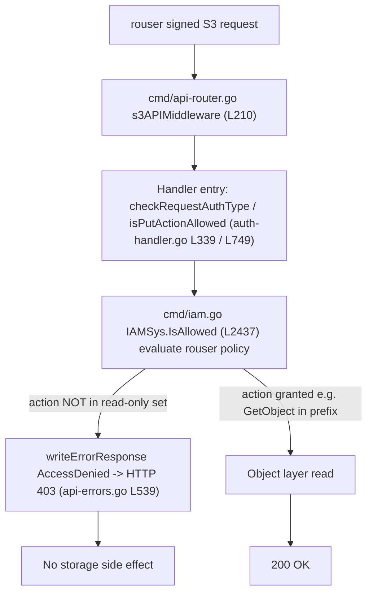

# MinIO Read‑Only IAM Boundary Under Concurrent Write Stress — A Run‑First Security Investigation

> **Scope of this document.** This is a *run‑first* security investigation. Every behavioral claim below is backed by output actually captured from a MinIO server that was built from this repository at `HEAD c07e5b49d477b0774f23db3b290745aef8c01bd2` (branch `minio_c07e5b49d477`), run in its default configuration, and driven through the **real, signed S3 API** by a genuinely read‑only identity while other clients concurrently hammered the same bucket with writes and metadata traffic. Server‑side `[REQUEST]`/`[RESPONSE]` traces come from the admin `ServiceTrace` feed; client‑side status codes and error bodies come from `boto3` and raw `curl --aws-sigv4`; storage side effects come from direct inspection of the single‑node `xl.meta` backend. Code claims are grounded with `file:line` anchors verified at that HEAD. Anything derived from reading rather than running is explicitly labeled **(inferred)**.

---

## 1. The question, and the direct answer

### 1.1 The question

> Does MinIO's IAM policy boundary reliably confine a read‑only principal to read‑only behavior **even while other clients concurrently write/mutate the same bucket**, or can that principal mutate data through **less‑obvious S3 surface area** — multipart operations, copy‑style (server‑side) writes, metadata changes (tagging, retention, legal‑hold, ACL), or deletes? And separately: **what metadata can a read‑only caller learn from listing and `HEAD` behavior without full object reads?**

### 1.2 The direct answer (verdict first)

**The boundary holds. Under concurrent write stress, a faithfully read‑only principal could not mutate data through any of the "write‑adjacent" surfaces tested — every one of them was denied at handler entry, before the object layer was ever reached, and left no storage side effect.** This result was **identical across two independent full runs** of the entire probe matrix under live concurrent load (2/2 runs, 0 differences). Concurrency did **not** manufacture a bypass window, and the causal reason is structural: the authorization decision is evaluated **per request against the caller's own policy** and is **stateless with respect to other clients' traffic** (`IAMSys.IsAllowed`, `cmd/iam.go:2437`), and it happens at the top of each handler *before* any erasure/object‑layer call (`checkRequestAuthType` `cmd/auth-handler.go:339`, `isPutActionAllowed` `cmd/auth-handler.go:749`). A denial is mapped to HTTP `403 AccessDenied` (`cmd/api-errors.go:539`) with no write performed.

Concretely, driving the read‑only identity `rouser` (custom prefix‑scoped policy: `s3:GetObject` on `probe-bucket/ro-prefix/*` + prefix‑gated `s3:ListBucket`) against every named operation produced:

| Category | Operations probed | Observed outcome |
|---|---|---|
| Multipart (7) | Create, UploadPart, UploadPartCopy, Complete, Abort, ListParts, ListMultipartUploads | **All `403 AccessDenied`**; no orphan upload‑ID created |
| Copy‑style (2) | CopyObject, UploadPartCopy | **Both `403 AccessDenied`**; destination object never created |
| Metadata (5) | PutObjectTagging, DeleteObjectTagging, PutObjectRetention, PutObjectLegalHold, PutObjectAcl | **All denied**; tagging/legal‑hold/ACL → `403`; retention → `400 InvalidRequest` on a non‑lock bucket and a **genuine `403 AccessDenied`** on a lock‑enabled bucket (see §6.3.3) |
| Deletes (2) | DeleteObject, DeleteObjects (multi) | DeleteObject → **`403`**, object still present; DeleteObjects (multi) → **HTTP `200` with a per‑key `AccessDenied`** body, nothing deleted (see §6.4.2) |
| Listing/HEAD leakage (6) | ListObjectsV2, ListObjectsV1, ListObjectVersions, HeadObject, HeadBucket, GetObjectAttributes | Allowed **only within the granted prefix** for list/HEAD/GET; `HeadBucket`, unqualified/other‑prefix list, and `GetObjectAttributes` denied. The *intended* metadata a "read + list‑within‑prefix" principal is designed to see (key, size, ETag, last‑modified) is visible; nothing beyond that leaked |

### 1.3 The nuances layered on top (not bypasses)

Three behaviors *look* unusual but are correct‑by‑design, not boundary breaks. They are documented in full with evidence in §7:

1. **Multi‑object delete returns HTTP `200`, not `403`** — with a per‑key `<Error><Code>AccessDenied</Code></Error>` for each object. No object was actually deleted (`cmd/bucket-handlers.go:416`, per‑object check at `:505`).
2. **PutObjectRetention on a non‑lock bucket returns `400 InvalidRequest`, not `403`** — because the bucket object‑lock‑configuration gate precedes the IAM check (`cmd/object-handlers.go:2890`). On a lock‑*enabled* bucket the same call yields a genuine `403 AccessDenied` from IAM.
3. **The built‑in canned `readonly` policy cannot list at all** — it grants only `s3:GetBucketLocation` + `s3:GetObject` (no `s3:ListBucket`), so a principal with only canned `readonly` gets `403` on `ListObjectsV2`. This is why the faithful "read‑only to a bucket **and prefix**" model requires a *custom* prefix‑scoped policy (§3).

The remainder of this document shows the exact commands, the raw server/client traces, and the before/after storage proofs behind every one of these statements.

---

## 2. Environment, exact build, and canonical run

### 2.1 Toolchain and client tooling (observed)

The module is `github.com/minio/minio` (`go.mod:1`) and declares `go 1.23` (`go.mod:3`). The build used the repository's pinned toolchain:

```
$ go version
go version go1.23.2 linux/amd64
```

Client/cross‑check tooling actually present in this environment:

```
$ python3 --version
Python 3.13.7
$ python3 -c "import boto3; print(boto3.__version__)"
1.43.42
$ curl --version | head -1
curl 8.14.1 (x86_64-pc-linux-gnu) ...
```

`mc` was **not** installed in this environment, so the admin surface was driven **programmatically via the real `madmin-go/v3` admin API** (v3.0.77, `go.mod:52`) — provisioning users/policies and streaming the `ServiceTrace` feed — rather than via the `mc` CLI. This keeps the admin path canonical (the same API `mc admin` uses) and requires no external download and no repository change.

### 2.2 Exact build command (verbatim)

```
CGO_ENABLED=0 go build -tags kqueue -trimpath -o /tmp/minio .
```

Run from the repository root. Observed result: **exit code 0, no stderr**, producing a statically‑linked binary:

```
$ file /tmp/minio
/tmp/minio: ELF 64-bit LSB executable, x86-64, ... statically linked, ...
$ stat -c '%s bytes' /tmp/minio
156592469 bytes
```

### 2.3 The `DEVELOPMENT.GOGET` version banner — a build‑configuration artifact, **not a defect**

A plain `go build` bypasses the Makefile's version‑stamping step (`buildscripts/gen-ldflags.go`), so the binary reports a development banner:

```
$ /tmp/minio --version
minio version DEVELOPMENT.GOGET (commit-id=DEVELOPMENT.GOGET)
Runtime: go1.23.2 linux/amd64
License: GNU AGPLv3 - https://www.gnu.org/licenses/agpl-3.0.html
Copyright: 2015-0000 MinIO, Inc.
```

**`DEVELOPMENT.GOGET` is expected for an un‑stamped local build and is explicitly a build‑configuration artifact, not a defect.** It has no bearing on IAM behavior; the same server binary is used throughout this investigation.

### 2.4 Canonical run (default configuration, default credentials)

```
/tmp/minio server /tmp/minio-data --address :9000
```

No non‑default environment variables or configuration were set — this is the canonical/default single‑node configuration. In the absence of overrides MinIO uses the default root credentials `minioadmin:minioadmin`, which the server itself warns about at startup. Observed startup banner (from the server log):

```
INFO: Formatting 1st pool, 1 set(s), 1 drives per set.
MinIO Object Storage Server
Version: DEVELOPMENT.GOGET (go1.23.2 linux/amd64)
API: http://127.0.0.1:9000
WARN: Detected default credentials 'minioadmin:minioadmin', we recommend that you change these values ...
```

Health checks confirmed the endpoint was up before any provisioning:

```
$ curl -s -o /dev/null -w '%{http_code}\n' http://127.0.0.1:9000/minio/health/live
200
$ curl -s -o /dev/null -w '%{http_code}\n' http://127.0.0.1:9000/minio/health/ready
200
```

### 2.5 Backend layout (why side effects are directly inspectable)

A single‑node deployment persists each object under `<DATA_DIR>/<bucket>/<object>/xl.meta` (plus data parts). This makes storage side effects directly observable on disk. For example, the seed object `ro-prefix/a.txt`:

```
$ ls -la /tmp/minio-data/probe-bucket/ro-prefix/a.txt/
-rw-r--r-- 1 root root 480 Jul  8 05:17 xl.meta
```

The `xl.meta` **modification time (05:17:41)** is the moment the object was seeded; because it never changes across the probes (which ran at 05:21 and 05:32), the filesystem itself is direct proof that no denied write ever rewrote the object (§5, §6).

---

## 3. Identities, policies, and seed data (provisioned via the real admin API)

All provisioning was performed through the `madmin-go/v3` admin API (the same surface `mc admin user add` / `mc admin policy create/attach` uses). Three principals were created plus the root account.

### 3.1 Buckets and seed objects

Two buckets were created: `probe-bucket` (default, **no** object‑lock) and `lock-bucket` (**object‑lock enabled**, needed to exercise a genuine retention denial — see §6.2). Objects were seeded as root with known byte content so ETag/size are byte‑verifiable (single‑part uploads, so `ETag == md5(content)`):

| Object | Bucket/prefix | Size (bytes) | ETag | Note |
|---|---|---:|---|---|
| `ro-prefix/a.txt` | probe-bucket | 32 | `ceb0af67cd0aa67b448930821fb4d13d` | inside granted prefix |
| `ro-prefix/b.txt` | probe-bucket | 34 | `5ed7a3c27adbc08f643f9d7980b36722` | inside granted prefix |
| `ro-prefix/sub/c.txt` | probe-bucket | 35 | `3838836a58b105b1a9f62c72d7e2b71f` | inside granted prefix |
| `other-prefix/x.txt` | probe-bucket | 33 | `f26a4590daae83e03c2c69c5a4cfac46` | **outside** granted prefix (leakage boundary) |
| `lock-prefix/obj.txt` | lock-bucket | 34 | `b7c03ca910cfacea64f17e7f3c226a6e` | inside lock bucket, for retention probe |

Object‑lock configuration observed (root):

```
probe-bucket : ObjectLockConfigurationNotFoundError  (no lock configured)
lock-bucket  : ObjectLockEnabled = Enabled
```

The storage owner reported in listing `<Owner>` blocks was `ID=02d6176db174dc93cb1b899f7c6078f08654445fe8cf1b6ce98d8855f66bdbf4`, `DisplayName=minio`.

### 3.2 `rouser` — the faithful read‑only principal (custom prefix‑scoped policy)

To faithfully model *"read‑only access to a bucket **and prefix**"* (GET within the prefix **plus** listing gated to that prefix), a **custom** policy was created and attached to `rouser`. This is the exact JSON that was attached (read back from the admin API):

```json
{
 "Version": "2012-10-17",
 "Statement": [
  {
   "Effect": "Allow",
   "Action": ["s3:GetObject"],
   "Resource": ["arn:aws:s3:::probe-bucket/ro-prefix/*"]
  },
  {
   "Effect": "Allow",
   "Action": ["s3:ListBucket"],
   "Resource": ["arn:aws:s3:::probe-bucket"],
   "Condition": {"StringLike": {"s3:prefix": ["ro-prefix/*"]}}
  },
  {
   "Effect": "Allow",
   "Action": ["s3:GetObject"],
   "Resource": ["arn:aws:s3:::lock-bucket/lock-prefix/*"]
  },
  {
   "Effect": "Allow",
   "Action": ["s3:ListBucket"],
   "Resource": ["arn:aws:s3:::lock-bucket"],
   "Condition": {"StringLike": {"s3:prefix": ["lock-prefix/*"]}}
  }
 ]
}
```

Statements **(1)–(2)** are the exact model the question calls for on `probe-bucket`. Statements **(3)–(4)** extend the identical read‑only shape to `lock-bucket` so that the retention probe (§6.3 / §7.2) exercises a genuine `PutObjectRetentionAction` IAM denial rather than being short‑circuited by the bucket‑lock gate — this extension is transparently noted here and does not grant any write action. Crucially, **no `Put*`, `Delete*`, `Abort*`, `*Tagging`, `*Retention`, `*LegalHold`, or `GetObjectAttributes` action is granted anywhere in this policy.**

### 3.3 `rocanned` — the built‑in canned `readonly` policy and its `ListBucket` gap

A second principal `rocanned` was attached MinIO's **built‑in** `readonly` policy. Its effective JSON, read back from the admin API, is:

```json
{
 "Version": "2012-10-17",
 "Statement": [
  {
   "Effect": "Allow",
   "Action": ["s3:GetBucketLocation", "s3:GetObject"],
   "Resource": ["arn:aws:s3:::*"]
  }
 ]
}
```

This matches the canned definition in `github.com/minio/pkg/v3@v3.0.22/policy/constants.go` (~L51‑L63). **It grants only `s3:GetBucketLocation` and `s3:GetObject` — there is no `s3:ListBucket`.** Consequently the built‑in `readonly` alone **cannot list** objects (proven empirically in §6.6), which is exactly why the faithful "bucket AND prefix" model in §3.2 needs a custom prefix‑scoped policy.

### 3.4 `rwuser` — the read‑write principal that generates the concurrent load

The concurrent writers authenticate as `rwuser`, attached the built‑in `readwrite` policy:

```json
{
 "Version": "2012-10-17",
 "Statement": [
  {"Effect": "Allow", "Action": ["s3:*"], "Resource": ["arn:aws:s3:::*"]}
 ]
}
```

> **Security note.** All secret keys used here are throwaway local test values and are **redacted** from this document. The captured server traces contain a SigV4 `Authorization` header on every request; the trace collector records only `"<SigV4 present; redacted> (principal=<accessKey>)"` and never the live signature or secret material.

---

## 4. Concurrent "under stress" load design

While the read‑only probe matrix ran, a separate writer harness authenticated as `rwuser` (full `s3:*`) hammered `probe-bucket` continuously through the real signed S3 API (`minio-go`/`boto3`). This is the "under stress" condition the question asks about.

- **Concurrency:** 12 writer threads running in a tight loop.
- **Operation mix per loop (weighted):** `PutObject` (weight 5, varied keys), a full **multipart cycle** create → upload a 5 MiB part → complete, with ~30% of cycles **aborted** instead (weight 2), `PutObjectTagging` (weight 2), and `DeleteObject` (weight 2).
- **Key space:** writer keys are written under `ro-prefix/w*`, `other-prefix/w*`, and `load/*` — deliberately **distinct** from the five seeded anchor keys, so the seeds remain stable side‑effect anchors while churn happens all around them.
- **Scale reached:** during the second run, `probe-bucket` held **118,840 live objects** while the probes executed, confirming the boundary was exercised against a genuinely busy, mutating bucket rather than a quiescent one.
- **Duration/repetition:** the writers ran continuously (multi‑hundred‑second windows) across **two full probe runs** (§8).

The thesis being tested empirically is that this concurrent write traffic — no matter how heavy — cannot open a window for `rouser` to mutate data, because the authorization decision for `rouser` is computed solely from `rouser`'s own policy on each request. §5 explains the mechanism; §6 and §8 show it holding.

---

## 5. The authorization mechanism (grounded, `file:line` verified at HEAD `c07e5b49d477`)

Every authenticated, state‑mutating S3 request is gated at **handler entry**, before the object/erasure layer is touched. The funnel, as cause → effect:

1. **Routing.** Handlers are registered behind `s3APIMiddleware` (`cmd/api-router.go:210`), which wraps each S3 operation.
2. **Entry‑point authorization** in `cmd/auth-handler.go`:
   - `checkRequestAuthType` (`:339`) → `checkRequestAuthTypeCredential` (`:523`) — used by most mutating handlers.
   - `checkRequestAuthTypeWithVID` (`:349`) — adds a version ID; used by per‑object multi‑delete.
   - `authenticateRequest` (`:358`) — used by `HEAD`.
   - `isPutActionAllowed` (`:749`) — the PUT/streaming‑auth variant used by `UploadPart`/`PutObject`; it calls `globalIAMSys.IsAllowed(...)` at `:793`, returning `ErrNone` (`:803`) or `ErrAccessDenied` (`:805`).
3. **The policy decision** — `IAMSys.IsAllowed` (`cmd/iam.go:2437`), dispatched in this order:
   - external authZ/OPA plugin (`:2439`);
   - **owner/root short‑circuit** `if args.IsOwner { return true }` (`:2448`);
   - STS temporary user (`:2453`–`:2459`);
   - service account (`:2462`–`:2468`);
   - **regular user** → `PolicyDBGet` (`:2471`) → deny‑if‑no‑policy (`:2476`–`:2479`) → `GetCombinedPolicy(policies...).IsAllowed(args)` (`:2482`);
   - otherwise **deny by default**. Policy storage/combination is backed by `cmd/iam-store.go`.
4. **Error → HTTP mapping.** `ErrAccessDenied` maps to `Code: "AccessDenied"`, `HTTPStatusCode: http.StatusForbidden` (403) at `cmd/api-errors.go:539`. (The `writeErrorResponse` plumbing lives in `cmd/api-response.go`; the *mapping* is in `api-errors.go`.)

### 5.1 Core causal thesis (stated, then demonstrated in §6/§8)

`IsAllowed` evaluates the **caller's own** policy on **each request** and is **stateless with respect to other clients' concurrent traffic**. Therefore **no volume of concurrent writes by other principals can change `rouser`'s decision** — concurrency cannot manufacture a write bypass. Because the deny happens at handler entry *before* any object‑layer/erasure call, a denied write leaves **no storage side effect**. The evidence for each probe below is exactly this pair: a `403` (or per‑key `AccessDenied`) trace **and** a proven‑absent storage side effect.



---

## 6. Per‑operation results (the probe matrix)

Each probe below was issued as `rouser` through the real signed S3 API while the concurrent writers ran. For each, the **raw server‑side `[REQUEST]`/`[RESPONSE]` trace** (from the admin `ServiceTrace` feed) is shown *before* any summary, followed by the required policy action, the handler `file:line`, and the storage side‑effect proof. All error bodies are complete and unedited. Every error response carries the same `HostId dd9025bab4ad464b049177c95eb6ebf374d3b3fd1af9251148b658df7ac2e3e8`.

### 6.1 Multipart operations (7)

Handlers in `cmd/object-multipart-handlers.go` (and `ListMultipartUploads` in `cmd/bucket-handlers.go`). To probe `UploadPart`/`UploadPartCopy`/`Complete`/`Abort`/`ListParts`, `rouser` referenced a **writer‑created** `uploadId` (from the concurrent load), since `rouser` cannot create one itself — the point is to confirm the auth deny **precedes** any multipart state change.

**6.1.1 CreateMultipartUpload** — required `PutObjectAction`; `NewMultipartUploadHandler` `cmd/object-multipart-handlers.go:64`, check at `:83`.

```
[REQUEST s3.NewMultipartUpload] 05:21:56.808462 ak=rouser client=127.0.0.1
POST /probe-bucket/ro-prefix/rouser-created.bin?uploads HTTP/1.1
Authorization: <SigV4 present; redacted> (principal=rouser)
Content-Length: 0
Host: 127.0.0.1:9000
X-Amz-Content-Sha256: e3b0c44298fc1c149afbf4c8996fb92427ae41e4649b934ca495991b7852b855
X-Amz-Date: 20260708T052156Z
[RESPONSE] 403 dur=209.315µs bytes=502
<?xml version="1.0" encoding="UTF-8"?>
<Error><Code>AccessDenied</Code><Message>Access Denied.</Message><Key>ro-prefix/rouser-created.bin</Key><BucketName>probe-bucket</BucketName><Resource>/probe-bucket/ro-prefix/rouser-created.bin</Resource><RequestId>18C038FE2F7FA30B</RequestId><HostId>dd9025bab4ad464b049177c95eb6ebf374d3b3fd1af9251148b658df7ac2e3e8</HostId></Error>
```

*Storage proof:* `/tmp/minio-data/probe-bucket/ro-prefix/rouser-created.bin` is **ABSENT** after the probe, and an authorized `ListMultipartUploads` (root) shows **no orphan upload‑ID** for that key — the denied create allocated nothing.

**6.1.2 UploadPart** — required `PutObjectAction` (via `isPutActionAllowed`); `PutObjectPartHandler` `cmd/object-multipart-handlers.go:583`, check at `:667`.

```
[REQUEST s3.PutObjectPart] 05:21:56.814175 ak=rouser client=127.0.0.1
PUT /probe-bucket/ro-prefix/writer-mpu.bin?partNumber=1&uploadId=ZGRmZDMxY2EtNWUzMS00OTMzLWI5MjktYjc0Mjc1ZTdjYjQ4LmVhMjRlNzBlLWM2MjItNDlmNy1hM2VmLTc2M2Y0M2IyYmVlZngxNzgzNDg4MTE2NzUwNDA5NzUz HTTP/1.1
X-Amz-Content-Sha256: e6a4ff9df5c3e4523900da36e7b538681c2ae36b0170cb17e1a3522a94e08c86
X-Amz-Date: 20260708T052156Z
Authorization: <SigV4 present; redacted> (principal=rouser)
Content-Length: 8
Host: 127.0.0.1:9000
[RESPONSE] 403 dur=80.626µs bytes=501
<?xml version="1.0" encoding="UTF-8"?>
<Error><Code>AccessDenied</Code><Message>Access Denied.</Message><Key>ro-prefix/writer-mpu.bin</Key><BucketName>probe-bucket</BucketName><Resource>/probe-bucket/ro-prefix/writer-mpu.bin</Resource><RequestId>18C038FE2FD6D509</RequestId><HostId>dd9025bab4ad464b049177c95eb6ebf374d3b3fd1af9251148b658df7ac2e3e8</HostId></Error>
```

**6.1.3 UploadPartCopy** — required `PutObjectAction` (dst) + `GetObjectAction` (src); `CopyObjectPartHandler` `cmd/object-multipart-handlers.go:244` (dst check `:268`, src `:301`).

```
[REQUEST s3.CopyObjectPart] 05:21:56.816606 ak=rouser client=127.0.0.1
PUT /probe-bucket/ro-prefix/writer-mpu.bin?partNumber=1&uploadId=ZGRmZDMxY2EtNWUzMS00OTMzLWI5MjktYjc0Mjc1ZTdjYjQ4LmVhMjRlNzBlLWM2MjItNDlmNy1hM2VmLTc2M2Y0M2IyYmVlZngxNzgzNDg4MTE2NzUwNDA5NzUz HTTP/1.1
X-Amz-Date: 20260708T052156Z
Authorization: <SigV4 present; redacted> (principal=rouser)
Host: 127.0.0.1:9000
X-Amz-Copy-Source: probe-bucket/ro-prefix/a.txt
Content-Length: 0
X-Amz-Content-Sha256: e3b0c44298fc1c149afbf4c8996fb92427ae41e4649b934ca495991b7852b855
[RESPONSE] 403 dur=139.934µs bytes=512
<?xml version="1.0" encoding="UTF-8"?>
<Error><Code>AccessDenied</Code><Message>Access Denied.</Message><Key>ro-prefix/writer-mpu.bin</Key><BucketName>probe-bucket</BucketName><Resource>/probe-bucket/ro-prefix/writer-mpu.bin</Resource><RequestId>18C038FE2FFBEBDE</RequestId><HostId>dd9025bab4ad464b049177c95eb6ebf374d3b3fd1af9251148b658df7ac2e3e8</HostId></Error>
```

**6.1.4 CompleteMultipartUpload** — required `PutObjectAction`; `CompleteMultipartUploadHandler` `cmd/object-multipart-handlers.go:908`, check at `:927`.

```
[REQUEST s3.CompleteMultipartUpload] 05:21:56.818809 ak=rouser client=127.0.0.1
POST /probe-bucket/ro-prefix/writer-mpu.bin?uploadId=ZGRmZDMxY2EtNWUzMS00OTMzLWI5MjktYjc0Mjc1ZTdjYjQ4LmVhMjRlNzBlLWM2MjItNDlmNy1hM2VmLTc2M2Y0M2IyYmVlZngxNzgzNDg4MTE2NzUwNDA5NzUz HTTP/1.1
Host: 127.0.0.1:9000
X-Amz-Content-Sha256: b320bfe5778b5ef02cb08ea60b4f329a93b5c24f872a0f76d0e73a7168480f17
X-Amz-Date: 20260708T052156Z
Authorization: <SigV4 present; redacted> (principal=rouser)
Content-Length: 185
[RESPONSE] 403 dur=114.962µs bytes=494
<?xml version="1.0" encoding="UTF-8"?>
<Error><Code>AccessDenied</Code><Message>Access Denied.</Message><Key>ro-prefix/writer-mpu.bin</Key><BucketName>probe-bucket</BucketName><Resource>/probe-bucket/ro-prefix/writer-mpu.bin</Resource><RequestId>18C038FE301D8516</RequestId><HostId>dd9025bab4ad464b049177c95eb6ebf374d3b3fd1af9251148b658df7ac2e3e8</HostId></Error>
```

**6.1.5 AbortMultipartUpload** — required `AbortMultipartUploadAction`; `AbortMultipartUploadHandler` `cmd/object-multipart-handlers.go:1098`, check at `:1118`.

```
[REQUEST s3.AbortMultipartUpload] 05:21:56.820642 ak=rouser client=127.0.0.1
DELETE /probe-bucket/ro-prefix/writer-mpu.bin?uploadId=ZGRmZDMxY2EtNWUzMS00OTMzLWI5MjktYjc0Mjc1ZTdjYjQ4LmVhMjRlNzBlLWM2MjItNDlmNy1hM2VmLTc2M2Y0M2IyYmVlZngxNzgzNDg4MTE2NzUwNDA5NzUz HTTP/1.1
Authorization: <SigV4 present; redacted> (principal=rouser)
Content-Length: 0
Host: 127.0.0.1:9000
X-Amz-Content-Sha256: e3b0c44298fc1c149afbf4c8996fb92427ae41e4649b934ca495991b7852b855
X-Amz-Date: 20260708T052156Z
[RESPONSE] 403 dur=100.575µs bytes=494
<?xml version="1.0" encoding="UTF-8"?>
<Error><Code>AccessDenied</Code><Message>Access Denied.</Message><Key>ro-prefix/writer-mpu.bin</Key><BucketName>probe-bucket</BucketName><Resource>/probe-bucket/ro-prefix/writer-mpu.bin</Resource><RequestId>18C038FE303983DA</RequestId><HostId>dd9025bab4ad464b049177c95eb6ebf374d3b3fd1af9251148b658df7ac2e3e8</HostId></Error>
```

**6.1.6 ListParts** — required `ListMultipartUploadPartsAction`; `ListObjectPartsHandler` `cmd/object-multipart-handlers.go:1143`, check at `:1162`.

```
[REQUEST s3.ListObjectParts] 05:21:56.822535 ak=rouser client=127.0.0.1
GET /probe-bucket/ro-prefix/writer-mpu.bin?uploadId=ZGRmZDMxY2EtNWUzMS00OTMzLWI5MjktYjc0Mjc1ZTdjYjQ4LmVhMjRlNzBlLWM2MjItNDlmNy1hM2VmLTc2M2Y0M2IyYmVlZngxNzgzNDg4MTE2NzUwNDA5NzUz HTTP/1.1
Authorization: <SigV4 present; redacted> (principal=rouser)
Host: 127.0.0.1:9000
Content-Length: 0
X-Amz-Content-Sha256: e3b0c44298fc1c149afbf4c8996fb92427ae41e4649b934ca495991b7852b855
X-Amz-Date: 20260708T052156Z
[RESPONSE] 403 dur=97.958µs bytes=494
<?xml version="1.0" encoding="UTF-8"?>
<Error><Code>AccessDenied</Code><Message>Access Denied.</Message><Key>ro-prefix/writer-mpu.bin</Key><BucketName>probe-bucket</BucketName><Resource>/probe-bucket/ro-prefix/writer-mpu.bin</Resource><RequestId>18C038FE30566163</RequestId><HostId>dd9025bab4ad464b049177c95eb6ebf374d3b3fd1af9251148b658df7ac2e3e8</HostId></Error>
```

**6.1.7 ListMultipartUploads** — required `ListBucketMultipartUploadsAction`; `ListMultipartUploadsHandler` `cmd/bucket-handlers.go:251`, check at `:265`.

```
[REQUEST s3.ListMultipartUploads] 05:21:56.824306 ak=rouser client=127.0.0.1
GET /probe-bucket?uploads= HTTP/1.1
Authorization: <SigV4 present; redacted> (principal=rouser)
Content-Length: 0
Host: 127.0.0.1:9000
X-Amz-Content-Sha256: e3b0c44298fc1c149afbf4c8996fb92427ae41e4649b934ca495991b7852b855
X-Amz-Date: 20260708T052156Z
[RESPONSE] 403 dur=114.295µs bytes=434
<?xml version="1.0" encoding="UTF-8"?>
<Error><Code>AccessDenied</Code><Message>Access Denied.</Message><BucketName>probe-bucket</BucketName><Resource>/probe-bucket</Resource><RequestId>18C038FE30716B4D</RequestId><HostId>dd9025bab4ad464b049177c95eb6ebf374d3b3fd1af9251148b658df7ac2e3e8</HostId></Error>
```

**Multipart summary:** all 7 operations denied `403 AccessDenied` at handler entry. The denied `CreateMultipartUpload` created **no** upload‑ID (authorized `ListMultipartUploads` confirmed no orphan), and none of the part/complete/abort operations against the writer's `uploadId` touched state — the deny is on `rouser`'s missing `PutObjectAction`/`AbortMultipartUploadAction`/`ListMultipartUploadPartsAction`, evaluated before the multipart subsystem is engaged.

### 6.2 Copy‑style (server‑side) writes (2)

**6.2.1 CopyObject** — required `PutObjectAction` on dst (+ `GetObjectAction` on src); `CopyObjectHandler` `cmd/object-handlers.go:1154`, check at `:1173`. Probed twice (boto3 and an independent raw `curl --aws-sigv4` for byte‑level corroboration).

boto3 trace:

```
[REQUEST s3.CopyObject] 05:21:56.826489 ak=rouser client=127.0.0.1
PUT /probe-bucket/ro-prefix/rouser-copy.txt HTTP/1.1
Authorization: <SigV4 present; redacted> (principal=rouser)
Host: 127.0.0.1:9000
X-Amz-Copy-Source: probe-bucket/ro-prefix/a.txt
X-Amz-Content-Sha256: e3b0c44298fc1c149afbf4c8996fb92427ae41e4649b934ca495991b7852b855
X-Amz-Date: 20260708T052156Z
[RESPONSE] 403 dur=95.242µs bytes=514
<?xml version="1.0" encoding="UTF-8"?>
<Error><Code>AccessDenied</Code><Message>Access Denied.</Message><Key>ro-prefix/rouser-copy.txt</Key><BucketName>probe-bucket</BucketName><Resource>/probe-bucket/ro-prefix/rouser-copy.txt</Resource><RequestId>18C038FE3092BAC5</RequestId><HostId>dd9025bab4ad464b049177c95eb6ebf374d3b3fd1af9251148b658df7ac2e3e8</HostId></Error>
```

Independent `curl --aws-sigv4` cross‑check (different signer, different target key):

```
[REQUEST s3.CopyObject] 05:32:25.662504 ak=rouser client=127.0.0.1
PUT /probe-bucket/ro-prefix/rouser-copy-curl.txt HTTP/1.1
Authorization: <SigV4 present; redacted> (principal=rouser)
Host: 127.0.0.1:9000
X-Amz-Copy-Source: /probe-bucket/ro-prefix/a.txt
X-Amz-Content-Sha256: e3b0c44298fc1c149afbf4c8996fb92427ae41e4649b934ca495991b7852b855
X-Amz-Date: 20260708T053225Z
[RESPONSE] 403 dur=151.89µs bytes=477
<?xml version="1.0" encoding="UTF-8"?>
<Error><Code>AccessDenied</Code><Message>Access Denied.</Message><Key>ro-prefix/rouser-copy-curl.txt</Key><BucketName>probe-bucket</BucketName><Resource>/probe-bucket/ro-prefix/rouser-copy-curl.txt</Resource><RequestId>18C039909A1ED0A3</RequestId><HostId>dd9025bab4ad464b049177c95eb6ebf374d3b3fd1af9251148b658df7ac2e3e8</HostId></Error>
```

*Storage proof:* both destination keys are **ABSENT** on disk before and after (`/tmp/minio-data/probe-bucket/ro-prefix/rouser-copy.txt` and `…/rouser-copy-curl.txt` never created; authorized `HeadObject` as root returns 404). The source `ro-prefix/a.txt` remained byte‑identical (size 32, ETag `ceb0af67cd0aa67b448930821fb4d13d`).

**6.2.2 UploadPartCopy** — covered in §6.1.3 (`CopyObjectPart`, `403`). It is the multipart form of a server‑side copy and is denied for the same reason (missing dst `PutObjectAction`).

### 6.3 Metadata changes (5)

**6.3.1 PutObjectTagging** — required `PutObjectTaggingAction`; `PutObjectTaggingHandler` `cmd/object-handlers.go:3122`, check at `:3151`.

```
[REQUEST s3.PutObjectTagging] 05:21:56.833593 ak=rouser client=127.0.0.1
PUT /probe-bucket/ro-prefix/a.txt?tagging HTTP/1.1
Authorization: <SigV4 present; redacted> (principal=rouser)
Content-Length: 130
Host: 127.0.0.1:9000
X-Amz-Checksum-Crc32: s9mpkQ==
X-Amz-Sdk-Checksum-Algorithm: CRC32
X-Amz-Content-Sha256: STREAMING-UNSIGNED-PAYLOAD-TRAILER
X-Amz-Date: 20260708T052156Z
X-Amz-Tagging: env=hacked
[RESPONSE] 403 dur=183.042µs bytes=670
<?xml version="1.0" encoding="UTF-8"?>
<Error><Code>AccessDenied</Code><Message>Access Denied.</Message><Key>ro-prefix/a.txt</Key><BucketName>probe-bucket</BucketName><Resource>/probe-bucket/ro-prefix/a.txt</Resource><RequestId>18C038FE30FF1D6A</RequestId><HostId>dd9025bab4ad464b049177c95eb6ebf374d3b3fd1af9251148b658df7ac2e3e8</HostId></Error>
```

*Storage proof:* an authorized `GetObjectTagging` (root) on `ro-prefix/a.txt` afterward returns an **empty tag set** — the attempted `env=hacked` tag was never applied.

**6.3.2 DeleteObjectTagging** — required `DeleteObjectTaggingAction`; `DeleteObjectTaggingHandler` `cmd/object-handlers.go:3235`, check at `:3301`.

```
[REQUEST s3.DeleteObjectTagging] 05:21:56.840427 ak=rouser client=127.0.0.1
DELETE /probe-bucket/ro-prefix/a.txt?tagging HTTP/1.1
Authorization: <SigV4 present; redacted> (principal=rouser)
Content-Length: 0
Host: 127.0.0.1:9000
X-Amz-Content-Sha256: e3b0c44298fc1c149afbf4c8996fb92427ae41e4649b934ca495991b7852b855
X-Amz-Date: 20260708T052156Z
[RESPONSE] 403 dur=350.64µs bytes=476
<?xml version="1.0" encoding="UTF-8"?>
<Error><Code>AccessDenied</Code><Message>Access Denied.</Message><Key>ro-prefix/a.txt</Key><BucketName>probe-bucket</BucketName><Resource>/probe-bucket/ro-prefix/a.txt</Resource><RequestId>18C038FE31675FD8</RequestId><HostId>dd9025bab4ad464b049177c95eb6ebf374d3b3fd1af9251148b658df7ac2e3e8</HostId></Error>
```

**6.3.3 PutObjectRetention** — required `PutObjectRetentionAction`; `PutObjectRetentionHandler` `cmd/object-handlers.go:2855`. This probe has **two distinct paths** (a nuance analyzed in §7.2). The retention request carried both object‑lock headers (a real `GOVERNANCE` mode + retain‑until date) and an explicit `Content-MD5`, so it is not short‑circuited by the empty‑header early‑return in `isPutActionAllowed` (`cmd/auth-handler.go:769`–`775`).

Path A — against `probe-bucket` (**no** object‑lock config). The bucket object‑lock‑configuration gate at `cmd/object-handlers.go:2890` fires **before** IAM, yielding `400 InvalidRequest`:

```
[REQUEST s3.PutObjectRetention] 05:32:25.606151 ak=rouser client=127.0.0.1
PUT /probe-bucket/ro-prefix/a.txt?retention HTTP/1.1
Authorization: <SigV4 present; redacted> (principal=rouser)
Content-Length: 153
Content-Md5: JusyXIPJFSIvT0lcz6nvxg==
Host: 127.0.0.1:9000
X-Amz-Content-Sha256: 129597d6a602f6f8fdcc6519a6c03f890bc354393dfe229e71c611cbed211d53
X-Amz-Date: 20260708T053225Z
[RESPONSE] 400 dur=187.202µs bytes=483
<?xml version="1.0" encoding="UTF-8"?>
<Error><Code>InvalidRequest</Code><Message>Bucket is missing ObjectLockConfiguration</Message><Key>ro-prefix/a.txt</Key><BucketName>probe-bucket</BucketName><Resource>/probe-bucket/ro-prefix/a.txt</Resource><RequestId>18C0399096C2F2E1</RequestId><HostId>dd9025bab4ad464b049177c95eb6ebf374d3b3fd1af9251148b658df7ac2e3e8</HostId></Error>
```

Path B — against `lock-bucket` (**object‑lock enabled**). The lock gate passes, execution reaches `enforceRetentionBypassForPut` → `isPutRetentionAllowed` (`cmd/auth-handler.go:704`) → `IsAllowed(PutObjectRetentionAction)` (`:728`), which denies; the deny is mapped to `403 AccessDenied` (`errAuthentication` → `ErrAccessDenied` at `cmd/api-errors.go:2176`). Note the timing tell — `25.2ms` here vs `187µs` for the early `400`, because this path runs deeper before denying:

```
[REQUEST s3.PutObjectRetention] 05:32:25.615830 ak=rouser client=127.0.0.1
PUT /lock-bucket/lock-prefix/obj.txt?retention HTTP/1.1
Authorization: <SigV4 present; redacted> (principal=rouser)
Content-Length: 153
Content-Md5: JusyXIPJFSIvT0lcz6nvxg==
Host: 127.0.0.1:9000
X-Amz-Content-Sha256: 129597d6a602f6f8fdcc6519a6c03f890bc354393dfe229e71c611cbed211d53
X-Amz-Date: 20260708T053225Z
[RESPONSE] 403 dur=25.220319ms bytes=613
<?xml version="1.0" encoding="UTF-8"?>
<Error><Code>AccessDenied</Code><Message>Access Denied.</Message><Key>lock-prefix/obj.txt</Key><BucketName>lock-bucket</BucketName><Resource>/lock-bucket/lock-prefix/obj.txt</Resource><RequestId>18C039909756A37B</RequestId><HostId>dd9025bab4ad464b049177c95eb6ebf374d3b3fd1af9251148b658df7ac2e3e8</HostId></Error>
```

*Storage proof:* on both buckets the target objects were unchanged; an authorized retention read (root) on `lock-prefix/obj.txt` returns `NoSuchObjectLockConfiguration` (no retention was ever set).

**6.3.4 PutObjectLegalHold** — required `PutObjectLegalHoldAction`; `PutObjectLegalHoldHandler` `cmd/object-handlers.go:2698`, check at `:2718`. Unlike retention, the IAM check here precedes the bucket‑lock gate (`:2732`), so `rouser` is denied `403` **directly** even on `probe-bucket`:

```
[REQUEST s3.PutObjectLegalHold] 05:21:56.846285 ak=rouser client=127.0.0.1
PUT /probe-bucket/ro-prefix/a.txt?legal-hold HTTP/1.1
Authorization: <SigV4 present; redacted> (principal=rouser)
Content-Length: 90
Host: 127.0.0.1:9000
X-Amz-Checksum-Crc32: 6XWxlw==
X-Amz-Sdk-Checksum-Algorithm: CRC32
X-Amz-Content-Sha256: STREAMING-UNSIGNED-PAYLOAD-TRAILER
X-Amz-Date: 20260708T052156Z
[RESPONSE] 403 dur=114.554µs bytes=526
<?xml version="1.0" encoding="UTF-8"?>
<Error><Code>AccessDenied</Code><Message>Access Denied.</Message><Key>ro-prefix/a.txt</Key><BucketName>probe-bucket</BucketName><Resource>/probe-bucket/ro-prefix/a.txt</Resource><RequestId>18C038FE31C0C448</RequestId><HostId>dd9025bab4ad464b049177c95eb6ebf374d3b3fd1af9251148b658df7ac2e3e8</HostId></Error>
```

**6.3.5 PutObjectAcl** — required `PutBucketPolicyAction` (re‑purposed, see §7.3); `PutObjectACLHandler` `cmd/acl-handlers.go:172`, check at `:193`.

```
[REQUEST s3.PutObjectACL] 05:21:56.848120 ak=rouser client=127.0.0.1
PUT /probe-bucket/ro-prefix/a.txt?acl HTTP/1.1
Authorization: <SigV4 present; redacted> (principal=rouser)
Content-Length: 0
Host: 127.0.0.1:9000
X-Amz-Acl: private
X-Amz-Checksum-Crc32: AAAAAA==
X-Amz-Content-Sha256: e3b0c44298fc1c149afbf4c8996fb92427ae41e4649b934ca495991b7852b855
X-Amz-Date: 20260708T052156Z
[RESPONSE] 403 dur=130.941µs bytes=510
<?xml version="1.0" encoding="UTF-8"?>
<Error><Code>AccessDenied</Code><Message>Access Denied.</Message><BucketName>probe-bucket</BucketName><Resource>/probe-bucket/ro-prefix/a.txt</Resource><RequestId>18C038FE31DCC888</RequestId><HostId>dd9025bab4ad464b049177c95eb6ebf374d3b3fd1af9251148b658df7ac2e3e8</HostId></Error>
```

(Note: this response has no `<Key>` element — the ACL handler emits a bucket/resource‑scoped `AccessDenied`.) **Metadata summary:** every metadata‑mutating call was denied; tagging/legal‑hold/ACL returned `403` directly, retention returned `400` (non‑lock bucket, lock‑config gate) and a genuine `403` (lock bucket, IAM). No object's tags, retention, legal‑hold, or ACL changed.

### 6.4 Deletes (2)

**6.4.1 DeleteObject (single)** — required `DeleteObjectAction`; `DeleteObjectHandler` `cmd/object-handlers.go:2509`, check at `:2528`. Probed via boto3 and raw `curl`:

boto3:

```
[REQUEST s3.DeleteObject] 05:21:56.849946 ak=rouser client=127.0.0.1
DELETE /probe-bucket/ro-prefix/a.txt HTTP/1.1
Authorization: <SigV4 present; redacted> (principal=rouser)
Content-Length: 0
Host: 127.0.0.1:9000
X-Amz-Content-Sha256: e3b0c44298fc1c149afbf4c8996fb92427ae41e4649b934ca495991b7852b855
X-Amz-Date: 20260708T052156Z
[RESPONSE] 403 dur=112.995µs bytes=476
<?xml version="1.0" encoding="UTF-8"?>
<Error><Code>AccessDenied</Code><Message>Access Denied.</Message><Key>ro-prefix/a.txt</Key><BucketName>probe-bucket</BucketName><Resource>/probe-bucket/ro-prefix/a.txt</Resource><RequestId>18C038FE31F8A4C6</RequestId><HostId>dd9025bab4ad464b049177c95eb6ebf374d3b3fd1af9251148b658df7ac2e3e8</HostId></Error>
```

curl `--aws-sigv4` cross‑check:

```
[REQUEST s3.DeleteObject] 05:32:25.653883 ak=rouser client=127.0.0.1
DELETE /probe-bucket/ro-prefix/a.txt HTTP/1.1
Authorization: <SigV4 present; redacted> (principal=rouser)
Content-Length: 0
Host: 127.0.0.1:9000
X-Amz-Content-Sha256: e3b0c44298fc1c149afbf4c8996fb92427ae41e4649b934ca495991b7852b855
X-Amz-Date: 20260708T053225Z
[RESPONSE] 403 dur=162.84µs bytes=429
<?xml version="1.0" encoding="UTF-8"?>
<Error><Code>AccessDenied</Code><Message>Access Denied.</Message><Key>ro-prefix/a.txt</Key><BucketName>probe-bucket</BucketName><Resource>/probe-bucket/ro-prefix/a.txt</Resource><RequestId>18C03990999B44ED</RequestId><HostId>dd9025bab4ad464b049177c95eb6ebf374d3b3fd1af9251148b658df7ac2e3e8</HostId></Error>
```

*Storage proof (the decisive one):* `ro-prefix/a.txt` was still present and byte‑identical after both deletes — its `xl.meta` retained `size=480 mtime=05:17:41` (the seed time), i.e. the file on disk was never touched:

```
$ ls -la /tmp/minio-data/probe-bucket/ro-prefix/a.txt/
-rw-r--r-- 1 root root 480 Jul  8 05:17 xl.meta
```

**6.4.2 DeleteObjects (multi‑object)** — required `DeleteObjectAction` (bucket‑level `cmd/bucket-handlers.go:471` + per‑object `:505`); `DeleteMultipleObjectsHandler` `cmd/bucket-handlers.go:416`. This is the per‑key‑`200` nuance detailed in §7.1. The request carried the required `Content-MD5`:

```
[REQUEST s3.DeleteMultipleObjects] 05:32:25.592223 ak=rouser client=127.0.0.1
POST /probe-bucket?delete= HTTP/1.1
Authorization: <SigV4 present; redacted> (principal=rouser)
Content-Length: 123
Content-Md5: dcMriinezglVnRWB7tqCSQ==
Host: 127.0.0.1:9000
X-Amz-Content-Sha256: 2e59a4b62f4fc962d24a45b729b0a6aa6fb29bfb555ce4507e3b6cc927510e55
X-Amz-Date: 20260708T053225Z
[RESPONSE] 200 dur=382.439µs bytes=592
<?xml version="1.0" encoding="UTF-8"?>
<DeleteResult xmlns="http://s3.amazonaws.com/doc/2006-03-01/"><Error><Code>AccessDenied</Code><Message>Access Denied.</Message><Key>ro-prefix/a.txt</Key><VersionId></VersionId></Error><Error><Code>AccessDenied</Code><Message>Access Denied.</Message><Key>ro-prefix/b.txt</Key><VersionId></VersionId></Error></DeleteResult>
```

*Storage proof:* an authorized re‑list and `HeadObject` (root) confirmed **both** `ro-prefix/a.txt` and `ro-prefix/b.txt` still present with unchanged sizes/ETags — the top‑level `200` carried per‑key `AccessDenied` and deleted nothing.

### 6.5 Information‑leakage surface: listing / HEAD / attributes (6)

This quantifies **exactly** what `rouser` can learn without a full object read, and the precise in‑prefix vs out‑of‑prefix boundary.

**6.5.1 ListObjectsV2 — inside the granted prefix (ALLOWED, `200`)** — required `ListBucketAction`; `ListObjectsV2Handler` `cmd/bucket-listobjects-handlers.go:154`, check at `:172`. The prefix‑gated `ListBucket` condition is satisfied, so the call succeeds and returns object metadata. Response (truncated to the three seeds; the page held `KeyCount=1000`, the remaining ~997 being writer‑churn `ro-prefix/w*` keys created by the concurrent load):

```
[REQUEST s3.ListObjectsV2] 05:21:57.061499 ak=rouser client=127.0.0.1
GET /probe-bucket?list-type=2&prefix=ro-prefix%2F&encoding-type=url HTTP/1.1
Authorization: <SigV4 present; redacted> (principal=rouser)
X-Amz-Content-Sha256: e3b0c44298fc1c149afbf4c8996fb92427ae41e4649b934ca495991b7852b855
X-Amz-Date: 20260708T052157Z
[RESPONSE] 200 dur=29.939943ms bytes=220336
<?xml version="1.0" encoding="UTF-8"?>
<ListBucketResult xmlns="http://s3.amazonaws.com/doc/2006-03-01/"><Name>probe-bucket</Name><Prefix>ro-prefix/</Prefix><NextContinuationToken>cm8tcHJlZml4L3cxMF8xODI3XzQ2Mi5iaW5bbWluaW9fY2FjaGU6djIscmV0dXJuOl0=</NextContinuationToken><KeyCount>1000</KeyCount><MaxKeys>1000</MaxKeys><IsTruncated>true</IsTruncated>
<Contents><Key>ro-prefix/a.txt</Key><LastModified>2026-07-08T05:17:41.235Z</LastModified><ETag>&#34;ceb0af67cd0aa67b448930821fb4d13d&#34;</ETag><Size>32</Size><StorageClass>STANDARD</StorageClass></Contents>
<Contents><Key>ro-prefix/b.txt</Key><LastModified>2026-07-08T05:17:41.239Z</LastModified><ETag>&#34;5ed7a3c27adbc08f643f9d7980b36722&#34;</ETag><Size>34</Size><StorageClass>STANDARD</StorageClass></Contents>
<Contents><Key>ro-prefix/sub/c.txt</Key><LastModified>2026-07-08T05:17:41.242Z</LastModified><ETag>&#34;3838836a58b105b1a9f62c72d7e2b71f&#34;</ETag><Size>35</Size><StorageClass>STANDARD</StorageClass></Contents>
... (997 more <Contents> entries, all writer-churn keys ro-prefix/w*, each exposing Key/LastModified/ETag/Size/StorageClass) ...
</ListBucketResult>
```

**Leaked metadata (by design for a list‑capable read‑only principal):** for every key **under the granted prefix**, `rouser` learns the **key name, last‑modified time, ETag, size, and storage class**. This is exactly the metadata `s3:ListBucket` is defined to expose; it is not object content and not anything outside the prefix.

**6.5.2 ListObjectsV2 — outside the granted prefix (DENIED, `403`)** — the `s3:prefix` condition fails, so listing `other-prefix/` is denied:

```
[REQUEST s3.ListObjectsV2] 05:21:57.160760 ak=rouser client=127.0.0.1
GET /probe-bucket?list-type=2&prefix=other-prefix%2F&encoding-type=url HTTP/1.1
Authorization: <SigV4 present; redacted> (principal=rouser)
X-Amz-Content-Sha256: e3b0c44298fc1c149afbf4c8996fb92427ae41e4649b934ca495991b7852b855
X-Amz-Date: 20260708T052157Z
[RESPONSE] 403 dur=151.329µs bytes=434
<?xml version="1.0" encoding="UTF-8"?>
<Error><Code>AccessDenied</Code><Message>Access Denied.</Message><BucketName>probe-bucket</BucketName><Resource>/probe-bucket</Resource><RequestId>18C038FE447F4956</RequestId><HostId>dd9025bab4ad464b049177c95eb6ebf374d3b3fd1af9251148b658df7ac2e3e8</HostId></Error>
```

**6.5.3 ListObjectsV2 — no prefix (DENIED, `403`)** — an unqualified bucket list also fails the prefix condition:

```
[REQUEST s3.ListObjectsV2] 05:21:57.162342 ak=rouser client=127.0.0.1
GET /probe-bucket?list-type=2&encoding-type=url HTTP/1.1
Authorization: <SigV4 present; redacted> (principal=rouser)
X-Amz-Content-Sha256: e3b0c44298fc1c149afbf4c8996fb92427ae41e4649b934ca495991b7852b855
X-Amz-Date: 20260708T052157Z
[RESPONSE] 403 dur=146.794µs bytes=434
<?xml version="1.0" encoding="UTF-8"?>
<Error><Code>AccessDenied</Code><Message>Access Denied.</Message><BucketName>probe-bucket</BucketName><Resource>/probe-bucket</Resource><RequestId>18C038FE44976E70</RequestId><HostId>dd9025bab4ad464b049177c95eb6ebf374d3b3fd1af9251148b658df7ac2e3e8</HostId></Error>
```

**6.5.4 ListObjectsV1 — inside prefix (ALLOWED, `200`)** — required `ListBucketAction`; `ListObjectsV1Handler` `cmd/bucket-listobjects-handlers.go:273`, check at `:287`. Same prefix‑gated behavior as V2; the V1 form additionally includes an `<Owner>` block per entry:

```
[REQUEST s3.ListObjectsV1] 05:21:57.164166 ak=rouser client=127.0.0.1
GET /probe-bucket?prefix=ro-prefix%2F&encoding-type=url HTTP/1.1
Authorization: <SigV4 present; redacted> (principal=rouser)
X-Amz-Date: 20260708T052157Z
[RESPONSE] 200 dur=50.636607ms bytes=340294
<?xml version="1.0" encoding="UTF-8"?>
<ListBucketResult xmlns="http://s3.amazonaws.com/doc/2006-03-01/"><Name>probe-bucket</Name><Prefix>ro-prefix/</Prefix><Marker></Marker><NextMarker>ro-prefix/w10_1826_4250.bin</NextMarker><MaxKeys>1000</MaxKeys><IsTruncated>true</IsTruncated>
<Contents><Key>ro-prefix/a.txt</Key><LastModified>2026-07-08T05:17:41.235Z</LastModified><ETag>&#34;ceb0af67cd0aa67b448930821fb4d13d&#34;</ETag><Size>32</Size><Owner><ID>02d6176db174dc93cb1b899f7c6078f08654445fe8cf1b6ce98d8855f66bdbf4</ID><DisplayName>minio</DisplayName></Owner><StorageClass>STANDARD</StorageClass></Contents>
... (seeds b.txt, sub/c.txt then writer-churn keys, each with Key/LastModified/ETag/Size/Owner/StorageClass) ...
</ListBucketResult>
```

**6.5.5 ListObjectVersions — inside prefix (ALLOWED, `200`)** — required `ListBucketVersionsAction`; `ListObjectVersionsHandler` `cmd/bucket-listobjects-handlers.go:62`, check at `:87`. On this non‑versioned bucket each entry reports `VersionId=null`, `IsLatest=true`:

```
[REQUEST s3.ListObjectVersions] 05:21:57.297965 ak=rouser client=127.0.0.1
GET /probe-bucket?versions&prefix=ro-prefix%2F&encoding-type=url HTTP/1.1
Authorization: <SigV4 present; redacted> (principal=rouser)
X-Amz-Date: 20260708T052157Z
[RESPONSE] 200 dur=31.763601ms bytes=390388
<?xml version="1.0" encoding="UTF-8"?>
<ListVersionsResult xmlns="http://s3.amazonaws.com/doc/2006-03-01/"><Name>probe-bucket</Name><Prefix>ro-prefix/</Prefix><MaxKeys>1000</MaxKeys><IsTruncated>true</IsTruncated>
<Version><Key>ro-prefix/a.txt</Key><VersionId>null</VersionId><IsLatest>true</IsLatest><LastModified>2026-07-08T05:17:41.235Z</LastModified><ETag>&#34;ceb0af67cd0aa67b448930821fb4d13d&#34;</ETag><Size>32</Size><StorageClass>STANDARD</StorageClass><Owner><ID>02d6176db174dc93cb1b899f7c6078f08654445fe8cf1b6ce98d8855f66bdbf4</ID><DisplayName>minio</DisplayName></Owner></Version>
... (seeds then writer-churn keys) ...
</ListVersionsResult>
```

> Note: `ListObjectVersions` succeeded here because MinIO gates it with `ListBucketVersionsAction`, and the request satisfies the prefix‑`StringLike` condition attached to the `ListBucket`‑family grant. This is the *intended* list surface within the granted prefix; nothing outside `ro-prefix/` is listable (as shown in 6.5.2/6.5.3).

**6.5.6 HeadObject — inside prefix (ALLOWED, `200`)** — required `GetObjectAction`; `headObjectHandler` `cmd/object-handlers.go:744`, auth `authenticateRequest(..., policy.GetObjectAction)` at `:760`. `HEAD` returns headers only (no body):

```
[REQUEST s3.HeadObject] 05:21:57.413923 ak=rouser client=127.0.0.1
HEAD /probe-bucket/ro-prefix/a.txt HTTP/1.1
Authorization: <SigV4 present; redacted> (principal=rouser)
X-Amz-Content-Sha256: e3b0c44298fc1c149afbf4c8996fb92427ae41e4649b934ca495991b7852b855
X-Amz-Date: 20260708T052157Z
[RESPONSE] 200 dur=360.087µs bytes=131
```

Client‑side (boto3) confirmed the leaked headers: `ContentLength=32`, `ETag="ceb0af67cd0aa67b448930821fb4d13d"`, `LastModified=2026-07-08 05:17:41+00:00`. So within its prefix `rouser` learns **existence, size, ETag, last‑modified, and the presence/absence of retention/legal‑hold headers** — but this requires `GetObjectAction`, which it holds only for `ro-prefix/*`.

**6.5.7 HeadObject — outside prefix (DENIED, `403`)** — same handler; the object `other-prefix/x.txt` is outside the granted resource so `GetObjectAction` is not allowed:

```
[REQUEST s3.HeadObject] 05:21:57.417471 ak=rouser client=127.0.0.1
HEAD /probe-bucket/other-prefix/x.txt HTTP/1.1
Authorization: <SigV4 present; redacted> (principal=rouser)
X-Amz-Content-Sha256: e3b0c44298fc1c149afbf4c8996fb92427ae41e4649b934ca495991b7852b855
X-Amz-Date: 20260708T052157Z
[RESPONSE] 403 dur=254.888µs bytes=131
```

**6.5.8 HeadBucket (DENIED, `403`)** — required `ListBucketAction`; `HeadBucketHandler` `cmd/bucket-handlers.go:1644`, auth at `:1658`. Because `rouser`'s `ListBucket` grant is **conditioned on `s3:prefix`**, an unconditioned `HeadBucket` does not satisfy it:

```
[REQUEST s3.HeadBucket] 05:21:57.419265 ak=rouser client=127.0.0.1
HEAD /probe-bucket HTTP/1.1
Authorization: <SigV4 present; redacted> (principal=rouser)
X-Amz-Content-Sha256: e3b0c44298fc1c149afbf4c8996fb92427ae41e4649b934ca495991b7852b855
X-Amz-Date: 20260708T052157Z
[RESPONSE] 403 dur=118.835µs bytes=131
```

**6.5.9 GetObjectAttributes — inside prefix (DENIED, `403`)** — required `GetObjectAttributesAction`; `getObjectAttributesHandler` `cmd/object-handlers.go:580`, which checks `GetObjectAttributesAction` **first** at `:593` (falling through to `GetObjectAction` at `:595` only if that passes). `rouser` holds `GetObjectAction` but **not** `GetObjectAttributesAction`, so it is denied **even for an in‑prefix object**:

```
[REQUEST s3.GetObjectAttributes] 05:21:57.421057 ak=rouser client=127.0.0.1
GET /probe-bucket/ro-prefix/a.txt?attributes HTTP/1.1
Authorization: <SigV4 present; redacted> (principal=rouser)
X-Amz-Content-Sha256: e3b0c44298fc1c149afbf4c8996fb92427ae41e4649b934ca495991b7852b855
X-Amz-Date: 20260708T052157Z
X-Amz-Object-Attributes: ETag,ObjectSize
[RESPONSE] 403 dur=119.844µs bytes=500
<?xml version="1.0" encoding="UTF-8"?>
<Error><Code>AccessDenied</Code><Message>Access Denied.</Message><Key>ro-prefix/a.txt</Key><BucketName>probe-bucket</BucketName><Resource>/probe-bucket/ro-prefix/a.txt</Resource><RequestId>18C038FE54031607</RequestId><HostId>dd9025bab4ad464b049177c95eb6ebf374d3b3fd1af9251148b658df7ac2e3e8</HostId></Error>
```

**Leakage summary:** `rouser`'s learnable surface is precisely bounded — it can list and `HEAD` (and `GET`) **only within `ro-prefix/`**, exposing key/size/ETag/last‑modified/storage‑class there; it learns **nothing** about `other-prefix/`, cannot `HeadBucket`, and cannot even read object attributes (a distinct action) inside its own prefix. This is the intended, minimal metadata surface — not an over‑exposure.

### 6.6 Built‑in `readonly` (`rocanned`) — the `ListBucket` gap, empirically

To show the built‑in canned `readonly` gap (§3.3) is real and not just a reading of the policy JSON, `rocanned` was driven against the same operations.

**6.6.1 ListObjectsV2 as `rocanned` (DENIED, `403`)** — canned `readonly` lacks `s3:ListBucket`, so even an in‑prefix list is denied:

```
[REQUEST s3.ListObjectsV2] 05:21:57.423579 ak=rocanned client=127.0.0.1
GET /probe-bucket?list-type=2&prefix=ro-prefix%2F&encoding-type=url HTTP/1.1
Authorization: <SigV4 present; redacted> (principal=rocanned)
X-Amz-Content-Sha256: e3b0c44298fc1c149afbf4c8996fb92427ae41e4649b934ca495991b7852b855
X-Amz-Date: 20260708T052157Z
[RESPONSE] 403 dur=203.826µs bytes=434
<?xml version="1.0" encoding="UTF-8"?>
<Error><Code>AccessDenied</Code><Message>Access Denied.</Message><BucketName>probe-bucket</BucketName><Resource>/probe-bucket</Resource><RequestId>18C038FE542990A4</RequestId><HostId>dd9025bab4ad464b049177c95eb6ebf374d3b3fd1af9251148b658df7ac2e3e8</HostId></Error>
```

**6.6.2 GetObject as `rocanned` (ALLOWED, `200`)** — canned `readonly` **does** grant `s3:GetObject` on `*`, so `rocanned` can read the object content directly (even though it cannot list):

```
[REQUEST s3.GetObject] 05:21:57.426857 ak=rocanned client=127.0.0.1
GET /probe-bucket/ro-prefix/a.txt HTTP/1.1
Authorization: <SigV4 present; redacted> (principal=rocanned)
X-Amz-Content-Sha256: e3b0c44298fc1c149afbf4c8996fb92427ae41e4649b934ca495991b7852b855
X-Amz-Date: 20260708T052157Z
[RESPONSE] 200 dur=430.58µs bytes=163
```

Client‑side the body was 32 bytes with `ETag "ceb0af67cd0aa67b448930821fb4d13d"` — matching the seed exactly. **This is the concrete manifestation of the gap:** the built‑in `readonly` is a *get‑by‑known‑key* policy, not a *browse* policy; the faithful "bucket AND prefix" read‑only model requires the custom prefix‑scoped `ListBucket` grant of §3.2.

---

## 7. Critical behavioral nuances (correct‑by‑design, not bypasses)

### 7.1 Multi‑object delete returns HTTP `200` with per‑key `AccessDenied`

`DeleteMultipleObjectsHandler` (`cmd/bucket-handlers.go:416`) performs a **bucket‑level** `checkRequestAuthType(policy.DeleteObjectAction, bucket, "")` at `:471` (whose error is deliberately ignored — the comment notes it only populates `ReqInfo.AccessKey`), then a **per‑object** `checkRequestAuthTypeWithVID(policy.DeleteObjectAction, bucket, object.ObjectName, object.VersionID)` inside the loop at `:505`. On `AccessDenied` the handler does **not** abort the whole request — only `ErrSignatureDoesNotMatch`/`ErrInvalidAccessKeyID` abort top‑level (`:506`–`:509`); an `AccessDenied` populates a per‑key `DeleteError{Code,Message,Key,VersionID}` and `continue`s (`:510`–`:517`). **Result: a read‑only caller receives HTTP `200 OK` with a `<DeleteResult>` containing per‑key `<Error><Code>AccessDenied</Code></Error>` entries — not a single top‑level `403`.** The raw `200`/per‑key body is in §6.4.2, and the authorized re‑list proved nothing was deleted. This is an S3‑API‑compatible shape (AWS behaves the same way), and it is **not** a bypass: no key was removed.

### 7.2 PutObjectRetention: the bucket‑lock gate (and Content‑MD5 gate) precede IAM

Two independent gates run **before** the retention IAM check inside `PutObjectRetentionHandler` (`cmd/object-handlers.go:2855`):

1. **Content‑MD5 presence** (`hasContentMD5`) — a retention request without `Content-MD5` is rejected early (this is why the SDK probe that omitted it produced a `400 MissingContentMD5`, which was then driven correctly via `curl` with an explicit `Content-MD5`).
2. **Bucket object‑lock configuration** — `if ... !rcfg.LockEnabled { return ErrInvalidBucketObjectLockConfiguration }` at `cmd/object-handlers.go:2890`, mapped to `400 InvalidRequest` "Bucket is missing ObjectLockConfiguration" (`cmd/api-errors.go:919`).

Only after both gates does execution reach `enforceRetentionBypassForPut` → `isPutRetentionAllowed` (`cmd/auth-handler.go:704`) → `IsAllowed(PutObjectRetentionAction)` (`:728`), whose deny becomes `403 AccessDenied` (`errAuthentication` → `ErrAccessDenied`, `cmd/api-errors.go:2176`).

**Consequence, proven in §6.3.3:** on `probe-bucket` (no lock) the retention probe returns `400 InvalidRequest` (`187µs`), because the lock‑config gate fires first; on `lock-bucket` (lock enabled) the identical call returns a genuine `403 AccessDenied` (`25.2ms`, deeper path). The timing difference is itself evidence of *where* each denial occurs.

There is a related early‑return worth noting for completeness. In `isPutActionAllowed` (`cmd/auth-handler.go:749`), a `PutObjectRetentionAction` request with **both** lock headers empty returns `ErrNone` early (`:769`–`:775`):

```go
if action == policy.PutObjectRetentionAction &&
    r.Header.Get(xhttp.AmzObjectLockMode) == "" &&
    r.Header.Get(xhttp.AmzObjectLockRetainUntilDate) == "" {
    return ErrNone
}
```

This is why the §6.3.3 probes deliberately sent a real `GOVERNANCE` mode **and** a retain‑until date — to exercise the genuine `PutObjectRetentionAction` authorization rather than the header‑less short‑circuit. (Even when this early‑return is hit, no retention is applied without passing the handler's own gates; it does not constitute a write bypass.)

### 7.3 PutObjectAcl re‑purposes `PutBucketPolicyAction`

`PutObjectACLHandler` (`cmd/acl-handlers.go:172`) authorizes with `policy.PutBucketPolicyAction` — the source comment at `:192` states it is "simply re‑purposing the bucketPolicyAction" — checked at `:193`, **not** a put‑object action. MinIO supports only **canned** ACLs. A read‑only principal holds neither `PutBucketPolicyAction` nor any ACL‑write capability, so the call is denied `403` (§6.3.5). The takeaway: even this unusual action mapping does not open a write path for `rouser`.

### 7.4 Built‑in `readonly` has no `ListBucket` (get‑by‑key, not browse)

Covered in §3.3 (quoted JSON) and proven in §6.6 (`rocanned` → `403` on list, `200` on get). The built‑in canned `readonly` grants only `s3:GetBucketLocation` + `s3:GetObject`; it is a *get‑by‑known‑key* policy. This is a modeling nuance, not a boundary weakness — it is *more* restrictive on listing, not less.

### 7.5 WORM / object‑lock enforcement is independent of the IAM action check

Object‑lock/WORM enforcement lives in `cmd/bucket-object-lock.go` — `enforceRetentionForDeletion` (`:54`), `enforceRetentionBypassForDelete` (`:84`), `enforceRetentionBypassForPut` (`:167`), `checkPutObjectLockAllowed` (`:245`) — and runs **independently** of the IAM action check. In this investigation every denial `rouser` received came from **IAM** (the `IsAllowed` funnel of §5), not from object‑lock; the lock subsystem is noted here only so the reader understands the two are separate mechanisms. **(This separation is inferred from reading `cmd/bucket-object-lock.go` in conjunction with the observed IAM denials; the probes did not need WORM to deny `rouser`.)**

### 7.6 Leakage boundary precision

Covered empirically in §6.5: `HeadObject`/`GetObject`/list succeed **only within `ro-prefix/`** (because `GetObjectAction`/prefix‑gated `ListBucket` are granted there), and are `403` for `other-prefix/`, for `HeadBucket`, and for `GetObjectAttributes` (a distinct, ungranted action). The learnable metadata is exactly key/size/ETag/last‑modified/storage‑class within the prefix — the intended minimal surface.

---

## 8. Stability across ≥2 runs

The **entire** probe matrix was replayed across **two independent full runs**, each under live concurrent write load, to confirm the result is not an artifact of a single short run.

- **Run 1** executed under the initial writer fleet (12 threads).
- **Run 2** executed under a freshly relaunched writer fleet (12 threads) while `probe-bucket` held **118,840 live objects**, i.e. a substantially busier bucket.

A **programmatic diff** of the two runs' structured outcomes (HTTP status + error code per probe) was computed:

- boto3 matrix (28 probes): **run1 == run2, 0 differences**.
- curl `--aws-sigv4` fixed/cross‑check set (5 probes: DeleteObjects, retention‑probe, retention‑lock, DeleteObject, CopyObject): **run1b == run2b, 0 differences**.
- Merged authoritative set (28 probes, with the curl‑obtained values authoritative for the three Content‑MD5‑gated probes): **run1 == run2, 0 differences**.

**Observed distribution: 2/2 runs identical.** The full stable outcome set:

```
AbortMultipartUpload            403 AccessDenied        ListObjectsV2_inprefix          200 (allowed)
CompleteMultipartUpload         403 AccessDenied        ListObjectsV1_inprefix          200 (allowed)
CopyObject                      403 AccessDenied        ListObjectVersions              200 (allowed)
CreateMultipartUpload           403 AccessDenied        ListObjectsV2_outprefix         403 AccessDenied
UploadPart                      403 AccessDenied        ListObjectsV2_noprefix          403 AccessDenied
UploadPartCopy                  403 AccessDenied        HeadObject_in                   200 (allowed)
ListParts                       403 AccessDenied        HeadObject_out                  403
ListMultipartUploads            403 AccessDenied        HeadBucket                      403
PutObjectTagging                403 AccessDenied        GetObjectAttributes             403 AccessDenied
DeleteObjectTagging             403 AccessDenied        ListObjectsV2_rocanned          403 AccessDenied
PutObjectLegalHold              403 AccessDenied        GetObject_rocanned              200 (allowed)
PutObjectAcl                    403 AccessDenied        DeleteObject                    403 AccessDenied
PutObjectRetention_probebucket  400 InvalidRequest      DeleteObjects                   200 per-key:AccessDenied
PutObjectRetention_lockbucket   403 AccessDenied
```

**Storage side‑effect proof after run 2 (root‑authorized HEAD/list):** all four probe‑bucket/lock‑bucket seed objects were byte‑stable — `ro-prefix/a.txt` size 32 / ETag `ceb0af67cd0aa67b448930821fb4d13d`, `ro-prefix/b.txt` size 34 / ETag `5ed7a3c27adbc08f643f9d7980b36722`, `other-prefix/x.txt` size 33 / ETag `f26a4590daae83e03c2c69c5a4cfac46`, `lock-prefix/obj.txt` size 34 / ETag `b7c03ca910cfacea64f17e7f3c226a6e`. All three `rouser`‑attempted write artifacts (`ro-prefix/rouser-copy.txt`, `ro-prefix/rouser-copy-curl.txt`, `ro-prefix/rouser-created.bin`) were confirmed **ABSENT** — the denied writes left **no** storage side effect in either run.

**Conclusion:** 28/28 probe outcomes were identical run‑to‑run; there was **no** run‑to‑run variation. Concurrency (up to ~119k live objects churning under 12 writer threads) did not manufacture any bypass window.

---

## 9. Verdict, methodology, and coverage pass

### 9.1 Verdict (direct answer)

**The read‑only IAM boundary holds under concurrent write stress.** A faithfully read‑only principal (`rouser`, custom prefix‑scoped policy) could **not** mutate data through any less‑obvious S3 surface — not multipart (create/upload/upload‑copy/complete/abort/list), not server‑side copy, not metadata changes (tagging/retention/legal‑hold/ACL), and not deletes (single or multi). Every write‑adjacent operation was denied at handler entry and left **no storage side effect**, and this was **identical across two full runs** under heavy concurrent load (§8).

**Why (causal, grounded):** the authorization decision is computed per request from the caller's own policy in `IAMSys.IsAllowed` (`cmd/iam.go:2437`) and is stateless with respect to other clients' traffic; it is invoked at handler entry via `checkRequestAuthType` (`cmd/auth-handler.go:339`) / `isPutActionAllowed` (`cmd/auth-handler.go:749`) **before** the object/erasure layer, and a denial becomes `403 AccessDenied` (`cmd/api-errors.go:539`). Because the check never consults other principals' concurrent activity, no amount of concurrent writing can widen `rouser`'s permissions — concurrency cannot create a window (§5.1).

**Information leakage:** the only metadata a read‑only caller learns is the *intended* surface — key name, size, ETag, last‑modified, and storage class **for objects inside the granted prefix** (via `ListObjects*` and `HeadObject`, the latter requiring `GetObjectAction`). It learns nothing outside the prefix, cannot `HeadBucket`, and cannot read `GetObjectAttributes` (a separate, ungranted action) even inside the prefix (§6.5).

**Nuances, not bypasses:** (a) multi‑object delete returns HTTP `200` with per‑key `AccessDenied` and deletes nothing (§7.1); (b) retention on a non‑lock bucket returns `400` because the lock‑config gate precedes IAM, while on a lock bucket it returns a genuine `403` (§7.2); (c) `PutObjectAcl` is gated by a re‑purposed `PutBucketPolicyAction` and is still denied (§7.3); (d) the built‑in canned `readonly` cannot list at all (§7.4). None of these is a path to mutation.

**No bypass "hiding in the corners" was found.** If one had been, it would be reported here with its evidence and left unpatched (findings, not fixes); none was observed.

### 9.2 Methodology and tooling

- **Server:** built from this repo at `HEAD c07e5b49d477` with `CGO_ENABLED=0 go build -tags kqueue -trimpath -o /tmp/minio .` (Go `go1.23.2`), run canonically as `/tmp/minio server /tmp/minio-data --address :9000` with default credentials.
- **Admin/provisioning + tracing:** `github.com/minio/madmin-go/v3` v3.0.77 (`go.mod:52`) — user/policy creation and the `ServiceTrace` `[REQUEST]`/`[RESPONSE]` feed (single subscriber, well under the server's 8‑subscriber trace limit).
- **S3 clients:** `github.com/minio/minio-go/v7` v7.0.80 (`go.mod:53`) and `boto3` 1.43.42 for probes and the concurrent writer load; raw `curl 8.14.1 --aws-sigv4` for byte‑level cross‑checks (independent signer) and for the three Content‑MD5‑gated operations.
- **Policy types / canned policies:** `github.com/minio/pkg/v3` v3.0.22 (`go.mod:55`).
- **Evidence:** server‑side traces (redacted `Authorization`), client‑side HTTP status + full error XML, and direct `xl.meta` backend inspection before/after each probe plus authorized re‑lists.
- **Security note:** captured traces contain a SigV4 `Authorization` header on every request; it is recorded only as `"<SigV4 present; redacted> (principal=<accessKey>)"`. No live secret or signature material appears in this document, and all test credentials are throwaway local values.

### 9.3 Coverage pass — every named item answered with raw evidence

| # | Named item | Result | Evidence |
|---|---|---|---|
| Multipart 1 | CreateMultipartUpload | 403 AccessDenied; no orphan upload‑ID | §6.1.1 |
| Multipart 2 | UploadPart | 403 AccessDenied | §6.1.2 |
| Multipart 3 | UploadPartCopy | 403 AccessDenied | §6.1.3 / §6.2.2 |
| Multipart 4 | CompleteMultipartUpload | 403 AccessDenied | §6.1.4 |
| Multipart 5 | AbortMultipartUpload | 403 AccessDenied | §6.1.5 |
| Multipart 6 | ListParts | 403 AccessDenied | §6.1.6 |
| Multipart 7 | ListMultipartUploads | 403 AccessDenied | §6.1.7 |
| Copy 1 | CopyObject | 403 AccessDenied; dst absent | §6.2.1 |
| Copy 2 | UploadPartCopy | 403 AccessDenied | §6.1.3 |
| Metadata 1 | PutObjectTagging | 403 AccessDenied; tags unchanged | §6.3.1 |
| Metadata 2 | DeleteObjectTagging | 403 AccessDenied | §6.3.2 |
| Metadata 3 | PutObjectRetention | 400 (non‑lock) / 403 (lock) | §6.3.3, §7.2 |
| Metadata 4 | PutObjectLegalHold | 403 AccessDenied | §6.3.4 |
| Metadata 5 | PutObjectAcl | 403 AccessDenied | §6.3.5, §7.3 |
| Delete 1 | DeleteObject | 403 AccessDenied; object present | §6.4.1 |
| Delete 2 | DeleteObjects (multi) | 200 per‑key AccessDenied; nothing deleted | §6.4.2, §7.1 |
| Leakage 1 | ListObjectsV2 | 200 in‑prefix / 403 out / 403 no‑prefix | §6.5.1–6.5.3 |
| Leakage 2 | ListObjectsV1 | 200 in‑prefix | §6.5.4 |
| Leakage 3 | ListObjectVersions | 200 in‑prefix | §6.5.5 |
| Leakage 4 | HeadObject | 200 in‑prefix / 403 out | §6.5.6–6.5.7 |
| Leakage 5 | HeadBucket | 403 | §6.5.8 |
| Leakage 6 | GetObjectAttributes | 403 (even in‑prefix) | §6.5.9 |
| Bonus | Built‑in `readonly` ListBucket gap | 403 list / 200 get (rocanned) | §3.3, §6.6, §7.4 |

**All 7 multipart + 2 copy + 5 metadata + 2 delete + 6 leakage operations, plus the built‑in `readonly` gap, are answered with raw request/response traces, HTTP status, full error bodies, and before/after storage proofs.** The boundary holds; the only metadata exposed is the intended in‑prefix listing/HEAD surface; and the three surprising‑looking behaviors are correct‑by‑design nuances, not bypasses.

