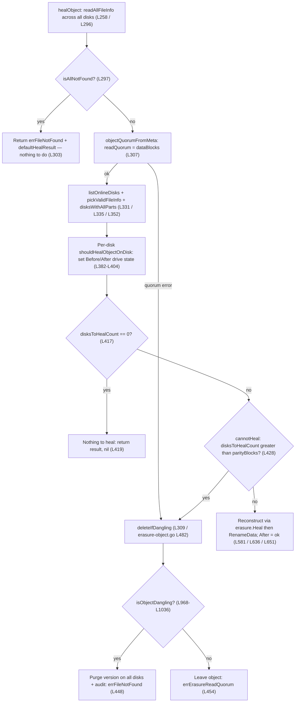

# MinIO Object Healing on a 4-Drive Erasure Set: Reconstruct vs. Leave vs. Purge

> An evidence-backed Q&A explaining how MinIO's object-healing engine adjudicates ambiguous, conflicting per-disk states on a 4-drive erasure-coded deployment — grounded in the source code as the truth and corroborated by a real build-and-run.

## Section 0 — Title & Metadata

| Field | Value |
|---|---|
| Repository | `github.com/minio/minio` |
| Source branch | `minio_c07e5b49d477` |
| HEAD commit | `c07e5b49d477b0774f23db3b290745aef8c01bd2` |
| Toolchain | Go 1.23.2 (CI pin; `go 1.23` in `go.mod` [`go.mod` L3]) |
| EC layout exercised | `minio server /d1 /d2 /d3 /d4` (single pool, 1 set, 4 drives) |
| Erasure parameters (4 drives) | data = 2, parity = 2, read quorum = 2, write quorum = 3 |
| Healing engine | `healObject` [`cmd/erasure-healing.go` L258–L657] + `isObjectDangling` [`cmd/erasure-healing.go` L968–L1036] |

**TL;DR.** No — healing does **not** always reconstruct. MinIO's healing engine produces exactly **three deterministic terminal outcomes**, chosen by a single pivotal test in `healObject` and a conservative truth table in `isObjectDangling`: it **reconstructs** when the number of disks needing repair is within the parity budget (≤ 2 on a 4-drive set); it **leaves the object in place but degraded** (returning a read-quorum error) when the damage exceeds parity *but* non-actionable corruption is present (so recoverable data might still exist); and it **purges** the object (deletes the version on all disks and returns `errFileNotFound`) only when the object is *confidently* dangling — i.e., metadata/shards are missing beyond parity with **only** not-found errors. The pivot between "reconstruct" and "hand off to the dangling gate" is one line: `cmd/erasure-healing.go:428`.

---

## The Central Question

> On a 4-drive erasure-coded (EC) MinIO deployment, when an object is inconsistent across disks (some hold valid data, some corrupted data, some nothing), does healing **always** reconstruct the object from surviving shards, or are there deterministic cases where it instead leaves the object degraded or purges it?

## The Grounded Answer

**No — healing does NOT always reconstruct.** There are **three deterministic terminal outcomes**, selected by `healObject` [`cmd/erasure-healing.go` L258–L657] and `isObjectDangling` [`cmd/erasure-healing.go` L968–L1036]:

1. **RECONSTRUCT** — rebuild the missing/corrupt shards from the survivors, when the number of disks needing heal is within the parity budget.
2. **LEAVE (read-quorum error)** — when the object is *not* confidently dangling (e.g., non-actionable corruption is present and recoverable data might still exist), heal refuses to delete and the read path returns a read-quorum error; the object is left in place but is degraded/unreadable.
3. **PURGE (dangling delete)** — when the object *is* confidently dangling (metadata/shards missing beyond parity, with **only** not-found errors), the version is deleted across all disks and `errFileNotFound` is returned.

The remainder of this document proves this with code citations, captured runtime evidence, and explicit rationale.

---

## Section 1 — Summary Answer ("Does MinIO always reconstruct?")

**No, not always.** On a 4-drive set (parity = 2), healing first counts how many disks need repair (`disksToHealCount`) and compares that to the object's parity. If repair is within budget it **reconstructs**. If not, it hands the object to the dangling gate (`deleteIfDangling` → `isObjectDangling`), which is deliberately conservative: it **purges** only when the evidence is unambiguous (missing beyond parity with only not-found errors), and otherwise **leaves** the object untouched, surfacing a read-quorum error rather than destroying bytes that might be recoverable elsewhere. The decisive factor when "3 of 4 drives are bad" is therefore not the *count* but the *type* of error — missing (actionable) versus corrupt (non-actionable).

| Outcome | When (4-drive set, parity = 2) | Return / surfaced error | Object after |
|---|---|---|---|
| **Reconstruct** | ≤ 2 disks need heal (≤ parity), any mix of missing/corrupt | heal succeeds; per-drive states flip to `ok` ([`cmd/erasure-healing.go` L651]) | fully restored on all 4 drives |
| **Leave (degraded)** | > 2 bad **but** non-actionable (corruption) errors present → not confidently dangling | `errErasureReadQuorum` — "Read failed. Insufficient number of drives online" ([`cmd/erasure-errors.go` L23]); read surfaces HTTP 503 `SlowDownRead` | retained but unreadable (read quorum lost) |
| **Purge (dangling)** | missing meta/shards > parity with **only** not-found errors → confidently dangling | version deleted on all disks; `errFileNotFound` ([`cmd/erasure-healing.go` L448–L449]) | removed from the namespace |

The three rows correspond to the three branches you will see traced in Section 2 and demonstrated live in Section 3.

---

## Section 2 — The Decision Engine (code-as-truth)

All object-level healing flows through `healObject(ctx, disks, bucket, object, ...)` [`cmd/erasure-healing.go` L258–L657]. This section walks the decision path line by line; every claim is anchored to a code locator.

### 2.1 `healObject` step by step

1. **Audit hook is armed first.** A deferred `auditHealObject(...)` is registered at the top of the function [`cmd/erasure-healing.go` L266] so that whatever the outcome, the heal attempt is recorded (see §2.5).

2. **Read every disk's metadata.** `readAllFileInfo` is called across *all* disks of the set [`cmd/erasure-healing.go` L296]. The per-disk results (`metaArr`) and errors (`errs`) drive every subsequent decision.

3. **Early exit — nothing exists anywhere.** `isAllNotFound(errs)` is checked [`cmd/erasure-healing.go` L297]; if **every** disk reports the file/version missing, healing returns a `defaultHealResult(...)` [defined at `cmd/erasure-healing.go` L787] together with `errFileNotFound` — there is literally nothing to heal [`cmd/erasure-healing.go` L303–L304]. (The same all-not-found guard is re-checked after metadata is re-read under lock at [`cmd/erasure-healing.go` L407], returning at L413–L414.)

4. **Derive quorum from metadata.** `objectQuorumFromMeta(...)` [`cmd/erasure-healing.go` L307; implemented at `cmd/erasure-metadata.go` L531 using `commonParity` at `cmd/erasure-metadata.go` L461] computes the read/write quorum. **Read quorum = number of data blocks.** If quorum derivation itself fails, control passes immediately to the dangling gate `deleteIfDangling(...)` [`cmd/erasure-healing.go` L309]. The result's `ParityBlocks`/`DataBlocks` are recorded at [`cmd/erasure-healing.go` L326–L327].

5. **Select the authoritative copy and classify each disk.** `listOnlineDisks(...)` [`cmd/erasure-healing.go` L331; `cmd/erasure-healing-common.go` L219] returns the quorum modtime and quorum ETag; `pickValidFileInfo(...)` [`cmd/erasure-healing.go` L335] selects the latest valid `FileInfo`; `disksWithAllParts(...)` [`cmd/erasure-healing.go` L352; `cmd/erasure-healing-common.go` L291] determines, per disk, whether every part is present and (in deep scan) bitrot-valid.

6. **Count disks needing repair.** `disksToHealCount` is initialized at [`cmd/erasure-healing.go` L374]. For each disk, `shouldHealObjectOnDisk(...)` [`cmd/erasure-healing.go` L156–L183] decides whether that disk needs healing; if so, `disksToHealCount++` [`cmd/erasure-healing.go` L379]. The per-disk *reason* is mapped to a drive state (see §2.3) and recorded into `result.Before`/`result.After` [`cmd/erasure-healing.go` L382–L404].

7. **Short-circuit — nothing to heal.** If `disksToHealCount == 0` the object is fully consistent and the function returns `result, nil` [`cmd/erasure-healing.go` L417–L419]. A dry-run also returns here without modifying data [`cmd/erasure-healing.go` L424–L425].

8. **The pivotal branch (the fork between reconstruct and the dangling gate).** At [`cmd/erasure-healing.go` L428]:

   ```go
   cannotHeal := !latestMeta.XLV1 && !latestMeta.Deleted && disksToHealCount > latestMeta.Erasure.ParityBlocks
   ```

   This is the single most important line in the engine. It is **true** only when the object is a current-format, non-delete-marker object **and** the number of disks needing heal **exceeds parity**. It is then *relaxed* back to `false` if a quorum ETag matched across disks [`cmd/erasure-healing.go` L429–L432] — "let's give it a shot" — so a quorum-consistent object is still attempted even at the edge.

9. **Branch A — `cannotHeal == true` → dangling gate.** Control calls `deleteIfDangling(...)` [`cmd/erasure-healing.go` L438; implemented at `cmd/erasure-object.go` L482]. If the object is confidently dangling, the version is purged and `defaultHealResult(...)` + `errFileNotFound` is returned [`cmd/erasure-healing.go` L448–L449]; otherwise the original error (a read-quorum error) is returned and the object is left in place [`cmd/erasure-healing.go` L454–L455].

10. **Branch B — `cannotHeal == false` → reconstruct.** Reed-Solomon reconstruction runs via `erasure.Heal(...)` [`cmd/erasure-healing.go` L581; backed by `cmd/erasure-decode.go` / `cmd/erasure-coding.go`], rebuilding the missing/corrupt shards onto the out-of-date disks. The freshly written data is committed with `RenameData(...)` [`cmd/erasure-healing.go` L636], and for each healed disk the per-drive `result.After.Drives[i].State` is flipped to `madmin.DriveStateOk` [`cmd/erasure-healing.go` L651]. The function returns `result, nil` [`cmd/erasure-healing.go` L656].

### 2.2 The decision-tree flowchart



*Source: `cmd/erasure-healing.go` L258–L657, L968–L1036; `cmd/erasure-object.go` L482+.*

### 2.3 Per-disk drive-state mapping

Before any repair, each disk's *reason for needing heal* is mapped to a `madmin` drive state in the `switch` at [`cmd/erasure-healing.go` L382–L393]:

| Reason (`shouldHealObjectOnDisk` result) | Drive state | Line |
|---|---|---|
| `nil` (disk is fine) | `madmin.DriveStateOk` | L385 |
| `errDiskNotFound` | `madmin.DriveStateOffline` | L387 |
| `errFileNotFound`, `errFileVersionNotFound`, `errVolumeNotFound`, `errPartMissingOrCorrupt`, `errOutdatedXLMeta`, `errLegacyXLMeta` | `madmin.DriveStateMissing` | L389 |
| default — "all remaining cases imply corrupt data/metadata" | `madmin.DriveStateCorrupt` | L392 |

These states populate `result.Before.Drives[]` and `result.After.Drives[]` [`cmd/erasure-healing.go` L395–L404]; on a successful reconstruct the healed disks' `After` state is overwritten with `ok` at L651 (§2.1 step 10). This is exactly the contract an operator sees in heal output (Section 5).

### 2.4 The dangling gate: `isObjectDangling` truth table

`deleteIfDangling` [`cmd/erasure-object.go` L482] calls `isObjectDangling(metaArr, errs, dataErrsByPart)` [`cmd/erasure-healing.go` L968–L1036] to decide **purge vs. leave**. The function first splits errors into two classes:

- **not-found** (actionable — the data is genuinely gone) via `danglingMetaErrsCount` [`cmd/erasure-healing.go` L934–L948] and `danglingPartErrsCount` [`cmd/erasure-healing.go` L950–L963]; these treat `errFileNotFound`/`errFileVersionNotFound` (and `checkPartFileNotFound` for parts) as *not-found*.
- **non-actionable** (corruption — the bytes are present but damaged, possibly recoverable) — everything else, e.g. bitrot/`checkPartFileCorrupt`.

It computes `notFoundMetaErrs`/`nonActionableMetaErrs` [`cmd/erasure-healing.go` L972], takes the worst-case part counts across all parts [`cmd/erasure-healing.go` L974–L979], and finds the first valid `FileInfo` [`cmd/erasure-healing.go` L981–L986]. It then decides in four branches:

| # | Scenario | Threshold used | Counts considered | Result | Lines |
|---|---|---|---|---|---|
| 1 | **No valid meta at all** (all `xl.meta` missing/unreadable) | `dataBlocks = (len(metaArr)+1)/2` (= 2 on a 4-disk set) | not-found **parts** | **purge** if `notFoundPartsErrs > dataBlocks`; else **leave** ("We have no idea what this file is, leave it as is") | L988–L1006 |
| 2 | **A valid `FileInfo` exists** (branch 1 did not apply) **and any non-actionable (corrupt) error is present** | — | meta + parts non-actionable | **leave** (return `false`) | L1008–L1010 |
| 3 | **Delete marker** (`validMeta.Deleted`) | `dataBlocks = (len(errs)+1)/2` (= 2) | not-found **meta only** (parts ignored — a delete marker has no parts) | **purge** if `notFoundMetaErrs > dataBlocks`; else **leave** | L1012–L1017 |
| 4 | **Normal object** (a write) | `validMeta.Erasure.ParityBlocks` (= 2) | not-found meta **OR** not-found parts | **purge** if `notFoundMetaErrs > parity` **or** (`!IsRemote()` and `notFoundPartsErrs > parity`); else **leave** | L1025–L1035 |

Two design notes that the code makes explicit:

- The "do not delete valid content if any is recoverable" rationale lives in branch 1's purge guard [`cmd/erasure-healing.go` L993–L1000]: when there is no valid `FileInfo` at all, the code deliberately compares against `dataBlocks` (not parity) and only purges when even that is exceeded — "ideally parityBlocks is sufficient, however we can't know that since we do have the FileInfo{}".
- **Branch 2 is the crux of "leave."** **Once a valid `FileInfo` has been found** — i.e., the no-valid-meta branch at L988–L1006 did *not* apply — the presence of *any* non-actionable meta/part error flips the whole decision to `false` (leave) [`cmd/erasure-healing.go` L1008–L1010]. This is why "3 of 4 corrupt" — where every surviving `xl.meta` is still readable, so `validMeta` *is* valid — is **not** purged: corruption is non-actionable, so MinIO retains the object rather than risk deleting bytes that could be recovered by other means. (When **no** valid `xl.meta` survives at all, control never reaches this guard; branch 1 alone decides purge-vs-leave, on `notFoundPartsErrs > dataBlocks` — L988–L1006.)

### 2.5 The audit trail

The deferred `auditHealObject` [`cmd/erasure-healing.go` L221–L255] records the attempt. When the before/after counts show heal did **not** improve the object, it logs one of:

- `"unable to heal %d corrupted blocks on drives"` [`cmd/erasure-healing.go` L238]
- `"unable to heal %d missing blocks on drives"` [`cmd/erasure-healing.go` L243]

A successful reconstruct (After all `ok`) produces no such warning; a purge returns `errFileNotFound` and does not emit these "unable to heal" lines (it is a *successful* dangling deletion, not a failed heal).

---

## Section 3 — Runtime Evidence

**Methodology.** The `minio` binary was built ephemerally outside the repository tree with `CGO_ENABLED=0 go build -tags kqueue -o /tmp/minio .` (producing version `DEVELOPMENT.GOGET`, `go1.23.2 linux/amd64`). Two complementary forms of evidence were captured: (3a) the existing deterministic healing unit tests, executed **read-only**; and (3b) an ephemeral, live 4-drive server (`/tmp/minio server /tmp/d1 /tmp/d2 /tmp/d3 /tmp/d4`) exercised through an offline MinIO/admin Go client. All scratch artifacts lived under `/tmp` and were removed afterward; the repository working tree was verified clean (`git status --porcelain` empty), so this document remains the sole persisted artifact.

### 3a. Unit-test evidence

The existing tests in `cmd/erasure-healing_test.go` are the deterministic, in-repo proof of the decision logic. The EC test set is built by `prepareErasure(ctx, nDisks)` [`cmd/test-utils_test.go` L211] (and `prepareErasure16` at L246), then damage is simulated by removing `xl.meta`/`part.N` files on selected disks before asserting the heal result — exactly the fault-injection pattern §3b reproduces live. Each test was run **in isolation** with `-tags kqueue,dev`:

```bash
CGO_ENABLED=0 go build -tags kqueue -o /tmp/minio .
for T in TestIsObjectDangling TestHealCorrectQuorum TestHealingDanglingObject \
         TestHealObjectCorruptedXLMeta TestHealObjectCorruptedParts TestHealLastDataShard; do
  MINIO_API_REQUESTS_MAX=10000 CGO_ENABLED=0 go test -tags kqueue,dev -run "^$T\$" -count=1 ./cmd/
done
# => each prints: ok  github.com/minio/minio/cmd
```

Captured results (each `ok github.com/minio/minio/cmd`):

| Test | Line | Time | What it proves |
|---|---|---|---|
| `TestIsObjectDangling` | L40 | 0.251s | The full purge-vs-leave truth table (§2.4) as executable cases |
| `TestHealCorrectQuorum` | L851 | 0.568s | **Reconstruct at the parity boundary** — removes exactly `ParityBlocks` `xl.meta` files, heals, asserts all restored |
| `TestHealingDanglingObject` | L647 | 0.478s | **Purge** path — drops shards beyond parity, heals, verifies dangling handling |
| `TestHealObjectCorruptedXLMeta` | L1158 | 0.448s | Reconstruct after metadata corruption |
| `TestHealObjectCorruptedParts` | L1297 | 0.467s | Reconstruct after part (data) corruption |
| `TestHealLastDataShard` | L1642 | 1.535s | Reconstruct from the last surviving data shard + parity |

**`TestIsObjectDangling` sub-cases** are the executable form of the truth table. Running `-run '^TestIsObjectDangling$' -count=1 -v` rendered all 13 sub-cases as **PASS** (`go test` renders spaces in case names as underscores):

```text
=== RUN   TestIsObjectDangling
=== RUN   TestIsObjectDangling/FileInfoExists-case1
=== RUN   TestIsObjectDangling/FileInfoExists-case2
=== RUN   TestIsObjectDangling/FileInfoUndecided-case1
=== RUN   TestIsObjectDangling/FileInfoUndecided-case2
=== RUN   TestIsObjectDangling/FileInfoUndecided-case3(file_deleted)
=== RUN   TestIsObjectDangling/FileInfoUnDecided-case4
=== RUN   TestIsObjectDangling/FileInfoUnDecided-case5-(ignore_errFileCorrupt_error)
=== RUN   TestIsObjectDangling/FileInfoUnDecided-case6-(data-dir_intact)
=== RUN   TestIsObjectDangling/FileInfoDecided-case1
=== RUN   TestIsObjectDangling/FileInfoDecided-case2-delete-marker
=== RUN   TestIsObjectDangling/FileInfoDecided-case3-(enough_data-dir_missing)
=== RUN   TestIsObjectDangling/FileInfoDecided-case4-(missing_data-dir_for_part_2)
=== RUN   TestIsObjectDangling/FileInfoDecided-case4-(enough_data-dir_existing_for_each_part)
--- PASS: TestIsObjectDangling (0.00s)
ok  	github.com/minio/minio/cmd	0.255s
```

Three sub-cases map directly onto the truth-table branches:

- `FileInfoUnDecided-case5-(ignore_errFileCorrupt_error)` → **leave** (branch 2 — a corruption error is non-actionable, so the object is retained).
- `FileInfoDecided-case3-(enough_data-dir_missing)` → **purge** (branch 4 — not-found data-dirs beyond parity).
- `FileInfoDecided-case2-delete-marker` → the **delete-marker** path (branch 3 — uses `dataBlocks = (len(errs)+1)/2`, parts ignored).

**Methodological honesty (must be disclosed).** Running all six tests in a **single** `go test -run 'A|B|...'` process causes the large-disk tests (`TestHealObjectCorruptedXLMeta`, `TestHealObjectCorruptedParts`, `TestHealLastDataShard`) to **fail** with `InsufficientReadQuorum` — "Storage resources are insufficient for the read operation" — due to **shared global state across tests in one process**, not a defect in the code under test. The combined run was captured to be transparent about this:

```text
--- PASS: TestIsObjectDangling (0.00s)
--- PASS: TestHealingDanglingObject (0.25s)
--- PASS: TestHealCorrectQuorum (0.43s)
    erasure-healing_test.go:1235: Failed to heal object - Storage resources are insufficient for the read operation
--- FAIL: TestHealObjectCorruptedXLMeta (0.17s)
--- FAIL: TestHealObjectCorruptedParts (0.28s)
    erasure-healing_test.go:1718: Storage resources are insufficient for the read operation bucket/object
--- FAIL: TestHealLastDataShard (1.33s)
FAIL    github.com/minio/minio/cmd      2.780s
```

The error string is exactly `InsufficientReadQuorum.Error()` [`cmd/object-api-errors.go` L236–L238], which **unwraps to `errErasureReadQuorum`** [`cmd/object-api-errors.go` L241–L242]. Each of these tests **passes when run in isolation** (table above). The per-test isolated results — not the combined run — are the authoritative evidence.

### 3b. Live 4-drive evidence

A single-node 4-drive erasure set was launched (`/tmp/minio server /tmp/d1 /tmp/d2 /tmp/d3 /tmp/d4`) and exercised through an **ephemeral Go client** built outside the repository tree against the warmed module cache, using the project's own pinned clients `github.com/minio/minio-go/v7@v7.0.80` (S3 data ops — `PutObject`/`GetObject`/`StatObject`) and `github.com/minio/madmin-go/v3@v3.0.77` (the admin `Heal` API). The `mc` binary is **not** installed in this environment (the AAP lists it as optional), so the color-coded `mc admin heal` lines shown below are rendered **directly from the captured `madmin.HealResultItem`** returned by the admin `Heal` API — i.e., from the exact per-drive `Before`/`After` data that `mc admin heal --verbose` itself consumes to produce its display. The rendering rule (matching `mc`) is: a drive set prints **Green** when every drive `State == ok`, otherwise **Yellow**; an object counts as *healed* when it advanced from a non-Green `Before` to a Green `After`. The server logged:

```text
INFO: Formatting 1st pool, 1 set(s), 4 drives per set.
INFO: WARNING: Host local has more than 2 drives of set. A host failure will result in data becoming unavailable.
```

A **6 MiB** object (`healbucket/obj.bin`, 6 291 456 bytes) was stored. Its payload is fully **deterministic and reproducible** — `byte[i] = i mod 256` — so the captured content hash is independently verifiable:

```text
$ python3 -c "import sys;sys.stdout.buffer.write(bytes(i&0xFF for i in range(6291456)))" | md5sum
d740f660753a4a38a24d739d768410e9  -
```

The live single-part `PutObject` returned this same value as the object **ETag** (`local_md5 == etag == d740f660753a4a38a24d739d768410e9`), confirming `ETag == md5(content)`. On each of the 4 drives the backend layout is **one `part.1` shard of 3 145 920 bytes plus an `xl.meta` of 364 bytes** (2 data + 2 parity); the shard's `nonzero_bytes` count is 3 133 632 because the deterministic payload places a zero byte once in every 256 (`byte[i] = i mod 256`), so each `3 145 920`-byte shard holds exactly `3 145 920 / 256 = 12288` zero bytes (`3 145 920 − 12 288 = 3 133 632`, measured identical on all four drives):

```text
/tmp/d1/healbucket/obj.bin/<data-dir>/part.1   3145920   (nonzero_bytes=3133632)
/tmp/d1/healbucket/obj.bin/xl.meta                  364
# ... identical on d2, d3, d4
```

Every `HealResultItem` returned by the admin API reported `dataBlocks: 2`, `parityBlocks: 2`, `diskCount: 4` — a **live confirmation of `DefaultParityBlocks(4)`** (Section 4).

**Baseline (all shards intact).** Heal is a no-op; all four drives report `ok` before and after, and GET/STAT succeed:

```json
"before": [d1: ok, d2: ok, d3: ok, d4: ok]
"after":  [d1: ok, d2: ok, d3: ok, d4: ok]   // dataBlocks=2 parityBlocks=2 diskCount=4
```

Rendered in `mc admin heal --verbose` form from the captured result item (both drive sets all-`ok` → Green→Green; nothing needed repair → 0 healed):

```text
[Green -> Green] healbucket/obj.bin
Healed: 0/1 objects; 0/1 healed, 0/1 failed
```
```text
GET  ok  size=6291456  md5=d740f660753a4a38a24d739d768410e9
STAT ok  size=6291456  etag=d740f660753a4a38a24d739d768410e9
```

**Case 1 — 1 drive has nothing** (object directory deleted on d1; an actionable *missing* error). Heal reconstructs the shard onto d1; the per-drive state flips `missing → ok`:

```json
"before": [d1: missing, d2: ok, d3: ok, d4: ok]
"after":  [d1: ok,      d2: ok, d3: ok, d4: ok]
```

Rendered in `mc admin heal --verbose` form (Before has a non-`ok` drive → Yellow; After all-`ok` → Green; one object advanced to healthy → 1 healed):

```text
[Yellow -> Green] healbucket/obj.bin
Healed: 1/1 objects; 1/1 healed, 0/1 failed
```
```text
# shard restored on d1:
/tmp/d1/healbucket/obj.bin/<data-dir>/part.1   3145920
/tmp/d1/healbucket/obj.bin/xl.meta                  364
GET ok  size=6291456  md5=d740f660753a4a38a24d739d768410e9   # matches baseline
```
→ **RECONSTRUCT** (`disksToHealCount = 1 ≤ parity = 2`).

**Case 2 — 2 drives have nothing** (object directory deleted on d1 *and* d2 = exactly parity). Still reconstructs — this is the **boundary** case, since `disksToHealCount = 2` is **not** `> ParityBlocks = 2`, so `cannotHeal` is `false` [`cmd/erasure-healing.go` L428]:

```json
"before": [d1: missing, d2: missing, d3: ok, d4: ok]
"after":  [d1: ok,      d2: ok,      d3: ok, d4: ok]
```

Rendered in `mc admin heal --verbose` form (Before two `missing` → Yellow; After all-`ok` → Green):

```text
[Yellow -> Green] healbucket/obj.bin
Healed: 1/1 objects; 1/1 healed, 0/1 failed
```
```text
GET ok  size=6291456  md5=d740f660753a4a38a24d739d768410e9   # matches baseline
```
→ **RECONSTRUCT at the parity boundary** (mirrors `TestHealCorrectQuorum`).

**Case 3a — 3 drives have nothing** (object directory deleted on d1, d2, d3; only d4 remains; **not-found** errors). The object is below read quorum (2), so it is invisible to the read/list path:

```text
STAT -> NoSuchKey (HTTP 404): The specified key does not exist.
GET  -> NoSuchKey (HTTP 404): The specified key does not exist.
```
A heal of this object path then **purged** the lone d4 remnant — after the heal, the object directory was gone from **all four** drives, and a subsequent `STAT` still returned `NoSuchKey`. Because `notFoundMetaErrs (3) > parity (2)` with **no** non-actionable errors, `isObjectDangling` is **true** (branch 4) → `deleteIfDangling` purges the version [`cmd/erasure-healing.go` L968–L1036, `cmd/erasure-object.go` L482].

→ **PURGE.** A subtlety worth stating precisely — and observed directly here: the admin `Heal` **sequence** did *not* return a per-object `madmin.HealResultItem` for this object (a *listing-driven* `mc admin heal` cannot enumerate a sub-quorum object), yet the dangling d4 version was still removed by the heal of that path (and, failing that, the background scanner would sample and purge it later). The deterministic purge is also proven in-repo by `TestHealingDanglingObject` (§3a).

**Case 3b — 3 drives have corrupted data** (`part.1` bytes zeroed on d1, d2, d3 with the file size preserved; `xl.meta` kept intact on all 4; **non-actionable** corruption errors). A deep-scan heal (`--scan deep`, i.e. bitrot verification) was issued. Heal did **not** reconstruct and did **not** purge — the per-drive states stayed `corrupt`:

```json
"before": [d1: corrupt, d2: corrupt, d3: corrupt, d4: corrupt]
"after":  [d1: corrupt, d2: corrupt, d3: corrupt, d4: corrupt]   // heal did NOT reconstruct
```

Rendered in `mc admin heal --verbose` form (Before has non-`ok` drives → Yellow; After still non-`ok` → Yellow; no object advanced to healthy → 0 healed):

```text
[Yellow -> Yellow] healbucket/obj.bin
Healed: 0/1 objects; 0/1 healed, 0/1 failed
```
```text
# backend AFTER heal — object retained; part.1 still zeroed on d1-d3, intact on d4:
d1 part.1: size=3145920  nonzero_bytes=0
d2 part.1: size=3145920  nonzero_bytes=0
d3 part.1: size=3145920  nonzero_bytes=0
d4 part.1: size=3145920  nonzero_bytes=3133632   # unchanged from baseline (the deterministic
                                                 # payload has 1/256 naturally-zero bytes)
```
Because every surviving `xl.meta` is intact on all 4 drives, the engine *does* find a valid `FileInfo` (so the no-valid-meta branch L988–L1006 does **not** apply); and because non-actionable (corrupt) errors are then present, `isObjectDangling` is **false** (branch 2, L1008–L1010) → the object is **left** in place. Reads then split:

```text
HEAD /healbucket/obj.bin  -> HTTP 200          # xl.meta metadata quorum intact on all 4
GET  /healbucket/obj.bin  -> HTTP 503
<Error><Code>SlowDownRead</Code><Message>Resource requested is unreadable, please reduce your request rate</Message>...</Error>
```
→ **LEAVE (degraded).** The object exists (metadata quorum holds, so `HEAD` succeeds) but is unreadable (data read quorum lost, so `GET` returns 503 `SlowDownRead`). This is the data-path read-quorum failure surfacing to the client (the surfacing chain is detailed in Section 4).

**The crux — identical "3 of 4 bad," opposite outcomes.**

> **3 missing → PURGE; 3 corrupt → LEAVE; ≤ 2 bad → RECONSTRUCT.**

Cases 3a and 3b differ *only* in error type — not in count — yet 3a removes the object from the namespace while 3b retains it. This is precisely what branch 2 of the `isObjectDangling` truth table predicts (§2.4) and is the clearest possible demonstration that healing does **not** always reconstruct.

---

## Section 4 — Boundary Conditions

### 4.1 The 4-disk parameters

The data/parity split for a set is derived from `DefaultParityBlocks(drive)` [`internal/config/storageclass/storage-class.go` L355]:

```go
func DefaultParityBlocks(drive int) int {
    switch drive {
    case 1:        return 0
    case 3, 2:     return 1
    case 4, 5:     return 2   // <- a 4-drive set
    case 6, 7:     return 3
    default:       return 4
    }
}
```

So for **4 drives**: **parity = 2, data = 2, read quorum = 2 (= data blocks), write quorum = 3 (= data + 1)**. This was confirmed live: every `HealResultItem` reported `dataBlocks: 2, parityBlocks: 2, diskCount: 4` (§3b). Consequently, healing **tolerates up to 2 damaged disks** (reconstruct), and **≥ 3 damaged disks** push past parity into the `cannotHeal` branch (for not-found errors) [`cmd/erasure-healing.go` L428].

### 4.2 (a) Minimum valid shards for a successful heal

The minimum number of intact shards required to reconstruct is the **data-block count = 2**. Reed-Solomon can rebuild the object from **any 2** surviving shards — data **or** parity — because `erasure.Heal` [`cmd/erasure-healing.go` L581; `cmd/erasure-decode.go`/`cmd/erasure-coding.go`] reconstructs all missing shards from any `dataBlocks` survivors. This is directly demonstrated by `TestHealLastDataShard` [`cmd/erasure-healing_test.go` L1642], which reconstructs from the last surviving data shard plus parity, and by live Case 2 (2 survivors → full restore).

### 4.3 (b) The exact unrecoverable error and how it surfaces

The sentinel returned when an object cannot meet read quorum is:

```go
// cmd/erasure-errors.go:23
var errErasureReadQuorum = errors.New("Read failed. Insufficient number of drives online")
```

Its siblings are `errErasureWriteQuorum` — "Write failed. Insufficient number of drives online" [`cmd/erasure-errors.go` L26] — and `errNoHealRequired` — "No healing is required" [`cmd/erasure-errors.go` L29].

The **surfacing chain** to the S3 client (observed live in Case 3b) is:

1. The erasure read path fails read quorum → `errErasureReadQuorum` [`cmd/erasure-errors.go` L23].
2. It is wrapped as `InsufficientReadQuorum`, whose `Error()` string is "Storage resources are insufficient for the read operation" [`cmd/object-api-errors.go` L236–L238] and whose `Unwrap()` returns `errErasureReadQuorum` [`cmd/object-api-errors.go` L241–L242].
3. The API layer maps `errErasureReadQuorum` to `ErrSlowDownRead` [`cmd/api-errors.go` L2190–L2191; enum at L196], defined with HTTP status **503**, code **`SlowDownRead`**, message "Resource requested is unreadable, please reduce your request rate" [`cmd/api-errors.go` L869–L872].
4. The client receives **HTTP 503 `SlowDownRead`** — exactly the XML body captured in §3b.

Note the asymmetry visible to operators: because `xl.meta` metadata quorum was intact in Case 3b, **`HEAD` returns 200** while **`GET` returns 503** — a crisp "present but degraded" signal (metadata quorum held, data quorum lost).

### 4.4 (c) WRITE vs. DELETE: different thresholds in `isObjectDangling`

A partially-failed **write** and a partially-failed **delete** are adjudicated by **different thresholds** inside `isObjectDangling` [`cmd/erasure-healing.go` L968–L1036]:

| Path | Trigger | Threshold | Counts considered | Lines |
|---|---|---|---|---|
| **Partially-failed WRITE** (normal object) | `!validMeta.Deleted` | `validMeta.Erasure.ParityBlocks` (= 2) | not-found **meta** *or* not-found **parts** (data-dirs) | L1025–L1033 |
| **Partially-failed DELETE** (delete marker) | `validMeta.Deleted` | `dataBlocks = (len(errs)+1)/2` (= 2 on 4 disks) | not-found **meta only** — parts ignored | L1012–L1017 |

For a **normal object**, dangling is true if not-found metadata exceeds parity *or* (for non-remote objects) not-found data-dirs exceed parity [`cmd/erasure-healing.go` L1025–L1033]. For a **delete marker**, there are no parts to consider, so the decision rests solely on whether not-found metadata exceeds `(len(errs)+1)/2` [`cmd/erasure-healing.go` L1012–L1017]. In other words: a half-completed write is judged against the *parity* budget over both metadata and data; a half-completed delete is judged against a *majority* budget over metadata alone.

---

## Section 5 — Heal-Output / Status-Indicator Reference

### 5.1 The `madmin.HealResultItem` contract

Heal results are reported through the **unchanged** external module `github.com/minio/madmin-go/v3@v3.0.77` (`heal-commands.go`). A `HealResultItem` carries, among other fields, `Bucket`, `Object`, `DiskCount`, `ParityBlocks`, `DataBlocks`, and two parallel drive lists:

```go
Before struct { Drives []HealDriveInfo `json:"drives"` } `json:"before"`
After  struct { Drives []HealDriveInfo `json:"drives"` } `json:"after"`

type HealDriveInfo struct {
    UUID     string `json:"uuid"`
    Endpoint string `json:"endpoint"`
    State    string `json:"state"`
}
```

The drive `State` strings are the `madmin.DriveState*` constants (`ok`, `offline`, `corrupt`, `missing`, `permission-denied`, `faulty`, `root-mount`, `unknown`, `unformatted`). The healing engine populates only a subset of these (see below).

### 5.2 How `State` is computed

The per-drive `State` is set inside `healObject` from the heal reason, in the `switch` at [`cmd/erasure-healing.go` L382–L393]:

| Reason | `State` | Line |
|---|---|---|
| `reason == nil` | `madmin.DriveStateOk` (`"ok"`) | L385 |
| `errDiskNotFound` | `madmin.DriveStateOffline` (`"offline"`) | L387 |
| `errFileNotFound` / `errFileVersionNotFound` / `errVolumeNotFound` / `errPartMissingOrCorrupt` / `errOutdatedXLMeta` / `errLegacyXLMeta` | `madmin.DriveStateMissing` (`"missing"`) | L389 |
| default (corrupt data/metadata) | `madmin.DriveStateCorrupt` (`"corrupt"`) | L392 |

On a successful reconstruction, each healed disk's **`After`** state is overwritten with `madmin.DriveStateOk` [`cmd/erasure-healing.go` L651]. The matrix below summarizes what the captured live runs (§3b) showed:

| Live case | `Before` drives | `After` drives | Meaning |
|---|---|---|---|
| Baseline | `[ok, ok, ok, ok]` | `[ok, ok, ok, ok]` | already healthy |
| Case 1 (1 missing) | `[missing, ok, ok, ok]` | `[ok, ok, ok, ok]` | reconstructed |
| Case 2 (2 missing) | `[missing, missing, ok, ok]` | `[ok, ok, ok, ok]` | reconstructed at boundary |
| Case 3b (3 corrupt) | `[corrupt, corrupt, corrupt, corrupt]` | `[corrupt, corrupt, corrupt, corrupt]` | left (no reconstruction) |

### 5.3 What an operator sees

- `mc admin heal --verbose` prints a color-coded per-object **before → after** indicator: `[Yellow -> Green]` means *needed healing → healthy* (a reconstruct, as in Case 1); `[Green -> Green]` means *already healthy* (the baseline). When heal cannot improve a degraded object, the before/after states do not advance to green (Case 3b stays `corrupt`).
- `mc admin heal --json` exposes the raw per-drive `before`/`after` `state` strings (`ok` / `missing` / `corrupt` / `offline`) — exactly the JSON captured in §3b via the admin API.

### 5.4 What triggers healing (and when the summary reflects state)

Healing is invoked from several entry points; the object-layer entrypoint is `HealObject` [`cmd/erasure-healing.go` L1039]:

- **Read-time auto-heal** on `GET`/`HEAD` — when a read encounters a missing or bitrot-corrupt shard, the read path schedules a background heal via `globalMRFState.addPartialOp(...)`: the data path `getObjectWithFileInfo` does so on `errFileNotFound`/`errFileCorrupt` during decode [`cmd/erasure-object.go` L396–L407, passing `BitrotScan: errors.Is(err, errFileCorrupt)`], and the `FileInfo` read path `getObjectFileInfo` — used by both `GET` and `HEAD` — does so when reconstructable blocks are missing (`missingBlocks > 0 && missingBlocks < fi.Erasure.DataBlocks`) [`cmd/erasure-object.go` L790–L805].
- **Background data-scanner** — samples roughly **one object in 1,024** via `healObjectSelectProb = 1024` [`cmd/data-scanner.go` L61] ("Overall probability of a file being scanned; one in n"). Deep bitrot scanning is governed by `internal/config/heal/heal.go` (`Config` at L48, `BitrotScanCycle` at L65/L69) and is not continuous by default — which is why Case 3b's corruption required an explicit deep scan to be detected.
- **Erasure-set background driver** — `healErasureSet` [`cmd/global-heal.go` L152] sweeps a set and calls `HealObject` (at L426 and L462).
- **Manual full-scan admin API** — `HealHandler` [`cmd/admin-handlers.go` L1308] backs `mc admin heal`; the returned heal summary reflects state **after** the attempt (the per-drive `After` list).

During a deep scan, per-part classification uses the `checkPart*` result codes [`cmd/storage-datatypes.go` L536–L544]: `checkPartUnknown`, `checkPartSuccess`, `checkPartDiskNotFound`, `checkPartVolumeNotFound`, `checkPartFileNotFound`, `checkPartFileCorrupt`. These feed `disksWithAllParts` / `isObjectDangling`, distinguishing a *not-found* part (`checkPartFileNotFound`) from a *corrupt* part (`checkPartFileCorrupt`) — the very distinction that decides purge vs. leave.

---

## Section 6 — Rationale & Code-Citation Index

### 6.1 Why this design

MinIO's healing engine is built around a single principle: **refuse to delete on ambiguity.** Reconstruction is attempted whenever enough shards survive (≤ parity damaged) because that is provably safe and lossless. When damage exceeds parity, the engine does not blindly delete — it consults the dangling gate, which purges **only** when the evidence is unambiguous: metadata/shards are *not-found* (actionable) beyond parity, meaning the data is genuinely gone and the residual sub-quorum fragments are just litter. But once a valid `FileInfo` has been found, if **any** non-actionable (corruption) error is present, the gate **leaves** the object [`cmd/erasure-healing.go` L1008–L1010], trading a read-quorum error (`SlowDownRead`) for the chance that the bytes are recoverable by other means — a re-scan, a transient-fault recovery, or replication resynchronization from another site. The no-valid-meta branch is even more cautious, comparing against `dataBlocks` rather than parity and explaining in-code that it does so to "ensure that we do not delete any valid content, if any is recoverable" [`cmd/erasure-healing.go` L993–L1000].

Three insights crystallize the behavior:

1. **One line is the fork.** `cmd/erasure-healing.go:428` — `disksToHealCount > parityBlocks` — is the entire decision between "reconstruct" and "hand off to the dangling gate." Everything upstream classifies disks; everything downstream acts on this comparison.
2. **The gate is conservative by type, not count.** The presence of any corruption error flips the outcome to *leave*; only clean not-found-beyond-parity situations *purge*. Identical "3 of 4 bad" counts therefore diverge entirely on error *type* (live Cases 3a vs. 3b).
3. **`HEAD 200 / GET 503` is the degraded-object fingerprint.** When metadata quorum survives but data quorum is lost, the object is "present but unreadable" — an operationally meaningful, code-determined signal, not an accident.

### 6.2 Code-citation index

| Claim / outcome | Locator |
|---|---|
| `healObject` decision engine | `cmd/erasure-healing.go` L258–L657 |
| `readAllFileInfo` across disks | `cmd/erasure-healing.go` L296 |
| `isAllNotFound` early exit → `errFileNotFound` | `cmd/erasure-healing.go` L297, L303–L304 (and L407, L413–L414) |
| Quorum derivation entrypoint | `cmd/erasure-healing.go` L307 → `cmd/erasure-metadata.go` L531 (`commonParity` L461) |
| `listOnlineDisks` / `pickValidFileInfo` / `disksWithAllParts` | `cmd/erasure-healing.go` L331 / L335 / L352 |
| `disksToHealCount` init / increment | `cmd/erasure-healing.go` L374 / L379 |
| Drive-state mapping (`ok`/`offline`/`missing`/`corrupt`) | `cmd/erasure-healing.go` L382–L393 (L385/L387/L389/L392) |
| "Nothing to heal" short-circuit | `cmd/erasure-healing.go` L417–L419 |
| **Pivotal `cannotHeal` branch** | `cmd/erasure-healing.go` **L428** (relaxation L429–L432) |
| Hand-off to dangling gate | `cmd/erasure-healing.go` L438 → `cmd/erasure-object.go` L482 |
| Purge return (`errFileNotFound`) / leave return | `cmd/erasure-healing.go` L448–L449 / L454–L455 |
| Reconstruct: `erasure.Heal` / `RenameData` / `After = ok` / return | `cmd/erasure-healing.go` L581 / L636 / **L651** / L656 |
| `shouldHealObjectOnDisk` | `cmd/erasure-healing.go` L156–L183 |
| `auditHealObject` strings | `cmd/erasure-healing.go` L221–L255 (L238 corrupted, L243 missing) |
| `defaultHealResult` | `cmd/erasure-healing.go` L787 |
| `danglingMetaErrsCount` / `danglingPartErrsCount` | `cmd/erasure-healing.go` L934–L948 / L950–L963 |
| **`isObjectDangling` truth table** | `cmd/erasure-healing.go` **L968–L1036** (no-meta L988–L1006; non-actionable L1008–L1010; delete-marker L1012–L1017; normal L1025–L1035) |
| `HealObject` object-layer entrypoint | `cmd/erasure-healing.go` L1039 |
| `objectQuorumFromMeta` | `cmd/erasure-metadata.go` L531 |
| `deleteIfDangling` | `cmd/erasure-object.go` L482 |
| `DefaultParityBlocks` (4 → parity 2) | `internal/config/storageclass/storage-class.go` L355 |
| `errErasureReadQuorum` text | `cmd/erasure-errors.go` L23 (write L26, no-heal L29) |
| Error chain → HTTP 503 `SlowDownRead` | `cmd/object-api-errors.go` L236–L238, L241–L242 → `cmd/api-errors.go` L2190–L2191 (def L869–L872, enum L196) |
| `healObjectSelectProb = 1024` | `cmd/data-scanner.go` L61 |
| Heal tunables (`Config`, `BitrotScanCycle`) | `internal/config/heal/heal.go` L48, L65/L69 |
| `healErasureSet` background driver | `cmd/global-heal.go` L152 (HealObject calls L426/L462) |
| `HealHandler` (admin API) | `cmd/admin-handlers.go` L1308 |
| `checkPart*` result codes | `cmd/storage-datatypes.go` L536–L544 |
| Heal-output contract (`HealResultItem`, `HealDriveInfo`, `DriveState*`) | `github.com/minio/madmin-go/v3@v3.0.77/heal-commands.go` |
| Tests (evidence harness) | `cmd/erasure-healing_test.go` L40 / L647 / L851 / L1158 / L1297 / L1642 |
| EC test-set builder | `cmd/test-utils_test.go` L211 (`prepareErasure16` L246) |

### 6.3 Build/test/harness references

- **Build:** `CGO_ENABLED=0 go build -tags kqueue -trimpath --ldflags ... -o $(PWD)/minio` [`Makefile` L179] (built ephemerally to `/tmp/minio` for this analysis).
- **Test:** `MINIO_API_REQUESTS_MAX=10000 CGO_ENABLED=0 go test -v -tags kqueue,dev ./...` [`Makefile` L53] (run per-test in isolation here — see §3a caveat).
- **Live-cluster harness pattern:** `buildscripts/verify-healing.sh` (`start_minio_3_node` L17, `MINIO_ERASURE_SET_DRIVE_COUNT` L24) — the proven pattern adapted ephemerally for §3b.

### 6.4 Bottom line

On a 4-drive erasure set, MinIO heals an inconsistent object by **reconstructing** it whenever ≤ 2 disks need repair; otherwise it **leaves** the object (returning `errErasureReadQuorum`, surfaced as HTTP 503 `SlowDownRead`) when a readable `xl.meta` survives but non-actionable corruption is present, and **purges** it (returning `errFileNotFound`) only when metadata/shards are missing beyond parity with **only** not-found (actionable) errors. Healing therefore does **not** always reconstruct — the outcome is a deterministic function of *how many* disks are bad and, decisively, *why*.

---

*Document generated from analysis of `github.com/minio/minio` at commit `c07e5b49d477b0774f23db3b290745aef8c01bd2` (branch `minio_c07e5b49d477`), with runtime evidence captured from a Go 1.23.2 build and an ephemeral live 4-drive server. No MinIO source, test, or configuration file was modified; this document is the sole persisted artifact.*
