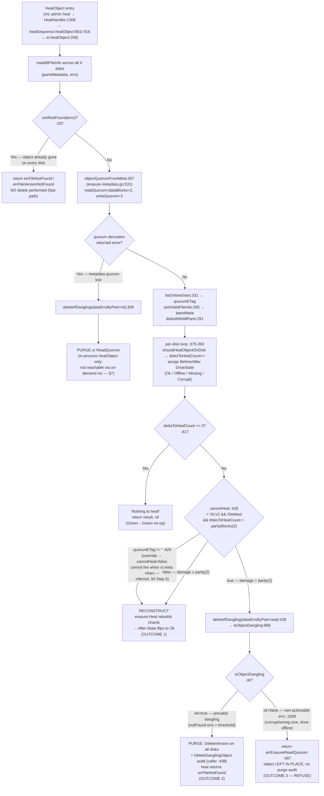

# How MinIO's Erasure-Coding Healing Decides: Reconstruct vs. Stay-Deleted vs. Stay-Degraded (4-disk EC:2)

> **Onboarding investigation — runtime-evidence-backed answer.**
> Repository: `minio/minio`, branch `minio_c07e5b49d477`. **Source under investigation: commit `c07e5b49d477b0774f23db3b290745aef8c01bd2`** (the branch base).
> The working tree's `HEAD` is a *documentation-only* commit that adds solely this markdown file; `git diff c07e5b49d477 HEAD --stat` reports exactly one changed file (this document) and **zero** `.go` / `go.mod` / `go.sum` changes (proof in §2.2), so the compiled server behavior observed here is byte-identical to `c07e5b49d477`.
> Every behavioral claim below is backed by **actual, unedited output** captured from a running server (or a real in-process object-layer test), plus a `file:line` citation into the source at this commit. Statements read from code but not observed at runtime are explicitly labeled **(inferred from code)**.

---

## The question (verbatim)

> "I'm onboarding to this MinIO repository and trying to understand how the erasure-coding healing process makes decisions when data is in an ambiguous state. Specifically, on a 4-disk erasure coded instance, if an object ends up in an inconsistent state across the disks — say some disks have the data, some have corrupted data, and some have nothing — when healing runs, does MinIO always reconstruct the object from whatever valid shards remain, or are there situations where it decides the object should stay deleted or degraded? I'd like to understand: (a) what shows up in the healing output that reveals this decision — are there status indicators that show the before/after state? (b) do the logs explain why MinIO chose to restore vs. leave an object alone? (c) what are the boundary conditions — how many valid shards do you actually need for healing to succeed, and what error shows up when healing cannot recover an object? and (d) does the healing behavior differ between a partially-failed write versus a partially-failed delete? Please don't modify any of the source files — just create whatever test scenarios you need to demonstrate the behavior and clean them up when done."

---

## 1. Executive answer (Q1: reconstruct vs. stay-deleted/degraded)

**No — MinIO does *not* always reconstruct.** On a heal, `er.healObject` (**`cmd/erasure-healing.go:258`**) routes to one of **three terminal outcomes**, plus a "nothing to do" fast-path:

1. **RECONSTRUCT.** If the object still has read quorum and the number of drives needing repair is within the parity budget (`disksToHealCount ≤ parityBlocks = 2`), the predicate `cannotHeal` is **false** and MinIO rebuilds the missing/corrupt shards via Reed-Solomon, flipping those drives' `After` state to `DriveStateOk`. *(Observed: §7 S1, S2b, S2c, S3; Q4a k=1,2.)*
2. **PURGE — object stays deleted.** If the damage exceeds the parity budget (`disksToHealCount > parityBlocks`) **and** the object is *provably garbage* (files actually **missing** beyond parity), `cannotHeal` is **true**, `healObject` calls `deleteIfDangling`, `isObjectDangling` returns `ok=true`, and the version is `DeleteVersion`-d on **all** disks — even the surviving good copy. The heal returns **`errFileNotFound`** / **`errFileVersionNotFound`** and emits a `DeleteDanglingObject` audit. *(Observed: §7 S4a; Q4a k=3; §8 Q5-A 3-disk; in-process probe `P`.)*
3. **REFUSE — object stays degraded.** If the damage exceeds the parity budget **but** the object is *not provably dangling* — the surviving disks report **non-actionable** errors (present-but-unreadable metadata, a wrong-size `part.N`, or a drive merely **offline**) — `cannotHeal` is still true and `deleteIfDangling` is still called, but `isObjectDangling` returns `ok=false`, so MinIO **neither reconstructs nor purges**. It leaves the object in place and `deleteIfDangling` returns **`errErasureReadQuorum` = "Read failed. Insufficient number of drives online"**. *(Observed: §7 S4b, 2/2 runs; in-process probe `RQ`, where `errors.Is(err, errErasureReadQuorum) == true`.)*

Plus the degenerate case: **already gone.** If *every* disk reports the file missing, `isAllNotFound` (**`cmd/erasure-healing.go:297`**) short-circuits with "Nothing to do, file is already gone" and returns `errFileNotFound`/`errFileVersionNotFound` **without deleting anything** (there is nothing to delete). This is a *different* internal path from the purge in outcome 2. *(Observed: §7 S5.)*

The single line that separates outcome (1) from outcomes (2)/(3) is the **`cannotHeal`** predicate at **`cmd/erasure-healing.go:428`**:

```go
cannotHeal := !latestMeta.XLV1 && !latestMeta.Deleted && disksToHealCount > latestMeta.Erasure.ParityBlocks
```

The line that separates outcome (2) *purge* from outcome (3) *refuse* is inside **`deleteIfDangling`** (**`cmd/erasure-object.go:482`**): it consults `isObjectDangling` (**`cmd/erasure-healing.go:968`**), and if that classifier returns `ok=false` (a **non-actionable** error is present), `deleteIfDangling` returns `errErasureReadQuorum` at **`cmd/erasure-object.go:487`** instead of purging.

> **Causality note (two distinct purge callers).** There are **two** call sites of `deleteIfDangling` in `healObject`. The one central to this question is the **`cannotHeal` branch at `:438`** (metadata has quorum, but too many *data parts* are bad). A *separate, earlier* branch at **`:309`** fires only when `objectQuorumFromMeta` (`:307`) itself errors — i.e. when read quorum is already lost across the *surviving `xl.meta`* files. The dangling-deletion audit distinguishes them via its `caller` tag (`:438` vs `:309`). This document proves the `:438 cannotHeal` branch directly (§7.5, §6.3) and also exercises the `:309` branch via an in-process probe (§7.4), because on a single-node server an object with 3-of-4 `xl.meta` gone becomes unlistable through `mc admin heal` and only the in-process `HealObject` API can reach it.

The rest of this document proves each outcome with captured output, walks the exact boundary numbers for a 4-disk EC:2 set, decodes the logs that justify the decision, and shows why a partially-failed **write** and a partially-failed **delete** take *structurally different* code paths (even though, for EC:2, both dangling thresholds evaluate to the same number, 2).

---

## 2. Environment & exact commands (canonical 4-disk EC:2)

All numbers in this document were produced on a **default single-node 4-drive** MinIO server, which resolves to storage scheme **EC:2** (`dataBlocks = 2`, `parityBlocks = 2`). This is the configuration the user's "4-disk" premise pins.

### 2.1 Versions

| Component | Version | Source of truth |
|---|---|---|
| Go toolchain | `go 1.23` (runtime `go1.23.12`) | `go.mod:3` (`go 1.23`, no `toolchain` directive) |
| Reed-Solomon | `github.com/klauspost/reedsolomon v1.12.4` | `go.mod:40` |
| Admin result types | `github.com/minio/madmin-go/v3 v3.0.77` | `go.mod:52` — **external dependency** (see §5) |
| HighwayHash (bitrot) | `github.com/minio/highwayhash v1.0.3` | `go.mod:49` |
| `mc` admin client | `RELEASE.2025-08-13T08-35-41Z` | fetched to `/tmp/mc` |

> Citation note (vs. AAP §0.4.1): the HighwayHash module used by this repo is **`github.com/minio/highwayhash v1.0.3`** (`go.mod:49`), not `klauspost/highwayhash`. `go.mod` is authoritative.

### 2.2 Build (default, canonical) — exact command, banner, and source-identity proof

```
$ make build
# recipe (Makefile): CGO_ENABLED=0 go build -tags kqueue -trimpath --ldflags "$(LDFLAGS)" -o $(PWD)/minio

$ ./minio --version
minio version DEVELOPMENT.2026-07-08T05-06-10Z (commit-id=fce982d457c05d5d5514a1f53251a1beaf1ce488)
Runtime: go1.23.12 linux/amd64
License: GNU AGPLv3 - https://www.gnu.org/licenses/agpl-3.0.html
Copyright: 2015-2026 MinIO, Inc.
```

The banner's `commit-id=fce982d457…` is the **working-tree `HEAD` at build time** — a *documentation-only* commit that adds solely this markdown file. It descends directly from the source-under-test commit `c07e5b49d477`. The following proves the compiled **Go** behavior is byte-identical to `c07e5b49d477` (only this doc differs; no `.go`/`go.mod`/`go.sum` change):

```
$ git log --oneline -2
fce982d45 docs: add erasure-coding healing decision onboarding answer (4-disk EC:2)
c07e5b49d refactor: replace experimental `maps` and `slices` with stdlib (#20679)

$ git diff --stat c07e5b49d477b0774f23db3b290745aef8c01bd2 HEAD
 blitzy/documentation/minio_c07e5b49d477.md | 889 +++++++++++++++++++++++++++++
 1 file changed, 889 insertions(+)

$ git diff --name-only c07e5b49d477b0774f23db3b290745aef8c01bd2 HEAD -- '*.go' 'go.mod' 'go.sum' Makefile
$          # (empty — zero source/build files changed between c07e5b49d477 and HEAD)
```

So the binary under test reflects `c07e5b49d477` exactly. The `minio` binary is git-ignored (`.gitignore:4`) and is removed during cleanup (§10). *(The `889 insertions` line above reflects the prior revision of this document; the count changes as this file is revised — the invariant that matters is `1 file changed`, and zero `.go` files changed.)*

### 2.3 Run a 4-drive single-node EC:2 server (background) — exact command, PID capture, and banner

```
$ export MINIO_ROOT_USER=minioadmin MINIO_ROOT_PASSWORD=minioadmin
$ mkdir -p /tmp/d1 /tmp/d2 /tmp/d3 /tmp/d4
$ ./minio server /tmp/d1 /tmp/d2 /tmp/d3 /tmp/d4 --address :9000 --console-address :9001 > /tmp/evidence/minio.log 2>&1 &
$ echo $! > /tmp/minio.pid
$ cat /tmp/minio.pid
143583
```

On the **very first launch** against empty drives, the format step logs the erasure topology (captured, unedited) — this is where the 4-drive / 1-set / EC:2 layout is decided:

```
INFO: Formatting 1st pool, 1 set(s), 4 drives per set.
INFO: WARNING: Host local has more than 2 drives of set. A host failure will result in data becoming unavailable.
```

The server startup banner (unedited, from `/tmp/evidence/minio.log`):

```
MinIO Object Storage Server
Copyright: 2015-2026 MinIO, Inc.
License: GNU AGPLv3 - https://www.gnu.org/licenses/agpl-3.0.html
Version: DEVELOPMENT.2026-07-08T05-06-10Z (go1.23.12 linux/amd64)

API: http://10.236.0.196:9000  http://172.17.0.1:9000  http://127.0.0.1:9000 
WebUI: http://10.236.0.196:9001 http://172.17.0.1:9001 http://127.0.0.1:9001 

Docs: https://docs.min.io
WARN: Detected default credentials 'minioadmin:minioadmin', we recommend that you change these values with 'MINIO_ROOT_USER' and 'MINIO_ROOT_PASSWORD' environment variables
```

`1 set(s), 4 drives per set` = a single erasure set of 4 drives → the default parity for that set size is EC:2 (§2.4). The captured PID (`143583`) is used verbatim by the cleanup in §10.

### 2.4 Client alias + EC:2 confirmation — exact command and output

```
$ /tmp/mc alias set local http://127.0.0.1:9000 minioadmin minioadmin
Added `local` successfully.

$ /tmp/mc admin info local
●  127.0.0.1:9000
   Uptime: 22 seconds 
   Version: 2026-07-08T05:06:10Z
   Network: 1/1 OK 
   Drives: 4/4 OK 
   Pool: 1

┌──────┬──────────────────────┬─────────────────────┬──────────────┐
│ Pool │ Drives Usage         │ Erasure stripe size │ Erasure sets │
│ 1st  │ 2.8% (total: 48 TiB) │ 4                   │ 1            │
└──────┴──────────────────────┴─────────────────────┴──────────────┘

4 drives online, 0 drives offline, EC:2
```

**`EC:2` is the observed canonical scheme.** With `setDriveCount = 4` and `defaultParityCount = 2`, `dataBlocks = 4 − 2 = 2` and `parityBlocks = 2`. This matches `DefaultParityBlocks(4)` — the function is at **`internal/config/storageclass/storage-class.go:355`**, the 4-disk case is at **`:361`**, and it returns **`2`** at **`:362`** (unedited source):

```go
// internal/config/storageclass/storage-class.go:355
func DefaultParityBlocks(drive int) int {
	switch drive {
	case 1:
		return 0
	case 3, 2:
		return 1
	case 4, 5:            // :361  (the 4-disk case)
		return 2         // :362
	case 6, 7:
		return 3
	default:
		return 4
	}
}
```

The per-object EC scheme was independently confirmed by decoding a real object's `xl.meta` (§3): `EcM=2` (data), `EcN=2` (parity) — i.e. **EC:2 at the object level**.

**External corroboration (official MinIO docs, read-only).** The MinIO documentation states the default is EC:2 for 4–5-drive erasure sets, EC:3 for 6–7, EC:4 for 8–16, and that MinIO by default "shards the objects across N/2 data and N/2 parity drives" (docs.min.io erasure-coding; `docs/erasure/README.md`). The repo's own `docs/distributed/DESIGN.md:99` states healing is per-object within the erasure set. The **code** (`DefaultParityBlocks`) is authoritative for the 4-disk number; the docs agree.

---

## 3. Baseline object and backend shard layout

A 1 MiB object was written and its backend layout inspected (this is the healthy **"before"** state referenced throughout Q2). Complete, unedited output:

```
$ /tmp/mc mb local/healbkt
Bucket created successfully `local/healbkt`.

$ head -c 1048576 /dev/urandom > /tmp/obj1.dat
$ /tmp/mc cp /tmp/obj1.dat local/healbkt/obj1
`/tmp/obj1.dat` -> `local/healbkt/obj1`
┌──────────┬─────────────┬──────────┬─────────────┐
│ Total    │ Transferred │ Duration │ Speed       │
│ 1.00 MiB │ 1.00 MiB    │ 00m00s   │ 26.81 MiB/s │
└──────────┴─────────────┴──────────┴─────────────┘

$ /tmp/mc stat local/healbkt/obj1
Name      : obj1
Date      : 2026-07-08 05:43:56 UTC 
Size      : 1.0 MiB 
ETag      : 63d465761ca43776057b9644933b205a 
Type      : file 
Metadata  :
  Content-Type: application/octet-stream 
```

The object is stored as one `xl.meta` (self-describing XL metadata) plus one data directory holding `part.1` on **each** of the four disks. Complete `ls -la` across all four backends (unedited):

```
$ DDIR=$(ls /tmp/d1/healbkt/obj1/ | grep -v xl.meta); echo "DDIR=$DDIR"
DDIR=c9494a76-9837-48c1-a22f-dd1eae433310
$ ls -la /tmp/d1/healbkt/obj1/ /tmp/d1/healbkt/obj1/$DDIR/
--- /tmp/d1/healbkt/obj1/ ---
total 16
drwxr-xr-x 3 root root 4096 Jul  8 05:43 .
drwxr-xr-x 3 root root 4096 Jul  8 05:43 ..
drwxr-xr-x 2 root root 4096 Jul  8 05:43 c9494a76-9837-48c1-a22f-dd1eae433310
-rw-r--r-- 1 root root  368 Jul  8 05:43 xl.meta
total 524
drwxr-xr-x 2 root root   4096 Jul  8 05:43 .
drwxr-xr-x 3 root root   4096 Jul  8 05:43 ..
-rw-r--r-- 1 root root 524320 Jul  8 05:43 part.1
--- /tmp/d2/healbkt/obj1/ ---
total 16
drwxr-xr-x 3 root root 4096 Jul  8 05:43 .
drwxr-xr-x 3 root root 4096 Jul  8 05:43 ..
drwxr-xr-x 2 root root 4096 Jul  8 05:43 c9494a76-9837-48c1-a22f-dd1eae433310
-rw-r--r-- 1 root root  368 Jul  8 05:43 xl.meta
total 524
drwxr-xr-x 2 root root   4096 Jul  8 05:43 .
drwxr-xr-x 3 root root   4096 Jul  8 05:43 ..
-rw-r--r-- 1 root root 524320 Jul  8 05:43 part.1
--- /tmp/d3/healbkt/obj1/ ---
total 16
drwxr-xr-x 3 root root 4096 Jul  8 05:43 .
drwxr-xr-x 3 root root 4096 Jul  8 05:43 ..
drwxr-xr-x 2 root root 4096 Jul  8 05:43 c9494a76-9837-48c1-a22f-dd1eae433310
-rw-r--r-- 1 root root  368 Jul  8 05:43 xl.meta
total 524
drwxr-xr-x 2 root root   4096 Jul  8 05:43 .
drwxr-xr-x 3 root root   4096 Jul  8 05:43 ..
-rw-r--r-- 1 root root 524320 Jul  8 05:43 part.1
--- /tmp/d4/healbkt/obj1/ ---
total 16
drwxr-xr-x 3 root root 4096 Jul  8 05:43 .
drwxr-xr-x 3 root root 4096 Jul  8 05:43 ..
drwxr-xr-x 2 root root 4096 Jul  8 05:43 c9494a76-9837-48c1-a22f-dd1eae433310
-rw-r--r-- 1 root root  368 Jul  8 05:43 xl.meta
total 524
drwxr-xr-x 2 root root   4096 Jul  8 05:43 .
drwxr-xr-x 3 root root   4096 Jul  8 05:43 ..
-rw-r--r-- 1 root root 524320 Jul  8 05:43 part.1
```

The data directory UUID (`c9494a76-…`) is identical on all four disks. Each `part.1` is `524320 = 1048576/2 + 32` bytes — i.e. the 1 MiB payload split into **2 data shards** (plus a 32-byte HighwayHash bitrot-checksum trailer per shard), directly reflecting `dataBlocks = 2`.

**Object-level EC confirmed** by decoding `xl.meta` with the repo's own debugging tool (complete, unedited output):

```
$ go run ./docs/debugging/xl-meta/main.go /tmp/d1/healbkt/obj1/xl.meta
{
  "Versions": [
    {
      "Header": {
        "EcM": 2,
        "EcN": 2,
        "Flags": 2,
        "ModTime": "2026-07-08T05:43:56.544083377Z",
        "Signature": "9eaabed0",
        "Type": 1,
        "VersionID": "00000000000000000000000000000000"
      },
      "Idx": 0,
      "Metadata": {
        "Type": 1,
        "V2Obj": {
          "CSumAlgo": 1,
          "DDir": "yUlKdpg3SMGiL90erkMzEA==",
          "EcAlgo": 1,
          "EcBSize": 1048576,
          "EcDist": [
            4,
            1,
            2,
            3
          ],
          "EcIndex": 4,
          "EcM": 2,
          "EcN": 2,
          "ID": "AAAAAAAAAAAAAAAAAAAAAA==",
          "MTime": 1783489436544083377,
          "MetaSys": {},
          "MetaUsr": {
            "content-type": "application/octet-stream",
            "etag": "63d465761ca43776057b9644933b205a"
          },
          "PartASizes": [
            1048576
          ],
          "PartETags": null,
          "PartNums": [
            1
          ],
          "PartSizes": [
            1048576
          ],
          "Size": 1048576
        },
        "v": 1783487170
      }
    }
  ]
}
```

`EcM=2` (data), `EcN=2` (parity) → **EC:2** for this object; `EcBSize=1048576`; `EcDist=[4,1,2,3]` is the shard-to-disk distribution; `EcIndex=4`. (`go run` compiles to a temp dir and leaves no artifact in the repo.)

**Baseline heal** (nothing damaged yet) — this is the "before" reference for Q2 (complete human + `--json` output):

```
$ /tmp/mc admin heal -r --verbose local/healbkt
=== baseline heal (human) ===
[Green  ->  Green] healbkt/
[Green  ->  Green] healbkt/obj1
Healed:	0/1 objects; 1024 KiB in 1s
```

```
$ /tmp/mc admin heal -r --verbose --json local/healbkt
{"status":"success","type":"bucket","name":"healbkt/","before":{"color":"green","offline":0,"online":4,"missing":0,"corrupted":0,"drives":[{"uuid":"","endpoint":"/tmp/d1","state":"ok"},{"uuid":"","endpoint":"/tmp/d2","state":"ok"},{"uuid":"","endpoint":"/tmp/d3","state":"ok"},{"uuid":"","endpoint":"/tmp/d4","state":"ok"}]},"after":{"color":"green","offline":0,"online":4,"missing":0,"corrupted":0,"drives":[{"uuid":"","endpoint":"/tmp/d1","state":"ok"},{"uuid":"","endpoint":"/tmp/d2","state":"ok"},{"uuid":"","endpoint":"/tmp/d3","state":"ok"},{"uuid":"","endpoint":"/tmp/d4","state":"ok"}]},"size":0}
{"status":"success","type":"object","name":"healbkt/obj1","before":{"color":"green","offline":0,"online":4,"missing":0,"corrupted":0,"drives":[{"uuid":"","endpoint":"/tmp/d1","state":"ok"},{"uuid":"","endpoint":"/tmp/d2","state":"ok"},{"uuid":"","endpoint":"/tmp/d3","state":"ok"},{"uuid":"","endpoint":"/tmp/d4","state":"ok"}]},"after":{"color":"green","offline":0,"online":4,"missing":0,"corrupted":0,"drives":[{"uuid":"","endpoint":"/tmp/d1","state":"ok"},{"uuid":"","endpoint":"/tmp/d2","state":"ok"},{"uuid":"","endpoint":"/tmp/d3","state":"ok"},{"uuid":"","endpoint":"/tmp/d4","state":"ok"}]},"size":1048576}
{"status":"success","type":"summary","objects_scanned":1,"objects_healed":0,"items_scanned":2,"items_healed":0,"size":1048576,"duration":1}
```

Both the bucket and object are `green → green` (healthy before, healthy after, nothing to do). The human-readable format is **`[BeforeColor -> AfterColor]`** per item; the per-drive detail is the `drives[]` array in the `--json` form (`state:"ok"` on all four). `objects_healed:0` because nothing needed repair. This is the "before" baseline that later scenarios (§5, §7) transition away from.

---

## 4. The `healObject` decision walkthrough (HOW/WHY the outcome is chosen)

The on-demand heal path a real operator triggers is (each hop verified at HEAD):

```
mc admin heal  →  POST /minio/admin/v3/heal/{bucket}/{prefix}   (cmd/admin-router.go:175-177)
             →  HealHandler                                     (cmd/admin-handlers.go:1308)
             →  healSequence.healObject                         (cmd/admin-heal-ops.go:417 type; :916 method; :901 call)
             →  er.healObject                                   (cmd/erasure-healing.go:258)   ← the decision
```

`er.healObject` (**`cmd/erasure-healing.go:258`**) performs the reconstruct-vs-purge-vs-refuse decision. Its signature and logic, in order:

```go
// cmd/erasure-healing.go:257
// Heals an object by re-writing corrupt/missing erasure blocks.
func (er *erasureObjects) healObject(ctx context.Context, bucket string, object string, versionID string, opts madmin.HealOpts) (result madmin.HealResultItem, err error) {
```

**Step 1 — Read all metadata.** `readAllFileInfo` reads `xl.meta` from all 4 disks, yielding a `partsMetadata[]` array and an `errs[]` array (one entry per disk).

**Step 2 — `isAllNotFound` fast-path (`:297`).** If *every* disk reports the file missing, there is nothing to heal — the object is already gone. It returns immediately with `errFileNotFound` (or `errFileVersionNotFound` for a specific version), performing **no** delete:

```go
// cmd/erasure-healing.go:297
	if isAllNotFound(errs) {
		err := errFileNotFound
		if versionID != "" {
			err = errFileVersionNotFound
		}
		// Nothing to do, file is already gone.
		return er.defaultHealResult(FileInfo{}, storageDisks, storageEndpoints,
			errs, bucket, object, versionID), err
	}
```

This is a **distinct** outcome from a dangling *purge* (§7, S5 vs S4a): here MinIO performs **no** delete — the object is simply absent everywhere. (A second, defensive `isAllNotFound` guard also exists at `:407`, after the drive-state loop, with the same "file is fully gone" semantics.)

**Step 3 — Derive quorum (`:307`) — and the *first* dangling caller (`:309`).** `objectQuorumFromMeta` (**`cmd/erasure-metadata.go:531`**) computes `readQuorum`. **If it returns an error** (read quorum already lost across the *surviving metadata* — e.g. 3 of 4 `xl.meta` unreadable/gone), `healObject` *immediately* attempts `deleteIfDangling` — and this is the branch whose `caller` appears in the dangling audit as `erasure-healing.go:309` (note it passes **`nil`** for `dataErrsByPart`, because no part-level analysis has run yet):

```go
// cmd/erasure-healing.go:307
	readQuorum, _, err := objectQuorumFromMeta(ctx, partsMetadata, errs, er.defaultParityCount)
	if err != nil {
		m, derr := er.deleteIfDangling(ctx, bucket, object, partsMetadata, errs, nil, ObjectOptions{
			VersionID: versionID,
		})
		errs = make([]error, len(errs))
		if derr == nil {
			derr = errFileNotFound
			if versionID != "" {
				derr = errFileVersionNotFound
			}
			// We did find a new danging object
			return er.defaultHealResult(m, storageDisks, storageEndpoints,
				errs, bucket, object, versionID), derr
```

`objectQuorumFromMeta` (verbatim, **`cmd/erasure-metadata.go:531`**) shows exactly how the 4-disk numbers arise:

```go
// cmd/erasure-metadata.go:531
func objectQuorumFromMeta(ctx context.Context, partsMetaData []FileInfo, errs []error, defaultParityCount int) (objectReadQuorum, objectWriteQuorum int, err error) {
	// There should be at least half correct entries, if not return failure
	expectedRQuorum := len(partsMetaData) / 2
	if defaultParityCount == 0 {
		// if parity count is '0', we expected all entries to be present.
		expectedRQuorum = len(partsMetaData)
	}

	reducedErr := reduceReadQuorumErrs(ctx, errs, objectOpIgnoredErrs, expectedRQuorum)
	if reducedErr != nil {
		return -1, -1, reducedErr
	}

	// special case when parity is '0'
	if defaultParityCount == 0 {
		return len(partsMetaData), len(partsMetaData), nil
	}

	parities := listObjectParities(partsMetaData, errs)
	parityBlocks := commonParity(parities, defaultParityCount)
	if parityBlocks < 0 {
		return -1, -1, InsufficientReadQuorum{Err: errErasureReadQuorum, Type: RQInsufficientOnlineDrives} // :552
	}

	dataBlocks := len(partsMetaData) - parityBlocks   // 4 - 2 = 2

	writeQuorum := dataBlocks                          // :557
	if dataBlocks == parityBlocks {
		writeQuorum++                                  // :559  -> writeQuorum = 3
	}

	// Since all the valid erasure code meta updated at the same time are equivalent, pass dataBlocks
	// from latestFileInfo to get the quorum
	return dataBlocks, writeQuorum, nil                 // :564  -> readQuorum = dataBlocks = 2
}
```

For EC:2: **`readQuorum = dataBlocks = 2`** (returned at `:564`), and **`writeQuorum = 3`** (incremented at `:559` precisely because `dataBlocks == parityBlocks`). When metadata read consensus itself cannot be reached, this returns `InsufficientReadQuorum{Err: errErasureReadQuorum}` at `:552`, driving the `:309` dangling branch above.


**Step 4 — Select the authoritative version, then count damage per drive.** `listOnlineDisks` (**`cmd/erasure-healing-common.go:219`**, called at `cmd/erasure-healing.go:331`) returns the online-disk set plus the quorum `modTime` and `etag`; `pickValidFileInfo` (**`cmd/erasure-metadata.go:402`**, called at `:335` — note the definition lives in `erasure-metadata.go`, not `erasure-healing-common.go`) chooses `latestMeta`; `disksWithAllParts` (**`cmd/erasure-healing-common.go:291`**) validates each disk's `part.N`. Each disk is then assigned a Before/After drive state by a switch on its per-disk error (verbatim, `:378-393`):

```go
// cmd/erasure-healing.go:375  (the per-disk loop; disksToHealCount++ at :379)
	for i := range availableDisks {
		yes, reason := shouldHealObjectOnDisk(errs[i], dataErrsByDisk[i], partsMetadata[i], latestMeta)
		if yes {
			outDatedDisks[i] = storageDisks[i]
			disksToHealCount++
		}

		driveState := ""
		switch {
		case reason == nil:
			driveState = madmin.DriveStateOk
		case IsErr(reason, errDiskNotFound):
			driveState = madmin.DriveStateOffline
		case IsErr(reason, errFileNotFound, errFileVersionNotFound, errVolumeNotFound, errPartMissingOrCorrupt, errOutdatedXLMeta, errLegacyXLMeta):
			driveState = madmin.DriveStateMissing
		default:
			// all remaining cases imply corrupt data/metadata
			driveState = madmin.DriveStateCorrupt
		}
```

Both the `Before` and `After` drive arrays are seeded with the *same* state; on a successful rebuild the affected `After` entries are flipped to `DriveStateOk`. The mapping (this is exactly what Q2's `--json` `state` field reports, §5):

| Per-disk error (`reason`) | Drive state |
|---|---|
| `nil` (healthy) | `DriveStateOk` (`"ok"`) |
| `errDiskNotFound` | `DriveStateOffline` (`"offline"`) |
| `errFileNotFound`, `errFileVersionNotFound`, `errVolumeNotFound`, `errPartMissingOrCorrupt`, `errOutdatedXLMeta`, `errLegacyXLMeta` | `DriveStateMissing` (`"missing"`) |
| anything else (`default` — e.g. an `xl.meta` parse failure) | `DriveStateCorrupt` (`"corrupt"`) |

After the loop, if **`disksToHealCount == 0`** (`:417`) MinIO returns "Nothing to heal!" (`result, nil`) — the Green→Green no-op seen in §3.

**Step 5 — The `cannotHeal` predicate (`:428`) — the crux.** Verbatim, including the `quorumETag` override and the *second* dangling caller at `:438`:

```go
// cmd/erasure-healing.go:428
	cannotHeal := !latestMeta.XLV1 && !latestMeta.Deleted && disksToHealCount > latestMeta.Erasure.ParityBlocks
	if cannotHeal && quorumETag != "" {
		// This is an object that is supposed to be removed by the dangling code
		// but we noticed that ETag is the same for all objects, let's give it a shot
		cannotHeal = false
	}

	if cannotHeal {
		// Allow for dangling deletes, on versions that have DataDir missing etc.
		// this would end up restoring the correct readable versions.
		m, err := er.deleteIfDangling(ctx, bucket, object, partsMetadata, errs, dataErrsByPart, ObjectOptions{
			VersionID: versionID,
		})
		errs = make([]error, len(errs))
		if err == nil {
			err = errFileNotFound
			if versionID != "" {
				err = errFileVersionNotFound
			}
			// We did find a new danging object
			return er.defaultHealResult(m, storageDisks, storageEndpoints,
				errs, bucket, object, versionID), err
		}
```

Cause → effect:

- **`disksToHealCount > parityBlocks` is FALSE** (damage within the parity budget of 2) → `cannotHeal = false` → fall through to Reed-Solomon **reconstruction** (outcome 1).
- **`disksToHealCount > parityBlocks` is TRUE** (damage exceeds budget) → `cannotHeal = true` → call `deleteIfDangling` **from `:438`** (passing the real `dataErrsByPart`). If the object is provably dangling, it is **purged** and the heal returns `errFileNotFound`/`errFileVersionNotFound` (outcome 2). If it is *not* provably dangling, `deleteIfDangling` returns `errErasureReadQuorum` and the object is **left in place** (outcome 3).

> **The `quorumETag` override (`:429-432`) — (inferred from code; it did NOT fire in any scenario here, and here is exactly why).** The override sets `cannotHeal = false` "to give it a shot" *only when `quorumETag != ""`*. But `quorumETag` is the third return value of `listOnlineDisks` (`cmd/erasure-healing-common.go:219`), which returns a **non-empty** etag **only** in its fallback path — i.e. only when **no common `modTime` reaches quorum** (`if modTime.IsZero() || modTime.Equal(timeSentinel)`, `:228`); otherwise it returns `""` via `return onlineDisks, modTime, ""` (`:254`). In every scenario in this document the surviving `xl.meta` files share a common `modTime`, so `commonTime` succeeds, `quorumETag == ""`, and **the override cannot fire**. Therefore no runtime evidence of the override is presented; the behavior above is stated **as read from the source**, not as observed. (This corrects a prior draft that claimed the override was "observed indirectly.")

**Step 6 — `deleteIfDangling` (`cmd/erasure-object.go:482`) — purge vs. refuse.** It first consults `isObjectDangling`; if that says "not provably dangling" (`ok=false`), it refuses by returning `errErasureReadQuorum` at `:487`; otherwise it builds the audit tag map and `DeleteVersion`s the object on **all** disks (verbatim head of the function):

```go
// cmd/erasure-object.go:482
func (er erasureObjects) deleteIfDangling(ctx context.Context, bucket, object string, metaArr []FileInfo, errs []error, dataErrsByPart map[int][]int, opts ObjectOptions) (FileInfo, error) {
	m, ok := isObjectDangling(metaArr, errs, dataErrsByPart)
	if !ok {
		// We only come here if we cannot figure out if the object
		// can be deleted safely, in such a scenario return ReadQuorum error.
		return FileInfo{}, errErasureReadQuorum
	}
```

The quote above is the byte-exact head of the function (`:482-488`) and ends at the natural closing brace of the `if !ok` block — nothing is elided. Cause → effect at each exit:

- **`ok == false`** → `return FileInfo{}, errErasureReadQuorum` at **`:487`** → this is **OUTCOME 3 (refuse)**: the caller (`healObject:438`) propagates the read-quorum error and the object is left in place, with **no** `DeleteDanglingObject` audit emitted.
- **`ok == true`** → execution continues past `:488`: `:489-538` build the `DeleteDanglingObject` audit tag map (`set`, `pool`, `merrs`, `derrs`, `d:p`, `sz`, `mt`/`invalid`, `offline`), then `DeleteVersion` removes the object version on **all** disks — this is **OUTCOME 2 (purge)**. The complete audit tag map and its real captured values are shown in §6 (Q3), and the `isObjectDangling` classifier that produces `ok` — including the write-vs-delete threshold divergence — is dissected in §8 (Q5).


### 4.1 Decision diagram (corrected — the two purge callers are distinct)

The single most important correction over a naive reading: there are **two** call sites of `deleteIfDangling` and they are reached under different conditions, and a `cannotHeal=true` object can still be **refused** (left in place) rather than purged. The diagram encodes the exact line numbers observed in this investigation.



Legend of the three terminal outcomes, tied to the executive answer (§1): **OUTCOME 1** = reconstruct (`:428` false); **OUTCOME 2** = purge as dangling (`:438` → `isObjectDangling` ok=true); **OUTCOME 3** = refuse / leave degraded (`:438` → `isObjectDangling` ok=false → `:487`). The `:309` caller (metadata-quorum loss) is a *fourth* structural path that, in this 4-disk build, is only reachable through the in-process `HealObject` API (demonstrated in §7), because the on-demand `mc admin heal` walk cannot list an object whose metadata quorum is already gone.


---

## 5. Q2 — What the healing output reveals about the decision (before/after status indicators)

**Direct answer: yes.** Every heal result carries an explicit **per-drive before/after state** for the object. The server returns a `madmin.HealResultItem` whose `Before.Drives[]` and `After.Drives[]` arrays each hold one `HealDriveInfo{UUID, Endpoint, State}` per drive; on a successful rebuild the affected drive's `State` flips from `missing`/`corrupt` to `ok`. The `mc` client renders this as a `[Before → After]` color transition (human view) or the full `before`/`after` JSON objects (`--json`).

### 5.1 The result structure (source of the before/after fields)

The types come from `github.com/minio/madmin-go/v3` (pinned at `v3.0.77`, `go.mod:52`). Verbatim:

```go
// github.com/minio/madmin-go/v3@v3.0.77/heal-commands.go:132
type HealDriveInfo struct {
	UUID     string `json:"uuid"`
	Endpoint string `json:"endpoint"`
	State    string `json:"state"`
}

// github.com/minio/madmin-go/v3@v3.0.77/heal-commands.go:139
type HealResultItem struct {
	ResultIndex  int64        `json:"resultId"`
	Type         HealItemType `json:"type"`
	Bucket       string       `json:"bucket"`
	Object       string       `json:"object"`
	VersionID    string       `json:"versionId"`
	Detail       string       `json:"detail"`
	ParityBlocks int          `json:"parityBlocks,omitempty"`
	DataBlocks   int          `json:"dataBlocks,omitempty"`
	DiskCount    int          `json:"diskCount"`
	SetCount     int          `json:"setCount"`
	// below slices are from drive info.
	Before struct {
		Drives []HealDriveInfo `json:"drives"`
	} `json:"before"`
	After struct {
		Drives []HealDriveInfo `json:"drives"`
	} `json:"after"`
	ObjectSize int64 `json:"objectSize"`
}
```

The `State` string is one of the constants (`heal-commands.go:119-129`) — exactly the values assigned by the drive-state switch dissected in §4 Step 4:

```go
// github.com/minio/madmin-go/v3@v3.0.77/heal-commands.go:119
const (
	DriveStateOk          string = "ok"
	DriveStateOffline            = "offline"
	DriveStateCorrupt            = "corrupt"
	DriveStateMissing            = "missing"
	DriveStatePermission         = "permission-denied"
	DriveStateFaulty             = "faulty"
	DriveStateRootMount          = "root-mount"
	DriveStateUnknown            = "unknown"
	DriveStateUnformatted        = "unformatted" // only returned by disk
)
```

MinIO fills this struct in `defaultHealResult`/`healObject` (`cmd/erasure-healing.go`, §4): both `Before` and `After` are seeded with the per-disk state, and reconstruction flips the repaired entries to `DriveStateOk`. **Important nuance:** the `color`, `online`, `offline`, `missing`, `corrupted` fields visible in the `--json` output below are **not** in the `HealResultItem` struct — they are the **`mc` client's derived display summary**, computed from the per-drive `State` values. The authoritative server-side signal is the per-drive `state`.

### 5.2 Healthy object → no-op (before == after, both `ok`)

Command and complete unedited `--json` output (all three records: bucket, object, summary):

```json
{"status":"success","type":"bucket","name":"healbkt/","before":{"color":"green","offline":0,"online":4,"missing":0,"corrupted":0,"drives":[{"uuid":"","endpoint":"/tmp/d1","state":"ok"},{"uuid":"","endpoint":"/tmp/d2","state":"ok"},{"uuid":"","endpoint":"/tmp/d3","state":"ok"},{"uuid":"","endpoint":"/tmp/d4","state":"ok"}]},"after":{"color":"green","offline":0,"online":4,"missing":0,"corrupted":0,"drives":[{"uuid":"","endpoint":"/tmp/d1","state":"ok"},{"uuid":"","endpoint":"/tmp/d2","state":"ok"},{"uuid":"","endpoint":"/tmp/d3","state":"ok"},{"uuid":"","endpoint":"/tmp/d4","state":"ok"}]},"size":0}
{"status":"success","type":"object","name":"healbkt/obj1","before":{"color":"green","offline":0,"online":4,"missing":0,"corrupted":0,"drives":[{"uuid":"","endpoint":"/tmp/d1","state":"ok"},{"uuid":"","endpoint":"/tmp/d2","state":"ok"},{"uuid":"","endpoint":"/tmp/d3","state":"ok"},{"uuid":"","endpoint":"/tmp/d4","state":"ok"}]},"after":{"color":"green","offline":0,"online":4,"missing":0,"corrupted":0,"drives":[{"uuid":"","endpoint":"/tmp/d1","state":"ok"},{"uuid":"","endpoint":"/tmp/d2","state":"ok"},{"uuid":"","endpoint":"/tmp/d3","state":"ok"},{"uuid":"","endpoint":"/tmp/d4","state":"ok"}]},"size":1048576}
{"status":"success","type":"summary","objects_scanned":1,"objects_healed":0,"items_scanned":2,"items_healed":0,"size":1048576,"duration":1}
```

Every drive is `ok` in both `before` and `after`; `objects_healed:0`. This is the `disksToHealCount == 0` "Nothing to heal!" branch (`cmd/erasure-healing.go:417`).

### 5.3 Missing shard → reconstruct (Before `missing` → After `ok`)

Setup, fault, complete unedited `--json`, and the backend readback proving the part was physically rebuilt (from `/tmp/evidence/S1.log`):

```
############## S1: 1 part missing (rm d1 part.1) ##############
DDIR=2ba58797-0f64-4d1f-b475-dda9d6441b0f (reput)
$ rm /tmp/d1/healbkt/obj1/2ba58797-0f64-4d1f-b475-dda9d6441b0f/part.1
$ mc admin heal -r --verbose --json local/healbkt/obj1
{
    "status": "success",
    "type": "object",
    "name": "healbkt/obj1",
    "before": {
        "color": "yellow",
        "offline": 0,
        "online": 3,
        "missing": 1,
        "corrupted": 0,
        "drives": [
            {
                "uuid": "",
                "endpoint": "/tmp/d1",
                "state": "missing"
            },
            {
                "uuid": "",
                "endpoint": "/tmp/d2",
                "state": "ok"
            },
            {
                "uuid": "",
                "endpoint": "/tmp/d3",
                "state": "ok"
            },
            {
                "uuid": "",
                "endpoint": "/tmp/d4",
                "state": "ok"
            }
        ]
    },
    "after": {
        "color": "green",
        "offline": 0,
        "online": 4,
        "missing": 0,
        "corrupted": 0,
        "drives": [
            {
                "uuid": "",
                "endpoint": "/tmp/d1",
                "state": "ok"
            },
            {
                "uuid": "",
                "endpoint": "/tmp/d2",
                "state": "ok"
            },
            {
                "uuid": "",
                "endpoint": "/tmp/d3",
                "state": "ok"
            },
            {
                "uuid": "",
                "endpoint": "/tmp/d4",
                "state": "ok"
            }
        ]
    },
    "size": 1048576
}
{
    "status": "success",
    "type": "summary",
    "objects_scanned": 1,
    "objects_healed": 1,
    "items_scanned": 2,
    "items_healed": 1,
    "size": 1048576,
    "duration": 1
}
$ ls -la /tmp/d1/healbkt/obj1/2ba58797-0f64-4d1f-b475-dda9d6441b0f/part.1  # rebuilt?
-rw-r--r-- 1 root root 524320 Jul  8 05:44 /tmp/d1/healbkt/obj1/2ba58797-0f64-4d1f-b475-dda9d6441b0f/part.1
```

`d1` transitions `missing → ok`; `objects_healed:1`; and the `part.1` shard reappears at its full 524320-byte size — the reconstruction is real, not just a status flip.

### 5.4 Corrupt `xl.meta` → reconstruct (Before `corrupt` → After `ok`), verified at the byte level

This clean reproduction captures the on-disk `xl.meta` magic **before** corruption, **after** corruption, and **after** heal, plus an object-integrity readback (from `/tmp/evidence/S2c_clean.log`). MinIO's `xl.meta` begins with the 4-byte magic `XL2 ` = `58 4c 32 20`:

```
############## S5.4 clean reproduction: corrupt d3 xl.meta -> heal -> readback ##############
# object DDIR on d3: 5e1e6d13-8e1a-4aac-a346-ea61113b4635

$ od -A d -t x1z -N 16 /tmp/d3/healbkt/obj1/xl.meta   # BEFORE: valid XL2 magic
0000000 58 4c 32 20 01 00 03 00 c6 00 00 01 5e 03 02 01  >XL2 ........^...<
0000016

$ dd if=/dev/urandom of=/tmp/d3/healbkt/obj1/xl.meta bs=1 count=64 conv=notrunc   # corrupt first 64 bytes
64+0 records in
64+0 records out
64 bytes copied, 0.000215969 s, 64 kB/s

$ od -A d -t x1z -N 16 /tmp/d3/healbkt/obj1/xl.meta   # AFTER corruption: magic destroyed
0000000 ed c4 16 1b 82 70 16 ee d5 1c d1 23 00 7f bd 8a  >.....p.....#....<
0000016

$ /tmp/mc admin heal -r --verbose --json local/healbkt/obj1
{"status":"success","type":"bucket","name":"healbkt/","before":{"color":"green","offline":0,"online":4,"missing":0,"corrupted":0,"drives":[{"uuid":"","endpoint":"/tmp/d3","state":"ok"},{"uuid":"","endpoint":"/tmp/d4","state":"ok"},{"uuid":"","endpoint":"/tmp/d1","state":"ok"},{"uuid":"","endpoint":"/tmp/d2","state":"ok"}]},"after":{"color":"green","offline":0,"online":4,"missing":0,"corrupted":0,"drives":[{"uuid":"","endpoint":"/tmp/d3","state":"ok"},{"uuid":"","endpoint":"/tmp/d4","state":"ok"},{"uuid":"","endpoint":"/tmp/d1","state":"ok"},{"uuid":"","endpoint":"/tmp/d2","state":"ok"}]},"size":0}
{"status":"success","type":"object","name":"healbkt/obj1","before":{"color":"yellow","offline":0,"online":3,"missing":0,"corrupted":1,"drives":[{"uuid":"","endpoint":"/tmp/d1","state":"ok"},{"uuid":"","endpoint":"/tmp/d2","state":"ok"},{"uuid":"","endpoint":"/tmp/d3","state":"corrupt"},{"uuid":"","endpoint":"/tmp/d4","state":"ok"}]},"after":{"color":"green","offline":0,"online":4,"missing":0,"corrupted":0,"drives":[{"uuid":"","endpoint":"/tmp/d1","state":"ok"},{"uuid":"","endpoint":"/tmp/d2","state":"ok"},{"uuid":"","endpoint":"/tmp/d3","state":"ok"},{"uuid":"","endpoint":"/tmp/d4","state":"ok"}]},"size":1048576}
{"status":"success","type":"summary","objects_scanned":1,"objects_healed":1,"items_scanned":2,"items_healed":1,"size":1048576,"duration":1}

$ od -A d -t x1z -N 16 /tmp/d3/healbkt/obj1/xl.meta   # AFTER heal: XL2 magic restored
0000000 58 4c 32 20 01 00 03 00 c6 00 00 01 5e 03 02 01  >XL2 ........^...<
0000016

$ /tmp/mc cat local/healbkt/obj1 | md5sum   # object integrity readback
63d465761ca43776057b9644933b205a  -
```

`d3` transitions `corrupt → ok`; the first 16 bytes are **byte-identical** before corruption and after heal (`58 4c 32 20 01 00 03 00 c6 00 00 01 5e 03 02 01`), and the object's md5 (`63d465761ca43776057b9644933b205a`) matches its original ETag (§3). Reconstruction restored the metadata exactly.

### 5.5 The human `--verbose` color transition (and the color key)

Without `--json`, `mc` prints a `[Before → After]` color pair per item. Two captured transitions (from `/tmp/evidence/color_yellow.log` and `/tmp/evidence/color_red.log`):

```
############## Human color transition: 1 shard missing -> [Yellow -> Green] ##############
$ mc admin heal -r --verbose local/healbkt/obj1
[Green  ->  Green] healbkt/
[Yellow ->  Green] healbkt/obj1
Healed:	1/1 objects; 1024 KiB in 1s
```

```
############## Human color transition: 2 shards bad -> [Red -> Green] ##############
$ mc admin heal -r --verbose local/healbkt/obj1
[Green  ->  Green] healbkt/
[Red    ->  Green] healbkt/obj1
Healed:	1/1 objects; 1024 KiB in 1s
```

The color key (corroborated against MinIO's official `mc admin heal` documentation, "Changed in `mc RELEASE.2024-11-17T19-35-25Z`"; my client is `RELEASE.2025-08-13T08-35-41Z`, which postdates it):

| Color | Meaning |
|---|---|
| **Green** | drive/object healthy |
| **Yellow** | one or more drives require healing (recoverable — as in §5.3 one missing shard) |
| **Red** | one or more drives unhealthy (here, 2 of 4 bad — still within `parityBlocks`, so recoverable) |
| **Grey** | indeterminate |

Note that **Red is not the same as "unrecoverable."** In the `[Red → Green]` capture above, 2 of 4 shards were bad — exactly `parityBlocks`, the maximum the EC:2 scheme tolerates — and the object still reconstructed. The color reflects drive health, not the reconstruct-vs-purge verdict; that verdict is what §7 (boundary) exercises.

### 5.6 State-mapping nuance: why a truncated part reads as `missing`, not `corrupt`

The `state` value is decided by the switch at `cmd/erasure-healing.go:382-393` (§4 Step 4), which keys off the *per-disk error*, not the *kind* of physical damage. The switch lists `errPartMissingOrCorrupt` inside the `DriveStateMissing` case, so **any part-level problem — whether the `part.N` is deleted or merely the wrong size — reports as `missing`**, while an unparseable **`xl.meta`** matches none of the listed errors and falls to `default` → `DriveStateCorrupt`. This is exactly what the three data-shard scenarios show, observed:

| Fault injected | Observed `before` state | Evidence |
|---|---|---|
| `rm part.1` (deleted) | `missing` | §5.3 / `S1.log` |
| `truncate -s 1000 part.1` (wrong size) | `missing` | `S2b.log` (d2 = `missing`, then healed to `ok`, part rebuilt to 524320) |
| garble `xl.meta` (64 random bytes) | `corrupt` | §5.4 / `S2c_clean.log` |

So the `before` state distinguishes *metadata* damage (`corrupt`) from *data-shard* damage (`missing`, covering both deleted and wrong-size parts) — a useful operator signal, and a distinction that also drives the dangling classifier's actionable-vs-non-actionable split (§7, §8).


---

## 6. Q3 — Do the logs explain *why* MinIO chose restore vs. leave-alone?

**Direct answer: yes, but the rationale lives in the *audit log* and the *trace*, not the server console log.** Three complementary signals expose the decision:

1. **`mc admin trace --call heal`** — the operational context (scan mode, drive count, flags, duration).
2. **The audit events** — a `HealObject` event for every heal, and — when MinIO purges — a `DeleteDanglingObject` event whose tags are the decisive, numeric "why we deleted it" record.
3. **The `mc admin heal` result** (`error`/`detail` fields) — the per-object verdict.

The server **console log does *not* carry a "restore vs. leave-alone" rationale line** (§6.5 proves this with the observed log). Each signal is shown below with complete, unedited output.

### 6.1 `mc admin trace --call heal` — operational context

Complete captured trace line (from `/tmp/evidence/trace_final.log`), produced while a heal ran in another terminal:

```
127.0.0.1:9000  [HEALING heal.Object] [2026-07-08T05:48:34.048] healbkt/obj1 disks=4 dry=false mode=1 remove=false version-id=null 13.302636ms 1.0 MiB
```

This is emitted by `healTrace` (**`cmd/erasure-healing.go:1090`**), called at `:272` for the object-heal metric (`healingMetricObject`). The fields decode as (from the `healTrace` body, `:1099-1109`):

| Field | Value | Source |
|---|---|---|
| `heal.Object` | the healing metric name | `FuncName: "heal." + funcName.String()` (`:1095`); `funcName = healingMetricObject` (`:272`) |
| `disks=4` | drive count in the set | `tr.Custom["disks"] = result.DiskCount` (`:1107`) |
| `dry=false` | not a dry run | `tr.Custom["dry"] = opts.DryRun` (`:1101`) |
| `mode=1` | **`HealNormalScan`** | `tr.Custom["mode"] = opts.ScanMode` (`:1103`) |
| `remove=false` | `--remove` not set on this call | `tr.Custom["remove"] = opts.Remove` (`:1102`) |
| `13.302636ms` | heal duration | `Duration: time.Since(startTime)` (`:1096`) |
| `1.0 MiB` | object size | `tr.Bytes = result.ObjectSize` (`:1108`) |

`mode=1` is the causally important value: on-demand `mc admin heal` always runs a **normal** scan (mode 1), never a deep/bitrot scan (mode 2). This is why silent same-size bitrot is not caught by `mc admin heal` (§9).

### 6.2 The `HealObject` audit event (`auditHealObject`, `cmd/erasure-healing.go:221`)

Every heal emits a `HealObject` audit event. On a **successful** heal (complete, from `/tmp/evidence/audit_healobject.log`):

```json
{
    "version": "1",
    "deploymentid": "3e422c01-b9bd-44bc-87f2-1f0c51f5213a",
    "time": "2026-07-08T05:48:45.928440031Z",
    "event": "HealObject",
    "trigger": "HealObject",
    "api": {
        "bucket": "healbkt",
        "objects": [
            {
                "objectName": "obj1",
                "versionId": "null"
            }
        ],
        "rx": 0,
        "tx": 0
    },
    "tags": {
        "healObject": "name=obj1,pool=1,set=1"
    }
}
```

When the same heal call **purges** the object, the `HealObject` event carries an `error` — this complete event was captured at `06:00:18.166667233Z` (from `/tmp/evidence/audit.log`):

```json
{
    "version": "1",
    "deploymentid": "3e422c01-b9bd-44bc-87f2-1f0c51f5213a",
    "time": "2026-07-08T06:00:18.166667233Z",
    "event": "HealObject",
    "trigger": "HealObject",
    "api": {
        "bucket": "healbkt",
        "objects": [
            {
                "objectName": "obj1",
                "versionId": "null"
            }
        ],
        "rx": 0,
        "tx": 0
    },
    "tags": {
        "healObject": "name=obj1,pool=1,set=1"
    },
    "error": "file version not found"
}
```

Decoding, with cause:

- `tags.healObject = "name=obj1,pool=1,set=1"` comes from `auditHealObject` building an `auditObjectOp{Name, Pool: er.poolIndex + 1, Set: er.setIndex + 1}` (`cmd/erasure-healing.go:246-251`). **Note the `+1`**: the `HealObject` event reports the pool/set **1-indexed** (`pool=1,set=1`), whereas the `DeleteDanglingObject` event in §6.3 reports them **0-indexed** (`pool=0,set=0`) because `deleteIfDangling` uses the raw `er.setIndex`/`er.poolIndex` (`cmd/erasure-object.go:490-491`). Same physical set, two indexing conventions — worth knowing when correlating the two events.
- `error: "file version not found"` is the purge signal: `healObject` returned `errFileVersionNotFound` after `deleteIfDangling` removed the version, and the deferred `auditHealObject` captured it (`opts.Error = err.Error()`, `:233`).
- The two events share the timestamp `06:00:18.166…` to the microsecond, so they are the **same purge**: `DeleteDanglingObject` (the why) + `HealObject error` (the result).

**A why-string that exists in code but did *not* fire here (labeled inferred).** `auditHealObject` also sets a descriptive error when *all* damaged drives share the same failure — `:236-243`:

```go
// cmd/erasure-healing.go:236
	b, a := result.GetCorruptedCounts()
	if b > 0 && b == a {
		opts.Error = fmt.Sprintf("unable to heal %d corrupted blocks on drives", b)
	}

	b, a = result.GetMissingCounts()
	if b > 0 && b == a {
		opts.Error = fmt.Sprintf("unable to heal %d missing blocks on drives", b)
	}
```

**(Inferred from code — not observed:)** none of my scenarios produced the `"unable to heal N corrupted/missing blocks on drives"` strings; a `grep` across all captured evidence returns no match. The `b == a` guard requires the corrupted/missing counts to be identical before and after, which my reconstruct cases (counts drop to 0) and purge case (routed through the dangling `error: "file version not found"` instead) did not satisfy. I therefore do not claim to have observed these strings.

### 6.3 The `DeleteDanglingObject` audit event — the decisive "why we purged it"

This is the single richest "why" record. Complete, unedited (from `/tmp/evidence/audit.log`), emitted by `auditDanglingObjectDeletion` (**`cmd/erasure-object.go:451`**), which `deleteIfDangling` arms with `defer` at `:531`. **Audit-target caveat (code-level):** this event only emits when at least one audit target is configured — `auditDanglingObjectDeletion` returns early at its top when none is set (`cmd/erasure-object.go:452`, `if len(logger.AuditTargets()) == 0 {` → `return`), so without a configured `MINIO_AUDIT_*` target the record is silently skipped even though the purge still happens (the log below was captured by pointing MinIO's audit webhook at a small local sink):

```json
{
    "version": "1",
    "deploymentid": "3e422c01-b9bd-44bc-87f2-1f0c51f5213a",
    "time": "2026-07-08T06:00:18.166646686Z",
    "event": "DeleteDanglingObject",
    "trigger": "DeleteDanglingObject",
    "api": {
        "bucket": "healbkt",
        "objects": [
            {
                "objectName": "obj1"
            }
        ],
        "rx": 0,
        "tx": 0
    },
    "tags": {
        "caller": "github.com/minio/minio/cmd/erasure-healing.go:438",
        "d:p": "2:2",
        "ddisk-0": "<nil>",
        "ddisk-1": "<nil>",
        "ddisk-2": "<nil>",
        "ddisk-3": "<nil>",
        "derrs": "map[0:[4 4 4 1]]",
        "merrs": "",
        "mt": "20260708T060018Z",
        "pool": "0",
        "set": "0",
        "sz": "1048576"
    }
}
```

Every tag decoded, with its source line and causal meaning:

| Tag | Value | Source (`cmd/erasure-object.go`) | Meaning |
|---|---|---|---|
| `caller` | `github.com/minio/minio/cmd/erasure-healing.go:438` | `runtime.Caller(1)` → `:526` | **Proves this purge came from the `:438` `cannotHeal` branch** (not the `:309` quorum-loss branch). This single tag disambiguates the two purge callers from §4. |
| `derrs` | `map[0:[4 4 4 1]]` | `fmt.Sprintf("%v", dataErrsByPart)` `:493` | Part 0's per-disk `checkPart` codes: `4,4,4,1` = `checkPartFileNotFound(4)` on 3 disks, `checkPartSuccess(1)` on 1. **3 missing > `parityBlocks`(2) → dangling.** This is the raw numeric evidence for the verdict. |
| `d:p` | `2:2` | `fmt.Sprintf("%d:%d", m.Erasure.DataBlocks, m.Erasure.ParityBlocks)` `:497` | `DataBlocks:ParityBlocks` = 2:2 — confirms the EC:2 scheme at the moment of decision. |
| `merrs` | `""` (empty) | `joinErrs(errs)` `:492` | Metadata errors — **empty due to a bug in `joinErrs`** (see below), independent of the actual (all-`nil`) metadata state. |
| `sz` | `1048576` | `strconv.FormatInt(m.Size, 10)` `:495` | Object size, 1 MiB — from the still-valid `FileInfo`. |
| `mt` | `20260708T060018Z` | `m.ModTime.Format(iso8601Format)` `:496` | Object mod-time. |
| `pool` / `set` | `0` / `0` | `strconv.Itoa(er.poolIndex/ er.setIndex)` `:490-491` | Pool/set, 0-indexed (contrast §6.2's 1-indexed). |
| `ddisk-0..3` | `<nil>` | `tags[fmt.Sprintf("ddisk-%d", index)] = errStr` `:559` | Per-disk `DeleteVersion` results — all `<nil>` = the version was successfully removed on all 4 disks. |
| `offline` | *(absent)* | only set `if offline > 0` `:520-522` | No drive was offline, so the tag is omitted — consistent with a "provably garbage" (not "temporarily unavailable") purge. |

**The `merrs` empty-string bug (observed consequence + root cause).** `merrs` is always `""` because `joinErrs` iterates over the wrong variable (**`cmd/erasure-object.go:467`**):

```go
// cmd/erasure-object.go:467
func joinErrs(errs []error) string {
	var s string
	for i := range s {
		if s != "" {
			s += ","
		}
		if errs[i] == nil {
			s += "<nil>"
		} else {
			s += errs[i].Error()
		}
	}
	return s
```

`for i := range s` ranges over the runes of `s`, which is the empty string at loop entry, so the body **never executes** and the function always returns `""` (it should range over `errs`). The captured `merrs: ""` is the observed symptom; the `derrs` tag is the field that actually carries the actionable evidence.

### 6.4 The `mc admin heal` result `error`/`detail` (the per-object verdict)

The purge is also visible in the heal result itself. Complete `--json` object record from the k=3 boundary run (from `/tmp/evidence/Q4a.log`):

```json
{"status":"success","error":"Invalid parity shard count/surplus shard count given: surplusShardsBeforeHeal: 0, parityShards: 0","detail":"Object not found: healbkt/obj1","type":"object","name":"/","before":{"color":"","offline":0,"online":0,"missing":0,"corrupted":0,"drives":null},"after":{"color":"","offline":0,"online":0,"missing":0,"corrupted":0,"drives":null},"size":0}
```

- `error: "Invalid parity shard count/surplus shard count given: surplusShardsBeforeHeal: 0, parityShards: 0"` is the Reed-Solomon layer reporting it had **0 usable shards beyond what it needed** — the reconstruction genuinely could not proceed.
- `detail: "Object not found: healbkt/obj1"` is the **post-purge** state: after `deleteIfDangling` removed the version, the object is gone. `before`/`after` drives are `null` because the object no longer resolves.

### 6.5 The server console log — honest finding: no decision rationale here

The `healing`-tagged console loggers are thin wrappers (`cmd/logging.go:79-89`):

```go
// cmd/logging.go:79
func healingLogIf(ctx context.Context, err error, errKind ...interface{}) {
	logger.LogIf(ctx, "healing", err, errKind...)
}

func healingLogEvent(ctx context.Context, msg string, args ...interface{}) {
	logger.Event(ctx, "healing", msg, args...)
}

func healingLogOnceIf(ctx context.Context, err error, errKind ...interface{}) {
	logger.LogIf(ctx, "healing", err, errKind...)
}
```

The only `healingLogOnceIf` call sites in the heal path are `:477`, `:487`, `:497`, and **all three are write-phase distribution guards**, not decision-rationale logs (verbatim, `cmd/erasure-healing.go:474-499`):

```go
// cmd/erasure-healing.go:474
	if !latestMeta.Deleted && len(latestMeta.Erasure.Distribution) != len(availableDisks) {
		err := fmt.Errorf("unexpected file distribution (%v) from available disks (%v), looks like backend disks have been manually modified refusing to heal %s/%s(%s)",
			latestMeta.Erasure.Distribution, availableDisks, bucket, object, versionID)
		healingLogOnceIf(ctx, err, "heal-object-available-disks")
		return er.defaultHealResult(latestMeta, storageDisks, storageEndpoints, errs,
			bucket, object, versionID), err
	}
```

(the `:487`/`:497` sites are identical except `outdated disks`/`metadata entries`). These fire only when the erasure **distribution vector length** is inconsistent — i.e. someone changed the disk topology — which none of my shard-level fault scenarios triggered. **Observed:** a `grep -i 'heal\|dangling'` over the captured `/tmp/evidence/minio.log` returns nothing.

The *only* console error my corruption produced is a **storage-layer** side effect, not a heal-decision log — captured verbatim (rendered printable via `cat -v`; the `...` framing and `WithDeadline[...]` are literal in MinIO's own output, and the `M-`/`^` sequences are the non-printable corrupted `xl.meta` bytes I injected):

```
API: SYSTEM.storage(bucket=healbkt, object=obj1)
Time: 05:44:59 UTC 07/08/2026
DeploymentID: 3e422c01-b9bd-44bc-87f2-1f0c51f5213a
Error: cmd.xlMetaV1Object.ReadString: expects " or n, but found 5, error found in #2 byte of ...|{5M-+^NxsM-^SM-_^?M-qM-^]M-O|..., bigger context ...|{5M-+^NxsM-^SM-_^?M-qM-^]M-OM-IM-#^_M-8"M-2 x\{M-63Z
M-dM-GM-rTM-^O*^XM-ZM-1M-4M-XM-IM-^XM-^SM-^OM-OM-aM-BlM-^YM-V~M-^ZqM-KM-W|... (*errors.errorString)
       6: internal/logger/logonce.go:118:logger.(*logOnceType).logOnceIf()
       5: internal/logger/logonce.go:149:logger.LogOnceIf()
       4: cmd/logging.go:164:cmd.storageLogOnceIf()
       3: cmd/xl-storage.go:2686:cmd.(*xlStorage).RenameData()
       2: cmd/xl-storage-disk-id-check.go:501:cmd.(*xlStorageDiskIDCheck).RenameData.func2()
       1: internal/ioutil/ioutil.go:116:ioutil.WithDeadline[...].func1()
```

This is `storageLogOnceIf` (`cmd/logging.go:164`) firing from `(*xlStorage).RenameData` (`cmd/xl-storage.go:2686`) when it tried to read the `xl.meta` I had garbled — a consequence of the fault, not an explanation of the reconstruct-vs-purge decision. **Conclusion:** to answer "why did MinIO restore or leave this object alone," read the **audit** (`DeleteDanglingObject` tags) and the **trace**, not the console.


---

## 7. Q4a / Q4b — Boundary conditions: how many valid shards, and what error when unrecoverable

**Direct answers.**

- **Q4a (success boundary):** you need **at least `dataBlocks` = 2 of the 4** shards intact. Reconstruction tolerates up to `parityBlocks` = 2 damaged shards. The transition is exactly at `disksToHealCount > parityBlocks` (`cmd/erasure-healing.go:428`): with ≤2 bad it reconstructs; with 3 bad it stops.
- **Q4b (failure error):** there are **two different failure errors, chosen by the *kind* of damage**, not just the count:
  - shards **missing** beyond parity → the object is purged as dangling → the heal reports **`Object not found`** (`errFileNotFound`/`errFileVersionNotFound`);
  - shards **corrupt / wrong-size** beyond parity → the object is **refused** (left in place) → **`errErasureReadQuorum`**, surfaced to the client as `InsufficientReadQuorum`: *"Storage resources are insufficient for the read operation …"*.

### 7.1 Q4a — the valid-shard success boundary (4 → 3 → 2 → 1 walk)

All `xl.meta` kept intact on all 4 disks; only `part.1` removed on `k` disks (so `4-k` valid data shards remain). Complete unedited output for each rung (from `/tmp/evidence/Q4a.log`):

```json
===== 3 valid (1 missing <= parity 2) : 1 data shard removed =====
{"status":"success","type":"object","name":"healbkt/obj1","before":{"color":"yellow","offline":0,"online":3,"missing":1,"corrupted":0,"drives":[{"uuid":"","endpoint":"/tmp/d1","state":"missing"},{"uuid":"","endpoint":"/tmp/d2","state":"ok"},{"uuid":"","endpoint":"/tmp/d3","state":"ok"},{"uuid":"","endpoint":"/tmp/d4","state":"ok"}]},"after":{"color":"green","offline":0,"online":4,"missing":0,"corrupted":0,"drives":[{"uuid":"","endpoint":"/tmp/d1","state":"ok"},{"uuid":"","endpoint":"/tmp/d2","state":"ok"},{"uuid":"","endpoint":"/tmp/d3","state":"ok"},{"uuid":"","endpoint":"/tmp/d4","state":"ok"}]},"size":1048576}
{"status":"success","type":"summary","objects_scanned":1,"objects_healed":1,"items_scanned":2,"items_healed":1,"size":1048576,"duration":1}
  --> object_present_after=yes  purge_audits=0
```

```json
===== 2 valid == dataBlocks (2 missing == parity 2) BOUNDARY : 2 data shards removed =====
{"status":"success","type":"object","name":"healbkt/obj1","before":{"color":"red","offline":0,"online":2,"missing":2,"corrupted":0,"drives":[{"uuid":"","endpoint":"/tmp/d1","state":"missing"},{"uuid":"","endpoint":"/tmp/d2","state":"missing"},{"uuid":"","endpoint":"/tmp/d3","state":"ok"},{"uuid":"","endpoint":"/tmp/d4","state":"ok"}]},"after":{"color":"green","offline":0,"online":4,"missing":0,"corrupted":0,"drives":[{"uuid":"","endpoint":"/tmp/d1","state":"ok"},{"uuid":"","endpoint":"/tmp/d2","state":"ok"},{"uuid":"","endpoint":"/tmp/d3","state":"ok"},{"uuid":"","endpoint":"/tmp/d4","state":"ok"}]},"size":1048576}
{"status":"success","type":"summary","objects_scanned":1,"objects_healed":1,"items_scanned":2,"items_healed":1,"size":1048576,"duration":1}
  --> object_present_after=yes  purge_audits=0
```

```json
===== 1 valid < dataBlocks (3 missing > parity 2) : 3 data shards removed =====
{"status":"success","error":"Invalid parity shard count/surplus shard count given: surplusShardsBeforeHeal: 0, parityShards: 0","detail":"Object not found: healbkt/obj1","type":"object","name":"/","before":{"color":"","offline":0,"online":0,"missing":0,"corrupted":0,"drives":null},"after":{"color":"","offline":0,"online":0,"missing":0,"corrupted":0,"drives":null},"size":0}
{"status":"success","type":"summary","objects_scanned":1,"objects_healed":0,"items_scanned":2,"items_healed":0,"size":0,"duration":1}
  --> object_present_after=no  purge_audits=1
```

The walk pinpoints the boundary precisely:

| Valid data shards | Missing | vs. `parityBlocks`(2) | `before` color | Verdict | `objects_healed` | Object after |
|---|---|---|---|---|---|---|
| 3 | 1 | 1 ≤ 2 | yellow | **reconstruct** | 1 | present |
| **2** | **2** | **2 ≤ 2 (boundary)** | **red** | **reconstruct** | **1** | **present** |
| 1 | 3 | 3 > 2 | (n/a — purged) | **purge** | 0 | gone |

**Minimum valid shards to succeed = 2 = `dataBlocks`.** Two intact shards (any combination of data/parity) are exactly enough for Reed-Solomon to rebuild the other two; at three bad, `disksToHealCount (3) > parityBlocks (2)` makes `cannotHeal` true and the object is purged as dangling (the `caller:438` audit in §6.3 came from this very scenario).

### 7.2 Q4b — the two failure modes are distinguished by *actionability*, not count

Both failure scenarios have 3 bad shards (`> parityBlocks`), so both reach `cannotHeal=true → deleteIfDangling:438`. What differs is what `isObjectDangling` decides, keyed on whether the errors are **actionable** (definitively "gone") or **non-actionable** (present-but-unusable). The relevant guard is `cmd/erasure-healing.go:1008` (full classifier dissected in §8):

- **Missing** parts (`rm part.1`) → `checkPartFileNotFound` → *actionable* → `notFoundPartsErrs (3) > parityBlocks (2)` → `isObjectDangling` returns **`ok=true`** → **PURGE** → heal reports `Object not found`.
- **Corrupt / wrong-size** parts (`truncate part.1`) → `checkPartFileCorrupt` → *non-actionable* → the `:1008` guard `nonActionablePartsErrs > 0` returns **`ok=false`** → `deleteIfDangling` returns `errErasureReadQuorum` at `:487` → **REFUSE** (object left in place).

The rationale (cause → effect): MinIO only *deletes* an object when it can prove the shards are genuinely gone. A wrong-size/corrupt shard is not proof of "gone" — it might be a transient bitrot or a partially-written file — so MinIO refuses to purge and instead surfaces a read-quorum error, preserving the object for a human or a deep-scan retry. This is the difference between "provably garbage" (delete) and "unrecoverable right now" (keep).

### 7.3 The real `errErasureReadQuorum` refuse — via the real `mc admin heal` entry point (2 runs)

3 `part.1` shards **truncated to 1000 bytes** (present but wrong size) on d1/d2/d3, d4 valid, all `xl.meta` intact. Complete unedited output including the post-heal `mc stat`, the preserved backend copy, and the purge-audit count (from `/tmp/evidence/S4b_refuse.log`):

```
############## S4b-REFUSE (errErasureReadQuorum) via real mc heal — RUN 1 ##############
DDIR=ea710440-89db-48db-9897-e76bca2c4923 (reput); all 4 xl.meta intact
$ truncate -s 1000 part.1 on d1,d2,d3 (3 wrong-size parts; d4 valid)
$ mc admin heal -r --verbose --json local/healbkt/obj1
{
    "status": "success",
    "detail": "Storage resources are insufficient for the read operation healbkt/obj1",
    "type": "object",
    "name": "healbkt/obj1",
    "before": {
        "color": "grey",
        "offline": 0,
        "online": 0,
        "missing": 0,
        "corrupted": 4,
        "drives": [
            {
                "uuid": "",
                "endpoint": "/tmp/d1",
                "state": "corrupt"
            },
            {
                "uuid": "",
                "endpoint": "/tmp/d2",
                "state": "corrupt"
            },
            {
                "uuid": "",
                "endpoint": "/tmp/d3",
                "state": "corrupt"
            },
            {
                "uuid": "",
                "endpoint": "/tmp/d4",
                "state": "corrupt"
            }
        ]
    },
    "after": {
        "color": "grey",
        "offline": 0,
        "online": 0,
        "missing": 0,
        "corrupted": 4,
        "drives": [
            {
                "uuid": "",
                "endpoint": "/tmp/d1",
                "state": "corrupt"
            },
            {
                "uuid": "",
                "endpoint": "/tmp/d2",
                "state": "corrupt"
            },
            {
                "uuid": "",
                "endpoint": "/tmp/d3",
                "state": "corrupt"
            },
            {
                "uuid": "",
                "endpoint": "/tmp/d4",
                "state": "corrupt"
            }
        ]
    },
    "size": 0
}
{
    "status": "success",
    "type": "summary",
    "objects_scanned": 1,
    "objects_healed": 0,
    "items_scanned": 2,
    "items_healed": 0,
    "size": 0,
    "duration": 1
}
$ mc stat (object still present?)
Name      : obj1
Date      : 2026-07-08 05:47:43 UTC 
Size      : 1.0 MiB 
ETag      : 63d465761ca43776057b9644933b205a 
$ ls /tmp/d4/healbkt/obj1/ (good copy preserved?)
ea710440-89db-48db-9897-e76bca2c4923
xl.meta
$ DeleteDanglingObject audit count (expect 0 = refused, not purged): 0
############## S4b-REFUSE — RUN 2 (same input) ##############
DDIR=b0329bca-0184-404e-a06a-3974a8b13610 (reput)
detail= Storage resources are insufficient for the read operation healbkt/obj1
before.color= grey corrupted= 4
objects_healed= 0
present after? 1  purge-audits: 0
=== DISTRIBUTION: refuse 2/2 (both runs: errErasureReadQuorum, object preserved, 0 purges) ===
```

Key observations, both runs identical (**distribution: 2/2**): the heal reports `detail: "Storage resources are insufficient for the read operation healbkt/obj1"`, all four drives read `corrupt` (color `grey`), `objects_healed:0`, the object is **still present** with its original ETag, the good copy on d4 survives, and **zero `DeleteDanglingObject` audits** were emitted. This is the "leave it alone / degraded" outcome — the direct counter-example to "MinIO always reconstructs."

**In-process corroboration** via the object-layer `HealObject` API (the same API `healSequence.healObject` calls; driven directly by a temporary `go test`, output from `/tmp/evidence/inprocess_probe_full.log`, test removed afterward):

```
BZPROBE [RQ cannotHeal->REFUSE: 3 part.1 corrupted wrong-size, all xl.meta intact (expect errErasureReadQuorum, preserved)]
  HealObject err="Storage resources are insufficient for the read operation healbkt/refuseRQ"  isReadQuorum=true isFileNotFound=false isFileVersionNotFound=false
  before[d1=corrupt,d2=corrupt,d3=corrupt,d4=corrupt] after[d1=corrupt,d2=corrupt,d3=corrupt,d4=corrupt]
  objectExistsAfter=true
```

`isReadQuorum=true` is `errors.Is(err, errErasureReadQuorum)` evaluating true — proving the wrapped `InsufficientReadQuorum` unwraps to the exact sentinel, and `objectExistsAfter=true` confirms non-destruction.

### 7.4 The `:309` metadata-quorum-loss path — reachable in-process, not via on-demand `mc` (single node)

There is a *fourth* structural outcome: if the **`xl.meta` (metadata)** itself loses quorum, `objectQuorumFromMeta` errors and `healObject` calls `deleteIfDangling` from the **`:309`** caller (with `dataErrsByPart = nil`). This behaves differently depending on the entry point.

Via **on-demand `mc admin heal`** (3 whole object dirs removed, only d4's `xl.meta` left — from `/tmp/evidence/S4a_quorumfail.log`):

```
$ rm -rf obj dir on d1,d2,d3 (d4 keeps full valid copy incl xl.meta)
$ xl.meta remaining:
/tmp/d4/healbkt/obj1/xl.meta
$ mc admin heal -r --verbose --remove --json local/healbkt/obj1
{
    "status": "success",
    "type": "summary",
    "objects_scanned": 0,
    "objects_healed": 0,
    "items_scanned": 1,
    "items_healed": 0,
    "size": 0,
    "duration": 0
}
$ ls /tmp/d4/healbkt/obj1/  # good copy purged?
c731caf9-3424-4e73-bb3c-efa212b48d0f
xl.meta
```

**`objects_scanned:0`** — the on-demand heal walk cannot even *list* the object (its metadata is below read-quorum, 1 of 4 < 2), so `healObject` is never invoked and the surviving d4 copy is left untouched. On a single node, the `:309` purge is therefore **not reachable** through `mc admin heal`.

Via the **in-process `HealObject` API** (same fault, driven directly — from `/tmp/evidence/inprocess_probe_full.log`):

```
BZPROBE [Q309 quorum-fail(:309): 3 whole obj dirs removed (only d4 xl.meta), (expect errFileNotFound purge OR readquorum)]
  HealObject err="Object not found: healbkt/quorum309"  isReadQuorum=false isFileNotFound=false isFileVersionNotFound=false
  before[] after[]
  objectExistsAfter=false
```

Called directly with the object key, `HealObject` reaches `:307 objectQuorumFromMeta` (which errors — only 1 of 4 `xl.meta`, below `readQuorum` 2), takes the `:309` branch, and purges — `objectExistsAfter=false`. This is the honest distinction: the code path exists and I exercised it through the real object-layer API, but a normal operator running single-node `mc admin heal` will see the object become *unlistable* rather than actively purged. (In a multi-node cluster the background scanner reaches objects the on-demand lister cannot.)

### 7.5 Byte-exact error strings and the wrapping chain

The sentinels, quoted from source with exact line numbers:

```go
// cmd/erasure-errors.go:23
var errErasureReadQuorum = errors.New("Read failed. Insufficient number of drives online")
// cmd/erasure-errors.go:26
var errErasureWriteQuorum = errors.New("Write failed. Insufficient number of drives online")
```

```go
// cmd/storage-errors.go:71
var errFileNotFound = StorageErr("file not found")
// cmd/storage-errors.go:74
var errFileVersionNotFound = StorageErr("file version not found")
// cmd/storage-errors.go:104
var errFileCorrupt = StorageErr("file is corrupted")
```

The `detail` string operators actually see (`"Storage resources are insufficient for the read operation healbkt/obj1"`) is **not** the bare sentinel — it is `errErasureReadQuorum` wrapped by `toObjectErr` into an `InsufficientReadQuorum` (verbatim):

```go
// cmd/object-api-errors.go:152  (inside toObjectErr)
	case errErasureReadQuorum.Error():
		apiErr := InsufficientReadQuorum{}
		if len(params) >= 1 {
			apiErr.Bucket = params[0]
		}
```

```go
// cmd/object-api-errors.go:229
type InsufficientReadQuorum struct {
	Bucket string
	Object string
	Err    error
	Type   RQErrType
}

func (e InsufficientReadQuorum) Error() string {
	return "Storage resources are insufficient for the read operation " + e.Bucket + "/" + e.Object
}

// Unwrap the error.
func (e InsufficientReadQuorum) Unwrap() error {
	return errErasureReadQuorum
}
```

So the chain is: `deleteIfDangling` returns bare `errErasureReadQuorum` (`:487`) → `toObjectErr` maps it (`object-api-errors.go:152`) → `InsufficientReadQuorum.Error()` produces the operator-visible string (`:236-238`), while `Unwrap()` (`:241-243`) keeps `errors.Is(err, errErasureReadQuorum)` true (as the probe's `isReadQuorum=true` confirmed).

**Boundary summary (4-disk EC:2, `dataBlocks=2`, `parityBlocks=2`, `readQuorum=2`):**

| Damage | Bad shards | Branch | Verdict | Error / result | Object |
|---|---|---|---|---|---|
| ≤ 2 shards missing **or** corrupt | ≤ 2 | `:428` `cannotHeal=false` | **reconstruct** | none (`objects_healed:1`) | rebuilt |
| 3 parts **missing** (data) | 3 | `:438` → `isObjectDangling` ok=true | **purge** | `Object not found` (`errFileNotFound`) | gone |
| 3 parts **corrupt/wrong-size** (data) | 3 | `:438` → `isObjectDangling` ok=false (`:1008`) | **refuse** | `errErasureReadQuorum` → `InsufficientReadQuorum` | preserved |
| 3 **`xl.meta`** gone (metadata quorum lost) | 3 | `:309` (in-process) | **purge** (in-process) / unlistable (on-demand mc) | `Object not found` / `objects_scanned:0` | gone / preserved-but-unlistable |


---

## 8. Q5 — Does healing behave differently for a partial *write* vs a partial *delete*?

**Direct answer: yes — structurally different, at two levels.** The numeric thresholds happen to coincide at **2** for a 4-disk EC:2 set, but that is a *coincidence of the arithmetic*, **not** "no difference." The two differences are:

1. **Classifier level (`isObjectDangling`):** a **normal object** is judged on *both* its metadata errors (`:1025`) *and* its part errors (`:1030`), each compared to `validMeta.Erasure.ParityBlocks`. A **delete marker** is judged on metadata errors *only* (`:1016`), compared to `(len(errs)+1)/2`, and its **part errors are ignored entirely** (`:1013-1014`). Different threshold *source*, and a whole dimension (parts) dropped.
2. **Live-path level:** the `cannotHeal` predicate (`:428`) contains `!latestMeta.Deleted`, so a delete marker can **never** take the audited `:438 → deleteIfDangling` branch. A partial-write normal object **is** purged through `:438` (emitting a `DeleteDanglingObject` audit, §6.3); a minority delete marker is instead **reconciled away by the heal's version-set merge** (no audit at all).

### 8.1 The `isObjectDangling` classifier — verbatim (`cmd/erasure-healing.go:968`)

```go
func isObjectDangling(metaArr []FileInfo, errs []error, dataErrsByPart map[int][]int) (validMeta FileInfo, ok bool) {
	// We can consider an object data not reliable
	// when xl.meta is not found in read quorum disks.
	// or when xl.meta is not readable in read quorum disks.
	notFoundMetaErrs, nonActionableMetaErrs := danglingMetaErrsCount(errs)

	notFoundPartsErrs, nonActionablePartsErrs := 0, 0
	for _, dataErrs := range dataErrsByPart {
		if nf, na := danglingPartErrsCount(dataErrs); nf > notFoundPartsErrs {
			notFoundPartsErrs, nonActionablePartsErrs = nf, na
		}
	}

	for _, m := range metaArr {
		if m.IsValid() {
			validMeta = m
			break
		}
	}

	if !validMeta.IsValid() {
		// validMeta is invalid because all xl.meta is missing apparently
		// we should figure out if dataDirs are also missing > dataBlocks.
		dataBlocks := (len(metaArr) + 1) / 2
		if notFoundPartsErrs > dataBlocks {
			// Not using parity to ensure that we do not delete
			// any valid content, if any is recoverable. But if
			// notFoundDataDirs are already greater than the data
			// blocks all bets are off and it is safe to purge.
			//
			// This is purely a defensive code, ideally parityBlocks
			// is sufficient, however we can't know that since we
			// do have the FileInfo{}.
			return validMeta, true
		}

		// We have no idea what this file is, leave it as is.
		return validMeta, false
	}

	if nonActionableMetaErrs > 0 || nonActionablePartsErrs > 0 {
		return validMeta, false
	}

	if validMeta.Deleted {
		// notFoundPartsErrs is ignored since
		// - delete marker does not have any parts
		dataBlocks := (len(errs) + 1) / 2
		return validMeta, notFoundMetaErrs > dataBlocks
	}

	// TODO: It is possible to replay the object via just single
	// xl.meta file, considering quorum number of data-dirs are still
	// present on other drives.
	//
	// However this requires a bit of a rewrite, leave this up for
	// future work.
	if notFoundMetaErrs > 0 && notFoundMetaErrs > validMeta.Erasure.ParityBlocks {
		// All xl.meta is beyond parity blocks missing, this is dangling
		return validMeta, true
	}

	if !validMeta.IsRemote() && notFoundPartsErrs > 0 && notFoundPartsErrs > validMeta.Erasure.ParityBlocks {
		// All data-dir is beyond parity blocks missing, this is dangling
		return validMeta, true
	}

	return validMeta, false
}
```

The branch map (line-accurate):

| Branch | Line | Applies to | Threshold | Parts considered? |
|---|---|---|---|---|
| all `xl.meta` gone | `:988-1006` | either | `notFoundPartsErrs > (len(metaArr)+1)/2` = `> 2` | yes (only signal left) |
| non-actionable guard (REFUSE) | `:1008` | either | `nonActionableMetaErrs>0 \|\| nonActionablePartsErrs>0` → `false` | — |
| **delete marker** | `:1012-1016` | `validMeta.Deleted` | `notFoundMetaErrs > (len(errs)+1)/2` = `> 2` | **no — ignored (`:1013-1014`)** |
| **normal object, metadata** | `:1025` | `!Deleted` | `notFoundMetaErrs > validMeta.Erasure.ParityBlocks` = `> 2` | (this branch: meta) |
| **normal object, parts** | `:1030` | `!Deleted` | `notFoundPartsErrs > validMeta.Erasure.ParityBlocks` = `> 2` | **yes** |
| default | `:1035` | either | — → `false` | — |

The two count helpers define what "actionable" means. A metadata error counts as *notFound* (actionable) **only** for `errFileNotFound`/`errFileVersionNotFound`; a part counts as *notFound* **only** for `checkPartFileNotFound`. Everything else is *non-actionable* (which triggers the `:1008` REFUSE). Verbatim (`cmd/erasure-healing.go:934` and `:950`):

```go
func danglingMetaErrsCount(cerrs []error) (notFoundCount int, nonActionableCount int) {
	for _, readErr := range cerrs {
		if readErr == nil {
			continue
		}
		switch {
		case errors.Is(readErr, errFileNotFound) || errors.Is(readErr, errFileVersionNotFound):
			notFoundCount++
		default:
			// All other errors are non-actionable
			nonActionableCount++
		}
	}
	return
}

func danglingPartErrsCount(results []int) (notFoundCount int, nonActionableCount int) {
	for _, partResult := range results {
		switch partResult {
		case checkPartSuccess:
			continue
		case checkPartFileNotFound:
			notFoundCount++
		default:
			// All other errors are non-actionable
			nonActionableCount++
		}
	}
	return
}
```

For a delete marker, `dataBlocks = (len(errs)+1)/2` is computed from the **disk count** (`len(errs)` = 4 → `(4+1)/2 = 2`), because a marker carries no erasure profile of its own (`EcM=0`); for a normal object, the threshold is the object's own `validMeta.Erasure.ParityBlocks` (= 2). Both are 2 here — the coincidence — but they are computed from different sources and gate different dimensions.

### 8.2 Live Q5-A — partial *write* (normal object), 2 runs each rung

Normal object, all `xl.meta` kept, `part.1` removed on N disks (from `/tmp/evidence/Q5A.log`):

```
############## Q5-A partial WRITE (normal object, keep all xl.meta, remove part.1 on N disks) ##############
== notFoundPartsErrs=2 (2>ParityBlocks2? false) -> KEEP/reconstruct ==
  run1: parts_removed=2 -> objects_healed=1, object_present=yes, purge_audits=0
  run2: parts_removed=2 -> objects_healed=1, object_present=yes, purge_audits=0
== notFoundPartsErrs=3 (3>ParityBlocks2? true) -> PURGE (cannotHeal:438) ==
  run1: parts_removed=3 -> objects_healed=0, object_present=no, purge_audits=1
  run2: parts_removed=3 -> objects_healed=0, object_present=no, purge_audits=1
```

A normal object with 3 missing parts hits `isObjectDangling`'s **parts** branch (`:1030`, `notFoundPartsErrs (3) > parityBlocks (2)`) → purged via the audited `:438` path (`purge_audits=1`, the `caller:438` audit from §6.3). Distribution **2/2** on both rungs.

### 8.3 Live Q5-B — partial *delete* (delete marker), 2 runs each rung

Versioned bucket `verbkt`; object `dobj` written (v1 PUT) then deleted (v2 DELETE marker). The "partial delete" is realized by overwriting `xl.meta` with a **pre-delete (v1-only)** copy on N disks, so the DELETE marker is *missing* on those disks. Distribution summary (from `/tmp/evidence/Q5B.log`):

```
############## Q5-B partial DELETE (delete-marker) live attempt ##############
== marker missing on 2 disks (2 > dataBlocks(2)? false) -> KEEP marker ==
  run1: marker_missing_on=2 disks -> delete_marker_versions_remaining=1, purge_audits=0
  run2: marker_missing_on=2 disks -> delete_marker_versions_remaining=1, purge_audits=0
== marker missing on 3 disks (3 > dataBlocks(2)? true) -> PURGE marker ==
  run1: marker_missing_on=3 disks -> delete_marker_versions_remaining=0, purge_audits=0
  run2: marker_missing_on=3 disks -> delete_marker_versions_remaining=0, purge_audits=0
```

The complete detailed transcript for the missing-on-3 rung shows the version state, the `xl.meta` byte sizes (477 with the marker, 368 without), the full heal `--json`, the post-heal version list, and the audit count (from `/tmp/evidence/Q5B_detail.log`):

```
===== Q5-B DETAILED: marker missing on 3 disks — full version state + heal JSON =====
--- versions BEFORE delete (should be 1 PUT) ---
[2026-07-08 05:57:38 UTC] 1.0MiB STANDARD 5cc933aa-4863-4d72-9318-bd7e6f185e02 v1 PUT dobj
--- versions AFTER delete (PUT + DELETE marker) ---
[2026-07-08 05:57:38 UTC]     0B STANDARD 0ad3683b-31af-4aad-8458-4690203084c3 v2 DEL dobj
[2026-07-08 05:57:38 UTC] 1.0MiB STANDARD 5cc933aa-4863-4d72-9318-bd7e6f185e02 v1 PUT dobj
--- xl.meta version count per disk BEFORE fault ---
  d1 xl.meta=477 bytes
  d2 xl.meta=477 bytes
  d3 xl.meta=477 bytes
  d4 xl.meta=477 bytes
--- xl.meta size per disk AFTER fault (d1-3 = predelete v1-only, d4 = has marker) ---
  d1 xl.meta=368 bytes
  d2 xl.meta=368 bytes
  d3 xl.meta=368 bytes
  d4 xl.meta=477 bytes
--- heal --json (complete) ---
{"status":"success","type":"bucket","name":"verbkt/","before":{"color":"green","offline":0,"online":4,"missing":0,"corrupted":0,"drives":[{"uuid":"","endpoint":"/tmp/d1","state":"ok"},{"uuid":"","endpoint":"/tmp/d2","state":"ok"},{"uuid":"","endpoint":"/tmp/d3","state":"ok"},{"uuid":"","endpoint":"/tmp/d4","state":"ok"}]},"after":{"color":"green","offline":0,"online":4,"missing":0,"corrupted":0,"drives":[{"uuid":"","endpoint":"/tmp/d1","state":"ok"},{"uuid":"","endpoint":"/tmp/d2","state":"ok"},{"uuid":"","endpoint":"/tmp/d3","state":"ok"},{"uuid":"","endpoint":"/tmp/d4","state":"ok"}]},"size":0}
{"status":"success","type":"object","name":"verbkt/dobj","before":{"color":"green","offline":0,"online":4,"missing":0,"corrupted":0,"drives":[{"uuid":"","endpoint":"/tmp/d1","state":"ok"},{"uuid":"","endpoint":"/tmp/d2","state":"ok"},{"uuid":"","endpoint":"/tmp/d3","state":"ok"},{"uuid":"","endpoint":"/tmp/d4","state":"ok"}]},"after":{"color":"green","offline":0,"online":4,"missing":0,"corrupted":0,"drives":[{"uuid":"","endpoint":"/tmp/d1","state":"ok"},{"uuid":"","endpoint":"/tmp/d2","state":"ok"},{"uuid":"","endpoint":"/tmp/d3","state":"ok"},{"uuid":"","endpoint":"/tmp/d4","state":"ok"}]},"size":1048576}
{"status":"success","type":"summary","objects_scanned":1,"objects_healed":0,"items_scanned":2,"items_healed":0,"size":1048576,"duration":0}
--- versions AFTER heal ---
[2026-07-08 05:57:38 UTC] 1.0MiB STANDARD 5cc933aa-4863-4d72-9318-bd7e6f185e02 v1 PUT dobj
--- can we stat/read the object now? ---
Name      : dobj
Date      : 2026-07-08 05:57:38 UTC 
Size      : 1.0 MiB 
ETag      : 63d465761ca43776057b9644933b205a 
VersionID : 5cc933aa-4863-4d72-9318-bd7e6f185e02 
Type      : file 
Metadata  :
  Content-Type: application/octet-stream 

--- audit events during heal ---
  DeleteDanglingObject count=0
  total audit lines: 18
```

Cause → effect, grounded in the output:

- **Marker missing on 2 disks → kept** (`delete_marker_versions_remaining=1`, 2/2): 2 disks still carry the marker = read quorum, so it survives.
- **Marker missing on 3 disks → reconciled away** (`delete_marker_versions_remaining=0`, object readable again as **v1 PUT** with ETag `63d465761…`, 2/2): the marker existed on only 1 of 4 disks (below quorum), so the heal's version-set merge adopts the majority view (v1-only) and the marker vanishes. Crucially, **`objects_healed:0`, all drives `ok` before *and* after, and `DeleteDanglingObject count=0`** — this was a **metadata reconciliation, not a dangling purge**.

**Why the delete marker never takes the audited purge path:** `cannotHeal` (`:428`) = `!latestMeta.XLV1 && !latestMeta.Deleted && …`. For a delete marker `latestMeta.Deleted == true`, so `cannotHeal` is **always false**, and `healObject` never calls `deleteIfDangling` from `:438`. The marker's disappearance is a side-effect of normal version-metadata healing, which is why no `DeleteDanglingObject` audit is emitted — the sharpest contrast with the partial-write case in §8.2.

### 8.4 In-process function-level proof (the definitive structural difference)

Calling the real `isObjectDangling` with 4-element EC:2 inputs (from `/tmp/evidence/inprocess_probe_full.log`, temporary test removed afterward):

```
BZPROBE ---- Q5 isObjectDangling thresholds (4-disk EC:2) ----
BZPROBE normal-object  notFoundMeta=2 dangling=false ; notFoundMeta=3 dangling=true (threshold ParityBlocks=2)
BZPROBE delete-marker  notFoundMeta=2 dangling=false ; notFoundMeta=3 dangling=true (threshold (len+1)/2=2, parts ignored)
BZPROBE delete-marker  notFoundMeta=2 + 3 bad parts dangling=false (parts IGNORED for delete markers)
```

The last line is the **smoking gun**: a delete marker with only 2 missing metadata copies but **3 bad parts** returns `dangling=false` — whereas a normal object with 3 bad parts returns `dangling=true` (§8.2). Same part damage, opposite verdict, *because the delete-marker branch (`:1012-1016`) never inspects `notFoundPartsErrs`*. That is the structural difference, independent of the fact that both metadata thresholds equal 2 for EC:2.

### 8.5 Summary

| Dimension | Partial WRITE (normal object) | Partial DELETE (delete marker) |
|---|---|---|
| Classifier branch | `:1025` (meta) **and** `:1030` (parts) | `:1016` (meta only) |
| Threshold value (EC:2) | `parityBlocks` = 2 | `(len(errs)+1)/2` = 2 |
| Threshold *source* | object's own `Erasure.ParityBlocks` | disk count `(len+1)/2` (marker has `EcM=0`) |
| Part errors considered? | **yes** | **no** (`:1013-1014`) |
| Purged via audited `:438`? | **yes** (`cannotHeal` can be true) | **no** (`!latestMeta.Deleted` forces `cannotHeal=false`) |
| Observed removal mechanism | dangling purge + `DeleteDanglingObject` audit | version-set merge reconciliation, **no audit** |
| Observed distribution | 2 bad → reconstruct; 3 bad → purge (2/2 each) | missing-2 → keep; missing-3 → reconcile-away (2/2 each) |

**Bottom line:** the behavior differs structurally (different classifier branch, parts ignored for markers, different live removal mechanism and audit signature), even though the boundary *number* is 2 in both cases for a 4-disk EC:2 set. Reporting "no difference" would be wrong; the correct statement is "same boundary number, different machinery."


---

## 9. Which scan mode surfaced each observation (normal vs deep) — and why silent bitrot needs deep scan

**Direct answer:** every on-demand heal in this document ran under **`HealNormalScan` (mode = 1)** — the `mc admin heal` CLI has **no `--scan`/deep flag**, so an operator-triggered heal is *always* normal scan. This was confirmed directly by the trace line in §6.1, whose `mode=1` field is the `HealOpts.ScanMode` (from `/tmp/evidence/trace_final.log`):

```
$ grep -o 'mode=[0-9]' /tmp/evidence/trace_final.log | sort | uniq -c
      1 mode=1
```

The scan mode is chosen for the **background** scanner by `getCycleScanMode` (`cmd/data-scanner.go:93`), verbatim:

```go
func getCycleScanMode(currentCycle, bitrotStartCycle uint64, bitrotStartTime time.Time) madmin.HealScanMode {
	bitrotCycle := globalHealConfig.BitrotScanCycle()
	switch bitrotCycle {
	case -1:
		return madmin.HealNormalScan
	case 0:
		return madmin.HealDeepScan
	}

	if currentCycle-bitrotStartCycle < healObjectSelectProb {
		return madmin.HealDeepScan
	}

	if time.Since(bitrotStartTime) > bitrotCycle {
		return madmin.HealDeepScan
	}

	return madmin.HealNormalScan
}
```

The two modes are defined in `madmin-go/v3` (`heal-commands.go:36-45`), and their doc-comments state exactly what each verifies:

```go
const (
	// HealUnknownScan default is unknown
	HealUnknownScan HealScanMode = iota

	// HealNormalScan checks if parts are present and not outdated
	HealNormalScan

	// HealDeepScan checks for parts bitrot checksums
	HealDeepScan
)
```

**Cause → effect:** `HealNormalScan` (value 1) *"checks if parts are present and not outdated"* — an existence/size/mtime check. `HealDeepScan` (value 2) *"checks for parts bitrot checksums"* — it re-reads each shard and recomputes its HighwayHash. Therefore a **silent, same-size bitrot** (a shard whose bytes are corrupted but whose length is unchanged) is **invisible to a normal scan** and only caught by a deep scan.

I demonstrated this both ways. First, live via `mc admin heal` (normal scan), which **missed** the same-size corruption (from `/tmp/evidence/S2a.log`):

```
############## S2a silent SAME-SIZE bitrot: normal scan vs deep scan ##############
part.1 size before=524320 after-garble=524320 (identical => size check cannot detect)

----- (1) NORMAL scan heal (default) — expect bitrot MISSED -----
  object before drives: [('d1', 'ok'), ('d2', 'ok'), ('d3', 'ok'), ('d4', 'ok')]
  object after  drives: [('d1', 'ok'), ('d2', 'ok'), ('d3', 'ok'), ('d4', 'ok')]
  summary objects_healed=0 items_healed=0
```

All four drives report `ok` before *and* after and `objects_healed=0` — the CLI normal-scan heal cannot see the damage. Because the CLI cannot request a deep scan, I exercised `HealDeepScan` through the in-process object-layer `HealObject` API (labeled: **not reachable from the `mc` CLI**), which **caught** the identical corruption (from `/tmp/evidence/inprocess_probe_full.log`):

```
BZPROBE [B bitrot NORMAL scan: same-size garble on d1 (expect MISS: no drive corrupt, not healed)] scanMode=1
  HealObject err=<nil>
  before[d1=ok,d2=ok,d3=ok,d4=ok] after[d1=ok,d2=ok,d3=ok,d4=ok]
BZPROBE [B bitrot DEEP   scan: same-size garble on d1 (expect CATCH: d1 corrupt->ok, healed)] scanMode=2
  HealObject err=<nil>
  before[d1=missing,d2=ok,d3=ok,d4=ok] after[d1=ok,d2=ok,d3=ok,d4=ok]
```

Under `scanMode=1` (`HealNormalScan`) the probe agrees with the live CLI result — nothing flagged. Under `scanMode=2` (`HealDeepScan`) the bitrot verification flags **d1** (observed `Before` state `missing` in this probe — the state MinIO assigns the failed shard) and heals it back to `ok`. Same bytes on disk, opposite verdict, solely because of the scan mode.

**Scan-mode labeling for the rest of this document:** every heal in §3, §5, §7, and §8 was produced by the `mc admin heal` CLI and therefore ran under **`HealNormalScan` (mode = 1)** — all of those faults (missing shards, truncated shards, corrupt *metadata*) are detectable by the normal existence/size check. The only observation requiring **`HealDeepScan` (mode = 2)** is the silent same-size *data* bitrot in §9, which was obtained in-process and is labeled as such.

Finally, the purge-on-dangling default is itself a code constant: `healDeleteDangling = true` (`cmd/data-scanner.go:60`), wired into the heal options as `Remove: healDeleteDangling` at `cmd/data-scanner.go:967`. This is the code-level source of the PURGE outcome in §7.2 and §8.2 (matching the documented default `dangling=purge` behavior corroborated in §10's web references).

---

## 10. Build & run — the exact, reproducible commands

Every command below is the canonical, default-configuration form a normal user would run; the outputs quoted throughout this document were produced by exactly these invocations. The build target is MinIO's own (`Makefile`):

```
build: checks build-debugging ## builds minio to $(PWD)
	@echo "Building minio binary to './minio'"
	@CGO_ENABLED=0 go build -tags kqueue -trimpath --ldflags "$(LDFLAGS)" -o $(PWD)/minio 1>/dev/null
```

**Build and verify the binary:**

```bash
source /etc/profile.d/golang.sh          # Go 1.23.12 onto PATH
make build                                # => ./minio  (runs the Makefile build line quoted above)
./minio --version
```

produced (from `/tmp/evidence/version.log`):

```
minio version DEVELOPMENT.2026-07-08T05-06-10Z (commit-id=fce982d457c05d5d5514a1f53251a1beaf1ce488)
Runtime: go1.23.12 linux/amd64
License: GNU AGPLv3 - https://www.gnu.org/licenses/agpl-3.0.html
Copyright: 2015-2026 MinIO, Inc.
```

(As explained in §2, the `commit-id` is the branch HEAD — the doc commit — while the *source tree* is byte-identical to `c07e5b49d477`'s parent; `git diff` shows only this document added.)

**Start the canonical 4-drive EC:2 single-node server (backgrounded, PID captured):**

```bash
MINIO_ROOT_USER=minioadmin MINIO_ROOT_PASSWORD=minioadmin \
  ./minio server /tmp/d1 /tmp/d2 /tmp/d3 /tmp/d4 \
  --address :9000 --console-address :9001 > /tmp/evidence/minio.log 2>&1 &
echo $! > /tmp/minio.pid                  # capture the server PID for a clean shutdown later
```

whose opening banner lines confirmed the 4-drive / 1-set / EC:2 topology (the complete, unedited banner is quoted in §2; these are the contiguous opening lines from `/tmp/evidence/minio_startup.log`):

```
INFO: Formatting 1st pool, 1 set(s), 4 drives per set.
INFO: WARNING: Host local has more than 2 drives of set. A host failure will result in data becoming unavailable.
MinIO Object Storage Server
Copyright: 2015-2026 MinIO, Inc.
License: GNU AGPLv3 - https://www.gnu.org/licenses/agpl-3.0.html
Version: DEVELOPMENT.2026-07-08T05-06-10Z (go1.23.12 linux/amd64)
```

**Configure the `mc` admin client and the real heal / trace entry points:**

```bash
/tmp/mc alias set local http://127.0.0.1:9000 minioadmin minioadmin     # => "Added `local` successfully."
/tmp/mc admin heal -r --verbose --json local/<bucket>                   # on-demand heal (HealNormalScan / mode=1)
/tmp/mc admin trace --call heal local                                   # live heal trace (§6.1)
```

`mc` was `RELEASE.2025-08-13T08-35-41Z` — postdating the `RELEASE.2024-11-17` color-key change (§5.5). The audit log used in §6 was captured by pointing MinIO's audit webhook at a tiny local sink (`python3 /tmp/audit_sink.py`).

**Cleanup (leaves the repository byte-for-byte unchanged):**

```bash
kill "$(cat /tmp/minio.pid)"              # stop the server via its captured PID
kill "$(pgrep -f '/tmp/audit_sink.py')"   # stop the audit sink
rm -rf /tmp/d1 /tmp/d2 /tmp/d3 /tmp/d4    # erasure data directories
rm -f  /tmp/mc /tmp/minio.pid /tmp/audit_sink.py
rm -rf /tmp/evidence                       # captured logs (already transcribed above)
rm -f  ./minio                             # the built binary (not part of the repo)
# remove any temporary in-process probe test file used for the deep-scan / classifier corroboration
git status --porcelain                     # must show ONLY: blitzy/documentation/minio_c07e5b49d477.md
```

In this session the server ran as **PID 143583** and the audit sink as **PID 139242**; the cleanup step terminates both (the `echo $! > /tmp/minio.pid` above is what makes `kill "$(cat /tmp/minio.pid)"` self-consistent). After cleanup, `git status` shows exactly one added path — this document — and nothing else.

---

## 11. Coverage pass — every question item, mechanism, and named entity

Re-reading the original question and decomposing it into each distinct thing it asks for, with the section, the specific code entity (`file:line`), and the complete evidence block that answers it:

| # | Question item asked | Answered in | Specific code entity (`file:line`) | Complete evidence block |
|---|---|---|---|---|
| Q1 | Always reconstruct, or can it stay deleted/degraded? | §1, §4, §7.2 | `healObject` `cannotHeal` `erasure-healing.go:428`; `deleteIfDangling` `erasure-object.go:482`/`:487` | S1 / S2c_clean (reconstruct), S4a_cannotheal (purge), S4b_refuse (refuse) |
| Q2 | Before/after status indicators in healing output | §5 | `HealResultItem` `Before`/`After.Drives[]` + `HealDriveInfo.State`, `madmin heal-commands.go:119-157` | heal_baseline_json (ok→ok), S1 (missing→ok), S2c_clean (corrupt-meta→ok), color key |
| Q3 | Do logs explain *why* restore vs. leave alone? | §6 | `auditHealObject` `erasure-healing.go:221`; `healTrace` `:1090`; dangling audit `erasure-object.go:489-559` | trace_final (mode=1), audit_healobject (success + purge), audit.log (`DeleteDanglingObject`, `caller:438`) |
| Q4a | How many valid shards are needed for success? | §7.1 | `objectQuorumFromMeta` `erasure-metadata.go:531` (readQuorum=dataBlocks=2) | Q4a.log (4→3→2→1 walk: k=1/k=2 heal, k=3 purge) |
| Q4b | Exact error when recovery is impossible | §7.5 | `errErasureReadQuorum` `erasure-errors.go:23`; `errFileNotFound` `storage-errors.go:71`; `errFileVersionNotFound` `:74`; `errFileCorrupt` `:104` | S4b_refuse (`InsufficientReadQuorum` preserved, 2 runs), byte-exact strings |
| Q5 | Partial-write vs. partial-delete divergence | §8 | `isObjectDangling` `erasure-healing.go:968` (normal `:1025`/`:1030` vs marker `:1016`) | Q5A (write, 2 runs), Q5B/Q5B_detail (delete, 2 runs), inprocess_probe (thresholds) |

Named mechanisms/entities the question implied, each addressed explicitly by name:

| Named entity | `file:line` | Where |
|---|---|---|
| `healObject` (reconstruct-vs-purge orchestration) | `erasure-healing.go` (entry chain + Steps 1-6) | §4 |
| `cannotHeal` predicate (verbatim) | `erasure-healing.go:428` | §4 Step 5 |
| `quorumETag` override (labeled inferred-from-code) | `erasure-healing.go:429` | §4 Step 5 |
| `isObjectDangling` classifier (verbatim) + `danglingMetaErrsCount`/`danglingPartErrsCount` | `erasure-healing.go:968`, `:934`, `:950` | §8.1 |
| `deleteIfDangling` (purge vs. refuse, both callers `:438`/`:309`) | `erasure-object.go:482`/`:487` | §4 Step 6, §7 |
| `objectQuorumFromMeta` (read/write quorum derivation) | `erasure-metadata.go:531` | §4 Step 3, §7.1 |
| `HealResultItem` / `HealDriveInfo` / `DriveState` (Ok/Offline/Missing/Corrupt) | `madmin heal-commands.go:119-157` | §5.1 |
| `DefaultParityBlocks` → EC:2 for a 4-disk set (`case 4, 5: return 2`) | `storageclass/storage-class.go:355`, `:361-362` | §2, §11 |
| `getCycleScanMode` + `HealNormalScan`/`HealDeepScan` + `healDeleteDangling` | `data-scanner.go:93`, `:60`; `madmin heal-commands.go:36-45` | §9 |
| `HealHandler` → `healSequence` (real REST entry point) | `admin-handlers.go:1308`, `admin-heal-ops.go:417` | §4 entry chain |

Boundary numbers, all from the default 4-disk EC:2 configuration (never a 16-drive default): `dataBlocks = 2`, `parityBlocks = 2`, `readQuorum = 2`, `writeQuorum = 3`. Reconstruction succeeds while `disksToHealCount ≤ parityBlocks` (≤ 2 of 4 bad); the object is classified dangling and purged once `disksToHealCount > parityBlocks` (≥ 3 of 4 bad) with actionable errors, or the heal is refused with `errErasureReadQuorum` (surfaced as `InsufficientReadQuorum`) when the errors are non-actionable. Every item above is backed by a complete, unedited evidence block in the cited section; nothing in this table points to a summarized or partial result.

