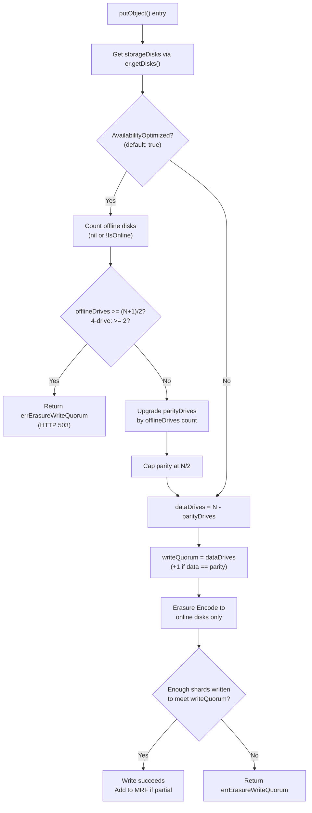
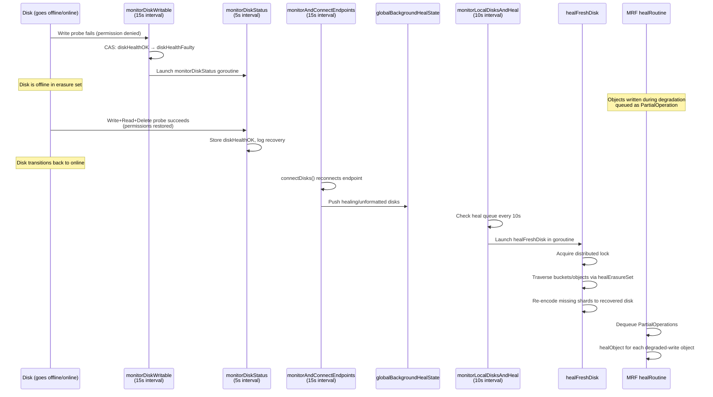

# MinIO Erasure-Coding Fault Tolerance: A Code-Grounded Investigation

## Introduction

This document is a comprehensive, code-grounded investigation into MinIO's runtime fault-tolerance behavior when operating in distributed/erasure-coded mode. The specific scenario under study is:

> **A single MinIO server instance configured with 4 local directories (drives) as an erasure-coded deployment.**

MinIO uses Reed-Solomon erasure coding to split objects into data and parity shards, distributing them across the available drives. This provides fault tolerance — the ability to lose drives and still serve reads and writes — up to a mathematically defined threshold. The foundational concepts are documented in `docs/erasure/README.md`, which describes how MinIO applies the Reed-Solomon algorithm with an N/2 default parity ratio.

All answers in this document are grounded in the MinIO source code from this repository. Where specific behavior is described, the code location is cited in the format `Source: cmd/file.go:LineRange`. No external assumptions are made — the code is the source of truth.

### Questions Investigated

This document answers the following seven investigative questions:

1. **Quorum Threshold Determination** — How does MinIO, running with 4 directories under erasure coding, decide it is healthy? What assumptions does it make about the required number of disks for read and write operations?
2. **Runtime Disk Failure Behavior** — When a directory becomes inaccessible (e.g., via permission change), what happens in that exact moment — does MinIO silently adapt or hard-fail?
3. **Above-Threshold vs. Below-Threshold Scenarios** — What is the observable difference when one disk is lost (still above write quorum) versus when two disks are lost (potentially below write quorum)?
4. **Log Diagnostics** — Do MinIO's logs identify the failing disk by its path? Is there evidence of recovery attempts while the system is live?
5. **Automatic Recovery and Healing** — When a missing directory becomes accessible again, does MinIO detect this on its own through a polling mechanism, or must something external trigger healing? How are objects written during the degraded period repaired?
6. **Code-Grounded Quorum Logic** — Where in the codebase does the quorum decision live? How does MinIO calculate the threshold for proceeding versus refusing operations?
7. **Health Endpoint and Observability** — What can be seen from the health endpoint and actual write attempts while the system is running in a degraded state?

---

## 1. Quorum Threshold Determination

### 1.1 Erasure Set Formation for 4 Drives

When MinIO starts with 4 local directories, it must decide how to group those drives into **erasure sets** — the fundamental unit of data protection. The erasure set selection algorithm is documented in `docs/distributed/DESIGN.md` and uses a GCD-based approach to select set sizes within the supported range of 2–16 drives per set.

For 4 drives on a single server, the calculation is straightforward: 4 drives form **a single erasure set of size 4**. The set is initialized in `newErasureSets()`, which reads the set count and set drive count from the on-disk format structure.

`Source: cmd/erasure-sets.go:351-353`
```go
func newErasureSets(ctx context.Context, endpoints PoolEndpoints, storageDisks []StorageAPI, format *formatErasureV3, defaultParityCount, poolIdx int) (*erasureSets, error) {
    setCount := len(format.Erasure.Sets)
    setDriveCount := len(format.Erasure.Sets[0])
```

For our 4-drive scenario: `setCount = 1`, `setDriveCount = 4`.

### 1.2 Default Parity and Data Block Calculation

The `erasureObjects` struct, defined in `cmd/erasure.go` (lines 47–70), is the core object-layer implementation for a single erasure set. It holds two critical fields:

```go
type erasureObjects struct {
    setDriveCount      int
    defaultParityCount int
    // ...
}
```

`Source: cmd/erasure.go:47-70`

MinIO's default parity follows the **N/2 rule**: for N total drives, the default parity count is N/2. This is documented in `docs/erasure/README.md` and confirmed by the lookup tables in `docs/distributed/SIZING.md`.

For our 4-drive scenario:
- **Default parity blocks** = N/2 = 4/2 = **2**
- **Data blocks** = `setDriveCount - defaultParityCount` = 4 - 2 = **2**

This means each object is split into 2 data shards and 2 parity shards, distributed one per drive.

### 1.3 Read Quorum and Write Quorum Derivation

The quorum thresholds determine how many drives must be online to permit read and write operations. These are computed by two methods on `erasureObjects`.

#### Write Quorum

`Source: cmd/erasure.go:84-91`
```go
// defaultWQuorum write quorum based on setDriveCount and defaultParityCount
func (er erasureObjects) defaultWQuorum() int {
    dataCount := er.setDriveCount - er.defaultParityCount
    if dataCount == er.defaultParityCount {
        return dataCount + 1
    }
    return dataCount
}
```

For our 4-drive scenario:
- `dataCount = 4 - 2 = 2`
- Since `dataCount (2) == defaultParityCount (2)`, the result is `dataCount + 1 = 3`
- **Write quorum = 3**

**Rationale**: When data and parity blocks are equal (which happens at the default N/2 parity), MinIO requires a **strict majority** (`dataCount + 1`) for writes. This prevents a split-brain scenario: if exactly half the drives were sufficient for writes, two disjoint halves of the erasure set could both believe they hold quorum and accept conflicting writes. The `+1` ensures that at most one half can proceed.

#### Read Quorum

`Source: cmd/erasure.go:93-96`
```go
// defaultRQuorum read quorum based on setDriveCount and defaultParityCount
func (er erasureObjects) defaultRQuorum() int {
    return er.setDriveCount - er.defaultParityCount
}
```

For our 4-drive scenario:
- Read quorum = `4 - 2 = 2`
- **Read quorum = 2**

**Rationale**: The read quorum equals the number of data blocks. Reed-Solomon erasure coding can reconstruct the original data from any `dataBlocks` out of `totalBlocks` shards. With 2 data blocks and 2 parity blocks, any 2 of the 4 drives provide enough information to reconstruct the object.

### 1.4 Per-Object Quorum via `objectQuorumFromMeta()`

While the defaults above apply at the erasure-set level, MinIO also computes quorum on a **per-object basis** using the actual parity stored in the object's metadata at write time. This is handled by `objectQuorumFromMeta()`.

`Source: cmd/erasure-metadata.go:531-565`
```go
func objectQuorumFromMeta(ctx context.Context, partsMetaData []FileInfo, errs []error, defaultParityCount int) (objectReadQuorum, objectWriteQuorum int, err error) {
    // ... error reduction checks ...

    parities := listObjectParities(partsMetaData, errs)
    parityBlocks := commonParity(parities, defaultParityCount)
    if parityBlocks < 0 {
        return -1, -1, InsufficientReadQuorum{Err: errErasureReadQuorum, Type: RQInsufficientOnlineDrives}
    }

    dataBlocks := len(partsMetaData) - parityBlocks

    writeQuorum := dataBlocks
    if dataBlocks == parityBlocks {
        writeQuorum++
    }

    return dataBlocks, writeQuorum, nil
}
```

The function:
1. Calls `listObjectParities()` to extract the parity count from each available copy of the object's metadata across all drives
2. Calls `commonParity()` to determine the consensus parity value (falling back to `defaultParityCount` if needed)
3. Computes `dataBlocks = totalDrives - parityBlocks`
4. Applies the same `dataBlocks == parityBlocks → writeQuorum++` rule as the set-level default

For the 4-drive case with default parity, the per-object quorum is identical to the defaults: **readQuorum = 2, writeQuorum = 3**.

### 1.5 Summary Table for 4-Drive Scenario

| Parameter | Value | Derivation |
|---|---|---|
| Total drives | 4 | User configuration |
| Parity blocks | 2 | N/2 default (`defaultParityCount`) |
| Data blocks | 2 | `setDriveCount - defaultParityCount` = 4 - 2 |
| Write quorum | 3 | `dataCount(2) == parityCount(2)` → 2 + 1 |
| Read quorum | 2 | `setDriveCount - defaultParityCount` = 4 - 2 |
| Write tolerance | 1 | `totalDrives - writeQuorum` = 4 - 3 |
| Read tolerance | 2 | `totalDrives - readQuorum` = 4 - 2 |

**Key insight**: With 4 drives at default parity, MinIO can tolerate **1 drive failure for writes** and **2 drive failures for reads**. This asymmetry is fundamental to understanding the behavior described in the following sections.

---

## 2. Runtime Disk Failure Behavior

### 2.1 Permission-Change Error Propagation

When a directory becomes inaccessible via a permission change (e.g., `chmod 000 /data1`), the error propagates through a well-defined chain in the codebase.

**Step 1: OS-level error detection in `xl-storage.go`**

When MinIO attempts any I/O operation on the drive (format check, disk ID verification, data writes, etc.), the underlying OS call returns a permission error. This is caught in `xl-storage.go` during format migration:

`Source: cmd/xl-storage.go:274-277`
```go
formatData, formatFi, err := formatErasureMigrate(s.drivePath)
if err != nil && !errors.Is(err, os.ErrNotExist) {
    if os.IsPermission(err) {
        return s, errDiskAccessDenied
    } else if isSysErrIO(err) {
        return s, errFaultyDisk
    }
```

The `os.IsPermission(err)` check maps the OS-level error to MinIO's internal `errDiskAccessDenied` sentinel.

**Step 2: Error constant definition in `storage-errors.go`**

`Source: cmd/storage-errors.go:67-68`
```go
// errDiskAccessDenied - we don't have write permissions on disk.
var errDiskAccessDenied = StorageErr("drive access denied")
```

**Step 3: Drive state classification via `diskErrToDriveState()`**

When diagnostics or health checks query the drive's state, the error is mapped to a human-readable drive state:

`Source: cmd/erasure.go:98-119`
```go
func diskErrToDriveState(err error) (state string) {
    switch {
    case errors.Is(err, errDiskNotFound) || errors.Is(err, context.DeadlineExceeded):
        state = madmin.DriveStateOffline
    case errors.Is(err, errCorruptedFormat) || errors.Is(err, errCorruptedBackend):
        state = madmin.DriveStateCorrupt
    case errors.Is(err, errUnformattedDisk):
        state = madmin.DriveStateUnformatted
    case errors.Is(err, errDiskAccessDenied):
        state = madmin.DriveStatePermission
    case errors.Is(err, errFaultyDisk):
        state = madmin.DriveStateFaulty
    // ...
    }
    return
}
```

A permission-denied error maps specifically to `madmin.DriveStatePermission` — not a generic "offline" state, but a distinct state that identifies the exact nature of the failure.

### 2.2 Disk Stale Detection and Writability Monitoring

MinIO does not wait passively for I/O operations to fail. It actively monitors each disk's health through a background writability probe.

The `xlStorageDiskIDCheck` struct wraps each physical disk with health monitoring:

`Source: cmd/xl-storage-disk-id-check.go:84-101`
```go
type xlStorageDiskIDCheck struct {
    // ...
    storage      *xlStorage
    health       *diskHealthTracker
    healthCheck  bool
    // ...
}
```

When the health check is enabled, `monitorDiskWritable()` is launched as a goroutine at disk initialization time:

`Source: cmd/xl-storage-disk-id-check.go:198-199`
```go
if xl.healthCheck {
    go xl.monitorDiskWritable(xl.diskCtx)
}
```

The `monitorDiskWritable()` function runs a **write+read+delete probe every 15 seconds**:

`Source: cmd/xl-storage-disk-id-check.go:966-1019`
```go
func (p *xlStorageDiskIDCheck) monitorDiskWritable(ctx context.Context) {
    var (
        checkEvery = 15 * time.Second
        skipIfSuccessBefore = 5 * time.Second
    )
    // ...
    monitor := func() bool {
        // ...
        goOffline := func(err error, spent time.Duration) {
            if p.health.status.CompareAndSwap(diskHealthOK, diskHealthFaulty) {
                storageLogAlwaysIf(ctx, fmt.Errorf("node(%s): taking drive %s offline: %v",
                    globalLocalNodeName, p.storage.String(), err))
                p.health.waiting.Add(1)
                go p.monitorDiskStatus(spent, fn)
            }
        }
        // ... performs WriteAll + ReadAll probe ...
    }
}
```

When the probe fails:
1. `goOffline()` atomically transitions the health status from `diskHealthOK` to `diskHealthFaulty`
2. A log message is emitted identifying the drive by path: `"node(<nodeName>): taking drive <drivePath> offline: <error>"`
3. `monitorDiskStatus()` is launched to periodically re-check the drive for recovery

### 2.3 Immediate Impact on the Erasure Set

When a disk transitions to offline/faulty status, it is **not immediately removed from the erasure set topology**. Instead, it remains in the `erasureDisks` array but is effectively treated as `nil` (unavailable) by operations that iterate the disk slice.

The `putObject()` function in `cmd/erasure-object.go` obtains the disk list via `er.getDisks()` and counts nil/offline disks:

`Source: cmd/erasure-object.go:1281-1302`
```go
storageDisks := er.getDisks()
// ...
for _, disk := range storageDisks {
    if disk == nil || !disk.IsOnline() {
        parityDrives++
        offlineDrives++
        continue
    }
}
```

**Rationale for preserving the slot**: By keeping the disk's position in the array (rather than removing it), MinIO enables transparent recovery — when the disk comes back online, it can be placed right back into its original position without reorganizing the erasure set topology. This is critical for the healing process described in Section 5.

---

## 3. Above-Threshold vs. Below-Threshold Scenarios

### 3.1 Single Disk Loss (Degraded but Operational)

With 1 disk lost, 3 drives remain online. Since `writeQuorum = 3` and `3 >= 3`, **writes succeed**.

The write path in `putObject()` traces through the following logic:

`Source: cmd/erasure-object.go:1291-1326`

1. The code enters the `AvailabilityOptimized()` branch (enabled by default):
   ```go
   if !opts.MaxParity && globalStorageClass.AvailabilityOptimized() {
       parityOrig := parityDrives
       var offlineDrives int
       for _, disk := range storageDisks {
           if disk == nil || !disk.IsOnline() {
               parityDrives++
               offlineDrives++
               continue
           }
       }
   ```

2. With 1 offline disk: `offlineDrives = 1`, `parityDrives` goes from 2 to 3.

3. The early-exit check evaluates: `offlineDrives(1) >= (4+1)/2 = 2` → **false** — so we do NOT return `errErasureWriteQuorum`.

4. The parity cap is applied:
   ```go
   if parityDrives >= len(storageDisks)/2 {
       parityDrives = len(storageDisks) / 2
   }
   ```
   `parityDrives(3) >= 4/2 = 2` → capped back to **2**.

5. Final calculation:
   - `dataDrives = 4 - 2 = 2`
   - `writeQuorum = 2 + 1 = 3` (since `dataDrives == parityDrives`)

6. The object is written with 2 data + 2 parity shards to the 3 available disks. The 4th shard (destined for the offline disk) is skipped. The **missing shard will be healed later** via the MRF subsystem (see Section 5.6).

### 3.2 Availability-Optimized Parity Upgrade Explained

The parity upgrade mechanism in `putObject()` is designed for **larger erasure sets** where it has a meaningful effect. The logic increments `parityDrives` by the number of offline disks, then caps it at `N/2`:

`Source: cmd/erasure-object.go:1291-1317`
```go
if !opts.MaxParity && globalStorageClass.AvailabilityOptimized() {
    parityOrig := parityDrives
    var offlineDrives int
    for _, disk := range storageDisks {
        if disk == nil || !disk.IsOnline() {
            parityDrives++
            offlineDrives++
            continue
        }
    }
    // ...
    if parityDrives >= len(storageDisks)/2 {
        parityDrives = len(storageDisks) / 2
    }
    if parityOrig != parityDrives {
        userDefined[minIOErasureUpgraded] = strconv.Itoa(parityOrig) + "->" + strconv.Itoa(parityDrives)
    }
}
```

**Example with a 16-drive set** (to illustrate the upgrade):
- Default parity = 4, if 2 drives are offline: parity upgrades from 4 to 6
- `dataDrives = 16 - 6 = 10`, `writeQuorum = 10` (since 10 ≠ 6)
- 14 online >= 10 writeQuorum → write succeeds with increased redundancy

**In the 4-drive case**: The upgrade is capped at N/2 = 2, so parity stays at 2 regardless. The mechanism is still evaluated but has no visible effect. If an upgrade did occur, it would be recorded in object metadata as `minIOErasureUpgraded: "2->3"` (though in practice this doesn't happen for the 4-drive case).

### 3.3 Two Disks Lost (Below Write Quorum)

With 2 disks lost, only 2 drives remain online. Since `writeQuorum = 3` and `2 < 3`, **writes FAIL**.

The failure is detected early in `putObject()`:

`Source: cmd/erasure-object.go:1304-1308`
```go
if offlineDrives >= (len(storageDisks)+1)/2 {
    // if offline drives are more than 50% of the drives
    // we have no quorum, we shouldn't proceed just
    // fail at that point.
    return ObjectInfo{}, toObjectErr(errErasureWriteQuorum, bucket, object)
}
```

For 4 drives: `(4+1)/2 = 2`. With 2 offline drives: `2 >= 2` → **immediately returns `errErasureWriteQuorum`**.

`Source: cmd/erasure-errors.go:25-26`
```go
// errErasureWriteQuorum - did not meet write quorum.
var errErasureWriteQuorum = errors.New("Write failed. Insufficient number of drives online")
```

The client receives an **HTTP 503 Service Unavailable** response.

**However, reads still work**: 2 online drives >= readQuorum(2) → reads succeed because Reed-Solomon can reconstruct data from any 2 of 4 shards. The system is in a **read-only degraded state**.

### 3.4 Write-Path Decision Flowchart



> **Note**: The offline-disk counting (node C) and early quorum check (node D) are **nested inside** the `AvailabilityOptimized` branch in the source code (`cmd/erasure-object.go:1291-1318`). When `AvailabilityOptimized` is disabled, the code skips directly to computing `dataDrives` without the early offline-count quorum check or parity upgrade.

---

## 4. Log Diagnostics

### 4.1 Disk Path Identification in Logs

MinIO's logs **do identify the failing disk by its full endpoint path**. There are several log emission points:

**Connection failure logging in `connectDisks()`:**

When `connectDisks()` fails to reconnect to an endpoint, it calls `printEndpointError()`:

`Source: cmd/erasure-sets.go:229-231`
```go
if log {
    printEndpointError(endpoint, err, true)
}
```

The endpoint includes the full disk path (e.g., `/data1`, `/data2`, or `http://host:port/data1` for remote endpoints).

**Drive taken offline logging in `monitorDiskWritable()`:**

When the writability probe fails and the drive transitions to faulty status:

`Source: cmd/xl-storage-disk-id-check.go:1013-1015`
```go
goOffline := func(err error, spent time.Duration) {
    if p.health.status.CompareAndSwap(diskHealthOK, diskHealthFaulty) {
        storageLogAlwaysIf(ctx, fmt.Errorf("node(%s): taking drive %s offline: %v",
            globalLocalNodeName, p.storage.String(), err))
```

This produces a log line like:
```
node(myhost): taking drive /data1 offline: unable to write: drive access denied
```

**Drive recovery logging in `monitorDiskStatus()`:**

When a previously-offline drive passes the recovery probe:

`Source: cmd/xl-storage-disk-id-check.go:955-956`
```go
logger.Event(context.Background(), "healthcheck",
    "node(%s): Read/Write/Delete successful, bringing drive %s online",
    globalLocalNodeName, p.storage.String())
```

This produces:
```
node(myhost): Read/Write/Delete successful, bringing drive /data1 online
```

### 4.2 Health() Quorum Failure Logging

The `Health()` method in `cmd/erasure-server-pool.go` logs detailed quorum failure information per pool and set:

`Source: cmd/erasure-server-pool.go:2791-2803`
```go
healthy := erasureSetUpCount[poolIdx][setIdx].online >= poolWriteQuorums[poolIdx]
if !healthy && !opts.NoLogging {
    storageLogIf(logger.SetReqInfo(ctx, reqInfo),
        fmt.Errorf("Write quorum could not be established on pool: %d, set: %d, expected write quorum: %d, drives-online: %d",
            poolIdx, setIdx, poolWriteQuorums[poolIdx], erasureSetUpCount[poolIdx][setIdx].online), logger.FatalKind)
}
// ...
healthyRead := erasureSetUpCount[poolIdx][setIdx].online >= poolReadQuorums[poolIdx]
if !healthyRead && !opts.NoLogging {
    storageLogIf(logger.SetReqInfo(ctx, reqInfo),
        fmt.Errorf("Read quorum could not be established on pool: %d, set: %d, expected read quorum: %d, drives-online: %d",
            poolIdx, setIdx, poolReadQuorums[poolIdx], erasureSetUpCount[poolIdx][setIdx].online))
}
```

Key observations:
- **Write quorum failures** are logged with `logger.FatalKind` — this marks them as critical severity
- **Read quorum failures** are logged without `FatalKind` — lower severity since reads may still be possible via degraded reconstruction
- Both log lines include **pool index**, **set index**, **expected quorum**, and **actual online drive count**

For our 4-drive scenario with 2 disks offline, the log would contain:
```
Write quorum could not be established on pool: 0, set: 0, expected write quorum: 3, drives-online: 2
```

### 4.3 Healing Progress Logging

The healing subsystem provides detailed progress logging at multiple stages:

**Healing start:**

`Source: cmd/background-newdisks-heal-ops.go:460`
```go
healingLogEvent(ctx, "Healing drive '%s' - 'mc admin heal alias/ --verbose' to check the current status.", endpoint)
```

**Healing completion (success):**

`Source: cmd/background-newdisks-heal-ops.go:520`
```go
healingLogEvent(ctx, "Healing of drive '%s' is finished (healed: %d, skipped: %d).", disk, tracker.ItemsHealed, tracker.ItemsSkipped)
```

**Healing incomplete (retry):**

`Source: cmd/background-newdisks-heal-ops.go:503-504`
```go
healingLogEvent(ctx, "Healing of drive '%s' is incomplete, retrying %s time (healed: %d, skipped: %d, failed: %d).", disk,
    humanize.Ordinal(int(tracker.RetryAttempts)), tracker.ItemsHealed, tracker.ItemsSkipped, tracker.ItemsFailed)
```

These logs clearly identify:
- **Which drive** is being healed (by endpoint path)
- **How many objects** were healed, skipped, and failed
- **Which retry attempt** is being executed

---

## 5. Automatic Recovery and Healing

### 5.1 `monitorAndConnectEndpoints` Polling Loop

MinIO runs a continuous background loop to detect and reconnect disconnected drives. This is the primary mechanism for discovering that a previously-inaccessible drive has become accessible again.

`Source: cmd/erasure-sets.go:283-309`
```go
func (s *erasureSets) monitorAndConnectEndpoints(ctx context.Context, monitorInterval time.Duration) {
    r := rand.New(rand.NewSource(time.Now().UnixNano()))
    time.Sleep(time.Duration(r.Float64() * float64(time.Second)))

    // Pre-emptively connect the disks if possible.
    s.connectDisks(false)

    monitor := time.NewTimer(monitorInterval)
    defer monitor.Stop()

    for {
        select {
        case <-ctx.Done():
            return
        case <-monitor.C:
            s.connectDisks(true)
            monitor.Reset(monitorInterval)
        }
    }
}
```

The polling interval is defined as a constant:

`Source: cmd/erasure-sets.go:346-348`
```go
const defaultMonitorConnectEndpointInterval = defaultMonitorNewDiskInterval + time.Second*5
```

Where `defaultMonitorNewDiskInterval = time.Second * 10` (`Source: cmd/background-newdisks-heal-ops.go:40`).

**Polling interval = 10s + 5s = 15 seconds**. Every 15 seconds, MinIO attempts to reconnect all disconnected endpoints.

### 5.2 `connectDisks()` Reconnection Mechanics

The `connectDisks()` function iterates all endpoints in the erasure set and attempts to reconnect any that are offline:

`Source: cmd/erasure-sets.go:194-278`

For each endpoint:
1. **Check if already online**: If `cdisk != nil && cdisk.IsOnline()`, skip (already connected)
2. **Close previous offline disk**: If an old disk object exists, close it to free resources
3. **Attempt reconnection**: Call `connectEndpoint(endpoint)` to establish a new connection
4. **On success**:
   - Find the disk's position in the set: `findDiskIndex(s.format, format)`
   - Place it back: `s.erasureDisks[setIndex][diskIndex] = disk`
   - If the disk is local and has a healing tracker that isn't finished, push it to the heal queue: `globalBackgroundHealState.pushHealLocalDisks(disk.Endpoint())`
5. **On failure with `errUnformattedDisk`**: Push to the heal queue for format initialization: `globalBackgroundHealState.pushHealLocalDisks(endpoint)`
6. **On other failures**: Log the error via `printEndpointError()`

Key code path for successful reconnection:

```go
disk, format, err := connectEndpoint(endpoint)
// ...
s.erasureDisksMu.Lock()
setIndex, diskIndex, err := findDiskIndex(s.format, format)
// ...
s.erasureDisks[setIndex][diskIndex] = disk
s.erasureDisksMu.Unlock()
```

### 5.3 `monitorDiskWritable` Recovery Polling

Independent of the endpoint reconnection loop, each disk runs its own writability monitoring goroutine:

`Source: cmd/xl-storage-disk-id-check.go:966-1060`

This monitor:
- Runs every **15 seconds** (`checkEvery = 15 * time.Second`)
- Performs a **write+read+delete cycle**: `WriteAll()` → `ReadAll()` → verify content
- Skips the check if the disk had a successful operation within the last 5 seconds
- On failure: transitions the disk to `diskHealthFaulty` and launches `monitorDiskStatus()`

The `monitorDiskStatus()` function then runs a recovery probe every **5 seconds**:

`Source: cmd/xl-storage-disk-id-check.go:930-962`
```go
func (p *xlStorageDiskIDCheck) monitorDiskStatus(spent time.Duration, fn string) {
    t := time.NewTicker(5 * time.Second)
    defer t.Stop()
    for range t.C {
        // ... WriteAll + ReadAll + Delete cycle ...
        if err == nil {
            logger.Event(context.Background(), "healthcheck",
                "node(%s): Read/Write/Delete successful, bringing drive %s online",
                globalLocalNodeName, p.storage.String())
            p.health.status.Store(diskHealthOK)
            p.health.waiting.Add(-1)
            return
        }
    }
}
```

**This is how MinIO automatically detects that a previously-inaccessible drive has become accessible again — NO external trigger is needed.** The recovery is fully autonomous through periodic write/read/delete probing.

### 5.4 `monitorLocalDisksAndHeal` Auto-Heal Trigger

Once a disk is reconnected, it may need healing — the erasure shards that were written while it was offline need to be copied to it. This is handled by the `monitorLocalDisksAndHeal()` background loop:

`Source: cmd/background-newdisks-heal-ops.go:560-609`
```go
func monitorLocalDisksAndHeal(ctx context.Context, z *erasureServerPools) {
    diskCheckTimer := time.NewTimer(defaultMonitorNewDiskInterval)
    defer diskCheckTimer.Stop()

    for {
        select {
        case <-ctx.Done():
            return
        case <-diskCheckTimer.C:
            healDisks := globalBackgroundHealState.getHealLocalDiskEndpoints()
            if len(healDisks) == 0 {
                diskCheckTimer.Reset(defaultMonitorNewDiskInterval)
                continue
            }

            // Reformat disks immediately
            _, err := z.HealFormat(context.Background(), false)
            // ...

            for _, disk := range healDisks {
                go func(disk Endpoint) {
                    globalBackgroundHealState.setDiskHealingStatus(disk, true)
                    if err := healFreshDisk(ctx, z, disk); err != nil {
                        // ...
                        return
                    }
                    globalBackgroundHealState.popHealLocalDisks(disk)
                }(disk)
            }

            diskCheckTimer.Reset(defaultMonitorNewDiskInterval)
        }
    }
}
```

This loop:
- Polls every **10 seconds** (`defaultMonitorNewDiskInterval`)
- Checks `globalBackgroundHealState.getHealLocalDiskEndpoints()` for disks that need healing
- If any are found: first calls `z.HealFormat()` to ensure the disk has a valid format, then launches `healFreshDisk()` in a goroutine for each disk

### 5.5 `healFreshDisk` Full-Set Healing

`healFreshDisk()` performs the actual healing work — traversing all objects in the erasure set and re-encoding the missing shards onto the recovered disk.

`Source: cmd/background-newdisks-heal-ops.go:419-557`

Key steps:
1. **Acquire a distributed lock** per erasure set to prevent parallel healing of the same set:
   ```go
   locker := z.NewNSLock(minioMetaBucket, fmt.Sprintf("new-drive-healing/%d/%d", poolIdx, setIdx))
   ```

2. **Load or initialize a `healingTracker`** to persist progress across server restarts:
   ```go
   tracker, err := loadHealingTracker(ctx, disk)
   if err != nil {
       tracker = initHealingTracker(disk, mustGetUUID())
   }
   ```

3. **Log the start of healing**:
   ```go
   healingLogEvent(ctx, "Healing drive '%s' - 'mc admin heal alias/ --verbose' to check the current status.", endpoint)
   ```

4. **Traverse all buckets and objects** via `healErasureSet()`:
   ```go
   if err = z.serverPools[poolIdx].sets[setIdx].healErasureSet(ctx, tracker.QueuedBuckets, tracker); err != nil {
       return err
   }
   ```

5. **Retry up to 4 times** if items fail to heal:
   ```go
   if tracker.ItemsFailed > 0 && tracker.RetryAttempts < 4 {
       tracker.RetryAttempts++
       // ...
       return errRetryHealing
   }
   ```

6. **On completion**, mark the healing tracker as `Finished` on all disks with the same `HealID`:
   ```go
   if t.HealID == tracker.HealID {
       t.Finished = true
       t.update(ctx)
   }
   ```

### 5.6 MRF-Based Object Repair

The MRF (Most Recently Failed) subsystem is a **complementary healing mechanism** that targets objects written during degraded operation — objects that were successfully written to enough disks for quorum but are missing shards on offline disks.

**The `PartialOperation` struct** represents a single object that needs repair:

`Source: cmd/mrf.go:49-59`
```go
type PartialOperation struct {
    Bucket              string
    Object              string
    VersionID           string
    Versions            []byte
    SetIndex, PoolIndex int
    Queued              time.Time
    BitrotScan          bool
}
```

**Queueing partial operations** — When `putObject()` writes an object with fewer than all disks, it adds an entry to the MRF queue via `addPartialOp()`:

`Source: cmd/mrf.go:78-98`
```go
func (m *mrfState) addPartialOp(op PartialOperation) {
    // ...
    select {
    case m.opCh <- op:
    default:
    }
}
```

The MRF queue has a capacity of **100,000 entries** (`mrfOpsQueueSize = 100000`). If the queue is full, new entries are silently dropped (the `select`/`default` pattern).

**Consuming the queue** — The `healRoutine()` continuously reads from the MRF channel and heals each object:

`Source: cmd/mrf.go:220-283`
```go
func (m *mrfState) healRoutine(z *erasureServerPools) {
    for {
        select {
        case <-GlobalContext.Done():
            return
        case u, ok := <-m.opCh:
            if !ok {
                return
            }
            // ... skip internal metadata objects ...

            // Wait for recently failed networks to reconnect
            if now.Sub(u.Queued) < time.Second {
                time.Sleep(time.Second)
            }

            scan := madmin.HealNormalScan
            if u.BitrotScan {
                scan = madmin.HealDeepScan
            }

            if u.Object == "" {
                healBucket(u.Bucket, scan)
            } else {
                healObject(u.Bucket, u.Object, u.VersionID, scan)
            }
        }
    }
}
```

**Persistence across restarts** — On server shutdown, MRF entries are persisted to disk:

`Source: cmd/mrf.go:102-106`
```go
func (m *mrfState) shutdown() {
    atomic.StoreInt32(&m.closing, 1)
    m.wg.Wait()
    close(m.opCh)
    atomic.StoreInt32(&m.closed, 1)
    // ...persists remaining entries to healMRFDir/list.bin...
}
```

On startup, `startMRFPersistence()` reloads the persisted entries:

`Source: cmd/mrf.go:155-213`
```go
func (m *mrfState) startMRFPersistence() {
    // ...reads from healMRFDir/list.bin on each local drive...
    // ...loads PartialOperation entries back into m.opCh...
}
```

Both routines are launched by `initAutoHeal()`:

`Source: cmd/background-newdisks-heal-ops.go:377-391`
```go
func initAutoHeal(ctx context.Context, objAPI ObjectLayer) {
    z, ok := objAPI.(*erasureServerPools)
    if !ok {
        return
    }
    initBackgroundHealing(ctx, objAPI)
    if env.Get("_MINIO_AUTO_DRIVE_HEALING", config.EnableOn) == config.EnableOn {
        globalBackgroundHealState.pushHealLocalDisks(getLocalDisksToHeal()...)
        go monitorLocalDisksAndHeal(ctx, z)
    }
    go globalMRFState.startMRFPersistence()
    go globalMRFState.healRoutine(z)
}
```

### 5.7 Healing Lifecycle Sequence Diagram



---

## 6. Health Endpoint and Observability

### 6.1 Endpoint Routes and Handlers

MinIO exposes four health check endpoints, registered in `cmd/healthcheck-router.go`:

`Source: cmd/healthcheck-router.go:26-53`

| Route | Handler | Purpose |
|---|---|---|
| `/minio/health/cluster` | `ClusterCheckHandler` | Write-quorum-based cluster health |
| `/minio/health/cluster/read` | `ClusterReadCheckHandler` | Read-quorum-based cluster health |
| `/minio/health/live` | `LivenessCheckHandler` | Kubernetes liveness probe |
| `/minio/health/ready` | `ReadinessCheckHandler` | Kubernetes readiness probe |

Both GET and HEAD methods are registered for each endpoint:
```go
healthRouter.Methods(http.MethodGet).Path(healthCheckClusterPath).HandlerFunc(httpTraceAll(ClusterCheckHandler))
healthRouter.Methods(http.MethodHead).Path(healthCheckClusterPath).HandlerFunc(httpTraceAll(ClusterCheckHandler))
```

### 6.2 `ClusterCheckHandler` and `Health()` Flow

The `ClusterCheckHandler` is the primary endpoint for evaluating cluster write-readiness:

`Source: cmd/healthcheck-handler.go:56-90`
```go
func ClusterCheckHandler(w http.ResponseWriter, r *http.Request) {
    ctx := newContext(r, w, "ClusterCheckHandler")

    objLayer := checkHealth(w)
    if objLayer == nil {
        return
    }

    ctx, cancel := context.WithTimeout(ctx, globalAPIConfig.getClusterDeadline())
    defer cancel()

    opts := HealthOptions{
        Maintenance:    r.Form.Get("maintenance") == "true",
        DeploymentType: r.Form.Get("deployment-type"),
    }
    result := objLayer.Health(ctx, opts)
    w.Header().Set(xhttp.MinIOWriteQuorum, strconv.Itoa(result.WriteQuorum))
    w.Header().Set(xhttp.MinIOStorageClassDefaults, strconv.FormatBool(result.UsingDefaults))
    if result.HealingDrives > 0 {
        w.Header().Set(xhttp.MinIOHealingDrives, strconv.Itoa(result.HealingDrives))
    }
    if !result.Healthy {
        if opts.Maintenance {
            writeResponse(w, http.StatusPreconditionFailed, nil, mimeNone)
        } else {
            writeResponse(w, http.StatusServiceUnavailable, nil, mimeNone)
        }
        return
    }
    writeResponse(w, http.StatusOK, nil, mimeNone)
}
```

The flow:
1. `checkHealth(w)` verifies the object layer, bucket metadata, and IAM are initialized
2. `objLayer.Health(ctx, opts)` evaluates quorum across all pools and sets
3. Response headers are set with quorum and healing information
4. Returns **200 OK** if healthy, **503 Service Unavailable** if not (or 412 Precondition Failed in maintenance mode)

The `Health()` method in `cmd/erasure-server-pool.go` performs the actual evaluation:

`Source: cmd/erasure-server-pool.go:2679-2816`

1. Gathers `StorageInfo` to count online disks per pool and set
2. Computes write quorums per pool using `BackendInfo().StandardSCData` (applying the `+1` when data equals parity)
3. Iterates all pools and sets, comparing `onlineDrives >= writeQuorum` for each
4. Logs quorum failures with pool, set, expected quorum, and actual online count
5. Returns a `HealthResult` with per-set breakdown

### 6.3 `HealthResult` Structure and Response Headers

The `HealthResult` struct returned by `Health()` contains:

| Field | Type | Description |
|---|---|---|
| `Healthy` | `bool` | All pools/sets meet **write** quorum |
| `HealthyRead` | `bool` | All pools/sets meet **read** quorum |
| `WriteQuorum` | `int` | Maximum write quorum across all pools |
| `ReadQuorum` | `int` | Maximum read quorum across all pools |
| `HealingDrives` | `int` | Count of drives currently being healed |
| `UsingDefaults` | `bool` | Whether storage class config is using defaults |
| `ESHealth` | `[]struct{...}` | Per-erasure-set breakdown |

Each entry in `ESHealth` contains:
- `Maintenance` (`bool`) — whether this set is being evaluated in maintenance mode (affects response code: 412 vs 503)
- `PoolID`, `SetID` (`int`) — the pool and set indices
- `Healthy`, `HealthyRead` (`bool`) — per-set health status
- `HealthyDrives`, `HealingDrives` (`int`) — drive counts for this set
- `ReadQuorum`, `WriteQuorum` (`int`) — quorum thresholds for this set

`Source: cmd/erasure-server-pool.go:2770-2789`

**Response headers** set by `ClusterCheckHandler`:

| Header | Value | When Set |
|---|---|---|
| `X-Minio-Write-Quorum` | `result.WriteQuorum` (e.g., "3") | Always |
| `X-Minio-Storage-Class-Defaults` | `"true"` or `"false"` | Always |
| `X-Minio-Healing-Drives` | `result.HealingDrives` (e.g., "1") | Only when > 0 |

`Source: cmd/healthcheck-handler.go:72-77`

For our 4-drive scenario:
- **All drives online**: `GET /minio/health/cluster` → **200 OK**, `X-Minio-Write-Quorum: 3`
- **1 drive offline**: **200 OK** (3 online >= 3 writeQuorum), `X-Minio-Write-Quorum: 3`
- **2 drives offline**: **503 Service Unavailable** (2 online < 3 writeQuorum), `X-Minio-Write-Quorum: 3`
- **During healing**: **200 OK**, `X-Minio-Healing-Drives: 1`

### 6.4 Prometheus Erasure Set Metrics

MinIO exports detailed Prometheus metrics for erasure set health monitoring:

`Source: cmd/metrics-v3-cluster-erasure-set.go:25-71`

| Metric | Labels | Description |
|---|---|---|
| `erasure_set_overall_write_quorum` | — | Overall write quorum across pools and sets |
| `erasure_set_overall_health` | — | Overall health (1=healthy, 0=unhealthy) |
| `erasure_set_read_quorum` | `pool_id`, `set_id` | Read quorum for the erasure set |
| `erasure_set_write_quorum` | `pool_id`, `set_id` | Write quorum for the erasure set |
| `erasure_set_online_drives_count` | `pool_id`, `set_id` | Online drives in the erasure set |
| `erasure_set_healing_drives_count` | `pool_id`, `set_id` | Healing drives in the erasure set |
| `erasure_set_health` | `pool_id`, `set_id` | Health of the erasure set (1/0) |
| `erasure_set_read_tolerance` | `pool_id`, `set_id` | Drive failures tolerable for reads |
| `erasure_set_write_tolerance` | `pool_id`, `set_id` | Drive failures tolerable for writes |
| `erasure_set_read_health` | `pool_id`, `set_id` | Read health of the erasure set (1/0) |
| `erasure_set_write_health` | `pool_id`, `set_id` | Write health of the erasure set (1/0) |

**Per-drive health metrics** from `cmd/metrics-v3-system-drive.go` report individual drive states:
- **0** = offline
- **1** = healthy
- **2** = healing

**Cluster-wide drive counts** from `cmd/metrics-v3-cluster-health.go`:

`Source: cmd/metrics-v3-cluster-health.go:22-34`

| Metric | Description |
|---|---|
| `drives_offline_count` | Count of offline drives in the cluster |
| `drives_online_count` | Count of online drives in the cluster |
| `drives_count` | Total count of all drives in the cluster |

For our 4-drive scenario with 1 drive offline, the Prometheus metrics would report:
```
erasure_set_online_drives_count{pool_id="0", set_id="0"} 3
erasure_set_write_tolerance{pool_id="0", set_id="0"} 0
erasure_set_read_tolerance{pool_id="0", set_id="0"} 1
erasure_set_health{pool_id="0", set_id="0"} 1
drives_offline_count 1
drives_online_count 3
```

---

## 7. Code-Grounded Quorum Logic

### 7.1 Where the Quorum Decision Lives

The following table maps every quorum-related function to its exact location in the codebase:

| Function | File:Line | Purpose |
|---|---|---|
| `defaultWQuorum()` | `cmd/erasure.go:84-91` | Default write quorum for the erasure set |
| `defaultRQuorum()` | `cmd/erasure.go:93-96` | Default read quorum for the erasure set |
| `objectQuorumFromMeta()` | `cmd/erasure-metadata.go:531-565` | Per-object quorum derived from stored metadata |
| `reduceWriteQuorumErrs()` | `cmd/erasure-metadata-utils.go` | Aggregate per-disk errors against write quorum threshold |
| `reduceReadQuorumErrs()` | `cmd/erasure-metadata-utils.go` | Aggregate per-disk errors against read quorum threshold |
| `multiWriter.Write()` | `cmd/erasure-encode.go:34-66` | Quorum enforcement during erasure shard writes |
| `Encode()` | `cmd/erasure-encode.go:69-110` | Erasure-encode data and write with quorum |
| `Health()` | `cmd/erasure-server-pool.go:2679-2816` | Cluster-wide health quorum evaluation |
| `diskErrToDriveState()` | `cmd/erasure.go:98-119` | Map disk errors to drive state classifications |
| `monitorDiskWritable()` | `cmd/xl-storage-disk-id-check.go:966-1072` | Active disk health monitoring with recovery |
| `connectDisks()` | `cmd/erasure-sets.go:194-278` | Reconnect offline disks to the erasure set |
| `healFreshDisk()` | `cmd/background-newdisks-heal-ops.go:419-558` | Full-set healing for a recovered disk |
| `healRoutine()` | `cmd/mrf.go:220-283` | MRF-based repair for degraded-write objects |

### 7.2 Error Constant Reference

The following error constants drive quorum decisions throughout the codebase:

| Constant | File | Definition | Triggered When |
|---|---|---|---|
| `errDiskAccessDenied` | `cmd/storage-errors.go:68` | `"drive access denied"` | `os.IsPermission()` returns true |
| `errDiskNotFound` | `cmd/storage-errors.go` | `"drive not found"` | Drive not available or unreachable |
| `errFaultyDisk` | `cmd/storage-errors.go:65` | `"drive is faulty"` | I/O errors, timeout, write/read probe failure |
| `errUnformattedDisk` | `cmd/storage-errors.go` | `"unformatted drive found"` | No `format.json` on disk |
| `errErasureWriteQuorum` | `cmd/erasure-errors.go:26` | `"Write failed. Insufficient number of drives online"` | Online disks < write quorum |
| `errErasureReadQuorum` | `cmd/erasure-errors.go:23` | `"Read failed. Insufficient number of drives online"` | Online disks < read quorum |

---

## 8. Summary

### Question-Answer Summary Table

| # | Question | Answer | Key Code Reference |
|---|---|---|---|
| 1 | How does MinIO decide health with 4 drives? | Write quorum = 3 (data+1 when data==parity), Read quorum = 2. Health = all sets meet write quorum. | `defaultWQuorum()` in `cmd/erasure.go:84-91` |
| 2 | What happens when a directory loses permissions? | `os.IsPermission()` → `errDiskAccessDenied` → `DriveStatePermission`. Disk marked faulty, logged with path. | `cmd/xl-storage.go:276`, `cmd/erasure.go:106-107` |
| 3 | 1 disk lost vs 2 disks lost? | 1 lost: writes succeed (3 ≥ 3). 2 lost: writes fail with `errErasureWriteQuorum` (2 < 3), reads still work (2 ≥ 2). | `cmd/erasure-object.go:1304-1308` |
| 4 | Do logs identify failing disk by path? | Yes. Logs include `"taking drive <path> offline"`, quorum failure per pool/set, healing progress per drive. | `cmd/xl-storage-disk-id-check.go:1015` |
| 5 | Auto-detection of returning disks? | Yes. `monitorDiskWritable` probes every 15s, `monitorDiskStatus` probes every 5s for recovery. No external trigger needed. | `cmd/xl-storage-disk-id-check.go:966-1072` |
| 6 | How are degraded-write objects repaired? | MRF queue stores `PartialOperation` entries; `healRoutine()` processes them. `healFreshDisk()` handles full-set healing. | `cmd/mrf.go:220-283` |
| 7 | What does the health endpoint show? | `/minio/health/cluster` → 200/503 based on write quorum. Headers: `X-Minio-Write-Quorum`, `X-Minio-Healing-Drives`. | `cmd/healthcheck-handler.go:56-90` |

### Design Philosophy

MinIO's fault-tolerance architecture follows a principle of **layered autonomic recovery**: the system is designed to detect, adapt to, and recover from drive failures entirely on its own, without operator intervention. The quorum arithmetic provides mathematically rigorous boundaries (write quorum = strict majority when data equals parity), the write path adapts gracefully within those boundaries (availability-optimized parity upgrade), and a multi-layered healing system (`monitorDiskWritable` → `monitorDiskStatus` → `connectDisks` → `monitorLocalDisksAndHeal` → `healFreshDisk` + MRF `healRoutine`) ensures that both the infrastructure (drive reconnection) and data (shard reconstruction) are automatically repaired. Every stage of this process is observable through structured logs, health endpoints, and Prometheus metrics, giving operators full visibility without requiring manual recovery actions.
