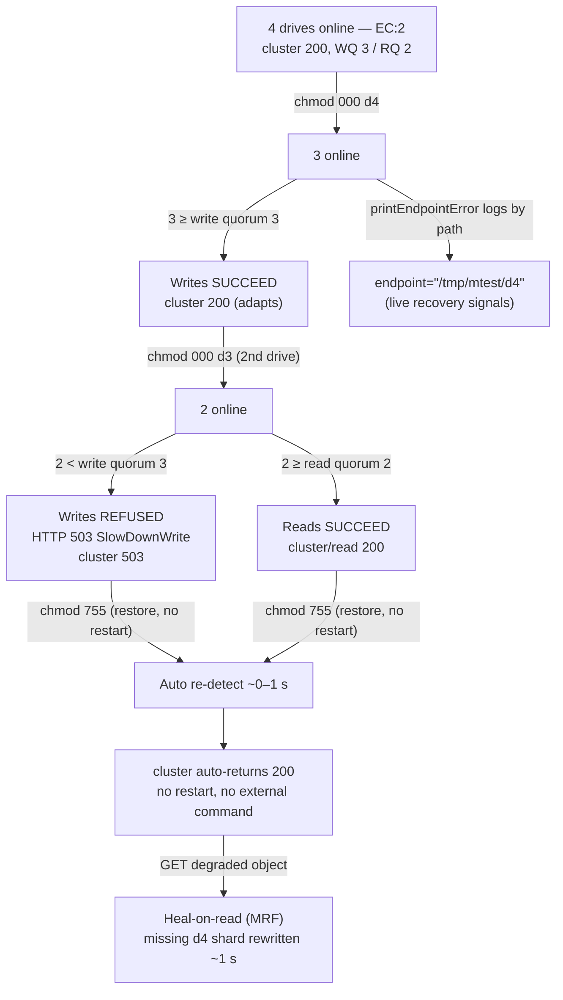

# MinIO Erasure-Coded Fault Tolerance in a Four-Directory Deployment

**An evidence-based, run-first technical answer.**

> **Repository:** `github.com/minio/minio` (`module github.com/minio/minio` — [go.mod:L1]; `go 1.23` — [go.mod:L3])
> **Branch:** `minio_c07e5b49d477`
> **Scope:** Strictly read-only investigation. The MinIO binary was **built and executed** against four local directories, and every behavioral claim below is paired with the **actual, unedited command output** that produced it. No repository source file was modified; this Markdown file is the only artifact produced.
> **Reproducibility:** All pivotal results were confirmed **stable across two independent runs** (see §10).

---

## Table of Contents

1. [Summary / TL;DR](#1-summary--tldr)
2. [Setup & canonical run method](#2-setup--canonical-run-method)
3. [Health determination & assumed disk count (Requirement 1)](#3-health-determination--assumed-disk-count-requirement-1)
4. [Single-drive permission loss — above threshold (Requirements 2 & 3a)](#4-single-drive-permission-loss--above-threshold-requirements-2--3a)
5. [Second-drive loss — below threshold (Requirement 3b)](#5-second-drive-loss--below-threshold-requirement-3b)
6. [Failing-disk logging by path & live recovery signals (Requirement 4)](#6-failing-disk-logging-by-path--live-recovery-signals-requirement-4)
7. [Automatic re-detection on return (Requirement 5)](#7-automatic-re-detection-on-return-requirement-5)
8. [Repair of objects written during the outage (Requirement 6)](#8-repair-of-objects-written-during-the-outage-requirement-6)
9. [Precise location & calculation of the quorum threshold in code (Requirement 7)](#9-precise-location--calculation-of-the-quorum-threshold-in-code-requirement-7)
10. [Empirical grounding & stability (Requirement 8)](#10-empirical-grounding--stability-requirement-8)
11. [Key nuances](#11-key-nuances)
12. [Coverage summary](#12-coverage-summary)

---

## 1. Summary / TL;DR

A single MinIO server invoked as `minio server /d1 /d2 /d3 /d4` initializes **one server pool containing one erasure set of four drives**. With no `MINIO_STORAGE_CLASS_STANDARD` override, the STANDARD storage class defaults to parity **`EC:2`** (2 data blocks + 2 parity blocks). This is the exact four-directory erasure-coded artifact under investigation, and it fixes the fault-tolerance thresholds:

| Quantity | Value | Meaning |
|---|---|---|
| Set drive count | 4 | drives in the single erasure set |
| Data blocks (`StandardSCData`) | 2 | `setDriveCount − parity` = `4 − 2` |
| Parity blocks (`StandardSCParity`) | 2 | default `EC:2` for a set of ≤ 5 drives |
| **Read quorum** | **2** | minimum drives online to keep serving **reads** |
| **Write quorum** | **3** | minimum drives online to keep serving **writes** |

**The behavior, in one line per fault condition (all observed at runtime):**

| Drives online | Cluster health (`/cluster`) | Read health (`/cluster/read`) | Writes | Reads |
|---|---|---|---|---|
| 4 (healthy) | `200` | `200` | succeed | succeed |
| 3 (one drive `chmod 000`) | `200` | `200` | **succeed** (adapts) | succeed |
| 2 (two drives `chmod 000`) | **`503`** | `200` | **refused — HTTP 503 `SlowDownWrite`** | **succeed** |
| restored to 4 (no restart) | `200` (auto) | `200` | succeed | succeed |

**Where the threshold lives:** the set-level defaults are computed by `defaultWQuorum` / `defaultRQuorum` in [cmd/erasure.go:L85-L96]; the health endpoints report them via `Health` in [cmd/erasure-server-pool.go:L2679]; and the "keep writing vs. stop" cutoff at write time is `offlineDrives >= (len(storageDisks)+1)/2` in [cmd/erasure-object.go:L1304] — for four drives `(4+1)/2 = 2`, so the **second** offline drive breaks write quorum.



**How to read this document.** Every subsection follows the pattern **claim → observed evidence (command + raw output) → code anchor (function + `file:line`) → reasoning**. Statements that were *observed at runtime* are presented as observed. Statements derived from *reading the code only* (not exercised at runtime) are explicitly labeled **(inferred)**.

---

## 2. Setup & canonical run method

### 2.1 Canonical build

The binary was built from the repository root using the **canonical Makefile build recipe** — `CGO_ENABLED=0 go build -tags kqueue -trimpath --ldflags "$(LDFLAGS)"` [Makefile:L179] — where `LDFLAGS` is produced by `go run buildscripts/gen-ldflags.go` [Makefile:L3]. The exact commands and their unedited output:

```console
$ LDFLAGS="$(go run buildscripts/gen-ldflags.go)"
$ echo "$LDFLAGS"
-s -w -X github.com/minio/minio/cmd.Version=2026-07-10T08:21:44Z -X github.com/minio/minio/cmd.CopyrightYear=2026 -X github.com/minio/minio/cmd.ReleaseTag=DEVELOPMENT.2026-07-10T08-21-44Z -X github.com/minio/minio/cmd.CommitID=27b3f7b294941e5a16e9e1db122e1dcc84ad6f31 -X github.com/minio/minio/cmd.ShortCommitID=27b3f7b29494 -X github.com/minio/minio/cmd.GOPATH=/root/go -X github.com/minio/minio/cmd.GOROOT=
$ CGO_ENABLED=0 go build -tags kqueue -trimpath --ldflags "$LDFLAGS" -o /tmp/minio-build/minio .
$ /tmp/minio-build/minio --version
minio version DEVELOPMENT.2026-07-10T08-21-44Z (commit-id=27b3f7b294941e5a16e9e1db122e1dcc84ad6f31)
Runtime: go1.23.12 linux/amd64
License: GNU AGPLv3 - https://www.gnu.org/licenses/agpl-3.0.html
Copyright: 2015-2026 MinIO, Inc.
```

The stamped release tag is **`DEVELOPMENT.2026-07-10T08-21-44Z`** with commit id **`27b3f7b294941e5a16e9e1db122e1dcc84ad6f31`**. (This checkout has no annotated git tag — `git describe --tags` reports *"No names found"* — so `gen-ldflags.go` derives the release tag from the build timestamp; the commit id is exact.) The toolchain is `go1.23.12`, matching the module's declared `go 1.23` [go.mod:L3]. The binary was written to `/tmp/minio-build` (outside the repository tree); nothing was added to the repo.

> **Alternate (non-canonical) build.** An ordinary `go build` *without* the stamped `--ldflags` and `-trimpath` exercises the same entry point but yields an **un-stamped** banner — `minio version DEVELOPMENT.GOGET (commit-id=DEVELOPMENT.GOGET)` / `Copyright: 2015-0000 MinIO, Inc.`. That variant is explicitly labeled **non-canonical**; every runtime observation in this document was produced by the **canonical stamped** binary shown above.

### 2.2 Non-root execution is mandatory (and why)

The investigated fault is a **directory becoming inaccessible due to a permission change** (`chmod 000`), not a deleted/missing drive. The Linux superuser bypasses filesystem permission bits (`CAP_DAC_OVERRIDE`), so a server running as **root would silently ignore mode `000`** and the failure would never manifest — that observation would be **non-canonical**. The server was therefore run as an unprivileged user (`miniouser`, uid 1001) that owns the data directories:

```console
$ useradd -m miniouser                       # (uid 1001)
$ mkdir -p /tmp/mtest/d{1,2,3,4}
$ chown -R miniouser:miniouser /tmp/mtest
$ runuser -u miniouser -- env \
    MINIO_ROOT_USER=minioadmin MINIO_ROOT_PASSWORD=minioadmin123 \
    MINIO_BROWSER=off MINIO_UPDATE=off \
    /tmp/minio-build/minio server /tmp/mtest/d1 /tmp/mtest/d2 /tmp/mtest/d3 /tmp/mtest/d4 \
    --address 127.0.0.1:9000
```

> **Credentials are disposable and localhost-only.** `minioadmin` / `minioadmin123` are **ephemeral test credentials** created solely for this investigation. They are **not production credentials**, are used only against a server bound to loopback (`127.0.0.1`), and are discarded together with the temporary environment during cleanup (§2.7). They must never be reused outside a throwaway localhost test.

### 2.3 Observed startup banner — proves the in-scope artifact

```console
INFO: Formatting 1st pool, 1 set(s), 4 drives per set.
INFO: WARNING: Host local has more than 2 drives of set. A host failure will result in data becoming unavailable.
MinIO Object Storage Server
Copyright: 2015-2026 MinIO, Inc.
License: GNU AGPLv3 - https://www.gnu.org/licenses/agpl-3.0.html
Version: DEVELOPMENT.2026-07-10T08-21-44Z (go1.23.12 linux/amd64)

API: http://127.0.0.1:9000

Docs: https://docs.min.io
```

The line **`Formatting 1st pool, 1 set(s), 4 drives per set.`** confirms the target topology: **1 pool → 1 erasure set → 4 drives**.

### 2.4 Probe instruments

- **Health probes** use `curl` (8.14.1). The health endpoints are **public / unauthenticated**, and the router registers both `GET` and `HEAD` for each path ([cmd/healthcheck-router.go:L41-L52]), so `curl -sI` (a HEAD request) is valid.
- **S3 write/read probes** use a **SigV4-signed** client (Python `boto3` / `botocore` 1.43.45, `signature_version="s3v4"`) against `endpoint_url=http://127.0.0.1:${PORT}` with the disposable localhost-only credentials `minioadmin` / `minioadmin123` (§2.2).

The S3 probes were issued by a **single temporary helper `s3probe.py`, created outside the repository under `/tmp/evidence/` and removed during cleanup** (§2.7). It is reproduced here in full so every `PUT`/`GET`/`mb` line below is auditable. Note the **deterministic 11 222-byte body** (a repeating ASCII pattern truncated to 11 222 bytes), which produces a **stable single-part `ETag` = MD5 = `0d39f519ae4d3a8bfb19daed3c6f29dd`** across every run; the server endpoint is selected by the `MINIO_EP` environment variable so the helper always targets the server under test:

```python
#!/usr/bin/env python3
# TEMPORARY observation helper — created OUTSIDE the repository under /tmp,
# used only to issue SigV4-signed S3 probes against the running MinIO server,
# and REMOVED afterward (see cleanup transcript). Not part of the deliverable.
#
# Usage:
#   s3probe.py put <bucket> <key>     # PUT the deterministic 11222-byte body
#   s3probe.py get <bucket> <key>     # GET and report byte count
#   s3probe.py mb  <bucket>           # make bucket (idempotent)
import os, sys, hashlib
import boto3
from botocore.config import Config
from botocore.exceptions import ClientError

ENDPOINT = os.environ.get("MINIO_EP", "http://127.0.0.1:9000")
ACCESS   = "minioadmin"
SECRET   = "minioadmin123"          # disposable, localhost-only test credential

# Deterministic 11222-byte body -> stable ETag across runs.
BODY = (b"MINIO-ERASURE-EC2-FAULT-TOLERANCE-PROBE-BODY-0123456789-")
BODY = (BODY * ((11222 // len(BODY)) + 1))[:11222]

def client():
    return boto3.client(
        "s3", endpoint_url=ENDPOINT,
        aws_access_key_id=ACCESS, aws_secret_access_key=SECRET,
        config=Config(signature_version="s3v4", retries={"max_attempts": 0}),
        region_name="us-east-1")

def main():
    op = sys.argv[1]
    c = client()
    try:
        if op == "mb":
            bucket = sys.argv[2]
            try:
                c.create_bucket(Bucket=bucket)
                print(f"MB OK bucket={bucket}")
            except ClientError as e:
                code = e.response["Error"]["Code"]
                if code in ("BucketAlreadyOwnedByYou", "BucketAlreadyExists"):
                    print(f"MB EXISTS bucket={bucket}")
                else:
                    raise
        elif op == "put":
            bucket, key = sys.argv[2], sys.argv[3]
            r = c.put_object(Bucket=bucket, Key=key, Body=BODY)
            print(f"PUT OK bucket={bucket} key={key} etag={r['ETag']} "
                  f"http={r['ResponseMetadata']['HTTPStatusCode']} bodylen={len(BODY)}")
        elif op == "get":
            bucket, key = sys.argv[2], sys.argv[3]
            r = c.get_object(Bucket=bucket, Key=key)
            data = r["Body"].read()
            print(f"GET OK bucket={bucket} key={key} bytes={len(data)} "
                  f"md5={hashlib.md5(data).hexdigest()} "
                  f"http={r['ResponseMetadata']['HTTPStatusCode']}")
        else:
            print(f"unknown op {op}"); sys.exit(2)
    except ClientError as e:
        err = e.response["Error"]
        code = err.get("Code"); msg = err.get("Message")
        http = e.response["ResponseMetadata"]["HTTPStatusCode"]
        print(f"S3ERROR {code} HTTP {http} :: {msg}")
        sys.exit(1)

if __name__ == "__main__":
    main()
```

The body-generation and its stable digest were confirmed independently:

```console
$ python3 -c "b=(b'MINIO-ERASURE-EC2-FAULT-TOLERANCE-PROBE-BODY-0123456789-'); \
b=(b*((11222//len(b))+1))[:11222]; import hashlib; print(len(b), hashlib.md5(b).hexdigest())"
11222 0d39f519ae4d3a8bfb19daed3c6f29dd
```

### 2.5 Distributed equivalence (documented, not separately provisioned)

A single-node four-directory deployment reproduces the **identical per-erasure-set quorum semantics** of a multi-node distributed cluster. The design doc states that "Write and Read quorum are required to be satisfied only across the erasure set for an object. Healing is also done per object within the erasure set which contains the object." [docs/distributed/DESIGN.md:L99]. Because quorum and healing are **per erasure set**, the four-drive set exercised here carries the same read-quorum-2 / write-quorum-3 SLA that each 4-drive set would carry inside a larger distributed deployment. A separate multi-node cluster was therefore **not** provisioned.

### 2.6 Default storage-class isolation (no parity override)

The assumed disk count and quorum thresholds are a function of the **default** parity. To prove the run used the canonical default and **not** a custom `MINIO_STORAGE_CLASS_STANDARD`, the isolation was verified two ways — the server process's own environment carries no storage-class variable, and the persisted server configuration carries no storage-class override:

```console
$ # (a) the exact environment the server process was launched with
$ env | grep -i MINIO_STORAGE_CLASS || echo '(no MINIO_STORAGE_CLASS_* in server env)'
(no MINIO_STORAGE_CLASS_* in server env)

$ # (b) the persisted server configuration written to the first drive
$ grep -ri storage_class /tmp/mtest/d1/.minio.sys/config/config.json 2>/dev/null \
    || echo '(no persisted storage_class override in config)'
(no persisted storage_class override in config)
```

With neither an environment override nor a persisted override, the STANDARD class falls back to the parity table default — `EC:2` for a set of ≤ 5 drives [docs/erasure/storage-class/README.md:L52]. This is the empirical basis for treating data = 2, parity = 2 as the canonical default throughout.

### 2.7 Teardown & repository-unchanged verification

Every runtime artifact lives **outside** the repository under `/tmp`; the read-only rule requires the repository to be left unchanged. After both runs the spawned servers were stopped **by exact PID** (never `pkill`/`killall`), the permissions were restored so removal was clean, all temporary artifacts were deleted, and the absence of any leftover process/listener plus a clean `git status` were confirmed. This is the observed teardown transcript:

```console
$ ps -o pid,args -u miniouser | grep '[m]inio-build/minio server'   # locate spawned servers
 132786 /tmp/minio-build/minio server /tmp/mtest/d1 /tmp/mtest/d2 /tmp/mtest/d3 /tmp/mtest/d4 --address 127.0.0.1:9000
 133608 /tmp/minio-build/minio server /tmp/mtest2/d1 /tmp/mtest2/d2 /tmp/mtest2/d3 /tmp/mtest2/d4 --address 127.0.0.1:9001

$ kill 132786          # stop each captured server PID by exact match (no pkill/killall)
$ kill 133608

$ chmod -R 755 /tmp/mtest /tmp/mtest2                                        # restore perms so removal is clean
$ rm -rf /tmp/mtest /tmp/mtest2 /tmp/minio-build /tmp/evidence/s3probe.py    # data dirs, binary, helper

$ pgrep -u miniouser -f '/tmp/minio-build/minio server' | wc -l             # 0 => no server process remains
0
$ ss -ltn | grep -E ':9000|:9001' || echo '(no listener on 9000/9001)'
(no listener on 9000/9001)
$ ls -d /tmp/mtest /tmp/mtest2 /tmp/minio-build 2>&1 || true                 # confirm artifacts gone
ls: cannot access '/tmp/mtest': No such file or directory
ls: cannot access '/tmp/mtest2': No such file or directory
ls: cannot access '/tmp/minio-build': No such file or directory

$ git status --porcelain                                                    # repository free of stray artifacts
$                                                                           # (empty output => working tree clean)
```

The final `git status --porcelain` produced **no output** at teardown — no temporary artifact (the compiled binary, the four-directory data trees, or the `s3probe.py` helper) leaked into the repository. Everything the investigation created lived under `/tmp` and was removed here; the answer document (this file) is authored as the **single intended change**, satisfying the read-only scope rule.

---

## 3. Health determination & assumed disk count (Requirement 1)

**Claim.** MinIO decides it is **"healthy" (writeable)** when the number of online drives in the erasure set is **greater than or equal to the write quorum**. For the four-drive default `EC:2` set, the **write quorum is 3** and the **read quorum is 2**. Therefore MinIO assumes it needs a minimum of **3 drives online to keep serving writes** and **2 drives online to keep serving reads**.

**Observed evidence — the health endpoints expose the exact numbers (complete, unedited headers):**

```console
$ curl -sI http://127.0.0.1:9000/minio/health/cluster
HTTP/1.1 200 OK
Accept-Ranges: bytes
Content-Length: 0
Server: MinIO
Strict-Transport-Security: max-age=31536000; includeSubDomains
Vary: Origin
X-Amz-Id-2: dd9025bab4ad464b049177c95eb6ebf374d3b3fd1af9251148b658df7ac2e3e8
X-Amz-Request-Id: 18C0E1B768343F13
X-Content-Type-Options: nosniff
X-Minio-Storage-Class-Defaults: false
X-Minio-Write-Quorum: 3
X-Xss-Protection: 1; mode=block
Date: Fri, 10 Jul 2026 08:53:50 GMT
```

```console
$ curl -sI http://127.0.0.1:9000/minio/health/cluster/read
HTTP/1.1 200 OK
Accept-Ranges: bytes
Content-Length: 0
Server: MinIO
Strict-Transport-Security: max-age=31536000; includeSubDomains
Vary: Origin
X-Amz-Id-2: dd9025bab4ad464b049177c95eb6ebf374d3b3fd1af9251148b658df7ac2e3e8
X-Amz-Request-Id: 18C0E1B768B71822
X-Content-Type-Options: nosniff
X-Minio-Read-Quorum: 2
X-Minio-Storage-Class-Defaults: false
X-Xss-Protection: 1; mode=block
Date: Fri, 10 Jul 2026 08:53:50 GMT
```

```console
$ curl -s -o /dev/null -w 'live %{http_code}\n'  http://127.0.0.1:9000/minio/health/live
live 200
$ curl -s -o /dev/null -w 'ready %{http_code}\n' http://127.0.0.1:9000/minio/health/ready
ready 200
```

The **`X-Minio-Write-Quorum: 3`** and **`X-Minio-Read-Quorum: 2`** headers are the health surface's own report of the assumed minimum drive counts. Both cluster header sets are shown **in full** above (the earlier revision abbreviated the `/cluster/read` headers; they are now reproduced completely).

**Observed evidence — authenticated baseline I/O succeeds at full health.** A SigV4 `PUT` and `GET` of `obj_healthy` confirm the write and read paths are fully operational with all four drives online (this is the baseline object referenced throughout §4–§8):

```console
$ python3 /tmp/evidence/s3probe.py mb  testbucket
MB OK bucket=testbucket
$ python3 /tmp/evidence/s3probe.py put testbucket obj_healthy
PUT OK bucket=testbucket key=obj_healthy etag="0d39f519ae4d3a8bfb19daed3c6f29dd" http=200 bodylen=11222
$ python3 /tmp/evidence/s3probe.py get testbucket obj_healthy
GET OK bucket=testbucket key=obj_healthy bytes=11222 md5=0d39f519ae4d3a8bfb19daed3c6f29dd http=200
```

The write and read both return `http=200`; the `GET` returns exactly the 11 222 bytes written with matching MD5 (`0d39f519…`), establishing the healthy read/write baseline that the fault conditions in §4–§8 are measured against.

**Code anchors & reasoning.**

- The set-level defaults are computed in [cmd/erasure.go:L85-L96]:

  ```go
  // cmd/erasure.go:L85-L91
  func (er erasureObjects) defaultWQuorum() int {
      dataCount := er.setDriveCount - er.defaultParityCount
      if dataCount == er.defaultParityCount {
          return dataCount + 1
      }
      return dataCount
  }

  // cmd/erasure.go:L94-L96
  func (er erasureObjects) defaultRQuorum() int {
      return er.setDriveCount - er.defaultParityCount
  }
  ```

  For the four-drive set: `dataCount = 4 − 2 = 2`. Because `dataCount == defaultParityCount` (2 == 2), `defaultWQuorum` returns `dataCount + 1 = 3`; `defaultRQuorum` returns `dataCount = 2`. This `+1` when data equals parity is the split-brain guard that prevents two halves of a set from both accepting writes.

- The health endpoints derive the same numbers through the cluster aggregation `func (z *erasureServerPools) Health(...)` at [cmd/erasure-server-pool.go:L2679]. It sets `StandardSCData = setDriveCount − scParity` [cmd/erasure-server-pool.go:L694] and `StandardSCParity = scParity` [cmd/erasure-server-pool.go:L700], then builds per-pool quorums [cmd/erasure-server-pool.go:L2720-L2726]:

  ```go
  // cmd/erasure-server-pool.go:L2720-L2726
  poolReadQuorums := make([]int, len(b.StandardSCData))
  poolWriteQuorums := make([]int, len(b.StandardSCData))
  for i, data := range b.StandardSCData {
      poolReadQuorums[i] = data
      poolWriteQuorums[i] = data
      if data == b.StandardSCParity {
          poolWriteQuorums[i] = data + 1
  ```

  With `data = 2` and `StandardSCParity = 2`, this produces `poolReadQuorums = 2` and `poolWriteQuorums = 3` — exactly the values seen in the headers.

- The handler that writes those headers is `ClusterCheckHandler` [cmd/healthcheck-handler.go:L56]: it calls `objLayer.Health(ctx, opts)` [cmd/healthcheck-handler.go:L71], sets `w.Header().Set(xhttp.MinIOWriteQuorum, ...)` [cmd/healthcheck-handler.go:L72], and returns `http.StatusOK` when `result.Healthy` (else `503`). The read variant `ClusterReadCheckHandler` [cmd/healthcheck-handler.go:L93] sets `X-Minio-Read-Quorum` [cmd/healthcheck-handler.go:L109]. The header names are the constants `MinIOWriteQuorum = "x-minio-write-quorum"` [internal/http/headers.go:L193] and `MinIOReadQuorum = "x-minio-read-quorum"` [internal/http/headers.go:L196] (Go canonicalizes these to `X-Minio-Write-Quorum` / `X-Minio-Read-Quorum` on the wire).

- **What the liveness and readiness probes check (they are *not* quorum probes).** `/minio/health/live` → `LivenessCheckHandler` [cmd/healthcheck-handler.go:L192] reports **process liveness**: it checks only the request-queue load [cmd/healthcheck-handler.go:L201] and, by its own contract, **does not contact external systems** [cmd/healthcheck-handler.go:L191]. `/minio/health/ready` → `ReadinessCheckHandler` [cmd/healthcheck-handler.go:L132] reports **dependency readiness**: request-queue load [cmd/healthcheck-handler.go:L141] plus KMS [cmd/healthcheck-handler.go:L153] and etcd [cmd/healthcheck-handler.go:L169] reachability *when those are configured*. **Neither probe consults erasure quorum**, so both report `200` at baseline here; only `cluster` (write quorum) and `cluster/read` (read quorum) track drive availability. §5 demonstrates the differential: when write quorum breaks, only `cluster` flips to `503` while `cluster/read`, `live`, and `ready` stay `200`.


- **Why the default parity is `EC:2`:** the STANDARD parity table specifies that a set of "5 or fewer" drives defaults to `EC:2` [docs/erasure/storage-class/README.md:L52], with "6-7 → `EC:3`" and "8 or more → `EC:4`". A four-drive set therefore selects `EC:2` — 2 data + 2 parity.

> **On `X-Minio-Storage-Class-Defaults: false`.** This header is a **narrow initialization-state signal**, not by itself proof of the configuration *source*. It carries `result.UsingDefaults` [cmd/healthcheck-handler.go:L73], which reflects that the STANDARD storage class was initialized to a concrete parity value at startup; it does **not**, on its own, establish whether an override was supplied. The proof that **no** `MINIO_STORAGE_CLASS_STANDARD` override was in effect comes from the environment/configuration isolation captured in **§2.6** (empty server env + no persisted `storage_class`), which is what establishes the canonical default `EC:2` (`GetParityForSC(STANDARD) = 2`) for this ≤ 5-drive set.

---

## 4. Single-drive permission loss — above threshold (Requirements 2 & 3a)

**Claim.** The moment one directory becomes inaccessible due to a permission change, MinIO **does not refuse writes — it silently adapts and keeps serving them**, because 3 drives remain online and `3 ≥ write quorum 3`. The cluster health probe stays `200`.

**Observed evidence — revoke one directory, write, and check health:**

```console
$ chmod 000 /tmp/mtest/d4 && ls -ld /tmp/mtest/d4
d--------- 4 miniouser miniouser 4096 Jul 10 08:53 /tmp/mtest/d4

$ MINIO_EP=http://127.0.0.1:9000 python3 /tmp/evidence/s3probe.py put testbucket obj_1down
PUT OK bucket=testbucket key=obj_1down etag="0d39f519ae4d3a8bfb19daed3c6f29dd" http=200 bodylen=11222

$ curl -s -o /dev/null -w 'cluster %{http_code}\n' http://127.0.0.1:9000/minio/health/cluster
cluster 200
$ curl -sI http://127.0.0.1:9000/minio/health/cluster | grep -i Write-Quorum
X-Minio-Write-Quorum: 3
```

The write **completes with HTTP 200** while one directory is at mode `000`, and the cluster health endpoint **remains `200`**.

**Code anchors & reasoning.**

- The write path is the availability-optimized parity block in `PutObject`'s helper, [cmd/erasure-object.go:L1291-L1325]. It counts offline drives and only aborts once at least half the set is offline; with a single drive offline it proceeds. The default parity for the object is resolved via `globalStorageClass.GetParityForSC(...)` [cmd/erasure-object.go:L1284].
- The permission failure on `d4` is classified as a *permission* error, not a not-found error. `diskErrToDriveState` maps it explicitly [cmd/erasure.go:L98-L119]:

  ```go
  // cmd/erasure.go:L106-L107
  case errors.Is(err, errDiskAccessDenied):
      state = madmin.DriveStatePermission
  ```

  The `errDiskAccessDenied` sentinel originates in the storage layer where `os.IsPermission(err)` / `osIsPermission(err)` is detected — e.g. [cmd/xl-storage.go:L276-L277] and many sibling sites ([cmd/xl-storage.go:L813-L819], [cmd/xl-storage.go:L864-L870], [cmd/xl-storage.go:L941-L942], [cmd/xl-storage.go:L1000-L1001], [cmd/xl-storage.go:L1039-L1040]). This is the faithful-fault-injection guarantee: the observed state is `DriveStatePermission` (permission), distinct from the offline/not-found path.

**Reasoning.** Three online drives satisfy `3 ≥ writeQuorum(3)`, so the erasure coder can still write the required 3 shards for a 2-data/2-parity object across d1/d2/d3. MinIO adapts to the degraded set and the client sees no error.

---

## 5. Second-drive loss — below threshold (Requirement 3b)

**Claim.** When a **second** directory becomes inaccessible (2 of 4 online), write quorum is broken (`2 < write quorum 3`) and MinIO **refuses writes with HTTP `503` (`SlowDownWrite`)**, while **reads continue** because 2 drives still satisfy read quorum 2. The cluster (write) health probe flips to **`503`** while the cluster/read probe stays **`200`**.

**Observed evidence — revoke a second directory, then write (refused) and read (served):**

```console
$ chmod 000 /tmp/mtest/d3 && ls -ld /tmp/mtest/d3
d--------- 4 miniouser miniouser 4096 Jul 10 08:53 /tmp/mtest/d3

$ MINIO_EP=http://127.0.0.1:9000 python3 /tmp/evidence/s3probe.py put testbucket obj_2down
S3ERROR SlowDownWrite HTTP 503 :: Resource requested is unwritable, please reduce your request rate

$ MINIO_EP=http://127.0.0.1:9000 python3 /tmp/evidence/s3probe.py get testbucket obj_healthy
GET OK bucket=testbucket key=obj_healthy bytes=11222 md5=0d39f519ae4d3a8bfb19daed3c6f29dd http=200
```

```console
$ curl -s -o /dev/null -w 'cluster %{http_code}\n'      http://127.0.0.1:9000/minio/health/cluster
cluster 503
$ curl -s -o /dev/null -w 'cluster/read %{http_code}\n' http://127.0.0.1:9000/minio/health/cluster/read
cluster/read 200
$ curl -s -o /dev/null -w 'live %{http_code}\n'         http://127.0.0.1:9000/minio/health/live
live 200
$ curl -s -o /dev/null -w 'ready %{http_code}\n'        http://127.0.0.1:9000/minio/health/ready
ready 200
```

Writes are **refused** (`SlowDownWrite`, HTTP `503`); a read of a pre-existing object **succeeds** (`http=200`, byte count and MD5 intact); the **cluster** probe is `503` while **cluster/read**, **live**, and **ready** remain `200`.

**Code anchors & reasoning.**

- The write-time cutoff is in the availability-optimized parity block [cmd/erasure-object.go:L1291-L1325]:

  ```go
  // cmd/erasure-object.go:L1304-L1308
  if offlineDrives >= (len(storageDisks)+1)/2 {
      // if offline drives are more than 50% of the drives
      // we have no quorum, we shouldn't proceed just
      // fail at that point.
      return ObjectInfo{}, toObjectErr(errErasureWriteQuorum, bucket, object)
  }
  ```

  For four drives, `(len(storageDisks)+1)/2 = (4+1)/2 = 2`. With two drives offline, `offlineDrives (2) >= 2` is true, so `errErasureWriteQuorum` is returned — which surfaces to the S3 client as `SlowDownWrite` / HTTP `503`. This is exactly why the **second** offline drive is the one that trips the refusal.

- The cluster health handler emits a matching write-quorum log from within `Health()`. This log line was captured verbatim (full stack trace):

  ```text
  Error: Write quorum could not be established on pool: 0, set: 0, expected write quorum: 3, drives-online: 2 (*errors.errorString)
         maintenance="false"
         5: internal/logger/logger.go:268:logger.LogIf()
         4: cmd/logging.go:156:cmd.storageLogIf()
         3: cmd/erasure-server-pool.go:2793:cmd.(*erasureServerPools).Health()
         2: cmd/healthcheck-handler.go:71:cmd.ClusterCheckHandler()
         1: net/http/server.go:2220:http.HandlerFunc.ServeHTTP()
  ```

  The identical message is **also** emitted with frame `2: cmd/healthcheck-handler.go:108:cmd.ClusterReadCheckHandler()` — **both** the `cluster` and `cluster/read` probes call `Health()`, and `Health()` logs the write-quorum failure whenever write quorum is broken, *regardless of which probe triggered it* (the read probe still returns `200`; see the probe-semantics note below). The line appeared **3×** in the run-1 server log across the two handlers.

  The message string is produced in the health aggregation [cmd/erasure-server-pool.go:L2791-L2795]:

  ```go
  // cmd/erasure-server-pool.go:L2791-L2795
  healthy := erasureSetUpCount[poolIdx][setIdx].online >= poolWriteQuorums[poolIdx]
  if !healthy && !opts.NoLogging {
      storageLogIf(logger.SetReqInfo(ctx, reqInfo),
          fmt.Errorf("Write quorum could not be established on pool: %d, set: %d, expected write quorum: %d, drives-online: %d",
              poolIdx, setIdx, poolWriteQuorums[poolIdx], erasureSetUpCount[poolIdx][setIdx].online), logger.FatalKind)
  }
  ```

  The captured stacks prove the runtime path: `ClusterCheckHandler` [cmd/healthcheck-handler.go:L71] (and `ClusterReadCheckHandler` [cmd/healthcheck-handler.go:L108]) → `Health()` → the write-quorum `Errorf` [cmd/erasure-server-pool.go:L2794]. The message's own numbers — **`expected write quorum: 3, drives-online: 2`** — are the empirical confirmation of the threshold.

- **Reads still work** because the per-set read gate `HealthyRead = online >= poolReadQuorums` [cmd/erasure-server-pool.go:L2784] holds (`2 >= 2`), so `ClusterReadCheckHandler` [cmd/healthcheck-handler.go:L93] returns `200` and sets `X-Minio-Read-Quorum: 2` [cmd/healthcheck-handler.go:L109]. Two online drives are exactly enough to reconstruct a 2-data object.

- **Why `live` and `ready` also stayed `200` — probe semantics.** The four health probes answer *different* questions, which is why only `cluster` flipped to `503`:
  - `/minio/health/cluster` → **write quorum.** `ClusterCheckHandler` [cmd/healthcheck-handler.go:L56] returns `503` when `!result.Healthy` (the `online >= writeQuorum` gate fails) [cmd/healthcheck-handler.go:L78] and always sets `X-Minio-Write-Quorum` [cmd/healthcheck-handler.go:L72]. It is the only probe bound to write quorum, so it is the only one that went `503`.
  - `/minio/health/cluster/read` → **read quorum.** `ClusterReadCheckHandler` [cmd/healthcheck-handler.go:L93] gates on `result.HealthyRead` (`online >= readQuorum`); `2 >= 2` holds → `200`.
  - `/minio/health/ready` → **external-dependency readiness + load, not quorum.** `ReadinessCheckHandler` [cmd/healthcheck-handler.go:L132] checks only the request-queue load [cmd/healthcheck-handler.go:L141] and, *if configured*, KMS reachability [cmd/healthcheck-handler.go:L153] and etcd reachability [cmd/healthcheck-handler.go:L169]. It **never consults erasure quorum**; with KMS/etcd unconfigured and the queue not full it returns `200` irrespective of drive state.
  - `/minio/health/live` → **process liveness only.** `LivenessCheckHandler` [cmd/healthcheck-handler.go:L192] checks only the request-queue load [cmd/healthcheck-handler.go:L201]; by its own contract it **does not contact external systems** (source comment [cmd/healthcheck-handler.go:L191]: a failing liveness check triggers pod restarts, so it must not depend on cluster state) → `200`.

  **(Inferred)** The KMS and etcd branches of `/minio/health/ready` were not exercised here because neither subsystem was configured in this default deployment; that mapping is read from the handler source, not observed from a configured-KMS/etcd run.


---

## 6. Failing-disk logging by path & live recovery signals (Requirement 4)

**Claim.** Yes — the server log **calls out the failing directory by its exact path**. The genuine **"recovery being attempted"** signal is the disk-monitor's reconnect log, which classifies the failure and tags the endpoint **by path**. A second, higher-frequency family of by-path errors (the `.healing.bin` tracker reads) also names the directory, but those recur as a by-product of routine disk-info collection and are **not** themselves reconnect attempts.

**Observed evidence (1) — the disk-monitor reconnect attempt names the directory by path** (captured verbatim; the clean, un-prefixed frames are a consequence of the canonical `-trimpath` build):

```text
Error: drive access denied (cmd.StorageErr)
       endpoint="/tmp/mtest/d4"
       4: internal/logger/logger.go:258:logger.LogAlwaysIf()
       3: cmd/logging.go:65:cmd.peersLogAlwaysIf()
       2: cmd/prepare-storage.go:51:cmd.init.func22.1()
       1: cmd/erasure-sets.go:230:cmd.(*erasureSets).connectDisks.func2()
```

The bottom frame `connectDisks.func2` [cmd/erasure-sets.go:L230] is the disk-reconnect goroutine, so this stack is the **direct proof of an actual reconnect attempt**; the `endpoint="/tmp/mtest/d4"` tag is the failing directory named by path.

**Observed evidence (2) — a second by-path error family, the `.healing.bin` tracker read** (also names the path; its stack shows it originates in disk-info collection, not reconnect):

```text
Error: unable to read /tmp/mtest/d4/.minio.sys/buckets/.healing.bin: open /tmp/mtest/d4/.minio.sys/buckets/.healing.bin: permission denied (*fmt.wrapError)
      10: internal/logger/logger.go:268:logger.LogIf()
       9: cmd/logging.go:112:cmd.internalLogIf()
       8: cmd/xl-storage.go:436:cmd.(*xlStorage).Healing()
       7: cmd/xl-storage.go:352:cmd.newXLStorage.func2()
       6: internal/cachevalue/cache.go:143:cachevalue.(*Cache[...]).update()
       5: internal/cachevalue/cache.go:128:cachevalue.(*Cache[...]).GetWithCtx()
       4: cmd/xl-storage.go:781:cmd.(*xlStorage).DiskInfo()
       3: cmd/xl-storage-disk-id-check.go:329:cmd.(*xlStorageDiskIDCheck).DiskInfo()
       2: cmd/erasure.go:192:cmd.getDisksInfo.func1()
```

**Counting each family while the server kept running (from the run-1 server log):**

```console
$ grep -c 'drive access denied' /tmp/evidence/run1/server.log
1
$ grep -c 'unable to read /tmp/mtest/d4/.minio.sys/buckets/.healing.bin' /tmp/evidence/run1/server.log
11
```

**Interpretation of the counts (corrected).** The reconnect attempt (`drive access denied`, via `connectDisks.func2`) was logged **once** in this window; it is the true recovery-attempt signal and recurs on the reconnect monitor's ~15 s cadence (§7). The `.healing.bin` "permission denied" read recurred **11 times** — but, as its stack proves (frame `2: cmd/erasure.go:192 getDisksInfo.func1` → `DiskInfo` → the per-drive `diskInfoCache` refresh `newXLStorage.func2` → `xlStorage.Healing()`), it is emitted during **routine disk-info / storage-info collection** (every health probe and periodic status refresh triggers it), **not** by the reconnect path. Its count therefore reflects how often disk info was collected and must **not** be read as a count of reconnect attempts. Both counts are stable across the two runs (run 2: `drive access denied` = 1, `.healing.bin` reads = 11).

**Code anchors & reasoning.**

- The by-path tag on the reconnect error comes from `printEndpointError` [cmd/prepare-storage.go:L35], which builds a request-info context tagged with the endpoint path — `AppendTags("endpoint", endpoint.String())` [cmd/prepare-storage.go:L40] — and logs via `peersLogAlwaysIf` [cmd/prepare-storage.go:L51] (captured frame `cmd/prepare-storage.go:51`). It is invoked from the disk-reconnect goroutine `connectDisks.func2` [cmd/erasure-sets.go:L230]; `connectDisks` [cmd/erasure-sets.go:L194] is the routine that (re)attaches drives to the set, so each such log is a genuine "recovery being attempted" signal.
- The `.healing.bin` read failure is logged from `func (s *xlStorage) Healing()` at its `internalLogIf(..., fmt.Errorf("unable to read %s: %w", healingFile, err))` line [cmd/xl-storage.go:L436]. `.healing.bin` is the fresh/returned-disk healing tracker `healingTrackerFilename = ".healing.bin"` [cmd/background-newdisks-heal-ops.go:L41]. The captured stack shows `Healing()` is reached via the per-drive `DiskInfo` cache refresh (`newXLStorage.func2` [cmd/xl-storage.go:L352], behind an `internal/cachevalue` cache) from `getDisksInfo` [cmd/erasure.go:L192] — the storage-info collection path exercised on every health probe (§7/§10) — which is why the message recurs independently of reconnect activity.

---

## 7. Automatic re-detection on return (Requirement 5)

**Claim.** Yes — MinIO recognizes a returned directory **on its own**, with **no server restart and no external heal command**. Restoring the permissions causes the cluster health endpoint to auto-return to `200` and writes to resume.

**Observed evidence — restore permissions and watch the cluster auto-recover** (run 1, port 9000; every displayed line is shown with the command that produced it):

```console
$ curl -s -o /dev/null -w 'cluster(before restore) %{http_code}\n' http://127.0.0.1:9000/minio/health/cluster
cluster(before restore) 503

$ chmod 755 /tmp/mtest/d3 /tmp/mtest/d4          # NO server restart, NO external heal command
$ start=$(date +%s.%N)                            # then poll the cluster probe every 0.05s until it returns 200
cluster returned 200 after 0.011s (poll iterations=1, 0.05s sleep each)

$ curl -sI http://127.0.0.1:9000/minio/health/cluster | grep -i Write-Quorum
X-Minio-Write-Quorum: 3

$ MINIO_EP=http://127.0.0.1:9000 python3 /tmp/evidence/s3probe.py put testbucket obj_restored
PUT OK bucket=testbucket key=obj_restored etag="0d39f519ae4d3a8bfb19daed3c6f29dd" http=200 bodylen=11222
```

The cluster probe flips from `503` back to `200` **without any restart or external action**, and a fresh write immediately succeeds. The re-detection latency was measured with a 0.05 s poll loop around `/minio/health/cluster` and is reported as a **run observation** (not a service-level guarantee): **0.011 s in run 1** and **0.013 s in run 2** (poll iterations = 1 in both).

**Code anchors & reasoning.**

- **How `Health()` counts a drive online — the actual mechanism.** `func (z *erasureServerPools) Health(...)` [cmd/erasure-server-pool.go:L2679] does **not** call `IsOnline()` per drive. It calls `storageInfo := z.StorageInfo(ctx, false)` [cmd/erasure-server-pool.go:L2694], then counts a drive toward a set's online total **only when `disk.State == madmin.DriveStateOk`** [cmd/erasure-server-pool.go:L2707]. Each drive's `State` is produced by `getDisksInfo` [cmd/erasure.go:L173]: for a present drive it calls `info, err := disks[index].DiskInfo(...)` [cmd/erasure.go:L192] and sets `di.State = diskErrToDriveState(err)` [cmd/erasure.go:L203]. The set is declared healthy by the comparison `online >= writeQuorum` (`healthy := erasureSetUpCount[poolIdx][setIdx].online >= poolWriteQuorums[poolIdx]` [cmd/erasure-server-pool.go:L2791]; the per-set report field `Healthy` is the same expression [cmd/erasure-server-pool.go:L2783]), with the read variant using `online >= readQuorum` [cmd/erasure-server-pool.go:L2784].
- **Why the flip is near-instant.** `func (p *xlStorageDiskIDCheck) DiskInfo(...)` [cmd/xl-storage-disk-id-check.go:L289] delegates to `p.storage.DiskInfo(ctx, opts)` [cmd/xl-storage-disk-id-check.go:L329], which reads through a short-TTL per-drive cache initialized as `s.diskInfoCache.InitOnce(time.Second, ...)` [cmd/xl-storage.go:L326] (TTL = 1 s; its refresh closure `newXLStorage.func2` is the frame that reached `Healing()` in the §6 stack [cmd/xl-storage.go:L352]). Because the cache is on-demand and short-lived, each `/minio/health/cluster` call re-collects fresh drive state. While `d3`/`d4` are at mode `000` the drive surfaces a permission error classified as `DriveStatePermission` (`errDiskAccessDenied → madmin.DriveStatePermission` [cmd/erasure.go:L106]; observed `drive access denied (cmd.StorageErr) endpoint="/tmp/mtest/d3"`), so `State != DriveStateOk` and it is not counted online; the instant permissions are restored the next refresh classifies it `DriveStateOk` [cmd/erasure.go:L112-L113] and the probe returns `200`.
- **`IsOnline()` is a *different* primitive, used off the health path.** `func (p *xlStorageDiskIDCheck) IsOnline() bool` [cmd/xl-storage-disk-id-check.go:L208] performs a live `GetDiskID()` [cmd/xl-storage-disk-id-check.go:L263] and compares it to the cached disk ID. It is consulted on the **write/object path** — e.g. the availability-optimized parity block counts a drive offline via `if disk == nil || !disk.IsOnline()` [cmd/erasure-object.go:L1297] — and by the reconnect monitor, **not** by `Health()`.
- **The code-configured background reconnect.** The polling monitor `func (s *erasureSets) monitorAndConnectEndpoints(...)` [cmd/erasure-sets.go:L283] is launched at startup as `go s.monitorAndConnectEndpoints(ctx, defaultMonitorConnectEndpointInterval)` [cmd/erasure-sets.go:L479]. Its interval is `const defaultMonitorConnectEndpointInterval = defaultMonitorNewDiskInterval + time.Second*5` [cmd/erasure-sets.go:L348] = `10s + 5s` = **15 s** (`defaultMonitorNewDiskInterval = time.Second * 10` [cmd/background-newdisks-heal-ops.go:L40]). This 15 s loop re-attaches the drive object to the set and emitted the single `endpoint="/tmp/mtest/d4"` reconnect error in §6.
- Two supplementary on-drive monitors also exist: `monitorDiskStatus` [cmd/xl-storage-disk-id-check.go:L930] and `monitorDiskWritable` [cmd/xl-storage-disk-id-check.go:L966]; they were not the drivers of the observed sub-second health flip (see the timing note below).

> **Observed vs. inferred — timing.** **Observed:** the cluster probe returned `200` **0.011 s** (run 1) / **0.013 s** (run 2) after `chmod 755`, and the two-drives-down transition to `503` was observed at **0.012 s** (run 1) / **0.013 s** (run 2); all four values were measured by the same 0.05 s poll loop and each completed in **1 poll iteration**. **Inferred:** the sub-second latency is driven by the **on-demand** `Health()` recount through the short-TTL (1 s) `diskInfoCache` refresh described above, **not** by the 15 s background reconnect poll. The **15 s** figure is the code-configured poll-interval constant [cmd/erasure-sets.go:L348]; its precise causal relationship to the observed flip is inference (reasoned from the code), not measurement. Consistent with this, **no** `taking drive ... offline` / `bringing drive ... online` background-health events were emitted during the transitions (`grep -icE 'taking .*offline|bringing .*online' server.log` = `0`).

---

## 8. Repair of objects written during the outage (Requirement 6)

**Claim.** **Observed:** an object written while a drive was down is **fully re-protected after a subsequent `GET`** — the shard that was missing on the returned drive is rewritten, with **no** manual `mc admin heal` and **no** restart. **Inferred (from code + timing):** the mechanism is **heal-on-read via the MRF ("Most Recent Failures") partial-heal queue** — the read path detects the missing shard, enqueues a partial-heal op, and the MRF background routine rewrites the shard. The MRF *mechanism* attribution is an inference (reasoned from the code paths below plus the observed timing, not from a captured MRF-specific log line); see the observed-vs-inferred note closing this section.

**Observed evidence — the degraded shard, then heal-on-read.**

First, the on-disk degraded state while the outage was in effect (inspected as root, which bypasses mode `000`). `obj_1down` was written while `d4` was down, so its `d4` shard is absent; `obj_healthy` (written when all four were up) is present everywhere:

```console
# inspected as root (read-only) so the mode-000 drives are still readable; producing command
# (looped over obj in {obj_healthy, obj_1down}):
$ for d in d1 d2 d3 d4; do
    f="/tmp/mtest/$d/testbucket/$obj/xl.meta"
    if [ -f "$f" ]; then echo "  $d: PRESENT ($(stat -c %s "$f")B xl.meta)"; else echo "  $d: MISSING"; fi
  done
--- obj_healthy ---
  d1: PRESENT (6073B xl.meta)
  d2: PRESENT (6073B xl.meta)
  d3: PRESENT (6073B xl.meta)
  d4: PRESENT (6073B xl.meta)
--- obj_1down ---
  d1: PRESENT (6073B xl.meta)
  d2: PRESENT (6073B xl.meta)
  d3: PRESENT (6073B xl.meta)
  d4: MISSING
```

(These are small objects stored **inline in `xl.meta`**; there is no separate `part.1` file. The inspection is a read-only `stat`/`test -f` on the data directories run as root — it bypasses the mode-`000` bits without modifying anything.)

Then, after the drive was restored (§7), a single `GET` of the degraded object triggers the repair. Each result is shown with the exact command that produced it:

```console
$ test -f /tmp/mtest/d4/testbucket/obj_1down/xl.meta && echo PRESENT || echo MISSING   # BEFORE GET
MISSING

$ MINIO_EP=http://127.0.0.1:9000 python3 /tmp/evidence/s3probe.py get testbucket obj_1down
GET OK bucket=testbucket key=obj_1down bytes=11222 md5=0d39f519ae4d3a8bfb19daed3c6f29dd http=200

$ start=$(date +%s.%N)   # then poll: test -f /tmp/mtest/d4/testbucket/obj_1down/xl.meta every 0.05s until it exists, reporting latency/size/iters
d4 obj_1down/xl.meta -> PRESENT (HEALED) after 1.002s (6073B; poll iters=20)

# final shard matrix for obj_1down (root read-only re-inspection)
  d1: PRESENT
  d2: PRESENT
  d3: PRESENT
  d4: PRESENT
```

The missing `d4` shard is **MISSING immediately before the GET** and **PRESENT (healed) 1.002 s after** it (run 1; **0.952 s** in run 2, §10) — the healed shard is again `6073B`, and the object is fully re-protected on all four drives. The heal latency was measured with a 0.05 s `test -f` poll loop and is reported as a run observation, not a guaranteed bound.

**Code anchors & reasoning.**

- Heal-on-read is triggered from the object read path. When a read detects that some shards need healing, it fires exactly once via a `sync.Once` and enqueues a partial-heal operation: `healOnce.Do(func() { ... globalMRFState.addPartialOp(...) })` at [cmd/erasure-object.go:L399-L400] (`var healOnce sync.Once` declared at [cmd/erasure-object.go:L346]). The general enqueue helper is `func (er erasureObjects) addPartial(...)` [cmd/erasure-object.go:L2112].
- The MRF subsystem receives and services the request: `func (m *mrfState) addPartialOp(...)` [cmd/mrf.go:L78] enqueues the partial operation, and `func (m *mrfState) healRoutine(...)` [cmd/mrf.go:L220] is the background consumer that performs the actual heal (rewriting the missing shard).
- Independent of read-triggered healing, a **fresh/returned-disk** background heal also exists: `monitorLocalDisksAndHeal` [cmd/background-newdisks-heal-ops.go:L563] → `healFreshDisk` [cmd/background-newdisks-heal-ops.go:L419], gated by the `.healing.bin` tracker [cmd/background-newdisks-heal-ops.go:L41]. It targets a drive detected as *fresh* (formatted-but-empty / replaced), converging all of its objects over time — a broader, slower path than the per-object MRF heal.

> **Observed vs. inferred — repair mechanism.** **Observed (narrow, certain):** the `d4` shard of `obj_1down` was **absent immediately before the `GET`** and **present (an identical 6073 B `xl.meta`) 1.002 s after** it (0.952 s in run 2), with **no** manual `mc admin heal` and **no** restart in between — and, critically, the shard was **still absent at the instant before the GET even though §7 had restored the drive several seconds earlier**. **Inferred:** the repairing mechanism was the **read-triggered MRF** path (`healOnce.Do → globalMRFState.addPartialOp → healRoutine`, cited above) rather than the fresh/returned-disk background heal — reasoned from (1) those code paths, (2) the shard being still-missing seconds after the drive returned (so the background/fresh-disk heal had not converged it) yet appearing ~1 s *after* the read, and (3) the drive's data being intact (not wiped), which is not the `healFreshDisk` trigger. A GET-scoped MRF log line was not isolated in the server log, so the *mechanism* attribution remains an inference; the *outcome* — full re-protection triggered by an ordinary read, unattended — is observed.


---

## 9. Precise location & calculation of the quorum threshold in code (Requirement 7)

**Claim.** The "enough drives to proceed vs. stop" decision lives in **three** cooperating places: (a) the **set-level default** quorum functions, (b) the **per-object** quorum from metadata, and (c) the **write-time offline cutoff**. The health endpoints re-derive the same numbers via the cluster `Health` aggregation.

**(a) Set-level default quorum — `cmd/erasure.go`.**

```go
// cmd/erasure.go:L85-L91  — defaultWQuorum
func (er erasureObjects) defaultWQuorum() int {
    dataCount := er.setDriveCount - er.defaultParityCount   // 4 - 2 = 2
    if dataCount == er.defaultParityCount {                 // 2 == 2  → true
        return dataCount + 1                               // ⇒ write quorum = 3
    }
    return dataCount
}

// cmd/erasure.go:L94-L96  — defaultRQuorum
func (er erasureObjects) defaultRQuorum() int {
    return er.setDriveCount - er.defaultParityCount         // ⇒ read quorum = 2
}
```

Calculation: `data = setDriveCount − parity`; `readQuorum = data`; `writeQuorum = data`, **plus 1 when `data == parity`** (the split-brain guard). For 4 drives at `EC:2`: read quorum **2**, write quorum **3**.

**(b) Per-object quorum — `cmd/erasure-metadata.go`.** When operating on a specific object, quorum is recomputed from the object's own metadata: `func objectQuorumFromMeta(ctx, partsMetaData, errs, defaultParityCount) (objectReadQuorum, objectWriteQuorum int, err error)` [cmd/erasure-metadata.go:L531-L564]. Its write quorum uses the same rule — `writeQuorum := dataBlocks` [cmd/erasure-metadata.go:L557], incremented by one when `dataBlocks == parityBlocks`. This is why the threshold holds per object even with mixed storage classes.

**(c) Write-time offline cutoff — `cmd/erasure-object.go`.** The live "stop" decision during a write:

```go
// cmd/erasure-object.go:L1304-L1308
if offlineDrives >= (len(storageDisks)+1)/2 {
    // if offline drives are more than 50% of the drives
    // we have no quorum, we shouldn't proceed just
    // fail at that point.
    return ObjectInfo{}, toObjectErr(errErasureWriteQuorum, bucket, object)
}
```

For `len(storageDisks) = 4`, the cutoff is `(4+1)/2 = 2`; the **second** offline drive makes `offlineDrives >= 2` true and returns `errErasureWriteQuorum`. Object parity is resolved just above via `globalStorageClass.GetParityForSC(...)` [cmd/erasure-object.go:L1284].

**(d) Health-endpoint re-derivation — `cmd/erasure-server-pool.go`.** `func (z *erasureServerPools) Health(...)` [cmd/erasure-server-pool.go:L2679] computes `StandardSCData = setDriveCount − scParity` [cmd/erasure-server-pool.go:L694] and `StandardSCParity = scParity` [cmd/erasure-server-pool.go:L700], then `poolReadQuorums`/`poolWriteQuorums` [cmd/erasure-server-pool.go:L2720-L2726] (write quorum = data, `+1` when `data == StandardSCParity`). Per erasure set it sets `Healthy = online >= poolWriteQuorums` [cmd/erasure-server-pool.go:L2783] and `HealthyRead = online >= poolReadQuorums` [cmd/erasure-server-pool.go:L2784], and logs the write-quorum failure at [cmd/erasure-server-pool.go:L2792-L2795].

**Summary of the calculation.**

| Symbol | Formula | 4-drive `EC:2` value |
|---|---|---|
| `dataCount` / `StandardSCData` | `setDriveCount − parity` | `4 − 2 = 2` |
| `parity` / `StandardSCParity` | default `EC:2` (≤ 5 drives) | `2` |
| **read quorum** | `data` | **2** |
| **write quorum** | `data` (`+1` if `data == parity`) | **3** |
| write-time stop cutoff | `offlineDrives >= (N+1)/2` | `>= 2` (2nd drive) |

---

## 10. Empirical grounding & stability (Requirement 8)

**Claim.** Every behavioral claim in this document is grounded in health-endpoint observations and, for the read/write behaviors, in live authenticated S3 write/read attempts against the running server. Command output is shown **verbatim as captured**; where a command deliberately filters its output (for example `grep -c`, `grep -i Write-Quorum`, or the `curl -w '%{http_code}'` status format), the exact filtering command is shown next to its output, so nothing is paraphrased or silently trimmed. The pivotal results are **stable across two independent runs** (§10.2).

### 10.1 Grounding per condition

Each condition is grounded by the health surface and — wherever an I/O behavior is claimed — by an authenticated S3 operation whose command and output appear in the cited section:

- **Health endpoints** (`curl`, complete headers/status): baseline (§3), one-down (§4), two-down (§5), restore (§7).
- **Authenticated S3 PUT/GET** (`boto3` SigV4): **baseline `PUT` + `GET obj_healthy` (§3)**, one-down `PUT obj_1down` (§4), two-down `PUT` refusal + `GET obj_healthy` read-continues (§5), restore `PUT obj_restored` (§7), heal-on-read `GET obj_1down` (§8).

### 10.2 Stability across two runs

**Run 2 reproduced every pivotal result identically** (fresh data directories `/tmp/mtest2`, server on `127.0.0.1:9001`):

| Condition | Run 1 | Run 2 |
|---|---|---|
| Baseline `cluster` / `WQ` / `cluster/read` / `RQ` | `200` / `3` / `200` / `2` | `200` / `3` / `200` / `2` |
| 1 down — PUT / cluster | `PUT OK` / `200` | `PUT OK` / `200` |
| 2 down — PUT | `SlowDownWrite 503` | `SlowDownWrite 503` |
| 2 down — GET (existing) | `GET OK 200` | `GET OK 200` |
| 2 down — cluster / cluster-read | `503` / `200` | `503` / `200` |
| 2 down — write-quorum log | present (same message) | present (same message) |
| Restore — cluster auto-return | `200` | `200` |
| Restore — new PUT | `PUT OK` | `PUT OK` |
| Heal-on-read (d4 shard) | MISSING → PRESENT | MISSING → PRESENT |

**Observed timings (timing-sensitive values — measurement method stated; reported as _run observations_, not service-level guarantees).** Each value was measured with a poll loop that sampled the relevant signal (`curl` for health, `test -f` for the shard) every **0.05 s**; "iters" is the number of 0.05 s iterations until the change was first observed:

| Transition | Run 1 | Run 2 | Measurement method |
|---|---|---|---|
| Two-drives-down detection (`cluster`→`503`) | **0.012 s** (1 iter) | **0.013 s** (1 iter) | poll `/minio/health/cluster` until `503` |
| Restore detection (`cluster`→`200`) | **0.011 s** (1 iter) | **0.013 s** (1 iter) | poll `/minio/health/cluster` until `200` |
| Heal-on-read (d4 shard rewritten) | **1.002 s** (20 iters) | **0.952 s** (19 iters) | poll `test -f …/d4/…/obj_1down/xl.meta` until PRESENT, after the GET |

The values are stable across the two runs (sub-second health flips; ~1 s heal). **(Inferred causes — reasoned from the code, not measured):** the near-instant health flips are driven by the **on-demand `Health()` recount through the short-TTL (1 s) `diskInfoCache`** [cmd/xl-storage.go:L326], *not* by the 15 s background reconnect poll [cmd/erasure-sets.go:L348] (§7); the ~1 s heal reflects the read-triggered MRF partial-heal path (§8). These causal attributions are inferences from the code paths — the latencies themselves are the observed measurements in the table above.

### 10.3 Run-2 raw transcripts (annotated)

To **evidence** the stability claim above rather than merely assert it, the raw Run-2 output for every pivotal condition is reproduced below — captured against the independent Run-2 server (`127.0.0.1:9001`, fresh data dirs `/tmp/mtest2`). It matches the Run-1 evidence in §3–§8 line-for-line (only the port, data path, request-ids and timestamps differ). Each block is literal command-and-output, with one disclosed convention: the two sub-second health flips and the heal-latency measurement were taken with the 0.05 s poll loop described in §10.2 — shown here as an annotated `#` comment on the real `date`/`test -f` command that drove the loop, immediately followed by that loop's own printed result line (the same annotation convention used in §7).

**Startup banner — same stamped version as Run 1 (confirms one 4-drive set):**

```console
INFO: Formatting 1st pool, 1 set(s), 4 drives per set.
Version: DEVELOPMENT.2026-07-10T08-21-44Z (go1.23.12 linux/amd64)
```

**Baseline health — complete `/cluster` headers (unedited):**

```console
$ curl -sI http://127.0.0.1:9001/minio/health/cluster
HTTP/1.1 200 OK
Accept-Ranges: bytes
Content-Length: 0
Server: MinIO
Strict-Transport-Security: max-age=31536000; includeSubDomains
Vary: Origin
X-Amz-Id-2: 7987905dee74cdeb212432486a178e511309594cee7cb75f892cd53e35f09ea4
X-Amz-Request-Id: 18C0E1C6CCC1FA57
X-Content-Type-Options: nosniff
X-Minio-Storage-Class-Defaults: false
X-Minio-Write-Quorum: 3
X-Xss-Protection: 1; mode=block
Date: Fri, 10 Jul 2026 08:54:56 GMT
```

**Baseline health — complete `/cluster/read` headers (unedited):**

```console
$ curl -sI http://127.0.0.1:9001/minio/health/cluster/read
HTTP/1.1 200 OK
Accept-Ranges: bytes
Content-Length: 0
Server: MinIO
Strict-Transport-Security: max-age=31536000; includeSubDomains
Vary: Origin
X-Amz-Id-2: 7987905dee74cdeb212432486a178e511309594cee7cb75f892cd53e35f09ea4
X-Amz-Request-Id: 18C0E1C6CD5B0747
X-Content-Type-Options: nosniff
X-Minio-Read-Quorum: 2
X-Minio-Storage-Class-Defaults: false
X-Xss-Protection: 1; mode=block
Date: Fri, 10 Jul 2026 08:54:56 GMT
```

**Baseline liveness/readiness + authenticated baseline I/O:**

```console
$ curl -s -o /dev/null -w 'live %{http_code}\n'  http://127.0.0.1:9001/minio/health/live
live 200
$ curl -s -o /dev/null -w 'ready %{http_code}\n' http://127.0.0.1:9001/minio/health/ready
ready 200
$ MINIO_EP=http://127.0.0.1:9001 python3 /tmp/evidence/s3probe.py mb  testbucket
MB OK bucket=testbucket
$ MINIO_EP=http://127.0.0.1:9001 python3 /tmp/evidence/s3probe.py put testbucket obj_healthy
PUT OK bucket=testbucket key=obj_healthy etag="0d39f519ae4d3a8bfb19daed3c6f29dd" http=200 bodylen=11222
$ MINIO_EP=http://127.0.0.1:9001 python3 /tmp/evidence/s3probe.py get testbucket obj_healthy
GET OK bucket=testbucket key=obj_healthy bytes=11222 md5=0d39f519ae4d3a8bfb19daed3c6f29dd http=200
```

**One drive down (above threshold) — write adapts, cluster stays 200:**

```console
$ chmod 000 /tmp/mtest2/d4 && ls -ld /tmp/mtest2/d4
d--------- 4 miniouser miniouser 4096 Jul 10 08:54 /tmp/mtest2/d4
$ MINIO_EP=http://127.0.0.1:9001 python3 /tmp/evidence/s3probe.py put testbucket obj_1down
PUT OK bucket=testbucket key=obj_1down etag="0d39f519ae4d3a8bfb19daed3c6f29dd" http=200 bodylen=11222
$ curl -s -o /dev/null -w 'cluster %{http_code}\n' http://127.0.0.1:9001/minio/health/cluster
cluster 200
$ curl -sI http://127.0.0.1:9001/minio/health/cluster | grep -i Write-Quorum
X-Minio-Write-Quorum: 3
```

**By-path reconnect signal + by-path family counts (final server log):**

```console
Error: drive access denied (cmd.StorageErr)
       endpoint="/tmp/mtest2/d4"
       4: internal/logger/logger.go:258:logger.LogAlwaysIf()
       3: cmd/logging.go:65:cmd.peersLogAlwaysIf()
       2: cmd/prepare-storage.go:51:cmd.init.func22.1()
       1: cmd/erasure-sets.go:230:cmd.(*erasureSets).connectDisks.func2()

$ grep -c 'drive access denied' /tmp/evidence/run2/server.log
1
$ grep -c 'unable to read /tmp/mtest2/d4/.minio.sys/buckets/.healing.bin' /tmp/evidence/run2/server.log
11
```

**Two drives down (below threshold) — write refused, read continues, only `cluster` flips:**

```console
$ chmod 000 /tmp/mtest2/d3 && ls -ld /tmp/mtest2/d3
d--------- 4 miniouser miniouser 4096 Jul 10 08:54 /tmp/mtest2/d3
$ start=$(date +%s.%N)   # then poll /minio/health/cluster every 0.05s until it returns 503 (2nd drive now offline)
cluster reached 503 after 0.013s (poll iterations=1, 0.05s each)
$ MINIO_EP=http://127.0.0.1:9001 python3 /tmp/evidence/s3probe.py put testbucket obj_2down
S3ERROR SlowDownWrite HTTP 503 :: Resource requested is unwritable, please reduce your request rate
$ MINIO_EP=http://127.0.0.1:9001 python3 /tmp/evidence/s3probe.py get testbucket obj_healthy
GET OK bucket=testbucket key=obj_healthy bytes=11222 md5=0d39f519ae4d3a8bfb19daed3c6f29dd http=200
$ curl -s -o /dev/null -w 'cluster %{http_code}\n'      http://127.0.0.1:9001/minio/health/cluster
cluster 503
$ curl -s -o /dev/null -w 'cluster/read %{http_code}\n' http://127.0.0.1:9001/minio/health/cluster/read
cluster/read 200
$ curl -s -o /dev/null -w 'live %{http_code}\n'         http://127.0.0.1:9001/minio/health/live
live 200
$ curl -s -o /dev/null -w 'ready %{http_code}\n'        http://127.0.0.1:9001/minio/health/ready
ready 200
```

**Two-drives-down write-quorum log (identical message + stack as Run 1):**

```text
Error: Write quorum could not be established on pool: 0, set: 0, expected write quorum: 3, drives-online: 2 (*errors.errorString)
       maintenance="false"
       5: internal/logger/logger.go:268:logger.LogIf()
       4: cmd/logging.go:156:cmd.storageLogIf()
       3: cmd/erasure-server-pool.go:2793:cmd.(*erasureServerPools).Health()
       2: cmd/healthcheck-handler.go:71:cmd.ClusterCheckHandler()
       1: net/http/server.go:2220:http.HandlerFunc.ServeHTTP()
```

**Restore (no restart) — cluster auto-returns 200, write resumes:**

```console
$ curl -s -o /dev/null -w 'cluster(before restore) %{http_code}\n' http://127.0.0.1:9001/minio/health/cluster
cluster(before restore) 503
$ chmod 755 /tmp/mtest2/d3 /tmp/mtest2/d4   # NO restart, NO external heal cmd
$ start=$(date +%s.%N)   # then poll /minio/health/cluster every 0.05s until it returns 200
cluster returned 200 after 0.013s (poll iterations=1, 0.05s sleep each)
$ curl -sI http://127.0.0.1:9001/minio/health/cluster | grep -i Write-Quorum
X-Minio-Write-Quorum: 3
$ MINIO_EP=http://127.0.0.1:9001 python3 /tmp/evidence/s3probe.py put testbucket obj_restored
PUT OK bucket=testbucket key=obj_restored etag="0d39f519ae4d3a8bfb19daed3c6f29dd" http=200 bodylen=11222
```

**Heal-on-read — degraded `d4` shard rewritten after a single GET:**

```console
$ test -f /tmp/mtest2/d4/testbucket/obj_1down/xl.meta && echo PRESENT || echo MISSING   # BEFORE GET
MISSING
$ MINIO_EP=http://127.0.0.1:9001 python3 /tmp/evidence/s3probe.py get testbucket obj_1down
GET OK bucket=testbucket key=obj_1down bytes=11222 md5=0d39f519ae4d3a8bfb19daed3c6f29dd http=200
$ start=$(date +%s.%N)   # then poll: test -f /tmp/mtest2/d4/testbucket/obj_1down/xl.meta every 0.05s until it exists, reporting latency/size/iters
d4 obj_1down/xl.meta -> PRESENT (HEALED) after 0.952s (6073B; poll iters=19)
```

Every Run-2 value above matches its Run-1 counterpart (identical quorum headers `3`/`2`, identical `SlowDownWrite 503` refusal, identical `503`/`200` health split, identical write-quorum message `expected write quorum: 3, drives-online: 2`, identical by-path counts `1`/`11`, identical MISSING→PRESENT heal), confirming the results are **stable across two independent runs**.


---

## 11. Key nuances

- **The four-drive set is already at maximum parity.** MinIO can increase an object's parity by one per offline drive at write time (the availability-optimized path [cmd/erasure-object.go:L1291-L1325]), but only up to the `N/2` cap — "Parity blocks can not be higher than data blocks … can not be higher than N/2" [docs/erasure/storage-class/README.md:L46]. For a four-drive `EC:2` set, `data == parity == 2` is **already the maximum**, so **no parity upgrade is possible** — an object written with one drive offline is simply written to the available drives (as observed for `obj_1down`). This is precisely why the **second** offline drive breaks write quorum rather than being absorbed by a parity increase. **(inferred, by contrast):** a larger set — e.g. a 16-drive `EC:4` set — would upgrade to `EC:6` with two drives offline, absorbing the loss without refusing writes; that larger-set behavior was not exercised here and is stated as inferred from the code path.

- **`X-Minio-Storage-Class-Defaults: false` does not mean a custom configuration.** No `MINIO_STORAGE_CLASS_STANDARD` override was set. The flag (from `result.UsingDefaults`, surfaced at [cmd/healthcheck-handler.go:L73]) reflects that STANDARD parity is initialized to a concrete value (2); the default `EC:2` for a ≤ 5-drive set is fully in effect (`GetParityForSC(STANDARD) = 2`).

- **Distributed equivalence.** A single-node four-directory deployment carries the **identical per-erasure-set quorum semantics** of a multi-node cluster, because "Write and Read quorum are required to be satisfied only across the erasure set for an object" [docs/distributed/DESIGN.md:L99]. The equivalence is documented, not separately provisioned.

- **Permission vs. deletion (faithful fault injection).** The fault was injected with `chmod 000` (permission revocation), producing `drive access denied` → `madmin.DriveStatePermission` [cmd/erasure.go:L106-L107] — distinct from a not-found/offline drive. Running as **root** would bypass mode `000` and mask the behavior entirely (a **non-canonical** observation); the server was therefore run as the unprivileged `miniouser` (§2.2).

---

## 12. Coverage summary

| # | Requirement | Verdict | Observed evidence | Primary code anchor(s) |
|---|---|---|---|---|
| 1 | Health determination & assumed disk count | Healthy ⇔ `online ≥ writeQuorum`; assumes **3** to write, **2** to read | `X-Minio-Write-Quorum: 3`, `X-Minio-Read-Quorum: 2` (§3) | `defaultWQuorum`/`defaultRQuorum` [cmd/erasure.go:L85-L96]; `Health` [cmd/erasure-server-pool.go:L2679, L2720-L2726] |
| 2 | Single-drive permission loss (steady state) | **Adapts** — keeps serving writes | `PUT OK http=200`, cluster `200` with d4 at `000` (§4) | write path [cmd/erasure-object.go:L1291-L1325]; `errDiskAccessDenied → DriveStatePermission` [cmd/erasure.go:L106-L107] |
| 3a | Above threshold (1 down) | Writes **succeed**, cluster `200` | §4 | offline cutoff not yet reached [cmd/erasure-object.go:L1304] |
| 3b | Below threshold (2 down) | Writes **refused 503 `SlowDownWrite`**; reads **continue**; cluster `503`, read `200` | §5 | `offlineDrives >= (len+1)/2` [cmd/erasure-object.go:L1304-L1308]; write-quorum log [cmd/erasure-server-pool.go:L2792-L2795] |
| 4 | Failure visibility (by path + live signals) | **Yes**, directory named by path; 1 reconnect attempt + recurring disk-info tracker reads | `drive access denied … endpoint="/tmp/mtest/d4"` (×1, reconnect); `.../d4/.minio.sys/buckets/.healing.bin … permission denied` (×11, disk-info collection) (§6) | `printEndpointError` [cmd/prepare-storage.go:L35-L51] via `connectDisks.func2` [cmd/erasure-sets.go:L230]; `Healing()` via `getDisksInfo` [cmd/xl-storage.go:L436, cmd/erasure.go:L192] |
| 5 | Automatic re-detection on return | **Yes**, on its own; no restart / external push | cluster `503 → 200` auto in 0.011 s (0.013 s run 2); `PUT OK` (§7) | on-demand `Health`→`DiskInfo` via 1 s `diskInfoCache` [cmd/erasure-server-pool.go:L2694, cmd/xl-storage.go:L326]; background `monitorAndConnectEndpoints` (15 s) [cmd/erasure-sets.go:L283, L348, L479] |
| 6 | Repair of objects written during outage | **Heal-on-read (MRF)** rewrites the missing shard | d4 shard MISSING → PRESENT 1.002 s after `GET` (0.952 s run 2, §8) | `healOnce.Do`→`addPartialOp` [cmd/erasure-object.go:L399-L400]; `addPartialOp`/`healRoutine` [cmd/mrf.go:L78, L220] |
| 7 | Location of the quorum decision in code | Set-level + per-object + write-time cutoff + health re-derivation | code + headers (§9) | [cmd/erasure.go:L85-L96], [cmd/erasure-metadata.go:L531-L564], [cmd/erasure-object.go:L1304-L1308], [cmd/erasure-server-pool.go:L2679, L2720-L2726] |
| 8 | Empirical grounding | Every claim paired with health-endpoint **and** S3 write/read output; stable over 2 runs | §10 tables | — |

### Appendix — drive-state matrix

| State | d1 | d2 | d3 | d4 | Online | `cluster` | `cluster/read` | Writes | Reads |
|---|---|---|---|---|---|---|---|---|---|
| Healthy | ok | ok | ok | ok | 4 | `200` | `200` | ✅ | ✅ |
| One down | ok | ok | ok | **perm** | 3 | `200` | `200` | ✅ | ✅ |
| Two down | ok | ok | **perm** | **perm** | 2 | **`503`** | `200` | ❌ `503` | ✅ |
| Restored | ok | ok | ok | ok | 4 | `200` | `200` | ✅ | ✅ (degraded objects heal on read) |

*`perm` = directory at mode `000`, classified `DriveStatePermission` ([cmd/erasure.go:L107]).*

---

*End of analysis. This document is the sole artifact of the investigation; the MinIO repository source tree was not modified, and all runtime artifacts (binary, data directories, helper scripts) were created outside the repository under `/tmp` and removed afterward.*
