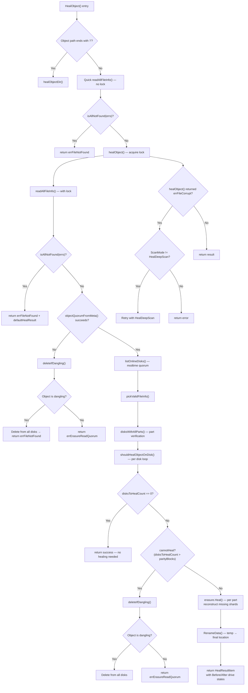
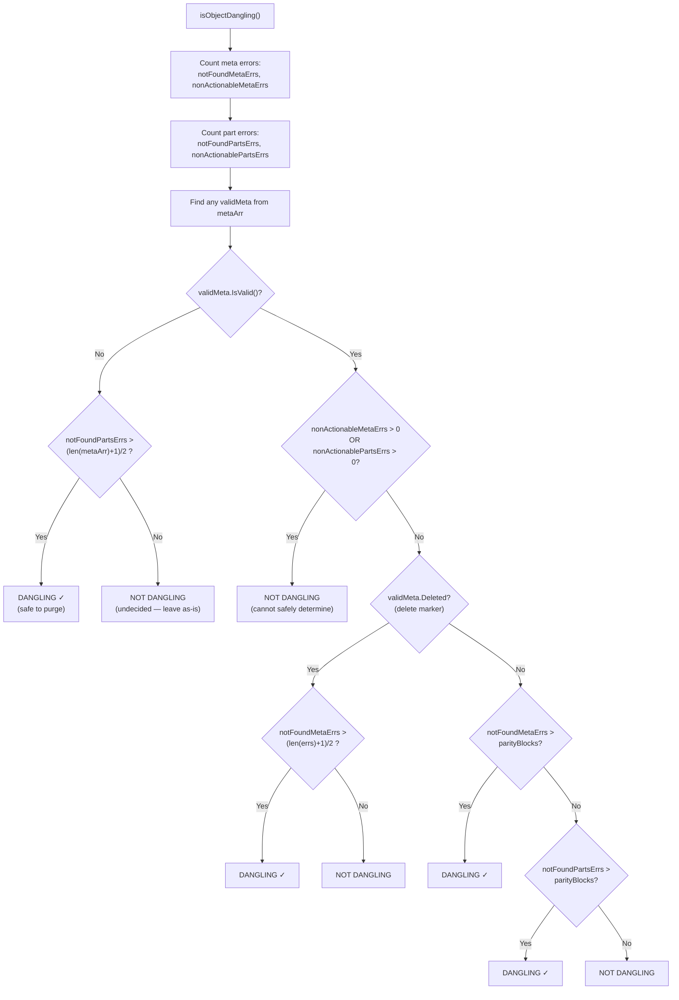
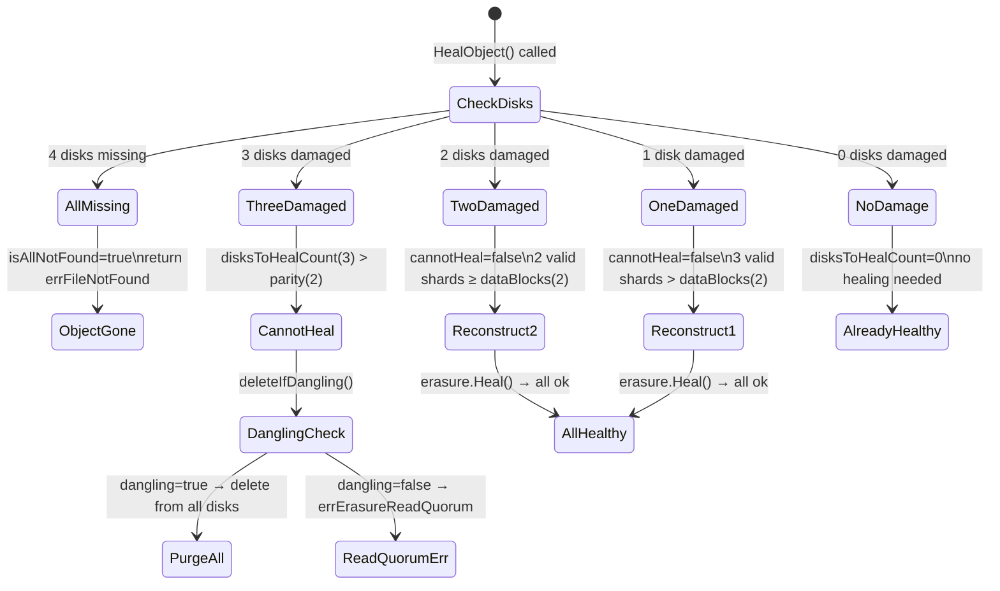

# MinIO Erasure-Coded Healing: Decision Logic Deep-Dive

## Introduction and Scope

This document is a technical investigation guide that traces exactly how MinIO's healing process makes decisions when cluster state is ambiguous in a 4-disk erasure-coded instance. Every claim in this document cites specific source code file paths and line numbers from the MinIO repository — no assumptions are made; the code is the single source of truth.

**Document scope:**

- **Setup**: Single-instance MinIO with 4 disks, default EC:2 configuration (2 data shards + 2 parity shards)
- **Focus**: Object-level healing decision logic — how MinIO decides whether to restore, delete, or leave an object alone when disks hold a mixture of valid data, corrupted data, and missing data
- **Audience**: Engineers onboarding to the MinIO codebase who need to understand healing internals

For background on erasure code fundamentals (Reed-Solomon, N/2 default parity, bitrot protection), see `docs/erasure/README.md`.

---

## 1. Erasure Coding Fundamentals for a 4-Disk Setup

### 1.1 Data/Parity Layout

MinIO divides the drives you provide into erasure-coding sets of 2 to 16 drives. Each object is written to a single erasure-coding set.

> *Source: `docs/erasure/README.md:27`*

For a 4-disk setup with default configuration:

| Component | Count | Description |
|-----------|-------|-------------|
| **Data shards** | 2 | Contain the actual object data, split across 2 disks |
| **Parity shards** | 2 | Contain Reed-Solomon parity, one per remaining disk |
| **Total disks** | 4 | Each disk holds exactly one shard (data or parity) |

Each object is split into 2 data shards and 2 parity shards — one shard per disk. This is the smallest erasure set MinIO supports and has the tightest quorum margins.

### 1.2 Quorum Arithmetic

Two quorum values govern all healing decisions:

**Read Quorum (`defaultRQuorum`)** — minimum disks needed to read/reconstruct data:

```go
func (er erasureObjects) defaultRQuorum() int {
    return er.setDriveCount - er.defaultParityCount
}
```

> *Source: `cmd/erasure.go:94-96`*

For 4 disks, EC:2: `readQuorum = 4 - 2 = 2`

**Write Quorum (`defaultWQuorum`)** — minimum disks needed to write:

```go
func (er erasureObjects) defaultWQuorum() int {
    dataCount := er.setDriveCount - er.defaultParityCount
    if dataCount == er.defaultParityCount {
        return dataCount + 1
    }
    return dataCount
}
```

> *Source: `cmd/erasure.go:85-91`*

For 4 disks, EC:2: since `dataCount (2) == parityCount (2)`, `writeQuorum = 2 + 1 = 3`

**Why write quorum is higher when data equals parity:** When the data block count equals the parity block count, a simple majority is required to prevent split-brain scenarios. The `+1` ensures that at least a strict majority of disks must successfully write for the operation to succeed.

**Per-Object Quorum (`objectQuorumFromMeta`)** — derives quorum from actual object metadata:

```go
func objectQuorumFromMeta(ctx context.Context, partsMetaData []FileInfo, errs []error,
    defaultParityCount int) (objectReadQuorum, objectWriteQuorum int, err error) {
    expectedRQuorum := len(partsMetaData) / 2
    // ...
    parityBlocks := commonParity(parities, defaultParityCount)
    dataBlocks := len(partsMetaData) - parityBlocks
    writeQuorum := dataBlocks
    if dataBlocks == parityBlocks {
        writeQuorum++
    }
    return dataBlocks, writeQuorum, nil
}
```

> *Source: `cmd/erasure-metadata.go:531-564`*

This function calls `commonParity()` to find consensus parity across disk metadata, then derives `dataBlocks = len(partsMetaData) - parityBlocks`. The function requires at least `expectedRQuorum = len(partsMetaData) / 2` valid metadata entries (i.e., 2 out of 4 disks) to succeed.

**Summary Table for a 4-Disk EC:2 Setup:**

| Parameter | Value | Formula |
|-----------|-------|---------|
| Set Drive Count | 4 | — |
| Default Parity Count | 2 | N/2 |
| Data Blocks | 2 | 4 - 2 |
| Read Quorum | 2 | setDriveCount - parityCount |
| Write Quorum | 3 | dataCount + 1 (since data == parity) |

### 1.3 The 5 Disk States

The healing subsystem classifies each disk into one of five states. These are documented in source comments:

> *Source: `cmd/erasure-healing-common.go:195-213`*

| # | State | Condition | Identified By |
|---|-------|-----------|---------------|
| 1 | **online** | Has the latest copy of `xl.meta` | `listOnlineDisks()` |
| 2 | **offline** | `err == errDiskNotFound` | Error check |
| 3 | **availableWithParts** | Has latest `xl.meta` AND all parts with matching checksums | `disksWithAllParts()` |
| 4 | **outdated** | Has old `xl.meta`, missing `xl.meta` (`errFileNotFound`), or latest `xl.meta` but one or more parts are corrupt | `outDatedDisk` logic |
| 5 | **missingParts** | Has latest `xl.meta` but some parts missing (may need manual inspection, e.g., backend filesystem corruption) | Part verification |

**Rationale:** This 5-state model allows the healing engine to make precise decisions about each disk. A disk that is "online" (has current metadata) but has "missingParts" is treated differently from a disk that is "outdated" (has stale metadata) — the former may indicate filesystem corruption requiring investigation, while the latter is a routine healing target.

---

## 2. Healing Decision Tree

### 2.1 Entry Point — `HealObject()`

> *Source: `cmd/erasure-healing.go:1039-1087`*

`HealObject()` is the public entry point for healing a single object. It performs four steps:

**Step 1 — Directory check:** If the object path ends with `/`, delegate to `healObjectDir()` for directory-specific healing (line 1052).

**Step 2 — Quick pre-lock read:** Calls `readAllFileInfo()` without acquiring a lock. If `isAllNotFound(errs)` returns true — meaning every disk reports `errFileNotFound`, `errFileVersionNotFound`, or `errVolumeNotFound` — the object simply does not exist, and healing returns `errFileNotFound` immediately (lines 1067-1076). This avoids expensive lock acquisition for non-existent objects.

**Step 3 — Core healing:** Calls `healObject()` for the actual healing logic (line 1079).

**Step 4 — Bitrot escalation:** If `healObject()` returns `errFileCorrupt` and the current scan mode is NOT `HealDeepScan`, MinIO automatically retries with `HealDeepScan` (lines 1080-1084):

```go
if errors.Is(err, errFileCorrupt) && opts.ScanMode != madmin.HealDeepScan {
    opts.ScanMode = madmin.HealDeepScan
    hr, err = er.healObject(healCtx, bucket, object, versionID, opts)
}
```

This implicit escalation means callers never need to explicitly request deep scan — MinIO transparently upgrades when corruption is detected.

### 2.2 Core Healing — `healObject()`

> *Source: `cmd/erasure-healing.go:258-656`*

This is the core decision engine. The function flows through a series of decision gates:

**Setup phase (lines 265-283):**
- Deferred `auditHealObject()` publishes audit events when audit targets exist
- Deferred `healTrace()` publishes trace records when trace subscribers exist
- Initializes `HealResultItem` with object identity and disk count

**Lock acquisition (lines 285-293):** Acquires a namespace lock unless `opts.NoLock` is set.

**Metadata collection (line 296):** `readAllFileInfo()` gathers `xl.meta` from all disks, producing `partsMetadata` (array of `FileInfo`) and `errs` (array of errors).

#### Decision Gate 1 — `isAllNotFound`

> *Source: `cmd/erasure-healing.go:297-305`*

```
If all disks return not-found errors → return errFileNotFound with default heal result
```

**Rationale:** If no disk has any trace of the object (no metadata, no data), the object simply does not exist. There is nothing to heal, and nothing to delete. This is the fast-exit path.

#### Decision Gate 2 — `objectQuorumFromMeta`

> *Source: `cmd/erasure-healing.go:307-324`*

```
If quorum cannot be derived from metadata → call deleteIfDangling() to check if object is dangling
```

`objectQuorumFromMeta()` attempts to establish read/write quorum from the collected metadata. It requires at least `len(partsMetaData)/2 = 2` valid metadata entries. If this fails (fewer than 2 valid `xl.meta` files), the system cannot confidently determine the object's intended state. It then calls `deleteIfDangling()` — which either deletes a confirmed dangling object or returns `errErasureReadQuorum`.

**Disk selection — `listOnlineDisks()` (line 331):**

> *Source: `cmd/erasure-healing-common.go:219-254`*

Selects disks with the latest `xl.meta` by finding the most common modification time (`commonTime()`) that occurs at least `readQuorum` times. If modtime is zero (legacy objects), falls back to `commonETag()`. Disks without matching modtime or etag are set to `nil` (considered offline for this operation).

**Metadata selection — `pickValidFileInfo()` (line 335):** Selects the authoritative metadata reference — the `FileInfo` that represents the "correct" state of the object.

**Part verification — `disksWithAllParts()` (line 352):**

> *Source: `cmd/erasure-healing-common.go:291-458`*

For each online disk, verifies that all parts exist with correct checksums. Returns:
- `availableDisks`: disks with valid metadata AND all parts intact
- `dataErrsByDisk`: per-disk part error status
- `dataErrsByPart`: per-part error status across all disks

In `HealDeepScan` mode, calls `VerifyFile()` which does full bitrot verification. In normal mode, calls `CheckParts()` which only checks part existence and sizes.

#### Decision Gate 3 — `shouldHealObjectOnDisk` (per disk)

> *Source: `cmd/erasure-healing.go:156-183`*

For each disk (loop at line 375), this function determines whether healing is needed:

| Condition | Returns | Meaning |
|-----------|---------|---------|
| `erErr` is `errFileNotFound`, `errFileVersionNotFound`, or `errFileCorrupt` | `(true, erErr)` | Disk missing data or has corrupt data — must heal |
| `erErr == nil` and metadata is legacy XLV1 format | `(true, errLegacyXLMeta)` | Legacy format needs migration — must heal |
| `erErr == nil` and metadata doesn't match latest | `(true, errOutdatedXLMeta)` | Stale metadata — must heal |
| `erErr == nil` and any part has `checkPartFileNotFound` or `checkPartFileCorrupt` | `(true, errPartMissingOrCorrupt)` | Parts damaged — must heal |
| `erErr == nil` and metadata is current and all parts are fine | `(false, nil)` | Disk is healthy — no healing needed |
| Any other unrecognized error | `(false, erErr)` | Cannot determine — do not heal this disk |

**Drive state classification for output (lines 382-404):**

| Reason | Drive State |
|--------|------------|
| `nil` (no error) | `DriveStateOk` (`"ok"`) |
| `errDiskNotFound` | `DriveStateOffline` (`"offline"`) |
| `errFileNotFound`, `errFileVersionNotFound`, `errVolumeNotFound`, `errPartMissingOrCorrupt`, `errOutdatedXLMeta`, `errLegacyXLMeta` | `DriveStateMissing` (`"missing"`) |
| All other errors | `DriveStateCorrupt` (`"corrupt"`) |

#### Decision Gate 4 — `disksToHealCount == 0`

> *Source: `cmd/erasure-healing.go:417-420`*

```
If no disks need healing → return success (no healing needed)
```

The object is already fully consistent across all disks. This is the happy path.

#### Decision Gate 5 — `cannotHeal` threshold

> *Source: `cmd/erasure-healing.go:428-456`*

```go
cannotHeal := !latestMeta.XLV1 && !latestMeta.Deleted && disksToHealCount > latestMeta.Erasure.ParityBlocks
```

**Rationale:** If more disks need healing than the parity count allows for reconstruction, the object cannot be healed by reading from the remaining good disks — there simply aren't enough valid shards to reconstruct the missing ones.

For a 4-disk EC:2 setup: if `disksToHealCount > 2`, healing is impossible.

**Special case (lines 429-433):** If quorum was established by ETag rather than modtime (`quorumETag != ""`), the threshold check is relaxed — these objects may have been created by older code paths (e.g., CopyObject/PutObjectTags) and deserve a reconstruction attempt.

When `cannotHeal` is true, `deleteIfDangling()` is called (line 438). This either:
- Confirms the object is dangling and deletes it from all disks
- Returns `errErasureReadQuorum` if the object is not confirmed dangling (system errs on the side of caution)

**Reconstruction phase (lines 531-620):** If the cannotHeal check passes, healing proceeds:

1. For each part of the object, create readers from `availableDisks` (valid shards) and writers for `outDatedDisks` (target disks)
2. Call `erasure.Heal()` to read, reconstruct via Reed-Solomon, and write healed shards
3. Handle inline data (small objects) vs on-disk data divergence (line 532-535)

**Rename phase (lines 624-654):** Healed data is written to a temporary location first, then renamed to the final location via `RenameData()`. After successful rename, `result.After.Drives[i].State` is updated to `DriveStateOk`.

### 2.3 Healing Decision Flowchart



---

## 3. Dangling Object Detection

### 3.1 `isObjectDangling()`

> *Source: `cmd/erasure-healing.go:968-1036`*

This function determines if an object is "dangling" — meaning it exists on some disks but is irrecoverably incomplete and safe to purge. The decision is conservative: if there is ANY doubt, the object is NOT marked as dangling (the system errs on the side of data preservation).

**Helper functions:**

**`danglingMetaErrsCount()`** (line 934): Counts metadata errors into two categories:
- `notFoundCount`: `errFileNotFound` or `errFileVersionNotFound` — the metadata is simply absent
- `nonActionableCount`: all other errors (e.g., `errDiskNotFound`, `errFileCorrupt`) — cannot safely determine state

> *Source: `cmd/erasure-healing.go:934-948`*

**`danglingPartErrsCount()`** (line 950): Counts part-level errors similarly:
- `notFoundCount`: `checkPartFileNotFound` — the data directory/part is absent
- `nonActionableCount`: non-success AND non-notfound statuses

> *Source: `cmd/erasure-healing.go:950-963`*

**Decision paths:**

#### Path A — Invalid metadata (`!validMeta.IsValid()`, lines 988-1005)

All `xl.meta` files are missing or unreadable. No valid metadata reference exists.

```go
dataBlocks := (len(metaArr) + 1) / 2  // For 4 disks: (4+1)/2 = 2
if notFoundPartsErrs > dataBlocks {
    return validMeta, true  // DANGLING — safe to purge
}
return validMeta, false  // UNDECIDED — leave as-is
```

**Rationale:** Without valid metadata, use a conservative data block estimate `(N+1)/2`. If more data directories are missing than this estimate, the object is irrecoverable and safe to purge. Otherwise, leave it alone — there might be recoverable data.

#### Path B — Non-actionable errors (lines 1008-1009)

```go
if nonActionableMetaErrs > 0 || nonActionablePartsErrs > 0 {
    return validMeta, false  // NOT DANGLING — cannot safely determine
}
```

**Rationale:** If ANY disk has a non-actionable error (like `errDiskNotFound` or `errFileCorrupt`), the system cannot confidently determine whether the object can be safely deleted. These errors might resolve when the disk comes back online, revealing data that makes the object recoverable. The system preserves the object to avoid data loss.

#### Path C — Delete markers (`validMeta.Deleted`, lines 1012-1016)

```go
dataBlocks := (len(errs) + 1) / 2  // For 4 disks: (4+1)/2 = 2
return validMeta, notFoundMetaErrs > dataBlocks
```

Delete markers have no data parts, so part errors are ignored. Dangling if more than `(N+1)/2` disks are missing the delete marker metadata.

**Rationale:** A delete marker on fewer than half the disks was likely a partial delete operation that failed to reach quorum. It should be cleaned up.

#### Path D — Data objects (lines 1025-1033)

```go
if notFoundMetaErrs > 0 && notFoundMetaErrs > validMeta.Erasure.ParityBlocks {
    return validMeta, true  // DANGLING — metadata beyond recovery
}
if !validMeta.IsRemote() && notFoundPartsErrs > 0 && notFoundPartsErrs > validMeta.Erasure.ParityBlocks {
    return validMeta, true  // DANGLING — parts beyond recovery
}
return validMeta, false  // NOT DANGLING
```

**Rationale:** For a 4-disk EC:2 setup with `parityBlocks = 2`:
- If more than 2 disks are missing `xl.meta` → object metadata is beyond Reed-Solomon recovery → dangling
- If more than 2 disks are missing data parts → object data is beyond reconstruction → dangling
- Otherwise → the object has enough shards for potential recovery → NOT dangling

### 3.2 `deleteIfDangling()`

> *Source: `cmd/erasure-object.go:482-563`*

Called when the healing engine determines it cannot reconstruct an object. The function:

1. **Calls `isObjectDangling()`** (line 483)
2. **If NOT dangling** → returns `errErasureReadQuorum` (line 487). The system cannot heal the object but also cannot safely delete it.
3. **If dangling** → constructs detailed audit tags (lines 489-529) including:
   - Set/pool index
   - Metadata errors (`merrs`)
   - Data errors (`derrs`)
   - Size, modtime, data:parity ratio
   - Offline disk count
   - Caller location (file:line)
4. **Deletes** all versions across all disks via `DeleteVersion()` (lines 540-549)
5. **Publishes** `auditDanglingObjectDeletion` audit event (line 531)

### 3.3 `isObjectDirDangling()`

> *Source: `cmd/erasure-healing.go:913-931`*

Simpler logic for object directories:

- Counts `found` (nil errors + notEmpty + other) vs `notFound` (`errFileNotFound` / `errVolumeNotFound`)
- **Dangling** if `found < notFound && found > 0`
- NOT dangling if `found == 0` (all not found — directory simply doesn't exist)

### 3.4 Dangling Detection Decision Tree



---

## 4. Scenario Analysis: What Happens in Each Case

For each scenario below, we show the state of all 4 disks before and after healing, and trace the exact code path taken.

### Case 1: One Disk Missing Data — Heal Succeeds

**Setup:** Three disks have valid data; one disk is missing the object entirely.

| Disk | Before Healing | After Healing |
|------|---------------|---------------|
| Disk 1 | ✅ ok | ✅ ok |
| Disk 2 | ✅ ok | ✅ ok |
| Disk 3 | ✅ ok | ✅ ok |
| Disk 4 | ❌ missing (`errFileNotFound`) | ✅ ok |

**Code path:**
1. `shouldHealObjectOnDisk()` returns `(true, errFileNotFound)` for Disk 4 (line 157)
2. `disksToHealCount = 1`, which is ≤ `parityBlocks (2)` → `cannotHeal = false`
3. `erasure.Heal()` reads 3 valid shards, reconstructs Disk 4's shard via Reed-Solomon
4. Healed shard is written to temp location, then renamed to final path

**Test evidence:** `erasureHealTests[0]` — `dataBlocks:2, disks:4, offDisks:1, shouldFail:false`

> *Source: `cmd/erasure-heal_test.go:43`*

### Case 2: One Disk Corrupted — Heal Succeeds

**Setup:** Three disks have valid data; one disk has corrupt data.

| Disk | Before Healing | After Healing |
|------|---------------|---------------|
| Disk 1 | ✅ ok | ✅ ok |
| Disk 2 | ✅ ok | ✅ ok |
| Disk 3 | ✅ ok | ✅ ok |
| Disk 4 | 💔 corrupt (`errFileCorrupt`) | ✅ ok |

**Code path:**
1. `shouldHealObjectOnDisk()` returns `(true, errFileCorrupt)` for Disk 4 (line 157)
2. Drive state classified as `DriveStateCorrupt` (lines 391-392)
3. `disksToHealCount = 1` ≤ `parityBlocks (2)` → `cannotHeal = false`
4. `erasure.Heal()` reconstructs from 3 valid shards
5. **Implicit escalation:** `HealObject()` may escalate from `HealNormalScan` to `HealDeepScan` on `errFileCorrupt` (lines 1080-1084)

> *Source: `cmd/erasure-healing.go:1080-1084`*

### Case 3: One Missing + One Corrupted — Heal Succeeds (Boundary Case)

**Setup:** Two disks valid, one missing, one corrupt. This is the boundary case — healing uses exactly the minimum number of valid shards.

| Disk | Before Healing | After Healing |
|------|---------------|---------------|
| Disk 1 | ✅ ok | ✅ ok |
| Disk 2 | ✅ ok | ✅ ok |
| Disk 3 | ❌ missing | ✅ ok |
| Disk 4 | 💔 corrupt | ✅ ok |

**Code path:**
1. `disksToHealCount = 2`, equals `parityBlocks (2)` → `cannotHeal = false` (the check is `>`, not `>=`)
2. `erasure.Heal()` needs exactly `dataBlocks (2)` valid shards → Disk 1 + Disk 2 suffice
3. `canDecode()` at `cmd/erasure-decode.go:116-123` checks `bufCount >= p.dataBlocks` → `2 >= 2` → `true`

**Rationale:** This works because Reed-Solomon needs only `dataBlocks` valid shards (any combination of data and parity) to reconstruct all shards. With EC:2, 2 valid shards out of 4 is the absolute minimum.

**Test evidence:** `TestHealObjectCorruptedParts` Test 3 — corrupts `part.1` on Disk 1 AND deletes entire object from Disk 2, then verifies both are restored to exact original bytes.

> *Source: `cmd/erasure-healing_test.go:1418-1453`*

### Case 4: Three Disks Missing — Cannot Heal (Dangling)

**Setup:** Only one disk has valid data; three disks are missing the object.

| Disk | Before Healing | After Healing |
|------|---------------|---------------|
| Disk 1 | ✅ ok | 🗑️ deleted |
| Disk 2 | ❌ missing | 🗑️ deleted |
| Disk 3 | ❌ missing | 🗑️ deleted |
| Disk 4 | ❌ missing | 🗑️ deleted |

**Code path:**
1. `disksToHealCount = 3` > `parityBlocks (2)` → `cannotHeal = true` (line 428)
2. `deleteIfDangling()` is called (line 438)
3. `isObjectDangling()` with `notFoundMetaErrs = 3` > `parityBlocks = 2` → **dangling = true** (lines 1025-1027)
4. Object is deleted from ALL disks (including the one valid disk)
5. Audit event published with tags including `merrs`, `derrs`, `offline` count, caller location
6. Returns `errFileNotFound`

**Rationale:** With only 1 valid shard out of 4, Reed-Solomon reconstruction requires 2 valid shards (= `dataBlocks`). The object is irrecoverably degraded and is cleaned up to prevent inconsistent state.

**Test evidence:** `TestIsObjectDangling` "FileInfoDecided-case1" — 3 missing + 1 valid → `dangling = true`

> *Source: `cmd/erasure-healing_test.go:194-211`*

### Case 5: All Disks Missing — Object Gone

**Setup:** All disks report the object as missing.

| Disk | Before Healing | After Healing |
|------|---------------|---------------|
| Disk 1 | ❌ missing | ❌ missing |
| Disk 2 | ❌ missing | ❌ missing |
| Disk 3 | ❌ missing | ❌ missing |
| Disk 4 | ❌ missing | ❌ missing |

**Code path:**
1. `isAllNotFound(errs)` returns `true` at line 297
2. Returns immediately with `errFileNotFound` and `defaultHealResult`
3. No dangling detection needed — the object simply does not exist

**Rationale:** If no disk has any trace of the object, there is no inconsistency to resolve. The object was either never written to these disks or was successfully deleted from all of them.

**Test evidence:** `TestIsObjectDangling` "FileInfoUndecided-case3(file deleted)" — all 4 disks return `errFileNotFound` → `dangling = false`

> *Source: `cmd/erasure-healing_test.go:124-135`*

### Case 6: Partial Write (Under-Quorum Object)

**Setup:** A write that reached only some disks because some disks were offline during the PutObject operation.

| Disk | During Write | Before Healing | After Healing |
|------|-------------|---------------|---------------|
| Disk 1 | offline (nil) | ❌ missing | ✅ ok |
| Disk 2 | offline (nil) | ❌ missing | ✅ ok |
| Disk 3 | online | ✅ ok | ✅ ok |
| Disk 4 | online | ✅ ok | ✅ ok |

*In this 4-disk example, write quorum is 3, so a write with only 2 disks online would actually fail. The behavior is demonstrated with a 16-disk setup in the test suite.*

**Code path (16-disk example from test):**
1. 4 disks set to nil → `PutObject` writes to remaining 12 disks
2. Disks restored → `readAllFileInfo()` finds metadata on 12 disks, missing on 4
3. `objectQuorumFromMeta()` succeeds (12 valid > `expectedRQuorum = 8`)
4. `shouldHealObjectOnDisk()` returns `(true, errFileNotFound)` for the 4 missing disks
5. `disksToHealCount = 4` ≤ `parityBlocks (4 in EC:4 setup)` → `cannotHeal = false`
6. `erasure.Heal()` reconstructs missing shards from 12 valid shards
7. Post-heal: all 16 disks have valid data

**Key insight:** A partial write that achieved write quorum results in a valid but degraded object that healing CAN reconstruct. Healing RESTORES the object to full disk coverage.

**Test evidence:** `TestHealingDanglingObject` at `cmd/erasure-healing_test.go:762-799` — PutObject with 4 nil disks → only 12/16 disks have data → healing restores to all 16, post-heal `NumVersions` becomes 2.

> *Source: `cmd/erasure-healing_test.go:762-799`*

### Case 7: Partial Delete (Under-Quorum Delete Marker)

**Setup:** A delete operation that created delete markers on only some disks because some disks were offline during deletion.

| Disk | During Delete | Before Healing | After Healing |
|------|-------------|---------------|---------------|
| Disk 1 | offline | Has original version only (1 version) | Has original + delete marker (2 versions) |
| Disk 2 | offline | Has original version only (1 version) | Has original + delete marker (2 versions) |
| Disk 3 | online | Has original + delete marker (2 versions) | Has original + delete marker (2 versions) |
| Disk 4 | online | Has original + delete marker (2 versions) | Has original + delete marker (2 versions) |

*Again demonstrated with 16-disk setup in test suite:*

**Code path (from `TestHealingDanglingObject`, lines 647-849):**
1. 4 disks set to nil → `DeleteObject` creates delete marker on 12 disks
2. Disks restored → pre-heal: disk 0 sees 1 version (no delete marker)
3. Healing propagates the delete marker to all disks (quorum-winning state)
4. Post-heal: disk 0 sees 2 versions (original object + delete marker)
5. The delete marker is NOT considered dangling (12 out of 16 > parity threshold of 4)

**Key behavioral difference from Case 6:**
- **Partial write** with quorum → healing **RESTORES** the object data to all disks
- **Partial delete** with quorum → healing **PROPAGATES** the delete marker to all disks
- Both resolve version-level inconsistency by making all disks agree on the quorum-winning state

**When delete marker has fewer than quorum copies:** `isObjectDangling()` with `validMeta.Deleted = true` and `notFoundMetaErrs > (N+1)/2` → the dangling delete marker is cleaned up (lines 1012-1016). This means an under-quorum delete is effectively rolled back.

> *Source: `cmd/erasure-healing_test.go:647-849`*

### 4-Disk Healing Outcome State Diagram

The following diagram visualizes the healing outcome for a 4-disk EC:2 setup based on the number and type of damaged disks:



---

## 5. Healing Output: Status Indicators and Trace Records

### 5.1 HealResultItem Structure

> *Source: `cmd/erasure-healing.go:277-283`*

The primary output of healing is a `madmin.HealResultItem` structure:

| Field | Type | Set At | Description |
|-------|------|--------|-------------|
| `Type` | `HealItemType` | line 278 | Always `madmin.HealItemObject` for objects |
| `Bucket` | `string` | line 279 | Bucket name |
| `Object` | `string` | line 280 | Object key |
| `VersionID` | `string` | line 281 | Version ID (or empty) |
| `DiskCount` | `int` | line 282 | Total disks in the erasure set |
| `ParityBlocks` | `int` | line 326 | Parity block count from metadata |
| `DataBlocks` | `int` | line 327 | Data block count (= `readQuorum`) |
| `ObjectSize` | `int64` | line 365 | Actual object size from `latestMeta.ToObjectInfo()` |
| `Before.Drives` | `[]HealDriveInfo` | lines 395-399 | Pre-heal state per drive |
| `After.Drives` | `[]HealDriveInfo` | lines 400-404 | Post-heal state per drive |

### 5.2 Drive State Values

The `HealDriveInfo.State` field uses the following string values:

| String Value | Constant | Assigned When |
|-------------|----------|---------------|
| `"ok"` | `madmin.DriveStateOk` | No healing error (line 385) or after successful heal (line 651) |
| `"missing"` | `madmin.DriveStateMissing` | `errFileNotFound`, `errFileVersionNotFound`, `errVolumeNotFound`, `errPartMissingOrCorrupt`, `errOutdatedXLMeta`, `errLegacyXLMeta` (lines 388-389) |
| `"corrupt"` | `madmin.DriveStateCorrupt` | All remaining error types (lines 391-392) |
| `"offline"` | `madmin.DriveStateOffline` | `errDiskNotFound` (line 386-387) or via `diskErrToDriveState()` for `errDiskNotFound` / `context.DeadlineExceeded` |

> *Source: `cmd/erasure-healing.go:382-404` and `cmd/erasure.go:98-119`*

**Simplified mapping in `defaultHealResult()` (lines 787-840):**

Used when returning early (before full healing logic runs):

| Error | Drive State |
|-------|------------|
| `errFileNotFound` or `errVolumeNotFound` | `"missing"` |
| `nil` | `"ok"` |
| Everything else | `"corrupt"` |

> *Source: `cmd/erasure-healing.go:820-826`*

**Example output for Case 1 (one disk missing):**

```
Before.Drives:
  Disk1: {Endpoint: "/data1", State: "ok"}
  Disk2: {Endpoint: "/data2", State: "ok"}
  Disk3: {Endpoint: "/data3", State: "ok"}
  Disk4: {Endpoint: "/data4", State: "missing"}

After.Drives:
  Disk1: {Endpoint: "/data1", State: "ok"}
  Disk2: {Endpoint: "/data2", State: "ok"}
  Disk3: {Endpoint: "/data3", State: "ok"}
  Disk4: {Endpoint: "/data4", State: "ok"}
```

### 5.3 Trace Output — `healTrace()`

> *Source: `cmd/erasure-healing.go:1090-1116`*

When trace subscribers exist (`globalTrace.NumSubscribers(madmin.TraceHealing) > 0`), healing publishes structured trace records:

```
TraceInfo {
  TraceType: madmin.TraceHealing
  Time:      <startTime>
  NodeName:  globalLocalNodeName
  FuncName:  "heal.Object"              // or "heal.Bucket", "heal.CheckAbandonedParts"
  Duration:  <time.Since(startTime)>
  Path:      "<bucket>/<object>"
  Custom: {
    "dry":        "false"               // opts.DryRun
    "remove":     "true"                // opts.Remove
    "mode":       "0"                   // opts.ScanMode (0=Normal, 1=DeepScan)
    "version-id": "<versionID>"         // result.VersionID
    "disks":      "4"                   // result.DiskCount
  }
  Bytes:      <result.ObjectSize>
  Error:      "<error message>"         // only if err != nil
  HealResult: <pointer to full HealResultItem>
}
```

Published via `globalTrace.Publish(tr)`. Consumers (such as `mc admin trace --heal`) receive these records in real time.

### 5.4 Audit Output — `auditHealObject()`

> *Source: `cmd/erasure-healing.go:221-255`*

Fires only when audit targets are configured (`len(logger.AuditTargets()) > 0`):

| Field | Value |
|-------|-------|
| Event | `"HealObject"` |
| Bucket | Object's bucket |
| Object | Decoded object path |
| VersionID | Object version |
| Error | Set if healing returns error, OR if corrupted/missing block counts don't decrease after healing (lines 236-244) |
| Tags | `healObject` with pool index (+1) and set index (+1) via `auditObjectOp` |

**Error detection logic (lines 236-244):**

```go
b, a := result.GetCorruptedCounts()
if b > 0 && b == a {
    opts.Error = fmt.Sprintf("unable to heal %d corrupted blocks on drives", b)
}
b, a = result.GetMissingCounts()
if b > 0 && b == a {
    opts.Error = fmt.Sprintf("unable to heal %d missing blocks on drives", b)
}
```

This catches cases where healing ran but failed to actually fix any drives — the before and after corrupted/missing counts are the same.

---

## 6. Boundary Conditions

### 6.1 Minimum Valid Shards for Successful Healing

> *Source: `cmd/erasure-decode.go:116-123`*

The `canDecode()` function determines the absolute minimum:

```go
func (p *parallelReader) canDecode(buf [][]byte) bool {
    bufCount := 0
    for _, b := range buf {
        if len(b) > 0 {
            bufCount++
        }
    }
    return bufCount >= p.dataBlocks
}
```

For a 4-disk EC:2 setup: **minimum 2 valid shards** (any combination of data and parity) are required for reconstruction. Reed-Solomon does not distinguish between data and parity shards during reconstruction — any 2 of the 4 shards suffice.

### 6.2 Error When Healing Cannot Recover

If fewer than `dataBlocks` valid shards are available, `parallelReader.Read()` returns:

```go
fmt.Errorf("%w (offline-disks=%d/%d)", errErasureReadQuorum, disksNotFound, len(p.readers))
```

> *Source: `cmd/erasure-decode.go:234`*

The resulting error message:

```
Read failed. Insufficient number of drives online (offline-disks=X/Y)
```

Where `X` is the count of disks returning `errDiskNotFound` and `Y` is the total reader count.

> *Source: `cmd/erasure-errors.go:23` — `errErasureReadQuorum = errors.New("Read failed. Insufficient number of drives online")`*

**Important:** The `cannotHeal` check at line 428 triggers BEFORE attempting shard reconstruction — it checks `disksToHealCount > parityBlocks` as an early-exit optimization. When this fires, `deleteIfDangling()` is called, which either deletes the dangling object or returns `errErasureReadQuorum` (line 487).

### 6.3 Bitrot Scan Escalation

> *Source: `cmd/erasure-healing.go:1080-1084`*

```go
if errors.Is(err, errFileCorrupt) && opts.ScanMode != madmin.HealDeepScan {
    opts.ScanMode = madmin.HealDeepScan
    hr, err = er.healObject(healCtx, bucket, object, versionID, opts)
}
```

| Scan Mode | What It Checks | When Used |
|-----------|---------------|-----------|
| `HealNormalScan` | Metadata consistency, part existence, part size | Default mode |
| `HealDeepScan` | Full bitrot verification (reads and checksums every byte of every part) | Auto-escalated when normal scan detects `errFileCorrupt` |

**Behavioral details:**
- Normal scan uses `CheckParts()` — checks part existence and size only
- Deep scan uses `VerifyFile()` — reads every byte and verifies bitrot checksums
- The escalation is transparent to the caller — no explicit deep scan request needed
- The escalation happens at most once (the retry won't re-escalate)

> *Source: `cmd/erasure-healing-common.go:418-426` for `CheckParts` vs `VerifyFile` dispatch*

### 6.4 Partial Write vs. Partial Delete Behavior

| Scenario | Quorum Achieved? | Healing Outcome |
|----------|-----------------|-----------------|
| Partial write WITH quorum (≥ 3 disks written) | Yes | Healing **RESTORES** the object — reconstructs missing shards on disks that were offline during write |
| Partial write WITHOUT quorum (< 3 disks written) | No | `objectQuorumFromMeta()` fails → `deleteIfDangling()` may clean up the fragments |
| Partial delete WITH quorum (≥ majority have delete marker) | Yes | Healing **PROPAGATES** the delete marker — writes it to disks that were offline during delete |
| Partial delete WITHOUT quorum (< majority have delete marker) | No | `isObjectDangling()` with `validMeta.Deleted = true` and `notFoundMetaErrs > (N+1)/2` → delete marker is cleaned up (rolled back) |

**Key behavioral asymmetry from code evidence:**
- Partial writes create data that healing reconstructs (additive)
- Partial deletes create delete markers that healing propagates (destructive)
- Both achieve consistency by making all disks agree on the quorum-winning state
- Under-quorum partial operations are cleaned up (write fragments purged, delete markers rolled back)

> *Source: `TestHealingDanglingObject` at `cmd/erasure-healing_test.go:647-849`*

---

## 7. Evidence from Test Suite

### 7.1 `erasureHealTests` Pass/Fail Matrix

> *Source: `cmd/erasure-heal_test.go:29-63`*

This table-driven test defines 20 test cases covering all combinations of data blocks, disk counts, offline disks, bad disks, and bad stale disks, with explicit `shouldFail` flags:

| # | dataBlocks | disks | offDisks | badDisks | badStaleDisks | shouldFail |
|---|-----------|-------|----------|----------|---------------|------------|
| 0 | 2 | 4 | 1 | 0 | 0 | **false** |
| 1 | 3 | 6 | 2 | 0 | 0 | false |
| 2 | 4 | 8 | 2 | 1 | 0 | false |
| 3 | 5 | 10 | 3 | 1 | 0 | false |
| 4 | 6 | 12 | 2 | 3 | 0 | false |
| 5 | 7 | 14 | 4 | 1 | 0 | false |
| 6 | 8 | 16 | 6 | 1 | 1 | false |
| 7 | 7 | 14 | 2 | 3 | 0 | false |
| 8 | 6 | 12 | 1 | 0 | 1 | **true** |
| 9 | 5 | 10 | 3 | 0 | 3 | **true** |
| 10 | 4 | 8 | 1 | 1 | 0 | false |
| 11 | 2 | 4 | 1 | 0 | 1 | **true** |
| 12 | 6 | 12 | 8 | 3 | 0 | **true** |
| 13 | 7 | 14 | 3 | 4 | 0 | false |
| 14 | 7 | 14 | 6 | 1 | 0 | false |
| 15 | 8 | 16 | 4 | 5 | 0 | **true** |
| 16 | 2 | 4 | 1 | 0 | 0 | **false** |
| 17 | 12 | 16 | 2 | 1 | 0 | false |
| 18 | 6 | 8 | 1 | 0 | 0 | false |
| 19 | 2 | 4 | 1 | 0 | 0 | **false** |

#### 4-Disk Specific Cases (#0, #11, #16, #19):

| Case | offDisks | badDisks | badStaleDisks | Result | Explanation |
|------|----------|----------|---------------|--------|-------------|
| **#0** | 1 | 0 | 0 | ✅ SUCCESS | 3 valid readers ≥ 2 dataBlocks — straightforward heal |
| **#11** | 1 | 0 | 1 | ❌ FAIL | 1 offline + 1 badStale = only 2 remaining, but badStale returns corrupt data → effectively 2 valid readers, one provides bad data during write |
| **#16** | 1 | 0 | 0 | ✅ SUCCESS | Same as #0 — standard 1-disk-offline heal |
| **#19** | 1 | 0 | 0 | ✅ SUCCESS | Same as #0 but with 64MiB object (large multi-block) |

**Failure pattern insight:** Case #11 fails because `badStaleDisks` represents disks that are "offline" (their data slot is used for the healed output) but the underlying writer returns errors. With `offDisks=1` providing the write target and `badStaleDisks=1` corrupting that write, the healed shard cannot be reliably written. In a 4-disk set with only 2 data blocks, there is zero margin for write errors during reconstruction.

### 7.2 `TestIsObjectDangling` Case Outcomes

> *Source: `cmd/erasure-healing_test.go:40-297`*

All 13 test cases with their disk states and expected outcomes:

| # | Name | Meta Errors (4 disks) | Part Errors | Dangling? |
|---|------|-----------------------|-------------|-----------|
| 1 | FileInfoExists-case1 | `notFound, diskNotFound, nil, nil` | none | **false** — 2 valid ≥ parity(2), diskNotFound is non-actionable |
| 2 | FileInfoExists-case2 | `notFound, notFound, nil, nil` | none | **false** — 2 valid = parity(2), not exceeding threshold |
| 3 | FileInfoUndecided-case1 | `notFound, diskNotFound, diskNotFound, nil` | none | **false** — diskNotFound is non-actionable (1 notFound ≤ parity) |
| 4 | FileInfoUndecided-case2 | `notFound, diskNotFound, diskNotFound, notFound` | none | **false** — no valid metadata + non-actionable errs → undecided |
| 5 | FileInfoUndecided-case3 | `notFound, notFound, notFound, notFound` | none | **false** — no valid metadata, no part errors > dataBlocks → undecided |
| 6 | FileInfoUnDecided-case4 | `notFound, fileCorrupt, fileCorrupt, nil` | none | **false** — fileCorrupt is non-actionable |
| 7 | FileInfoUnDecided-case5 | `notFound, fileCorrupt, nil, nil` | `{corrupt, notFound, ok, corrupt}` | **false** — fileCorrupt is non-actionable (blocks definitive determination) |
| 8 | FileInfoUnDecided-case6 | `notFound, notFound, notFound, nil` | `{notFound, corrupt, ok, ok}` | **false** — corrupt part err is non-actionable |
| 9 | FileInfoDecided-case1 | `notFound, notFound, notFound, nil` | none (inline data) | **true** — 3 notFoundMeta > parity(2), inline data = no part concern |
| 10 | FileInfoDecided-case2 | `notFound, notFound, notFound, nil` | none (delete marker) | **true** — 3 notFoundMeta > (4+1)/2=2 for delete markers |
| 11 | FileInfoDecided-case3 | `notFound, notFound, nil, nil` | `{notFound, notFound, ok, notFound}` — 3 parts missing | **true** — 3 notFoundParts > parity(2) |
| 12 | FileInfoDecided-case4 | `notFound, notFound, nil, nil` | part 2: `{ok, notFound, notFound, notFound}` — 3 missing | **true** — 3 notFoundParts (for part 2) > parity(2) |
| 13 | FileInfoDecided-case4b | `notFound, notFound, nil, nil` | parts distributed: max 1 missing per part | **false** — max notFoundParts per part ≤ parity(2) |

**Key insight from cases 6-8:** Objects are NOT marked dangling when non-actionable errors exist (like `errFileCorrupt` or `errDiskNotFound`). The system cannot confidently distinguish between "irrecoverably damaged" and "temporarily unavailable" — so it errs on the side of data preservation. A corrupt disk might be recoverable; a not-found disk might come back online.

**Key insight from case 13:** Even when 2 metadata entries are missing, if the part-level data is distributed such that no single part has more than `parityBlocks` missing copies, the object is NOT dangling. The dangling check uses a per-part maximum, not an aggregate.

### 7.3 `TestHealObjectCorruptedParts` — Reconstruction Proof

> *Source: `cmd/erasure-healing_test.go:1297-1454`*

This test provides byte-exact proof that healing reconstructs data correctly:

**Test 1 — Missing part (lines 1376-1396):**
1. Read `part.1` original bytes from Disk 1
2. Delete `part.1` from Disk 1
3. Heal → `part.1` is reconstructed on Disk 1
4. Read `part.1` again → **byte-for-byte match** with original (`reflect.DeepEqual`)

**Test 2 — Corrupt part (lines 1398-1416):**
1. Overwrite `part.1` on Disk 1 with `"foobytes"`
2. Heal → `part.1` is reconstructed on Disk 1
3. Read `part.1` again → **byte-for-byte match** with original

**Test 3 — Corrupt one disk + delete from another (lines 1418-1453):**
1. Corrupt `part.1` on Disk 1 with `"foobytes"` AND delete entire object from Disk 2
2. Heal → both Disk 1's `part.1` and Disk 2's `part.1` are reconstructed
3. Read both → **byte-for-byte match** with their respective originals

This proves that healing performs exact shard reconstruction — not just metadata repair — and works correctly even when multiple disks are damaged simultaneously (up to the parity limit).

---

## 8. Shard Reconstruction Engine

### 8.1 `Erasure.Heal()`

> *Source: `cmd/erasure-decode.go:317-364`*

The low-level shard reconstruction function:

```go
func (e Erasure) Heal(ctx context.Context, writers []io.Writer, readers []io.ReaderAt,
    totalLength int64, prefer []bool) (derr error)
```

**Behavior:**
1. Creates a `parallelReader` from valid-disk readers
2. If `prefer` is provided, prioritizes local disks for reading (reduces network I/O)
3. For each block of the object:
   - Reads shards from valid disks in parallel via `parallelReader.Read()`
   - Calls `DecodeDataAndParityBlocks()` — Reed-Solomon reconstruction that fills in missing/corrupted shards
   - Writes reconstructed shards to `writers` (outdated disks) via `multiWriter`
4. The `multiWriter` uses `writeQuorum: 1` — only needs one successful write per block

**Key detail:** The function processes the object block-by-block. Each block is independently reconstructed, which means partial reconstruction is possible if some blocks succeed and others fail (though in practice, all blocks either succeed or all fail for the same set of readers).

### 8.2 `parallelReader.Read()`

> *Source: `cmd/erasure-decode.go:127-235`*

The parallel disk reader that handles the I/O complexity of reading from potentially unreliable disks:

1. Starts `p.dataBlocks` concurrent reads (line 148)
2. Each goroutine reads from one disk; on success, signals "no trigger" (line 218); on failure, signals "trigger next" (line 211)
3. Error handling per disk:
   - `errFileNotFound` → sets `missingPartsHeal` flag (line 196)
   - `errFileCorrupt` → sets `bitrotHeal` flag (line 198)
   - `errDiskNotFound` → increments `disksNotFound` counter (line 200)
4. After each read completes, checks `canDecode(newBuf)` — if ≥ `dataBlocks` valid buffers exist, stops reading (lines 162-167)
5. If all readers exhausted and cannot decode → returns `errErasureReadQuorum` with offline-disk count (line 234)

**Efficiency insight:** The reader starts only `dataBlocks` concurrent reads, not all readers. Additional readers are triggered on-demand when a read fails. This minimizes unnecessary I/O — in the happy path (all disks healthy), only `dataBlocks` reads are performed.

### 8.3 Part Check Status Constants

> *Source: `cmd/storage-datatypes.go:536-545`*

| Constant | Value | Meaning |
|----------|-------|---------|
| `checkPartUnknown` | 0 | Unknown/uninitialized state |
| `checkPartSuccess` | 1 | Part verified successfully |
| `checkPartDiskNotFound` | 2 | Disk not found during check |
| `checkPartVolumeNotFound` | 3 | Volume not found during check |
| `checkPartFileNotFound` | 4 | Part file not found |
| `checkPartFileCorrupt` | 5 | Part file corrupted |

**Mapping function — `convPartErrToInt()` at `cmd/erasure-healing-common.go:258-273`:**

| Error | Constant |
|-------|----------|
| `nil` | `checkPartSuccess` |
| `errFileNotFound` / `errFileVersionNotFound` | `checkPartFileNotFound` |
| `errFileCorrupt` | `checkPartFileCorrupt` |
| `errVolumeNotFound` | `checkPartVolumeNotFound` |
| `errDiskNotFound` | `checkPartDiskNotFound` |
| Any other error | `checkPartUnknown` |

**`partNeedsHealing()` at line 276:** Returns `true` if any part in the array has `checkPartFileNotFound` or `checkPartFileCorrupt`. This function is used by `shouldHealObjectOnDisk()` to detect part-level damage.

> *Source: `cmd/erasure-healing-common.go:276-278`*

---

## 9. Inline Data vs. On-Disk Data Healing

> *Source: `cmd/erasure-healing.go:532-535`*

MinIO stores small objects "inline" — the data is embedded directly inside `xl.meta` rather than as separate `part.N` files on disk. The healing path diverges based on this:

```go
if latestMeta.InlineData() {
    inlineBuffers = make([]*bytes.Buffer, len(outDatedDisks))
}
```

| Aspect | Inline Data (small objects) | On-Disk Data (normal objects) |
|--------|---------------------------|-------------------------------|
| Storage | Data inside `xl.meta` | Separate `part.N` files |
| Heal writers | In-memory `bytes.Buffer` (line 568) | `newBitrotWriter` to temp path (line 573) |
| Heal result | Buffer bytes set as `partsMetadata[i].Data` (line 606) | Data written to `minioMetaTmpBucket/tmpID/` then renamed (line 636) |
| Reconstruction | Same `erasure.Heal()` | Same `erasure.Heal()` |

**Both paths use the same Reed-Solomon reconstruction via `erasure.Heal()`** — the difference is only in where the reconstructed shards are written (memory buffer vs. disk file). After reconstruction:

- **Inline:** The healed data bytes are stored in `partsMetadata[i].Data` and the inline flag is set via `SetInlineData()` (line 607). When `RenameData()` is called, the data is persisted inside `xl.meta`.
- **On-disk:** The healed data is written to a temporary directory under `minioMetaTmpBucket`, then atomically renamed to the final location via `RenameData()` (line 636).

---

## 10. Source References

| File | Key Functions/Constants | Line Numbers |
|------|------------------------|-------------|
| `cmd/erasure-healing.go` | `shouldHealObjectOnDisk()` | 156-183 |
| | `auditHealObject()` | 221-255 |
| | `healObject()` — core healing engine | 258-656 |
| | `checkAbandonedParts()` | 662-694 |
| | `healObjectDir()` | 698-783 |
| | `defaultHealResult()` | 787-840 |
| | `isAllNotFound()` | 872-887 |
| | `isObjectDirDangling()` | 913-931 |
| | `danglingMetaErrsCount()` | 934-948 |
| | `danglingPartErrsCount()` | 950-963 |
| | `isObjectDangling()` | 968-1036 |
| | `HealObject()` — public entry point | 1039-1087 |
| | `healTrace()` | 1090-1116 |
| `cmd/erasure-healing-common.go` | `commonTime()` | 114-120 |
| | `commonETag()` | 122-127 |
| | `filterOnlineDisksInplace()` | 186-193 |
| | 5-state disk model (comments) | 195-213 |
| | `listOnlineDisks()` | 219-254 |
| | `convPartErrToInt()` | 258-273 |
| | `partNeedsHealing()` | 276-278 |
| | `hasPartErr()` | 280-282 |
| | `disksWithAllParts()` | 291-458 |
| `cmd/erasure-decode.go` | `parallelReader` struct | 32-42 |
| | `canDecode()` | 116-123 |
| | `parallelReader.Read()` | 127-235 |
| | `Erasure.Decode()` | 239-314 |
| | `Erasure.Heal()` | 317-364 |
| `cmd/erasure.go` | `defaultWQuorum()` | 85-91 |
| | `defaultRQuorum()` | 94-96 |
| | `diskErrToDriveState()` | 98-119 |
| `cmd/erasure-metadata.go` | `objectQuorumFromMeta()` | 531-564 |
| `cmd/erasure-object.go` | `deleteIfDangling()` | 482-563 |
| `cmd/erasure-errors.go` | `errErasureReadQuorum` | 23 |
| | `errErasureWriteQuorum` | 26 |
| `cmd/storage-datatypes.go` | `checkPartUnknown` through `checkPartFileCorrupt` | 536-545 |
| `cmd/erasure-heal_test.go` | `erasureHealTests` (20 cases) | 29-63 |
| | `TestErasureHeal` | 65-158 |
| `cmd/erasure-healing_test.go` | `TestIsObjectDangling` (13 cases) | 40-310 |
| | `TestHealing` | 313-449 |
| | `TestHealingDanglingObject` | 647-849 |
| | `TestHealObjectCorruptedParts` | 1297-1454 |
| `cmd/erasure-healing-common_test.go` | `TestCommonTime`, `TestListOnlineDisks`, `TestDisksWithAllParts` | (full file) |
| `cmd/global-heal.go` | `healErasureSet()`, background healing orchestration | (full file) |
| `cmd/background-newdisks-heal-ops.go` | `healingTracker`, `.healing.bin` persistence | (full file) |
| `cmd/admin-heal-ops.go` | `healSequence`, admin heal API | (full file) |
| `buildscripts/verify-healing.sh` | End-to-end 3-node healing regression harness | 1-168 |
| `docs/erasure/README.md` | Erasure code quickstart guide | 1-68 |

---

## 11. Summary: How MinIO Resolves Ambiguous Cluster State

When you have a 4-disk erasure-coded MinIO instance and disks hold a mixture of valid, corrupted, and missing data, MinIO's healing engine follows this decision hierarchy:

1. **If no disk has the object** → nothing to do (object doesn't exist)
2. **If metadata quorum cannot be established** (< 2 valid `xl.meta`) → check if object is dangling → delete if confirmed dangling, otherwise return read quorum error
3. **If all disks are healthy** → nothing to do (object is consistent)
4. **If damaged disks ≤ parity count (2)** → reconstruct missing/corrupt shards from remaining valid shards using Reed-Solomon
5. **If damaged disks > parity count (2)** → cannot reconstruct → check if dangling → delete if confirmed, otherwise return read quorum error

The system's philosophy is **conservative deletion**: it only removes data when it can conclusively prove the object is irrecoverable. Non-actionable errors (corrupt metadata, offline disks) prevent the system from making a definitive dangling determination, preserving the data for potential future recovery.

For a 4-disk EC:2 setup, the critical threshold is **2 valid shards minimum** — with exactly 2 out of 4 shards, healing succeeds; with only 1 out of 4, the object is beyond recovery and is cleaned up.
