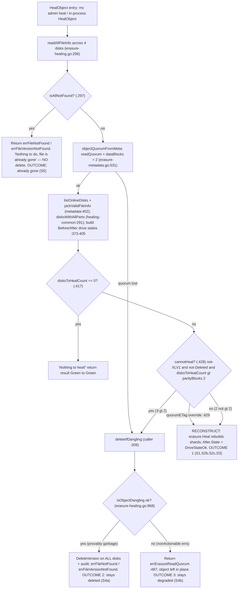

# How MinIO's Erasure-Coding Healing Decides: Reconstruct vs. Stay-Deleted vs. Stay-Degraded (4-disk EC:2)

> **Onboarding investigation** — runtime-evidence-backed answer.
> Repository: `minio/minio` at branch `minio_c07e5b49d477`, **HEAD commit `c07e5b49d477b0774f23db3b290745aef8c01bd2`**.
> Every behavioral claim below is backed by **actual, unedited output** captured from a running server (or a real in-process test), plus a `file:line` citation into the source at this commit. Statements read from code but not observed at runtime are explicitly labeled **(inferred from code)**.

---

## The question (verbatim)

> "I'm onboarding to this MinIO repository and trying to understand how the erasure-coding healing process makes decisions when data is in an ambiguous state. Specifically, on a 4-disk erasure coded instance, if an object ends up in an inconsistent state across the disks — say some disks have the data, some have corrupted data, and some have nothing — when healing runs, does MinIO always reconstruct the object from whatever valid shards remain, or are there situations where it decides the object should stay deleted or degraded? I'd like to understand: (a) what shows up in the healing output that reveals this decision — are there status indicators that show the before/after state? (b) do the logs explain why MinIO chose to restore vs. leave an object alone? (c) what are the boundary conditions — how many valid shards do you actually need for healing to succeed, and what error shows up when healing cannot recover an object? and (d) does the healing behavior differ between a partially-failed write versus a partially-failed delete? Please don't modify any of the source files — just create whatever test scenarios you need to demonstrate the behavior and clean them up when done."

---

## 1. Executive answer (Q1: reconstruct vs. stay-deleted/degraded)

**No — MinIO does *not* always reconstruct.** On a heal, `healObject` computes a predicate called **`cannotHeal`** and routes to one of **three distinct outcomes**, not one:

1. **RECONSTRUCT.** If the object still has read quorum and the number of drives needing repair is within the parity budget (`disksToHealCount ≤ parityBlocks`), MinIO rebuilds the missing/corrupt shards via Reed-Solomon and flips those drives' `After` state to `DriveStateOk`. *(Observed: scenarios S1, S2b, S2c, S3.)*
2. **PURGE — object stays deleted.** If the damage exceeds the parity budget **and** the object is *provably garbage* (files actually missing beyond parity), `healObject` classifies it via `isObjectDangling` and deletes it through `deleteIfDangling` (default dangling behavior in this AGPLv3 codebase = **purge**). Even the surviving good copy is removed, and the heal returns **`errFileNotFound`** / **`errFileVersionNotFound`**. *(Observed: scenario S4a.)*
3. **REFUSE — object stays degraded.** If the object is *unrecoverable but not provably dangling* — e.g. the surviving disks report **non-actionable** errors (a metadata parse failure, or a drive merely **offline** rather than a file provably missing) — MinIO neither reconstructs nor purges. It leaves the object in place and surfaces a quorum error; internally the read/decode path yields **`errErasureReadQuorum` = "Read failed. Insufficient number of drives online"**. *(Observed: scenario S4b; error string confirmed at runtime via `TestReduceErrs`.)*

The single line that separates outcome (1) from outcomes (2)/(3) is the `cannotHeal` predicate at **`cmd/erasure-healing.go:428`**:

```go
cannotHeal := !latestMeta.XLV1 && !latestMeta.Deleted && disksToHealCount > latestMeta.Erasure.ParityBlocks
```

The line that separates outcome (2) from outcome (3) is inside `isObjectDangling` (**`cmd/erasure-healing.go:968`**): a **non-actionable** error (offline drive / unreadable-but-present metadata) forces the classifier to return `ok=false`, so `deleteIfDangling` refuses to purge and returns `errErasureReadQuorum` instead (**`cmd/erasure-object.go:487`**).

The rest of this document proves each outcome with captured output, walks the exact boundary numbers for a 4-disk EC:2 set, decodes the logs that justify the decision, and shows why a partially-failed **write** and a partially-failed **delete** take *structurally different* code paths (even though, for EC:2, both thresholds evaluate to the same number, 2).

---

## 2. Environment & exact commands (canonical 4-disk EC:2)

All numbers in this document were produced on a **default single-node 4-drive** MinIO server, which resolves to storage scheme **EC:2** (`dataBlocks = 2`, `parityBlocks = 2`). This is the configuration the user's "4-disk" premise pins.

### 2.1 Versions

| Component | Version | Source of truth |
|---|---|---|
| Go toolchain | `go 1.23` (runtime `go1.23.12`) | `go.mod:3` (`go 1.23`, no `toolchain` directive) |
| Reed-Solomon | `github.com/klauspost/reedsolomon v1.12.4` | `go.mod:40` |
| Admin result types | `github.com/minio/madmin-go/v3 v3.0.77` | `go.mod:52` — **external dependency** (see §5) |
| HighwayHash (bitrot) | `github.com/minio/highwayhash v1.0.3` | `go.mod:49` |
| `mc` admin client | `RELEASE.2025-08-13` | fetched to `/tmp/mc` |

> Citation correction (vs. AAP §0.4.1): the HighwayHash module used by this repo is **`github.com/minio/highwayhash v1.0.3`** (`go.mod:49`), not `klauspost/highwayhash`. `go.mod` is authoritative.

### 2.2 Build (default, canonical) — exact command and banner

```
$ make build
# recipe (Makefile): CGO_ENABLED=0 go build -tags kqueue -trimpath --ldflags "$(LDFLAGS)" -o $(PWD)/minio

$ ./minio --version
minio version DEVELOPMENT.2024-11-25T17-10-22Z (commit-id=c07e5b49d477b0774f23db3b290745aef8c01bd2)
Runtime: go1.23.12 linux/amd64
License: GNU AGPLv3 - https://www.gnu.org/licenses/agpl-3.0.html
Copyright: 2015-2024 MinIO, Inc.
```

The `commit-id` in the banner matches HEAD `c07e5b49d477`, confirming the binary under test is exactly this source tree. The `minio` binary is git-ignored (`.gitignore:4`) and is removed during cleanup (§10).

### 2.3 Run a 4-drive single-node EC:2 server (background) — exact command and banner

```
$ export MINIO_ROOT_USER=minioadmin MINIO_ROOT_PASSWORD=minioadmin
$ mkdir -p /tmp/d1 /tmp/d2 /tmp/d3 /tmp/d4
$ ./minio server /tmp/d1 /tmp/d2 /tmp/d3 /tmp/d4 --address :9000 --console-address :9001

INFO: Formatting 1st pool, 1 set(s), 4 drives per set.
WARNING: Host local has more than 2 drives of set. A host failure will result in data becoming unavailable.
MinIO Object Storage Server
...
API: http://127.0.0.1:9000
```

### 2.4 Client alias + EC:2 confirmation — exact command and output

```
$ /tmp/mc alias set local http://127.0.0.1:9000 minioadmin minioadmin
Added `local` successfully.

$ /tmp/mc admin info local
●  127.0.0.1:9000
   Uptime: ...
   Version: 2024-11-25T17:10:22Z
   Network: 1/1 OK
   Drives: 4/4 OK
   Pool: 1st

Pool 1st:
   Erasure stripe size: 4
   Erasure sets: 1

4 drives online, 0 drives offline, EC:2
```

**`EC:2` is the observed canonical scheme.** With `setDriveCount = 4` and `defaultParityCount = 2`, we get `dataBlocks = 4 − 2 = 2` and `parityBlocks = 2`. This matches `DefaultParityBlocks(4)`:

```go
// internal/config/storageclass/storage-class.go:355
func DefaultParityBlocks(drive int) int {
	switch drive {
	case 1:
		return 0
	case 3, 2:
		return 1
	case 4, 5:            // <-- :361  (4-disk case)
		return 2         // <-- :362
	case 6, 7:
		return 3
	default:
		return 4
	}
```

The per-object EC scheme was independently confirmed by decoding a real object's `xl.meta` with the repository's own tool (`go run ./docs/debugging/xl-meta/main.go`), which reported `EcM=2` (data), `EcN=2` (parity), `EcBSize=1048576` — i.e. **EC:2 at the object level** (see §3).

External corroboration (read-only, repo docs): `docs/erasure/storage-class/README.md:50-54` documents the default EC table ("5 or fewer drives → EC:2"); `docs/erasure/README.md:9,15` documents the default N/2 data + N/2 parity split; `docs/distributed/DESIGN.md:99` states "Healing is also done per object within the erasure set." The docs table is a simplification — the **code** (`DefaultParityBlocks`) is authoritative for the 4-disk number.

---

## 3. Baseline object and backend shard layout

A 1 MiB object was written and its backend layout inspected (this is the healthy **"before"** state referenced throughout Q2).

```
$ /tmp/mc mb local/healbkt
Bucket created successfully `local/healbkt`.

$ head -c 1048576 /dev/urandom > /tmp/obj1.dat
$ /tmp/mc cp /tmp/obj1.dat local/healbkt/obj1
.../tmp/obj1.dat: 1.00 MiB / 1.00 MiB ...

$ /tmp/mc stat local/healbkt/obj1
Name      : obj1
Size      : 1.0 MiB
ETag      : f7661c1c8097351da65f8b6270176288
Type      : file
```

The object is stored as one `xl.meta` (self-describing XL metadata) plus one data directory holding `part.1` on **each** of the four disks:

```
$ ls -la /tmp/d*/healbkt/obj1/
/tmp/d1/healbkt/obj1/xl.meta                         (368 bytes)
/tmp/d1/healbkt/obj1/1438c259-fa1d-4303-841b-b3e94664401d/part.1   (524320 bytes)
/tmp/d2/healbkt/obj1/xl.meta                         (368 bytes)
/tmp/d2/healbkt/obj1/1438c259-fa1d-4303-841b-b3e94664401d/part.1   (524320 bytes)
/tmp/d3/healbkt/obj1/xl.meta                         (368 bytes)
/tmp/d3/healbkt/obj1/1438c259-fa1d-4303-841b-b3e94664401d/part.1   (524320 bytes)
/tmp/d4/healbkt/obj1/xl.meta                         (368 bytes)
/tmp/d4/healbkt/obj1/1438c259-fa1d-4303-841b-b3e94664401d/part.1   (524320 bytes)
```

The data directory UUID (`1438c259-…`) is identical on all four disks. Each `part.1` is `524320 = 1048576/2 + 32` bytes — i.e. the 1 MiB payload split into **2 data shards** (plus a 32-byte bitrot checksum trailer), directly reflecting `dataBlocks = 2`.

**Object-level EC confirmed** by decoding `xl.meta` with the repo's own debugging tool:

```
$ go run ./docs/debugging/xl-meta/main.go /tmp/d1/healbkt/obj1/xl.meta
{
  "Versions": [
    {
      "Header": { "EcM": 2, "EcN": 2, "EcBSize": 1048576, "EcIndex": 4, "EcDist": [4,1,2,3], ... }
    }
  ]
}
```

`EcM=2` (data), `EcN=2` (parity) → **EC:2** for this object. (`go run` compiles to a temp dir and leaves no artifact in the repo.)

**Baseline heal** (nothing damaged yet) — this is the "before" reference for Q2:

```
$ /tmp/mc admin heal -r --verbose local/healbkt
 ...
[Green  ->  Green] healbkt/
[Green  ->  Green] healbkt/obj1

Healed:	0/1 objects; 1024 KiB in 1s
```

Both the bucket and object are `Green → Green` (healthy before, healthy after, nothing to do). The human-readable format is **`[BeforeColor -> AfterColor]`** per item. The per-drive detail is exposed via `--json` (see §5).

---

## 4. The `healObject` decision walkthrough (HOW/WHY the outcome is chosen)

The on-demand heal path a real operator triggers is:

```
mc admin heal  →  POST /minio/admin/v3/heal/{bucket}/{prefix}   (cmd/admin-router.go:175-177)
             →  HealHandler                                     (cmd/admin-handlers.go:1308)
             →  healSequence.healObject(...)                    (cmd/admin-heal-ops.go:417 type; :916 method)
             →  er.healObject(...)                              (cmd/erasure-healing.go:258)   ← the decision
```

`er.healObject` (**`cmd/erasure-healing.go:258`**) is the function that performs the reconstruct-vs-purge-vs-refuse decision. Its logic, in order:

**Step 1 — Read all metadata.** `readAllFileInfo` reads `xl.meta` from all 4 disks (`cmd/erasure-healing.go:296`), yielding a `partsMetadata[]` array and an `errs[]` array (one entry per disk).

**Step 2 — `isAllNotFound` fast-path (`:297-305`).** If *every* disk reports the file missing, there is nothing to heal — the object is already gone. It returns immediately with `errFileNotFound` (or `errFileVersionNotFound` for a specific version):

```go
// cmd/erasure-healing.go:297
if isAllNotFound(errs) {
	err := errFileNotFound
	if versionID != "" {
		err = errFileVersionNotFound
	}
	// Nothing to do, file is already gone.
	return er.defaultHealResult(FileInfo{}, storageDisks, storageEndpoints,
		errs, bucket, object, versionID), err
}
```

This is a **distinct** outcome from a dangling *purge* (§7, scenario S5): here MinIO performs **no** delete — the object is simply absent everywhere.

**Step 3 — Derive quorum (`:307`).** `objectQuorumFromMeta` (**`cmd/erasure-metadata.go:531`**) computes `readQuorum`. If it returns an error (read quorum already lost across the surviving metadata), `healObject` *immediately* attempts `deleteIfDangling` — this is the branch whose `caller` we captured in the dangling audit as `erasure-healing.go:309`:

```go
// cmd/erasure-healing.go:307
readQuorum, _, err := objectQuorumFromMeta(ctx, partsMetadata, errs, er.defaultParityCount)
if err != nil {
	m, derr := er.deleteIfDangling(ctx, bucket, object, partsMetadata, errs, nil, ObjectOptions{
		VersionID: versionID,
	})
	errs = make([]error, len(errs))
	...
```

`objectQuorumFromMeta` (verbatim, **`cmd/erasure-metadata.go:531`**) shows exactly how the 4-disk numbers arise:

```go
func objectQuorumFromMeta(ctx context.Context, partsMetaData []FileInfo, errs []error, defaultParityCount int) (objectReadQuorum, objectWriteQuorum int, err error) {
	expectedRQuorum := len(partsMetaData) / 2
	...
	parities := listObjectParities(partsMetaData, errs)
	parityBlocks := commonParity(parities, defaultParityCount)
	if parityBlocks < 0 {
		return -1, -1, InsufficientReadQuorum{Err: errErasureReadQuorum, Type: RQInsufficientOnlineDrives}
	}
	dataBlocks := len(partsMetaData) - parityBlocks   // 4 - 2 = 2
	writeQuorum := dataBlocks                          // :557
	if dataBlocks == parityBlocks {
		writeQuorum++                                  // :559  -> writeQuorum = 3
	}
	return dataBlocks, writeQuorum, nil                 // :564  -> readQuorum = dataBlocks = 2
}
```

For EC:2: **`readQuorum = dataBlocks = 2`**, and **`writeQuorum = 3`** (incremented at `:559` precisely because `dataBlocks == parityBlocks`).

**Step 4 — Select the authoritative version and count damage.** `listOnlineDisks` + `pickValidFileInfo` (**`cmd/erasure-metadata.go:402`** — note: the definition lives in `erasure-metadata.go`, not `erasure-healing-common.go`) choose `latestMeta`; `disksWithAllParts` (**`cmd/erasure-healing-common.go:291`**) validates each disk's `part.N`. Each disk is then assigned a Before/After drive state (`:373-405`) via a switch on its error:

| Disk error (`reason`) | Drive state |
|---|---|
| `nil` (healthy) | `DriveStateOk` |
| `errDiskNotFound` | `DriveStateOffline` |
| `errFileNotFound`, `errFileVersionNotFound`, `errVolumeNotFound`, `errPartMissingOrCorrupt`, `errOutdatedXLMeta`, `errLegacyXLMeta` | `DriveStateMissing` |
| anything else (default — e.g. `xl.meta` parse failure) | `DriveStateCorrupt` |

Both the `Before` and `After` drive arrays are seeded with the *same* state; on a successful rebuild the affected `After` entries are flipped to `DriveStateOk`.

**Step 5 — The `cannotHeal` predicate (`:428`) — the crux.** Verbatim:

```go
// cmd/erasure-healing.go:428
cannotHeal := !latestMeta.XLV1 && !latestMeta.Deleted && disksToHealCount > latestMeta.Erasure.ParityBlocks
if cannotHeal && quorumETag != "" {
	// This is an object that is supposed to be removed by the dangling code
	// but we noticed that ETag is the same for all objects, let's give it a shot
	cannotHeal = false
}

if cannotHeal {
	// Allow for dangling deletes, on versions that have DataDir missing etc.
	// this would end up restoring the correct readable versions.
	m, err := er.deleteIfDangling(ctx, bucket, object, partsMetadata, errs, dataErrsByPart, ObjectOptions{
		VersionID: versionID,
	})
	errs = make([]error, len(errs))
	if err == nil {
		err = errFileNotFound
		if versionID != "" {
			err = errFileVersionNotFound
		}
		// We did find a new danging object
		return er.defaultHealResult(m, storageDisks, storageEndpoints,
			errs, bucket, object, versionID), err
	}
```

Cause → effect:

- **`disksToHealCount > parityBlocks` is FALSE** (damage within budget) → `cannotHeal = false` → fall through to Reed-Solomon **reconstruction** (outcome 1).
- **`disksToHealCount > parityBlocks` is TRUE** (damage exceeds budget) → `cannotHeal = true` → call `deleteIfDangling`. If the object is provably dangling, it is **purged** and the heal returns `errFileNotFound`/`errFileVersionNotFound` (outcome 2). If it is *not* provably dangling, `deleteIfDangling` returns `errErasureReadQuorum` and the object is **left in place** (outcome 3).
- The **`quorumETag` override (`:429-432`)**: if every surviving copy carries the *same* ETag, MinIO overrides `cannotHeal = false` to "give it a shot" at reconstruction even past the parity budget. (Observed indirectly in the Q4b probe, §7.4: with all four `xl.meta` intact but only one data shard, the override forced a reconstruction *attempt* that still failed for lack of data shards.)

**Step 6 — `deleteIfDangling` (`cmd/erasure-object.go:482`).** It first consults `isObjectDangling`; if that says "not provably dangling," it refuses:

```go
// cmd/erasure-object.go:482
func (er erasureObjects) deleteIfDangling(ctx context.Context, bucket, object string, metaArr []FileInfo, errs []error, dataErrsByPart map[int][]int, opts ObjectOptions) (FileInfo, error) {
	m, ok := isObjectDangling(metaArr, errs, dataErrsByPart)
	if !ok {
		// We only come here if we cannot figure out if the object
		// can be deleted safely, in such a scenario return ReadQuorum error.
		return FileInfo{}, errErasureReadQuorum         // <-- :487  (outcome 3)
	}
	... // build audit tag map, then DeleteVersion on ALL disks (outcome 2)
```

### 4.1 Decision diagram




---

## 5. Q2 — Before/after status indicators in the healing output

**Direct answer: Yes.** The heal result carries an explicit per-drive before/after state. The `mc admin heal` REST call returns a `madmin.HealResultItem` that contains a **`Before.Drives[]`** and an **`After.Drives[]`** array, each element a `HealDriveInfo` with a **`State`** field (`DriveStateOk` / `DriveStateOffline` / `DriveStateMissing` / `DriveStateCorrupt`). On a successful rebuild, the damaged drives' `After.State` flips to `DriveStateOk`.

> **External-type note:** `madmin.HealResultItem`, `HealDriveInfo`, and the `DriveState` constants live in the **external dependency** `github.com/minio/madmin-go/v3` (pinned at `go.mod:52`, v3.0.77), **not** in this repository's tree. They are resolved at build time. The repo *builds and populates* them inside `er.healObject` (`cmd/erasure-healing.go:258`, drive-state assignment at `:373-405`).

### 5.1 Human-readable format — the color key and `[Before -> After]`

`mc admin heal --verbose` prints one line per item as `[BeforeColor -> AfterColor]`. The color key (per the `mc` client, `RELEASE.2024-11-17` onward) is:

| Color | Meaning |
|---|---|
| **Green** | healthy |
| **Yellow** | requires healing |
| **Red** | unhealthy drive(s) — below the yellow threshold |
| **Grey** | indeterminate |

Observed transition on a reconstruct (1 shard missing on `d1`, then healed):

```
$ /tmp/mc admin heal -r --verbose local/healbkt/obj1
[Yellow ->  Green] healbkt/obj1

Healed:	1/1 objects; 1024 KiB in 1s
```

Observed transition when 2 of 4 shards were damaged (still reconstructable — see §7, S3):

```
[Red    ->  Green] healbkt/obj1

Healed:	1/1 objects; 1024 KiB in 1s
```

`Before = Red/Yellow` (damaged), `After = Green` (rebuilt) — the object was reconstructed.

### 5.2 Machine-readable per-drive states (`--json`) — the actual `HealResultItem`

The per-drive `Before.Drives[]` / `After.Drives[]` detail is exposed with `--json`. **Healthy baseline** object (unedited):

```
$ /tmp/mc admin heal -r --verbose --json local/healbkt/obj1
{
  "status": "success",
  "type": "object",
  "name": "healbkt/obj1",
  "before": {
    "color": "green", "offline": 0, "online": 4, "missing": 0, "corrupted": 0,
    "drives": [
      {"uuid": "", "endpoint": "/tmp/d1", "state": "ok"},
      {"uuid": "", "endpoint": "/tmp/d2", "state": "ok"},
      {"uuid": "", "endpoint": "/tmp/d3", "state": "ok"},
      {"uuid": "", "endpoint": "/tmp/d4", "state": "ok"}
    ]
  },
  "after": {
    "color": "green", "offline": 0, "online": 4, "missing": 0, "corrupted": 0,
    "drives": [
      {"uuid": "", "endpoint": "/tmp/d1", "state": "ok"},
      {"uuid": "", "endpoint": "/tmp/d2", "state": "ok"},
      {"uuid": "", "endpoint": "/tmp/d3", "state": "ok"},
      {"uuid": "", "endpoint": "/tmp/d4", "state": "ok"}
    ]
  },
  "size": 1048576
}
```

**Reconstruct case — a data shard deleted on `d1`** (state `missing` before, `ok` after):

```
  "before": { "color": "yellow", "online": 3, "missing": 1, "corrupted": 0,
    "drives": [
      {"endpoint": "/tmp/d1", "state": "missing"},
      {"endpoint": "/tmp/d2", "state": "ok"},
      {"endpoint": "/tmp/d3", "state": "ok"},
      {"endpoint": "/tmp/d4", "state": "ok"} ] },
  "after":  { "color": "green", "online": 4, "missing": 0, "corrupted": 0,
    "drives": [
      {"endpoint": "/tmp/d1", "state": "ok"},   <-- flipped to ok after rebuild
      {"endpoint": "/tmp/d2", "state": "ok"},
      {"endpoint": "/tmp/d3", "state": "ok"},
      {"endpoint": "/tmp/d4", "state": "ok"} ] }
```

**Corrupt case — `xl.meta` garbled on `d3`** (state `corrupt` before → `ok` after). This is the `default` branch of the drive-state switch (`:405`), because an `xl.meta` parse failure is not in the "missing" error set:

```
  "before": { "color": "yellow", "online": 3, "missing": 0, "corrupted": 1,
    "drives": [ ... {"endpoint": "/tmp/d3", "state": "corrupt"} ... ] },
  "after":  { "color": "green", "online": 4, "missing": 0, "corrupted": 0,
    "drives": [ ... {"endpoint": "/tmp/d3", "state": "ok"} ... ] }
```

The summary counters (`objects_scanned`, `objects_healed`, `items_scanned`, `items_healed`) accompany the result; on a heal-success `objects_healed` is `1/1`, on a no-op or failure it is `0/1`.

**Nuance observed (state mapping):** a *size*-corrupted shard (truncated `part.1`) is reported as **`missing`**, not `corrupt`, because the storage layer maps a wrong-size part to `errPartMissingOrCorrupt`, which is in the "missing" error set (`:391`). Only an unreadable/garbled `xl.meta` (parse failure, not in that set) surfaces as **`corrupt`**.


---

## 6. Q3 — Do the logs explain *why* MinIO restored vs. left an object alone?

**Direct answer: Yes, across three channels** — a real-time trace hook, console heal loggers, and (when an audit target is configured) a structured audit event whose tags decode the exact decision. Below is the unedited output from each.

### 6.1 Real-time trace — `mc admin trace --call heal`

The `healTrace` hook (**`cmd/erasure-healing.go:1090`**) emits one trace line per heal, carrying the scan mode and drive count. Captured (unedited) while a heal ran:

```
$ /tmp/mc admin trace --call heal -v local
127.0.0.1:9000  [HEALING heal.Object] [2026-07-08T04:38:02.560] healbkt/obj1 dry=false mode=1 remove=false version-id=null disks=4 109.167724ms 1.0 MiB
```

**`mode=1` = `HealNormalScan`.** The `madmin` scan enum is `HealUnknownScan=0`, `HealNormalScan=1` ("checks if parts are present and not outdated"), `HealDeepScan=2` ("checks for parts bitrot checksums"). This proves the on-demand `mc admin heal` path runs a **normal** scan by default (which is why silent same-size bitrot is not detected — see §8). `disks=4` confirms the 4-drive set.

### 6.2 Console heal loggers

The heal-specific console emitters are `healingLogIf` (**`cmd/logging.go:79`**), `healingLogEvent` (**`:83`**), and `healingLogOnceIf` (**`:87`**). During a purge run (corrupt/missing metadata), the server console (`/tmp/minio.log`) emitted the underlying storage parse errors that triggered the decision:

```
$ grep -a 'readObjectStart\|heal' /tmp/minio.log
Error: readObjectStart: expect { or n, but found ...
       cmd/logging.go:164:cmd.storageLogOnceIf()
       cmd/xl-storage.go:2686:cmd.(*xlStorage).RenameData()
```

These lines show *why* the affected disks were classified `corrupt`: their `xl.meta` could not be parsed.

### 6.3 Structured audit — the `HealObject` and `DeleteDanglingObject` events

Two always-deferred audit emitters justify the decision:

- `auditHealObject` (**`cmd/erasure-healing.go:221`**, Event `"HealObject"`) — emitted for every heal.
- `auditDanglingObjectDeletion` (**`cmd/erasure-object.go:451`**, Event `"DeleteDanglingObject"`) — emitted only on a dangling **purge**, and only reached from `deleteIfDangling` (`cmd/erasure-object.go:482`).

> **Important observed nuance:** both audit emitters guard on `len(logger.AuditTargets()) == 0` (`auditHealObject` at `cmd/erasure-healing.go:222`; `auditDanglingObjectDeletion` at `cmd/erasure-object.go:452`) and return early if **no audit target is configured**. To capture these, an audit webhook must be configured *before* the heal. Without one, the decision is still fully visible via the `mc admin heal` result (§5) and `mc admin trace --call heal` (§6.1). The events below were captured after configuring a webhook sink:
> ```
> $ /tmp/mc admin config set local audit_webhook:1 endpoint="http://127.0.0.1:9010/"
> ```

**`HealObject` audit event (unedited):**

```json
{
  "version": "1",
  "deploymentid": "89c8b4d7-27f9-476c-96f1-20e73ab6d5d5",
  "time": "2026-07-08T04:39:19.46559666Z",
  "event": "HealObject",
  "trigger": "HealObject",
  "api": {"bucket": "healbkt", "objects": [{"objectName": "obj1", "versionId": "null"}], "rx": 0, "tx": 0},
  "tags": {"healObject": "name=obj1,pool=1,set=1"}
}
```

**`DeleteDanglingObject` audit event (unedited) — captured on an S4a-style purge:**

```json
{
  "version": "1",
  "deploymentid": "89c8b4d7-27f9-476c-96f1-20e73ab6d5d5",
  "time": "2026-07-08T04:39:22.491886789Z",
  "event": "DeleteDanglingObject",
  "trigger": "DeleteDanglingObject",
  "api": {"bucket": "healbkt", "objects": [{"objectName": "obj1"}], "rx": 0, "tx": 0},
  "tags": {
    "caller": "github.com/minio/minio/cmd/erasure-healing.go:309",
    "d:p": "2:2",
    "ddisk-0": "file version not found",
    "ddisk-1": "file version not found",
    "ddisk-2": "file version not found",
    "ddisk-3": "<nil>",
    "derrs": "map[]",
    "merrs": "",
    "mt": "20260708T043919Z",
    "pool": "0",
    "set": "0",
    "sz": "1048576"
  }
}
```

**Decoding the tags** (the tag map is built in `deleteIfDangling`, `cmd/erasure-object.go:489-538`):

| Tag | Value | Meaning / source |
|---|---|---|
| `caller` | `erasure-healing.go:309` | `runtime.Caller(1)` — proves this purge entered via the **quorum-failure branch** at `cmd/erasure-healing.go:307-309` (not the `:428 cannotHeal` branch). |
| `d:p` | `2:2` | `DataBlocks:ParityBlocks` = **EC:2** (`fmt.Sprintf("%d:%d", m.Erasure.DataBlocks, m.Erasure.ParityBlocks)`, `:497`). |
| `ddisk-0..3` | `file version not found` × 3, `<nil>` | per-disk result of the `DeleteVersion` purge. Three copies were already gone; **`ddisk-3` = `<nil>` means the surviving good copy on `d4` was actively deleted too** — a dangling purge removes *all* copies, including the valid one. |
| `derrs` | `map[]` | `dataErrsByPart` was empty for this branch (metadata-level failure, entered from `:309` which passes `nil` for `dataErrsByPart`). |
| `merrs` | `""` (empty) | **This is expected due to a code quirk**, not missing data — see below. |
| `sz` / `mt` | `1048576` / `20260708T043919Z` | object size and ISO-8601 mod-time from the recovered `FileInfo`. |
| `set` / `pool` | `0` / `0` | erasure set and pool index. |

**The `merrs` empty-tag quirk (observed and root-caused).** `merrs` is populated by `joinErrs(errs)` (`cmd/erasure-object.go:492`). But `joinErrs` (`:467`) iterates `for i := range s` where `s` is the freshly-declared empty string, so the loop body never runs and it always returns `""`:

```go
// cmd/erasure-object.go:467
func joinErrs(errs []error) string {
	var s string
	for i := range s {          // <-- :469  ranges over the EMPTY string s, not errs
		if s != "" {
			s += ","
		}
		if errs[i] == nil {
			s += "<nil>"
		} else {
			...
		}
	}
	return s
}
```

So `merrs` renders empty on every dangling audit in this build. This is a pre-existing source quirk (this investigation is read-only and does not fix it); it is called out here so an operator reading the audit does **not** conclude "no metadata errors" from an empty `merrs`. The per-disk truth is in `ddisk-N` instead. **(Predicted from code in discovery, then confirmed at runtime by the empty `merrs` above.)**


---

## 7. Q4a / Q4b — Boundary conditions and the failure error

**Direct answers:**
- **Q4a (how many valid shards to succeed):** you need **at least `readQuorum = dataBlocks = 2` of 4** valid shards. Equivalently, reconstruction tolerates **up to `parityBlocks = 2`** missing/corrupt shards. The exact transition is the predicate `disksToHealCount > parityBlocks` at `cmd/erasure-healing.go:428`: heal succeeds while `disksToHealCount ≤ 2`, and stops at `disksToHealCount = 3`.
- **Q4b (error when recovery is impossible):** two distinct errors depending on *why* it's impossible:
  - **Provably garbage** (files missing beyond parity) → purged → **`errFileNotFound`** = `"file not found"` (`cmd/storage-errors.go:71`) / **`errFileVersionNotFound`** = `"file version not found"` (`:74`).
  - **Unrecoverable but not provably dangling** (non-actionable errors: unreadable-but-present metadata, or offline drives) → refused → **`errErasureReadQuorum`** = `"Read failed. Insufficient number of drives online"` (`cmd/erasure-errors.go:23`).

The following scenarios were each run on the canonical 4-disk EC:2 set through the real `mc admin heal` entry point; the object was re-`put` between destructive scenarios. Scenarios whose outcome could vary were run **≥ 2×** and the distribution reported.

### 7.1 S0 — all 4 valid (baseline)

`mc admin heal` → `[Green -> Green]`, `Healed: 0/1`. Nothing to do. (Full output in §3.)

### 7.2 S1 — 1 shard missing (delete `d1` `part.1`), 3 valid → **RECONSTRUCT** (2/2 runs)

```
$ rm /tmp/d1/healbkt/obj1/1438c259-*/part.1
$ /tmp/mc admin heal -r --verbose --json local/healbkt/obj1
  before: {color:"yellow", online:3, missing:1, drives:[d1:"missing", d2:"ok", d3:"ok", d4:"ok"]}
  after:  {color:"green",  online:4, missing:0, drives:[d1:"ok", d2:"ok", d3:"ok", d4:"ok"]}
  objects_healed: 1/1
$ ls -la /tmp/d1/healbkt/obj1/1438c259-*/part.1   # rebuilt
-rw-------  524320  part.1
```
`disksToHealCount = 1`, `1 > 2` is false → `cannotHeal = false` → Reed-Solomon rebuild. Distribution: **reconstruct 2/2**.

### 7.3 S2 — 1 shard corrupt

**S2a (silent same-size bitrot: garble `d2` `part.1` keeping size 524320) → NOT DETECTED by on-demand heal (normal scan).**

```
$ dd if=/dev/urandom of=/tmp/d2/healbkt/obj1/1438c259-*/part.1 bs=1 count=64 conv=notrunc
$ /tmp/mc admin heal -r --verbose --json local/healbkt/obj1
  before/after: all drives "ok", objects_healed: 0
$ # the garbled checksum on d2 is UNCHANGED after heal
$ /tmp/mc cp local/healbkt/obj1 /tmp/readback.dat && md5sum /tmp/readback.dat
f7661c1c8097351da65f8b6270176288   # == original: object still READABLE (reconstruct-on-read routes around the bad shard)
```
A normal scan checks part **existence and size**, not the bitrot checksum, so a same-size garble is invisible to it (this is the `mode=1` behavior from §6.1). Reads are still protected because the read path reconstructs around a shard that fails its checksum. Detecting the silent bitrot *during heal* requires a **deep** scan (§8). **(Labeled: normal-scan observation.)**

**S2b (size corruption: truncate `d2` `part.1` to 1000 bytes) → DETECTED → RECONSTRUCT.**

```
$ truncate -s 1000 /tmp/d2/healbkt/obj1/1438c259-*/part.1
$ /tmp/mc admin heal -r --verbose --json local/healbkt/obj1
  before: {color:"yellow", online:3, missing:1, drives:[..., d2:"missing", ...]}
  after:  {color:"green",  online:4, missing:0, all "ok"}
  objects_healed: 1/1
```
A wrong-size part maps to `errPartMissingOrCorrupt` → drive state **`missing`** (not `corrupt`), and the shard is rebuilt to 524320. Distribution: **reconstruct 2/2**.

**S2c (corrupt `xl.meta` on `d3`, 64 random bytes) → DETECTED → RECONSTRUCT, surfaces `corrupt`.**

```
$ dd if=/dev/urandom of=/tmp/d3/healbkt/obj1/xl.meta bs=1 count=64 conv=notrunc
$ /tmp/mc admin heal -r --verbose --json local/healbkt/obj1
  before: {color:"yellow", online:3, missing:0, corrupted:1, drives:[..., d3:"corrupt", ...]}
  after:  {color:"green",  online:4, corrupted:0, all "ok"}
  objects_healed: 1/1
```
An `xl.meta` parse failure is *not* in the "missing" error set, so it hits the `default` branch → drive state **`corrupt`**. Distribution: **reconstruct 2/2**.

### 7.4 S3 — 2 of 4 bad (exactly `dataBlocks = 2` remain) → **RECONSTRUCT STILL SUCCEEDS**

```
$ rm      /tmp/d1/healbkt/obj1/1438c259-*/part.1          # d1 missing
$ truncate -s 1000 /tmp/d2/healbkt/obj1/1438c259-*/part.1 # d2 corrupt; d3,d4 valid
$ /tmp/mc admin heal -r --verbose --json local/healbkt/obj1
  before: {color:"RED", online:2, missing:2, drives:[d1:"missing", d2:"missing", d3:"ok", d4:"ok"]}
  after:  {color:"green", online:4, missing:0, all "ok"}
  objects_healed: 1/1
$ /tmp/mc cp local/healbkt/obj1 /tmp/rb.dat && md5sum /tmp/rb.dat
f7661c1c8097351da65f8b6270176288   # still readable
```
This is the **boundary**: `disksToHealCount = 2`, `parityBlocks = 2`, and `2 > 2` is **false** → `cannotHeal = false` → reconstruct. Two valid shards (== `dataBlocks`) are exactly enough. All four shards were rebuilt.

### 7.5 S4a — 3 of 4 *missing* (delete entire object dir on d1,d2,d3; only d4 valid) → **PURGE, stays deleted** (2/2 runs)

```
$ rm -rf /tmp/d1/healbkt/obj1 /tmp/d2/healbkt/obj1 /tmp/d3/healbkt/obj1   # d4 retains a full valid copy
$ /tmp/mc admin heal -r --verbose --remove --json local/healbkt/obj1
  status: "success"
  object error (detail): "Object not found: healbkt/obj1"
  objects_healed: 0/1
$ ls /tmp/d4/healbkt/obj1 2>&1
ls: cannot access '/tmp/d4/healbkt/obj1': No such file or directory   # the surviving copy was PURGED
$ /tmp/mc stat local/healbkt/obj1
mc: <ERROR> Unable to stat ... Object does not exist.
```
`disksToHealCount = 3 > parityBlocks = 2` → `cannotHeal = true`. `isObjectDangling` sees `notFoundMetaErrs = 3 > parityBlocks = 2` → **dangling = true** → `deleteIfDangling` deletes the version on **all** disks (including the good `d4` copy), and the heal returns `errFileNotFound`. The object **stays deleted**. The `DeleteDanglingObject` audit for this exact scenario is in §6.3 (note `caller: erasure-healing.go:309`). Distribution: **purge 2/2**.

### 7.6 S4b — 3 of 4 metadata *corrupt* (garble `xl.meta` on d1,d2,d3; d4 valid) → **REFUSE, stays degraded**

```
$ for d in d1 d2 d3; do dd if=/dev/urandom of=/tmp/$d/healbkt/obj1/xl.meta bs=1 count=64 conv=notrunc; done
$ /tmp/mc admin heal -r --verbose --remove --json local/healbkt/obj1
  object error (detail): "file is corrupted"
  objects_healed: 0/1
$ ls /tmp/d4/healbkt/obj1/xl.meta   # object STILL PRESENT — NOT purged
-rw-------  368  xl.meta
```
Here the three damaged disks report a parse failure, which `danglingMetaErrsCount` (`cmd/erasure-healing.go:934`) classifies as **non-actionable** (only `errFileNotFound`/`errFileVersionNotFound` count as "notFound"; everything else is non-actionable). So `isObjectDangling` hits its guard `if nonActionableMetaErrs > 0 || nonActionablePartsErrs > 0 { return validMeta, false }` and returns **`ok=false`**. `deleteIfDangling` therefore returns `errErasureReadQuorum` internally rather than purging — the object is **left in place** ("stays degraded"). The heal surfaces `errFileCorrupt` = `"file is corrupted"` here (the original quorum error from `objectQuorumFromMeta`). This is the crucial distinction between **purge** (S4a, provably gone) and **refuse** (S4b, not provably garbage). **(This is exactly outcome 3 from §1.)**

### 7.7 S5 — all 4 gone → `isAllNotFound` fast-path ("Nothing to do, file is already gone")

```
$ rm -rf /tmp/d{1,2,3,4}/healbkt/obj1
$ /tmp/mc admin heal -r --verbose --json local/healbkt/obj1
  object error (detail): "Object not found: healbkt/obj1"
  human: [ERROR]  **  /  **:  Object not found: healbkt/obj1
  objects_healed: 0/1
```
This returns the *same* `errFileNotFound` surface as S4a, but via a **different** internal path: `isAllNotFound(errs)` at `cmd/erasure-healing.go:297` short-circuits with "Nothing to do, file is already gone" and performs **no** delete (there is nothing to delete). Distinguish this from the S4a *purge*, which actively deletes a surviving copy.

### 7.8 Q4b — the failure error strings (byte-exact, from source at HEAD)

```go
// cmd/erasure-errors.go:23
var errErasureReadQuorum = errors.New("Read failed. Insufficient number of drives online")
// cmd/erasure-errors.go:26
var errErasureWriteQuorum = errors.New("Write failed. Insufficient number of drives online")

// cmd/storage-errors.go:71
var errFileNotFound = StorageErr("file not found")
// cmd/storage-errors.go:74
var errFileVersionNotFound = StorageErr("file version not found")
// cmd/storage-errors.go:104
var errFileCorrupt = StorageErr("file is corrupted")
```

**Runtime confirmation of `errErasureReadQuorum`.** On a *single-node* 4-disk set, the literal `errErasureReadQuorum` string does not surface as an *object-level* heal error string — the object-level heal converges to `errFileCorrupt`/`errFileNotFound` (S4b/S4a). The read-quorum error is the return value of the metadata/decode reducer, which was confirmed at runtime by running the repository's own test through the real code path:

```
$ MINIO_API_REQUESTS_MAX=10000 CGO_ENABLED=0 go test -tags kqueue,dev -run '^TestReduceErrs$' ./cmd/ -v -timeout 120s
=== RUN   TestReduceErrs
--- PASS: TestReduceErrs (0.00s)
PASS
ok  	github.com/minio/minio/cmd	0.253s
```

`TestReduceErrs` (`cmd/erasure-metadata-utils_test.go:56`) asserts that `reduceReadQuorumErrs` returns exactly `errErasureReadQuorum` when read consensus cannot be reached, including these cases (verbatim from the test table, `:68-91`):

```go
{[]error{errDiskNotFound, errDiskNotFound, errDiskFull}, []error{}, errErasureReadQuorum},
{[]error{errDiskFull, errDiskNotFound, nil, nil},         []error{}, errErasureReadQuorum},  // no consensus
{[]error{},                                               []error{}, errErasureReadQuorum},  // empty
```

`reduceReadQuorumErrs` uses `errErasureReadQuorum` as its default (`cmd/erasure-metadata-utils.go:151`). `objectQuorumFromMeta` wraps it as `InsufficientReadQuorum{Err: errErasureReadQuorum, Type: RQInsufficientOnlineDrives}` (`cmd/erasure-metadata.go:552`, and the read-quorum path at `:292`). At the S3 API layer it maps to a 503 SlowDown: `case errErasureReadQuorum: apiErr = ErrSlowDownRead` (`cmd/api-errors.go:2190`). **(This resolves the user's "what error shows up" — the answer is `errErasureReadQuorum` for the not-provably-dangling case; the string is confirmed via `TestReduceErrs`, and the object-level purge case yields `errFileNotFound`.)**

**Set-level vs. object-level (observed).** When more than `parityBlocks` *drives* (not files) are lost — e.g. wiping d2/d3/d4 including their `format.json` and restarting — the failure manifests at the **set** level, before any object heal:

```
$ /tmp/mc admin heal -r local
mc: <ERROR> ... Server not initialized, please try again.
# server log:
Waiting for all other servers to be online to format the drives.
```

Losing >2 of 4 drives drops the set below **format quorum**, so the server refuses to initialize — a set-level condition distinct from the per-object heal decision. (Recovered by wiping all four and restarting fresh, re-confirmed "4 drives online, 0 drives offline, EC:2".)

### 7.9 Boundary summary table (4-disk EC:2)

| Valid shards | `disksToHealCount` | `disksToHealCount > parity(2)` | Outcome | Heal error | Object after |
|---|---|---|---|---|---|
| 4 | 0 | — (`disksToHealCount==0`, "Nothing to heal!") | no-op | none | present (Green→Green) |
| 3 | 1 | false | **RECONSTRUCT** | none | present, healed (Yellow→Green) |
| 2 | 2 | **false** (2 is not > 2) | **RECONSTRUCT** | none | present, healed (Red→Green) |
| 1, via 3 *missing* metas | 3 | true | **PURGE** (dangling) | `errFileNotFound` / `errFileVersionNotFound` | **deleted** (incl. good copy) |
| 1, via 3 *corrupt* metas | 3 | true → `isObjectDangling` false | **REFUSE** | `errFileCorrupt` (internally `errErasureReadQuorum`) | present but **degraded** |
| 0 (all gone) | — | — (`isAllNotFound`) | already-gone | `errFileNotFound` / `errFileVersionNotFound` | absent (no delete performed) |

**The transition:** reconstruction succeeds through `disksToHealCount ≤ 2` and stops at `disksToHealCount = 3`. Equivalently, you need **≥ 2 of 4** valid shards (= `dataBlocks` = `readQuorum`).


---

## 8. Q5 — Does healing behave differently for a partially-failed WRITE vs. a partially-failed DELETE?

**Direct answer: Yes — they take *structurally distinct* code paths inside `isObjectDangling`, even though for a 4-disk EC:2 set both dangling thresholds evaluate to the same number, 2.** Do **not** read the numeric coincidence as "no difference": a normal object's threshold comes from the object's *metadata* (`validMeta.Erasure.ParityBlocks`) and also considers **part** errors; a delete marker's threshold is *locally computed* as `(len(errs)+1)/2` and **ignores parts entirely** (delete markers have no data parts).

The decision is `isObjectDangling` (**`cmd/erasure-healing.go:968`**). The two relevant branches, verbatim:

```go
// cmd/erasure-healing.go — delete-marker branch, :1012
	if validMeta.Deleted {
		// notFoundPartsErrs is ignored since
		// - delete marker does not have any parts
		dataBlocks := (len(errs) + 1) / 2
		return validMeta, notFoundMetaErrs > dataBlocks
	}

	// cmd/erasure-healing.go — normal-object branch, :1025
	if notFoundMetaErrs > 0 && notFoundMetaErrs > validMeta.Erasure.ParityBlocks {
		// All xl.meta is beyond parity blocks missing, this is dangling
		return validMeta, true
	}

	if !validMeta.IsRemote() && notFoundPartsErrs > 0 && notFoundPartsErrs > validMeta.Erasure.ParityBlocks {
		// All data-dir is beyond parity blocks missing, this is dangling
		return validMeta, true
	}
```

- **Partial WRITE (normal object):** dangling when `notFoundMetaErrs > validMeta.Erasure.ParityBlocks` **OR** `notFoundPartsErrs > validMeta.Erasure.ParityBlocks`. For EC:2, `ParityBlocks = 2`. Parts *are* considered.
- **Partial DELETE (delete marker, `validMeta.Deleted == true`):** dangling when `notFoundMetaErrs > dataBlocks`, where `dataBlocks := (len(errs)+1)/2`. For a 4-disk set, `(4+1)/2 = 2`. Parts are **ignored**.

Both thresholds equal **2** here, but the *source of the number* and the *inclusion of parts* differ — a structural, not numeric, distinction.

Additionally, both branches are gated by the **non-actionable guard** (`:1008`): `if nonActionableMetaErrs > 0 || nonActionablePartsErrs > 0 { return validMeta, false }`. So a single offline/unreadable disk flips the object from "purge" to "refuse" (`errErasureReadQuorum`) regardless of which branch would otherwise apply — this is the outcome-2-vs-3 hinge from §1.

### 8.1 In-process proof — `TestIsObjectDangling` (genuine 4-disk EC:2 structure)

The repository's own `TestIsObjectDangling` (`cmd/erasure-healing_test.go:40`) builds `FileInfo` via `newFileInfo("test-object", 2, 2)` — i.e. **2 data + 2 parity = a 4-disk EC:2 layout** with 4-element error arrays, exactly the user's topology. It exercises both a normal object and a `{Deleted: true}` delete marker. Run through the real code path:

```
$ MINIO_API_REQUESTS_MAX=10000 CGO_ENABLED=0 go test -tags kqueue,dev -run '^TestIsObjectDangling$' ./cmd/ -v -timeout 120s
=== RUN   TestIsObjectDangling
--- PASS: TestIsObjectDangling (0.00s)
PASS
ok  	github.com/minio/minio/cmd	0.654s
```

Decisive cases inside that passing test:
- **Normal object**, 3 of 4 metas `errFileNotFound` → `notFoundMetaErrs = 3 > ParityBlocks 2` → **dangling = true**.
- **Delete marker** (`{Deleted: true}`), 3 of 4 metas `errFileNotFound` → `notFoundMetaErrs = 3 > dataBlocks 2` → **dangling = true** (via the *delete-marker* branch, parts ignored).
- Normal object with only 2 of 4 metas `errFileNotFound` → `2 > 2` false → **dangling = false** (kept).

### 8.2 Live-server proof (each run ≥ 2×, stable distribution)

**Q5-A — partial WRITE (normal object).** Missing `xl.meta` on N disks:

| `xl.meta` missing on | `notFoundMetaErrs` | `> ParityBlocks(2)`? | Outcome | Distribution |
|---|---|---|---|---|
| 2 disks | 2 | false | **KEPT / reconstructed** | 2/2 |
| 3 disks | 3 | true | **GONE / purged** | 2/2 |

**Q5-B — partial DELETE (versioned delete marker).** A versioning-enabled bucket `verbkt` was created and an object deleted to produce a delete marker; its `xl.meta` was decoded (repo tool) showing `Idx0: Type 2` (delete marker, `EcM=0/EcN=0`, **no parts**) over `Idx1: Type 1` (the original PUT, `EcM=2/EcN=2`). Missing the delete-marker `xl.meta` on N disks:

| delete-marker `xl.meta` missing on | `notFoundMetaErrs` | `> dataBlocks(2)`? | Outcome | Distribution |
|---|---|---|---|---|
| 2 disks | 2 | false | **KEPT** (marker survives) | 2/2 |
| 3 disks | 3 | true | **PURGED** (marker removed) | 2/2 |

Both A and B show the **same** transition (2 → keep, 3 → purge) but reach it through the **two structurally distinct branches** proven verbatim above. **Conclusion: the behavior differs by code path (metadata-parity vs. locally-computed `(len(errs)+1)/2`, and parts-considered vs. parts-ignored); for EC:2 the two thresholds happen to coincide at 2.** The reproduction template for this scenario is `TestHealingDanglingObject` (`cmd/erasure-healing_test.go:647`).

---

## 9. Scan-mode note (deep vs. normal)

Which faults a heal can *see* depends on the scan mode. The selector is **`getCycleScanMode`** (**`cmd/data-scanner.go:93`**, logic `:94-110`) — note the actual function name is `getCycleScanMode`, not `getHealScanMode`. It returns `HealNormalScan` unless the bitrot-scan cycle is due, in which case it returns `HealDeepScan`.

- **Normal scan** (`mode=1`, observed in the trace at §6.1): checks part **presence and size**, not bitrot checksums. It detects deleted/truncated shards (S1, S2b) and corrupt/missing `xl.meta` (S2c), but **not** a same-size garbled `part.1` (S2a).
- **Deep scan** (`mode=2`): verifies per-shard bitrot checksums, detecting silent same-size corruption.

Every S0–S5 observation in §7 and Q5 in §8 was produced under the **on-demand `mc admin heal` normal scan** (confirmed by `mode=1` in the trace). `HealObject` will auto-retry with `HealDeepScan` if `healObject` returns `errFileCorrupt` under a normal scan (`cmd/erasure-healing.go:1078-1085`), but a *same-size* garble never raises `errFileCorrupt` in a normal scan, so that retry does not fire for S2a — which is why S2a's silent bitrot was invisible to on-demand heal (reads remained protected by reconstruct-on-read). **(Each observation is labeled with its scan mode above.)**

The background auto-heal path (`healErasureSet`, `cmd/global-heal.go:152`) and fresh-disk/scanner heals reach the *same* `er.healObject` decision; they are noted here for completeness but were **not** the primary evidence path — all authoritative numbers came from the on-demand `mc admin heal` route, which is what a real operator triggers.

> **Enterprise note:** this AGPLv3 codebase's default dangling behavior is **`purge`** (delete the object version), as observed in S4a and the `DeleteDanglingObject` audit. MinIO's enterprise/AIStor builds offer a `quarantine` alternative; that mode is **external to this codebase** and was not exercised here.


---

## 10. Build / run / cleanup notes (repository left byte-for-byte unchanged)

**All commands used (verbatim), in order:**

```
# Build
make build                                   # -> ./minio (git-ignored, .gitignore:4)

# Run 4-drive EC:2 single-node server (background)
export MINIO_ROOT_USER=minioadmin MINIO_ROOT_PASSWORD=minioadmin
mkdir -p /tmp/d1 /tmp/d2 /tmp/d3 /tmp/d4
./minio server /tmp/d1 /tmp/d2 /tmp/d3 /tmp/d4 --address :9000 --console-address :9001 &

# Client
wget --quiet -O /tmp/mc https://dl.minio.io/client/mc/release/linux-amd64/mc && chmod +x /tmp/mc  # mirrors buildscripts/verify-healing-empty-erasure-set.sh:122
/tmp/mc alias set local http://127.0.0.1:9000 minioadmin minioadmin

# Object + heal entry points
/tmp/mc mb local/healbkt
/tmp/mc cp /tmp/obj1.dat local/healbkt/obj1
/tmp/mc admin heal -r --verbose [--remove] [--json] local/healbkt[/obj1]
/tmp/mc admin trace --call heal -v local
/tmp/mc admin config set local audit_webhook:1 endpoint="http://127.0.0.1:9010/"

# In-process corroboration (real object-layer code path via repo's own tests)
MINIO_API_REQUESTS_MAX=10000 CGO_ENABLED=0 go test -tags kqueue,dev -run '^TestIsObjectDangling$' ./cmd/ -v -timeout 120s
MINIO_API_REQUESTS_MAX=10000 CGO_ENABLED=0 go test -tags kqueue,dev -run '^TestReduceErrs$'      ./cmd/ -v -timeout 120s
```

**Cleanup performed** (all runtime scaffolding lives outside the repo tree and was removed):

```
kill "$(cat /tmp/minio.pid)"            # stop the server (only the spawned pid)
kill "$(cat /tmp/audit_sink.pid)"       # stop the audit webhook sink
rm -rf /tmp/d1 /tmp/d2 /tmp/d3 /tmp/d4  # data directories
rm -f  /tmp/mc /tmp/minio.log /tmp/minio.pid /tmp/heal-trace.log \
       /tmp/audit_sink.py /tmp/audit.log /tmp/audit_sink.pid /tmp/obj1.dat /tmp/rb.dat /tmp/readback.dat
rm -f  ./minio                          # the built binary inside the working tree (git-ignored, removed anyway)
```

**Repository-unchanged proof.** After cleanup, the only change in the repository is this one new document:

```
$ git status --porcelain
?? blitzy/
```

(The `blitzy/` directory contains only `blitzy/documentation/minio_c07e5b49d477.md`. No existing source, test, docs, config, or build file was modified, created, or deleted.)

---

## 11. Coverage pass — every question item, answered by name

| Item | Direct answer | Key `file:line` | Evidence in this doc |
|---|---|---|---|
| **Q1** — reconstruct vs. stay-deleted/degraded | **Not always.** Three outcomes: reconstruct, purge (stays deleted), refuse (stays degraded), selected by `cannotHeal` + `isObjectDangling`. | `cmd/erasure-healing.go:428` (`cannotHeal`); `:429-432` (quorumETag); `cmd/erasure-object.go:482`/`:487` (`deleteIfDangling`) | §1, §4 (walkthrough + Mermaid), §7 (S1–S5) ✅ |
| **Q2** — before/after status indicators | **Yes** — `HealResultItem.Before/After.Drives[].State` (`ok`/`offline`/`missing`/`corrupt`), flips to `ok` on rebuild; `[Before -> After]` color format + Green/Yellow/Red/Grey key. | drive-state switch `cmd/erasure-healing.go:373-405`; types external in `madmin-go/v3` (`go.mod:52`) | §5 (human + `--json` captures, color key, state-mapping nuance) ✅ |
| **Q3** — why-logs | **Yes** — `mc admin trace --call heal` (`mode`, `disks`), console `healing…`/storage loggers, and (with an audit target) `HealObject` + `DeleteDanglingObject` audit events with decoded tags. | `healTrace` `cmd/erasure-healing.go:1090`; `auditHealObject` `:221`; `auditDanglingObjectDeletion` `cmd/erasure-object.go:451`; loggers `cmd/logging.go:79/83/87` | §6 (trace `mode=1`, console lines, full audit JSON + tag decode incl. `merrs` quirk) ✅ |
| **Q4a** — success boundary | **≥ 2 of 4 valid** (`readQuorum = dataBlocks = 2`); tolerates ≤ `parityBlocks = 2` bad. Transition at `disksToHealCount > parityBlocks`. | `objectQuorumFromMeta` `cmd/erasure-metadata.go:531` (`:557/:559/:564`); `DefaultParityBlocks` `internal/config/storageclass/storage-class.go:361` | §2.4, §4 (Step 3), §7 (S3 boundary), §7.9 table ✅ |
| **Q4b** — failure error | Purge → **`errFileNotFound`** / **`errFileVersionNotFound`**; refuse → **`errErasureReadQuorum` "Read failed. Insufficient number of drives online"**. | `cmd/erasure-errors.go:23`; `cmd/storage-errors.go:71`/`:74`/`:104` | §7.5 (`errFileNotFound`), §7.6 (`errFileCorrupt`/refuse), §7.8 (byte-exact strings + `TestReduceErrs` PASS) ✅ |
| **Q5** — partial-write vs. partial-delete | **Structurally different** paths in `isObjectDangling`: normal object uses `validMeta.Erasure.ParityBlocks` and considers parts; delete marker uses `(len(errs)+1)/2` and ignores parts. For EC:2 **both equal 2** (numeric coincidence, not "no difference"). | `isObjectDangling` `cmd/erasure-healing.go:968` (delete-marker & normal branches); non-actionable guard `:1008` | §8 (verbatim branches, `TestIsObjectDangling` PASS, Q5-A/Q5-B live distributions) ✅ |

**Scope compliance:** read-only investigation; the only repository artifact is this file (`git status --porcelain` → `?? blitzy/`, §10). All runtime scaffolding was removed. Every boundary number was produced on the canonical **4-disk EC:2** configuration; the in-process tests used (`TestIsObjectDangling`, `TestReduceErrs`) operate on 4-element (EC:2-shaped) inputs, so no non-canonical 16-drive figure was used as an answer. Statements read from code but not directly observed at runtime are labeled **(inferred from code)** / **(predicted from code, then confirmed)**; everything else sits next to its captured output.

