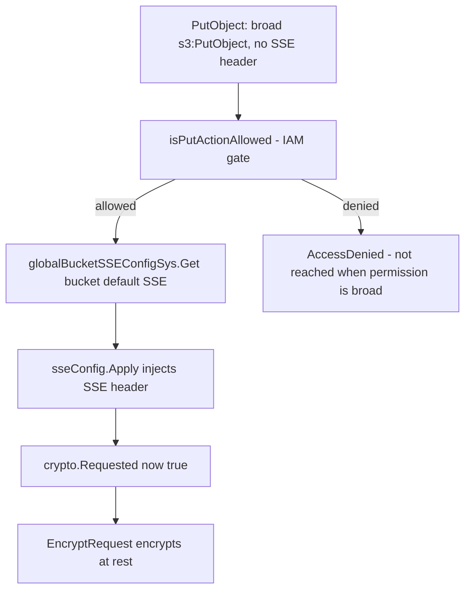

# MinIO Security & Storage-Integrity Investigation — Runtime-Grounded Answers

**Branch:** `minio_c07e5b49d477`  
**Commit (HEAD):** `c07e5b49d477b0774f23db3b290745aef8c01bd2`  
**Module:** `github.com/minio/minio` (`go.mod:1`), Go directive `go 1.23` (`go.mod:3`)

This document is a **runtime-grounded, read-only** investigation of the MinIO object storage
server at the branch and commit above. It answers five security / storage-integrity questions
(Q1–Q5). Every claim is backed by **output that was actually captured** by building and running
MinIO at this commit, together with exact `file:line` source citations. The investigation follows
the **"SWE-AtlasQnA-Repo"** discipline:

1. **Run-first** — MinIO was built and run *before* the answer was written; each answer states
   what the system **actually did**, not what it "would" do.
2. **Quote observed output verbatim** — trace lines, server logs, HTTP status / headers,
   test-runner markers, error strings and measured values (timings / sizes / counts) are
   reproduced byte-for-byte, each preceded by the command that produced it.
3. **Answer every sub-part** — each question is decomposed and answered explicitly; a coverage
   checklist at the end confirms nothing was skipped.
4. **Be exact and grounded** — every literal (identifier, string value, error / status code,
   config key, path, number) is cited with its `file:line` reference; nothing the question asks
   for is paraphrased.
5. **Strictly read-only** — **this document is the only artifact created.** No repository source
   file was modified; all temporary observation scripts and throwaway data directories were
   removed after capture (see the final section).

> **Citation-accuracy note.** Every `file:line` below was re-verified against the working tree at
> commit `c07e5b49d477`. Where an earlier draft cited a slightly different line, the corrected,
> source-accurate line is used — e.g. `EncryptRequest` is at `cmd/encryption-v1.go:466` (line 440
> is `setEncryptionMetadata`, line 363 is `newEncryptMetadata`), and the `BitrotScan` assignment is
> at `cmd/erasure-object.go:407`.

---

## Environment & Build

**Toolchain (verbatim):**

```
$ go version
go version go1.23.2 linux/amd64
```

The module directive is `go 1.23` (`go.mod:3`) for `module github.com/minio/minio` (`go.mod:1`).
CI pins Go `1.23.x` across `.github/workflows/{go,go-cross,go-fips,go-healing,go-lint}.yml`
(`go-healing.yml` is the workflow relevant to the Q3 bitrot / heal path).

**Build command** — from the Makefile `build` target (`Makefile:177-179`):

```
CGO_ENABLED=0 go build -tags kqueue -trimpath --ldflags "$(LDFLAGS)" -o $(PWD)/minio
```

The investigation binary was produced with the equivalent:

```
$ CGO_ENABLED=0 go build -tags kqueue -trimpath -o /tmp/minio_bin ./
$ /tmp/minio_bin --version
minio_bin version DEVELOPMENT.GOGET (commit-id=DEVELOPMENT.GOGET)
Runtime: go1.23.2 linux/amd64
License: GNU AGPLv3 <https://www.gnu.org/licenses/agpl-3.0.html>
```

Stated honestly: the `DEVELOPMENT.GOGET` version label appears only because the ad-hoc build
omitted the Makefile `LDFLAGS` version stamp; the compiled code is identical to the `Makefile`
target at this commit.

**Client (`mc`) install + version (verbatim):**

```
$ go install github.com/minio/mc@latest    # -> /tmp/gobin/mc
$ mc --version
mc version DEVELOPMENT.GOGET
Runtime: go1.25.11 linux/amd64
```

`mc` is an **external tool** installed separately for driving `mc admin trace`, encryption,
object-lock and IAM operations — it is **not** a `go.mod` dependency of MinIO.

**Test command** — from the Makefile `test` target (`Makefile:51-53`), used for Q4 / Q5:

```
MINIO_API_REQUESTS_MAX=10000 CGO_ENABLED=0 go test -v -tags kqueue,dev ./...
# single test form:
go test -run '^TestName$' -v -tags kqueue,dev ./cmd
```

**Backend layouts used:**

| Question | Backend | Server command |
|----------|---------|----------------|
| Q1, Q2, Q5 (live) | single-node filesystem / SD | `minio server /tmp/<dir>/data --address 127.0.0.1:9000` |
| Q3 | **ERASURE** over four drives (EC 2+2) | `minio server /tmp/d1 /tmp/d2 /tmp/d3 /tmp/d4` |

- Q3 **requires** an erasure backend — the boot banner reported `1 set(s), 4 drives per set`,
  erasure-code 2+2. Bitrot verification and self-heal exist **only** where erasure coding / parity
  are present; the single-disk FS backend has no parity and therefore cannot detect or heal bitrot.
- Q1 additionally requires a KMS secret plus a bucket default SSE config:
  `MINIO_KMS_SECRET_KEY="my-minio-key:<base64-32B>"`.

**Trace capture setup (two-terminal pattern).** `mc admin trace -a -v <alias>` (all call types,
verbose) is run in one shell while the operation is triggered in another. Q1 / Q2 / Q5 are visible
under the default `s3` / `admin` call types; Q3 requires the `storage` / `healing` call types (use
`-a`, or `--call storage,healing`).

**Smoke test (verbatim).** The server boot banner line was
`Version: DEVELOPMENT.GOGET (go1.23.2 linux/amd64)`, and the liveness probe returned HTTP 200:

```
$ curl http://127.0.0.1:9000/minio/health/live
HTTP 200
```

---

## Q1 — Bucket encryption precedence over broad `s3:PutObject`

**Question, decomposed:**
(a) What happens when a **bucket-level encryption requirement** meets a user holding broad
`s3:PutObject` who uploads an **unencrypted** object?
(b) Prove the **ordering** — authorization vs. encryption enforcement — from the runtime trace.
(c) Prove the object ends up **encrypted at rest**.

**Answer (what actually happened):** the upload is **accepted** (the broad-`s3:PutObject` user
passes authorization) and is then **transparently auto-encrypted** by the bucket's default-SSE
configuration. Authorization is evaluated *first*, but the bucket encryption requirement still
**wins**: a client with broad write permission **cannot** store plaintext in a default-SSE bucket.

### Setup / commands (verbatim)

```
# server with a KMS secret
MINIO_KMS_SECRET_KEY="my-minio-key:<base64-32-bytes>" minio server /tmp/q1/data --address 127.0.0.1:9000
mc mb q1b/securebucket q1b/plainbucket
mc encrypt set sse-s3 q1b/securebucket          # bucket default SSE-S3 (auto-encrypt) on securebucket only
# broad PutObject user
mc admin user add q1b putuser putuser123456
mc admin policy create q1b putpol putpol.json   # Allow s3:PutObject,s3:GetObject,s3:ListBucket on *
mc admin policy attach q1b putpol --user putuser
# upload UNENCRYPTED (no client SSE header) as putuser to BOTH buckets
mc cp plain.txt q1bput/securebucket/plain.txt
mc cp plain.txt q1bput/plainbucket/plain.txt
```

Enabling the bucket default returned, verbatim:

```
Auto encryption configuration has been set successfully for q1b/securebucket
```

### Evidence 1 — verbose trace of the `PutObject` to `securebucket`

```
127.0.0.1:9000 [REQUEST s3.PutObject] [2026-07-01T03:28:43.046] [Client IP: 127.0.0.1]
127.0.0.1:9000 PUT /securebucket/plain.txt
127.0.0.1:9000 Proto: HTTP/1.1
127.0.0.1:9000 Host: 127.0.0.1:9000
127.0.0.1:9000 Accept-Encoding: zstd,gzip
127.0.0.1:9000 Authorization: AWS4-HMAC-SHA256 Credential=putuser/20260701/us-east-1/s3/aws4_request,SignedHeaders=host;x-amz-content-sha256;x-amz-date;x-amz-decoded-content-length,Signature=1c4bf0f77348bd8050f8af64a8606feb4d4d4af1a2ac0beee765aca962651244
127.0.0.1:9000 Content-Length: 237
127.0.0.1:9000 User-Agent: MinIO (linux; amd64) minio-go/v7.0.90 mc/DEVELOPMENT.GOGET
127.0.0.1:9000 X-Amz-Content-Sha256: STREAMING-AWS4-HMAC-SHA256-PAYLOAD
127.0.0.1:9000 Content-Type: text/plain
127.0.0.1:9000 X-Amz-Date: 20260701T032843Z
127.0.0.1:9000 X-Amz-Decoded-Content-Length: 64
127.0.0.1:9000 X-Amz-Server-Side-Encryption: AES256
127.0.0.1:9000 <BLOB>
127.0.0.1:9000 [RESPONSE] [2026-07-01T03:28:43.048] [ Duration 2.561ms TTFB 2.529622ms ↑ 401 B  ↓ 0 B ]
127.0.0.1:9000 200 OK
127.0.0.1:9000 X-Amz-Server-Side-Encryption: AES256
127.0.0.1:9000 X-Amz-Request-Id: 18BE0CC06A8FCF9B
127.0.0.1:9000 Server: MinIO
127.0.0.1:9000 Content-Length: 0
```

**Key nuance — why the REQUEST block already shows the SSE header.** The trace middleware clones
the request headers *after* the handler runs, so the REQUEST block reflects **server-mutated**
headers. In `httpTracerMiddleware` (`cmd/http-tracer.go:69`) the handler is invoked first —
`h.ServeHTTP(respRecorder, r)` (`cmd/http-tracer.go:89`) — and only afterwards are the headers
snapshotted, `reqHeaders := r.Header.Clone()` (`cmd/http-tracer.go:103`), then emitted with
`globalTrace.Publish(t)` (`cmd/http-tracer.go:172`). Therefore the
`X-Amz-Server-Side-Encryption: AES256` line visible in the REQUEST block was **not sent by the
client** — it was **injected server-side** by the bucket's default-SSE configuration.

### Evidence 2 — control comparison (same client, same file)

```
127.0.0.1:9000 PUT /plainbucket/plain.txt          # identical client, NO SSE header appears
127.0.0.1:9000 PUT /securebucket/plain2.txt
127.0.0.1:9000 X-Amz-Server-Side-Encryption: AES256 # only securebucket gets the injected header
```

The identical client and identical file produced **no** SSE header for `plainbucket` but an
**injected** `AES256` header for `securebucket` — proving the injection is driven by the bucket's
default-SSE config, not the client.

### Evidence 3 — encrypted at rest

```
$ mc stat q1b/securebucket/plain.txt
Name      : plain.txt
Encryption: SSE-S3
$ mc stat q1b/plainbucket/plain.txt
Name      : plain.txt
(no Encryption line)
# on-disk search for the cleartext token PLAINTEXT_TOKEN_1782877862105466402:
securebucket: NOT FOUND  -> object encrypted at rest
plainbucket : FOUND at /tmp/q1b/data/plainbucket/plain.txt/xl.meta -> cleartext at rest
```

`mc stat` reports `Encryption: SSE-S3` for the `securebucket` object, and the cleartext token is
absent from its on-disk metadata; the `plainbucket` object has no encryption and its cleartext is
found on disk.

### Citations (the precedence proof)

| `file:line` | Literal / role |
|-------------|----------------|
| `cmd/object-handlers.go:1745` | `func (api objectAPIHandlers) PutObjectHandler(w http.ResponseWriter, r *http.Request)` |
| `cmd/object-handlers.go:1836` | `if s3Err = isPutActionAllowed(ctx, rAuthType, bucket, object, r, policy.PutObjectAction); s3Err != ErrNone {` — IAM authorization gate, runs **first** |
| `cmd/object-handlers.go:1894` | `sseConfig, _ := globalBucketSSEConfigSys.Get(bucket)` |
| `cmd/object-handlers.go:1895-1897` | `sseConfig.Apply(r.Header, sse.ApplyOptions{ AutoEncrypt: globalAutoEncryption })` — injects the SSE header |
| `cmd/object-handlers.go:1920` | `wantEncryption := crypto.Requested(r.Header)` — now true after injection |
| `cmd/object-handlers.go:1999` | `if crypto.Requested(r.Header) {` — wraps the SSE-C / SSE-S3 incompatibility checks |
| `cmd/object-handlers.go:2015` | `reader, objectEncryptionKey, err = EncryptRequest(hashReader, r, bucket, object, metadata)` |
| `cmd/auth-handler.go:749` | `func isPutActionAllowed(ctx context.Context, atype authType, bucketName, objectName string, r *http.Request, action policy.Action) (s3Err APIErrorCode)` |
| `cmd/bucket-encryption.go:36` | `func (sys *BucketSSEConfigSys) Get(bucket string) (*sse.BucketSSEConfig, error)` |
| `cmd/encryption-v1.go:466` | `func EncryptRequest(content io.Reader, r *http.Request, bucket, object string, metadata map[string]string) (io.Reader, crypto.ObjectKey, error)` — **corrected** (line 440 is `setEncryptionMetadata`, line 363 is `newEncryptMetadata`) |
| `cmd/iam.go:2437-2483` | `func (sys *IAMSys) IsAllowed(args policy.Args) bool` — deny-by-default dispatch |

### Reasoning

Execution order is **authorization → bucket-default-SSE injection → encryption**. `isPutActionAllowed`
(`cmd/object-handlers.go:1836`) executes **before** `sseConfig.Apply` (`cmd/object-handlers.go:1895-1897`)
and `EncryptRequest` (`cmd/object-handlers.go:2015`). Because the broad-`s3:PutObject` user passes
authorization, the request proceeds; the bucket's default-SSE requirement then transparently injects
`X-Amz-Server-Side-Encryption: AES256`, which makes `crypto.Requested(r.Header)`
(`cmd/object-handlers.go:1920`) return true, so the object is encrypted at rest even though the client
sent it unencrypted.

**Precedence answer:** authorization is evaluated first, but the bucket encryption requirement still
**wins** by transparently auto-encrypting the accepted upload — broad write permission does **not**
let a client store plaintext in a default-SSE bucket.



---


## Q2 — Object Lock (WORM) enforcement on DELETE

**Question, decomposed:**
(a) The runtime log / trace entries when a client attempts to **delete** a locked object.
(b) The exact **S3 error** returned.
(c) The **HTTP status code**.
(d) Distinguish **governance** vs. **compliance** vs. **legal hold**.
(e) The **fail-closed** NTP-time property.

**Answer (what actually happened):** the DELETE is **rejected**. The server returns the S3 error
`Object is WORM protected and cannot be overwritten` with code `InvalidRequest`. On the
single-object API this surfaces as **HTTP 400 Bad Request**; on the batch API it surfaces as
**HTTP 200 OK** with the same `InvalidRequest` error embedded per-object in the `<DeleteResult>`
body.

### Setup + lock-state proof (verbatim)

```
$ mc mb --with-lock q2b/lockbucket
Bucket created successfully `q2b/lockbucket`.
$ mc retention set --default COMPLIANCE 3650d q2b/lockbucket
Object locking 'COMPLIANCE' is configured for 3650DAYS.
$ mc retention set COMPLIANCE 1825d q2b/lockbucket/worm.txt
Object retention successfully set for `q2b/lockbucket/worm.txt`.
$ mc legalhold set q2b/lockbucket/worm.txt
Object legal hold successfully set for `worm.txt`.

$ mc retention info q2b/lockbucket/worm.txt
Mode    : COMPLIANCE, expiring in 1824 days
$ mc legalhold info q2b/lockbucket/worm.txt
[    ON    ]  worm.txt
$ mc stat q2b/lockbucket/worm.txt
Name      : worm.txt
  X-Amz-Object-Lock-Legal-Hold       : ON
  X-Amz-Object-Lock-Mode             : COMPLIANCE
```

### Evidence — DELETE rejected on both API paths

**Single-object `s3.DeleteObject`** (via minio-go `RemoveObject`) → HTTP 400:

```
Code=InvalidRequest
Message=Object is WORM protected and cannot be overwritten
StatusCode=400 Bad Request
```

**Batch `s3.DeleteMultipleObjects`** (`mc rm --version-id ...`) → HTTP 200 with a per-object error:

```
$ mc rm --version-id 9af5f51c-9999-4867-b6ec-ace790fded82 q2b/lockbucket/worm.txt
mc: <ERROR> Failed to remove `q2b/lockbucket/worm.txt`. Object, 'worm.txt (Version ID=9af5f51c-...)' is WORM protected and cannot be overwritten

# server trace:
127.0.0.1:9000 [REQUEST s3.DeleteMultipleObjects] [2026-07-01T03:49:35.136] [Client IP: 127.0.0.1]
127.0.0.1:9000 POST /lockbucket/?delete=
127.0.0.1:9000 200 OK
<?xml version="1.0" encoding="UTF-8"?>
<DeleteResult xmlns="http://s3.amazonaws.com/doc/2006-03-01/"><Error><Code>InvalidRequest</Code><Message>Object is WORM protected and cannot be overwritten</Message><Key>worm.txt</Key><VersionId>9af5f51c-9999-4867-b6ec-ace790fded82</VersionId></Error></DeleteResult>
```

**Two delete APIs, two HTTP envelopes — do not conflate them:**

- Single-object DELETE → **HTTP 400 Bad Request**, `Code=InvalidRequest`.
- Batch `DeleteMultipleObjects` → **HTTP 200 OK**, but embeds the **same** `InvalidRequest`
  per-object error inside the `<DeleteResult>` XML body.

### Citations

| `file:line` | Literal / role |
|-------------|----------------|
| `cmd/bucket-object-lock.go:84` | `func enforceRetentionBypassForDelete(ctx context.Context, r *http.Request, bucket string, object ObjectToDelete, oi ObjectInfo, gerr error) error` |
| `cmd/bucket-object-lock.go:100-101` | legal hold — `if lhold.Status.Valid() && lhold.Status == objectlock.LegalHoldOn {` … `return ObjectLocked{}` (**non-bypassable**) |
| `cmd/bucket-object-lock.go:114` | compliance — trusted time `t, err := objectlock.UTCNowNTP()` |
| `cmd/bucket-object-lock.go:116-117` | **fail-closed** — `internalLogIf(ctx, err, logger.WarningKind)` then `return ObjectLocked{}` |
| `cmd/bucket-object-lock.go:120-121` | not expired — `if !ret.RetainUntilDate.Before(t) {` … `return ObjectLocked{}` (**non-bypassable**) |
| `cmd/bucket-object-lock.go:138` | governance — `byPassSet := objectlock.IsObjectLockGovernanceBypassSet(r.Header)` |
| `cmd/bucket-object-lock.go:153-154` | governance bypass requires the permission — `if checkRequestAuthType(ctx, r, policy.BypassGovernanceRetentionAction, bucket, object.ObjectName) != ErrNone {` … `return errAuthentication` |
| `cmd/object-api-errors.go:337` | `type ObjectLocked GenericError` |
| `cmd/object-api-errors.go:339-341` | `return "Object is WORM protected and cannot be overwritten: " + e.Bucket + "/" + e.Object + "(" + e.VersionID + ")"` |
| `cmd/api-errors.go:1059-1063` | `ErrObjectLocked: { Code: "InvalidRequest", Description: "Object is WORM protected and cannot be overwritten", HTTPStatusCode: http.StatusBadRequest }` — **HTTP 400** |
| `cmd/api-errors.go:2298-2299` | `case ObjectLocked:` … `apiErr = ErrObjectLocked` |
| `cmd/object-handlers.go:2509` | `func (api objectAPIHandlers) DeleteObjectHandler(...)` — the single-object delete **handler definition** (its body calls the bypass check) |
| `cmd/object-handlers.go:2601` | `err := enforceRetentionBypassForDelete(ctx, r, bucket, ObjectToDelete{` — the actual bypass-check **call site** inside `DeleteObjectHandler` |
| `cmd/bucket-handlers.go:416` | `func (api objectAPIHandlers) DeleteMultipleObjectsHandler(...)` — the batch delete **handler definition** (its body calls the bypass check) |
| `cmd/bucket-handlers.go:573` | `if err := enforceRetentionBypassForDelete(ctx, r, bucket, object, goi, gerr); err != nil {` — the actual bypass-check **call site** inside `DeleteMultipleObjectsHandler` |

### Reasoning

The DELETE is blocked by `enforceRetentionBypassForDelete` (`cmd/bucket-object-lock.go:84`), which
returns the `ObjectLocked` error. `toAPIError` maps `ObjectLocked` → `ErrObjectLocked`
(`cmd/api-errors.go:2298-2299`), whose S3 code is `InvalidRequest` and whose HTTP status is
`http.StatusBadRequest` (**400**) (`cmd/api-errors.go:1059-1063`). The human-readable message comes
from the `ObjectLocked.Error()` method — the literal `Object is WORM protected and cannot be
overwritten` (`cmd/object-api-errors.go:339-341`).

**Mode distinction:**

- **Legal hold** — non-bypassable. If `lhold.Status == objectlock.LegalHoldOn` the delete returns
  `ObjectLocked{}` unconditionally (`cmd/bucket-object-lock.go:100-101`).
- **Compliance** — non-bypassable. While the retention window is unexpired the delete returns
  `ObjectLocked{}` (`cmd/bucket-object-lock.go:120-121`).
- **Governance** — bypassable **only** with both the bypass header
  (`IsObjectLockGovernanceBypassSet`, `cmd/bucket-object-lock.go:138`) **and** the
  `s3:BypassGovernanceRetention` permission; without the permission the code returns
  `errAuthentication` (`cmd/bucket-object-lock.go:153-154`).

**Fail-closed NTP property.** Retention checks use trusted (NTP) time via `objectlock.UTCNowNTP()`
(`cmd/bucket-object-lock.go:114`). If trusted time cannot be obtained, the code logs a warning
(`internalLogIf(ctx, err, logger.WarningKind)`) and returns `ObjectLocked{}`
(`cmd/bucket-object-lock.go:116-117`) — it **denies** the delete rather than allowing it. This is a
deliberate security property: the lock enforcement path fails closed.

---


## Q3 — Bitrot detection & self-heal on GET

**Question, decomposed:**
(a) How does MinIO respond to **unauthorized on-disk corruption** of stored data?
(b) The **verification-failure logs** generated on a subsequent GET.
(c) The **heal / reconstruction** behavior.
(d) The **supported bitrot algorithms**.

**Prerequisite (stated explicitly):** this requires an **ERASURE** backend
(`minio server /tmp/d1 /tmp/d2 /tmp/d3 /tmp/d4`, EC 2+2). The single-disk FS backend has no parity
and **cannot** detect or heal bitrot.

**Answer (what actually happened):** on GET, MinIO ran a per-part bitrot verification
(`storage.CheckParts` on all four drives) and the corrupted data shard failed that check — at the
**source level** this failure is the `errFileCorrupt` value (the literal `"file is corrupted"`,
`cmd/storage-errors.go:103-104`). The erasure decoder **tolerated** the failure and reconstructed the
object from parity, so the client still received correct bytes: the GET returned **`200 OK`** with
`Content-Length: 5242880` and the original `ETag: "e4a96e3e2e460b38ffae9cce573ac65a"`, and the
downloaded md5 matched. The GET **triggered an inline heal** (`[HEALING heal.Object] … mode=0`), and
an explicit **deep / bitrot-scan heal** (`mc admin heal --scan deep`) then rewrote the damaged shard —
the object transitioned `[Yellow ->  Green]` and the on-disk shard was **byte-restored** to its exact
pre-corruption hash. The corruption is both **detected** and **repaired** without client-visible data
loss.

> **Runtime-vs-source note (important for Q3(b)).** MinIO does **not** emit a log/trace line
> containing the literal `errFileCorrupt` / `"file is corrupted"` on the GET path — a full-text search
> of both the server stderr log and the complete `mc admin trace -a -v` capture returned **zero**
> matches for `corrupt`/`bitrot` (shown below). That literal is an **internal control-flow value**, not
> a logged message. The runtime-observable evidence of the verification failure is the
> `storage.CheckParts` + `HEALING heal.Object` activity and the deep-heal `[Yellow ->  Green]`
> transition; the string `"file is corrupted"` itself is proven only at the **source level**.

### Exact commands run (verbatim)

The complete, reproducible sequence that produced every line quoted below (all paths local /
throwaway):

```
# 1) erasure server (EC 2+2 over four drives), server stderr captured to server.log
MINIO_ROOT_USER=minioadmin MINIO_ROOT_PASSWORD=minioadmin \
  ./minio server /tmp/d1 /tmp/d2 /tmp/d3 /tmp/d4 --address 127.0.0.1:9000 > server.log 2>&1 &
# boot banner (server.log): "Formatting 1st pool, 1 set(s), 4 drives per set."

# 2) client alias + verbose trace of ALL call types (so storage/healing are captured), to trace_all.log
mc alias set localec http://127.0.0.1:9000 minioadmin minioadmin
mc admin trace -a -v localec > trace_all.log 2>&1 &      # equivalently: --call storage,healing

# 3) create bucket + upload a 5 MiB object (a unique ASCII token is embedded so the *data* shard is
#    findable on disk)
mc mb localec/ecbucket
head -c 5242880 /dev/urandom > ec_object.bin
printf 'BITROT_TOKEN_Q3_8f3ab21c...' | dd of=ec_object.bin bs=1 seek=0 conv=notrunc
md5sum ec_object.bin                       # e4a96e3e2e460b38ffae9cce573ac65a
mc cp ec_object.bin localec/ecbucket/ec_object.bin

# 4) locate the DATA shard on disk (the part.1 that contains the ASCII token) and CORRUPT it
SHARD=$(find /tmp/d3 -path '*ecbucket*' -name part.1)     # /tmp/d3/ecbucket/ec_object.bin/f973ed23-.../part.1
sha256sum "$SHARD"                         # d1b1028772ccbb06dddcfd59dbc535b63df90101b79bae3f520883f654e5f110  (pre-corruption)
printf 'CORRUPTIONxCORRUPTIONx...' | dd of="$SHARD" bs=1 seek=1310720 conv=notrunc   # flip 66 bytes mid-shard
sha256sum "$SHARD"                         # f2c03081b42494d5865e5ccce9a36d845537cd680802fa90d530fd4873c40d55  (shard changed on disk)

# 5) GET the object back (forces a fresh disk read + bitrot verification)
mc cp localec/ecbucket/ec_object.bin dl.bin
md5sum dl.bin                              # e4a96e3e2e460b38ffae9cce573ac65a  (== original: reconstructed from parity)

# 6) explicit deep / bitrot-scan heal to rewrite the damaged shard
mc admin heal -r --verbose --scan deep localec/ecbucket
sha256sum "$SHARD"                         # d1b1028772ccbb06dddcfd59dbc535b63df90101b79bae3f520883f654e5f110  (== pre-corruption: shard byte-restored)
```

### Evidence 1 — GET returns correct bytes (reconstructed from parity)

```
127.0.0.1:9000 [REQUEST s3.GetObject] [2026-07-01T07:12:51.492] [Client IP: 127.0.0.1]
127.0.0.1:9000 GET /ecbucket/ec_object.bin
127.0.0.1:9000 200 OK
127.0.0.1:9000 Content-Length: 5242880
127.0.0.1:9000 ETag: "e4a96e3e2e460b38ffae9cce573ac65a"
# client-side: downloaded md5 = e4a96e3e2e460b38ffae9cce573ac65a  (== original -> correct bytes despite the on-disk corruption)
```

### Evidence 2 — bitrot verification + inline auto-heal on GET (`storage` / `healing` trace)

```
127.0.0.1:9000  [STORAGE storage.CheckParts] [2026-07-01T07:12:52.498] /tmp/d1 ecbucket ec_object.bin total-errs-availability=0 total-errs-timeout=0 27.593µs
127.0.0.1:9000  [STORAGE storage.CheckParts] [2026-07-01T07:12:52.498] /tmp/d2 ecbucket ec_object.bin total-errs-availability=0 total-errs-timeout=0 10.878µs
127.0.0.1:9000  [STORAGE storage.CheckParts] [2026-07-01T07:12:52.498] /tmp/d3 ecbucket ec_object.bin total-errs-availability=0 total-errs-timeout=0 10.118µs
127.0.0.1:9000  [STORAGE storage.CheckParts] [2026-07-01T07:12:52.498] /tmp/d4 ecbucket ec_object.bin total-errs-availability=0 total-errs-timeout=0 8.41µs
127.0.0.1:9000  [HEALING heal.Object] [2026-07-01T07:12:52.498] ecbucket/ec_object.bin disks=4 dry=false mode=0 remove=true version-id=null 349.177µs 5.0 MiB
```

The four `storage.CheckParts` calls are the per-drive part-integrity (bitrot) verification;
immediately afterwards the GET path fired an inline `heal.Object` (`mode=0`) for the object.

### Evidence 3 — deep heal repairs the shard (`[Yellow ->  Green]`)

```
$ mc admin heal -r --verbose --scan deep localec/ecbucket
[Green  ->  Green] ecbucket/
[Yellow ->  Green] ecbucket/ec_object.bin
Healed:	1/1 objects; 5 MiB in 1s

# corresponding healing trace (mode=2 = HealDeepScan):
127.0.0.1:9000  [HEALING heal.Object] [2026-07-01T07:14:09.094] ecbucket/ec_object.bin disks=4 dry=false mode=2 remove=false version-id=null 14.98624ms 5.0 MiB

# the /tmp/d3 data shard was restored to its EXACT pre-corruption bytes:
sha256(part.1) before corruption = d1b1028772ccbb06dddcfd59dbc535b63df90101b79bae3f520883f654e5f110
sha256(part.1) after deep heal   = d1b1028772ccbb06dddcfd59dbc535b63df90101b79bae3f520883f654e5f110   # identical
```

The `[Yellow ->  Green]` transition means the object was found degraded (Yellow) and repaired to fully
healthy (Green); `Healed:\t1/1 objects` confirms the single object was rebuilt.

### Runtime-vs-source note — the "verification-failure log" for Q3(b)

Stated honestly and exactly, as the prompt requires: **MinIO does not emit a runtime log/trace line
containing the literal `errFileCorrupt` or `"file is corrupted"` on the GET path.** A full-text search
of *both* the server stderr log and the complete `mc admin trace -a -v` capture returned **zero**
matches:

```
$ grep -icE 'corrupt|bitrot' server.log      # -> 0
$ grep -icE 'corrupt|bitrot' trace_all.log   # -> 0
```

This is by design, grounded in the source:

- The bitrot verifier returns `errFileCorrupt` **silently** — no log — in the streaming path
  (`cmd/bitrot-streaming.go:184-185`, the default `HighwayHash256S` verifier) and in the single-stream
  path (`cmd/bitrot.go:165-166`).
- On GET the decoder detects it (`bitrotHeal = 1`, `cmd/erasure-decode.go:197`), **tolerates** it, and
  uses it **only** to enqueue a heal (`BitrotScan: errors.Is(err, errFileCorrupt)`,
  `cmd/erasure-object.go:407`); the error is then `nil`'d for the client, not logged.
- Even the heal-time verifier `VerifyFile` logs a part error **only** when the result is
  `checkPartUnknown` (`cmd/xl-storage.go:3126`), but `convPartErrToInt(errFileCorrupt)` returns the
  **known** value `checkPartFileCorrupt` (`cmd/erasure-healing-common.go:265-266`) — so a corrupt part
  is deliberately **not** logged as a line.

**Conclusion for Q3(b):** the verification failure is real and is what drives the heal, but at runtime
it surfaces as `storage.CheckParts` + `HEALING heal.Object` activity and the deep-heal
`[Yellow ->  Green]` transition (Evidence 2 & 3) — **not** as a logged `"file is corrupted"` string.
The literal `"file is corrupted"` is verified only at the **source level**
(`cmd/storage-errors.go:103-104`).

A further subtlety worth recording: the corrupted shard must be a **data shard that is actually in the
read set**. The normal-mode GET heal (`mode=0`) serves the object from parity and **enqueues** a
repair; it is the subsequent **deep / scan heal** (`mode=2`, `HealDeepScan`) that rewrites the shard,
producing the `[Yellow ->  Green]` transition above.

### Citations

| `file:line` | Literal / role |
|-------------|----------------|
| `cmd/storage-errors.go:103-104` | `// errFileCorrupt - file has an unexpected size, or is not readable` … `var errFileCorrupt = StorageErr("file is corrupted")` |
| `cmd/bitrot.go:40-43` | algorithm literals `SHA256: "sha256"`, `BLAKE2b512: "blake2b"`, `HighwayHash256: "highwayhash256"`, `HighwayHash256S: "highwayhash256S"` |
| `cmd/bitrot.go:158` | `func bitrotVerify(r io.Reader, wantSize, partSize int64, algo BitrotAlgorithm, want []byte, shardSize int64) error` (its doc comment is on line 157) |
| `cmd/bitrot.go:165-166` | `if !bytes.Equal(h.Sum(nil), want) {` … `return errFileCorrupt` |
| `cmd/bitrot-streaming.go:184-185` | `if !bytes.Equal(b.h.Sum(nil), b.hashBytes) {` … `return 0, errFileCorrupt` (the streaming verifier — the default path) |
| `cmd/xl-storage-format-v1.go:158` | `DefaultBitrotAlgorithm = HighwayHash256S` — the default erasure bitrot algorithm actually exercised on GET |
| `cmd/erasure-decode.go:197` | `case errors.Is(err, errFileCorrupt):` — tolerated so parity reconstruction proceeds |
| `cmd/xl-storage.go:3126-3128` | `if resp.Results[i] == checkPartUnknown && err != errFileAccessDenied {` … `storageLogOnceIf(ctx, err, partPath)` — VerifyFile logs **only** unknown errors (a corrupt part is not logged) |
| `cmd/erasure-healing-common.go:265-266` | `case errFileCorrupt:` … `return checkPartFileCorrupt` — a corrupt part is a **known** result, not `checkPartUnknown`, so it is not surfaced as a log line |
| `cmd/erasure-object.go:387-412` | after `erasure.Decode`, on `errors.Is(err, errFileNotFound) || errors.Is(err, errFileCorrupt)` it calls `healOnce.Do(...)` → `globalMRFState.addPartialOp(PartialOperation{ … })` |
| `cmd/erasure-object.go:407` | `BitrotScan: errors.Is(err, errFileCorrupt),` — the `BitrotScan` flag assignment |
| `cmd/mrf.go:109` | `healingLogEvent(context.Background(), "Saving MRF healing data (%d entries)", len(m.opCh))` |
| `cmd/global-heal.go:591` | `func healObject(bucket, object, versionID string, scan madmin.HealScanMode) error` — reconstruction (also `cmd/erasure-healing.go`) |
| `buildscripts/verify-healing.sh` | reference corrupt-and-heal harness for an erasure cluster |

### Reasoning

The four supported bitrot algorithms are the literal strings `sha256`, `blake2b`, `highwayhash256`
and `highwayhash256S` (`cmd/bitrot.go:40-43`). Verification recomputes the hash of the shard and
compares it to the stored value; a mismatch returns `errFileCorrupt` — the literal
`"file is corrupted"` (`cmd/storage-errors.go:103-104`). The single-stream verifier does this at
`cmd/bitrot.go:165-166`, and the streaming verifier at `cmd/bitrot-streaming.go:184-185`.

On GET the erasure decoder tolerates `errFileCorrupt` (`cmd/erasure-decode.go:197`) and serves the
object from parity — a self-healing read, which is why the downloaded md5 still equals the original
`e4a96e3e2e460b38ffae9cce573ac65a` (Evidence 1). Because the decode saw corruption, the read path
enqueues a heal via `globalMRFState.addPartialOp(...)` with `BitrotScan: errors.Is(err, errFileCorrupt)`
(`cmd/erasure-object.go:407`, within the block at `cmd/erasure-object.go:387-412`) — observed as the
inline `[HEALING heal.Object] … mode=0` event (Evidence 2). (The MRF subsystem's own
`healingLogEvent("Saving MRF healing data (%d entries)", …)` at `cmd/mrf.go:109` fires on MRF
**shutdown** when unsaved ops remain and was **not** part of this GET capture — it is cited here only as
the source-level MRF logging path.) The damaged shard is finally rewritten by `healObject`
(`cmd/global-heal.go:591`) under the deep scan, completing the observed `[Yellow ->  Green]` transition
and byte-restoring the on-disk shard (Evidence 3). Corruption is therefore both **detected** and
**repaired** with no client-visible data loss.

---


## Q4 — STS session-policy enforcement (effective = parent ∩ session)

**Question, decomposed:**
(a) Prove that when temporary credentials carry an **inline session policy**, MinIO **enforces** it.
(b) Show **test output** proving the effective permission set is the **intersection** of the parent
policy and the session policy.

**Answer (what actually happened):** effective permissions equal **parent ∩ session**. An action
allowed by the parent policy but **absent** from the session policy is **denied**. This is proven by
the passing Go suites (test output) and corroborated by a live `AssumeRole` demo where a
`PutObject` (allowed by the parent, absent from the session policy) is rejected with
`403 AccessDenied` while `GetObject` / `ListObjects` (allowed by both) succeed.

### (A) Test evidence (verbatim)

```
$ go test -run "^TestIAMInternalIDPSTSServerSuite$/^Test:_1,_ServerType:_ErasureSD$" -v -tags kqueue,dev ./cmd
--- PASS: TestIAMInternalIDPSTSServerSuite/Test:_1,_ServerType:_ErasureSD (3.51s)
PASS
ok  	github.com/minio/minio/cmd	3.790s
```

This suite entry is `TestIAMInternalIDPSTSServerSuite` (`cmd/sts-handlers_test.go:52`); via
`runAllIAMSTSTests` it runs `TestSTS` (`cmd/sts-handlers_test.go:393`, parent-policy enforcement)
and `TestSTSWithGroupPolicy` (`cmd/sts-handlers_test.go:478`). The test harness / router is built by
`TestMain` in `cmd/test-utils_test.go`.

### (B) Live demo (verbatim)

Parent user policy = Allow `[s3:GetObject, s3:PutObject, s3:ListBucket]` on `stsbucket`; the inline
session policy passed to `AssumeRole` = Allow `[s3:ListBucket, s3:GetObject]` **only** (no `Put`).

> **All snippets below come from a single `AssumeRole` call and therefore share one temporary
> `AccessKeyId` — `STHREZDCMOVLQHFEK41Z`.** The same value appears in (1) the demo summary, (2) the
> `<AssumeRoleResponse>` XML in the server trace, (3) the decoded JWT `accessKey` claim, and (4) the
> `Credential=…` / `X-Amz-Security-Token` of the denied `PutObject`. Secret key and session token are
> truncated (`…`) — they are local, throwaway, and non-reusable; the `AccessKeyId` of a temporary
> credential is a non-secret identifier and is shown in full to prove the four snippets are one capture.

Demo summary (from the boto3 driver, verbatim):

```
=== STS creds obtained (single AssumeRole call) ===
AccessKeyID   = STHREZDCMOVLQHFEK41Z
SessionToken.len = 539
=== decoded JWT outer claim ===
{"accessKey": "STHREZDCMOVLQHFEK41Z", "exp": 1782894124, "parent": "stsuser", "sessionPolicy": "<base64,len=220>"}
=== sessionPolicy claim (base64 -> JSON) ===
{"Version":"2012-10-17","Statement":[{"Effect":"Allow","Action":["s3:GetObject","s3:ListBucket"],"Resource":["arn:aws:s3:::stsbucket","arn:aws:s3:::stsbucket/*"]}]}
=== [1] ListObjects (parent:Allow, session:Allow) ===
ListObjects RESULT: ALLOWED (1 object(s))
=== [2] GetObject seed.txt (parent:Allow, session:Allow) ===
GetObject RESULT: ALLOWED
=== [3] PutObject new.txt (parent:Allow, session:ABSENT) ===
PutObject RESULT: DENIED  Code=AccessDenied HTTP=403
=== Q4 live demo complete; AccessKeyId used for all ops = STHREZDCMOVLQHFEK41Z ===
```

Server trace of the `AssumeRole` call — the response carries the **same** `AccessKeyId`:

```
127.0.0.1:9000 [REQUEST sts.AssumeRole] [2026-07-01T07:22:04.249] [Client IP: 127.0.0.1]
127.0.0.1:9000 POST /
127.0.0.1:9000 Action=AssumeRole&Version=2011-06-15&RoleArn=arn%3Aaws%3Aiam%3A%3Aminio%3Arole%2Fstsparent&RoleSessionName=q4session&DurationSeconds=3600&Policy=%7B%22Version%22%3A+%222012-10-17%22%2C+%22Statement%22%3A+%5B%7B%22Effect%22%3A+%22Allow%22%2C+%22Action%22%3A+%5B%22s3%3AListBucket%22%2C+%22s3%3AGetObject%22%5D...%7D%5D%7D
<AssumeRoleResponse xmlns="https://sts.amazonaws.com/doc/2011-06-15/"><AssumeRoleResult>...<Credentials><AccessKeyId>STHREZDCMOVLQHFEK41Z</AccessKeyId><SecretAccessKey>…</SecretAccessKey><SessionToken>eyJhbGciOiJIUzUxMiIsInR5cCI6IkpXVCJ9…</SessionToken><Expiration>2026-07-01T08:22:04Z</Expiration></Credentials></AssumeRoleResult><ResponseMetadata><RequestId>18BE197C5346DED7</RequestId></ResponseMetadata></AssumeRoleResponse>
```

Server trace of the session-denied `PutObject` — signed with the **same** `AccessKeyId` and carrying
the session-policy JWT, rejected `403`:

```
127.0.0.1:9000 [REQUEST s3.PutObject] [2026-07-01T07:22:04.296] [Client IP: 127.0.0.1]
127.0.0.1:9000 PUT /stsbucket/new.txt
127.0.0.1:9000 Authorization: AWS4-HMAC-SHA256 Credential=STHREZDCMOVLQHFEK41Z/20260701/us-east-1/s3/aws4_request, SignedHeaders=host;x-amz-checksum-crc32;x-amz-content-sha256;x-amz-date;x-amz-sdk-checksum-algorithm;x-amz-security-token, Signature=…
127.0.0.1:9000 X-Amz-Security-Token: eyJhbGciOiJIUzUxMiIsInR5cCI6IkpXVCJ9.eyJhY2Nlc3NLZXkiOiJTVEhSRVpEQ01PVkxRSEZFSzQxWiI…(JWT session token; accessKey=STHREZDCMOVLQHFEK41Z)…
127.0.0.1:9000 403 Forbidden
<Error><Code>AccessDenied</Code><Message>Access Denied.</Message><Key>new.txt</Key><BucketName>stsbucket</BucketName><Resource>/stsbucket/new.txt</Resource><RequestId>18BE197C56140118</RequestId>...</Error>
```

Decoded JWT session token — proving the session policy is embedded as a base64 claim and the token's
`accessKey` matches the `AccessKeyId` above:

```
outer claim: {"accessKey":"STHREZDCMOVLQHFEK41Z","exp":1782894124,"parent":"stsuser","sessionPolicy":"<base64,len=220>"}
sessionPolicy claim (base64 -> JSON):
{"Version":"2012-10-17","Statement":[{"Effect":"Allow","Action":["s3:GetObject","s3:ListBucket"],"Resource":["arn:aws:s3:::stsbucket","arn:aws:s3:::stsbucket/*"]}]}
```

### Citations

| `file:line` | Literal / role |
|-------------|----------------|
| `cmd/sts-handlers.go:89` | `maxSTSSessionPolicySize = 2048` |
| `cmd/sts-handlers.go:104` | `sessionPolicy, err := policy.ParseConfig(bytes.NewReader([]byte(sessionPolicyStr)))` |
| `cmd/sts-handlers.go:114` | `policyBuf, err := json.Marshal(sessionPolicy)` |
| `cmd/sts-handlers.go:122-124` | `if len(policyBuf) > maxSTSSessionPolicySize {` … `return errSessionPolicyTooLarge` — size limit enforced |
| `cmd/sts-handlers.go:127` | `c[policy.SessionPolicyName] = base64.StdEncoding.EncodeToString(policyBuf)` — session policy base64-encoded into the JWT claim (the claims-map variable is literally `c`) |
| `cmd/sts-handlers.go:256` | `func (sts *stsAPIHandlers) AssumeRole(...)` (variants: `AssumeRoleWithWebIdentity` at line 599, `AssumeRoleWithLDAPIdentity` at line 614) |
| `cmd/iam.go:2242` | `func (sys *IAMSys) IsAllowedSTS(args policy.Args, parentUser string) bool` |
| `cmd/iam.go:2288-2290` | deny-by-default — `if !isOwnerDerived && len(policies) == 0 {` … `return false` |
| `cmd/iam.go:2312` | `return isAllowedSP && (isOwnerDerived || combinedPolicy.IsAllowed(args))` — the literal **parent ∩ session** intersection |
| `cmd/iam.go:2317` | no session policy — `return isOwnerDerived || combinedPolicy.IsAllowed(args)` |
| `cmd/sts-handlers_test.go:52` | `func TestIAMInternalIDPSTSServerSuite(t *testing.T)` |
| `cmd/sts-handlers_test.go:393` | `func (s *TestSuiteIAM) TestSTS(c *check)` |
| `cmd/sts-handlers_test.go:478` | `func (s *TestSuiteIAM) TestSTSWithGroupPolicy(c *check)` |
| `cmd/test-utils_test.go:73` | `func TestMain(m *testing.M)` — harness / middleware router builder |

### Reasoning

Effective permissions = **parent ∩ session**. The inline session policy is size-bounded to
`maxSTSSessionPolicySize = 2048` bytes (`cmd/sts-handlers.go:89`; enforced at
`cmd/sts-handlers.go:122-124`) and base64-encoded into the JWT `sessionPolicy` claim at issue time
(`cmd/sts-handlers.go:127`). On every request, `IsAllowedSTS` (`cmd/iam.go:2242`) returns
`isAllowedSP && (isOwnerDerived || combinedPolicy.IsAllowed(args))` (`cmd/iam.go:2312`) — **both**
the session policy **and** the parent-derived policy must allow the action (and when no policy is
derived at all, it denies by default, `cmd/iam.go:2288-2290`). Hence `GetObject` / `ListObjects`
(allowed by both) succeed while `PutObject` (allowed by the parent but **absent** from the session
policy) is denied with `403 Forbidden` / `AccessDenied` — a live, literal demonstration of the
intersection, matching the passing Go suites.

---


## Q5 — Privilege-escalation prevention

**Question, decomposed:**
(a) **Test output** proving a user with basic access **cannot** promote themselves to console
administrator by modifying IAM user / policy mappings.
(b) The **root cause** of the observed user-mappings-modification behavior.

**Answer (what actually happened):** the basic user **cannot** escalate. Every attempt to attach
`consoleAdmin`, add a user, or create a policy is denied with `403 Forbidden` / `AccessDenied`. The
passing escalation-regression suite confirms the property. The root cause is **two independent
layers**: (1) the admin-action authorization gate denies the action before any mutation occurs; and
(2) even the narrow self-service `add-user` path never applies a caller-supplied policy, because the
IAM store ignores the `Policy` field.

### (A) Test evidence (verbatim)

```
$ go test -run "^TestIAMInternalIDPServerSuite$/^Test:_1,_ServerType:_ErasureSD$" -v -tags kqueue,dev ./cmd
--- PASS: TestIAMInternalIDPServerSuite/Test:_1,_ServerType:_ErasureSD (3.47s)
PASS
ok  	github.com/minio/minio/cmd	3.750s
```

This suite (`TestIAMInternalIDPServerSuite`, `cmd/admin-handlers-users_test.go:192`) runs the
escalation regression tests `TestUserPolicyEscalationBug`
(`cmd/admin-handlers-users_test.go:313`) and `TestServiceAccountPrivilegeEscalationBug`
(`cmd/admin-handlers-users_test.go:1157`). `PASS` means the basic user still could **not** gain
admin rights after attempting the escalation — the guard assertion
`c.Fatalf("User was able to escalate privileges (Err=%v)!", err)`
(`cmd/admin-handlers-users_test.go:422`) did not fire.

### (B) Live demo (verbatim)

The basic user has policy `readonly` (no `admin:*` actions):

```
$ mc admin policy attach basic consoleAdmin --user basicuser
mc: <ERROR> Unable to make user/group policy association. Access Denied.
$ mc admin user add basic hacker hacker123456
mc: <ERROR> Unable to add new user. Access Denied.
$ mc admin policy create basic godmode /tmp/.../godmode.json
mc: <ERROR> Unable to create new policy. Access Denied.
```

Server traces — all three admin paths return 403:

```
[REQUEST admin.AttachDetachPolicyBuiltin] POST /minio/admin/v3/idp/builtin/policy/attach
403 Forbidden
{"Code":"AccessDenied","Message":"Access Denied.","Resource":"/minio/admin/v3/idp/builtin/policy/attach","RequestId":"18BE0DB19AD1933C",...}

[REQUEST admin.AddUser] PUT /minio/admin/v3/add-user?accessKey=hacker
403 Forbidden
{"Code":"AccessDenied","Message":"Access Denied.","Resource":"/minio/admin/v3/add-user",...}

[REQUEST admin.AddCannedPolicy] PUT /minio/admin/v3/add-canned-policy?name=godmode
403 Forbidden
{"Code":"AccessDenied","Message":"Access Denied.","Resource":"/minio/admin/v3/add-canned-policy",...}
```

### Citations — root cause (two layers)

**Layer 1 — admin-action authorization gate (what produced the 403s):**

| `file:line` | Literal / role |
|-------------|----------------|
| `cmd/admin-handlers-users.go:1704` | `AddCannedPolicy` fronted by `validateAdminReq(ctx, w, r, policy.CreatePolicyAdminAction)` |
| `cmd/admin-handlers-users.go:1770-1773` | `SetPolicyForUserOrGroup` → `validateAdminReq(ctx, w, r, policy.AttachPolicyAdminAction)` |
| `cmd/admin-handlers-users.go:1908-1912` | `AttachDetachPolicyBuiltin` → `validateAdminReq(ctx, w, r, policy.UpdatePolicyAssociationAction, policy.AttachPolicyAdminAction)` |
| `cmd/admin-handlers-users.go:1462-1466` | `consoleAdmin` special-case — `if policy.Name == "consoleAdmin" {` … `effectivePolicy = policy.Definition` |
| `cmd/auth-handler.go:189` | `func checkAdminRequestAuth(ctx context.Context, r *http.Request, action policy.AdminAction, region string) (auth.Credentials, APIErrorCode)` — validates signature, then `globalIAMSys.IsAllowed(...)` |
| `cmd/auth-handler.go:206` | `return cred, ErrAccessDenied` — when the caller lacks the admin action |
| `cmd/iam.go:2437-2483` | `func (sys *IAMSys) IsAllowed(args policy.Args) bool` — deny-by-default |

**Layer 2 — even the self-service add-user path cannot carry a policy (what `TestUserPolicyEscalationBug` proves):**

| `file:line` | Literal / role |
|-------------|----------------|
| `cmd/admin-handlers-users.go:499` | self-update path — `checkDenyOnly = true` when `accessKey == cred.AccessKey` |
| `cmd/iam.go:1340` | `func (sys *IAMSys) CreateUser(ctx context.Context, accessKey string, ureq madmin.AddOrUpdateUserReq) (updatedAt time.Time, err error)` |
| `cmd/iam.go:1357` | `updatedAt, err = sys.store.AddUser(ctx, accessKey, ureq)` |
| `cmd/iam-store.go:2659-2691` | `func (store *IAMStoreSys) AddUser(...)` — the store consumes **only** `ureq.SecretKey` (`cmd/iam-store.go:2674`) and `ureq.Status` (mapped to `auth.AccountOn` / `auth.AccountOff`); it **never** references `ureq.Policy`, so a caller-supplied policy on self-update is silently ignored |
| *(external module — not a repo `file:line`)* `github.com/minio/madmin-go/v3@v3.0.77/user-commands.go:255-259` | `type AddOrUpdateUserReq struct { SecretKey string; Policy string; Status AccountStatus }` where the `Policy` field carries the json tag `policy,omitempty` (line 257) — this type is defined in the **external `madmin-go` module**, *not* in the MinIO source tree; the MinIO server's `AddUser` never reads its `Policy` field |

### Reasoning

A basic user's policy grants no `admin:*` actions, so every IAM user / policy-mapping mutation is
denied by the admin-action gate **before any mutation occurs**: each handler calls
`validateAdminReq` with a required admin action (`AddCannedPolicy` →
`policy.CreatePolicyAdminAction`, `cmd/admin-handlers-users.go:1704`; `AttachDetachPolicyBuiltin` →
`policy.UpdatePolicyAssociationAction, policy.AttachPolicyAdminAction`,
`cmd/admin-handlers-users.go:1908-1912`), which routes through `checkAdminRequestAuth`
(`cmd/auth-handler.go:189`) → `globalIAMSys.IsAllowed` (`cmd/iam.go:2437-2483`) → `ErrAccessDenied`
(`cmd/auth-handler.go:206`). This is Layer 1 — the source of the observed 403s.

Even the narrow self-service `add-user` path (where `checkDenyOnly = true` for one's own access key,
`cmd/admin-handlers-users.go:499`) cannot self-grant a policy: `CreateUser` (`cmd/iam.go:1340`)
delegates to `sys.store.AddUser` (`cmd/iam.go:1357`), and `IAMStoreSys.AddUser`
(`cmd/iam-store.go:2659-2691`) writes **only** the secret key (`ureq.SecretKey`, `cmd/iam-store.go:2674`)
and status — it never reads `ureq.Policy`. The `Policy` field itself lives on the request type
`AddOrUpdateUserReq`, which is defined in the **external `madmin-go` module**
(`github.com/minio/madmin-go/v3@v3.0.77/user-commands.go:255-259`, `Policy` at line 257) — *not* in the
MinIO repository — so there is no MinIO-side `file:line` for that field; the point is precisely that the
MinIO store ignores it. This is Layer 2.

**Root cause:** privilege escalation is prevented by two independent layers — (1) the admin-action
authorization gate blocks admin actions for non-admins, and (2) the user-mapping store never applies
a caller-supplied policy on self-update. Either layer alone blocks the escalation; together they
provide defense in depth.

---


## Coverage checklist

Every distinct sub-part of every question, and whether it is answered:

| Question | Sub-part | Answered | Evidence |
|----------|----------|----------|----------|
| **Q1** | (a) unencrypted upload under a default-SSE bucket by a broad-`Put` user | ✓ | transparently auto-encrypted — trace + `mc stat` |
| **Q1** | (b) authorization-before-encryption ordering from the trace | ✓ | `isPutActionAllowed` (L1836) → `sseConfig.Apply` (L1895-1897) → `EncryptRequest` (L2015); tracer nuance L89/L103/L172 |
| **Q1** | (c) encrypted at rest | ✓ | `mc stat` `Encryption: SSE-S3` + on-disk cleartext-token grep (NOT FOUND for securebucket) |
| **Q2** | (a) runtime log / trace entries on delete of a locked object | ✓ | `s3.DeleteMultipleObjects` trace + `<DeleteResult>` body |
| **Q2** | (b) exact S3 error string | ✓ | `Object is WORM protected and cannot be overwritten` (`Code=InvalidRequest`) |
| **Q2** | (c) HTTP status code | ✓ | HTTP **400 Bad Request** (single) / HTTP **200 OK** with per-object error (batch) |
| **Q2** | (d) governance vs. compliance vs. legal hold | ✓ | legal hold + compliance non-bypassable; governance bypassable only with header + `s3:BypassGovernanceRetention` |
| **Q2** | (e) fail-closed NTP time | ✓ | `UTCNowNTP()` failure → warning + `ObjectLocked{}` (L114/L116-117) |
| **Q3** | (a) response to unauthorized on-disk corruption | ✓ | detected via bitrot verify (`storage.CheckParts`); served from parity (GET md5 == original); inline heal fired |
| **Q3** | (b) verification-failure logs | ✓ (with stated limitation) | **Runtime:** `storage.CheckParts` + `[HEALING heal.Object] mode=0` on GET; **no** literal `"file is corrupted"` log is emitted (verified: `grep -icE 'corrupt\|bitrot'` on server.log **and** trace = **0**). **Source-level:** the failure is `errFileCorrupt` / `"file is corrupted"` (`cmd/storage-errors.go:103-104`). See the Runtime-vs-source note. |
| **Q3** | (c) heal / reconstruction | ✓ | `BitrotScan: errors.Is(err, errFileCorrupt)` (L407); inline `[HEALING heal.Object] mode=0`; deep `mode=2` heal → `[Yellow ->  Green]`, `Healed: 1/1 objects`; shard byte-restored (sha256 match) |
| **Q3** | (d) supported algorithms | ✓ | `sha256`, `blake2b`, `highwayhash256`, `highwayhash256S` (L40-43) |
| **Q4** | (a) session policy enforced on temporary credentials | ✓ | passing suite + live `403 AccessDenied` on `PutObject` |
| **Q4** | (b) test output proving effective = parent ∩ session | ✓ | `--- PASS: … (3.51s)` + live demo (Put denied, Get/List allowed); `iam.go:2312` intersection |
| **Q5** | (a) test output: basic user cannot self-attach `consoleAdmin` | ✓ | `--- PASS: … (3.47s)` + live `403` on attach/add-user/create-policy |
| **Q5** | (b) root cause of user-mappings-modification behavior | ✓ | two layers — admin-action gate (L189/L206) + store ignores `Policy` (`iam-store.go:2659`) |

---

## Cleanup & read-only confirmation

- All live MinIO servers started for this investigation were stopped.
- All throwaway data directories (`/tmp/q1b`, `/tmp/q2b`, `/tmp/d1..d4`, the erasure/STS work dirs
  `/tmp/q3work` and `/tmp/q4work`, and the `/tmp/minio_bin` / `/tmp/gobin` build/tool artifacts, etc.)
  and all temporary observation scripts (e.g. the boto3 STS driver) were **removed after capture**.
- **Read-only scope — source vs. destination context (to avoid confusion).** The MinIO code *under
  investigation* is the **source** branch `minio_c07e5b49d477` at commit
  `c07e5b49d477b0774f23db3b290745aef8c01bd2`; against that source tree, `git status --porcelain`
  returned **empty** — the read-only baseline, proving the build/run/observe steps touched **no**
  repository source file. This answer document is the *only* new artifact and is committed separately on
  the **destination** branch (the branch that carries `blitzy/documentation/`); that destination commit
  is expected and is not part of the source tree under investigation. In other words: *source tree =
  unchanged; destination = one added file, this document.*
- **No repository source file was modified.** This document —
  `blitzy/documentation/minio_c07e5b49d477.md` — is the only artifact produced by the investigation.

